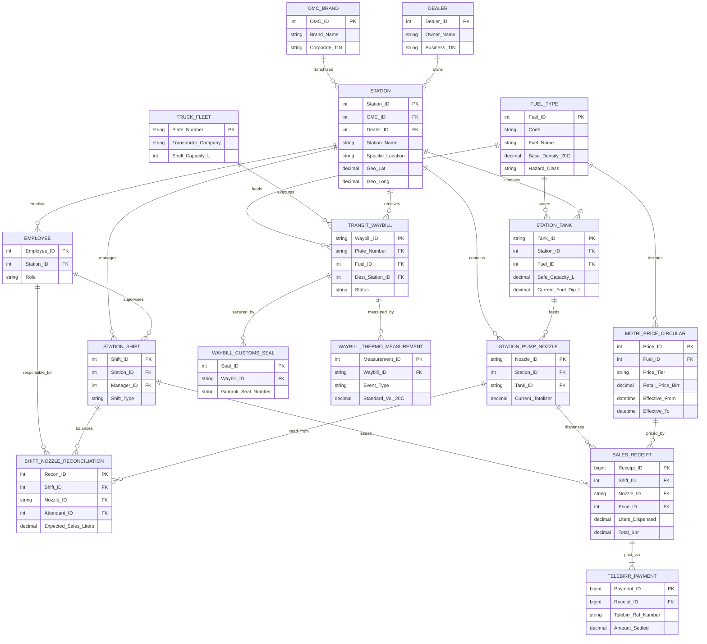

## Part 1: Logical Design (Tables & Rules)

### **Category A: Regulatory & Master Data**

#### **1. FUEL_TYPE**
| Fuel_ID (PK) | Code | Fuel_Name | Base_Density_20C | Hazard_Class |
| :
--- | :
--- | :
--- | :
--- | :
--- |
| 1 | MSR | Benzine | 0.7450 | Flammable |
| 2 | AGO | Nafta | 0.8400 | Combustible |
| 3 | IK | Kerosene | 0.8000 | Flammable |
| 4 | LFO | Light Fuel Oil | 0.8900 | Combustible |
| 5 | HFO | Heavy Fuel Oil | 0.9500 | Combustible |
| 6 | JETA1 | Aviation Fuel | 0.8040 | Flammable |

**Attribute Rules & Constraints:**
*   **Fuel_ID**: `INT`, Identity(1,1), Primary Key.
*   **Code**: `VARCHAR(10)`, Unique, Not Null.
*   **Fuel_Name**: `VARCHAR(50)`, Not Null.
*   **Base_Density_20C**: `DECIMAL(6,4)`, Not Null.
*   **Hazard_Class**: `VARCHAR(20)`, Default 'Flammable'.

#### **2. MOTRI_PRICE_CIRCULAR**
| Price_ID (PK) | Fuel_ID (FK) | Price_Tier | Retail_Price_Birr | Effective_From | Effective_To | MoTRI_Circular_Ref |
| :
--- | :
--- | :
--- | :
--- | :
--- | :
--- | :
--- |
| 101 | 1 | General | 82.50 | 2026-02-01 | NULL | MoTRI/Feb26/01 |
| 102 | 1 | Subsidized_Taxi | 65.00 | 2026-02-01 | NULL | MoTRI/Feb26/01 |
| 103 | 2 | NGO_Exempt | 70.00 | 2026-02-01 | NULL | MoTRI/Feb26/01 |

**Attribute Rules & Constraints:**
*   **Price_ID**: `INT`, Identity(1,1), Primary Key.
*   **Fuel_ID**: `INT`, Not Null, Foreign Key referencing `FUEL_TYPE`.
*   **Price_Tier**: `VARCHAR(20)`, Not Null, Check `IN ('General', 'Subsidized_Taxi', 'NGO_Exempt')`.
*   **Retail_Price_Birr**: `DECIMAL(10,2)`, Not Null, Check `> 0`.
*   **Effective_From**: `DATETIME`, Not Null.
*   **Effective_To**: `DATETIME`, Nullable.
*   **MoTRI_Circular_Ref**: `VARCHAR(50)`, Not Null.

---

### **Category B: Business Actors & Physical Infrastructure**

#### **3. OMC_BRAND**
| OMC_ID (PK) | Brand_Name | Corporate_TIN |
| :
--- | :
--- | :
--- |
| 1 | TotalEnergies | 0001112223 |
| 2 | NOC | 0004445556 |
| 3 | OLA Energy | 0007778889 |
| 4 | Yetebaberut | 0009990001 |
| 5 | TAF Oil | 0002223334 |

**Attribute Rules & Constraints:**
*   **OMC_ID**: `INT`, Identity(1,1), Primary Key.
*   **Brand_Name**: `VARCHAR(50)`, Unique, Not Null.
*   **Corporate_TIN**: `VARCHAR(15)`, Unique, Not Null.

#### **4. DEALER**
| Dealer_ID (PK) | Owner_Name | Business_TIN | Trade_License_No |
| :
--- | :
--- | :
--- | :
--- |
| 50 | Ato Dawit Bekele | 0009998887 | TL-AA-8837 |
| 51 | Tadesse & Sons PLC | 0003332221 | TL-OR-1122 |

**Attribute Rules & Constraints:**
*   **Dealer_ID**: `INT`, Identity(1,1), Primary Key.
*   **Owner_Name**: `VARCHAR(100)`, Not Null.
*   **Business_TIN**: `VARCHAR(15)`, Unique, Not Null.
*   **Trade_License_No**: `VARCHAR(50)`, Not Null.

#### **5. STATION**
| Station_ID (PK) | OMC_ID (FK) | Dealer_ID (FK) | Station_Name | Specific_Location | City | Geo_Lat | Geo_Long |
| :
--- | :
--- | :
--- | :
--- | :
--- | :
--- | :
--- | :
--- |
| 1001 | 1 | 50 | Total Bole Atlas | Atlas Traffic Light Left | Addis Ababa | 9.001234 | 38.785612 |
| 1002 | 2 | 51 | NOC Bole Medhanealem | Atlas Traffic Light Right | Addis Ababa | 9.001300 | 38.785690 |

**Attribute Rules & Constraints:**
*   **Station_ID**: `INT`, Identity(1,1), Primary Key.
*   **OMC_ID**: `INT`, Not Null, Foreign Key referencing `OMC_BRAND`.
*   **Dealer_ID**: `INT`, Not Null, Foreign Key referencing `DEALER`.
*   **Station_Name**: `VARCHAR(100)`, Not Null.
*   **Specific_Location**: `VARCHAR(150)`, Not Null.
*   **City**: `VARCHAR(50)`, Not Null.
*   **Geo_Lat**: `DECIMAL(9,6)`, Not Null.
*   **Geo_Long**: `DECIMAL(9,6)`, Not Null.

#### **6. STATION_TANK**
| Tank_ID (PK) | Station_ID (FK) | Fuel_ID (FK) | Safe_Capacity_L | Current_Fuel_Dip_L | Current_Water_Dip_mm |
| :
--- | :
--- | :
--- | :
--- | :
--- | :
--- |
| T-ATLAS-1 | 1001 | 1 | 50000.00 | 12450.00 | 5.00 |

**Attribute Rules & Constraints:**
*   **Tank_ID**: `VARCHAR(20)`, Primary Key.
*   **Station_ID**: `INT`, Not Null, Foreign Key referencing `STATION`.
*   **Fuel_ID**: `INT`, Not Null, Foreign Key referencing `FUEL_TYPE`.
*   **Safe_Capacity_L**: `DECIMAL(12,2)`, Not Null.
*   **Current_Fuel_Dip_L**: `DECIMAL(12,2)`, Not Null, Default 0.
*   **Current_Water_Dip_mm**: `DECIMAL(6,2)`, Not Null, Default 0.

#### **7. STATION_PUMP_NOZZLE**
| Nozzle_ID (PK) | Station_ID (FK) | Tank_ID (FK) | Island_Num | Current_Totalizer |
| :
--- | :
--- | :
--- | :
--- | :
--- |
| NZ-ATLAS-B1 | 1001 | T-ATLAS-1 | 1 | 1500200.00 |

**Attribute Rules & Constraints:**
*   **Nozzle_ID**: `VARCHAR(20)`, Primary Key.
*   **Station_ID**: `INT`, Not Null, Foreign Key referencing `STATION`.
*   **Tank_ID**: `VARCHAR(20)`, Not Null, Foreign Key referencing `STATION_TANK`.
*   **Island_Num**: `INT`, Not Null.
*   **Current_Totalizer**: `DECIMAL(18,2)`, Not Null, Default 0.

---

### **Category C: Transit, Thermodynamics & Gumruk**

#### **8. TRUCK_FLEET**
| Plate_Number (PK) | Transporter_Company | Shell_Capacity_L |
| :
--- | :
--- | :
--- |
| ET-03-A12345 | Geta Logistics PLC | 45000 |

**Attribute Rules & Constraints:**
*   **Plate_Number**: `VARCHAR(15)`, Primary Key.
*   **Transporter_Company**: `VARCHAR(100)`, Not Null.
*   **Shell_Capacity_L**: `INT`, Not Null.

#### **9. TRANSIT_WAYBILL**
| Waybill_ID (PK) | Plate_Number (FK) | Fuel_ID (FK) | Source_Depot | Dest_Station_ID (FK) | Dispatch_Time | Status |
| :
--- | :
--- | :
--- | :
--- | :
--- | :
--- | :
--- |
| WB-9912 | ET-03-A12345 | 1 | Awash Horizon | 1001 | 2026-02-21 | Offloaded |

**Attribute Rules & Constraints:**
*   **Waybill_ID**: `VARCHAR(50)`, Primary Key.
*   **Plate_Number**: `VARCHAR(15)`, Not Null, Foreign Key referencing `TRUCK_FLEET`.
*   **Fuel_ID**: `INT`, Not Null, Foreign Key referencing `FUEL_TYPE`.
*   **Source_Depot**: `VARCHAR(100)`, Not Null.
*   **Dest_Station_ID**: `INT`, Not Null, Foreign Key referencing `STATION`.
*   **Dispatch_Time**: `DATETIME`, Not Null.
*   **Status**: `VARCHAR(20)`, Check `IN ('In_Transit', 'Offloaded', 'Diverted')`.

#### **10. WAYBILL_CUSTOMS_SEAL**
| Seal_ID (PK) | Waybill_ID (FK) | Gumruk_Seal_Number | Placement_Location | Is_Intact_On_Arrival |
| :
--- | :
--- | :
--- | :
--- | :
--- |
| 1 | WB-9912 | GUM-88372 | Top Manhole 1 | 1 |

**Attribute Rules & Constraints:**
*   **Seal_ID**: `INT`, Identity(1,1), Primary Key.
*   **Waybill_ID**: `VARCHAR(50)`, Not Null, Foreign Key referencing `TRANSIT_WAYBILL`.
*   **Gumruk_Seal_Number**: `VARCHAR(50)`, Unique, Not Null.
*   **Placement_Location**: `VARCHAR(50)`, Not Null.
*   **Is_Intact_On_Arrival**: `BIT`, Nullable.

#### **11. WAYBILL_THERMO_MEASUREMENT**
| Measurement_ID (PK) | Waybill_ID (FK) | Event_Type | Observed_Temp_C | Observed_Volume_L | Standard_Vol_20C |
| :
--- | :
--- | :
--- | :
--- | :
--- | :
--- |
| 1 | WB-9912 | Load_Awash | 35.00 | 45000.00 | 44350.00 |

**Attribute Rules & Constraints:**
*   **Measurement_ID**: `INT`, Identity(1,1), Primary Key.
*   **Waybill_ID**: `VARCHAR(50)`, Not Null, Foreign Key referencing `TRANSIT_WAYBILL`.
*   **Event_Type**: `VARCHAR(20)`, Check `IN ('Load_Awash', 'Offload_Station')`.
*   **Observed_Temp_C**: `DECIMAL(5,2)`, Not Null.
*   **Observed_Volume_L**: `DECIMAL(12,2)`, Not Null.
*   **Standard_Vol_20C**: `DECIMAL(12,2)`, Not Null.

---

### **Category D: Digital Retail & Shifts**

#### **12. EMPLOYEE**
| Employee_ID (PK) | Station_ID (FK) | Full_Name | Role |
| :
--- | :
--- | :
--- | :
--- |
| 1 | 1001 | Marta Kebede | Nefash_Attendant |

**Attribute Rules & Constraints:**
*   **Employee_ID**: `INT`, Identity(1,1), Primary Key.
*   **Station_ID**: `INT`, Not Null, Foreign Key referencing `STATION`.
*   **Full_Name**: `VARCHAR(100)`, Not Null.
*   **Role**: `VARCHAR(30)`, Check `IN ('Station_Manager', 'Nefash_Attendant', 'Cashier')`.

#### **13. STATION_SHIFT**
| Shift_ID (PK) | Station_ID (FK) | Manager_ID (FK) | Shift_Type | Start_Time | End_Time | Status |
| :
--- | :
--- | :
--- | :
--- | :
--- | :
--- | :
--- |
| 1 | 1001 | 2 | Morning | 2026-02-22 | 2026-02-22 | Closed |

**Attribute Rules & Constraints:**
*   **Shift_ID**: `INT`, Identity(1,1), Primary Key.
*   **Station_ID**: `INT`, Not Null, Foreign Key referencing `STATION`.
*   **Manager_ID**: `INT`, Not Null, Foreign Key referencing `EMPLOYEE`.
*   **Shift_Type**: `VARCHAR(20)`, Check `IN ('Morning', 'Afternoon', 'Night')`.
*   **Start_Time**: `DATETIME`, Not Null.
*   **End_Time**: `DATETIME`, Nullable.
*   **Status**: `VARCHAR(20)`, Check `IN ('Open', 'Reconciled', 'Closed')`.

#### **14. SHIFT_NOZZLE_RECONCILIATION**
| Recon_ID (PK) | Shift_ID (FK) | Nozzle_ID (FK) | Attendant_ID (FK) | Start_Totalizer | End_Totalizer | Expected_Sales_Liters |
| :
--- | :
--- | :
--- | :
--- | :
--- | :
--- | :
--- |
| 1 | 1 | NZ-ATLAS-B1 | 1 | 1500200.00 | 1500220.00 | 20.00 |

**Attribute Rules & Constraints:**
*   **Recon_ID**: `INT`, Identity(1,1), Primary Key.
*   **Shift_ID**: `INT`, Not Null, Foreign Key referencing `STATION_SHIFT`.
*   **Nozzle_ID**: `VARCHAR(20)`, Not Null, Foreign Key referencing `STATION_PUMP_NOZZLE`.
*   **Attendant_ID**: `INT`, Not Null, Foreign Key referencing `EMPLOYEE`.
*   **Start_Totalizer**: `DECIMAL(18,2)`, Not Null.
*   **End_Totalizer**: `DECIMAL(18,2)`, Nullable.
*   **Expected_Sales_Liters**: `DECIMAL(18,2)`, Nullable.

#### **15. SALES_RECEIPT**
| Receipt_ID (PK) | Shift_ID (FK) | Nozzle_ID (FK) | Price_ID (FK) | Customer_Plate | Liters_Dispensed | Total_Birr | MoR_FS_Receipt |
| :
--- | :
--- | :
--- | :
--- | :
--- | :
--- | :
--- | :
--- |
| 1 | 1 | NZ-ATLAS-B1 | 102 | AA-1-A12345 | 20.00 | 1300.00 | FS-ADD-0001882 |

**Attribute Rules & Constraints:**
*   **Receipt_ID**: `BIGINT`, Identity(1,1), Primary Key.
*   **Shift_ID**: `INT`, Not Null, Foreign Key referencing `STATION_SHIFT`.
*   **Nozzle_ID**: `VARCHAR(20)`, Not Null, Foreign Key referencing `STATION_PUMP_NOZZLE`.
*   **Price_ID**: `INT`, Not Null, Foreign Key referencing `MOTRI_PRICE_CIRCULAR`.
*   **Customer_Plate**: `VARCHAR(20)`, Nullable.
*   **Liters_Dispensed**: `DECIMAL(10,2)`, Not Null.
*   **Total_Birr**: `DECIMAL(12,2)`, Not Null.
*   **MoR_FS_Receipt**: `VARCHAR(50)`, Unique, Not Null.

#### **16. TELEBIRR_PAYMENT**
| Payment_ID (PK) | Receipt_ID (FK) | Telebirr_Ref_Number | Payer_Phone | Amount_Settled | Payment_Time |
| :
--- | :
--- | :
--- | :
--- | :
--- | :
--- |
| 1 | 1 | 9A8F7G6H5J | 0911223344 | 1300.00 | 2026-02-22 08:15:22 |

**Attribute Rules & Constraints:**
*   **Payment_ID**: `BIGINT`, Identity(1,1), Primary Key.
*   **Receipt_ID**: `BIGINT`, Not Null, Foreign Key referencing `SALES_RECEIPT`.
*   **Telebirr_Ref_Number**: `VARCHAR(50)`, Unique, Not Null.
*   **Payer_Phone**: `VARCHAR(20)`, Not Null.
*   **Amount_Settled**: `DECIMAL(12,2)`, Not Null.
*   **Payment_Time**: `DATETIME`, Default Current Timestamp.

---

## Part 2: Visual Diagram (Mermaid)



---

## Part 3: SQL Implementation Code

```sql
CREATE DATABASE Ethiopian_Fuel_SystemDB
GO

USE Ethiopian_Fuel_SystemDB
GO

CREATE TABLE FUEL_TYPE (
    Fuel_ID int IDENTITY(1,1) PRIMARY KEY,
    Code varchar(10) NOT NULL UNIQUE,
    Fuel_Name varchar(50) NOT NULL,
    Base_Density_20C decimal(6,4) NOT NULL,
    Hazard_Class varchar(20) DEFAULT 'Flammable'
);

CREATE TABLE MOTRI_PRICE_CIRCULAR (
    Price_ID int IDENTITY(1,1) PRIMARY KEY,
    Fuel_ID int NOT NULL,
    Price_Tier varchar(20) NOT NULL CHECK (Price_Tier IN ('General', 'Subsidized_Taxi', 'NGO_Exempt')),
    Retail_Price_Birr decimal(10,2) NOT NULL CHECK (Retail_Price_Birr > 0),
    Effective_From datetime NOT NULL,
    Effective_To datetime NULL,
    MoTRI_Circular_Ref varchar(50) NOT NULL,
    FOREIGN KEY (Fuel_ID) REFERENCES FUEL_TYPE(Fuel_ID)
);

CREATE TABLE OMC_BRAND (
    OMC_ID int IDENTITY(1,1) PRIMARY KEY,
    Brand_Name varchar(50) NOT NULL UNIQUE,
    Corporate_TIN varchar(15) NOT NULL UNIQUE
);

CREATE TABLE DEALER (
    Dealer_ID int IDENTITY(1,1) PRIMARY KEY,
    Owner_Name varchar(100) NOT NULL,
    Business_TIN varchar(15) NOT NULL UNIQUE,
    Trade_License_No varchar(50) NOT NULL
);

CREATE TABLE STATION (
    Station_ID int IDENTITY(1,1) PRIMARY KEY,
    OMC_ID int NOT NULL,
    Dealer_ID int NOT NULL,
    Station_Name varchar(100) NOT NULL,
    Specific_Location varchar(150) NOT NULL,
    City varchar(50) NOT NULL,
    Geo_Lat decimal(9,6) NOT NULL,
    Geo_Long decimal(9,6) NOT NULL,
    FOREIGN KEY (OMC_ID) REFERENCES OMC_BRAND(OMC_ID),
    FOREIGN KEY (Dealer_ID) REFERENCES DEALER(Dealer_ID)
);

CREATE TABLE STATION_TANK (
    Tank_ID varchar(20) PRIMARY KEY,
    Station_ID int NOT NULL,
    Fuel_ID int NOT NULL,
    Safe_Capacity_L decimal(12,2) NOT NULL,
    Current_Fuel_Dip_L decimal(12,2) NOT NULL DEFAULT 0.00,
    Current_Water_Dip_mm decimal(6,2) NOT NULL DEFAULT 0.00,
    FOREIGN KEY (Station_ID) REFERENCES STATION(Station_ID),
    FOREIGN KEY (Fuel_ID) REFERENCES FUEL_TYPE(Fuel_ID)
);

CREATE TABLE STATION_PUMP_NOZZLE (
    Nozzle_ID varchar(20) PRIMARY KEY,
    Station_ID int NOT NULL,
    Tank_ID varchar(20) NOT NULL,
    Island_Num int NOT NULL,
    Current_Totalizer decimal(18,2) NOT NULL DEFAULT 0.00,
    FOREIGN KEY (Station_ID) REFERENCES STATION(Station_ID),
    FOREIGN KEY (Tank_ID) REFERENCES STATION_TANK(Tank_ID)
);

CREATE TABLE TRUCK_FLEET (
    Plate_Number varchar(15) PRIMARY KEY,
    Transporter_Company varchar(100) NOT NULL,
    Shell_Capacity_L int NOT NULL
);

CREATE TABLE TRANSIT_WAYBILL (
    Waybill_ID varchar(50) PRIMARY KEY,
    Plate_Number varchar(15) NOT NULL,
    Fuel_ID int NOT NULL,
    Source_Depot varchar(100) NOT NULL,
    Dest_Station_ID int NOT NULL,
    Dispatch_Time datetime NOT NULL,
    Status varchar(20) DEFAULT 'In_Transit' CHECK (Status IN ('In_Transit', 'Offloaded', 'Diverted')),
    FOREIGN KEY (Plate_Number) REFERENCES TRUCK_FLEET(Plate_Number),
    FOREIGN KEY (Fuel_ID) REFERENCES FUEL_TYPE(Fuel_ID),
    FOREIGN KEY (Dest_Station_ID) REFERENCES STATION(Station_ID)
);

CREATE TABLE WAYBILL_CUSTOMS_SEAL (
    Seal_ID int IDENTITY(1,1) PRIMARY KEY,
    Waybill_ID varchar(50) NOT NULL,
    Gumruk_Seal_Number varchar(50) NOT NULL UNIQUE,
    Placement_Location varchar(50) NOT NULL,
    Is_Intact_On_Arrival bit NULL,
    FOREIGN KEY (Waybill_ID) REFERENCES TRANSIT_WAYBILL(Waybill_ID)
);

CREATE TABLE WAYBILL_THERMO_MEASUREMENT (
    Measurement_ID int IDENTITY(1,1) PRIMARY KEY,
    Waybill_ID varchar(50) NOT NULL,
    Event_Type varchar(20) CHECK (Event_Type IN ('Load_Awash', 'Offload_Station')),
    Observed_Temp_C decimal(5,2) NOT NULL,
    Observed_Volume_L decimal(12,2) NOT NULL,
    Standard_Vol_20C decimal(12,2) NOT NULL,
    FOREIGN KEY (Waybill_ID) REFERENCES TRANSIT_WAYBILL(Waybill_ID)
);

CREATE TABLE EMPLOYEE (
    Employee_ID int IDENTITY(1,1) PRIMARY KEY,
    Station_ID int NOT NULL,
    Full_Name varchar(100) NOT NULL,
    Role varchar(30) CHECK (Role IN ('Station_Manager', 'Nefash_Attendant', 'Cashier')),
    FOREIGN KEY (Station_ID) REFERENCES STATION(Station_ID)
);

CREATE TABLE STATION_SHIFT (
    Shift_ID int IDENTITY(1,1) PRIMARY KEY,
    Station_ID int NOT NULL,
    Manager_ID int NOT NULL,
    Shift_Type varchar(20) CHECK (Shift_Type IN ('Morning', 'Afternoon', 'Night')),
    Start_Time datetime NOT NULL,
    End_Time datetime NULL,
    Status varchar(20) DEFAULT 'Open' CHECK (Status IN ('Open', 'Reconciled', 'Closed')),
    FOREIGN KEY (Station_ID) REFERENCES STATION(Station_ID),
    FOREIGN KEY (Manager_ID) REFERENCES EMPLOYEE(Employee_ID)
);

CREATE TABLE SHIFT_NOZZLE_RECONCILIATION (
    Recon_ID int IDENTITY(1,1) PRIMARY KEY,
    Shift_ID int NOT NULL,
    Nozzle_ID varchar(20) NOT NULL,
    Attendant_ID int NOT NULL,
    Start_Totalizer decimal(18,2) NOT NULL,
    End_Totalizer decimal(18,2) NULL,
    Expected_Sales_Liters decimal(18,2) NULL,
    FOREIGN KEY (Shift_ID) REFERENCES STATION_SHIFT(Shift_ID),
    FOREIGN KEY (Nozzle_ID) REFERENCES STATION_PUMP_NOZZLE(Nozzle_ID),
    FOREIGN KEY (Attendant_ID) REFERENCES EMPLOYEE(Employee_ID)
);

CREATE TABLE SALES_RECEIPT (
    Receipt_ID bigint IDENTITY(1,1) PRIMARY KEY,
    Shift_ID int NOT NULL,
    Nozzle_ID varchar(20) NOT NULL,
    Price_ID int NOT NULL,
    Customer_Plate varchar(20) NULL,
    Liters_Dispensed decimal(10,2) NOT NULL,
    Total_Birr decimal(12,2) NOT NULL,
    Transaction_Time datetime DEFAULT GETDATE(),
    MoR_FS_Receipt varchar(50) NOT NULL UNIQUE,
    FOREIGN KEY (Shift_ID) REFERENCES STATION_SHIFT(Shift_ID),
    FOREIGN KEY (Nozzle_ID) REFERENCES STATION_PUMP_NOZZLE(Nozzle_ID),
    FOREIGN KEY (Price_ID) REFERENCES MOTRI_PRICE_CIRCULAR(Price_ID)
);

CREATE TABLE TELEBIRR_PAYMENT (
    Payment_ID bigint IDENTITY(1,1) PRIMARY KEY,
    Receipt_ID bigint NOT NULL,
    Telebirr_Ref_Number varchar(50) NOT NULL UNIQUE,
    Payer_Phone varchar(20) NOT NULL,
    Amount_Settled decimal(12,2) NOT NULL,
    Payment_Time datetime DEFAULT GETDATE(),
    FOREIGN KEY (Receipt_ID) REFERENCES SALES_RECEIPT(Receipt_ID)
);
```

---

## Part 4: Data Insertion Code (Real Ethiopian Context)

```sql
INSERT INTO FUEL_TYPE (Code, Fuel_Name, Base_Density_20C, Hazard_Class) VALUES 
('MSR', 'Benzine', 0.7450, 'Flammable'),
('AGO', 'Nafta', 0.8400, 'Combustible'),
('IK', 'Kerosene', 0.8000, 'Flammable'),
('LFO', 'Light Fuel Oil', 0.8900, 'Combustible'),
('HFO', 'Heavy Fuel Oil', 0.9500, 'Combustible'),
('JETA1', 'Aviation Fuel', 0.8040, 'Flammable');

INSERT INTO MOTRI_PRICE_CIRCULAR (Fuel_ID, Price_Tier, Retail_Price_Birr, Effective_From, MoTRI_Circular_Ref) VALUES 
(1, 'General', 82.50, '2026-02-01 00:00:00', 'MoTRI/Feb26/01'),
(1, 'Subsidized_Taxi', 65.00, '2026-02-01 00:00:00', 'MoTRI/Feb26/01'),
(2, 'General', 85.30, '2026-02-01 00:00:00', 'MoTRI/Feb26/01'),
(2, 'NGO_Exempt', 70.00, '2026-02-01 00:00:00', 'MoTRI/Feb26/01'),
(3, 'General', 75.00, '2026-02-01 00:00:00', 'MoTRI/Feb26/01');

INSERT INTO OMC_BRAND (Brand_Name, Corporate_TIN) VALUES 
('TotalEnergies', '0001112223'),
('NOC', '0004445556'),
('OLA Energy', '0007778889'),
('Yetebaberut', '0009990001'),
('TAF Oil', '0002223334');

INSERT INTO DEALER (Owner_Name, Business_TIN, Trade_License_No) VALUES 
('Ato Dawit Bekele', '0009998887', 'TL-AA-8837'),
('Tadesse & Sons PLC', '0003332221', 'TL-OR-1122'),
('Mekonnen Transport PLC', '0005556667', 'TL-DD-3344'),
('Ethio-Star Trading', '0008889990', 'TL-AA-9900'),
('Wro Sara Tadesse', '0001234567', 'TL-SD-5566');

INSERT INTO STATION (OMC_ID, Dealer_ID, Station_Name, Specific_Location, City, Geo_Lat, Geo_Long) VALUES 
(1, 1, 'Total Bole Atlas', 'Atlas Traffic Light Left', 'Addis Ababa', 9.001234, 38.785612),
(2, 2, 'NOC Bole Medhanealem', 'Atlas Traffic Light Right', 'Addis Ababa', 9.001300, 38.785690),
(4, 3, 'YBP Bishoftu Highway', 'Expressway Toll Gate Area', 'Bishoftu', 8.749210, 38.995021),
(3, 4, 'OLA Energy Gotera', 'Gotera Interchange South', 'Addis Ababa', 8.981010, 38.761001),
(5, 5, 'TAF Oil Hawassa', 'Piassa Main Road', 'Hawassa', 7.050444, 38.476001);

INSERT INTO STATION_TANK (Tank_ID, Station_ID, Fuel_ID, Safe_Capacity_L, Current_Fuel_Dip_L, Current_Water_Dip_mm) VALUES 
('T-ATLAS-B1', 1, 1, 50000.00, 2000.00, 5.00),
('T-ATLAS-D1', 1, 2, 50000.00, 38200.00, 2.00),
('T-ATLAS-K1', 1, 3, 25000.00, 5000.00, 0.00),
('T-NOC-B1', 2, 1, 50000.00, 4500.00, 10.00),
('T-GOT-D1', 4, 2, 100000.00, 85000.00, 4.00);

INSERT INTO STATION_PUMP_NOZZLE (Nozzle_ID, Station_ID, Tank_ID, Island_Num, Current_Totalizer) VALUES 
('NZ-ATLAS-B1', 1, 'T-ATLAS-B1', 1, 1500200.00),
('NZ-ATLAS-D1', 1, 'T-ATLAS-D1', 1, 800450.00),
('NZ-ATLAS-K1', 1, 'T-ATLAS-K1', 2, 45000.00),
('NZ-NOC-B1', 2, 'T-NOC-B1', 1, 200500.00),
('NZ-GOT-D1', 4, 'T-GOT-D1', 1, 3000500.00);

INSERT INTO TRUCK_FLEET (Plate_Number, Transporter_Company, Shell_Capacity_L) VALUES 
('ET-03-A12345', 'Geta Logistics PLC', 45000),
('ET-03-B98765', 'Weyra Transport SC', 60000),
('ET-03-C55443', 'Abay Freight', 45000),
('ET-03-D11223', 'National Transport', 45000),
('ET-03-E99887', 'Ethio Logistics', 60000);

INSERT INTO TRANSIT_WAYBILL (Waybill_ID, Plate_Number, Fuel_ID, Source_Depot, Dest_Station_ID, Dispatch_Time, Status) VALUES 
('WB-1001', 'ET-03-A12345', 1, 'Awash Horizon', 1, '2026-02-21 06:00:00', 'Offloaded'),
('WB-1002', 'ET-03-B98765', 2, 'Awash Horizon', 5, '2026-02-22 05:30:00', 'In_Transit'),
('WB-1003', 'ET-03-C55443', 1, 'Sululta Depot', 2, '2026-02-22 08:00:00', 'Diverted'),
('WB-1004', 'ET-03-D11223', 2, 'Awash Horizon', 3, '2026-02-21 10:00:00', 'Offloaded'),
('WB-1005', 'ET-03-E99887', 3, 'Awash Horizon', 1, '2026-02-20 14:00:00', 'Offloaded');

INSERT INTO WAYBILL_CUSTOMS_SEAL (Waybill_ID, Gumruk_Seal_Number, Placement_Location, Is_Intact_On_Arrival) VALUES 
('WB-1001', 'GUM-88372', 'Top Manhole 1', 1),
('WB-1001', 'GUM-88373', 'Bottom Valve', 1),
('WB-1004', 'GUM-99441', 'Top Manhole 1', 1),
('WB-1004', 'GUM-99442', 'Bottom Valve', 1),
('WB-1005', 'GUM-77553', 'Top Manhole 1', 1);

INSERT INTO WAYBILL_THERMO_MEASUREMENT (Waybill_ID, Event_Type, Observed_Temp_C, Observed_Volume_L, Standard_Vol_20C) VALUES 
('WB-1001', 'Load_Awash', 35.00, 45000.00, 44350.00),
('WB-1001', 'Offload_Station', 16.00, 44200.00, 44350.00),
('WB-1004', 'Load_Awash', 34.00, 45000.00, 44400.00),
('WB-1004', 'Offload_Station', 22.00, 44450.00, 44400.00),
('WB-1005', 'Load_Awash', 36.00, 60000.00, 59100.00);

INSERT INTO EMPLOYEE (Station_ID, Full_Name, Role) VALUES 
(1, 'Samuel Manager', 'Station_Manager'),
(1, 'Marta Kebede', 'Nefash_Attendant'),
(1, 'Yonas Alemu', 'Nefash_Attendant'),
(2, 'Sara Manager', 'Station_Manager'),
(4, 'Dawit Haile', 'Nefash_Attendant');

INSERT INTO STATION_SHIFT (Station_ID, Manager_ID, Shift_Type, Start_Time, End_Time, Status) VALUES 
(1, 1, 'Morning', '2026-02-22 06:00:00', '2026-02-22 14:00:00', 'Reconciled'),
(1, 1, 'Afternoon', '2026-02-22 14:00:00', NULL, 'Open'),
(2, 4, 'Morning', '2026-02-22 06:00:00', '2026-02-22 14:00:00', 'Closed'),
(4, 5, 'Night', '2026-02-21 22:00:00', '2026-02-22 06:00:00', 'Reconciled'),
(1, 1, 'Night', '2026-02-21 22:00:00', '2026-02-22 06:00:00', 'Reconciled');

INSERT INTO SALES_RECEIPT (Shift_ID, Nozzle_ID, Price_ID, Customer_Plate, Liters_Dispensed, Total_Birr, MoR_FS_Receipt) VALUES 
(1, 'NZ-ATLAS-B1', 1, 'AA-2-A12345', 20.00, 1650.00, 'FS-ADD-001001'),
(1, 'NZ-ATLAS-B1', 2, 'AA-1-B98765', 30.00, 1950.00, 'FS-ADD-001002'),
(1, 'NZ-ATLAS-D1', 3, 'AA-3-C55443', 100.00, 8530.00, 'FS-ADD-001003'),
(1, 'NZ-ATLAS-K1', 5, NULL, 10.00, 750.00, 'FS-ADD-001004'),
(1, 'NZ-ATLAS-D1', 4, 'UN-11-22', 50.00, 3500.00, 'FS-ADD-001005');

INSERT INTO TELEBIRR_PAYMENT (Receipt_ID, Telebirr_Ref_Number, Payer_Phone, Amount_Settled) VALUES 
(1, '9A8F7G6H5J', '0911223344', 1650.00),
(2, '9B2X4Y6Z8W', '0922334455', 1950.00),
(3, '9C3P5Q7R9T', '0933445566', 8530.00),
(4, '9D4M6N8L0K', '0944556677', 750.00),
(5, '9E5V7W9X1Y', '0955667788', 3500.00);

INSERT INTO SHIFT_NOZZLE_RECONCILIATION (Shift_ID, Nozzle_ID, Attendant_ID, Start_Totalizer, End_Totalizer, Expected_Sales_Liters) VALUES 
(1, 'NZ-ATLAS-B1', 2, 1500200.00, 1500250.00, 50.00),
(1, 'NZ-ATLAS-D1', 3, 800450.00, 800600.00, 150.00),
(1, 'NZ-ATLAS-K1', 2, 45000.00, 45010.00, 10.00),
(3, 'NZ-NOC-B1', 4, 200500.00, 200600.00, 100.00),
(4, 'NZ-GOT-D1', 5, 3000500.00, 3001000.00, 500.00);

UPDATE STATION_PUMP_NOZZLE SET Current_Totalizer = 1500250.00 WHERE Nozzle_ID = 'NZ-ATLAS-B1';
UPDATE STATION_PUMP_NOZZLE SET Current_Totalizer = 800600.00 WHERE Nozzle_ID = 'NZ-ATLAS-D1';
UPDATE STATION_PUMP_NOZZLE SET Current_Totalizer = 45010.00 WHERE Nozzle_ID = 'NZ-ATLAS-K1';
UPDATE STATION_PUMP_NOZZLE SET Current_Totalizer = 200600.00 WHERE Nozzle_ID = 'NZ-NOC-B1';
UPDATE STATION_PUMP_NOZZLE SET Current_Totalizer = 3001000.00 WHERE Nozzle_ID = 'NZ-GOT-D1';
```