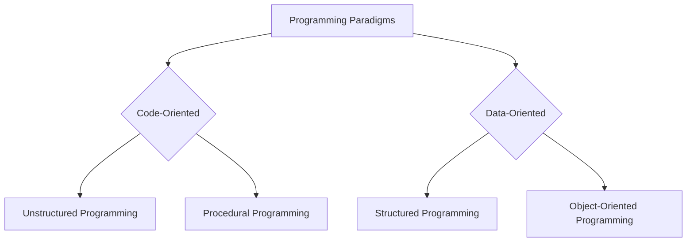
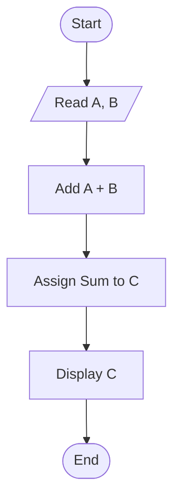
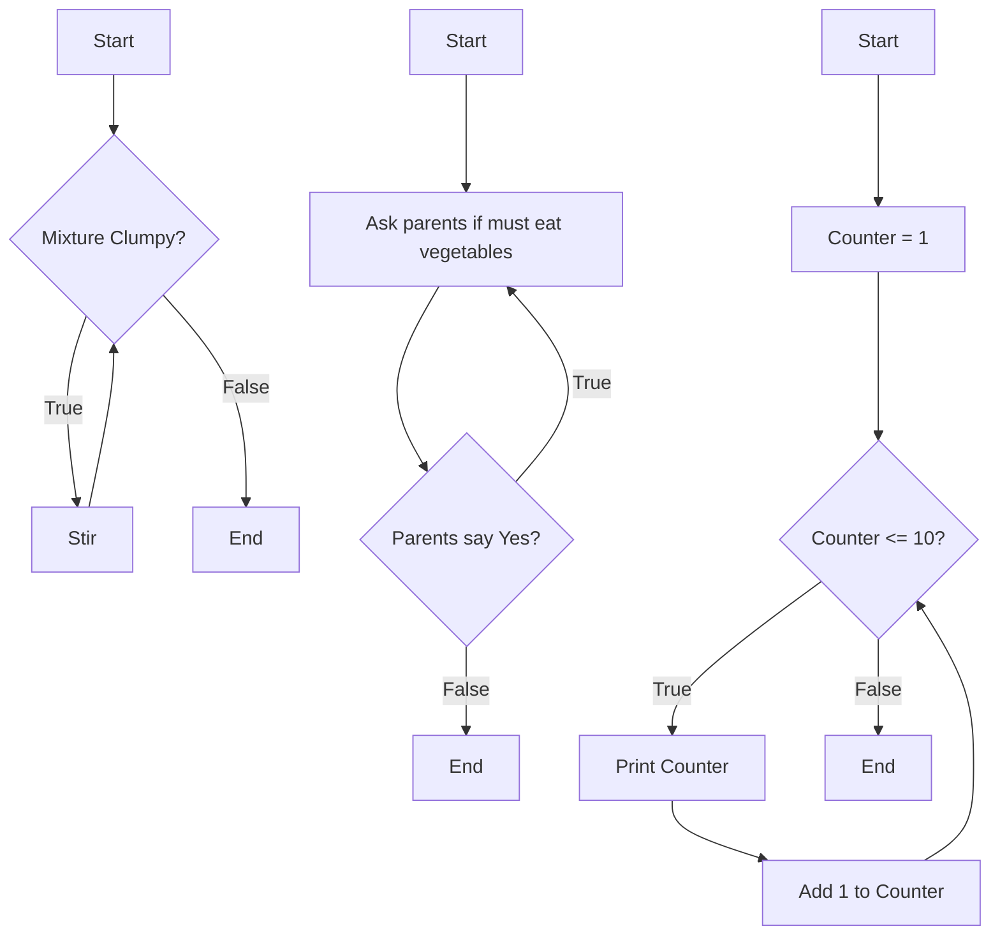
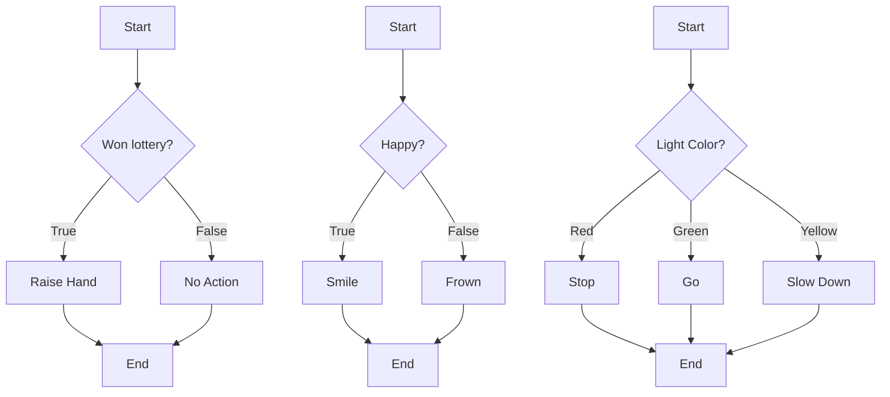
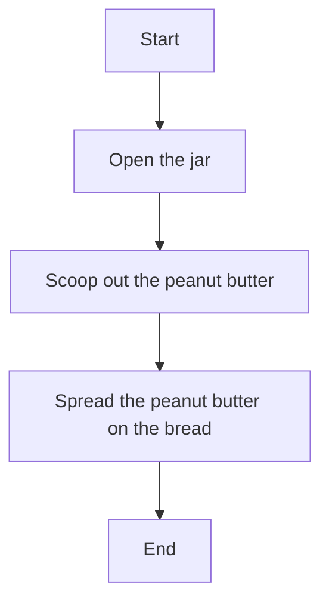

# 1 An Overview Of Programming

Comprehensive resource for 1 An Overview Of Programming.


---

## 1 An Overview Of Programming Hub


## Overview
This unit, "An Overview of Programming," provides a foundational introduction to the world of computer programming. It defines what a computer is, the essence of computer programs, and the process of computer programming itself. We will explore the multifaceted nature of programming as problem-solving, control, teaching, creativity, modeling, and abstraction. Furthermore, this unit delves into the distinct characteristics of programming languages, categorizing them into low-level and high-level types, and explaining the crucial processes of compilation and interpretation. A significant portion is dedicated to understanding various programming paradigms, including unstructured, procedural, structured, and object-oriented programming, highlighting their evolution and fundamental approaches to organizing code and data. Finally, the unit equips learners with essential problem-solving techniques, differentiating between algorithms and programs, and introducing core control structures—sequence, selection, and repetition—along with methods for representing algorithms such as pseudocode, flowcharts, and structure charts.

## Learning Objectives
*   Define a computer, computer program, and computer programming.
*   Articulate the various aspects of programming, including problem-solving, controlling, teaching, creativity, modeling, and abstraction.
*   Distinguish between syntax and semantics in programming languages.
*   Categorize and explain the differences between low-level (machine and assembly) and high-level programming languages.
*   Compare and contrast program compilation and interpretation, including their respective processes and analogies.
*   Identify and describe various programming paradigms, including unstructured, procedural, structured, and object-oriented programming.
*   Explain the core problem-solving techniques in programming, differentiating between algorithms and programs.
*   Describe and apply the three fundamental control structures: sequence, selection, and repetition.
*   Represent algorithms using pseudocode, flowcharts, and structure charts.

## Unit Applications & Real-World Relevance
Understanding the fundamentals of programming is crucial for anyone venturing into technology, regardless of their specific role. From developing mobile applications and designing websites to managing databases and building artificial intelligence systems, the principles covered in this unit form the bedrock. For aspiring software engineers, grasping concepts like programming paradigms and control structures is essential for writing efficient, maintainable, and scalable code. Even for those in non-coding roles, a solid grasp of computational thinking—how computers "think" and execute instructions—is invaluable for logical problem-solving in any domain. This unit lays the groundwork for understanding how software powers everything from smart devices to complex industrial systems.

## Active Learning Prompts
*   Consider a simple, everyday task (e.g., making coffee). Describe this task first as an "unstructured program," then as a "procedural program," and finally, imagine how an "object-oriented program" might model it.
*   If you had to explain the difference between a "compiler" and an "interpreter" to someone with no computer knowledge, what real-world analogy would you use, and why?
*   Think of a common logical decision you make daily (e.g., choosing what to wear based on weather). How would you represent this decision using the three control structures: sequence, selection, and repetition?
*   Research a relatively new programming language. Which programming paradigm(s) does it primarily follow, and why do you think its creators chose that approach?
*   Examine a simple household appliance. How might its internal "programming" utilize concepts like problem-solving, control structures, and perhaps even a basic form of object-oriented thinking?

## Unit Challenges & Common Misconceptions
A common challenge in this unit is grasping the abstract nature of programming concepts, especially for novices. Students often conflate algorithms with programs, failing to understand that an algorithm is the logical plan, while a program is its concrete implementation. Another misconception is that all programming languages are fundamentally similar; understanding the nuances between low-level and high-level languages, and the impact of different paradigms, requires careful study. Debugging, a critical skill introduced here, is often underestimated in its complexity. Learners frequently struggle with the precise syntax and semantics required by computers, leading to frustration when programs don't behave as expected.

## Connections
  - [[What_Is_Programming]]
    - [[Computer_Programs_and_Source_Code]]
      - [[Programming_Languages_Introduction]]
        - [[Low_Level_Languages]]
        - [[High_Level_Languages]]
    - [[Compilation_vs_Interpretation]]
  - [[Programming_Paradigms]]
    - [[Unstructured_Programming]]
    - [[Procedural_Programming]]
    - [[Structured_Programming]]
    - [[Object_Oriented_Programming_OOP]]
  - [[Problem_Solving_Techniques_in_Programming]]
    - [[Algorithms_and_Programs]]
    - [[Control_Structures_Overview]]
      - [[Sequence_Control_Structure]]
      - [[Selection_Control_Structure]]
      - [[Repetition_Control_Structure]]
    - [[Algorithm_Representation_Pseudocode]]
    - [[Algorithm_Representation_Flowchart]]
    - [[Algorithm_Representation_Structure_Chart]]

## Next Steps for Deeper Understanding
To further deepen your understanding, consider exploring the history of computing and how early programming languages like Fortran and COBOL shaped modern paradigms. Investigate the rise of specific languages like Python or JavaScript and how their design principles reflect different programming philosophies. Engage with introductory coding challenges online to apply the concepts of control structures and algorithm design in a practical context. Delve into basic data structures to see how programs efficiently store and manage information.

## Possible Questions
[[CS1220_1_An_Overview_of_Programming_Possible_Questions]]

---

---

## Computer Programs And Source Code


## Definition
Before proceeding, ensure you master [[What_Is_Programming]] and [[Programming_Languages_Introduction]].
A "computer program" is fundamentally a set of instructions that dictates a computer's processing of data, enabling it to perform computations and make logical decisions. These instructions, written by programmers in a specific programming language, are collectively known as "source code." In essence, source code is the human-readable blueprint that defines the computer's behavior. A simpler way to think about it is like a recipe for a cake: the recipe is the program, and each ingredient (data) and step (code) is part of its source.

## The Mental Model
Imagine you're building a LEGO spaceship. The "computer program" is the entire instruction manual that came with the LEGO set. Each individual step, like "Attach piece A to piece B," is an instruction. The actual LEGO bricks you're using are the "data" – they have characteristics like color and shape. The "source code" is the entire collection of these instructions, written down in a language you can understand (English, with diagrams). You follow the instructions exactly, and the result is the completed spaceship (the meaningful information).

## Context & Framework
#### Opening the Hood: What's Inside?
A computer program, often written by professionals known as Computer Programmers, is a meticulous artifact comprising two fundamental elements: **data** and **code**. **Data** represents the characteristics or information that the program will process or manipulate (e.g., numbers, text, images). **Code** comprises the actions or operations that the program will perform on that data (e.g., calculations, comparisons, input/output). These elements are inextricably linked, with the code acting upon the data to achieve the program's objectives. Understanding this dual composition is crucial for comprehending how any software functions.

## The Mastery Deep Dive
#### The Dual Nature: Data and Code
Every computer program, regardless of its complexity or the language it's written in, is composed of two primary elements: data and code. Data refers to the raw facts, figures, or information that the program operates on. This could be anything from a user's name, a numerical value, or an entire database. Code, on the other hand, consists of the instructions that tell the computer *how* to manipulate that data. These instructions define actions like "add these two numbers," "store this text," or "display this image." The interplay between data and code is fundamental: code gives data meaning by transforming it, and data provides the necessary context for code to execute. Without either, a program cannot function.

#### The Life Cycle of Source Code
Source code is the human-readable text written in a programming language. It is the initial form of a program. Once written, this source code undergoes a transformation process (either compilation or interpretation, discussed in [[Compilation_vs_Interpretation]]) to become executable by the computer. The instructions in the source code define a sequence of steps. The computer then "executes" this program by carrying out these individual instructions mechanically and unambiguously. This mechanical execution ensures that the computer does exactly what it is told, without deviation or interpretation of intent. The clarity and correctness of the source code are paramount for a program to function reliably.

## Constraints & Limitations
#### The Computer's Literal Interpretation
A critical constraint of computer programs is that computers execute instructions with absolute literalness. They do **exactly** what they are told to do, without inferring meaning or correcting perceived errors in logic. This means that if source code contains a flaw, even a seemingly minor one, the computer will faithfully execute that flawed instruction, potentially leading to incorrect results or program crashes. This literal interpretation demands meticulous precision from programmers, as even a misplaced comma or an incorrect operator can drastically alter a program's behavior. The lack of ambiguity is both a strength (predictable execution) and a challenge (zero tolerance for error).

## Significance & Application
Computer programs are the backbone of all modern technology, from the simplest calculator to the most complex artificial intelligence. They encapsulate human logic and intent into a machine-executable form, automating tasks, processing vast amounts of information, and enabling interaction with digital devices. Understanding the concepts of programs and source code is foundational for anyone involved in software development, cybersecurity, data science, or any field reliant on computational systems. It provides insight into how digital tools are built and how they operate.

## The Worked Example
This example demonstrates the basic elements of a simple computer program: data and code.

Let's imagine we want a program to calculate the hypotenuse of a right-angled triangle.

1.  **Defining the Data:**
    *   We need two pieces of data: the length of the `opposite` side and the length of the `adjacent` side.
    *   Let's say `opposite = 3` and `adjacent = 4`. These are our input data values.

2.  **Writing the Code (Source Code Snippet - Python):**

```python
    import math

    # Data - characteristics
    opposite_side = 3
    adjacent_side = 4

    # Code - action (calculation)
    # The hypotenuse formula: sqrt(opposite^2 + adjacent^2)
    hypotenuse = math.sqrt(opposite_side * opposite_side + adjacent_side * adjacent_side)

    # Code - action (output)
    print(f"The hypotenuse is: {hypotenuse}")
```
```text
    // Scenario 1: Input sides 3 and 4
    // Output:
    // The hypotenuse is: 5.0

    // Scenario 2: Input sides 5 and 12
    // Output:
    // The hypotenuse is: 13.0
```
    *Note: This Python code snippet illustrates how `data` (e.g., `opposite_side`, `adjacent_side`) are manipulated by `code` (e.g., `math.sqrt()`, `*`, `+`, `print()`) to produce a result.*

3.  **Execution by Computer:**
    *   The computer takes the `opposite_side` (3) and `adjacent_side` (4).
    *   It squares each, adds them, takes the square root, and assigns the result (5.0) to `hypotenuse`.
    *   Finally, it prints "The hypotenuse is: 5.0" to the user.

In this simple program, `opposite_side`, `adjacent_side`, and `hypotenuse` are the **data**, while the lines performing calculations (`math.sqrt(...)`) and output (`print(...)`) are the **code**. This entire textual representation is the **source code**.

## The Proving Ground
*Test your mastery. Cover the solutions below to test yourself first.*

#### Level 1: The Sanity Check (Verification)
**The Question:** What are the two essential elements that typically constitute a computer program, and what role does each play?
> **Solution:** The two essential elements are **Data** and **Code**. **Data** represents the information or characteristics that the program processes or manipulates. **Code** consists of the instructions that define the actions the computer takes on that data.

#### Level 2: The Crucible (Mastery & Edge Cases)
**The Scenario:** A new programmer writes what they believe is a complete program that is supposed to calculate the average of three numbers. However, when executed, the computer produces an unexpected error message that says "NameError: name 'num1' is not defined." Based on your understanding of source code and execution, explain the most likely root cause of this error.
> **Solution:** This `NameError` indicates that the **code** is attempting to use a **data** element (a variable named `num1`) that has not been explicitly defined or assigned a value in the **source code** before its use. The computer, during execution, literally follows instructions. If an instruction refers to a variable it hasn't been "told" about yet, it cannot proceed. This highlights the computer's literal interpretation of source code: every piece of data must be declared and accessible before the code tries to act on it. The programmer likely forgot to initialize or declare `num1` before trying to perform an operation with it.

## Key Takeaways
*   Computer programs are sets of instructions controlling data processing, while source code is their human-readable form.
*   Every program fundamentally comprises `data` (characteristics) and `code` (actions), which work together to achieve tasks.
*   Computers execute source code literally, demanding absolute precision and unambiguous instructions from programmers.

## Knowledge Graph Connections
| Concept                     | Connection / Relationship                                                                   |
| :
-------------------------- | :
------------------------------------------------------------------------------------------ |
| [[What_Is_Programming]]     | Computer programs are the output of the programming process.                                |
| [[Programming_Languages_Introduction]] | Source code is written in one of many programming languages.                                |
| [[Compilation_vs_Interpretation]] | Source code is translated into machine language through compilation or interpretation.     |
| [[Problem_Solving_Techniques_in_Programming]] | Programs are the implementation of logical solutions to problems.                           |
---

---

## Control Structures Overview


## Definition
Before proceeding, ensure you master [[Problem_Solving_Techniques_in_Programming]] and [[Algorithms_and_Programs]].
"Control structures" are fundamental programming constructs that dictate the order in which instructions or statements are executed within a program. They allow programmers to define non-linear execution paths, enabling programs to make decisions, repeat actions, or execute steps in a specific sequence. There are three primary types: sequence, selection (or decision), and repetition (or loop). These structures are the building blocks for implementing any algorithm's logic. A simpler analogy is the grammar of a set of instructions: they tell you when to do step 1, when to choose between A or B, and when to repeat step X until a condition is met.

## The Mental Model
Imagine you're guiding a robotic assistant to perform a series of household chores.
*   **Sequence:** "First, wipe the table. Second, vacuum the floor. Third, wash the dishes." (Instructions executed one after another.)
*   **Selection:** "IF the dirty laundry basket is full, THEN run the washing machine. ELSE, proceed to the next chore." (Decision-making based on a condition.)
*   **Repetition:** "WHILE there are still dirty dishes in the sink, wash one dish." (Repeating an action until a condition is no longer true.)
These "control structures" are the specific commands you give to dictate the robot's flow of actions, ensuring it performs tasks logically and efficiently.

## Context & Framework
#### The Family Tree: Control Structures
Control structures are the foundational elements that define the flow of execution within any program. They provide the means to dictate *which* instruction should be done next, allowing for dynamic and intelligent program behavior. There are three core categories of control structures:
1.  **Sequence:** This is the most basic, where instructions are executed one after another in the order they appear.
2.  **Selection:** These structures allow a program to make choices, executing different blocks of code based on whether a given condition is true or false. This includes constructs like `if`, `if-else`, and `switch`.
3.  **Repetition:** These structures enable a program to repeat a block of code multiple times, either for a fixed count or while a certain condition remains true. This includes `while`, `do-while`, and `for` loops.
These three structures are universal building blocks, capable of expressing any possible algorithm, making them indispensable for translating logical procedures into executable code.

```mermaid
graph TD
    A[Control Structures] --> B[Sequence];
    A --> C[Selection];
    A --> D[Repetition];

    C --> C1[Single Selection (if)];
    C --> C2[Double Selection (if-else)];
    C --> C3[Multiple Selection (switch)];

    D --> D1[While Loop];
    D --> D2[Do-While Loop];
    D --> D3[For Loop];
```
```text
// Scenario 1: Illustrating the hierarchy of control structures
// Output:
// (A visual representation of the graph diagram showing the hierarchy.)
// Control Structures branches into Sequence, Selection, and Repetition.
// Selection branches into Single Selection (if), Double Selection (if-else), and Multiple Selection (switch).
// Repetition branches into While Loop, Do-While Loop, and For Loop.
// This visual confirms the types and sub-types of control structures.

// Scenario 2: Focus on how each structure dictates flow
// Output:
// Control Structures:
// - Sequence: Linear, step-by-step execution.
// - Selection: Choose between options based on a condition.
//   - Single Selection (if): Execute block if true.
//   - Double Selection (if-else): Execute one block if true, another if false.
//   - Multiple Selection (switch): Execute block based on multiple possible values.
// - Repetition: Repeat an action while a condition is true or for a set count.
//   - While Loop: Repeat as long as condition is true (check before first iteration).
//   - Do-While Loop: Repeat at least once, then as long as condition is true (check after first iteration).
//   - For Loop: Repeat for a specific number of times or through a collection.
// This output describes the core function of each control structure.
```
*Note: This `graph TD` diagram illustrates the hierarchy of the three fundamental control structures and their subtypes, providing a visual overview of how program flow is managed.*

## The Mastery Deep Dive
#### Sequence: The Default Flow
The **sequence control structure** is the most basic and fundamental. It dictates that instructions within a program are executed one after another, in the exact order they appear in the source code. Unless explicitly altered by other control structures, a program will always follow a sequential flow. This linearity is intuitive for simple tasks and forms the backbone upon which more complex logic is built. For example, a program calculating the area of a rectangle would first take the length input, then the width input, then calculate the area, and finally display the result – all in a fixed, sequential order. Understanding sequence is crucial as it's the default behavior that other structures modify.

#### Selection: Making Decisions
**Selection control structures** allow programs to make decisions and choose different paths of execution based on conditions. These structures evaluate a boolean expression (true or false) and execute specific blocks of code accordingly.
*   **`if` (Single Selection):** Executes a block of code *only if* a condition is true. If false, it skips the block.
*   **`if-else` (Double Selection):** Executes one block of code if the condition is true, and a different block if the condition is false. It provides two mutually exclusive paths.
*   **`switch` (Multiple Selection):** Allows a program to choose among many different paths of execution based on the value of a single variable or expression. It's often used when there are several discrete cases to handle.
These structures are indispensable for creating programs that can respond dynamically to different inputs or situations, simulating decision-making capabilities.

#### Repetition: Performing Iterations
**Repetition control structures**, also known as loops, enable a program to execute a block of code multiple times. This is essential for tasks that require repeated operations, such as processing lists of items, performing calculations until a condition is met, or iterating through data sets.
*   **`while` loop:** Repeats a block of code *as long as* a specified condition remains true. The condition is checked *before* each iteration, so the loop might not execute even once if the condition is initially false.
*   **`do-while` loop:** Similar to a `while` loop, but the block of code is executed *at least once*, and then the condition is checked *after* each iteration to decide if the loop should continue.
*   **`for` loop:** Designed for iterating a specific number of times or iterating over elements in a collection. It typically combines initialization, condition checking, and iteration increment/decrement into a single statement.
These structures are vital for automating repetitive tasks, processing collections of data, and implementing iterative algorithms.

## Constraints & Limitations
#### Infinite Loops and Logical Errors
The use of control structures, particularly repetition (loops), introduces the critical constraint of potential **infinite loops** and difficult-to-diagnose **logical errors**. An infinite loop occurs when the condition that terminates a `while` or `for` loop never becomes false, causing the program to run indefinitely and consume resources. This is a common bug for beginners. Furthermore, complex nested selection or repetition structures can lead to intricate control flows that are hard to trace mentally, increasing cognitive load and making logical errors (where the program runs but produces incorrect results due to flawed decision logic) more probable. Mismatched conditions, incorrect loop bounds, or faulty decision criteria can introduce subtle bugs that are difficult to pinpoint and correct.

## Significance & Application
Control structures are the bedrock of all algorithmic implementation, enabling programmers to translate abstract logical plans into executable code. Without them, programs would be simple, linear sequences incapable of decision-making or repetitive tasks, severely limiting their utility. Academically, understanding control structures is foundational to learning any programming language and designing efficient algorithms. In practical application, they are ubiquitous: from iterating through database records in an enterprise application, validating user input in a web form, to controlling robotic movements in industrial automation. Mastery of control structures is synonymous with mastery of core programming logic.

## The Worked Example
This example illustrates the three control structures (sequence, selection, repetition) using a simplified conceptual task: counting from 1 to 10 and printing whether each number is even or odd.

**Objective:** Count from 1 to 10, and for each number, determine and print if it's even or odd.

```text
## Conceptual Algorithm using Control Structures

// Sequence (Implicit: instructions are executed top-down)
1.  Initialize counter = 1  // Sequence step
2.  Initialize limit = 10   // Sequence step

// Repetition (For loop equivalent)
3.  WHILE counter <= limit DO // Repetition condition
    // Sequence (Inside loop)
    4.  DISPLAY "Current number: ", counter // Sequence step

    // Selection
    5.  IF (counter MOD 2) == 0 THEN // Selection condition
        DISPLAY " - Even"
    ELSE
        DISPLAY " - Odd"
    END IF // End Selection

    // Sequence (Inside loop)
    6.  Increment counter by 1 // Sequence step
END WHILE // End Repetition

7.  DISPLAY "Counting complete!" // Sequence step
```
```text
// Scenario 1: Executing the counting and even/odd check
// Output:
// Current number: 1 - Odd
// Current number: 2 - Even
// Current number: 3 - Odd
// Current number: 4 - Even
// Current number: 5 - Odd
// Current number: 6 - Even
// Current number: 7 - Odd
// Current number: 8 - Even
// Current number: 9 - Odd
// Current number: 10 - Even
// Counting complete!
```
*Note: This pseudocode integrates sequence, selection (IF-ELSE), and repetition (WHILE loop) to perform the task.*

**Analysis of Control Structures Used:**

*   **Sequence:**
    *   `Initialize counter = 1` and `Initialize limit = 10` are executed sequentially at the start.
    *   `DISPLAY "Current number: ", counter` and `Increment counter by 1` are executed sequentially within each iteration of the loop.
    *   `DISPLAY "Counting complete!"` is executed sequentially after the loop finishes.
*   **Repetition:**
    *   The `WHILE counter <= limit DO ... END WHILE` loop structure dictates that the block of code inside it (`DISPLAY` current number, `IF-ELSE` check, `Increment counter`) will be repeated as long as `counter` is less than or equal to `limit` (i.e., from 1 to 10).
*   **Selection:**
    *   The `IF (counter MOD 2) == 0 THEN ... ELSE ... END IF` structure provides decision-making. For each `counter` value, it checks if it's even (remainder of division by 2 is 0). If true, it displays " - Even"; otherwise, it displays " - Odd."

This example demonstrates how these three fundamental control structures combine to create dynamic and intelligent program behavior beyond simple linear execution.

## The Proving Ground
*Test your mastery. Cover the solutions below to test yourself first.*

#### Level 1: The Sanity Check (Verification)
**The Question:** Identify the three fundamental control structures around which programs can be written.
> **Solution:** The three fundamental control structures are **Sequence**, **Selection** (or Decision), and **Repetition** (or Loop).

#### Level 2: The Crucible (Mastery & Edge Cases)
**The Scenario:** A new programmer is tasked with writing a simple program to calculate the average of all positive numbers entered by a user. The program should stop when the user enters a zero or a negative number. The programmer attempts to use a `while` loop for input but accidentally writes the condition such that the loop never terminates if the first number entered is positive. What common control structure constraint did they likely violate, and what is the specific term for the problem they created?
> **Solution:** The programmer likely violated the proper termination condition for a **repetition (loop) control structure**.
> The specific term for the problem they created is an **infinite loop**. This occurs when the condition that controls the `while` loop (e.g., `while number_is_positive`) remains perpetually true, causing the loop to execute indefinitely without a mechanism to make the condition false (like updating `number_is_positive` inside the loop with new input). The loop continues because the input or the condition for loop exit is not correctly managed within the loop's body.

## Key Takeaways
*   Control structures (sequence, selection, repetition) dictate the execution order of program instructions.
*   Sequence is linear execution; selection enables decision-making (if/else, switch); repetition allows looping (while, do-while, for).
*   Mismanagement of repetition conditions can lead to infinite loops and complex logical errors.

## Knowledge Graph Connections
| Concept                     | Connection / Relationship                                                                   |
| :
-------------------------- | :
------------------------------------------------------------------------------------------ |
| [[Problem_Solving_Techniques_in_Programming]] | Control structures are essential for implementing the logical procedures of problem-solving. |
| [[Algorithms_and_Programs]] | Algorithms are implemented using control structures to define their step-by-step instructions. |
| [[Sequence_Control_Structure]] | Sequence is the most basic control structure, defining linear execution flow.                 |
| [[Selection_Control_Structure]] | Selection allows programs to make decisions based on conditions.                              |
| [[Repetition_Control_Structure]] | Repetition enables programs to execute blocks of code multiple times.                         |
---

---

## Problem Solving Techniques In Programming


## Definition
Before proceeding, ensure you master [[What_Is_Programming]] and [[Algorithms_and_Programs]].
"Problem-solving techniques in programming" refer to the systematic approaches and methodologies used to identify a problem, devise a logical solution, and then translate that solution into a computer program. This process ensures that programs are not only functional but also reliable, maintainable, portable, and efficient. It involves two critical facts: defining the problem and logical procedures to solve it, and then communicating those procedures to a computer system for execution. A simpler analogy is planning a trip: you define your destination and itinerary (problem definition & logical procedures), then use a map and navigation system (communication to computer) to execute the journey.

## The Mental Model
Imagine you're a detective trying to solve a mystery. "Problem-solving techniques" are your detective toolkit:
1.  **Defining the Mystery (Defining the Problem):** What exactly happened? Who are the suspects? What are the clues? (Clearly articulate the programming challenge.)
2.  **Developing a Plan (Logical Procedures):** How will you collect evidence? What steps will you follow to interview suspects and analyze clues? (Design the algorithm, the step-by-step solution.)
3.  **Communicating the Plan (Program Implementation):** You write down your investigation plan in a clear, unambiguous report for your junior officers to follow. (Translate the algorithm into a program using a programming language.)
The goal is not just to "solve" the mystery, but to solve it in a way that is verifiable, efficient, and can be used again if a similar mystery arises.

## Context & Framework
#### Spot the Impostor: Qualities of a Good Program
Problem-solving in programming extends beyond merely finding a working solution; it aims for a solution embodied in a program that possesses specific qualities. Primarily, a good program should be **reliable**, meaning it produces consistent and correct results under various conditions. It should also be **maintainable**, easy to modify and update over its lifecycle. **Portability** is another key attribute, allowing the program to run on different computer systems with minimal changes. Finally, an effective program must be **efficient**, utilizing computational resources (time and memory) optimally. The process of problem-solving techniques ensures that programmers actively pursue these qualities during the design and implementation phases, rather than just delivering a piece of code that "works."

## The Mastery Deep Dive
#### Defining the Problem and Logical Procedures
The first, and arguably most crucial, step in problem-solving within programming is accurately **defining the problem**. This involves clearly understanding what the program is supposed to achieve, what inputs it will receive, what outputs it should produce, and any constraints or requirements. A poorly defined problem almost guarantees a flawed solution. Once the problem is clearly understood, the next step is to devise the **logical procedures to follow in solving it**. This is where an **algorithm** comes into play – a finite, step-by-step sequence of instructions that describes *how* the data is to be processed to produce the desired outputs. This algorithm is the blueprint, the abstract plan, before any code is written. It should be designed for correctness, clarity, and efficiency.

#### Communicating Procedures to the Computer System
After a problem is defined and a logical procedure (algorithm) is designed, the final critical step is **introducing the means by which programmers communicate those procedures to the computer system so that it can be executed**. This is where **programming languages** become essential. The chosen algorithm is translated into source code using a specific programming language, adhering to its syntax and semantics. This program then enables the computer to mechanically follow each step of the algorithm to accomplish the end goal. This communication must be unambiguous, as computers follow instructions literally. This entire cycle, from understanding the problem to deploying the executable program, constitutes effective problem-solving in programming.

## Constraints & Limitations
#### The Abstraction Barrier and Cognitive Load
A significant constraint in programming problem-solving is the "abstraction barrier" and the resulting cognitive load. Programmers must constantly switch between different levels of abstraction: understanding a real-world problem, translating it into an abstract algorithm, and then expressing that algorithm in a concrete programming language. Each step involves its own set of rules and considerations (e.g., mathematical logic for algorithms, syntax for code, system resources for efficiency). This continuous context-switching and the need for meticulous detail at each level can lead to significant cognitive load, making it challenging to maintain mental clarity and prevent errors, especially for complex problems or novice programmers. The more abstract the problem, the harder it can be to map it to concrete code.

## Significance & Application
Effective problem-solving techniques are the bedrock of all successful software development. They are not merely academic exercises but practical skills essential for creating robust, efficient, and maintainable software in any domain. Academically, they cultivate critical thinking, logical reasoning, and structured thought processes applicable far beyond computer science. In the real world, these techniques enable professionals to design innovative solutions for everything from optimizing business processes and analyzing scientific data to building secure communication systems and developing artificial intelligence. Mastery of problem-solving methodologies is often more valuable than knowing any single programming language, as it provides the foundation for adapting to new technologies and tackling unforeseen challenges.

## The Worked Example
This example illustrates the two facts of problem-solving: defining the problem and logical procedures, and then communicating them to the computer.

**Problem:** Calculate the final price of an item after sales tax.

1.  **Defining the Problem and Logical Procedures (Algorithm Description):**
    *   **Problem Definition:** Given the price of an item and a sales tax rate, determine the total cost including tax.
    *   **Inputs:** `price_of_item`, `sales_tax_rate`.
    *   **Output:** `final_price`.
    *   **Logical Procedures (Algorithm - Pseudocode):**

```text
        // Algorithm: Calculate Final Price with Sales Tax
        1.  GET price_of_item
        2.  GET sales_tax_rate
        3.  sales_tax = price_of_item * sales_tax_rate
        4.  final_price = price_of_item + sales_tax
        5.  DISPLAY final_price
        6.  STOP
```
```text
        // Scenario 1: Item price $100, tax rate 5%
        // Output:
        // Input price_of_item: 100
        // Input sales_tax_rate: 0.05
        // sales_tax = 5.0
        // final_price = 105.0
        // Display: 105.0
        // STOP

        // Scenario 2: Item price $50, tax rate 8%
        // Output:
        // Input price_of_item: 50
        // Input sales_tax_rate: 0.08
        // sales_tax = 4.0
        // final_price = 54.0
        // Display: 54.0
        // STOP
```
        *Note: This pseudocode outlines the clear, step-by-step logic.*

2.  **Introducing the Means to Communicate to the Computer (Program Implementation - Python):**

```python
    # Python Program to Calculate Final Price with Sales Tax

    # 1. Get price of item (Input)
    price_of_item_str = input("Enter price of item: ")
    price_of_item = float(price_of_item_str)

    # 2. Get sales tax rate (Input)
    sales_tax_rate_str = input("Enter sales tax rate (e.g., 0.05 for 5%): ")
    sales_tax_rate = float(sales_tax_rate_str)

    # 3. Calculate sales tax (Process)
    sales_tax = price_of_item * sales_tax_rate

    # 4. Calculate final price (Process)
    final_price = price_of_item + sales_tax

    # 5. Display final price (Output)
    print(f"The final price is: {final_price:.2f}") # Format to 2 decimal places

    # 6. (Implicit Stop in Python script execution)
```
```text
    // Scenario 1: User inputs 100 and 0.05
    // Output:
    // Enter price of item: 100
    // Enter sales tax rate (e.g., 0.05 for 5%): 0.05
    // The final price is: 105.00

    // Scenario 2: User inputs 50 and 0.08
    // Output:
    // Enter price of item: 50
    // Enter sales tax rate (e.g., 0.05 for 5%): 0.08
    // The final price is: 54.00
```
    *Note: This Python code is the concrete implementation of the algorithm, translating each step into a programming language that the computer can execute.*

This example clearly delineates the conceptual design phase (algorithm) from the concrete implementation phase (program), which are both critical parts of effective problem-solving in programming.

## The Proving Ground
*Test your mastery. Cover the solutions below to test yourself first.*

#### Level 1: The Sanity Check (Verification)
**The Question:** What are the two fundamental "facts" that define effective problem-solving in computer programming?
> **Solution:** The two fundamental facts are: 1) **Defining the problem and logical procedures to follow in solving it**, and 2) **Introducing the means by which programmers communicate those procedures to the computer system so that it can be executed.**

#### Level 2: The Crucible (Mastery & Edge Cases)
**The Scenario:** A new programmer rushes to code a solution for calculating student averages, immediately writing lines of code without first defining the inputs, expected outputs, or step-by-step logic. They encounter numerous bugs, incorrect results, and find it incredibly difficult to debug. Which of the two fundamental facts of problem-solving in programming did they neglect, and how did this neglect lead to their difficulties?
> **Solution:** The programmer neglected the first fundamental fact: **"Defining the problem and logical procedures to follow in solving it."**
>
> This neglect led to difficulties because:
> 1.  **Bugs and Incorrect Results:** Without clearly defining the problem (e.g., what constitutes an "average," how to handle missing grades) and outlining a precise, step-by-step algorithm, the programmer likely wrote code based on assumptions or incomplete logic. This directly results in a flawed program that produces bugs and incorrect results because the underlying plan was never validated.
> 2.  **Difficulty in Debugging:** An algorithm serves as a roadmap. Without this roadmap, debugging becomes a process of aimlessly searching for errors rather than comparing the program's behavior against a known, correct logical sequence. The programmer doesn't have a clear "correct" path to compare the program's execution against, making it nearly impossible to pinpoint where the code deviates from the intended (but unarticulated) logic. They are essentially debugging a problem they haven't fully understood or planned for.

## Key Takeaways
*   Problem-solving in programming involves defining the problem and logical procedures, then communicating them to a computer.
*   Good programs are reliable, maintainable, portable, and efficient, qualities nurtured through systematic problem-solving.
*   The process demands navigating abstraction barriers and managing cognitive load effectively.

## Knowledge Graph Connections
| Concept                     | Connection / Relationship                                                                   |
| :
-------------------------- | :
------------------------------------------------------------------------------------------ |
| [[What_Is_Programming]]     | Problem-solving is a core aspect and initial step of programming.                           |
| [[Algorithms_and_Programs]] | Problem-solving techniques lead to the development of algorithms, which are then implemented as programs. |
| [[Control_Structures_Overview]] | Logical procedures in problem-solving often utilize control structures to define execution flow. |
| [[Programming_Languages_Introduction]] | Programming languages are the means to communicate problem-solving procedures to computers. |
---

---

## Programming Paradigms


## Definition
Before proceeding, ensure you master [[What_Is_Programming]] and [[Computer_Programs_and_Source_Code]].
A "programming paradigm" is a fundamental style or approach to building the structure and elements of computer programs. It provides a conceptual framework for how programmers organize code and data, influencing how problems are decomposed and solved. Rather than being a specific language, it's a way of thinking about programming. Major paradigms include unstructured, procedural, structured, and object-oriented programming. A simpler way to think about it is different schools of thought for organizing your kitchen: one might arrange by cooking steps, another by ingredient type.

## The Mental Model
Imagine you're organizing a large, complex office. A "programming paradigm" is like the underlying philosophy you choose for how the office operates.
*   One paradigm might be: "Everyone just does their job, no strict rules, lots of shouting across desks." (This is like unstructured programming.)
*   Another: "We have clear departments, and tasks are passed from one department to the next in a sequence." (Procedural programming.)
*   Yet another: "Each department has its own internal rules and responsibilities, and they only interact through specific requests." (Object-oriented programming.)
The choice of philosophy deeply affects how efficiently tasks get done, how easily new people can join, and how adaptable the office is to change.

## Context & Framework
#### The Family Tree: Programming Paradigms
Programming paradigms represent distinct conceptual approaches to organizing software. They can be broadly categorized based on how they prioritize and structure program elements. Some approaches, known as **Process-Oriented**, conceptually organize the program around the code – focusing on *what is happening* as a series of linear steps where code acts on data. Examples include [[Unstructured_Programming]] and [[Procedural_Programming]]. In contrast, other approaches, particularly **Data-Oriented** paradigms, organize the program around the data – focusing on *who is being affected* and designing structures to manage increasing complexity, often emphasizing what the data structure *can do for you*. [[Object_Oriented_Programming_OOP]] is a prime example of this.


```text
// Scenario 1: Illustrating the hierarchy of programming paradigms
// Output:
// (A visual representation of the graph diagram showing the hierarchy.)
// Programming Paradigms branches into Code-Oriented and Data-Oriented.
// Code-Oriented branches into Unstructured Programming and Procedural Programming.
// Data-Oriented branches into Structured Programming and Object-Oriented Programming.
// This visual confirms the high-level classification of paradigms.

// Scenario 2: Focus on the conceptual split between "what" and "who"
// Output:
// Programming Paradigms:
// - Code-Oriented (focus on 'what' the code does, linear steps)
//   - Unstructured Programming
//   - Procedural Programming
// - Data-Oriented (focus on 'who' is affected, managing complexity around data)
//   - Structured Programming
//   - Object-Oriented Programming
// This output explains the core conceptual difference for each branch.
```
*Note: This `graph TD` illustrates the high-level classification of programming paradigms into Code-Oriented and Data-Oriented approaches, with examples of each.*

## The Mastery Deep Dive
#### Code-Oriented vs. Data-Oriented Approaches
Programming paradigms can be broadly classified by their primary focus: **code-oriented** or **data-oriented**. In code-oriented approaches (like Unstructured and Procedural Programming), the program is conceptually organized around the `code` – a sequence of instructions or procedures that act on data. The emphasis is on *what actions are being performed* and the flow of control through these actions. The data is often secondary and global. This model characterizes a program as a series of linear steps.

In contrast, data-oriented approaches (like Object-Oriented Programming and, to an extent, Structured Programming) organize the program around the `data`. The focus shifts to *who or what is being affected* – designing program elements (like objects) that encapsulate both data and the operations that can be performed on that data. This approach is designed to manage increasing complexity by asking "what can your data structure do for you?" rather than "what can your code do to your data structure?"

#### The Evolution of Paradigms: Managing Complexity
The evolution of programming paradigms reflects a continuous effort to better manage the inherent complexity of software development. Early paradigms (like Unstructured) were simple but quickly became unwieldy for larger projects due to code duplication and global data issues. Procedural programming introduced modularity with procedures, allowing code reuse. Structured programming further refined this by grouping related procedures and data into modules, emphasizing top-down design. Object-Oriented Programming (OOP) emerged to address challenges in managing complex data and behaviors, promoting encapsulation, inheritance, and polymorphism. Each new paradigm offered a more sophisticated framework for organizing programs, ultimately aiming to improve maintainability, scalability, and reusability of code.

## Constraints & Limitations
#### No Universal Best Paradigm
A crucial constraint regarding programming paradigms is that there is **no single "best" paradigm** that applies to all situations. Each paradigm has its strengths and weaknesses, making it more or less suitable for different types of problems, project sizes, and development teams. Forcing a specific paradigm onto a problem that is ill-suited for it can lead to over-engineering, increased complexity, or reduced performance. For example, while OOP is excellent for large, complex systems, it might introduce unnecessary overhead for a very simple scripting task where a procedural approach would be more straightforward and efficient. This necessitates that developers understand multiple paradigms and choose the most appropriate one based on context.

## Significance & Application
Understanding programming paradigms is vital for software developers as it informs fundamental design decisions and impacts the entire software development lifecycle. It helps in choosing the right language and architectural style for a project, designing scalable and maintainable systems, and collaborating effectively in teams. Academically, studying paradigms fosters a deeper understanding of computational models and the history of computer science. In practice, mastery of paradigms like object-oriented programming is a prerequisite for most modern software engineering roles, while understanding others (e.g., functional programming) expands a developer's problem-solving toolkit.

## The Worked Example
This example provides a conceptual illustration of how different programming paradigms would approach a simple task: calculating the area of various shapes.

**Objective:** Calculate the area of a rectangle and a circle.

1.  **Code-Oriented (Procedural Programming Concept):**
    In a procedural approach, you might have separate functions (procedures) that *act* on data.

```text
    # Procedural approach (Conceptual Pseudocode)

    PROCEDURE calculate_rectangle_area(length, width):
        RETURN length * width

    PROCEDURE calculate_circle_area(radius):
        PI = 3.14159
        RETURN PI * radius * radius

    # Main part of the program
    rectangle_length = 10
    rectangle_width = 5
    circle_radius = 7

    area1 = calculate_rectangle_area(rectangle_length, rectangle_width)
    area2 = calculate_circle_area(circle_radius)

    DISPLAY "Rectangle Area:", area1
    DISPLAY "Circle Area:", area2
```
```text
    // Scenario 1: Calculate areas
    // Output:
    // Rectangle Area: 50
    // Circle Area: 153.93791
```
    *Note: Here, the focus is on functions (procedures) that perform actions on input data.*

2.  **Data-Oriented (Object-Oriented Programming Concept):**
    In an object-oriented approach, you would define "objects" that encapsulate both data (characteristics like `length`, `width`, `radius`) and the operations (methods like `get_area()`) that act on that data.

```text
    # Object-Oriented approach (Conceptual Pseudocode)

    CLASS Rectangle:
        ATTRIBUTES:
            length
            width
        METHODS:
            CONSTRUCTOR(l, w):
                this.length = l
                this.width = w
            METHOD get_area():
                RETURN this.length * this.width

    CLASS Circle:
        ATTRIBUTES:
            radius
        METHODS:
            CONSTRUCTOR(r):
                this.radius = r
            METHOD get_area():
                PI = 3.14159
                RETURN PI * this.radius * this.radius

    # Main part of the program
    my_rectangle = NEW Rectangle(10, 5)
    my_circle = NEW Circle(7)

    area1 = my_rectangle.get_area()
    area2 = my_circle.get_area()

    DISPLAY "Rectangle Area:", area1
    DISPLAY "Circle Area:", area2
```
```text
    // Scenario 1: Calculate areas using objects
    // Output:
    // Rectangle Area: 50
    // Circle Area: 153.93791
```
    *Note: The focus shifts to defining objects (`Rectangle`, `Circle`) that inherently know how to calculate their own area, grouping data and behavior.*

This example illustrates that while both paradigms achieve the same result, their **conceptual organization** is fundamentally different. Procedural focuses on the `calculate_area` action as a separate entity, while OOP encapsulates the `get_area` action within the `Shape` object itself.

## The Proving Ground
*Test your mastery. Cover the solutions below to test yourself first.*

#### Level 1: The Sanity Check (Verification)
**The Question:** What is a "programming paradigm," and how does it fundamentally influence the organization of a computer program?
> **Solution:** A programming paradigm is a **fundamental style or approach** to building computer programs. It fundamentally influences the organization of a program by providing a **conceptual framework for how programmers organize code and data**, guiding how problems are decomposed and solved.

#### Level 2: The Crucible (Mastery & Edge Cases)
**The Scenario:** You are given a list of programming approaches: "focus on what is happening," "focus on who is being affected," "linear steps of code," "data and operations grouped." Sort these approaches into two categories, aligning them with code-centric and data-centric programming philosophies.
> **Solution:**
> **Code-Centric (Process-Oriented):**
> *   "Focus on what is happening"
> *   "Linear steps of code"
>
> **Data-Centric (Data-Oriented):**
> *   "Focus on who is being affected"
> *   "Data and operations grouped"

## Key Takeaways
*   Programming paradigms are fundamental styles that dictate how code and data are organized in a program.
*   They broadly categorize into code-oriented (e.g., procedural) focusing on actions, and data-oriented (e.g., object-oriented) focusing on data encapsulation.
*   The choice of paradigm impacts problem decomposition, complexity management, and software maintainability, with no single paradigm being universally superior.

## Knowledge Graph Connections
| Concept                     | Connection / Relationship                                                                   |
| :
-------------------------- | :
------------------------------------------------------------------------------------------ |
| [[Unstructured_Programming]] | Unstructured programming is an example of a code-oriented programming paradigm.              |
| [[Procedural_Programming]]  | Procedural programming is an example of a code-oriented programming paradigm.               |
| [[Structured_Programming]]  | Structured programming is an evolution within programming paradigms, bridging procedural and object-oriented. |
| [[Object_Oriented_Programming_OOP]] | Object-oriented programming is a prominent example of a data-oriented programming paradigm. |
---

---

## What Is Programming


## Definition
At its core, "programming" is the process of creating a precise set of instructions that a computer can follow to achieve a specific goal. This involves writing, testing, debugging, and maintaining the source code of computer programs. More simply, it's like teaching a very diligent, but unintelligent, robot exactly how to perform a task, step by step, using a language it understands.

## The Mental Model
Imagine you have a new puppy and you want to teach it a trick, like "fetch." Programming is akin to giving that puppy a very detailed, unambiguous set of commands: "Go to the ball," "Pick up the ball," "Bring the ball back," "Drop the ball." Each command must be clear, and the sequence matters. If you say "Drop the ball" before "Pick up the ball," the trick won't work. The computer is like the puppy – it needs explicit instructions for everything, and it will do *exactly* what you tell it to, no more, no less.

## Context & Framework
#### Spot the Impostor: Aspects of Programming
Programming is not a monolithic activity; it encompasses several distinct but interconnected aspects. It is fundamentally **problem solving**, aiming to make computers perform useful tasks. It is about **controlling** the computer to execute actions precisely. In a sense, it is **teaching** the computer new capabilities through explicit instructions. Programming is inherently **creative**, as it involves finding innovative solutions from numerous possibilities. It also involves **modeling** complex systems by representing their salient properties and behaviors. Finally, programming demands **abstraction**, focusing on important features without getting bogged down in excessive detail. Confusing these roles can lead to a misunderstanding of a programmer's full scope.

## The Mastery Deep Dive
#### Problem Solving as the Core
At the heart of programming lies problem-solving. This isn't just about finding a solution, but finding an *optimal* travel route, or sorting an array efficiently. It involves breaking down a large, complex problem into smaller, manageable sub-problems, each with its own logical steps. The goal is to design a sequence of operations that will transform input data into desired output, reliably and efficiently. This requires logical thinking, anticipation of different scenarios, and a structured approach to devising a solution.

#### Programming as Control and Teaching
A computer executes instructions mechanistically, performing exactly what it is told. This highlights programming as a means of **controlling** the computer's processing of data. Every instruction dictates an action or decision. Simultaneously, programming is **teaching**. Computers, by themselves, cannot perform new tasks unless explicitly instructed. Programmers teach computers new capabilities by providing detailed algorithms and logic, expanding their functional repertoire. This dual role of control and teaching underscores the precision and specificity required in writing code.

## Constraints & Limitations
#### The Unforgiving Nature of Ambiguity
The most significant constraint in programming is the computer's absolute inability to tolerate ambiguity. Unlike human communication, which relies on context and inference, a computer requires instructions that are **100% precise and unambiguous**. Any vagueness in syntax or semantics will lead to errors, as the machine cannot "guess" the programmer's intent. This forces programmers to adhere to strict grammatical rules (syntax) and ensure that each instruction has one clear, definite meaning (semantics). This constraint, while demanding, ensures predictable and consistent program execution.

## Significance & Application
Programming is the fundamental skill that drives the digital world. It is the language through which humans communicate with machines, enabling everything from operating systems and mobile applications to scientific simulations and artificial intelligence. Academically, it sharpens logical thinking, problem-solving abilities, and an understanding of computational processes. In the real world, programming is indispensable across virtually all industries, underpinning innovation in engineering, finance, medicine, entertainment, and countless other fields.

## The Worked Example
This section provides a conceptual example of how "programming" in its various aspects (problem-solving, control, teaching, creativity, modeling, abstraction) is applied in a real-world scenario.

Imagine the problem: **How to automatically sort a list of student grades from highest to lowest.**

1.  **Problem Solving:**
    *   **Goal:** Arrange numerical grades in descending order.
    *   **Breakdown:** Need to compare pairs of grades, swap them if they're in the wrong order, and repeat until no more swaps are needed.
    *   **Algorithm Idea:** A simple bubble sort or selection sort.

2.  **Controlling the Computer:**
    *   The chosen algorithm translates into specific instructions.
    *   For a bubble sort, instructions would include: "Read the first grade," "Compare it with the next grade," "If the first is smaller, swap them," "Move to the next pair," "Repeat until the end of the list," "Repeat the entire pass until no swaps occurred."

3.  **Teaching the Computer:**
    *   The computer doesn't inherently know how to sort. We "teach" it by providing the step-by-step instructions (the program) for the bubble sort algorithm.

4.  **Creativity:**
    *   While bubble sort is one solution, a programmer might creatively think of other, more efficient sorting algorithms (like quicksort or merge sort) for very large lists, demonstrating a "good solution out of many possibilities." This involves designing a new, more effective sequence of comparisons and swaps.

5.  **Modeling:**
    *   The list of student grades is "modeled" as an array or a list data structure. Each grade is an "object" within this system with the property of a numerical value. The program "models" the sorting process.

6.  **Abstraction:**
    *   We abstract away the specific details of *how* the computer compares numbers at the electrical level, or *how* memory is managed during a swap. We focus on the high-level logic of comparison and swapping, treating them as atomic operations.

This example illustrates that "programming" is not just typing code, but a comprehensive intellectual exercise involving logical design, precise instruction, and strategic thinking across multiple dimensions.

## The Proving Ground
*Test your mastery. Cover the solutions below to test yourself first.*

#### Level 1: The Sanity Check (Verification)
**The Question:** Identify two distinct characteristics that differentiate "computer programming" from simply "operating a computer."
> **Solution:** Computer programming involves **creating** or **designing** the instructions (source code) that a computer will follow, whereas operating a computer primarily involves **using** existing programs to perform tasks. Programming is about giving instructions; operating is about following them.

#### Level 2: The Crucible (Mastery & Edge Cases)
**The Scenario:** You are asked to develop a system for managing traffic lights at a complex intersection. You can approach this as pure problem-solving, focusing solely on the logical sequences. However, another developer argues that this task requires significant "modeling" and "abstraction." How do these two additional aspects contribute differently to the overall success of the traffic light system compared to just problem-solving?
> **Solution:** Pure problem-solving would focus on the logical sequence of light changes (e.g., Red -> Green -> Yellow -> Red). However, **modeling** involves representing the intersection's salient features: the number of lanes, the presence of pedestrian crossings, vehicle sensors, and emergency vehicle overrides, treating these as components within a system. This allows for a holistic view beyond simple sequences. **Abstraction** would involve defining high-level concepts like `Traffic_Light_State` (Red, Yellow, Green) or `Vehicle_Presence_Detection` without worrying about the low-level electrical signals or sensor hardware details. This simplifies the complexity, making the problem manageable and the solution understandable. Without modeling, the solution might be too simplistic for the real-world complexity, and without abstraction, the sheer detail would overwhelm the programmer, leading to an unmanageable and error-prone system.

## Key Takeaways
*   Programming is a multi-faceted discipline encompassing problem-solving, controlling, teaching, creativity, modeling, and abstraction.
*   The core of programming involves creating precise, unambiguous instructions (source code) for a computer to execute.
*   A computer's inability to tolerate ambiguity is a fundamental constraint that necessitates strict adherence to syntax and semantics in programming languages.

## Knowledge Graph Connections
| Concept                     | Connection / Relationship                                                                   |
| :
-------------------------- | :
------------------------------------------------------------------------------------------ |
| [[Computer_Programs_and_Source_Code]] | Programming is the process of creating computer programs and their source code.          |
| [[Programming_Languages_Introduction]] | Programming involves writing instructions in a specific programming language.                |
| [[Problem_Solving_Techniques_in_Programming]] | Programming is fundamentally about solving problems through logical procedures.             |
---

---

## Algorithm Representation Flowchart


## Definition
Before proceeding, ensure you master [[Problem_Solving_Techniques_in_Programming]] and [[Algorithm_Representation_Pseudocode]].
A "flowchart" is a graphical representation of an algorithm, widely used in the design phase of programming to visually work out the logical flow of a program. It uses standardized symbols to depict different types of operations, decisions, and data flows, connected by lines with arrows indicating the sequence. Flowcharts make complex logic easier to understand and communicate. A simpler analogy is a road map: it shows different roads (operations), intersections (decisions), and the paths you can take to get from one point to another, visually laying out your journey.

## The Mental Model
Imagine you're giving directions to someone, but instead of just writing them down (like pseudocode), you draw a map with symbols.
*   An oval means "Start" or "End" of the journey.
*   A rectangle means "Drive straight for 5 miles" (an action).
*   A diamond means "Is the gas tank empty?" (a decision point where you choose one path if true, another if false).
*   Arrows show which way to go next.
This visual map is a "flowchart." It helps you see the entire journey, including all possible turns and decision points, at a glance, making it much easier to spot errors or inefficiencies in your plan before you even start driving.

## Context & Framework
#### Where do Users Get Stuck?: Mapping Decision Points
Flowcharts serve as an invaluable tool for mapping out decision points and process flows visually. They utilize specific symbols to represent various operations within an algorithm, ensuring clarity and standardization:
*   **Start/End Symbol (Terminal):** An oval or rounded rectangle, marking the beginning and end of the algorithm.
*   **Action Symbol (Process):** A rectangle, representing any processing operation or instruction that changes a state (e.g., calculations, assignments).
*   **Decision Symbol:** A diamond, indicating a point where a decision is made, and the program branches into two or more paths based on a condition (e.g., true/false).
*   **Input/Output Symbol (Data):** A parallelogram, representing input or output operations (e.g., reading data, displaying results).
*   **Flowline:** An arrow, connecting symbols and indicating the direction of flow or the sequence of operations.
These symbols help visualize the entire execution path, making it easier to understand how conditions affect the program's behavior and where potential "friction points" (complex decision paths or loops) might exist for a user following the process.

## The Mastery Deep Dive
#### Visualizing Program Logic
The primary power of flowcharts lies in their ability to **visually represent program logic**. By using standard graphical symbols, a programmer can illustrate the entire step-by-step sequence of an algorithm, including inputs, processes, decisions, and outputs, in an easily digestible format. This visual approach is particularly effective for understanding complex conditional logic (`if-else` statements) and iterative processes (loops), which can sometimes be difficult to parse from text-based pseudocode. A well-constructed flowchart can quickly reveal logical flaws, bottlenecks, or redundant steps in an algorithm, allowing for early correction in the design phase before any actual coding begins. This makes flowcharts an excellent tool for both design and debugging.

#### Communication and Standardization
Flowcharts contribute significantly to **communication and standardization** within software development teams. Because they use a universally recognized set of symbols, flowcharts provide a common language for discussing and understanding algorithms, regardless of the programming language ultimately used for implementation. This standardization minimizes ambiguity and ensures that all stakeholders (programmers, analysts, clients) have a shared understanding of the intended system behavior. They are an effective tool for documenting existing systems, training new developers, or presenting algorithmic logic in a clear, concise manner. The visual nature transcends language barriers and specific technical jargon, making complex processes accessible.

## Constraints & Limitations
#### Cumbersome for Large Programs
A significant constraint of flowcharts is that they can become **cumbersome and difficult to manage for very large or complex programs**. As the number of steps, decisions, and branching paths increases, a flowchart can quickly become sprawling, occupy multiple pages, and lose its readability. The visual nature, while an advantage for small algorithms, turns into a disadvantage when attempting to represent hundreds or thousands of lines of code. Maintaining such a large flowchart (updating symbols, rearranging flowlines) becomes a tedious and error-prone task. For modern, complex software, flowcharts are typically used for specific, critical modules or high-level overviews rather than for the entire application.

## Significance & Application
Flowcharts are historically significant as one of the earliest and most intuitive tools for algorithm design and representation, predating many modern programming languages. They remain highly relevant for:
*   **Initial Design:** Quickly sketching out the logic for new, small algorithms or critical modules.
*   **Problem Analysis:** Breaking down and understanding complex problems visually.
*   **Documentation:** Providing clear visual documentation for existing systems.
*   **Teaching:** Explaining fundamental programming concepts and control flow to beginners.
They offer a valuable visual alternative or complement to pseudocode, especially when the visual representation of branching and looping is crucial for clarity.

## The Worked Example
This example demonstrates representing an algorithm using a flowchart.

**Objective:** Draw a flowchart of an algorithm to add two numbers and display their result.

1.  **Algorithm Description (from Source Text):**
    *   Read the values of the two numbers (A and B).
    *   Add A and B.
    *   Assign the sum of A and B to C.
    *   Display the result (C).

2.  **Flowchart Representation:**


```text
    // Scenario 1: Visualizing the Addition Algorithm
    // Output:
    // (A visual representation of the flowchart diagram.)
    // Start (oval) -> Read A, B (parallelogram) -> Add A + B (rectangle) -> Assign Sum to C (rectangle) -> Display C (parallelogram) -> End (oval).
    // This output block explicitly describes the flow and shape of each step in the diagram.

    // Scenario 2: Highlighting the data flow and transformation
    // Output:
    // Program starts.
    // Inputs 'A' and 'B' are read.
    // 'A' and 'B' are added together.
    // The sum is stored in 'C'.
    // The value of 'C' is shown as output.
    // Program ends.
```
    *Note: This `flowchart TD` visually depicts the sequential steps of the algorithm using standard symbols.*

**Analysis of Flowchart Symbols:**
*   **`([Start])` and `([End])` (Ovals):** Indicate the beginning and end of the program's execution.
*   **`[/Read A, B/]` and `[Display C]` (Parallelograms):** Represent input/output operations. Here, `A` and `B` are read (input), and `C` is displayed (output).
*   **`[Add A + B]` and `[Assign Sum to C]` (Rectangles):** Represent processing steps, where computations or assignments occur. `Add A + B` is a computation, and `Assign Sum to C` is an assignment.
*   **Arrows (`-->`):** Connect the symbols, showing the exact direction of the program's flow.

This example clearly shows how a flowchart provides a structured, visual step-by-step representation of an algorithm, making its logic immediately apparent.

## The Proving Ground
*Test your mastery. Cover the solutions below to test yourself first.*

#### Level 1: The Sanity Check (Verification)
**The Question:** What is a flowchart, and what kind of symbol is typically used to represent a decision point within it?
> **Solution:** A flowchart is a **graphic representation of an algorithm**, often used to work out the logical flow of a program. A **diamond symbol** is typically used to represent a decision point, where the program branches into different paths based on a condition.

#### Level 2: The Crucible (Mastery & Edge Cases)
**The Scenario:** A new programmer designs a flowchart for a complex loan approval system that involves checking multiple credit scores, income levels, and debt-to-income ratios. They initially create a single, massive flowchart with dozens of decision diamonds and crisscrossing flowlines. Explain why this approach is problematic for a complex system and what "friction point" it creates for other developers trying to understand the logic, relating it to a constraint of flowcharts.
> **Solution:** This approach is problematic because the flowchart, despite being visual, becomes **cumbersome and difficult to manage for very large or complex programs**, which is a key constraint of flowcharts.
>
> The "friction point" it creates for other developers is severe **readability and maintainability issues**. With dozens of decision diamonds and crisscrossing flowlines, the diagram quickly devolves into a visually overwhelming and confusing "spaghetti chart." Developers will struggle to trace the logic, understand the various branches, or identify specific decision points without getting lost in the intricate web of connections. This undermines the very purpose of a flowchart, which is to clarify logic, making it extremely difficult to identify errors, propose modifications, or even grasp the overall system behavior.

## Key Takeaways
*   Flowcharts are graphical representations of algorithms using standardized symbols for operations, decisions, and flow.
*   They visualize program logic and aid communication, especially for decision points and sequences.
*   A key constraint is that they become cumbersome and lose readability for very large or complex programs.

## Knowledge Graph Connections
| Concept                     | Connection / Relationship                                                                   |
| :
-------------------------- | :
------------------------------------------------------------------------------------------ |
| [[Problem_Solving_Techniques_in_Programming]] | Flowcharts are a method for representing logical procedures in problem-solving.     |
| [[Algorithms_and_Programs]] | Flowcharts are a common way to represent an algorithm visually.                               |
| [[Algorithm_Representation_Pseudocode]] | Flowcharts offer a visual alternative to the text-based pseudocode representation.    |
| [[Control_Structures_Overview]] | Flowcharts explicitly depict the flow of sequence, selection, and repetition control structures. |
---

---

## Algorithm Representation Pseudocode


## Definition
Before proceeding, ensure you master [[Problem_Solving_Techniques_in_Programming]] and [[Algorithms_and_Programs]].
"Pseudocode" is an artificial and informal language that helps programmers develop algorithms without being distracted by the strict syntax rules of a specific programming language. It is a "text-based" algorithmic design tool that uses a blend of natural language statements and programming-like constructs (like `IF`, `WHILE`, `SET`, `GET`). Pseudocode is meant to be read by humans, not computers, and serves as a step-by-step description of an algorithm's logic. A simpler analogy is a rough draft of a story: it has the plot and character actions outlined, but not yet the polished grammar and style of a final novel.

## The Mental Model
Imagine you're trying to explain a dance routine to someone, but you don't want to get bogged down in technical terms like "pirouette" or "plié" yet. Instead, you'd use plain language:
*   "STEP FORWARD with left foot."
*   "TURN to face the audience."
*   "IF music is fast, THEN JUMP. ELSE, SWAY."
*   "REPEAT these steps 8 times."
This simplified, informal description is like "pseudocode." It clearly outlines the actions and logic of the dance (the algorithm) without needing to know specific dance terminology or worry about perfect execution yet. It's a bridge between your idea and the precise instructions.

## Context & Framework
#### The Cookie Cutter: Defining the Algorithm's Contract
Pseudocode serves as a "text-based" detail (algorithmic) design tool, acting as a crucial intermediary step between problem understanding and actual code writing. Its primary strength lies in allowing the designer to **focus on the logic of the algorithm** without being distracted by the intricate details of a specific programming language's syntax. It defines the "contract" of the algorithm in a universally understandable format, using informal yet structured statements for:
*   **Computation/Assignment:** `SET variable TO expression`
*   **Input/Output:** `GET variable`, `DISPLAY message`
*   **Conditional:** `IF condition THEN ... ELSE ... END IF`
*   **Iterative:** `WHILE condition DO ... END WHILE`
This semi-formal notation ensures clarity for other people (developers) who need to understand the algorithm, as it is not meant to be parsed by a computer.

## The Mastery Deep Dive
#### Focusing on Logic, Not Syntax
The core advantage of pseudocode is its ability to allow programmers to **focus entirely on the algorithm's logic** without the burden of strict syntactic rules. When designing a complex algorithm, thinking about variable declarations, semicolon placement, or specific function names can divert attention from the actual problem-solving process. Pseudocode bypasses these concerns by using informal language constructs that clearly express operations, conditions, and loops. This freedom enables quicker ideation, clearer articulation of steps, and easier refinement of the underlying logic, as the programmer is not constrained by a compiler's demands. It's a tool for human thought and communication, making the design phase more fluid.

#### Standard Constructs with Flexibility
While informal, effective pseudocode typically employs **standard programming constructs** (like `IF-THEN-ELSE`, `WHILE-DO`, `FOR-EACH`, `GET`, `DISPLAY`, `SET`) to represent control flow and operations. However, it maintains significant **flexibility** in its phrasing. For instance, "set the value of 'variable' to 'arithmetic expression'" can be shortened to "`variable` = `expression`" or "`variable` equals `expression`." This flexibility allows the pseudocode to be adapted to be more readable and intuitive for the specific audience (other programmers, domain experts) while retaining the algorithmic structure. It strikes a balance between being precise enough to convey the algorithm and informal enough to be quick to write and understand without language-specific distractions.

## Constraints & Limitations
#### Lack of Standardized Syntax
The primary constraint of pseudocode is its **lack of a universally standardized syntax**. While general conventions exist (e.g., using `IF/ELSE`, `WHILE/END WHILE`), there isn't one definitive set of rules for writing pseudocode. This means that pseudocode written by one person might be interpreted slightly differently by another, or its clarity might depend on the individual's familiarity with the chosen conventions. For very complex algorithms, ambiguity can still arise if the pseudocode is not written with sufficient precision or if the conventions are too informal. Unlike programming languages, there's no compiler to catch errors or enforce consistency, relying entirely on human interpretation and agreement for correctness.

## Significance & Application
Pseudocode is an invaluable tool in the software development lifecycle, particularly in the **design phase**. It serves as:
*   **Algorithm Design Tool:** A primary method for designing and refining algorithms before coding.
*   **Communication Aid:** A clear way for developers to communicate algorithmic logic to team members or non-technical stakeholders without requiring knowledge of a specific programming language.
*   **Documentation:** A form of high-level documentation that explains the program's logic.
*   **Bridging Gap:** A crucial bridge between the abstract problem statement and the concrete implementation in a programming language.
It helps ensure that the logic is sound and understood before investing time in writing detailed, syntactically correct code.

## The Worked Example
This example demonstrates pseudocode for a common task: computing the final price of an item after sales tax.

**Objective:** Calculate final price including sales tax.

```text
## Pseudocode Example: Calculate Final Price with Sales Tax

// Variables: price_of_item, sales_tax_rate, sales_tax, final_price

// Input/Output
GET price_of_item
GET sales_tax_rate

// Computation/Assignment
sales_tax = price_of_item * sales_tax_rate
final_price = price_of_item + sales_tax

// Input/Output
DISPLAY "Final Price: ", final_price

// End Program
STOP
```
```text
// Scenario 1: Item price $100, tax rate 5%
// Output:
// Input for price_of_item: 100
// Input for sales_tax_rate: 0.05
// Calculation: sales_tax = 100 * 0.05 = 5
// Calculation: final_price = 100 + 5 = 105
// Display: Final Price: 105

// Scenario 2: Item price $50, tax rate 8%
// Output:
// Input for price_of_item: 50
// Input for sales_tax_rate: 0.08
// Calculation: sales_tax = 50 * 0.08 = 4
// Calculation: final_price = 50 + 4 = 54
// Display: Final Price: 54
```
*Note: This pseudocode clearly outlines the sequence of input, computation, and output steps using a readable, informal notation.*

**Analysis of Pseudocode Constructs:**
*   **`GET`:** Represents input operations, abstracting away the specifics of how input is received (e.g., from keyboard, file).
*   **`=` (Assignment):** Clearly denotes a computation and assignment of a value to a variable.
*   **`DISPLAY`:** Represents output operations, abstracting the specifics of how output is presented (e.g., to screen, printer).
*   **`STOP`:** Indicates the termination of the algorithm.

This pseudocode efficiently communicates the algorithm's logic without needing to worry about Python's `input()` or `print()` functions, or JavaScript's `prompt()` or `console.log()`, allowing focus on the core steps.

## The Proving Ground
*Test your mastery. Cover the solutions below to test yourself first.*

#### Level 1: The Sanity Check (Verification)
**The Question:** What is pseudocode, and what is its primary advantage for programmers during algorithm development?
> **Solution:** Pseudocode is an **artificial and informal language** that helps programmers develop algorithms. Its primary advantage is that it allows the designer to **focus on the logic of the algorithm** without being distracted by the details of a specific programming language's syntax.

#### Level 2: The Crucible (Mastery & Edge Cases)
**The Scenario:** A team of developers from different countries, each proficient in different programming languages (e.g., Python, Java, C++), is collaborating on a complex feature for an application. They are using pseudocode to design a critical data processing algorithm. What is a key benefit of using pseudocode in this specific cross-language, collaborative context, and what potential challenge might still arise due to its nature?
> **Solution:** A key benefit of using pseudocode in this cross-language, collaborative context is its ability to serve as a **universal communication aid**. Since pseudocode is language-agnostic and focuses on logic, all developers, regardless of their preferred programming language, can understand, discuss, and refine the algorithm. This fosters clear communication and ensures a shared understanding of the intended solution before any code is written, reducing misunderstandings that could arise from language-specific syntax.
>
> A potential challenge that might still arise is the **lack of a universally standardized pseudocode syntax**. While general conventions exist, individual developers or teams might have slightly different interpretations or styles of pseudocode. This informal nature, if not explicitly agreed upon and documented by the team, could still lead to minor ambiguities or misinterpretations in complex logical sections, requiring additional clarification and agreement to ensure everyone is on the exact same page before implementation begins.

## Key Takeaways
*   Pseudocode is an informal, text-based tool for algorithm design, bridging natural language and programming constructs.
*   It helps programmers focus on logic without syntax distractions and serves as a communication aid.
*   Its primary constraint is a lack of standardized syntax, potentially leading to ambiguity if not used consistently.

## Knowledge Graph Connections
| Concept                     | Connection / Relationship                                                                   |
| :
-------------------------- | :
------------------------------------------------------------------------------------------ |
| [[Problem_Solving_Techniques_in_Programming]] | Pseudocode is a key method for representing and developing logical procedures.      |
| [[Algorithms_and_Programs]] | Pseudocode is a common way to express an algorithm before it's converted into a program.      |
| [[Algorithm_Representation_Flowchart]] | Pseudocode is an alternative representation method to flowcharts for algorithms.        |
| [[Control_Structures_Overview]] | Pseudocode uses constructs like IF, WHILE, and FOR to represent control structures.         |
---

---

## Algorithm Representation Structure Chart


## Definition
Before proceeding, ensure you master [[Problem_Solving_Techniques_in_Programming]] and [[Algorithm_Representation_Flowchart]].
A "structure chart" is a hierarchical diagram used in the design phase of programming to visually represent the organization of a program. It depicts the program's decomposition into modules, the relationships between these modules (who calls whom), and the flow of data (parameters) and control (return values) between them. Unlike flowcharts that show internal logic, structure charts focus on the overall architecture and inter-module communication. A simpler analogy is an organizational chart for a company: it shows departments (modules), who reports to whom (relationships), and what information is passed between them, without detailing the internal tasks of each department.

## The Mental Model
Imagine you're designing the blueprint for a multi-story building, but you're only interested in the major sections: "Main Entrance," "Residential Floors," "Commercial Units," and "Basement Parking."
*   You'd draw boxes for each major section (modules).
*   Lines would connect them, showing which sections interact (e.g., "Main Entrance connects to Residential Floors").
*   Little arrows along those lines might indicate if "Guests" (data) or "Access Control Signals" (control) pass between them.
This high-level blueprint, showing the overall organization and how major parts communicate, is a "structure chart." It doesn't tell you *how* to build a wall inside a residential unit, but it clearly shows *where* the residential unit is and how it connects to other parts of the building.

## Context & Framework
#### Spot the Impostor: Structure Chart Components
The structure chart is a critical technique for analysts and designers to model the architecture of a program, focusing on its modular decomposition. It comprises three primary components:
1.  **Modules:** Represented by rectangles, these are logical blocks of code (procedures, functions, subroutines) that perform a specific task.
2.  **Connections Between Modules:** Lines with arrows, indicating which modules call or invoke other modules. A line from Module A to Module B with an arrow pointing to B means Module A calls Module B. This establishes the hierarchical relationship.
3.  **Communication Between Modules:** Small arrows with circular or open heads, indicating the data (parameters) or control (return values, flags) that pass between calling and called modules. A circular arrow often represents data, while an open-headed arrow might represent control information.
These elements combine to provide a high-level view of a program's organization and its interdependencies, helping to ensure good design principles like modularity and low coupling.

## The Mastery Deep Dive
#### Hierarchical Decomposition and Relationships
Structure charts excel at illustrating the **hierarchical decomposition** of a program. They show how a large, complex problem is broken down into smaller, more manageable modules, arranged in a tree-like or layered structure. The chart clearly identifies which modules are "supervisors" (calling other modules) and which are "subordinates" (being called). This top-down view helps designers to understand the overall architecture, identify logical groupings of functionality, and ensure that responsibilities are well-distributed. By visualizing these relationships, developers can assess the coupling (interdependence) between modules and strive for designs where modules are loosely coupled, making them easier to develop independently, test, and maintain.

#### Data and Control Flow Between Modules
Beyond just showing who calls whom, structure charts provide insights into the **data and control flow between modules**. Small arrows accompanying the connection lines represent the actual information being passed. Data couples (indicated by arrows with circular heads) show data parameters flowing into or out of a module. Control couples (indicated by arrows with open-feathered tails) show control information (like flags or status codes) being passed. Understanding these explicit data and control transfers is crucial for evaluating the quality of a design. Excessive data coupling, where modules pass too much unrelated data, or inappropriate control coupling, where a module inappropriately controls the internal logic of another, can indicate design flaws that lead to inflexible or fragile systems.

## Constraints & Limitations
#### Limited Internal Logic Detail
A significant constraint of structure charts is their **limited detail regarding the internal logic of modules**. A structure chart effectively shows *what* modules exist, *who* calls them, and *what* data/control passes between them, but it provides no information about *how* a module performs its task internally. For example, it won't show the `if-else` statements, loops, or complex calculations happening within a module. This means that while excellent for architectural overview, they are not suitable for understanding the step-by-step processing details, which is better served by flowcharts or pseudocode. If a developer needs to debug internal logic, a structure chart alone will not suffice.

## Significance & Application
Structure charts are a vital tool in structured system analysis and design, playing a complementary role to other algorithm representation methods. They are primarily used for:
*   **Architectural Design:** Providing a high-level overview of program organization.
*   **Modularity Assessment:** Evaluating how well a program is broken down into cohesive, loosely coupled modules.
*   **Documentation:** Serving as clear documentation of a system's structure and module interactions.
*   **Communication:** Facilitating discussions about system design among developers and stakeholders.
They help ensure that a software system is designed with a robust and maintainable architecture, which is critical for large-scale software projects.

## The Worked Example
This section will present a conceptual structure chart to illustrate its components and purpose.

**Objective:** Design the structure chart for a simple "Order Processing System" that involves:
1.  A main module (`Process_Order`).
2.  A module to `Validate_Customer`.
3.  A module to `Calculate_Total`.
4.  A module to `Update_Inventory`.
5.  A module to `Generate_Invoice`.

```mermaid
graph TD
    subgraph "Order Processing System"
        A[Process_Order] --> B(Validate_Customer);
        A --> C(Calculate_Total);
        A --> D(Update_Inventory);
        A --> E(Generate_Invoice);

        B -- "Customer_ID, Order_Details" --> A;  Data(Customer_ID, Order_Details passed into Process_Order
        B -- Valid_Status --> A;  Control Valid_Status returned to Process_Order

        C -- Order_Items --> A;  Data Order_Items passed into Process_Order
        C -- Calculated_Amount --> A;  Data Calculated_Amount returned to Process_Order

        D -- Product_IDs, Quantities --> A;  Data passed to Update_Inventory
        D -- Success_Flag --> A;  Control returned from Update_Inventory

        E -- Order_Details, Calculated_Amount --> A;  Data to Generate_Invoice
        E -- Invoice_ID --> A;  Data Invoice_ID returned.
```
```text
// Scenario 1: Visualizing the Order Processing System's Structure
// Output:
// (A visual representation of the graph diagram showing the modules and their connections.)
// "Order Processing System" (subgraph) contains:
// - Process_Order (main module, rectangle)
// - Validate_Customer (sub-module, rounded rectangle)
// - Calculate_Total (sub-module, rounded rectangle)
// - Update_Inventory (sub-module, rounded rectangle)
// - Generate_Invoice (sub-module, rounded rectangle)
// Process_Order calls all other sub-modules.
// Data and control flows are indicated between Process_Order and its called modules.
// This output block describes the high-level architecture.

// Scenario 2: Focusing on the data and control couples
// Output:
// Process_Order (main) initiates calls to:
//   - Validate_Customer: Receives Customer_ID, Order_Details; Returns Valid_Status (control).
//   - Calculate_Total: Receives Order_Items; Returns Calculated_Amount (data).
//   - Update_Inventory: Receives Product_IDs, Quantities; Returns Success_Flag (control).
//   - Generate_Invoice: Receives Order_Details, Calculated_Amount; Returns Invoice_ID (data).
// This output elaborates on the information exchanged between modules.
```
*Note: This `graph TD` diagram uses rounded rectangles to represent modules (or sub-modules in this context to differentiate them from the main module's rectangular shape in text, though standard practice often uses rectangles for all modules), and arrows to show calls. Data and control flow are annotated on the arrows (though the Mermaid syntax here primarily shows calling relationships, the conceptual data/control flow is what the structure chart aims to depict).*

**Analysis of Structure Chart Components:**
*   **Modules:** `Process_Order` (the top-level module), `Validate_Customer`, `Calculate_Total`, `Update_Inventory`, and `Generate_Invoice` are all distinct functional modules.
*   **Connections:** The arrows indicate that `Process_Order` calls upon each of the other four modules to perform specific sub-tasks.
*   **Communication (Conceptual):**
    *   **Data Couples:** `Customer_ID, Order_Details` would flow from `Process_Order` to `Validate_Customer` (input parameter). `Calculated_Amount` would flow from `Calculate_Total` back to `Process_Order` (return value).
    *   **Control Couples:** `Valid_Status` (e.g., a boolean flag) would flow from `Validate_Customer` back to `Process_Order`, indicating the success or failure of validation. `Success_Flag` from `Update_Inventory` would serve a similar purpose.

This example highlights how a structure chart clearly delineates responsibilities, shows the hierarchy of calls, and makes explicit the information exchanged between different parts of a program, without delving into the internal step-by-step logic of each module.

## The Proving Ground
*Test your mastery. Cover the solutions below to test yourself first.*

#### Level 1: The Sanity Check (Verification)
**The Question:** What are the three primary components that a structure chart depicts, and what is its main focus compared to a flowchart?
> **Solution:** The three primary components are **modules**, **connections between modules** (who calls whom), and **communication between modules** (data and control flow). Its main focus, compared to a flowchart, is on the **overall program architecture and inter-module communication**, rather than the internal step-by-step logic.

#### Level 2: The Crucible (Mastery & Edge Cases)
**The Scenario:** A software architect presents a structure chart for a new email client application. The chart shows a `Main_GUI` module calling an `Email_Sender` module. The connection between them has multiple data couples representing every single field of an email (To, From, Subject, Body, Attachments) flowing from `Main_GUI` to `Email_Sender`. Another developer critiques this design, stating it exhibits "high coupling." Explain what "high coupling" means in this context and why it's a potential design flaw that a structure chart helps to reveal.
> **Solution:** In this context, "high coupling" means that the `Main_GUI` module and the `Email_Sender` module are **too tightly interdependent**, specifically through the excessive amount of individual data items (To, From, Subject, Body, Attachments) being passed directly between them.
>
> This is a potential design flaw because if any of the email fields change (e.g., adding a "CC" or "BCC" field, or changing the structure of attachments), both the `Main_GUI` and `Email_Sender` modules would likely need modification. This makes the system **less flexible, harder to maintain, and more prone to errors** when changes occur, as a modification in one module forces changes in another. A structure chart helps to reveal this by **visually representing the numerous data couples** between the two modules. The presence of many individual arrows representing distinct data items on the connecting line explicitly signals high coupling, prompting designers to consider alternative, more abstract ways of packaging data (e.g., passing a single `Email_Message` object) to reduce interdependence and improve modularity.

## Key Takeaways
*   Structure charts hierarchically represent program modules, their relationships, and data/control flow between them.
*   They focus on overall architecture and inter-module communication, unlike flowcharts that detail internal logic.
*   They are crucial for assessing modularity, coupling, and ensuring a robust, maintainable system design.

## Knowledge Graph Connections
| Concept                     | Connection / Relationship                                                                   |
| :
-------------------------- | :
------------------------------------------------------------------------------------------ |
| [[Problem_Solving_Techniques_in_Programming]] | Structure charts are an important technique for program design in problem-solving.  |
| [[Algorithms_and_Programs]] | Structure charts depict the modular organization of a program that implements an algorithm.   |
| [[Algorithm_Representation_Flowchart]] | Structure charts provide a high-level architectural view, contrasting with flowcharts' detailed internal logic. |
| [[Structured_Programming]]  | Structure charts are especially relevant to structured and modular programming paradigms.    |
---

---

## Algorithms And Programs


## Definition
Before proceeding, ensure you master [[Problem_Solving_Techniques_in_Programming]] and [[Computer_Programs_and_Source_Code]].
An "algorithm" is a finite, step-by-step sequence of unambiguous instructions that describes how data is to be processed to produce desired outputs. It is a logical blueprint or plan for solving a computational problem, independent of any specific programming language. A "program," on the other hand, is the concrete implementation of an algorithm, expressed in a specific programming language, which a computer can then execute. Simply put, the algorithm is the recipe, and the program is that recipe written out for a specific chef (the computer) using a particular culinary language.

## The Mental Model
Imagine you want to bake a cake.
The **Algorithm** is the abstract "recipe" in your head: "First, mix dry ingredients. Second, mix wet ingredients. Third, combine them. Fourth, bake." It's the logical sequence of steps.
The **Program** is when you write that recipe down using a specific cookbook's format (e.g., "Use 250g all-purpose flour," "Preheat oven to 180°C"). This written, precise version is what your kitchen robot (the computer) can follow.
You can have the *same algorithm* (concept of baking a cake) but implement it in different *programs* (e.g., a program for a human baker versus a program for an automated baking machine).

## Context & Framework
#### Spot the Impostor: Algorithm vs. Program
The distinction between an algorithm and a program is fundamental in computer science. An **algorithm** is a finite, step-by-step sequence of instructions detailing *how* data is to be processed to yield desired outputs. It represents the abstract logical solution to a problem, designed to be precise and unambiguous but independent of specific machine instructions or programming languages. In contrast, a **program** is the concrete manifestation of an algorithm. It is the algorithm implemented in a specific programming language, written with syntax and semantics that a computer can understand and execute. To make a computer do anything, you must write a program, which is essentially telling the computer, step by step, exactly what you want it to do, following the underlying algorithm.

## The Mastery Deep Dive
#### The Algorithm: The Abstract Blueprint
An algorithm serves as the abstract, conceptual blueprint for solving a computational problem. It is a precise, unambiguous, and finite sequence of steps designed to take specific inputs, perform a series of operations, and produce a desired output. Crucially, algorithms are **language-agnostic**; they can be described using natural language, pseudocode, flowcharts, or mathematical notation, without committing to the syntax or features of any particular programming language. The focus of an algorithm is on the *logic* and *methodology* of the solution. It answers the question: "How *can* this problem be solved?" A well-designed algorithm is efficient, correct, and clear, forming the intellectual core of any software solution.

#### The Program: The Concrete Implementation
While an algorithm is the abstract plan, a program is its concrete realization. A program is the algorithm translated into the specific syntax and semantics of a chosen **programming language**. This translation involves writing source code that a computer can understand and execute. For example, a sorting algorithm (like bubble sort) can be described abstractly, but a "sorting program" would be that bubble sort algorithm implemented in Python, Java, or C++. The program contains the detailed instructions that tell the computer, step by step, exactly what to do. The computer then "executes" the program, mechanically following each instruction to accomplish the end goal defined by the algorithm. Programs are what allow algorithms to interact with hardware and produce tangible results.

## Constraints & Limitations
#### The Fidelity Gap
A significant constraint when translating an algorithm into a program is the **fidelity gap**. An algorithm might be perfectly sound in theory, but its implementation as a program can introduce constraints or limitations not present in the abstract design. For instance, an algorithm might assume infinite memory or instantaneous operations, while a program must contend with finite hardware resources, network latency, or specific language constructs. The choice of programming language can also impose constraints, making certain algorithmic structures more difficult or less efficient to implement. This gap requires programmers to constantly evaluate how faithfully and efficiently their program reflects the original algorithm, often leading to compromises or refinements during the implementation phase to adapt to real-world computational realities.

## Significance & Application
The distinction between algorithms and programs is fundamental to understanding computer science and software engineering. Algorithms are at the heart of all computational thinking, driving innovation in fields from artificial intelligence and cryptography to data compression and search engines. They represent the intellectual property of a solution. Programs, as their executable counterparts, are the means by which these intellectual solutions are brought to life, enabling technology that impacts every aspect of modern society. Mastering both algorithm design and programming implementation is essential for any computer scientist or software developer to create effective, efficient, and robust software solutions.

## The Worked Example
This example illustrates the relationship between an algorithm and its program implementation using a simple task: finding the largest of three numbers.

1.  **Algorithm (Pseudocode):**

```text
    // Algorithm: Find Largest of Three Numbers

    1.  GET number1, number2, number3
    2.  SET largest = number1
    3.  IF number2 > largest THEN
        SET largest = number2
    4.  IF number3 > largest THEN
        SET largest = number3
    5.  DISPLAY largest
    6.  STOP
```
```text
    // Scenario 1: Inputs 10, 5, 20
    // Output:
    // GET number1 = 10, number2 = 5, number3 = 20
    // SET largest = 10
    // IF 5 > 10 (False)
    // IF 20 > 10 (True) -> SET largest = 20
    // DISPLAY 20
    // STOP

    // Scenario 2: Inputs 30, 15, 25
    // Output:
    // GET number1 = 30, number2 = 15, number3 = 25
    // SET largest = 30
    // IF 15 > 30 (False)
    // IF 25 > 30 (False)
    // DISPLAY 30
    // STOP
```
    *Note: This pseudocode is the abstract, step-by-step logic, independent of any specific programming language.*

2.  **Program (Python Implementation):**

```python
    # Program: Find Largest of Three Numbers (Python)

    # 1. Get numbers from user
    num1_str = input("Enter first number: ")
    num1 = int(num1_str)

    num2_str = input("Enter second number: ")
    num2 = int(num2_str)

    num3_str = input("Enter third number: ")
    num3 = int(num3_str)

    # 2. Set largest initially
    largest = num1

    # 3. Compare with second number
    if num2 > largest:
        largest = num2

    # 4. Compare with third number
    if num3 > largest:
        largest = num3

    # 5. Display the largest number
    print(f"The largest number is: {largest}")

    # 6. (Implicit program termination)
```
```text
    // Scenario 1: User inputs 10, 5, 20
    // Output:
    // Enter first number: 10
    // Enter second number: 5
    // Enter third number: 20
    // The largest number is: 20

    // Scenario 2: User inputs 30, 15, 25
    // Output:
    // Enter first number: 30
    // Enter second number: 15
    // Enter third number: 25
    // The largest number is: 30
```
    *Note: This Python code is the concrete implementation of the algorithm, written in a specific programming language that a computer can execute.*

This example clearly shows how the abstract `algorithm` provides the logical sequence, and the `program` then translates that sequence into executable code, using the syntax and features of a chosen language.

## The Proving Ground
*Test your mastery. Cover the solutions below to test yourself first.*

#### Level 1: The Sanity Check (Verification)
**The Question:** Distinguish between an "algorithm" and a "program" by defining each term.
> **Solution:** An **algorithm** is a finite, step-by-step sequence of unambiguous instructions describing how data is processed to produce desired outputs; it is an abstract logical plan. A **program** is the concrete implementation of an algorithm, expressed in a specific programming language, which a computer can execute.

#### Level 2: The Crucible (Mastery & Edge Cases)
**The Scenario:** A software team designs a groundbreaking new image compression **algorithm** that mathematically guarantees superior compression ratios without loss of quality. However, when they write a **program** to implement this algorithm in a very early version of a new, experimental programming language, they find the program runs extremely slowly, consuming vast amounts of memory. Explain the discrepancy between the "groundbreaking" algorithm and the "slow" program, identifying a specific concept that might explain this "fidelity gap."
> **Solution:** The discrepancy between the groundbreaking algorithm and the slow program can be explained by the **fidelity gap** between the theoretical algorithm and its practical implementation. While the algorithm's mathematical design guarantees superior compression ratios, the experimental programming language's current features or inefficient runtime environment might impose severe practical limitations.
>
> A specific concept that might explain this is the **efficiency of the programming language's constructs and its underlying compiler/interpreter**. The algorithm itself might be optimal, but the *way* the experimental language translates algorithmic steps into machine instructions, or how it manages memory, could be highly inefficient. For instance, the language might have poor garbage collection, inefficient data structures, or suboptimal compilation, causing the program to consume excessive memory or execute operations slowly, even if the algorithm's logic is sound. The experimental nature of the language means its implementation of computational primitives might not yet be optimized to reflect the algorithm's theoretical efficiency.

## Key Takeaways
*   An algorithm is an abstract, step-by-step logical plan for problem-solving, independent of programming language.
*   A program is the concrete, executable implementation of an algorithm in a specific programming language.
*   The fidelity gap between algorithm and program can introduce real-world constraints like resource limitations not present in the abstract design.

## Knowledge Graph Connections
| Concept                     | Connection / Relationship                                                                   |
| :
-------------------------- | :
------------------------------------------------------------------------------------------ |
| [[Problem_Solving_Techniques_in_Programming]] | Algorithms are the core logical procedures developed as part of problem-solving.    |
| [[Computer_Programs_and_Source_Code]] | Programs are the source code that brings algorithms to life for computer execution.       |
| [[Control_Structures_Overview]] | Algorithms use control structures to define their sequence, selection, and repetition logic. |
| [[Programming_Languages_Introduction]] | Programs are written using programming languages to implement algorithms.                 |
---

---

## Compilation Vs Interpretation


## Definition
Before proceeding, ensure you master [[Programming_Languages_Introduction]] and [[High_Level_Languages]].
"Compilation" and "interpretation" are the two primary methods used to translate high-level programming language code into machine-executable instructions. **Compilation** involves translating the *entire* program into machine code *before* execution, producing an executable file. **Interpretation** involves translating and executing the program's instructions *line by line* at runtime. These methods define how a computer understands and runs software written in human-readable languages. A simpler analogy is translating an entire book (compilation) versus translating a conversation sentence-by-sentence as it happens (interpretation).

## The Mental Model
Imagine you have a foreign book you want to read.
With **Compilation**, you hire a translator to translate the *entire book* into your native language first. Once translated, you have a complete book in your language, which you can read many times over, very quickly. The translation process takes time upfront, but reading is fast.
With **Interpretation**, you hire a live interpreter. As you read each sentence of the foreign book, the interpreter translates *that single sentence* to you. There's no upfront delay for the whole book, but reading (with real-time translation) is slower overall.

## Context & Framework
#### The Hard Choice: Compilation vs. Interpretation
Choosing between compilation and interpretation is a fundamental design decision for programming languages, each presenting distinct advantages and disadvantages. **Compilation** processes the entire source code into an executable machine-code file before any execution occurs. This results in faster program execution once compiled, as no further translation is needed during runtime. However, it requires a separate compilation step, making development cycles potentially longer for small changes. **Interpretation**, conversely, translates and executes code line by line as the program runs. This allows for quicker development feedback loops and greater flexibility, but typically results in slower execution speeds due to the continuous translation overhead. The choice often involves a trade-off between execution performance, development speed, and deployment flexibility.

## The Mastery Deep Dive
#### Compilation: The Upfront Translator
Compilation is a process where a specialized program called a **compiler** reads the entire source code of a high-level language program and translates it into an equivalent program in machine language (or an intermediate bytecode). This translation happens *before* the program is run. The output of a successful compilation is an **executable file** (e.g., an `.exe` file on Windows, or an executable binary on Linux) that contains machine-specific instructions. Once compiled, this executable can be run directly by the computer's CPU without further translation.
**Advantages:**
*   **Faster Execution:** Compiled programs generally run much faster because the translation to machine code is done once, upfront.
*   **Optimization:** Compilers can perform extensive optimizations during the translation process to make the resulting machine code more efficient.
*   **Error Detection:** Most syntax errors are detected during compilation, preventing the program from running with fundamental flaws.
**Disadvantages:**
*   **Development Cycle:** The compile-link-run cycle can be slower during development, especially for large projects, as every change requires recompilation.
*   **Platform Dependency:** The executable file is specific to the hardware and operating system it was compiled for (e.g., a Windows executable won't run on macOS).

#### Interpretation: The Real-time Translator
Interpretation is a process where another specialized program, an **interpreter**, directly executes instructions written in a high-level programming language. Instead of creating a separate executable file, the interpreter reads the source code line by line, translates each line into machine code, and immediately executes it. This process happens dynamically, at runtime.
**Advantages:**
*   **Faster Development Cycle:** Changes to the code can be tested immediately without a separate compilation step, leading to rapid prototyping and debugging.
*   **Portability:** Interpreted programs are generally more portable; as long as an interpreter is available for a given platform, the same source code can run on it.
*   **Dynamic Features:** Interpreted languages often support more dynamic features, like modifying code at runtime.
**Disadvantages:**
*   **Slower Execution:** Interpreted programs typically run slower than compiled programs due to the overhead of real-time translation.
*   **Runtime Errors:** Syntax errors or other issues might only be discovered when the specific line of code is reached during execution.
*   **No Executable:** The source code must be present on the target machine for the interpreter to run it.

## Constraints & Limitations
#### The Efficiency-Flexibility Trade-off
The primary constraint and inherent trade-off between compilation and interpretation lie in their efficiency versus flexibility. Compiled languages offer superior execution speed and often better performance due to upfront optimization, but they sacrifice flexibility in the development cycle and require platform-specific executables. Interpreted languages, conversely, provide greater flexibility, faster development iterations, and enhanced portability (as the source code is run on any machine with an interpreter), but they come at the cost of slower execution speeds due to the runtime translation overhead. This fundamental trade-off means that no single method is universally superior; the choice depends on the specific requirements of the application, such as performance criticality, deployment environment, and development methodology.

## Significance & Application
The understanding of compilation and interpretation is fundamental to computer science, impacting language design, software performance, and development workflows. Compiled languages (e.g., C, C++) are often used for operating systems, game engines, and high-performance computing where speed is critical. Interpreted languages (e.g., Python, JavaScript, Ruby) are widely adopted for web development, scripting, data analysis, and rapid application development due to their flexibility and faster development cycles. Many modern languages (e.g., Java, C#) use a hybrid approach, compiling to an intermediate bytecode which is then interpreted or "just-in-time" compiled at runtime, combining benefits of both paradigms.

## The Worked Example
This example uses a simple "Hello World" program to illustrate the conceptual differences between compilation and interpretation.

**Objective:** Display the message "Hello, World!"

1.  **Compilation Process (Conceptual C++):**

```cpp
    #include <iostream>

    int main() {
        std::cout << "Hello, World!" << std::endl;
        return 0;
    }
```
```text
    // Scenario 1: Source code (example.cpp) is compiled
    // Output:
    // (A new executable file, e.g., 'example.exe' or 'a.out', is generated. No direct textual output from compilation itself.)
    // After compilation, running 'example.exe' produces:
    // Hello, World!

    // Scenario 2: If there's a syntax error in the C++ code during compilation
    // Output:
    // example.cpp: In function 'int main()':
    // example.cpp:4:32: error: expected ';' before 'return'
    // This output block demonstrates compiler error messages.
```
    *Note: The C++ source code is first processed by a compiler to create an executable file. This executable is then run, and it produces the output. Errors are caught during the compilation phase.*

2.  **Interpretation Process (Conceptual Python):**

```python
    print("Hello, World!")
```
```text
    // Scenario 1: Python interpreter directly executes the script (hello.py)
    // Output:
    // Hello, World!

    // Scenario 2: If there's a syntax error during interpretation, it halts at the error line
    // (Imagine a syntax error like 'prnt("Hello")')
    // Output:
    // Traceback (most recent call last):
    //   File "hello.py", line 1, in <module>
    //     prnt("Hello, World!")
    // NameError: name 'prnt' is not defined. Did you mean: 'print'?
    // This output block demonstrates a runtime error during interpretation.
```
    *Note: The Python interpreter reads the `print("Hello, World!")` line, translates it to machine code, and immediately executes it. If there were a syntax error, it would typically be caught when that specific line is reached during execution.*

**Key Differences Illustrated:**
*   **Compilation:** The C++ example requires a distinct "compile" step that generates an executable file before the program can run. If a syntax error exists, it's reported during compilation, and no executable is produced.
*   **Interpretation:** The Python example can be run directly by the interpreter. The interpreter processes and executes each line as it goes. If a syntax error is present, it might only be discovered at the exact moment the interpreter attempts to execute that flawed line.

## The Proving Ground
*Test your mastery. Cover the solutions below to test yourself first.*

#### Level 1: The Sanity Check (Verification)
**The Question:** In the analogy of translating a book versus a spoken statement, identify which process corresponds to compilation and which to interpretation.
> **Solution:** Translating an entire book corresponds to **compilation**, where the whole program is translated upfront. Translating each spoken statement in sequence as a speaker is speaking corresponds to **interpretation**, where the program is translated and executed line by line.

#### Level 2: The Crucible (Mastery & Edge Cases)
**The Scenario:** You are developing a web application where the client-side code (the code that runs directly in the user's browser) needs to be downloaded and executed instantly without any noticeable delay for pre-processing. Furthermore, developers need to be able to make small changes and see the results immediately for rapid iteration. Would you prefer a compiled or interpreted language for this client-side scripting? Justify your choice with one key reason.
> **Solution:** An **interpreted language** would be preferred for this client-side scripting.
> **Key Reason:** Interpreted languages allow for **immediate execution without a separate, time-consuming compilation step**, meaning the code can run as soon as it's downloaded by the browser. This facilitates rapid iteration during development (changes can be seen instantly) and avoids any upfront compilation delays for the end-user. Languages like JavaScript, which is interpreted by web browsers, exemplify this approach.

## Key Takeaways
*   Compilation translates the entire program into an executable before runtime, leading to faster execution but longer development cycles.
*   Interpretation translates and executes code line by line at runtime, offering faster development feedback but slower execution.
*   The choice between compilation and interpretation involves a trade-off between execution performance, development speed, and portability.

## Knowledge Graph Connections
| Concept                     | Connection / Relationship                                                                   |
| :
-------------------------- | :
------------------------------------------------------------------------------------------ |
| [[Programming_Languages_Introduction]] | Compilation and interpretation are methods to translate programming languages.            |
| [[Low_Level_Languages]]     | Machine language is the ultimate target of both compilation and interpretation.             |
| [[High_Level_Languages]]    | High-level languages are the source code for compilation and interpretation.                |
---

---

## High Level Languages


## Definition
Before proceeding, ensure you master [[Programming_Languages_Introduction]] and [[Low_Level_Languages]].
"High-level languages" are programming languages that provide strong abstraction from the details of the computer. They are designed to be more human-readable and easier to write, using elements closer to natural language and mathematical notation, making them generally more productive for software development. Examples include Python, Java, C++, and JavaScript. They require a compiler or interpreter to translate them into machine code for execution. A simpler analogy is using a universal remote control for your TV, rather than manually adjusting individual components within the TV set.

## The Mental Model
Imagine you're giving instructions to a complex machine, but instead of telling it exactly how to move each gear, you can simply tell it: "Make coffee." This is like a "high-level language." You're using commands that are closer to human thought, abstracting away the intricate mechanical steps. The coffee machine (the computer) knows how to translate "Make coffee" into a series of detailed actions, but you don't need to specify them. It's much easier and faster for you to instruct, and you can focus on *what* you want done, not *how* it's done at a low level.

## Context & Framework
#### Spot the Impostor: High-Level Language Characteristics
High-level languages are characterized by their significant abstraction from computer hardware, prioritizing human readability and developer productivity. They represent a major advancement from low-level languages due to several key characteristics. These languages use syntax and structures that are **closer to English** and common mathematical notation, making them much **easier to read, write, and understand** for programmers. Consequently, a single instruction in a high-level language often translates into many low-level machine instructions, simplifying complex tasks. This increased abstraction facilitates faster development, easier debugging, and greater portability across different computer architectures, as the language deals with the machine-specific translation process.

## The Mastery Deep Dive
#### Abstraction and Readability
The defining characteristic of high-level programming languages is their high level of abstraction. This means they hide or abstract away the complex, intricate details of the computer's hardware, such as memory management, CPU registers, and specific instruction sets. Instead, they provide programmers with more human-friendly constructs, like variables, functions, and control flow statements that resemble natural language or mathematical expressions. This abstraction significantly enhances readability and writability, allowing programmers to focus on solving the problem at hand rather than managing low-level machine operations. For example, calculating a square root in a high-level language might simply be `sqrt(x)`, whereas in assembly, it would involve many complex arithmetic and register manipulation instructions.

#### Portability and Productivity
High-level languages offer significant advantages in terms of **portability** and **developer productivity**. Because they abstract away hardware specifics, a program written in a high-level language can often be compiled or interpreted to run on different computer architectures with minimal or no changes to the source code. This "write once, run anywhere" capability (though not always perfectly achieved) is a major benefit for software deployment. Furthermore, the ease of reading, writing, and debugging high-level code drastically increases programmer productivity. Developers can write more lines of functional code in less time, leading to faster development cycles and lower software maintenance costs compared to low-level languages. This efficiency makes them the preferred choice for most modern software development.

## Constraints & Limitations
#### The Overhead of Abstraction
While beneficial, the abstraction offered by high-level languages comes with certain constraints. The most notable is that they typically have **less direct control over hardware** compared to low-level languages. This can lead to slightly less optimized performance in certain highly specialized or resource-constrained applications, as the compiler/interpreter makes decisions about how to translate high-level code into machine instructions, which might not always be the absolute most efficient path. This overhead of abstraction means that for tasks requiring nanosecond precision or direct hardware manipulation (e.g., operating system kernels, device drivers), high-level languages might not be the optimal choice. They also introduce a "runtime environment" (for interpreted languages) or a "compilation step" (for compiled languages) that adds to the system's complexity.

## Significance & Application
High-level languages are the dominant tools for modern software development, powering the vast majority of applications we interact with daily. From **web development** (JavaScript, Python, PHP), **mobile apps** (Java/Kotlin for Android, Swift for iOS), **data science** (Python, R), **game development** (C#, C++), to **enterprise systems** (Java, C#), their ease of use, productivity, and portability make them indispensable. They democratize programming, allowing a wider range of individuals to contribute to software creation. For students, mastering a high-level language is often the entry point into a career in computer science, providing the skills needed to build complex and impactful software solutions.

## The Worked Example
This example illustrates the conciseness and readability of high-level languages compared to what a low-level language would require for the same task.

**Objective:** Calculate the hypotenuse of a right-angled triangle given the lengths of the two other sides.

1.  **High-Level Language (Python):**

```python
    import math

    opposite = 6
    adjacent = 8
    hypotenuse = math.sqrt(opposite**2 + adjacent**2)
    print(f"The hypotenuse is: {hypotenuse}")
```
```text
    // Scenario 1: Calculate hypotenuse for sides 6 and 8
    // Output:
    // The hypotenuse is: 10.0

    // Scenario 2: Calculate hypotenuse for sides 9 and 12
    // Output:
    // The hypotenuse is: 15.0
```
    *Note: This Python code is concise and directly expresses the mathematical formula.*

    *   **Readability:** The code directly reflects the mathematical formula $c = \sqrt{a^2 + b^2}$. The `math.sqrt()` function and the `**2` operator for squaring are intuitive.
    *   **Abstraction:** The programmer doesn't need to know *how* `math.sqrt()` computes the square root at a binary level, or *how* memory is allocated for `opposite`, `adjacent`, and `hypotenuse`. These details are handled by the language and its runtime environment.

2.  **Comparison to Low-Level (Conceptual Assembly):**
    To achieve the same in a low-level language like assembly, one would need to:
    *   Load `opposite` and `adjacent` from memory into CPU registers.
    *   Perform multiplication for squaring using specific CPU instructions.
    *   Perform addition using another instruction.
    *   Implement the square root function, which itself might be a complex sequence of low-level arithmetic operations or a call to a system library function that is implemented in assembly.
    *   Store the result back into memory or prepare it for output.

    This would involve dozens, potentially hundreds, of low-level instructions, making the code much longer, harder to write, and prone to error. The high-level language significantly boosts productivity by encapsulating these complex low-level operations into simple, readable constructs.

## The Proving Ground
*Test your mastery. Cover the solutions below to test yourself first.*

#### Level 1: The Sanity Check (Verification)
**The Question:** Provide two examples of high-level programming languages and describe a key characteristic that makes them "high-level."
> **Solution:** Two examples of high-level programming languages are **Python** and **Java**. A key characteristic that makes them high-level is their **abstraction from hardware details**, allowing them to use elements closer to natural language and mathematical notation, which makes them easier for humans to read and write.

#### Level 2: The Crucible (Mastery & Edge Cases)
**The Scenario:** You are leading a team developing a new, feature-rich customer relationship management (CRM) application for a global company. The application needs to run on various operating systems and integrate with existing enterprise databases. Why are high-level languages generally preferred for developing such large, complex applications despite their execution potentially being slightly slower than code written in low-level languages?
> **Solution:** High-level languages are preferred for such applications primarily due to their **increased developer productivity and portability**. For a large, complex CRM application, the ability to write code faster, debug more easily, and deploy across various operating systems (without rewriting for each architecture) significantly outweighs the minor performance penalty. The abstraction features (like automatic memory management, simpler data structures, and readable syntax) allow a team of developers to collaborate more effectively and maintain the vast codebase over time. This leads to reduced development costs, faster time-to-market, and improved maintainability.

## Key Takeaways
*   High-level languages offer strong abstraction from hardware, making them human-readable and easier to write.
*   They provide greater portability across different computer architectures and significantly boost developer productivity.
*   Examples include Python, Java, C++, and JavaScript, dominating most modern software development.

## Knowledge Graph Connections
| Concept                     | Connection / Relationship                                                                   |
| :
-------------------------- | :
------------------------------------------------------------------------------------------ |
| [[Programming_Languages_Introduction]] | High-level languages are a category within programming languages.                            |
| [[Low_Level_Languages]]     | High-level languages contrast with low-level languages in terms of abstraction and ease of use. |
| [[Compilation_vs_Interpretation]] | High-level languages require translation through compilation or interpretation before execution. |
---

---

## Low Level Languages


## Definition
Before proceeding, ensure you master [[Programming_Languages_Introduction]] and [[High_Level_Languages]].
"Low-level languages" are programming languages that provide little or no abstraction from a computer's instruction set architecture. They are very close to machine code, making them difficult for humans to read and write, but they offer direct control over the hardware and can be executed very efficiently. The two main types are machine language (binary code) and assembly language (mnemonics for machine code). A simpler analogy is directly telling an electrician which wires to connect and which voltage to apply, rather than simply flipping a light switch.

## The Mental Model
Imagine you're trying to communicate with a friend using only Morse code. Every letter needs to be translated into dots and dashes. This is like a "low-level language." It's incredibly tedious and error-prone for you (the human), but the telegraph machine (the computer) understands it perfectly and transmits it very quickly. If you want to say "Hello," you can't just say it; you have to tap out `.... . .-.. .-.. ---`. It gives you very direct control over the communication medium, but it's hard work.

## Context & Framework
#### Spot the Impostor: Machine Language vs. Assembly Language
Low-level languages are characterized by their direct interaction with a computer's hardware, offering minimal abstraction. They primarily comprise two categories: **Machine Language** and **Assembly Language**. **Machine language** is the computer's native language, consisting solely of sequences of zeroes and ones (binary code). It is extremely difficult for humans to understand and write, and it varies between different computer architectures. **Assembly language**, while still low-level, offers a slightly more human-readable abstraction by using mnemonics (short, symbolic codes) to represent machine language instructions (e.g., `ADD d0,d2` instead of a string of binary). Both are far from natural human languages but provide granular control, making them essential for certain tasks like operating system development or embedded systems.

## The Mastery Deep Dive
#### Machine Language: The Computer's Native Tongue
Machine language is the most fundamental programming language, directly understood by a computer's central processing unit (CPU). It consists of sequences of binary digits (0s and 1s), representing specific instructions that the hardware can execute. Each type of computer architecture has its own unique machine language; a program written for one type of CPU (e.g., Intel x86) cannot directly run on another (e.g., ARM) without recompilation or emulation. Writing programs directly in machine language is exceedingly challenging and prone to errors for humans, as it requires meticulous tracking of binary codes and memory addresses. Its primary advantage is direct hardware control and maximum execution speed, as no translation is required for the CPU.

#### Assembly Language: A Symbolic Step Up
Assembly language provides a symbolic representation of machine language. Instead of binary codes, it uses mnemonics (short, descriptive abbreviations) for machine instructions and symbolic names for memory locations. For example, an instruction to add two numbers might be `ADD R1, R2` in assembly, which is far more readable than its binary equivalent. While assembly language offers a slight improvement in readability and writability over pure machine code, it remains a low-level language. Each instruction in assembly typically corresponds to a single machine instruction, making it still hardware-specific. Programmers use an "assembler" to translate assembly code into executable machine code. Assembly is often used for tasks requiring extreme optimization, direct hardware manipulation (e.g., device drivers), or when developing for resource-constrained embedded systems.

## Constraints & Limitations
#### The Human-Machine Gap
The primary constraint of low-level languages is the significant "human-machine gap" they present. Their closeness to hardware architecture means they are **not portable** across different computer systems without substantial modification or rewriting. They are also **exceptionally difficult for humans to read, write, and debug**, requiring a deep understanding of the underlying hardware, memory management, and processor registers. This makes development time consuming and error-prone, significantly increasing project complexity and maintenance costs for larger applications. The lack of abstraction forces programmers to manage every minute detail, leading to mental overload.

## Significance & Application
While challenging, low-level languages remain critically important in specialized domains. They are essential for writing **operating systems**, **device drivers**, and **embedded systems** where direct hardware control, minimal resource usage, and maximum performance are paramount. Understanding low-level languages also provides a fundamental insight into how computers operate at their most basic level, which is invaluable for computer architecture, cybersecurity (e.g., reverse engineering), and performance optimization. Without them, the foundational software that high-level languages rely on would not exist.

## The Worked Example
This example demonstrates the concept of low-level languages, specifically comparing a simple operation in a high-level language, then its equivalent in assembly language, and conceptually in machine language.

**Objective:** Add two numbers, say 5 and 3, and store the result.

1.  **High-Level Language (Conceptual Python):**

```python
    # High-level approach: easy to read
    num1 = 5
    num2 = 3
    sum_result = num1 + num2
    print(sum_result)
```
```text
    // Scenario 1: Adding 5 and 3
    // Output:
    // 8
```
    *Note: This Python snippet is easy for humans to understand.*

2.  **Assembly Language (Conceptual x86-64 Assembly):**
    This requires understanding registers and memory. Let's assume `num1` is in register `RAX` and `num2` is in `RBX`.

```text
    ; Assume RAX contains 5, RBX contains 3
    MOV RAX, 5        ; Move the value 5 into register RAX
    MOV RBX, 3        ; Move the value 3 into register RBX
    ADD RAX, RBX      ; Add the value in RBX to RAX (RAX now holds 8)
    ; The sum (8) is now in RAX
```
```text
    // Scenario 1: Registers RAX=5, RBX=3
    // Output:
    // (After execution, RAX contains 8)
    // This output block conceptually shows the state of register RAX after the ADD operation.
```
    *Note: This assembly code uses mnemonics (`MOV`, `ADD`) and registers (`RAX`, `RBX`) which are slightly more human-readable than pure binary, but still very specific to the CPU architecture. The process is more detailed than high-level code.*

3.  **Machine Language (Conceptual Binary for `ADD RAX, RBX`):**
    The exact binary code varies by architecture and instruction encoding, but conceptually, the `ADD RAX, RBX` instruction might translate to something like:

```text
    01001000  00000001  11000011
    (This binary sequence represents the machine instruction to add the contents of RBX to RAX on a specific architecture.)
```
```text
    // Scenario 1: Computer processing this instruction
    // Output:
    // (CPU executes this binary pattern, performing the addition)
    // This output block shows the raw, uninterpretable binary sequence the CPU directly processes.
```
    *Note: This binary sequence is what the computer's CPU directly understands and executes. It is nearly impossible for a human to interpret without specialized tools or deep knowledge of the CPU's instruction set.*

This example clearly illustrates the varying levels of abstraction: from a concise high-level statement to symbolic assembly, and finally to the raw binary machine code. The low-level languages demand explicit instruction and detailed knowledge of the machine's inner workings.

## The Proving Ground
*Test your mastery. Cover the solutions below to test yourself first.*

#### Level 1: The Sanity Check (Verification)
**The Question:** What is the fundamental difference in readability for humans between machine language and assembly language?
> **Solution:** Machine language consists of sequences of **binary digits (0s and 1s)**, making it extremely difficult to read and understand. Assembly language uses **mnemonics (short symbolic codes)** for instructions and symbolic names for memory, which, while still low-level, offers a slightly more human-readable and understandable format.

#### Level 2: The Crucible (Mastery & Edge Cases)
**The Scenario:** You are tasked with developing a critical piece of software for a new, highly specialized embedded system with very limited memory and a unique processor architecture. Performance is absolutely paramount, and every byte of memory and CPU cycle counts. Would a low-level language like assembly be a suitable choice for *parts* of this system? Justify your answer by listing one key advantage and one key disadvantage in this specific context.
> **Solution:** Yes, a low-level language like assembly would be a suitable choice for *parts* of this system.
> **Advantage:** Assembly language provides **direct, granular control over the hardware**, allowing for highly optimized code that maximizes performance and minimizes memory footprint, which is crucial for systems with limited resources and high-performance requirements.
> ****Disadvantage:** Writing in assembly is **extremely time-consuming and error-prone** for developers, especially given the unique processor architecture. Debugging will be significantly more challenging, and future modifications or maintenance will be very difficult and expensive due to its lack of abstraction and steep learning curve. The development cost will be high.

## Key Takeaways
*   Low-level languages (machine and assembly) offer minimal abstraction from hardware, providing direct control and high efficiency.
*   Machine language is binary (0s and 1s), while assembly language uses mnemonics for better human readability.
*   They are highly hardware-specific, difficult for humans to use, but crucial for operating systems, drivers, and embedded systems.

## Knowledge Graph Connections
| Concept                     | Connection / Relationship                                                                   |
| :
-------------------------- | :
------------------------------------------------------------------------------------------ |
| [[Programming_Languages_Introduction]] | Low-level languages are a category within programming languages.                            |
| [[High_Level_Languages]]    | Low-level languages contrast with high-level languages in abstraction and readability.       |
| [[Compilation_vs_Interpretation]] | Low-level languages sometimes bypass complex compilation steps due to their proximity to machine code. |
---

---

## Object Oriented Programming OOP


## Definition
Before proceeding, ensure you master [[Programming_Paradigms]] and [[Structured_Programming]].
"Object-Oriented Programming (OOP)" is a programming paradigm where programs are organized around "objects" rather than actions or logic. These objects are instances of "classes" that bundle together both **data** (attributes) and the **operations** (methods/functions) that can be performed on that data. OOP focuses on modeling real-world or abstract entities as objects that can receive messages, process data, and send messages to other objects, making it highly effective for managing increasing complexity and reflecting the problem domain more naturally. A simpler analogy is a remote-controlled toy car: the car is an "object" that has data (color, speed) and operations (turn left, accelerate) bundled together, and you interact with it by sending "messages" (commands).

## The Mental Model
Imagine you're running a busy restaurant, and you decide to organize everything not by "tasks" (like 'Take Order,' 'Cook Food,' 'Serve Food'), but by the "things" involved.
*   A **"Customer" object** might have data like `name`, `order`, and methods like `place_order()`.
*   A **"MenuItem" object** might have `name`, `price`, `ingredients`, and methods like `get_price()`.
*   A **"Chef" object** might have `name`, `specialty`, and methods like `prepare_dish(order_item)`.
Each object is a self-contained unit. You interact with them by sending "messages" (e.g., `Customer.place_order()`). This way of thinking makes the software model much closer to the real-world problem you're trying to solve, making it easier to manage and scale.

## Context & Framework
#### How the Parts Talk to Each Other: Objects and Message Passing
Object-Oriented Programming (OOP) fundamentally shifts the programming paradigm to organize programs as **cooperative collections of objects**. In OOP, both **data** (characteristics or attributes) and the **operations** (actions or methods) that act on that data are grouped together within these objects. This tight coupling of data and behavior is known as **encapsulation**. The interactions between objects occur through **message passing**, where one object invokes a method on another object, effectively sending it a "message" to perform a specific action or provide information. This approach is highly effective for modeling real-world domains and managing increasing complexity, as it encourages modularity, reusability, and a natural reflection of the problem at hand by focusing on "who is being affected" rather than just "what is happening."

## The Mastery Deep Dive
#### Encapsulation: Data and Behavior in One Package
A cornerstone of OOP is **encapsulation**, which is the practice of bundling data (attributes) and the methods (functions) that operate on that data into a single unit, the "object." This means that an object manages its own state and exposes only a well-defined interface for interaction. Internal details of an object can be hidden from the outside world (information hiding), preventing direct and unauthorized access or modification of its data. This significantly improves program robustness by reducing unintended side effects and making it easier to reason about the object's behavior. If an object's internal implementation changes, as long as its public interface remains the same, other parts of the program that interact with it do not need to be modified.

#### Modeling and Reusability through Objects
OOP excels at **modeling** real-world or abstract entities directly in software. Concepts like "Customer," "Product," or "Bank Account" can be represented as objects, each with its own properties and behaviors. This natural mapping between problem domain and software design makes complex systems more intuitive to understand, develop, and maintain. Furthermore, OOP promotes **reusability** through concepts like **inheritance** (where new objects can inherit properties and behaviors from existing ones) and **polymorphism** (where objects of different classes can be treated as objects of a common type). These mechanisms allow developers to build new functionalities by extending or adapting existing code, significantly reducing development time and effort for larger projects.

## Constraints & Limitations
#### Overhead and Complexity for Simple Tasks
While powerful for complex systems, OOP introduces a certain level of **overhead and initial complexity** that can be disproportionate for very simple programming tasks. For a small script that performs a straightforward calculation, setting up classes, objects, and their interactions might be overkill, leading to more verbose code than a purely procedural approach. The abstraction layers, while beneficial in large projects, can add cognitive load and make initial development slower for tasks that don't inherently benefit from an object-oriented model. This means OOP is not a silver bullet; it's a powerful tool that needs to be applied judiciously where its benefits (managing complexity, reusability) outweigh its initial setup costs.

## Significance & Application
Object-Oriented Programming is the dominant paradigm in modern software development, used in a vast array of applications from web and mobile development to enterprise systems and scientific simulations. Languages like **Java**, **C++**, **C#**, and **Python** are strongly object-oriented. Its principles are critical for building scalable, maintainable, and reusable software, addressing the challenges of increasing system complexity. For aspiring software engineers, mastery of OOP concepts like encapsulation, inheritance, polymorphism, and abstraction is often a prerequisite for industry roles, as it forms the foundation for designing robust and extensible software architectures.

## The Worked Example
This example illustrates Object-Oriented Programming (OOP) using conceptual pseudocode to model geometric shapes, demonstrating the bundling of data and operations into objects.

**Objective:** Represent different shapes (Rectangle, Circle) as objects and calculate their areas using a common interface.

1.  **Defining Classes (Blueprints for Objects):**

```text
    # Object-Oriented Programming Example (Conceptual Pseudocode)

    // Base Class: Shape (abstracting common behavior)
    CLASS Shape:
        // Methods:
        ABSTRACT METHOD get_area() // All shapes must have an area calculation

    // Derived Class: Rectangle
    CLASS Rectangle INHERITS Shape:
        ATTRIBUTES:
            length
            width
        METHODS:
            CONSTRUCTOR(l, w):
                this.length = l
                this.width = w
            METHOD get_area(): // Implementation for Rectangle
                RETURN this.length * this.width

    // Derived Class: Circle
    CLASS Circle INHERITS Shape:
        ATTRIBUTES:
            radius
        METHODS:
            CONSTRUCTOR(r):
                this.radius = r
            METHOD get_area(): // Implementation for Circle
                PI_CONSTANT = 3.14159
                RETURN PI_CONSTANT * this.radius * this.radius
```
```text
    // Scenario 1: Defining the blueprint for shapes.
    // Output:
    // (This block conceptually illustrates the structure of classes, not direct executable output.
    // It shows that 'Shape' defines a contract, and 'Rectangle' and 'Circle' fulfill it.)
    // Shape (abstract): requires 'get_area'
    // Rectangle: has length, width, calculates area (length * width)
    // Circle: has radius, calculates area (PI * radius * radius)
```
    *Note: Here, `Shape`, `Rectangle`, and `Circle` are classes, defining the structure and behavior for their respective objects. `get_area()` is a method bundled with the shape's data.*

2.  **Creating Objects and Interacting (Message Passing):**

```text
    // Main part of the program

    START_PROGRAM:
        // Create objects (instances of classes)
        my_rectangle = NEW Rectangle(10, 5)
        my_circle = NEW Circle(7)

        // Interact with objects (send messages/call methods)
        area_rect = my_rectangle.get_area()
        area_circ = my_circle.get_area()

        DISPLAY "Rectangle Area:", area_rect
        DISPLAY "Circle Area:", area_circ

        // Example of Polymorphism:
        // A list of shapes, even though they are different types
        shapes_list = [my_rectangle, my_circle]
        FOR EACH shape IN shapes_list:
            DISPLAY "Area of shape in list:", shape.get_area()

    END_PROGRAM:
        // Program terminates
```
```text
    // Scenario 1: Calculating areas for objects and demonstrating polymorphism
    // Output:
    // Rectangle Area: 50
    // Circle Area: 153.93791
    // Area of shape in list: 50
    // Area of shape in list: 153.93791
```
    *Note: `my_rectangle` and `my_circle` are objects. We interact with them by calling their `get_area()` method.*

**Analysis:**
*   **Objects:** `my_rectangle` and `my_circle` are instances of their respective classes. They encapsulate their own `length`/`width` or `radius` data and the `get_area()` method.
*   **Encapsulation:** The internal details of *how* an area is calculated are hidden within each shape object. You just tell the `shape` object to `get_area()`.
*   **Message Passing:** `my_rectangle.get_area()` is an example of sending a "message" to the `my_rectangle` object to perform its `get_area()` action.
*   **Polymorphism:** The `FOR EACH shape IN shapes_list:` loop demonstrates polymorphism. Even though `shapes_list` contains different types of shape objects, we can call `shape.get_area()` on each, and the correct `get_area()` method (for Rectangle or Circle) is invoked automatically. This makes the code flexible and extensible.

This example highlights how OOP provides a powerful way to model complex systems, organize code, and promote reusability and maintainability by tightly binding data with its associated behavior.

## The Proving Ground
*Test your mastery. Cover the solutions below to test yourself first.*

#### Level 1: The Sanity Check (Verification)
**The Question:** Describe how Object-Oriented Programming (OOP) fundamentally organizes programs, contrasting it with approaches that focus solely on actions or logic.
> **Solution:** Object-Oriented Programming (OOP) fundamentally organizes programs around **"objects,"** which bundle together both **data (attributes)** and the **operations (methods)** that can be performed on that data. This contrasts with approaches focusing on actions or logic by tightly coupling data with its behavior, rather than separating them.

#### Level 2: The Crucible (Mastery & Edge Cases)
**The Scenario:** You are managing the development of a large, evolving e-commerce platform that needs to handle various types of products (physical goods, digital downloads, services) and different payment methods (credit card, PayPal, crypto). As new product types and payment gateways are frequently added, why would an Object-Oriented Programming (OOP) paradigm be significantly more advantageous than a purely structured programming approach for this platform, and what specific OOP concept primarily contributes to this advantage?
> **Solution:** An Object-Oriented Programming (OOP) paradigm would be significantly more advantageous due to its superior capabilities in **managing complexity, promoting reusability, and facilitating extensibility** for an evolving platform.
>
> The specific OOP concept that primarily contributes to this advantage is **Polymorphism (often coupled with Inheritance)**. With OOP, you could define a base `Product` class and `PaymentMethod` class, with various specific product types (e.g., `PhysicalProduct`, `DigitalDownload`) and payment methods (e.g., `CreditCardPayment`, `PayPalPayment`) inheriting from these bases. When a new product type or payment method is added, you can simply create a new subclass that implements the common interface (e.g., `calculate_price()`, `process_payment()`) without modifying the existing core system. In a purely structured approach, adding a new product or payment type would likely require extensive modifications to existing `if-else` or `switch` statements across various procedures, leading to a much more fragile and harder-to-maintain codebase. OOP's ability to "plug in" new, specialized objects while maintaining a common interface makes the system inherently more adaptable to frequent changes and additions.

## Key Takeaways
*   OOP organizes programs around "objects" that bundle data and operations, reflecting real-world entities.
*   Key concepts include encapsulation (data + methods), message passing, inheritance, and polymorphism for modeling and reusability.
*   It excels in managing complexity and is dominant in modern software development, though it may introduce overhead for simple tasks.

## Knowledge Graph Connections
| Concept                     | Connection / Relationship                                                                   |
| :
-------------------------- | :
------------------------------------------------------------------------------------------ |
| [[Programming_Paradigms]]   | Object-Oriented Programming is a leading paradigm for managing complexity.                  |
| [[Structured_Programming]]  | OOP builds upon structured programming principles by further improving modularity and data handling. |
| [[Computer_Programs_and_Source_Code]] | Objects in OOP contain both data and code.                                                  |
---

---

## Procedural Programming


## Definition
Before proceeding, ensure you master [[Programming_Paradigms]] and [[Unstructured_Programming]].
"Procedural programming" is a programming paradigm based on the concept of **procedure calls**, where a program is organized around a sequence of computational steps to be carried out. It involves dividing a single program into smaller, reusable blocks called "procedures" (also known as routines, subroutines, methods, or functions). These procedures contain a series of steps to solve a specific problem or perform a task. It is an improvement over unstructured programming by allowing code reuse and better program flow tracking. A simpler analogy is a recipe with clearly defined sub-recipes (like "Prepare the dough" or "Make the frosting"), which can be called upon as needed.

## The Mental Model
Imagine you're trying to build a very complex LEGO castle. Instead of having one giant instruction sheet (unstructured programming), you now have several smaller instruction booklets: one for "Build the Wall," one for "Build the Tower," and one for "Build the Gate." These individual booklets are your "procedures." When you need to build a wall, you "call" the "Build the Wall" procedure. You can use the same "Build the Wall" procedure multiple times for different parts of the castle without copying its instructions. This makes building the castle much more organized and easier to manage, allowing you to keep track of the overall flow.

## Context & Framework
#### Opening the Hood: The Procedure Call
Procedural programming introduces a significant organizational improvement over unstructured programming by leveraging the **procedure call** concept. At its core, the program is divided into smaller, self-contained units known as procedures (or routines, subroutines, methods, functions). Each procedure encapsulates a series of computational steps designed to accomplish a specific task. When a procedure is "called," the program temporarily transfers control to that procedure, executes its steps, and then returns control to the point from which it was called. This mechanism facilitates two key advantages: **code reuse** (the same code can be invoked at different places without copying) and an **easier way to keep track of program flow**, as the program transitions logically between distinct, named blocks of code.

## The Mastery Deep Dive
#### Code Reusability through Procedures
One of the primary advantages of procedural programming is its ability to facilitate **code reusability**. Instead of copying the same sequence of statements multiple times throughout a program (as in unstructured programming), a procedural approach allows these common sequences to be encapsulated within a named procedure. This procedure can then be "called" or invoked from various points in the program whenever that specific functionality is needed. This reduces code duplication, which in turn makes programs smaller, easier to read, and significantly easier to maintain. If a bug is found in a reusable procedure, fixing it in one place automatically resolves it everywhere the procedure is called. This concept of modularity is a cornerstone of efficient software development.

#### Program Flow Management
Procedural programming significantly improves the management of program flow compared to its unstructured predecessor. With procedures, the overall program is seen as a series of calls to these well-defined blocks. This provides a clearer, more traceable path of execution than the arbitrary jumps associated with `GOTO` statements. When a procedure is called, the programmer knows that a specific set of operations will be performed, and control will eventually return. This structured approach to flow control makes it much easier to reason about the program's behavior, understand its logic, and debug issues. The program is no longer a monolithic block but a collection of interconnected, task-specific modules.

## Constraints & Limitations
#### Global Data Reliance
A notable constraint of procedural programming, especially in its earlier forms, is its continued reliance on **global data**. While procedures allow for modularity of code, data often remains accessible and modifiable by many different procedures. This can lead to issues where changes in one procedure inadvertently affect data used by another, creating "side effects" that are hard to track and debug. This lack of data encapsulation means that data can be altered by any part of the program, making it difficult to maintain data integrity and understand which parts of the code are responsible for specific data changes. As programs grow larger, managing global data becomes a significant challenge, complicating debugging and maintenance.

## Significance & Application
Procedural programming represents a crucial evolutionary step in software development, laying the groundwork for more advanced paradigms. Languages like **FORTRAN**, **ADA**, and **early C** are prominent examples of procedural languages. This paradigm is still widely used today for tasks that are inherently algorithmic and data-transformation focused, such as scientific computing, scripting, and system utilities. Its emphasis on code reuse and clear program flow makes it effective for problems that can be naturally broken down into a sequence of operations. For students, understanding procedural programming provides a strong foundation in modular design and function-based problem-solving.

## The Worked Example
This example illustrates the concept of procedural programming using pseudocode, demonstrating the use of procedures for code reuse and clearer flow.

**Objective:** Calculate the area of a rectangle and then a circle, and print the results.

```text
## Procedural Programming Example (Conceptual Pseudocode)

// Procedure to calculate the area of a rectangle
PROCEDURE calculate_rectangle_area(length, width):
    area = length * width
    RETURN area

// Procedure to calculate the area of a circle
PROCEDURE calculate_circle_area(radius):
    PI = 3.14159
    area = PI * radius * radius
    RETURN area

// Main part of the program
START_PROGRAM:
    // Calculate area for first rectangle
    rect1_length = 10
    rect1_width = 5
    area_rect1 = calculate_rectangle_area(rect1_length, rect1_width)
    DISPLAY "Area of first rectangle:", area_rect1

    // Calculate area for a circle
    circ1_radius = 7
    area_circ1 = calculate_circle_area(circ1_radius)
    DISPLAY "Area of circle:", area_circ1

    // Calculate area for a second rectangle, reusing the procedure
    rect2_length = 12
    rect2_width = 6
    area_rect2 = calculate_rectangle_area(rect2_length, rect2_width)
    DISPLAY "Area of second rectangle:", area_rect2

END_PROGRAM:
    // Program terminates
```
```text
// Scenario 1: Calculating areas for multiple shapes
// Output:
// Area of first rectangle: 50
// Area of circle: 153.93791
// Area of second rectangle: 72
```
*Note: This pseudocode demonstrates procedures (`calculate_rectangle_area`, `calculate_circle_area`) that are called multiple times, improving code reuse and readability compared to unstructured code.*

**Analysis:**
*   **Procedures:** `calculate_rectangle_area` and `calculate_circle_area` are defined once and then invoked as needed.
*   **Code Reuse:** The `calculate_rectangle_area` procedure is called twice in the main program, avoiding the need to duplicate the `length * width` logic.
*   **Clearer Flow:** The main program explicitly calls these named procedures, making it easy to understand *what* functionality is being performed at each step, instead of jumping around with `GOTO` statements.
*   **Data Handling:** While `length`, `width`, `radius` are passed as arguments to the procedures, a conceptual limitation is that global variables (not shown in this example for simplicity, but common in procedural paradigms) could still be modified by these procedures, potentially leading to side effects.

This example highlights how procedural programming enhances modularity and manageability, setting the stage for even more robust organizational structures.

## The Proving Ground
*Test your mastery. Cover the solutions below to test yourself first.*

#### Level 1: The Sanity Check (Verification)
**The Question:** What is the core concept upon which procedural programming is based, and what does a "procedure call" achieve?
> **Solution:** Procedural programming is based on the concept of **procedure calls**. A "procedure call" is used to **invoke a specific procedure**, which then executes its series of computational steps and eventually returns control to the point from which it was called.

#### Level 2: The Crucible (Mastery & Edge Cases)
**The Scenario:** You need to write a program for a small business that processes daily sales transactions. A specific block of code, `calculate_tax`, which computes the sales tax for an item, will be required multiple times: once when an item is added to the cart, again when the final total is calculated, and possibly for returns. How would procedural programming facilitate this requirement efficiently, and what would be a potential drawback if `calculate_tax` relies on a global `tax_rate` variable?
> **Solution:** Procedural programming would facilitate this requirement efficiently by allowing the `calculate_tax` logic to be encapsulated within a **single procedure** (e.g., `PROCEDURE calculate_tax(item_price)`). This procedure could then be **called multiple times** from different parts of the sales transaction program whenever tax calculation is needed, thus promoting **code reuse** and avoiding duplication.
>
> However, if `calculate_tax` relies on a **global `tax_rate` variable**, a potential drawback is that any other part of the program could **unintentionally modify `tax_rate`**. If `tax_rate` is changed by another procedure without the `calculate_tax` procedure being aware, `calculate_tax` would then use an incorrect rate, leading to incorrect calculations. This global data reliance makes debugging harder as the bug could originate from any part of the program that modifies `tax_rate`, not necessarily within `calculate_tax` itself.

## Key Takeaways
*   Procedural programming organizes code into reusable procedures (functions) based on the concept of procedure calls.
*   Its main advantages are code reuse and easier tracking of program flow compared to unstructured programming.
*   A key constraint is often reliance on global data, which can lead to debugging challenges and unintended side effects.

## Knowledge Graph Connections
| Concept                     | Connection / Relationship                                                                   |
| :
-------------------------- | :
------------------------------------------------------------------------------------------ |
| [[Programming_Paradigms]]   | Procedural programming is a fundamental style within programming paradigms.                 |
| [[Unstructured_Programming]] | Procedural programming is an evolution that addresses some limitations of unstructured programming. |
| [[Structured_Programming]]  | Structured programming is a subset and further refinement of procedural programming, introducing modules. |
| [[Control_Structures_Overview]] | Procedures utilize control structures to define their internal sequence of steps.           |
---

---

## Programming Languages Introduction


## Definition
Before proceeding, ensure you master [[Computer_Programs_and_Source_Code]] and [[What_Is_Programming]].
A "programming language" is an artificial language specifically designed to control the behavior of a computer. It is defined by its **syntax** (the grammatical rules for forming instructions) and its **semantics** (the meaning or interpretation of those instructions). All computer programs are written in one of these languages, which allows humans to communicate instructions to a machine in a structured, unambiguous way. A simpler analogy is music notation: the lines, notes, and symbols (syntax) dictate how a piece should be played (semantics).

## The Mental Model
Think of a programming language like a special kind of cookbook, but for a robot chef. The "syntax" would be the strict grammar of the recipe: always start with a capitalized verb, use specific units (grams, milliliters), and end each step with a period. If you write "mix flour and eggs but," the robot chef would get confused because the sentence isn't grammatically correct. The "semantics" would be the actual meaning of each instruction: "chop vegetables" means to cut them into small pieces, not to throw them in the air. The robot chef will do *exactly* what the recipe's words and grammar tell it to do, and it won't infer anything.

## Context & Framework
#### Spot the Impostor: Syntax vs. Semantics
Every programming language is rigorously defined by two core components: **syntax** and **semantics**. **Syntax** refers to the grammatical rules that dictate the correct formation of instructions and statements within the language. It concerns how symbols are combined to form valid programs (e.g., `if (condition) { ... }` is syntactically correct in C-like languages). **Semantics**, on the other hand, describes the meaning or interpretation given to those combinations of symbols. It dictates what a syntactically correct program actually *does* when executed. A program can be syntactically correct but semantically flawed if it doesn't do what the programmer intended. These two aspects are critical for a computer to understand and execute instructions precisely and without ambiguity.

## The Mastery Deep Dive
#### The Dual Pillars: Syntax and Semantics
At the heart of every programming language are its syntax and semantics, two distinct but intertwined concepts. Syntax dictates the "form" of the language – the rules for how code must be written to be considered grammatically correct. This includes rules for keywords, operators, variable naming, punctuation, and structural elements like loops and functions. For example, in many languages, every statement must end with a semicolon. Violating syntax results in a "syntax error," meaning the computer cannot even understand *what* you're trying to say.

Semantics, conversely, dictates the "meaning" of the language – what a syntactically correct statement actually *does* when executed. For instance, the syntax for `x = y + z` is typically clear, but the semantics define that `y` and `z` are added, and the result is stored in `x`. A program can be syntactically perfect but semantically incorrect if it compiles or runs without error but produces unintended results because the logic (meaning) is flawed. Understanding both is essential for writing functional and correct programs.

#### The Unambiguous Command
A defining characteristic of all programming languages is their absolute lack of ambiguity. Unlike natural human languages, where context, tone, and shared understanding allow for multiple interpretations of a statement, programming languages are designed for single, precise interpretation. Computers, being logical machines, execute instructions exactly as they are defined by the language's syntax and semantics. This means every symbol, keyword, and construct has one specific, predetermined function. This rigidity is fundamental to ensuring that a program behaves predictably and consistently every time it is run, eliminating any possibility of misinterpretation by the machine. This characteristic is what allows programmers to reliably control complex computational processes.

## Constraints & Limitations
#### The Rigid Interpreter
The primary constraint of programming languages stems from the computer's inability to infer intent or tolerate ambiguity. This rigidity means that any deviation from the defined syntax rules, even a minor one, will prevent the program from being understood or executed. Similarly, any semantic flaw, where the code is grammatically correct but logically unsound, will lead to unexpected or incorrect behavior. Programmers must adhere to an exceptionally high standard of precision, as the language acts as a rigid interpreter between human thought and machine action. This often results in a steep learning curve for beginners and necessitates meticulous debugging practices.

## Significance & Application
Programming languages are the essential tools that enable software development, forming the foundation of all digital systems. They are the medium through which human ideas and logic are translated into machine-executable instructions. Academically, studying programming languages teaches formal logic, computational theory, and abstract thinking. In the real world, proficiency in various programming languages (e.g., Python for data science, C++ for systems, Java for enterprise applications, JavaScript for web development) is a critical skill across diverse industries, allowing professionals to build, maintain, and innovate technology solutions.

## The Worked Example
This example illustrates the concepts of syntax and semantics using a simple C++ code snippet.

Consider the task of printing the text "Hello, OKA!" to the console.

1.  **Correct Syntax and Semantics (C++):**

```cpp
    #include <iostream> // Include the input/output stream library

    int main() {
        std::cout << "Hello, OKA!" << std::endl; // Print "Hello, OKA!" followed by a newline
        return 0; // Indicate successful execution
    }
```
```text
    // Scenario 1: Successful execution
    // Output:
    // Hello, OKA!

    // Scenario 2: If the program were to print another message immediately after
    // Output:
    // Hello, OKA!
    // Another Message
```
    *Note: This C++ code demonstrates correct `syntax` (e.g., semicolons, curly braces, `std::cout`) and `semantics` (the meaning of `std::cout` is to print to console).*

    *   **Syntax:**
        *   `#include <iostream>` is syntactically correct for including a library.
        *   `int main() { ... }` defines the main function.
        *   `std::cout << "Hello, OKA!" << std::endl;` follows the rules for using the output stream object, ending with a semicolon.
    *   **Semantics:**
        *   The instruction `std::cout << "Hello, OKA!" << std::endl;` means "send the string 'Hello, OKA!' to the standard output device (console), followed by a newline character."

2.  **Syntactical Error (Incorrect C++):**

```cpp
    #include <iostream>

    int main() {
        std::cout << "Hello, OKA!" << std::endl // Missing semicolon
        return 0;
    }
```
```text
    // Scenario: Compilation attempt with missing semicolon
    // Output:
    // error: expected ';' before 'return'
    //   return 0;
    //   ^
```
    *Note: This C++ snippet shows a `syntax` error due to a missing semicolon.*

    *   This would result in a **syntax error** during compilation because C++ rules require a semicolon at the end of most statements. The compiler would report an error, as the structure of the instruction is invalid.

3.  **Syntactically Correct but Semantically Flawed (Correct C++ with Logical Error):**

```cpp
    #include <iostream>

    int main() {
        int radius = 5;
        // Programmer intended to calculate area of a circle (pi * r^2)
        // but mistakenly wrote a formula for circumference (2 * pi * r)
        double area = 2 * 3.14159 * radius; // Syntactically correct
        std::cout << "Calculated area: " << area << std::endl;
        return 0;
    }
```
```text
    // Scenario 1: Execution with logical error
    // Output:
    // Calculated area: 31.4159

    // Scenario 2: Expected correct area for radius 5 (pi * r^2 = 78.53975)
    // Output for correct code:
    // Calculated area: 78.53975
```
    *Note: This C++ snippet is syntactically correct, but `semantically` flawed if the intent was to calculate the area of a circle, as it calculates circumference instead.*

    *   This code is **syntactically correct** and would compile and run without error. However, its **semantics** are flawed if the programmer *intended* to calculate the area of a circle (`pi * r^2`) but instead implemented the formula for circumference (`2 * pi * r`). The computer faithfully executes the instructions, but the *meaning* (the intended outcome) is incorrect.

## The Proving Ground
*Test your mastery. Cover the solutions below to test yourself first.*

#### Level 1: The Sanity Check (Verification)
**The Question:** Define the terms "syntax" and "semantics" as they apply to programming languages.
> **Solution:** **Syntax** refers to the grammatical rules for forming valid instructions in a programming language. **Semantics** refers to the meaning or interpretation given to those valid combinations of symbols and instructions.

#### Level 2: The Crucible (Mastery & Edge Cases)
**The Scenario:** When writing a new scientific simulation, a programmer frequently uses a variable named `pi_value` to represent the mathematical constant $\pi$. If the programming language used strictly enforces that all variable names must begin with a letter and contain only alphanumeric characters or underscores, what kind of programming language rule is this programmer adhering to? If they accidentally typed `pi-value` instead, what type of error would occur? Justify your answers.
> **Solution:** The programmer is adhering to a **syntax** rule. Syntax defines the grammatical structure and valid character combinations for language elements like variable names. If they typed `pi-value`, a **syntax error** would occur. This is because the hyphen (`-`) is typically interpreted as a subtraction operator in many programming languages, making `pi-value` syntactically invalid as a single variable identifier. The compiler or interpreter would fail to understand it as a valid name, indicating a grammatical mistake in the code's structure.

## Key Takeaways
*   Programming languages are artificial languages defined by their strict `syntax` (grammatical rules) and `semantics` (meaning).
*   They are designed to be absolutely unambiguous, ensuring computers execute instructions precisely as intended.
*   Understanding both syntax and semantics is crucial for writing programs that are not only grammatically correct but also logically sound.

## Knowledge Graph Connections
| Concept                     | Connection / Relationship                                                                   |
| :
-------------------------- | :
------------------------------------------------------------------------------------------ |
| [[Computer_Programs_and_Source_Code]] | Programming languages are used to write source code for computer programs.                |
| [[Low_Level_Languages]]     | Low-level languages represent one category of programming languages.                        |
| [[High_Level_Languages]]    | High-level languages represent another category of programming languages.                   |
| [[Compilation_vs_Interpretation]] | Programming languages are translated via compilation or interpretation.                   |
---

---

## Repetition Control Structure


## Definition
Before proceeding, ensure you master [[Control_Structures_Overview]] and [[Selection_Control_Structure]].
The "repetition control structure," also known as a loop, enables a program to execute a block of instructions multiple times. This is essential for automating repetitive tasks without writing the same code repeatedly. Loops continue executing as long as a specified condition remains true or for a predefined number of iterations. The main types include `while` loops, `do-while` loops, and `for` loops. A simpler analogy is a chore: "Continue stirring the mixture WHILE it is still clumpy." You keep repeating the action until the condition (clumpy) is no longer true.

## The Mental Model
Imagine you're trying to teach a baby to count from 1 to 10.
*   **`While` loop:** "WHILE the counter is less than or equal to 10, print the counter and then add 1 to it." (You check the condition *before* you print anything. If the counter was already 11, you wouldn't print even once.)
*   **`Do-While` loop:** "DO print the counter and add 1 to it, WHILE the counter is less than or equal to 10." (You print *at least once*, then check if you should continue.)
*   **`For` loop (conceptual):** "FOR each number from 1 to 10, print the number." (You know exactly how many times to repeat.)
These structures allow your program to be efficient by avoiding redundant code and automating repetitive processes.


```text
// Scenario 1: Visualizing a While loop (stirring clumpy mixture)
// Output:
// (Flowchart for "Mixture Clumpy?")
// Start -> {Mixture Clumpy?}
//   If True -> Stir -> loop back to {Mixture Clumpy?}
//   If False -> End
// This visual demonstrates a pre-test loop.

// Scenario 2: Visualizing a Do-While loop (asking parents about veggies - conceptual)
// Output:
// (Flowchart for "Parents say 'Yes'?")
// Start -> Ask parents if must eat vegetables -> {Parents say "Yes"?}
//   If True -> loop back to Ask parents...
//   If False -> End
// This visual implies at least one execution before the condition check.

// Scenario 3: Visualizing a For loop (counting 1 to 10 - conceptual as a while)
// Output:
// (Flowchart for counting)
// Start -> Counter = 1 -> {Counter <= 10?}
//   If True -> Print Counter -> Add 1 to Counter -> loop back to {Counter <= 10?}
//   If False -> End
// This visual shows initialization, condition, and iteration update for a counting loop.
```
*Note: This `flowchart TD` illustrates various repetition patterns: a basic `while` loop (stirring), a conceptual `do-while` (asking parents, at least once), and a `for` loop (counting with initialization, condition, and increment).*

## Context & Framework
#### Where do Users Get Stuck?: Iterative Processes
Repetition control structures, or loops, are fundamental for automating tasks that need to be performed multiple times. They eliminate the need for redundant code and enable programs to process collections of data efficiently.
*   **`while` loop:** This is a pre-test loop, meaning its condition is checked *before* each iteration. The loop body executes only if the condition is true. If the condition is initially false, the loop never runs.
*   **`do-while` loop:** This is a post-test loop, guaranteeing that its loop body executes *at least once*. After the first execution, the condition is checked, and if true, the loop continues.
*   **`for` loop:** Often used for definite iteration, where the number of repetitions is known in advance, or for iterating over elements in a collection. It typically includes initialization, a condition, and an update step within its structure.
These structures provide the means for programs to perform iterative calculations, process data streams, or repeat actions until a specific goal is achieved.

## The Mastery Deep Dive
#### `while` Loop: Condition-Controlled Repetition
The `while` loop is a fundamental repetition control structure that executes a block of code repeatedly **as long as a specified Boolean condition remains true**. The key characteristic of a `while` loop is that the condition is evaluated *before* each iteration of the loop body. If the condition is initially false, the loop body will not execute even once. This makes the `while` loop suitable for situations where the number of repetitions is not known in advance, and the loop's continuation depends on a dynamic condition (e.g., "keep reading input while there's still data," or "continue searching while item not found"). It is crucial to ensure that something inside the loop body eventually makes the condition false, otherwise an infinite loop will occur.

#### `do-while` Loop: Guaranteed First Execution
The `do-while` loop is similar to the `while` loop in that it repeats a block of code based on a condition, but with one critical difference: the loop body is guaranteed to execute **at least once** before the condition is evaluated for the first time. After the initial execution, the Boolean condition is checked. If it is true, the loop continues for another iteration; if false, the loop terminates. This structure is particularly useful when you need to perform an action at least once, regardless of the initial state, such as prompting a user for input and then validating it. If the input is invalid, the loop can continue to prompt until valid input is provided.

#### `for` Loop: Count-Controlled Repetition
The `for` loop is typically used for **count-controlled repetition**, where the number of iterations is known or easily determinable before the loop starts. It consolidates three common components of a loop into a single header:
1.  **Initialization:** A statement executed once at the beginning of the loop (e.g., `counter = 1`).
2.  **Condition:** A Boolean expression evaluated before each iteration; the loop continues as long as it's true (e.g., `counter <= 10`).
3.  **Update:** A statement executed after each iteration (e.g., `increment counter by 1`).
`for` loops are ideal for iterating through arrays, collections, or performing a task a fixed number of times (e.g., "print numbers from 1 to 10," or "process each item in this list"). Many languages also offer a "for-each" variant for simplified iteration over collections.

## Constraints & Limitations
#### Infinite Loops and Off-by-One Errors
The primary constraint and a common source of significant bugs with repetition control structures are **infinite loops**. This occurs when the loop's termination condition is never met, causing the program to execute indefinitely, consuming CPU cycles and potentially crashing the system. This often stems from incorrect loop conditions or a failure to update the variables that control the loop. Another frequent issue is **off-by-one errors**, where a loop executes one time too many or one time too few. This is typically caused by incorrect use of comparison operators (`<` vs. `<=`) or incorrect initialization/termination values, leading to subtle but persistent bugs that can corrupt data or produce inaccurate results. Careful attention to loop bounds and termination conditions is essential.

## Significance & Application
Repetition control structures are absolutely indispensable in programming, enabling the automation of countless tasks that would otherwise require tedious and repetitive manual coding. They are critical for:
*   **Data Processing:** Iterating through lists, arrays, database records, or file contents.
*   **Calculations:** Performing iterative calculations, numerical simulations, or finding sums/averages.
*   **User Interaction:** Continuously prompting for valid input until criteria are met.
*   **Algorithm Implementation:** Many algorithms (e.g., searching, sorting) inherently rely on iterative processes.
Mastery of loops is fundamental for writing efficient, concise, and powerful programs, and they are present in virtually every non-trivial software application.

## The Worked Example
This example demonstrates the `while`, `do-while`, and `for` loop structures using conceptual pseudocode for different scenarios.

**Objective:**
1.  Read numbers until a negative number is entered, then sum the positive numbers. (`while`)
2.  Ensure a password is at least 8 characters long, prompting until valid. (`do-while`)
3.  Print all even numbers from 2 to 10. (`for`)

```text
## Repetition Control Structure Examples (Conceptual Pseudocode)

// Example 1: `WHILE` Loop (Read and Sum Positive Numbers)
total_sum = 0
number = 0 // Initialize to ensure first check (if input is handled outside the loop)

DISPLAY "Enter positive numbers to sum (enter a negative number to stop):"
GET number // Get first number for initial condition check

WHILE number >= 0 DO
    total_sum = total_sum + number
    GET number // Get next number for subsequent condition checks
END WHILE

DISPLAY "Sum of positive numbers: ", total_sum


// Example 2: `DO-WHILE` Loop (Password Validation)
password = ""

DO
    DISPLAY "Enter a password (min 8 characters):"
    GET password
    IF LENGTH(password) < 8 THEN
        DISPLAY "Password is too short. Please try again."
    END IF
WHILE LENGTH(password) < 8

DISPLAY "Password set successfully!"


// Example 3: `FOR` Loop (Print Even Numbers from 2 to 10)
FOR count FROM 2 TO 10 STEP 2 DO
    DISPLAY "Even number: ", count
END FOR
```
```text
// Scenario 1: `WHILE` loop input: 5, 10, 3, -1
// Output:
// Enter positive numbers to sum (enter a negative number to stop):
// 5
// 10
// 3
// -1
// Sum of positive numbers: 18

// Scenario 2: `DO-WHILE` loop input: "short", "password123"
// Output:
// Enter a password (min 8 characters):
// short
// Password is too short. Please try again.
// Enter a password (min 8 characters):
// password123
// Password set successfully!

// Scenario 3: `FOR` loop execution
// Output:
// Even number: 2
// Even number: 4
// Even number: 6
// Even number: 8
// Even number: 10
```
*Note: This pseudocode illustrates different scenarios for each type of loop, emphasizing their distinct uses.*

**Analysis of Loops:**
*   **`WHILE` Loop:** The condition (`number >= 0`) is checked *before* any addition. If the very first input was negative, the loop body would never execute. This is ideal when the number of iterations is unknown, and it might be zero.
*   **`DO-WHILE` Loop:** The password prompt and input (`GET password`) happen *at least once* before `LENGTH(password) < 8` is checked. This guarantees a first attempt at input, then continues prompting if the condition for repetition is true (password is too short).
*   **`FOR` Loop:** The initialization (`count FROM 2`), condition (`TO 10`), and update (`STEP 2`) are all concisely expressed. This loop is used when the number of iterations is known (or easily determined) and increments in a predictable pattern, printing 2, 4, 6, 8, 10.

This example highlights the versatility of repetition structures in handling various iterative programming tasks, each suited for different control flow needs.

## The Proving Ground
*Test your mastery. Cover the solutions below to test yourself first.*

#### Level 1: The Sanity Check (Verification)
**The Question:** In the context of programming, what is the primary function of a repetition control structure?
> **Solution:** The primary function of a repetition control structure is to **execute a block of instructions multiple times**, automating repetitive tasks either for a specified count or as long as a certain condition remains true.

#### Level 2: The Crucible (Mastery & Edge Cases)
**The Scenario:** A new programmer is tasked with creating a system that simulates rolling a six-sided die repeatedly until a 6 is rolled. They write a `while` loop for this. However, after several test runs, they notice that sometimes the program appears to freeze, or in other cases, it never seems to end. What common control structure constraint did they likely fail to manage correctly, and what is the specific term for the problematic behavior where the program never ends?
> **Solution:** The programmer likely failed to correctly manage the **loop's termination condition** within the repetition control structure.
>
> The specific term for the problematic behavior where the program never ends is an **infinite loop**. In this scenario, it's highly probable that the random die roll `(e.g., simulating `roll = random(1, 6)` or `roll = new_roll()` )` is not being executed *inside* the `while` loop's body, or the condition to exit the loop (e.g., `while roll != 6`) is not being correctly re-evaluated with a new roll in each iteration. If `roll` is never updated inside the loop, and its initial value isn't 6, the condition `roll != 6` will always remain true, causing the loop to run forever.

## Key Takeaways
*   Repetition structures (loops) execute code blocks multiple times, automating repetitive tasks.
*   `While` loops are pre-test, `do-while` loops guarantee at least one execution, and `for` loops are for count-controlled iteration.
*   Proper management of termination conditions is crucial to avoid infinite loops and off-by-one errors.

## Knowledge Graph Connections
| Concept                     | Connection / Relationship                                                                   |
| :
-------------------------- | :
------------------------------------------------------------------------------------------ |
| [[Control_Structures_Overview]] | Repetition is one of the three fundamental types of control structures.                       |
| [[Sequence_Control_Structure]] | A sequence of instructions forms the body of a repetition structure's iterations.             |
| [[Selection_Control_Structure]] | Selection structures are often used within loops to make decisions during iterations.         |
| [[Algorithms_and_Programs]] | Algorithms frequently utilize repetition structures to define iterative processes.            |
---

---

## Selection Control Structure


## Definition
Before proceeding, ensure you master [[Control_Structures_Overview]] and [[Sequence_Control_Structure]].
The "selection control structure," also known as a decision structure, allows a program to make choices and execute different blocks of code based on whether a specified condition is true or false. It introduces non-linear execution paths, enabling programs to respond dynamically to varying inputs or states. The main types include single selection (`if`), double selection (`if-else`), and multiple selection (`switch`). A simpler analogy is a fork in the road: you evaluate a sign (condition), and based on what it says, you choose one path over another.

## The Mental Model
Imagine you're getting ready for the day and need to decide what to wear based on the weather.
*   **Single Selection (`if`):** "IF it's raining, THEN take an umbrella." (You only do something if the condition is true.)
*   **Double Selection (`if-else`):** "IF you're happy, THEN smile. ELSE, frown." (You do one thing if true, another if false – one or the other.)
*   **Multiple Selection (`switch`):** "IF the traffic light is red, THEN stop. IF green, THEN go. IF yellow, THEN slow down." (You choose from several distinct options based on a single condition.)
These decision points are how your program makes smart choices, rather than blindly following a fixed path.


```text
// Scenario 1: Visualizing Single Selection (if)
// Output:
// (Flowchart for "Won lottery?")
// Start -> {Won lottery?}
//   If True -> Raise Hand -> End
//   If False -> No Action -> End
// This visual shows a choice with an action only for 'True'.

// Scenario 2: Visualizing Double Selection (if-else)
// Output:
// (Flowchart for "Happy?")
// Start -> {Happy?}
//   If True -> Smile -> End
//   If False -> Frown -> End
// This visual shows two mutually exclusive paths.

// Scenario 3: Visualizing Multiple Selection (switch)
// Output:
// (Flowchart for "Light Color?")
// Start -> {Light Color?}
//   If Red -> Stop -> End
//   If Green -> Go -> End
//   If Yellow -> Slow Down -> End
// This visual shows multiple distinct choices based on an input.
```
*Note: This `flowchart TD` demonstrates single, double, and multiple selection patterns, illustrating how program flow diverges based on conditions.*

## Context & Framework
#### Where do Users Get Stuck?: Mapping Decision Points
The selection control structure introduces explicit decision points into a program's flow. It allows the program to evaluate a `condition` and, based on the outcome (true or false), execute a specific block of code while skipping others. This is critical for creating programs that can adapt to different data, user inputs, or environmental factors.
*   **Single Selection (`if`):** Represents a point where an action is taken *only if* a condition is met (e.g., "If the student passed, then print 'Excellent!'").
*   **Double Selection (`if-else`):** Provides two mutually exclusive paths; one block of code is executed if the condition is true, and a different block if it's false (e.g., "If it's morning, say 'Good Morning,' else say 'Good Day'").
*   **Multiple Selection (`switch`):** Handles scenarios with more than two options, allowing selection from a list of predefined cases (e.g., "Based on the user's menu choice, perform Option A, Option B, or Option C").
These structures are indispensable for injecting intelligence and responsiveness into software.

## The Mastery Deep Dive
#### `if` Statement: Conditional Execution
The `if` statement is the most basic form of selection. It allows a block of code to be executed *conditionally*. The program evaluates a Boolean expression (which results in either true or false). If the expression is true, the code block immediately following the `if` statement is executed. If the expression is false, that code block is completely skipped, and the program continues with the instructions after the `if` block. This provides a simple mechanism for implementing optional actions based on a specific criterion.

#### `if-else` Statement: Binary Choice
The `if-else` statement provides a binary choice. It also evaluates a Boolean expression. If the expression is true, the code block associated with the `if` part is executed, and the `else` part is skipped. Conversely, if the expression is false, the `if` part is skipped, and the code block associated with the `else` part is executed. This ensures that one of two distinct code paths is always followed, making it ideal for scenarios where a program needs to choose between two mutually exclusive actions based on a condition (e.g., passing vs. failing, positive vs. negative).

#### `switch` Statement: Multi-Way Branching
The `switch` statement (or equivalent multi-way branching constructs in various languages) is designed for scenarios where a program needs to make a choice among **multiple distinct options** based on the value of a single variable or expression. Instead of a series of nested `if-else if` statements, `switch` provides a cleaner, more readable structure. It evaluates an expression, then compares its value against several predefined `case` labels. When a match is found, the code block associated with that `case` is executed. A `default` case is typically available to handle situations where no other `case` matches. This is particularly useful for menu-driven applications or handling different types of events.

## Constraints & Limitations
#### Logical Errors in Conditions
The primary constraint and source of errors in selection control structures are **logical errors in the conditions themselves**. If the Boolean expression used in an `if`, `if-else`, or `switch` statement is incorrectly formulated, the program will make the wrong decisions. This can lead to unexpected behavior, incorrect outputs, or security vulnerabilities, even if the program is syntactically correct. Common pitfalls include:
*   Using assignment (`=`) instead of comparison (`==`) operators.
*   Incorrectly combining conditions with `AND` or `OR`.
*   Failing to account for all possible scenarios (missing an `else` or `default` case).
*   Off-by-one errors or boundary condition issues.
These logical flaws can be difficult to debug because the program runs without crashing, but simply produces incorrect results due to flawed decision-making.

## Significance & Application
Selection control structures are absolutely vital for creating intelligent and responsive software. They enable programs to adapt to varying data, handle user interactions, and implement complex business rules. Academically, they are a core component of teaching conditional logic and algorithmic decision-making. In real-world applications, they are ubiquitous:
*   **User authentication:** `if` username and password are correct.
*   **Data validation:** `if` input is valid, `else` show error.
*   **Game logic:** `if` player health is zero, `then` end game.
*   **Traffic control:** `switch` on light color.
Mastery of selection structures is fundamental to building dynamic, interactive, and robust software systems.

## The Worked Example
This example demonstrates the single, double, and multiple selection control structures using pseudocode and Python for a simple grading system.

**Objective:** Assign a letter grade based on a numerical score, and determine if the student passed or failed.

1.  **Algorithm (Pseudocode using Selection):**

```text
    // Selection Control Structure Example: Grading System

    1.  GET student_score

    // Double Selection (Pass/Fail)
    2.  IF student_score >= 60 THEN
        DISPLAY "Student Passed!"
    ELSE
        DISPLAY "Student Failed."
    END IF

    // Multiple Selection (Letter Grade)
    3.  SWITCH student_score / 10 (integer division)
        CASE 10: // Scores 100
            DISPLAY "Grade: A+"
        CASE 9:  // Scores 90-99
            DISPLAY "Grade: A"
        CASE 8:  // Scores 80-89
            DISPLAY "Grade: B"
        CASE 7:  // Scores 70-79
            DISPLAY "Grade: C"
        CASE 6:  // Scores 60-69
            DISPLAY "Grade: D"
        DEFAULT: // Scores 0-59 (including negatives, though not explicitly handled)
            DISPLAY "Grade: F"
    END SWITCH
```
```text
    // Scenario 1: student_score = 85
    // Output:
    // Student Passed!
    // Grade: B

    // Scenario 2: student_score = 52
    // Output:
    // Student Failed.
    // Grade: F

    // Scenario 3: student_score = 99
    // Output:
    // Student Passed!
    // Grade: A
```
    *Note: This pseudocode uses `IF-ELSE` for pass/fail and `SWITCH` for letter grades, illustrating different selection types.*

2.  **Program (Python Implementation - Note: Python uses `if/elif/else` for multi-way branching, not `switch`):**

```python
    # Python Program demonstrating Selection Control Structures

    score_str = input("Enter student score (0-100): ")
    student_score = int(score_str)

    # Double Selection (Pass/Fail)
    if student_score >= 60:
        print("Student Passed!")
    else:
        print("Student Failed.")

    # Multiple Selection (Letter Grade using if/elif/else structure)
    if student_score >= 90:
        print("Grade: A")
    elif student_score >= 80:
        print("Grade: B")
    elif student_score >= 70:
        print("Grade: C")
    elif student_score >= 60:
        print("Grade: D")
    else:
        print("Grade: F")
```
```text
    // Scenario 1: User enters 85
    // Output:
    // Enter student score (0-100): 85
    // Student Passed!
    // Grade: B

    // Scenario 2: User enters 52
    // Output:
    // Enter student score (0-100): 52
    // Student Failed.
    // Grade: F

    // Scenario 3: User enters 99
    // Output:
    // Enter student score (0-100): 99
    // Student Passed!
    // Grade: A
```
    *Note: The Python code uses `if-else` for binary selection and chained `if-elif-else` for multi-way branching (Python's equivalent to a `switch` statement).*

**Analysis:**
*   **Double Selection (`if-else`):** The pass/fail check explicitly directs the program down one of two paths based on `student_score >= 60`.
*   **Multiple Selection (`if-elif-else` chain):** For letter grades, the program makes a series of sequential decisions. As soon as a condition (e.g., `student_score >= 90`) is true, its corresponding block is executed, and the rest of the `elif`/`else` chain is skipped. This effectively achieves multi-way branching.

This example highlights how selection structures introduce decision-making capabilities, allowing programs to exhibit conditional behavior and respond intelligently to varying data.

## The Proving Ground
*Test your mastery. Cover the solutions below to test yourself first.*

#### Level 1: The Sanity Check (Verification)
**The Question:** In a programming context, what is the primary purpose of a selection control structure?
> **Solution:** The primary purpose of a selection control structure is to **allow a program to make choices**, executing different blocks of code based on whether a specified condition is true or false.

#### Level 2: The Crucible (Mastery & Edge Cases)
**The Scenario:** A new programmer is writing code for a system that controls access to a secure facility. The system needs to check if an employee's access card is valid (`card_valid = True`) AND if their security clearance level is sufficiently high (`clearance_level >= 5`). The programmer writes an `if` statement to grant access: `if card_valid or clearance_level >= 5: grant_access()`. Explain why this code is logically flawed for a secure facility and what type of error this represents within a selection control structure.
> **Solution:** This code is logically flawed for a secure facility because it uses the `or` operator instead of the `and` operator.
>
> This represents a **logical error in the condition** within a selection control structure. The `or` operator means that access will be granted if *either* the `card_valid` is true *or* `clearance_level >= 5` is true. For a secure facility, both conditions must be true simultaneously (the card must be valid, AND the clearance must be sufficient). If an employee has a valid card but insufficient clearance (e.g., `clearance_level = 3`), the `or` condition would still evaluate to `True` (`True or False` is `True`), incorrectly granting access. The correct condition should be `if card_valid and clearance_level >= 5: grant_access()`.

## Key Takeaways
*   Selection structures (if, if-else, switch) enable programs to make choices and execute code conditionally based on conditions.
*   They introduce non-linear execution paths, allowing dynamic responses to inputs.
*   Logical errors in conditions are a common pitfall, leading to incorrect decision-making.

## Knowledge Graph Connections
| Concept                     | Connection / Relationship                                                                   |
| :
-------------------------- | :
------------------------------------------------------------------------------------------ |
| [[Control_Structures_Overview]] | Selection is one of the three fundamental types of control structures.                       |
| [[Sequence_Control_Structure]] | Selection structures contain sequences of instructions within their conditional blocks.     |
| [[Repetition_Control_Structure]] | Selection is often used inside repetition structures to make decisions within loops.        |
| [[Algorithms_and_Programs]] | Algorithms use selection to define branching logic based on various scenarios.              |
---

---

## Sequence Control Structure


## Definition
Before proceeding, ensure you master [[Control_Structures_Overview]] and [[Selection_Control_Structure]].
The "sequence control structure" is the most fundamental and default way instructions are executed in a computer program. It dictates that instructions are performed one after another, in the exact linear order in which they are written, from top to bottom. This simple, straightforward flow forms the basis for all other control structures, as even complex programs ultimately execute individual steps in sequence. A simpler analogy is a checklist: you complete item 1, then item 2, then item 3, without skipping or repeating any steps.

## The Mental Model
Imagine you're following a recipe to make a sandwich:
1.  Open the jar of peanut butter.
2.  Scoop out the peanut butter.
3.  Spread the peanut butter on the bread.
Each step happens in that precise order. You wouldn't spread the peanut butter before scooping it out, or scoop it out before opening the jar. This unbroken, linear progression of tasks is exactly how the "sequence control structure" works in a program. It's the default, predictable flow of instructions.


```text
// Scenario 1: Visualizing a sequential process
// Output:
// (A visual representation of the flowchart showing the steps.)
// Start -> Open the jar -> Scoop out the peanut butter -> Spread the peanut butter on the bread -> End.
// This visual confirms the linear flow of operations.

// Scenario 2: Describing the direct execution path.
// Output:
// The process begins, then the 'Open the jar' instruction is executed.
// Immediately after, 'Scoop out the peanut butter' is executed.
// Finally, 'Spread the peanut butter on the bread' is executed before the process ends.
```
*Note: This `flowchart TD` visually represents a simple sequence of actions, where each step follows directly from the previous one.*

## Context & Framework
#### Where do Users Get Stuck?: The Linear Path
The sequence control structure defines the most basic and intuitive flow of a program: instructions are executed one after another, in a straightforward, linear order. This means that after one instruction is completed, the program proceeds immediately to the next one, without any branching, skipping, or repetition, unless explicitly directed otherwise by other control structures. This linear path is fundamental for any series of operations that must occur in a specific, predetermined order. It ensures predictability and forms the bedrock upon which more complex decision-making and looping logic are constructed. Without the underlying sequential execution, no program could function.

## The Mastery Deep Dive
#### The Uninterrupted Flow of Instructions
The sequence control structure ensures an **uninterrupted, ordered flow of instructions**. When a program encounters a series of sequential statements, it executes the first statement, then the second, then the third, and so on, until all statements in that sequence have been completed. There are no jumps, no conditions to evaluate, and no repetitions involved in a pure sequence. Each instruction is atomic within its context, and its completion triggers the execution of the next instruction in line. This deterministic behavior makes sequential blocks easy to understand and predict, as their outcome is solely dependent on the initial state and the operations performed in the given order.

#### Foundational for All Algorithms
Despite its simplicity, the sequence control structure is absolutely **foundational for all algorithms and programs**. Even within highly complex programs that employ extensive selection and repetition, individual operations or small blocks of code are always executed in a sequence. For instance, inside an `if` block, instructions execute sequentially. Inside a `for` loop, the body of the loop executes its statements sequentially in each iteration. It is the default mode of operation for a CPU, which fetches, decodes, and executes instructions one by one. Understanding this basic flow is paramount because all other control structures essentially modify or direct this inherent sequential execution.

## Constraints & Limitations
#### Lack of Adaptability and Decision-Making
The primary constraint of relying solely on the sequence control structure is its **complete lack of adaptability and decision-making capability**. A purely sequential program cannot respond to different inputs, handle varying scenarios, or repeat tasks based on conditions. Its execution path is fixed and predetermined. This makes it unsuitable for any real-world problem that requires dynamic behavior, such as processing user input, searching for data, or handling errors. Without the ability to branch or loop, a program would be extremely rigid and limited to very specific, unchanging tasks, necessitating a new program for every minor variation in input or logic.

## Significance & Application
The sequence control structure is ubiquitous and forms the silent foundation of every computer program. Although rarely highlighted explicitly in complex code, it is implicitly present in every block of instructions that are executed one after another. It is crucial for initial setup (e.g., variable declarations, initial assignments), simple calculations, and input/output operations. Academically, it is the first concept taught when introducing program flow. In application, any series of non-conditional, non-repetitive steps (like initializing variables, performing a direct calculation, or printing a final result) relies on sequence. Its simplicity ensures that basic, linear tasks are performed reliably.

## The Worked Example
This example demonstrates the sequence control structure using a simple calculation in pseudocode and then in Python.

**Objective:** Calculate the final price of an item given its base price and a fixed shipping fee, then display the total.

1.  **Algorithm (Pseudocode using Sequence):**

```text
    // Sequence Control Structure Example

    1.  SET item_price = 25.00        // First instruction
    2.  SET shipping_fee = 5.50       // Second instruction
    3.  SET total_price = item_price + shipping_fee // Third instruction
    4.  DISPLAY "Item price: ", item_price
    5.  DISPLAY "Shipping fee: ", shipping_fee
    6.  DISPLAY "Total price: ", total_price // Final instruction
```
```text
    // Scenario 1: Executing the sequence
    // Output:
    // Item price: 25.0
    // Shipping fee: 5.5
    // Total price: 30.5
```
    *Note: Each instruction is executed in the order it appears, without any deviation.*

2.  **Program (Python Implementation):**

```python
    # Python Program demonstrating Sequence Control Structure

    # First instruction: Assign item price
    item_price = 25.00

    # Second instruction: Assign shipping fee
    shipping_fee = 5.50

    # Third instruction: Calculate total price
    total_price = item_price + shipping_fee

    # Fourth instruction: Display item price
    print(f"Item price: ${item_price:.2f}")

    # Fifth instruction: Display shipping fee
    print(f"Shipping fee: ${shipping_fee:.2f}")

    # Sixth instruction: Display total price
    print(f"Total price: ${total_price:.2f}")
```
```text
    // Scenario 1: Running the Python script
    // Output:
    // Item price: $25.00
    // Shipping fee: $5.50
    // Total price: $30.50
```
    *Note: The Python code executes each line strictly from top to bottom, demonstrating the sequence structure.*

**Analysis:**
In both the pseudocode and Python examples, every single instruction is executed in the exact order it is written. There are no `if` conditions to check, no `while` loops to repeat. The program simply proceeds from one step to the next, illustrating the fundamental **sequence control structure**. If you were to change the order of, say, calculating `total_price` before assigning `shipping_fee`, the program would either error or produce an incorrect result, highlighting the importance of the predefined sequence.

## The Proving Ground
*Test your mastery. Cover the solutions below to test yourself first.*

#### Level 1: The Sanity Check (Verification)
**The Question:** Describe the behavior of a program that exclusively uses the sequence control structure.
> **Solution:** A program exclusively using the sequence control structure will **execute instructions one after another, in the exact linear order** in which they are written, from top to bottom, without any branching, skipping, or repetition.

#### Level 2: The Crucible (Mastery & Edge Cases)
**The Scenario:** A robotic arm is programmed to perform a series of operations: 1) pick up a red block, 2) move it to a conveyor belt, 3) place it on the belt. If the programmer accidentally swaps step 1 and step 2 in the code, leading to the robot trying to move a block before picking it up, what fundamental control structure principle has been violated? Explain why this leads to a failure in this specific context.
> **Solution:** The **sequence control structure** principle has been violated.
>
> This leads to a failure because the sequence structure dictates that instructions are executed in a strict, linear order. By swapping steps 1 and 2, the program would instruct the robot to **"move a block to a conveyor belt" (step 2) *before* it has executed "pick up a red block" (step 1)**. Logically, the robot cannot move a block it has not yet picked up. The physical world's constraints (you can't move what you don't hold) directly expose the error in the program's sequential logic, leading to an immediate failure or error in the robot's operation, as it attempts an impossible action. The dependency of step 2 on the successful completion of step 1 makes their order in the sequence absolutely critical.

## Key Takeaways
*   The sequence control structure executes instructions one after another in linear order, from top to bottom.
*   It is the fundamental and default flow of all programs, forming the basis for more complex logic.
*   Its primary constraint is a lack of adaptability and decision-making, as its execution path is fixed.

## Knowledge Graph Connections
| Concept                     | Connection / Relationship                                                                   |
| :
-------------------------- | :
------------------------------------------------------------------------------------------ |
| [[Control_Structures_Overview]] | Sequence is one of the three fundamental types of control structures.                       |
| [[Selection_Control_Structure]] | Sequence is often combined with selection to create conditional execution paths.            |
| [[Repetition_Control_Structure]] | Sequence of instructions is executed within each iteration of a repetition structure.       |
| [[Algorithms_and_Programs]] | Algorithms break down problems into sequential steps, which are implemented via sequence control. |
---

---

## Structured Programming


## Definition
Before proceeding, ensure you master [[Programming_Paradigms]] and [[Procedural_Programming]].
"Structured programming" is a programming paradigm that is a subset of procedural programming, also known as **modular programming**. It emphasizes improving program clarity, quality, and development time by making extensive use of subroutines, block structures (like `if-then-else` and `while` loops), and grouping procedures of common functionality together into separate, distinct **modules**. Each module can manage its own internal state, thereby reducing reliance on global data and enhancing maintainability. A simpler analogy is organizing a large book into chapters and sections, where each section has a clear purpose and manages its own specific content, rather than being a continuous stream of text.

## The Mental Model
Imagine you're building a massive custom-designed house. Instead of having one giant blueprint for everything (unstructured) or just separate plans for "Foundation," "Walls," and "Roof" (procedural), you now have detailed, independent folders for each major system: "Electrical System," "Plumbing System," "HVAC System," and "Framing." Each folder (module) contains all the specific instructions (procedures) and components (data) related *only* to that system, and it manages its own internal details without interfering with other systems unless explicitly designed to. This top-down design model makes the house much easier to understand, build, and fix, as each system is self-contained and clearly defined.

## Context & Framework
#### Opening the Hood: Modular Design
Structured programming, often referred to as **modular programming**, extends the principles of procedural programming by introducing a higher level of organization: **modules**. Instead of just having individual procedures, procedures with a common functionality are grouped together into separate, distinct modules. A crucial aspect is that **each module can have its own data**, which it manages internally, distinct from global data. This allows each module to manage an internal state that is modified only by calls to its own procedures, thus enforcing a better separation of concerns and limiting the scope of data access. This paradigm follows a **top-down design model**, where the overall program structure is first mapped out into these separate, manageable subsections, leading to more robust, reusable, and easier-to-understand code.

## The Mastery Deep Dive
#### Encapsulation with Modules
A key advancement of structured programming is the introduction of **modules** that provide a form of **encapsulation**. Unlike traditional procedural programming where global data is prevalent, structured programming advocates for grouping related procedures and their associated data into discrete modules. This means that a module can declare its own variables (local to the module) which are only directly accessible by the procedures within that module. This concept limits the "visibility" of data, reducing the likelihood of unintended side effects from external parts of the program. By managing its own internal state, a module becomes a more self-contained and independent unit, making it easier to develop, test, and debug in isolation. This minimizes dependencies and significantly improves program stability.

#### Top-Down Design and Code Clarity
Structured programming champions a **top-down design model**. This approach involves starting with a high-level overview of the entire program and progressively breaking it down into smaller, more manageable sub-problems, each represented by a module or procedure. This hierarchical decomposition helps in mapping out the overall program structure into clear, separate subsections. The benefit is enhanced code clarity and readability. When a program is logically structured, it becomes significantly easier for developers to understand its flow, locate specific functionalities, and modify or extend the codebase without introducing new errors. This systematic approach contributes directly to the program's maintainability and long-term viability, moving away from the complexities of unstructured code.

## Constraints & Limitations
#### Data and Behavior Separation
While structured programming is a significant improvement, a primary constraint is that it still conceptually separates **data from the operations that act on that data**. Although modules can encapsulate data, the emphasis remains on procedures (`actions`) that operate on explicit inputs. This means that if the structure of data changes, many procedures across different modules might need to be updated. This can become cumbersome in very large, complex systems where data relationships are intricate and evolve frequently. The paradigm doesn't inherently promote associating data with the methods that specifically manipulate it, which is a feature addressed more directly by object-oriented programming. This can lead to a less intuitive mapping of real-world entities into software constructs.

## Significance & Application
Structured programming was a revolutionary paradigm in its time, fundamentally improving software quality and development efficiency. Languages like **PASCAL** and **C** are prime examples of languages that strongly support structured programming principles. Its principles of modularity and top-down design remain foundational to virtually all modern programming languages and software engineering practices, even within object-oriented or functional paradigms. It is still highly relevant for developing operating systems, compilers, and various system-level utilities where clarity, efficiency, and controlled flow are paramount. For new programmers, understanding structured programming provides essential tools for writing organized, maintainable, and robust code.

## The Worked Example
This example illustrates the concept of structured programming by organizing the previous area calculation task into distinct modules, demonstrating better encapsulation of data (or logical grouping of related procedures).

**Objective:** Calculate the area of various shapes (rectangle, circle) using a modular approach.

```text
## Structured Programming Example (Conceptual Pseudocode with Modules)

// Module for Geometric Calculations
MODULE Geometry_Utils:
    // Internal data/constants (PI specific to this module's calculations)
    PI_CONSTANT = 3.14159

    // Procedure to calculate the area of a rectangle
    PROCEDURE calculate_rectangle_area(length, width):
        area = length * width
        RETURN area

    // Procedure to calculate the area of a circle
    PROCEDURE calculate_circle_area(radius):
        area = PI_CONSTANT * radius * radius
        RETURN area

// Main Program Module
MODULE Main_Program:
    START_PROGRAM:
        // Use procedures from Geometry_Utils module
        rect1_length = 10
        rect1_width = 5
        area_rect1 = Geometry_Utils.calculate_rectangle_area(rect1_length, rect1_width)
        DISPLAY "Area of first rectangle:", area_rect1

        circ1_radius = 7
        area_circ1 = Geometry_Utils.calculate_circle_area(circ1_radius)
        DISPLAY "Area of circle:", area_circ1

        rect2_length = 12
        rect2_width = 6
        area_rect2 = Geometry_Utils.calculate_rectangle_area(rect2_length, rect2_width)
        DISPLAY "Area of second rectangle:", area_rect2

    END_PROGRAM:
        // Program terminates
```
```text
// Scenario 1: Calculating areas using modular structure
// Output:
// Area of first rectangle: 50
// Area of circle: 153.93791
// Area of second rectangle: 72
```
*Note: This pseudocode demonstrates how procedures are grouped into a `MODULE Geometry_Utils`, improving organization and allowing the `PI_CONSTANT` to be conceptually internal to the module's calculations.*

**Analysis:**
*   **Modules:** The code is now explicitly organized into `MODULE Geometry_Utils` and `MODULE Main_Program`.
*   **Encapsulation/Local Data:** The `PI_CONSTANT` is logically (and could be physically, depending on the language) within `Geometry_Utils`, making it more self-contained. The procedures within `Geometry_Utils` modify its internal state (if any) or use its constants.
*   **Top-Down Design:** The main program decides *what* needs to be done (calculate areas), and then delegates *how* it's done to the `Geometry_Utils` module.
*   **Reduced Global Scope:** While still procedural, the explicit modularization reduces the reliance on truly global variables, as data related to specific functionalities is kept within its respective module. Accessing procedures within a module often requires explicit qualification (e.g., `Geometry_Utils.calculate_rectangle_area`).

This example illustrates the benefits of structured programming in organizing complex systems into manageable, cohesive units, laying a further foundation for advanced software design.

## The Proving Ground
*Test your mastery. Cover the solutions below to test yourself first.*

#### Level 1: The Sanity Check (Verification)
**The Question:** Describe how structured programming, also known as modular programming, differs from earlier procedural approaches in terms of program organization.
> **Solution:** Structured programming differs by **grouping procedures of common functionality together into separate, distinct modules**. Crucially, each module **can have its own data** and manage an internal state, which reduces reliance on global data and enhances modularity compared to earlier procedural approaches that might have a more scattered collection of procedures.

#### Level 2: The Crucible (Mastery & Edge Cases)
**The Scenario:** A software team is developing a complex financial trading application. They are using structured programming principles. One module, `Market_Data_Processor`, is responsible for fetching and sanitizing raw stock prices. Another module, `Trading_Strategy_Engine`, uses this sanitized data to make buy/sell decisions. If a bug is introduced in `Market_Data_Processor` that occasionally produces incorrect stock prices, how does the modular nature of structured programming aid in debugging this issue compared to an unstructured program, and what is a lingering challenge it might still face?
> **Solution:** The modular nature of structured programming significantly aids debugging by **isolating the problem to a specific module**. Since `Market_Data_Processor` is responsible for fetching and sanitizing data, the team can focus their debugging efforts exclusively on that module, knowing that the error likely originates there. This is a vast improvement over an unstructured program where the incorrect data could theoretically be produced by or affected by any part of the monolithic codebase.
>
> A lingering challenge it might still face is that while the *source* of the bug is localized, the *impact* of the bug (incorrect stock prices) **propagates to `Trading_Strategy_Engine`**. The `Trading_Strategy_Engine` will receive and act upon the faulty data, leading to incorrect trading decisions. Structured programming, while encapsulating the `data processing` logic, doesn't inherently associate the `data` itself with robust mechanisms to prevent external modules from receiving or acting on potentially bad data without explicit validation within `Trading_Strategy_Engine`. This highlights the ongoing separation of data from the operations that define its integrity, which object-oriented programming aims to address more directly.

## Key Takeaways
*   Structured programming (modular programming) organizes procedures into modules, each with its own data.
*   It promotes top-down design, improves encapsulation by managing internal module state, and enhances code clarity and reuse.
*   While a significant improvement, it still conceptually separates data from operations, leading to potential challenges when data structures frequently change.

## Knowledge Graph Connections
| Concept                     | Connection / Relationship                                                                   |
| :
-------------------------- | :
------------------------------------------------------------------------------------------ |
| [[Programming_Paradigms]]   | Structured programming is a key paradigm, an evolution of procedural programming.             |
| [[Procedural_Programming]]  | Structured programming builds upon procedural programming by adding modules and better data management. |
| [[Object_Oriented_Programming_OOP]] | Object-oriented programming further refines modularity by tightly coupling data and operations into objects. |
| [[Control_Structures_Overview]] | Structured programming relies on clear control structures within its modules and procedures. |
---

---

## Unstructured Programming


## Definition
Before proceeding, ensure you master [[Programming_Paradigms]] and [[Procedural_Programming]].
"Unstructured programming" is the earliest and simplest programming paradigm, characterized by a single, large main program where data is global throughout the entire program. It typically relies heavily on `GOTO` statements for controlling program flow, leading to a linear, often convoluted sequence of commands. This style offers minimal organization and abstraction, making it complex and difficult to manage for anything beyond very small, simple tasks. A simpler analogy is a single, rambling paragraph of instructions with arrows jumping back and forth, instead of clear sections or bullet points.

## The Mental Model
Imagine you're trying to build a complex model airplane, but you only have one gigantic instruction sheet, and it's just a continuous stream of commands: "Attach Piece A," then "Go to step 47," then "Attach Piece B," "Go to step 12," and so on. All your tools and parts are scattered on one large table (global data). There are no separate sections for wings or fuselage, and if you need to repeat a sequence of steps, you have to copy them all out again. This is like "unstructured programming" – everything is in one place, and the flow of control (`GOTO` statements) can become incredibly messy and hard to follow, creating a "spaghetti code" nightmare.

## Context & Framework
#### Opening the Hood: The Monolithic Structure
Unstructured programming is the most basic and least organized programming paradigm. Its core characteristic is a **single, large (usually main) program** that functions as a continuous sequence of commands or statements. In this setup, **all data is global throughout the whole program**, meaning any part of the code can access and modify any piece of data directly. This monolithic structure, while simple for extremely small scripts, lacks modularity and clear separation of concerns. This often leads to issues like code duplication (the same statement sequence needing to be copied multiple times) and a highly complex, difficult-to-read flow of control, earning it the infamous "spaghetti code" moniker.

## The Mastery Deep Dive
#### The Global Data Problem
In unstructured programming, the concept of **global data** is prevalent. This means that all variables and data structures are accessible and modifiable from any point within the single, large program. While seemingly simple for very small programs, this becomes a significant problem as complexity increases. When any part of the program can inadvertently alter any piece of data, it becomes incredibly difficult to track the state of variables, debug issues, or introduce new features without causing unintended side effects elsewhere. This lack of data encapsulation and controlled access leads to fragile code that is prone to errors and hard to maintain.

#### The `GOTO` Statement and Spaghetti Code
Historically, unstructured programming relied heavily on the `GOTO` statement, which allows the program to jump unconditionally to any labeled line of code. While offering direct control, excessive use of `GOTO` statements results in highly convoluted and non-linear program flow, famously dubbed "spaghetti code." This makes it extremely challenging for a human programmer to trace the execution path, understand the program's logic, or identify where bugs might originate. The absence of clear, modular blocks and the arbitrary jumps undermine readability, testability, and maintainability, rendering large unstructured programs almost impossible to manage effectively.

## Constraints & Limitations
#### The Complexity Trap
The most significant constraint of unstructured programming is its inherent inability to manage complexity effectively. For anything beyond trivial programs, the monolithic structure and global data scope quickly lead to:
1.  **High Coupling:** Every part of the program is tightly coupled to every other part, making changes risky.
2.  **Low Reusability:** Code sequences needing to be repeated must be copied, leading to duplication and maintenance headaches.
3.  **Difficulty in Debugging:** Tracing program flow and identifying the source of errors in "spaghetti code" is extremely challenging.
4.  **Poor Readability:** The lack of logical structure makes the code very hard for other developers (or even the original developer later on) to understand.
These factors combine to create a "complexity trap," where adding new features or fixing bugs becomes progressively more difficult and introduces more errors, severely limiting the scalability and longevity of the software.

## Significance & Application
While largely obsolete for modern software development, understanding unstructured programming is important from a historical and theoretical perspective. It highlights the foundational problems that subsequent programming paradigms were designed to solve, emphasizing the value of modularity, data encapsulation, and controlled program flow. In rare, highly specialized contexts (e.g., extremely simple, one-off command-line scripts where execution speed is the *only* concern and maintenance is non-existent), a very basic, linear approach might still be observed, but these are exceptions. Its main significance is as a benchmark for what not to do in software design.

## The Worked Example
This example provides a conceptual illustration of an unstructured program using pseudocode, demonstrating its monolithic nature and reliance on `GOTO` for flow control.

**Objective:** Read a list of 5 numbers, find their sum, and then print the sum. If any number is negative, print an error and stop.

```text
## Unstructured Programming Example (Conceptual Pseudocode with GOTO)

    // Global Data (implicitly)
    total_sum = 0
    count = 0
    current_number = 0

START_PROGRAM:
    DISPLAY "Enter 5 numbers:"

READ_NUMBER:
    GET current_number
    IF current_number < 0 THEN GOTO ERROR_HANDLER
    total_sum = total_sum + current_number
    count = count + 1
    IF count < 5 THEN GOTO READ_NUMBER

PRINT_RESULT:
    DISPLAY "The sum is: ", total_sum
    GOTO END_PROGRAM

ERROR_HANDLER:
    DISPLAY "Error: Negative number entered. Stopping."

END_PROGRAM:
    // Program terminates
```
```text
// Scenario 1: All positive numbers entered (e.g., 1, 2, 3, 4, 5)
// Output:
// Enter 5 numbers:
// 1
// 2
// 3
// 4
// 5
// The sum is: 15

// Scenario 2: A negative number is entered (e.g., 1, 2, -3)
// Output:
// Enter 5 numbers:
// 1
// 2
// -3
// Error: Negative number entered. Stopping.
```
*Note: This pseudocode demonstrates a single block of code with `GOTO` statements dictating jumps in execution. `total_sum` and `count` are globally accessible.*

**Analysis:**
*   **Single, Large Program:** All logic resides within one continuous block.
*   **Global Data:** `total_sum`, `count`, and `current_number` are accessible and modified directly from anywhere.
*   **`GOTO` Statements:** The `GOTO` statements (`GOTO ERROR_HANDLER`, `GOTO READ_NUMBER`, `GOTO END_PROGRAM`) create arbitrary jumps, making the flow difficult to trace. Imagine if this program had hundreds of lines and dozens of `GOTO`s; it would be a "spaghetti code" nightmare to understand or debug.
*   **Code Duplication (potential):** If a similar error-handling logic were needed elsewhere, it would likely be copied, rather than encapsulated.

This example starkly illustrates the limitations of unstructured programming, particularly its lack of clear control flow and data isolation, which were the primary drivers for the development of subsequent paradigms.

## The Proving Ground
*Test your mastery. Cover the solutions below to test yourself first.*

#### Level 1: The Sanity Check (Verification)
**The Question:** Describe the primary structural characteristic of an unstructured program in terms of its main program and data scope.
> **Solution:** An unstructured program primarily consists of **one large (usually main) program**, where **all data is global** and accessible throughout the entire program's scope.

#### Level 2: The Crucible (Mastery & Edge Cases)
**The Scenario:** Imagine a scenario where a small, one-off script is needed to perform a very simple, non-repetitive task, such as converting a list of temperatures from Celsius to Fahrenheit stored in a single file. Could unstructured programming be considered an acceptable approach here? Explain why, considering its usual disadvantages.
> **Solution:** Yes, unstructured programming *could* be considered an acceptable approach for such a very simple, one-off, non-repetitive task.
> **Reasoning:** For such a small scope, the usual disadvantages of unstructured programming (complexity, code duplication, debugging difficulty) are **minimized** because:
> 1.  The program is small enough that control flow (`GOTO` statements) wouldn't become overly convoluted.
> 2.  There's likely no need for significant code reuse or modularity, as it's a "one-off" task.
> 3.  The data scope is limited to the single list, reducing the risks of global data issues.
> In this specific, constrained context, the simplicity of a linear, sequential approach might be quicker to implement than setting up structures for more advanced paradigms. However, it's crucial to acknowledge that this is an exception, and the approach would rapidly become problematic for even slightly more complex or maintainable tasks.

## Key Takeaways
*   Unstructured programming is the simplest paradigm, featuring a single main program and global data.
*   It often relies on `GOTO` statements, leading to "spaghetti code" that is complex and hard to manage.
*   Its primary disadvantages are code duplication, difficulty in debugging, and poor readability, making it unsuitable for complex projects.

## Knowledge Graph Connections
| Concept                     | Connection / Relationship                                                                   |
| :
-------------------------- | :
------------------------------------------------------------------------------------------ |
| [[Programming_Paradigms]]   | Unstructured programming is one of the earliest programming paradigms.                      |
| [[Procedural_Programming]]  | Procedural programming emerged as an improvement over unstructured programming by introducing procedures. |
| [[Control_Structures_Overview]] | Unstructured programming makes heavy use of basic control structures, often in a disorganized way. |
---

---

## CS1220 1 An Overview Of Programming Possible Questions


## Part I: The Conceptual Mastery Ladder
*Progress through these levels for every atomic concept. Do not move to the next concept until you can answer Level 3.*

### [[What_Is_Programming]]
#### Level 1: Understanding (The Basics)
1.  **The Fact Check:** Identify two distinct characteristics that differentiate "computer programming" from simply "operating a computer."
#### Level 2: Competence (Application)
2.  **The Trade-off:** Explain how programming can be considered both a scientific and a creative endeavor, providing an example for each aspect.
#### Level 3: Mastery (The Impostor)
3.  **The Impostor:** Among the following statements, identify the one that is NOT an aspect of programming as described: "Programming is modeling," "Programming is delegating," "Programming is problem solving," "Programming is teaching." Explain why it doesn't fit.

### [[Computer_Programs_and_Source_Code]]
#### Level 1: Understanding (The Basics)
4.  **The Component Check:** What are the two essential elements that typically constitute a computer program, and what role does each play?
#### Level 2: Competence (Application)
5.  **The Clean Build:** Describe the process a computer goes through when "executing" a program, starting from the source code.
#### Level 3: Mastery (The Broken System)
6.  **The Broken System:** A new programmer writes what they believe is a complete program, but when executed, the computer produces an unexpected error message that says "Syntax Error." Based on your understanding of source code and execution, explain the most likely root cause of this error.

### [[Programming_Languages_Introduction]]
#### Level 1: Understanding (The Basics)
7.  **The Fact Check:** Define the terms "syntax" and "semantics" as they apply to programming languages.
#### Level 2: Competence (Application)
8.  **The Trade-off:** When designing a new programming language, why is it crucial for the language to be unambiguous in its instructions, and what potential issues could arise from ambiguity?
#### Level 3: Mastery (The Impostor)
9.  **The Impostor:** A programming language feature allows for very flexible but potentially confusing code structures. Would this primarily be a violation of the language's syntax or its semantics? Justify your answer.

### [[Low_Level_Languages]]
#### Level 1: Understanding (The Basics)
10. **The Fact Check:** What is the fundamental difference in readability for humans between machine language and assembly language?
#### Level 2: Competence (Application)
11. **The Trade-off:** Imagine you are writing a small, performance-critical routine for a very specific embedded system. Would a low-level language like assembly be a suitable choice? Justify your answer by listing one advantage and one disadvantage.
#### Level 3: Mastery (The Impostor)
12. **The Impostor:** A programmer states that "Machine code is inherently portable across all computer architectures because it's just zeroes and ones." Is this statement true or false? Explain why.

### [[High_Level_Languages]]
#### Level 1: Understanding (The Basics)
13. **The Fact Check:** Provide two examples of high-level programming languages and describe a key characteristic that makes them "high-level."
#### Level 2: Competence (Application)
14. **The Trade-off:** Why are high-level languages generally preferred for developing large, complex applications despite their execution potentially being slower than low-level languages?
#### Level 3: Mastery (The Impostor)
15. **The Impostor:** A novice programmer claims that "high-level language instructions directly correspond to a single machine instruction." Is this accurate? Explain the typical relationship between a high-level instruction and machine code.

### [[Compilation_vs_Interpretation]]
#### Level 1: Understanding (The Basics)
16. **The Variable ID:** In the analogy of translating a book versus a spoken statement, identify which process corresponds to compilation and which to interpretation.
#### Level 2: Competence (Application)
17. **The Hard Choice:** You are developing a web application where the code needs to run instantly in a user's browser without any pre-processing delay. Would you prefer a compiled or interpreted language for the client-side scripting? Justify your choice with one key reason.
#### Level 3: Mastery (The Lose-Lose Scenario)
18. **The Lose-Lose Scenario:** Consider a scenario where you have to choose between a strictly compiled language and a strictly interpreted language for a critical system that requires both extremely fast execution *and* immediate, live code changes for debugging. Why is this a difficult choice, and what is the fundamental trade-off you must accept regardless of your decision?

### [[Programming_Paradigms]]
#### Level 1: Understanding (The Basics)
19. **The Neighbor Check:** What is a "programming paradigm," and how does it fundamentally influence the organization of a computer program?
#### Level 2: Competence (Application)
20. **The Sort:** You are given a list of programming approaches: "focus on what is happening," "focus on who is being affected," "linear steps of code," "data and operations grouped." Sort these approaches into two categories, aligning them with code-centric and data-centric programming philosophies.
#### Level 3: Mastery (The Impostor)
21. **The Impostor:** A software architect states that "all programming paradigms ultimately aim to achieve the same exact solution structure, just with different syntax." Evaluate this statement, discussing whether programming paradigms primarily differ in syntax or in their fundamental conceptual organization.

### [[Unstructured_Programming]]
#### Level 1: Understanding (The Basics)
22. **The Component Check:** Describe the primary structural characteristic of an unstructured program in terms of its main program and data scope.
#### Level 2: Competence (Application)
23. **The Clean Build:** Imagine a scenario where a small, one-off script is needed to perform a very simple, non-repetitive task. Could unstructured programming be considered an acceptable approach here? Explain why, considering its usual disadvantages.
#### Level 3: Mastery (The Broken System)
24. **The Broken System:** A large, complex application was developed using an unstructured programming approach. As the development team tries to introduce a new feature that requires a sequence of statements already used in five other places in the program, what is the most significant challenge they will face due to the unstructured nature, and why?

### [[Procedural_Programming]]
#### Level 1: Understanding (The Basics)
25. **The Component Check:** What is the core concept upon which procedural programming is based, and what does a "procedure call" achieve?
#### Level 2: Competence (Application)
26. **The Clean Build:** You need to write a program where a specific block of code (e.g., calculating a square root) will be required multiple times throughout the application. How would procedural programming facilitate this requirement efficiently?
#### Level 3: Mastery (The Broken System)
27. **The Broken System:** A large procedural program has a global variable `user_count` that is modified by several different procedures. If a bug is found where `user_count` sometimes has an incorrect value, why might it be particularly difficult to debug this issue in a large procedural system compared to other paradigms?

## Part II: Unit Synthesis (The Final Boss)
*These questions require combining multiple concepts from the unit to solve a complex problem.*

#### Integrated Scenario: Designing a Simple Inventory System
**The Setup:** You are tasked with designing a basic inventory management system for a small shop. The system needs to keep track of product names, quantities, and prices. It should allow for adding new products, updating stock levels, and generating a simple report of all available items.
**The Constraints:**
*   You must prioritize ease of understanding and modification for future developers who might not have extensive programming experience.
*   The system initially needs to handle only 10-20 products, but it should be designed to scale gracefully if the shop expands to hundreds of products.
*   You must use a high-level programming language and cannot directly use assembly or machine code.
**The Challenge:**
(a)  **Choose a Programming Paradigm and Justify:** Based on the constraints and the needs of the shop, which programming paradigm (Unstructured, Procedural, Structured, or Object-Oriented) would be the most suitable for this inventory system? Justify your choice by explaining how its principles address the constraints, particularly the need for ease of understanding, modification, and scalability.
(b)  **Outline Algorithm and Control Flow:** Briefly outline the high-level algorithm for the "Update Stock" functionality (e.g., increasing quantity for an existing product). In your outline, explicitly mention how you would use at least two different control structures (sequence, selection, repetition) to manage the flow of this operation.
(c)  **Predict a Failure Mode:** If you were forced to use an "unstructured programming" paradigm for this system, predict one significant failure mode or major difficulty you would encounter as the shop (and thus the system's complexity) grows. Explain *why* this failure mode is inherent to unstructured programming in this context.