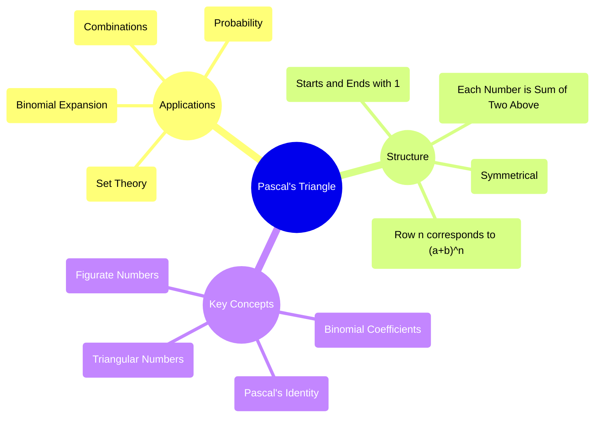

# 1 Counting Principles

Comprehensive resource for 1 Counting Principles.

---

## 1 Counting Principles Hub

## Overview
This unit, "Counting Principles," delves into the fundamental techniques used in combinatorics, a crucial branch of discrete mathematics. It provides the essential tools for determining the number of possible outcomes, arrangements, or selections in various scenarios without explicitly enumerating each one. From basic rules like the Addition and Multiplication Principles to more complex concepts such as permutations, combinations, derangements, and the Pigeonhole Principle, this unit equips you with a structured approach to solving diverse counting problems encountered in computer science, probability, and statistics. It's like learning the rules of a complex game, allowing you to predict the number of possible moves or outcomes.

## Learning Objectives
*   Understand and correctly apply the Addition Principle for mutually exclusive events.
*   Master the Multiplication Principle for sequential and independent events.
*   Differentiate between permutations (order matters) and combinations (order does not matter).
*   Calculate various types of permutations, including those without repetition, with repetition, for distinguishable objects, and in circular arrangements.
*   Calculate various types of combinations, including their application in binomial expansion.
*   Utilize Pascal's Triangle and Pascal's Identity to determine binomial coefficients.
*   Apply counting techniques to problems involving the distribution of distinguishable and indistinguishable objects into distinguishable boxes.
*   Define and compute derangements.
*   Apply the Inclusion-Exclusion Principle to count elements in overlapping sets.
*   State and apply the Pigeonhole Principle, including its generalized form, to prove existence in distribution problems.

## Unit Applications & Real-World Relevance
The principles learned in this unit have broad applications across various fields:
*   **Computer Science**: Used in algorithm analysis (e.g., calculating the number of operations), cryptography (e.g., determining the strength of passwords), network routing, and data structure design.
*   **Probability and Statistics**: Forms the bedrock for calculating probabilities of events, understanding sample spaces, and statistical distributions.
*   **Security**: Designing secure systems often involves counting possible attack vectors or password combinations.
*   **Scheduling and Resource Management**: Optimizing resource allocation, scheduling tasks, and managing events relies on understanding possible arrangements and selections.
*   **Genetics**: Analyzing sequences and arrangements of genetic material.
*   **Game Theory**: Calculating possible moves and strategies in games.

## Active Learning Prompts
*   Consider a scenario where you are designing a user interface. How might understanding permutations and combinations help in organizing menu options or workflow sequences for optimal user experience?
*   Imagine you are a network administrator. How could the Multiplication Principle be applied to determine the number of unique IP addresses available for a subnet?
*   Think of a real-world system (e.g., a library, a school, a bank). Identify a potential problem that could be solved or understood using the Pigeonhole Principle.
*   Discuss the challenges of applying counting principles to problems with complex constraints and overlapping conditions. How does the Inclusion-Exclusion Principle help address these?

## Unit Challenges & Common Misconceptions
*   **Distinguishing Addition vs. Multiplication Principle**: A common mistake is using addition when events are sequential and independent, or multiplication when they are mutually exclusive.
*   **Order Confusion**: Deciding whether a problem requires permutations or combinations is often challenging; carefully analyzing if the arrangement of selected items matters is key.
*   **Repetition**: Incorrectly handling scenarios where items can or cannot be repeated in a selection or arrangement.
*   **Overcounting**: Failing to account for duplicates when objects are indistinguishable or when events overlap, leading to inflated counts.
*   **Circular vs. Linear Arrangements**: Forgetting the specific adjustment for circular permutations where rotations are considered identical.

## Connections
  - [[Basic_Counting_Principles]]
    - [[Addition_Principle]]
    - [[Multiplication_Principle]]
  - [[Permutations_and_Combinations]]
    - [[Permutations]]
      - [[Permutations_without_Repeating_Objects]]
      - [[Permutations_with_Repeating_Objects]]
      - [[Distinguishable_Permutations]]
      - [[Circular_Permutation]]
    - [[Combinations]]
      - [[Binomial_Expansion]]
        - [[Pascal_s_Triangle]]
          - [[Pascal_s_Identity]]
      - [[Distribution_of_Distinguishable_Balls_into_Distinguishable_Boxes]]
      - [[Distribution_of_Indistinguishable_Balls_into_Distinguishable_Boxes]]
      - [[Distribution_of_Distinguishable_Balls_into_Indistinguishable_Boxes]]
  - [[Derangements]]
  - [[Inclusion_Exclusion_Principle]]
  - [[Pigeonhole_Principle]]
    - [[Generalized_Pigeonhole_Principle]]

## Next Steps for Deeper Understanding
*   Investigate the applications of counting principles in advanced probability theory, such as conditional probability and Bayesian inference.
*   Explore combinatorial identities beyond Pascal's Identity and their proofs.
*   Study the use of generating functions to solve recurrence relations and complex counting problems.
*   Research the role of combinatorics in algorithm design and complexity analysis, particularly for sorting and searching algorithms.

## Possible Questions
[[CC2131_1_Counting_Principles_Possible_Questions]]

---

---

## Basic Counting Principles

## Definition
Before proceeding, ensure you understand Set_Theory and Logic_Fundamentals.
Basic Counting Principles are fundamental rules in combinatorics used to determine the total number of possible outcomes or arrangements of events. They are the bedrock upon which more complex counting techniques, such as permutations and combinations, are built. At their core, these principles provide systematic methods for quantifying possibilities without the need for explicit enumeration. A simpler way to think about it is like figuring out how many different outfits you can make from your wardrobe by deciding if you pick "this OR that" or "this AND that."

## The Mental Model
Imagine you're trying to figure out how many different ways you can travel from your home to a friend's house. You might consider routes involving taking a bus *or* a train (Addition Principle), or routes where you take a bus *and then* a taxi (Multiplication Principle). The key is distinguishing whether choices add up alternative paths or multiply sequential steps.

| Principle              | When to Apply                                                      | Example                                                                          | Keyword Clue          |
| :
--------------------- | :
----------------------------------------------------------------- | :
------------------------------------------------------------------------------- | :
-------------------- |
| **Addition Principle** | For mutually exclusive events where you choose *one* option from *several* disjoint sets. | Choosing a book from either 5 fiction titles OR 3 non-fiction titles.            | OR, EITHER/OR, CHOICE |
| **Multiplication Principle** | For a sequence of independent events where you make a choice for *each* step. | Choosing a shirt (3 options) AND a pair of pants (2 options).                    | AND, THEN, SEQUENCE   |

## Context & Framework
#### Spot the Impostor (Don't be Fooled)
One of the most common pitfalls in combinatorics is misidentifying whether a problem requires the Addition Principle or the Multiplication Principle. This often occurs when the problem statement isn't explicit about whether events are mutually exclusive (Addition) or sequential/independent (Multiplication). For instance, combining menu items from different categories (e.g., appetizer *and* main course) requires multiplication, while choosing *one* item from *either* of two categories (e.g., a drink *or* a dessert) requires addition. Failing to recognize the logical relationship between choices can lead to wildly incorrect counts.

## The Mastery Deep Dive
#### Spot the Impostor (Don't be Fooled)
The core challenge lies in discerning the logical connective implied by the problem: "OR" implies distinct choices, leading to addition, while "AND" implies sequential or simultaneous choices, leading to multiplication. Consider events A and B. If A *prevents* B from happening, or if selecting A *completes the task* entirely, then they are mutually exclusive, and their ways are added. However, if selecting A is *one step* towards completing a larger task that *also* involves selecting B, then their ways are multiplied. The presence of overlapping outcomes also dictates the use of more advanced techniques like the Inclusion-Exclusion Principle.

#### The "Wikipedia One-Liner"
The **Addition Principle** states that if there are $n_1$ ways to perform one task, $n_2$ ways to perform a second task, and so on, and these tasks are mutually exclusive (cannot be performed at the same time), then the total number of ways to perform any one of these tasks is the sum $n_1 + n_2 + \dots + n_k$. The **Multiplication Principle** states that if a procedure can be broken down into a sequence of $k$ stages, and there are $n_1$ possible outcomes for the first stage, $n_2$ possible outcomes for the second stage (regardless of the first outcome), and so on, then the total number of outcomes for the procedure is the product $n_1 \times n_2 \times \dots \times n_k$.

## Constraints & Limitations
#### Spot the Impostor (Don't be Fooled)
The strict requirement for the Addition Principle is that events must be **mutually exclusive**. If there's any overlap between the outcomes of two tasks, simply adding them will result in an overcount. For example, if you're counting students who take either Math or Computer Science, and some students take both, a simple sum will count those students twice. Similarly, the Multiplication Principle assumes **independence** between choices or a sequence where choices do not affect the *number* of options for subsequent stages. When choices are dependent (e.g., selecting distinct items), the approach needs to be modified, leading into permutations.

## Significance & Application
Basic counting principles are foundational for understanding probability, as they allow us to determine the total number of possible outcomes in an event. In computer science, they are used to analyze the complexity of algorithms, calculate the number of possible states in a system, or enumerate possible data structures. For example, understanding how many different ways characters can be arranged is critical for password security analysis.

## The Worked Example
**Scenario:** A local bakery offers 4 types of cookies, 3 types of muffins, and 2 types of croissants.
**(a) How many choices does a customer have if they want to buy *either* a cookie *or* a muffin?**
**(b) How many choices does a customer have if they want to buy *both* a cookie *and* a croissant?**

**Solution:**
**(a) Buying either a cookie or a muffin:**
*   Choices for cookies: 4
*   Choices for muffins: 3
Since the choice is "either/or" (mutually exclusive events), we use the Addition Principle.
Total choices = Number of cookies + Number of muffins = 4 + 3 = 7 choices.

**(b) Buying both a cookie and a croissant:**
*   Choices for cookies: 4
*   Choices for croissants: 2
Since the choice is "both/and" (sequential/independent events), we use the Multiplication Principle.
Total choices = Number of cookies $\times$ Number of croissants = 4 $\times$ 2 = 8 choices.

## The Proving Ground
*Test your mastery. Cover the solutions below to test yourself first.*

#### Level 1: The Sanity Check (Verification)
**The Question:** You are choosing an outfit. You have 5 shirts, 3 pairs of pants, and 2 pairs of shoes. How many different outfits can you make if you must choose one of each?
> **Solution:** 30 outfits. (5 shirts $\times$ 3 pants $\times$ 2 shoes = 30)

#### Level 2: The Crucible (Mastery & Edge Cases)
**The Scenario:** A coding competition offers two main programming languages: Python (with 3 difficulty levels for problems) and Java (with 4 difficulty levels for problems).
1.  If a contestant can choose to solve a problem in *either* Python *or* Java, how many distinct problem choices are there?
2.  Now, assume the competition also offers a "bonus challenge" that *requires* selecting one Python problem *and then* one Java problem. How many combinations of bonus challenges are there?
3.  Critically analyze a scenario where a novice misapplies the Multiplication Principle for question 1 and the Addition Principle for question 2. Explain why their results would be incorrect and how they violate the core logic of each principle.
> **Solution:**
> 1.  Python problems: 3. Java problems: 4. Since it's "either/or" and mutually exclusive, use the Addition Principle: 3 + 4 = 7 distinct problem choices.
> 2.  Python problems: 3. Java problems: 4. Since it's "one AND then one," use the Multiplication Principle: 3 $\times$ 4 = 12 combinations of bonus challenges.
> 3.  **Misapplication Analysis:**
>     *   **Multiplication for Question 1**: If a novice multiplied (3 Python $\times$ 4 Java = 12), they would incorrectly assume the contestant must choose *both* a Python and a Java problem, rather than just one. This violates the mutual exclusivity condition of the "either/or" choice.
>     *   **Addition for Question 2**: If a novice added (3 Python + 4 Java = 7), they would incorrectly assume the selection of a Python problem *completes* the bonus challenge, without needing a Java problem. This violates the sequential dependency of the "one AND then one" choice. The core logic of each principle is violated because the fundamental nature of the task (mutually exclusive vs. sequential/independent) is misinterpreted.

## Key Takeaways
*   The Addition Principle is applied when choosing among mutually exclusive alternatives (OR situations).
*   The Multiplication Principle is applied when making a sequence of independent choices (AND situations).
*   Correctly identifying whether choices are mutually exclusive or sequential/independent is critical for accurate counting.

## Knowledge Graph Connections
| Concept                     | Connection / Relationship                                                                   |
| :
-------------------------- | :
------------------------------------------------------------------------------------------ |
| [[Addition_Principle]]      | Basic Counting Principles are foundational for understanding the Addition Principle.        |
| [[Multiplication_Principle]] | Basic Counting Principles are foundational for understanding the Multiplication Principle.  |
| Set_Theory              | Underlying concepts of sets and disjoint sets are crucial for counting principles.          |
| Probability_Theory      | These principles are essential for calculating the number of outcomes in probability.       |
---

---

## Derangements

## Definition
Before proceeding, ensure you master [[Permutations]] and [[Inclusion_Exclusion_Principle]].
A derangement is a permutation of a set of distinct objects such that **none of the objects appear in their original or "natural" position**. It's a specific type of permutation problem where the goal is to find arrangements where no element is fixed. The concept is often encountered in problems involving misaddressed letters, hats being returned to the wrong people, or items being placed incorrectly. A simpler way to think about it is like a game of musical chairs where no one ends up in their original seat.

## The Mental Model
Imagine you have 3 distinct letters (L1, L2, L3) and 3 corresponding envelopes (E1, E2, E3), where L1 belongs in E1, L2 in E2, etc. A derangement would be any way of putting the letters into the envelopes such that *no* letter ends up in its correct envelope. For instance, L1 in E2, L2 in E3, L3 in E1 is a derangement. L1 in E1, L2 in E3, L3 in E2 is *not* a derangement because L1 is in its correct place.

$$ \boxed{\displaystyle D_n = n! \left( \frac{1}{0!} - \frac{1}{1!} + \frac{1}{2!} - \frac{1}{3!} + \dots + (-1)^n \frac{1}{n!} \right)} $$

| Symbol | Name                 | Unit    | Analogy                                  |
| :
----- | :
------------------- | :
------ | :
--------------------------------------- |
| $D_n$  | Number of Derangements | Number  | Total ways to misplace letters.          |
| $n$    | Total Objects        | Integer | Number of letters or items.              |
| $n!$   | n Factorial          | Number  | All possible linear arrangements.        |
| $\frac{1}{k!}$ | Reciprocal Factorial | Number  | Part of the alternating series.          |
| $(-1)^n$ | Alternating Sign Term | Factor  | Ensures alternating positive/negative terms. |

## Context & Framework
#### Anatomy of the Formula (Who is Who?)
The formula for derangements of $n$ objects, $D_n$, is derived using the [[Inclusion_Exclusion_Principle]]. It starts with the total number of permutations ($n!$) and then systematically subtracts arrangements where at least one object is in its correct place, then adds back arrangements where at least two objects are in their correct places (because they were subtracted too many times), and so on. The series $\left( \frac{1}{0!} - \frac{1}{1!} + \frac{1}{2!} - \frac{1}{3!} + \dots + (-1)^n \frac{1}{n!} \right)$ is essentially a truncated Taylor series expansion of $e^{-1}$, demonstrating the connection between combinatorics and analysis.

## The Mastery Deep Dive
#### Let's Plug in Numbers (Watch it Work)
Let's find the number of derangements for 3 objects.
*   $n = 3$
$D_3 = 3! \left( \frac{1}{0!} - \frac{1}{1!} + \frac{1}{2!} - \frac{1}{3!} \right)$
$D_3 = 6 \left( 1 - 1 + \frac{1}{2} - \frac{1}{6} \right)$
$D_3 = 6 \left( \frac{3}{6} - \frac{1}{6} \right)$
$D_3 = 6 \left( \frac{2}{6} \right) = 2$

The 2 derangements of {1, 2, 3} are:
*   {2, 3, 1} (1 is not in pos 1, 2 not in pos 2, 3 not in pos 3)
*   {3, 1, 2} (1 is not in pos 1, 2 not in pos 2, 3 not in pos 3)

#### The "Oops!" List: Where Everyone Fails
A common mistake is to miscalculate the terms in the series, especially with the alternating signs. Another error is confusing derangements with general permutations or permutations with restrictions that are not "no element in its original position." Forgetting that the formula applies to *distinct* objects is also a pitfall. For small $n$, it's sometimes easier to list them out and count, but for larger $n$, the formula is indispensable.

## Constraints & Limitations
#### The "Oops!" List: Where Everyone Fails
The derangement formula is strictly for finding permutations where **no object is in its original position**, and it assumes all objects are **distinct**. It does not directly account for situations where *exactly k* objects are in their original position, or where some objects are indistinguishable. Solving problems with these variations often requires a combination of the derangement formula and binomial coefficients (e.g., choose `k` items to be in place, then derange the remaining `n-k` items). The formula also becomes more computationally intensive for very large `n` if one were to manually calculate all factorial terms.

## Significance & Application
Derangements have applications in various fields:
*   **Probability**: Calculating the probability that no element of a permutation stays in its original position (e.g., the probability that no one gets their own hat back).
*   **Cryptography**: In some simple substitution ciphers, a derangement ensures that no character maps to itself.
*   **Computer Science**: In algorithms dealing with shuffling or randomizing elements, particularly when avoiding fixed points is a requirement.
*   **Discrete Mathematics**: A classical problem often used to illustrate the power of the [[Inclusion_Exclusion_Principle]].

## The Worked Example
**Scenario:** A teacher distributes 4 distinct test papers back to 4 distinct students. In how many ways can the teacher return the papers such that *no student receives their own paper*?

**Solution:**
This is a derangement problem with $n=4$.
Using the derangement formula:
$D_4 = 4! \left( \frac{1}{0!} - \frac{1}{1!} + \frac{1}{2!} - \frac{1}{3!} + \frac{1}{4!} \right)$
$D_4 = 24 \left( 1 - 1 + \frac{1}{2} - \frac{1}{6} + \frac{1}{24} \right)$
$D_4 = 24 \left( \frac{12}{24} - \frac{4}{24} + \frac{1}{24} \right)$
$D_4 = 24 \left( \frac{9}{24} \right)$
$D_4 = 9$

Alternatively, for small $n$, we can use the recursive relation $D_n = (n-1)(D_{n-1} + D_{n-2})$ with $D_0=1, D_1=0$.
$D_2 = 1(D_1+D_0) = 1(0+1) = 1$
$D_3 = 2(D_2+D_1) = 2(1+0) = 2$
$D_4 = 3(D_3+D_2) = 3(2+1) = 3 \times 3 = 9$.

$$ \boxed{\displaystyle \text{Number of ways} = D_4 = 9} $$

## The Proving Ground
*Test your mastery. Cover the solutions below to test yourself first.*

#### Level 1: The Sanity Check (Verification)
**The Question:** For a set of 2 distinct objects {A, B}, what are the derangements?
> **Solution:** There is only 1 derangement: {B, A}. (D2 = 1)

#### Level 2: The Crucible (Mastery & Edge Cases)
**The Scenario:** A secret Santa exchange involves 5 friends (F1, F2, F3, F4, F5), and each friend's name is placed in a hat. Each friend draws a name, but no one should draw their own name.
1.  Calculate the number of ways the names can be drawn such that no one draws their own name.
2.  Now, imagine that exactly two specific friends, F1 and F2, *do* draw their own names, and the remaining 3 friends draw names that are *not* their own. Explain how to solve this modified problem by combining derangements with combinations.
3.  A novice tries to calculate the solution to question 1 by simply taking $5!$ and subtracting 1 (for the correct permutation). Explain why this approach is fundamentally flawed and significantly underestimates the true number of derangements.
> **Solution:**
> 1.  This is a derangement problem with $n=5$.
>     $D_5 = 5! \left( \frac{1}{0!} - \frac{1}{1!} + \frac{1}{2!} - \frac{1}{3!} + \frac{1}{4!} - \frac{1}{5!} \right)$
>     $D_5 = 120 \left( 1 - 1 + \frac{1}{2} - \frac{1}{6} + \frac{1}{24} - \frac{1}{120} \right)$
>     $D_5 = 120 \left( \frac{60}{120} - \frac{20}{120} + \frac{5}{120} - \frac{1}{120} \right)$
>     $D_5 = 120 \left( \frac{44}{120} \right) = 44$ ways.
> 2.  **Constraint Analysis (F1 and F2 draw their own names):**
>     *   First, choose 2 friends who *will* draw their own names. Here, F1 and F2 are specified, so there's only $\binom{2}{2} = 1$ way to choose them.
>     *   These 2 friends are "fixed."
>     *   The remaining 3 friends (F3, F4, F5) must now draw names such that *none* of them draw their own name. This is a derangement of 3 objects ($D_3$).
>     *   $D_3 = 2$.
>     *   Total ways = (Ways to choose 2 fixed friends) $\times$ (Ways to derange the remaining 3) = $1 \times 2 = 2$ ways.
> 3.  Taking $5! - 1$ would yield $120 - 1 = 119$. This is fundamentally flawed because it only subtracts the single case where *everyone* gets their own name back. It does not account for the many other permutations where *some* (but not all) people get their own name back. The concept of derangement is about *none* being in their original place, which is much more restrictive than simply "not everyone in their original place." The approach significantly overcounts permutations where some elements are fixed, leading to a massive overestimation of possible derangements.

## Key Takeaways
*   `Derangements` are permutations where no object appears in its original position.
*   The formula `D_n` is derived using the `Inclusion-Exclusion Principle`.
*   It is specifically for `distinct` objects with `no` fixed points.

## Knowledge Graph Connections
| Concept                     | Connection / Relationship                                                                   |
| :
-------------------------- | :
------------------------------------------------------------------------------------------ |
| [[Permutations]]            | Derangements are a specific type of permutation with a strong restriction.                  |
| [[Inclusion_Exclusion_Principle]] | The formula for derangements is derived directly from the Inclusion-Exclusion Principle.    |
| Factorials              | Factorials are a core component of the derangement formula.                                 |
| Probability_Theory      | Derangements are used to calculate probabilities of no matches in random assignments.       |
---

---

## Inclusion Exclusion Principle

## Definition
Before proceeding, ensure you master Set_Theory and [[Addition_Principle]].
The Inclusion-Exclusion Principle is a counting technique used to determine the size of the union of multiple sets, especially when these sets are **not mutually exclusive** (i.e., they overlap). It systematically adds the sizes of all individual sets, then subtracts the sizes of all pairwise intersections (to correct for overcounting), then adds back the sizes of all three-way intersections (to correct for undercounting again), and so on, until all overlaps have been correctly accounted for. A simpler way to think about it is like counting people at a party who like coffee OR tea: you add coffee lovers + tea lovers, then subtract those who like *both*, because you counted them twice.

## The Mental Model
Imagine you have two overlapping circles (Venn Diagram) representing two groups of students: those who play basketball (Set A) and those who play soccer (Set B). If you just add the number of students in Set A and the number of students in Set B, you've counted the students in the overlapping region (who play both) twice. The Inclusion-Exclusion Principle corrects this by subtracting the overlap. For three sets, it gets more complex, requiring alternating additions and subtractions.

$$ \boxed{\displaystyle \begin{aligned}
|A \cup B| &= |A| + |B| - |A \cap B| \\
|A \cup B \cup C| &= |A| + |B| + |C| - (|A \cap B| + |A \cap C| + |B \cap C|) + |A \cap B \cap C|
\end{aligned}} $$

| Symbol         | Name                        | Unit   | Analogy                                     |
| :
------------- | :
-------------------------- | :
----- | :
------------------------------------------ |
| $|A|$          | Cardinality of Set A        | Number | Number of students who play basketball.     |
| $|B|$          | Cardinality of Set B        | Number | Number of students who play soccer.         |
| $|A \cup B|$   | Union of Sets A and B       | Number | Total students who play at least one sport. |
| $|A \cap B|$   | Intersection of Sets A and B | Number | Students who play both sports.              |

## Context & Framework
#### Intuitive Proof: The "Duh!" Moment (Intuitive Proof)
The core idea is to iteratively correct for overcounting. When you sum the sizes of individual sets, any element belonging to two sets is counted twice, any element belonging to three sets is counted thrice, and so on.
*   **Step 1: Include (Add)** - Sum all individual set sizes. Elements in intersections are overcounted.
*   **Step 2: Exclude (Subtract)** - Subtract the sizes of all pairwise intersections. This corrects for elements counted twice, but now elements in triple intersections are undercounted (they were added three times, then subtracted three times).
*   **Step 3: Include (Add)** - Add the sizes of all three-way intersections. This brings back the elements that were undercounted.
This alternating process continues until all intersections are accounted for.

## The Mastery Deep Dive
#### Let's Plug in Numbers (Watch it Work)
Consider a group of 50 people. 30 like coffee (Set C) and 25 like tea (Set T). 10 people like both coffee and tea (Set C $\cap$ T). How many people like *at least one* beverage?
*   $|C| = 30$
*   $|T| = 25$
*   $|C \cap T| = 10$
Using the Inclusion-Exclusion Principle for two sets:
$|C \cup T| = |C| + |T| - |C \cap T| = 30 + 25 - 10 = 45$ people.

This means 45 people like at least one beverage. The remaining $50 - 45 = 5$ people like neither.

#### The "Oops!" List: Where Everyone Fails
Common errors in applying the Inclusion-Exclusion Principle include:
1.  **Forgetting to subtract/add back intersections**: Especially with three or more sets, the alternating signs and correct combinations of intersections can be confusing.
2.  **Misidentifying intersections**: Incorrectly calculating the size of pairwise or triple intersections.
3.  **Applying to mutually exclusive events**: While it works, it's an unnecessary complexity for mutually exclusive events where the [[Addition_Principle]] is sufficient ($|A \cap B|=0$).
4.  **Not ensuring distinctness**: Assuming distinct elements in sets when there might be underlying issues.

## Constraints & Limitations
#### The "Oops!" List: Where Everyone Fails
The Inclusion-Exclusion Principle is most effective when the sizes of the individual sets and their various intersections are known or can be easily calculated. Its complexity grows rapidly with the number of sets involved. For `k` sets, it involves summing `k` individual terms, then subtracting $\binom{k}{2}$ pairwise intersection terms, then adding $\binom{k}{3}$ three-way intersection terms, and so on. This can become computationally intensive for a large number of sets. The principle also assumes finite sets and the ability to define distinct properties for set membership.

## Significance & Application
The Inclusion-Exclusion Principle is a powerful tool in combinatorics with wide-ranging applications:
*   **Probability**: Calculating the probability of union of events, especially non-mutually exclusive ones.
*   **Set Theory**: Determining the size of set unions.
*   **Derangements**: The formula for [[Derangements]] is directly derived using the Inclusion-Exclusion Principle.
*   **Number Theory**: Counting integers with certain properties (e.g., numbers not divisible by any of several primes).
*   **Computer Science**: In areas like algorithm analysis (e.g., counting elements with specific attributes in a dataset), and in database queries involving multiple criteria.

## The Worked Example
**Scenario:** In a class of 100 students:
*   50 play Football (F)
*   40 play Basketball (B)
*   30 play Tennis (T)
*   15 play F and B
*   12 play F and T
*   10 play B and T
*   5 play F, B, and T
How many students play *at least one* sport?

**Solution:**
Using the Inclusion-Exclusion Principle for three sets:
$|F \cup B \cup T| = |F| + |B| + |T| - (|F \cap B| + |F \cap T| + |B \cap T|) + |F \cap B \cap T|$
$|F \cup B \cup T| = 50 + 40 + 30 - (15 + 12 + 10) + 5$
$|F \cup B \cup T| = 120 - (37) + 5$
$|F \cup B \cup T| = 83 + 5$
$|F \cup B \cup T| = 88$

$$ \boxed{\displaystyle \text{Number of students who play at least one sport} = 88} $$

## The Proving Ground
*Test your mastery. Cover the solutions below to test yourself first.*

#### Level 1: The Sanity Check (Verification)
**The Question:** A group of 20 people were surveyed. 12 liked apples, 8 liked bananas, and 4 liked both. How many people liked at least one fruit?
> **Solution:** $|A \cup B| = 12 + 8 - 4 = 16$ people.

#### Level 2: The Crucible (Mastery & Edge Cases)
**The Scenario:** A software company has 3 development teams (Team A, Team B, Team C).
*   Team A has 15 members.
*   Team B has 20 members.
*   Team C has 10 members.
*   5 members are on both Team A and Team B.
*   3 members are on both Team A and Team C.
*   2 members are on both Team B and Team C.
*   1 member is on all three teams (Team A, B, and C).
1.  How many unique employees are there in total across all three teams?
2.  Now, if the company CEO wants to know how many employees are *only* on Team A, explain how to derive this value using the provided information and the Inclusion-Exclusion Principle logic.
3.  A junior analyst tries to solve question 1 by simply summing the sizes of the three teams (15 + 20 + 10 = 45). Explain why this approach is fundamentally flawed and significantly overcounts the unique employees.
> **Solution:**
> 1.  Using the Inclusion-Exclusion Principle for three sets:
>     $|A \cup B \cup C| = |A| + |B| + |C| - (|A \cap B| + |A \cap C| + |B \cap C|) + |A \cap B \cap C|$
>     $|A \cup B \cup C| = 15 + 20 + 10 - (5 + 3 + 2) + 1$
>     $|A \cup B \cup C| = 45 - 10 + 1 = 36$ unique employees.
> 2.  **Employees only on Team A:**
>     This can be found by starting with the total members in Team A and subtracting those who are also in other teams, then adding back those in the triple intersection (who were subtracted twice).
>     $|A_{only}| = |A| - |A \cap B| - |A \cap C| + |A \cap B \cap C|$
>     $|A_{only}| = 15 - 5 - 3 + 1 = 8$ employees.
> 3.  Simply summing the sizes of the three teams ($15 + 20 + 10 = 45$) is flawed because it treats members who are part of multiple teams as distinct individuals for each team they belong to. For instance, the 5 members on both Team A and Team B are counted twice. The 1 member on all three teams is counted thrice. This leads to a significant overcount of unique employees, as it violates the principle of counting each unique entity only once.

## Key Takeaways
*   The `Inclusion-Exclusion Principle` calculates the size of the union of overlapping sets.
*   It systematically adds individual set sizes, then subtracts pairwise intersections, then adds triple intersections, and so on, with alternating signs.
*   It is crucial when dealing with non-mutually exclusive events.

## Knowledge Graph Connections
| Concept                     | Connection / Relationship                                                                   |
| :
-------------------------- | :
------------------------------------------------------------------------------------------ |
| Set_Theory              | The principle is fundamental to set operations, especially unions of non-disjoint sets.     |
| [[Addition_Principle]]      | It extends the Addition Principle to handle overlapping (non-mutually exclusive) events.    |
| [[Derangements]]            | The formula for derangements is derived using the Inclusion-Exclusion Principle.            |
| Probability_Theory      | Used to calculate probabilities of compound, non-mutually exclusive events.                 |
---

---

## Permutations And Combinations

## Definition
Before proceeding, ensure you master [[Basic_Counting_Principles]] and Factorials.
Permutations and Combinations are two fundamental counting techniques in combinatorics that deal with the selection and arrangement of objects from a set. The key distinction lies in whether the **order of selection matters**. A **permutation** is an arrangement of objects where the order is significant (e.g., a race finish line). A **combination** is a selection of objects where the order is not significant (e.g., choosing a committee). A simpler way to think about it is like picking numbers for a safe (permutation, order matters) versus picking toppings for a pizza (combination, order doesn't matter).

## The Mental Model
Imagine you have a group of friends, and you want to select some of them for an activity.
*   If you're assigning specific roles, like "Team Captain," "Vice-Captain," and "Secretary," then the order in which you pick them matters – picking John as Captain and Sarah as Vice-Captain is different from Sarah as Captain and John as Vice-Captain. This is a **permutation**.
*   If you're just picking 3 friends to form a study group, and all roles within the group are equal, then the order in which you pick them doesn't matter – picking John, then Sarah, then Emily results in the same study group as picking Emily, then John, then Sarah. This is a **combination**.

| Feature         | Permutation                                     | Combination                                     | Example                                            |
| :
-------------- | :
---------------------------------------------- | :
---------------------------------------------- | :
------------------------------------------------- |
| **Order**       | Matters (e.g., 123 is different from 321)       | Does not matter (e.g., {1,2,3} is the same as {3,2,1}) | PIN code vs. Lottery numbers                       |
| **Arrangement** | Focuses on arrangements and sequences.          | Focuses on selections and subsets.              | Arranging books on a shelf vs. Choosing books for a bag |
| **Question Clues** | "Arrange," "Order," "Sequence," "Rank," "Line up" | "Select," "Choose," "Group," "Subset," "Committee" |                                                    |

## Context & Framework
#### Spot the Impostor (Don't be Fooled)
One of the most frequent errors in combinatorics is confusing permutations with combinations. This usually happens when the "order matters" criterion is misjudged. For instance, if a problem asks to select three students for a debate team, and each student has an equal role, it's a combination. However, if the roles are "first speaker," "second speaker," and "third speaker," then it's a permutation because the assignment of specific roles makes the order of selection significant. Always ask: "If I swap two selected items, does it change the outcome or meaning?" If yes, it's a permutation; if no, it's a combination.

## The Mastery Deep Dive
#### Spot the Impostor (Don't be Fooled)
The intuitive distinction is crucial. Permutations deal with situations where every unique ordering is counted as distinct. Think of forming words from a set of letters; "CAT" is different from "ACT." Combinations, on the other hand, treat different orderings of the *same set* of items as a single entity. If you're choosing a hand of cards, the order in which you receive the cards doesn't change the hand itself. The crucial difference lies in how you interpret the "outcome": is it a unique arrangement, or a unique group?

#### The "Wikipedia One-Liner"
A **permutation** of $n$ distinct objects taken $r$ at a time is an ordered arrangement of $r$ objects chosen from the $n$ objects. The formula is given by $P(n,r) = \frac{n!}{(n-r)!}$. A **combination** of $n$ distinct objects taken $r$ at a time is an unordered selection of $r$ objects chosen from the $n$ objects. The formula is given by $C(n,r) = \binom{n}{r} = \frac{n!}{r!(n-r)!}$. The extra $r!$ in the denominator for combinations accounts for the multiple ways the same $r$ objects can be ordered, effectively "dividing out" the significance of order.

## Constraints & Limitations
#### Spot the Impostor (Don't be Fooled)
The challenge with both permutations and combinations arises when dealing with **repeated objects** or **constraints on specific items**. The standard formulas (P(n,r) and C(n,r)) assume all objects are distinct. When some objects are identical, specialized formulas like [[Distinguishable_Permutations]] are needed. Furthermore, problems with complex constraints (e.g., "always include this item," "never include that item," "items must sit together") often require breaking the problem down using the Addition and Multiplication Principles in conjunction with permutation/combination formulas.

## Significance & Application
Permutations and combinations are cornerstones of probability, enabling the calculation of the likelihood of specific events. In statistics, they are essential for sampling techniques. In computer science, these concepts are vital for:
*   **Cryptography**: Determining the number of possible keys or password combinations.
*   **Algorithm Design**: Analyzing the number of possible states or arrangements for optimization problems (e.g., traveling salesman).
*   **Data Structures**: Understanding the different ways data can be organized.
*   **Network Routing**: Calculating the number of possible paths between nodes.

## The Worked Example
**Scenario:** A local club has 8 members.
**(a) In how many ways can a president and a vice-president be chosen?**
**(b) In how many ways can a committee of 2 members be chosen?**

**Solution:**
**(a) Choosing a president and a vice-president:**
*   Here, the order matters. Picking Member A as President and Member B as Vice-President is different from Member B as President and Member A as Vice-President. This is a **permutation**.
*   Total members ($n$): 8
*   Number of positions to fill ($r$): 2
*   Using the permutation formula: $P(8,2) = \frac{8!}{(8-2)!} = \frac{8!}{6!} = 8 \times 7 = 56$ ways.

**(b) Choosing a committee of 2 members:**
*   Here, the order does not matter. A committee with Member A and Member B is the same as a committee with Member B and Member A. This is a **combination**.
*   Total members ($n$): 8
*   Number of members to choose ($r$): 2
*   Using the combination formula: $C(8,2) = \binom{8}{2} = \frac{8!}{2!(8-2)!} = \frac{8!}{2!6!} = \frac{8 \times 7}{2 \times 1} = 28$ ways.

## The Proving Ground
*Test your mastery. Cover the solutions below to test yourself first.*

#### Level 1: The Sanity Check (Verification)
**The Question:** You have 5 distinct colors.
1.  How many ways can you arrange 2 of these colors in a specific order?
2.  How many ways can you choose 2 of these colors without regard to order?
> **Solution:**
> 1.  Permutation: $P(5,2) = 5 \times 4 = 20$ ways.
> 2.  Combination: $C(5,2) = \frac{5 \times 4}{2 \times 1} = 10$ ways.

#### Level 2: The Crucible (Mastery & Edge Cases)
**The Scenario:** A deck of cards contains 52 distinct cards.
1.  How many different 5-card poker hands can be dealt? (Order of cards in hand does not matter).
2.  Imagine a specific game where the first card dealt is the "lucky card," and its position matters. How many ways can a sequence of 5 cards be dealt from the deck where the first card's identity and position are distinct, and the remaining 4 cards are chosen without regard to order among themselves? (This implies choosing 1 card for a specific position, then 4 cards from the remaining 51 for the hand).
3.  A novice incorrectly calculates the answer for question 2 by first finding the number of permutations of 5 cards from 52, and then trying to adjust. Explain the fundamental flaw in this approach and why it overcomplicates the problem by generating unnecessary orderings that must then be removed.
> **Solution:**
> 1.  This is a combination: $C(52,5) = \binom{52}{5} = \frac{52!}{5!47!} = 2,598,960$ different 5-card poker hands.
> 2.  For the "lucky card" (first card dealt), there are 52 choices.
>     For the remaining 4 cards from the remaining 51, their order doesn't matter, so it's a combination: $C(51,4) = \binom{51}{4} = \frac{51!}{4!47!} = \frac{51 \times 50 \times 49 \times 48}{4 \times 3 \times 2 \times 1} = 249,900$.
>     Using the Multiplication Principle (lucky card AND then 4 other cards): $52 \times C(51,4) = 52 \times 249,900 = 12,994,800$ ways.
> 3.  The fundamental flaw in first calculating $P(52,5)$ (permutations of 5 cards from 52) is that $P(52,5)$ assumes *all 5 cards* are ordered. However, the problem specifies that for the *remaining 4 cards*, their order doesn't matter. If you take $P(52,5) = 52 \times 51 \times 50 \times 49 \times 48$, you're counting arrangements like (A, B, C, D, E) and (A, C, B, D, E) as distinct, even if B, C, D, E are the non-ordered hand. To correct this, one would then have to divide by $4!$ (for the orderings of the 4 non-lucky cards), which is an indirect and more error-prone approach than directly applying the relevant combination formula for the unordered subset. It overcomplicates by introducing and then removing extraneous orderings.

## Key Takeaways
*   **Permutations** are about ordered arrangements (order matters).
*   **Combinations** are about unordered selections (order does not matter).
*   The choice between the two depends entirely on whether the sequence or position of selected items is significant.

## Knowledge Graph Connections
| Concept                     | Connection / Relationship                                                                   |
| :
-------------------------- | :
------------------------------------------------------------------------------------------ |
| [[Basic_Counting_Principles]] | Permutations and Combinations are advanced applications of basic counting principles.       |
| Factorials              | Factorials are fundamental to the calculation of both permutations and combinations.        |
| [[Permutations]]            | Permutations and Combinations are distinct but related methods of counting arrangements.    |
| [[Combinations]]            | Combinations are distinct but related methods of counting selections.                       |
---

---

## Pigeonhole Principle

## Definition
Before proceeding, ensure you master [[Basic_Counting_Principles]] and Logic_Fundamentals.
The Pigeonhole Principle is a fundamental concept in combinatorics that states if you have more pigeons than pigeonholes, then at least one pigeonhole must contain more than one pigeon. More formally, if $m$ items are put into $n$ containers, with $m > n$, then at least one container must contain more than one item. This principle is not constructive (it doesn't tell you *which* pigeonhole has more than one pigeon, or *how many*), but it is a powerful existence theorem. A simpler way to think about it is like putting more socks than there are drawers; at least one drawer will have multiple socks.

## The Mental Model
Imagine you have 7 individual letters and only 6 mailboxes. Even if you try to put one letter in each mailbox, you'll eventually run out of unique mailboxes. The 7th letter *must* go into a mailbox that already has a letter. This guarantees that at least one mailbox will have two or more letters.

$$ \boxed{\displaystyle \text{If } m > n \text{, then at least one pigeonhole has } > 1 \text{ pigeon.}} $$

| Symbol | Name        | Unit    | Analogy                                  |
| :
----- | :
---------- | :
------ | :
--------------------------------------- |
| $m$    | Pigeons     | Integer | Number of letters.                       |
| $n$    | Pigeonholes | Integer | Number of mailboxes.                     |

## Context & Framework
#### Intuitive Proof: The "Duh!" Moment (Intuitive Proof)
The proof of the Pigeonhole Principle is by contradiction. Assume, for the sake of argument, that no pigeonhole contains more than one pigeon. This means that each pigeonhole contains at most one pigeon. If there are $n$ pigeonholes, then the total number of pigeons could be at most $n \times 1 = n$. However, the premise states that there are $m$ pigeons and $m > n$. This creates a contradiction: $m \le n$ (from our assumption) and $m > n$ (from the premise) cannot both be true. Therefore, our initial assumption must be false, meaning at least one pigeonhole must contain more than one pigeon.

## The Mastery Deep Dive
#### Let's Plug in Numbers (Watch it Work)
Consider a group of 13 people. At least two of them must have been born in the same month.
*   "Pigeons" ($m$): 13 people (the items being placed)
*   "Pigeonholes" ($n$): 12 months in a year (the containers)
Since $m = 13 > n = 12$, by the Pigeonhole Principle, at least one month (pigeonhole) must contain more than one person (pigeon). This guarantees that at least two people share a birth month.

#### The "Oops!" List: Where Everyone Fails
A common error is incorrectly identifying the "pigeons" and "pigeonholes." Sometimes, they are not immediately obvious and require careful framing of the problem. Another mistake is forgetting that the principle only guarantees existence; it doesn't tell you *how many* are in a particular hole or *which* hole. It's also important to ensure that the number of pigeons truly exceeds the number of pigeonholes. If $m \le n$, the principle does not apply.

## Constraints & Limitations
#### The "Oops!" List: Where Everyone Fails
The Pigeonhole Principle, in its basic form, is an existence proof and does not provide a constructive method for finding the pigeonhole or the exact number of pigeons within it. It guarantees "at least one" but not "exactly one" or "at least k." Furthermore, it is limited to scenarios where items can be clearly categorized into distinct containers. For more nuanced scenarios (e.g., guaranteeing at least *k* items in a pigeonhole), the [[Generalized_Pigeonhole_Principle]] is needed. The principle assumes that pigeons are "placed" into pigeonholes; it doesn't directly apply to continuous distributions without discretization.

## Significance & Application
The Pigeonhole Principle is a surprisingly powerful and versatile tool:
*   **Computer Science**: Proving the existence of collisions in hash functions, demonstrating limitations in data compression, and analyzing algorithm efficiency (e.g., proving that certain sorting algorithms take at least $N \log N$ comparisons).
*   **Number Theory**: Proving various properties of integers.
*   **Combinatorics**: Proving existence of certain configurations or properties in sets.
*   **Logic**: A simple yet elegant example of a non-constructive proof.
*   **Real-World**: Ensuring at least two people share a birthday in a sufficiently large group.

## The Worked Example
**Scenario:** In any group of 367 or more people, at least two of them must have been born on the same date. Explain why.

**Solution:**
*   "Pigeons" ($m$): The number of people.
*   "Pigeonholes" ($n$): The possible birth dates in a year.
Assuming a non-leap year, there are 365 possible distinct birth dates. If we consider a leap year, there are 366 possible distinct birth dates.
Therefore, the maximum number of distinct pigeonholes for birth dates is $n=366$.

If we have $m = 367$ people:
Since $m = 367 > n = 366$, according to the Pigeonhole Principle, at least one pigeonhole (birth date) must contain more than one pigeon (person). This guarantees that at least two of them must have been born on the same date.

$$ \boxed{\displaystyle \text{Since } 367 > 366 \text{, at least two people share a birth date.}} $$

## The Proving Ground
*Test your mastery. Cover the solutions below to test yourself first.*

#### Level 1: The Sanity Check (Verification)
**The Question:** If you have 6 pairs of socks, and you randomly pull out 7 individual socks, are you guaranteed to have a matching pair?
> **Solution:** Yes. Pigeons = 7 socks, Pigeonholes = 6 pairs. Since 7 > 6, at least one "pair" pigeonhole must contain two socks, guaranteeing a match.

#### Level 2: The Crucible (Mastery & Edge Cases)
**The Scenario:** A bag contains marbles of 3 colors: red, blue, and green.
1.  How many marbles must you draw (without looking) to be sure you have at least two marbles of the same color? Identify the "pigeons" and "pigeonholes."
2.  Now, imagine a security system requires unique user IDs, and it can generate IDs from 1 to 1000. If 1001 users register, explain how the Pigeonhole Principle guarantees a collision (two users receiving the same ID), and why this is a critical flaw for a "unique ID" system.
3.  A novice tries to prove that if there are 5 people in a room, then at least 3 must have been born in the same season (Winter, Spring, Summer, Autumn). Explain why the basic Pigeonhole Principle *does not guarantee* this outcome and identify the conceptual error in their application.
> **Solution:**
> 1.  "Pigeonholes" ($n$): 3 colors (red, blue, green).
>     "Pigeons" ($m$): Marbles drawn.
>     To guarantee at least two marbles of the same color, we need $m > n$. So, $m = 3+1 = 4$ marbles. If you draw 4 marbles, you are guaranteed to have at least two of the same color.
> 2.  "Pigeons" ($m$): 1001 users.
>     "Pigeonholes" ($n$): 1000 unique IDs.
>     Since $m = 1001 > n = 1000$, by the Pigeonhole Principle, at least one ID (pigeonhole) must be assigned to more than one user (pigeon). This guarantees a collision, meaning two or more users will receive the same ID, breaking the "unique ID" requirement. This is a critical flaw as it leads to data corruption, security vulnerabilities, or system malfunction.
> 3.  **Conceptual Error:** The basic Pigeonhole Principle states that if $m > n$, at least one pigeonhole has *more than 1* pigeon. It does not guarantee "at least 3."
>     Here, $m=5$ people, $n=4$ seasons.
>     The principle guarantees *at least one season* has *more than 1* person (i.e., at least two people share a season).
>     It does *not* guarantee that 3 people share a season. It's possible to have 2 people in one season, 2 in another, and 1 in a third season (e.g., 2 Winter, 2 Spring, 1 Summer, 0 Autumn). To guarantee at least 3 in one season, the [[Generalized_Pigeonhole_Principle]] would be needed.

## Key Takeaways
*   The `Pigeonhole Principle` states that if you have more items (`m`) than containers (`n`), at least one container must have more than one item (`m > n`).
*   It is an existence principle, not constructive.
*   Crucial for proving outcomes in various combinatorial problems.

## Knowledge Graph Connections
| Concept                     | Connection / Relationship                                                                   |
| :
-------------------------- | :
------------------------------------------------------------------------------------------ |
| [[Basic_Counting_Principles]] | Provides a fundamental insight into discrete counting problems, especially existence.       |
| Logic_Fundamentals      | Its proof relies on direct logical reasoning and proof by contradiction.                    |
| [[Generalized_Pigeonhole_Principle]] | This is an extension of the basic principle to guarantee a minimum of `k` items in a container. |
| Set_Theory              | Can be framed in terms of mapping elements from one set to another.                         |
---

---

## Addition Principle

## Definition
Before proceeding, ensure you master [[Basic_Counting_Principles]] and Set_Operations.
The Addition Principle, also known as the Sum Rule, is a fundamental counting technique used when tasks or events are **mutually exclusive**. It states that if there are `n` ways to perform one task and `m` ways to perform a second task, and these two tasks cannot occur at the same time, then there are `n + m` ways to perform either the first task *or* the second task. A simpler way to think about it is like choosing a main dish from a menu: you can have "pizza OR pasta", and the number of options is the sum of pizza types and pasta types.

## The Mental Model
Imagine you're at a vending machine with two separate sections: one for snacks and one for drinks. You can either pick *a snack* or *a drink*, but not both at the same time for a single choice. If there are 5 types of snacks and 4 types of drinks, your total number of choices for *one item* is 5 + 4 = 9. The act of choosing a snack is completely separate from choosing a drink in this context.

$$ \boxed{\displaystyle N = n_1 + n_2 + \dots + n_m} $$

| Symbol | Name                | Unit      | Analogy                                  |
| :
----- | :
------------------ | :
-------- | :
--------------------------------------- |
| $N$    | Total Ways          | Number    | Total choices at the vending machine.    |
| $n_i$  | Ways for Task $i$   | Number    | Number of types of snacks or drinks.     |
| $m$    | Number of Tasks     | Integer   | Number of sections in the vending machine. |

## Context & Framework
#### Anatomy of the Formula (Who is Who?)
The formula for the Addition Principle is $N = n_1 + n_2 + \dots + n_m$. Here, $N$ represents the **total number of ways** to perform any one of the tasks. Each $n_i$ term (e.g., $n_1, n_2$) denotes the **number of ways** a specific, individual task $i$ can be completed. The crucial aspect is that each task $i$ must be **mutually exclusive** from all other tasks $j$. This means that performing task $i$ makes it impossible to perform task $j$ at the same time, or that the outcomes of task $i$ are completely disjoint from the outcomes of task $j$.

## The Mastery Deep Dive
#### Let's Plug in Numbers (Watch it Work)
Consider a scenario where a student needs to choose a major. They can either pick from the Computer Science department, which offers 3 specializations (A, B, C), or from the Mathematics department, which offers 2 specializations (X, Y). Since the student can only choose *one* major, these are mutually exclusive options.
*   Number of ways to choose a CS major ($n_1$): 3
*   Number of ways to choose a Math major ($n_2$): 2
Applying the Addition Principle: $N = n_1 + n_2 = 3 + 2 = 5$ total ways to choose a major.

#### The "Oops!" List: Where Everyone Fails
A common error is applying the Addition Principle to events that are **not mutually exclusive**. For example, if you're counting the number of students who own a laptop or a tablet, and some students own both, simply adding "number of laptop owners" and "number of tablet owners" will count the "both" students twice. This leads to an inflated and incorrect total. The principle *only* applies when tasks or outcomes are completely disjoint.

## Constraints & Limitations
#### The "Oops!" List: Where Everyone Fails
The primary constraint of the Addition Principle is the absolute requirement for **mutual exclusivity**. If two tasks or sets of outcomes have any overlap, applying the simple sum $n_1 + n_2$ will result in an overcount. In such cases, the [[Inclusion_Exclusion_Principle]] must be used to subtract the intersection of the overlapping events, ensuring that common outcomes are not counted multiple times. Without mutual exclusivity, the Addition Principle provides an upper bound, but not an accurate count.

## Significance & Application
The Addition Principle is fundamental in various areas, particularly in probability theory for calculating the probability of disjoint events. In computer science, it helps in analyzing decision paths in algorithms where one distinct option among several is chosen. For instance, if a program can follow one of several independent branches based on a condition, the total number of execution paths can be found using the Addition Principle.

## The Worked Example
**Scenario:** A company is hiring for a new position. They received applications from 15 candidates with a background in software engineering, 10 candidates with a background in data science, and 8 candidates with a background in cybersecurity. No candidate has expertise in more than one of these distinct areas. How many total unique candidates are there to consider?

**Solution:**
*   Number of Software Engineering candidates ($n_1$): 15
*   Number of Data Science candidates ($n_2$): 10
*   Number of Cybersecurity candidates ($n_3$): 8
Since a candidate can only have expertise in one distinct area (mutually exclusive tasks), we use the Addition Principle.

$$ \boxed{\displaystyle \begin{aligned}
N &= n_1 + n_2 + n_3 \\
&= 15 + 10 + 8 \\
&= 33 \quad \text{(Total unique candidates)}
\end{aligned}} $$

## The Proving Ground
*Test your mastery. Cover the solutions below to test yourself first.*

#### Level 1: The Sanity Check (Verification)
**The Question:** A library has 20 fiction books and 15 non-fiction books. If a student checks out only one book, how many different book choices do they have?
> **Solution:** 35 choices (20 + 15 = 35)

#### Level 2: The Crucible (Mastery & Edge Cases)
**The Scenario:** A university offers three types of scholarships: academic, athletic, and artistic. There are 50 academic scholarships, 30 athletic scholarships, and 20 artistic scholarships available.
1.  If a student can only receive *one* type of scholarship, how many distinct scholarship opportunities are there?
2.  Now, imagine a scenario where 5 students were eligible for *both* academic and artistic scholarships, but the university policy strictly states that a student *cannot* receive more than one scholarship type. Explain how this policy ensures the correct application of the Addition Principle, even with initial overlaps in eligibility.
> **Solution:**
> 1.  Number of academic scholarships ($n_1$): 50. Number of athletic scholarships ($n_2$): 30. Number of artistic scholarships ($n_3$): 20.
>     Since a student can only receive one type (mutually exclusive at the point of award), use the Addition Principle: $50 + 30 + 20 = 100$ distinct scholarship opportunities.
> 2.  The university policy that a student cannot receive more than one scholarship type *enforces* the mutual exclusivity required by the Addition Principle. While a student might *initially be eligible* for multiple types (creating an overlap in eligibility criteria), the policy ensures that the *final outcome* (receiving a scholarship) is mutually exclusive. For counting the number of *available unique scholarships*, the principle holds because each scholarship "slot" is distinct and only one student fills it. If the question was about counting *eligible students*, and eligibility was overlapping, then the Inclusion-Exclusion Principle would be needed.

## Key Takeaways
*   The Addition Principle applies strictly to mutually exclusive tasks or events.
*   It is used to find the total number of ways to perform *any one* of the tasks.
*   Violating the mutual exclusivity condition leads to an overcount; the [[Inclusion_Exclusion_Principle]] is needed for overlapping events.

## Knowledge Graph Connections
| Concept                     | Connection / Relationship                                                                   |
| :
-------------------------- | :
------------------------------------------------------------------------------------------ |
| [[Basic_Counting_Principles]] | The Addition Principle is a fundamental component of basic counting principles.             |
| Set_Operations          | Mutual exclusivity is analogous to disjoint sets in Set Theory.                             |
| [[Inclusion_Exclusion_Principle]] | The Inclusion-Exclusion Principle extends the Addition Principle for overlapping events.    |
| Probability_Theory      | Used to calculate probabilities of disjoint events.                                         |
---

---

## Binomial Expansion

## Definition
Before proceeding, ensure you master [[Combinations]] and Exponents.
Binomial expansion is the algebraic process of expanding powers of a binomial (an algebraic expression with two terms, like $a+b$) into a sum of terms. The coefficients of these terms are given by [[Combinations]] (specifically, binomial coefficients), and their pattern can be visualized using [[Pascal_s_Triangle]]. It provides a systematic way to expand expressions of the form $(a+b)^n$ for any non-negative integer $n$, avoiding tedious repeated multiplication. A simpler way to think about it is like a shortcut for multiplying $(x+y)$ by itself many times, using a special pattern of numbers.

## The Mental Model
Imagine you're trying to expand $(a+b)^3$. You could write $(a+b)(a+b)(a+b)$ and multiply it out. But the Binomial Expansion gives you a direct pattern for the terms: $a^3 + 3a^2b + 3ab^2 + b^3$. Notice the powers of $a$ decrease, the powers of $b$ increase, and the coefficients (1, 3, 3, 1) come from a specific source (Pascal's Triangle or combinations).

$$ \boxed{\displaystyle (a+b)^n = \sum_{r=0}^{n} \binom{n}{r} a^{n-r} b^r} $$

| Symbol              | Name                     | Unit        | Analogy                                  |
| :
------------------ | :
----------------------- | :
---------- | :
--------------------------------------- |
| $(a+b)^n$           | Binomial Expression      | Algebraic Expression | The original expression to be expanded.  |
| $\sum_{r=0}^{n}$    | Summation                | Mathematical Operator | Summing up all the terms.              |
| $\binom{n}{r}$      | Binomial Coefficient     | Number      | The numerical factor for each term (from Pascal's Triangle). |
| $a$                 | First Term of Binomial   | Variable    | The first part of your algebraic expression. |
| $b$                 | Second Term of Binomial  | Variable    | The second part of your algebraic expression. |
| $n$                 | Exponent / Power         | Integer     | How many times the binomial is multiplied by itself. |
| $r$                 | Term Index               | Integer     | The counter for which term in the expansion. |
| $a^{n-r}b^r$        | Variable Part of Term    | Algebraic Expression | The `a` and `b` raised to specific powers. |

## Context & Framework
#### Anatomy of the Formula (Who is Who?)
The Binomial Theorem is expressed as $(a+b)^n = \sum_{r=0}^{n} \binom{n}{r} a^{n-r} b^r$. Here, `n` is the power to which the binomial is raised. `a` and `b` are the two terms of the binomial. The sum runs from `r=0` to `n`, generating `n+1` terms. Each term has a coefficient $\binom{n}{r}$, which is a combination (number of ways to choose `r` instances of `b` from `n` binomial factors). The powers of `a` decrease from `n` to `0` ($a^{n-r}$), while the powers of `b` increase from `0` to `n` ($b^r$), with their sum always equaling `n`.

## The Mastery Deep Dive
#### Let's Plug in Numbers (Watch it Work)
Let's expand $(x+2)^3$ using the binomial expansion formula.
Here, $a=x$, $b=2$, and $n=3$.
*   For $r=0$: $\binom{3}{0} x^{3-0} 2^0 = 1 \cdot x^3 \cdot 1 = x^3$
*   For $r=1$: $\binom{3}{1} x^{3-1} 2^1 = 3 \cdot x^2 \cdot 2 = 6x^2$
*   For $r=2$: $\binom{3}{2} x^{3-2} 2^2 = 3 \cdot x^1 \cdot 4 = 12x$
*   For $r=3$: $\binom{3}{3} x^{3-3} 2^3 = 1 \cdot x^0 \cdot 8 = 8$
Summing these terms gives:
$$ \boxed{\displaystyle (x+2)^3 = x^3 + 6x^2 + 12x + 8} $$

#### The "Oops!" List: Where Everyone Fails
Common errors in binomial expansion include:
1.  **Incorrect Binomial Coefficients**: Forgetting to calculate $\binom{n}{r}$ or misusing Pascal's Triangle.
2.  **Incorrect Powers**: Not ensuring that the sum of the powers of `a` and `b` in each term equals `n`.
3.  **Sign Errors**: Especially with binomials like $(a-b)^n$, forgetting that the `b` term includes its negative sign (e.g., $b = -y$ for $(x-y)^n$), leading to incorrect alternating signs.
4.  **Coefficient Neglect**: Forgetting the coefficients of `a` and `b` themselves when they are not 1 (e.g., $(2x+3y)^n$).

## Constraints & Limitations
#### The "Oops!" List: Where Everyone Fails
The Binomial Theorem, in its standard form $(a+b)^n$, is primarily for positive integer exponents `n`. While there are generalizations for negative or fractional exponents (e.g., Newton's generalized binomial theorem, which uses infinite series), the scope here is typically limited to non-negative integer powers. Additionally, it applies to binomials (two terms). Expanding trinomials or larger polynomials requires other methods, such as the multinomial theorem, which extends the principles of combinations to more than two terms.

## Significance & Application
Binomial expansion has broad applications across mathematics and computer science:
*   **Probability Theory**: Used in the binomial probability distribution, which models the number of successes in a fixed number of independent Bernoulli trials.
*   **Algebra**: Essential for simplifying and solving various algebraic equations and inequalities.
*   **Calculus**: Used in series expansions (e.g., Taylor series) and approximations.
*   **Computer Science**: In areas like algorithm analysis (e.g., counting permutations or combinations in data structures) and combinatorics.
*   **Finance**: In financial modeling for calculating compound interest and growth.

## The Worked Example
**Scenario:** Find the expansion of $(2x-y)^4$.

**Solution:**
Here, $a=2x$, $b=-y$, and $n=4$.
*   For $r=0$: $\binom{4}{0} (2x)^{4-0} (-y)^0 = 1 \cdot (16x^4) \cdot 1 = 16x^4$
*   For $r=1$: $\binom{4}{1} (2x)^{4-1} (-y)^1 = 4 \cdot (8x^3) \cdot (-y) = -32x^3y$
*   For $r=2$: $\binom{4}{2} (2x)^{4-2} (-y)^2 = 6 \cdot (4x^2) \cdot (y^2) = 24x^2y^2$
*   For $r=3$: $\binom{4}{3} (2x)^{4-3} (-y)^3 = 4 \cdot (2x) \cdot (-y^3) = -8xy^3$
*   For $r=4$: $\binom{4}{4} (2x)^{4-4} (-y)^4 = 1 \cdot (1) \cdot (y^4) = y^4$
Summing these terms gives:

$$ \boxed{\displaystyle (2x-y)^4 = 16x^4 - 32x^3y + 24x^2y^2 - 8xy^3 + y^4} $$

## The Proving Ground
*Test your mastery. Cover the solutions below to test yourself first.*

#### Level 1: The Sanity Check (Verification)
**The Question:** Find the second term in the expansion of $(x+y)^6$.
> **Solution:** For the second term, $r=1$. $\binom{6}{1}x^{6-1}y^1 = 6x^5y$.

#### Level 2: The Crucible (Mastery & Edge Cases)
**The Scenario:** A financial model requires the expansion of $(1+0.05)^8$.
1.  Find the first three terms of this expansion.
2.  If an analyst needs to find the coefficient of $x^3y^5$ in the expansion of $(2x-3y)^8$, explain how to determine the value of `r` for this specific term and then calculate the coefficient.
3.  A data scientist is attempting to expand $(a+b+c)^n$ using the standard binomial theorem. Explain why this approach is fundamentally incorrect and what alternative theorem should be used instead.
> **Solution:**
> 1.  For $(1+0.05)^8$:
>     *   For $r=0$: $\binom{8}{0} (1)^8 (0.05)^0 = 1 \cdot 1 \cdot 1 = 1$
>     *   For $r=1$: $\binom{8}{1} (1)^7 (0.05)^1 = 8 \cdot 1 \cdot 0.05 = 0.4$
>     *   For $r=2$: $\binom{8}{2} (1)^6 (0.05)^2 = 28 \cdot 1 \cdot 0.0025 = 0.07$
>     *   First three terms: $1 + 0.4 + 0.07$
> 2.  For $(2x-3y)^8$ and term $x^3y^5$:
>     *   We know $a^{n-r}b^r$. Here, the power of `b` (which is $-3y$) is 5, so $r=5$.
>     *   The term is $\binom{8}{5} (2x)^{8-5} (-3y)^5$
>     *   Coefficient: $\binom{8}{5} (2)^3 (-3)^5 = 56 \cdot 8 \cdot (-243) = -108,864$.
> 3.  The standard binomial theorem is designed for expressions with *two* terms. For $(a+b+c)^n$ (a trinomial), it is fundamentally incorrect because the theorem doesn't account for the distribution of powers among three variables. The correct approach is to use the **Multinomial Theorem**, which generalizes the binomial theorem for polynomials with any number of terms.

## Key Takeaways
*   `Binomial Expansion` provides a systematic way to expand $(a+b)^n$.
*   The coefficients are determined by `Combinations` (binomial coefficients).
*   The powers of `a` decrease and powers of `b` increase, summing to `n`.

## Knowledge Graph Connections
| Concept                     | Connection / Relationship                                                                   |
| :
-------------------------- | :
------------------------------------------------------------------------------------------ |
| [[Combinations]]            | The binomial coefficients are directly calculated using combination formulas.               |
| [[Pascal_s_Triangle]]       | Pascal's Triangle provides a visual and iterative method to find binomial coefficients.     |
| Exponents               | Understanding exponent rules is crucial for correctly handling the powers of `a` and `b`.   |
| [[Pascal_s_Identity]]       | Pascal's Identity relates binomial coefficients, a core part of binomial expansion.         |
---

---

## Circular Permutation

## Definition
Before proceeding, ensure you master [[Permutations]] and Factorials.
Circular permutation refers to the number of distinct ordered arrangements of objects around a circle. Unlike linear permutations where there's a definite start and end point, in a circular arrangement, rotations of the same arrangement are considered identical. To account for this, one object is typically fixed in position to eliminate the rotational symmetry, effectively turning the circular problem into a linear one. A simpler way to think about it is like people sitting around a round table: if everyone shifts one seat to their right, it's still considered the same arrangement.

## The Mental Model
Imagine you have 4 friends (A, B, C, D) sitting around a circular table. The arrangement ABCD, BCDA, CDAB, and DABC are all considered the same because they are just rotations of each other. To count unique arrangements, you "fix" one person's position (e.g., A always sits at the top). Then, you arrange the remaining 3 friends (B, C, D) in the remaining 3 seats in a linear fashion.

$$ \boxed{\displaystyle P_{circular}(n) = (n-1)!} $$

| Symbol               | Name                   | Unit    | Analogy                                  |
| :
------------------- | :
--------------------- | :
------ | :
--------------------------------------- |
| $P_{circular}(n)$    | Number of Circular Permutations | Number  | Total unique arrangements around a table. |
| $n$                  | Total Objects          | Integer | Total number of friends.                 |
| $(n-1)!$             | (n-1) Factorial        | Number  | Linear arrangements of the remaining friends. |

## Context & Framework
#### Anatomy of the Formula (Who is Who?)
The formula for circular permutations of $n$ distinct objects taken all at a time is $(n-1)!$. The logic behind subtracting one from $n$ before taking the factorial is to account for the rotational symmetry. If we were to use $n!$ (like for a linear permutation), we would be overcounting each unique circular arrangement $n$ times (once for each possible starting position around the circle). By fixing one object's position, we reduce the problem to arranging the remaining $n-1$ objects in a line, which is done in $(n-1)!$ ways.

## The Mastery Deep Dive
#### Let's Plug in Numbers (Watch it Work)
Let's find the number of ways 5 distinct students can be seated around a circular table.
*   Total number of distinct students ($n$): 5
Using the formula for circular permutations:
$P_{circular}(5) = (5-1)! = 4! = 4 \times 3 \times 2 \times 1 = 24$ distinct ways.

#### The "Oops!" List: Where Everyone Fails
A common mistake is using the linear permutation formula ($n!$) for circular arrangements. This leads to an overcount, as it treats rotated arrangements as distinct. Another error occurs in specialized cases, such as when a circular arrangement can be flipped (e.g., beads on a necklace), in which case the formula needs further adjustment by dividing by 2 (e.g., $\frac{(n-1)!}{2}$). The simple $(n-1)!$ formula is for arrangements where flipping is not considered the same.

## Constraints & Limitations
#### The "Oops!" List: Where Everyone Fails
The standard circular permutation formula $(n-1)!$ assumes that all $n$ objects are **distinct** and that the arrangement cannot be flipped or reflected to create an identical configuration. If objects are identical, then [[Distinguishable_Permutations]] needs to be applied, and then further adjustments for circularity. If the arrangement is considered the same when flipped (e.g., a necklace where the front and back are indistinguishable), then the formula becomes $\frac{(n-1)!}{2}$ for $n>2$. For $n=1,2$, specific considerations are needed.

## Significance & Application
Circular permutations are used in scenarios involving circular arrangements:
*   **Seating Arrangements**: Determining the number of ways people can be seated around a round table.
*   **Molecular Structures**: Analyzing the arrangements of atoms in cyclic molecules.
*   **Graph Theory**: Counting distinct cycles in graphs.
*   **Ring Structures**: Arranging items on a ring or a key chain.

## The Worked Example
**Scenario:** A gardener wants to plant 7 different types of flowers in a circular flower bed. How many distinct ways can the gardener arrange the flowers?

**Solution:**
*   Total number of distinct flower types ($n$): 7
Since the flowers are arranged in a circle and are distinct, we use the formula for circular permutations.

$$ \boxed{\displaystyle \begin{aligned}
P_{circular}(7) &= (7-1)! \\
&= 6! \\
&= 6 \times 5 \times 4 \times 3 \times 2 \times 1 \\
&= 720 \quad \text{(Distinct arrangements)}
\end{aligned}} $$

## The Proving Ground
*Test your mastery. Cover the solutions below to test yourself first.*

#### Level 1: The Sanity Check (Verification)
**The Question:** In how many distinct ways can 9 different colored beads be strung together to form a necklace (where flipping the necklace results in the same arrangement)?
> **Solution:** Since flipping is allowed for a necklace, for $n > 2$, the formula is $\frac{(n-1)!}{2}$.
> $\frac{(9-1)!}{2} = \frac{8!}{2} = \frac{40,320}{2} = 20,160$ ways.

#### Level 2: The Crucible (Mastery & Edge Cases)
**The Scenario:** 8 delegates (4 men and 4 women) are to be seated around a circular conference table.
1.  In how many distinct ways can they be seated if there are no restrictions?
2.  In how many distinct ways can they be seated if men and women must alternate? Explain how this constraint impacts the initial fixing of an object.
3.  A project manager mistakenly calculates question 2 by first finding the linear arrangement of alternating men and women and then applying the $(n-1)!$ rule. Explain why this approach leads to an incorrect count and misinterprets the "fixing" principle in a constrained alternating arrangement.
> **Solution:**
> 1.  No restrictions: $P_{circular}(8) = (8-1)! = 7! = 5,040$ ways.
> 2.  **Constraint Analysis (Men and Women must alternate):**
>     *   First, seat the 4 men around the circular table. This can be done in $(4-1)! = 3! = 6$ ways.
>     *   Once the men are seated, there are 4 distinct spaces between them for the 4 women. The 4 women can be arranged in these 4 linear spaces in $4! = 24$ ways.
>     *   Using the Multiplication Principle: $3! \times 4! = 6 \times 24 = 144$ distinct ways.
>     *   **Explanation of "fixing":** When alternating, we effectively "fix" the positions relative to gender. Seating the men first around the circle establishes the relative positions. The women then fill the distinct linear gaps. We don't need to do another $(n-1)!$ for the women because their positions are now determined relative to the fixed men.
> 3.  If a project manager first calculated a linear arrangement of alternating men and women (e.g., $4! \times 4!$ for $M_1 W_1 M_2 W_2 \dots$), then applied $(n-1)!$ to the total (8-1)!, they would be double-counting the rotational symmetry. When arranging the men circularly as $(4-1)!$, the rotational symmetry for the men is already handled. The women then fill the *now distinct* spaces between the men. Applying another $(n-1)!$ (or $(8-1)!$) to the combined arrangement would incorrectly divide out valid distinct configurations. The key is that once the first set (men) is fixed circularly, the positions for the second set (women) become linear with respect to the first set.

## Key Takeaways
*   `Circular Permutations` deal with arrangements around a circle where rotations are considered identical.
*   The standard formula for `n` distinct objects is `(n-1)!`.
*   Fixing one object's position eliminates rotational symmetry.

## Knowledge Graph Connections
| Concept                     | Connection / Relationship                                                                   |
| :
-------------------------- | :
------------------------------------------------------------------------------------------ |
| [[Permutations]]            | Circular permutations are a specialized type of permutation.                                |
| Factorials              | Factorials are used in the calculation, specifically `(n-1)!`.                              |
| [[Permutations_without_Repeating_Objects]] | The principle builds upon permutations without repetition, but adjusts for circularity.     |
| [[Distinguishable_Permutations]] | This concept is distinct, as it handles identical items rather than circular arrangements directly. |
---

---

## Combinations

## Definition
Before proceeding, ensure you master [[Permutations_and_Combinations]] and Factorials.
A combination is an unordered selection of `r` objects from a set of `n` distinct objects, where the order of selection is **not significant**. Unlike permutations, where different orderings of the same objects count as distinct arrangements, a combination treats any group of selected objects as a single entity, regardless of the sequence in which they were chosen. A simpler way to think about it is like choosing ingredients for a salad: it doesn't matter if you pick lettuce then tomato, or tomato then lettuce; the salad (the combination of ingredients) remains the same.

## The Mental Model
Imagine you have 5 different fruits (Apple, Banana, Cherry, Date, Elderberry) and you want to choose 3 of them for a fruit salad. Picking an Apple, then a Banana, then a Cherry results in the same fruit salad as picking a Cherry, then an Apple, then a Banana. The group of 3 fruits is what matters, not the sequence of selection.

$$ \boxed{\displaystyle C(n,r) = \binom{n}{r} = \frac{n!}{r!(n-r)!}} $$

| Symbol      | Name                | Unit    | Analogy                                  |
| :
---------- | :
------------------ | :
------ | :
--------------------------------------- |
| $C(n,r)$    | Number of Combinations | Number  | Total unique fruit salads.               |
| $\binom{n}{r}$ | Binomial Coefficient | Number  | Another notation for combinations.       |
| $n$         | Total Objects        | Integer | Total different fruits available.        |
| $r$         | Objects Selected     | Integer | Number of fruits for the salad.          |
| $n!$        | n Factorial          | Number  | All possible linear arrangements of 'n' fruits. |
| $r!(n-r)!$  | Product of Factorials | Number  | Divides out permutations of selected and unselected items. |

## Context & Framework
#### Anatomy of the Formula (Who is Who?)
The formula for combinations, $C(n,r) = \binom{n}{r} = \frac{n!}{r!(n-r)!}$, is derived from the permutation formula. We know that $P(n,r) = \frac{n!}{(n-r)!}$ counts ordered arrangements. However, for every group of `r` selected objects, there are `r!` ways to arrange them. Since combinations disregard order, we must divide the number of permutations by `r!` to eliminate the overcounting due to different orderings of the same set of `r` objects. The `n` represents the total distinct items, and `r` is the number of items being chosen.

## The Mastery Deep Dive
#### Let's Plug in Numbers (Watch it Work)
Suppose a basketball coach needs to select 5 players for a starting lineup from a team of 12 players. The order in which the players are selected does not matter for forming the lineup.
*   Total number of distinct players ($n$): 12
*   Number of players to select ($r$): 5
Since the order of selection does not matter, this is a combination.
$$ \boxed{\displaystyle \begin{aligned}
C(12,5) &= \binom{12}{5} \\
&= \frac{12!}{5!(12-5)!} \\
&= \frac{12!}{5!7!} \\
&= \frac{12 \times 11 \times 10 \times 9 \times 8 \times 7!}{ (5 \times 4 \times 3 \times 2 \times 1) \times 7!} \\
&= \frac{12 \times 11 \times 10 \times 9 \times 8}{5 \times 4 \times 3 \times 2 \times 1} \\
&= 11 \times 2 \times 9 \times 4 / (4 \times 1) \text{ (simplifying terms)} \\
&= 792 \quad \text{(Different starting lineups)}
\end{aligned}} $$

#### The "Oops!" List: Where Everyone Fails
The most common error is confusing combinations with permutations, especially when the problem doesn't explicitly state whether order matters. If a problem asks for "arrangements" or "sequences," it likely implies permutations. If it asks for "selections," "groups," or "committees," it likely implies combinations. Forgetting to divide by `r!` (or conceptually, by the number of ways to order the chosen items) is the key mistake that leads to overcounting and an incorrect result.

## Constraints & Limitations
#### The "Oops!" List: Where Everyone Fails
The standard combination formula $C(n,r)$ assumes that all $n$ objects are **distinct** and that selection occurs **without replacement**. This means once an object is chosen for the combination, it cannot be chosen again. If objects are not distinct (e.g., selecting items from a bag of identical marbles), or if repetition is allowed (e.g., selecting flavors of ice cream where you can choose chocolate multiple times), then more advanced techniques or a different interpretation of the problem is required (often relating to distributing indistinguishable balls into distinguishable boxes, or using Generating_Functions). This formula does not directly apply to combinations with repetition.

## Significance & Application
Combinations are fundamental in areas where unordered selections are important:
*   **Probability**: Calculating the number of possible outcomes in experiments where the order of events doesn't matter (e.g., drawing cards in poker).
*   **Statistics**: Sampling methods, forming committees, or selecting subsets of data.
*   **Lotteries and Games**: Determining the chances of winning based on selecting a set of numbers.
*   **Computer Science**: In areas like Data_Structures (e.g., subsets of elements), and algorithms that deal with choosing optimal groups or features.

## The Worked Example
**Scenario:** A pizza place offers 10 different toppings. A customer wants to choose 3 toppings for their pizza. How many different combinations of toppings are possible?

**Solution:**
*   Total number of distinct toppings ($n$): 10
*   Number of toppings to choose ($r$): 3
Since the order in which the toppings are chosen does not matter (a pizza with pepperoni, mushroom, onion is the same as mushroom, pepperoni, onion), this is a combination.

$$ \boxed{\displaystyle \begin{aligned}
C(10,3) &= \binom{10}{3} \\
&= \frac{10!}{3!(10-3)!} \\
&= \frac{10!}{3!7!} \\
&= \frac{10 \times 9 \times 8}{3 \times 2 \times 1} \\
&= 10 \times 3 \times 4 / 3 \text{ (simplifying terms)} \\
&= 120 \quad \text{(Different topping combinations)}
\end{aligned}} $$

## The Proving Ground
*Test your mastery. Cover the solutions below to test yourself first.*

#### Level 1: The Sanity Check (Verification)
**The Question:** How many ways can a sub-committee of 2 people be chosen from a main committee of 5 people?
> **Solution:** $C(5,2) = \frac{5 \times 4}{2 \times 1} = 10$ ways.

#### Level 2: The Crucible (Mastery & Edge Cases)
**The Scenario:** A standard deck of 52 cards has 4 suits (Hearts, Diamonds, Clubs, Spades) and 13 ranks (2-Ace).
1.  How many different 7-card hands can be dealt?
2.  Now, imagine you want to form a 7-card hand that contains exactly 3 Aces and 4 other cards that are *not* Aces. Explain how this constraint affects the calculation and determine the number of possible hands.
3.  A card game player incorrectly calculates question 2 by first finding $C(52,7)$ and then trying to filter for hands with 3 Aces. Explain why this approach is highly inefficient and fundamentally flawed compared to using the Multiplication Principle to combine selections from disjoint sets.
> **Solution:**
> 1.  This is a combination: $C(52,7) = \binom{52}{7} = \frac{52!}{7!45!} = 133,784,560$ different 7-card hands.
> 2.  **Constraint Analysis (exactly 3 Aces and 4 other non-Aces):**
>     *   Number of ways to choose 3 Aces from 4 available Aces: $C(4,3) = \binom{4}{3} = \frac{4!}{3!1!} = 4$ ways.
>     *   Number of cards that are *not* Aces: $52 - 4 = 48$.
>     *   Number of ways to choose 4 other cards from the 48 non-Aces: $C(48,4) = \binom{48}{4} = \frac{48!}{4!44!} = \frac{48 \times 47 \times 46 \times 45}{4 \times 3 \times 2 \times 1} = 194,580$ ways.
>     *   Using the Multiplication Principle (choosing 3 Aces AND choosing 4 non-Aces): $C(4,3) \times C(48,4) = 4 \times 194,580 = 778,320$ possible hands.
> 3.  Calculating $C(52,7)$ first yields all possible 7-card hands, regardless of the number of Aces. Then, trying to filter this massive set for hands with exactly 3 Aces would be an extremely inefficient process. The fundamental flaw is attempting to filter a general set when the problem provides specific, disjoint criteria that can be combined using the Multiplication Principle on smaller, targeted combinations. It's like finding all possible 7-letter words and then trying to pick out only those with 3 'A's, instead of directly constructing words with 3 'A's.

## Key Takeaways
*   `Combinations` are about unordered selections of distinct objects.
*   The order of selection does not matter.
*   The formula `C(n,r)` (or `nCr`) divides permutations by `r!` to eliminate overcounting from order.

## Knowledge Graph Connections
| Concept                     | Connection / Relationship                                                                   |
| :
-------------------------- | :
------------------------------------------------------------------------------------------ |
| [[Permutations_and_Combinations]] | Combinations are a specific type of counting problem where order does not matter.           |
| Factorials              | Factorials are fundamental to the calculation of combinations.                              |
| [[Permutations]]            | Combinations are derived from permutations by dividing out redundant orderings.            |
| [[Binomial_Expansion]]      | The binomial coefficients in binomial expansion are represented by combinations.            |
---

---

## Distinguishable Permutations

## Definition
Before proceeding, ensure you master [[Permutations]] and Factorials.
Distinguishable permutations refer to the number of unique ordered arrangements that can be formed from a set of `n` objects where some of these objects are identical (indistinguishable). Unlike standard permutations that assume all objects are distinct, this method accounts for the repeated objects by dividing out the permutations of those identical items, preventing overcounting. A simpler way to think about it is like arranging letter tiles for the word "APPLE": swapping the two 'P's doesn't create a new word.

## The Mental Model
Imagine you have a set of colored beads: 3 red, 2 blue, and 1 green. If you arrange them in a line, swapping the positions of two red beads doesn't create a new, visually different arrangement. The formula for distinguishable permutations adjusts for these internal, non-unique arrangements.

$$ \boxed{\displaystyle P(n : n_1, n_2, \dots, n_r) = \frac{n!}{n_1!n_2!\dots n_r!}} $$

| Symbol                          | Name                   | Unit    | Analogy                                  |
| :
------------------------------ | :
--------------------- | :
------ | :
--------------------------------------- |
| $P(n : n_1, n_2, \dots, n_r)$   | Number of Permutations | Number  | Total unique arrangements of beads.      |
| $n$                             | Total Objects          | Integer | Total number of beads.                   |
| $n_i$                           | Count of Identical Object Type $i$ | Integer | Number of red beads, blue beads, etc.    |
| $n!$                            | n Factorial            | Number  | All possible arrangements if all beads were distinct. |
| $n_1!n_2!\dots n_r!$            | Product of Factorials  | Number  | The overcounted arrangements due to identical objects. |

## Context & Framework
#### Anatomy of the Formula (Who is Who?)
The formula $P(n : n_1, n_2, \dots, n_r) = \frac{n!}{n_1!n_2!\dots n_r!}$ is a modification of the basic permutation formula. Here, `n` is the total number of objects. The terms $n_1, n_2, \dots, n_r$ represent the counts of each group of identical objects. For example, if you have the word "BOOK", $n=4$, $n_O=2$, $n_B=1$, $n_K=1$. The numerator `n!` calculates the permutations as if all objects were distinct. The denominator divides this by the factorial of the count of each type of identical object. This division cancels out the overcounting that occurs because swapping identical objects does not create a new arrangement.

## The Mastery Deep Dive
#### Let's Plug in Numbers (Watch it Work)
Consider the word "MISSISSIPPI".
*   Total number of letters ($n$): 11
*   Count of 'M' ($n_M$): 1
*   Count of 'I' ($n_I$): 4
*   Count of 'S' ($n_S$): 4
*   Count of 'P' ($n_P$): 2
Using the formula for distinguishable permutations:
$$ \boxed{\displaystyle \begin{aligned}
P(11 : 1, 4, 4, 2) &= \frac{11!}{1!4!4!2!} \\
&= \frac{39,916,800}{1 \times (24) \times (24) \times (2)} \\
&= \frac{39,916,800}{1152} \\
&= 34,650 \quad \text{(Distinct arrangements)}
\end{aligned}} $$

#### The "Oops!" List: Where Everyone Fails
A common mistake is applying the standard permutation formula $P(n,n) = n!$ (which assumes all objects are distinct) to problems with identical objects. This will lead to a significant overcount. Forgetting to divide by the factorials of the counts of each repeated object type is the primary error. For example, for "BOB", $n=3$, $n_B=2$, $n_O=1$. If $3! = 6$ is used, it counts B1OB2 and B2OB1 as distinct, which they are not. The correct calculation is $\frac{3!}{2!1!} = 3$.

## Constraints & Limitations
#### The "Oops!" List: Where Everyone Fails
This formula is specifically designed for situations where some objects within the set are **identical** but the positions they occupy are distinct. It assumes that the objects *between different groups* are distinguishable (e.g., a red ball is distinguishable from a blue ball), but objects *within the same group* are indistinguishable (e.g., one red ball is indistinguishable from another red ball). If all objects are distinct, this formula simplifies to $n!$ (as all $n_i!$ would be $1! = 1$). It does not apply to situations involving selections (combinations) or arrangements in a circle directly without further adjustment.

## Significance & Application
Distinguishable permutations are used in various practical scenarios:
*   **Word Formation**: Calculating the number of unique words or letter arrangements from a set of letters, some of which are repeated.
*   **Signal Theory**: Determining the number of distinct signals that can be formed using flags of different colors, where multiple flags of the same color are available.
*   **Genetic Sequences**: Analyzing sequences of biological units where some units are identical.
*   **Computer Science**: In areas like hash function design or data scrambling, where unique patterns are generated from a limited set of recurring elements.

## The Worked Example
**Scenario:** A factory produces flags using 10 fabric pieces. They use 3 red pieces, 4 blue pieces, and 3 yellow pieces. How many different vertical signals can be made using all 10 fabric pieces?

**Solution:**
*   Total number of fabric pieces ($n$): 10
*   Number of red pieces ($n_R$): 3
*   Number of blue pieces ($n_B$): 4
*   Number of yellow pieces ($n_Y$): 3
Since the pieces of the same color are indistinguishable, we use the formula for distinguishable permutations.

$$ \boxed{\displaystyle \begin{aligned}
P(10 : 3, 4, 3) &= \frac{10!}{3!4!3!} \\
&= \frac{3,628,800}{(6) \times (24) \times (6)} \\
&= \frac{3,628,800}{864} \\
&= 4,200 \quad \text{(Different vertical signals)}
\end{aligned}} $$

## The Proving Ground
*Test your mastery. Cover the solutions below to test yourself first.*

#### Level 1: The Sanity Check (Verification)
**The Question:** How many distinct arrangements can be made from the letters of the word "LEVEL"?
> **Solution:** Total letters ($n=5$). 'L' appears 2 times, 'E' appears 2 times, 'V' appears 1 time.
> $\frac{5!}{2!2!1!} = \frac{120}{2 \times 2 \times 1} = \frac{120}{4} = 30$ distinct arrangements.

#### Level 2: The Crucible (Mastery & Edge Cases)
**The Scenario:** You have a set of 12 marbles: 5 red, 4 blue, and 3 green.
1.  How many distinct ways can you arrange all 12 marbles in a line?
2.  Now, imagine you want to arrange only the 5 red marbles and 4 blue marbles. How many distinct arrangements are possible using only these 9 marbles? Explain why the 'green' marbles are not factored into your calculation.
3.  A novice tries to calculate the arrangements for question 1 by multiplying $12!$ by some factor to correct for distinctness. Explain why this approach is fundamentally flawed and demonstrates a misunderstanding of how the factorial in the denominator works for identical objects.
> **Solution:**
> 1.  Total marbles ($n=12$). Red ($n_R=5$), Blue ($n_B=4$), Green ($n_G=3$).
>     $\frac{12!}{5!4!3!} = \frac{479,001,600}{(120) \times (24) \times (6)} = \frac{479,001,600}{17,280} = 27,720$ distinct arrangements.
> 2.  Total marbles to arrange ($n=9$ - 5 red + 4 blue). Red ($n_R=5$), Blue ($n_B=4$). Green marbles are not arranged, so they don't contribute to the permutations of the *selected subset*.
>     $\frac{9!}{5!4!} = \frac{362,880}{(120) \times (24)} = \frac{362,880}{2880} = 126$ distinct arrangements.
> 3.  Multiplying $12!$ by some factor to correct for distinctness is incorrect. The $n!$ in the numerator already assumes all objects are distinct. The division by $n_i!$ for each group of identical objects is precisely what *removes* the overcounting. If a novice were to multiply $12!$ by anything, they would further inflate the count, moving further away from the correct answer. The division inherently performs the correction, not multiplication.

## Key Takeaways
*   `Distinguishable Permutations` accounts for identical objects within a set.
*   The formula divides `n!` by the factorial of the count of each repeated object type.
*   This method prevents overcounting arrangements that are visually identical due to repeated objects.

## Knowledge Graph Connections
| Concept                     | Connection / Relationship                                                                   |
| :
-------------------------- | :
------------------------------------------------------------------------------------------ |
| [[Permutations]]            | Distinguishable permutations are a specific type of permutation for sets with identical items. |
| Factorials              | Factorials are central to the calculation, both in the numerator and denominator.           |
| [[Permutations_without_Repeating_Objects]] | This concept is an extension to permutations where all objects are distinct.              |
| [[Multiplication_Principle]] | The underlying logic is still rooted in multiplying choices, with adjustments for identical items. |
---

---

## Distribution Of Distinguishable Balls Into Distinguishable Boxes

## Definition
Before proceeding, ensure you master [[Multiplication_Principle]] and [[Permutations_with_Repeating_Objects]].
The problem of distributing distinguishable balls into distinguishable boxes involves finding the number of ways to place `m` distinct items (balls) into `n` distinct containers (boxes), where each box can hold any number of balls (including zero). This is a direct application of the [[Multiplication_Principle]] because each distinguishable ball can independently be placed into any of the distinguishable boxes. A simpler way to think about it is like mailing `m` different letters into `n` different mailboxes.

## The Mental Model
Imagine you have 3 different colored balls (Red, Blue, Green) and 2 distinct boxes (Box 1, Box 2). For the Red ball, you can put it in Box 1 or Box 2 (2 choices). For the Blue ball, you can also put it in Box 1 or Box 2 (2 choices). The same for the Green ball (2 choices). Since each ball's placement is independent, you multiply the choices.

$$ \boxed{\displaystyle \text{Number of distributions} = n^m} $$

| Symbol        | Name                | Unit    | Analogy                                  |
| :
------------ | :
------------------ | :
------ | :
--------------------------------------- |
| $n^m$         | n to the power of m | Number  | Total ways to put balls in boxes.        |
| $m$           | Distinguishable Balls | Integer | Number of different colored balls.       |
| $n$           | Distinguishable Boxes | Integer | Number of distinct boxes.                |

## Context & Framework
#### Anatomy of the Formula (Who is Who?)
The formula for distributing $m$ distinguishable balls into $n$ distinguishable boxes is $n^m$. This is directly derived from the [[Multiplication_Principle]]. For the first ball, there are $n$ possible boxes it can go into. For the second ball, there are also $n$ possible boxes (since boxes are distinguishable and can contain multiple balls), and so on, for all $m$ balls. Since each ball's placement is an independent event, the total number of ways is the product of the number of choices for each ball, which is $n \times n \times \dots \times n$ ($m$ times), or $n^m$. This is identical to the formula for [[Permutations_with_Repeating_Objects]].

## The Mastery Deep Dive
#### Let's Plug in Numbers (Watch it Work)
Let's find the number of ways to distribute 2 distinguishable balls (A, B) into 3 distinguishable boxes (Box 1, Box 2, Box 3).
*   Number of distinguishable balls ($m$): 2
*   Number of distinguishable boxes ($n$): 3
Using the formula:
Number of distributions = $n^m = 3^2 = 3 \times 3 = 9$ ways.

Here are the 9 possible distributions (D1 through D9 represent distinct distributions):
| D1       | D2       | D3       | D4       | D5       | D6       | D7       | D8       | D9       |
| :
------- | :
------- | :
------- | :
------- | :
------- | :
------- | :
------- | :
------- | :
------- |
| Box 1: A,B | Box 1: A | Box 1: A | Box 1: B | Box 1:   | Box 1:   | Box 1: B | Box 1:   | Box 1:   |
| Box 2:   | Box 2: B | Box 2:   | Box 2: A | Box 2: A,B | Box 2: A | Box 2:   | Box 2: A | Box 2:   |
| Box 3:   | Box 3:   | Box 3: B | Box 3:   | Box 3:   | Box 3: B | Box 3: A | Box 3: B | Box 3: A,B |

#### The "Oops!" List: Where Everyone Fails
The most common error is confusing this scenario with problems where either the balls or the boxes (or both) are indistinguishable. If the balls are indistinguishable, the problem becomes much more complex and requires techniques like stars and bars (for distinguishable boxes). If the boxes are indistinguishable, it requires Stirling numbers of the second kind. Always verify the distinguishability of both the items and the containers.

## Constraints & Limitations
#### The "Oops!" List: Where Everyone Fails
The formula $n^m$ is strictly applicable when **both the balls (items) and the boxes (containers) are distinguishable**, and there are no restrictions on how many balls each box can hold (i.e., empty boxes are allowed). If there's a constraint that *no box can be empty*, the problem becomes more involved and typically requires the [[Inclusion_Exclusion_Principle]] or Stirling numbers of the second kind (if the boxes were indistinguishable). This formula also assumes the 'balls' are distinct from each other and the 'boxes' are distinct from each other.

## Significance & Application
This concept has numerous applications:
*   **Computer Science**: Assigning distinct tasks to distinct processors, storing distinct files in distinct folders, mapping distinct data points to distinct bins.
*   **Cryptography**: Generating keys or codes where each position can independently take on one of several values.
*   **Probability**: Calculating the total number of outcomes when conducting multiple independent trials with a fixed number of possible results for each trial.
*   **Resource Allocation**: Distributing distinct resources (e.g., specific jobs) to distinct entities (e.g., employees).

## The Worked Example
**Scenario:** A company has 4 distinct projects and 3 distinct teams. Each team can work on any number of projects (including zero). In how many ways can the projects be assigned to the teams?

**Solution:**
*   Number of distinguishable projects (balls, $m$): 4
*   Number of distinguishable teams (boxes, $n$): 3
Since both projects and teams are distinguishable, and any team can get any number of projects:

$$ \boxed{\displaystyle \begin{aligned}
\text{Number of assignments} &= n^m \\
&= 3^4 \\
&= 3 \times 3 \times 3 \times 3 \\
&= 81 \quad \text{(Ways to assign projects)}
\end{aligned}} $$

## The Proving Ground
*Test your mastery. Cover the solutions below to test yourself first.*

#### Level 1: The Sanity Check (Verification)
**The Question:** You have 2 distinct toys and 5 distinct shelves. In how many ways can you place the toys on the shelves?
> **Solution:** $5^2 = 25$ ways.

#### Level 2: The Crucible (Mastery & Edge Cases)
**The Scenario:** A university library has 10 distinct textbooks that need to be returned to 4 distinct departments. Each department can receive any number of textbooks.
1.  How many ways can the textbooks be distributed to the departments?
2.  Now, imagine that 2 specific textbooks (Textbook A and Textbook B) *must* be sent to the same department. Explain how this constraint affects the calculation and determine the number of possible distributions.
3.  A logistician is distributing 5 distinct packages to 3 distinct delivery trucks. If they mistakenly use a combination formula (like $C(n+m-1, m-1)$) to calculate the possibilities, explain why their result would be conceptually incorrect and significantly smaller than the actual number.
> **Solution:**
> 1.  Number of distinguishable textbooks ($m$): 10. Number of distinguishable departments ($n$): 4.
>     Number of distributions = $4^{10} = 1,048,576$ ways.
> 2.  **Constraint Analysis (Textbook A and Textbook B must go to the same department):**
>     *   Treat Textbook A and Textbook B as a single "unit." This unit can be placed in any of the 4 departments: 4 choices.
>     *   The remaining 8 distinct textbooks can each be placed in any of the 4 departments independently: $4^8$ ways.
>     *   Using the Multiplication Principle: $4 \times 4^8 = 4^9 = 262,144$ ways.
> 3.  The combination formula $C(n+m-1, m-1)$ is used for distributing *indistinguishable* balls into *distinguishable* boxes (like stars and bars). Using this for distinct packages (balls) and distinct trucks (boxes) would be fundamentally incorrect. It assumes the packages are identical, leading to a much smaller number of possibilities, as it would count only the *counts* of packages per truck, not the specific distinct packages themselves. For instance, putting package 1 in truck A and package 2 in truck B would be seen as the same as package 2 in truck A and package 1 in truck B if the packages were indistinguishable, but they are not.

## Key Takeaways
*   `Distributing Distinguishable Balls into Distinguishable Boxes` uses the formula `n^m`.
*   This is a direct application of the `Multiplication Principle`.
*   Both the items being distributed and the containers are considered unique.

## Knowledge Graph Connections
| Concept                     | Connection / Relationship                                                                   |
| :
-------------------------- | :
------------------------------------------------------------------------------------------ |
| [[Multiplication_Principle]] | This counting method is a direct consequence of the Multiplication Principle.             |
| [[Permutations_with_Repeating_Objects]] | The formula is identical to permutations with repetition, where boxes are positions.        |
| [[Combinations]]            | This concept is distinct from combinations, which deal with unordered selection.            |
| [[Distribution_of_Indistinguishable_Balls_into_Distinguishable_Boxes]] | This concept is a contrast, where the balls are indistinguishable.                     |
---

---

## Distribution Of Distinguishable Balls Into Indistinguishable Boxes

## Definition
Before proceeding, ensure you master [[Combinations]] and Partitions_Of_A_Set.
The problem of distributing distinguishable balls into indistinguishable boxes (where empty boxes are allowed) involves partitioning a set of `m` distinct items into `n` non-empty subsets, and then accounting for the indistinguishability of the containers. This is a significantly more complex problem than other distribution types and is typically solved using Stirling_Numbers_Of_The_Second_Kind. A simpler way to think about it is like sorting `m` different toys into `n` identical bins, where it doesn't matter which bin is which.

## The Mental Model
Imagine you have 3 distinct books (A, B, C) and 2 identical boxes. If you put (A, B) in one box and (C) in another, it's the same as putting (C) in the first box and (A, B) in the second because the boxes are identical. The focus is on the *set of partitions*, not the specific box assignments.

| Item Type           | Container Type      | Restriction on Empty Containers | Counting Technique / Formula                                        |
| :
------------------ | :
------------------ | :
------------------------------ | :
------------------------------------------------------------------ |
| Distinguishable Balls | Indistinguishable Boxes | No Empty Boxes Allowed          | $S(m,n)$ (Stirling Numbers of the Second Kind)                      |
| Distinguishable Balls | Indistinguishable Boxes | Empty Boxes Allowed             | $\sum_{k=1}^{n} S(m,k)$ (Sum of Stirling Numbers of the Second Kind) |

## Context & Framework
#### Anatomy of the Formula (Who is Who?)
This problem does not have a single simple formula like $n^m$ or $\binom{m+n-1}{m}$. Instead, it relies on Stirling_Numbers_Of_The_Second_Kind, denoted $S(m,k)$. $S(m,k)$ represents the number of ways to partition a set of $m$ distinguishable objects into $k$ non-empty, indistinguishable subsets.
*   If **empty boxes are not allowed**, the number of ways to distribute $m$ distinguishable balls into $n$ indistinguishable boxes is simply $S(m,n)$.
*   If **empty boxes are allowed**, the number of ways is the sum of partitioning $m$ balls into $k$ non-empty boxes, where $k$ can range from 1 to $n$. This is $\sum_{k=1}^{n} S(m,k)$. This is because if we use $k$ boxes, the remaining $n-k$ boxes are empty, and since boxes are indistinguishable, it doesn't matter *which* $k$ boxes are used, just that $k$ of them are non-empty.

## The Mastery Deep Dive
#### Let's Plug in Numbers (Watch it Work)
Let's find the number of ways to distribute 3 distinguishable balls (A, B, C) into 2 indistinguishable boxes, with empty boxes allowed.
We need to calculate $S(3,1)$ (using 1 box) and $S(3,2)$ (using 2 boxes).
*   **$S(3,1)$**: Partitioning 3 distinguishable objects into 1 non-empty, indistinguishable subset. This means all 3 balls go into the single box. There is only 1 way: { {A, B, C} }. So, $S(3,1) = 1$.
*   **$S(3,2)$**: Partitioning 3 distinguishable objects into 2 non-empty, indistinguishable subsets.
    Possible partitions:
    1.  { {A,B}, {C} }
    2.  { {A,C}, {B} }
    3.  { {B,C}, {A} }
    There are 3 ways. So, $S(3,2) = 3$.
Total ways (empty boxes allowed) = $S(3,1) + S(3,2) = 1 + 3 = 4$.

If empty boxes were *not* allowed (i.e., we must use exactly 2 boxes), the answer would be $S(3,2) = 3$.

#### The "Oops!" List: Where Everyone Fails
This is the most challenging distribution problem. Common errors include:
1.  **Confusing with distinguishable boxes**: Incorrectly applying $n^m$ or $\binom{m+n-1}{m}$.
2.  **Overlooking indistinguishability**: Using permutation or combination formulas without adequately accounting for the fact that box labels don't matter, leading to overcounting (e.g., placing {A,B} in Box 1 and {C} in Box 2 is distinct from {C} in Box 1 and {A,B} in Box 2 if boxes are distinguishable, but not if they are indistinguishable).
3.  **Misapplying Stirling Numbers**: Incorrectly calculating or interpreting Stirling Numbers of the Second Kind. These numbers are often not memorized and require lookup or recursive calculation.
4.  **Empty Box Confusion**: Not correctly distinguishing between "empty boxes allowed" (summation of $S(m,k)$) and "no empty boxes" ($S(m,n)$).

## Constraints & Limitations
#### The "Oops!" List: Where Everyone Fails
This problem is constrained by the need to understand Partitions_Of_A_Set and Stirling_Numbers_Of_The_Second_Kind. There isn't a simple closed-form formula like factorials or combinations for direct calculation unless the Stirling numbers are readily available. The calculation becomes complex very quickly as $m$ and $n$ increase. This complexity arises from the need to manage both the distinctness of items and the indistinguishability of containers, forcing a focus on the *structure of the partitions* rather than individual assignments.

## Significance & Application
This problem, despite its complexity, has significant applications:
*   **Set Theory**: Directly related to the concept of partitioning a set.
*   **Graph Theory**: Counting the number of ways to color a graph.
*   **Algorithm Design**: In algorithms that deal with grouping distinct items into indistinguishable categories or clusters.
*   **Resource Allocation**: Distributing distinct tasks among indistinguishable processing units or machines, aiming to minimize load or optimize parallelism.
*   **Chemistry**: Grouping distinct molecules into indistinguishable containers.

## The Worked Example
**Scenario:** In how many ways can 4 distinguishable students (S1, S2, S3, S4) be assigned to 3 indistinguishable classrooms, such that each classroom has at least one student?

**Solution:**
Here, $m=4$ (distinguishable students) and $n=3$ (indistinguishable classrooms). The constraint "each classroom has at least one student" means we need to find $S(4,3)$.

To calculate $S(4,3)$:
We need to partition the set {S1, S2, S3, S4} into 3 non-empty, indistinguishable subsets.
Possible partitions (represented by groups of students):
1.  { {S1, S2}, {S3}, {S4} } (and its permutations of S1,S2,S3,S4 for the singletons)
    *   Ways to choose 2 students to be together: $\binom{4}{2} = 6$. The remaining 2 students are singletons.
    *   Example: {{S1,S2}, {S3}, {S4}}, {{S1,S3}, {S2}, {S4}}, {{S1,S4}, {S2}, {S3}}, {{S2,S3}, {S1}, {S4}}, {{S2,S4}, {S1}, {S3}}, {{S3,S4}, {S1}, {S2}}.
    *   These 6 ways are the only distinct partitions into a group of 2 and two groups of 1.
So, $S(4,3) = 6$.

$$ \boxed{\displaystyle \text{Number of ways} = S(4,3) = 6} $$

## The Proving Ground
*Test your mastery. Cover the solutions below to test yourself first.*

#### Level 1: The Sanity Check (Verification)
**The Question:** What is $S(3,2)$? (The number of ways to partition a set of 3 distinguishable objects into 2 non-empty, indistinguishable subsets).
> **Solution:** $S(3,2) = 3$. The partitions are: {{A,B}, {C}}, {{A,C}, {B}}, {{B,C}, {A}}.

#### Level 2: The Crucible (Mastery & Edge Cases)
**The Scenario:** A designer needs to group 4 distinct fabric samples (F1, F2, F3, F4) into 3 identical display bins.
1.  How many ways can the fabric samples be grouped if *all 3 bins must be used* (i.e., no empty bins)?
2.  How many ways can the fabric samples be grouped if *empty bins are allowed*? Explain the conceptual difference in your calculation.
3.  A marketing executive is trying to distribute 5 distinct product brochures into 2 identical envelopes. If they mistakenly use the formula for distributing distinguishable balls into *distinguishable* boxes ($n^m$), explain why their result would be conceptually flawed and significantly larger than the actual number.
> **Solution:**
> 1.  No empty bins means we need $S(4,3)$. As calculated in the Worked Example, $S(4,3)=6$.
> 2.  **Empty bins allowed:** We need to sum $S(4,k)$ for $k=1, 2, 3$.
>     *   $S(4,1)$: Partition 4 distinct items into 1 non-empty, indistinguishable subset. (All 4 in one bin) = 1 way.
>     *   $S(4,2)$: Partition 4 distinct items into 2 non-empty, indistinguishable subsets.
>         Partitions: {{A,B,C}, {D}}, {{A,B,D}, {C}}, {{A,C,D}, {B}}, {{B,C,D}, {A}} (4 ways to choose the group of 3).
>         And {{A,B}, {C,D}}, {{A,C}, {B,D}}, {{A,D}, {B,C}} (3 ways to group into 2 pairs).
>         So $S(4,2) = 4+3=7$ ways.
>     *   $S(4,3)$: As calculated above, $S(4,3)=6$.
>     *   Total ways (empty bins allowed) = $S(4,1) + S(4,2) + S(4,3) = 1 + 7 + 6 = 14$ ways.
>     *   **Conceptual Difference:** Allowing empty bins means we consider partitioning into fewer groups than the total number of bins available, as the unused bins are indistinguishable from each other.
> 3.  Using $n^m = 2^5 = 32$ for distributing 5 distinct brochures into 2 *distinguishable* envelopes would be flawed. The result of 32 counts scenarios like (Brochure 1 in Env A, Brochure 2 in Env B, etc.) as distinct from (Brochure 1 in Env B, Brochure 2 in Env A, etc.). However, since the envelopes are identical, the arrangement {Brochures in Env A}, {Brochures in Env B} is the same as {Brochures in Env B}, {Brochures in Env A}. The $n^m$ formula fundamentally overcounts by treating the containers as unique when they are not.

## Key Takeaways
*   `Distributing Distinguishable Balls into Indistinguishable Boxes` relies on `Stirling Numbers of the Second Kind`.
*   $S(m,n)$ is used when no empty boxes are allowed.
*   $\sum_{k=1}^{n} S(m,k)$ is used when empty boxes are allowed.
*   This is a complex problem focusing on the *structure of partitions* of a set.

## Knowledge Graph Connections
| Concept                     | Connection / Relationship                                                                   |
| :
-------------------------- | :
------------------------------------------------------------------------------------------ |
| [[Combinations]]            | Related, but requires advanced techniques beyond simple combination formulas.              |
| Partitions_Of_A_Set     | This problem is directly equivalent to partitioning a set of distinguishable elements.      |
| Stirling_Numbers_Of_The_Second_Kind | These numbers are the direct solution for this type of distribution problem.                |
| [[Distribution_of_Indistinguishable_Balls_into_Distinguishable_Boxes]] | This concept is a contrast, where the balls are indistinguishable.                     |
---

---

## Distribution Of Indistinguishable Balls Into Distinguishable Boxes

## Definition
Before proceeding, ensure you master [[Combinations]] and [[Multiplication_Principle]].
The problem of distributing indistinguishable balls into distinguishable boxes involves finding the number of ways to place `m` identical items (balls) into `n` distinct containers (boxes), where each box can hold any number of balls (including zero). This is commonly solved using a technique called "stars and bars," which transforms the problem into finding the number of combinations with repetition allowed. A simpler way to think about it is like distributing `m` identical candies among `n` different children.

## The Mental Model
Imagine you have 3 identical candies (stars) and you want to give them to 2 different children (boxes). You can represent the children with a "bar" separating their candies. For example, `**|*` means Child 1 gets 2 candies, Child 2 gets 1. `|***` means Child 1 gets 0, Child 2 gets 3. The problem becomes arranging `m` stars and `n-1` bars.

$$ \boxed{\displaystyle \text{Number of distributions} = \binom{m+n-1}{m} = \binom{m+n-1}{n-1}} $$

| Symbol              | Name                     | Unit    | Analogy                                  |
| :
------------------ | :
----------------------- | :
------ | :
--------------------------------------- |
| $\binom{m+n-1}{m}$  | Combination Formula      | Number  | Total ways to distribute candies.        |
| $m$                 | Indistinguishable Balls  | Integer | Number of identical candies.             |
| $n$                 | Distinguishable Boxes    | Integer | Number of different children.            |
| $m+n-1$             | Total Positions          | Integer | Number of stars and bars to arrange.     |

## Context & Framework
#### Anatomy of the Formula (Who is Who?)
The formula for distributing $m$ indistinguishable balls into $n$ distinguishable boxes is $\binom{m+n-1}{m}$ (or equivalently, $\binom{m+n-1}{n-1}$). This formula arises from the "stars and bars" method. We imagine the $m$ indistinguishable balls as "stars" ($***$). To divide these into $n$ distinguishable boxes, we need $n-1$ "bars" ($|$). For example, with 3 balls and 2 boxes, we have *** and |, making $3+2-1 = 4$ total positions. The problem is then to choose $m$ positions for the stars (or $n-1$ positions for the bars) out of $m+n-1$ total positions. This is a combination because the stars are identical, and the bars are identical, so their internal order doesn't matter.

## The Mastery Deep Dive
#### Let's Plug in Numbers (Watch it Work)
Let's find the number of ways to distribute 2 indistinguishable balls (candies) into 3 distinguishable boxes (children).
*   Number of indistinguishable balls ($m$): 2
*   Number of distinguishable boxes ($n$): 3
Using the formula:
$$ \boxed{\displaystyle \binom{2+3-1}{2} = \binom{4}{2} = \frac{4!}{2!(4-2)!} = \frac{4 \times 3}{2 \times 1} = 6 \quad \text{(Ways to distribute)}} $$

Here are the 6 possible distributions (using `a` for an indistinguishable ball):
*   Box 1: aa, Box 2: , Box 3:
*   Box 1: , Box 2: aa, Box 3:
*   Box 1: , Box 2: , Box 3: aa
*   Box 1: a, Box 2: a, Box 3:
*   Box 1: a, Box 2: , Box 3: a
*   Box 1: , Box 2: a, Box 3: a

#### The "Oops!" List: Where Everyone Fails
A common error is confusing this with distributing distinguishable balls, which uses $n^m$. Another mistake is miscalculating `m+n-1`. A frequent conceptual error is forgetting that this formula allows for empty boxes. If the problem specifies that *each box must receive at least one ball*, then a pre-distribution step is needed: give one ball to each of the $n$ boxes first, which leaves $m-n$ balls to distribute. The formula then becomes $\binom{(m-n)+n-1}{(m-n)} = \binom{m-1}{m-n}$ (or $\binom{m-1}{n-1}$).

## Constraints & Limitations
#### The "Oops!" List: Where Everyone Fails
The "stars and bars" formula $\binom{m+n-1}{m}$ is strictly applicable when balls are **indistinguishable** and boxes are **distinguishable**, and importantly, **empty boxes are allowed**. If empty boxes are *not* allowed (i.e., each box must contain at least one ball), then the formula needs to be adjusted to $\binom{m-1}{n-1}$ (assuming $m \ge n$). If the boxes are also indistinguishable, the problem becomes much more complex and usually involves Partitions_Of_An_Integer or Stirling_Numbers_Of_The_Second_Kind.

## Significance & Application
This counting technique is widely used in:
*   **Combinatorics**: Solving problems of combinations with repetition.
*   **Computer Science**: Distributing identical resources (e.g., CPU cycles, memory blocks) among distinct processes, or counting the number of non-negative integer solutions to equations (e.g., $x_1 + x_2 + \dots + x_n = m$).
*   **Probability**: In statistical mechanics for distributing indistinguishable particles among distinct energy states.
*   **Finance**: In some financial models to distribute a fixed amount of capital among different investment options.

## The Worked Example
**Scenario:** A baker wants to distribute 7 identical pastries among 4 distinct customers. Each customer can receive any number of pastries, including zero. How many ways can the pastries be distributed?

**Solution:**
*   Number of indistinguishable pastries (balls, $m$): 7
*   Number of distinguishable customers (boxes, $n$): 4
Since the pastries are identical and customers are distinct, and empty "customer baskets" are allowed, we use the stars and bars formula.

$$ \boxed{\displaystyle \begin{aligned}
\text{Number of distributions} &= \binom{m+n-1}{m} \\
&= \binom{7+4-1}{7} \\
&= \binom{10}{7} \\
&= \frac{10!}{7!(10-7)!} \\
&= \frac{10!}{7!3!} \\
&= \frac{10 \times 9 \times 8}{3 \times 2 \times 1} \\
&= 10 \times 3 \times 4 \\
&= 120 \quad \text{(Ways to distribute pastries)}
\end{aligned}} $$

## The Proving Ground
*Test your mastery. Cover the solutions below to test yourself first.*

#### Level 1: The Sanity Check (Verification)
**The Question:** How many ways are there to put 3 identical pens into 2 distinct pencil cases?
> **Solution:** $m=3, n=2$. $\binom{3+2-1}{3} = \binom{4}{3} = 4$ ways.

#### Level 2: The Crucible (Mastery & Edge Cases)
**The Scenario:** A software company has developed 10 identical software licenses to be distributed among its 5 distinct development teams.
1.  How many ways can the licenses be distributed if some teams might receive zero licenses?
2.  Now, the company policy states that *each development team must receive at least one license*. Explain how this constraint modifies the problem and determine the number of possible distributions.
3.  A product manager mistakenly uses the formula for distributing *distinguishable* balls into distinguishable boxes ($n^m$) for question 1. Explain why their result would be conceptually flawed and significantly larger than the actual number.
> **Solution:**
> 1.  Number of indistinguishable licenses ($m$): 10. Number of distinguishable teams ($n$): 5. Empty teams allowed.
>     $\binom{10+5-1}{10} = \binom{14}{10} = \binom{14}{4} = \frac{14 \times 13 \times 12 \times 11}{4 \times 3 \times 2 \times 1} = 1,001$ ways.
> 2.  **Constraint Analysis (each team must receive at least one license):**
>     *   First, give one license to each of the 5 teams. This uses 5 licenses.
>     *   Remaining licenses to distribute: $10 - 5 = 5$.
>     *   Now, distribute these 5 remaining indistinguishable licenses among the 5 distinguishable teams, with empty teams (for these remaining licenses) allowed.
>     *   Using the modified stars and bars formula: $\binom{(m-n)+n-1}{(m-n)} = \binom{m-1}{n-1} = \binom{10-1}{5-1} = \binom{9}{4}$.
>     *   $\binom{9}{4} = \frac{9 \times 8 \times 7 \times 6}{4 \times 3 \times 2 \times 1} = 126$ ways.
> 3.  Using $n^m = 5^{10}$ for question 1 would assume the licenses are *distinct*. This would yield $9,765,625$ ways, which is vastly larger than the correct answer of 1,001. This is a conceptual flaw because it implies that, for example, giving "License 1" to Team A and "License 2" to Team B is different from giving "License 2" to Team A and "License 1" to Team B, when in reality, the licenses are identical, and only the *count* of licenses per team matters. The formula $n^m$ applies when the items themselves have unique identities, which is not the case here.

## Key Takeaways
*   `Distributing Indistinguishable Balls into Distinguishable Boxes` uses the "stars and bars" formula `C(m+n-1, m)` or `C(m+n-1, n-1)`.
*   This method is used when items are identical, but the containers are unique.
*   The standard formula allows for empty containers; adjustments are needed if containers must be non-empty.

## Knowledge Graph Connections
| Concept                     | Connection / Relationship                                                                   |
| :
-------------------------- | :
------------------------------------------------------------------------------------------ |
| [[Combinations]]            | The "stars and bars" method is a specific application of combinations with repetition.      |
| [[Multiplication_Principle]] | While not directly used in the final formula, the concept relates to distributing choices. |
| [[Distribution_of_Distinguishable_Balls_into_Distinguishable_Boxes]] | This concept is a contrast, where the balls are distinguishable.                     |
| Non_Negative_Integer_Solutions | The problem is equivalent to finding the number of non-negative integer solutions to an equation. |
---

---

## Generalized Pigeonhole Principle

## Definition
Before proceeding, ensure you master [[Pigeonhole_Principle]] and Division_Algorithm.
The Generalized Pigeonhole Principle is an extension of the basic Pigeonhole Principle. It states that if $m$ items are put into $n$ containers, then at least one container must contain at least $\lceil m/n \rceil$ items. More simply, if $kn+1$ pigeons are placed into $n$ pigeonholes, then at least one pigeonhole contains at least $k+1$ pigeons. This principle provides a stronger guarantee than the basic version, allowing us to specify a minimum number of items in at least one container. A simpler way to think about it is like distributing many identical candies among several children: at least one child *must* get more than just an average share.

## The Mental Model
Imagine you have 10 identical candies and 3 children. If you distribute them as evenly as possible (3 to each, with one left over), one child *must* get 4 candies. The principle guarantees this minimum without telling you which child gets more. The calculation $\lceil 10/3 \rceil = \lceil 3.33 \rceil = 4$ shows that at least one child gets 4 candies.

$$ \boxed{\displaystyle \text{At least one pigeonhole contains } \left\lceil \frac{m}{n} \right\rceil \text{ pigeons.}} $$

| Symbol              | Name                  | Unit    | Analogy                                  |
| :
------------------ | :
-------------------- | :
------ | :
--------------------------------------- |
| $m$                 | Pigeons               | Integer | Number of candies.                       |
| $n$                 | Pigeonholes           | Integer | Number of children.                      |
| $\lceil x \rceil$  | Ceiling Function      | Number  | Rounds 'x' up to the nearest integer.    |
| $\left\lceil \frac{m}{n} \right\rceil$ | Minimum per Pigeonhole | Integer | The guaranteed minimum number of candies for one child. |

## Context & Framework
#### Intuitive Proof: The "Duh!" Moment (Intuitive Proof)
The proof of the Generalized Pigeonhole Principle can also be done by contradiction. Assume that *every* pigeonhole contains *less than* $\lceil m/n \rceil$ items. This means that each pigeonhole contains at most $\lceil m/n \rceil - 1$ items.
Then the total number of items would be at most $n \times (\lceil m/n \rceil - 1)$.
Since $\lceil m/n \rceil - 1 < m/n$, it follows that $n \times (\lceil m/n \rceil - 1) < n \times (m/n) = m$.
So, the total number of items is strictly less than $m$. This contradicts the premise that there are $m$ items. Therefore, our initial assumption must be false, and at least one pigeonhole must contain at least $\lceil m/n \rceil$ items.

## The Mastery Deep Dive
#### Let's Plug in Numbers (Watch it Work)
Consider a class of students. What is the minimum number of students needed in a class to be sure that at least 3 students were born in the same month?
*   "Pigeonholes" ($n$): 12 months.
*   We want to guarantee at least $k+1 = 3$ students in one month, so $k=2$.
Using the $kn+1$ form: $m = kn+1 = (2)(12) + 1 = 24 + 1 = 25$ students.
Using the $\lceil m/n \rceil$ form: we want $\lceil m/12 \rceil \ge 3$.
If $m=24$, $\lceil 24/12 \rceil = 2$.
If $m=25$, $\lceil 25/12 \rceil = \lceil 2.08 \rceil = 3$.
So, we need a minimum of 25 students.

#### The "Oops!" List: Where Everyone Fails
A common error is to confuse the "k" in the $kn+1$ formulation with the desired minimum count. If the question asks for "at least 3," then $k+1=3$, meaning $k=2$. Another mistake is to incorrectly apply the ceiling function or to forget that it always rounds *up*. Forgetting to properly identify `m` (pigeons/items) and `n` (pigeonholes/containers) can also lead to incorrect results.

## Constraints & Limitations
#### The "Oops!" List: Where Everyone Fails
The Generalized Pigeonhole Principle, like its basic counterpart, is an existence proof and does not provide a constructive method for identifying *which* pigeonhole contains the specified minimum number of items. It also assumes that items are distributed; it doesn't solve problems where the distribution is not random or evenly spread. Its applicability is limited to situations where a clear mapping between items and containers can be established. When dealing with complex probabilistic scenarios, this principle may provide a lower bound but not an exact probability.

## Significance & Application
The Generalized Pigeonhole Principle is highly valuable in:
*   **Computer Science**: Proving minimum resource requirements, analyzing worst-case scenarios for data structures (e.g., hash tables where collisions are unavoidable), and demonstrating the efficiency of algorithms.
*   **Number Theory**: Proving the existence of certain numerical properties (e.g., that within any set of $n+1$ integers chosen from $1, 2, \dots, 2n$, there must be two that are coprime).
*   **Combinatorics**: Solving problems that require a guarantee of a certain concentration of items.
*   **Logic**: Demonstrating the power of non-constructive proofs in mathematical reasoning.
*   **Real-World**: Ensuring a minimum number of shared characteristics within a large enough group.

## The Worked Example
**Scenario:** A basket contains 15 apples and 10 oranges. If you pick fruits from the basket, how many fruits must you pick to guarantee that you have at least 6 apples or at least 6 oranges?

**Solution:**
This problem requires a slightly different application, sometimes called the "extended" or "worst-case" scenario.
*   Worst-case for apples: You pick all 10 oranges. (10 fruits)
*   Worst-case for oranges: You pick all 15 apples. (15 fruits)
To guarantee at least 6 apples, you must pick all the oranges (10) + 6 apples = 16 fruits.
To guarantee at least 6 oranges, you must pick all the apples (15) + 6 oranges = 21 fruits.

However, the question is asking to guarantee *at least 6 apples OR at least 6 oranges*.
This means we want to find the number of fruits $m$ such that if we pick $m$ fruits, it's impossible *not* to have 6 apples or 6 oranges.
Consider the opposite: you have *at most 5 apples* AND *at most 5 oranges*.
So you could pick 5 apples and 5 oranges. This is $5+5=10$ fruits.
If you pick one more fruit (the 11th fruit), it *must* be either the 6th apple or the 6th orange.
Thus, you must pick $10+1 = 11$ fruits.

$$ \boxed{\displaystyle \text{Number of fruits to pick} = 11} $$

## The Proving Ground
*Test your mastery. Cover the solutions below to test yourself first.*

#### Level 1: The Sanity Check (Verification)
**The Question:** In a box of 20 chocolates, there are 5 different flavors. What is the minimum number of chocolates you must pick to guarantee that you have at least 3 chocolates of the same flavor?
> **Solution:** $n=5$ flavors. We want $k+1=3$, so $k=2$.
> $m = kn+1 = (2)(5) + 1 = 11$ chocolates.

#### Level 2: The Crucible (Mastery & Edge Cases)
**The Scenario:** A bag contains 100 colored balls: 30 red, 30 blue, 20 green, and 20 yellow.
1.  How many balls must you pick to guarantee that you have at least 15 balls of the same color? Identify the "pigeons," "pigeonholes," and $k+1$ value.
2.  Now, imagine a server log records IP addresses. If the server observes 250 distinct connection attempts from a list of 50 possible countries, explain how the Generalized Pigeonhole Principle can guarantee that at least some countries will have more than a certain number of connection attempts, and calculate that minimum number.
3.  A data analyst is trying to guarantee that in a random sample of 20 website visitors, at least 5 will be using the same web browser (from a choice of Chrome, Firefox, Safari, Edge). If they incorrectly assume that the basic Pigeonhole Principle applies directly (i.e., $m > n$), explain why their reasoning would be flawed for guaranteeing "at least 5" and what the correct approach requires.
> **Solution:**
> 1.  "Pigeonholes" ($n$): 4 colors (Red, Blue, Green, Yellow).
>     We want to guarantee at least $k+1=15$ balls of the same color, so $k=14$.
>     Total balls needed ($m$) = $kn+1 = (14)(4) + 1 = 56 + 1 = 57$ balls.
>     *Self-correction:* This assumes sufficient quantities of each color. Since we only have 20 green and 20 yellow, we can't get 15 of *every* color. The "worst case" must be considered based on actual quantities.
>     The largest two groups are red and blue (30 each). The smallest two are green and yellow (20 each).
>     Worst-case scenario: You pick 14 red, 14 blue, 14 green, and 14 yellow. This is $14 \times 4 = 56$ balls. The 57th ball *must* make one color reach 15.
>     However, you can only pick 20 green and 20 yellow. So, a more accurate worst-case:
>     You pick 14 red, 14 blue, 20 green, 20 yellow. This is $14+14+20+20 = 68$ balls. The next ball (69th) *must* be either a red or blue, making one of them reach 15.
>     So the answer is $14 \times (\text{number of colors}) + 1 = 14 \times 4 + 1 = 57$ if quantities were infinite.
>     But considering limited quantities for green and yellow (max 20 each):
>     Worst case: Pick all available of smaller groups up to $k$: e.g., 14 green, 14 yellow. Then 14 red, 14 blue.
>     $14+14+14+14 = 56$ balls. The $57^{th}$ ball *must* make a set of 15.
>     So $m = 57$ is correct, as long as there are at least 15 of each color.
>     The quantities are 30, 30, 20, 20. So you can pick 14 of red, 14 of blue, 14 of green, 14 of yellow. Total = 56. The 57th ball will ensure one color has 15. Yes, the minimum is 57.
> 2.  "Pigeons" ($m$): 250 distinct connection attempts.
>     "Pigeonholes" ($n$): 50 possible countries.
>     Minimum number of connection attempts per country = $\lceil m/n \rceil = \lceil 250/50 \rceil = \lceil 5 \rceil = 5$.
>     The Generalized Pigeonhole Principle guarantees that at least one country will have at least 5 connection attempts.
> 3.  **Conceptual Error:** The basic Pigeonhole Principle only guarantees "at least 2" if $m > n$. To guarantee "at least 5," the Generalized Pigeonhole Principle is required.
>     For $m=20$ visitors and $n=4$ browsers, the basic principle guarantees $\lceil 20/4 \rceil = 5$ visitors use *at least 5* visitors use *some* browser. So in this specific instance where the question asks for at least $\lceil m/n \rceil$, the basic principle *does* apply.
>     However, if the number of visitors was, say, 18, then $\lceil 18/4 \rceil = 5$. But the basic principle (18>4) only guarantees "more than 1". So, the error would be trying to apply "at least 5" from "m>n" directly. The Generalized Principle specifically addresses the $k+1$ threshold.

## Key Takeaways
*   The `Generalized Pigeonhole Principle` states that if `m` items are put into `n` containers, at least one container has `ceil(m/n)` items.
*   It provides a more precise guarantee than the basic principle for a minimum number of items.
*   It is vital for proving existence with specific thresholds.

## Knowledge Graph Connections
| Concept                     | Connection / Relationship                                                                   |
| :
-------------------------- | :
------------------------------------------------------------------------------------------ |
| [[Pigeonhole_Principle]]    | The Generalized Pigeonhole Principle is an extension providing a stronger guarantee.        |
| Division_Algorithm      | The ceiling function in the formula relates directly to the division algorithm.             |
| Logic_Fundamentals      | Its proof relies on similar logical reasoning and proof by contradiction.                   |
| Worst_Case_Analysis     | Often used in identifying the worst-case scenario to guarantee a certain outcome.           |
---

---

## Multiplication Principle

## Definition
Before proceeding, ensure you master [[Basic_Counting_Principles]] and Cartesian_Products.
The Multiplication Principle, also known as the Product Rule, is a fundamental counting technique used when a task consists of a sequence of independent stages or events. It states that if a task can be broken down into `k` stages, and there are `n_1` ways to perform the first stage, `n_2` ways to perform the second stage (regardless of the outcome of the first), and so on, then the total number of ways to perform the entire task is the product $n_1 \times n_2 \times \dots \times n_k$. A simpler way to think about it is like building a custom car: you choose an engine *AND then* a body color *AND then* an interior trim. Each choice multiplies the total possibilities.

## The Mental Model
Imagine a fast-food combo meal. You need to choose a main item *and then* a side dish *and then* a drink. Each choice is a separate stage in building your meal, and the number of options at each stage combines to give the total number of possible combo meals. If there are 3 main items, 4 side dishes, and 2 drinks, your total number of meal combinations is 3 $\times$ 4 $\times$ 2 = 24.

$$ \boxed{\displaystyle N = n_1 \times n_2 \times \dots \times n_m} $$

| Symbol | Name                | Unit      | Analogy                                  |
| :
----- | :
------------------ | :
-------- | :
--------------------------------------- |
| $N$    | Total Ways          | Number    | Total combo meal options.                |
| $n_i$  | Ways for Stage $i$  | Number    | Number of main items, sides, or drinks.  |
| $m$    | Number of Stages    | Integer   | Number of choices for a combo meal.      |

## Context & Framework
#### Anatomy of the Formula (Who is Who?)
The formula for the Multiplication Principle is $N = n_1 \times n_2 \times \dots \times n_m$. Here, $N$ represents the **total number of ways** to perform the entire sequence of tasks. Each $n_i$ term denotes the **number of ways** to complete a specific stage $i$ of the overall task. The fundamental condition for applying this principle is that the tasks must be **independent** or sequential, meaning the choice made at one stage does not affect the *number of options* available in subsequent stages. This forms the basis for constructing composite outcomes.

## The Mastery Deep Dive
#### Let's Plug in Numbers (Watch it Work)
Consider creating a license plate that consists of 2 letters followed by 3 digits.
*   Number of choices for the first letter ($n_1$): 26 (A-Z)
*   Number of choices for the second letter ($n_2$): 26 (A-Z)
*   Number of choices for the first digit ($n_3$): 10 (0-9)
*   Number of choices for the second digit ($n_4$): 10 (0-9)
*   Number of choices for the third digit ($n_5$): 10 (0-9)
Since each choice is a sequential and independent stage, we apply the Multiplication Principle:
$N = n_1 \times n_2 \times n_3 \times n_4 \times n_5 = 26 \times 26 \times 10 \times 10 \times 10 = 676 \times 1000 = 676,000$ total possible license plates.

#### The "Oops!" List: Where Everyone Fails
A common mistake is applying the Multiplication Principle when choices at subsequent stages are **dependent** on previous choices, and the number of available options changes. For instance, if you're forming a 3-digit number using distinct digits, you have 10 choices for the first digit, but only 9 for the second (since one digit is already used), and 8 for the third. Simply multiplying $10 \times 10 \times 10$ would be incorrect. This scenario requires permutations without repetition.

## Constraints & Limitations
#### The "Oops!" List: Where Everyone Fails
The core limitation of the basic Multiplication Principle is its assumption of **independence** and **replacement** if not otherwise stated. If the selection at one stage *reduces the number of available choices* for a subsequent stage (i.e., selection without replacement), or if the tasks are *not truly independent*, then the simple product rule needs modification. This leads to the concepts of [[Permutations_without_Repeating_Objects]] and [[Permutations_with_Repeating_Objects]], where the dependence or allowance for repetition is explicitly handled.

## Significance & Application
The Multiplication Principle is ubiquitous in computer science and mathematics. It is used to calculate the number of possible outcomes in experiments, the number of distinct passwords, combinations of network configurations, and the size of a sample space in probability. It's the foundation for understanding how quickly possibilities grow with each additional choice or stage.

## The Worked Example
**Scenario:** A restaurant offers a "Build Your Own Burger" special. Customers can choose from:
*   3 types of buns
*   4 types of patties
*   5 different toppings
*   2 types of cheese
How many unique burger combinations can a customer create if they must choose one of each category?

**Solution:**
*   Number of bun choices ($n_1$): 3
*   Number of patty choices ($n_2$): 4
*   Number of topping choices ($n_3$): 5
*   Number of cheese choices ($n_4$): 2
Since each choice is a sequential and independent stage in building the burger, we use the Multiplication Principle.

$$ \boxed{\displaystyle \begin{aligned}
N &= n_1 \times n_2 \times n_3 \times n_4 \\
&= 3 \times 4 \times 5 \times 2 \\
&= 120 \quad \text{(Total unique burger combinations)}
\end{aligned}} $$

## The Proving Ground
*Test your mastery. Cover the solutions below to test yourself first.*

#### Level 1: The Sanity Check (Verification)
**The Question:** A security system requires a 4-digit code. Each digit can be any number from 0 to 9. How many different codes are possible if digits can be repeated?
> **Solution:** 10,000 codes ($10 \times 10 \times 10 \times 10 = 10^4$)

#### Level 2: The Crucible (Mastery & Edge Cases)
**The Scenario:** A small online store is generating product IDs. Each ID consists of two parts: a 3-letter prefix (using uppercase English letters A-Z) followed by a 2-digit suffix (using digits 0-9).
1.  How many different product IDs are possible if letters and digits can be repeated?
2.  Now, consider a special promotion where product IDs must have *distinct* letters in the prefix but *digits can still be repeated* in the suffix. Explain how this change affects the application of the Multiplication Principle and calculate the new number of possible product IDs.
> **Solution:**
> 1.  For the 3-letter prefix (repetition allowed): $26 \times 26 \times 26 = 26^3 = 17,576$.
>     For the 2-digit suffix (repetition allowed): $10 \times 10 = 10^2 = 100$.
>     Total product IDs (repetition allowed for both): $17,576 \times 100 = 1,757,600$.
> 2.  If letters in the prefix must be distinct:
>     First letter: 26 choices.
>     Second letter (distinct from first): 25 choices.
>     Third letter (distinct from first two): 24 choices.
>     So, the prefix becomes $26 \times 25 \times 24 = 15,600$.
>     Digits in the suffix can still be repeated: $10 \times 10 = 100$.
>     The Multiplication Principle is still applied, but the number of options for each *letter* stage is now dependent on previous letter choices.
>     New total product IDs: $15,600 \times 100 = 1,560,000$.

## Key Takeaways
*   The Multiplication Principle applies to sequences of independent events or stages.
*   It is used to find the total number of ways to perform *all* tasks in the sequence.
*   The number of options at each stage must be independent or at least the *number* of options must remain constant.

## Knowledge Graph Connections
| Concept                     | Connection / Relationship                                                                   |
| :
-------------------------- | :
------------------------------------------------------------------------------------------ |
| [[Basic_Counting_Principles]] | The Multiplication Principle is a fundamental component of basic counting principles.       |
| Cartesian_Products      | The Multiplication Principle is directly related to the concept of Cartesian products of sets. |
| [[Permutations_without_Repeating_Objects]] | This principle is extended to account for dependencies (without repetition).              |
| Probability_Theory      | Used to calculate the size of sample spaces for sequential events.                          |
---

---

## Pascal S Identity

## Definition
Before proceeding, ensure you master [[Pascal_s_Triangle]] and [[Combinations]].
Pascal's Identity is a fundamental relationship between binomial coefficients, stating that for non-negative integers `n` and `k` such that $0 < k \le n$, the identity $\binom{n}{k} = \binom{n-1}{k-1} + \binom{n-1}{k}$ holds true. This identity directly corresponds to the rule for constructing [[Pascal_s_Triangle]], where each number is the sum of the two numbers diagonally above it. It's a crucial property for understanding and proving various combinatorial results. A simpler way to think about it is like saying "to get a number in Pascal's Triangle, you add the two numbers directly above it."

## The Mental Model
Imagine you are at any position `(n, k)` within [[Pascal_s_Triangle]]. The value at this position is formed by adding the value from the position directly above and to its left `(n-1, k-1)` and the value from the position directly above `(n-1, k)`. This rule is the generative principle of the entire triangle.

$$ \boxed{\displaystyle \binom{n}{k} = \binom{n-1}{k-1} + \binom{n-1}{k}} $$

| Symbol         | Name                   | Unit        | Analogy                                  |
| :
------------- | :
--------------------- | :
---------- | :
--------------------------------------- |
| $\binom{n}{k}$ | Binomial Coefficient   | Number      | A number in Pascal's Triangle.           |
| $n$            | Row Number             | Integer     | The current row you are on.              |
| $k$            | Position in Row        | Integer     | The position within the row (starting from 0). |
| $\binom{n-1}{k-1}$ | Coefficient Above-Left | Number      | The number diagonally above and to the left. |
| $\binom{n-1}{k}$ | Coefficient Above      | Number      | The number directly above it.            |

## Context & Framework
#### Intuitive Proof: The "Duh!" Moment (Intuitive Proof)
Pascal's Identity can be intuitively understood through a combinatorial argument. Consider a set of $n$ distinct objects. We want to choose a subset of $k$ objects from this set, which is given by $\binom{n}{k}$. Now, pick one specific object from the set, let's call it 'X'.
*   **Case 1: Object X is included in the subset.** If X is included, we still need to choose $k-1$ more objects from the remaining $n-1$ objects. This can be done in $\binom{n-1}{k-1}$ ways.
*   **Case 2: Object X is NOT included in the subset.** If X is not included, we need to choose all $k$ objects from the remaining $n-1$ objects (excluding X). This can be done in $\binom{n-1}{k}$ ways.
Since these two cases are mutually exclusive and cover all possibilities, the total number of ways to choose $k$ objects from $n$ is the sum of the ways in Case 1 and Case 2: $\binom{n}{k} = \binom{n-1}{k-1} + \binom{n-1}{k}$.

## The Mastery Deep Dive
#### The "Duh!" Moment (Intuitive Proof)
The combinatorial proof of Pascal's Identity serves as a powerful illustration of its underlying logic. By partitioning the problem into two mutually exclusive scenarios based on whether a particular element is included in the selection or not, we can demonstrate how the total number of combinations is naturally built from these two component choices. This approach grounds the abstract mathematical identity in a concrete, relatable counting problem, reinforcing the understanding of why the identity holds true. This "divide and conquer" strategy is a common technique in combinatorial proofs.

#### The "Oops!" List: Where Everyone Fails
A common error is misremembering the indices for the identity, particularly the difference between $k-1$ and $k$ in the $\binom{n-1}{...}$ terms. Another mistake is applying the identity when $k=0$ or $k=n$ without proper understanding of edge cases, as $\binom{n-1}{-1}$ or $\binom{n-1}{n}$ would be undefined in a direct literal sense (though by convention, $\binom{m}{r}=0$ if $r<0$ or $r>m$). Always ensure $0 < k \le n$ for the standard application.

## Constraints & Limitations
#### The "Oops!" List: Where Everyone Fails
Pascal's Identity, in its basic form, is applicable for finding binomial coefficients for non-negative integer values of `n` and `k`, where $0 < k \le n$. While it is fundamental for understanding the structure of [[Pascal_s_Triangle]] and deriving other combinatorial identities, it doesn't directly solve for permutations or combinations involving repetition. Its primary constraint is its focus on combinations without repetition from distinct items. For problems with more complex constraints or different combinatorial types, other formulas or theorems are necessary.

## Significance & Application
Pascal's Identity is significant for:
*   **Combinatorial Proofs**: It is a fundamental identity used in various combinatorial proofs and derivations of other formulas.
*   **Recursive Calculations**: It forms the basis for recursive algorithms to calculate binomial coefficients, which is how [[Pascal_s_Triangle]] is often generated programmatically.
*   **Probability**: Helps in understanding relationships between probabilities in binomial distributions.
*   **Number Theory**: Reveals deeper properties and patterns within integers.
*   **Computer Science**: Used in dynamic programming approaches for problems involving binomial coefficients.

## The Worked Example
**Scenario:** Use Pascal's Identity to show that $\binom{6}{4} = \binom{5}{3} + \binom{5}{4}$.

**Solution:**
According to Pascal's Identity: $\binom{n}{k} = \binom{n-1}{k-1} + \binom{n-1}{k}$
Here, $n=6$ and $k=4$.
So, $\binom{6}{4} = \binom{6-1}{4-1} + \binom{6-1}{4} = \binom{5}{3} + \binom{5}{4}$.

Now, let's calculate the values to verify:
*   $\binom{6}{4} = \frac{6!}{4!2!} = \frac{6 \times 5}{2 \times 1} = 15$
*   $\binom{5}{3} = \frac{5!}{3!2!} = \frac{5 \times 4}{2 \times 1} = 10$
*   $\binom{5}{4} = \frac{5!}{4!1!} = 5$

Indeed, $15 = 10 + 5$, which confirms Pascal's Identity.

## The Proving Ground
*Test your mastery. Cover the solutions below to test yourself first.*

#### Level 1: The Sanity Check (Verification)
**The Question:** State Pascal's Identity using the terms "selecting k items from n items" rather than the $\binom{n}{k}$ notation.
> **Solution:** The number of ways to select `k` items from `n` items is equal to the number of ways to select `k-1` items from `n-1` items (if a specific item is included) plus the number of ways to select `k` items from `n-1` items (if that specific item is excluded).

#### Level 2: The Crucible (Mastery & Edge Cases)
**The Scenario:** A software team of 10 people needs to form a sub-committee of 4 members. One specific individual, Alice, is part of the team.
1.  Using Pascal's Identity, express the total number of ways to form the committee in terms of two component scenarios related to Alice's participation.
2.  Now, consider a junior developer trying to prove Pascal's Identity algebraically by expanding the factorials of $\binom{n-1}{k-1} + \binom{n-1}{k}$. If they make a mistake in finding a common denominator, explain how this algebraic error would prevent them from showing the identity holds true.
3.  A project manager uses Pascal's Identity to estimate the number of ways to form committees. If they apply the identity outside its domain ($0 < k \le n$), for instance, when $k=0$ or $k=n+1$, explain why their results would be undefined or meaningless in a combinatorial context.
> **Solution:**
> 1.  Let $n=10$ (total team members) and $k=4$ (committee size).
>     $\binom{10}{4} = \binom{9}{3} + \binom{9}{4}$.
>     *   $\binom{9}{3}$: Alice is included, so we need to choose 3 more members from the remaining 9.
>     *   $\binom{9}{4}$: Alice is not included, so we need to choose 4 members from the remaining 9.
> 2.  Algebraic proof involves finding a common denominator, which is $k!(n-k)!$. A common mistake is not correctly finding this common denominator or making arithmetic errors during the expansion of the factorials. For example:
>     $\frac{(n-1)!}{(k-1)!(n-k)!} + \frac{(n-1)!}{k!(n-k-1)!}$
>     Common denominator: $k!(n-k)!$
>     $= \frac{(n-1)! \cdot k}{k!(n-k)!} + \frac{(n-1)! \cdot (n-k)}{k!(n-k)!}$
>     $= \frac{(n-1)! (k + n-k)}{k!(n-k)!} = \frac{(n-1)! \cdot n}{k!(n-k)!} = \frac{n!}{k!(n-k)!} = \binom{n}{k}$.
>     An error in any of these steps (e.g., $(n-k)!$ vs $(n-k-1)!$) would lead to an incorrect sum that doesn't resolve to $\binom{n}{k}$.
> 3.  Pascal's Identity is based on combinatorial logic for choosing `k` items from `n`. If $k=0$, $\binom{n}{0} = 1$, but $\binom{n-1}{-1}$ is undefined. If $k=n+1$, $\binom{n}{n+1} = 0$, but $\binom{n-1}{n}$ would be considered 0, while $\binom{n-1}{n+1}$ would be undefined/0. Applying the identity outside its valid domain yields terms that are mathematically meaningless or rely on conventions (like $\binom{m}{r}=0$ for $r<0$ or $r>m$) that obscure the underlying combinatorial argument, making it difficult to interpret the results correctly in the context of selections.

## Key Takeaways
*   `Pascal's Identity` establishes a fundamental relationship between binomial coefficients.
*   It states that `C(n,k) = C(n-1,k-1) + C(n-1,k)`.
*   This identity forms the basis for constructing `Pascal's Triangle` and for combinatorial proofs.

## Knowledge Graph Connections
| Concept                     | Connection / Relationship                                                                   |
| :
-------------------------- | :
------------------------------------------------------------------------------------------ |
| [[Pascal_s_Triangle]]       | Pascal's Identity is the rule by which Pascal's Triangle is constructed.                    |
| [[Combinations]]            | The identity directly relates different combination values.                                 |
| [[Binomial_Expansion]]      | Binomial coefficients, which are defined by combinations, are related via this identity.    |
| Combinatorial_Proofs    | This identity is a classic example of a combinatorial proof.                                |
---

---

## Pascal S Triangle

## Definition
Before proceeding, ensure you master [[Binomial_Expansion]] and [[Combinations]].
Pascal's Triangle is a triangular array of binomial coefficients that provides a visual and intuitive way to find the coefficients for [[Binomial_Expansion]]. Each number in the triangle is the sum of the two numbers directly above it. The rows of Pascal's Triangle correspond to the coefficients of $(a+b)^n$, where `n` is the row number (starting from n=0 at the top). It is a powerful tool not just for algebra, but also for combinatorics and probability. A simpler way to think about it is like building a pyramid of numbers where each brick's value is determined by the two bricks directly above it.

## The Mental Model
Imagine a branching path, where at each junction, you can go left or right. The number of paths to any point in the "triangle" formed by these junctions is represented by Pascal's Triangle. For example, to reach the number '2' in the row '1 2 1', you had one path from the '1' above and one path from the other '1' above, summing to 2.

*Note: This `mindmap` visualizes the core structure, applications, and related concepts of Pascal's Triangle.*

## Context & Framework
#### The Map: Where Does it Live? (The Map)
Pascal's Triangle lives at the intersection of algebra, combinatorics, and probability. Each row of the triangle (starting with row 0) provides the coefficients for the expansion of $(a+b)^n$. For example, Row 0 is `1` (for $(a+b)^0$), Row 1 is `1 1` (for $(a+b)^1$), Row 2 is `1 2 1` (for $(a+b)^2$), and so on. These numbers are precisely the binomial coefficients $\binom{n}{r}$, where `n` is the row number and `r` is the position within the row (starting from 0).

## The Mastery Deep Dive
#### The Map: Where Does it Live? (The Map)
The structure of Pascal's Triangle is inherently recursive and hierarchical. It starts with a single '1' at the apex (Row 0). Each subsequent row is constructed by placing '1's at the ends and summing adjacent numbers from the row above to get the numbers in between. This simple rule generates a rich pattern of numbers. The symmetry of the triangle (e.g., Row 4: 1 4 6 4 1) reflects the property that $\binom{n}{r} = \binom{n}{n-r}$. The numbers also embed other sequences, such as triangular numbers along diagonals.

#### The "Oops!" List: Where Everyone Fails
A common error is miscounting the rows, particularly whether to start counting from Row 0 or Row 1. The convention is usually to start at Row 0 for $(a+b)^0$. Another mistake is incorrectly summing the numbers from the row above, especially at the edges. Forgetting the '1's at the beginning and end of each row is also a frequent oversight. These small errors will propagate, leading to incorrect binomial coefficients and thus incorrect expansions.

## Constraints & Limitations
#### The "Oops!" List: Where Everyone Fails
Pascal's Triangle is most practical for finding binomial coefficients for relatively small integer exponents (`n`). As `n` grows, constructing the entire triangle becomes tedious and computationally intensive. For very large `n`, directly calculating binomial coefficients using the combination formula $\binom{n}{r} = \frac{n!}{r!(n-r)!}$ is more efficient. Furthermore, while the triangle shows binomial coefficients, it doesn't directly provide the expanded algebraic terms; one still needs to combine the coefficients with the correct powers of `a` and `b` according to the [[Binomial_Expansion]] formula.

## Significance & Application
Pascal's Triangle has profound significance:
*   **Combinatorics**: Each number represents the number of combinations $\binom{n}{r}$, essential for counting problems.
*   **Probability**: Used in the binomial probability distribution for calculating probabilities of success in repeated trials.
*   **Algebra**: Provides coefficients for binomial expansions, simplifying polynomial multiplication.
*   **Computer Science**: Explores in algorithms for generating combinations and in patterns within certain data structures.
*   **Mathematics**: Reveals properties of numbers, such as triangular numbers, powers of 2 (sum of rows), and Fibonacci numbers (along certain diagonals).

## The Worked Example
**Scenario:** Construct the first 6 rows of Pascal's Triangle (Row 0 to Row 5).

**Solution:**
*   **Row 0:** 1
*   **Row 1:** 1 1
*   **Row 2:** 1 2 1 (1+1=2)
*   **Row 3:** 1 3 3 1 (1+2=3, 2+1=3)
*   **Row 4:** 1 4 6 4 1 (1+3=4, 3+3=6, 3+1=4)
*   **Row 5:** 1 5 10 10 5 1 (1+4=5, 4+6=10, 6+4=10, 4+1=5)

This structure is a visual representation of the binomial coefficients needed for expansions like $(a+b)^5$.

## The Proving Ground
*Test your mastery. Cover the solutions below to test yourself first.*

#### Level 1: The Sanity Check (Verification)
**The Question:** What are the binomial coefficients for $(x+y)^4$ as given by Pascal's Triangle?
> **Solution:** Row 4: 1 4 6 4 1.

#### Level 2: The Crucible (Mastery & Edge Cases)
**The Scenario:** A high school student is trying to expand $(a+b)^6$ using Pascal's Triangle. They have correctly generated Row 5 (1 5 10 10 5 1).
1.  Generate Row 6 of Pascal's Triangle.
2.  Now, consider a situation where a student mistakenly interprets the row number as the number of terms in the expansion. Explain why this is incorrect and what the actual relationship between the row number and the number of terms is.
3.  A computer scientist is developing an algorithm to generate Pascal's Triangle. If their algorithm has a bug where it doesn't correctly handle the '1's at the edges of each row, explain how this single error would propagate and cause incorrect results throughout the entire triangle.
> **Solution:**
> 1.  **Row 6:** 1 (1+5)=6 (5+10)=15 (10+10)=20 (10+5)=15 (5+1)=6 1. So, Row 6 is: 1 6 15 20 15 6 1.
> 2.  The row number `n` for $(a+b)^n$ is *not* the number of terms. The actual relationship is that for an expansion $(a+b)^n$, there will be **`n+1` terms**. For example, for $(a+b)^2$, Row 2 (1 2 1) has 3 terms ($a^2 + 2ab + b^2$). Misinterpreting this would lead to either missing terms or generating too many.
> 3.  If an algorithm fails to correctly place the '1's at the edges, it breaks the fundamental recursive rule of Pascal's Triangle (each number is the sum of the two above it, with implied '0's outside the triangle). This error would immediately cause the numbers in the next row to be incorrect. For instance, if a '1' is missing at the beginning of a row, the first non-one number in the next row would be wrong, and this error would compound, leading to a completely corrupted triangle structure and incorrect binomial coefficients.

## Key Takeaways
*   `Pascal's Triangle` visually represents binomial coefficients for `Binomial Expansion`.
*   Each number is the sum of the two numbers directly above it.
*   Rows correspond to the exponent `n` in `(a+b)^n` (starting from Row 0).

## Knowledge Graph Connections
| Concept                     | Connection / Relationship                                                                   |
| :
-------------------------- | :
------------------------------------------------------------------------------------------ |
| [[Binomial_Expansion]]      | Pascal's Triangle directly provides the coefficients for binomial expansions.               |
| [[Combinations]]            | Each entry in Pascal's Triangle is a binomial coefficient, equivalent to `C(n,r)`.         |
| [[Pascal_s_Identity]]       | The rule for constructing Pascal's Triangle is a visual representation of Pascal's Identity. |
| Set_Theory              | The numbers in Pascal's Triangle also relate to the number of subsets of a set.           |
---

---

## Permutations

## Definition
Before proceeding, ensure you master [[Permutations_and_Combinations]] and Factorials.
A permutation is an ordered arrangement of a set of distinct objects. When you select `r` objects from a total of `n` distinct objects, and the order in which you select them is significant, the resulting arrangement is called an r-permutation. The key characteristic of a permutation is that a change in the order of the selected objects creates a new, distinct outcome. A simpler way to think about it is like arranging books on a shelf: "ABC" is a different arrangement from "ACB."

## The Mental Model
Imagine you have 3 different colored balls (Red, Blue, Green) and 2 empty slots. If you pick a ball for the first slot, then a ball for the second slot, the order matters. Picking Red then Blue is different from picking Blue then Red. The act of placing them in specific, ordered slots defines a permutation.

$$ \boxed{\displaystyle P(n,r) = \frac{n!}{(n-r)!}} $$

| Symbol      | Name                 | Unit    | Analogy                                  |
| :
---------- | :
------------------- | :
------ | :
--------------------------------------- |
| $P(n,r)$    | Number of Permutations | Number  | Total ways to arrange balls in slots.    |
| $n$         | Total Objects        | Integer | Total number of different colored balls. |
| $r$         | Objects Selected     | Integer | Number of empty slots.                   |
| $n!$        | n Factorial          | Number  | All possible arrangements of all 'n' balls. |
| $(n-r)!$    | (n-r) Factorial      | Number  | Arrangements of the unselected balls.    |

## Context & Framework
#### Anatomy of the Formula (Who is Who?)
The formula for permutations, $P(n,r) = \frac{n!}{(n-r)!}$, breaks down the logic of ordered selection. `n` represents the total number of distinct items available for selection, and `r` represents the number of items being selected and arranged. The `n!` in the numerator accounts for all possible ways to arrange *all* `n` items. The `(n-r)!` in the denominator effectively "removes" the permutations of the items that were *not* selected. By dividing, we isolate only the ordered arrangements of the `r` chosen items. This formula is specifically for permutations *without repetition*.

## The Mastery Deep Dive
#### Let's Plug in Numbers (Watch it Work)
Suppose a race has 10 runners, and we want to find out how many different ways the gold, silver, and bronze medals can be awarded.
*   Total number of runners ($n$): 10
*   Number of medal positions ($r$): 3
Since the order of finish matters (gold, silver, bronze are distinct positions), this is a permutation.
$P(10,3) = \frac{10!}{(10-3)!} = \frac{10!}{7!} = 10 \times 9 \times 8 = 720$ different ways to award the medals.

#### The "Oops!" List: Where Everyone Fails
A common error is confusing permutations with combinations. Forgetting that order matters in permutations can lead to significant undercounting. Another mistake is misapplying the formula when items are *not* distinct (e.g., words with repeated letters), which requires the [[Distinguishable_Permutations]] formula. The standard $P(n,r)$ formula strictly assumes distinct objects and selection without replacement.

## Constraints & Limitations
#### The "Oops!" List: Where Everyone Fails
The standard permutation formula $P(n,r)$ assumes that all $n$ objects are **distinct** and that selection occurs **without replacement**. This means once an object is chosen, it cannot be chosen again. If objects can be repeated (e.g., forming a password where characters can be used multiple times), the formula for [[Permutations_with_Repeating_Objects]] ($n^r$) is used. If objects are identical, then [[Distinguishable_Permutations]] is required. These variations address the limitations of the basic permutation formula.

## Significance & Application
Permutations are critical in fields where ordered arrangements are important:
*   **Scheduling**: Arranging tasks, appointments, or sequences of events.
*   **Security**: Calculating the number of possible PINs, passwords, or lock combinations where the sequence of digits/characters is crucial.
*   **Computer Science**: In areas like algorithm complexity analysis (e.g., sorting algorithms rely on permutations), and generating unique identifiers or sequences.
*   **Genetics**: Analyzing the order of genes or amino acids in a sequence.

## The Worked Example
**Scenario:** A manager needs to assign 3 different tasks (Task A, Task B, Task C) to 3 out of 5 available employees (Employee 1, Employee 2, Employee 3, Employee 4, Employee 5). Each employee can only be assigned one task. How many ways can the manager assign these tasks?

**Solution:**
*   Total number of employees ($n$): 5
*   Number of tasks to assign ($r$): 3
Since Task A, Task B, and Task C are distinct, and assigning Task A to Employee 1 and Task B to Employee 2 is different from assigning Task B to Employee 1 and Task A to Employee 2 (the order of assignment matters), this is a permutation.

$$ \boxed{\displaystyle \begin{aligned}
P(5,3) &= \frac{5!}{(5-3)!} \\
&= \frac{5!}{2!} \\
&= \frac{5 \times 4 \times 3 \times 2 \times 1}{2 \times 1} \\
&= 5 \times 4 \times 3 \\
&= 60 \quad \text{(Ways to assign tasks)}
\end{aligned}} $$

## The Proving Ground
*Test your mastery. Cover the solutions below to test yourself first.*

#### Level 1: The Sanity Check (Verification)
**The Question:** In how many ways can 4 students stand in a line for a photograph from a group of 7 students?
> **Solution:** $P(7,4) = 7 \times 6 \times 5 \times 4 = 840$ ways.

#### Level 2: The Crucible (Mastery & Edge Cases)
**The Scenario:** A startup is designing a new 5-character product code using distinct uppercase English letters (A-Z).
1.  How many different 5-character product codes can be formed?
2.  If the first character of the product code *must* be a vowel (A, E, I, O, U), while the remaining 4 characters are distinct consonants, explain how this constraint changes the calculation and determine the number of possible codes.
3.  A junior developer mistakenly calculates question 2 by first finding $P(26,5)$ and then trying to subtract invalid codes. Explain why this approach is computationally inefficient and conceptually flawed compared to directly applying the Multiplication Principle for constrained choices.
> **Solution:**
> 1.  Total letters ($n$): 26. Characters to select ($r$): 5. Distinct characters, order matters: $P(26,5) = \frac{26!}{(26-5)!} = 26 \times 25 \times 24 \times 23 \times 22 = 7,893,600$ codes.
> 2.  **Constraint Analysis:**
>     *   First character (vowel): 5 choices (A, E, I, O, U).
>     *   Remaining characters: 4 distinct consonants from the remaining 25 letters (21 consonants). So, we need to choose 4 distinct consonants from 21 available consonants and arrange them. This is $P(21,4)$.
>     *   Number of consonants: 21 (26 total letters - 5 vowels).
>     *   Choices for remaining 4 positions: $P(21,4) = \frac{21!}{(21-4)!} = 21 \times 20 \times 19 \times 18 = 143,640$.
>     *   Total codes: $5 \times P(21,4) = 5 \times 143,640 = 718,200$ codes.
> 3.  Calculating $P(26,5)$ first generates *all* 5-letter permutations, including those starting with consonants or having repeated letters (if repetitions were allowed in problem 1). Then, trying to subtract "invalid" codes (those not starting with a vowel, or those not having distinct consonants) would involve complex inclusion-exclusion logic and would be highly inefficient. The conceptual flaw is that $P(26,5)$ itself doesn't directly address the "vowel first, then distinct consonants" constraint. The direct application of the Multiplication Principle to each constrained position is a more elegant and correct approach, as demonstrated in the solution to part 2.

## Key Takeaways
*   Permutations involve ordered arrangements of distinct objects.
*   The formula $P(n,r) = \frac{n!}{(n-r)!}$ applies when selecting `r` distinct objects from `n` distinct objects without replacement.
*   Careful analysis of distinctness and replacement is crucial to choose the correct permutation variant.

## Knowledge Graph Connections
| Concept                     | Connection / Relationship                                                                   |
| :
-------------------------- | :
------------------------------------------------------------------------------------------ |
| [[Permutations_and_Combinations]] | Permutations are a specific type of counting problem where order matters.                     |
| Factorials              | Factorials are the mathematical basis for calculating permutations.                         |
| [[Multiplication_Principle]] | Permutations are an extension of the Multiplication Principle when choices are dependent.   |
| [[Permutations_without_Repeating_Objects]] | This is the specific case where objects are distinct and not repeated.                      |
| [[Permutations_with_Repeating_Objects]] | This is a variant of permutation where objects can be repeated.                           |
| [[Distinguishable_Permutations]] | This is a variant of permutation for objects that are not all distinct.                   |
---

---

## Permutations With Repeating Objects

## Definition
Before proceeding, ensure you master [[Permutations]] and [[Multiplication_Principle]].
Permutations with repeating objects refers to the number of ordered arrangements that can be formed by selecting `r` objects from a set of `n` distinct objects, where each object can be used **multiple times** (i.e., selection with replacement). This is a straightforward application of the Multiplication Principle, as the number of choices remains constant for each position or stage of selection. A simpler way to think about it is like a combination lock where you can reuse the same digit multiple times (e.g., 2-2-2 is a valid code).

## The Mental Model
Imagine you are creating a 3-character security code using the digits 0-9. For the first character, you have 10 options. For the second, you still have 10 options because you can repeat digits. For the third, you again have 10 options. Each choice is independent, and the pool of available options never shrinks.

$$ \boxed{\displaystyle P_{repeat}(n,r) = n \times n \times \dots \times n \quad \text{(r times)} = n^r} $$

| Symbol          | Name                 | Unit    | Analogy                                  |
| :
-------------- | :
------------------- | :
------ | :
--------------------------------------- |
| $P_{repeat}(n,r)$ | Number of Permutations | Number  | Total ordered arrangements of codes.     |
| $n$             | Total Objects        | Integer | Total distinct digits (0-9).             |
| $r$             | Objects Selected     | Integer | Length of the security code.             |
| $n^r$           | n to the power of r  | Number  | All possible codes with repetition.      |

## Context & Framework
#### Anatomy of the Formula (Who is Who?)
The formula for permutations with repetition is $n^r$. Here, `n` represents the total number of distinct types of items available for selection, and `r` represents the number of items being selected (i.e., the length of the arrangement). The formula is a direct consequence of the [[Multiplication_Principle]]: for each of the `r` positions in the arrangement, there are always `n` independent choices, as items can be chosen multiple times. This forms the basis for scenarios like generating passwords or license plates where characters can be repeated.

## The Mastery Deep Dive
#### Let's Plug in Numbers (Watch it Work)
Let's find the number of possible 4-digit PINs, where each digit can be any number from 0-9.
*   Total distinct digits ($n$): 10 (0, 1, 2, 3, 4, 5, 6, 7, 8, 9)
*   Length of the PIN ($r$): 4
Since digits can be repeated:
$P_{repeat}(10,4) = 10^4 = 10 \times 10 \times 10 \times 10 = 10,000$ possible PINs.

#### The "Oops!" List: Where Everyone Fails
The most common error is confusing this with [[Permutations_without_Repeating_Objects]]. If a problem explicitly states that items *cannot* be repeated, using $n^r$ will lead to a significant overcount. For instance, if forming a 3-digit number from digits 1-5 *without repetition*, the answer is $P(5,3)=60$. If $5^3=125$ were mistakenly used, it would include many invalid numbers (e.g., 111, 112). Always verify if repetition is allowed.

## Constraints & Limitations
#### The "Oops!" List: Where Everyone Fails
This formula is applicable only when items are **distinct in type** and **repetition is explicitly allowed**. If the available items are not distinct (e.g., letters in the word "APPLE"), then [[Distinguishable_Permutations]] is the correct formula to use. If repetition is not allowed, then [[Permutations_without_Repeating_Objects]] (P(n,r)) should be applied. Misinterpreting the repetition constraint is a critical mistake in applying this counting technique.

## Significance & Application
Permutations with repeating objects are widely used in:
*   **Security Systems**: Calculating the number of possible passwords, PINs, and access codes.
*   **Coding and Naming**: Generating unique identifiers, product codes, or variable names in programming languages where characters can be reused.
*   **Data Representation**: Determining the number of possible binary strings of a certain length.
*   **Sampling with Replacement**: In statistics, analyzing scenarios where drawing an item doesn't remove it from the pool for subsequent draws.

## The Worked Example
**Scenario:** A company is creating 3-character internal identification codes for its employees. Each character can be any uppercase English letter (A-Z) or any digit (0-9). Repetition of characters is allowed. How many unique employee IDs are possible?

**Solution:**
*   Total number of distinct characters ($n$): 26 letters + 10 digits = 36 characters
*   Length of the ID code ($r$): 3
Since repetition of characters is allowed:

$$ \boxed{\displaystyle \begin{aligned}
P_{repeat}(36,3) &= 36^3 \\
&= 36 \times 36 \times 36 \\
&= 46,656 \quad \text{(Unique employee IDs)}
\end{aligned}} $$

## The Proving Ground
*Test your mastery. Cover the solutions below to test yourself first.*

#### Level 1: The Sanity Check (Verification)
**The Question:** A multiple-choice quiz has 5 questions, and each question has 4 possible answers. How many different ways can a student answer the quiz?
> **Solution:** $4^5 = 1,024$ ways.

#### Level 2: The Crucible (Mastery & Edge Cases)
**The Scenario:** A new social media platform requires usernames to be 5 characters long. Usernames can only consist of lowercase English letters (a-z).
1.  How many different usernames are possible if character repetition is allowed?
2.  Now, the platform introduces a new rule: usernames can contain character repetition, but the first character *must* be a vowel (a, e, i, o, u). Explain how this constraint affects the calculation and determine the number of possible usernames.
3.  A cybersecurity analyst is testing a system where 4-digit PINs are allowed to have repeating digits. If they mistakenly use the formula for permutations *without* repetition to calculate the possible PINs, explain why their estimate for the search space would be significantly smaller than the actual number and why this is a critical security oversight.
> **Solution:**
> 1.  Total distinct characters ($n$): 26. Length of username ($r$): 5. Repetition allowed.
>     $26^5 = 11,881,376$ usernames.
> 2.  **Constraint Analysis:**
>     *   First character (vowel): 5 choices (a, e, i, o, u).
>     *   Remaining 4 characters (any lowercase letter, repetition allowed): $26^4$ choices.
>     *   Total usernames: $5 \times 26^4 = 5 \times 456,976 = 2,284,880$ usernames.
> 3.  If a system allows 4-digit PINs with repetition (0-9), the actual number of PINs is $10^4 = 10,000$. If the analyst mistakenly uses permutations *without* repetition, they would calculate $P(10,4) = \frac{10!}{(10-4)!} = 10 \times 9 \times 8 \times 7 = 5,040$. This estimate is significantly smaller than the actual $10,000$ possible PINs. This is a critical security oversight because the analyst would underestimate the true search space an attacker would need to explore, potentially leading to a false sense of security or miscalculated brute-force attack times.

## Key Takeaways
*   `Permutations with Repeating Objects` involves selecting and arranging items where each item can be used multiple times.
*   The number of choices remains constant for each position.
*   The formula is $n^r$.

## Knowledge Graph Connections
| Concept                     | Connection / Relationship                                                                   |
| :
-------------------------- | :
------------------------------------------------------------------------------------------ |
| [[Permutations]]            | This is a specific type of permutation where repetition is allowed.                         |
| [[Multiplication_Principle]] | The formula is a direct application of the Multiplication Principle with constant choices.  |
| [[Permutations_without_Repeating_Objects]] | This concept is distinguished from permutations where repetition is *not* allowed.          |
| Factorials              | Factorials are not directly used in the formula, unlike permutations without repetition.    |
---

---

## Permutations Without Repeating Objects

## Definition
Before proceeding, ensure you master [[Permutations]] and [[Multiplication_Principle]].
Permutations without repeating objects refers to the number of ordered arrangements that can be formed by selecting `r` distinct objects from a set of `n` distinct objects, where each object can be used at most once. This is the most common form of permutation calculation and is a direct application of the Multiplication Principle where the number of choices decreases with each selection. A simpler way to think about it is like a horse race: once a horse finishes first, it cannot also finish second.

## The Mental Model
Imagine you have a hand of 5 unique playing cards (Ace, King, Queen, Jack, Ten). If you want to lay out 3 of them in a specific order, you pick one for the first spot, then one of the *remaining* 4 for the second, and one of the *remaining* 3 for the third. The choices are always decreasing because you cannot reuse a card.

$$ \boxed{\displaystyle P(n,r) = \frac{n!}{(n-r)!} = n \times (n-1) \times (n-2) \times \dots \times (n-r+1)} $$

| Symbol      | Name                 | Unit    | Analogy                                  |
| :
---------- | :
------------------- | :
------ | :
--------------------------------------- |
| $P(n,r)$    | Number of Permutations | Number  | Total ordered arrangements of cards.     |
| $n$         | Total Objects        | Integer | Total unique playing cards in your hand. |
| $r$         | Objects Selected     | Integer | Number of cards you lay out.             |
| $n!$        | n Factorial          | Number  | All possible arrangements of all 'n' cards. |
| $(n-r)!$    | (n-r) Factorial      | Number  | Arrangements of the cards not laid out.  |

## Context & Framework
#### Anatomy of the Formula (Who is Who?)
The formula $P(n,r) = n \times (n-1) \times (n-2) \times \dots \times (n-r+1)$ explicitly shows its connection to the Multiplication Principle. For the first position, there are `n` choices. For the second, `n-1` choices remain (since one object is already used and cannot be repeated). This continues until `r` objects have been chosen, with `n-r+1` choices for the `r`-th position. The factorial form $P(n,r) = \frac{n!}{(n-r)!}$ is a compact mathematical representation that achieves the same result by dividing out the permutations of the unselected items.

## The Mastery Deep Dive
#### Let's Plug in Numbers (Watch it Work)
Let's find the number of ways to select and arrange 3 books from a set of 5 distinct books on a shelf.
*   Total distinct books ($n$): 5
*   Books to arrange ($r$): 3
Since the order matters and books cannot be repeated:
$P(5,3) = 5 \times (5-1) \times (5-2) = 5 \times 4 \times 3 = 60$ ways.
Using the factorial form: $P(5,3) = \frac{5!}{(5-3)!} = \frac{5!}{2!} = \frac{120}{2} = 60$ ways.

#### The "Oops!" List: Where Everyone Fails
The most common error is forgetting the "without repeating objects" constraint. If a problem allows repetition, using this formula will lead to an undercount. For example, if forming a 3-digit number from digits 1-5 *with repetition allowed*, the answer is $5^3=125$. If this formula were mistakenly used, it would yield $P(5,3)=60$, missing many valid numbers. Always verify if repetition is permitted.

## Constraints & Limitations
#### The "Oops!" List: Where Everyone Fails
This formula is strictly applicable only when objects are **distinct** and chosen **without replacement**. If the objects are not distinct (e.g., finding permutations of letters in "MISSISSIPPI"), then [[Distinguishable_Permutations]] is the correct approach. If objects *can* be repeated (e.g., PIN codes), then [[Permutations_with_Repeating_Objects]] ($n^r$) must be used. Failure to adhere to these foundational constraints will result in incorrect calculations.

## Significance & Application
Permutations without repeating objects are widely used in:
*   **Ranking and Ordering**: Determining the number of possible outcomes in competitions (e.g., 1st, 2nd, 3rd place).
*   **Code Generation**: Creating unique identification codes, call signs, or sequences where each element must be unique.
*   **Cryptography**: In some encryption schemes, generating sequences of characters where repetitions are not allowed for stronger security.
*   **Scheduling**: Arranging distinct events or resources in a specific order.

## The Worked Example
**Scenario:** A local club has 8 members. They need to elect a President, Vice-President, and Treasurer. Each person can hold only one position. How many different slates of officers are possible?

**Solution:**
*   Total number of distinct members ($n$): 8
*   Number of positions to fill ($r$): 3 (President, Vice-President, Treasurer)
Since the positions are distinct and a member cannot hold multiple positions (without repeating objects), this is a permutation without repetition.

$$ \boxed{\displaystyle \begin{aligned}
P(8,3) &= \frac{8!}{(8-3)!} \\
&= \frac{8!}{5!} \\
&= \frac{8 \times 7 \times 6 \times 5 \times 4 \times 3 \times 2 \times 1}{5 \times 4 \times 3 \times 2 \times 1} \\
&= 8 \times 7 \times 6 \\
&= 336 \quad \text{(Different slates of officers)}
\end{aligned}} $$

## The Proving Ground
*Test your mastery. Cover the solutions below to test yourself first.*

#### Level 1: The Sanity Check (Verification)
**The Question:** How many different 4-letter passwords can be formed from the letters A, B, C, D, E, F, G if no letter can be repeated?
> **Solution:** $P(7,4) = 7 \times 6 \times 5 \times 4 = 840$ passwords.

#### Level 2: The Crucible (Mastery & Edge Cases)
**The Scenario:** You have a collection of 9 distinct vintage coins.
1.  In how many ways can you arrange 4 of these coins in a display case, where the order of coins matters?
2.  Now, imagine you have a very specific display case with two distinct slots at the beginning that *must* be filled by two specific coins (e.g., a "Liberty" coin and an "Eagle" coin), in that exact order. The remaining 2 slots are then filled by any 2 of the remaining 7 distinct coins, in order. Explain how this constraint impacts the calculation and determine the number of possible arrangements.
3.  A security researcher is trying to break a password system that uses 6 distinct characters from a set of 10. If they assume the system uses permutations *with* repetition, explain why their brute-force attempt would be unnecessarily large and lead to incorrect time estimates.
> **Solution:**
> 1.  Total distinct coins ($n$): 9. Coins to arrange ($r$): 4.
>     $P(9,4) = \frac{9!}{(9-4)!} = 9 \times 8 \times 7 \times 6 = 3,024$ ways.
> 2.  **Constraint Analysis:**
>     *   First two slots (specific coins in exact order): 1 way (the Liberty coin then the Eagle coin).
>     *   Remaining coins: 7 distinct coins.
>     *   Remaining slots: 2.
>     *   Permutations for remaining slots: $P(7,2) = \frac{7!}{(7-2)!} = 7 \times 6 = 42$ ways.
>     *   Total arrangements: $1 \times P(7,2) = 1 \times 42 = 42$ arrangements.
> 3.  If the system uses permutations *without* repetition, and the researcher assumes *with* repetition, their estimated search space would be $10^6 = 1,000,000$. The actual search space would be $P(10,6) = \frac{10!}{4!} = 10 \times 9 \times 8 \times 7 \times 6 \times 5 = 151,200$. The researcher would be overestimating the number of possibilities by a factor of over 6.6, leading to a much larger (and incorrect) brute-force attempt and inflated time estimates.

## Key Takeaways
*   `Permutations without Repeating Objects` involves selecting and arranging distinct items where each item is used only once.
*   The number of choices decreases for each subsequent position.
*   This is the standard definition of `P(n,r)`.

## Knowledge Graph Connections
| Concept                     | Connection / Relationship                                                                   |
| :
-------------------------- | :
------------------------------------------------------------------------------------------ |
| [[Permutations]]            | This is a specific type of permutation where repetition is not allowed.                     |
| [[Multiplication_Principle]] | The formula is a direct application of the Multiplication Principle with decreasing choices. |
| Factorials              | Factorials are used to efficiently calculate the product sequence.                          |
| [[Permutations_with_Repeating_Objects]] | This concept is distinguished from permutations where repetition *is* allowed.              |
---

---

## CC2131 1 Counting Principles Possible Questions

## Part I: The Conceptual Mastery Ladder
*Progress through these levels for every atomic concept. Do not move to the next concept until you can answer Level 3.*

### [[Basic_Counting_Principles]]
#### Level 1: Understanding (The Basics)
1.  **The Fact Check:** Explain the fundamental conditions under which the Addition Principle is applied versus the conditions for applying the Multiplication Principle.
#### Level 2: Competence (Application)
2.  **The Sort:** A student needs to select a course. There are 6 engineering courses and 5 business courses. If the student can only enroll in *one* course, how many choices do they have? If they must enroll in *both* one engineering course and one business course, how many choices do they have?
#### Level 3: Mastery (The Crucible)
3.  **The Impostor:** You are tasked with counting the number of ways to pick a fruit, where you can choose either an apple (3 types) or a banana (2 types). If you apply the Multiplication Principle, what error would occur, and why?

### [[Addition_Principle]]
#### Level 1: Understanding (The Basics)
4.  **The Variable ID:** When using the Addition Principle, what crucial characteristic must the tasks or events possess for the formula $n_1 + n_2 + \dots + n_m$ to be correctly applied?
#### Level 2: Competence (Application)
5.  **The Standard Solver:** A store sells two brands of laptops: Brand A offers 7 models, and Brand B offers 4 models. How many distinct laptop choices are available if a customer buys only one laptop?
#### Level 3: Mastery (The Crucible)
6.  **The Impossible Case:** Consider selecting a pet, where you can choose from 5 types of dogs or 3 types of cats. If 2 of the dog types are also considered "lap pets," which overlap with 1 type of cat, explain why a simple addition of dog types and cat types would be incorrect for finding the total number of pet choices if "lap pets" are the focus.

### [[Multiplication_Principle]]
#### Level 1: Understanding (The Basics)
7.  **The Variable ID:** In the context of the Multiplication Principle, what does each factor $n_i$ represent in the product $n_1 \times n_2 \times \dots \times n_m$?
#### Level 2: Competence (Application)
8.  **The Standard Solver:** A car dealership offers 3 different car models, with 4 exterior color options for each model, and 2 interior trim levels for each color. How many different configurations of cars are possible?
#### Level 3: Mastery (The Crucible)
9.  **The Impossible Case:** A chef is designing a three-course meal: appetizer, main course, and dessert. There are 6 appetizer choices, 8 main course choices, and 5 dessert choices. However, if a specific appetizer is chosen, 2 main course options become unavailable. Explain how this dependency impacts the calculation using the Multiplication Principle and how to adjust for it.

### [[Permutations_and_Combinations]]
#### Level 1: Understanding (The Basics)
10. **The Fact Check:** When arranging distinct objects, how do you determine if the problem requires a permutation or a combination?
#### Level 2: Competence (Application)
11. **The Sort:** You have 6 different books.
    (a) In how many ways can you arrange 4 of these books on a shelf?
    (b) In how many ways can you choose 4 of these books to take with you on a trip?
#### Level 3: Mastery (The Crucible)
12. **The Impostor:** A coding challenge asks to generate all possible unique sequences of 3 characters from a set of 5 distinct characters. If a developer uses a combination function instead of a permutation, describe the type of output they would get (e.g., fewer, more, different structure) and why it would be incorrect for the problem statement.

### [[Permutations]]
#### Level 1: Understanding (The Basics)
13. **The Variable ID:** What is the significance of the term "order of selection matters" in the definition of a permutation?
#### Level 2: Competence (Application)
14. **The Standard Solver:** A photography club has 12 members. How many different ways can a president, vice-president, and secretary be chosen from the members?
#### Level 3: Mastery (The Crucible)
15. **The Impossible Case:** If a problem involves selecting items from a group and the question explicitly states that a particular set of items are *indistinguishable*, explain why directly applying the permutation formula for distinct objects would yield an inflated and incorrect count.

### [[Permutations_without_Repeating_Objects]]
#### Level 1: Understanding (The Basics)
16. **The Variable ID:** In the formula $P(n,r) = \frac{n!}{(n-r)!}$, define `n` and `r` and explain why `(n-r)!` is in the denominator.
#### Level 2: Competence (Application)
17. **The Standard Solver:** A band has 7 songs. How many different setlists can they create if they perform 4 songs and each song is played only once?
#### Level 3: Mastery (The Crucible)
18. **The Impossible Case:** You are creating unique identifiers of length 4 using 3 available distinct characters. Explain why using the permutation formula for non-repeating objects would lead to an impossibility in this scenario.

### [[Permutations_with_Repeating_Objects]]
#### Level 1: Understanding (The Basics)
19. **The Variable ID:** What does the exponent 'r' signify in the formula $n^r$ for permutations with repetition?
#### Level 2: Competence (Application)
20. **The Standard Solver:** A digital lock has 4 digits. If each digit can be any number from 0 to 9, how many different lock combinations are possible if digits can be repeated?
#### Level 3: Mastery (The Crucible)
21. **The Broken System:** A developer needs to create all possible 3-character strings using alphanumeric characters (26 letters + 10 digits = 36). If they mistakenly use the formula for permutations without repetition, describe how this would fail to generate all valid strings and lead to an incomplete dataset.

### [[Distinguishable_Permutations]]
#### Level 1: Understanding (The Basics)
22. **The Variable ID:** In the formula $P(n : n_1, n_2, \dots, n_r) = \frac{n!}{n_1!n_2!\dots n_r!}$, what does $n_1, n_2, \dots, n_r$ represent?
#### Level 2: Competence (Application)
23. **The Standard Solver:** How many distinct arrangements can be made from the letters of the word "MATHEMATICS"?
#### Level 3: Mastery (The Crucible)
24. **The Impossible Case:** You are given 10 marbles: 3 red, 3 blue, and 4 green. If you incorrectly apply the permutation formula for *distinct* objects (n!) to find the number of arrangements, explain why this leads to an overcount and what factor is missed.

### [[Circular_Permutation]]
#### Level 1: Understanding (The Basics)
25. **The Variable ID:** What is the fundamental difference in treating arrangements in a circle versus a line, and why is `(n-1)!` used for simple circular permutations?
#### Level 2: Competence (Application)
26. **The Standard Solver:** In how many different ways can 6 unique keys be arranged on a circular key ring?
#### Level 3: Mastery (The Crucible)
27. **The Impossible Case:** Ten people are to be seated around a circular table. If two specific people, John and Jane, insist on sitting *next* to each other, explain how this constraint changes the calculation from a simple circular permutation of 10 people.

### [[Combinations]]
#### Level 1: Understanding (The Basics)
28. **The Variable ID:** Define 'n' and 'r' in the context of `C(n,r)`, and explain why the order of selection is irrelevant.
#### Level 2: Competence (Application)
29. **The Standard Solver:** A committee of 4 people is to be chosen from a group of 10 qualified candidates. How many different committees can be formed?
#### Level 3: Mastery (The Crucible)
30. **The Impossible Case:** If you are forming a team for a relay race, where the order of runners matters, explain why using the combination formula to select the runners would lead to an incomplete solution for the problem.

### [[Binomial_Expansion]]
#### Level 1: Understanding (The Basics)
31. **The Variable ID:** In the binomial expansion of $(a+b)^n$, what does the term `r` represent in $\binom{n}{r}a^{n-r}b^r$?
#### Level 2: Competence (Application)
32. **The Standard Solver:** Find the third term in the expansion of $(x+y)^5$.
#### Level 3: Mastery (The Crucible)
33. **The Impossible Case:** A student attempts to find a specific term in a binomial expansion but forgets to consider the coefficients of 'a' and 'b' if they are not 1 (e.g., $(2x-3y)^4$). Explain how this oversight leads to an incorrect term value.

### [[Pascal_s_Triangle]]
#### Level 1: Understanding (The Basics)
34. **The Element ID:** Describe the rule for generating the numbers in Pascal's Triangle.
#### Level 2: Competence (Application)
35. **The Flow Chart:** Draw the first 5 rows of Pascal's Triangle.
#### Level 3: Mastery (The Crucible)
36. **The Friction Point:** A user is trying to find the coefficients for $(a+b)^7$ using Pascal's Triangle. If they incorrectly construct row 6, explain how this error would propagate and affect their attempt to find the coefficients for row 7.

### [[Pascal_s_Identity]]
#### Level 1: Understanding (The Basics)
37. **The Fact Check:** State Pascal's Identity in words, without using mathematical symbols.
#### Level 2: Competence (Application)
38. **The Standard Solver:** Using Pascal's Identity, express $\binom{7}{3}$ as the sum of two other binomial coefficients.
#### Level 3: Mastery (The Crucible)
39. **The Impossible Case:** A student attempts to prove Pascal's Identity using a scenario involving selecting items from a group. If they fail to consider the two mutually exclusive cases (either including a specific item or not including it), explain why their proof would be incomplete.

### [[Distribution_of_Distinguishable_Balls_into_Distinguishable_Boxes]]
#### Level 1: Understanding (The Basics)
40. **The Variable ID:** For the problem of distributing `m` distinguishable balls into `n` distinguishable boxes (with empty boxes allowed), what does the formula $n^m$ represent?
#### Level 2: Competence (Application)
41. **The Standard Solver:** In how many ways can 3 distinct letters be placed into 4 distinct mailboxes, where any mailbox can be empty?
#### Level 3: Mastery (The Crucible)
42. **The Impossible Case:** If you are distributing 5 distinct gifts among 3 distinct children, but each child *must* receive at least one gift, explain why the direct application of $n^m$ would lead to an overcount, as it allows for empty boxes.

### [[Distribution_of_Indistinguishable_Balls_into_Distinguishable_Boxes]]
#### Level 1: Understanding (The Basics)
43. **The Variable ID:** In the formula $\binom{m+n-1}{n-1}$ (or $\binom{m+n-1}{m}$), what do 'm' and 'n' represent in the context of distributing indistinguishable balls into distinguishable boxes?
#### Level 2: Competence (Application)
44. **The Standard Solver:** How many ways are there to distribute 5 identical candies among 3 children, where a child may receive zero candies?
#### Level 3: Mastery (The Crucible)
45. **The Impossible Case:** If the problem requires distributing 6 identical pens to 4 distinct students, but with the additional constraint that *each student must receive at least one pen*, explain how this constraint alters the problem from a direct application of the standard formula.

### [[Distribution_of_Distinguishable_Balls_into_Indistinguishable_Boxes]]
#### Level 1: Understanding (The Basics)
46. **The Variable ID:** In problems involving distributing distinguishable balls into indistinguishable boxes, why is it significantly more complex than when boxes are distinguishable?
#### Level 2: Competence (Application)
47. **The Standard Solver:** How many ways can 4 distinct books be placed into 2 identical (indistinguishable) boxes, such that no box is empty?
#### Level 3: Mastery (The Crucible)
48. **The Impossible Case:** Explain why using only Stirling numbers of the second kind for distributing distinguishable items into indistinguishable containers might be insufficient if the problem also includes conditions about empty containers.

### [[Derangements]]
#### Level 1: Understanding (The Basics)
49. **The Fact Check:** What is a derangement? Provide a simple example with 3 items.
#### Level 2: Competence (Application)
50. **The Standard Solver:** Calculate the number of derangements for a set of 4 distinct objects.
#### Level 3: Mastery (The Crucible)
51. **The Impossible Case:** If you are arranging 5 letters (A, B, C, D, E) such that at least one letter is in its original position, explain why the derangement formula ($D_n$) would not directly solve this problem, and what additional steps would be needed.

### [[Inclusion_Exclusion_Principle]]
#### Level 1: Understanding (The Basics)
52. **The Fact Check:** When is the Inclusion-Exclusion Principle necessary, and what problem does it solve that simple addition or subtraction cannot?
#### Level 2: Competence (Application)
53. **The Standard Solver:** In a class of 30 students, 18 play football, 12 play basketball, and 7 play both. How many students play at least one sport?
#### Level 3: Mastery (The Crucible)
54. **The Impossible Case:** A survey of 100 students shows that 40 like coffee, 30 like tea, and 20 like juice. If 15 like coffee and tea, 10 like tea and juice, 5 like coffee and juice, and 2 like all three, explain how to find the number of students who like *none* of the beverages.

### [[Pigeonhole_Principle]]
#### Level 1: Understanding (The Basics)
55. **The Fact Check:** State the basic Pigeonhole Principle.
#### Level 2: Competence (Application)
56. **The Standard Solver:** A bag contains socks of 3 colors: red, blue, and green. How many socks must you draw (without looking) to be sure you have a pair of socks of the same color?
#### Level 3: Mastery (The Crucible)
57. **The Impossible Case:** A professor wants to ensure that at least two students in a class of 25 received the same grade on a 10-point quiz (grades 0-10). Explain why the Pigeonhole Principle guarantees this, and identify the "pigeons" and "pigeonholes."

### [[Generalized_Pigeonhole_Principle]]
#### Level 1: Understanding (The Basics)
58. **The Fact Check:** State the Generalized Pigeonhole Principle in the form "If $kn+1$ pigeons are placed into $n$ pigeonholes..."
#### Level 2: Competence (Application)
59. **The Standard Solver:** What is the minimum number of students needed in a class to guarantee that at least 3 students were born in the same month?
#### Level 3: Mastery (The Crucible)
60. **The Impossible Case:** You are drawing cards from a standard 52-card deck. How many cards must you draw to guarantee that you have at least 4 cards of the same suit? Justify your answer using the Generalized Pigeonhole Principle.

## Part II: Unit Synthesis (The Final Boss)
*These questions require combining multiple concepts from the unit to solve a complex problem.*

#### Integrated Scenario: The Digital Security Challenge
**The Setup:** A new digital lock system requires a 6-character password using uppercase English letters (A-Z) and digits (0-9). The system has two security levels:
1.  **Level 1 (Basic):** Characters can be repeated.
2.  **Level 2 (Advanced):** All characters must be distinct.
Additionally, for both levels, the password must either start with a letter OR contain at least one digit in the first three positions.
**The Constraints:**
(a) The lock system needs to support a minimum of 100 million unique Level 1 passwords.
(b) The system administrator wants to know the probability of a randomly chosen Level 2 password having no repeated characters (if repetitions were allowed).
**The Challenge:**
(a) Calculate the total number of possible passwords for Level 1, satisfying all conditions.
(b) Calculate the total number of possible passwords for Level 2, satisfying all conditions.
(c) Explain which counting principles (e.g., Multiplication Principle, Inclusion-Exclusion, Permutations with/without repetition) were crucial in solving parts (a) and (b), detailing how they were applied.