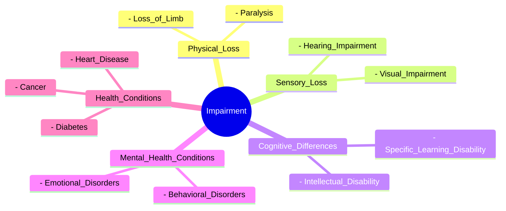
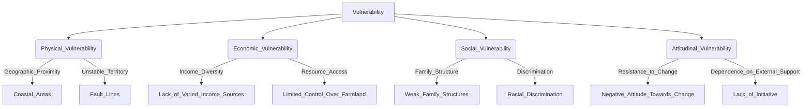
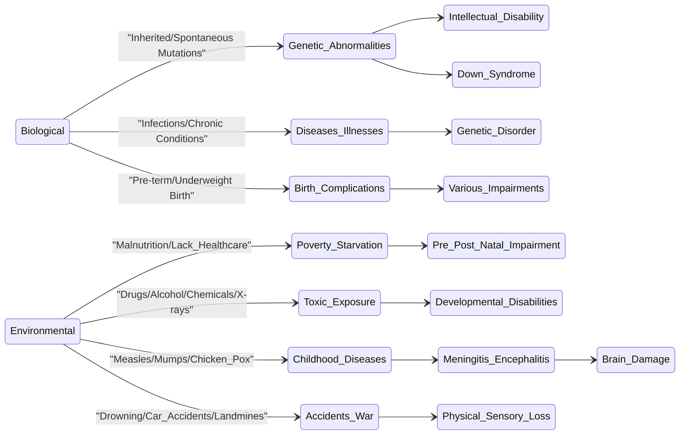
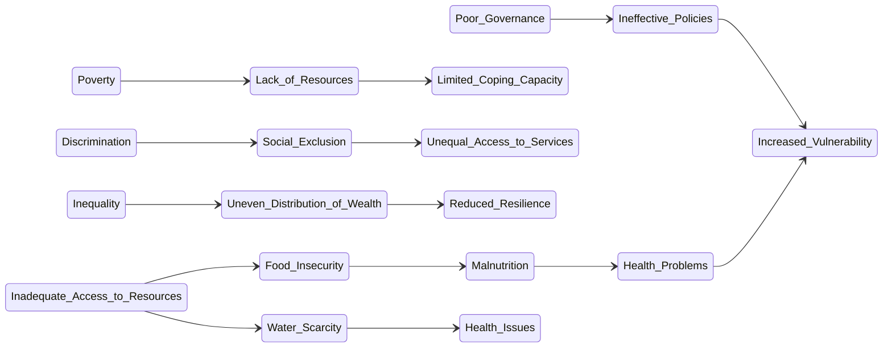
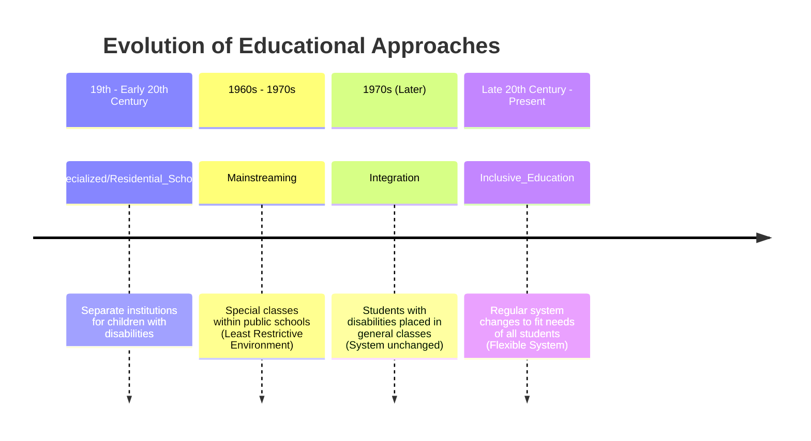
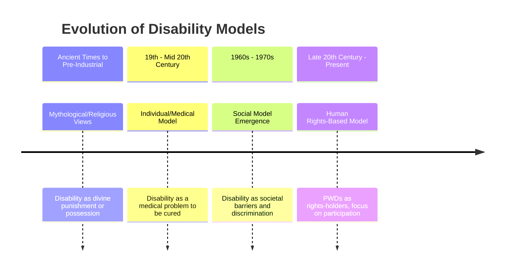
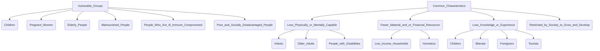

# 1 Understanding Disability And Vulnerability

Comprehensive resource for 1 Understanding Disability And Vulnerability.

---

## 1 Understanding Disability And Vulnerability Hub

## Overview
This unit provides a foundational understanding of disability and vulnerability, exploring their definitions, underlying causes, and the various forms they take within human diversity. It delves into the conceptual distinctions between impairment and disability, highlighting how societal attitudes and environmental barriers contribute to participation restrictions. Furthermore, the unit examines different categories of vulnerability, from physical and economic to social and attitudinal, alongside the historical evolution of modalities and models that have shaped our approach to inclusion and disability rights.

## Learning Objectives
*   Define disability, impairment, and vulnerability, distinguishing between these interconnected concepts.
*   Identify and explain the biological and environmental causes contributing to impairments and vulnerability.
*   Categorize and describe various types of impairments and vulnerable groups, understanding their unique characteristics.
*   Trace the historical progression of educational approaches towards inclusion, including specialized schools, mainstreaming, and integration.
*   Analyze the evolution of the concept of disability through traditional/charity, individual/medical, and social/human rights-based models.

## Unit Applications & Real-World Relevance
Understanding disability and vulnerability is critical for fostering inclusive societies, designing accessible environments, and developing equitable policies. This unit's concepts are directly applicable in fields such as social work, education, public health, urban planning, and policy-making. It equips individuals with the knowledge to challenge discrimination, advocate for marginalized groups, and contribute to creating a world where everyone can participate fully and effectively.

## Active Learning Prompts
*   Reflect on a situation where you witnessed an attitudinal barrier creating disability for a person with an impairment. How could this barrier be removed?
*   Compare and contrast the strengths and weaknesses of the Individual/Medical Model versus the Social Model of Disability in addressing the needs of persons with disabilities.
*   Propose three strategies a community could implement to reduce economic vulnerability among its members.
*   Research a policy or legal framework in your country related to inclusion. How well does it align with the principles of the Social Model of Disability?

## Unit Challenges & Common Misconceptions
A common challenge is the interchangeable use of "impairment" and "disability," leading to a misunderstanding that disability is solely a medical issue rather than a social construct. Another misconception is that vulnerability is purely an individual trait, overlooking the systemic and environmental factors that contribute to it. Overcoming these challenges requires a shift in perspective from an individual deficit model to a broader understanding of societal responsibility and collective action.

## Connections
  - [[Disability]]
    - [[Evolution_of_Disability_Models]]
      - [[Disability_Models]]
    - [[Educational_Approaches_Towards_Inclusion]]
  - [[Impairment]]
    - [[Causes_of_Impairment]]
    - [[Specific_Types_of_Impairments]]
  - [[Vulnerability]]
    - [[Categories_of_Vulnerability]]
    - [[Causes_of_Vulnerability]]
    - [[Vulnerable_Groups_and_Characteristics]]

## Next Steps for Deeper Understanding
Explore the United Nations Convention on the Rights of Persons with Disabilities (UN CRPD) in detail to understand international legal frameworks for inclusion. Research current inclusive education practices and universal design principles in architecture and technology. Investigate the intersectionality of disability with other forms of marginalization, such as gender, race, and socioeconomic status.

## Possible Questions
[[CC0113_1_Understanding_Disability_and_Vulnerability_Possible_Questions]]

---

---

## Disability

## Definition
Before proceeding, ensure you master [[Impairment]].
Disability is defined as "the interaction between persons with impairments and attitudinal and environmental barriers that hinders their full and effective participation in a society on an equal basis with others". It is not merely the physical condition but the societal reaction and the presence of barriers that restrict participation. This means that while an individual may have an [[Impairment]], they experience [[Disability]] when society's structures or attitudes create obstacles for them. A simpler way to think about it is that a person with a broken leg (impairment) isn't disabled by the leg itself, but by a staircase (environmental barrier) preventing them from entering a building.

## The Mental Model
Imagine trying to read a book in a library. The "impairment" might be that the book is in a foreign language you don't understand. However, the "disability" occurs if the library doesn't provide translation services or dictionaries, thereby preventing you from accessing the information. Your inability to read the book isn't solely due to the foreign language (your lack of understanding), but also the library's lack of support (an environmental barrier). The key takeaway is that the problem isn't inherent to you, but arises from the interaction with your environment.

## Context & Framework
#### Spot the Impostor (Don't be Fooled)
The terms "impairment" and "disability" are often used interchangeably, but this is a critical conceptual error. Impairment refers to the "purely factual absence of or loss of functioning in a body part," such as visual, physical, or hearing conditions. In contrast, disability arises from the interaction of that impairment with societal barriers. Failing to distinguish between these terms can lead to focusing solely on "fixing" the individual's impairment rather than addressing the systemic barriers that cause disability.

## The Mastery Deep Dive
#### The Crucial Distinction: Impairment vs. Disability
The core difference between [[Impairment]] and [[Disability]] lies in their locus of problem and solution. [[Impairment]] is about a body function or structure; it's a physiological or psychological condition. [[Disability]], however, shifts the focus from the individual's body to the societal environment. It is the result of participation restriction caused by attitudinal, environmental, and institutional barriers. For example, blindness is an impairment, but the inability to access information because it's not available in braille or audio format is a disability.

#### The "Wikipedia One-Liner" (The rigorous exam definition)
Disability, under the human rights-based model, is formally understood as a dynamic concept resulting from the mismatch between an individual's characteristics (impairments) and the inaccessible or discriminatory aspects of their environment. This definition emphasizes that disability is a socially constructed phenomenon, where the problem lies not with the individual, but with the disabling environment.

## Constraints & Limitations
#### The Linguistic Trap: Implicit Bias in Terminology
The pervasive interchangeable use of "impairment" and "disability" in everyday language is an engineering trade-off that reinforces a medical model perspective. When language conflates the two, it implicitly places the burden of "fixing" on the individual with the impairment, rather than on society to remove barriers. This linguistic trap hinders the adoption of inclusive practices by diverting attention from systemic issues.

## Significance & Application
Understanding [[Disability]] as a social construct is fundamental to advocating for human rights and promoting inclusive societies. This conceptualization drives policies aimed at universal design, accessibility, and anti-discrimination laws. It shifts the focus from medical cures to social justice, ensuring that individuals with impairments can participate fully and effectively on an equal basis with others.

## The Worked Example
Consider a person who is deaf.
*   **Impairment:** The audiological condition of deafness. This is a factual absence of hearing function.
*   **Disability:** If this person attends a lecture without a sign language interpreter or captioning, their ability to participate and learn is restricted. The *disability* here is not the deafness itself, but the lack of accessible communication within the educational environment.

**Step 1: Identify the Impairment.**
The individual cannot hear sounds due to their audiological condition.

**Step 2: Identify the Barrier.**
The lecture environment lacks provisions for accessible communication (no interpreter, no captions).

**Step 3: Recognize the Disability.**
The interaction between the impairment (deafness) and the environmental barrier (lack of communication access) leads to participation restriction (inability to understand the lecture). This restriction is the disability.

## The Proving Ground
*Test your mastery. Cover the solutions below to test yourself first.*

#### Level 1: The Sanity Check (Verification)
**The Component Check:** What specific barriers, as identified by the UN CRPD, contribute to disability when interacting with a person's impairment?
> **Solution:** Attitudinal and environmental barriers.

#### Level 2: The Crucible (Mastery & Edge Cases)
**The Broken System:** An individual has a mobility impairment that requires the use of crutches. They are unable to attend a job interview because the public transportation system in their city lacks ramps on buses and trains. Is the primary problem here the individual's mobility impairment or a systemic failure? Explain, clearly distinguishing between impairment and disability.
> **Solution:** The primary problem is a systemic failure, contributing to a disability. The individual's mobility impairment (using crutches) is a physical condition. However, the *disability* arises from the interaction between this impairment and the environmental barrier of inaccessible public transportation (lack of ramps). The system is "broken" because it creates a participation restriction, hindering the individual's ability to attend the interview, which is a societal interaction. The solution lies in making the transport system accessible, not in "curing" the use of crutches.

## Key Takeaways
*   Disability is an umbrella term encompassing impairment, activity limitation, and participation restriction, primarily defined by the interaction between an individual's impairment and societal barriers.
*   The distinction between "impairment" (a physical or mental condition) and "disability" (societal restrictions) is crucial for shifting focus from individual deficits to systemic issues.
*   Understanding disability as a social construct is vital for promoting inclusive policies and ensuring equitable participation for all.

## Knowledge Graph Connections
| Concept                     | Connection / Relationship                                                         |
| :
-------------------------- | :
-------------------------------------------------------------------------------- |
| [[Impairment]]              | Disability arises from the interaction between impairments and societal barriers.   |
| [[Evolution_of_Disability_Models]] | The understanding of disability has evolved through various models.               |
| [[Disability_Models]]       | Specific models (e.g., social model) define disability in different ways.         |
| [[Educational_Approaches_Towards_Inclusion]] | Inclusive education aims to remove barriers causing disability in learning. |
---

---

## Impairment

## Definition
Before proceeding, ensure you master [[Disability]].
Impairment is defined as the "purely factual absence of or loss of functioning in a body part". It refers to the physical or mental condition itself, such as visual, physical, hearing, or intellectual conditions. An impairment may lead to activity limitation, depending on its severity, type, and onset. It is a medical or biological reality, distinct from the broader concept of [[Disability]]. For instance, having a hearing loss is an impairment.

## The Mental Model
Imagine your body as a finely tuned machine. An "impairment" is like a specific part of that machine having a malfunction – a gear is missing, a circuit is broken, or a sensor isn't working correctly. This malfunction is a factual aspect of the machine's internal state. It's not about how the machine interacts with its environment (which would be [[Disability]]), but purely about an internal component not performing its intended function. For example, a car engine having a faulty spark plug is an impairment of the car.

*Note: This `mindmap` visually represents Impairment as the root concept, with branches extending to various categories and specific examples of impairments, highlighting their diverse nature.*

## Context & Framework
#### Where Does it Live? (The Map)
[[Impairment]] is fundamentally a biological or physiological reality residing within an individual. It is a medical phenomenon that can be objectively identified, even if its causes are sometimes complex or unknown. Understanding where [[Impairment]] "lives" helps distinguish it from [[Disability]], which "lives" in the interaction between the individual and their environment. An impairment is part of human diversity, affecting a significant portion of the global population.

## The Mastery Deep Dive
#### The "Purely Factual" Nature of Impairment
The definition of [[Impairment]] as a "purely factual absence of or loss of functioning" is crucial. This emphasizes its objective, observable, and measurable characteristics. It's about what is, physiologically speaking, rather than societal interpretations or environmental barriers. This factual basis allows for medical diagnosis and intervention targeting the impairment itself. For example, a diagnosis of diabetes identifies an impairment in the body's ability to regulate blood sugar.

#### Who are the Neighbors?
[[Impairment]] is closely linked to [[Causes_of_Impairment]], as understanding the origins (biological or environmental) helps in prevention or management. It is also connected to [[Specific_Types_of_Impairments]], which categorize the various forms an impairment can take. Crucially, while distinct, [[Impairment]] is the precursor to [[Disability]], as the latter arises when an impairment interacts with disabling barriers.

## Constraints & Limitations
#### The Blurred Lines: When "Impairment" Gets Confused
A significant constraint in the common understanding of [[Impairment]] is its frequent confusion with [[Disability]]. This overlap hinders effective intervention, as focusing solely on "curing" or "treating" the impairment often overlooks the necessity of removing societal barriers that create disability. For instance, providing a hearing aid (addressing impairment) is valuable, but it does not fully address the disability if public spaces lack accessible communication methods beyond spoken language.

## Significance & Application
Accurate identification of [[Impairment]] is vital for medical diagnosis, rehabilitation, and the development of assistive technologies. It informs healthcare strategies and early intervention programs. However, it must be balanced with the understanding of [[Disability]] to ensure a holistic approach that addresses both individual needs and societal responsibilities.

## The Worked Example
Consider an individual diagnosed with glaucoma, a condition that damages the optic nerve and can lead to vision loss.

**Step 1: Identify the Impairment.**
The individual has glaucoma, which is causing damage to the optic nerve. This is a purely factual loss of functioning in a body part (the eyes/optic nerve). The specific impairment is "visual impairment."

**Step 2: Understand the Cause.**
The cause of this impairment is biological (a disease affecting the optic nerve).

**Step 3: Recognize Potential Activity Limitation.**
Depending on the severity of the glaucoma, the individual may experience limitations in activities such as reading, driving, or recognizing faces.

## The Proving Ground
*Test your mastery. Cover the solutions below to test yourself first.*

#### Level 1: The Sanity Check (Verification)
**The Neighbor Check:** In the context of the definition provided, what is one key characteristic of an impairment?
> **Solution:** It is a "purely factual absence of or loss of functioning in a body part."

#### Level 2: The Crucible (Mastery & Edge Cases)
**The Sort:** A person has a chronic back condition that causes persistent pain and limits their ability to lift heavy objects. Categorize this situation as either primarily an [[Impairment]] or a [[Disability]], and justify your choice based on the definition of impairment.
> **Solution:** This is primarily an [[Impairment]]. The chronic back condition causing pain and limiting the ability to lift is a "purely factual absence of or loss of functioning in a body part" (the back's normal movement and strength). The pain and physical limitation are internal, physiological realities, aligning directly with the definition of impairment. While this impairment *could* lead to disability if societal barriers (e.g., jobs requiring heavy lifting without accommodation) are present, the condition itself is the impairment.

## Key Takeaways
*   Impairment is a factual absence or loss of functioning in a body part, such as visual, hearing, or physical conditions.
*   It is a biological or medical reality, distinct from disability, which arises from the interaction of impairment with societal barriers.
*   Understanding impairment is crucial for medical diagnosis and intervention, but must be contextualized within the broader understanding of disability.

## Knowledge Graph Connections
| Concept                     | Connection / Relationship                                                                   |
| :
-------------------------- | :
------------------------------------------------------------------------------------------ |
| [[Disability]]              | Impairment is a precursor to disability, which is the interaction with barriers.            |
| [[Causes_of_Impairment]]    | Specific biological and environmental factors lead to various types of impairments.         |
| [[Specific_Types_of_Impairments]] | Impairment encompasses a wide range of categories, such as sensory, physical, and intellectual. |
---

---

## Vulnerability

## Definition
Vulnerability refers to the "state of being exposed to the possibility of being attacked or harmed, either physically or emotionally". It implies a susceptibility to damage, injury, or negative influence from various sources, including social injustice and malpractices. Vulnerable groups are those who are disproportionately susceptible to such harm. For example, children in conflict zones are highly vulnerable to physical and emotional harm.

## The Mental Model
Imagine a house built on a floodplain during a heavy rainy season. The house itself is sturdy, but its location makes it "vulnerable" to flooding. It is exposed to the possibility of harm from an external force (the rising water). The vulnerability isn't an inherent flaw in the house's construction, but rather its position relative to potential threats. Similarly, human vulnerability arises from an individual's or group's exposure to adverse conditions and their limited capacity to cope with them.

## Context & Framework
#### Spot the Impostor (Don't be Fooled)
Vulnerability is often mistaken for weakness or inherent flaw in an individual or group. However, it is more accurately understood as a state of exposure and susceptibility, often driven by external factors such as social, economic, or environmental conditions. A key distinction is that while a person might possess certain characteristics, their vulnerability arises from how these characteristics interact with external threats. For instance, being elderly is a characteristic, but lack of access to healthcare or a support network can create vulnerability.

## The Mastery Deep Dive
#### The Nuance of Exposure and Harm
The definition of [[Vulnerability]] explicitly highlights "exposure to the possibility of being attacked or harmed". This emphasizes a proactive understanding, where the focus is not just on current suffering but on the potential for future harm. This harm can be multifaceted, encompassing physical injury, emotional distress, economic hardship, or social marginalization. Recognizing this potential for harm is crucial for implementing preventative and protective measures.

#### The "Wikipedia One-Liner" (The rigorous exam definition)
Vulnerability, in an academic context, is the diminished capacity of an individual or group to anticipate, cope with, resist, and recover from the impact of a natural or human-made hazard. It is a condition determined by physical, social, economic, and environmental factors or processes, which increases the susceptibility of an individual or a community to the impact of hazards.

## Constraints & Limitations
#### The Illusion of Control: Blaming the Victim
A significant trap when discussing [[Vulnerability]] is the tendency to attribute it solely to the perceived deficiencies of the vulnerable group, rather than acknowledging the systemic and external factors that create their susceptibility. This "blaming the victim" mentality ignores the role of poor governance, discrimination, and inequality in fostering vulnerability. For example, blaming a homeless person for their situation without considering the lack of affordable housing or mental health support is a misdiagnosis of the true causes of their vulnerability.

## Significance & Application
Understanding [[Vulnerability]] is essential for humanitarian aid, disaster preparedness, social policy development, and human rights advocacy. It guides efforts to protect at-risk populations, strengthen community resilience, and address the root causes of marginalization. By identifying who is vulnerable and why, interventions can be tailored to reduce exposure to harm and increase coping capacities.

## The Worked Example
Consider a low-income community located in a flood-prone area, where houses are built with unstable materials and there is no early warning system.

**Step 1: Identify the Exposure.**
The community is physically exposed to floods due to its location and inadequate housing infrastructure.

**Step 2: Identify the Potential Harm.**
The potential harm includes loss of life, injury, destruction of homes, and displacement.

**Step 3: Analyze Contributing Factors (Why are they so exposed and susceptible?).**
*   **Physical Vulnerability:** Geographic proximity to the flood source, unstable housing materials.
*   **Economic Vulnerability:** Limited financial resources to build resilient homes or relocate, dependence on flood-affected agriculture.
*   **Social Vulnerability:** Possibly weak community organizations for disaster response, lack of access to information or warning systems.

## The Proving Ground
*Test your mastery. Cover the solutions below to test yourself first.*

#### Level 1: The Sanity Check (Verification)
**The Component Check:** What is the core definition of vulnerability?
> **Solution:** The state of being exposed to the possibility of being attacked or harmed, either physically or emotionally.

#### Level 2: The Crucible (Mastery & Edge Cases)
**The Broken System:** A group of migrant workers, due to their undocumented status, are hesitant to report exploitative labor practices to authorities, fearing deportation. This hesitation leads to them being subjected to unsafe working conditions and unfairly low wages. Is their vulnerability primarily physical, economic, social, or attitudinal? Justify your choice by explaining how their undocumented status creates this specific type of vulnerability.
> **Solution:** This is primarily a **Social Vulnerability**. While it manifests in economic (low wages) and physical (unsafe conditions) harm, the root cause of their heightened susceptibility is their precarious social standing as undocumented migrants. Their legal status creates a social barrier, limiting their access to justice, protection under labor laws, and collective bargaining, making them susceptible to exploitation without recourse. The "broken system" is one that fails to provide equal rights and protections regardless of immigration status, thereby creating and exacerbating their vulnerability.

## Key Takeaways
*   Vulnerability is the state of being exposed to the possibility of harm, physically or emotionally, often due to various forms of social injustice.
*   It encompasses physical, economic, social, and attitudinal categories, highlighting diverse forms of susceptibility.
*   Understanding vulnerability requires acknowledging external factors and systemic issues that contribute to a group's exposure to adverse impacts.

## Knowledge Graph Connections
| Concept                     | Connection / Relationship                                                              |
| :
-------------------------- | :
------------------------------------------------------------------------------------- |
| [[Categories_of_Vulnerability]] | Vulnerability is classified into distinct categories, such as physical and economic.   |
| [[Causes_of_Vulnerability]] | Various factors, like poor governance and discrimination, contribute to vulnerability.   |
| [[Vulnerable_Groups_and_Characteristics]] | Specific groups possess features that make them particularly susceptible to harm. |
---

---

## Categories Of Vulnerability

## Definition
Before proceeding, ensure you master [[Vulnerability]].
[[Categories_of_Vulnerability]] refers to the classification system used to delineate the different dimensions or types through which individuals or communities can be exposed to harm or disadvantage. These categories include Physical, Economic, Social, and Attitudinal Vulnerability, each representing a distinct set of factors that contribute to susceptibility. Understanding these categories is crucial for a comprehensive analysis of [[Vulnerability]] and for developing targeted interventions. A simpler way to think about it is like different types of weaknesses a shield might have: one part might be weak against fire (physical), another against blunt force (economic), and so on.

## The Mental Model
Imagine a fortress with several different walls, each protecting against a specific type of attack. If one wall is weak against a physical assault, that's physical vulnerability. If another wall is weak against siege (resource depletion), that's economic vulnerability. If internal discord makes the garrison inefficient, that's social vulnerability. And if the defenders simply refuse to adapt to new siege tactics, that's attitudinal vulnerability. These distinct weaknesses (categories) define the fortress's overall susceptibility.

*Note: This `graph TD` illustrates the main categories of vulnerability branching out from the core concept of Vulnerability, with examples of contributing factors for each category, showing a clear hierarchical classification.*

## Context & Framework
#### The Family Tree
[[Categories_of_Vulnerability]] form a "family tree" where the overarching concept of [[Vulnerability]] branches into distinct, yet often interconnected, types. This hierarchical classification helps to systematically identify and address the specific factors that make individuals or communities susceptible to harm. For instance, `Physical_Vulnerability` (like living near a fault line) might exacerbate `Economic_Vulnerability` if a disaster destroys livelihoods, demonstrating how branches can interact.

## The Mastery Deep Dive
#### The Exhaustive List of Vulnerability Types
The four primary [[Categories_of_Vulnerability]] provide an exhaustive framework for analysis:
1.  **Physical Vulnerability:** Determined by geographic proximity to disaster sources (e.g., coastlines, fault lines) or exposure to hazardous environments.
2.  **Economic Vulnerability:** Assessed by the diversity of income sources, access to means of production (e.g., land, capital), and the adequacy of economic fallback mechanisms.
3.  **Social Vulnerability:** Characterized by weak family structures, lack of leadership, unequal participation in decision-making, and discrimination based on race, ethnicity, language, or religion.
4.  **Attitudinal Vulnerability:** Reflects a community's negative attitude towards change, lack of initiative, and resultant dependence on external support, leading to disunity, hopelessness, and reduced coping capacity.

#### The "Wikipedia One-Liner" (The rigorous exam definition)
Categories of vulnerability are systematic groupings that delineate the various contributing factors and dimensions through which individuals, communities, or systems are susceptible to damage, stress, or the adverse impacts of hazards, encompassing physical, economic, social, and attitudinal dimensions.

## Constraints & Limitations
#### The Interconnected Web: No Category Stands Alone
A significant trap in analyzing [[Categories_of_Vulnerability]] is treating each category in isolation. While useful for classification, in reality, these vulnerabilities are often deeply interconnected and mutually reinforcing. For example, a community's `Physical_Vulnerability` to floods might be exacerbated by `Economic_Vulnerability` (lack of funds for resilient housing) and `Social_Vulnerability` (weak community organization for disaster response). Failing to recognize this interconnected web can lead to incomplete or ineffective interventions.

## Significance & Application
Understanding [[Categories_of_Vulnerability]] is fundamental for disaster risk reduction, development planning, and social protection programs. It enables policymakers and practitioners to conduct comprehensive vulnerability assessments, identify specific risk factors, and design multi-sectoral interventions that address the root causes of susceptibility.

## The Worked Example
Consider a community heavily reliant on fishing, located in a coastal area frequently hit by typhoons.

**Step 1: Identify Physical Vulnerability.**
*   **Geographic proximity:** The community is located on the coastline, directly exposed to typhoons and storm surges.
*   **Infrastructure:** Housing might be traditional and not built to withstand severe weather.

**Step 2: Identify Economic Vulnerability.**
*   **Lack of varied income sources:** Heavy reliance on fishing means that a single disaster can devastate the primary livelihood of the entire community.
*   **Limited fallback mechanisms:** Few savings, lack of insurance, and limited alternative employment opportunities.

**Step 3: Identify Social Vulnerability (if applicable).**
*   If the community has weak local leadership or poor communication channels, it may struggle to organize effective evacuation or relief efforts.

**Step 4: Identify Attitudinal Vulnerability (if applicable).**
*   If the community resists adopting new, typhoon-resistant housing designs due to tradition or mistrust of external aid, this can increase their long-term vulnerability.

## The Proving Ground
*Test your mastery. Cover the solutions below to test yourself first.*

#### Level 1: The Sanity Check (Verification)
**The Neighbor Check:** Name two of the four primary categories of vulnerability.
> **Solution:** Physical Vulnerability and Economic Vulnerability (or Social, Attitudinal).

#### Level 2: The Crucible (Mastery & Edge Cases)
**The Sort:** A community experiences a severe drought, leading to crop failures and widespread food shortages. The local government has ineffective early warning systems, and community members often distrust official communications. While the drought is an environmental event, categorize the most prominent forms of *human* vulnerability at play here, and explain how the government's shortcomings contribute to them.
> **Solution:** The most prominent forms of human vulnerability here are **Economic Vulnerability** (due to crop failures and food shortages directly impacting livelihoods and food security) and **Social Vulnerability** (due to weak family structures, lack of leadership for decision making and conflict resolution, unequal participation in decision making, weak or no community organizations, and the one in which people are discriminated on racial, ethnic, linguistic or religious basis). The government's ineffective early warning systems and the community's distrust of official communications directly contribute to `Social_Vulnerability` by eroding the social fabric, hindering coordinated response efforts, and limiting access to vital information for decision-making. This amplifies the economic impacts of the drought, making the community more susceptible to harm.

## Key Takeaways
*   Vulnerability is classified into four categories: Physical, Economic, Social, and Attitudinal.
*   Each category represents distinct factors contributing to exposure and susceptibility to harm.
*   Understanding these categories is crucial for comprehensive analysis and targeted interventions in disaster risk reduction and development.

## Knowledge Graph Connections
| Concept                     | Connection / Relationship                                                                   |
| :
-------------------------- | :
------------------------------------------------------------------------------------------ |
| [[Vulnerability]]           | These categories provide a detailed classification of the broader concept of vulnerability.  |
| [[Causes_of_Vulnerability]] | The causes of vulnerability often manifest across these various categories.                 |
| [[Vulnerable_Groups_and_Characteristics]] | Specific vulnerable groups often experience multiple, overlapping categories of vulnerability. |
---

---

## Causes Of Impairment

## Definition
Before proceeding, ensure you master [[Impairment]].
[[Causes_of_Impairment]] refers to the identifiable biological and environmental factors that lead to the "absence of or loss of functioning in a body part". These causes can range from genetic abnormalities and diseases to malnutrition, exposure to toxins, and unfortunate accidents. Understanding these causes is crucial for prevention, early intervention, and addressing the root medical or environmental contributors to [[Impairment]]. A simpler way to think about it is like identifying what "broke" a specific part of a machine: was it a faulty internal component (biological) or an external impact (environmental)?

## The Mental Model
Imagine a complex biological system, like a delicate ecosystem. The "causes of impairment" are like various stressors that can disrupt this ecosystem's balance. Some stressors are internal, inherent to the system itself (biological, like a genetic mutation in a species). Others are external, coming from the environment (environmental, like pollution or a natural disaster). Both types of stressors can lead to a part of the ecosystem (body part/function) becoming damaged or non-functional.

*Note: This `stateDiagram-v2` illustrates the primary categories of impairment causes (Biological and Environmental), with branches showing specific factors and the types of impairments they can lead to. It emphasizes the pathways from cause to effect.*

## Context & Framework
#### The "Pilot's Checklist" (Do Not Skip)
Identifying the [[Causes_of_Impairment]] is like running a diagnostic checklist for a complex system. The primary categories are `Biological` and `Environmental`. Within `Biological`, factors like genetic abnormalities, certain diseases, and birth complications are critical. Under `Environmental`, issues such as poverty, exposure to toxins, childhood diseases, and accidents are key. A thorough checklist approach ensures that all potential contributing factors are considered when trying to understand the origin of an impairment.

## The Mastery Deep Dive
#### The "It's Not Working!" - The Fix-it Guide
When an [[Impairment]] manifests, understanding its cause is the first step in a "fix-it guide."
1.  **Biological Causes:** These are often intrinsic to the body's systems.
    *   **Genetic Factors:** Abnormalities in genes (e.g., Down syndrome), genetic inheritance, and spontaneous mutations can lead to intellectual and multiple impairments. Sometimes, diseases or over-exposure to X-rays can induce genetic disorders.
    *   **Perinatal Issues:** Pre-term or underweight births are also significant biological factors that can result in various forms of impairment.
2.  **Environmental Causes:** These arise from external interactions with the individual.
    *   **Socio-economic Factors:** Poverty, malnutrition, and lack of access to healthcare, particularly during pre- and postnatal periods, can profoundly affect child development and cause impairment.
    *   **Toxic Exposures:** Maternal use of drugs, alcohol, tobacco, and exposure to toxic chemicals (e.g., lead, mercury) or certain illnesses (e.g., rubella, toxoplasmosis) during pregnancy can cause intellectual and other disabilities.
    *   **Childhood Illnesses:** Diseases like whooping cough, measles, and chicken pox, if leading to meningitis or encephalitis, can cause irreversible brain damage.
    *   **Accidents & Conflict:** Traumatic events such as drowning, car accidents, falls, landmines, or war can result in significant physical and sensory losses.

#### The "Wikipedia One-Liner" (The rigorous exam definition)
The causes of impairment are the etiological factors, categorized broadly into biological (intrinsic, e.g., genetic, congenital) and environmental (extrinsic, e.g., toxic exposure, trauma, socio-economic deprivation) determinants, that directly contribute to the physiological or psychological absence or loss of bodily function.

## Constraints & Limitations
#### The Warning Lights: Signs of Trouble
A critical trap when assessing [[Causes_of_Impairment]] is overlooking the "warning lights" – early indicators or risk factors that, if ignored, significantly increase the likelihood of impairment. For instance, the adverse effects of poverty, starvation, and lack of access to healthcare are major warning lights during pre- and postnatal periods. Similarly, maternal exposure to drugs or toxins and common childhood diseases without proper immunization are red flags. Failing to identify and act on these warning lights due to societal neglect or lack of awareness can lead to preventable impairments.

## Significance & Application
Understanding the [[Causes_of_Impairment]] is vital for public health initiatives, medical research, and policy development focused on prevention and early intervention. It enables targeted campaigns for maternal and child health, improved nutrition, immunization programs, and safety regulations to minimize accidents. This knowledge empowers societies to reduce the incidence of preventable impairments and improve overall population health.

## The Worked Example
Consider a child born with intellectual disability. We need to investigate potential causes.

**Step 1: Investigate Biological Causes.**
*   **Genetic history:** Are there known genetic conditions in the family? Could it be Down syndrome or another chromosomal abnormality?
*   **Maternal health during pregnancy:** Was the mother exposed to any diseases (e.g., rubella) or toxins? Were there any birth complications like prematurity?
    *   If genetic abnormalities are detected, it points to a `Biological` cause.

**Step 2: Investigate Environmental Causes.**
*   **Maternal lifestyle:** Did the mother use drugs, alcohol, or tobacco during pregnancy?
*   **Socio-economic conditions:** Was there severe maternal malnutrition or lack of prenatal care?
*   **Childhood illnesses:** Did the child suffer from severe infections like meningitis after birth?
*   **Exposure to toxins:** Was the child exposed to lead or mercury?
    *   If, for example, severe maternal malnutrition is identified, it points to an `Environmental` cause.

## The Proving Ground
*Test your mastery. Cover the solutions below to test yourself first.*

#### Level 1: The Sanity Check (Verification)
**The Tool Check:** What are the two main scientific categories of causes for impairment?
> **Solution:** Biological and Environmental.

#### Level 2: The Crucible (Mastery & Edge Cases)
**The Disaster Drill:** A child from a low-income family develops a severe hearing impairment after repeated, untreated ear infections during infancy. The family had limited access to healthcare due to financial constraints and geographic isolation. While the immediate cause of the hearing damage is biological (the infection), what "warning lights" (systemic issues) were blinking that highlight the predominant *category* of cause for this impairment from a broader societal perspective, and what could have been the "immediate recovery step" to prevent it?
> **Solution:** While the direct damage to the ear (biological) caused the hearing impairment, the predominant *category* of cause from a broader societal perspective is **Environmental**. The "warning lights" were the systemic issues of **poverty, lack of access to healthcare, and geographic isolation**. These environmental factors prevented early diagnosis and treatment of the ear infections. The "immediate recovery step" (or preventative measure) would have been to ensure accessible and affordable healthcare for the family, providing timely treatment for the ear infections to prevent irreversible damage and the subsequent impairment. This highlights how environmental disadvantages can indirectly lead to biological impairments.

## Key Takeaways
*   Impairments are caused by two major categories: Biological (e.g., genetics, birth complications) and Environmental (e.g., poverty, toxic exposure, accidents).
*   Biological causes originate internally, while environmental causes stem from external factors and interactions.
*   Understanding these causes is crucial for effective prevention, early intervention, and public health strategies.

## Knowledge Graph Connections
| Concept                     | Connection / Relationship                                                          |
| :
-------------------------- | :
--------------------------------------------------------------------------------- |
| [[Impairment]]              | This concept details the specific origins and factors leading to various impairments. |
| [[Specific_Types_of_Impairments]] | Understanding causes helps in categorizing and preventing different types of impairments. |
| [[Vulnerability]]           | Environmental causes of impairment, like poverty, often overlap with factors contributing to vulnerability. |
---

---

## Causes Of Vulnerability

## Definition
Before proceeding, ensure you master [[Vulnerability]].
[[Causes_of_Vulnerability]] refer to the various factors, both systemic and situational, that increase an individual's or community's exposure to harm and diminish their capacity to cope. These include poor governance, poverty, discrimination, inequality, and inadequate access to resources and livelihoods. Understanding these causes is essential for developing effective strategies to mitigate [[Vulnerability]] and build resilience. A simpler way to think about it is like identifying all the reasons why a person might be susceptible to getting sick: it could be a weak immune system (internal factor) or exposure to a virus (external factor).

## The Mental Model
Imagine a sturdy ship at sea. Its "vulnerability" to sinking isn't just about a hole in its hull (an immediate threat). It's also about things like whether the crew is well-trained (poor governance if not), if the ship has enough supplies (poverty), if some crew members are not allowed access to safety equipment (discrimination), or if the lifeboats are insufficient for everyone (inequality). All these factors contribute to the ship's overall susceptibility to disaster.

*Note: This `stateDiagram-v2` illustrates the interconnected web of factors that contribute to vulnerability. It shows how poor governance, poverty, discrimination, inequality, and inadequate access to resources lead to various conditions that ultimately increase overall vulnerability.*

## Context & Framework
#### The "Pilot's Checklist" (Do Not Skip)
When assessing [[Causes_of_Vulnerability]], a rigorous checklist is essential. Key factors include:
*   **Poor Governance:** Weak institutions, corruption, and lack of accountability.
*   **Poverty:** Limited financial resources, lack of assets, and insecure livelihoods.
*   **Discrimination:** Marginalization based on race, gender, religion, or other characteristics.
*   **Inequality:** Uneven distribution of resources, power, and opportunities.
*   **Inadequate Access to Resources and Livelihoods:** Lack of access to education, healthcare, clean water, land, or stable employment.
This comprehensive checklist helps ensure that no critical contributing factor is overlooked.

## The Mastery Deep Dive
#### The "It's Not Working!" - The Fix-it Guide
When a community or group is identified as vulnerable, understanding the [[Causes_of_Vulnerability]] is the essential "fix-it guide" to intervene effectively:
1.  **Poor Governance:** Ineffective policies, corruption, and a lack of transparency can directly lead to a misallocation of resources, weak infrastructure, and a failure to protect citizens, thereby increasing their exposure to harm.
2.  **Poverty:** This is a fundamental cause, limiting access to essential services like healthcare, education, and safe housing, and reducing the capacity of individuals to recover from shocks (e.g., natural disasters, economic downturns).
3.  **Discrimination:** Systemic discrimination based on factors like ethnicity, gender, or disability can lead to social exclusion, unequal opportunities, and marginalization, making certain groups disproportionately susceptible to adverse impacts.
4.  **Inequality:** The uneven distribution of wealth, power, and opportunities creates stark differences in resilience. Those with fewer resources are less able to prepare for or recover from crises.
5.  **Inadequate Access to Resources and Livelihoods:** A lack of access to productive assets (e.g., land, capital), education, stable employment, healthcare, or clean water directly exposes individuals to various harms, from food insecurity to health crises.

#### The "Wikipedia One-Liner" (The rigorous exam definition)
The causes of vulnerability are the systemic conditions, including governance failures, socio-economic disparities, discriminatory practices, and resource inequities, that collectively enhance the susceptibility of individuals or communities to hazards and diminish their inherent capacity for resilience and recovery.

## Constraints & Limitations
#### The Warning Lights: Signs of Trouble
A crucial trap in addressing [[Causes_of_Vulnerability]] is ignoring the "warning lights" that signal underlying systemic issues. For instance, high rates of chronic malnutrition despite sufficient food production can indicate `Inequality` in food distribution or `Poverty` limiting access. Similarly, persistent ethnic tensions or lack of representation in decision-making are strong indicators of `Social_Vulnerability` driven by `Discrimination`. Failing to acknowledge these systemic warning lights leads to superficial interventions that do not address the root causes, resulting in recurring vulnerability.

## Significance & Application
Understanding [[Causes_of_Vulnerability]] is fundamental for effective humanitarian action, sustainable development, and social justice advocacy. It moves beyond symptomatic relief to addressing the structural issues that create and perpetuate vulnerability. This knowledge empowers governments, NGOs, and communities to design policies and programs that build long-term resilience and promote equitable opportunities for all.

## The Worked Example
Consider a marginalized indigenous community living in a resource-rich area, yet experiencing high levels of poverty and limited access to public services.

**Step 1: Identify Poor Governance.**
*   Lack of representation in local or national decision-making bodies.
*   Government policies that prioritize external corporate interests over indigenous land rights or resource management.

**Step 2: Identify Poverty.**
*   Low income levels, lack of stable employment opportunities for community members.
*   Limited access to capital or credit for economic development initiatives.

**Step 3: Identify Discrimination.**
*   Historical and ongoing discrimination leading to exclusion from mainstream economic and political systems.
*   Cultural and linguistic barriers that hinder access to services provided in dominant languages.

**Step 4: Identify Inequality.**
*   Uneven distribution of the wealth generated from local resources, with benefits primarily accruing to external entities.
*   Significant disparities in access to education, healthcare, and infrastructure compared to non-indigenous populations.

**Step 5: Identify Inadequate Access to Resources and Livelihoods.**
*   Limited control over ancestral lands and natural resources due to external encroachment.
*   Lack of access to quality education or training that would enable diverse livelihood options.

## The Proving Ground
*Test your mastery. Cover the solutions below to test yourself first.*

#### Level 1: The Sanity Check (Verification)
**The Tool Check:** Name three known contributing factors to vulnerability.
> **Solution:** Poor governance, poverty, discrimination (or inequality, inadequate access to resource and livelihood).

#### Level 2: The Crucible (Mastery & Edge Cases)
**The Disaster Drill:** A coastal fishing community is repeatedly devastated by severe storms. While the `Physical_Vulnerability` (proximity to the coast) is evident, identify two `Causes_of_Vulnerability` (from the broader list) that might be exacerbating their `Economic_Vulnerability` and preventing their recovery, and explain how these causes act as "warning lights" for systemic issues. What "immediate recovery step" (in terms of policy or intervention) could address these deeper causes?
> **Solution:** Two `Causes_of_Vulnerability` exacerbating their `Economic_Vulnerability` could be **Poverty** and **Inadequate_Access_to_Resources_and_Livelihoods**.
    *   **Poverty:** If the community has limited savings, lack of insurance, and insecure livelihoods (e.g., over-reliance on a single fishing method), each storm pushes them deeper into poverty, making recovery harder. This acts as a warning light for systemic economic disparities.
    *   **Inadequate_Access_to_Resources_and_Livelihoods:** If they lack access to alternative employment opportunities, capital for rebuilding boats/homes, or government relief funds, their economic recovery is severely hampered. This acts as a warning light for structural inequalities in resource distribution and support systems.
The "immediate recovery step" could be to establish a **community-led microfinance scheme** to provide low-interest loans for rebuilding, combined with **vocational training programs** to diversify livelihoods beyond fishing, and advocating for **government-subsidized disaster insurance** tailored for coastal communities. These interventions address the systemic economic and resource-access issues, not just the physical threat.

## Key Takeaways
*   Vulnerability is caused by systemic factors like poor governance, poverty, discrimination, inequality, and inadequate access to resources.
*   These causes create and perpetuate conditions that increase susceptibility to harm and reduce coping capacity.
*   Addressing the root causes of vulnerability is critical for building resilience and promoting social justice.

## Knowledge Graph Connections
| Concept                     | Connection / Relationship                                                                   |
| :
-------------------------- | :
------------------------------------------------------------------------------------------ |
| [[Vulnerability]]           | This concept explains the fundamental factors that contribute to the state of vulnerability.  |
| [[Categories_of_Vulnerability]] | The causes of vulnerability often manifest and are classified within these categories.      |
| [[Vulnerable_Groups_and_Characteristics]] | Specific vulnerable groups are disproportionately affected by these underlying causes.   |
---

---

## Educational Approaches Towards Inclusion

## Definition
Before proceeding, ensure you master [[Disability]].
[[Educational_Approaches_Towards_Inclusion]] refers to the historical progression and various methodologies adopted in educational systems to address the needs of children with disabilities, moving from segregated to more integrated and ultimately inclusive settings. These approaches include Specialized/Residential Schools, Mainstreaming, Integration, and Inclusive Education, each representing a distinct philosophy and practice in fostering educational access and participation. A simpler way to think about it is like the evolution of transportation: from separate carts (specialized schools) to shared roads with specific lanes (mainstreaming/integration) to a completely integrated and universally designed transit system (inclusive education).

## The Mental Model
Imagine a playground. Initially, children with disabilities were in a completely separate playground (Specialized Schools). Then, they were allowed into the main playground but had to stick to a designated small area (Mainstreaming). Later, they could play anywhere on the main playground, but the equipment wasn't changed for them, so they still struggled (Integration). Finally, the playground was completely redesigned with universally accessible equipment so *all* children could play together easily (Inclusive Education).

*Note: This `timeline` illustrates the historical development of educational approaches for children with disabilities, showing the progression from segregated specialized schools to the modern concept of inclusive education, highlighting key shifts in philosophy and practice.*

## Context & Framework
#### The Problem: Why Did We Invent This?
The "invention" of different [[Educational_Approaches_Towards_Inclusion]] stemmed from the persistent problem of how to provide education for children with disabilities. Early societies often excluded or segregated them. As human rights and educational philosophies evolved, there was a growing recognition that these children had a right to education, leading to various attempts to integrate them into the system, each seeking to solve the problem of access and participation more effectively than the last.

## The Mastery Deep Dive
#### Version 1.0 vs. Today: The Journey to Inclusive Education
The evolution of educational approaches reflects a profound paradigm shift:
1.  **Specialized/Residential Schools (Version 1.0):** Established in the 19th and 20th centuries, these were separate institutions exclusively for children with disabilities (e.g., schools for the deaf, blind). They offered specialized education but enforced segregation.
2.  **Mainstreaming (Version 2.0 - 1960s-70s):** Introduced special needs education classes within public schools, aiming for a "least restrictive environment." Children with disabilities were placed in general classes for part of the day, but their primary education was often separate.
3.  **Integration (Version 3.0 - 1970s):** Focused on placing students with disabilities directly into general classrooms, but critically, without changing the regular school system. The child was expected to "fit the system," characterized by "round pegs for round holes" and the child needing to adapt or fail.
4.  **Inclusive Education (Version 4.0 - Late 20th Century to Present):** This approach mandates that the *regular education system itself* must change to fit the diverse needs of *all* students, including those with disabilities. It is characterized by a flexible system, acknowledging that "children are different," and the belief that "all children can learn" through system adaptation.

#### The "Same Story, Different Setting" (Connect historical event to modern tech pattern)
The evolution of educational approaches can be compared to the design of software applications for diverse users.
*   **Specialized Schools:** Analogous to creating entirely separate, bespoke applications for users with specific needs, which are often costly and create silos.
*   **Mainstreaming/Integration:** Similar to providing accessibility "patches" or add-ons to a standard application, where the core design remains unchanged, and users must adapt to the existing interface.
*   **Inclusive Education:** Represents a universal design approach, where the application (educational system) is built from the ground up to be inherently flexible, customizable, and accessible to the widest possible range of users, regardless of their individual characteristics. This ensures that the system itself adapts to diverse user needs, rather than forcing users to adapt to a rigid system.

## Constraints & Limitations
#### The "Square Peg, Round Hole" Trap: Integration's Fatal Flaw
The primary constraint and a "trap" in the `Integration` approach was its fundamental philosophy: "Change the child to fit the system." This meant that while children with disabilities were physically present in general classrooms, the educational environment, curriculum, and teaching methods remained largely rigid and unadapted. This created a "square peg, round hole" scenario where students were set up to fail if they could not conform, implicitly reinforcing a deficit model and hindering true educational equity.

## Significance & Application
Understanding [[Educational_Approaches_Towards_Inclusion]] is crucial for educators, policymakers, and advocates working to create equitable and effective learning environments. It highlights the progressive shift from exclusion to genuine inclusion, emphasizing systemic change over individual adaptation. This historical perspective informs the development of inclusive curricula, pedagogical strategies, and policies that ensure all learners, regardless of ability, can thrive.

## The Worked Example
Consider a student with a specific learning disability (e.g., dyslexia) attending school through different historical approaches.

**Scenario 1: Specialized/Residential School Era.**
*   **Student's Experience:** The student would likely attend a separate school specifically for children with learning disabilities, entirely removed from mainstream peers.
*   **Focus:** Specialized instruction, but in a segregated setting.

**Scenario 2: Mainstreaming/Integration Era.**
*   **Student's Experience:** The student might spend most of the day in a "special education" classroom for reading and writing, joining general education classes only for non-academic subjects like art or physical education (mainstreaming). Or, they might be placed in a regular classroom but receive minimal adaptations for their dyslexia (integration), leading to potential struggles.
*   **Focus:** Physical presence, but with limited systemic change.

**Scenario 3: Inclusive Education Era.**
*   **Student's Experience:** The student is fully enrolled in a general education classroom. The teacher employs universal design for learning principles: providing texts in multiple formats (audio, digital), offering varied ways for students to demonstrate understanding (oral, written, project-based), and utilizing assistive technologies (text-to-speech software) for all students who benefit. The curriculum is flexible and adapted to meet diverse needs, with in-class support from special education professionals.
*   **Focus:** Systemic change and adaptation to meet the student's needs within the general education environment, ensuring full participation.

## The Proving Ground
*Test your mastery. Cover the solutions below to test yourself first.*

#### Level 1: The Sanity Check (Verification)
**The Fact Check:** Which educational approach emphasized that the "system stays the same" and the "child must adapt or fail"?
> **Solution:** Integration.

#### Level 2: The Crucible (Mastery & Edge Cases)
**The Lose-Lose Scenario:** A school district is faced with a choice: either invest a significant portion of its limited budget into creating highly specialized, fully equipped classrooms for students with severe developmental disabilities in one central location (effectively a new "specialized school"), or distribute those funds to provide extensive training and resources to *all* teachers in *every* mainstream school to support a wider range of diverse learners. Argue why the latter approach, despite its diffusion of resources, represents a more advanced stage in the `Evolution_of_Disability_Models` towards true inclusion, and explain the long-term "trade-off" for students.
> **Solution:** The latter approach (distributing funds for extensive training and resources to all teachers in every mainstream school) represents a more advanced stage in the `Evolution_of_Disability_Models` towards true inclusion. While the former (centralized specialized classrooms) might seem to offer concentrated resources, it reverts to a `Specialized/Residential_Schools` or `Mainstreaming` model, perpetuating segregation and the idea that students with severe developmental disabilities are "separate." The latter embodies the principles of `Inclusive_Education`: it actively changes the *system* (mainstream schools) to accommodate diverse learners.
    The long-term "trade-off" for students is between **specialized, potentially isolated expertise** (centralized specialized classrooms) versus **widespread, embedded support and social integration** (trained teachers in mainstream schools). While highly specialized classrooms might offer intensive, targeted interventions, they risk social isolation and creating parallel educational tracks. The inclusive approach, by building capacity within mainstream schools, promotes social belonging, models diversity for all students, and prepares students with disabilities for a more integrated societal life, ultimately aligning better with human rights principles of participation and non-discrimination.

## Key Takeaways
*   Educational approaches have evolved from segregated specialized schools to mainstreaming, integration, and finally, inclusive education.
*   Inclusive education mandates systemic change to accommodate diverse learning needs, promoting flexibility and the belief that all children can learn.
*   Older models (specialized schools, integration) often placed the burden of adaptation on the child, contrasting with the systemic adjustments of inclusive education.

## Knowledge Graph Connections
| Concept                     | Connection / Relationship                                                                   |
| :
-------------------------- | :
------------------------------------------------------------------------------------------ |
| [[Disability]]              | These educational approaches aim to address the barriers that contribute to disability in learning environments. |
| [[Evolution_of_Disability_Models]] | Each educational approach reflects the prevailing understanding of disability at different historical periods. |
| [[Disability_Models]]       | The shift towards inclusive education aligns with the principles of the Social and Human Rights-Based Models. |
---

---

## Evolution Of Disability Models

## Definition
Before proceeding, ensure you master [[Disability_Models]].
The Evolution of Disability Models refers to the historical progression of conceptual frameworks used to understand and address [[Disability]]. These models have shifted from religiously or mythologically based interpretations to medical, and eventually, social and human rights-based perspectives. This evolution reflects changing societal values, scientific understanding, and the advocacy efforts of persons with disabilities themselves. A simpler way to think about it is like upgrading software: each new version (model) tries to fix the bugs and improve the functionality of the previous one in how we perceive and respond to disability.

## The Mental Model
Imagine a pendulum swinging through history. Initially, it swings towards supernatural explanations, then to individual medical problems, and finally, towards a societal issue. Each swing represents a major shift in how society "sees" and "treats" [[Disability]]. The pendulum's journey shows that our understanding is not static but constantly evolving as we learn more and challenge existing norms.

*Note: This `timeline` illustrates the historical progression of understanding disability, from early mythological interpretations to modern human rights-based approaches, highlighting key shifts in perspective.*

## Context & Framework
#### The Problem: Why Did We Invent This?
Historically, [[Disability]] was often viewed through a lens of fear, superstition, or pity, leading to exclusion and institutionalization. The initial "invention" of formal models was an attempt to rationalize and respond to disability, even if the early approaches were flawed. The driving problem was the need to integrate or manage individuals with impairments within society, albeit with varying degrees of success and humaneness depending on the prevailing model.

## The Mastery Deep Dive
#### Version 1.0 vs. Today
The journey from the earliest understandings of [[Disability]] to contemporary views is marked by significant shifts. Version 1.0, represented by the Traditional/Charity Model, saw disability as a curse or punishment, eliciting pity and charity rather than rights. The subsequent Individual/Medical Model (Version 2.0) framed disability as a medical problem requiring cure, rehabilitation, and professional intervention. Today's understanding, anchored in the Social and Human Rights-Based Models, is a radical departure, emphasizing societal responsibility to remove barriers and ensure equal participation for persons with disabilities. This "today" version recognizes persons with disabilities as rights-holders rather than objects of charity or medical intervention.

#### The "Same Story, Different Setting" (Connect historical event to modern tech pattern)
The evolution of disability models can be likened to the development of software standards. Early "standards" (Traditional/Charity Model) were rudimentary and often punitive. The "Medical Model" was like a bug fix, attempting to rationalize and treat the "issue" at an individual level. However, it soon became apparent that the "system" (society) itself had design flaws that created incompatibility for certain "users" (persons with disabilities). The "Social Model" then emerged as a major architectural refactor, shifting the focus from fixing the user to redesigning the system to be universally compatible and inclusive, akin to adopting universal design principles in modern technology.

## Constraints & Limitations
#### The Echoes of the Past: Resurgent Old Models
Despite significant progress, a major constraint is the persistent influence and occasional resurgence of older disability models, even within contemporary societies. The "echoes" of the Traditional/Charity Model can be seen in paternalistic attitudes or reliance on charity rather than rights. Similarly, the Individual/Medical Model can constrain progress by focusing excessively on medical "fixes" without adequately addressing systemic barriers. This intellectual inertia means that societies often struggle to fully adopt the paradigm shift offered by the social and human rights models.

## Significance & Application
Understanding the Evolution of Disability Models is crucial for recognizing the progress made and the challenges that remain in achieving full inclusion. It provides a historical context for current policies and advocacy efforts, emphasizing the shift from a deficit-based view to a rights-based perspective. This knowledge informs the development of more effective and equitable approaches to disability.

## The Worked Example
Consider the shift in focus regarding education for children with disabilities over the past century.

**Step 1: Early 20th Century (Traditional/Charity and early Medical Model influence).**
*   **Approach:** Specialized or residential schools were established, often segregating children with disabilities from mainstream education. The focus was on "caring for" or "treating" them in separate environments.
*   **Underlying Model:** Reflects the charity model (separate provisions out of pity) and early medical model (segregation for specialized "treatment" and education).

**Step 2: Mid-20th Century (Mainstreaming and Integration).**
*   **Approach:** Special needs education classes were introduced in public schools (mainstreaming), or students with disabilities were placed in general classes (integration), but the system largely remained unchanged. The expectation was for the child to "fit the system."
*   **Underlying Model:** A transitional phase, still heavily influenced by the medical model's focus on adapting the child, but with a nascent recognition of access.

**Step 3: Late 20th Century to Present (Inclusive Education).**
*   **Approach:** Inclusive education emerged, advocating for the regular education system to change and adapt to fit the diverse needs of all students, including those with disabilities. The emphasis is on a flexible system and the belief that all children can learn.
*   **Underlying Model:** Strongly aligns with the Social and Human Rights-Based Models, where the system is responsible for removing barriers to participation.

## The Proving Ground
*Test your mastery. Cover the solutions below to test yourself first.*

#### Level 1: The Sanity Check (Verification)
**The Fact Check:** Which historical model viewed disability primarily in mythological or religious terms?
> **Solution:** The Traditional/Charity Model.

#### Level 2: The Crucible (Mastery & Edge Cases)
**The Lose-Lose Scenario:** A developing country's education ministry is debating how to best support children with disabilities. One faction proposes building more specialized schools with dedicated resources (echoing earlier models), while another advocates for investing in teacher training and classroom modifications in mainstream schools (aligned with current inclusive approaches). Given limited funds and a large population of children with disabilities, justify why the latter approach, despite its initial perceived complexities, aligns better with the current global understanding reflected in the `Evolution_of_Disability_Models`.
> **Solution:** The latter approach (investing in teacher training and mainstream classroom modifications) aligns better with the current global understanding of disability, which has evolved towards the Social and Human Rights-Based Models. Building specialized schools, while seemingly dedicated, reinforces segregation and the idea that children with disabilities need separate "fixes" (Medical Model), thus perpetuating the idea of disability as an individual problem. The inclusive approach, by contrast, seeks to change the system to fit the child, removing environmental and attitudinal barriers within mainstream education. This promotes full participation, challenges discrimination, and ultimately provides a more sustainable and equitable solution for long-term societal inclusion, recognizing persons with disabilities as rights-holders.

## Key Takeaways
*   Disability models have evolved from mythological/religious views to medical, and most recently, to social and human rights-based perspectives.
*   The shift represents a fundamental change from seeing disability as an individual flaw to recognizing it as a societal issue created by barriers.
*   Understanding this evolution is crucial for informing contemporary inclusive policies and practices.

## Knowledge Graph Connections
| Concept                     | Connection / Relationship                                                                   |
| :
-------------------------- | :
------------------------------------------------------------------------------------------ |
| [[Disability]]              | The understanding of disability is shaped by these evolving models.                         |
| [[Disability_Models]]       | This concept outlines the historical progression of specific disability models.             |
| [[Educational_Approaches_Towards_Inclusion]] | The evolution of disability models directly influenced educational strategies.      |
---

---

## Disability Models

## Definition
Before proceeding, ensure you master [[Evolution_of_Disability_Models]].
Disability Models are conceptual frameworks that define [[Disability]] and guide societal responses to it. Historically, these models have ranged from the Traditional/Charity Model, viewing disability as a punishment, to the Individual/Medical Model, seeing it as a medical problem, and finally to the Social Model/Human Rights-Based Model, which identifies societal barriers as the cause of disability. These models are critical in shaping policy, practice, and attitudes towards persons with disabilities.

## The Mental Model
Imagine three different lenses through which you can view a person with an [[Impairment]]. The first lens (Traditional) sees misfortune, prompting pity. The second lens (Medical) sees a patient, prompting diagnosis and cure. The third lens (Social) sees a citizen, prompting the removal of barriers. Each lens completely changes not only how you perceive the person but also what actions you believe are necessary.

## Context & Framework
#### Spot the Impostor (Don't be Fooled)
A common misconception is that all [[Disability_Models]] are equally valid or that one inherently replaces another completely. In reality, elements of older models can persist even when newer, more progressive models gain prominence. The critical distinction lies in understanding the core premise of each model and recognizing when a particular perspective might be limiting or discriminatory. For example, while medical care for impairments is necessary, framing disability solely as a medical problem (Individual/Medical Model) ignores the significant impact of societal barriers.

## The Mastery Deep Dive
#### The "Kill Sheet" Comparison: Traditional, Medical, and Social Models
The fundamental differences between the major [[Disability_Models]] are best understood through a direct comparison of their core tenets, locus of the problem, and proposed solutions. This "kill sheet" highlights how each model offers a distinct, and often conflicting, interpretation of disability.

| Feature                    | Traditional/Charity Model                                     | Individual/Medical Model                                  | Social/Human Rights-Based Model                           |
| :
------------------------- | :
------------------------------------------------------------ | :
-------------------------------------------------------- | :
-------------------------------------------------------- |
| **Core Belief**            | Disability as divine punishment, curse, or misfortune.        | Disability as a problem of the individual, rooted in impairment. | Disability as a societal problem, caused by barriers.     |
| **Locus of Problem**       | Supernatural forces, individual's moral failings.             | The individual's body/mind, functional limitations.       | External environment, attitudes, social structures.       |
| **Proposed Solution**      | Pity, charity, care, segregation (religious or institutional). | Cure, treatment, rehabilitation, adjustment of the individual. | Barrier removal, social change, inclusion, human rights.  |
| **Role of Person w/ Disability** | Object of pity, recipient of charity.                         | Patient, recipient of medical services.                   | Rights-holder, active participant, agent of change.       |
| **"Gotcha" Difference**    | **Blames the individual or fate.**                            | **Individualizes the problem.**                           | **Externalizes the problem to society.**                  |

#### The "Wikipedia One-Liner" (The rigorous exam definition)
Disability models serve as interpretative frameworks for understanding the phenomenon of disability, ranging from explanatory approaches (e.g., spiritual), to deficit-based paradigms (e.g., medical), to environmental and rights-based perspectives (e.g., social), each dictating a distinct approach to intervention and social responsibility.

## Constraints & Limitations
#### The Persistent Shadow: When Models Collide
A primary constraint with [[Disability_Models]] is the inherent tension that arises when differing models operate simultaneously within a society. The dominance of a medical model, for instance, can lead to policies that focus heavily on individual treatment and rehabilitation, potentially underfunding initiatives aimed at making public spaces accessible or combating discrimination. This collision of models can create fragmented and ineffective approaches to inclusion, failing to address the multifaceted nature of disability.

## Significance & Application
[[Disability_Models]] are instrumental in shaping public discourse, policy formulation, and the design of services for persons with disabilities. The shift towards the Social and Human Rights-Based Models has underpinned international conventions like the UN CRPD, advocating for systemic change and the recognition of disability rights globally. Understanding these models allows for critical evaluation of existing practices and the promotion of genuinely inclusive societies.

## The Worked Example
Imagine an architect designing a new public building.

**Step 1: Applying the Individual/Medical Model lens.**
*   The architect might consider including a designated "disabled toilet" as an afterthought, designed for a "special" population. The focus would be on accommodating the individual's "special needs" rather than integrated design.
*   This approach treats accessibility as an add-on, a "fix" for individuals, rather than an inherent design principle.

**Step 2: Applying the Social/Human Rights-Based Model lens.**
*   The architect designs the building with universal accessibility from the outset: ramped entrances (instead of just stairs), automatic doors, wide hallways, clear signage, and accessible toilets for all, regardless of ability.
*   This approach views the absence of barriers as a fundamental right and a core design principle, ensuring the environment does not create disability for anyone.

## The Proving Ground
*Test your mastery. Cover the solutions below to test yourself first.*

#### Level 1: The Sanity Check (Verification)
**The Fact Check:** Which model of disability primarily focuses on "cure" and "treatment" as solutions?
> **Solution:** The Individual/Medical Model.

#### Level 2: The Crucible (Mastery & Edge Cases)
**The Impostor:** A non-profit organization launches a campaign that heavily features images of persons with disabilities in wheelchairs, asking for donations to buy them wheelchairs and provide medical support. While seemingly benevolent, which disability model does this approach inadvertently perpetuate, and what critical aspect of the modern understanding of disability might it overlook?
> **Solution:** This approach inadvertently perpetuates the **Traditional/Charity Model** and, to some extent, the **Individual/Medical Model**. It focuses on persons with disabilities as objects of pity or recipients of medical aid, highlighting their "need" for a "fix" (a wheelchair, medical support). It overlooks the critical aspect of the **Social/Human Rights-Based Model**, which emphasizes that the primary issue is not the wheelchair use itself, but rather the societal barriers (like inaccessible infrastructure or discriminatory attitudes) that create disability. By solely asking for donations for individual aids, it shifts the focus away from advocating for systemic change and recognizing persons with disabilities as rights-holders with agency.

## Key Takeaways
*   Disability models (Traditional/Charity, Individual/Medical, Social/Human Rights-Based) provide different frameworks for understanding disability.
*   The Traditional Model focuses on misfortune and charity; the Medical Model views disability as an individual problem to be cured.
*   The Social/Human Rights-Based Model defines disability as a societal problem caused by barriers and advocates for social change and inclusion.

## Knowledge Graph Connections
| Concept                     | Connection / Relationship                                                          |
| :
-------------------------- | :
--------------------------------------------------------------------------------- |
| [[Disability]]              | These models provide the conceptual frameworks for defining disability.              |
| [[Evolution_of_Disability_Models]] | The models represent the historical progression of understanding disability.       |
| [[Educational_Approaches_Towards_Inclusion]] | Each model has influenced and shaped approaches to education for persons with disabilities. |
---

---

## Specific Types Of Impairments

## Definition
Before proceeding, ensure you master [[Impairment]].
[[Specific_Types_of_Impairments]] refers to the categorized classifications of identifiable physical, sensory, cognitive, mental health, and health-related conditions that constitute an [[Impairment]]. These classifications provide a framework for understanding the diverse manifestations of the absence or loss of functioning in a body part. Examples include Visual Impairment, Hearing Impairment, Intellectual Disability, and various health-related conditions like heart disease or epilepsy.

## The Mental Model
Imagine a vast library, and "Impairment" is the main subject area. "Specific Types of Impairments" are like the individual sections within that library: the "Visual Impairment" section, the "Hearing Impairment" section, the "Health-Related Impairment" section, and so on. Each section contains detailed information about a particular kind of book (impairment), helping to organize and understand the vast array of conditions.

```mermaid
graph TD
    A[Impairment] --> B(Visual_Impairment)
    A --> C(Hearing_Impairment)
    A --> D(Specific_Learning_Disability)
    A --> E(Speech_and_Language_Impairments)
    A --> F(Autism)
    A --> G(Emotional_and_Behavioral_Disorders)
    A --> H(Intellectual_Disability)
    A --> I(Physical_Orthopedic_Impairments)
    A --> J(Health_Related_Impairments)
    A --> K(Multiple_Impairment)

    J --> J1(Heart_Disease)
    J --> J2(Cystic_Fibrosis)
    J --> J3(AIDS)
    J --> J4(Hemophilia)
    J --> J5(Asthma)
    J --> J6(Diabetes)
    J --> J7(Nephrosis_Nephritis_Kidney_Disorders)
    J --> J8(Sickle_Cell_Anemia)
    J --> J9(Leukemia)
    J --> J10(Lead_Poisoning_Disorder)
    J --> J11(Rheumatic_Fever)
    J --> J12(Tuberculosis)
    J --> J13(Cancer)
    J --> J14(Epilepsy)
    J --> J15(Leprosy)

    K --> K1(Deaf_Blindness)
```

*Note: This `graph TD` diagram illustrates a hierarchical classification of various types of impairments, branching from the main concept of Impairment down to specific examples, including a detailed enumeration of health-related impairments.*

## Context & Framework
#### The Family Tree
The [[Specific_Types_of_Impairments]] form a complex "family tree" under the broader umbrella of [[Impairment]]. This taxonomy helps to differentiate between conditions that affect different bodily functions or cognitive processes. For example, a `Visual_Impairment` is distinct from an `Intellectual_Disability`, though both are impairments. This categorization is essential for accurate diagnosis, specialized support, and tailored educational approaches.

## The Mastery Deep Dive
#### The Comprehensive Taxonomy of Impairments
The major kinds of impairments include:
*   **Sensory Impairments:**
    *   `Visual_Impairment` (generic term for blindness and low vision).
    *   `Hearing_Impairment` (generic term for deafness and hard of hearing).
*   **Developmental/Cognitive Impairments:**
    *   `Specific_Learning_Disability` (e.g., dyslexia, dysgraphia, dyscalculia).
    *   `Autism` (a neurodevelopmental disorder).
    *   `Intellectual_Disability` (significant limitations in intellectual functioning and adaptive behavior).
*   **Communication Impairments:**
    *   `Speech_and_Language_Impairments` (including fluency disorders).
*   **Mental Health/Behavioral Impairments:**
    *   `Emotional_and_Behavioral_Disorders`.
*   **Physical Impairments:**
    *   `Physical_Orthopedic_Impairments`.
*   **Health-Related Impairments:** A broad category encompassing chronic and acute health conditions such as `Heart_Disease`, `Cystic_Fibrosis`, `AIDS`, `Hemophilia`, `Asthma`, `Diabetes`, `Kidney_Disorders` (Nephrosis & Nephritis), `Sickle_Cell_Anemia`, `Leukemia`, `Lead_Poisoning_Disorder`, `Rheumatic_Fever`, `Tuberculosis`, `Cancer`, `Epilepsy`, and `Leprosy`.
*   **Multiple Impairments:** Such as `Deaf_Blindness`, where an individual experiences more than one significant impairment concurrently.

#### The "Wikipedia One-Liner" (The rigorous exam definition)
Specific types of impairments are the recognized, categorized distinctions of an absence or loss of functioning in a body part, encompassing a broad spectrum of sensory, physical, cognitive, communication, mental health, and systemic health conditions, often leading to activity limitations.

## Constraints & Limitations
#### The Categorization Trap: Overlooking Nuance
A significant trap in dealing with [[Specific_Types_of_Impairments]] is the tendency to reduce individuals to their diagnostic label, overlooking the unique severity, co-occurring conditions, and personal experiences that define each person's impairment. Categorization, while necessary for identifying general needs and designing programs, can become a constraint if it leads to a "one-size-fits-all" approach that fails to acknowledge the vast heterogeneity within each impairment type. For example, two individuals with `Autism` may have vastly different support needs and strengths.

## Significance & Application
Detailed classification of [[Specific_Types_of_Impairments]] is critical for medical diagnosis, specialized educational planning, therapeutic interventions, and the development of assistive technologies. It allows for targeted research, resource allocation, and the creation of support systems that address the distinct challenges associated with each type of impairment, ultimately enhancing the quality of life and participation for affected individuals.

## The Worked Example
A school is developing an Individualized Education Program (IEP) for a student.

**Step 1: Identify the Impairment Type.**
The student has been diagnosed with Dyslexia. This falls under `Specific_Learning_Disability`, which is a `Specific_Type_of_Impairment`.

**Step 2: Understand the Characteristics of This Type.**
Dyslexia typically involves difficulties with reading, decoding, and sometimes spelling, despite normal intelligence.

**Step 3: Tailor Support Based on Type.**
Based on the specific type (Dyslexia), the IEP might include:
*   Phonological awareness training.
*   Multi-sensory teaching methods.
*   Extended time for reading and writing tasks.
*   Use of text-to-speech software.

## The Proving Ground
*Test your mastery. Cover the solutions below to test yourself first.*

#### Level 1: The Sanity Check (Verification)
**The Neighbor Check:** List two sensory impairments.
> **Solution:** Visual Impairment and Hearing Impairment.

#### Level 2: The Crucible (Mastery & Edge Cases)
**The Sort:** A child is frequently absent from school due to chronic asthma attacks. While asthma is a physical health condition, and thus an [[Impairment]], categorize the specific type of impairment it falls under, and explain how its chronic nature creates a distinct challenge for educational access compared to, for example, a temporary broken leg.
> **Solution:** Chronic asthma falls under the `Health_Related_Impairments` category. Its chronic nature creates a distinct challenge for educational access because it involves ongoing, unpredictable episodes that lead to sustained or intermittent absences, disrupting consistent learning and potentially requiring continuous management and accommodation. Unlike a temporary broken leg, which has a clear recovery timeline, chronic asthma requires long-term management and creates an ongoing risk of educational disruption, demanding flexible and continuous support from the school system to ensure the child's right to education is not impaired.

## Key Takeaways
*   Specific types of impairments categorize diverse conditions affecting body functions, ranging from sensory and physical to cognitive and health-related.
*   These classifications aid in diagnosis, specialized support, and tailored interventions for individuals with impairments.
*   Examples include visual impairment, intellectual disability, autism, and chronic health conditions like diabetes or epilepsy.

## Knowledge Graph Connections
| Concept                     | Connection / Relationship                                                                   |
| :
-------------------------- | :
------------------------------------------------------------------------------------------ |
| [[Impairment]]              | This concept provides the detailed classification and examples of various impairments.      |
| [[Causes_of_Impairment]]    | Different causes contribute to the onset and manifestation of these specific types of impairments. |
| [[Educational_Approaches_Towards_Inclusion]] | Understanding specific impairment types helps tailor inclusive educational strategies. |
---

---

## Vulnerable Groups And Characteristics

## Definition
Before proceeding, ensure you master [[Vulnerability]].
[[Vulnerable_Groups_and_Characteristics]] refers to the specific populations identified as being disproportionately susceptible to harm, injustice, or adverse impacts, alongside the defining features that contribute to their heightened [[Vulnerability]]. These groups often include children, pregnant women, elderly people, malnourished individuals, and those who are ill or immune-compromised. Their characteristics, such as limited physical/mental capability or fewer material/financial resources, amplify their exposure and reduce their coping capacity.

## The Mental Model
Imagine a convoy traveling through a dangerous landscape. While all vehicles face risks, certain ones are inherently more susceptible to damage or attack. The "Vulnerable Groups" are like the cars in the convoy carrying children, the elderly, or essential medical supplies; they require extra protection. Their "Characteristics" are the reasons why they need that extra protection, such as being slower, less armored, or carrying critical cargo.

*Note: This `graph TD` diagram illustrates the various "Vulnerable Groups" and then branches to their "Common Characteristics," further detailing examples within each characteristic, showing the interconnectedness of groups and their defining features.*

## Context & Framework
#### The Family Tree
The concept of [[Vulnerable_Groups_and_Characteristics]] operates like a "family tree" within the broader domain of [[Vulnerability]]. Specific populations form distinct branches, each exhibiting a set of defining characteristics that elevate their susceptibility. For example, "Children" as a group share characteristics like being "less physically or mentally capable" and having "less knowledge or experience," which collectively render them vulnerable. This categorization helps to understand the multifactorial nature of their [[Vulnerability]].

## The Mastery Deep Dive
#### The Exhaustive List of At-Risk Populations and Their Defining Features
Key vulnerable groups and their common characteristics include:
*   **Children:** Less physically or mentally capable, less knowledge or experience.
*   **Pregnant Women:** Physiologically more susceptible to certain harms, limited mobility.
*   **Elderly People:** Often less physically or mentally capable, sometimes with fewer financial resources.
*   **Malnourished People:** Physically weakened, compromised immune systems.
*   **People Who Are Ill or Immune-Compromised:** Physically weakened, higher susceptibility to disease.
*   **Poor and Socially Disadvantaged People:** Fewer material and/or financial resources, restricted by society to grow and develop.
    *   **Common Characteristics Across Groups:**
        *   **Less physically or mentally capable:** (e.g., infants, older adults, people with disabilities).
        *   **Fewer material and/or financial resources:** (e.g., low-income households, homeless).
        *   **Less knowledge or experience:** (e.g., children, illiterate individuals, foreigners, tourists).
        *   **Restricted by society to grow and develop according to their needs and potentials:** (This often encompasses discriminatory practices and systemic barriers).

#### The "Wikipedia One-Liner" (The rigorous exam definition)
Vulnerable groups are identifiable populations disproportionately exposed to risks and lacking adequate coping mechanisms, primarily due to inherent or socially imposed characteristics such as age, health status, socioeconomic standing, or limited access to resources, rendering them susceptible to adverse outcomes.

## Constraints & Limitations
#### The Labeling Trap: Reducing Individuals to Categories
A significant trap in identifying [[Vulnerable_Groups_and_Characteristics]] is the risk of reducing individuals to mere labels, which can lead to stigmatization or a generalized, rather than individualized, approach to support. While categorization is helpful for policy and broad intervention, it becomes a constraint if it ignores the unique resilience, agency, and specific needs of individuals within these groups. For example, not all elderly people are equally vulnerable; their socioeconomic status, health, and social support networks play crucial roles. This "labeling trap" can obscure individual strengths and lead to generic, ineffective solutions.

## Significance & Application
Identifying [[Vulnerable_Groups_and_Characteristics]] is foundational for designing targeted social protection programs, disaster relief efforts, public health initiatives, and human rights interventions. It ensures that resources are directed to those most in need, and that policies are developed to address specific vulnerabilities, thereby promoting equity and reducing disparities.

## The Worked Example
Consider a group of refugees fleeing a conflict zone.

**Step 1: Identify the Vulnerable Group.**
Refugees, particularly those with specific needs, fall into multiple categories of vulnerable groups.

**Step 2: Identify Associated Characteristics.**
*   **Fewer material and/or financial resources:** They have likely lost their homes, possessions, and sources of income.
*   **Less knowledge or experience:** They may be unfamiliar with the language, laws, or customs of their host country.
*   **Restricted by society to grow and develop:** They may face discrimination, legal barriers to employment, or limited access to education and healthcare due to their refugee status.
*   If children or pregnant women are among them, they also possess the `Less_Physically_or_Mentally_Capable` characteristic.

**Step 3: Tailor Interventions.**
Based on these characteristics, interventions would be tailored to provide:
*   Emergency aid (food, shelter, medical care).
*   Language and cultural orientation programs.
*   Legal assistance to secure status and rights.
*   Educational support and vocational training.

## The Proving Ground
*Test your mastery. Cover the solutions below to test yourself first.*

#### Level 1: The Sanity Check (Verification)
**The Neighbor Check:** List three examples of commonly known vulnerable groups.
> **Solution:** Children, pregnant women, elderly people (or malnourished people, people who are ill or immune-compromised).

#### Level 2: The Crucible (Mastery & Edge Cases)
**The Sort:** A remote indigenous community, largely self-sufficient, faces a sudden, severe drought that threatens their traditional farming and water sources. They have strong social bonds and traditional knowledge, but very limited access to external markets or government support. Identify the primary `Characteristics` that make this community vulnerable in this scenario, and explain how some characteristics (like strong social bonds) might *reduce* vulnerability while others exacerbate it.
> **Solution:** The primary `Characteristics` that make this community vulnerable in this scenario are **`Fewer_Material_and_or_Financial_Resources`** (due to limited access to external markets or government support, making them highly dependent on their own drought-affected resources) and potentially **`Less_Knowledge_or_Experience`** regarding modern drought-mitigation techniques or diverse income streams outside their traditional practices.
    *   However, their strong social bonds and traditional knowledge, while not directly listed as characteristics that *create* vulnerability, are critical `Characteristics` that would **reduce their `Social_Vulnerability`** by fostering collective action, internal support, and traditional coping mechanisms.
    *   The drought exacerbates their `Vulnerability` particularly through the `Fewer_Material_and_or_Financial_Resources` characteristic, as their traditional livelihoods are directly threatened, and they lack external buffers. This highlights how vulnerability is a complex interplay of inherent characteristics, external threats, and existing coping capacities.

## Key Takeaways
*   Vulnerable groups include children, pregnant women, the elderly, malnourished individuals, and those with health conditions, as well as the poor and socially disadvantaged.
*   Common characteristics contributing to their vulnerability include reduced physical/mental capability, limited resources, and lack of knowledge or societal restrictions.
*   Identifying these groups and their characteristics is essential for targeted support and equitable policy development.

## Knowledge Graph Connections
| Concept                     | Connection / Relationship                                                                   |
| :
-------------------------- | :
------------------------------------------------------------------------------------------ |
| [[Vulnerability]]           | This concept identifies the specific populations and their features contributing to vulnerability. |
| [[Categories_of_Vulnerability]] | Vulnerable groups often experience multiple, overlapping categories of vulnerability (e.g., poor people face economic and social vulnerability). |
| [[Causes_of_Vulnerability]] | The underlying causes of vulnerability (e.g., discrimination) often create these vulnerable groups or exacerbate their characteristics. |
---

---

## CC0113 1 Understanding Disability And Vulnerability Possible Questions

## Part I: The Conceptual Mastery Ladder
*Progress through these levels for every atomic concept. Do not move to the next concept until you can answer Level 3.*

### [[Disability]]
#### Level 1: Understanding (The Basics)
1.  **The Fact Check:** According to the UN CRPD, how is disability defined, emphasizing the interactive nature of impairment and societal barriers?
#### Level 2: Competence (Application)
2.  **The Sort:** Distinguish between the terms "impairment" and "disability" by providing an example that clearly illustrates each concept.
#### Level 3: Mastery (The Crucible)
3.  **The Impostor:** Given a scenario where an individual uses a wheelchair and faces difficulty entering a building with only stairs, analyze whether the primary issue is their physical condition or a societal barrier. Justify your answer by referencing the definition of disability.

### [[Impairment]]
#### Level 1: Understanding (The Basics)
4.  **The Neighbor Check:** Identify two commonly known physical conditions that are classified as impairments.
#### Level 2: Competence (Application)
5.  **The Sort:** Categorize the following conditions as either an impairment or a disability: a) Deafness, b) Limited access to public transportation for a person using a mobility aid, c) Dyslexia, d) Social exclusion due to negative stereotypes.
#### Level 3: Mastery (The Crucible)
6.  **The Impostor:** A person with visual impairment struggles to navigate a poorly lit city street at night. Is the poor lighting itself an impairment or does it contribute to a disability? Explain using the conceptual distinction.

### [[Vulnerability]]
#### Level 1: Understanding (The Basics)
7.  **The Fact Check:** Provide a concise definition of vulnerability and explain what it means to be a "vulnerable group."
#### Level 2: Competence (Application)
8.  **The Sort:** Consider a remote rural community with limited access to healthcare and unreliable agricultural output. Which two categories of vulnerability (from the four discussed) are most evident in this scenario, and why?
#### Level 3: Mastery (The Crucible)
9.  **The Impostor:** A community is highly susceptible to natural disasters due to its geographical location near a fault line. Is this inherent susceptibility considered a social vulnerability, or does it primarily fall under another category? Justify your classification.

### [[Evolution_of_Disability_Models]]
#### Level 1: Understanding (The Basics)
10. **The Fact Check:** Briefly describe the primary characteristic of the Traditional/Charity Model of disability.
#### Level 2: Competence (Application)
11. **The Trade-off:** Compare the core focus of the Individual/Medical Model with that of the Social Model of Disability, highlighting a key difference in their approaches to addressing disability.
#### Level 3: Mastery (The Crucible)
12. **The Lose-Lose Scenario:** In a low-income country, resources are scarce. You must choose between funding a medical intervention program for specific impairments (Individual/Medical Model) or investing in accessible infrastructure for public spaces (Social Model). Which approach would you prioritize for long-term societal inclusion and why?

### [[Disability_Models]]
#### Level 1: Understanding (The Basics)
13. **The Fact Check:** Name the three distinct models of disability discussed in the context of their historical evolution.
#### Level 2: Competence (Application)
14. **The Sort:** For each of the following statements, identify which model of disability it most aligns with: a) Disability is a consequence of divine displeasure. b) The primary goal is to cure the impairment through medical intervention. c) Society creates disability through barriers and discrimination.
#### Level 3: Mastery (The Crucible)
15. **The Impostor:** A non-governmental organization (NGO) focuses its efforts on providing rehabilitation services and assistive devices to individuals with physical impairments. While beneficial, which model of disability does this approach predominantly reinforce, and what crucial aspect might it overlook from a human rights perspective?

### [[Categories_of_Vulnerability]]
#### Level 1: Understanding (The Basics)
16. **The Neighbor Check:** List the four categories into which vulnerability is classified.
#### Level 2: Competence (Application)
17. **The Sort:** A community experiences widespread unemployment due to the closure of its main industry, leading to significant financial hardship for many families. Identify the primary category of vulnerability this situation represents.
#### Level 3: Mastery (The Crucible)
18. **The Impostor:** A region is prone to severe droughts, impacting agricultural output and food security. While this appears to be a physical vulnerability, explain how it could also manifest as an economic vulnerability within the affected population.

### [[Causes_of_Impairment]]
#### Level 1: Understanding (The Basics)
19. **The Tool Check:** Identify the two major scientific categories for the causes of impairment.
#### Level 2: Competence (Application)
20. **The Routine Run:** List three specific factors under the "Environmental" category that can lead to impairment, explaining how each contributes to the condition.
#### Level 3: Mastery (The Crucible)
21. **The Disaster Drill:** A pregnant mother in a low-income setting lacks access to proper nutrition and prenatal care. Subsequently, her child is born with a developmental impairment. Which cause of impairment (biological or environmental) is primarily at play here, and what "warning lights" (early indicators or contributing factors) were missed?

## Part II: Unit Synthesis (The Final Boss)
*These questions require combining multiple concepts from the unit to solve a complex problem.*

#### Integrated Scenario: Designing an Inclusive Community Center
**The Setup:** You are tasked with designing a new community center in a diverse urban neighborhood. The goal is to ensure it is genuinely inclusive, addressing both physical and social barriers. The community includes individuals with various impairments (visual, hearing, physical), vulnerable elderly residents, and families experiencing economic hardship.
**The Constraints:** You have a moderate budget, requiring strategic prioritization. You must also challenge traditional mindsets within the design committee that lean towards a purely medical understanding of disability.
**The Challenge:**
(a) Propose three specific design features for the community center that directly address `Physical Vulnerability` and reduce `Participation Restriction` for individuals with physical impairments.
(b) Explain how the design can simultaneously mitigate `Social Vulnerability` by fostering interaction and leadership among diverse `Vulnerable_Groups_and_Characteristics`.
(c) Argue against a committee member who suggests focusing solely on providing specialized medical equipment, using the principles of the `Social_Model_of_Disability` and the distinction between `Impairment` and `Disability`. Your argument should emphasize how the proposed design features are more aligned with achieving `Inclusion`.