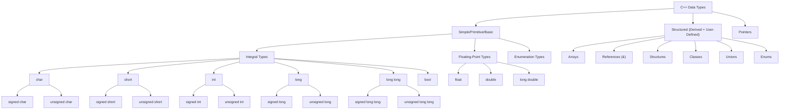
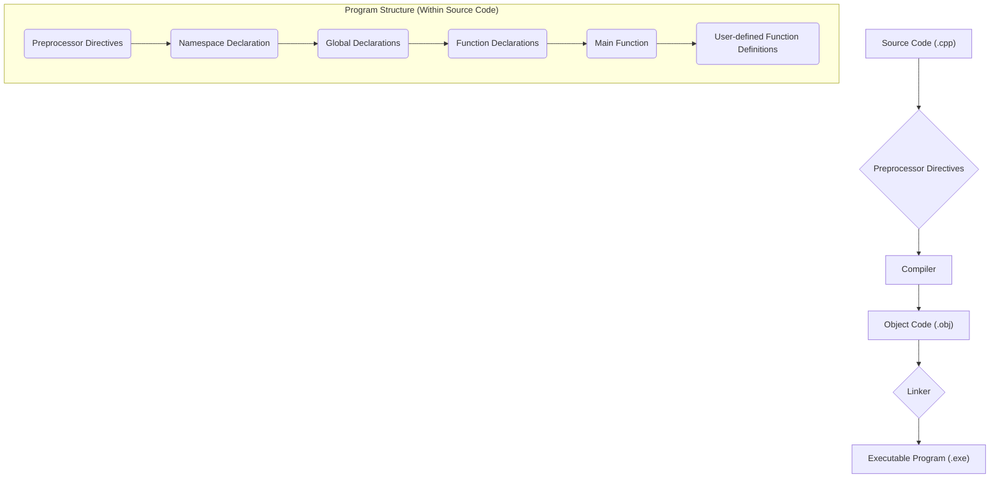
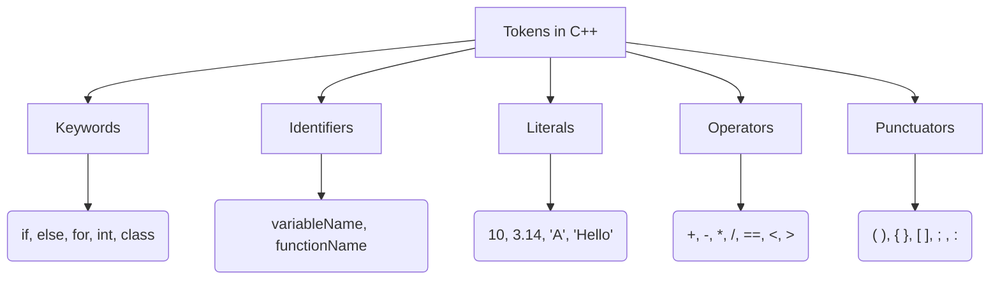
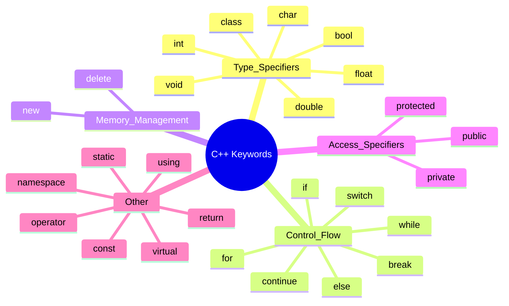

# 2 C++ Fundamentals

Comprehensive resource for 2 C++ Fundamentals.


---

## 2 C++ Fundamentals Hub


## Overview
This unit serves as a foundational guide to the basic elements of C++, extending from a high-level understanding of the language to its core structural components and elementary programming constructs. We begin by defining C++ and its general program structure, then progressively delve into the fundamental building blocks like tokens, keywords, identifiers, and literals. The unit then explores variables, their declaration, naming rules, and how they interact with memory, leading into a detailed examination of various data types including integral, floating-point, character, and string types. A significant portion is dedicated to C++ operators—arithmetic, relational, logical, assignment, and increment/decrement—along with their precedence and associativity, which are crucial for constructing meaningful expressions. Finally, the unit covers type conversion and the distinction between expressions and statements, culminating in a holistic understanding of how these basic elements coalesce to form functional C++ programs.

## Learning Objectives
*   Define C++ as a programming language and articulate its typical applications.
*   Describe the general structure of a C++ program, including preprocessor directives, namespace declarations, the `main` function, and user-defined functions.
*   Identify and explain the purpose of comments in C++ programs.
*   Distinguish between and correctly use various C++ tokens: keywords, identifiers, and literals.
*   Understand the concept of variables, their attributes (type, value), and proper declaration and naming conventions.
*   Differentiate between global and local variable scope and their accessibility.
*   Classify and utilize C++ primitive data types, including `int`, `float`, `double`, `char`, and `string`, along with their sizes and value ranges.
*   Apply various C++ operators (arithmetic, relational, logical, assignment, increment/decrement) correctly, considering their precedence and associativity.
*   Perform explicit and implicit type conversions (casting) in C++ programs.
*   Construct and interpret C++ expressions and statements, understanding their roles in program execution.

## Unit Applications & Real-World Relevance
Understanding the basic elements of C++ is paramount for anyone venturing into software development, as these concepts form the bedrock for all complex applications. From developing high-performance operating systems and embedded systems to crafting intricate game engines and artificial intelligence algorithms, C++'s efficiency and control over hardware are leveraged across diverse domains. Mastering topics like data types and operators enables developers to efficiently manipulate data, while a firm grasp of program structure and scope is essential for building scalable and maintainable codebases. In competitive programming, a deep understanding of these fundamentals is critical for writing optimized and error-free solutions to challenging algorithmic problems.

## Active Learning Prompts
*   Consider a simple real-world task, like ordering coffee. How would you represent the different pieces of information (e.g., coffee type, size, sugar, price) using C++ data types? Which operators would be involved in calculating the total cost?
*   Imagine you're trying to debug a C++ program where a variable's value is unexpectedly changing. How would your understanding of variable scope help you narrow down the potential sources of the error?
*   Think about a situation where integer division versus floating-point division would lead to vastly different and potentially problematic results. Describe such a scenario and explain why using the correct data type and operator is crucial.

## Unit Challenges & Common Misconceptions
A common challenge in C++ fundamentals is distinguishing between assignment (`=`) and equality (`==`) operators, often leading to subtle bugs. Beginners also frequently struggle with operator precedence, resulting in incorrect arithmetic evaluations without proper parenthesization. Misunderstanding integer division and the modulo operator's behavior with negative numbers can also be a source of errors. Another area of difficulty is grasping the nuances of pre-increment vs. post-increment, which significantly impacts variable values in expressions. Lastly, implicit type conversions can sometimes lead to unexpected data loss or precision issues if not carefully considered.

## Connections
  - [[What_Is_C++]]
    - [[General_Structure_of_C++_Program]]
      - [[Preprocessor_Directives]]
      - [[Main_Function]]
      - [[Comments_in_C++]]
      - [[Braces_and_Statements]]
      - [[Case_Sensitivity_and_Whitespace]]
    - [[Tokens_in_C++]]
      - [[Keywords_in_C++]]
      - [[Identifiers_in_C++]]
      - [[Literals_in_C++]]
    - [[Variables_in_C++]]
      - [[Variable_Declaration]]
      - [[Rules_for_Naming_Variables]]
      - [[Variables_and_Memory_Concept]]
      - [[Scope_of_Variables]]
    - [[Data_Types_in_C++]]
      - [[Integral_Data_Types]]
      - [[Floating_Point_Data_Types]]
      - [[Character_Data_Type]]
      - [[String_Data_Type]]
    - [[Operators_in_C++]]
      - [[Arithmetic_Operators]]
      - [[Operator_Precedence_and_Associativity]]
      - [[Increment_and_Decrement_Operators]]
      - [[Assignment_Operator]]
      - [[Relational_Operators]]
      - [[Logical_Operators]]
    - [[Type_Conversion_and_Casting]]
    - [[Expressions_in_C++]]
    - [[Statements_in_C++]]

## Next Steps for Deeper Understanding
To further solidify your grasp of C++ fundamentals, consider exploring integrated development environments (IDEs) like VS Code or Code::Blocks to practice writing and compiling simple programs. Delve into debugging tools to trace program execution and observe how variables change values. Investigate the `std::cout` and `std::cin` objects more deeply for formatted input/output. For a more advanced understanding of memory management, research pointers in C++. Additionally, begin experimenting with control flow statements (`if-else`, `for`, `while`) to apply the basic elements learned in this unit to create dynamic programs.

## Possible Questions
[[CS1220_2_C++_Fundamentals_Possible_Questions]]

---

---

## Data Types In C++


## Definition
Before proceeding, ensure you master the concepts of [[Variables_in_C++]] and general Memory_Management.

**Data types** in C++ are classifications that define the kind of values a variable can hold, the operations that can be performed on those values, and the amount of memory (size) required to store them. When you declare a variable, you **must specify its data type**. This tells the compiler, "Reserve *this much* memory, and interpret the bits stored there *this way*." C++ data types are broadly categorized into: **Simple/Primitive/Basic**, **Structured (Derived + User-Defined)**, and **Pointers**. Understanding data types is fundamental to writing correct and efficient C++ code, as it directly impacts memory usage, computational accuracy, and type-safety.

## The Mental Model
Imagine you're managing a warehouse. For every item (data value) you store, you need a specific **type of container** (the data type).
*   A "small box" (`int`) for whole numbers.
*   A "large box" (`double`) for decimal numbers that need more space and precision.
*   A "single-character sleeve" (`char`) for letters or symbols.
*   A "label for a different box" (`pointer`) to point to another container's location.
The type of container determines its **size** (how much space it takes) and **what you can do with it** (e.g., you can add numbers, but not "add" characters in the same way). If you try to put a large item into a small box, it won't fit (data overflow!).

## Context & Framework
#### The Family Tree

*Note: This `graph TD` illustrates the comprehensive classification of C++ data types into Primitive, Structured, and Pointers. It further breaks down Primitive types into their various integral and floating-point sub-categories.*

## The Mastery Deep Dive
#### The Impostor: Highlighting scenarios where choosing the wrong data type leads to problems.
Choosing the wrong data type can lead to subtle yet critical "impostor" bugs:
1.  **Integer Overflow:** Using an `int` to store a value larger than its maximum capacity (e.g., a population count for a large country in a 2-byte `int`). The value will "wrap around" to a negative number or an incorrect positive number, becoming an "impostor" of the true value.
2.  **Floating-Point Precision Errors:** Using `float` or `double` for financial calculations or precise scientific measurements (e.g., `0.1 + 0.2` not equaling exactly `0.3`). Due to the binary representation of decimal numbers, small inaccuracies creep in, making the computed value an "impostor" of the mathematically exact result.
3.  **Data Loss during Type Conversion:** Implicitly converting a `double` to an `int` (e.g., `int i = 3.99;`). The decimal part is truncated, not rounded, leading to `i` being `3`. The integer `3` is an "impostor" of `3.99` if rounding was expected.
4.  **Character vs. String:** Confusing a single `char` (`'A'`) with a single-character string (`"A"`). They are stored differently and cannot be directly interchanged without conversion.
These impostors demonstrate that data types are not just arbitrary labels but critical determinants of how data behaves.

## Constraints & Limitations
#### The Engineering Trade-off
The fixed-type nature of C++ (static typing) means that every variable's type must be known at compile time. This is a crucial engineering trade-off: gain performance (because the compiler knows exactly how much memory to allocate and what operations are valid) and type-safety (catching type-related errors before runtime), but at the cost of less runtime flexibility compared to dynamically-typed languages. Programmers must decide on the most appropriate data type for each variable, carefully considering its range, precision, and intended use. This precision prevents many subtle bugs but requires a deeper understanding of data representation.

## Significance & Application
Data types are the bedrock of memory management and computational correctness in C++. They are indispensable for:
*   **Memory Efficiency:** Choosing the smallest appropriate data type minimizes memory consumption, critical for embedded systems and large datasets.
*   **Accuracy and Precision:** Selecting `float`, `double`, or `long double` impacts the precision of calculations.
*   **Type Safety:** The compiler uses data types to prevent incompatible operations (e.g., adding a string to an integer), catching errors early.
*   **Meaningful Data Representation:** They allow the programmer to model real-world entities (e.g., age as `int`, temperature as `double`, name as `string`) effectively.
Mastering data types is the prerequisite for all meaningful data manipulation and algorithm implementation in C++.

## The Worked Example
This example demonstrates the declaration and use of various simple C++ data types.

```cpp
```cpp
##include <iostream>
##include <string> // For std::string

int main() {
    // Integral Types
    int age = 30;             // Stores whole numbers
    char initial = 'J';       // Stores a single character
    bool is_student = true;   // Stores true (1) or false (0)
    long population = 8000000000L; // Stores large whole numbers (L suffix for long)

    std::cout << "Age: " << age << std::endl;
    std::cout << "Initial: " << initial << std::endl;
    std::cout << "Is student: " << is_student << std::endl;
    std::cout << "Population: " << population << std::endl;

    // Floating-Point Types
    float temperature = 22.5f; // Stores single-precision decimal numbers (f suffix for float)
    double pi = 3.1415926535;   // Stores double-precision decimal numbers

    std::cout << "Temperature: " << temperature << std::endl;
    std::cout << "Pi: " << pi << std::endl;

    // String Type (from <string> library)
    std::string full_name = "Jane Doe"; // Stores sequences of characters

    std::cout << "Full Name: " << full_name << std::endl;

    return 0;
}
```
```text
// Scenario 1: Displaying values of various data types
// Output:
// Age: 30
// Initial: J
// Is student: 1
// Population: 8000000000
// Temperature: 22.5
// Pi: 3.14159
// Full Name: Jane Doe
// This output demonstrates the basic usage and expected values for different primitive data types.

// Scenario 2: What if 'age' was declared as 'char' with value 30?
// (Conceptual output, not direct code modification output)
// If 'char age = 30;' was used, printing 'age' would output a non-printable ASCII character (ASCII 30).
// This highlights the importance of choosing the correct data type to represent the intended value and avoid misinterpretation.
```
*Note: This C++ code demonstrates the declaration and use of various **integral, floating-point, and string data types**, illustrating their fundamental differences.*

## The Proving Ground
*Test your mastery. Cover the solutions below to test yourself first.*

#### Level 1: The Sanity Check (Verification)
**The Question:** What are the three main categories into which C++ data types are classified?
> **Solution:** C++ data types are classified into Simple/Primitive/Basic, Structured (Derived + User-Defined), and Pointers.

#### Level 2: The Crucible (Mastery & Edge Cases)
**The Scenario:** A new programmer defines all variables as `double` to "avoid any precision issues" for both whole numbers and decimals.
**The Challenge:** Explain why this approach is not always optimal and can lead to inefficient resource usage, specifically contrasting `double` with more appropriate integer types.
> **Solution:** While using `double` for all numbers might avoid explicit precision issues for whole numbers, it is **not optimal for memory efficiency**. A `double` typically occupies 8 bytes of memory, whereas an `int` might only take 4 bytes, and a `short int` perhaps 2 bytes. For variables that are guaranteed to hold only whole numbers within a smaller range (e.g., a loop counter from 0 to 100, or an age), using a `double` unnecessarily allocates more memory than required. This leads to **inefficient resource usage**, especially in memory-constrained applications or when dealing with very large numbers of variables. Using `double` also doesn't solve all precision issues for *all* decimal numbers, particularly those that cannot be exactly represented in binary.

## Key Takeaways
*   **Data types** define the kind of value, operations, and memory size for a variable.
*   They are categorized into **Simple/Primitive**, **Structured**, and **Pointers**.
*   Choosing the correct data type is crucial for **memory efficiency, computational accuracy, and type-safety**.

## Knowledge Graph Connections
| Concept                     | Connection / Relationship                                                                                                 |
| :
-------------------------- | :
-------------------------------------------------------------------------------------------------------------------------- |
| [[Variables_in_C++]]        | Variables must be declared with a specific data type to determine their storage and behavior.                               |
| Memory_Management       | Data types dictate the amount of memory allocated for a variable.                                                         |
| [[Integral_Data_Types]]     | Integral data types are a sub-category of simple data types for whole numbers.                                            |
| [[Floating_Point_Data_Types]] | Floating-point data types are a sub-category of simple data types for decimal numbers.                                    |
| [[Character_Data_Type]]     | The character data type is a primitive type for single characters.                                                        |
| [[String_Data_Type]]        | The string data type, though typically a class, represents sequences of characters and interacts closely with character types. |
---

---

## General Structure Of C++ Program


## Definition
Before proceeding, ensure you have a general understanding of the Compilation_Process.

The General Structure of a C++ Program refers to the standardized organization of code elements that allows the program to be compiled and executed correctly. It is a hierarchical arrangement, much like the blueprint of a building, where each section (preprocessor directives, `main` function, user-defined functions, etc.) plays a specific role in the overall functionality and flow. This structure ensures that the compiler can understand and process the code in a predictable manner, transforming human-readable instructions into machine-executable form.

## The Mental Model
Imagine a C++ program as a carefully choreographed **assembly line**. At the very beginning, you have "Instructions for the Foreman" (Preprocessor Directives) that set up the environment. Then, the "Main Control Panel" (`main` function) dictates the primary sequence of operations. Along the way, there are specialized "Workstations" (User-defined Functions) that perform specific tasks when called upon. Throughout the entire process, "Sticky Notes" (Comments) are used for internal communication, and "Structural Brackets" (Braces) define distinct work zones, while "Individual Commands" (Statements) are the precise actions taken at each step.


```text
// Scenario 1: Overall Compilation and Execution Flow
// Output:
// (A visual representation showing Source Code progressing through Preprocessor Directives, Compiler, Object Code, Linker, to an Executable Program.)
// This illustrates the high-level process from human-readable code to a runnable application.

// Scenario 2: Internal Structure Sequence
// Output:
// (A visual representation of the internal source code structure, from Preprocessor Directives down to User-defined Function Definitions.)
// This highlights the typical order of elements within the .cpp file itself.
```
*Note: This `flowchart TD` illustrates the high-level compilation and linking process, as well as the typical structural components within a C++ source file. The elements are logically connected to show the flow.*

## Context & Framework
#### Opening the Hood: What's Inside?
A C++ program's structure can be broken down into six core components, much like dissecting a machine to understand its parts:
1.  **Preprocessor Directives:** Instructions starting with `#` (e.g., `#include <iostream>`) that tell the compiler to perform tasks *before* actual compilation, such as including header files.
2.  **Namespace Declaration:** `using namespace std;` brings elements from a specific namespace (like `std` for standard library components) into the current scope, simplifying code.
3.  **Global Declarations (optional):** Variables or functions declared outside any function, making them accessible throughout the entire program.
4.  **Function Declarations (Prototypes):** Inform the compiler about the existence, return type, name, and parameters of functions defined later in the code.
5.  **Main Function (`int main()`):** The **entry point** of every C++ program. Execution always begins here. It returns an integer (typically `0` for success) to the operating system.
6.  **User-defined Function Definitions:** The actual implementation of functions declared earlier or directly defined after `main`. These perform specific tasks and can be called from `main` or other functions.
Understanding these parts is crucial for writing well-organized and functional C++ code.

## The Mastery Deep Dive
#### How the Parts Talk to Each Other
The various parts of a C++ program structure communicate in a specific sequence. The **preprocessor directives** act first, modifying the source code before it even reaches the compiler. For instance, `#include <iostream>` effectively copies the contents of `iostream` into your file, making standard input/output functions available. The **`main` function** then serves as the central orchestrator, making calls to **user-defined functions**. This communication is managed by **function prototypes**, which ensure that `main` (or any other function) knows how to call another function, even if the definition of that function appears later in the file. **Namespace declarations** simplify this communication by allowing direct access to standard library components (like `cout` and `cin`) without needing to prefix them with `std::`. This structured dialogue ensures all components work together seamlessly.

#### The Translator: From "Lego" to "Jargon"
The simple "Lego" analogy of program components translates directly to formal C++ jargon:
*   "Instructions for the Foreman" become **Preprocessor Directives**.
*   "Main Control Panel" is the **`main` function**.
*   "Specialized Workstations" are **User-defined Functions**.
*   "Sticky Notes" are **Comments**.
*   "Structural Brackets" are **Braces** (`{}`).
*   "Individual Commands" are **Statements** (ending with `;`).
This translation is critical for moving from an intuitive understanding to the precise terminology required for technical discussions and exam settings.

## Constraints & Limitations
#### The Engineering Trade-off
While a structured approach is beneficial, deeply nested function calls or excessive global variables can introduce complexities. For instance, **global declarations** can lead to side effects, where a variable's value can be unpredictably altered by any part of the program, making debugging difficult. Similarly, over-reliance on a single, monolithic `main` function that attempts to do too much can obscure program flow and make maintenance a nightmare. The engineering trade-off lies in balancing modularity and encapsulation (using smaller, focused functions and local variables) against the perceived simplicity of a more direct, but potentially less maintainable, structure.

## Significance & Application
A clear understanding of C++ program structure is foundational for writing any non-trivial program. It allows developers to organize code logically, enhance readability, and facilitate collaboration in larger projects. This structure is universally applied, whether you're developing a simple command-line utility, a complex operating system kernel, or a high-performance game engine. Adhering to this structure ensures code is maintainable, scalable, and understandable to other developers. Deviations from this standard often lead to disorganized, buggy, and hard-to-debug software.

## The Worked Example
This example demonstrates a complete C++ program incorporating various structural elements.

```cpp
```cpp
// 1. Preprocessor Directive: Includes the input/output stream library
##include <iostream>

// 2. Namespace Declaration: Allows direct use of names like cout and cin
using namespace std;

// 3. Global Declaration (optional): A global variable
int global_data = 20;

// 4. Function Declaration (Prototype): Informs the compiler about the 'add' function
int add(int a, int b);

// 5. Main Function: The program's entry point
int main() {
    // Local variable declarations
    int num1 = 10;
    int num2 = 5;
    int sum_result;

    // Statement: Output to console using stream insertion operator
    cout << "Global data: " << global_data << endl;

    // Function call
    sum_result = add(num1, num2);

    // Another statement
    cout << "Sum of " << num1 << " and " << num2 << " is: " << sum_result << endl;

    return 0; // Indicates successful program termination
}

// 6. User-defined Function Definition: Implementation of the 'add' function
int add(int a, int b) {
    return a + b;
}
```
```text
// Scenario 1: Standard execution flow
// Output:
// Global data: 20
// Sum of 10 and 5 is: 15
// This shows the sequential execution from main, using global data and calling a user-defined function.

// Scenario 2: What if we remove 'using namespace std;'?
// (Conceptual output, not direct code modification output)
// This would result in compilation errors like "error: 'cout' was not declared in this scope".
// The fix would be to explicitly use 'std::cout' and 'std::endl'.
// This demonstrates the role of namespace declarations in simplifying standard library usage.
```
*Note: This C++ code illustrates the typical structure of a program, including **preprocessor directives**, **namespace declaration**, **global variables**, **function prototypes**, the **`main` function**, and a **user-defined function definition**.*

## The Proving Ground
*Test your mastery. Cover the solutions below to test yourself first.*

#### Level 1: The Sanity Check (Verification)
**The Question:** What are the six fundamental components that constitute the general structure of a C++ program?
> **Solution:** The six fundamental components are: Preprocessor Directives, Namespace Declaration, Global Declarations (optional), Function Declarations (Prototypes), Main Function, and User-defined Function Definitions.

#### Level 2: The Crucible (Mastery & Edge Cases)
**The Scenario:** You are given a C++ program where a custom function `calculateArea()` is defined *before* its declaration (prototype) but is called from `main`. The program compiles without errors.
**The Challenge:** Explain why this scenario, which seems to violate the "declaration before use" principle, might still compile successfully.
> **Solution:** This scenario compiles successfully because if a function is *defined* before it is *called* (even if the call is in `main`), its definition implicitly acts as its declaration (prototype). The compiler encounters the full function definition before it sees the call from `main`, thus knowing its signature. This adheres to the "declaration before use" principle in practice, even without an explicit prototype.

## Key Takeaways
*   C++ programs follow a **structured format** including preprocessor directives, namespace declarations, global declarations, function prototypes, `main` function, and user-defined functions.
*   The **`main` function** is the mandatory entry point where program execution begins.
*   Each structural component plays a **specific role** in organizing code, enhancing readability, and ensuring proper compilation and execution.

## Knowledge Graph Connections
| Concept                     | Connection / Relationship                                                                                                 |
| :
-------------------------- | :
-------------------------------------------------------------------------------------------------------------------------- |
| [[Preprocessor_Directives]] | Preprocessor directives are the initial component in the general structure of a C++ program.                                |
| [[Main_Function]]           | The `main` function is the mandatory entry point for every C++ program.                                                   |
| [[Comments_in_C++]]         | Comments are ignored by the compiler but are vital for explaining the purpose and logic of parts of a C++ program.        |
| [[Braces_and_Statements]]   | Braces define code blocks, and statements are individual instructions terminated by a semicolon.                            |
| [[Case_Sensitivity_and_Whitespace]] | C++ is case-sensitive and largely ignores whitespace, which affects how identifiers and code elements are interpreted. |
---

---

## Operators In C++


## Definition
Before proceeding, ensure you master the concepts of [[Data_Types_in_C++]].

**Operators** in C++ are special symbols that perform operations on one or more values (called **operands**) to produce a result. They are the verbs of the programming language, dictating actions like addition, comparison, assignment, or logical evaluation. C++ provides a rich set of operators, which can be broadly classified by the number of operands they take (unary, binary, ternary) and by the type of operation they perform (e.g., arithmetic, relational, logical). Understanding operators is fundamental to writing any executable code, as they enable all computations, decisions, and data manipulations within a program.

## The Mental Model
Imagine you're managing a crew of workers, and each worker (operator) has a specific task (operation) to perform on certain items (operands).
*   The "forklift operator" (`+`) takes two boxes (operands) and combines their contents (addition).
*   The "quality control inspector" (`==`) takes two items and checks if they are identical (equality comparison).
*   The "relabeling specialist" (`=`) takes a new label (value) and puts it on a box (variable) that already exists (assignment).
Each worker needs a specific number of items to perform their task (e.g., unary operators need one item, binary operators need two).

## Context & Framework
#### The Family Tree```mermaid
graph TD
    A["Operators in C++"] --> B["By Number of Operands"];
    A --> C["By Type of Operation"];

    B --> B1["Unary Operators"];
    B --> B2["Binary Operators"];
    B --> B3["Ternary Operators"];

    B1 --> B1_1["++ (Increment)"];
    B1_1 --> B1_2["-- (Decrement)"];
    B1_1 --> B1_3["! (Logical NOT)"];
    B1_1 --> B1_4["- (Unary Minus)"];

    B2 --> B2_1["+ - * / % (Arithmetic)"];
    B2_1 --> B2_2["= += -= (Assignment)"];
    B2_1 --> B2_3["== != < <= > >= (Relational)"];
    B2_1 --> B2_4["&& || (Logical)"];
    B2_1 --> B2_5["<< >> (Stream)"];

    B3 --> B3_1["?: (Conditional)"];

    C --> C1["Arithmetic Operators"];
    C --> C2["Assignment Operators"];
    C --> C3["Increment/Decrement Operators"];
    C --> C4["Relational Operators"];
    C --> C5["Logical Operators"];
    C --> C6["Bitwise Operators"];
    C --> C7["Miscellaneous Operators"];
```
*Note: This `graph TD` illustrates the primary classifications of operators in C++, first by the number of operands they take, and then by the type of operation they perform. This provides a comprehensive overview of the operator "family tree."*

## The Mastery Deep Dive
#### The Impostor: Highlighting scenarios where tokens might be misinterpreted or misused.
Operators, being symbols, can sometimes act as "impostors" if their precise meaning or usage is misunderstood:
1.  **Assignment vs. Equality:** The most common impostor is confusing `=` (assignment) with `==` (equality comparison). `if (x = 0)` assigns `0` to `x` (which evaluates to `false` in a boolean context), while `if (x == 0)` checks if `x` is `0`. The single `=` is an impostor for a comparison.
2.  **Integer Division vs. Floating-Point Division:** The `/` operator acts as an "impostor" of universal division. If both operands are integers (e.g., `5 / 2`), it performs integer division, truncating the decimal part (result is `2`). If at least one operand is a floating-point type (e.g., `5.0 / 2`), it performs floating-point division (result is `2.5`). The same symbol has different behaviors based on operand types.
3.  **Unary vs. Binary `+`/`-`:** The `+` and `-` symbols can be unary (acting on one operand, e.g., `-5`) or binary (acting on two operands, e.g., `5 - 2`). The context determines which operation is performed.
4.  **Bitwise vs. Logical AND/OR:** `&` (bitwise AND) and `|` (bitwise OR) are impostors for `&&` (logical AND) and `||` (logical OR). They operate on individual bits, not boolean truth values, leading to drastically different results.
Understanding the context and specific function of each operator is critical to avoid these impostors.

## Constraints & Limitations
#### The Engineering Trade-off
The fixed behavior and precedence of C++ operators are a necessary constraint for predictable program execution. While a large set of operators offers powerful expressiveness and conciseness, it demands that the programmer meticulously understands each operator's rules, including its precedence and associativity. This is an engineering trade-off: gain expressive power and efficient low-level control, but incur the burden of mastering complex rules to avoid subtle bugs. Forgetting operator precedence (e.g., `2 + 3 * 4`) can lead to mathematically correct but logically incorrect program results, which are hard to debug.

## Significance & Application
Operators are indispensable for virtually every task in C++ programming:
*   **Computation:** Performing mathematical calculations (arithmetic operators).
*   **Data Manipulation:** Assigning values to variables (assignment operators), incrementing/decrementing counters.
*   **Decision Making:** Evaluating conditions for control flow (`if`, `while`) using relational and logical operators.
*   **Input/Output:** Directing data to/from streams (`<<`, `>>` stream operators).
*   **Low-level Operations:** Bitwise manipulation for optimizing performance or interacting with hardware.
A thorough grasp of operators, their types, and their rules of evaluation is a core competency for any C++ programmer, directly enabling the creation of dynamic and functional programs.

## The Worked Example
This example demonstrates various types of operators in action within a C++ program.

```cpp
```cpp
##include <iostream>

int main() {
    int a = 10;
    int b = 3;
    int result;
    bool condition1 = true;
    bool condition2 = false;

    // Arithmetic Operators
    result = a + b; // Addition
    std::cout << "a + b = " << result << std::endl; // Output: 13
    result = a / b; // Integer division
    std::cout << "a / b (int div) = " << result << std::endl; // Output: 3
    result = a % b; // Modulo (remainder)
    std::cout << "a % b = " << result << std::endl; // Output: 1

    // Assignment Operator
    int x = 5; // Simple assignment
    x += 2;    // Compound assignment: x = x + 2
    std::cout << "x after compound assignment: " << x << std::endl; // Output: 7

    // Increment/Decrement Operators
    int counter = 0;
    ++counter; // Pre-increment: counter becomes 1
    std::cout << "Counter after pre-increment: " << counter << std::endl; // Output: 1
    counter--; // Post-decrement: counter used as 1, then becomes 0
    std::cout << "Counter after post-decrement: " << counter << std::endl; // Output: 0

    // Relational Operators
    std::cout << "a == b: " << (a == b) << std::endl; // Output: 0 (false)
    std::cout << "a > b: " << (a > b) << std::endl;   // Output: 1 (true)

    // Logical Operators
    std::cout << "condition1 && condition2: " << (condition1 && condition2) << std::endl; // Output: 0 (false)
    std::cout << "!condition1: " << (!condition1) << std::endl;                     // Output: 0 (false)

    return 0;
}
```
```text
// Scenario 1: Demonstrating various operator types
// Output:
// a + b = 13
// a / b (int div) = 3
// a % b = 1
// x after compound assignment: 7
// Counter after pre-increment: 1
// Counter after post-decrement: 0
// a == b: 0
// a > b: 1
// condition1 && condition2: 0
// !condition1: 0
// This shows a clear execution of different operator types, including arithmetic, assignment, increment/decrement, relational, and logical.

// Scenario 2: Potential confusion with integer division (conceptual)
// If we wanted float division for 'a / b', we'd need 'static_cast<double>(a) / b', which would yield 3.333...
// This highlights the type-dependent behavior of the '/' operator.
```
*Note: This C++ code demonstrates the usage of various **arithmetic, assignment, increment/decrement, relational, and logical operators** with different operands, showcasing their distinct functionalities.*

## The Proving Ground
*Test your mastery. Cover the solutions below to test yourself first.*

#### Level 1: The Sanity Check (Verification)
**The Question:** How do C++ operators classify based on the number of operands they require?
> **Solution:** C++ operators classify as **unary** (one operand), **binary** (two operands), or **ternary** (three operands).

#### Level 2: The Crucible (Mastery & Edge Cases)
**The Scenario:** A new C++ developer writes `if (x = 0)` as a conditional statement, intending to check if `x` is equal to `0`.
**The Challenge:** Explain why this code will likely compile without error but will lead to unexpected logical behavior in the program, relating it to the distinction between assignment and equality operators.
> **Solution:** This code will compile without error because `x = 0` is a valid **assignment expression**, not an equality comparison. The assignment operator (`=`) assigns the value `0` to the variable `x`. In C++, the result of an assignment expression is the value that was assigned, which is `0` in this case. When `0` is implicitly converted to a boolean context (for the `if` statement), `0` evaluates to `false`.
>
> This leads to **unexpected logical behavior** because the `if` block will **never execute** (since `0` is `false`), and `x` will always be set to `0`. The programmer *intended* `if (x == 0)` (equality comparison) to check if `x` already holds `0`, but accidentally used the assignment operator, making `x = 0` an "impostor" of a comparison.

## Key Takeaways
*   **Operators** are symbols performing operations on **operands**, classified by count (unary, binary, ternary) and type (arithmetic, logical, etc.).
*   Understanding **operator precedence and associativity** is crucial to avoid incorrect evaluation of expressions.
*   Careful distinction between operators like `=` (assignment) and `==` (equality) prevents common and subtle logical bugs.

## Knowledge Graph Connections
| Concept                     | Connection / Relationship                                                                                                 |
| :
-------------------------- | :
-------------------------------------------------------------------------------------------------------------------------- |
| [[Arithmetic_Operators]]    | Arithmetic operators are a specific category of operators used for mathematical computations.                             |
| [[Assignment_Operator]]     | The assignment operator is a binary operator used to assign values to variables.                                          |
| [[Increment_and_Decrement_Operators]] | These are unary operators that modify a variable's value by one.                                                        |
| [[Relational_Operators]]    | Relational operators compare two operands to determine their relationship.                                                |
| [[Logical_Operators]]       | Logical operators combine boolean expressions to produce a single boolean result.                                         |
| [[Expressions_in_C++]]      | Operators are fundamental components used to construct expressions that compute values.                                   |
---

---

## Tokens In C++


## Definition
Before proceeding, ensure you have a basic understanding of Lexical_Analysis.

In C++, a **token** is the smallest individual unit of a program that is meaningful to the compiler. It is to a C++ program what a word is to a sentence in natural language. The C++ compiler breaks down source code into a sequence of these tokens during the **lexical analysis** phase. Tokens are categorized into five fundamental types: **keywords**, **identifiers**, **literals**, **operators**, and **punctuators** (which include special symbols like parentheses, braces, and semicolons). Understanding tokens is essential because they form the atomic building blocks upon which the entire program's syntax and semantics are constructed.

## The Mental Model
Imagine you're trying to understand a very precise language, like a chef following a recipe. A **token** is like an individual word or symbol in that recipe: "flour," "sugar," "mix," "+," "kg," "(` `)," or ";". Each token has a distinct meaning. The compiler, like a chef, first breaks the entire recipe (your code) into these individual, meaningful "words" or "symbols" before trying to understand the sequence of instructions (the overall program logic). Without correctly identified tokens, the recipe is just a jumble of letters and characters.

## Context & Framework
#### The Family Tree

*Note: This `graph TD` illustrates the five main categories of tokens in C++. Each branch represents a distinct type of token, with examples provided for clarity.*

## The Mastery Deep Dive
#### The Impostor: Highlighting scenarios where tokens might be misinterpreted or misused.
A common "impostor" scenario involves misinterpreting what constitutes a single token or attempting to use a token incorrectly:
1.  **Keyword as Identifier:** Trying to name a variable `int` (e.g., `int int = 5;`). The compiler sees `int` (keyword) and then `int` again, expecting an identifier for the variable but finding another keyword. This is a fundamental violation, as keywords have predefined meanings and cannot be reused.
2.  **Operator as Identifier:** While generally not syntactically possible to assign an operator like `+` as an identifier, confusion can arise with compound operators. For instance, `my_var++` involves `my_var` (identifier) and `++` (operator) as distinct tokens, not `my_var++` as a single token.
3.  **Whitespace Ambiguity:** Sometimes, programmers might mistakenly believe that whitespace *within* a token is allowed (e.g., `my variable`). The lexical analyzer, however, will see `my` as one token and `variable` as another, leading to a syntax error if `my variable` was intended to be a single identifier. Whitespace acts as a delimiter between tokens, not part of them.
Understanding these distinctions is crucial for accurate parsing and compilation.

## Constraints & Limitations
#### The Engineering Trade-off
The rigid categorization of tokens is a necessary constraint for the compiler's efficiency and determinism. While it simplifies the compiler's job, it places a burden on the programmer to strictly adhere to C++'s lexical rules. Any deviation (e.g., a misspelled keyword, a character not part of a valid literal, or an operator used incorrectly) will immediately halt compilation. This is an engineering trade-off: gain compilation speed and clarity for the machine, but demand meticulous syntax from the human. The compiler cannot infer intent; it only recognizes valid token sequences.

## Significance & Application
Tokens are the fundamental vocabulary of C++. Every line of code you write is ultimately parsed into a sequence of these tokens. They are crucial for:
*   **Compiler Parsing:** The first step in compilation is tokenization, making them indispensable.
*   **Syntax Checking:** The compiler validates the arrangement of tokens against C++ grammar rules.
*   **Semantic Understanding:** The type of token dictates its meaning (e.g., `if` means conditional, `+` means addition).
*   **Error Detection:** Incorrectly formed or used tokens are immediate sources of compilation errors.
Mastery of token types allows programmers to speak the language of C++ precisely, avoiding common syntax errors and understanding compiler messages.

## The Worked Example
This C++ snippet illustrates various token types recognized by the compiler.

```cpp
```cpp
##include <iostream> // '#include', '<', 'iostream', '>' are tokens.
                    // Comments are ignored.

int main() {        // 'int', 'main', '(', ')' are tokens.
                    // '{' is a punctuator token.

    int count = 10; // 'int' (keyword), 'count' (identifier), '=' (operator), '10' (literal), ';' (punctuator)

    double pi = 3.14; // 'double' (keyword), 'pi' (identifier), '=', '3.14' (literal), ';'

    if (count > 5) { // 'if' (keyword), '(' (punctuator), 'count' (identifier), '>' (operator), '5' (literal), ')' (punctuator), '{' (punctuator)
        std::cout << "Count is greater than 5." << std::endl; // 'std', '::', 'cout', '<<', "Count is greater than 5.", '<<', 'std', '::', 'endl', ';'
    }

    return 0;       // 'return' (keyword), '0' (literal), ';' (punctuator)
}                   // '}' (punctuator)
```
```text
// Scenario 1: Compiler's view of tokenization
// Output: (Conceptual output, illustrating token identification)
// #include -> preprocessor_directive
// < -> punctuator
// iostream -> identifier
// > -> punctuator
// int -> keyword
// main -> identifier
// ( -> punctuator
// ) -> punctuator
// { -> punctuator
// int -> keyword
// count -> identifier
// = -> operator
// 10 -> literal
// ; -> punctuator
// double -> keyword
// pi -> identifier
// = -> operator
// 3.14 -> literal
// ; -> punctuator
// if -> keyword
// ( -> punctuator
// count -> identifier
// > -> operator
// 5 -> literal
// ) -> punctuator
// { -> punctuator
// std -> identifier
// :: -> operator
// cout -> identifier
// << -> operator
// "Count is greater than 5." -> literal
// << -> operator
// std -> identifier
// :: -> operator
// endl -> identifier
// ; -> punctuator
// } -> punctuator
// return -> keyword
// 0 -> literal
// ; -> punctuator
// } -> punctuator
// This detailed breakdown shows how the compiler logically segments the source code into its smallest meaningful units.

// Scenario 2: Error due to an invalid token (conceptual)
// If 'int @variable = 5;' was present, the compiler would report an error around '@'.
// This is because '@' is not a valid character for an identifier or a recognized operator, making it an invalid token.
```
*Note: This C++ code provides a detailed breakdown of how various parts of a simple program are parsed into **keywords, identifiers, literals, operators, and punctuators** by the compiler.*

## The Proving Ground
*Test your mastery. Cover the solutions below to test yourself first.*

#### Level 1: The Sanity Check (Verification)
**The Question:** List the five primary kinds of tokens in C++.
> **Solution:** The five primary kinds of tokens in C++ are keywords, identifiers, literals, operators, and punctuators.

#### Level 2: The Crucible (Mastery & Edge Cases)
**The Scenario:** Given the following line of C++ code: `int sum = 10 + num;`
**The Challenge:** Categorize each individual element in this line into its respective token type.
> **Solution:**
*   `int`: **Keyword**
*   `sum`: **Identifier**
*   `=`: **Operator**
*   `10`: **Literal**
*   `+`: **Operator**
*   `num`: **Identifier**
*   `;`: **Punctuator**

## Key Takeaways
*   A **token** is the smallest meaningful unit in a C++ program, identified by the compiler's lexical analyzer.
*   There are five main types of tokens: **keywords**, **identifiers**, **literals**, **operators**, and **punctuators**.
*   Understanding tokens is crucial for writing syntactically correct code and interpreting compiler errors.

## Knowledge Graph Connections
| Concept                     | Connection / Relationship                                                                                                 |
| :
-------------------------- | :
-------------------------------------------------------------------------------------------------------------------------- |
| [[General_Structure_of_C++_Program]] | Tokens are the fundamental building blocks parsed from the general structure of a C++ program.                            |
| [[Keywords_in_C++]]         | Keywords are a specific category of tokens with predefined meanings.                                                        |
| [[Identifiers_in_C++]]      | Identifiers are user-defined names that form a distinct category of tokens.                                               |
| [[Literals_in_C++]]         | Literals are explicit constant values, forming another type of token.                                                     |
| [[Operators_in_C++]]        | Operators are symbols that perform operations on operands and are recognized as tokens.                                   |
| Compilation_Process     | Tokenization is the initial phase of the compilation process, breaking source code into tokens.                           |
---

---

## Variables In C++


## Definition
Before proceeding, ensure you have a basic understanding of Memory_Management and [[Data_Types_in_C++]].

In C++, a **variable** is a named storage location in the computer's memory that can hold a value. Think of it as a labeled box where you can put different items. All variables have two crucial attributes: a **type** (which defines the kind of data it can store, like a number or a character) and a **value** (the actual data currently stored in that location). Once a variable's type is defined, it **cannot be changed**, but its **value can be modified** throughout the program's execution. Variables are fundamental because they allow programs to process and manipulate dynamic data, making software interactive and adaptable.

## The Mental Model
Imagine a kitchen with various containers. Each container has a **label** (the variable's **name**, e.g., "sugar," "flour") and can only hold a specific **type** of item (e.g., "sugar container" for sugar, not water). This is the variable's **type**. The actual contents *inside* the container (e.g., "500 grams of sugar") represent the variable's **value**. You can empty the sugar container and refill it with more sugar, changing its value, but you can't suddenly use the "sugar container" to store "water" – its type remains fixed.

## Context & Framework
#### The "Kill Sheet" Comparison Table
| Feature          | Variable                                                    | Literal (Constant)                                            |
| :
--------------- | :
---------------------------------------------------------- | :
------------------------------------------------------------ |
| **Nature**       | Named storage location in memory.                           | Explicit, fixed value directly in code.                       |
| **Value**        | **Mutable**; can change during program execution.           | **Immutable**; value is fixed as written.                     |
| **Attributes**   | Has both a **type** and a **value**.                      | Represents a **value** of a certain type; no separate "name" (unless it's a named constant). |
| **Declaration**  | Requires declaration (e.g., `int x;`).                      | Does not require declaration; used directly (e.g., `10`, `'A'`). |
| **Purpose**      | Stores dynamic data, allows manipulation.                   | Provides fixed, hardcoded values.                             |
| **Memory**       | Occupies a specific memory address.                         | Embedded directly into machine code; no separate address.     |

## The Mastery Deep Dive
#### The Impostor: Highlighting common misconceptions about how variables store and manage data.
Variables, despite their apparent simplicity, can be "impostors" if their underlying mechanics are misunderstood:
1.  **Value vs. Memory Address:** A common misconception is confusing the variable's *name* with the *value* it holds, or the value with the *memory address*. `int x = 10;` means `x` is a name for a memory location, that location *contains* the value `10`. When you use `x`, you're referring to the value *in* that location.
2.  **Pass-by-Value Impostor:** When you pass a variable to a function (by value), a *copy* of its value is made. The function operates on the copy, leading to the "impostor" belief that changing the variable inside the function will affect the original outside. This is false; the original remains unchanged.
3.  **Uninitialized Variable Impostor:** Declaring `int x;` does *not* mean `x` contains `0`. It means `x` contains whatever random "garbage" was in that memory location previously. Using an uninitialized variable leads to **undefined behavior**, a subtle and dangerous impostor that can cause inconsistent results or crashes. Always initialize your variables.
Understanding these nuances clarifies how variables truly interact with memory and functions.

## Constraints & Limitations
#### The Engineering Trade-off
The fixed-type nature of C++ variables is a fundamental constraint. Once declared as `int`, a variable cannot later store a `std::string`. This constraint simplifies the compiler's job by allowing it to allocate precise memory and perform type checking at compile time, leading to more efficient and safer code. However, it trades off flexibility seen in dynamically-typed languages (where a variable can hold different types at different times). This is an engineering trade-off: gain performance and compile-time error detection, but sacrifice runtime flexibility. Programmers must carefully plan variable types upfront, which demands a deeper understanding of data requirements.

## Significance & Application
Variables are the lifeblood of interactive and dynamic programs. They are essential for:
*   **Storing Input:** Holding user data read from the keyboard or files.
*   **Performing Calculations:** Storing intermediate and final results of operations.
*   **Maintaining State:** Keeping track of program conditions, counts, or flags.
*   **Manipulating Data:** Allowing values to be read, modified, and written back to memory.
Without variables, programs would be limited to executing fixed, predetermined operations, incapable of adapting to different inputs or changing conditions. They are the core mechanism for data management within a program.

## The Worked Example
This example demonstrates variable declaration, assignment, and modification in C++.

```cpp
```cpp
##include <iostream>
##include <string> // For std::string

int main() {
    // Variable Declaration: 'count' of type int
    int count;

    // Variable Assignment: Giving 'count' a value
    count = 5;
    std::cout << "Initial count: " << count << std::endl;

    // Modifying Variable Value: 'count' now holds 10
    count = 10;
    std::cout << "Modified count: " << count << std::endl;

    // Declaring and Initializing in one step
    double price = 19.99; // 'price' of type double, initialized to 19.99
    std::cout << "Price: " << price << std::endl;

    // Changing the value of 'price'
    price = price * 1.05; // Apply a 5% tax
    std::cout << "Price after tax: " << price << std::endl;

    // String variable
    std::string user_name = "Alice";
    std::cout << "User: " << user_name << std::endl;
    user_name = "Bob"; // Change user
    std::cout << "New User: " << user_name << std::endl;

    // Uninitialized variable (demonstrating undefined behavior if used without init)
    // int uninitialized_var;
    // std::cout << "Uninitialized var: " << uninitialized_var << std::endl; // DANGER!

    return 0;
}
```
```text
// Scenario 1: Demonstrating variable initialization and modification
// Output:
// Initial count: 5
// Modified count: 10
// Price: 19.99
// Price after tax: 20.9895
// User: Alice
// New User: Bob
// This clearly illustrates how variables are declared, assigned initial values, and how their values can be changed later.

// Scenario 2: The danger of an uninitialized variable (conceptual)
// If 'int uninitialized_var;' was used without assignment, its output would be an unpredictable "garbage" value.
// This highlights the importance of always initializing variables before use.
```
*Note: This C++ code demonstrates the process of **declaring, initializing, and modifying variables** of different data types (`int`, `double`, `std::string`).*

## The Proving Ground
*Test your mastery. Cover the solutions below to test yourself first.*

#### Level 1: The Sanity Check (Verification)
**The Question:** What are the two essential attributes that every variable in C++ possesses?
> **Solution:** Every variable has a **type** and a **value**.

#### Level 2: The Crucible (Mastery & Edge Cases)
**The Scenario:** A new C++ programmer writes `int x; x = "Hello";` in their code.
**The Challenge:** Explain why this code will result in a compilation error, explicitly referencing the fixed-type nature of C++ variables.
> **Solution:** This code will result in a compilation error because C++ variables have a **fixed type** that cannot be changed after declaration. The variable `x` is declared as an `int` (an integer type), but the programmer attempts to assign it a string literal (`"Hello"`). The C++ compiler will generate a type mismatch error, as an `int` variable cannot directly hold a `std::string` value.

## Key Takeaways
*   A **variable** is a named memory location with a **fixed type** and a **mutable value**.
*   It serves to store and manipulate **dynamic data** throughout a program's execution.
*   Understanding the distinction between a variable's name, type, and value is crucial, as is always **initializing variables** to avoid undefined behavior.

## Knowledge Graph Connections
| Concept                     | Connection / Relationship                                                                                                 |
| :
-------------------------- | :
-------------------------------------------------------------------------------------------------------------------------- |
| [[Data_Types_in_C++]]       | Variables must be declared with a specific data type, which dictates the kind of values they can store.                   |
| Memory_Concept          | Variables correspond to specific locations in the computer's memory where values are stored.                                |
| [[Variable_Declaration]]    | Variables must be explicitly declared before they can be used in a program.                                               |
| [[Scope_of_Variables]]      | Variables have a defined scope (global or local) that determines where they can be accessed in a program.                   |
| [[Literals_in_C++]]         | Literals are often used to assign initial constant values to variables.                                                   |
---

---

## What Is C++


## Definition
Before proceeding, ensure you master the general concept of Programming_Languages.

C++ is a **high-level, general-purpose programming language** that serves as an extension of the C language. It integrates features of **object-oriented programming (OOP)**, alongside powerful capabilities for low-level memory manipulation, making it highly versatile. It's often likened to a powerful, Swiss Army knife in the programming world: capable of many tasks, from intricate, low-level system operations to complex, high-level application development.

## The Mental Model
Imagine C++ as a **master builder's toolkit**. While other languages might be specialized for specific tasks (like a framing hammer for Python or a screwdriver for JavaScript), C++ provides a comprehensive set of tools, from precision chisels for detailed work (low-level memory access) to power saws for large structures (high-performance applications). It builds upon the sturdy foundation of C (like a basic set of carpentry tools) but adds advanced machinery for more complex, organized projects, such as designing entire building systems (object-oriented programming).

## Context & Framework
#### Spot the Impostor (Don't be Fooled)
C++ is frequently misunderstood as *only* an object-oriented language. While it **supports OOP paradigms** extensively, it is fundamentally a **multi-paradigm language**. This means it also embraces procedural programming (inherited from C) and generic programming (through templates). Unlike languages such as Java, which are *strictly* object-oriented, C++ allows for immense flexibility in programming style. This flexibility is both a strength, offering developers control, and a potential pitfall, as it requires a deeper understanding to choose the most appropriate paradigm for a given task.

## The Mastery Deep Dive
#### The "Wikipedia One-Liner"
For exams, a rigorous definition of C++ is that it is a **statically typed, free-form, multi-paradigm, compiled general-purpose programming language**. It supports procedural programming, data abstraction, object-oriented programming, and generic programming. It is recognized for its performance, efficiency, and flexibility, making it suitable for resource-constrained applications and large-scale systems. The "multi-paradigm" aspect is crucial, emphasizing its ability to adapt to various programming styles rather than being confined to just OOP.

## Constraints & Limitations
#### The Engineering Trade-off
While C++ offers significant performance benefits and control, it comes with a trade-off in **complexity and development time**. Memory management, a core feature, must often be handled manually by the programmer, which can introduce bugs like memory leaks or segmentation faults if not managed meticulously. This contrasts with languages that offer automatic garbage collection. The steep learning curve and verbose syntax can also lead to slower development cycles compared to higher-level languages. Therefore, the choice of C++ is an engineering decision, balancing ultimate performance and control against increased development complexity and debugging effort.

## Significance & Application
C++ is academically significant for demonstrating the principles of both low-level system programming and high-level object-oriented design within a single language. It serves as a bridge, offering insights into how modern operating systems, compilers, and embedded systems are built, while also being a powerful tool for complex application development. In the real world, C++ is extensively used in **system/software development**, **game development** (e.g., Unreal Engine, Unity's core), **artificial intelligence** (especially for performance-critical components), **IoT devices**, and **competitive programming** due to its speed and efficiency. Its ability to interact directly with hardware makes it indispensable for applications requiring maximum performance and precise resource control.

## The Worked Example
This example illustrates how C++ integrates both C-style procedural elements and supports basic object-oriented concepts, highlighting its multi-paradigm nature.

```cpp
```cpp
##include <iostream> // Preprocessor directive for input/output
##include <string>   // For using string data type

// C-style procedural function
void greet(std::string name) {
    std::cout << "Hello, " << name << "!" << std::endl;
}

// Basic class demonstrating OOP concept
class Dog {
public:
    std::string name;
    int age;

    // Constructor
    Dog(std::string n, int a) : name(n), age(a) {}

    // Method
    void bark() {
        std::cout << name << " says Woof! I am " << age << " years old." << std::endl;
    }
};

int main() {
    // Procedural call
    greet("Alice"); // Calls the C-style function

    // OOP usage
    Dog myDog("Buddy", 3); // Creates an object of class Dog
    myDog.bark();          // Calls a method on the object

    return 0; // Indicates successful program termination
}
```
```text
// Scenario 1: Basic execution flow
// Output:
// Hello, Alice!
// Buddy says Woof! I am 3 years old.
// This scenario demonstrates a complete run, showing output from both the procedural function call and the object's method call.

// Scenario 2: What if we create another dog?
// (Conceptual output, not direct code modification output)
// Creating 'myDog2("Max", 5)' and calling 'myDog2.bark()' would produce:
// Max says Woof! I am 5 years old.
// This highlights the object-oriented nature, where multiple instances of the Dog class can exist independently.
```
*Note: This code snippet demonstrates how a C++ program can combine a traditional C-style function (`greet`) with an an object-oriented `class` (`Dog`), illustrating its **multi-paradigm capabilities**.*

## The Proving Ground
*Test your mastery. Cover the solutions below to test yourself first.*

#### Level 1: The Sanity Check (Verification)
**The Question:** What is the primary relationship between C and C++?
> **Solution:** C++ is an extension of the C language, meaning it builds upon and adds features to C, most notably object-oriented programming capabilities.

#### Level 2: The Crucible (Mastery & Edge Cases)
**The Scenario:** You are given a project requiring extremely low-latency financial trading software. A colleague suggests using a modern scripting language for faster development.
**The Challenge:** Justify why C++ would be a more suitable choice for this high-performance, real-time application, explicitly referencing at least two advantages of C++ relevant to this scenario that were discussed in the 'Significance & Application' section.
> **Solution:** C++ is more suitable due to its **superior performance and efficiency**, which are critical for low-latency trading software where every microsecond counts. Its ability to provide **fine-grained control over hardware and memory resources** allows for highly optimized code, directly translating to faster execution and lower latency, something scripting languages typically cannot match. The trade-off in development time is outweighed by the absolute need for speed in such an application.

## Key Takeaways
*   C++ is a **multi-paradigm programming language** that extends C, supporting procedural, object-oriented, and generic programming.
*   It is widely used for **high-performance applications** like game development, operating systems, and AI due to its efficiency and control over hardware resources.
*   The language's power comes with increased **complexity and a steeper learning curve**, especially regarding manual memory management.

## Knowledge Graph Connections
| Concept                     | Connection / Relationship                                                                                                 |
| :
-------------------------- | :
-------------------------------------------------------------------------------------------------------------------------- |
| [[General_Structure_of_C++_Program]] | C++ programs follow a defined structure that incorporates various elements of the language.                                 |
| [[Data_Types_in_C++]]       | C++ utilizes various data types to store different kinds of information efficiently.                                        |
| [[Operators_in_C++]]        | C++ provides a rich set of operators to perform computations and comparisons.                                               |
| Object_Oriented_Programming | C++ supports the object-oriented programming paradigm, allowing for modular and reusable code design.                     |
| Low_Level_Programming   | C++ allows for low-level memory manipulation and direct hardware interaction, enabling high-performance applications.     |
---

---

## Arithmetic Operators


## Definition
Before proceeding, ensure you master the concepts of [[Operators_in_C++]] and [[Data_Types_in_C++]].

**Arithmetic operators** in C++ are a set of binary (taking two operands) and unary (taking one operand) operators used to perform basic mathematical calculations. These operators include **addition (`+`), subtraction (`-`), multiplication (`*`), division (`/`), and modulo (`%`)**. The behavior of the division operator (`/`) specifically depends on the data types of its operands: it performs **integer division** if both operands are integers (truncating any fractional part), and **floating-point division** if at least one operand is a floating-point type. The modulo operator (`%`) calculates the remainder of an integer division. Understanding these operators is crucial for any numerical computation in C++ programs.

## The Mental Model
Imagine you have a calculator, and the arithmetic operators are its core functions. You input numbers (operands) and press a button (`+`, `-`, `*`, `/`, `%`) to get a result. The `+` button always adds, and the `*` button always multiplies. The `/` button is a bit special: if you give it whole numbers, it only gives you a whole number answer, discarding any leftover parts (integer division). But if even one of your numbers has a decimal point, it gives you a precise decimal answer. The `%` button is like a "leftover finder" – it tells you what's left after a perfect division between whole numbers.

## Context & Framework
#### The "Kill Sheet" Comparison Table
| Operator | Name         | Usage Example      | Integer Operands Result  | Floating-Point Operands Result | Explanation                                                                       |
| :
------- | :
----------- | :
----------------- | :
----------------------- | :
----------------------------- | :
-------------------------------------------------------------------------------- |
| `+`      | Addition     | `a + b`            | `5 + 2 = 7`              | `5.0 + 2.0 = 7.0`              | Sums two operands. Can also be unary (positive sign).                             |
| `-`      | Subtraction  | `a - b`            | `5 - 2 = 3`              | `5.0 - 2.0 = 3.0`              | Subtracts the second operand from the first. Can also be unary (negative sign).   |
| `*`      | Multiplication | `a * b`            | `5 * 2 = 10`             | `5.0 * 2.0 = 10.0`             | Multiplies two operands.                                                          |
| `/`      | Division     | `a / b`            | `5 / 2 = 2` (truncates)  | `5.0 / 2.0 = 2.5`              | Divides the first operand by the second. Behavior depends on operand types.       |
| `%`      | Modulo       | `a % b`            | `5 % 2 = 1`              | Not applicable                 | Computes the remainder of an integer division. **Only for integral types.**       |

## The Mastery Deep Dive
#### The Impostor: Identifying "false friends" like integer division results or unexpected modulo behavior.
Arithmetic operators can be subtle "impostors," especially `/` and `%`:
1.  **Integer Division Impostor:** `int result = 7 / 3;` The mathematical answer is `2.333...`, but because both `7` and `3` are integers, C++ performs **integer division**, and the result `result` will be `2`. The fractional part is **truncated**, not rounded. This is an "impostor" of normal division if you expect decimal results. To get `2.333...`, at least one operand needs to be a floating-point type (e.g., `7.0 / 3` or `static_cast<double>(7) / 3`).
2.  **Modulo with Negative Numbers:** `int result = -7 % 3;` Many expect `-1` or `2`. The C++ standard dictates that the sign of the result of `%` is implementation-defined for negative operands before C++11, but generally matches the sign of the **dividend** (the left operand). So, `-7 % 3` will be `-1` (because `-7 = 3 * (-2) + (-1)`). If the dividend is positive, the result is positive. If the dividend is negative, the result is negative or zero. This behavior can be an "impostor" if you expect strictly positive remainders.
3.  **No Exponentiation Operator:** C++ does not have a built-in exponentiation operator like `^` in some languages (which is a bitwise XOR in C++). Trying to use `2^3` to calculate $2^3$ will result in `1` (bitwise XOR of 2 and 3), not `8`. The "impostor" is thinking common math notation maps directly to an operator. You must use `std::pow` from `<cmath>` for exponentiation.

## Constraints & Limitations
#### The Engineering Trade-off
Arithmetic operators provide the foundational computational power in C++. However, their behavior is strictly tied to the data types of their operands, which imposes a critical constraint. This is an engineering trade-off: gain high-performance, low-level control over numerical operations, but incur the responsibility to manage type conversions explicitly (e.g., to force floating-point division) and understand the nuances of integer arithmetic and modulo with negative numbers. Failure to do so can lead to subtle but significant numerical errors that are hard to track down. The programmer must precisely define the types to achieve the desired mathematical outcome.

## Significance & Application
Arithmetic operators are central to virtually every C++ program that performs any kind of calculation. They are essential for:
*   **Numerical Processing:** All mathematical models, simulations, and data analysis rely on these operators.
*   **Counting and Aggregation:** Summing values, calculating averages, managing indices.
*   **Geometric Computations:** Calculating distances, areas, volumes.
*   **Algorithm Implementation:** Many algorithms, from simple sorting to complex scientific computations, use arithmetic operations as their core.
A robust understanding of these operators, especially the behavior of division and modulo, is indispensable for writing correct and efficient numerical C++ code.

## The Worked Example
This example demonstrates the core arithmetic operators, including integer division and modulo.

```cpp
```cpp
##include <iostream>
##include <cmath> // Required for std::pow

int main() {
    int num1 = 10;
    int num2 = 3;
    double d_num1 = 10.0;
    double d_num2 = 3.0;

    // Addition
    std::cout << "Addition (int): " << num1 + num2 << std::endl;      // 13
    std::cout << "Addition (double): " << d_num1 + d_num2 << std::endl; // 13.0

    // Subtraction
    std::cout << "Subtraction (int): " << num1 - num2 << std::endl;   // 7
    std::cout << "Subtraction (double): " << d_num1 - d_num2 << std::endl; // 7.0

    // Multiplication
    std::cout << "Multiplication (int): " << num1 * num2 << std::endl; // 30
    std::cout << "Multiplication (double): " << d_num1 * d_num2 << std::endl; // 30.0

    // Division (CRITICAL: integer vs. floating-point behavior)
    std::cout << "Division (int / int): " << num1 / num2 << std::endl; // 10 / 3 = 3 (truncates)
    std::cout << "Division (double / int): " << d_num1 / num2 << std::endl; // 10.0 / 3 = 3.333...
    std::cout << "Division (int / double): " << num1 / d_num2 << std::endl; // 10 / 3.0 = 3.333...

    // Modulo (remainder, only for integral types)
    std::cout << "Modulo (10 % 3): " << num1 % num2 << std::endl; // 1
    std::cout << "Modulo (-10 % 3): " << (-10) % num2 << std::endl; // -1 (sign matches dividend)
    std::cout << "Modulo (10 % -3): " << num1 % (-3) << std::endl; // 1 (sign matches dividend)

    // Exponentiation (not a built-in operator)
    std::cout << "2 to the power of 3: " << std::pow(2, 3) << std::endl; // Output: 8.0

    // Attempting modulo on floating-point (compile error)
    // std::cout << d_num1 % d_num2 << std::endl; // Error: invalid operands of types 'double' and 'double' to binary 'operator%'

    return 0;
}
```
```text
// Scenario 1: Demonstrating various arithmetic operations and division behavior
// Output:
// Addition (int): 13
// Addition (double): 13
// Subtraction (int): 7
// Subtraction (double): 7
// Multiplication (int): 30
// Multiplication (double): 30
// Division (int / int): 3
// Division (double / int): 3.3333333333333335
// Division (int / double): 3.3333333333333335
// Modulo (10 % 3): 1
// Modulo (-10 % 3): -1
// Modulo (10 % -3): 1
// 2 to the power of 3: 8
// This output clearly shows the differences between integer and floating-point division, the modulo operator's results, and the use of std::pow.

// Scenario 2: Error for modulo on floating-point types (conceptual)
// If 'std::cout << d_num1 % d_num2 << std::endl;' was uncommented:
// Compilation Error: "error: invalid operands of types 'double' and 'double' to binary 'operator%'"
// This confirms that the modulo operator (%) can only be applied to integral types.
```
*Note: This C++ code demonstrates the use of **arithmetic operators (`+`, `-`, `*`, `/`, `%`)**, highlighting the critical distinction between **integer division and floating-point division**, and the behavior of the **modulo operator** with both positive and negative operands.*

## The Proving Ground
*Test your mastery. Cover the solutions below to test yourself first.*

#### Level 1: The Sanity Check (Verification)
**The Question:** List the five basic arithmetic operators in C++.
> **Solution:** The five basic arithmetic operators are: `+` (addition), `-` (subtraction), `*` (multiplication), `/` (division), and `%` (modulo).

#### Level 2: The Crucible (Mastery & Edge Cases)
**The Scenario:** A programmer calculates `int result = 7 / 2;` expecting `3.5`. Another calculates `int remainder = 7 % 2;` expecting `0`.
**The Challenge:** Explain why both programmers' expectations are incorrect based on C++'s arithmetic operator rules and state the correct results. Then, provide the necessary modification to the division calculation to achieve the expected `3.5`.
> **Solution:**
> *   For `int result = 7 / 2;`: The expectation of `3.5` is incorrect. Because both operands (`7` and `2`) are integers, C++ performs **integer division**. This truncates any fractional part, so `result` will be `3`.
> *   For `int remainder = 7 % 2;`: The expectation of `0` is incorrect. The modulo operator (`%`) calculates the **remainder** of an integer division. `7` divided by `2` is `3` with a remainder of `1`. So, `remainder` will be `1`.
>
> To achieve the expected `3.5` for the division calculation, at least one of the operands must be a floating-point type to force floating-point division. The modification would be: `double result_float = static_cast<double>(7) / 2;` (or `7.0 / 2;`, `7 / 2.0;`).

## Key Takeaways
*   **Arithmetic operators** perform basic mathematical calculations (`+`, `-`, `*`, `/`, `%`).
*   **Division (`/`)** behaves differently based on operand types: **integer division** for integers, **floating-point division** if any operand is floating-point.
*   **Modulo (`%`)** calculates the remainder of integer division and only works with integral types.

## Knowledge Graph Connections
| Concept                     | Connection / Relationship                                                                                                 |
| :
-------------------------- | :
-------------------------------------------------------------------------------------------------------------------------- |
| [[Operators_in_C++]]        | Arithmetic operators are a primary category of operators in C++.                                                          |
| [[Data_Types_in_C++]]       | The behavior of arithmetic operators, especially division, is strongly dependent on the data types of its operands.         |
| [[Operator_Precedence_and_Associativity]] | Arithmetic operators have defined precedence and associativity that dictate their evaluation order in expressions.      |
| [[Type_Conversion_and_Casting]] | Type casting is often used with arithmetic operators to control the type of operation (e.g., forcing floating-point division). |
| [[Expressions_in_C++]]      | Arithmetic operators are fundamental for constructing numerical expressions.                                              |
---

---

## Assignment Operator


## Definition
Before proceeding, ensure you master the concepts of [[Operators_in_C++]] and [[Variables_in_C++]].

The **assignment operator (`=`)** in C++ is a binary operator used to assign the value of the expression on its right-hand side (the right operand) to the variable on its left-hand side (the left operand). It performs a **destructive write** to the memory location associated with the left-hand side variable, overwriting any previous value. Beyond the simple assignment operator, C++ also provides **compound assignment operators** (e.g., `+=`, `-=`, `*=`, `/=`, `%=`) that combine an arithmetic or bitwise operation with an assignment. These operators offer a concise shorthand for modifying a variable's value based on its current value. Understanding assignment is fundamental to storing and updating data in a program.

## The Mental Model
Imagine you have a designated "storage box" (a variable) and a "delivery person" (the assignment operator). When you say `box = item;`, the delivery person takes the `item` and **puts it into the `box`**, completely **replacing** whatever was in the box before. If the box already had something, it's gone.
Now, for compound assignments, imagine you tell the delivery person, `box += 5;`. This isn't just "put 5 in the box." It means, "Look inside the `box`, add `5` to what you find, and **put that new total back into the `box`**, replacing the old contents." It's a shorthand for "get, modify, put back."

## Context & Framework
#### The "Kill Sheet" Comparison Table
| Operator     | Name                    | Equivalent To                  | Example Usage          | Value of `x` after operation |
| :
----------- | :
---------------------- | :
----------------------------- | :
--------------------- | :
--------------------------- |
| `=`          | Simple Assignment       | `variable = value`             | `x = 10;`              | `10`                         |
| `+=`         | Add and Assign          | `variable = variable + value`  | `x += 5;`              | `x + 5`                      |
| `-=`         | Subtract and Assign     | `variable = variable - value`  | `x -= 3;`              | `x - 3`                      |
| `*=`         | Multiply and Assign     | `variable = variable * value`  | `x *= 2;`              | `x * 2`                      |
| `/=`         | Divide and Assign       | `variable = variable / value`  | `x /= 4;`              | `x / 4`                      |
| `%=`         | Modulo and Assign       | `variable = variable % value`  | `x %= 3;`              | `x % 3`                      |
| `&=`         | Bitwise AND and Assign  | `variable = variable & value`  | `x &= 0xF0;`           | `x & 0xF0`                   |
| `|=`         | Bitwise OR and Assign   | `variable = variable | value`  | `x |= 0x0F;`           | `x | 0x0F`                   |
| `^=`         | Bitwise XOR and Assign  | `variable = variable ^ value`  | `x ^= 0xFF;`           | `x ^ 0xFF`                   |
| `<<=`        | Left Shift and Assign   | `variable = variable << value` | `x <<= 1;`             | `x << 1`                     |
| `>>=`        | Right Shift and Assign  | `variable = variable >> value` | `x >>= 1;`             | `x >> 1`                     |

## The Mastery Deep Dive
#### The Impostor: Clarifying the behavior of chained assignments and the difference between assignment and equality.
Assignment operators, especially `=`, can be "impostors" leading to critical bugs:
1.  **Assignment vs. Equality Comparison:** The most common and dangerous impostor is confusing `=` (assignment) with `==` (equality comparison). `if (x = 0)` (assignment) will compile but likely results in an `if` statement that *always* evaluates to `false` (because `0` is assigned and `0` is false in a boolean context), never executing the conditional block. The "impostor" is thinking `=` means "is equal to."
2.  **Chained Assignment Impostor:** `a = b = c = 100;` This evaluates from **right-to-left** due to the associativity of `=`. First, `c = 100` is evaluated (assigns 100 to `c`, and the expression itself yields `100`). Then `b = 100` (assigns 100 to `b`, expression yields `100`). Finally `a = 100`. The "impostor" is assuming it evaluates left-to-right or that intermediate variables are `0` before assignment.
3.  **Invalid Left-Hand Side (Lvalue Requirement):** The left-hand side of an assignment operator **must be an lvalue** (something that can have a value assigned to it, typically a variable). `5 = x;` is an error because `5` is a literal (rvalue) and cannot be assigned to. The "impostor" is thinking that any expression can be on the left.
Understanding these impostors is crucial for avoiding logical and compilation errors.

## Constraints & Limitations
#### The Engineering Trade-off
Assignment operators provide a straightforward mechanism for data manipulation. However, the strict requirement that the left-hand operand be an assignable entity (an lvalue) is a fundamental constraint. This ensures type safety and prevents attempts to modify immutable values (like literals). The engineering trade-off is clarity and safety for the compiler, at the cost of restricting which expressions can appear on the left side of `=`. While compound assignments offer conciseness, their use should be balanced against readability for complex operations; sometimes the expanded form (`x = x + 5;`) is clearer, especially for beginners.

## Significance & Application
Assignment operators are fundamental to almost every C++ program, enabling data flow and state changes. They are essential for:
*   **Initialization:** Giving variables their initial values.
*   **Updating Variables:** Modifying the state of a program by changing variable values throughout execution.
*   **Data Transfer:** Copying values from one variable to another.
*   **Counters and Accumulators:** Compound assignment operators are heavily used in loops and algorithms to increment, decrement, or accumulate values efficiently.
*   **Expressiveness:** Compound assignments make code more concise and often more readable for common update patterns.
Mastery of assignment operators is a core competency for any programmer, directly enabling data manipulation and program logic.

## The Worked Example
This example demonstrates simple and compound assignment operators in C++.

```cpp
```cpp
##include <iostream>

int main() {
    int x = 10; // Simple assignment
    int y = 5;
    int z;

    std::cout << "Initial x: " << x << std::endl;
    std::cout << "Initial y: " << y << std::endl;

    // Simple Assignment Operator (=)
    z = x; // Assigns the value of x (10) to z
    std::cout << "z after z = x: " << z << std::endl; // Output: 10

    // Chained Assignment (right-to-left associativity)
    // First: z = 20 (z becomes 20, expression result is 20)
    // Second: y = 20 (y becomes 20, expression result is 20)
    // Third: x = 20 (x becomes 20)
    x = y = z = 20;
    std::cout << "\nAfter x = y = z = 20:" << std::endl;
    std::cout << "x: " << x << ", y: " << y << ", z: " << z << std::endl; // Output: x=20, y=20, z=20

    // Compound Assignment Operators
    x = 10; // Reset x for compound examples
    std::cout << "\nInitial x for compound assignments: " << x << std::endl;

    x += 5; // Equivalent to x = x + 5; (x becomes 15)
    std::cout << "x += 5: " << x << std::endl; // Output: 15

    x -= 3; // Equivalent to x = x - 3; (x becomes 12)
    std::cout << "x -= 3: " << x << std::endl; // Output: 12

    x *= 2; // Equivalent to x = x * 2; (x becomes 24)
    std::cout << "x *= 2: " << x << std::endl; // Output: 24

    x /= 4; // Equivalent to x = x / 4; (x becomes 6)
    std::cout << "x /= 4: " << x << std::endl; // Output: 6

    x %= 4; // Equivalent to x = x % 4; (x becomes 2)
    std::cout << "x %= 4: " << x << std::endl; // Output: 2

    return 0;
}
```
```text
// Scenario 1: Demonstrating simple and compound assignment
// Output:
// Initial x: 10
// Initial y: 5
// z after z = x: 10
//
// After x = y = z = 20:
// x: 20, y: 20, z: 20
//
// Initial x for compound assignments: 10
// x += 5: 15
// x -= 3: 12
// x *= 2: 24
// x /= 4: 6
// x %= 4: 2
// This output clearly shows the effect of simple assignment, chained assignment's right-to-left evaluation, and the concise nature of compound assignment operators.

// Scenario 2: What if we tried to assign to a literal? (conceptual)
// If '10 = x;' was attempted, the compiler would report: "error: lvalue required as left operand of assignment"
// This error highlights that only modifiable storage locations (lvalues) can be on the left side of an assignment.
```
*Note: This C++ code demonstrates the use of the **simple assignment operator (`=`)**, the behavior of **chained assignments**, and various **compound assignment operators (`+=`, `-=`, `*=`, `/=`, `%=`)**.*

## The Proving Ground
*Test your mastery. Cover the solutions below to test yourself first.*

#### Level 1: The Sanity Check (Verification)
**The Question:** What is the primary function of the simple assignment operator (`=`) in C++?
> **Solution:** The simple assignment operator (`=`) is used to assign the value of the expression on its right-hand side to the variable on its left-hand side.

#### Level 2: The Crucible (Mastery & Edge Cases)
**The Scenario:** A new programmer writes `int x = 5, y, z; y = z = x;` and is surprised that `y` and `z` both end up with the value `5`, expecting them to be `0` before the assignment due to implicit initialization.
**The Challenge:** Explain the behavior of this chained assignment, specifically detailing why `y` and `z` both become `5` and why the expectation of them being `0` is incorrect, referencing the associativity of the assignment operator and the concept of uninitialized variables.
> **Solution:**
> 1.  **Uninitialized Variables:** The expectation that `y` and `z` would be `0` before assignment is incorrect. When `int y, z;` is declared, `y` and `z` are **uninitialized local variables**. This means they contain "garbage" (whatever random data was in their memory locations previously), not `0`.
> 2.  **Chained Assignment Behavior:** The expression `y = z = x;` is evaluated due to the **right-to-left associativity** of the assignment operator (`=`).
>     *   First, `z = x;` is evaluated. The value of `x` (which is `5`) is assigned to `z`. The result of this assignment expression itself is `5`.
>     *   Second, the result of `(z = x)` (which is `5`) is then assigned to `y` in `y = (result of z = x)`. So, `y` also becomes `5`.
> Therefore, both `y` and `z` correctly end up with the value `5` from `x`.

## Key Takeaways
*   The **assignment operator (`=`)** performs a **destructive write**, replacing a variable's old value with a new one.
*   **Compound assignment operators** (`+=`, `-=`, etc.) provide concise shorthand for modifying a variable based on its current value.
*   **Chained assignments** evaluate from **right-to-left**, and the left-hand side must be an **lvalue**.

## Knowledge Graph Connections
| Concept                     | Connection / Relationship                                                                                                 |
| :
-------------------------- | :
-------------------------------------------------------------------------------------------------------------------------- |
| [[Operators_in_C++]]        | The assignment operator is a fundamental binary operator.                                                                 |
| [[Variables_in_C++]]        | Assignment operators are used to store and modify values in variables.                                                    |
| [[Operator_Precedence_and_Associativity]] | The assignment operator has right-to-left associativity, which is crucial for chained assignments.                        |
| Memory_Concept          | Assignment operations involve destructive writes to a variable's memory location.                                         |
| [[Expressions_in_C++]]      | Assignment itself is an expression that produces a value.                                                                 |
---

---

## Braces And Statements


## Definition
Before proceeding, ensure you master the foundational concepts of Syntax_And_Semantics.

**Braces (`{}`)** in C++ are punctuation marks used to define **blocks of code**, logically grouping multiple statements together. These blocks typically denote the body of a function, a loop, a conditional statement, or a class definition. **Statements** are the individual instructions or commands that make the computer perform a specific action, such as declaring a variable, assigning a value, or calling a function. Every C++ statement **must terminate with a semicolon (`;`)**, which signals to the compiler that the instruction is complete. Together, braces and semicolons form the fundamental syntactic structure that allows the compiler to parse and execute C++ code.

## The Mental Model
Imagine you're giving instructions to a robot. A **statement** is a single, clear command like "Move forward 3 steps" or "Pick up the red ball." Each command *must* end with a distinct signal, like "End of command," which is your semicolon. When you want the robot to perform a *sequence* of commands as a single, cohesive unit (e.g., "Dance Routine"), you put those commands inside a **"command bracket"** – the curly braces. This tells the robot, "Everything inside these brackets is one logical group of actions."

## Context & Framework
#### "It's Not Working!" - The Fix-it Guide
Mistakes with braces and statements are among the most common syntax errors for beginners:
1.  **Missing Closing Brace:** This is a very frequent error. The compiler will often report an error on a line *after* the actual missing brace, as it keeps expecting the block to close. **Fix:** Carefully count opening and closing braces; use an IDE's brace-matching feature.
2.  **Missing Semicolon:** A missing semicolon often leads to the compiler interpreting the next line of code as part of the current (incomplete) statement, leading to a syntax error on the subsequent line. **Fix:** Ensure *every* instruction-commanding line ends with a semicolon. (Exceptions exist for certain constructs like `if`, `for`, `while` statements themselves, but not their *bodies*).
3.  **Superfluous Semicolon:** Placing an extra semicolon where it doesn't belong (e.g., after `if (...) ;`). This can create an "empty statement," leading to subtle logical bugs where a conditional or loop body is unintentionally detached. **Fix:** Review conditional and loop structures to ensure semicolons are only used as true statement terminators.
These errors, while seemingly minor, can cause significant confusion and require meticulous attention to detail.

## The Mastery Deep Dive
#### The "Pilot's Checklist" (Do Not Skip)
For perfect brace and statement usage, follow this checklist:
1.  **Balance Braces:** For every opening brace (`{`), there **must be a corresponding closing brace (`}`)**. An IDE's brace-matching feature is your co-pilot here.
2.  **Semicolon Terminator:** Every complete C++ statement **must end with a semicolon (`;`)**. This is the compiler's cue that an instruction is finished.
3.  **Logical Grouping:** Use braces to clearly define the scope of functions, loops, conditional blocks (`if`, `else`), and class definitions. This improves readability and prevents ambiguity.
4.  **No Trailing Semicolons on Blocks:** Do not place a semicolon immediately after a closing brace that defines a code block (e.g., `int main() { ... };` is incorrect for the function definition itself).
5.  **Indentation:** While not strictly enforced by the compiler, **consistent indentation** (e.g., 4 spaces per level) greatly enhances the readability of brace-delimited blocks.

## Constraints & Limitations
#### The Engineering Trade-off
While braces and semicolons provide rigid structure, they can also contribute to verbosity and potential for syntactic errors. In some contexts, like `if` statements with only one instruction, braces are technically optional. However, omitting them can lead to subtle bugs if another instruction is later added without also adding braces. This is an engineering trade-off between conciseness (no braces for single statements) and defensive programming (always use braces to prevent future errors). Similarly, strict adherence to semicolons can feel cumbersome, but it's a non-negotiable part of C++'s syntax, ensuring unambiguous parsing.

## Significance & Application
Braces and statements are the backbone of C++ syntax. Without them, the compiler cannot understand the logical flow or individual actions of your program. They are fundamental for:
*   **Defining Function Bodies:** The code executed when a function is called is always within braces.
*   **Controlling Flow:** `if`, `else`, `for`, `while`, `do-while`, `switch` statements all rely on braces to delineate their conditional or looping blocks.
*   **Structuring Classes and Namespaces:** The members of a class or the elements within a namespace are enclosed in braces.
*   **Executing Individual Instructions:** Every calculation, assignment, or function call is a statement, terminated by a semicolon.
Mastering their correct usage is the absolute first step toward writing syntactically valid and functional C++ code.

## The Worked Example
This example illustrates the proper use of braces to define a function body and conditional blocks, and semicolons to terminate statements.

```cpp
```cpp
##include <iostream> // Preprocessor directive

// Function definition - its body is enclosed in braces
int main() {
    int temperature = 25; // This is a statement, ending with a semicolon

    // Conditional statement - if block is enclosed in braces
    if (temperature > 20) {
        std::cout << "It's warm outside!" << std::endl; // Statement inside if block
        std::cout << "Enjoy the weather." << std::endl; // Another statement
    } else { // else block also enclosed in braces
        std::cout << "It's not very warm." << std::endl; // Statement inside else block
    }

    // Loop statement - for loop body is enclosed in braces
    for (int i = 0; i < 3; ++i) {
        std::cout << "Loop iteration: " << i << std::endl; // Statement inside loop block
    }

    return 0; // Return statement, ending with a semicolon
}
```
```text
// Scenario 1: temperature = 25
// Output:
// It's warm outside!
// Enjoy the weather.
// Loop iteration: 0
// Loop iteration: 1
// Loop iteration: 2
// This shows the 'if' block executing, followed by the 'for' loop, demonstrating proper brace and semicolon usage.

// Scenario 2: temperature = 15
// Output:
// It's not very warm.
// Loop iteration: 0
// Loop iteration: 1
// Loop iteration: 2
// This shows the 'else' block executing, followed by the 'for' loop, confirming conditional execution.
```
*Note: This C++ code demonstrates the essential roles of **braces (`{}`) for defining code blocks** (functions, `if`/`else` statements, `for` loops) and **semicolons (`;`) for terminating individual statements**.*

## The Proving Ground
*Test your mastery. Cover the solutions below to test yourself first.*

#### Level 1: The Sanity Check (Verification)
**The Question:** What is the primary function of curly braces (`{}`) in C++ programming?
> **Solution:** Curly braces (`{}`) are used to mark the beginning and the end of a block of code, logically grouping multiple statements together.

#### Level 2: The Crucible (Mastery & Edge Cases)
**The Scenario:** A C++ program has the following code:
```cpp
if (condition)
    statement1;
    statement2; // Indentation suggests it's part of the if, but no braces.
```
**The Challenge:** Explain how the C++ compiler will interpret this code, particularly regarding `statement2`, and what potential logical bug this could introduce if the programmer *intended* both statements to be conditional.
> **Solution:** The C++ compiler will interpret only `statement1` as part of the `if` block because there are no curly braces. `statement2` will be treated as an unconditional statement that executes *after* the `if` block, regardless of whether `condition` is true or false. If the programmer intended both `statement1` and `statement2` to be conditional, this introduces a **logical bug**, as `statement2` will always execute, potentially leading to incorrect program behavior without a compilation error.

## Key Takeaways
*   **Braces (`{}`)** define code blocks, logically grouping statements for functions, loops, and conditionals.
*   **Statements** are individual instructions that **must end with a semicolon (`;`)**.
*   Correct brace matching and semicolon placement are **critical for syntactic validity** and avoiding compilation errors or logical bugs.

## Knowledge Graph Connections
| Concept                     | Connection / Relationship                                                                                                 |
| :
-------------------------- | :
-------------------------------------------------------------------------------------------------------------------------- |
| [[General_Structure_of_C++_Program]] | Braces and statements are fundamental building blocks within the general structure of a C++ program.                      |
| [[Comments_in_C++]]         | Comments are used to explain the purpose of code blocks and statements.                                                     |
| [[Statements_in_C++]]       | Statements are the core executable units, terminated by semicolons, and often grouped by braces.                            |
| Control_Flow            | Braces are essential for defining the scope of control flow constructs like `if`, `for`, and `while` statements.          |
| Syntax_And_Semantics    | Braces and semicolons are key elements of C++'s syntax, defining its structure and meaning.                               |
---

---

## Case Sensitivity And Whitespace


## Definition
Before proceeding, ensure you have a basic understanding of Lexical_Analysis.

**Case sensitivity** in C++ refers to the language's strict differentiation between uppercase and lowercase letters. This means that identifiers (like variable names, function names, or keywords) spelled identically but with different capitalization are treated as entirely distinct entities by the compiler. For example, `myVariable`, `MyVariable`, and `myvariable` would all be considered unique identifiers. **Whitespace** (including blank lines, spaces, and tabs) refers to non-printing characters used to format source code. In C++, with very few exceptions (like within string literals), whitespace is **largely ignored by the compiler**. Its primary purpose is to enhance code readability and visual organization for human programmers.

## The Mental Model
Imagine C++ as a **strict librarian** who catalog everything with absolute precision. If you ask for "BookTitle," she won't find "booktitle" or "BOOKTITLE"—she expects the exact capitalization. That's case sensitivity. Now, imagine she doesn't care if you write notes on a single line or spread them out over many lines, or if you use one space or five spaces between words, as long as the words themselves are correct and in the right order. That's how C++ treats whitespace: it's for your readability, not for the compiler's interpretation.

## Context & Framework
#### The "Kill Sheet" Comparison Table
| Feature          | Case Sensitivity in C++                                             | Whitespace in C++                                                     |
| :
--------------- | :
------------------------------------------------------------------ | :
-------------------------------------------------------------------- |
| **Compiler Impact** | **Critical:** `MyVariable` is different from `myvariable`. Affects keywords, identifiers. | **Minimal:** Largely ignored by the compiler, except in specific contexts. |
| **Purpose**      | Ensures distinctness of identifiers and keywords.                   | Improves human readability and visual organization of code.           |
| **Examples**     | `int` (keyword) vs. `Int` (identifier); `sum` vs. `Sum`.            | Blank lines, spaces between operators, tabs for indentation.          |
| **Errors**       | Incorrect capitalization leads to "undeclared identifier" or "syntax" errors. | Excessive or inconsistent whitespace can reduce readability but rarely causes compilation errors. |
| **Exception**    | None for identifiers/keywords.                                      | **Crucial Exception:** Whitespace *inside* string literals is significant. |

## The Mastery Deep Dive
#### The Impostor: Highlighting "false friends" due to case or the illusion of significance in whitespace.
1.  **Case-Sensitive "False Friends":** A common "impostor" is thinking that `int` and `Int` are the same. `int` is a C++ keyword, but `Int` could theoretically be a user-defined class or variable name. Using `INT` or `FLOAT` will lead to "undeclared identifier" errors because the compiler only recognizes the lowercase keywords. This creates "false friends" that look similar but have entirely different meanings to the compiler.
2.  **Whitespace Illusion:** The visual appearance created by whitespace can be an "impostor" if it suggests a logical grouping that the compiler doesn't recognize. For instance, code indented to suggest `statement2` belongs to an `if` block, but without braces, it's actually an independent statement.
    ```cpp
    if (condition)
        statement1;
        statement2; // Indented, but NOT part of if block without braces.
    ```
    The compiler ignores the indentation (whitespace) and only sees `if (condition) statement1; statement2;`.

## Constraints & Limitations
#### The Engineering Trade-off
While case sensitivity provides immense flexibility (e.g., allowing `count` and `Count` to be different variables), it also introduces a significant source of errors if capitalization is not precisely managed. A single misplaced uppercase letter can turn a perfectly valid keyword or variable name into an unknown identifier, leading to compilation failures. The engineering trade-off is between this flexibility and the increased burden on the programmer to consistently apply correct casing. For whitespace, the freedom to format code arbitrarily improves individual preference but can lead to inconsistent styles across teams, hindering collaboration without strict coding style guides.

## Significance & Application
**Case sensitivity** is a fundamental characteristic of C++ that permeates every aspect of its syntax. It is vital for distinguishing keywords, predefined identifiers (like `cout`), and user-defined names. Adhering to correct casing is non-negotiable for successful compilation. **Whitespace**, though ignored by the compiler, is incredibly important for **code readability** and **maintainability**. Properly formatted code, using indentation, blank lines, and spaces strategically, makes it much easier for developers to understand the program's structure and logic. This directly impacts collaboration in team environments and reduces the cognitive load during debugging and future modifications.

## The Worked Example
This example demonstrates both case sensitivity and the compiler's handling of whitespace.

```cpp
```cpp
##include <iostream>

int main() {
    // Case sensitivity: 'number' and 'Number' are treated as different variables.
    int number = 10;
    int Number = 20;

    std::cout << "Lowercase number: " << number << std::endl;
    std::cout << "Uppercase Number: " << Number << std::endl;

    // Whitespace: Multiple spaces, tabs, and blank lines are ignored.
    int      my_value    =    30; // Excessive spaces
    
    int another_value = 
                        40;     // Blank lines and indentation
    
    std::cout << "My value: " << my_value << std::endl;
    std::cout << "Another value: " << another_value << std::endl;

    // Exception for whitespace: inside string literals it IS significant.
    std::cout << "  Hello   World  " << std::endl; // Spaces inside the string are preserved

    return 0;
}
```
```text
// Scenario 1: Standard execution showing distinct variables and preserved string whitespace
// Output:
// Lowercase number: 10
// Uppercase Number: 20
// My value: 30
// Another value: 40
//   Hello   World
// This clearly demonstrates that 'number' and 'Number' hold different values, and excessive whitespace outside string literals is ignored, while inside them it is preserved.

// Scenario 2: What if we tried to use 'Int' as a keyword?
// (Conceptual output, not direct code modification output)
// Attempting 'Int myVar = 5;' would result in a compilation error: "error: 'Int' was not declared in this scope".
// This illustrates the strict case sensitivity of keywords.
```
*Note: This C++ code illustrates **case sensitivity** (differentiating `number` and `Number`) and the general **insignificance of whitespace** to the compiler, with an exception for string literals.*

## The Proving Ground
*Test your mastery. Cover the solutions below to test yourself first.*

#### Level 1: The Sanity Check (Verification)
**The Question:** Is C++ a case-sensitive language? Provide an example to illustrate your answer.
> **Solution:** Yes, C++ is case-sensitive. For example, `myVariable` and `MyVariable` are treated as two distinct identifiers by the C++ compiler.

#### Level 2: The Crucible (Mastery & Edge Cases)
**The Scenario:** A C++ developer writes the following code:
```cpp
##include <iostream>
int   main  ( )
{
    std ::   cout    <<   "Hello,  World!"   <<   std::   endl   ;
    return   0   ;
}
```
**The Challenge:** Explain why this code compiles and runs successfully despite the seemingly chaotic use of whitespace, and identify the single context within this snippet where whitespace *is* significant.
> **Solution:** This code compiles and runs successfully because the C++ compiler largely **ignores whitespace** (spaces, tabs, newlines) between tokens. It tokenizes the code and processes the sequence of tokens, not the exact spacing. The **single context where whitespace *is* significant** in this snippet is within the string literal `"Hello, World!"`. The spaces between "Hello," and "World!" are preserved and will be printed exactly as they appear in the string.

## Key Takeaways
*   C++ is a **case-sensitive** language, treating `variable` and `Variable` as distinct.
*   **Whitespace** (spaces, tabs, blank lines) is generally **ignored by the compiler** and used solely for human readability.
*   The crucial exception to whitespace being ignored is **within string literals**, where it is preserved and significant.

## Knowledge Graph Connections
| Concept                     | Connection / Relationship                                                                                                 |
| :
-------------------------- | :
-------------------------------------------------------------------------------------------------------------------------- |
| [[General_Structure_of_C++_Program]] | Case sensitivity and whitespace considerations apply to all elements within the general structure of a C++ program.   |
| [[Identifiers_in_C++]]      | Case sensitivity directly impacts the definition and recognition of identifiers.                                            |
| [[Keywords_in_C++]]         | C++ keywords are strictly case-sensitive and must be written in lowercase.                                                |
| Code_Readability        | Strategic use of whitespace significantly improves code readability for programmers.                                        |
| Syntax_And_Semantics    | Case sensitivity is a syntactic rule, while whitespace (mostly) affects presentation, not semantic meaning.               |
---

---

## Character Data Type


## Definition
Before proceeding, ensure you master the foundational concepts of [[Data_Types_in_C++]] and general ASCII_Character_Set.

The **`char` data type** in C++ is a simple integral type primarily used to store a **single character**, such as a letter, a digit, a punctuation mark, or a space. It typically occupies **1 byte** of memory. Although it stores character data, `char` is fundamentally an integral type because characters are internally represented by their corresponding numerical values from a character encoding scheme (most commonly **ASCII**). `char` literals are enclosed in **single quotes** (e.g., `'A'`, `'5'`, `'\n'`). Understanding `char` is crucial for basic text manipulation and for interacting with the underlying numerical representation of characters.

## The Mental Model
Imagine you have a tiny digital pigeonhole designed to hold exactly **one letter, number, or symbol**. That's a `char` variable. Even though you see a letter like 'A' when you look inside, the computer actually stores a secret code number (its ASCII value, like 65 for 'A') in that pigeonhole. The `char` type knows how to translate this code number back into the symbol you expect. To put a specific symbol in, you must use a "single-quote wrapper" like `'A'`, to tell the pigeonhole, "This is a single character, not a number."

## Context & Framework
#### The "Kill Sheet" Comparison Table
| Feature          | Character Literal ('A')                          | Escape Sequence ('\n')                         | String Literal ("A")                         |
| :
--------------- | :
------------------------------------------------- | :
------------------------------------------------- | :
--------------------------------------------- |
| **Type**         | `char`                                             | `char`                                             | `const char*` or convertible to `std::string` |
| **Length**       | 1 byte                                             | 1 byte (despite `\` and another char)              | Varies (1 char + null terminator)                |
| **Enclosure**    | Single quotes (`' '`)                            | Single quotes (`' '`)                            | Double quotes (`" "`)                          |
| **Representation** | Actual character's ASCII value                     | Represents special non-printable character         | Sequence of characters (null-terminated)         |
| **Example**      | `'B'`, `'7'`, `' '`                                | `'\t'` (tab), `'\0'` (null), `'\''` (apostrophe) | `"Hello"`, `"single"`                          |
| **Common Error** | Confusing `'1'` (char 1) with `1` (int 1).       | Miscounting escape sequence characters as two.   | Confusing with single `char` type.             |

## The Mastery Deep Dive
#### The Impostor: Distinguishing between character literals and string literals, and the behavior of escape sequences.
`char` can be an "impostor" in several ways:
1.  **Character vs. Integer:** Assigning `char c = 65;` will store the ASCII value `65`, which corresponds to `'A'`. But assigning `int i = 'A';` will store `65` into `i`. This shows `char` is integral, but the "impostor" is thinking that `char c = 5;` stores the character `'5'`; it stores ASCII 5 (a non-printable character). Always use `'5'` for the digit character.
2.  **Character vs. String:** `'A'` is a single `char` literal. `"A"` is a **string literal** (actually an array of `char`s with a null terminator: `{'A', '\0'}`). These are fundamentally different types and cannot be directly interchanged. Attempting to assign `"A"` to a `char` will result in a compilation error. The "impostor" is the visual similarity.
3.  **Escape Sequences:** Escape sequences like `'\n'` (newline), `'\t'` (tab), `'\''` (single quote), `'\0'` (null terminator) are themselves **single character literals**, even though they are written with two characters (`\` followed by another character). The backslash `\` is an "escape character" that tells the compiler to interpret the next character specially. Miscounting `'\n'` as two characters is a common impostor.
Understanding these distinctions is crucial for correct character manipulation.

## Constraints & Limitations
#### The Engineering Trade-off
The `char` data type is constrained to holding a single character, which is efficient for simple character storage but limiting for handling sequences of characters (strings). This is an engineering trade-off: gain memory efficiency (1 byte per character) and direct access to ASCII values, but incur the need for more complex mechanisms (arrays of `char`s or `std::string` objects) when dealing with text. Furthermore, the 1-byte size of `char` is often insufficient for modern international character sets (like Unicode, which require `wchar_t` or `char16_t`/`char32_t`), making `char` somewhat limited outside of basic ASCII text.

## Significance & Application
The `char` data type is fundamental for:
*   **Basic Text Processing:** Reading single characters from input, parsing text streams.
*   **ASCII Manipulation:** Working directly with the numerical values of characters for encoding/decoding, or simple cryptographic operations.
*   **Smallest Integer Type:** In contexts where memory is extremely constrained, `char` (signed or unsigned) can sometimes be used as a tiny integer type (e.g., for storing counts from 0-255).
*   **Building Blocks for Strings:** `char` arrays form the underlying structure for C-style strings and are the elements that comprise `std::string` objects.
Mastery of `char` is a prerequisite for any form of text processing in C++.

## The Worked Example
This example demonstrates `char` literal assignments, escape sequences, and its integral nature.

```cpp
```cpp
##include <iostream>

int main() {
    // Declaring and initializing char variables
    char letter = 'X';         // A direct character literal
    char digit_char = '7';     // A character representing a digit
    char newline = '\n';       // An escape sequence for a newline character
    char tab = '\t';           // An escape sequence for a tab character
    char ascii_value = 65;     // Assigning an ASCII integer value directly (65 is 'A')

    std::cout << "Letter: " << letter << std::endl;
    std::cout << "Digit character: " << digit_char << std::endl;
    std::cout << "Using newline char (next line):" << newline;
    std::cout << "Using tab char (indented):" << tab << "Text after tab" << std::endl;
    std::cout << "ASCII value 65 as char: " << ascii_value << std::endl;

    // Demonstrating the integral nature of char (arithmetic operations)
    char next_letter = letter + 1; // 'X' (88) + 1 = 89, which is 'Y'
    std::cout << "Next letter after X: " << next_letter << std::endl;

    // Printing char as its integer ASCII value (using type cast)
    std::cout << "ASCII value of 'X': " << static_cast<int>(letter) << std::endl;

    return 0;
}
```
```text
// Scenario 1: Standard display of char variables and their integral behavior
// Output:
// Letter: X
// Digit character: 7
// Using newline char (next line):
// Using tab char (indented): Text after tab
// ASCII value 65 as char: A
// Next letter after X: Y
// ASCII value of 'X': 88
// This output clearly shows individual characters, the effect of escape sequences, and how char can be treated as an integer for arithmetic.

// Scenario 2: Attempting to assign a multi-character literal (conceptual)
// If we tried: 'char invalid_char = 'AB';'
// Compilation Error: "error: character too large for enclosing character literal type"
// This confirms that 'char' can only hold a single character.
```
*Note: This C++ code demonstrates the declaration and use of the **`char` data type**, including **character literals, escape sequences**, and its **integral nature** through ASCII value representation and arithmetic operations.*

## The Proving Ground
*Test your mastery. Cover the solutions below to test yourself first.*

#### Level 1: The Sanity Check (Verification)
**The Question:** How many bytes does a `char` type typically occupy in C++?
> **Solution:** A `char` type typically occupies **1 byte** of memory.

#### Level 2: The Crucible (Mastery & Edge Cases)
**The Scenario:** A developer uses `char digit = 5;` intending to store the character `'5'`.
**The Challenge:** Explain why this assignment is incorrect for storing the character `'5'` and what value `digit` will actually hold. Provide the correct way to store the character `'5'`.
> **Solution:** This assignment is incorrect because `5` (without single quotes) is an **integer literal**, not a character literal. When the integer `5` is assigned to a `char` variable, `digit` will actually hold the character whose ASCII (or equivalent) value is `5`. This typically corresponds to a **non-printable control character** (ENQ - Enquiry), not the printable digit '5'.
> The **correct way to store the character `'5'`** is to use a character literal, enclosed in single quotes: `char digit = '5';`. This assigns the ASCII value of the character '5' (which is 53) to `digit`.

## Key Takeaways
*   The **`char` data type** stores a single character, occupying **1 byte**, and internally represents characters using their **ASCII values**.
*   **Character literals** are enclosed in single quotes (`'A'`), and **escape sequences** (e.g., `'\n'`, `'\t'`) represent special characters.
*   `char` is an integral type, allowing arithmetic operations, but it's crucial not to confuse character literals with integer literals or string literals.

## Knowledge Graph Connections
| Concept                     | Connection / Relationship                                                                                                 |
| :
-------------------------- | :
-------------------------------------------------------------------------------------------------------------------------- |
| [[Data_Types_in_C++]]       | `char` is a fundamental simple data type in C++.                                                                          |
| [[Integral_Data_Types]]     | `char` is an integral type, meaning it stores whole numbers (ASCII values).                                               |
| [[Literals_in_C++]]         | Character literals (`'A'`) are a specific type of literal.                                                                |
| ASCII_Character_Set     | `char` values are typically based on the ASCII character set for their integral representation.                           |
| [[String_Data_Type]]        | `char` is the fundamental building block for constructing C-style strings and `std::string` objects.                      |
---

---

## Comments In C++


## Definition
Before proceeding, ensure you understand the role of a Compiler.

Comments in C++ are portions of the source code that are **ignored by the compiler** during the compilation process. They are remarks or annotations written by programmers primarily to **explain the code's purpose, logic, or functionality** to other developers (including their future selves). Think of them as **"internal documentation"** embedded directly within the code. Comments do not affect the program's execution or performance; their sole purpose is to enhance readability and maintainability, facilitating collaboration and understanding.

## The Mental Model
Imagine your C++ code is a highly technical instruction manual for a complex machine. The comments are like **"post-it notes" or "highlighted sections"** that you add to the manual. They don't change how the machine operates, but they provide crucial context, warnings, or clarifications for anyone trying to understand or maintain the manual. For example, a note might explain *why* a particular step is necessary, or a highlight might draw attention to a critical parameter.

## Context & Framework
#### The "Kill Sheet" Comparison Table
| Feature          | Single-Line Comment (//)                                  | Multi-Line Comment (/* ... */)                               |
| :
--------------- | :
-------------------------------------------------------- | :
------------------------------------------------------------ |
| **Start Marker** | `//`                                                      | `/*`                                                          |
| **End Marker**   | End of the line                                           | `*/`                                                          |
| **Usage**        | Short explanations, inline comments, temporary disabling    | Block comments, detailed explanations, function descriptions    |
| **Nesting**      | Cannot nest multi-line comments within a single-line comment (irrelevant) | Cannot be nested within each other (e.g., `/* /* ... */ */` is invalid) |
| **Flexibility**  | Less flexible for large blocks of text                    | Ideal for larger documentation blocks                         |
| **Common Use**   | Explaining a single line of code, marking TODOs           | File headers, function explanations, commenting out code blocks |

## The Mastery Deep Dive
#### The Impostor: Highlighting scenarios where comments can be misleading or misused.
While comments are invaluable, they can become "impostors" if not managed carefully.
1.  **Outdated Comments:** Comments that describe old logic, but the code has changed. This is highly misleading and worse than no comment at all. A programmer trusts the comment, but the code does something different.
2.  **Redundant Comments:** Comments that simply restate what the code clearly does (e.g., `int x = 10; // Initialize x to 10`). These add clutter without value.
3.  **Misleading Comments:** Comments that explain *what* the code does, but not *why*. For example, `// Adds 5 to x` is less helpful than `// Adds 5 to x to account for initial offset`.
4.  **Commented-Out Code:** Leaving large blocks of commented-out code clutters the file and makes it harder to read the active code. Version control systems are designed for tracking old code.
The best comments explain the *intent*, *reasoning*, or *non-obvious aspects* of the code, not just literal translations of syntax.

## Constraints & Limitations
#### The Engineering Trade-off
The use of comments involves an engineering trade-off between clarity and potential obsolescence. While well-placed comments significantly improve code understanding, they also represent a separate source of truth that must be meticulously maintained alongside the code. If code changes but comments are not updated, they can become misleading, causing more harm than good. This leads to the principle of "self-documenting code" where the code itself (through clear variable names, function names, and logical structure) aims to be as readable as possible, minimizing the need for extensive comments. This reduces the maintenance burden, but often, complex algorithms or non-obvious design decisions still require explicit commentary.

## Significance & Application
Comments are a cornerstone of software engineering best practices. They are critical for **program documentation**, making codebases understandable for teams, facilitating code reviews, and aiding long-term maintenance. In an academic context, comments demonstrate a programmer's ability to not only write functional code but also to articulate its design and intent. In professional settings, companies often enforce coding standards that mandate comprehensive commenting for all functions, complex algorithms, and critical sections of code, recognizing their immense value in collaboration and reducing technical debt.

## The Worked Example
This example demonstrates both single-line and multi-line comments for different purposes within a C++ program.

```cpp
```cpp
// This is a single-line comment.
// It typically explains the line of code that follows or is to its right.

/*
 * This is a multi-line comment block.
 * It's often used for:
 *   - File headers (author, date, purpose)
 *   - Explaining complex functions or algorithms
 *   - Temporarily commenting out large sections of code
 */

##include <iostream> // Include the input/output stream library for console operations

int main() {
    int count = 10; // Declare and initialize an integer variable named 'count'

    // Loop from 0 up to (but not including) count
    for (int i = 0; i < count; ++i) {
        /*
         * Inside the loop, print the current value of 'i'.
         * This demonstrates basic output using std::cout.
         */
        std::cout << "Current value of i: " << i << std::endl;
    }

    // TODO: Add error handling for edge cases in future versions
    return 0; // Program terminated successfully
}
```
```text
// Scenario 1: Standard execution showing how comments are ignored
// Output:
// Current value of i: 0
// Current value of i: 1
// Current value of i: 2
// Current value of i: 3
// Current value of i: 4
// Current value of i: 5
// Current value of i: 6
// Current value of i: 7
// Current value of i: 8
// Current value of i: 9
// The comments themselves do not appear in the output, confirming they are ignored by the compiler.

// Scenario 2: If we commented out the entire for loop with multi-line comment.
// (Conceptual output, not direct code modification output)
// The loop's output would be completely absent, as the compiler would ignore that block of code.
// This highlights the use of multi-line comments for temporarily disabling code.
```
*Note: This C++ code illustrates the proper use of **single-line (`//`) and multi-line (`/* ... */`) comments** to document code and clarify intent.*

## The Proving Ground
*Test your mastery. Cover the solutions below to test yourself first.*

#### Level 1: The Sanity Check (Verification)
**The Question:** Identify the two types of comments used in C++ and their respective syntax.
> **Solution:** Single-line comments begin with `//` and extend to the end of the line. Multi-line comments start with `/*` and end with `*/`.

#### Level 2: The Crucible (Mastery & Edge Cases)
**The Scenario:** You encounter a `std::cout` statement like `std::cout << "Hello /* World */ C++" << std::endl;`.
**The Challenge:** Explain why the `/* World */` part is printed as part of the string literal and not treated as a multi-line comment by the compiler.
> **Solution:** The `/* World */` sequence is treated as literal text because it is enclosed within double quotation marks (`"`), which define a string literal. In C++, anything inside double quotes is considered part of the string content, regardless of whether it looks like a comment marker. The compiler's lexical analysis phase handles string literals and comments as distinct tokens; comment markers within a string literal lose their special meaning.

## Key Takeaways
*   Comments are **ignored by the compiler** and serve purely for **human readability and documentation**.
*   C++ supports **single-line (`//`)** and **multi-line (`/* ... */`)** comments.
*   Effective comments explain *why* and *how* code works, avoiding redundancy and staying updated with code changes to prevent being misleading.

## Knowledge Graph Connections
| Concept                     | Connection / Relationship                                                                                                 |
| :
-------------------------- | :
-------------------------------------------------------------------------------------------------------------------------- |
| [[General_Structure_of_C++_Program]] | Comments are an optional but crucial part of the general structure of a C++ program.                                      |
| Compilation_Process     | Comments are stripped out by the preprocessor or ignored by the compiler early in the compilation process.                |
| Code_Readability        | Comments significantly enhance code readability and maintainability for developers.                                         |
| Debugging_Techniques    | Comments can temporarily disable code blocks during debugging.                                                              |
| Source_Code             | Comments are embedded directly within the source code file.                                                                 |
---

---

## Expressions In C++


## Definition
Before proceeding, ensure you master the concepts of [[Variables_in_C++]] and [[Operators_in_C++]].

An **expression** in C++ is any combination of variables, constants (literals), operators, and function calls that the compiler evaluates to produce a single value. Think of it as a phrase or clause in a natural language that computes or represents something. Expressions are the fundamental building blocks of computation and logic within a program. They can range from simple literals (`10`), to variable references (`count`), to complex mathematical formulas (`a + b * c`), or even function calls that return a value. Every expression has a **type** and a **value**.

## The Mental Model
Imagine your C++ program as a chef executing a recipe. An **expression** is any part of the recipe that tells the chef to "figure out" or "produce" a single ingredient or result.
*   "Get 2 eggs." (`2` is an expression, a literal value).
*   "Take the butter." (`butter` is an expression, a variable's value).
*   "Mix sugar + flour." (`sugar + flour` is an expression, combining values with an operator to produce a sum).
*   "Bake for `calculateBakeTime()` minutes." (`calculateBakeTime()` is an expression, a function call producing a value).
The chef always ends up with one concrete "thing" (a value) after evaluating an expression.

## Context & Framework
#### The "Kill Sheet" Comparison Table
| Feature          | Expression                                                  | Statement                                                     |
| :
--------------- | :
---------------------------------------------------------- | :
------------------------------------------------------------ |
| **Purpose**      | Evaluates to a **single value**.                           | Performs an **action** or instruction.                         |
| **Termination**  | Does not necessarily end with a semicolon (`;`).            | **Typically ends with a semicolon (`;`)** (for most imperative statements). |
| **Examples**     | `10`, `x`, `a + b`, `myFunction()`, `x > 5`               | `int x = 10;` (declaration), `x = a + b;` (expression statement), `if (x > 5) { ... }` (control flow) |
| **Result**       | Has a **type** and a **value**.                           | May or may not produce a value (e.g., `void` functions don't return a value to the caller). |
| **Relationship** | A statement can *contain* one or more expressions.          | An expression, when terminated by a semicolon, often *becomes* an expression statement. |
| **Analogy**      | A phrase or clause that computes something.                 | A complete sentence that gives a command.                     |

## The Mastery Deep Dive
#### The Impostor: Distinguishing between expressions and statements, and common misinterpretations of what constitutes a "value."
Expressions can be tricky "impostors" if their precise role (producing a value) is misunderstood, especially in relation to statements:
1.  **Expression vs. Statement Impostor:** `x + y;` (with a semicolon) is an **expression statement**. The expression `x + y` is evaluated, its sum is computed, but then the result is discarded because the statement just tells the computer to "perform the addition and ignore the result." The "impostor" is the assumption that because `x + y` computes a value, it must inherently be a useful statement. Without assignment or side effect, it's often useless.
2.  **Assignment as Expression Impostor:** As discussed in [[Assignment_Operator]], `x = 0` is an **expression** that not only assigns `0` to `x` but also *evaluates to the value `0`*. This is often confused with `x == 0`. The "impostor" is thinking assignment solely performs an action, rather than also yielding a value. This is critical for `if (x = 0)` scenarios.
3.  **Function Call Impostor:** A function call like `void printMessage();` is an expression, but it yields a `void` type, meaning it produces no usable value. `int getValue();` is an expression that yields an `int` value. The "impostor" is assuming all function calls can be used anywhere a value is expected.
Understanding that *every* expression fundamentally computes a value (even if that value is `void` or discarded) is key.

## Constraints & Limitations
#### The Engineering Trade-off
The rigid rules for combining operators, literals, variables, and function calls into valid expressions (governed by precedence and associativity) is a fundamental constraint. This ensures the compiler can unambiguously determine the value and type of any expression. This is an engineering trade-off: gain deterministic and efficient computation, but impose a strict syntax that demands the programmer understand operator rules. Errors in forming expressions (e.g., type mismatches, incorrect operator usage) lead to compilation failures. The programmer must learn to construct expressions that not only produce the desired numerical or logical result but also adhere to C++'s type system.

## Significance & Application
Expressions are the core of all computational logic in C++ programs:
*   **Calculations:** All arithmetic, relational, and logical computations are performed through expressions.
*   **Assignments:** The right-hand side of an assignment operator is always an expression (`variable = expression;`).
*   **Function Arguments:** Values passed to functions are typically provided as expressions.
*   **Control Flow Conditions:** The conditions in `if`, `while`, and `for` statements are expressions that evaluate to a boolean value.
*   **Return Values:** Functions that return a value do so via an expression.
Mastery of expressions is essential for building any program that performs meaningful computations or makes decisions, enabling dynamic and interactive software.

## The Worked Example
This example demonstrates various types of expressions in C++, showing how they produce values.

```cpp
```cpp
##include <iostream>
##include <string>

// A simple function that returns a value (its call is an expression)
int multiply(int a, int b) {
    return a * b; // 'a * b' is an arithmetic expression
}

int main() {
    // 1. Literal as an expression
    int literal_expr = 100; // '100' is an integer literal expression
    std::cout << "Literal expression: " << literal_expr << std::endl;

    // 2. Variable as an expression
    int x = 5;
    int variable_expr = x; // 'x' is a variable expression, evaluates to its value (5)
    std::cout << "Variable expression: " << variable_expr << std::endl;

    // 3. Arithmetic expression
    int y = 7;
    int sum_expr = x + y; // 'x + y' is an arithmetic expression, evaluates to 12
    std::cout << "Arithmetic expression (x + y): " << sum_expr << std::endl;

    // 4. Relational expression
    bool is_greater = (x > y); // 'x > y' is a relational expression, evaluates to false (0)
    std::cout << "Relational expression (x > y): " << is_greater << std::endl;

    // 5. Logical expression
    bool condition = (x > 0 && y < 10); // 'x > 0 && y < 10' is a logical expression, evaluates to true (1)
    std::cout << "Logical expression (x > 0 && y < 10): " << condition << std::endl;

    // 6. Function call as an expression
    int product_expr = multiply(x, y); // 'multiply(x, y)' is a function call expression, evaluates to 35
    std::cout << "Function call expression (multiply(x, y)): " << product_expr << std::endl;

    // 7. Assignment as an expression (produces the assigned value)
    int assigned_value;
    int assignment_expr_result = (assigned_value = 25); // 'assigned_value = 25' is an expression,
                                                       // it assigns 25 and evaluates to 25.
    std::cout << "Assignment expression result: " << assignment_expr_result << std::endl; // Output: 25
    std::cout << "Value of assigned_value: " << assigned_value << std::endl;           // Output: 25

    return 0;
}
```
```text
// Scenario 1: Demonstrating various types of expressions and their evaluation
// Output:
// Literal expression: 100
// Variable expression: 5
// Arithmetic expression (x + y): 12
// Relational expression (x > y): 0
// Logical expression (x > 0 && y < 10): 1
// Function call expression (multiply(x, y)): 35
// Assignment expression result: 25
// Value of assigned_value: 25
// This output confirms that different combinations of elements form expressions, each yielding a single value that can then be used or stored.

// Scenario 2: Distinguishing expression from an expression statement (conceptual)
// The line 'x + y;' is an expression statement. The expression 'x + y' still evaluates to 12,
// but because it's terminated by a semicolon, the result is discarded, and no action is performed with the value.
// This clarifies that an expression *produces* a value, while a statement *performs an action*.
```
*Note: This C++ code illustrates various forms of **expressions**, including literals, variables, arithmetic operations, relational comparisons, logical combinations, function calls, and assignments, demonstrating that **each expression evaluates to a single value**.*

## The Proving Ground
*Test your mastery. Cover the solutions below to test yourself first.*

#### Level 1: The Sanity Check (Verification)
**The Question:** What elements can an expression in C++ typically combine to produce a value?
> **Solution:** An expression in C++ can combine variables, constants (literals), operators, and function calls to produce a value.

#### Level 2: The Crucible (Mastery & Edge Cases)
**The Scenario:** A developer argues that `std::cout << "Hello";` is not an expression because it doesn't compute a numerical value.
**The Challenge:** Explain why this statement is incorrect, clarifying the broader definition of an expression producing a value in C++, and what value (or type of value) this specific expression produces.
> **Solution:** The developer's argument is incorrect. `std::cout << "Hello";` (or more precisely, `std::cout << "Hello"`) *is* an **expression** in C++.
>
> **Clarification of Expression:** An expression is anything that evaluates to a single value, not necessarily a numerical one. This "value" can be of any data type, including objects or references.
>
> **Value Produced:** The expression `std::cout << "Hello"` produces a reference to the `std::cout` object itself. This return value is what enables **chaining** of output operations (e.g., `std::cout << "Hello" << " World";`). Although the value isn't directly used for computation in this context, the expression *does* yield a value (a reference to `std::cout`), which is a fundamental characteristic of all expressions. The semicolon after it turns it into an **expression statement**.

## Key Takeaways
*   An **expression** combines elements to **evaluate to a single value** of a specific type.
*   Expressions can be simple (literals, variables) or complex (arithmetic, logical, function calls, assignments).
*   Understanding that **every expression yields a value** is crucial for comprehending C++'s computational model, even if the value is `void` or implicitly discarded.

## Knowledge Graph Connections
| Concept                     | Connection / Relationship                                                                                                 |
| :
-------------------------- | :
-------------------------------------------------------------------------------------------------------------------------- |
| [[Variables_in_C++]]        | Variables provide values that are frequently used within expressions.                                                     |
| [[Operators_in_C++]]        | Operators are used to combine operands within expressions to perform computations.                                        |
| [[Literals_in_C++]]         | Literals (constants) are direct values that form basic expressions.                                                       |
| Function_Calls          | Function calls that return a value are themselves expressions.                                                            |
| [[Operator_Precedence_and_Associativity]] | These rules dictate how complex expressions are evaluated to yield their single value.                                   |
---

---

## Floating Point Data Types


## Definition
Before proceeding, ensure you master the foundational concepts of [[Data_Types_in_C++]].

**Floating-point data types** in C++ are a category of simple data types specifically designed to store **real numbers** (numbers with fractional or decimal components). They approximate real numbers within a certain range and precision, making them suitable for scientific calculations, financial modeling, and any application requiring non-integer values. The primary floating-point types are `float`, `double`, and `long double`, which differ in their memory footprint, range of values they can represent, and most importantly, their **precision** (the number of significant digits they can accurately hold). Understanding these types is crucial for handling decimal arithmetic and managing potential precision issues.

## The Mental Model
Imagine you have different rulers for measuring distances.
*   A `float` ruler is a standard one, good for everyday measurements (e.g., `2.5` meters). It has a reasonable level of detail.
*   A `double` ruler is a **highly precise scientific ruler**, used for very fine measurements (e.g., `2.50000000001` meters). It has many more markings and can be much more accurate.
*   A `long double` ruler is an **even more extraordinarily precise ruler**, for the most demanding scientific applications.
You must choose the right ruler based on how much detail and accuracy your measurements require.

## Context & Framework
#### The "Kill Sheet" Comparison Table
| Type          | Size (typically) | Precision (approx. decimal digits) | Range (typical)                     |
| :
------------ | :
--------------- | :
--------------------------------- | :
---------------------------------- |
| `float`       | 4 bytes          | 6-7 digits                         | $\pm 3.4 \times 10^{-38}$ to $\pm 3.4 \times 10^{38}$ |
| `double`      | 8 bytes          | 15-17 digits                       | $\pm 1.7 \times 10^{-308}$ to $\pm 1.7 \times 10^{308}$ |
| `long double` | 10 or 16 bytes   | 18-19 digits                       | $\pm 1.2 \times 10^{-4932}$ to $\pm 1.2 \times 10^{4932}$ |
*Note: The exact sizes, precision, and ranges can vary slightly between compilers and systems, but these are common approximations. `double` is typically the default for floating-point literals unless a suffix is used.*

## The Mastery Deep Dive
#### The Impostor: Explaining common precision issues and misinterpretations when using floating-point numbers.
Floating-point numbers are notorious "impostors" of exact mathematical values due to their binary representation:
1.  **Imperfect Decimal Representation:** Many decimal fractions (like `0.1` or `0.2`) cannot be perfectly represented in binary floating-point. Just as `1/3` cannot be perfectly represented in decimal (`0.333...`), `0.1` in binary is an infinitely repeating fraction. This means storing `0.1` or `0.2` introduces a tiny, inherent error.
2.  **Accumulated Error:** When you perform arithmetic operations (addition, subtraction) with these imperfectly represented numbers, the small errors accumulate. This leads to results like `0.1 + 0.2` evaluating to `0.30000000000000004` (instead of `0.3`) for a `double`. The exact `0.3` is an "impostor" of what the computer actually calculates.
3.  **Equality Comparisons:** Due to accumulated errors, directly comparing two floating-point numbers for exact equality (`==`) is a dangerous "impostor." `if (0.1 + 0.2 == 0.3)` will often evaluate to `false`. Instead, you should check if the difference between them is smaller than a very small epsilon value (e.g., `if (std::abs((0.1 + 0.2) - 0.3) < 1e-9)`).
These impostors highlight the need for careful handling and awareness of floating-point limitations.

## Constraints & Limitations
#### The Engineering Trade-off
Floating-point types provide the ability to represent real numbers and a vast range of magnitudes, essential for many scientific and engineering applications. This is an engineering trade-off: gain the capability to work with decimals and very large/small numbers, but sacrifice absolute precision for many decimal values and incur complexities related to their inexact binary representation. Unlike integer arithmetic, floating-point arithmetic is not always perfectly associative or distributive. Programmers must be aware of these precision limitations and employ techniques like epsilon comparisons or using fixed-point arithmetic for financial calculations where exactness is paramount.

## Significance & Application
Floating-point data types are indispensable in fields requiring decimal arithmetic:
*   **Scientific Computing:** Physics simulations, engineering calculations, astronomical data.
*   **Graphics and Gaming:** Position, velocity, rotation, and scaling of objects.
*   **Financial Modeling:** Stock prices, interest rates (though careful handling of precision is needed).
*   **Machine Learning:** Weights and biases in neural networks.
*   **Statistics:** Averages, standard deviations, probability calculations.
A deep understanding of floating-point precision, range, and limitations is critical for avoiding subtle numerical errors and ensuring the accuracy of computations in these domains.

## The Worked Example
This example demonstrates the declaration and use of `float` and `double`, illustrating a common floating-point precision issue.

```cpp
```cpp
##include <iostream>
##include <iomanip>  // For std::setprecision
##include <cmath>    // For std::abs

int main() {
    // Declaring float and double variables
    float small_decimal_f = 0.1f;    // 'f' suffix makes it a float literal
    double small_decimal_d = 0.1;   // Default is double literal

    std::cout << "Float value: " << std::setprecision(20) << small_decimal_f << std::endl;
    std::cout << "Double value: " << std::setprecision(20) << small_decimal_d << std::endl;

    // Demonstrating precision issues with addition
    float sum_f = 0.1f + 0.2f;
    double sum_d = 0.1 + 0.2;

    std::cout << "\nSum (float): " << std::setprecision(20) << sum_f << std::endl;
    std::cout << "Sum (double): " << std::setprecision(20) << sum_d << std::endl;

    // Comparing floating-point numbers for equality (dangerous!)
    if (sum_d == 0.3) {
        std::cout << "\nSum (double) IS exactly 0.3 (unexpected!)" << std::endl;
    } else {
        std::cout << "\nSum (double) is NOT exactly 0.3 (as expected for floats)" << std::endl;
    }

    // Correct way to compare floating-point numbers: using an epsilon
    const double EPSILON = 1e-9; // A very small number
    if (std::abs(sum_d - 0.3) < EPSILON) {
        std::cout << "Sum (double) is approximately 0.3 (correct comparison)" << std::endl;
    } else {
        std::cout << "Sum (double) is NOT approximately 0.3 (error in epsilon)" << std::endl;
    }

    return 0;
}
```
```text
// Scenario 1: Displaying floating-point values and their sums
// Output: (Actual output might vary slightly based on compiler/system, but the key is the inexactness)
// Float value: 0.10000000149011612
// Double value: 0.10000000000000001
//
// Sum (float): 0.30000001192092896
// Sum (double): 0.30000000000000004
//
// Sum (double) is NOT exactly 0.3 (as expected for floats)
// Sum (double) is approximately 0.3 (correct comparison)
// This output vividly demonstrates that 0.1 and 0.2 cannot be perfectly represented, leading to inexact sums and the failure of direct equality comparisons.

// Scenario 2: What if we did not use 'std::setprecision'?
// (Conceptual output, not direct code modification output)
// The output would be truncated, hiding the precision issues, e.g., 'Sum (double): 0.3'.
// This highlights that default output precision can mask underlying floating-point inaccuracies.
```
*Note: This C++ code demonstrates the use of **`float` and `double` data types**, illustrating the critical concept of **floating-point precision issues** and the correct way to compare floating-point numbers for approximate equality using an epsilon.*

## The Proving Ground
*Test your mastery. Cover the solutions below to test yourself first.*

#### Level 1: The Sanity Check (Verification)
**The Question:** What type of numbers do `float` and `double` represent in C++?
> **Solution:** `float` and `double` represent **real numbers** (numbers with fractional or decimal components).

#### Level 2: The Crucible (Mastery & Edge Cases)
**The Scenario:** A calculation involving money (e.g., `0.1 + 0.2`) is performed using `float` variables, and the result, when printed with high precision, is `0.30000001192092896`.
**The Challenge:** Explain why this happens and why `float`/`double` might not be the ideal choice for precise financial calculations, specifically referencing their binary representation.
> **Solution:** This happens because decimal numbers like `0.1` and `0.2` **cannot be perfectly represented in binary floating-point format**. Just like `1/3` is a repeating decimal in base 10, these fractions become infinitely repeating in base 2. When stored in a `float` or `double`, they are approximated, leading to tiny, inherent inaccuracies. When these approximated values are added, the small errors accumulate, resulting in a sum like `0.30000001192092896` instead of an exact `0.3`.
> `float`/`double` are **not ideal for precise financial calculations** (or any domain requiring absolute precision) precisely because of these inherent precision limitations. For such applications, alternatives like **fixed-point arithmetic** or specialized decimal data types (e.g., `std::fixed` in output, or custom libraries) are preferred to ensure exact decimal representation and avoid rounding errors.

## Key Takeaways
*   **Floating-point types (`float`, `double`, `long double`)** store real numbers, varying in size and precision.
*   They are susceptible to **precision issues** due to the inexact binary representation of many decimal values.
*   Direct **equality comparisons (`==`) are unreliable** for floating-point numbers; use an epsilon-based comparison instead.

## Knowledge Graph Connections
| Concept                     | Connection / Relationship                                                                                                 |
| :
-------------------------- | :
-------------------------------------------------------------------------------------------------------------------------- |
| [[Data_Types_in_C++]]       | Floating-point types are a fundamental category of simple data types for real numbers.                                    |
| [[Variables_in_C++]]        | Variables must be declared with an appropriate floating-point type to store decimal numbers.                                |
| [[Arithmetic_Operators]]    | Arithmetic operations performed on floating-point types must account for potential precision errors.                      |
| [[Type_Conversion_and_Casting]] | Converting between integral and floating-point types can lead to data loss or changes in precision.                       |
| Comparison_Operators    | Direct equality comparison of floating-point numbers is problematic due to their approximate nature.                      |
---

---

## Identifiers In C++


## Definition
Before proceeding, ensure you master the concepts of [[Tokens_in_C++]] and [[Keywords_in_C++]].

**Identifiers** in C++ are names given by the programmer to various programming entities, such as variables, functions, classes, objects, and namespaces. They serve as unique labels to distinguish one entity from another within a program. Unlike keywords, which have predefined meanings, identifiers are custom-chosen names that must adhere to a specific set of rules (e.g., starting with a letter or underscore, containing only letters, digits, and underscores, and not being a keyword). Identifiers are crucial for creating readable and maintainable code, as they directly reflect the programmer's intent and the purpose of different code components.

## The Mental Model
Imagine you're organizing a large workshop with many different tools and projects. You can't just call everything "thing." You need to give unique, descriptive **names** to each tool ("hammer," "screwdriver"), each project ("birdhouse_project," "robot_arm_assembly"), and each storage bin ("screws_bin," "nails_drawer"). These names are your **identifiers**. They help you (and anyone else in the workshop) quickly find and refer to exactly what you're talking about. There are rules, though: you can't name a bin "Hammer" if "hammer" is already the name of a tool; names can't start with numbers, and they can't have spaces.

## Context & Framework
#### The "Pilot's Checklist" (Do Not Skip)
To create valid and effective identifiers, follow this checklist:
1.  **Starting Character:** Must begin with a **letter** (a-z, A-Z) or an **underscore (`_`)**. It **cannot** start with a digit (0-9).
2.  **Allowed Characters:** After the first character, it can contain letters, digits (0-9), and underscores (`_`).
3.  **No Keywords:** An identifier **cannot be a C++ keyword** (e.g., `if`, `for`, `int`).
4.  **No Spaces or Special Characters:** Spaces, hyphens (`-`), periods (`.`), or other special symbols (`!`, `@`, `#`, `$`, `%`, etc.) are **not allowed**.
5.  **Case Sensitivity:** C++ is **case-sensitive**, so `myVariable` and `myvariable` are treated as two distinct identifiers.
6.  **Descriptive (Best Practice):** While not a syntax rule, choose names that clearly indicate the identifier's purpose (e.g., `calculateTotal`, `studentName`, `max_value`).

## The Mastery Deep Dive
#### The Impostor: Highlight common mistakes in crafting identifiers.
Identifying improper identifiers is crucial for debugging.
1.  **Starting with a Digit:** `1stValue` is an illegal identifier. The compiler expects a letter or underscore. This is a common error.
2.  **Containing Special Characters:** `pay-rate` or `user#ID` are illegal because hyphens and hash symbols are not allowed in identifiers. The compiler will typically report a syntax error around the invalid character.
3.  **Using Keywords:** `int class = 5;` is illegal because `class` is a keyword. The compiler knows `class` has a reserved meaning.
4.  **Whitespace within Name:** `my variable` is illegal. The compiler sees `my` as one identifier and `variable` as another, leading to a syntax error as it expects an operator or statement terminator after `my`.
5.  **Predefined Identifiers as Custom:** While technically allowed (e.g., `int cout = 10;`), it's a **very bad practice** to redefine predefined identifiers like `cout` or `cin`. It leads to ambiguity and makes code confusing and difficult to use, as you would lose access to the standard library functionality. The compiler will prioritize your local definition.

## Constraints & Limitations
#### The Engineering Trade-off
The strict rules for identifiers are a constraint designed to ensure the compiler can unambiguously parse source code and avoid conflicts with language keywords or syntax. This is an engineering trade-off: gain lexical clarity for the compiler, but impose strict naming conventions on the programmer. While this might feel restrictive initially, it prevents a vast category of parsing errors and ensures consistency across C++ programs. The consequence of not adhering to these rules is immediate compilation failure, forcing programmers to learn and internalize these constraints early on.

## Significance & Application
Identifiers are fundamental to programming logic and readability. They are used everywhere:
*   **Variables:** `int age;`, `float salary;`
*   **Functions:** `void calculateSum();`, `int getData();`
*   **Classes/Structs:** `class Student;`, `struct Point;`
*   **Objects:** `MyClass myObject;`
*   **Namespaces:** `namespace MyProject;`
Well-chosen, compliant identifiers make code self-documenting, easier to understand, and significantly reduce the effort required for debugging and maintenance. Poorly chosen or illegal identifiers can lead to frustrating compilation errors and unreadable code.

## The Worked Example
This example demonstrates both legal and illegal identifiers in C++.

```cpp
```cpp
##include <iostream>

// Legal function identifier
void displayMessage() {
    std::cout << "Hello!" << std::endl;
}

int main() {
    // Legal variable identifiers:
    int studentCount = 25;
    double _totalAmount = 100.50;
    std::string userName = "Alice"; // 'userName' is a legal identifier

    std::cout << "Student Count: " << studentCount << std::endl;
    std::cout << "Total Amount: " << _totalAmount << std::endl;
    std::cout << "User Name: " << userName << std::endl;

    displayMessage(); // Calling the function using its legal identifier

    // --- Examples of ILLEGAL Identifiers (would cause compilation errors if uncommented) ---

    // int 1stAttempt = 5;      // Error: Cannot start with a digit
    // int my-variable = 10;    // Error: Contains a hyphen ('-')
    // int for = 20;            // Error: 'for' is a C++ keyword
    // int current value = 30;  // Error: Contains a space

    // --- Example of a PREDEFINED identifier (discouraged but technically allowed) ---
    // int cout = 100; // This would hide std::cout, making it inaccessible directly.
    // std::cout << "Value of local cout: " << cout << std::endl; // Would print 100
    // std::cout << "Standard cout still accessible with std:: prefix: " << std::cout << std::endl;

    return 0;
}
```
```text
// Scenario 1: Successful compilation and execution with legal identifiers
// Output:
// Student Count: 25
// Total Amount: 100.5
// User Name: Alice
// Hello!
// This demonstrates the successful use of legally formed identifiers for variables and functions.

// Scenario 2: Attempting to use an illegal identifier (conceptual)
// If 'int 1stAttempt = 5;' were uncommented, the compiler would report:
// "error: expected identifier before numeric constant"
// This clearly shows that identifiers cannot start with digits.
```
*Note: This C++ code snippet showcases **legal identifiers** for variables and functions, while also providing examples and explanations for **illegal identifiers** to clarify naming rules.*

## The Proving Ground
*Test your mastery. Cover the solutions below to test yourself first.*

#### Level 1: The Sanity Check (Verification)
**The Question:** What are the three permissible character types that can be used to form an identifier in C++?
> **Solution:** Identifiers can consist of letters (a-z, A-Z), digits (0-9), and the underscore character (`_`).

#### Level 2: The Crucible (Mastery & Edge Cases)
**The Scenario:** You encounter a C++ variable named `_tempValue`.
**The Challenge:** Explain whether `_tempValue` is a legal identifier and discuss a common convention or caution associated with identifiers starting with an underscore in C++.
> **Solution:** Yes, `_tempValue` is a **legal identifier** in C++ because it starts with an underscore, which is permitted, and contains only letters and underscores.
> **Caution:** While legal, identifiers starting with an underscore (especially followed by an uppercase letter or another underscore) are often reserved for **system-level or compiler-internal identifiers** in C++ (e.g., in standard library headers). Using them for user-defined purposes can lead to potential naming conflicts or undefined behavior, even if no explicit error occurs. It's generally considered best practice to avoid starting user-defined identifiers with an underscore unless specifically following a known convention (like for private member variables in some classes, though even this has safer alternatives).

## Key Takeaways
*   **Identifiers** are programmer-given names for entities like variables, functions, and classes.
*   They must start with a **letter or underscore**, followed by letters, digits, or underscores.
*   Identifiers **cannot be C++ keywords** and are **case-sensitive**.

## Knowledge Graph Connections
| Concept                     | Connection / Relationship                                                                                                 |
| :
-------------------------- | :
-------------------------------------------------------------------------------------------------------------------------- |
| [[Tokens_in_C++]]           | Identifiers are one of the five fundamental types of tokens in C++.                                                         |
| [[Keywords_in_C++]]         | Identifiers are distinct from keywords and cannot share their names.                                                      |
| [[Rules_for_Naming_Variables]] | Identifiers must follow specific rules for naming to be valid.                                                          |
| [[Case_Sensitivity_and_Whitespace]] | Identifiers are case-sensitive, meaning `name` and `Name` are different.                                                |
| [[Variable_Declaration]]    | Identifiers are crucial for uniquely naming variables during their declaration.                                           |
---

---

## Increment And Decrement Operators


## Definition
Before proceeding, ensure you master the concepts of [[Operators_in_C++]] and [[Variables_in_C++]].

**Increment (`++`)** and **decrement (`--`) operators** are unary operators in C++ that are used to increase or decrease the value of a variable by one, respectively. They offer a concise way to modify integral and floating-point variables. These operators come in two forms:
1.  **Prefix form (`++variable` or `--variable`):** The operation (increment/decrement) is performed *before* the variable's value is used in the expression.
2.  **Postfix form (`variable++` or `variable--`):** The variable's *original value* is used in the expression *before* the operation (increment/decrement) is performed.
Understanding the subtle difference between prefix and postfix forms is crucial, especially when these operators are used within larger expressions, as it directly impacts the order of operations and the value used in the current statement.

## The Mental Model
Imagine you have a single counter, and you can interact with it in two ways.
*   **Prefix (`++counter`):** You **change the number on the counter first**, *then* you read out the new number. So, if it was `5`, you change it to `6`, and say "6."
*   **Postfix (`counter++`):** You **read out the current number first**, *then* you change the number on the counter. So, if it was `5`, you say "5," and *then* change it to `6` for the next time it's used.
The actual value on the counter *eventually* becomes `6` in both cases, but *when* that updated value is available for *this specific operation* is the key difference.

## Context & Framework
#### The "Kill Sheet" Comparison Table
| Feature          | Prefix Increment (`++variable`)                | Postfix Increment (`variable++`)                | Prefix Decrement (`--variable`)                 | Postfix Decrement (`variable--`)                 |
| :
--------------- | :
--------------------------------------------- | :
---------------------------------------------- | :
---------------------------------------------- | :
----------------------------------------------- |
| **Operation Order** | Increments/decrements **before** use.          | Increments/decrements **after** use.            | Decrements **before** use.                     | Decrements **after** use.                      |
| **Value in Expression** | The **new (modified)** value.                | The **old (original)** value.                   | The **new (modified)** value.                  | The **old (original)** value.                    |
| **Return Type**  | An lvalue reference to the modified object.      | A prvalue copy of the original object.          | An lvalue reference to the modified object.    | A prvalue copy of the original object.           |
| **Efficiency**   | Potentially more efficient (avoids temporary copy). | Potentially less efficient (creates temporary copy of original value). | Potentially more efficient.                   | Potentially less efficient.                    |
| **Example**      | `int x = 5; int y = ++x;` (x is 6, y is 6)     | `int x = 5; int y = x++;` (x is 6, y is 5)     | `int x = 5; int y = --x;` (x is 4, y is 4)    | `int x = 5; int y = x--;` (x is 4, y is 5)    |

## The Mastery Deep Dive
#### The Impostor: Highlighting the subtle but critical differences in when the value is updated and used.
The primary "impostor" of increment/decrement operators is the subtle timing of the value update:
1.  **The `y = x++;` Impostor:** Many beginners incorrectly assume `y` will receive the incremented value of `x`. Instead, `y` receives `x`'s value *before* the increment. The "impostor" is the seemingly intuitive interpretation that the change happens immediately for all uses in that line.
    ```cpp
    int x = 5;
    int y = x++; // y gets 5, then x becomes 6
    // Expected: y=6, x=6 (Incorrect)
    // Actual:   y=5, x=6
    ```
2.  **Undefined Behavior Impostor:** Using pre/post increment/decrement multiple times on the *same variable* within a single expression where the order of evaluation is not strictly defined (e.g., `a = i++ + i++;` or `func(i++, i++);`). The C++ standard leaves the order of operand evaluation for many operators unspecified. This means the compiler is free to evaluate `i++` twice before adding, or add, then evaluate. The result is **undefined behavior**, meaning the program might produce different results with different compilers or even different runs. This is a highly dangerous "impostor" of predictable behavior.
    ```cpp
    int i = 0;
    int a = i++ + i++; // Undefined behavior! Could be 0, 1, 2...
    ```
    The "fix-it guide" is to avoid such expressions entirely; break them down into sequential statements.

## Constraints & Limitations
#### The Engineering Trade-off
Increment and decrement operators provide a concise and often more efficient way to modify variables by one unit. However, their dual prefix/postfix forms introduce a significant constraint and potential for confusion. This is an engineering trade-off: gain conciseness and potentially optimize generated machine code, but incur the burden of precisely understanding the timing of side effects when used in complex expressions. For simple standalone statements (e.g., `counter++;`), the choice is largely aesthetic. But within larger expressions, the difference between `++i` and `i++` becomes critical, demanding careful thought to avoid unexpected results or, worse, undefined behavior.

## Significance & Application
Increment and decrement operators are widely used in C++ for:
*   **Loop Counters:** The most common application, incrementing or decrementing loop control variables (e.g., `for (int i = 0; i < N; ++i)`). Using prefix `++i` in `for` loops is often preferred for slight efficiency gains in complex types.
*   **Array Indexing:** Advancing pointers or array indices.
*   **Counting and Tallying:** Simple counters in various algorithms.
*   **Concise Code:** Providing a shorthand for `variable = variable + 1` or `variable = variable - 1`.
Their compact syntax makes code more readable and efficient for these common tasks, provided their prefix/postfix behavior is fully understood.

## The Worked Example
This example demonstrates the difference between prefix and postfix increment/decrement operators.

```cpp
```cpp
##include <iostream>

int main() {
    int x = 5;
    int y;

    // Prefix Increment (++x)
    // x is incremented to 6, then y is assigned the NEW value of x (6).
    y = ++x;
    std::cout << "Prefix Increment: x = " << x << ", y = " << y << std::endl; // Output: x = 6, y = 6

    x = 5; // Reset x
    // Postfix Increment (x++)
    // y is assigned the OLD value of x (5), then x is incremented to 6.
    y = x++;
    std::cout << "Postfix Increment: x = " << x << ", y = " << y << std::endl; // Output: x = 6, y = 5

    int a = 5;
    int b;

    // Prefix Decrement (--a)
    // a is decremented to 4, then b is assigned the NEW value of a (4).
    b = --a;
    std::cout << "Prefix Decrement: a = " << a << ", b = " << b << std::endl; // Output: a = 4, b = 4

    a = 5; // Reset a
    // Postfix Decrement (a--)
    // b is assigned the OLD value of a (5), then a is decremented to 4.
    b = a--;
    std::cout << "Postfix Decrement: a = " << a << ", b = " << b << std::endl; // Output: a = 4, b = 5

    // WARNING: Undefined Behavior Example (DO NOT DO THIS IN REAL CODE)
    // int i = 0;
    // int result_ud = i++ + i++; // This would cause undefined behavior due to multiple modifications
                                // to 'i' within an unsequenced expression.
    // std::cout << "Undefined Behavior Result: " << result_ud << std::endl;

    return 0;
}
```
```text
// Scenario 1: Demonstrating Prefix vs. Postfix increment and decrement
// Output:
// Prefix Increment: x = 6, y = 6
// Postfix Increment: x = 6, y = 5
// Prefix Decrement: a = 4, b = 4
// Postfix Decrement: a = 4, b = 5
// This output clearly illustrates the crucial difference in the value returned by the expression (y or b)
// depending on whether the prefix or postfix form of the operator is used.

// Scenario 2: Conceptual explanation of Undefined Behavior (no direct output from the code above)
// If we had 'int i = 0; int result_ud = i++ + i++;', different compilers might produce different results.
// For example, one compiler might evaluate '0 + 1 = 1', resulting in 'result_ud = 1' and 'i = 2'.
// Another might evaluate '1 + 0 = 1' (if i++ is evaluated, then sum, then the second i++), or even '0 + 0 = 0'.
// The lack of a guaranteed, consistent result makes such code dangerous and prone to bugs.
// This highlights why such expressions should be avoided and broken into separate statements.
```
*Note: This C++ code demonstrates the critical distinction between **prefix (`++x`, `--x`) and postfix (`x++`, `x--`) increment and decrement operators**, showing how their position affects when the variable's value is updated and used within an expression.*

## The Proving Ground
*Test your mastery. Cover the solutions below to test yourself first.*

#### Level 1: The Sanity Check (Verification)
**The Question:** What is the fundamental difference in when a variable's value is updated between a pre-increment (`++x`) and a post-increment (`x++`) operator?
> **Solution:** In **pre-increment (`++x`)**, the variable's value is updated *before* its value is used in the expression. In **post-increment (`x++`)**, the variable's *original value* is used in the expression *before* the variable's value is updated.

#### Level 2: The Crucible (Mastery & Edge Cases)
**The Scenario:** You have `int count = 5;`. A programmer writes `int result = count++ * 2 + ++count;`.
**The Challenge:** Explain why this expression leads to **undefined behavior** in C++ and what the correct approach would be to achieve a predictable outcome if the intention was to use `count`'s values sequentially.
> **Solution:** This expression leads to **undefined behavior** because the `count` variable is modified multiple times (`count++` and `++count`) within a single expression where the order of evaluation of operands for the `*` and `+` operators is **unsequenced**. The C++ standard does not guarantee which `count` (the one from `count++` or `++count`) will be evaluated first, or when the side effects (the actual increments) will take place relative to each other. Different compilers might produce different results, or even the same compiler with different optimization settings.
>
> **Correct Approach (for predictable sequential outcome):** Break the expression into separate, sequenced statements.
> ```cpp
> int count = 5;
> int temp1 = count++; // temp1 = 5, count becomes 6
> int temp2 = ++count; // count becomes 7, temp2 = 7
> int result = temp1 * 2 + temp2; // result = 5 * 2 + 7 = 10 + 7 = 17
> // Or if the intention was simpler, adapt accordingly
> ```
> This approach ensures a well-defined order of operations and predictable results.

## Key Takeaways
*   **Increment (`++`)** and **decrement (`--`)** operators change a variable's value by one.
*   **Prefix (`++x`)** updates the value *before* use; **Postfix (`x++`)** uses the old value *before* update.
*   Using these operators multiple times on the same variable in unsequenced expressions leads to **undefined behavior**.

## Knowledge Graph Connections
| Concept                     | Connection / Relationship                                                                                                 |
| :
-------------------------- | :
-------------------------------------------------------------------------------------------------------------------------- |
| [[Operators_in_C++]]        | Increment and decrement are unary operators, a subset of C++ operators.                                                   |
| [[Variables_in_C++]]        | These operators directly modify the value of a variable.                                                                  |
| [[Operator_Precedence_and_Associativity]] | Their interaction with other operators in expressions is governed by precedence and associativity, sometimes leading to undefined behavior. |
| [[Expressions_in_C++]]      | These operators are often used within expressions, where their side effects must be carefully considered.               |
| Side_Effects            | Increment and decrement operators are prime examples of operators with side effects.                                      |
---

---

## Integral Data Types


## Definition
Before proceeding, ensure you master the foundational concepts of [[Data_Types_in_C++]].

**Integral data types** in C++ are a category of simple data types specifically designed to store **whole numbers (integers)**, meaning numbers without a fractional or decimal component. They come in various sizes and can be either `signed` (able to represent both positive and negative values) or `unsigned` (able to represent only non-negative values, thus extending their positive range). Common integral types include `char`, `short int`, `int`, and `long int` (and `long long int` in modern C++). Each type has a defined memory footprint and a corresponding range of values it can hold. These types are fundamental for counting, indexing, and general numerical operations where fractional parts are not required.

## The Mental Model
Imagine you have different sizes of **number counters**, like those found in a digital odometer.
*   A `char` counter is a tiny one, good for counting small things (like 0 to 255).
*   An `int` counter is a standard one, suitable for most everyday counts.
*   A `long int` counter is a huge one, for massive numbers like populations or astronomical distances.
*   If a counter is `signed`, it can go both forwards (positive) and backwards (negative).
*   If it's `unsigned`, it can *only* go forwards, but it can reach a much higher positive number before wrapping around.
You must pick the right size of counter for the numbers you expect to count.

## Context & Framework
#### The "Kill Sheet" Comparison Table
| Type                      | Size (typically) | Signed Range (typical)         | Unsigned Range (typical)         |
| :
------------------------ | :
--------------- | :
----------------------------- | :
------------------------------- |
| `unsigned short int`      | 2 bytes          | N/A                            | 0 to 65,535                      |
| `short int` (signed)      | 2 bytes          | -32,768 to 32,767              | N/A                              |
| `unsigned long int`       | 4 bytes          | N/A                            | 0 to 4,294,967,295               |
| `long int` (signed)       | 4 bytes          | -2,147,483,648 to 2,147,483,647 | N/A                              |
| `int` (signed by default) | 2 or 4 bytes     | -32,768 to 32,767 (2-byte)     | N/A                              |
| `unsigned int`            | 2 or 4 bytes     | N/A                            | 0 to 65,535 (2-byte)             |
| `signed int`              | 2 or 4 bytes     | -32,768 to 32,767 (2-byte)     | N/A                              |
| `char` (can be signed/unsigned) | 1 byte           | -128 to 127                    | 0 to 255                         |
*Note: The exact sizes and ranges can vary slightly between compilers and systems, but these are typical representations.*

## The Mastery Deep Dive
#### The Impostor: Highlighting scenarios where choosing the wrong integral type leads to overflow or unexpected behavior.
Integral types can be dangerous "impostors" if not chosen carefully, leading to common bugs:
1.  **Integer Overflow:** The most notorious impostor. If you try to store a value larger than the maximum capacity of an `int` (e.g., `short int x = 33000;` where max is 32767), the value will "wrap around," resulting in an incorrect or negative number. This is **undefined behavior** and can lead to subtle, hard-to-debug errors. The stored value is an "impostor" of the true mathematical value.
2.  **Signed vs. Unsigned Mismatch:** Comparing a `signed int` with an `unsigned int` can lead to unexpected results. If a negative signed integer is implicitly converted to an unsigned integer, it becomes a very large positive number, potentially causing an incorrect comparison. This "impostor" comparison can break logic, especially in loops or array indexing.
3.  **Implicit Type Conversion Data Loss:** Assigning a `long int` value to a `short int` when the value is too large for `short int`. The value will be truncated, leading to data loss and an "impostor" representation of the original number.
Always consider the full range of possible values a variable might hold and choose the appropriate integral type to prevent these impostors.

## Constraints & Limitations
#### The Engineering Trade-off
The variety of integral types (different sizes, signed/unsigned) provides C++ programmers with fine-grained control over memory usage and numerical range. This is an engineering trade-off: gain memory efficiency and performance (by using the smallest necessary type), but incur the burden of manually selecting the correct type and guarding against overflow. Unlike some higher-level languages that automatically promote integer types, C++ expects the programmer to manage these details. Mismanagement can lead to critical bugs, but correct usage results in highly optimized and predictable numerical code.

## Significance & Application
Integral data types are fundamental building blocks for almost all numerical computations in C++ programs. They are critical for:
*   **Counting and Indexing:** Loop counters, array indices, and object counts (`int`, `unsigned int`).
*   **Unique Identifiers:** Storing IDs (e.g., `long int` for database IDs).
*   **Bit Manipulation:** `char` and `int` types are often used for low-level bitwise operations.
*   **Memory Addressing:** In some contexts, integral types represent memory addresses.
*   **Performance:** Using smaller types where appropriate can lead to faster execution and reduced memory footprint.
A solid understanding of integral types, their ranges, and the implications of `signed` vs. `unsigned` is essential for writing robust and efficient numerical code in C++.

## The Worked Example
This example demonstrates the declaration and usage of various integral data types, highlighting `signed` vs. `unsigned` and potential overflow.

```cpp
```cpp
##include <iostream>
##include <limits> // For std::numeric_limits

int main() {
    // signed int (default 'int' is signed)
    int temperature = -10;
    std::cout << "Signed int temperature: " << temperature << std::endl;

    // unsigned int
    unsigned int page_count = 1500;
    std::cout << "Unsigned int page count: " << page_count << std::endl;

    // short int
    short int small_num = 30000;
    std::cout << "Short int small number: " << small_num << std::endl;

    // long int
    long int large_distance = 1000000000L; // Suffix 'L' for long literal
    std::cout << "Long int large distance: " << large_distance << std::endl;

    // char as an integer (stores ASCII value)
    char ascii_val = 65; // ASCII for 'A'
    std::cout << "Char as ASCII 65: " << ascii_val << std::endl; // Prints 'A'

    // Demonstrating Integer Overflow (conceptual with a small type for clarity)
    // Assume a system where short int is 2 bytes (-32768 to 32767)
    short int max_short = std::numeric_limits<short int>::max(); // Get max value for short int
    short int overflow_val = max_short + 1; // This causes overflow!
    std::cout << "\nMax short int: " << max_short << std::endl;
    std::cout << "Max short int + 1 (overflow): " << overflow_val << std::endl; // Will print a negative number

    // Comparing signed and unsigned (subtle issue)
    int signed_val = -5;
    unsigned int unsigned_val = 1;
    if (signed_val < unsigned_val) {
        std::cout << "\n-5 is less than 1 (as expected with signed comparison)" << std::endl;
    } else {
        std::cout << "\n-5 is NOT less than 1 (due to unsigned conversion in comparison)" << std::endl;
    }
    // More accurate: (static_cast<unsigned int>(signed_val) < unsigned_val)
    // If signed_val is converted to unsigned, it becomes a very large positive number.

    return 0;
}
```
```text
// Scenario 1: Basic usage and a clear overflow example
// Output:
// Signed int temperature: -10
// Unsigned int page count: 1500
// Short int small number: 30000
// Long int large distance: 1000000000
// Char as ASCII 65: A
//
// Max short int: 32767
// Max short int + 1 (overflow): -32768
//
// -5 is less than 1 (as expected with signed comparison)
// This shows how different integral types store values, and the dramatic effect of overflow. The signed/unsigned comparison also illustrates a common subtle issue where -5 is correctly compared as less than 1.

// Scenario 2: What if we forced an unsigned comparison for -5 and 1?
// (Conceptual output, not direct code modification output)
// If we explicitly casted -5 to unsigned before comparison:
// 'if (static_cast<unsigned int>(signed_val) < unsigned_val)'
// The output would be: "-5 is NOT less than 1 (due to unsigned conversion in comparison)"
// This demonstrates the "impostor" behavior where a negative number becomes very large when interpreted as unsigned.
```
*Note: This C++ code demonstrates the use of various **integral data types** (`int`, `unsigned int`, `short int`, `long int`, `char`), illustrating their typical value ranges and the critical concept of **integer overflow**.*

## The Proving Ground
*Test your mastery. Cover the solutions below to test yourself first.*

#### Level 1: The Sanity Check (Verification)
**The Question:** What characteristic defines an integral data type in C++?
> **Solution:** Integral data types are characterized by their ability to store **whole numbers (integers)**, meaning numbers without a fractional or decimal component.

#### Level 2: The Crucible (Mastery & Edge Cases)
**The Scenario:** A programmer uses `unsigned short int` for a variable intended to store a count of items in a shopping cart, but occasionally, the system might represent a refund as a negative count (e.g., `-2` items).
**The Challenge:** Explain why using `unsigned short int` in this scenario is a critical error and how it could lead to unexpected behavior in the program if a negative value is assigned.
> **Solution:** Using `unsigned short int` is a critical error because `unsigned` types **cannot represent negative values**. If a negative value (like `-2`) is assigned to an `unsigned short int`, it will undergo **implicit type conversion**. This conversion typically results in a very large positive number (due to how negative numbers are represented in memory and then reinterpreted as unsigned). For example, `-2` might become `65534` on a 2-byte system. This "impostor" value will cause the program's logic to fail completely, as the system will see a large positive count instead of a small negative refund, leading to incorrect inventory, calculations, or other severe bugs.

## Key Takeaways
*   **Integral types** store whole numbers and can be `signed` (positive/negative) or `unsigned` (non-negative).
*   They vary in **size and value range**, requiring careful selection to avoid **integer overflow**.
*   Misunderstanding `signed` vs. `unsigned` or range limits can lead to subtle and critical **impostor bugs**.

## Knowledge Graph Connections
| Concept                     | Connection / Relationship                                                                                                 |
| :
-------------------------- | :
-------------------------------------------------------------------------------------------------------------------------- |
| [[Data_Types_in_C++]]       | Integral types are a fundamental category of simple data types in C++.                                                    |
| [[Variables_in_C++]]        | Variables must be declared with an appropriate integral type to store whole numbers.                                        |
| Memory_Concept          | The size of an integral type determines the amount of memory allocated for it.                                            |
| [[Type_Conversion_and_Casting]] | Implicit or explicit type conversions can occur when assigning between different integral types, potentially causing data loss. |
| [[Arithmetic_Operators]]    | Arithmetic operations are frequently performed on integral data types.                                                    |
---

---

## Keywords In C++


## Definition
Before proceeding, ensure you master the concept of [[Tokens_in_C++]].

**Keywords** (also known as **reserved words**) in C++ are a predefined set of words that have special, immutable meanings to the compiler. These words are an integral part of the C++ language syntax and cannot be used for any other purpose, such as naming variables, functions, or classes. All C++ keywords are **strictly lowercase** to maintain consistency and prevent ambiguity. They serve as fundamental instructions or type specifiers, guiding the compiler on how to interpret and process the code.

## The Mental Model
Imagine C++ as a language where certain words are **sacred commands or labels** that cannot be altered or repurposed. If "stop" means "stop," you cannot use "stop" to name your cat. Keywords are these sacred words: `int` always means "integer type," `if` always means "conditional statement," and `class` always means "define a class." The compiler has an internal dictionary, and if it encounters one of these sacred words, it knows exactly what to do. Any attempt to use them differently is like trying to change the meaning of a sacred word – it will lead to confusion and rejection.

## Context & Framework
#### Where Does it Live? (The Map)

*Note: This `mindmap` illustrates the categories and examples of various keywords in C++, showcasing their distribution across different programming functionalities.*

## The Mastery Deep Dive
#### The Impostor: Highlighting scenarios where keywords are accidentally misused.
The most common "impostor" scenario with keywords is attempting to use them as identifiers. Because keywords are reserved, any attempt to define a variable, function, or class with a keyword's name will result in a **compilation error**, typically "error: expected identifier before 'keyword'".
For example:
*   `int class = 10;` will fail because `class` is a keyword.
*   `void if() { ... }` will fail because `if` is a keyword.
*   `float delete = 3.14;` will fail because `delete` is a keyword.
This strict rule prevents ambiguity for the compiler, ensuring that when it encounters `class`, it always knows it's the `class` keyword and not a user-defined entity. The consistency of keywords (always lowercase) also means that `Int` is not an impostor `int` keyword; it's an undeclared identifier.

## Constraints & Limitations
#### The Engineering Trade-off
The absolute prohibition against repurposing keywords is a fundamental constraint that simplifies the compiler's job but restricts the programmer's naming choices. This is an engineering trade-off: ensure unambiguous parsing for the machine by limiting lexical freedom for the human. While it might sometimes feel restrictive to avoid common words, this strictness prevents a vast category of potential syntax errors and ensures that the core logic of the C++ language remains consistent and predictable. The fixed nature of keywords is a strength that guarantees the underlying language constructs are always interpreted correctly.

## Significance & Application
Keywords are the **backbone of C++ syntax**, providing the fundamental vocabulary for constructing any program. They are critical for:
*   **Defining Data Types:** Specifying the kind of information a variable can hold (`int`, `float`, `bool`).
*   **Controlling Program Flow:** Implementing decisions and loops (`if`, `for`, `while`).
*   **Structuring Code:** Defining classes, functions, and namespaces (`class`, `void`, `namespace`).
*   **Memory Management:** Explicitly allocating and deallocating memory (`new`, `delete`).
Mastering keywords means understanding the core operations and structures available in C++, which is essential for writing functional and syntactically correct code.

## The Worked Example
This example illustrates the use of several C++ keywords in a simple program.

```cpp
```cpp
##include <iostream>

// 'class' is a keyword used to define a class
class MyClass {
public: // 'public' is an access specifier keyword
    int value; // 'int' is a keyword for integer data type
    
    // 'void' is a keyword for a function that returns nothing
    void setValue(int val) {
        // 'this' is a keyword that points to the current object
        this->value = val;
    }
};

int main() {
    // 'for' is a loop keyword, 'int' again for loop counter
    for (int i = 0; i < 3; ++i) {
        // 'if' is a conditional keyword
        if (i == 1) {
            // 'continue' is a flow control keyword, skips current iteration
            continue;
        }
        std::cout << "Current i: " << i << std::endl;
    }

    // 'auto' is a type deduction keyword (C++11 and later)
    auto myVar = 10; // 'myVar' is deduced as 'int'
    std::cout << "myVar: " << myVar << std::endl;

    // 'return' is a keyword to exit a function and return a value
    return 0; // '0' is a literal
}
```
```text
// Scenario 1: Standard execution demonstrating keyword functionality
// Output:
// Current i: 0
// Current i: 2
// myVar: 10
// This output shows 'continue' skipping the iteration when i is 1, and 'auto' correctly deducing the type of myVar.

// Scenario 2: Attempting to use a keyword as a variable name (conceptual)
// If we tried: 'int public = 5;'
// Compiler Error: "error: expected identifier before 'public'"
// This confirms that keywords cannot be used as identifiers due to their reserved status.
```
*Note: This C++ code snippet demonstrates the practical application of various **keywords** like `class`, `public`, `int`, `void`, `this`, `for`, `if`, `continue`, `auto`, and `return` to structure and control program flow.*

## The Proving Ground
*Test your mastery. Cover the solutions below to test yourself first.*

#### Level 1: The Sanity Check (Verification)
**The Question:** Provide three examples of keywords in C++.
> **Solution:** Examples include `int`, `if`, `class`, `return`, `for` (any three from the list provided in the Context & Framework section).

#### Level 2: The Crucible (Mastery & Edge Cases)
**The Scenario:** You are reviewing a C++ code snippet that includes the line: `int While = 10;`.
**The Challenge:** Explain whether this line would cause a compilation error and why, specifically distinguishing between a keyword and an identifier in C++.
> **Solution:** This line would **not** cause a compilation error. `while` (all lowercase) is a C++ keyword used for loop constructs. However, `While` (with an uppercase 'W') is treated as a distinct **identifier** due to C++'s case sensitivity. As long as `While` hasn't been declared elsewhere, the compiler will accept it as a valid variable name. This highlights the crucial distinction: keywords are strictly defined, typically in lowercase, and cannot be repurposed. An identifier, however, is a user-defined name, and its validity is based on naming rules and whether it clashes with *exact* keyword spellings.

## Key Takeaways
*   **Keywords (reserved words)** are predefined words with special, **immutable meanings** to the C++ compiler.
*   They are **strictly lowercase** and cannot be used as identifiers (variable names, function names, etc.).
*   Keywords are essential for defining **data types, control flow, code structure, and memory management**.

## Knowledge Graph Connections
| Concept                     | Connection / Relationship                                                                                                 |
| :
-------------------------- | :
-------------------------------------------------------------------------------------------------------------------------- |
| [[Tokens_in_C++]]           | Keywords are one of the five fundamental types of tokens in C++.                                                          |
| [[Identifiers_in_C++]]      | Keywords are explicitly distinct from identifiers, which are user-defined names.                                          |
| [[Case_Sensitivity_and_Whitespace]] | Keywords are strictly case-sensitive and must adhere to their predefined lowercase spelling.                            |
| [[Data_Types_in_C++]]       | Many keywords are used to specify fundamental C++ data types.                                                             |
| Control_Flow            | Keywords like `if`, `for`, `while` are integral to implementing program control flow.                                     |
---

---

## Literals In C++


## Definition
Before proceeding, ensure you master the concepts of [[Data_Types_in_C++]].

**Literals** (also known as **constants**) in C++ are explicit, fixed values that are directly represented in the source code. They are not computed or stored in variables; instead, they represent a specific value as it is written. Literals come in various forms, corresponding to different data types, such as integers (`10`, `0xAF`), floating-point numbers (`3.14`, `1.2e-5`), characters (`'A'`, `'\n'`), strings (`"Hello World"`), and booleans (`true`, `false`). They are fundamental for assigning initial values to variables, providing constant values in expressions, and representing fixed data within a program.

## The Mental Model
Imagine you're baking a cake, and the recipe says, "add 2 cups of flour," "use 1 teaspoon of vanilla," "bake at 350 degrees," and "the cake's name is 'Delicious'." The numbers `2`, `1`, `350`, and the text "Delicious" are all **literals**. They are the direct, unchanging values specified in the recipe. You don't need to look up `2` in a pantry or calculate `350`; you just use those exact values as they are written. They are the concrete, unchangeable facts within your program's instructions.

## Context & Framework
#### The "Kill Sheet" Comparison Table
| Literal Type        | Description                                                       | Examples                                                              |
| :
------------------ | :
---------------------------------------------------------------- | :
-------------------------------------------------------------------- |
| **Integer Literals** | Whole numbers, can be decimal, octal (0 prefix), hexadecimal (0x prefix). | `10`, `42`, `012` (octal 10), `0xFF` (hex 255)                        |
| **Floating-Point Literals** | Numbers with a decimal point or an exponent (`e`/`E`).        | `3.14`, `1.0`, `1.23e-4` (0.000123), `0.5F` (float type)             |
| **Character Literals** | Single characters enclosed in single quotes. Can be escape sequences. | `'A'`, `'z'`, `'5'`, `'\n'` (newline), `'\t'` (tab)                   |
| **String Literals** | Sequence of characters enclosed in double quotes.                 | `"Hello World"`, `"C++ Programming"`, `""` (empty string)             |
| **Boolean Literals** | Represents truth values.                                          | `true`, `false`                                                       |
| **Pointer Literals** | Represents a null pointer value.                                  | `nullptr` (C++11 onwards)                                             |

## The Mastery Deep Dive
#### The Impostor: Identifying cases where literals might be misinterpreted due to format or context.
Literals can sometimes be "impostors" leading to subtle errors if their type or meaning is misunderstood:
1.  **Integer vs. Character:** `char digit = 5;` vs. `char letter = '5';`. The literal `5` is an **integer literal**, and when assigned to a `char`, it stores the character whose ASCII value is 5 (which is a non-printable control character). The literal `'5'` is a **character literal**, storing the actual character '5' (whose ASCII value is 53). These are fundamentally different.
2.  **Integer Base Misinterpretation:** `int val = 010;`. Many might assume this is the decimal value 10. However, in C++, a leading zero indicates an **octal (base 8) literal**. So, `010` is equivalent to decimal `8`. Similarly, `0x` denotes hexadecimal.
3.  **Floating-Point Precision:** `double d = 0.1;` is a floating-point literal. While it looks exact, `0.1` cannot be perfectly represented in binary floating-point, leading to tiny precision errors. This is an impostor of exactness.
4.  **String Literal as `char` array:** Historically, string literals like `"Hello"` were `char` arrays. While still true, modern C++ `std::string` objects are typically preferred. Confusing the raw C-style string literal with a `std::string` can lead to type mismatches.
Careful attention to the syntax and context of literals is paramount to avoid these impostors.

## Constraints & Limitations
#### The Engineering Trade-off
The explicit nature of literals (fixed values in code) is a constraint that trades flexibility for certainty. While they guarantee a specific value, they also reduce reusability. If a value needs to change across different parts of a program or over time, using a literal directly requires modifying every instance, which is error-prone. This is an engineering trade-off: use literals for truly immutable, hardcoded values (like `0` for return codes, or `true`/`false`), but use **named constants (e.g., `const int MAX_USERS = 100;`)** or variables for values that might change or need clear descriptive names. Named constants provide the benefit of a fixed value with improved readability and easier modification compared to raw literals.

## Significance & Application
Literals are ubiquitous in C++ programming. They are essential for:
*   **Initialization:** Providing initial values for variables (e.g., `int count = 0;`).
*   **Expressions:** Participating in calculations and comparisons (e.g., `if (x > 10)`).
*   **Function Arguments:** Passing constant values to functions (e.g., `calculate(3.14);`).
*   **Output:** Directly embedding text or numbers in console output (e.g., `std::cout << "Error!";`).
A thorough understanding of different literal types and their correct usage is critical for writing precise, type-safe, and functionally correct C++ code.

## The Worked Example
This example demonstrates the use of various types of literals in C++.

```cpp
```cpp
##include <iostream>
##include <string> // Required for std::string

int main() {
    // Integer Literals
    int decimal_val = 100;      // Decimal literal
    int octal_val = 0144;       // Octal literal (equivalent to decimal 100)
    int hex_val = 0x64;         // Hexadecimal literal (equivalent to decimal 100)
    int long_int = 100000L;     // Long integer literal (L suffix)

    std::cout << "Decimal: " << decimal_val << std::endl;
    std::cout << "Octal (0144): " << octal_val << std::endl;
    std::cout << "Hex (0x64): " << hex_val << std::endl;
    std::cout << "Long int: " << long_int << std::endl;

    // Floating-Point Literals
    double pi = 3.14159;         // Double literal (default)
    float half = 0.5F;           // Float literal (F suffix)
    double scientific = 1.2e-5;  // Scientific notation (1.2 * 10^-5)

    std::cout << "Pi: " << pi << std::endl;
    std::cout << "Half (float): " << half << std::endl;
    std::cout << "Scientific: " << scientific << std::endl;

    // Character Literals
    char grade = 'A';            // Single character literal
    char newline_char = '\n';    // Escape sequence character literal

    std::cout << "Grade: " << grade << newline_char; // Using newline_char

    // String Literals
    std::string greeting = "Hello, C++!"; // String literal
    std::string empty_str = "";          // Empty string literal

    std::cout << greeting << std::endl;
    std::cout << "Is empty_str empty? " << (empty_str.empty() ? "Yes" : "No") << std::endl;

    // Boolean Literals
    bool is_active = true;
    bool has_error = false;

    std::cout << "Is active? " << is_active << std::endl; // Prints 1 for true, 0 for false
    std::cout << "Has error? " << has_error << std::endl;

    // Pointer Literal (C++11 onwards)
    int* ptr = nullptr; // Null pointer literal
    if (ptr == nullptr) {
        std::cout << "Pointer is null." << std::endl;
    }

    return 0;
}
```
```text
// Scenario 1: Displaying various literal types
// Output:
// Decimal: 100
// Octal (0144): 100
// Hex (0x64): 100
// Long int: 100000
// Pi: 3.14159
// Half (float): 0.5
// Scientific: 1.2e-05
// Grade: A
// Hello, C++!
// Is empty_str empty? Yes
// Is active? 1
// Has error? 0
// Pointer is null.
// This scenario demonstrates the correct representation and output of different literal types.

// Scenario 2: What if we incorrectly used an octal literal?
// (Conceptual output, not direct code modification output)
// If we declared 'int incorrect_octal = 020;' and printed it, the output would be '16', not '20'.
// This highlights the importance of understanding literal bases (decimal, octal, hex).
```
*Note: This C++ code demonstrates the use of **integer, floating-point, character, string, boolean, and pointer literals**, showcasing their different formats and behaviors.*

## The Proving Ground
*Test your mastery. Cover the solutions below to test yourself first.*

#### Level 1: The Sanity Check (Verification)
**The Question:** Define what a literal represents in C++ programming.
> **Solution:** A literal (or constant) is an explicit, fixed value that is directly represented in the source code; it's a value as it is written, not computed or stored in a variable.

#### Level 2: The Crucible (Mastery & Edge Cases)
**The Scenario:** A programmer uses the following line of code: `int temperature = 010;` and expects `temperature` to hold the decimal value `10`.
**The Challenge:** Explain why `temperature` will *not* hold the value `10` as expected, and what value it *will* hold, relating this to the concept of integer literals.
> **Solution:** `temperature` will **not** hold the decimal value `10`. In C++, an integer literal prefixed with a `0` (like `010`) is interpreted as an **octal (base 8) literal**. Therefore, `010` in octal is equivalent to `8` in decimal. The variable `temperature` will hold the value `8`. This is a common pitfall due to the subtle difference in literal representation.

## Key Takeaways
*   **Literals** are direct, fixed values embedded in source code, representing specific data types.
*   Types include **integer, floating-point, character, string, boolean, and pointer literals**, each with distinct syntax.
*   Understanding literal formats (e.g., decimal, octal, hexadecimal for integers) is crucial to avoid misinterpretation and subtle bugs.

## Knowledge Graph Connections
| Concept                     | Connection / Relationship                                                                                                 |
| :
-------------------------- | :
-------------------------------------------------------------------------------------------------------------------------- |
| [[Tokens_in_C++]]           | Literals are one of the five fundamental types of tokens recognized by the C++ compiler.                                  |
| [[Data_Types_in_C++]]       | Each literal corresponds to a specific C++ data type (e.g., `10` is an `int` literal, `'A'` is a `char` literal).         |
| [[Variables_in_C++]]        | Literals are frequently used to initialize or assign values to variables.                                                 |
| [[Expressions_in_C++]]      | Literals are basic components within expressions, providing constant values for computations.                             |
| [[Type_Conversion_and_Casting]] | Understanding literal types is essential when performing type conversions, as their inherent type affects the outcome.      |
---

---

## Logical Operators


## Definition
Before proceeding, ensure you master the concepts of [[Operators_in_C++]] and [[Relational_Operators]].

**Logical operators** in C++ are used to combine or modify boolean expressions (expressions that evaluate to `true` or `false`, or non-zero/zero for integral types) to produce a single boolean result. They are the tools for constructing complex conditions necessary for program control flow. The three primary logical operators are **Logical NOT (`!`), Logical AND (`&&`), and Logical OR (`||`)**. Unlike bitwise operators (`&`, `|`), logical operators work with the truth values of entire expressions. Understanding these operators is crucial for implementing sophisticated decision-making processes within programs.

## The Mental Model
Imagine you're making a decision that depends on multiple conditions, like deciding if you can go out.
*   **Logical AND (`&&`):** "Can I go out if it's sunny `AND` I've finished my homework?" Both conditions *must be true*. If either is false, the whole decision is false.
*   **Logical OR (`||`):** "Can I go out if it's the weekend `OR` I have no classes?" Only *one* of the conditions needs to be true for the decision to be true. If both are false, the decision is false.
*   **Logical NOT (`!`):** "Can I go out if it's `NOT` raining?" It flips the truth. If it *is* raining, `NOT raining` is false.
These operators combine simple "yes/no" answers into more complex "yes/no" decisions.

## Context & Framework
#### The "Kill Sheet" Comparison Table
| Operator | Name             | Usage Example        | Description                                       | Result if True (1) / False (0) Example | Short-Circuit Evaluation |
| :
------- | :
--------------- | :
------------------- | :
------------------------------------------------ | :
------------------------------------- | :
----------------------- |
| `!`      | Logical NOT      | `!condition`         | Inverts the truth value of a boolean expression.  | `!true` is 0, `!false` is 1            | No                       |
| `&&`     | Logical AND      | `cond1 && cond2`     | Returns `true` if BOTH `cond1` AND `cond2` are `true`. | `true && false` is 0, `true && true` is 1 | Yes (left-to-right)      |
| `||`     | Logical OR       | `cond1 || cond2`     | Returns `true` if EITHER `cond1` OR `cond2` (or both) are `true`. | `true || false` is 1, `false || false` is 0 | Yes (left-to-right)      |

## The Mastery Deep Dive
#### The Impostor: Explaining short-circuit evaluation and its implications.
Logical operators, particularly `&&` and `||`, have a critical "impostor" behavior called **short-circuit evaluation**, which can lead to subtle bugs or be leveraged for optimization:
1.  **Logical AND (`&&`) Short-Circuit:** If the left operand of `&&` evaluates to `false`, the entire expression *must* be `false`, regardless of the right operand. Therefore, the **right operand is never evaluated**. The right operand is an "impostor" of a guarantee to be executed.
    ```cpp
    int x = 0;
    // If x is 0, (x != 0) is false.
    // The part (10 / x == 2) is NEVER evaluated, preventing division by zero.
    if (x != 0 && (10 / x == 2)) {
        // ...
    }
    ```
2.  **Logical OR (`||`) Short-Circuit:** If the left operand of `||` evaluates to `true`, the entire expression *must* be `true`, regardless of the right operand. Therefore, the **right operand is never evaluated**.
    ```cpp
    bool isValid = true;
    // If isValid is true, the part (performExpensiveCheck()) is NEVER evaluated.
    if (isValid || performExpensiveCheck()) {
        // ...
    }
    ```
The "impostor" is assuming that both sides of `&&` or `||` will always be fully evaluated. This behavior is crucial for preventing runtime errors (like division by zero) and for optimizing performance by skipping unnecessary computations. Programmers must be aware that any side effects (e.g., incrementing a variable) in the right operand might not occur if the expression short-circuits.

## Constraints & Limitations
#### The Engineering Trade-off
Logical operators are specifically designed to work with boolean or boolean-convertible values. This is a constraint that trades flexibility for strict type-safety and predictable truth-value evaluation. For instance, using `&&` or `||` with non-boolean types (e.g., `int`) implicitly converts non-zero to `true` and zero to `false`. While this is convenient, it can be an "impostor" of clarity if the programmer doesn't explicitly cast to `bool`. The engineering trade-off is between conciseness (implicit conversion) and explicit clarity (potential for runtime errors if `0` is not understood as `false`). Furthermore, unlike bitwise operators, logical operators cannot perform bit-level manipulation, limiting their application to truth-value logic.

## Significance & Application
Logical operators are paramount for building intelligent and responsive programs. They are indispensable for:
*   **Complex Conditional Logic:** Combining multiple conditions in `if`, `else if`, and `switch` statements to create sophisticated decision trees.
*   **Loop Control:** Defining termination conditions for `while` and `for` loops (e.g., `while (inputValid && !gameOver)`).
*   **Data Validation:** Checking if multiple criteria are met before processing data.
*   **Error Handling:** Crafting conditions to detect and respond to multiple error states.
*   **Security:** Implementing access control logic (e.g., `if (userAuthenticated && hasPermissions)`).
Mastery of logical operators, including short-circuit evaluation, is essential for creating programs that can adapt to varying inputs and scenarios.

## The Worked Example
This example demonstrates the use of logical operators, including short-circuit evaluation.

```cpp
```cpp
##include <iostream>

// Helper function to show evaluation
bool checkCondition(int val, const std::string& name) {
    std::cout << "  Evaluating " << name << " (value: " << val << ")" << std::endl;
    return val != 0;
}

int main() {
    bool isRaining = true;
    bool hasUmbrella = false;
    int temperature = 25;
    int windSpeed = 15;

    // Logical NOT (!)
    std::cout << "Logical NOT:" << std::endl;
    std::cout << "!isRaining: " << (!isRaining) << std::endl; // Output: 0 (false)
    std::cout << "!hasUmbrella: " << (!hasUmbrella) << std::endl; // Output: 1 (true)

    // Logical AND (&&) - Demonstrating short-circuit
    std::cout << "\nLogical AND (&&):" << std::endl;
    // (temperature > 20) is true, so (windSpeed < 10) is also evaluated.
    if (temperature > 20 && windSpeed < 10) {
        std::cout << "  It's warm AND not windy." << std::endl;
    } else {
        std::cout << "  It's NOT warm AND not windy." << std::endl; // Output
    }
    
    // Short-circuit example for &&
    std::cout << "Short-circuit && demonstration:" << std::endl;
    // First condition is false (0), so checkCondition("Right", ...) is NOT called
    if (checkCondition(0, "Left &&") && checkCondition(1, "Right &&")) {
        std::cout << "  Both conditions true." << std::endl;
    } else {
        std::cout << "  One or both conditions false." << std::endl; // Output
    }

    // Logical OR (||) - Demonstrating short-circuit
    std::cout << "\nLogical OR (||):" << std::endl;
    // (isRaining || hasUmbrella) is true because isRaining is true
    if (isRaining || hasUmbrella) {
        std::cout << "  It's raining OR has an umbrella." << std::endl; // Output
    } else {
        std::cout << "  It's NOT raining OR NOT having an umbrella." << std::endl;
    }

    // Short-circuit example for ||
    std::cout << "Short-circuit || demonstration:" << std::endl;
    // First condition is true (1), so checkCondition("Right", ...) is NOT called
    if (checkCondition(1, "Left ||") || checkCondition(0, "Right ||")) {
        std::cout << "  One or both conditions true." << std::endl; // Output
    } else {
        std::cout << "  Both conditions false." << std::endl;
    }

    return 0;
}
```
```text
// Scenario 1: Demonstrating logical operators and short-circuit evaluation
// Output:
// Logical NOT:
// !isRaining: 0
// !hasUmbrella: 1
//
// Logical AND (&&):
//   It's NOT warm AND not windy.
// Short-circuit && demonstration:
//   Evaluating Left && (value: 0)
//   One or both conditions false.
//
// Logical OR (||):
//   It's raining OR has an umbrella.
// Short-circuit || demonstration:
//   Evaluating Left || (value: 1)
//   One or both conditions true.
// This output clearly shows the inversion by '!', the conditional evaluation of '&&' and '||', and explicitly demonstrates how short-circuiting prevents the right-hand operand from being evaluated in certain cases.

// Scenario 2: What if short-circuiting didn't exist for '&&'? (conceptual)
// If short-circuiting didn't exist for '&&', and 'x' was 0 in 'if (x != 0 && (10 / x == 2))',
// the '10 / x' part would be evaluated, leading to a "division by zero" runtime error.
// This highlights the safety aspect of short-circuit evaluation.
```
*Note: This C++ code demonstrates the use of **Logical NOT (`!`), Logical AND (`&&`), and Logical OR (`||`) operators**, including the critical concept of **short-circuit evaluation** which can prevent unnecessary computations and runtime errors.*

## The Proving Ground
*Test your mastery. Cover the solutions below to test yourself first.*

#### Level 1: The Sanity Check (Verification)
**The Question:** What are the three logical operators in C++?
> **Solution:** The three logical operators are Logical NOT (`!`), Logical AND (`&&`), and Logical OR (`||`).

#### Level 2: The Crucible (Mastery & Edge Cases)
**The Scenario:** Consider the expression `if (isValidInput() && processData(input))` where `isValidInput()` returns `false` and `processData()` attempts to modify a global variable.
**The Challenge:** Explain why `processData(input)` might never be executed in this `if` statement, even if it were a valid function call, relating it to the concept of short-circuit evaluation and its implication for side effects.
> **Solution:** `processData(input)` will **never be executed** in this `if` statement due to **short-circuit evaluation** of the Logical AND (`&&`) operator.
>
> **Explanation:** The `&&` operator evaluates its left operand first (`isValidInput()`). If `isValidInput()` returns `false`, the entire `&&` expression is guaranteed to be `false` regardless of the right operand's value. Therefore, to save computational effort, C++'s short-circuit behavior dictates that the right operand (`processData(input)`) is **not evaluated at all**.
>
> **Implication for Side Effects:** If `processData(input)` contained a side effect (like modifying a global variable, printing a message, or performing an important calculation), that side effect would **not occur**. This is a crucial point for debugging and designing robust code, as operations with intended side effects should not be placed in the right-hand operand of a short-circuited logical expression if their execution is always required.

## Key Takeaways
*   **Logical operators (`!`, `&&`, `||`)** combine or modify boolean expressions to form complex conditions.
*   **Logical AND (`&&`)** and **Logical OR (`||`)** utilize **short-circuit evaluation**, where the right operand may not be evaluated if the result is already determined by the left operand.
*   Short-circuiting is crucial for **preventing runtime errors** (e.g., division by zero) and **optimizing performance**, but implies that side effects in the skipped operand will not occur.

## Knowledge Graph Connections
| Concept                     | Connection / Relationship                                                                                                 |
| :
-------------------------- | :
-------------------------------------------------------------------------------------------------------------------------- |
| [[Operators_in_C++]]        | Logical operators are a category of operators used for boolean logic.                                                     |
| [[Relational_Operators]]    | Logical operators often combine the boolean results produced by relational operators.                                     |
| [[Expressions_in_C++]]      | Logical operators form complex boolean expressions critical for control flow.                                             |
| Control_Flow            | Logical operators are fundamental for conditional execution in `if` statements and loop conditions.                       |
| Boolean_Data_Type       | Logical operators inherently work with and produce boolean (`true`/`false`) values.                                       |
---

---

## Main Function


## Definition
Before proceeding, ensure you understand the basic concept of Function_Calls.

The `main` function is a special, **mandatory function** in every C++ program that serves as the **entry point** for execution. When a C++ program is run, the operating system's loader automatically looks for and begins executing instructions from the `main` function. It is declared with the `int` keyword, indicating that it returns an integer value to the operating system, conventionally `0` for successful termination and non-zero for an error. Think of it as the **"conductor of an orchestra"**: it initiates and coordinates all the other functions and operations within your program. Without a `main` function, a C++ program cannot be compiled into an executable application.

## The Mental Model
Imagine your C++ program as a **train journey**. The `main` function is the **train station where your journey *always* begins and ends**. No matter how many complex routes (other functions) your train might take, it *must* depart from and eventually return to this main station. The operating system is the "train dispatcher" who gives the command to start the train at the `main` station. The `return 0;` statement is like the "all clear" signal back to the dispatcher, indicating the train successfully completed its route.

## Context & Framework
#### The "Pilot's Checklist" (Do Not Skip)
Using the `main` function correctly involves a strict checklist:
*   **Signature:** Always declare `main` as `int main()`, `int main(int argc, char* argv[])`, or a similar standard signature. The `int` return type is crucial.
*   **Uniqueness:** A C++ program **must have exactly one `main` function**. Multiple `main` functions will cause a linkage error.
*   **Entry Point:** Understand that all program execution **starts within `main`**. Any other functions you write will only execute if called directly or indirectly from `main`.
*   **Return Value:** The `return 0;` statement at the end of `main` is standard practice to indicate successful program termination to the operating system. Non-zero values are typically used for error codes.
*   **Braces:** The body of the `main` function **must be enclosed in curly braces `{}`**.

## The Mastery Deep Dive
#### "It's Not Working!" - The Fix-it Guide
Several common issues can arise with the `main` function:
1.  **Missing `main`:** The program won't compile into an executable; the linker will report an "undefined reference to `main`" error. **Fix:** Ensure `int main() { ... }` is present.
2.  **Multiple `main` functions:** Causes a "multiple definition of `main`" linker error. **Fix:** Remove duplicate `main` functions, consolidating all entry-point logic into a single `main`.
3.  **Incorrect signature:** Forgetting `int` or misplacing parentheses (e.g., `void main()`). While some older compilers might allow `void main()`, it's non-standard and should be avoided. **Fix:** Always use `int main()` or `int main(int argc, char* argv[])`.
4.  **Missing `return 0;`:** The program might still execute, but the return code to the operating system would be undefined. Modern compilers often implicitly add `return 0;` if omitted from `main`, but it's best practice to include it. **Fix:** Explicitly add `return 0;` at the end of `main`.
These fixes are critical for ensuring proper program execution and communication with the operating system.

## Constraints & Limitations
#### The Engineering Trade-off
While `main` is the undeniable entry point, designing a `main` function that does too much can be an anti-pattern. A `main` function that directly implements all business logic becomes lengthy, hard to read, and difficult to maintain or debug. The engineering trade-off is between directly implementing simple logic within `main` and delegating complex tasks to well-structured, smaller, user-defined functions. The best practice is to keep `main` concise, primarily responsible for:
1.  Initializing resources.
2.  Calling other high-level functions that implement the core program logic.
3.  Handling command-line arguments (if any).
4.  Returning an appropriate exit code.
This approach enhances modularity, reusability, and testability of the code.

## Significance & Application
The `main` function is the universal starting point for almost all C++ applications, from simple command-line tools to complex graphical user interfaces (GUIs) and server applications. It defines the initial execution thread and is responsible for orchestrating the overall program flow. Understanding its role is essential for debugging (as it's the first place to check execution) and for designing well-structured, modular programs that delegate specific tasks to other functions. In essence, `main` provides the crucial interface between your C++ code and the operating system that runs it.

## The Worked Example
This simple C++ program demonstrates the minimal structure and functionality of the `main` function.

```cpp
```cpp
##include <iostream> // Include the standard input/output stream library

// Function declaration (prototype)
void displayMessage();

// Main function - the program's entry point
int main() {
    // Statement: Print a message to the console
    std::cout << "Program execution begins here in main." << std::endl;

    // Call to a user-defined function
    displayMessage();

    // Another statement
    std::cout << "Program execution returns to main and ends." << std::endl;

    return 0; // Indicate successful program termination
}

// Function definition
void displayMessage() {
    std::cout << "Hello from displayMessage function!" << std::endl;
}
```
```text
// Scenario 1: Successful program execution
// Output:
// Program execution begins here in main.
// Hello from displayMessage function!
// Program execution returns to main and ends.
// This clearly shows the flow of control starting in main, transferring to displayMessage, and returning to main before terminating.

// Scenario 2: What if 'return 0;' was omitted (on a compliant compiler)?
// (Conceptual output, not direct code modification output)
// The output would be the same, as modern compilers often implicitly add 'return 0;' for the main function.
// However, it's considered good practice to include it explicitly for clarity and portability.
```
*Note: This code snippet demonstrates the fundamental role of the **`main` function** as the program's **entry point**, orchestrating calls to other functions and returning an exit code.*

## The Proving Ground
*Test your mastery. Cover the solutions below to test yourself first.*

#### Level 1: The Sanity Check (Verification)
**The Question:** What is the specific keyword used in the `main` function's signature that indicates it returns an integer value to the operating system?
> **Solution:** The `int` keyword.

#### Level 2: The Crucible (Mastery & Edge Cases)
**The Scenario:** You are debugging a large C++ project. The compiler reports a "multiple definition of `main`" error, even though you can only find one explicit `int main()` function in your primary source file.
**The Challenge:** Identify a common reason for this linker error in large projects and explain why it violates a critical rule of the `main` function.
> **Solution:** A common reason is that another source file (`.cpp` file) included in the project also contains its own `int main()` function. Each executable C++ program **must have exactly one `main` function** to serve as its unique entry point. When the linker tries to combine all object files into a single executable, it finds multiple definitions for the `main` symbol, leading to this error. The fix is to ensure only one source file defines `main` for any given executable.

## Key Takeaways
*   The **`main` function** is the mandatory, unique **entry point** for every C++ program, where execution always begins.
*   It is declared with an `int` return type, conventionally returning `0` for **successful program termination**.
*   `main` orchestrates calls to other functions but should remain **concise and focused** on high-level control.

## Knowledge Graph Connections
| Concept                     | Connection / Relationship                                                                                                 |
| :
-------------------------- | :
-------------------------------------------------------------------------------------------------------------------------- |
| [[General_Structure_of_C++_Program]] | The `main` function is a core component within the general structure of a C++ program.                                    |
| [[Preprocessor_Directives]] | `#include` directives often bring in libraries essential for operations performed within `main`.                            |
| [[Statements_in_C++]]       | The `main` function's body consists of statements that define the program's actions.                                       |
| Return_Statement        | The `return 0;` statement in `main` signals successful completion to the operating system.                                |
| Function_Calls          | The `main` function is responsible for initiating calls to other user-defined functions.                                  |
---

---

## Operator Precedence And Associativity


## Definition
Before proceeding, ensure you master the concepts of [[Operators_in_C++]] and [[Expressions_in_C++]].

**Operator precedence** in C++ defines the order in which operators are evaluated in an expression when multiple operators are present. For example, multiplication typically has higher precedence than addition, so `2 + 3 * 4` evaluates to `14`, not `20`. **Operator associativity** defines the order of evaluation for operators with the *same precedence* (e.g., from left-to-right or right-to-left). Together, precedence and associativity form the strict rules that the compiler follows to unambiguously parse and evaluate complex expressions, ensuring a consistent result regardless of how the expression is written. Understanding these rules is critical to prevent logical errors and write predictable code.

## The Mental Model
Imagine a busy airport control tower (the compiler) managing incoming flights (operations) from different airlines (operators).
*   **Precedence** is like the rule, "Priority landing for emergency flights, then international, then domestic." High-priority flights (high precedence operators) are always handled first, regardless of when they arrived.
*   **Associativity** is like the rule, "If two planes from the same airline arrive at the same time, the one on the left gets clearance first." If multiple operators have the same priority (precedence), associativity breaks the tie (e.g., left-to-right or right-to-left).
Without these rules, the tower would be chaos, and planes would crash (your program would produce incorrect results!).

## Context & Framework
#### The "Pilot's Checklist" (Do Not Skip)
Here's a checklist for evaluating complex expressions based on precedence and associativity rules:
1.  **Parentheses First:** Always evaluate expressions enclosed in parentheses `()` first. If parentheses are nested, evaluate the innermost set first. This is the ultimate override for precedence.
2.  **Highest Precedence First:** Identify all operators in the expression. Group and evaluate operators with higher precedence before those with lower precedence.
3.  **Associativity for Ties:** If there are multiple operators with the *same* precedence level, use their associativity rule to determine the evaluation order:
    *   **Left-to-Right:** Most binary operators (e.g., `*`, `/`, `%`, `+`, `-`, `<<`, `>>`, `==`, `!=`) evaluate from left to right.
    *   **Right-to-Left:** Some operators, notably unary operators (e.g., `!`, `++x`, `--x`), assignment operators (e.g., `=`, `+=`), and the ternary conditional operator (`?:`), evaluate from right to left.
4.  **Simplify and Repeat:** After each evaluation step, replace the sub-expression with its result and repeat the process until the entire expression is evaluated.

## The Mastery Deep Dive
#### "It's Not Working!" - The Fix-it Guide
Errors due to incorrect operator evaluation are notoriously subtle:
1.  **Wrong Arithmetic Order:** `int result = 20 - 4 / 5 * 2 + 3 * 5 % 4;` If you manually evaluate this left-to-right without considering precedence, you'll get an incorrect answer. **Fix:** Use parentheses explicitly to group operations as intended, even if default precedence would achieve the same. This improves readability and prevents ambiguity.
    *   Correct order: `(20 - ((4 / 5) * 2)) + ((3 * 5) % 4)`
    *   `4 / 5` (int div) = `0`
    *   `0 * 2` = `0`
    *   `3 * 5` = `15`
    *   `15 % 4` = `3`
    *   `20 - 0` = `20`
    *   `20 + 3` = `23`
2.  **Assignment in Conditional:** `if (x = 0)` (as discussed in [[Operators_in_C++]]) is an impostor. It assigns `0` to `x`, and then `0` (false) is used as the condition, so the `if` block never runs. This is a precedence issue (assignment has lower precedence than `==` but `x=0` is still an expression that evaluates to 0). **Fix:** Use `if (x == 0)` for comparison.
3.  **Side Effects with Pre/Post Increment:** `int result = ++x * x++;` The order of evaluation of operands for `*` is unspecified, leading to **undefined behavior**. The "fix-it guide" here is: **never use pre/post increment/decrement operators on the same variable multiple times within a single expression** where the order of evaluation is not guaranteed to be sequential (e.g., in `*`, `/`, `+`, `-`). Break it into separate statements.
These subtleties are where logical errors often hide, requiring a deep understanding of operator rules.

## Constraints & Limitations
#### The Engineering Trade-off
The fixed rules of operator precedence and associativity are a strict constraint, forcing programmers to understand a complex hierarchy of rules. This is an engineering trade-off: gain deterministic and efficient parsing for the compiler, but impose a significant cognitive load on the programmer to memorize or constantly reference these rules. While parentheses can override any default precedence, over-parenthesizing can make code verbose. The challenge lies in striking a balance between clarity, conciseness, and correctness, ensuring that expressions are evaluated exactly as intended, especially when dealing with operators that have side effects (like increment/decrement).

## Significance & Application
Operator precedence and associativity are fundamental to the correct execution of virtually every C++ program. They are crucial for:
*   **Correct Calculations:** Ensuring mathematical and logical expressions produce the intended results.
*   **Predictable Behavior:** Guaranteeing that code behaves consistently across different compilers and environments.
*   **Debugging:** Understanding evaluation order is key to identifying why an expression produced an unexpected value.
*   **Code Clarity:** While explicit parentheses can be used, a basic understanding helps in reading and writing concise expressions without ambiguity.
Mastery of these rules allows programmers to confidently construct complex expressions that are both syntactically valid and semantically correct, forming the basis for reliable algorithmic logic.

## The Worked Example
This example demonstrates how operator precedence and associativity dictate the evaluation order in C++ expressions.

```cpp
```cpp
##include <iostream>

int main() {
    int a = 2, b = 3, c = 4;
    int result;

    // Example 1: Multiplication before addition (precedence)
    // result = (b * c) + a = (3 * 4) + 2 = 12 + 2 = 14
    result = a + b * c; 
    std::cout << "a + b * c = " << result << std::endl; // Output: 14

    // Example 2: Division and multiplication at same precedence, left-to-right (associativity)
    // result = (c / a) * b = (4 / 2) * 3 = 2 * 3 = 6
    result = c / a * b; 
    std::cout << "c / a * b = " << result << std::endl; // Output: 6

    // Example 3: Parentheses override precedence
    // result = a * (b + c) = 2 * (3 + 4) = 2 * 7 = 14
    result = a * (b + c);
    std::cout << "a * (b + c) = " << result << std::endl; // Output: 14

    // Example 4: Compound expression evaluation with various operators
    // Expression: 20 - 4 / 5 * 2 + 3 * 5 % 4
    // 1. Division: 4 / 5 = 0 (integer division)
    // 2. Multiplication: 0 * 2 = 0
    // 3. Multiplication: 3 * 5 = 15
    // 4. Modulo: 15 % 4 = 3
    // 5. Subtraction: 20 - 0 = 20
    // 6. Addition: 20 + 3 = 23
    result = 20 - 4 / 5 * 2 + 3 * 5 % 4;
    std::cout << "20 - 4 / 5 * 2 + 3 * 5 % 4 = " << result << std::endl; // Output: 23

    // Example 5: Right-to-left associativity for assignment
    int val1, val2;
    val1 = val2 = 50; // val2 = 50 (then) val1 = val2
    std::cout << "val1: " << val1 << ", val2: " << val2 << std::endl; // Output: 50, 50

    return 0;
}
```
```text
// Scenario 1: Demonstrating operator precedence and associativity
// Output:
// a + b * c = 14
// c / a * b = 6
// a * (b + c) = 14
// 20 - 4 / 5 * 2 + 3 * 5 % 4 = 23
// val1: 50, val2: 50
// This output confirms the correct evaluation order based on C++'s precedence and associativity rules, including how parentheses override defaults and right-to-left associativity for assignment.

// Scenario 2: How a misunderstanding of precedence could lead to incorrect results (conceptual)
// If a user thought addition happened before multiplication:
// 'a + b * c' (2 + 3 * 4) would mistakenly be evaluated as (2 + 3) * 4 = 5 * 4 = 20.
// This highlights the importance of knowing precedence rules, or using parentheses for clarity.
```
*Note: This C++ code provides multiple examples to illustrate how **operator precedence** (e.g., `*` before `+`) and **associativity** (e.g., `/` and `*` from left-to-right) govern the evaluation of complex expressions, including how **parentheses** can override these rules.*

## The Proving Ground
*Test your mastery. Cover the solutions below to test yourself first.*

#### Level 1: The Sanity Check (Verification)
**The Question:** What is the role of parentheses `()` in C++ expressions with respect to operator precedence?
> **Solution:** Parentheses `()` **override** all other operator precedence rules, forcing the enclosed expression to be evaluated first. If parentheses are nested, the innermost set is evaluated first.

#### Level 2: The Crucible (Mastery & Edge Cases)
**The Scenario:** Consider the expression `int x = 10 / 2 * 5;`. A programmer, unfamiliar with associativity, might assume `(10 / (2 * 5))` due to a perception of "multiplication before division."
**The Challenge:** Explain the final value of `x`, detailing how C++'s associativity rules (specifically left-to-right for `*` and `/`) actually resolve the ambiguity and lead to the correct result.
> **Solution:** The final value of `x` will be **`25`**.
> **Explanation:** The operators `/` (division) and `*` (multiplication) have the **same level of precedence** in C++. When operators have the same precedence, their **associativity** determines the order of evaluation. For `/` and `*`, the associativity is **left-to-right**.
>
> Therefore, the expression `10 / 2 * 5` is evaluated as:
> 1.  `10 / 2` is evaluated first (left-most operator with highest precedence among those remaining), resulting in `5`.
> 2.  Then, `5 * 5` is evaluated, resulting in `25`.
>
> The programmer's assumption of `(10 / (2 * 5))` would yield `10 / 10 = 1`, which is incorrect. This highlights how crucial understanding associativity is for correctly evaluating expressions with operators of equal precedence.

## Key Takeaways
*   **Precedence** dictates which operators are evaluated first (e.g., `*` before `+`).
*   **Associativity** resolves ties for operators of the same precedence (usually left-to-right for arithmetic).
*   **Parentheses (`()`)** always override default precedence, explicitly controlling evaluation order.

## Knowledge Graph Connections
| Concept                     | Connection / Relationship                                                                                                 |
| :
-------------------------- | :
-------------------------------------------------------------------------------------------------------------------------- |
| [[Operators_in_C++]]        | Operator precedence and associativity define the evaluation order for all C++ operators.                                  |
| [[Arithmetic_Operators]]    | Arithmetic operators are heavily affected by precedence and associativity rules in complex expressions.                   |
| Expressions_In_++       | These rules are fundamental for the correct and unambiguous evaluation of C++ expressions.                                |
| Debugging_Techniques    | Misunderstanding precedence and associativity is a common source of logical bugs that require careful debugging.          |
| Parentheses             | Parentheses are used to explicitly control the order of operations, overriding default precedence.                          |
---

---

## Preprocessor Directives


## Definition
Before proceeding, ensure you master the foundational concepts of Compilation_Process.

Preprocessor Directives are special instructions in C++ programs that begin with a hash symbol (`#`) and are processed by a **preprocessor** *before* the main compilation phase begins. They are not C++ statements themselves but rather commands to the preprocessor to perform various text manipulations on the source code. Think of them as **"assembly instructions for the compiler"**: they set up the environment, include necessary external code, or conditionally compile parts of the program based on certain criteria. Their primary role is to prepare the source code for the compiler, ensuring all necessary definitions and declarations are in place.

## The Mental Model
Imagine you are building a complex model kit, like a Lego castle. Before you can even start assembling the bricks (compiling your code), you first need to "read the initial instructions" (`#include` directives) that tell you which specialized bags of bricks (header files) you need to open and integrate into your main workspace. You might also have "conditional instructions" (`#ifdef`, `#ifndef`) that say, "If you have the 'dragon' expansion pack, add these specific pieces; otherwise, skip them." The preprocessor is like this diligent assistant who follows all these initial instructions, gathering and arranging all the necessary parts, before handing the perfectly prepared set of bricks over to you, the builder (the compiler).

## Context & Framework
#### How the Parts Talk to Each Other
Preprocessor directives dictate how the source code interacts with external libraries and how certain parts of the code are handled conditionally. The most common directive, `#include`, facilitates communication by literally copying the content of a specified header file into the source code where the `#include` directive appears. This makes functions, classes, and variables declared in that header file available to your program. For instance, `#include <iostream>` makes input/output operations possible by providing declarations for `std::cout`, `std::cin`, and `std::endl`. Other directives like `#define` establish symbolic constants or macros, allowing different parts of the code to refer to a single, consistent value or pattern. This communication happens at a textual level, *before* the C++ compiler's semantic analysis.

## The Mastery Deep Dive
#### The Translator: From "Lego" to "Jargon"
The simple instructions for setting up the environment using Lego parts can be formally translated into common C++ preprocessor directives:
*   **`#include <filename>` or `#include "filename"`**: This is the "open specialized bags of bricks" instruction. It tells the preprocessor to insert the content of the specified header file into the current source file. Angle brackets (`< >`) are typically used for standard library headers, while double quotes (`" "`) are for user-defined headers.
*   **`#define identifier replacement_text`**: This is like "labeling a specific type of brick." It instructs the preprocessor to replace all occurrences of `identifier` with `replacement_text` throughout the code *before* compilation. For example, `#define PI 3.14159` replaces `PI` with `3.14159`.
*   **`#ifdef identifier` / `#ifndef identifier` / `#endif`**: These are the "conditional instructions." They allow you to include or exclude blocks of code based on whether an `identifier` has been previously defined (or not defined) by a `#define` directive.
*   **`#undef identifier`**: This directive removes a previously defined macro.
These directives give the programmer significant control over the compilation process and code organization.

## Constraints & Limitations
#### The Engineering Trade-off
While preprocessor directives are powerful, they come with certain constraints and potential pitfalls. Overuse of `#define` for constants can lead to issues because the preprocessor performs simple text substitution, not type-aware compilation. This can result in unexpected behavior, especially with complex macros, and makes debugging difficult as the debugger might not see the original macro name. Furthermore, excessive `#include` directives can significantly increase compilation times because the compiler has to process all the included header files. The engineering trade-off is between the convenience and flexibility offered by preprocessing and the potential for harder-to-debug code and longer build times. Modern C++ often prefers `const` variables and `inline` functions over `#define` macros, and forward declarations over unnecessary `#include`s, to mitigate these issues.

## Significance & Application
Preprocessor directives are fundamental for managing dependencies and enabling conditional compilation in C++ projects. They are crucial for modular programming, allowing developers to split code into multiple files and reuse functionalities through header files. In real-world applications, `#include` is indispensable for accessing the standard library (e.g., `iostream`, `string`, `cmath`) and custom libraries. `#define` is used for creating compile-time constants or simple macros. Conditional compilation (`#ifdef`, `#ifndef`) is vital for platform-specific code, debugging features (e.g., enabling `DEBUG` logs only in development builds), and preventing multiple inclusions of the same header file (using include guards, often wrapped with `#ifndef`/`#define`/`#endif`).

## The Worked Example
This example demonstrates common preprocessor directives, including `#include` and `#define`.

```cpp
```cpp
// Example of a preprocessor directive: #include
// Includes the standard input/output stream header for cout and endl
##include <iostream>
// Includes the cmath header for mathematical functions like sqrt
##include <cmath>

// Example of a preprocessor directive: #define
// Defines a symbolic constant for PI
##define PI 3.14159

// Example of a preprocessor directive: #define for a simple macro
##define MULTIPLY(a, b) (a * b)

int main() {
    // Using a constant defined by #define
    std::cout << "Value of PI: " << PI << std::endl;

    // Using a mathematical function from <cmath>
    double radius = 5.0;
    double area = PI * std::pow(radius, 2); // std::pow from <cmath>
    std::cout << "Area of circle with radius " << radius << ": " << area << std::endl;

    // Using a simple macro
    int x = 10, y = 5;
    std::cout << "Result of MULTIPLY(x, y): " << MULTIPLY(x, y) << std::endl;

    // Conditional compilation example (conceptual - define DEBUG before compiling to see message)
    #ifdef DEBUG
        std::cout << "DEBUG MODE IS ON!" << std::endl;
    #endif

    return 0;
}
```
```text
// Scenario 1: Standard compilation with DEBUG not defined
// Output:
// Value of PI: 3.14159
// Area of circle with radius 5: 78.53975
// Result of MULTIPLY(x, y): 50
// This shows the constants and macros working as expected, but the DEBUG message is absent.

// Scenario 2: If DEBUG were defined (e.g., #define DEBUG at the top)
// Output:
// Value of PI: 3.14159
// Area of circle with radius 5: 78.53975
// Result of MULTIPLY(x, y): 50
// DEBUG MODE IS ON!
// This illustrates how conditional compilation can include specific code blocks based on preprocessor definitions.
```
*Note: This C++ code demonstrates the use of **`#include` to bring in library functionalities** and **`#define` to create symbolic constants and simple macros**.*

## The Proving Ground
*Test your mastery. Cover the solutions below to test yourself first.*

#### Level 1: The Sanity Check (Verification)
**The Question:** What is the primary purpose of a preprocessor directive in a C++ program?
> **Solution:** Preprocessor directives are instructions to the preprocessor that perform text manipulations on the source code *before* the main compilation phase, such as including header files or defining macros.

#### Level 2: The Crucible (Mastery & Edge Cases)
**The Scenario:** You observe a C++ header file (`my_header.h`) that uses the following structure:
```cpp
##ifndef MY_HEADER_H
##define MY_HEADER_H

// ... header content ...

##endif
```
**The Challenge:** Explain the purpose of this specific set of preprocessor directives and why it's crucial for avoiding potential compilation errors when `my_header.h` might be included multiple times in a large project.
> **Solution:** This structure is known as an **include guard**. It prevents the contents of `my_header.h` from being included and processed by the compiler more than once. If the header file is included multiple times, the first `#ifndef MY_HEADER_H` check will be true, `#define MY_HEADER_H` will execute, and the header content will be processed. For subsequent inclusions, `#ifndef MY_HEADER_H` will be false (because `MY_HEADER_H` is now defined), causing the preprocessor to skip all content until `#endif`, thus preventing **redefinition errors** for classes, functions, or variables declared within the header.

## Key Takeaways
*   Preprocessor directives, starting with `#`, are **instructions for the preprocessor** that modify source code before compilation.
*   **`#include`** brings external code (header files) into the current source file, providing declarations for functions, classes, and variables.
*   **`#define`** creates symbolic constants or macros through text substitution, and **conditional directives** like `#ifdef` allow for platform-specific or debug-only code.

## Knowledge Graph Connections
| Concept                     | Connection / Relationship                                                                                                 |
| :
-------------------------- | :
-------------------------------------------------------------------------------------------------------------------------- |
| [[General_Structure_of_C++_Program]] | Preprocessor directives are the initial component in the general structure of a C++ program.                              |
| [[Main_Function]]           | Preprocessor directives are often used to include headers necessary for the functionality within the `main` function.     |
| [[Comments_in_C++]]         | Comments explain the purpose of preprocessor directives but are ignored by the preprocessor itself.                         |
| Compilation_Process     | Preprocessor directives are executed in the pre-compilation phase, preparing the source code for the compiler.            |
| Header_Files            | `#include` directives are used to incorporate content from header files into a C++ source file.                           |
---

---

## Relational Operators


## Definition
Before proceeding, ensure you master the concepts of [[Operators_in_C++]] and [[Expressions_in_C++]].

**Relational operators** (also known as **comparison operators**) in C++ are binary operators used to compare two operands. They evaluate the relationship between these operands (e.g., whether one is equal to, less than, or greater than another) and produce a **boolean result**: `true` (represented as `1`) if the relationship holds, and `false` (represented as `0`) otherwise. These operators are fundamental for decision-making in programs, allowing for conditional execution of code based on whether certain conditions are met.

## The Mental Model
Imagine you're a judge evaluating two contestants in a competition. The relational operators are your "comparison questions."
*   `==` (Equal To): "Are these two contestants *exactly the same*?" (e.g., `score1 == score2`)
*   `!=` (Not Equal To): "Are these two contestants *different*?" (e.g., `name1 != name2`)
*   `<` (Less Than): "Is contestant A *less skilled* than contestant B?" (e.g., `age < 18`)
*   `>=` (Greater Than or Equal To): "Is contestant A *at least as skilled as* contestant B?" (e.g., `points >= 100`)
Your answer is always a simple "True" or "False," which then determines the next step in the competition.

## Context & Framework
#### The "Kill Sheet" Comparison Table
| Operator | Name                  | Usage Example     | Description                             | Result if True (1) / False (0) Example |
| :
------- | :
-------------------- | :
---------------- | :
-------------------------------------- | :
------------------------------------- |
| `==`     | Equality              | `x == y`          | Is `x` equal to `y`?                    | `5 == 5` is 1, `5 == 6` is 0           |
| `!=`     | Inequality            | `x != y`          | Is `x` not equal to `y`?                | `5 != 6` is 1, `5 != 5` is 0           |
| `<`      | Less Than             | `x < y`           | Is `x` less than `y`?                   | `5 < 6` is 1, `6 < 5` is 0           |
| `<=`     | Less Than or Equal    | `x <= y`          | Is `x` less than or equal to `y`?       | `5 <= 5` is 1, `6 <= 5` is 0         |
| `>`      | Greater Than          | `x > y`           | Is `x` greater than `y`?                | `6 > 5` is 1, `5 > 6` is 0           |
| `>=`     | Greater Than or Equal | `x >= y`          | Is `x` greater than or equal to `y`?    | `6 >= 5` is 1, `5 >= 6` is 0         |

## The Mastery Deep Dive
#### The Impostor: Differentiating between assignment (`=`) and equality (`==`), a common beginner error.
The single most dangerous "impostor" related to relational operators is confusing **assignment (`=`)** with **equality comparison (`==`)**.
1.  **`=` (Assignment Operator):** Assigns a value to a variable. It *modifies* the variable. The expression itself evaluates to the value being assigned.
    *   `int x = 5;` (assigns 5 to x)
    *   `if (x = 0)` (assigns 0 to x, then the `if` condition evaluates to `false` (0), so the block will NOT run).
2.  **`==` (Equality Operator):** Compares two values to see if they are equal. It *does not modify* anything. The expression evaluates to `true` or `false`.
    *   `if (x == 0)` (checks if x is equal to 0, if true, block runs).
    The "impostor" is thinking that `if (x = 0)` means "if x is equal to 0". It *looks* like a comparison to a human eye, but to the compiler, it's an assignment that subtly alters the program's logic and can lead to extremely hard-to-find bugs where conditions never seem to be met or variables are unexpectedly reset. Modern compilers often issue a warning for assignments within `if` conditions, but it's crucial to understand the semantic difference.

## Constraints & Limitations
#### The Engineering Trade-off
Relational operators are highly constrained to comparing specific data types and producing only a boolean result. This is an engineering trade-off: gain clear and deterministic comparison logic, but at the cost of being unable to express more complex relationships directly within a single operator. For instance, checking if a number falls within a range (`5 < x < 10`) cannot be done as a single C++ expression; it requires combining multiple relational operations with logical operators (`5 < x && x < 10`). Furthermore, comparing floating-point numbers for exact equality (`==`) is problematic due to precision issues (as discussed in [[Floating_Point_Data_Types]]) and requires an "epsilon" comparison.

## Significance & Application
Relational operators are fundamental for control flow and decision-making in almost every C++ program:
*   **Conditional Statements:** Controlling `if`, `else if`, and `else` blocks (`if (age >= 18)`).
*   **Loop Control:** Determining when `for` and `while` loops should continue or terminate (`while (count < max_count)`).
*   **Data Validation:** Checking if input data falls within expected ranges or meets specific criteria.
*   **Sorting and Searching:** Comparing elements to arrange them in order or find specific values.
Mastery of relational operators is essential for implementing any form of conditional logic, making programs dynamic and responsive to varying data and conditions.

## The Worked Example
This example demonstrates the use of various relational operators with integer and floating-point values.

```cpp
```cpp
##include <iostream>
##include <cmath> // For std::abs for floating-point comparison

int main() {
    int num1 = 10;
    int num2 = 5;
    double d_num1 = 10.0;
    double d_num2 = 10.0000000001; // Slightly different double

    // Equality Operator (==)
    std::cout << "num1 == num2: " << (num1 == num2) << std::endl; // Output: 0 (false)
    std::cout << "num1 == 10: " << (num1 == 10) << std::endl;     // Output: 1 (true)

    // Inequality Operator (!=)
    std::cout << "num1 != num2: " << (num1 != num2) << std::endl; // Output: 1 (true)

    // Less Than Operator (<)
    std::cout << "num2 < num1: " << (num2 < num1) << std::endl;   // Output: 1 (true)

    // Less Than or Equal Operator (<=)
    std::cout << "num2 <= num1: " << (num2 <= num1) << std::endl; // Output: 1 (true)
    std::cout << "num1 <= 10: " << (num1 <= 10) << std::endl;     // Output: 1 (true)

    // Greater Than Operator (>)
    std::cout << "num1 > num2: " << (num1 > num2) << std::endl;   // Output: 1 (true)

    // Greater Than or Equal Operator (>=)
    std::cout << "num1 >= num2: " << (num1 >= num2) << std::endl; // Output: 1 (true)
    std::cout << "num1 >= 10: " << (num1 >= 10) << std::endl;     // Output: 1 (true)

    // --- CRITICAL: Floating-point comparison ---
    std::cout << "\nFloating-point comparison:" << std::endl;
    std::cout << "d_num1 == d_num2: " << (d_num1 == d_num2) << std::endl; // Often 0 (false) due to precision
    
    const double EPSILON = 1e-9; // Small threshold for comparison
    if (std::abs(d_num1 - d_num2) < EPSILON) {
        std::cout << "d_num1 is approximately equal to d_num2." << std::endl; // This should be true
    } else {
        std::cout << "d_num1 is NOT approximately equal to d_num2." << std::endl;
    }

    return 0;
}
```
```text
// Scenario 1: Demonstrating relational operators with integers and floating-point issues
// Output:
// num1 == num2: 0
// num1 == 10: 1
// num1 != num2: 1
// num2 < num1: 1
// num2 <= num1: 1
// num1 <= 10: 1
// num1 > num2: 1
// num1 >= num2: 1
// num1 >= 10: 1
//
// Floating-point comparison:
// d_num1 == d_num2: 0
// d_num1 is approximately equal to d_num2.
// This output confirms the boolean results of various integer comparisons and highlights how direct floating-point equality comparison fails, while an epsilon-based comparison succeeds.

// Scenario 2: Common error: Assignment in 'if' (conceptual)
// If 'if (num1 = 5)' was used instead of 'if (num1 == 5)':
// It would assign 5 to num1, then evaluate 5 (true), making the if block execute, which is likely unintended.
// This demonstrates the dangerous "impostor" behavior of '=' when '==' is expected.
```
*Note: This C++ code demonstrates the use of various **relational operators (`==`, `!=`, `<`, `<=`, `>`, `>=`)** with integer operands, and critically illustrates the **pitfall of direct equality comparison with floating-point numbers**, showcasing the correct **epsilon-based approach**.*

## The Proving Ground
*Test your mastery. Cover the solutions below to test yourself first.*

#### Level 1: The Sanity Check (Verification)
**The Question:** List three relational operators used in C++.
> **Solution:** Examples include `==` (equality), `!=` (inequality), `<` (less than), `<=` (less than or equal), `>` (greater than), `>=` (greater than or equal) - any three are acceptable.

#### Level 2: The Crucible (Mastery & Edge Cases)
**The Scenario:** A common mistake in C++ is writing `if (x = 10)` instead of `if (x == 10)`.
**The Challenge:** Explain why the first statement compiles without an error but often leads to unintended logical behavior in the program, specifically differentiating between the assignment (`=`) and equality (`==`) operators.
> **Solution:** The statement `if (x = 10)` compiles without an error because `x = 10` is a **valid assignment expression**. The assignment operator (`=`) assigns the value `10` to the variable `x`. In C++, an assignment expression evaluates to the value that was assigned (in this case, `10`).
>
> This often leads to **unintended logical behavior** because the `if` statement then evaluates the result of the assignment, which is `10`. In a boolean context, any non-zero value (like `10`) is interpreted as `true`. Therefore, the `if` block will **always execute**, and `x` will always be set to `10`, regardless of its initial value. The programmer *intended* to check if `x` was *equal to* `10` using `==`, but instead performed an assignment, causing a logical bug where the condition is always met and the variable is always reset.

## Key Takeaways
*   **Relational operators** compare two operands, yielding `true` (`1`) or `false` (`0`).
*   They are essential for **conditional logic** in `if` statements and **loop control**.
*   **Crucially, `=` (assignment) must not be confused with `==` (equality comparison)** to prevent logical bugs.

## Knowledge Graph Connections
| Concept                     | Connection / Relationship                                                                                                 |
| :
-------------------------- | :
-------------------------------------------------------------------------------------------------------------------------- |
| [[Operators_in_C++]]        | Relational operators are a key category of operators in C++.                                                              |
| [[Expressions_in_C++]]      | Relational operators form boolean expressions that are evaluated for control flow.                                        |
| Control_Flow            | Relational operators are fundamental for controlling the flow of a program via conditional statements and loops.          |
| Boolean_Data_Type       | Relational operators inherently produce boolean (`true`/`false`) results.                                                 |
| [[Floating_Point_Data_Types]] | Direct equality comparison (`==`) of floating-point numbers using relational operators is problematic due to precision issues. |
---

---

## Rules For Naming Variables


## Definition
Before proceeding, ensure you master the concepts of [[Identifiers_in_C++]].

The **Rules for Naming Variables** in C++ are a strict set of syntactic guidelines that govern how you can construct valid identifiers for your variables. These rules ensure that the compiler can unambiguously recognize and differentiate variable names from keywords, literals, and other program elements. Adhering to these rules is non-negotiable for successful compilation. Beyond the strict rules, there are also common **naming conventions** (best practices) that, while not compiler-enforced, significantly improve code readability and maintainability for human programmers.

## The Mental Model
Imagine you're trying to register a unique username online. There are strict **rules**: it can't start with a number, can't contain special symbols (like `!@#`), and can't be a reserved word (like "admin"). If you break these rules, the system rejects it immediately. That's how the compiler treats variable naming. Separately, there are **conventions** (like `camelCase` or `snake_case`) that make your username easy for others to read. The system doesn't *force* you to use them, but it's a good idea for clarity.

## Context & Framework
#### The "Pilot's Checklist" (Do Not Skip)
Here's a checklist for valid C++ variable names:
*   **Start with Letter or Underscore:** The first character **must** be an uppercase letter (A-Z), a lowercase letter (a-z), or an underscore (`_`).
*   **Subsequent Characters:** Following the first character, you can use letters (A-Z, a-z), digits (0-9), or underscores (`_`).
*   **No Keywords:** The variable name **cannot** be a C++ keyword (e.g., `int`, `for`, `class`).
*   **No Spaces:** Spaces are **not allowed** within a variable name.
*   **No Special Characters:** Punctuation marks or other special symbols (e.g., `-`, `+`, `!`, `@`, `#`, `$`, `%`, `&`) are **not allowed**.
*   **Case Sensitive:** C++ is case-sensitive, so `myVar` and `MyVar` are considered **different variables**.
*   **Length (Practical Limit):** While compilers have a maximum length (often very large), it's best practice to keep names reasonably concise.

## The Mastery Deep Dive
#### The Impostor: Highlight errors due to incorrect naming.
Incorrect variable naming is a fundamental source of compilation errors.
1.  **Starting with a Digit:** `int 1stPlace = 1;` This is an error because variable names cannot start with a number. The compiler expects an identifier but finds a digit.
2.  **Using a Hyphen:** `double pay-rate = 15.50;` This is an error because the hyphen (`-`) is interpreted as a subtraction operator, not part of the name. The compiler would see `pay` then `-`, which breaks the naming rule.
3.  **Using a Keyword:** `bool return = true;` This is an error because `return` is a reserved C++ keyword. The compiler cannot interpret it as a variable name.
4.  **Including a Space:** `std::string user name = "Alice";` This is an error. The compiler would interpret `user` as one identifier and `name` as another, expecting an operator or statement terminator between them.
5.  **Predefined Identifiers (The Subtle Impostor):** While `int cout = 10;` is technically legal (as `cout` is a predefined identifier, not a keyword), it's a "subtle impostor." It overrides the standard `std::cout` in that scope, leading to unexpected behavior and making the standard output stream inaccessible without `std::` prefix. This is strongly discouraged as it introduces severe confusion.

## Constraints & Limitations
#### The Engineering Trade-off
The strict rules for naming variables are a non-negotiable constraint imposed by the C++ language. They reduce ambiguity for the compiler, ensuring efficient and deterministic parsing. This is an engineering trade-off: gain compiler efficiency and prevent a wide class of syntax errors, but restrict the programmer's choices for variable names. While this strictness ensures code compiles, it doesn't guarantee readability. Therefore, programmers must also adopt common naming conventions (like `camelCase` or `snake_case`) as a "soft constraint" to enhance human understanding and collaboration, balancing compiler requirements with developer needs.

## Significance & Application
Adhering to correct variable naming rules and conventions is paramount for several reasons:
*   **Compilation:** It's a fundamental requirement for your code to compile successfully.
*   **Readability:** Descriptive and consistently named variables make the code much easier for others (and your future self) to understand.
*   **Maintainability:** Well-named variables simplify debugging, refactoring, and extending existing code.
*   **Avoiding Conflicts:** Following rules (like no keywords) prevents unintended conflicts with the language's built-in elements.
Effective variable naming is a hallmark of good programming practice, directly impacting the quality and longevity of software projects.

## The Worked Example
This example illustrates legal and illegal variable names in C++.

```cpp
```cpp
##include <iostream>
##include <string>

int main() {
    // --- Legal Variable Names ---
    int count = 10;
    int student_ID = 101;
    double taxRate = 0.05;
    std::string _userName = "Alice"; // Valid, though leading underscore often reserved

    std::cout << "Count: " << count << std::endl;
    std::cout << "Student ID: " << student_ID << std::endl;
    std::cout << "Tax Rate: " << taxRate << std::endl;
    std::cout << "User Name: " << _userName << std::endl;

    // --- Examples of ILLEGAL Variable Names (would cause compilation errors if uncommented) ---

    // int 1stPlace = 1;         // Error: Cannot start with a digit
    // int total-sum = 500;      // Error: Contains a hyphen '-'
    // int class = 2025;         // Error: 'class' is a C++ keyword
    // int my value = 75;        // Error: Contains a space
    // int $amount = 250;        // Error: Contains a special character '$'

    // --- Case Sensitivity Example ---
    int Value = 99; // Different from 'value' (if 'value' were declared)
    std::cout << "Value: " << Value << std::endl;

    return 0;
}
```
```text
// Scenario 1: Successful execution with legal variable names
// Output:
// Count: 10
// Student ID: 101
// Tax Rate: 0.05
// User Name: Alice
// Value: 99
// This demonstrates correct declaration and use of variables following naming rules.

// Scenario 2: Attempting to use an illegal variable name (conceptual)
// If 'int 1stPlace = 1;' were uncommented, the compiler would report:
// "error: expected identifier before numeric constant"
// This clearly indicates that a variable name cannot start with a digit.
```
*Note: This C++ code illustrates various **legal variable names** that adhere to C++ naming rules, contrasted with commented-out examples of **illegal names** and an example of **case sensitivity**.*

## The Proving Ground
*Test your mastery. Cover the solutions below to test yourself first.*

#### Level 1: The Sanity Check (Verification)
**The Question:** What is the primary restriction on the starting character of a C++ variable name?
> **Solution:** A C++ variable name **must start with a letter (A-Z, a-z) or an underscore (`_`)**. It cannot start with a digit.

#### Level 2: The Crucible (Mastery & Edge Cases)
**The Scenario:** A C++ programmer declares a variable as `float my_sum_value;` and another as `float MySumValue;`.
**The Challenge:** Explain whether these two declarations refer to the same variable or different variables, specifically referencing C++'s case sensitivity rule for naming.
> **Solution:** These two declarations refer to **different variables**. C++ is a **case-sensitive** language, which means it distinguishes between uppercase and lowercase letters in identifiers. Therefore, `my_sum_value` (using `snake_case`) and `MySumValue` (using `PascalCase` or `UpperCamelCase`) are treated as two entirely distinct identifiers by the compiler, each referring to a different memory location.

## Key Takeaways
*   Variable names **must start with a letter or underscore**, followed by letters, digits, or underscores.
*   They **cannot be keywords**, contain **spaces**, or **special characters**.
*   C++ is **case-sensitive**, meaning `Name` and `name` are distinct.
*   Adhering to these rules is crucial for **compilation**, **readability**, and **maintainability**.

## Knowledge Graph Connections
| Concept                     | Connection / Relationship                                                                                                 |
| :
-------------------------- | :
-------------------------------------------------------------------------------------------------------------------------- |
| [[Variables_in_C++]]        | Variable naming rules define how variables are identified within a program.                                               |
| [[Identifiers_in_C++]]      | Variable names are a specific type of identifier and must follow identifier naming rules.                                 |
| [[Keywords_in_C++]]         | Variable names are explicitly prohibited from being C++ keywords.                                                         |
| [[Case_Sensitivity_and_Whitespace]] | Case sensitivity directly impacts the distinctness of variable names.                                                     |
| [[Variable_Declaration]]    | Correct variable names are a prerequisite for valid variable declaration.                                                 |
---

---

## Scope Of Variables


## Definition
Before proceeding, ensure you master the concepts of [[Variables_in_C++]] and general Functions_In_C++.

The **scope of a variable** in C++ defines the region of the program code within which that variable can be accessed, referenced, or "seen." It dictates the visibility and lifetime of an identifier. C++ primarily recognizes two fundamental types of variable scope: **global scope** and **local scope**. Variables declared with global scope are accessible from anywhere in the program, while variables with local scope are only accessible within the specific block of code (typically a function or a loop) where they are declared. Understanding variable scope is critical for preventing naming conflicts, managing memory, and ensuring data integrity within a program.

## The Mental Model
Imagine your code is a multi-story building.
*   A **global variable** is like a message board in the **building's lobby**. Anyone on any floor can see and write on it. Its message persists as long as the building is standing.
*   A **local variable** is like a **whiteboard inside a specific office**. Only people *in that office* can see or write on it. Once the office door closes (the function ends), the whiteboard is erased or put away, and its contents are no longer accessible to anyone.

## Context & Framework
#### Where Does it Live? (The Map)
```mermaid
mindmap
  root(("Program"))
    Global_Scope
      main()
        Local_Scope_Main
          for_loop_in_main
            Local_Scope_Loop
      anotherFunction()
        Local_Scope_AnotherFunction
```
*Note: This `mindmap` illustrates the hierarchical nature of variable scope. The **Global Scope** encompasses the entire program, including `main()` and other functions. Within `main()`, there's a **Local Scope**, and further nested within it, a `for` loop creates another **Local Scope**.*

## The Mastery Deep Dive
#### The Impostor: Highlight errors due to incorrect scope management.
Misunderstanding variable scope often leads to "impostor" errors:
1.  **Accessing Local Variable Out of Scope:** This is the most common impostor. If `int local_var = 10;` is declared inside `main()`, attempting to access `local_var` from `anotherFunction()` will result in a "undeclared identifier" error. The variable simply doesn't exist (is not "visible") outside its local block.
2.  **Shadowing Global Variables:** If a local variable has the same name as a global variable, the local variable "shadows" (hides) the global one within its scope. Any reference to that name inside the local scope will refer to the local variable, not the global one. The global variable is an "impostor" that appears inaccessible.
    ```cpp
    int x = 10; // Global x
    void func() {
        int x = 20; // Local x, shadows global x
        // Here, x refers to local x (20)
    }
    // Here, x refers to global x (10)
    ```
3.  **Local Variable Lifetime:** Local variables are created when their block is entered and destroyed when their block is exited. Trying to return a pointer or reference to a local variable from a function is an "impostor" of safe memory access; the memory location will no longer be valid after the function returns, leading to **dangling pointers** and undefined behavior.

## Constraints & Limitations
#### The Engineering Trade-off
The explicit scoping rules in C++ provide strong encapsulation, prevent naming collisions, and allow for efficient memory management (local variables are often allocated on the stack and automatically deallocated). This is an engineering trade-off: gain control over data visibility and memory lifetime, but lose universal accessibility. While global variables offer universal access, they introduce risks of unexpected side effects and make code harder to reason about, test, and debug. Best practice typically favors local variables and passing data explicitly between functions, promoting modularity and reducing interdependencies.

## Significance & Application
Understanding variable scope is fundamental for writing robust and bug-free C++ programs:
*   **Data Encapsulation:** It helps in protecting data by limiting its visibility, preventing accidental modification from unrelated parts of the code.
*   **Resource Management:** Local variables are automatically managed (allocated and deallocated), simplifying memory handling for the programmer.
*   **Preventing Naming Conflicts:** Different functions can use the same variable names (e.g., `i` for loop counters) without interfering with each other.
*   **Modular Design:** It supports the creation of independent, self-contained functions and code blocks.
Correctly applying scope rules is a hallmark of good programming practice, contributing significantly to code clarity, security, and efficiency.

## The Worked Example
This example illustrates global and local variable scope in a C++ program.

```cpp
```cpp
##include <iostream>

// Global variable: Accessible throughout the entire program
int global_var = 100;

// Function to demonstrate local scope
void myFunction() {
    // Local variable 'local_in_func': Only accessible within myFunction
    int local_in_func = 20;

    std::cout << "Inside myFunction:" << std::endl;
    std::cout << "Global variable (accessed in function): " << global_var << std::endl;
    std::cout << "Local variable (in function): " << local_in_func << std::endl;

    // Attempting to access 'main_local_var' here would be a compilation error
    // std::cout << main_local_var << std::endl;
}

int main() {
    // Local variable 'main_local_var': Only accessible within main
    int main_local_var = 50;

    std::cout << "Inside main (before function call):" << std::endl;
    std::cout << "Global variable (accessed in main): " << global_var << std::endl;
    std::cout << "Local variable (in main): " << main_local_var << std::endl;

    myFunction(); // Call the function

    std::cout << "\nInside main (after function call):" << std::endl;
    std::cout << "Global variable (after function call): " << global_var << std::endl;
    std::cout << "Local variable (in main): " << main_local_var << std::endl;

    // Attempting to access 'local_in_func' here would be a compilation error
    // std::cout << local_in_func << std::endl;

    // Demonstrating shadowing: a local variable with the same name as global
    int global_var = 200; // This 'global_var' is local to main, shadows the global one
    std::cout << "\nInside main (after shadowing global_var): " << global_var << std::endl; // Prints 200 (local)
    // To access the truly global_var here, you'd need the scope resolution operator: ::global_var

    return 0;
}
```
```text
// Scenario 1: Standard execution demonstrating scope rules
// Output:
// Inside main (before function call):
// Global variable (accessed in main): 100
// Local variable (in main): 50
// Inside myFunction:
// Global variable (accessed in function): 100
// Local variable (in function): 20
//
// Inside main (after function call):
// Global variable (after function call): 100
// Local variable (in main): 50
//
// Inside main (after shadowing global_var): 200
// This output clearly shows variables being accessible only within their declared scopes, and global variables accessible everywhere (unless shadowed).

// Scenario 2: Attempting to access an out-of-scope variable (conceptual)
// If we uncommented 'std::cout << local_in_func << std::endl;' inside main:
// Compilation Error: "error: 'local_in_func' was not declared in this scope"
// This confirms that local variables are not visible outside their defined block.
```
*Note: This C++ code demonstrates the principles of **global and local variable scope**, including how variables are accessible within their defined regions and the concept of **shadowing**.*

## The Proving Ground
*Test your mastery. Cover the solutions below to test yourself first.*

#### Level 1: The Sanity Check (Verification)
**The Question:** Define the terms "global variable" and "local variable" in the context of C++ programming.
> **Solution:** A **global variable** is declared outside any function and is accessible throughout the entire program. A **local variable** is declared inside a function or a specific block of code and is only accessible within that particular block.

#### Level 2: The Crucible (Mastery & Edge Cases)
**The Scenario:** In the following C++ code snippet, identify whether `a`, `b`, and `result` are global or local variables. Then, predict what would happen if you tried to print `b` from within the `main` function (after `func` has been called).
```cpp
int a = 10; // Variable A
void func() {
    int b = 5; // Variable B
    std::cout << "In func, b is: " << b << std::endl;
}
int main() {
    int result = a; // Variable C
    func();
    // std::cout << "In main, b is: " << b << std::endl; // Attempt to print b
    return 0;
}
```
> **Solution:**
> *   `a`: **Global variable**
> *   `b`: **Local variable** (local to `func`)
> *   `result`: **Local variable** (local to `main`)
>
> If you tried to print `b` from within the `main` function (after `func` has been called), it would result in a **compilation error: "error: 'b' was not declared in this scope"**. This happens because `b` is a local variable to `func`; its scope begins when `func` is entered and ends when `func` exits. Once `func` completes, `b` is destroyed, and it is no longer visible or accessible from `main` or any other part of the program outside `func`'s body.

## Key Takeaways
*   **Variable scope** defines where a variable is accessible within a program.
*   **Global variables** are accessible everywhere; **local variables** are restricted to their declared block.
*   Scope prevents naming conflicts and influences variable lifetime, impacting **memory management**.

## Knowledge Graph Connections
| Concept                     | Connection / Relationship                                                                                                 |
| :
-------------------------- | :
-------------------------------------------------------------------------------------------------------------------------- |
| [[Variables_in_C++]]        | Scope defines the visibility and lifetime of variables.                                                                   |
| Functions_In_C++        | Functions delineate local scopes, containing local variables.                                                               |
| Memory_Management       | Variable scope directly impacts when memory is allocated for and deallocated from variables.                                |
| [[Variable_Declaration]]    | The location of a variable's declaration determines its scope.                                                            |
| Blocks_Of_Code          | Local variables are accessible only within the specific block of code where they are defined.                               |
---

---

## Statements In C++


## Definition
Before proceeding, ensure you master the concepts of [[Expressions_in_C++]] and [[Braces_and_Statements]].

A **statement** in C++ is a complete unit of execution, analogous to a complete sentence in a natural language that gives a command or declares a fact. Its primary purpose is to perform an **action** or to change the state of the program. Most imperative statements in C++ **must terminate with a semicolon (`;`)**, which signals to the compiler that the instruction is complete. Statements can be simple (like a variable declaration) or complex (like a control flow statement containing other statements and expressions). Understanding statements is fundamental to defining the sequential and conditional logic of a program.

## The Mental Model
Imagine you're writing a detailed command list for a computer program. Each item on that list is a **statement**.
*   "Get the user's age." (`int age;` - a declaration statement).
*   "Set the current score to zero." (`score = 0;` - an expression statement).
*   "If the age is less than 18, then print 'Minor'." (`if (age < 18) { ... }` - a control flow statement).
Each command usually ends with a "period" (the semicolon) to show it's finished. A series of these commands, carefully ordered, makes up your entire program.

## Context & Framework
#### The "Kill Sheet" Comparison Table
| Feature          | Statement                                                     | Expression                                                  |
| :
--------------- | :
---------------------------------------------------------- | :
---------------------------------------------------------- |
| **Purpose**      | Performs an **action** or instruction.                         | Evaluates to a **single value**.                           |
| **Termination**  | **Typically ends with a semicolon (`;`)** (for most imperative statements). | Does not necessarily end with a semicolon (`;`).            |
| **Examples**     | `int x = 10;` (declaration), `x = a + b;` (expression statement), `if (x > 5) { ... }` (control flow) | `10`, `x`, `a + b`, `myFunction()`, `x > 5`               |
| **Result**       | May or may not produce a value that is directly used (e.g., `void` functions don't return a value to the caller). | Has a **type** and a **value**.                           |
| **Relationship** | A statement can *contain* one or more expressions.          | An expression, when terminated by a semicolon, often *becomes* an expression statement. |
| **Analogy**      | A complete sentence that gives a command.                     | A phrase or clause that computes something.                 |

## The Mastery Deep Dive
#### The Impostor: Distinguishing between complete statements and expressions, especially the role of the semicolon.
The most common "impostor" related to statements is confusing a standalone expression with a complete, useful statement, particularly with the semicolon:
1.  **"Null Effect" Expression Statement:** `x + y;` (with a semicolon). Here, `x + y` is a valid expression that calculates a sum. However, because it's terminated by a semicolon without assigning the result or having any side effects, the computed value is simply discarded. It's a legal statement, but often useless, an "impostor" of meaningful action.
2.  **Missing Semicolon Impostor:** If a semicolon is accidentally omitted at the end of a statement, the compiler attempts to interpret the *next line* of code as part of the current, unfinished statement. This leads to confusing compilation errors, often reported on a line that *looks* correct. The "impostor" is the assumption that the compiler knows where your statements end without explicit punctuation.
3.  **Empty Statement Impostor:** A standalone semicolon `;` is a valid, but empty, statement. It does nothing. It can be an "impostor" of a useful statement, especially when accidentally placed after a loop or `if` condition (e.g., `for (int i = 0; i < 10; ++i) ;`). This detaches the actual loop body, making it always execute unconditionally.
Understanding the critical role of the semicolon and the action-oriented nature of statements is key.

## Constraints & Limitations
#### The Engineering Trade-off
The requirement for statements to terminate with a semicolon (for most imperative statements) and to often be grouped by braces is a strict syntactic constraint. This provides C++ with a clear, unambiguous grammar that simplifies parsing for the compiler. This is an engineering trade-off: gain compiler efficiency and deterministic interpretation, but demand meticulous syntax from the programmer. While this strictness prevents many syntax errors, it also makes C++ potentially more verbose and prone to common mistakes like missing semicolons, which can lead to cascading compilation errors that are hard to diagnose.

## Significance & Application
Statements are the executable backbone of all C++ programs. They are indispensable for:
*   **Defining Program Logic:** Every action, decision, and repetition in a program is built from statements.
*   **Controlling Execution Flow:** Conditional statements (`if`, `switch`) and loop statements (`for`, `while`) dictate the order of operations.
*   **Data Manipulation:** Declaration statements create variables, and expression statements (like assignments) modify their values.
*   **Modularity:** Function definitions are blocks of statements that perform specific tasks.
Mastery of statement types and their proper construction is the foundation for implementing any algorithm or program functionality in C++.

## The Worked Example
This example demonstrates various kinds of statements in a C++ program.

```cpp
```cpp
##include <iostream>
##include <string>

// Function declaration (a declaration statement)
void printMessage(const std::string& msg);

int main() {
    // 1. Declaration Statement: Creates variables
    int count = 0;       // Declares and initializes an integer variable
    std::string name;    // Declares a string variable

    // 2. Expression Statement: An expression followed by a semicolon
    name = "Alice";      // Assignment expression, performs an action
    count++;             // Increment expression, performs an action (count becomes 1)
    std::cout << "Count: " << count << std::endl; // Function call expression, performs output

    // 3. Control Flow Statement: Dictates program execution path
    if (count > 0) { // 'if' statement with a block of statements
        printMessage("Count is positive."); // Another expression statement
    } else {
        printMessage("Count is zero or negative.");
    }

    // Loop statement
    for (int i = 0; i < 2; ++i) { // 'for' statement with a block
        std::cout << "Loop iteration: " << i << std::endl;
    }

    // Empty Statement: A semicolon alone, does nothing. (Rarely useful)
    ;

    // Return Statement: Exits the current function
    return 0; // Returns 0 from main, indicating success
}

// Function definition (itself a declaration, body is a compound statement)
void printMessage(const std::string& msg) {
    std::cout << msg << std::endl;
}
```
```text
// Scenario 1: Demonstrating different types of statements
// Output:
// Count: 1
// Count is positive.
// Loop iteration: 0
// Loop iteration: 1
// This output shows the sequential execution of declaration, expression, and control flow statements, resulting in program output.

// Scenario 2: Effect of a missing semicolon (conceptual)
// If the semicolon after 'count++;' was removed:
// 'count++' would combine with 'std::cout << "Count: " << count << std::endl;'
// leading to a complex expression that would likely cause a compilation error due to invalid syntax,
// such as trying to stream the result of an increment operation unexpectedly.
// This highlights the critical role of the semicolon as a statement terminator.
```
*Note: This C++ code illustrates various types of **statements**, including **declaration statements, expression statements (assignments, function calls), and control flow statements (`if-else`, `for`)**, demonstrating their role in program execution.*

## The Proving Ground
*Test your mastery. Cover the solutions below to test yourself first.*

#### Level 1: The Sanity Check (Verification)
**The Question:** What character typically marks the end of a statement in C++?
> **Solution:** A **semicolon (`;`)** typically marks the end of a statement in C++.

#### Level 2: The Crucible (Mastery & Edge Cases)
**The Scenario:** A new C++ programmer writes `x + y;` as a standalone line of code.
**The Challenge:** While this is a valid statement, explain why it's often considered a "null effect" statement and why it typically doesn't achieve a useful outcome on its own.
> **Solution:** The line `x + y;` is a valid **expression statement** because an expression (`x + y`) is terminated by a semicolon. The expression `x + y` *will* be evaluated by the compiler, calculating the sum of `x` and `y`.
>
> However, it's considered a "**null effect**" statement because, after the sum is computed, the **result of the expression is immediately discarded**. There is no assignment to a variable, no output to the console, and no modification of program state (unless `x` or `y` themselves were part of an expression with side effects, which is not the case here). On its own, it performs a computation but does nothing with the outcome, making it typically useless in a program's logic.

## Key Takeaways
*   A **statement** is a complete unit of execution, performing an **action** and usually ending with a semicolon.
*   Types include **declaration statements**, **expression statements**, and **control flow statements**.
*   The **semicolon** is crucial for defining statement boundaries; its absence or misuse leads to syntax errors or "null effect" statements.

## Knowledge Graph Connections
| Concept                     | Connection / Relationship                                                                                                 |
| :
-------------------------- | :
-------------------------------------------------------------------------------------------------------------------------- |
| [[General_Structure_of_C++_Program]] | Statements are the executable instructions that make up the body of functions within a C++ program structure.             |
| [[Expressions_in_C++]]      | Many statements are expression statements, where an expression is evaluated and terminated by a semicolon.                  |
| [[Braces_and_Statements]]   | Statements are often grouped into blocks by braces, and their termination is defined by semicolons.                       |
| Control_Flow            | Control flow statements (`if`, `for`, `while`) organize and direct the execution of other statements.                     |
| [[Variables_in_C++]]        | Declaration statements are used to create variables that store data.                                                      |
---

---

## String Data Type


## Definition
Before proceeding, ensure you master the foundational concepts of [[Character_Data_Type]].

The **`std::string` data type** in C++ (part of the Standard Library, requiring `#include <string>`) is a sophisticated class designed to represent and manipulate **sequences of characters** (i.e., textual information). Unlike the primitive `char` type which holds a single character, `std::string` can store variable-length sequences of characters, making it highly flexible. **String literals** are character sequences enclosed in **double quotation marks** (e.g., `"Hello world!"`). `std::string` provides a rich set of functionalities for concatenation, searching, modification, and comparison of text, abstracting away the complexities of C-style character arrays and manual memory management.

## The Mental Model
Imagine you have a flexible, expandable "sentence strip" that can hold any sequence of letters, numbers, and symbols you want to write. That's a `std::string`. You can write "Hello," or "This is a long sentence," and the strip magically adjusts its size. To put a sentence on it, you use "double-quote wrappers" like `"Your sentence here"`. This is much easier than using tiny individual pigeonholes (`char`) and linking them all together manually every time you want to store a phrase.

## Context & Framework
#### The "Kill Sheet" Comparison Table
| Feature          | `char`                                             | C-Style String (`char[]` or `char*`)             | `std::string` (from `<string>`)                |
| :
--------------- | :
------------------------------------------------- | :
----------------------------------------------- | :
--------------------------------------------- |
| **Data Type**    | Primitive integral type                            | Array of `char`, pointer to `char`             | Class (object-oriented type)                   |
| **Capacity**     | Single character                                   | Fixed size at compile time (for `char[]`), or dynamically allocated | Dynamic size, can grow/shrink at runtime       |
| **Memory Mgmt.** | Automatic (stack)                                  | Manual (programmer responsible for `new`/`delete` for `char*`) | Automatic (managed by the `std::string` class) |
| **Initialization** | `'A'`                                              | `{'H','i','\0'}` or `"Hi"`                     | `"Hello"`                                      |
| **Operations**   | Arithmetic (ASCII value), comparison               | Manual character-by-character, `strcpy`, `strlen` | `+` (concatenation), `.length()`, `.find()`, comparison (`==`, `<`) |
| **Flexibility**  | Low                                                | Low                                              | High                                           |
| **Safety**       | High (for single char)                             | Low (prone to buffer overflows, memory leaks)    | High (type-safe, less error-prone)             |
| **Null Terminator** | Not applicable (single char)                       | **Mandatory** (`\0` at end)                      | Internal (managed by the `std::string` class)      |

## The Mastery Deep Dive
#### The Impostor: Distinguishing between string literals and string variables.
`std::string` can have "impostors" that lead to common errors if not understood:
1.  **String Literal vs. `std::string` Object:** `"Hello"` is a **string literal**. It's an anonymous, null-terminated `const char[]` array. `std::string my_string = "Hello";` creates an actual `std::string` object that *copies the contents* of the literal. While they look similar and conversions are often implicit, they are distinct: a literal is raw data, while `std::string` is an intelligent object. The "impostor" is assuming they are identical in type or behavior.
2.  **`char` vs. `std::string`:** A single `char` (e.g., `'X'`) is fundamentally different from a `std::string` containing one character (e.g., `"X"`). Attempting to assign `'X'` directly to a `std::string` without proper conversion (e.g., `std::string s = 'X';` will fail in modern C++ without a compatible constructor) is an "impostor" of type compatibility.
3.  **Concatenation Behavior:** `std::string` objects can be easily concatenated using `+` (e.g., `str1 + str2`). However, directly concatenating two *string literals* using `+` (e.g., `"Hello" + "World"`) will typically result in a **compilation error** because `+` is not defined for `const char*` types (which is what string literals decay to). The "impostor" here is assuming that the convenience of `std::string` concatenation extends to raw string literals. To concatenate literals, they must either be adjacent (e.g., `"Hello" "World"`) or one must be converted to `std::string`.

## Constraints & Limitations
#### The Engineering Trade-off
While `std::string` offers immense convenience and safety, it comes with a performance trade-off compared to raw C-style character arrays. Dynamic memory allocation (to allow strings to grow and shrink) involves overhead that is not present with fixed-size `char` arrays. This is an engineering trade-off: gain ease of use, safety (no buffer overflows with proper use), and flexibility, but incur potentially higher memory usage and slightly slower operations for very performance-critical scenarios. For the vast majority of application-level text manipulation, `std::string` is the preferred and safer choice, with its trade-offs being acceptable.

## Significance & Application
`std::string` is an indispensable tool for almost any C++ application that deals with text. It is crucial for:
*   **User Interaction:** Reading and displaying names, messages, and command-line input.
*   **File I/O:** Reading and writing textual data from/to files.
*   **Network Communication:** Sending and receiving text-based protocols.
*   **Data Processing:** Parsing, manipulating, and formatting textual information (e.g., log files, configuration files).
*   **Error Reporting:** Generating clear and descriptive error messages.
Its robust feature set and automatic memory management make it the standard and safest way to handle strings in modern C++, greatly simplifying tasks that were historically error-prone with C-style strings.

## The Worked Example
This example demonstrates `std::string` declaration, initialization, and basic operations like concatenation and length.

```cpp
```cpp
##include <iostream>
##include <string> // Essential for using std::string

int main() {
    // Declaring and initializing std::string variables
    std::string greeting = "Hello"; // Initialized with a string literal
    std::string name;             // Declared, but not initialized (empty string)

    // Assigning a value to 'name'
    name = "World";
    std::cout << "Greeting: " << greeting << std::endl;
    std::cout << "Name: " << name << std::endl;

    // Concatenating strings using the '+' operator
    std::string full_message = greeting + ", " + name + "!";
    std::cout << "Full Message: " << full_message << std::endl;

    // Getting the length of a string
    std::cout << "Length of 'full_message': " << full_message.length() << std::endl;

    // Checking if a string is empty
    std::string empty_str;
    std::cout << "Is 'empty_str' empty? " << (empty_str.empty() ? "Yes" : "No") << std::endl;

    // Comparing strings
    std::string another_greeting = "Hello";
    if (greeting == another_greeting) {
        std::cout << "'greeting' and 'another_greeting' are equal." << std::endl;
    } else {
        std::cout << "'greeting' and 'another_greeting' are NOT equal." << std::endl;
    }

    return 0;
}
```
```text
// Scenario 1: Basic string operations
// Output:
// Greeting: Hello
// Name: World
// Full Message: Hello, World!
// Length of 'full_message': 13
// Is 'empty_str' empty? Yes
// 'greeting' and 'another_greeting' are equal.
// This output demonstrates successful initialization, concatenation, length retrieval, empty check, and equality comparison for std::string objects.

// Scenario 2: Attempting to concatenate two string literals directly (conceptual)
// If we tried: 'std::string invalid_concat = "First" + "Second";'
// Compilation Error: "error: invalid operands of types 'const char [6]' and 'const char [7]' to binary 'operator+'"
// This error confirms that the '+' operator is not defined for concatenating raw string literals; at least one operand must be a std::string object.
```
*Note: This C++ code demonstrates the declaration, initialization, concatenation, and basic property checks (length, empty status, comparison) of **`std::string` objects**.*

## The Proving Ground
*Test your mastery. Cover the solutions below to test yourself first.*

#### Level 1: The Sanity Check (Verification)
**The Question:** What character(s) are used to enclose string constants in C++?
> **Solution:** String constants (literals) are enclosed in **double quotation marks (`"`)**.

#### Level 2: The Crucible (Mastery & Edge Cases)
**The Scenario:** A programmer wants to store the single character 'Z' in a variable. They write `std::string myCharString = 'Z';`.
**The Challenge:** Explain why this code might lead to a compilation error in modern C++ and provide the correct (and idiomatic) way to store the character 'Z' as a `std::string` and as a `char`.
> **Solution:** This code would lead to a **compilation error** (or at least a warning about narrowing conversion) in modern C++ because `'Z'` is a `char` literal, and there isn't a direct implicit conversion or a single-`char` constructor for `std::string` in all contexts. The `std::string` class expects a sequence of characters, not a single raw `char`.
>
> **Correct (and idiomatic) ways:**
> 1.  **As `std::string`:** `std::string myCharString = "Z";` (using a string literal) or `std::string myCharString(1, 'Z');` (using `std::string` constructor for repeated character).
> 2.  **As `char`:** `char singleChar = 'Z';` (using a `char` literal).
>
> This highlights the distinction between the primitive `char` type and the class-based `std::string` type; they are not interchangeable without proper construction or conversion.

## Key Takeaways
*   **`std::string`** represents variable-length **sequences of characters**, offering robust text manipulation.
*   **String literals** are enclosed in **double quotes (`"`)**, while `char` literals use single quotes (`'`).
*   `std::string` manages memory automatically, providing safety and convenience compared to C-style strings.

## Knowledge Graph Connections
| Concept                     | Connection / Relationship                                                                                                 |
| :
-------------------------- | :
-------------------------------------------------------------------------------------------------------------------------- |
| [[Data_Types_in_C++]]       | `std::string` is a complex data type (class) in C++ for handling textual data.                                           |
| [[Character_Data_Type]]     | `std::string` is composed of individual characters, often `char` types.                                                   |
| [[Literals_in_C++]]         | String literals are a specific form of literal used to initialize `std::string` objects.                                  |
| Memory_Management       | `std::string` objects handle their own memory management for dynamic text.                                                |
| [[Operators_in_C++]]        | `std::string` overloads operators like `+` for concatenation and `==` for comparison.                                    |
---

---

## Type Conversion And Casting


## Definition
Before proceeding, ensure you master the concepts of [[Data_Types_in_C++]] and [[Expressions_in_C++]].

**Type conversion** (often referred to as **type casting** when explicit) in C++ is the process of converting a value from one data type to another. This can happen either **implicitly** (automatically performed by the compiler under certain safe conditions) or **explicitly** (when the programmer explicitly requests a conversion using a cast operator). The purpose of type conversion is to enable operations between different data types (e.g., adding an integer to a floating-point number) or to interpret data in memory as a different type. However, it can also lead to data loss or unexpected behavior if not handled carefully, especially when converting from a larger or more precise type to a smaller or less precise one.

## The Mental Model
Imagine you have ingredients measured in different units in a recipe.
*   **Implicit Conversion:** If the recipe says "add 1 cup of flour" (an integer amount) to "2.5 cups of sugar" (a decimal amount), your brain automatically knows to treat the flour as `1.0` cup before adding. The conversion from `int` to `double` happens automatically because it's a **safe, non-losing conversion**.
*   **Explicit Conversion (Casting):** If you have `3.7` liters of water and need to fill a bottle that only measures in whole liters, you might explicitly "cast" it to `3` liters, knowing you're losing the `0.7`. This is a conscious decision to discard information.
The computer, like a meticulous chef, needs clear instructions or automatic safe conversions to work with different "units" (data types).

## Context & Framework
#### The "Kill Sheet" Comparison Table
| Feature          | Implicit Type Conversion (Coercion)                 | Explicit Type Conversion (Casting)                     |
| :
--------------- | :
-------------------------------------------------- | :
----------------------------------------------------- |
| **Trigger**      | Automatic by compiler                               | Programmer's explicit instruction                      |
| **Syntax**       | No special syntax; happens in expressions or assignments | C-style cast `(Type)value;` or `Type(value);` <br> C++-style cast `static_cast<Type>(value);` |
| **Safety**       | Generally safe; avoids data loss for widening conversions (e.g., `int` to `double`). | Can be unsafe; programmer takes responsibility for potential data loss (e.g., `double` to `int`). |
| **Purpose**      | Facilitate operations between mixed types; assignment | Force a specific type interpretation; override compiler's implicit rules. |
| **Example**      | `double d = 1;` (`int 1` becomes `double 1.0`)       | `int i = (int)3.14;` (`double 3.14` becomes `int 3`) <br> `int i = static_cast<int>(3.14);` |
| **Common Use**   | Arithmetic expressions, function arguments          | Truncating decimals, pointer conversions, specific type interpretations. |

## The Mastery Deep Dive
#### The Impostor: Identifying unexpected data loss or precision issues during type conversions.
Type conversions can be dangerous "impostors" if their consequences are not fully understood:
1.  **Truncation Impostor (`double` to `int`):** When a floating-point number is explicitly or implicitly converted to an integer type, the fractional part is **truncated (cut off)**, not rounded. `int i = 3.99;` results in `i` being `3`. The `3` is an "impostor" of `3.99` if you expected standard rounding. This is a common source of bugs.
2.  **Integer Overflow Impostor (Larger to Smaller Integer):** Assigning a `long int` value that exceeds the maximum capacity of a `short int` (e.g., `short s = 50000;`). The value will "wrap around" due to bit patterns, resulting in a completely different and incorrect number. This `50000` is an "impostor" of its true value.
3.  **Signed/Unsigned Impostor:** Converting a negative `signed int` to an `unsigned int`. The negative number is reinterpreted as a very large positive number (e.g., `-1` becomes `4,294,967,295` for a 4-byte `unsigned int`). This large positive number is an "impostor" of the original negative intent.
4.  **Floating-Point Precision Loss:** Assigning a `double` to a `float` can result in a loss of precision if the `double` has more significant digits than the `float` can hold. The `float` value becomes an "impostor" of the more precise `double`.
These impostors highlight the need for careful consideration of data types and their ranges during any conversion.

## Constraints & Limitations
#### The Engineering Trade-off
Type conversion is a powerful feature, but it comes with the fundamental constraint that it can alter the stored value, potentially leading to data loss or changes in interpretation. This is an engineering trade-off: gain flexibility to work with mixed data types and perform specific reinterpretations, but incur the responsibility to manage potential inaccuracies. Implicit conversions are generally safe for "widening" (e.g., `int` to `double`), but "narrowing" conversions (e.g., `double` to `int`) require explicit casting and programmer awareness of the potential data loss. Relying heavily on implicit conversions for complex scenarios can lead to subtle bugs, making explicit casting a clearer (though sometimes more verbose) choice.

## Significance & Application
Type conversion is a common and necessary operation in C++ programs:
*   **Arithmetic Operations:** Enabling calculations between mixed-type operands (e.g., `int + double`).
*   **Function Arguments:** Matching argument types when calling functions.
*   **Data Representation:** Displaying numerical data in a different format (e.g., an `int` as a `char` to see its ASCII character).
*   **Numerical Stability:** Promoting `int` to `double` in divisions to ensure floating-point results.
*   **Low-Level Memory Access:** Reinterpreting memory blocks as different data types (though `reinterpret_cast` is for this and must be used with extreme caution).
Mastery of type conversion and casting ensures that numerical operations are performed correctly and data is interpreted as intended, which is crucial for robust program logic.

## The Worked Example
This example demonstrates implicit and explicit type conversion, including potential data loss.

```cpp
```cpp
##include <iostream>
##include <string> // For std::string
##include <iomanip> // For std::setprecision

int main() {
    // Implicit Type Conversion (Widening)
    int int_val = 10;
    double double_val = int_val; // int_val (10) is implicitly converted to double (10.0)
    std::cout << "Implicit (int to double): " << double_val << std::endl; // Output: 10.0

    // Implicit Type Conversion in Arithmetic Expression
    double result = 5.5 + int_val; // int_val (10) is implicitly converted to double (10.0)
                                 // then 5.5 + 10.0 = 15.5
    std::cout << "Implicit (5.5 + int): " << result << std::endl; // Output: 15.5

    // Explicit Type Conversion (C-style cast) - Narrowing, potential data loss
    double pi = 3.14159;
    int truncated_pi = (int)pi; // pi (3.14159) is explicitly cast to int (3)
    std::cout << "C-style cast (double to int, truncates): " << truncated_pi << std::endl; // Output: 3

    // Explicit Type Conversion (C++-style static_cast) - Safer, clearer
    float float_pi = static_cast<float>(pi); // double pi to float float_pi
    std::cout << "static_cast (double to float): " << std::setprecision(10) << float_pi << std::endl; // Output: 3.1415901192

    // Explicit Type Conversion: int to char (using ASCII)
    int ascii_code = 65;
    char character = static_cast<char>(ascii_code); // 65 (int) becomes 'A' (char)
    std::cout << "static_cast (int to char): " << character << std::endl; // Output: A

    // Potential for data loss: Assigning large int to short int
    // Assuming short int max is 32767
    int large_num = 40000;
    short small_num = static_cast<short>(large_num); // 40000 is too large for short, will overflow/wrap
    std::cout << "static_cast (large int to short): " << small_num << std::endl; // Output: -25536 (on a 2-byte short system)

    return 0;
}
```
```text
// Scenario 1: Demonstrating implicit and explicit type conversions
// Output:
// Implicit (int to double): 10
// Implicit (5.5 + int): 15.5
// C-style cast (double to int, truncates): 3
// static_cast (double to float): 3.1415901192
// static_cast (int to char): A
// static_cast (large int to short): -25536
// This output clearly shows widening conversions are safe, narrowing conversions (double to int, large int to short) can lead to data loss or overflow, and int to char uses ASCII mapping.

// Scenario 2: Implicit conversion of negative signed to unsigned (conceptual)
// If 'unsigned int u_val = -10;' was executed, 'u_val' would become a very large positive number (e.g., 4294967286).
// This highlights the "impostor" behavior of signed/unsigned conversions without explicit cast.
```
*Note: This C++ code illustrates various scenarios of **implicit and explicit type conversion**, demonstrating both safe widening conversions and potential data loss (truncation, overflow) during narrowing conversions, as well as `static_cast` for clarity.*

## The Proving Ground
*Test your mastery. Cover the solutions below to test yourself first.*

#### Level 1: The Sanity Check (Verification)
**The Question:** What is the general term for converting a value from one data type to another in C++?
> **Solution:** The general term is **type conversion** (or type casting).

#### Level 2: The Crucible (Mastery & Edge Cases)
**The Scenario:** A programmer performs the following operations:
```cpp
double value = 3.99;
int int_part = static_cast<int>(value);
```
**The Challenge:** Explain why `int_part` will hold the value `3` and not `4`, detailing the specific behavior of `static_cast<int>` when converting a floating-point number to an integer.
> **Solution:** `int_part` will hold the value `3` and not `4`. When a floating-point number (`double` in this case) is explicitly converted to an integer type using `static_cast<int>` (or a C-style cast `(int)`), the fractional part of the number is **truncated (cut off)**. The value is simply discarded, regardless of whether it would logically round up or down. There is no rounding involved in this type of conversion. Therefore, `3.99` becomes `3`.

## Key Takeaways
*   **Type conversion** changes a value from one data type to another, either **implicitly** (automatic) or **explicitly** (casting).
*   Implicit conversions are generally safe for **widening** types, but explicit casting is needed for **narrowing** conversions.
*   Conversions can lead to **data loss** (truncation for floats to ints) or **unexpected values** (integer overflow, signed/unsigned mismatches) if not managed carefully.

## Knowledge Graph Connections
| Concept                     | Connection / Relationship                                                                                                 |
| :
-------------------------- | :
-------------------------------------------------------------------------------------------------------------------------- |
| [[Data_Types_in_C++]]       | Type conversion involves changing a value's data type, directly relating to the fundamental concept of types.             |
| [[Integral_Data_Types]]     | Conversion between different integral types or between integral and floating-point types is common.                         |
| [[Floating_Point_Data_Types]] | Converting to/from floating-point types often involves considerations of precision and potential truncation.                |
| [[Expressions_in_C++]]      | Type conversions frequently occur within expressions to ensure type compatibility for operations.                         |
| [[Operators_in_C++]]        | Certain operators (like arithmetic operators) can trigger implicit type conversions.                                      |
---

---

## Variable Declaration


## Definition
Before proceeding, ensure you master the concepts of [[Variables_in_C++]] and [[Data_Types_in_C++]].

**Variable declaration** in C++ is the process of informing the compiler about the existence and characteristics of a variable before it is used. It involves two essential parts: specifying the **data type** (what kind of values the variable can hold, e.g., integer, floating-point, character) and providing a unique **variable name** (an identifier by which the variable will be known in the program). Think of it as **"reserving a labeled box"**: you tell the compiler, "I need a box of this size/shape (data type) and I'm calling it 'my_box' (variable name)." This process allows the compiler to allocate the appropriate amount of memory and enforce type-safety. Variables **must be declared before they can be used** in any C++ program.

## The Mental Model
Imagine you're setting up a new filing cabinet. Before you can put any documents (values) into a folder (variable), you first need to **create the folder itself** and **label it**. The "type" of folder (e.g., "numeric documents," "text documents") dictates what kind of data can go in. The "label" on the tab (e.g., "Financial_Records," "Customer_Names") is the **variable name**. Variable declaration is simply this act of creating and labeling the folder, preparing it to hold specific types of information. If you try to file a document before creating and labeling its folder, you'll just make a mess (a compilation error!).

## Context & Framework
#### The "Pilot's Checklist" (Do Not Skip)
For correct variable declaration, follow these essential steps:
1.  **Specify Data Type:** Always start with the data type (e.g., `int`, `double`, `char`, `std::string`). This tells the compiler how much memory to allocate and what kind of values to expect.
2.  **Provide Variable Name:** Follow the data type with a valid identifier that will be the variable's name (e.g., `myAge`, `totalSales`). This name must adhere to the [[Rules_for_Naming_Variables]].
3.  **Terminate with Semicolon:** Every declaration statement **must end with a semicolon (`;`)**.
4.  **Declare Before Use:** A variable **must be declared before it is referenced or used** anywhere in the code.
5.  **Optional Initialization:** You can optionally assign an initial value at the time of declaration (e.g., `int count = 0;`). This is highly recommended to avoid Undefined_Behavior.
6.  **Multiple Declarations:** Multiple variables of the same type can be declared in a single statement, separated by commas (e.g., `int x, y, z;`).

## The Mastery Deep Dive
#### The Impostor: Highlight errors due to incorrect declaration or use before declaration.
Incorrect variable declaration is a common source of compiler errors.
1.  **Use Before Declaration:** This is a classic "impostor" error. If you write `result = num1 + num2; int num1 = 10; int num2 = 5; int result;`, the compiler will report that `num1`, `num2`, and `result` are "undeclared identifiers" on the first line. The variable *must exist* in the compiler's symbol table before its name can be referenced.
2.  **Missing Data Type:** `myVariable = 10;` (without a preceding type declaration) will also cause an "undeclared identifier" error because the compiler doesn't know what kind of storage `myVariable` represents.
3.  **Invalid Name:** Using an identifier that violates the [[Rules_for_Naming_Variables]] (e.g., `int 1st_num;` or `int total-sum;`) will lead to syntax errors during declaration itself.
These impostors highlight the compiler's strict demand for explicit, correctly formed declarations before any operation involving a variable.

## Constraints & Limitations
#### The Engineering Trade-off
The requirement for explicit variable declaration is a fundamental constraint in C++. It forces the programmer to be precise about data types and naming conventions upfront. This is an engineering trade-off: gain compile-time type-safety and efficient memory allocation, but at the cost of requiring more explicit code than dynamically-typed languages. This strictness allows the compiler to catch many potential errors early in the development cycle, preventing runtime bugs that are much harder to diagnose. The programmer must internalize these rules to write valid C++ code, which requires careful planning of data types and variable names.

## Significance & Application
Variable declaration is one of the very first and most frequent operations in any C++ program. It is indispensable for:
*   **Memory Allocation:** The compiler uses the data type to reserve the correct amount of memory for the variable.
*   **Type Safety:** The declared type allows the compiler to ensure that only compatible values are assigned to the variable and that operations performed on it are valid for its type, preventing many runtime errors.
*   **Readability and Clarity:** Explicit declarations make the code easier to understand by clearly stating the purpose and type of data each variable holds.
*   **Scope Management:** Declaration determines the variable's scope (where it is accessible), which is crucial for preventing naming conflicts and managing memory.
Correct variable declaration is the gateway to effectively using and manipulating data in C++.

## The Worked Example
This example demonstrates various ways to declare and optionally initialize variables in C++.

```cpp
```cpp
##include <iostream>
##include <string> // For std::string

int main() {
    // 1. Declare without initialization (value is undefined/garbage)
    int score;
    double average;

    // It's generally unsafe to use 'score' or 'average' before assigning a value.
    // std::cout << "Uninitialized score: " << score << std::endl; // DANGER!

    // 2. Declare and initialize (best practice)
    int count = 0;
    double temperature = 25.5;
    std::string name = "Charlie";

    std::cout << "Count: " << count << std::endl;
    std::cout << "Temperature: " << temperature << std::endl;
    std::cout << "Name: " << name << std::endl;

    // 3. Declare multiple variables of the same type
    int x, y, z; // All three are declared as integers

    // Now assign values to them
    x = 10;
    y = 20;
    z = x + y;
    std::cout << "x: " << x << ", y: " << y << ", z: " << z << std::endl;

    // 4. Declare a boolean variable (C++11 onwards for 'true'/'false' literals)
    bool is_active = true;
    std::cout << "Is active: " << is_active << std::endl;

    return 0;
}
```
```text
// Scenario 1: Demonstrating successful variable declarations and initializations
// Output:
// Count: 0
// Temperature: 25.5
// Name: Charlie
// x: 10, y: 20, z: 30
// Is active: 1
// This output confirms that all declared variables are correctly initialized and their values are accessible.

// Scenario 2: What happens if 'score' or 'average' (uninitialized) were printed?
// (Conceptual output, not direct code modification output)
// Printing 'score' without initialization would result in an unpredictable numeric value,
// as it would contain whatever data was previously in that memory location.
// This highlights the critical importance of initializing variables to avoid undefined behavior.
```
*Note: This C++ code illustrates various **variable declaration techniques**, including declaring with and without initialization, and declaring multiple variables of the same type.*

## The Proving Ground
*Test your mastery. Cover the solutions below to test yourself first.*

#### Level 1: The Sanity Check (Verification)
**The Question:** What are the two required parts of a variable declaration in C++?
> **Solution:** The two required parts are the **data type** and the **variable name (identifier)**.

#### Level 2: The Crucible (Mastery & Edge Cases)
**The Scenario:** A C++ program attempts to use a variable `myValue` in a calculation before it has been declared.
**The Challenge:** Describe the typical compilation error you would encounter and explain why this rule exists in C++ for variable declaration.
> **Solution:** You would typically encounter a compilation error like "**error: 'myValue' was not declared in this scope**". This rule exists because the compiler needs to know several things about a variable *before* it can process any operations involving it:
> 1.  **Memory Allocation:** The compiler needs to know the variable's data type to allocate the correct amount of memory for it.
> 2.  **Type Checking:** It needs the type to ensure that operations (like assignment or arithmetic) are type-compatible and valid.
> 3.  **Symbol Table:** The variable's name and type must be entered into the compiler's symbol table so it can find and correctly reference the memory location.
> Without a declaration, the compiler has no information about `myValue` and cannot proceed with compilation.

## Key Takeaways
*   **Variable declaration** informs the compiler about a variable's **data type** and **name**, enabling memory allocation and type-checking.
*   Variables **must be declared before use**, and their declaration ends with a semicolon.
*   It is best practice to **initialize variables upon declaration** to prevent undefined behavior.

## Knowledge Graph Connections
| Concept                     | Connection / Relationship                                                                                                 |
| :
-------------------------- | :
-------------------------------------------------------------------------------------------------------------------------- |
| [[Variables_in_C++]]        | Variable declaration is the process of defining a variable, giving it a name and type.                                    |
| [[Data_Types_in_C++]]       | The data type is a fundamental component of every variable declaration.                                                   |
| [[Rules_for_Naming_Variables]] | Variable names chosen during declaration must adhere to specific naming rules.                                          |
| Memory_Concept          | Variable declaration implicitly involves the compiler reserving memory for the variable.                                  |
| Compilation_Process     | Variable declarations are processed by the compiler to build its symbol table.                                            |
---

---

## Variables And Memory Concept


## Definition
Before proceeding, ensure you master the concepts of [[Variables_in_C++]] and general Memory_Management.

The **Variables and Memory Concept** clarifies the intrinsic link between a program's variables and the computer's physical memory. In C++, every declared variable directly corresponds to a specific, reserved location (or set of locations) in the computer's Random Access Memory (RAM). The variable's **name** acts as a human-readable label for this memory address, while its **type** dictates how much memory is allocated and how the stored bits are interpreted. When a new value is assigned to a variable, it **overwrites** the old value in that memory location (a **destructive write**). Conversely, reading a variable's value is **non-destructive**, meaning the value remains in memory after being accessed. This fundamental concept is crucial for understanding how data is stored, manipulated, and managed during program execution.

## The Mental Model
Imagine your computer's memory as a vast grid of **storage lockers**. Each locker has a unique address. When you declare a variable (e.g., `int age;`), the computer reserves one of these lockers and gives it a **label** (`age`). This label (the variable name) is how *you* refer to that locker. The `int` type tells the computer how big the locker needs to be (e.g., enough space for an integer). When you put a value (e.g., `25`) into the `age` locker, it **replaces** whatever was there before. If you then look inside the `age` locker (read its value), the `25` is still there for next time.

## Context & Framework
#### Opening the Hood: What's Inside?
Understanding variables' interaction with memory involves several key points:
*   **Unique Memory Location:** Each declared variable is assigned a distinct memory address. This address is where its value is physically stored.
*   **Type Determines Size:** The variable's data type (`int`, `double`, `char`, etc.) dictates the **amount of memory (bytes)** allocated for it. For example, an `int` might take 4 bytes, while a `double` might take 8 bytes.
*   **Value Storage:** The actual data (e.g., the number `10`, the character `'A'`) is stored as a sequence of bits within the allocated memory location.
*   **Assignment is Destructive:** When an assignment operation (`=`) occurs (e.g., `variable = newValue;`), the `newValue` is written into the memory location, **erasing the previous contents**. The old value is gone.
*   **Reading is Non-Destructive:** When a variable's value is accessed (e.g., `std::cout << variable;`), the value is copied from memory for use, but the original value **remains untouched** in its memory location.
These mechanics are foundational to how programs manage data.

## The Mastery Deep Dive
#### The Broken System: Identifying how memory behavior can lead to bugs.
Misunderstanding how variables interact with memory can lead to subtle and hard-to-find bugs:
1.  **Uninitialized Variables:** Declaring `int count;` but not assigning it a value before use. The `count` variable will contain "garbage" (whatever arbitrary data was previously in that memory location). Using this garbage value leads to **undefined behavior**, where your program might work sometimes, crash sometimes, or produce incorrect results. This is a common and dangerous impostor.
2.  **Scope and Lifetime:** A variable declared inside a function (a local variable) exists only while that function is executing. Trying to access its memory location *after* the function has returned leads to accessing invalid memory, often resulting in a crash.
3.  **Shallow vs. Deep Copy:** With complex data structures (like arrays or objects containing pointers), a simple assignment might only copy the memory address (a "shallow copy"), meaning both variables point to the *same* underlying data. Modifying one then unexpectedly modifies the other. A "deep copy" is needed to copy the actual data.
These scenarios highlight that interacting with memory is not always straightforward and requires careful management.

## Constraints & Limitations
#### The Engineering Trade-off
The direct correspondence between variables and memory locations offers C++ programmers high performance and fine-grained control over resources, which is a significant advantage for system programming and performance-critical applications. However, this power comes with the constraint of explicit memory management responsibilities (especially with dynamic memory). This is an engineering trade-off: gain performance and control, but incur the risk of memory-related bugs (leaks, segmentation faults, use-after-free errors) if not managed meticulously. The programmer needs to understand memory allocation, deallocation, and variable lifetimes to prevent these issues, making C++ development more challenging than in languages with automatic garbage collection.

## Significance & Application
The concept of variables and memory is absolutely fundamental to all programming in C++. It directly impacts:
*   **Performance:** Efficient use of memory leads to faster program execution.
*   **Resource Management:** Programmers can optimize memory usage for resource-constrained environments (e.g., embedded systems).
*   **Debugging:** Understanding memory locations helps in tracking down bugs related to variable values and corruption.
*   **Data Structures and Algorithms:** Complex data structures are built upon these basic memory concepts.
*   **Pointers and References:** These advanced C++ features directly manipulate memory addresses, making a deep understanding of this concept essential.
Every operation a program performs ultimately involves reading from or writing to memory, making this concept an inescapable reality for a C++ developer.

## The Worked Example
This example demonstrates how variables relate to memory, showing destructive assignment and non-destructive reading.

```cpp
```cpp
##include <iostream>

int main() {
    // Declare and initialize number1 and number2
    int number1 = 45; // 'number1' gets a memory location, stores 45
    int number2 = 72; // 'number2' gets a memory location, stores 72
    int sum = 0;      // 'sum' gets a memory location, stores 0

    std::cout << "Before sum calculation:" << std::endl;
    std::cout << "number1: " << number1 << std::endl; // Reads from number1's memory
    std::cout << "number2: " << number2 << std::endl; // Reads from number2's memory
    std::cout << "sum: " << sum << std::endl;         // Reads from sum's memory

    // Perform addition and assign to sum
    sum = number1 + number2; // This is a destructive write to 'sum''s memory location.
                             // The old value (0) is overwritten by the new value (45 + 72 = 117).
                             // The values in number1 and number2's memory remain intact (non-destructive read).

    std::cout << "\nAfter sum calculation:" << std::endl;
    std::cout << "number1: " << number1 << std::endl; // Still 45
    std::cout << "number2: " << number2 << std::endl; // Still 72
    std::cout << "sum: " << sum << std::endl;         // Now 117

    // Another destructive write to 'sum'
    sum = sum + 1; // 'sum's old value (117) is read, 1 is added, and the new value (118)
                   // overwrites 117 in 'sum''s memory location.
    std::cout << "\nAfter incrementing sum: " << sum << std::endl; // Now 118

    return 0;
}
```
```text
// Scenario 1: Demonstrating destructive write and non-destructive read
// Output:
// Before sum calculation:
// number1: 45
// number2: 72
// sum: 0
//
// After sum calculation:
// number1: 45
// number2: 72
// sum: 117
//
// After incrementing sum: 118
// This clearly shows that when 'sum' is assigned, its old value is overwritten, but reading 'number1' and 'number2' doesn't change their values.

// Scenario 2: Visualizing memory content conceptually
// (This is a conceptual representation of memory, not direct output from the program)
// Memory before 'sum = number1 + number2;':
// Address X: [45] (for number1)
// Address Y: [72] (for number2)
// Address Z: [0]  (for sum)
//
// Memory after 'sum = number1 + number2;':
// Address X: [45] (for number1)
// Address Y: [72] (for number2)
// Address Z: [117] (for sum - old '0' is overwritten)
// This visualization helps to understand the destructive nature of assignment.
```
*Note: This C++ code demonstrates how variables like `number1`, `number2`, and `sum` correspond to memory locations, illustrating **destructive writes** during assignment and **non-destructive reads** when their values are accessed.*

## The Proving Ground
*Test your mastery. Cover the solutions below to test yourself first.*

#### Level 1: The Sanity Check (Verification)
**The Question:** How does a variable name relate to an actual location in a computer's memory?
> **Solution:** The variable name acts as a human-readable label or identifier for a specific, reserved memory location where the variable's value is stored.

#### Level 2: The Crucible (Mastery & Edge Cases)
**The Scenario:** You have two integer variables, `int x = 5;` and `int y = x;`. Later in the program, you execute `x = 10;`.
**The Challenge:** After these operations, what will be the value of `y`, and why? Explain this behavior in terms of destructive writes and non-destructive reads.
> **Solution:** After `x = 10;`, the value of `y` will remain **`5`**.
> **Explanation:**
> 1.  `int x = 5;` creates a memory location for `x` and stores `5`.
> 2.  `int y = x;` creates a *separate* memory location for `y`. The value `5` is **read non-destructively** from `x`'s memory and **written destructively** into `y`'s memory. At this point, `x` holds `5`, and `y` holds `5`.
> 3.  `x = 10;` then performs a **destructive write** to `x`'s memory location, overwriting `5` with `10`. This operation **does not affect `y`'s separate memory location**, which still contains `5`.
> This illustrates that `y` received a *copy* of `x`'s value at the time of assignment, and subsequent changes to `x` do not impact `y`.

## Key Takeaways
*   Variables are named labels for specific **memory locations** where data is stored.
*   A variable's **type** determines the allocated memory size and how bits are interpreted.
*   **Assignment is a destructive write** (overwrites old value); **reading is non-destructive**.
*   Understanding this concept is crucial for debugging, performance optimization, and preventing memory-related bugs.

## Knowledge Graph Connections
| Concept                     | Connection / Relationship                                                                                                 |
| :
-------------------------- | :
-------------------------------------------------------------------------------------------------------------------------- |
| [[Variables_in_C++]]        | This concept explains the underlying physical storage mechanism for variables.                                            |
| Memory_Management       | Variables are fundamental units of memory management in a C++ program.                                                    |
| [[Data_Types_in_C++]]       | Data types determine the size and interpretation of values stored in a variable's memory location.                        |
| [[Assignment_Operator]]     | The assignment operator performs a destructive write to a variable's memory location.                                   |
| Pointers_In_C++         | Pointers are variables that store memory addresses, making a deep understanding of memory concepts essential.             |
---

---

## CS1220 2 C++ Fundamentals Possible Questions


## Part I: The Conceptual Mastery Ladder
*Progress through these levels for every atomic concept. Do not move to the next concept until you can answer Level 3.*

### [[What_Is_C++]]
#### Level 1: Understanding (The Basics)
1.  **The Fact Check:** What is the primary relationship between C and C++?
#### Level 2: Competence (Application)
2.  **The Trade-off:** Discuss a scenario where C++ would be a preferred language over a scripting language like Python for developing a new application, justifying your choice.
#### Level 3: Mastery (The Crucible)
3.  **The Impostor:** A colleague argues that C++ is primarily an object-oriented language, just like Java. Identify the flaw in this statement and explain why C++ is more accurately described in a broader sense.

### [[General_Structure_of_C++_Program]]
#### Level 1: Understanding (The Basics)
4.  **The Component Check:** List the six fundamental components that constitute the general structure of a C++ program.
#### Level 2: Competence (Application)
5.  **The Clean Build:** Outline the correct order of program execution in a C++ program, starting from preprocessing through to user-defined function calls.
#### Level 3: Mastery (The Crucible)
6.  **The Broken System:** Consider a C++ program where the `main` function is defined before the necessary `#include <iostream>` directive. Describe what error would occur and why, relating it to the program's general structure.

### [[Preprocessor_Directives]]
#### Level 1: Understanding (The Basics)
7.  **The Component Check:** What is the primary purpose of a preprocessor directive in a C++ program?
#### Level 2: Competence (Application)
8.  **The Clean Build:** Write the necessary preprocessor directive to include the standard input/output stream library in a C++ program.
#### Level 3: Mastery (The Crucible)
9.  **The Broken System:** If you omitted `#include <string>` but still attempted to use `std::string` objects in your C++ code, what kind of error would you encounter? Explain why this happens in terms of how preprocessor directives interact with the compiler.

### [[Main_Function]]
#### Level 1: Understanding (The Basics)
10. **The Tool Check:** What is the specific keyword used in the `main` function's signature that indicates it returns an integer value to the operating system?
#### Level 2: Competence (Application)
11. **The Routine Run:** Describe the role of the `return 0;` statement at the end of the `main` function and its significance to the operating system.
#### Level 3: Mastery (The Crucible)
12. **The Disaster Drill:** If a C++ program has two functions both named `main`, what is the immediate recovery step the compiler would likely take, and what error would be reported?

### [[Comments_in_C++]]
#### Level 1: Understanding (The Basics)
13. **The Fact Check:** Identify the two types of comments used in C++ and their respective syntax.
#### Level 2: Competence (Application)
14. **The Sort:** Given the following code snippet, categorize each comment as single-line or multi-line:
    ```cpp
    // This is a test
    /*
     * This is
     * a block
     * comment
     */
    int x = 10; // Initialize x
    ```
#### Level 3: Mastery (The Crucible)
15. **The Impostor:** A programmer accidentally places a single-line comment marker (`//`) in the middle of a string literal, e.g., `std::cout << "Hello // World" << std::endl;`. Explain why this does not result in a compilation error and how it differs from a true comment.

### [[Braces_and_Statements]]
#### Level 1: Understanding (The Basics)
16. **The Tool Check:** What is the primary function of curly braces (`{}`) in C++ programming?
#### Level 2: Competence (Application)
17. **The Routine Run:** Explain why every opening brace in C++ must have a corresponding closing brace, and what happens if this rule is violated.
#### Level 3: Mastery (The Crucible)
18. **The Disaster Drill:** A C++ statement is missing its terminating semicolon. Describe the typical compilation error message you would encounter and explain why the compiler reports an error on the *next* line of code rather than the actual line where the semicolon is missing.

### [[Case_Sensitivity_and_Whitespace]]
#### Level 1: Understanding (The Basics)
19. **The Fact Check:** Is C++ a case-sensitive language? Provide an example to illustrate your answer.
#### Level 2: Competence (Application)
20. **The Sort:** Categorize the following elements as either significant or ignored by the C++ compiler: `int`, `Int`, blank lines, spaces within a variable name, tabs.
#### Level 3: Mastery (The Crucible)
21. **The Impostor:** A C++ programmer defines a variable `myVariable` and later attempts to use `MyVariable`. Explain why this leads to a compilation error, specifically referencing C++'s case sensitivity.

### [[Tokens_in_C++]]
#### Level 1: Understanding (The Basics)
22. **The Neighbor Check:** List the five primary kinds of tokens in C++.
#### Level 2: Competence (Application)
23. **The Sort:** Categorize the following C++ elements into their respective token types: `int`, `my_variable`, `3.14`, `+`, `// comment`.
#### Level 3: Mastery (The Crucible)
24. **The Impostor:** A C++ program uses a keyword like `if` as a variable name. Explain why this would lead to a compilation error, relating it to the concept of tokens.

### [[Keywords_in_C++]]
#### Level 1: Understanding (The Basics)
25. **The Neighbor Check:** Provide three examples of keywords in C++.
#### Level 2: Competence (Application)
26. **The Sort:** From the following list, identify which words are C++ keywords and which are not: `main`, `class`, `cout`, `return`, `display`.
#### Level 3: Mastery (The Crucible)
27. **The Impostor:** A developer accidentally redefines a C++ keyword. Explain why this results in a compilation error, emphasizing the immutable nature of keywords.

### [[Identifiers_in_C++]]
#### Level 1: Understanding (The Basics)
28. **The Tool Check:** What are the three permissible character types that can be used to form an identifier in C++?
#### Level 2: Competence (Application)
29. **The Routine Run:** Evaluate the following identifiers and determine if each is legal or illegal in C++, providing a reason for illegal ones: `_count`, `2ndValue`, `my variable`, `while`, `payRate`.
#### Level 3: Mastery (The Crucible)
30. **The Disaster Drill:** A programmer attempts to use `cout` as a custom identifier for a variable. While technically allowed (as `cout` is a predefined identifier, not a keyword), explain why this is considered a very bad practice and could lead to significant confusion or errors.

### [[Literals_in_C++]]
#### Level 1: Understanding (The Basics)
31. **The Fact Check:** Define what a literal represents in C++ programming.
#### Level 2: Competence (Application)
32. **The Sort:** Categorize the following literals by their type: `100`, `3.14f`, `'Z'`, `"Hello World"`, `true`.
#### Level 3: Mastery (The Crucible)
33. **The Impostor:** A programmer writes `char digit = 5;` and `char letter = '5';`. Explain the fundamental difference between these two assignments in C++ in terms of literals and how they are stored.

### [[Variables_in_C++]]
#### Level 1: Understanding (The Basics)
34. **The Fact Check:** What are the two essential attributes that every variable in C++ possesses?
#### Level 2: Competence (Application)
35. **The Sort:** Given the declaration `int age = 30;`, identify the variable's type and its current value.
#### Level 3: Mastery (The Crucible)
36. **The Impostor:** A developer claims that once a variable's value is set, it cannot be changed. Explain why this statement is incorrect, referencing the mutable nature of a variable's value.

### [[Variable_Declaration]]
#### Level 1: Understanding (The Basics)
37. **The Tool Check:** What are the two required parts of a variable declaration in C++?
#### Level 2: Competence (Application)
38. **The Routine Run:** Write a C++ declaration for two integer variables, `count` and `total`, in a single statement.
#### Level 3: Mastery (The Crucible)
39. **The Disaster Drill:** A C++ program attempts to use a variable `myValue` before it has been declared. Describe the typical compilation error and explain why this rule exists in C++.

### [[Rules_for_Naming_Variables]]
#### Level 1: Understanding (The Basics)
40. **The Tool Check:** What is the primary restriction on the starting character of a C++ variable name?
#### Level 2: Competence (Application)
41. **The Routine Run:** Determine if the following variable names are valid or invalid according to C++ rules, providing reasons for any invalid ones: `_temp`, `score-high`, `1st_place`, `bool`.
#### Level 3: Mastery (The Crucible)
42. **The Disaster Drill:** A programmer names a variable `final`. Explain why this might cause issues or confusion, even if `final` itself isn't a keyword in C++.

### [[Variables_and_Memory_Concept]]
#### Level 1: Understanding (The Basics)
43. **The Component Check:** How does a variable name relate to an actual location in a computer's memory?
#### Level 2: Competence (Application)
44. **The Clean Build:** Describe what happens to the old value stored in a memory location when a new value is assigned to its corresponding variable.
#### Level 3: Mastery (The Crucible)
45. **The Broken System:** If `int x = 10;` and `int y = x;` are executed, then `x = 20;` is executed. Explain what the value of `y` will be after these operations and why, relating it to the concept of destructive writing to memory.

### [[Scope_of_Variables]]
#### Level 1: Understanding (The Basics)
46. **The Fact Check:** Define the terms "global variable" and "local variable" in the context of C++ programming.
#### Level 2: Competence (Application)
47. **The Sort:** In the following C++ code snippet, identify whether `a`, `b`, and `result` are global or local variables:
    ```cpp
    int a = 10; // Variable A
    void func() {
        int b = 5; // Variable B
    }
    int main() {
        int result = a + b; // Variable C
        return 0;
    }
    ```
#### Level 3: Mastery (The Crucible)
48. **The Impostor:** A developer attempts to access a local variable declared inside `main` from a different user-defined function. Explain why this leads to a compilation error, referencing the concept of variable scope.

### [[Data_Types_in_C++]]
#### Level 1: Understanding (The Basics)
49. **The Neighbor Check:** List the three main categories into which C++ data types are classified.
#### Level 2: Competence (Application)
50. **The Sort:** Categorize the following C++ types into simple/primitive, structured, or pointers: `int`, `float`, `array`, `class`, `char*`.
#### Level 3: Mastery (The Crucible)
51. **The Impostor:** A new programmer defines all variables as `double` to avoid precision issues. Explain why this approach is not always optimal and can lead to inefficient resource usage, relating it to the purpose of different data types.

### [[Integral_Data_Types]]
#### Level 1: Understanding (The Basics)
52. **The Fact Check:** What characteristic defines an integral data type in C++?
#### Level 2: Competence (Application)
53. **The Sort:** Given the integer `42000`, which C++ integral type (`short int`, `int`, `long int`, `unsigned short int`) would be most appropriate to store it without overflow, assuming a 2-byte `int`?
#### Level 3: Mastery (The Crucible)
54. **The Impostor:** A programmer uses `unsigned short int` for a variable that might occasionally hold negative values. Explain why this is a critical error and how it could lead to unexpected behavior in the program.

### [[Floating_Point_Data_Types]]
#### Level 1: Understanding (The Basics)
55. **The Fact Check:** What type of numbers do `float` and `double` represent in C++?
#### Level 2: Competence (Application)
56. **The Sort:** Based on memory size, rank `float`, `double`, and `long double` from smallest to largest.
#### Level 3: Mastery (The Crucible)
57. **The Impostor:** A calculation involving money (e.g., `0.1 + 0.2`) is performed using `float` variables, and the result is `0.30000000000000004`. Explain why this happens and why `float`/`double` might not be the ideal choice for precise financial calculations.

### [[Character_Data_Type]]
#### Level 1: Understanding (The Basics)
58. **The Fact Check:** How many bytes does a `char` type typically occupy in C++?
#### Level 2: Competence (Application)
59. **The Sort:** Categorize the following as `char` literals or escape sequences: `'x'`, `'\n'`, `'@'`, `'\t'`.
#### Level 3: Mastery (The Crucible)
60. **The Impostor:** A developer uses `'97'` as a `char` literal to represent the lowercase letter 'a'. Explain why this is incorrect syntax for a `char` and what the correct literal would be.

### [[String_Data_Type]]
#### Level 1: Understanding (The Basics)
61. **The Fact Check:** What character(s) are used to enclose string constants in C++?
#### Level 2: Competence (Application)
62. **The Sort:** Differentiate between a single `char` and a `string` containing a single character, providing an example for each.
#### Level 3: Mastery (The Crucible)
63. **The Impostor:** A programmer attempts to assign a `char` literal directly to a `std::string` variable without proper conversion. Explain why this would lead to a compilation error, contrasting `char` and `string` types.

### [[Operators_in_C++]]
#### Level 1: Understanding (The Basics)
64. **The Neighbor Check:** How do C++ operators classify based on the number of operands they require?
#### Level 2: Competence (Application)
65. **The Sort:** Classify `+`, `++`, and `?:` as unary, binary, or ternary operators.
#### Level 3: Mastery (The Crucible)
66. **The Impostor:** A new C++ developer confuses a unary operator with a binary operator in an expression. Provide an example of such a confusion and explain the resulting compilation error.

### [[Arithmetic_Operators]]
#### Level 1: Understanding (The Basics)
67. **The Fact Check:** List the five basic arithmetic operators in C++.
#### Level 2: Competence (Application)
68. **The Sort:** Predict the result of the following C++ arithmetic expressions: `15 / 4`, `15 % 4`, `3 * 5 / 2`.
#### Level 3: Mastery (The Crucible)
69. **The Impostor:** A programmer performs `int result = 7 / 2;` expecting `3.5`. Explain why the result is `3` and what operator or type change would be needed to get `3.5`.

### [[Operator_Precedence_and_Associativity]]
#### Level 1: Understanding (The Basics)
70. **The Tool Check:** What is the role of parentheses `()` in C++ expressions with respect to operator precedence?
#### Level 2: Competence (Application)
71. **The Routine Run:** Evaluate the expression `5 + 3 * 2 - 10 / 5` step-by-step according to C++ operator precedence rules.
#### Level 3: Mastery (The Crucible)
72. **The Disaster Drill:** Consider the expression `int x = 10 / 2 * 5;`. Explain the final value of `x`, detailing how associativity rules (specifically left-to-right) resolve the ambiguity between division and multiplication.

### [[Increment_and_Decrement_Operators]]
#### Level 1: Understanding (The Basics)
73. **The Fact Check:** What is the fundamental difference in when a variable's value is updated between a pre-increment (`++x`) and a post-increment (`x++`) operator?
#### Level 2: Competence (Application)
74. **The Sort:** Given `int a = 5;`, predict the value of `a` and `b` after `int b = ++a;` and after `int c = 5; int d = c++;`.
#### Level 3: Mastery (The Crucible)
75. **The Impostor:** A complex expression `int result = (x++ * 2) + (++y * 3);` is giving unexpected results. Explain how the order of evaluation (specifically pre- vs. post-increment) can lead to subtle bugs in such expressions.

### [[Assignment_Operator]]
#### Level 1: Understanding (The Basics)
76. **The Fact Check:** What is the primary function of the simple assignment operator (`=`) in C++?
#### Level 2: Competence (Application)
77. **The Sort:** Convert the following expressions using compound assignment operators: `sum = sum + x;`, `value = value / 5;`, `counter = counter - 1;`.
#### Level 3: Mastery (The Crucible)
78. **The Impostor:** A new programmer writes `int x = 5, y, z; y = z = x;` and expects `y` and `z` to be `0` before the assignment. Explain the behavior of chained assignment and why `y` and `z` will both be `5` after this operation.

### [[Relational_Operators]]
#### Level 1: Understanding (The Basics)
79. **The Fact Check:** List three relational operators used in C++.
#### Level 2: Competence (Application)
80. **The Sort:** Predict the boolean outcome (true/false or 1/0) of the following expressions: `(10 > 5)`, `(7 == 7)`, `(3 != 3)`.
#### Level 3: Mastery (The Crucible)
81. **The Impostor:** A common mistake in C++ is writing `if (x = 10)` instead of `if (x == 10)`. Explain why the first statement compiles without an error but often leads to unintended logical behavior in the program.

### [[Logical_Operators]]
#### Level 1: Understanding (The Basics)
82. **The Fact Check:** What are the three logical operators in C++?
#### Level 2: Competence (Application)
83. **The Sort:** Predict the boolean outcome (true/false or 1/0) of the following expressions: `(true && false)`, `(false || true)`, `(!true)`.
#### Level 3: Mastery (The Crucible)
84. **The Impostor:** Consider the expression `(false && (expensive_operation()))`. Explain why `expensive_operation()` might never be executed, even if it were a valid function call, relating it to the concept of short-circuit evaluation.

### [[Type_Conversion_and_Casting]]
#### Level 1: Understanding (The Basics)
85. **The Fact Check:** What is the general term for converting a value from one data type to another in C++?
#### Level 2: Competence (Application)
86. **The Sort:** Differentiate between implicit and explicit type casting in C++, providing a simple example for each.
#### Level 3: Mastery (The Crucible)
87. **The Impostor:** A programmer casts a `double` value `3.99` to an `int` using `(int)3.99`. Explain why the result is `3` and not `4`, detailing the behavior of this type of cast.

### [[Expressions_in_C++]]
#### Level 1: Understanding (The Basics)
88. **The Fact Check:** What elements can an expression in C++ typically combine to produce a value?
#### Level 2: Competence (Application)
89. **The Sort:** Categorize the following as either an expression or a non-expression: `x + y`, `myFunction(param)`, `int a;`, `3.14`.
#### Level 3: Mastery (The Crucible)
90. **The Impostor:** A developer argues that `std::cout << "Hello";` is not an expression because it doesn't compute a numerical value. Explain why this is incorrect, clarifying the broader definition of an expression producing a value in C++.

### [[Statements_in_C++]]
#### Level 1: Understanding (The Basics)
91. **The Fact Check:** What character typically marks the end of a statement in C++?
#### Level 2: Competence (Application)
92. **The Sort:** Categorize the following as expression statements, declaration statements, or control flow statements: `int x = 10;`, `x = y + z;`, `if (condition) { }`.
#### Level 3: Mastery (The Crucible)
93. **The Impostor:** A new C++ programmer writes `x + y;` as a standalone line of code. While this is a valid statement, explain why it's often considered a "null effect" statement and why it typically doesn't achieve a useful outcome on its own.

## Part II: Unit Synthesis (The Final Boss)
*These questions require combining multiple concepts from the unit to solve a complex problem.*

#### Integrated Scenario: Basic Calculator Logic
**The Setup:** You are tasked with implementing the core logic for a simple command-line calculator that takes two numbers and an operator as input from the user (e.g., `5 + 3`, `10 / 2`).
**The Constraints:**
*   You must handle `int` inputs.
*   You need to support addition, subtraction, multiplication, division, and modulo operations.
*   The output must display the full equation and the result, like `10 / 3 = 3`.
*   You must consider the possibility of division by zero.

**The Challenge:**
(a) Design the minimal C++ program structure (including preprocessor directives, `main` function outline, and variable declarations) required to read two integer operands and a character operator.
(b) Write C++ expressions and statements using arithmetic, relational, and logical operators to perform the calculation based on the input operator. Ensure division by zero is handled safely, printing an error message instead of crashing.
(c) Demonstrate how operator precedence and type conversion (if necessary) might affect the outcome of your calculations, using an example where `10 / 3 * 2` should be correctly evaluated.