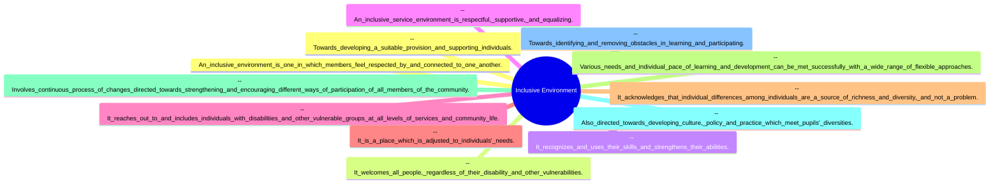
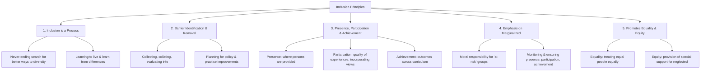
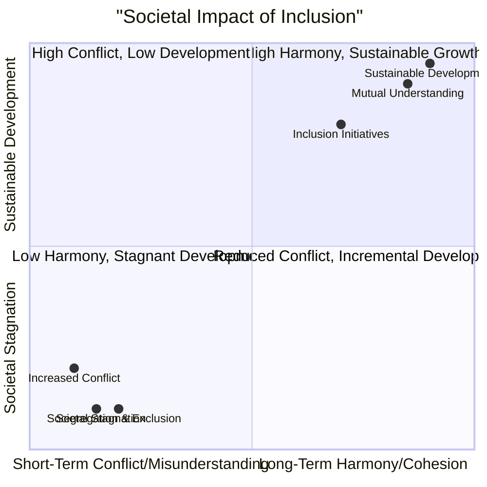
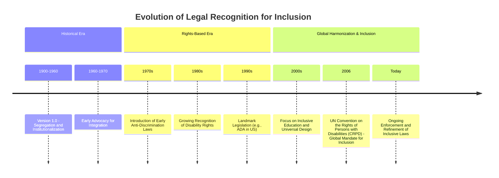
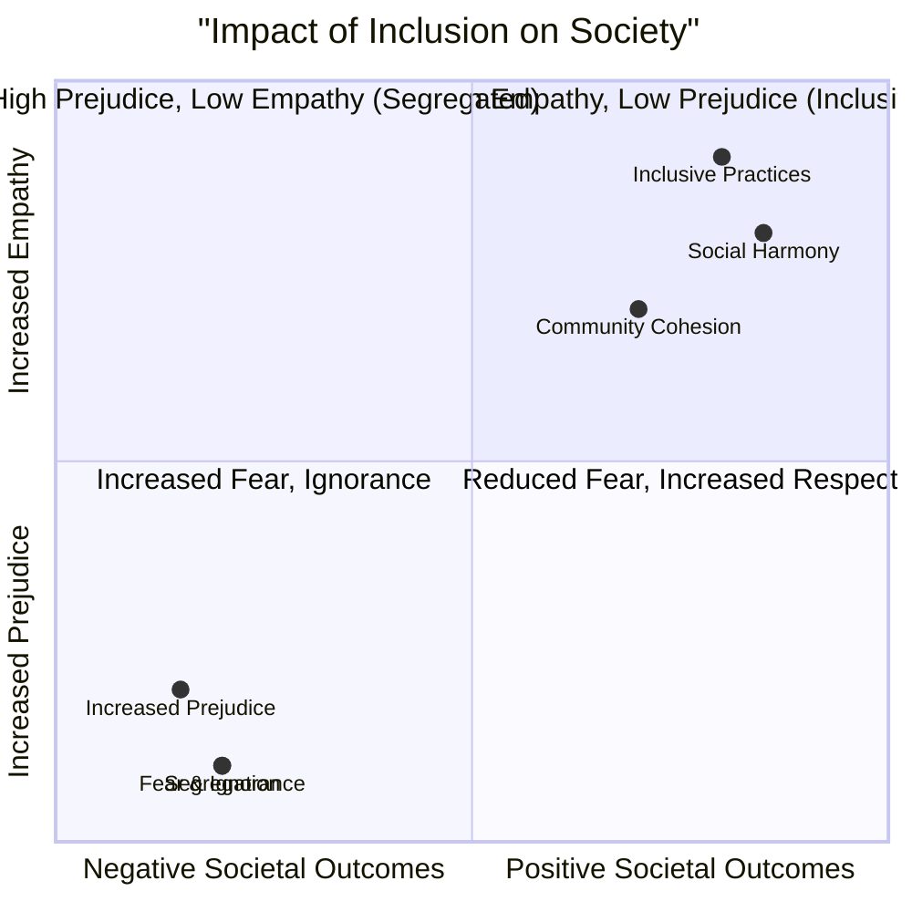

# 2 Concept Of Inclusion

Comprehensive resource for 2 Concept Of Inclusion.


---

## 2 Concept Of Inclusion Hub


## Overview
This unit delves into the fundamental concept of inclusion, exploring its core definitions, guiding principles, and compelling rationales. It moves beyond a superficial understanding to examine the practical dimensions required for effective inclusive services, acknowledging disability as a form of human diversity. The unit also scrutinizes the characteristic features of an inclusive environment and identifies various barriers that impede full participation, providing a comprehensive framework for fostering truly inclusive societies.

## Learning Objectives
*   Define the concept of inclusion and differentiate it from exclusion.
*   Articulate the key principles that underpin inclusive practices.
*   Explain the educational, social, legal, and economic rationales for promoting inclusion.
*   Describe the essential dimensions required for implementing inclusive services effectively.
*   Identify and categorize the various features that characterize an inclusive environment.
*   Recognize and analyze the different types of barriers (social, environmental, institutional) to inclusion.
*   Propose strategies for removing barriers and fostering inclusive cultures and practices.

## Unit Applications & Real-World Relevance
The concepts within this unit are crucial for professionals across various sectors, including education, social work, public policy, and urban planning, to design and implement services that cater to all individuals. Understanding inclusion is vital for creating equitable workplaces, accessible public spaces, and educational systems that embrace diversity. It directly impacts policy-making for marginalized groups, contributing to sustainable development and democratic participation by ensuring that no one is left behind due to disability or vulnerability.

## Active Learning Prompts
*   Consider a public space you frequent. How inclusive is it? Identify specific features that promote or hinder inclusion for various vulnerable groups.
*   Reflect on a situation where you witnessed exclusion. What were the underlying attitudes or systemic barriers that contributed to it? How could the principles of inclusion have been applied to foster a different outcome?
*   Imagine you are designing a new educational program. How would you embed the principles of inclusion from the outset to ensure all learners, including those with disabilities, can fully participate and achieve?
*   Discuss how the economic rationale for inclusion extends beyond direct cost savings to encompass broader societal benefits, such as innovation and social cohesion.

## Unit Challenges & Common Misconceptions
A common challenge is viewing inclusion as a "one-time project" rather than an ongoing process. Many mistakenly believe that providing separate but "equal" services constitutes inclusion, failing to recognize that true inclusion requires systemic barrier removal and full participation in mainstream activities. Another misconception is that inclusion primarily benefits only persons with disabilities, overlooking its broader advantages for societal diversity, innovation, and overall human flourishing. Overcoming deep-seated social and attitudinal barriers often proves more complex than addressing physical or institutional ones, demanding sustained cultural shifts.

## Connections
  - [[Definition_of_Inclusion]]
    - [[Dimensions_for_Effective_Inclusive_Services]]
  - [[Principles_of_Inclusion]]
    - [[WHO_Environmental_Analysis_in_Disability]]
    - [[Equality_and_Equity_in_Inclusion]]
  - [[Rationale_for_Inclusion]]
    - [[Educational_Foundations_of_Inclusion]]
    - [[Social_Foundations_of_Inclusion]]
    - [[Legal_Foundations_of_Inclusion]]
    - [[Economic_Foundations_of_Inclusion]]
    - [[Foundations_for_Building_Inclusive_Society]]
  - [[Features_of_Inclusive_Environment]]
  - [[Barriers_to_Inclusive_Environment]]
    - [[Social_and_Attitudinal_Barriers]]
    - [[Environmental_and_Technical_Barriers]]
    - [[Institutional_Barriers]]

## Next Steps for Deeper Understanding
To further deepen your understanding, explore specific international legal frameworks for disability rights, such as the UN Convention on the Rights of Persons with Disabilities (CRPD). Investigate case studies of successful inclusive practices in various countries or sectors. Research the role of assistive technologies in promoting inclusion and delve into psychological theories behind attitudinal change to combat prejudice and discrimination effectively. Consider studying Universal Design principles for creating inherently inclusive environments from the outset.

## Possible Questions
[[CC0113_2_Concept_of_Inclusion_Possible_Questions]]

---

---

## Barriers To Inclusive Environment


## Definition
Before proceeding, ensure you master [[Features_of_Inclusive_Environment]].
Barriers to an Inclusive Environment are any impediments, whether social, attitudinal, environmental, technical, or institutional, that prevent persons with disabilities and other vulnerable groups from participating in society on equal terms with non-disabled people. These barriers actively obstruct the formation of an accommodative and barrier-free atmosphere, making genuine [[Definition_of_Inclusion]] impossible to achieve.

## The Mental Model
Imagine a race where some runners have their shoelaces tied together (social barriers), others face hurdles in their lane (environmental barriers), and some aren't even allowed on the track due to arbitrary rules (institutional barriers). The [[Barriers_to_Inclusive_Environment]] are these obstacles that prevent everyone from starting on an equal footing and competing fairly. An inclusive environment is one where all shoelaces are untied, hurdles are removed, and everyone has a clear path to the finish line.

## Context & Framework
#### Categorizing Obstacles to Full Participation
Despite the positive features and qualities of inclusion, several categories of barriers actively hinder the full participation of persons with disabilities in public services and broader society. These are primarily categorized into three types: social and attitudinal barriers, which stem from prejudice and discrimination; environmental and technical barriers, which relate to physical inaccessibility; and institutional barriers, which involve deficiencies in legislation, policies, and action plans. Understanding these distinct categories is crucial for effective barrier removal strategies.

## The Mastery Deep Dive
#### The Kill Sheet: Comparison of Different Barrier Types
| Barrier Type                  | Core Nature / Problem                                         | Examples                                                                                                                                           | The "Gotcha" Difference                                                                                                                                                           |
| :
---------------------------- | :
------------------------------------------------------------ | :
------------------------------------------------------------------------------------------------------------------------------------------------- | :
-------------------------------------------------------------------------------------------------------------------------------------------------------------------------------- |
| [[Social_and_Attitudinal_Barriers]] | Prejudice, discrimination, negative perceptions, ignorance.   | Association of disability with shame/pity, viewing PWDs as incapable, negative language, hiding PWDs at home to avoid discrimination.              | These are rooted in human beliefs, feelings, and societal norms, often requiring cultural shifts to overcome. They are intangible.                                                      |
| [[Environmental_and_Technical_Barriers]] | Physical or structural impediments in natural or built environments. | High steps, narrow entrances, lack of light/handrails, uneven paths, inaccessible public transport/buildings, lack of digital accessibility.      | These are physical, tangible obstacles in the surrounding world, either naturally occurring or human-made, requiring architectural/design solutions. They are observable.                |
| [[Institutional_Barriers]]    | Deficiencies in policies, laws, systems, or their implementation. | Legislation lacking clear directives for implementation, ministries unaware of policies, exclusion of PWDs from planning/management processes. | These stem from systemic failures within organizations, governments, or laws, even if intentions are good. They are often about process, awareness, or enforcement gaps. They are systemic. |
*Note: This "Kill Sheet" table highlights the distinct characteristics and examples for each category of barrier to inclusion, making it easier to differentiate them.*

#### Breaking Down the Barrier Categories
1.  **Social and Attitudinal Barriers:** These are the most pervasive and often the biggest problems. They include prejudice, discrimination, and negative societal perceptions such as associating disability with shame, fear, pity, or even punishment. This can lead to isolation, overprotection, assumptions of incapability, and the use of negative language, often resulting in families hiding individuals with disabilities.
2.  **Environmental and Technical Barriers:** These relate to physical impediments in natural or human-made environments. Examples include inaccessible public transport, hospitals, schools, housing, shops, places of worship, and media/communications. Specific technical barriers include high steps, narrow entrances, heavy doors, narrow cubicles, and lack of light or handrails. Natural barriers involve uneven or slippery ground.
3.  **Institutional Barriers:** These barriers are linked to deficiencies in legislation, policies, and action plans. Even when policies exist, they often lack clear directives, strategies, or guidelines for implementation. Furthermore, relevant ministries or bureaus may be unaware of these policies, leading to the frequent exclusion of persons with disabilities from planning, implementation, and management of public services.

## Constraints & Limitations
#### Spot the Impostor: "Compliance" as a False Sense of Inclusion
A critical trap is the belief that merely complying with minimum accessibility standards (addressing some environmental barriers) equates to achieving true inclusion. This is a "false friend" because while compliance is necessary, it is insufficient to dismantle the more complex [[Social_and_Attitudinal_Barriers]] or [[Institutional_Barriers]]. For instance, building a ramp (compliance) doesn't remove the prejudice of an employer (attitudinal) or compensate for a policy that excludes persons with disabilities from decision-making (institutional). True inclusion requires a holistic approach that addresses all barrier types, not just the easily quantifiable ones.

## Significance & Application
Understanding barriers is crucial for anyone involved in social justice, policy reform, urban development, and service provision. It directly informs advocacy strategies, helps in designing truly inclusive policies, and guides the architectural and digital design of accessible environments. Professionally, recognizing these barriers enables individuals to identify systemic inequities and develop targeted interventions to dismantle them, fostering genuine equality and participation in all sectors.

## The Worked Example
*Test your mastery. Cover the solutions below to test yourself first.*

#### Level 1: The Sanity Check (Verification)
**The Question:** Name the three main types of barriers that prevent persons with disabilities from participating in society on equal terms.
> **Solution:** The three main types of barriers are: Social and Attitudinal barriers, Environmental and Technical barriers, and Institutional barriers.

#### Level 2: The Crucible (Mastery & Edge Cases)
**The Scenario:** A new shopping mall is designed with wide aisles, accessible restrooms, and elevators that can accommodate multiple wheelchairs. However, security guards are instructed to subtly discourage individuals with visible disabilities from entering certain high-end stores, based on the assumption that they are less likely to make purchases. Furthermore, the mall's marketing campaigns exclusively feature non-disabled individuals.
**The Question:** Identify and explain two distinct types of [[Barriers_to_Inclusive_Environment]] that are still clearly present in this scenario, despite the mall's physical accessibility.
> **Solution:**
> 1.  **Social and Attitudinal Barriers:** The security guards' instructions to discourage individuals with visible disabilities and the exclusive marketing campaigns both exemplify [[Social_and_Attitudinal_Barriers]]. The assumption that persons with disabilities are "incapable/inadequate" and less likely to be high-end customers reflects prejudice and discrimination. This creates an environment where individuals with disabilities are not "respected by and connected to one another" and are not welcomed regardless of their vulnerabilities, even if the physical space is accessible.
> 2.  **Institutional Barriers (Implicit):** While not explicit policy, the *instruction* to security guards (even if subtle) and the *systematic exclusion* of persons with disabilities from marketing material suggest an underlying institutional issue. This indicates that while physical aspects are addressed, the institution's informal directives, lack of awareness, and management practices (lack of guidelines for inclusive customer service, exclusion from marketing planning) perpetuate barriers, preventing their full inclusion in the "management of different public services" (customer experience in this case).

## Key Takeaways
*   Barriers to an inclusive environment are categorized into social/attitudinal, environmental/technical, and institutional, all hindering equal participation.
*   Social and attitudinal barriers stem from prejudice, discrimination, and negative perceptions, often leading to isolation and assumptions of incapability.
*   Environmental and technical barriers are physical impediments in natural or built environments, such as inaccessible infrastructure or communication systems.
*   Institutional barriers relate to shortcomings in legislation, policies, and their implementation, often leading to the exclusion of persons with disabilities from planning and management processes.

## Knowledge Graph Connections
| Concept                          | Connection / Relationship                                                                 |
| :
------------------------------- | :
---------------------------------------------------------------------------------------- |
| [[Features_of_Inclusive_Environment]] | These barriers are the direct antithesis of the desired features of inclusive environments. |
| [[Social_and_Attitudinal_Barriers]] | This is a specific category of barrier related to societal beliefs and biases.            |
| [[Environmental_and_Technical_Barriers]] | This is a specific category of barrier related to physical and structural impediments.    |
| [[Institutional_Barriers]]       | This is a specific category of barrier related to policy and systemic implementation gaps. |
---

---

## Definition Of Inclusion


## Definition
Before proceeding, ensure you master Exclusion_And_Alienation.
Inclusion is the principle that asserts whatever benefits accrue to members of a society are the heritage of all people, not just those who are able-bodied. It is the opposite of Exclusion_And_Alienation and fundamentally means that all people are entitled to full membership of the human family. A simpler way to understand it is that just as everyone in a family shares in the benefits and responsibilities of the household, so too should all individuals in society.

## The Mental Model
Imagine a large, diverse puzzle. Each piece represents an individual, with unique shapes, colors, and sizes. "Exclusion" would be removing certain pieces because they don't seem to fit the 'standard' shape, leaving gaps in the picture. "Inclusion" is ensuring every single piece finds its place, even if it means adjusting the surrounding pieces or the overall strategy of putting the puzzle together, recognizing that the complete picture is richer and more robust with every piece present.

## Context & Framework
#### Distinguishing Inclusion from Exclusion
Inclusion stands in direct opposition to exclusion and alienation. Exclusion involves actively or passively denying certain individuals or groups access to societal benefits, participation, or recognition. Alienation is the feeling or state of being isolated from a group or activity to which one should belong. Inclusion, conversely, champions the idea that everyone is entitled to participate fully, possesses the same rights and responsibilities, and has something valuable to contribute to society. This distinction is critical for understanding the systemic shifts required to move from exclusionary practices to inclusive ones.

## The Mastery Deep Dive
#### The "Wikipedia One-Liner": The Rigorous Exam Definition
Inclusion, at its core, is the principle demanding the valued recognition of all people and their entitlement to meaningful interaction, involvement, and engagement in every part of the complex and multifaceted societies in which we live. It transcends mere presence, requiring active participation and achieving equitable outcomes across all societal aspects. This rigorous definition emphasizes that inclusion is a dynamic, ongoing societal responsibility to remove barriers and proactively foster environments where diversity is not just tolerated but celebrated as a source of richness and strength.

#### Inclusion as a Dynamic Process, Not a Project
Inclusion is not a static state or a one-time project; rather, it is an organic and continuous process intended to pass through interconnected steps. These steps involve developing inclusive policies and legal frameworks, fostering an inclusive culture within communities and institutions, and ultimately evolving inclusive practices. This ongoing nature means constant re-evaluation, adaptation, and commitment to removing newly identified barriers and responding to evolving forms of diversity.

## Constraints & Limitations
#### Spot the Impostor: "Tokenism" as a Pseudo-Inclusion Trap
A significant trap in the pursuit of inclusion is "tokenism," where superficial gestures of inclusion are made without genuine structural change. For example, inviting a person with a disability to a meeting but not providing accessible communication or considering their input as truly valuable. This creates a facade of inclusion without the substantive meaningful interaction and engagement that define true inclusion. It's a "false friend" because it appears inclusive but lacks the core commitment to full participation and valued recognition, ultimately leading to continued alienation.

## Significance & Application
Inclusion is academically relevant as a foundational concept in social justice, human rights, and sustainable development studies. In the real world, it underpins legislative efforts to protect marginalized groups, guides urban planning for accessible public spaces, informs educational strategies for diverse learners, and shapes corporate diversity and equity initiatives. Its application ensures equitable access to opportunities and resources, fostering cohesive and resilient communities.

## The Worked Example
*Test your mastery. Cover the solutions below to test yourself first.*

#### Level 1: The Sanity Check (Verification)
**The Question:** Define inclusion in your own words, ensuring you highlight its relationship to Exclusion_And_Alienation.
> **Solution:** Inclusion is the principle that all members of society, regardless of their abilities or characteristics, are inherently entitled to full participation, rights, and responsibilities. It is the direct opposite of exclusion, which denies such participation, and alienation, which fosters isolation.

#### Level 2: The Crucible (Mastery & Edge Cases)
**The Scenario:** A local community center decides to host a "Disability Awareness Day." They invite local disability advocates to speak, display educational posters, and provide information brochures. However, the event is held on the second floor of a building without a lift, and the presentations are only in spoken English, with no sign language interpretation or written materials.
**The Question:** While the community center appears to be making an effort towards awareness, identify two ways this scenario demonstrates a failure to grasp the [[Definition_of_Inclusion]] as an active process, explicitly contrasting it with the true meaning of participation and engagement.
> **Solution:** This scenario fails to grasp the active process of inclusion in two critical ways:
> 1.  **Lack of Physical and Communication Accessibility:** By holding the event on an inaccessible second floor and offering only spoken English presentations, the center fails to provide the fundamental *entitlement to meaningful interaction and involvement*. This physically and communicatively *excludes* individuals who use wheelchairs or are deaf/hard of hearing, directly contradicting the core principle that "all people are entitled to full membership."
> 2.  **Focus on Awareness Over Participation:** While "awareness" is a step, the event prioritizes showcasing information *about* disability rather than actively facilitating the full participation *of* persons with disabilities. The definition of inclusion emphasizes "participation" and "engagement" – being able to fully experience and contribute to the event, not just being the subject of discussion. This is a form of tokenism (as mentioned in "Spot the Impostor") where the facade of inclusion is present, but genuine engagement is absent, ultimately leading to alienation for those most impacted. The center has not fulfilled its "responsibility of society as a whole" to remove barriers.

## Key Takeaways
*   Inclusion is the fundamental principle that all individuals are entitled to full participation, rights, and responsibilities in society, standing in direct opposition to exclusion and alienation.
*   It is a dynamic, continuous process involving the development of inclusive policies, cultures, and practices, rather than a one-time project or a superficial gesture.
*   True inclusion demands valued recognition and meaningful engagement, proactively removing barriers to ensure all people can contribute and belong.

## Knowledge Graph Connections
| Concept                          | Connection / Relationship                                                                 |
| :
------------------------------- | :
---------------------------------------------------------------------------------------- |
| Exclusion_And_Alienation     | Inclusion is explicitly defined as the opposite of exclusion and alienation.              |
| [[Dimensions_for_Effective_Inclusive_Services]] | Definition lays the conceptual groundwork for effective service implementation. |
| [[Principles_of_Inclusion]]      | The core definition provides the philosophical basis for all principles of inclusion.       |
| [[Rationale_for_Inclusion]]      | Understanding the definition is crucial for appreciating the justification for inclusion.   |
| [[Barriers_to_Inclusive_Environment]] | The concept of inclusion directly necessitates the removal of these barriers.             |
---

---

## Features Of Inclusive Environment


## Definition
Before proceeding, ensure you master [[Rationale_for_Inclusion]].
Features of an Inclusive Environment refer to the defining characteristics and qualities that create an accommodative and barrier-free atmosphere, ensuring all individuals feel respected, connected, and are able to participate fully, regardless of their disability or vulnerability. It is an environment that actively recognizes, uses, and strengthens the diverse skills and abilities of all its members.

## The Mental Model
Imagine a perfectly designed, universally accessible park. This park would be the [[Features_of_Inclusive_Environment]]. It wouldn't just have ramps; it would have sensory gardens, varied seating options, clear signage in multiple formats, and pathways designed for everyone. Every element is deliberately crafted to make individuals feel welcome, respected, and able to engage freely and equally. It's a place where differences are seen as enriching, not problematic.

## Context & Framework
#### Defining the Accommodative Atmosphere
An inclusive environment is intrinsically linked to the formation of an accommodative and barrier-free atmosphere. It welcomes all people, respects their individual differences as a source of richness, and actively strives to meet diverse needs through flexible approaches. Such an environment goes beyond mere tolerance, actively reaching out to and including individuals with disabilities and other vulnerable groups at all levels of services and community life.

## The Mastery Deep Dive
#### Who are the Neighbors?: Contextual Relationships

*Note: This `mindmap` illustrates the various interconnected features that define a truly inclusive environment.*

An inclusive environment doesn't exist in isolation; it "neighbors" and interacts with several key aspects of societal function. Its fundamental characteristic is fostering mutual respect and connection among members. This is adjacent to welcoming all people irrespective of vulnerability, which in turn leads to recognizing and leveraging diverse skills. A supportive and equalizing service environment directly influences how an inclusive space "reaches out" and actively engages marginalized groups. Furthermore, the acknowledgment of individual differences as a source of richness is closely linked to the environment's ability to adjust to individual needs, employing flexible approaches for learning and development. This entire system is continually evolving, driven by changes in culture, policy, and practice, all directed towards identifying and removing obstacles.

#### Key Features of Inclusive Environments
1.  **Mutual Respect and Connection:** Members feel respected by and connected to one another, fostering a sense of belonging.
2.  **Universal Welcome:** It welcomes all people, irrespective of disability or other vulnerabilities.
3.  **Skill Recognition and Development:** It actively recognizes, utilizes, and strengthens the skills and abilities of all individuals.
4.  **Supportive and Equalizing Services:** Service environments are inherently respectful, supportive, and designed to provide equal opportunities.
5.  **Proactive Outreach and Inclusion:** It actively reaches out to and includes individuals with disabilities and other vulnerable groups at all levels of services and community life.
6.  **Individualized Adjustment:** The environment is adjusted to meet individual needs, moving beyond a one-size-fits-all approach.
7.  **Diversity as Richness:** It acknowledges individual differences as a source of richness and diversity, rather than a problem.
8.  **Flexible Approaches:** Various needs and individual paces of learning and development are met successfully with a wide range of flexible approaches.
9.  **Continuous Evolution:** It involves a continuous process of changes directed towards strengthening and encouraging different ways of participation for all community members.
10. **Policy and Practice Development:** It is also directed towards developing culture, policy, and practice that meet diverse needs, identify obstacles, and provide suitable support.

## Constraints & Limitations
#### The "Don't Make Me Think" Rule: Hidden Cognitive Barriers
Even a physically accessible environment can create subtle "cognitive barriers" if it's not intuitively designed or requires excessive mental effort to navigate. This is a crucial trap in assessing inclusivity. For example, a website might be technically screen-reader compatible (addressing a physical barrier), but if its layout is chaotic, navigation is illogical, or instructions are overly complex, it imposes a cognitive burden that excludes individuals with certain learning differences or cognitive disabilities. An inclusive environment adheres to the "Don't Make Me Think" rule, striving for clarity and ease of use for all, and avoiding hidden friction points that force extra mental processing.

## Significance & Application
Understanding the features of an inclusive environment is essential for professionals in architecture, urban planning, software development, and service design. It guides the creation of physical spaces, digital platforms, and social programs that are inherently accessible and welcoming. In education, it informs the design of learning spaces and pedagogical approaches. Its application ensures that environments are not merely compliant but genuinely foster a sense of belonging and enable full participation for every individual, transforming diverse communities into vibrant, functional ecosystems.

## The Worked Example
*Test your mastery. Cover the solutions below to test yourself first.*

#### Level 1: The Sanity Check (Verification)
**The Question:** Identify three characteristics that define an inclusive environment.
> **Solution:** Three characteristics are: members feel respected and connected; it welcomes all people regardless of disability; and it recognizes and uses individuals' skills and abilities.

#### Level 2: The Crucible (Mastery & Edge Cases)
**The Scenario:** A new public library is designed with ramps, automatic doors, and adjustable-height desks. However, the library's cataloging system is exclusively text-based, with no visual cues or audio descriptions for book covers, and the library staff exclusively use spoken announcements without accompanying written or visual information on new events.
**The Question:** While the library has addressed some physical accessibility, explain two distinct ways this scenario demonstrates a failure to fully embody the [[Features_of_Inclusive_Environment]], particularly concerning how it recognizes individual differences as a source of richness and adjusts to individual needs.
> **Solution:**
> 1.  **Failure to Acknowledge Diversity as Richness (Sensory Needs):** The library's text-only catalog and lack of visual/audio information for events fails to acknowledge that individual differences among individuals are a source of richness and diversity, and not a problem. It neglects individuals with visual impairments or certain cognitive differences who may benefit from non-textual cues, and deaf or hard-of-hearing individuals who require visual communication. The library is not seeing these diverse needs as an opportunity to enrich its services.
> 2.  **Failure to Adjust to Individual Needs (Flexible Approaches):** By relying solely on text or spoken announcements, the library fails to meet various needs and the individual pace of learning and development with a wide range of flexible approaches. An inclusive environment would offer multimodal information (e.g., audio descriptions, tactile books, visual schedules, sign language interpreters) to genuinely adjust to the diverse needs of its patrons.

## Key Takeaways
*   An inclusive environment is defined by mutual respect, universal welcome, and the active recognition and strengthening of all individuals' skills and abilities.
*   It is characterized by supportive, equalizing services, proactive outreach, and a continuous adjustment to individual needs through flexible approaches.
*   Crucially, it views individual differences not as problems, but as a valuable source of richness and diversity, driving ongoing cultural, policy, and practical changes.

## Knowledge Graph Connections
| Concept                          | Connection / Relationship                                                                 |
| :
------------------------------- | :
---------------------------------------------------------------------------------------- |
| [[Rationale_for_Inclusion]]      | The features are the practical manifestations that fulfill the underlying rationales.     |
| [[Barriers_to_Inclusive_Environment]] | The features directly address and aim to overcome these obstacles to participation.      |
| [[Dimensions_for_Effective_Inclusive_Services]] | Features contribute to creating the optimal physical and social environments for these services. |
| [[WHO_Environmental_Analysis_in_Disability]] | The features are largely a response to the environmental aspects identified by WHO.     |
---

---

## Principles Of Inclusion


## Definition
Before proceeding, ensure you master [[Definition_of_Inclusion]].
The Principles of Inclusion are the foundational tenets that guide the implementation and evaluation of inclusive practices within society. They articulate the core values and objectives that must be upheld to ensure genuine participation and belonging for all individuals, particularly those at risk of marginalization. These principles move beyond the simple definition of inclusion by outlining *how* inclusion is achieved and sustained.

## The Mental Model
Imagine a sturdy, interconnected tree. The trunk is the core [[Definition_of_Inclusion]]. The major branches are the [[Principles_of_Inclusion]], each supporting and extending from the trunk, providing structure and direction for growth. Smaller twigs and leaves represent specific actions and policies. If any major branch is weak or missing, the tree's overall health and ability to provide shade (inclusion) for all are compromised. All parts of the tree are vital and work together.

## Context & Framework
#### The UNESCO Framework for Inclusive Practices
According to UNESCO (2005), four major principles form the bedrock of inclusion: (1) Inclusion is a process, (2) Inclusion is concerned with the identification and removal of barriers, (3) Inclusion is about the presence, participation, and achievement of all persons, and (4) Inclusion invokes a particular emphasis on those who may be at risk of marginalization, exclusion, or underachievement. These principles provide a comprehensive framework for understanding and implementing inclusive approaches across various sectors, from education to community development.

## The Mastery Deep Dive
#### The Family Tree: Interconnected Principles

*Note: This `graph TD` illustrates the hierarchical relationship between the overarching principles of inclusion and their core characteristics.*

The principles of inclusion are not isolated but form an interconnected "family tree" where each principle supports and reinforces the others. For example, recognizing inclusion as a continuous *process* (Principle 1) necessitates the ongoing *identification and removal of barriers* (Principle 2). This removal of barriers, in turn, facilitates the *presence, participation, and achievement* of all individuals (Principle 3), with a particular *emphasis on those at risk of marginalization* (Principle 4). Finally, the entire framework is underpinned by the promotion of both *equality and equity* (Principle 5), ensuring fair treatment and necessary support.

#### Unpacking the Core Principles
1.  **Inclusion is a process:** This principle emphasizes that inclusion is a never-ending journey to better respond to diversity. It's about learning from differences and seeing them as a stimulus for growth among all individuals, rather than a problem to be solved.
2.  **Barrier identification and removal:** This involves systematically gathering and evaluating information to pinpoint obstacles that hinder the development of persons with disabilities. It's about proactive problem-solving to improve policies and practices.
3.  **Presence, participation, and achievement:** This tripartite focus ensures that individuals are not just physically present, but actively engaged (quality of experience, incorporating their views), and achieving meaningful outcomes across all aspects of life, beyond just standardized test results.
4.  **Emphasis on those at risk of marginalization:** This principle highlights a moral responsibility to vigilantly monitor and implement steps to guarantee the presence, participation, and achievement of vulnerable groups, ensuring no one is left behind.
5.  **Promotes equality and equity:** Inclusion inherently champions both [[Equality_and_Equity_in_Inclusion]]. Equality means treating equals equally, while equity refers to providing specific support to those who have been historically neglected, to enable their full participation.

## Constraints & Limitations
#### The "Empty Checklist" Trap: Confusing Compliance with Culture
A common trap is to treat the principles of inclusion as a simple checklist for compliance, rather than a guide for fostering a truly inclusive culture. For instance, an institution might claim to "identify and remove barriers" (Principle 2) by installing a ramp, but fail to address underlying attitudinal barriers. This "empty checklist" approach neglects the spirit of inclusion as a process (Principle 1) and its emphasis on genuine participation (Principle 3). It mistakenly assumes that fulfilling superficial requirements equates to achieving deep-seated cultural change, leaving many still feeling marginalized.

## Significance & Application
Understanding these principles is vital for anyone involved in designing policies, programs, or environments aimed at inclusion. In education, they guide curriculum development and teaching methodologies. In public policy, they inform legislation for accessibility and non-discrimination. Professionally, they provide a moral and practical compass for fostering diverse and equitable workplaces and communities. The principles are fundamental to the global movement for disability rights and social justice.

## The Worked Example
*Test your mastery. Cover the solutions below to test yourself first.*

#### Level 1: The Sanity Check (Verification)
**The Question:** Name two of UNESCO's major principles of inclusion and briefly explain what each entails.
> **Solution:**
> 1.  **Inclusion is a process:** This means it's a continuous, never-ending effort to find better ways to respond to diversity, rather than a fixed goal or one-time project. It involves learning from differences.
> 2.  **Inclusion is concerned with the identification and removal of barriers:** This principle focuses on actively finding and eliminating obstacles that prevent individuals with disabilities from developing and participating fully. It requires evaluating information and planning improvements.

#### Level 2: The Crucible (Mastery & Edge Cases)
**The Scenario:** A non-profit organization launches a new program for youth with disabilities. They ensure all physical spaces are accessible, provide a diverse range of activities, and meticulously track attendance. However, they struggle to gain feedback from the participants themselves, and engagement levels during activities remain low, despite good attendance.
**The Question:** Identify which two of UNESCO's principles of inclusion are *most clearly being neglected* in this scenario, and explain why.
> **Solution:** The two principles most clearly being neglected are:
> 1.  **Inclusion is about the presence, participation, and achievement of all persons (specifically "participation"):** While "presence" (tracking attendance) is met, "participation" is failing because the quality of experiences is low and the organization is not incorporating the views of learners. Genuine participation requires active engagement and feeling valued, not just being physically present.
> 2.  **Inclusion is a process:** The organization appears to view inclusion as a static goal (accessible spaces, diverse activities) rather than a continuous search for better ways to respond to diversity. The lack of feedback mechanisms indicates a failure in the "never-ending search to find better ways of responding to diversity" and "learning how to learn from differences." The low engagement suggests the process needs refinement based on learner experiences.

## Key Takeaways
*   The principles of inclusion, as outlined by UNESCO, provide a comprehensive framework for guiding inclusive practices, emphasizing continuous improvement, barrier removal, and full participation.
*   Key principles include viewing inclusion as a process, actively identifying and eliminating barriers, focusing on presence, participation, and achievement, and prioritizing those at risk of marginalization.
*   An integral principle is the promotion of both equality (treating equals equally) and equity (providing necessary support to overcome historical disadvantages).

## Knowledge Graph Connections
| Concept                          | Connection / Relationship                                                                 |
| :
------------------------------- | :
---------------------------------------------------------------------------------------- |
| [[Definition_of_Inclusion]]      | These principles elaborate on the foundational definition of inclusion.                    |
| [[WHO_Environmental_Analysis_in_Disability]] | The principles inform the understanding of environmental factors in inclusion.          |
| [[Equality_and_Equity_in_Inclusion]] | This concept is explicitly integrated as the fifth principle of inclusion.                |
| [[Rationale_for_Inclusion]]      | The principles provide the operational 'how' to the 'why' of inclusive rationales.        |
| [[Features_of_Inclusive_Environment]] | The principles dictate the characteristics and requirements of inclusive environments.    |
| [[Barriers_to_Inclusive_Environment]] | The second principle explicitly mandates the identification and removal of these barriers. |
---

---

## Rationale For Inclusion


## Definition
Before proceeding, ensure you master [[Principles_of_Inclusion]].
The Rationale for Inclusion refers to the compelling justifications and foundational arguments that underscore the necessity and benefits of applying inclusion as a societal strategy. These rationales explain *why* inclusion is crucial for ensuring the visible participation of persons with disabilities and other vulnerable groups across all facets of life, moving beyond moral imperative to encompass practical, systemic advantages.

## The Mental Model
Imagine a sturdy five-legged table. Each leg represents a different [[Rationale_for_Inclusion]]: Educational, Social, Legal, Economic, and Foundations for Building Inclusive Society. All five legs are essential for the table (inclusion) to stand firm and support its purpose (visible participation of all). If any leg is weak or missing, the table becomes unstable, and its ability to function effectively is compromised.

## Context & Framework
#### Multi-faceted Justifications for Inclusive Practices
The rationale for inclusion is comprehensive, drawing upon various foundations to make a compelling case for its implementation. These include educational arguments, which highlight improved outcomes for children in inclusive settings; social arguments, focusing on reducing prejudice and fostering relationships; legal arguments, emphasizing inherent rights; economic arguments, pointing to cost-effectiveness and broader societal benefits; and foundations for building an inclusive society, which stress mutual understanding and sustainable development. Together, these justifications form a powerful impetus for systemic change.

## The Mastery Deep Dive
#### The Devil's Advocate: Why Might This Be Wrong?
Implementing inclusion can sometimes face resistance or skepticism, often rooted in perceived challenges or misinterpretations. For example, some might argue that specialized education is more effective for students with disabilities, or that separate facilities are more efficient. The "Devil's Advocate" perspective would question the immediate costs of transitioning to inclusive systems or the complexities of adapting existing infrastructure. However, these counter-arguments often overlook the long-term benefits and systemic advantages that outweigh initial challenges, as articulated by the comprehensive rationales. For instance, while initial investment in accessible infrastructure might seem high, the long-term economic benefits of reduced wastage from dropouts and increased employment opportunities for persons with disabilities are substantial. Similarly, claims of educational inefficiency ignore the documented academic, psychological, and social benefits for all children in inclusive settings.

#### Overview of Key Rationales
1.  **Educational Foundations:** Children perform better academically, psychologically, and socially in inclusive environments. These settings also lead to more efficient use of educational resources, decreasing dropout rates and repetitions, and enhancing teacher competency and satisfaction.
2.  **Social Foundations:** Segregation fosters fear, ignorance, and prejudice. Inclusion, conversely, is the only approach with the potential to build friendship, respect, and understanding, preparing individuals for life in diverse communities.
3.  **Legal Foundations:** All individuals possess the inherent right to learn and live together. Excluding or discriminating against individuals due to disability is unjustified, as there are no legitimate reasons to separate children for their education.
4.  **Economic Foundations:** Inclusion offers significant economic benefits. Inclusive education is more cost-effective than creating separate special schools, reduces wastage from repetition and dropout, and facilitates better employment opportunities for persons with disabilities, allowing them to live with their families and utilize community infrastructure.
5.  **Foundations for Building Inclusive Society:** Inclusion promotes mutual understanding, appreciation of diversity, empathy, tolerance, and cooperation. Ultimately, it contributes to the promotion of sustainable development within society.

## Constraints & Limitations
#### The Hard Choice: Option A or Option B?
Decision-makers often face a hard choice between immediate, visible interventions (e.g., building a specialized facility) and long-term, systemic changes (e.g., universal design for accessibility). The trap here is that the immediate "solution" often reinforces segregation and creates new barriers, while the systemic approach, though initially more challenging, aligns with the holistic benefits outlined in the various rationales. For instance, choosing to build a special school (Option A) might seem efficient, but it contradicts the social and legal foundations, and often proves less cost-effective in the long run than adapting local schools (Option B). The [[Economic_Foundations_of_Inclusion]] specifically highlights that inclusive education is more cost-effective.

## Significance & Application
The rationales for inclusion are fundamental to advocacy efforts for disability rights and inform policy development at local, national, and international levels. They provide the compelling arguments needed to secure funding, implement legislation, and shift societal attitudes. Professionally, understanding these rationales empowers educators, policymakers, and community leaders to make informed decisions that promote equity and social justice, ensuring that inclusive practices are not just seen as desirable but as absolutely essential.

## The Worked Example
*Test your mastery. Cover the solutions below to test yourself first.*

#### Level 1: The Sanity Check (Verification)
**The Question:** Identify three distinct foundational rationales that justify the necessity of inclusion.
> **Solution:** Three distinct foundational rationales for inclusion are: Educational, Social, and Legal Foundations.

#### Level 2: The Crucible (Mastery & Edge Cases)
**The Scenario:** A national education ministry is considering two proposals: Proposal A suggests establishing several new, high-tech "special education centers" across the country for students with diverse needs. Proposal B recommends redirecting funds to train all mainstream teachers in inclusive pedagogy, equip existing local schools with necessary accommodations, and develop individualized support plans for students with special needs within their local schools.
**The Question:** Using insights from *both* the [[Educational_Foundations_of_Inclusion]] and the [[Economic_Foundations_of_Inclusion]], argue which proposal represents a more effective and beneficial long-term strategy for the country, even if Proposal A seems to offer a quicker, specialized solution.
> **Solution:** Proposal B, which advocates for training mainstream teachers and equipping existing local schools, represents a more effective and beneficial long-term strategy.
> *   **Educational Foundations:** Proposal B aligns directly with the educational rationale which states that "Children do better academically, psychologically and socially in inclusive settings." Segregated settings (Proposal A) can lead to fear, ignorance, and prejudice. By integrating students into mainstream schools, Proposal B fosters better social development, reduces dropouts, and improves teacher competency by encouraging collaboration and diverse pedagogical skills.
> *   **Economic Foundations:** Proposal B is more cost-effective in the long run. The economic rationale explicitly states that "Inclusive education is more cost-effective than the creation of special schools across the country". Building and maintaining separate special education centers (Proposal A) incurs higher capital and operational costs compared to adapting existing infrastructure and investing in teacher training. Furthermore, inclusive education, as promoted by Proposal B, facilitates better employment opportunities for people with disabilities who remain with their families and use community infrastructure, reducing overall societal welfare costs.

## Key Takeaways
*   The rationale for inclusion is comprehensive, encompassing educational, social, legal, economic, and societal foundations, all underscoring its necessity and benefits.
*   Educational foundations demonstrate improved academic, psychological, and social outcomes for students in inclusive settings and efficient resource use.
*   Social foundations highlight inclusion's role in reducing prejudice, building relationships, and preparing individuals for diverse communities.
*   Legal foundations assert the universal right to learn and live together, rejecting discrimination based on disability.
*   Economic foundations show inclusion as cost-effective, reducing wastage, and enhancing employment opportunities.
*   Building inclusive societies fosters mutual understanding, empathy, and sustainable development.

## Knowledge Graph Connections
| Concept                          | Connection / Relationship                                                                 |
| :
------------------------------- | :
---------------------------------------------------------------------------------------- |
| [[Principles_of_Inclusion]]      | The rationales provide the fundamental justification for these guiding principles.        |
| [[Educational_Foundations_of_Inclusion]] | These are a specific set of justifications for inclusion related to learning outcomes.  |
| [[Social_Foundations_of_Inclusion]] | These are a specific set of justifications for inclusion related to community interaction. |
| [[Legal_Foundations_of_Inclusion]] | These are a specific set of justifications for inclusion related to rights and law.       |
| [[Economic_Foundations_of_Inclusion]] | These are a specific set of justifications for inclusion related to financial benefits.  |
| [[Foundations_for_Building_Inclusive_Society]] | These are a specific set of justifications for inclusion related to societal values.   |
---

---

## Dimensions For Effective Inclusive Services


## Definition
Before proceeding, ensure you master [[Definition_of_Inclusion]].
Dimensions for Effective Inclusive Services refer to the three critical areas that must be concurrently considered and actively addressed to successfully implement services that genuinely accommodate the special needs of persons with disabilities and other vulnerable groups. These dimensions provide a holistic framework for transforming the abstract concept of inclusion into tangible, functional service delivery.

## The Mental Model
Imagine building a three-legged stool for someone with unique needs. Each leg is a crucial [[Dimensions_for_Effective_Inclusive_Services]]: (1) Creating non-discriminatory attitudes, (2) Developing accessible environments, and (3) Empowering physical and psychosocial capacity. If any leg is missing or weak, the stool is unstable, failing to provide stable support (effective inclusive service). All three legs must be robust and work together for true stability.

## Context & Framework
#### The Tripartite Approach to Inclusive Service Implementation
For the effective implementation of inclusive services, three fundamental dimensions require simultaneous attention. These involve fostering non-discriminatory attitudes within communities, developing accessible physical and service environments, and empowering the physical and psychosocial capacity of persons with disabilities and other vulnerable groups. This multi-pronged approach ensures that inclusion is addressed not just structurally, but also culturally and individually.

## The Mastery Deep Dive
#### "It's Not Working!" - The Fix-it Guide: Troubleshooting Inclusive Services
When inclusive services are not working as intended, troubleshooting often reveals that one or more of the three dimensions for effective implementation have been neglected or insufficiently addressed.
1.  **If a service is physically accessible but people with disabilities are still excluded or feel unwelcome:** The `non-discriminatory attitude` dimension is likely failing. The fix involves community awareness campaigns, staff training on unconscious bias, and fostering a culture of genuine respect and welcome.
2.  **If there's goodwill and positive attitudes, but participation remains low:** The `accessible and barrier-free physical/service environments` dimension is probably lacking. The fix requires auditing physical spaces (ramps, wide doorways), digital platforms (screen-reader compatibility), and communication methods (sign language, plain language).
3.  **If attitudes are good and environments are accessible, but individuals still struggle to engage:** The `empower physical and psychosocial capacity` dimension might be weak. The fix involves providing skills training, self-advocacy support, counseling, and peer support networks to build confidence and independence.
Effective inclusive services require continuous monitoring and adjustment across all three dimensions, as a failure in one can undermine progress in others.

#### The Pilot's Checklist (Do Not Skip)
```text
[ ] Dimension 1: Create non-discriminatory attitude within communities towards PWDs and other vulnerable groups.
[ ] Dimension 2: Develop accessible and/or barrier-free physical as well as service environments for equal participation of PWDs and other vulnerable groups in socio-economic activities.
[ ] Dimension 3: Empower physical and psychosocial capacity of PWDs and other vulnerable groups.
```
*Note: This "Pilot's Checklist" provides a sequential, safety-critical guide to ensure all three dimensions for effective inclusive services are addressed.*

These three dimensions form a critical "Pilot's Checklist" for anyone designing or evaluating inclusive services. Skipping any dimension risks rendering the entire service ineffective. Each point represents a vital component for ensuring holistic inclusion.
1.  **Create non-discriminatory attitude within communities towards PWDs and other vulnerable groups:** This involves actively challenging prejudice, discrimination, and negative stereotypes. It's about fostering empathy, understanding, and acceptance through education, awareness campaigns, and promoting positive interactions. This tackles [[Social_and_Attitudinal_Barriers]] head-on.
2.  **Develop accessible and/or barrier-free physical as well as service environments for equal participation of PWDs and other vulnerable groups in socio-economic activities:** This dimension focuses on the tangible aspects of accessibility. It demands the removal of physical, communication, and digital barriers to ensure that environments (buildings, transportation, information, services) are usable by everyone. This directly addresses [[Environmental_and_Technical_Barriers]].
3.  **Empower physical and psychosocial capacity of PWDs and other vulnerable groups:** This dimension emphasizes building the capabilities and confidence of individuals. It includes providing rehabilitation services, skills training, assistive technologies, psychological support, and opportunities for self-advocacy to enhance their independence and ability to participate fully. This complements environmental changes by preparing individuals to thrive within accessible settings.

## Constraints & Limitations
#### The Warning Lights: Signs of Trouble
A "warning light" for inclusive service implementation is when a service focuses disproportionately on only one or two of these dimensions while neglecting the third. For example, a city might build fully accessible bus stops and trains (addressing environmental barriers) but fail to train its staff in disability awareness or provide adequate support for independent travel (neglecting attitudinal and psychosocial empowerment). Another common pitfall is to empower individuals with skills but place them in discriminatory or inaccessible environments. These imbalances lead to sub-optimal outcomes, as progress in one area is undermined by deficits in another. True inclusion requires a balanced and integrated approach across all three dimensions.

## Significance & Application
These dimensions are paramount for policymakers, service providers, educators, and community leaders. They provide a practical blueprint for assessing, designing, and implementing truly inclusive programs and environments. By systematically addressing attitudes, environments, and individual capacities, professionals can ensure that interventions are holistic and effective, preventing superficial changes from being mistaken for genuine inclusion. This framework is crucial for achieving the [[Rationale_for_Inclusion]] in tangible ways.

## The Worked Example
*Test your mastery. Cover the solutions below to test yourself first.*

#### Level 1: The Sanity Check (Verification)
**The Question:** What are the three crucial dimensions that must be considered for the effective implementation of inclusive services?
> **Solution:** The three crucial dimensions are: creating non-discriminatory attitudes, developing accessible environments, and empowering physical and psychosocial capacity of persons with disabilities and other vulnerable groups.

#### Level 2: The Crucible (Mastery & Edge Cases)
**The Scenario:** A new government initiative aims to promote economic inclusion for persons with disabilities. They implement a program that provides extensive vocational training and job-seeking skills (empowering capacity). They also mandate that all government websites be fully accessible (accessible environment). However, the public employment offices, where job seekers interact with counselors and potential employers, still harbor significant unconscious biases against hiring persons with disabilities, and there are no specific anti-discrimination training programs for employers.
**The Question:** Identify which of the three [[Dimensions_for_Effective_Inclusive_Services]] is the *primary failure point* in this scenario, and explain how this omission undermines the effectiveness of the other two dimensions.
> **Solution:** The primary failure point in this scenario is the **"Create non-discriminatory attitude within communities towards PWDs and other vulnerable groups"** dimension.
> This omission undermines the other two dimensions because:
> 1.  **Undermines Empowerment:** Even with vocational training and job-seeking skills (empowerment of capacity), individuals will face insurmountable barriers in public employment offices and with biased employers. Their acquired skills cannot be utilized if discriminatory attitudes prevent them from being hired, leading to frustration and reduced confidence. The "psychosocial capacity" is empowered, but its application is blocked.
> 2.  **Undermines Accessible Environments:** While government websites are accessible (accessible environment), the actual human interaction points in the employment process remain hostile due to prejudiced attitudes. An accessible website is only one part of the service environment; the human element, which is critical for equal participation in "socio-economic activities," is fundamentally flawed. The physical "barrier-free" environment is effectively negated by the invisible attitudinal barriers.

## Key Takeaways
*   Effective inclusive services require a tripartite approach, addressing non-discriminatory attitudes, accessible environments, and individual empowerment.
*   Creating non-discriminatory attitudes involves challenging prejudice and fostering acceptance within communities.
*   Developing accessible environments means removing physical, communication, and digital barriers in all settings.
*   Empowering physical and psychosocial capacity focuses on building individuals' skills, confidence, and independence.
*   Neglecting any one of these dimensions can significantly undermine the effectiveness of the other two, leading to incomplete or superficial inclusion.

## Knowledge Graph Connections
| Concept                          | Connection / Relationship                                                                 |
| :
------------------------------- | :
---------------------------------------------------------------------------------------- |
| [[Definition_of_Inclusion]]      | These dimensions provide the actionable steps for achieving the definition of inclusion.    |
| [[Social_and_Attitudinal_Barriers]] | The first dimension directly aims to overcome these specific types of barriers.            |
| [[Environmental_and_Technical_Barriers]] | The second dimension directly aims to overcome these specific types of barriers.          |
| [[Barriers_to_Inclusive_Environment]] | These dimensions represent the strategic approach to systematically dismantling all barriers. |
| [[Features_of_Inclusive_Environment]] | Successfully addressing these dimensions will naturally lead to the manifestation of these features. |
---

---

## Economic Foundations Of Inclusion


## Definition
Before proceeding, ensure you master [[Rationale_for_Inclusion]].
Economic Foundations of Inclusion refer to the arguments that highlight the demonstrable financial and resource efficiency benefits of implementing inclusive practices for both individuals and society as a whole. These foundations emphasize that inclusion is not just a moral imperative but also a sound investment, leading to cost savings, increased productivity, and enhanced economic participation for all.

## The Mental Model
Imagine two separate factories. Factory A builds specialized products for a small, segregated market. Factory B adapts its production lines to create universal products that cater to a much larger, diverse market. The [[Economic_Foundations_of_Inclusion]] are the reasons *why* Factory B is more efficient, has less waste, and ultimately generates more overall value. Segregated systems (Factory A) are inherently more expensive and inefficient than adapted, inclusive systems (Factory B) that leverage existing infrastructure and expand the workforce.

## Context & Framework
#### The Financial Case for Inclusive Practices
The economic rationale for inclusion presents a compelling case based on financial benefits. It posits that inclusive education is more cost-effective than establishing and maintaining separate special schools across a country. By reducing wastage from repetition and dropout, and by enabling children with disabilities to attend local schools and live with their families, inclusion optimizes resource allocation. Furthermore, it plays a crucial role in facilitating better employment and job creation opportunities for persons with disabilities, contributing positively to national economies.

## The Mastery Deep Dive
#### The Hard Choice: Option A or Option B? (Cost-Effectiveness Analysis)
When confronted with limited resources, decision-makers often face a hard choice between investing in segregated, specialized services (Option A) or adapting existing mainstream systems for inclusion (Option B). The economic foundations of inclusion strongly advocate for Option B.
*   **Option A (Segregated Services):** Creating new special schools or specialized facilities involves significant capital expenditure for construction, ongoing operational costs for separate administration, transportation, and specialized personnel. This duplicates services and infrastructure, proving less cost-effective in the long run.
*   **Option B (Inclusive Services):** Investing in adapting local schools, training mainstream teachers, and providing in-community support leverages existing infrastructure and human resources. This is explicitly stated to be "more cost-effective than the creation of special schools across the country". It reduces logistical complexities (like separate transport for children to distant special schools) and fosters community integration, which also has long-term economic benefits by preparing individuals for mainstream employment.
The "hard choice" is therefore not just about immediate spending, but about understanding the long-term financial and societal returns, where inclusive approaches consistently demonstrate greater economic viability.

#### Financial Advantages of Inclusion
1.  **Cost-Effectiveness of Inclusive Education:** Inclusive education is demonstrably more cost-effective than establishing and maintaining separate special schools throughout a country. It avoids the duplication of infrastructure and specialized resources.
2.  **Reduction in Wastage:** By providing supportive and adapted learning environments, inclusion helps to reduce the wastage associated with student repetition and dropout rates, leading to more efficient educational system outcomes.
3.  **Community Integration and Resource Utilization:** Children with disabilities can attend local schools and live within their families and communities, utilizing existing community infrastructure and support networks. This reduces the need for expensive residential care or specialized transport.
4.  **Enhanced Employment and Job Creation:** Inclusion facilitates better employment opportunities and job creation for persons with disabilities. When individuals with disabilities are educated inclusively and participate fully in society, they are more likely to enter the workforce, contribute to the economy, and reduce dependency on social welfare programs.

## Constraints & Limitations
#### The Devil's Advocate: Short-Term Cost Perceptions vs. Long-Term Returns
A significant trap and common misconception is the "Devil's Advocate" argument that inclusion is "too expensive" due to initial adaptation costs (e.g., retrofitting buildings, specialized training). This argument focuses solely on short-term expenditures without considering the substantial long-term economic returns highlighted by the [[Economic_Foundations_of_Inclusion]]. Failing to invest in inclusion leads to hidden, long-term costs such as:
*   Increased welfare dependency due to unemployment.
*   Loss of potential economic contribution from a segment of the population.
*   Higher costs of segregated services.
*   Increased social costs associated with exclusion (e.g., healthcare due to poorer living conditions).
The economic rationale explicitly refutes this short-sighted view, emphasizing that initial investments in inclusion yield greater societal and individual economic benefits over time.

## Significance & Application
The economic foundations are crucial for government officials, economists, development agencies, and business leaders. They provide a compelling argument for allocating resources towards inclusive policies and programs, demonstrating a clear return on investment. In education, they support funding models for inclusive schooling. In the workforce, they encourage employer initiatives for diverse hiring and workplace adaptations. Professionally, understanding these foundations empowers advocates to articulate the financial advantages of inclusion, shifting perceptions from a "cost" to an "investment" in human capital and societal prosperity.

## The Worked Example
*Test your mastery. Cover the solutions below to test yourself first.*

#### Level 1: The Sanity Check (Verification)
**The Question:** Identify two primary economic benefits attributed to inclusive education for individuals and society.
> **Solution:** Two primary economic benefits are: inclusive education is more cost-effective than creating special schools; and it facilitates better employment and job creation opportunities for people with disabilities.

#### Level 2: The Crucible (Mastery & Edge Cases)
**The Scenario:** A local government is planning to address the educational needs of children with profound hearing impairments.
*   **Option A:** Build a new, state-of-the-art residential school specifically for children with hearing impairments, offering specialized curriculum and resources. This requires significant capital investment and ongoing operational costs for a new facility, as well as separate transportation.
*   **Option B:** Invest in training all teachers in existing local primary schools in sign language and deaf-inclusive pedagogies, provide assistive listening devices in mainstream classrooms, and hire itinerate sign language interpreters to support children with hearing impairments in their local schools. This requires significant investment in training and technology for existing infrastructure.
**The Question:** Using the [[Economic_Foundations_of_Inclusion]], argue which option represents a more cost-effective and beneficial long-term investment for the region, and explain why.
> **Solution:** Option B represents a more cost-effective and beneficial long-term investment for the region.
> 1.  **Cost-Effectiveness:** The [[Economic_Foundations_of_Inclusion]] explicitly states that "Inclusive education is more cost-effective than the creation of special schools across the country". Option A (building a new residential school) incurs high capital costs for new construction and ongoing expenses for a separate facility, administration, and transportation. Option B, by leveraging existing local schools and investing in teacher training and technology, avoids these duplicative costs.
> 2.  **Reduced Wastage and Community Integration:** Option B allows children with hearing impairments to attend their local schools and live with their families. This reduces the "wastage of repetition and dropout" by providing support in familiar environments. It also promotes greater community integration, which, in the long term, facilitates better employment and job creation opportunities as these individuals are prepared for mainstream society, reducing potential future welfare costs and increasing economic contributions. Option A, by contrast, creates a segregated system that may limit community integration and subsequent employment opportunities.

## Key Takeaways
*   Inclusion offers significant economic benefits, primarily through cost-effectiveness in education and enhanced employment opportunities for persons with disabilities.
*   Inclusive education is more cost-effective than building and maintaining separate special schools.
*   It reduces wastage from dropout and repetition and fosters community integration, leveraging existing infrastructure.
*   By increasing participation in the workforce, inclusion reduces dependency and boosts economic contributions.

## Knowledge Graph Connections
| Concept                          | Connection / Relationship                                                                 |
| :
------------------------------- | :
---------------------------------------------------------------------------------------- |
| [[Rationale_for_Inclusion]]      | This is one of the core foundational arguments for the overall rationale of inclusion.      |
| [[Educational_Foundations_of_Inclusion]] | These foundations are closely linked, as efficient resource use in education leads to economic benefits. |
| [[Social_Foundations_of_Inclusion]] | Economic benefits are enhanced when social inclusion fosters participation in the workforce. |
| [[Foundations_for_Building_Inclusive_Society]] | Economic prosperity is a key component of sustainable development promoted by these foundations. |
---

---

## Educational Foundations Of Inclusion


## Definition
Before proceeding, ensure you master [[Rationale_for_Inclusion]].
Educational Foundations of Inclusion refer to the compelling academic and pedagogical justifications for implementing inclusive practices within educational systems. These foundations highlight the demonstrable benefits for students, educators, and resource utilization when diverse learners, including those with disabilities, are educated together in mainstream settings rather than in segregated environments.

## The Mental Model
Imagine a diverse orchestra where every musician, regardless of their instrument or unique style, practices and performs together in the main ensemble. The [[Educational_Foundations_of_Inclusion]] are the reasons *why* this combined orchestra produces richer music, why individual musicians learn more from each other, and why resources (the stage, the conductor) are used more efficiently than if each instrument group practiced in isolation.

## Context & Framework
#### Academic Arguments for Integrated Learning Environments
The educational rationale for inclusion posits that children achieve superior academic, psychological, and social outcomes when integrated into inclusive settings. This approach also leads to a more efficient allocation of educational resources, significantly reducing rates of school dropouts and repetitions. Furthermore, it plays a vital role in enhancing teacher competency, fostering improved knowledge, skills, collaboration, and job satisfaction among educators.

## The Mastery Deep Dive
#### Version 1.0 vs. Today: How it Started vs. How it is Now
Historically, the education of children with disabilities often operated under a segregated "Version 1.0" model, where specialized institutions or separate classrooms were the norm. This approach, while intending to provide focused support, often led to isolated learning experiences and limited social interaction with peers without disabilities. The "Today" model, driven by [[Educational_Foundations_of_Inclusion]], advocates for full integration. This shift acknowledges that separating children (Version 1.0) leads to fear and prejudice, whereas inclusion fosters relationships, reduces dropouts, and utilizes resources more efficiently (Today). The evolution reflects a deeper understanding that diverse learning environments benefit all students and teachers, leading to richer educational experiences and outcomes.

#### Core Benefits of Inclusive Education
1.  **Improved Outcomes for Children:** Children achieve better academic, psychological, and social results in inclusive settings. This holistic development is often hampered in segregated environments.
2.  **Efficient Resource Use:** Inclusive education promotes a more efficient use of educational resources. Rather than duplicating infrastructure and specialized personnel, existing schools and staff are adapted and trained to cater to diverse needs, leading to cost savings.
3.  **Decreased Dropouts and Repetitions:** By providing supportive and adapted learning environments, inclusion helps to reduce the rates of student dropouts and grade repetitions, ensuring more students complete their education successfully.
4.  **Enhanced Teacher Competency:** Teachers in inclusive classrooms develop a broader range of knowledge and skills, including differentiated instruction, collaborative teaching strategies, and adaptive lesson planning. This fosters greater professional satisfaction and a more capable teaching workforce.

## Constraints & Limitations
#### The "Same Story, Different Setting": The "One-Size-Fits-All" Curriculum Trap
A significant trap in inclusive education is the "one-size-fits-all" curriculum, where the *expectation* of inclusion exists, but the *practice* reverts to a standardized approach that doesn't accommodate diverse learning needs. This is akin to trying to fit a square peg in a round hole. While the intention is to include all children, simply placing a child with unique needs into a mainstream classroom without curriculum adaptations, differentiated instruction, or necessary support, can lead to frustration and a failure to thrive. The educational foundations highlight that differences should be seen as a "stimulus for fostering learning" and met with "flexible approaches," rather than ignored.

## Significance & Application
The educational foundations are critical for policymakers in education, school administrators, curriculum developers, and teachers. They provide the evidence-based arguments for transitioning from segregated to inclusive education systems. Implementing these foundations leads to the development of inclusive pedagogies, universal design for learning (UDL) principles, and professional development programs for educators. Ultimately, they ensure that educational systems are designed to maximize the potential of every student, fostering a more equitable and effective learning landscape.

## The Worked Example
*Test your mastery. Cover the solutions below to test yourself first.*

#### Level 1: The Sanity Check (Verification)
**The Question:** Name two academic benefits associated with inclusive educational settings for children.
> **Solution:** Two academic benefits are: children do better academically, psychologically, and socially; and it leads to a more efficient use of education resources.

#### Level 2: The Crucible (Mastery & Edge Cases)
**The Scenario:** A school district, facing budget cuts, proposes eliminating all specialist support teachers (e.g., special education teachers, speech therapists) in mainstream classrooms, arguing that the funds could be better used for general classroom resources. They state that since all children are now in inclusive classrooms, specialist support is no longer needed.
**The Question:** Using the [[Educational_Foundations_of_Inclusion]], explain how this decision fundamentally misunderstands the mechanism by which inclusive settings improve outcomes and enhance teacher competency, potentially leading to increased dropouts and repetitions.
> **Solution:** This decision fundamentally misunderstands the mechanism of inclusive education and contradicts the [[Educational_Foundations_of_Inclusion]]:
> 1.  **Misunderstanding Improved Outcomes:** While inclusive settings do lead to better academic, psychological, and social outcomes, this is *because* they provide necessary support and adaptations, not by simply placing all children together. Eliminating specialist support would remove crucial resources that facilitate learning for students with diverse needs, leading to struggles, frustration, and ultimately, increased dropouts and repetitions, directly countering the stated benefits of inclusion.
> 2.  **Undermining Teacher Competency:** Specialist teachers play a vital role in enhancing "Teachers competency (knowledge, skills, collaboration, satisfaction)" in inclusive settings. They collaborate with mainstream teachers, provide expertise in differentiated instruction, and offer strategies for supporting diverse learners. Removing them would reduce the capacity of mainstream teachers to effectively cater to all students, diminishing their skills and potentially their job satisfaction, which is a key educational benefit of inclusion.

## Key Takeaways
*   Inclusive educational settings lead to superior academic, psychological, and social outcomes for children.
*   They promote efficient use of resources, reducing dropouts and repetitions.
*   Inclusion enhances teacher competency, knowledge, skills, collaboration, and satisfaction.
*   The "one-size-fits-all" approach to curriculum or support in inclusive classrooms is a trap that can negate these benefits.

## Knowledge Graph Connections
| Concept                          | Connection / Relationship                                                                 |
| :
------------------------------- | :
---------------------------------------------------------------------------------------- |
| [[Rationale_for_Inclusion]]      | This is one of the core foundational arguments for the overall rationale of inclusion.      |
| [[Social_Foundations_of_Inclusion]] | Both educational and social foundations highlight the benefits of integrated learning.      |
| [[Legal_Foundations_of_Inclusion]] | Legal frameworks often mandate inclusive education based on these educational benefits.    |
| [[Economic_Foundations_of_Inclusion]] | These foundations are interconnected, as efficient resource use in education has economic benefits. |
---

---

## Equality And Equity In Inclusion


## Definition
Before proceeding, ensure you master [[Principles_of_Inclusion]].
Equality and Equity in Inclusion are two distinct but complementary concepts that define fairness and justice within inclusive practices. While **equality** refers to treating everyone the same, providing identical resources and opportunities, **equity** acknowledges that different individuals may require different levels of support or tailored resources to achieve truly equal outcomes. Both are essential for genuine inclusion, but Equity often necessitates going beyond mere Equality to address historical disadvantages and diverse needs.

## The Mental Model
Imagine three people of different heights trying to watch a baseball game over a fence.
*   **Equality:** Each person is given one box to stand on. The tallest person can see, the middle person can barely see, and the shortest person cannot see at all. This is "treating everyone the same."
*   **Equity:** The tallest person gets no box, the middle person gets one box, and the shortest person gets two boxes. Now, everyone can see the game. This is "providing special support for the ones who were neglected."
The [[Equality_and_Equity_in_Inclusion]] model shows that while equal resources might seem fair, equitable distribution is often necessary to achieve true fairness of outcome in an inclusive environment.

## Context & Framework
#### Distinguishing Between Equal Treatment and Equitable Support
The principle of inclusion promotes both equality and equity as interconnected dimensions. Equality, as defined by Aristotle, means "treating equal people equally." However, inclusion recognizes that not all people start from an equal position due to historical or systemic disadvantages. Therefore, equity becomes crucial, referring to the provision of special support for those who have been (or are) neglected in societal participation, ensuring they have the necessary resources to achieve comparable outcomes. Both concepts are vital for a holistic approach to inclusion.

## The Mastery Deep Dive
#### The Kill Sheet: Comparison Distinguishing Equality and Equity
| Aspect               | Equality                                                          | Equity                                                                | The "Gotcha" Difference                                                                                                                                                                                                               |
| :
------------------- | :
---------------------------------------------------------------- | :
-------------------------------------------------------------------- | :
-------------------------------------------------------------------------------------------------------------------------------------------------------------------------------------------------------------------------------------- |
| **Core Principle**   | Sameness; treating everyone identically.                           | Fairness; providing what is needed for equal outcome.                 | Equality assumes everyone starts from the same place; Equity recognizes differing starting points and systemic disadvantages, requiring varied support to level the playing field.                                                        |
| **Approach**         | Uniform distribution of resources and opportunities.                | Differentiated distribution of resources and support based on need.     | Equality is about providing the *same*; Equity is about providing what is *necessary* for everyone to succeed, which might not be the same.                                                                                                |
| **Goal**             | Achieve identical starting conditions/inputs.                       | Achieve identical outcomes/opportunities.                             | Equality aims for equal access to resources; Equity aims for equal chances of success.                                                                                                                                                  |
| **Example**          | All students receive the same textbook.                             | Students with visual impairments receive large-print textbooks or audio versions. | The "gotcha" is that sometimes, treating everyone *the same* can perpetuate existing inequalities by not accounting for diverse needs or historical barriers. Equity is about addressing those specific needs to achieve true fairness. |
*Note: This "Kill Sheet" table highlights the distinct core principles, approaches, and goals of equality and equity in inclusion, emphasizing their complementary roles.*

#### The Nuance of Equality and Equity
*   **Equality:** This concept focuses on providing the same opportunities and resources to everyone. It is about treating all individuals identically, assuming a level playing field. For example, ensuring all public buildings have a single, identical entrance for everyone, or providing the same curriculum to all students. As Aristotle noted, "treating equal people equally." While well-intentioned, a strict adherence to equality without considering existing disparities can sometimes inadvertently perpetuate disadvantage.
*   **Equity:** This concept recognizes that not all individuals start from the same position. It involves providing tailored support and differentiated resources to individuals or groups who have historically been disadvantaged or have specific needs, to ensure they have an equal chance of achieving the same outcomes as others. For example, installing a ramp alongside stairs to allow wheelchair users access, providing extra time for students with learning disabilities on exams, or offering specialized training programs for marginalized communities. Equity is about achieving fairness of outcome, not just sameness of input.

## Constraints & Limitations
#### Spot the Impostor: "Treating Everyone the Same" as Misguided Inclusion
A common trap, and a "false friend" in the realm of inclusion, is the belief that "treating everyone the same" is the ultimate goal. While this aligns with Equality, it often fails to achieve Equity. For instance, in an educational setting, providing all students with the exact same learning materials and assessment methods (equality) might disadvantage students with learning disabilities, visual impairments, or those who speak a different primary language. True inclusion, by embracing equity, would provide adapted materials, alternative assessment formats, or language support to ensure these students have an equal opportunity to learn and succeed, recognizing their unique needs rather than ignoring them in the name of sameness.

## Significance & Application
The distinction between equality and equity is foundational for designing effective inclusive policies and practices in education, healthcare, employment, and social services. Policymakers use this understanding to craft legislation that provides necessary accommodations and affirmative actions. Educators leverage it to develop differentiated instruction and equitable assessment methods. Community leaders apply it to ensure that resources are distributed fairly to address systemic disadvantages. This nuanced understanding moves inclusion beyond superficial gestures to achieve genuine justice and full participation for all.

## The Worked Example
*Test your mastery. Cover the solutions below to test yourself first.*

#### Level 1: The Sanity Check (Verification)
**The Question:** Define "equality" and "equity" in the context of inclusion.
> **Solution:** **Equality** refers to treating everyone the same, providing identical resources and opportunities. **Equity** refers to providing different levels of support or tailored resources to individuals to achieve truly equal outcomes, acknowledging diverse needs and historical disadvantages.

#### Level 2: The Crucible (Mastery & Edge Cases)
**The Scenario:** A government-funded job training program aims to increase employment rates in a disadvantaged community.
*   **Approach A:** The program provides identical job training modules, the same interview preparation workshops, and offers access to the same job boards for all participants (regardless of their prior education levels, language proficiency, or digital literacy).
*   **Approach B:** The program first assesses each participant's individual needs, then offers foundational literacy courses for those requiring it, provides language support for non-native speakers, offers specialized digital skills training for those lacking computer literacy, and customizes interview preparation based on individual background.
**The Question:** Determine which approach, A or B, primarily demonstrates Equality and which demonstrates Equity within the context of inclusion, justifying your answer by referring to the core principles of each concept.
> **Solution:**
> *   **Approach A primarily demonstrates Equality:** This approach treats everyone identically, providing the "same standardized test to all students, regardless of learning differences". It assumes a level playing field and distributes resources uniformly without accounting for existing disparities in prior education, language, or digital literacy. The core principle of equality is sameness in provision.
> *   **Approach B primarily demonstrates Equity:** This approach provides "special support for the ones who were (are) neglected". By first assessing individual needs and then offering tailored support like literacy courses, language support, and specialized digital training, it recognizes differing starting points and aims to level the playing field to achieve truly equal outcomes. The core principle of equity is fairness through differentiated support based on need.

## Key Takeaways
*   Equality means treating everyone the same and providing identical resources, assuming a level playing field.
*   Equity recognizes diverse starting points and provides tailored support and differentiated resources to achieve truly fair and equal outcomes.
*   While both are important, equity often necessitates going beyond mere equality to address systemic disadvantages and individual needs for genuine inclusion.

## Knowledge Graph Connections
| Concept                          | Connection / Relationship                                                                 |
| :
------------------------------- | :
---------------------------------------------------------------------------------------- |
| [[Principles_of_Inclusion]]      | This concept is directly embedded as the fifth principle of inclusion.                    |
| [[Definition_of_Inclusion]]      | A nuanced understanding of this concept is vital for achieving true inclusion.             |
| [[Social_Foundations_of_Inclusion]] | Achieving equity helps address social inequalities and prejudice inherent in these foundations. |
| [[Legal_Foundations_of_Inclusion]] | Legal frameworks often strive to balance equality of rights with equitable access to justice. |
---

---

## Foundations For Building Inclusive Society


## Definition
Before proceeding, ensure you master [[Rationale_for_Inclusion]].
Foundations for Building Inclusive Society refer to the overarching societal values and transformative outcomes that inclusion cultivates, extending beyond individual benefits to reshape the very fabric of communities. These foundations emphasize that inclusion is a cornerstone for fostering mutual understanding, empathy, tolerance, cooperation, and ultimately, achieving sustainable development within a diverse and interconnected world.

## The Mental Model
Imagine a complex, vibrant ecosystem. The [[Foundations_for_Building_Inclusive_Society]] are the underlying ecological principles (biodiversity, symbiosis, resource sharing) that make the entire system resilient, productive, and adaptable. If these principles are ignored, the ecosystem becomes fragile and unbalanced. Similarly, if a society neglects mutual understanding, empathy, and cooperation, it becomes unstable and incapable of achieving sustainable development. Inclusion builds these foundational 'ecological' principles for human society.

## Context & Framework
#### Cultivating a Harmonious and Sustainable Future
The ultimate rationale for inclusion extends to the very construction of society itself. It serves as a bedrock for cultivating mutual understanding and a profound appreciation of diversity among all citizens. By actively promoting inclusion, societies foster essential values such as empathy, tolerance, and cooperation. These attributes are not merely desirable; they are critical enablers for the broader objective of promoting sustainable development, ensuring that progress benefits all members and is resilient over time.

## The Mastery Deep Dive
#### The Crystal Ball: What Happens Next?

*Note: This `quadrantChart` illustrates the long-term societal outcomes based on the level of inclusion, predicting a future of harmony and sustainable development when inclusion is embraced.*

When societies actively embrace the [[Foundations_for_Building_Inclusive_Society]], the "Crystal Ball" predicts a future characterized by enhanced social cohesion and sustainable progress. Inclusion initiates a virtuous cycle:
*   **Mutual understanding and appreciation of diversity** leads to greater empathy.
*   **Empathy fosters tolerance and cooperation**, breaking down social divisions.
*   **Increased cooperation and shared values** pave the way for more effective collective action.
*   This collective action, combined with the full participation of all citizens, becomes a powerful engine for **sustainable development**.
Conversely, neglecting these foundations through exclusion and segregation leads to a predicted future of societal fragmentation, increased conflict, and hampered development, as the full potential and contribution of all members are suppressed.

#### Pillars of an Inclusive Society
1.  **Formation of Mutual Understanding and Appreciation of Diversity:** Inclusion directly cultivates a deeper understanding and respect for the diverse backgrounds, perspectives, and abilities within a community. It moves beyond mere tolerance to genuine appreciation.
2.  **Building up Empathy, Tolerance, and Cooperation:** Through regular interaction and shared experiences in inclusive environments, individuals develop greater empathy for others' challenges, foster tolerance for differences, and learn to cooperate effectively towards common goals.
3.  **Promotion of Sustainable Development:** An inclusive society, by leveraging the full potential of all its members and operating with mutual understanding and cooperation, is inherently better equipped to achieve sustainable development. It ensures that progress is equitable, resilient, and benefits everyone in the long term.

## Constraints & Limitations
#### The Crystal Ball: What Happens Next? - The "Forced Assimilation" Trap
A significant trap, often disguised as inclusion, is "forced assimilation," where the dominant culture expects marginalized groups to shed their unique identities and conform entirely to existing norms to be "included." While aiming for "mutual understanding and appreciation," this approach subtly undermines genuine diversity by valuing conformity over true acceptance. The "Crystal Ball" predicts that forced assimilation leads to resentment, loss of cultural identity, and ultimately, a superficial form of inclusion that fails to build authentic empathy, tolerance, or cooperation. True inclusion, as a foundation for society, celebrates and accommodates diversity, rather than seeking to erase it.

## Significance & Application
These foundations are crucial for national leaders, international organizations, community developers, and civil society groups. They provide the normative framework for shaping national visions, international development goals, and grassroots initiatives aimed at fostering cohesive and just societies. They underscore that inclusion is not merely about accommodating differences but about actively leveraging diversity as a strength for collective well-being and long-term prosperity. Professionally, understanding these foundations inspires a commitment to building a world where every individual contributes to a shared, sustainable future.

## The Worked Example
*Test your mastery. Cover the solutions below to test yourself first.*

#### Level 1: The Sanity Check (Verification)
**The Question:** List three key societal values or outcomes that are promoted through the foundations for building an inclusive society.
> **Solution:** Three key societal values/outcomes are: formation of mutual understanding and appreciation of diversity; building up empathy, tolerance and cooperation; and promotion of sustainable development.

#### Level 2: The Crucible (Mastery & Edge Cases)
**The Scenario:** A diverse urban community launches a "Unity Festival" designed to celebrate all cultures and promote inclusion. The festival features a central stage for performances, food stalls representing various cuisines, and craft workshops. However, all instructions, announcements, and cultural information are provided exclusively in the dominant local language, with no multilingual support, sign language interpreters, or visual communication aids.
**The Question:** Explain how this "Unity Festival," despite its name and stated intention, fails to adequately fulfill the [[Foundations_for_Building_Inclusive_Society]], particularly concerning the formation of mutual understanding and the building of empathy, tolerance, and cooperation.
> **Solution:** This "Unity Festival" fails to adequately fulfill the [[Foundations_for_Building_Inclusive_Society]] because:
> 1.  **Hinders Mutual Understanding and Appreciation of Diversity:** By providing all communication exclusively in the dominant local language, the festival inadvertently excludes those who do not speak that language, those who are deaf/hard of hearing, or those who rely on visual communication. This prevents non-dominant language speakers and deaf individuals from fully accessing and appreciating the diverse cultural information, performances, and workshops. It creates a linguistic and communication barrier that contradicts the goal of fostering "mutual understanding and appreciation of diversity" across *all* groups.
> 2.  **Limits Empathy, Tolerance, and Cooperation:** When a significant portion of the community cannot fully participate or understand, opportunities to build "empathy, tolerance and cooperation" are severely limited. The exclusion prevents meaningful interaction and shared experiences among all participants. Instead of fostering unity, it risks creating a sense of alienation for those who cannot engage, thereby hindering the very social cohesion and understanding that inclusive societies aim to build.

## Key Takeaways
*   Foundations for building an inclusive society emphasize cultivating mutual understanding, appreciation of diversity, empathy, tolerance, and cooperation.
*   These social values are critical for fostering cohesive communities and achieving sustainable development.
*   True inclusion celebrates and accommodates diversity, rejecting "forced assimilation" where marginalized groups are expected to conform entirely to dominant norms.

## Knowledge Graph Connections
| Concept                          | Connection / Relationship                                                                 |
| :
------------------------------- | :
---------------------------------------------------------------------------------------- |
| [[Rationale_for_Inclusion]]      | This is one of the core foundational arguments for the overall rationale of inclusion.      |
| [[Social_Foundations_of_Inclusion]] | These foundations are closely linked, as strong social foundations are crucial for an inclusive society. |
| [[Economic_Foundations_of_Inclusion]] | An inclusive society, with its full human capital, is better positioned for sustainable economic development. |
| [[Legal_Foundations_of_Inclusion]] | Legal frameworks often aim to establish the rights and structures necessary for these societal foundations. |
---

---

## Legal Foundations Of Inclusion


## Definition
Before proceeding, ensure you master [[Rationale_for_Inclusion]].
Legal Foundations of Inclusion refer to the fundamental principles of human rights and justice that underpin the mandate for inclusive practices. These foundations assert that all individuals possess an inherent right to full participation, and that any exclusion or discrimination based on disability is illegitimate and legally indefensible. They provide the compelling legal arguments for upholding equality and preventing segregation within society.

## The Mental Model
Imagine a sturdy courthouse. The [[Legal_Foundations_of_Inclusion]] are the very laws and ethical precedents inscribed on its walls: "All individuals have the right to learn and live together." These are the non-negotiable rules that dictate how society *must* operate, ensuring that no one is unjustly excluded from the courthouse itself or from the rights it represents. Any attempt to bar someone based on their disability is a direct violation of these foundational legal principles.

## Context & Framework
#### The Right to Equal Participation and Non-Discrimination
The legal rationale for inclusion is unequivocally rooted in human rights. It asserts that all individuals inherently possess the right to learn and live together, emphasizing that human beings should never be devalued or discriminated against through exclusion or segregation on the basis of their disability. This foundation firmly declares that there are no legitimate grounds for separating individuals, particularly children in educational contexts, due to their disabilities.

## The Mastery Deep Dive
#### Version 1.0 vs. Today: Legal Evolution

*Note: This `timeline` illustrates the historical evolution of legal recognition for inclusion, from early segregation to modern rights-based mandates.*

The legal landscape surrounding inclusion has undergone a significant transformation from "Version 1.0" (segregation and institutionalization) to the "Today" model of rights-based inclusion. Historically, legal frameworks often permitted or even mandated the separation of individuals with disabilities. However, over time, a growing recognition of universal human rights led to the development of anti-discrimination laws and specific disability rights legislation. The UN Convention on the Rights of Persons with Disabilities (CRPD) in 2006 marked a global shift, firmly establishing inclusion as a legal imperative. This evolution reflects the understanding that denying participation based on disability is a violation of fundamental human rights, moving away from a medical model to a social model of disability that demands societal adaptation, not individual "fixing".

#### The Core Pillars of Legal Inclusion
1.  **Right to Learn and Live Together:** This is the foundational principle, asserting that all individuals, regardless of ability, have an inherent right to participate fully in mainstream society and educational settings.
2.  **No Devaluation or Discrimination:** Human beings should never be devalued or discriminated against by being excluded or separated due to their disability. This directly challenges practices that undermine an individual's dignity and worth.
3.  **No Legitimate Reasons for Separation:** The legal framework asserts that there are no valid justifications for separating children (or individuals in general) for their education or participation based on disability. This directly targets the historical practice of segregated schooling.

## Constraints & Limitations
#### The "Same Story, Different Setting": The "Law without Implementation" Trap
A critical trap in legal inclusion is the existence of strong legislation that mandates inclusion, but without accompanying clear directives, strategies, and guidelines for implementation. This creates a "law without implementation" scenario, where the legal foundation is theoretically sound, but actual practice falls short. For example, a country might have a law stating that all public buildings must be accessible, but if there are no specific building codes, enforcement mechanisms, or funding allocations, the law remains largely aspirational. The [[Institutional_Barriers]] note explicitly highlights this issue, where policies "often lack directives, strategies and guidelines for implementation". This demonstrates that a legal framework, no matter how robust, is ineffective without strong institutional support and a commitment to operationalizing its principles.

## Significance & Application
The legal foundations of inclusion are paramount for human rights activists, lawyers, policymakers, and advocates for persons with disabilities. They provide the authoritative basis for challenging discriminatory practices, enforcing accessibility standards, and advocating for equitable resource allocation. In educational settings, they mandate inclusive schooling and the provision of necessary accommodations. Professionally, understanding these foundations is essential for ensuring compliance with national and international laws, promoting ethical practices, and contributing to a society where the rights of all individuals are upheld and protected.

## The Worked Example
*Test your mastery. Cover the solutions below to test yourself first.*

#### Level 1: The Sanity Check (Verification)
**The Question:** What is the fundamental right that underpins the legal foundation for inclusion, particularly concerning individuals learning and living together?
> **Solution:** The fundamental right is that all individuals have the right to learn and live together.

#### Level 2: The Crucible (Mastery & Edge Cases)
**The Scenario:** A country's new constitution includes a strong clause guaranteeing the right to education for all children, without discrimination based on disability. However, the existing national education budget prioritizes funding for traditional mainstream schools and provides very limited resources for teacher training in inclusive pedagogies or for accessible infrastructure modifications in local schools. A significant number of children with disabilities remain in private, specialized institutions or receive no formal education due to lack of suitable options.
**The Question:** Explain how this scenario, despite a strong constitutional provision, demonstrates a failure to fully uphold the [[Legal_Foundations_of_Inclusion]], specifically concerning the "no legitimate reasons to separate children" principle, and identify the type of barrier predominantly at play.
> **Solution:** This scenario demonstrates a failure to fully uphold the [[Legal_Foundations_of_Inclusion]] because:
> 1.  **Violation of "No Legitimate Reasons for Separation":** Despite the constitutional guarantee, the lack of resources for inclusive training and infrastructure effectively creates a *de facto* segregation. Children with disabilities are either forced into private, specialized institutions or denied education entirely because mainstream schools are not equipped to include them. This contradicts the principle that there are "no legitimate reasons to separate children for their education". The state is not creating the conditions for exercising the right.
> 2.  **Type of Barrier:** The predominant barrier at play here is [[Institutional_Barriers]]. While a legal framework (the constitution) exists, the critical failure lies in the "policies and action plans" (the national education budget and resource allocation) that "lack directives, strategies and guidelines for implementation". The institutional structures (funding mechanisms, resource priorities) are not aligned with the legal mandate, leading to the continued exclusion of persons with disabilities from mainstream education.

## Key Takeaways
*   Legal foundations for inclusion assert the inherent right of all individuals to learn and live together, free from discrimination or devaluation based on disability.
*   These foundations explicitly state that there are no legitimate reasons for separating individuals for their education or participation due to disability.
*   Effective legal inclusion requires not only strong legislation but also robust institutional support and clear implementation guidelines to overcome systemic barriers.

## Knowledge Graph Connections
| Concept                          | Connection / Relationship                                                                 |
| :
------------------------------- | :
---------------------------------------------------------------------------------------- |
| [[Rationale_for_Inclusion]]      | This is one of the core foundational arguments for the overall rationale of inclusion.      |
| [[Institutional_Barriers]]       | These barriers directly impede the effective implementation of legal foundations for inclusion. |
| [[Social_Foundations_of_Inclusion]] | Both legal and social foundations advocate for integrated living and learning.              |
| [[Educational_Foundations_of_Inclusion]] | Legal frameworks often mandate inclusive education based on these educational principles.   |
---

---

## Social Foundations Of Inclusion


## Definition
Before proceeding, ensure you master [[Rationale_for_Inclusion]].
Social Foundations of Inclusion refer to the arguments that highlight the societal benefits and imperative for fostering inclusive environments, primarily focusing on how integration reduces prejudice, builds understanding, and prepares all individuals for harmonious coexistence within diverse communities. These foundations underscore the transformative impact of inclusion on social dynamics and interpersonal relationships.

## The Mental Model
Imagine a community garden where every type of plant (each individual) is planted together in the same soil, sharing resources and light. The [[Social_Foundations_of_Inclusion]] are the reasons *why* this diverse garden thrives: the plants learn to coexist, support each other's growth, and the overall garden becomes more resilient and beautiful than if each type of plant was grown in a separate, isolated plot. Segregation, in this analogy, would be placing each plant type in its own walled-off section, fostering ignorance about other plants.

## Context & Framework
#### The Impact of Segregation vs. Integration on Social Cohesion
The social rationale for inclusion strongly argues against segregation, which inherently teaches individuals to be fearful, ignorant, and breeds prejudice. Conversely, it asserts that all individuals require an education and societal experiences that equip them to develop meaningful relationships and prepare them for active, integrated life within the broader community. Only inclusion possesses the inherent potential to diminish fear and cultivate friendship, respect, and mutual understanding among diverse populations.

## The Mastery Deep Dive
#### Who Wins and Who Loses?: Stakeholder Analysis

*Note: This `quadrantChart` illustrates the impact of inclusive vs. segregated practices on societal outcomes, highlighting who "wins" (positive outcomes from inclusion) and who "loses" (negative outcomes from segregation).*

Inclusion, from a social perspective, is a clear "win" for society as a whole. Segregation leads to a "lose-lose" situation, where all stakeholders suffer from increased fear, ignorance, and prejudice. When societies embrace inclusion, everyone gains:
*   **Individuals with disabilities and vulnerable groups:** Gain acceptance, build relationships, and are better prepared for life in the wider community. They are no longer isolated.
*   **Individuals without disabilities:** Learn empathy, respect, and understanding from diverse interactions. They overcome ignorance and prejudice, becoming more tolerant and cooperative citizens.
*   **Society as a whole:** Becomes more cohesive, tolerant, and democratic. It benefits from the contributions of all its members, leading to stronger social fabric and sustainable development.
The "winners" are those who embrace diversity; the "losers" are those who cling to segregation.

#### The Transformative Power of Interaction
1.  **Reduces Fear, Ignorance, and Prejudice:** Segregation inherently teaches individuals to be fearful of what is different, fostering ignorance and breeding prejudice against those outside their own group. Inclusion directly counteracts this by facilitating interaction and exposure.
2.  **Develops Relationships and Community Preparedness:** All individuals need environments that allow them to develop meaningful relationships across diverse backgrounds. Inclusive settings prepare everyone for life in a wider, heterogeneous community, fostering essential social skills and adaptability.
3.  **Builds Friendship, Respect, and Understanding:** Inclusion is uniquely capable of reducing the fear that often accompanies difference. Through shared experiences and mutual learning, it cultivates genuine friendships, deepens respect for diverse perspectives, and builds understanding among all members of society.

## Constraints & Limitations
#### The Crystal Ball: What Happens Next? - The "Well-Intentioned Segregation" Trap
A significant trap in social inclusion is the "well-intentioned segregation" where separate programs or facilities are created with the aim of providing "better" or "more focused" support for a particular group (e.g., a special club just for students with autism, or a community center exclusively for a specific vulnerable population). While these may offer a sense of safety or specialized care, they inadvertently reinforce the very segregation that the [[Social_Foundations_of_Inclusion]] warns against. Over time, such separation can still foster ignorance and prevent the crucial cross-group interactions necessary to build true friendship, respect, and understanding within the wider community. The "Crystal Ball" predicts that, without active integration, these separate spaces will fail to achieve the broader social benefits of inclusion.

## Significance & Application
The social foundations of inclusion are essential for community organizers, social workers, educators, and anyone involved in fostering harmonious societies. They provide the rationale for initiatives that promote diversity, combat discrimination, and build cohesive communities. In policy-making, they underpin efforts to integrate marginalized groups into mainstream society and to design programs that encourage cross-cultural and cross-ability interactions. Understanding these foundations is crucial for dismantling societal barriers and cultivating environments where every individual feels a sense of belonging and mutual respect.

## The Worked Example
*Test your mastery. Cover the solutions below to test yourself first.*

#### Level 1: The Sanity Check (Verification)
**The Question:** According to social foundations, what negative consequences does segregation tend to foster in individuals and communities?
> **Solution:** Segregation teaches individuals to be fearful, ignorant, and breeds prejudice.

#### Level 2: The Crucible (Mastery & Edge Cases)
**The Scenario:** A new residential development is planned with two distinct community centers: one designed specifically for seniors with a focus on quiet activities and medical support, and another for young families with playgrounds and active social events. Both centers are well-resourced and accessible within their own design parameters.
**The Question:** Using the [[Social_Foundations_of_Inclusion]], explain how this segregated community center approach, despite good intentions, might inadvertently hinder the development of a truly inclusive society, particularly regarding the reduction of fear and the building of friendship and understanding.
> **Solution:** This segregated approach, despite good intentions, inadvertently hinders the development of a truly inclusive society by creating artificial divisions that go against the [[Social_Foundations_of_Inclusion]]:
> 1.  **Fosters Ignorance and Prejudice (Ageism):** By separating seniors and young families, the design inadvertently "teaches individuals to be fearful, ignorant and breeds prejudice" across age groups. Young families might not learn to appreciate the wisdom and experience of seniors, and seniors might not engage with the energy and perspectives of younger generations. This lack of interaction prevents the natural development of intergenerational empathy and understanding.
> 2.  **Limits Relationship Building:** The social foundation states that "All individuals need an education that will help them develop relationships and prepare them for life in the wider community". By limiting shared spaces and activities, the design restricts opportunities for organic friendships and respect to develop between different age demographics. True inclusion thrives on mixed interactions that naturally reduce fear and build understanding, which are diminished when groups are intentionally kept apart.

## Key Takeaways
*   Segregation fosters fear, ignorance, and prejudice, whereas inclusion actively diminishes these negative social outcomes.
*   Inclusion prepares individuals for life in diverse communities by promoting relationship development, respect, and understanding.
*   It is the only approach with the potential to build genuine friendships, respect, and mutual understanding among all members of society.
*   "Well-intentioned segregation" can inadvertently undermine the broader social benefits of inclusion.

## Knowledge Graph Connections
| Concept                          | Connection / Relationship                                                                 |
| :
------------------------------- | :
---------------------------------------------------------------------------------------- |
| [[Rationale_for_Inclusion]]      | This is one of the core foundational arguments for the overall rationale of inclusion.      |
| [[Educational_Foundations_of_Inclusion]] | Both social and educational foundations highlight the benefits of integrated learning.      |
| [[Foundations_for_Building_Inclusive_Society]] | These social foundations directly contribute to the values and outcomes of an inclusive society. |
| [[Social_and_Attitudinal_Barriers]] | Understanding these foundations helps to actively dismantle prejudice and discriminatory attitudes. |
---

---

## WHO Environmental Analysis In Disability


## Definition
Before proceeding, ensure you master [[Principles_of_Inclusion]].
The WHO Environmental Analysis in Disability refers to the World Health Organization's comprehensive framework for understanding how various aspects of the environment interact with an individual's disability, either facilitating or impeding their participation and functioning. This analysis emphasizes that the environment encompasses both physical and service-oriented elements, moving beyond a purely medical model of disability to a more holistic, socio-ecological perspective.

## The Mental Model
Imagine a person trying to navigate a city (their environment). The [[WHO_Environmental_Analysis_in_Disability]] is like a detailed map that highlights not just roads (natural environment) and buildings (technology/products), but also where traffic jams occur due to driver attitudes (attitudes), where help is available (social support), and where city planning either helps or hinders movement (policy/systems). It shows that disability is not just about the individual's journey, but how the city's design and its inhabitants affect that journey.

## Context & Framework
#### The Environment's Role in Disability and Participation
In line with a comprehensive understanding of disability, the WHO's analysis highlights that the environment plays a critical role in shaping the experiences of persons with disabilities. This environment includes both physical and service environments, and specifically categorizes it into five key components: technology and products, the natural environment and human-made changes to it, social support and relationships, attitudes, and policy, systems, and services. This framework is essential for identifying areas where interventions can foster greater inclusion and reduce barriers to participation.

## The Mastery Deep Dive
#### The Family Tree: Environmental Components
```mermaid
graph TD
    A[Environment (WHO Analysis)] --> B[Technology and Products]
    A --> C[Natural Environment and Human-Made Change to It]
    A --> D[Social Support and Relationships]
    A --> E[Attitude]
    A --> F[Policy, System and Services]
```
*Note: This `graph TD` illustrates the five key environmental components identified by the WHO in relation to disability.*

The WHO's environmental analysis forms a "family tree" of factors that either enable or restrict the participation of persons with disabilities. Each branch represents a distinct, yet interconnected, aspect of the environment. `Technology and Products` provide tools and aids, while the `Natural Environment and Human-Made Changes` define the physical space. `Social Support and Relationships` offer crucial human connection and assistance. `Attitudes` shape societal perceptions and interactions, and finally, `Policy, System and Services` create the overarching rules and structures. A deficiency in any one of these areas can cascade, impacting overall inclusion.

#### Deconstructing the Environmental Factors
1.  **Technology and Product:** This encompasses any object, instrument, equipment, or product that is used by persons with disabilities, including assistive technologies, as well as general consumer products and systems.
2.  **Natural Environment and Human-Made Change to It:** This includes physical geography (e.g., climate, terrain) as well as features of human-made environments like buildings, roads, and other infrastructure.
3.  **Social Support and Relationships:** This refers to support from family, friends, community members, and professionals, as well as the broader social networks and relationships that individuals maintain.
4.  **Attitude:** This covers the observable consequences of customs, practices, ideologies, values, norms, factual beliefs, and religious beliefs, which can either foster or hinder inclusion (e.g., prejudice, discrimination, acceptance).
5.  **Policy, System and Services:** This includes formal rules, regulations, laws, and administrative structures, as well as the services (e.g., health, education, employment) that are provided to individuals.

## Constraints & Limitations
#### The Empty Checklist Trap: Superficial Environmental Assessment
A common trap is to conduct a superficial environmental assessment, focusing only on easily quantifiable aspects like physical accessibility (e.g., "are there ramps?"). This "empty checklist" approach neglects the more nuanced but equally critical Attitudinal_Barriers or systemic failures within [[Institutional_Barriers]] (which fall under "Policy, System and Services"). Such an assessment might declare an environment "inclusive" based on physical structures, while deeper-seated issues in attitudes or service delivery continue to exclude individuals. This fails to address the holistic nature of the WHO's framework, leading to an incomplete and ineffective approach to true inclusion.

## Significance & Application
The WHO's environmental analysis is a foundational tool for researchers, policymakers, urban planners, healthcare professionals, and anyone involved in creating inclusive societies. It provides a systematic way to identify and address the diverse environmental factors that impact persons with disabilities. By using this framework, interventions can be more targeted, comprehensive, and effective, leading to the creation of truly enabling environments that promote [[Equality_and_Equity_in_Inclusion]] and full participation.

## The Worked Example
*Test your mastery. Cover the solutions below to test yourself first.*

#### Level 1: The Sanity Check (Verification)
**The Question:** According to the WHO's analysis, identify three key environmental aspects in relation to disability.
> **Solution:** Three key environmental aspects are: Technology and product, Natural environment and human-made change to it, and Attitude.

#### Level 2: The Crucible (Mastery & Edge Cases)
**The Scenario:** A non-governmental organization (NGO) launches a program to support persons with visual impairments. The program provides advanced screen-reading software and specialized tactile keyboards (technology and product focus). However, the local community still holds strong superstitions that visual impairment is a curse, and public transportation routes (natural environment/human-made changes) are not announced audibly. Additionally, government social services for visual impairment are poorly funded and understaffed (policy, system, and services).
**The Question:** While the NGO addresses one aspect of the WHO's environmental analysis, identify *two other* significant environmental aspects that are being severely neglected in this scenario, and explain how this neglect hinders the overall effectiveness of the program.
> **Solution:**
> 1.  **Attitude:** The community's strong superstitions and belief that visual impairment is a curse represent a severe neglect of the "Attitude" environmental aspect. This hostile social climate will undermine the benefits of technology, as individuals might face prejudice, discrimination, or social isolation even with advanced tools. Empowering individuals with technology is insufficient if societal attitudes alienate them.
> 2.  **Policy, System and Services:** The poorly funded and understaffed government social services represent a neglect of the "Policy, System and Services" aspect. Even if technology is provided and some physical environments are improved (like audibly announced transport), without robust government support, coordination, and provision of essential services (e.g., rehabilitation, education, employment support), the comprehensive needs of persons with visual impairments will not be met, limiting their overall participation and functioning.

## Key Takeaways
*   The WHO Environmental Analysis provides a framework for understanding the interaction between disability and five environmental components: technology/products, natural/human-made environments, social support, attitudes, and policy/systems/services.
*   This analysis moves beyond a medical model, emphasizing that the environment can either enable or impede the participation of persons with disabilities.
*   A holistic approach is crucial, as neglecting any one environmental aspect can undermine efforts to foster true inclusion, even if others are addressed.

## Knowledge Graph Connections
| Concept                          | Connection / Relationship                                                                 |
| :
------------------------------- | :
---------------------------------------------------------------------------------------- |
| [[Principles_of_Inclusion]]      | The WHO analysis informs the principle of identifying and removing environmental barriers. |
| [[Barriers_to_Inclusive_Environment]] | The five components directly correspond to categories of barriers to be addressed.        |
| [[Environmental_and_Technical_Barriers]] | This category of barrier is a direct subset of the WHO's environmental analysis.          |
| [[Social_and_Attitudinal_Barriers]] | This category of barrier aligns with the "Attitude" component of the WHO analysis.        |
| [[Institutional_Barriers]]       | This category of barrier aligns with the "Policy, System and Services" component.         |
---

---

## Environmental And Technical Barriers


## Definition
Before proceeding, ensure you master [[Barriers_to_Inclusive_Environment]].
Environmental and Technical Barriers refer to the tangible physical and infrastructural impediments, whether natural or human-made, that restrict the full participation of persons with disabilities in various aspects of society. These barriers are observable and measurable, ranging from architectural design flaws to inaccessible terrain or outdated communication technologies, directly hindering physical access and functional engagement within an inclusive environment.

## The Mental Model
Imagine a perfectly functioning car (an individual's capabilities), but the roads are full of potholes, steep hills, and narrow bridges. The [[Environmental_and_Technical_Barriers]] are these problematic roads and bridges – they are external, physical obstacles that prevent the car from reaching its destination smoothly, regardless of how well the car itself performs. An inclusive environment is one with smooth, wide roads and universally designed bridges.

## Context & Framework
#### Physical and Structural Obstacles to Access
Environmental barriers encompass both natural and technical impediments that prevent persons with disabilities from fully participating in society. These manifest in various areas, including public transport, hospitals, schools, housing, shops, marketplaces, and places of worship, largely due to the physical inaccessibility of these service environments. Technical barriers specifically include infrastructure design flaws such as high steps, concrete platforms, narrow entrances, heavy doors, narrow cubicles, and the absence of adequate lighting or handrails. Natural barriers involve challenging terrain like uneven, rough, steep, muddy, or slippery paths.

## The Mastery Deep Dive
#### Spot the Impostor: Don't Be Fooled by False Friends
| Barrier Aspect | "Looks Like" (False Friend)                                        | Actual Nature / Problem                                                                                                                                                                                                                 | The "Gotcha" Difference                                                                                                                                                                                            |
| :
------------- | :
----------------------------------------------------------------- | :
-------------------------------------------------------------------------------------------------------------------------------------------------------------------------------------------------------------------------------------- | :
----------------------------------------------------------------------------------------------------------------------------------------------------------------------------------------------------------------------- |
| **Ramp (Too Steep)** | A visible attempt at accessibility.                                | If too steep or lacking handrails, it remains unusable or unsafe for many, especially wheelchair users or those with mobility impairments.                                                                                                | The presence of an accessibility feature doesn't guarantee its functionality or inclusivity; its *design and specifications* are crucial. A non-compliant ramp is effectively a barrier in disguise.                        |
| **Automatic Door (Too Fast)** | Modern and convenient.                                           | If it closes too quickly, it creates a hazard or barrier for individuals with slow mobility or those using assistive devices.                                                                                                              | Technology intended for convenience can become a barrier if its parameters (e.g., speed, sensor range) are not calibrated for diverse user needs.                                                                           |
| **Digital-Only Services** | Efficient and accessible for many.                               | Excludes individuals without internet access, digital literacy, or compatible assistive technology, creating a digital divide.                                                                                                            | While digital access can reduce some physical barriers, it can create new technical barriers for others if alternative formats, training, or offline options are not provided. It's a shift, not a complete solution.     |
| **Braille Signage (Out of Reach)** | A clear attempt to include visually impaired individuals.        | If placed too high or in an awkward position, it becomes inaccessible and unusable, rendering its purpose moot.                                                                                                                         | The *placement* and *usability* of an accessible feature are as important as its existence. A well-intentioned feature becomes a barrier if its practical application is flawed.                                           |
*Note: This "Kill Sheet" table highlights examples of environmental and technical barriers that might be overlooked or misidentified, even when there are attempts at inclusion.*

#### Key Characteristics and Examples
1.  **Environmental Barriers (Physical Environment):** These are impediments in the natural surroundings or human-made structures.
    *   **Public transport:** Lack of accessible buses, trains, or stations.
    *   **Buildings:** Inaccessible hospitals, clinics, schools, housing, shops, marketplaces, places of worship due to structural design.
    *   **Natural terrain:** Uneven, rough, steep paths on muddy and/or slippery ground.
2.  **Technical Barriers (Specific Design Flaws/Technologies):** These are specific design deficiencies in infrastructure or technology.
    *   **Architectural elements:** High steps and concrete platforms, narrow entrances, lack of or too heavy doors, narrow cubicles (e.g., restrooms).
    *   **Safety/Navigation:** Lack of light and handrails.
    *   **Information/Communication:** Inaccessible media and communications (e.g., websites not screen-reader compatible, lack of sign language interpretation).

## Constraints & Limitations
#### The "Grandma Test": The Gap in Universal Design
A significant trap is designing for the "average" user or complying with minimum accessibility standards, rather than embracing Universal Design principles that cater to the widest possible range of abilities. This creates a "Grandma Test" failure. For example, a modern building might have an elevator, but if the buttons are too small for someone with dexterity issues, or the lighting is too dim for someone with low vision, it still presents an environmental barrier for specific user groups. True inclusivity means that an environment should be usable by "Grandma" and everyone else without specialized adaptations. This requires proactive design that anticipates diverse needs from the outset, rather than retrofitting after the fact.

## Significance & Application
Understanding environmental and technical barriers is fundamental for architects, urban planners, product designers, web developers, and public service providers. It directly informs the principles of Universal Design, guiding the creation of physical spaces, digital platforms, and technologies that are inherently accessible to all. Professionally, this knowledge is critical for ensuring compliance with accessibility legislation, promoting ethical design practices, and contributing to the development of truly inclusive infrastructure and services that foster equal participation in society.

## The Worked Example
*Test your mastery. Cover the solutions below to test yourself first.*

#### Level 1: The Sanity Check (Verification)
**The Question:** Provide two distinct examples of "environmental barriers" and two distinct examples of "technical barriers" that impede participation for persons with disabilities.
> **Solution:**
> *   **Environmental Barriers:** Inaccessible public transport; uneven, muddy paths.
> *   **Technical Barriers:** High steps and concrete platforms; lack of light and handrails.

#### Level 2: The Crucible (Mastery & Edge Cases)
**The Scenario:** A newly developed online government portal aims to provide all public services digitally. The developers have ensured the website meets basic web accessibility standards, making it screen-reader compatible. However, the portal's design requires users to repeatedly navigate through complex, multi-layered menus to complete simple tasks, and the forms use highly technical jargon without plain language alternatives. Furthermore, the portal is only accessible via a high-speed internet connection, which is unavailable in many rural areas.
**The Question:** Explain how this online portal, despite meeting basic screen-reader compatibility, still presents significant [[Environmental_and_Technical_Barriers]], focusing on two distinct aspects beyond mere visual accessibility, and how this hinders [[Definition_of_Inclusion]].
> **Solution:** This online portal presents significant [[Environmental_and_Technical_Barriers]] despite screen-reader compatibility:
> 1.  **Technical Barrier (Cognitive Accessibility/Usability):** The requirement to "repeatedly navigate through complex, multi-layered menus" and the use of "highly technical jargon without plain language alternatives" constitutes a technical barrier related to cognitive accessibility and usability. Even if a screen reader can read the content, the sheer complexity and incomprehensibility of the interface and language create a functional barrier, particularly for individuals with cognitive disabilities, learning differences, or those who are not digitally literate. This hinders their "meaningful interaction, involvement and engagement" in the service, failing the [[Definition_of_Inclusion]].
> 2.  **Environmental Barrier (Digital Infrastructure/Location-based):** The constraint that the portal is "only accessible via a high-speed internet connection, which is unavailable in many rural areas," represents an environmental barrier related to digital infrastructure and geographical location. This creates a significant disparity in access based on one's physical location and local infrastructure availability, preventing equal participation for those in underserved regions. This directly contradicts the principle that "all people are entitled to full membership" and meaningful engagement with public services.

## Key Takeaways
*   Environmental and technical barriers are tangible physical and infrastructural impediments that hinder full participation for persons with disabilities.
*   Environmental barriers include inaccessible public transport, buildings, and challenging natural terrain.
*   Technical barriers encompass specific design flaws such as high steps, narrow entrances, lack of handrails, and inaccessible digital platforms.
*   Effective barrier removal requires adhering to Universal Design principles and going beyond minimum compliance to ensure true usability and access for all.

## Knowledge Graph Connections
| Concept                          | Connection / Relationship                                                                 |
| :
------------------------------- | :
---------------------------------------------------------------------------------------- |
| [[Barriers_to_Inclusive_Environment]] | This is one of the three primary categories of barriers to an inclusive environment.      |
| [[WHO_Environmental_Analysis_in_Disability]] | This barrier type aligns directly with the "Natural Environment" and "Technology and Products" components. |
| [[Definition_of_Inclusion]]      | These barriers directly prevent the physical and functional aspects of full participation. |
| [[Dimensions_for_Effective_Inclusive_Services]] | Developing accessible environments is a core dimension aimed at overcoming these barriers. |
---

---

## Institutional Barriers


## Definition
Before proceeding, ensure you master [[Barriers_to_Inclusive_Environment]].
Institutional Barriers refer to the systemic impediments embedded within organizations, governments, policies, legislation, and administrative structures that hinder the full participation of persons with disabilities. These barriers often arise not from malicious intent, but from a lack of clear directives, insufficient guidelines for implementation, a deficit in awareness among relevant bodies, or the exclusion of persons with disabilities from planning and decision-making processes.

## The Mental Model
Imagine a complex bureaucracy where the rules are written, but the instructions for following them are missing, and the people responsible for enforcement don't know the rules exist. [[Institutional_Barriers]] are these systemic failures within the "machine" of an organization or government. The blueprint (legislation) might be good, but the operational manual (implementation guidelines) is absent or ignored, leading to consistent failures in delivering inclusive services.

## Context & Framework
#### Systemic Failures in Policy and Implementation
Institutional barriers are deeply intertwined with the efficacy of legislation, policies, and action plans. Even when robust policies and legislation exist that account for persons with disabilities, a significant challenge arises from the frequent absence of explicit directives, coherent strategies, and practical guidelines necessary for their effective implementation. Furthermore, relevant ministries or bureaus responsible for enacting these policies may lack awareness or understanding of their mandates. Consequently, persons with disabilities are routinely excluded from the critical processes of planning, implementation, and management across various public services.

## The Mastery Deep Dive
#### Spot the Impostor: Don't Be Fooled by False Friends
| Barrier Aspect          | "Looks Like" (False Friend)                                        | Actual Nature / Problem                                                                                                                                                                                                               | The "Gotcha" Difference                                                                                                                                                                                                     |
| :
---------------------- | :
----------------------------------------------------------------- | :
-------------------------------------------------------------------------------------------------------------------------------------------------------------------------------------------------------------------------------------- | :
-------------------------------------------------------------------------------------------------------------------------------------------------------------------------------------------------------------------------- |
| **Existing Legislation** | A positive step towards inclusion.                                 | If legislation lacks clear directives, funding, or enforcement mechanisms, it becomes an 'empty promise' that doesn't translate into real-world change.                                                                                  | The *existence* of a law doesn't guarantee its *impact*. Institutional barriers are about the gap between policy and practice, often due to implementation failures, not the absence of the law itself.                      |
| **Dedicated Department** | Sign of organizational commitment to inclusion.                    | If the department is under-resourced, lacks authority, or its initiatives are not integrated across the larger organization, it can become isolated and ineffective.                                                                     | A siloed approach, even with good intentions, fails to address systemic change. True institutional inclusion requires cross-departmental integration and empowered mandates.                                                 |
| **Disability Quotas**   | Ensures representation in employment or education.                 | If quotas are met without addressing underlying attitudinal barriers, accessibility, or support systems, individuals may be hired/admitted but not genuinely supported or integrated, leading to high turnover or poor outcomes.      | Institutional barriers can shift from outright exclusion to superficial compliance if the supportive structures for genuine integration (training, workplace culture, accommodations) are absent.                               |
| **Accessibility Audit Report** | Identifies physical barriers.                                      | If the audit findings are ignored, not budgeted for, or not followed up with action, the report itself becomes a performative act rather than a catalyst for change.                                                                    | An institutional barrier isn't just about identifying a problem (e.g., in [[Environmental_and_Technical_Barriers]]); it's about the systemic failure to *act* on that problem due to policy gaps or lack of will. |
*Note: This "Kill Sheet" table highlights how institutional structures or actions, while appearing positive, can still hide or perpetuate significant barriers if underlying systemic issues are not addressed.*

#### Key Manifestations and Characteristics
1.  **Legislation Lacking Directives:** Policies and legislation, even if well-intentioned, often fail to include explicit directives, detailed strategies, or practical guidelines for their effective implementation. This leaves local bodies uncertain how to proceed.
2.  **Lack of Awareness in Ministries/Bureaus:** Relevant government ministries or bureaus responsible for implementing inclusive policies may be entirely unaware of their existence or the specifics of their mandates. This leads to inaction and oversight.
3.  **Exclusion from Planning and Management:** Persons with disabilities are frequently (and systematically) excluded from the crucial stages of planning, implementation, and management of various public services. This prevents their lived experiences from informing policy, leading to solutions that do not meet their actual needs.
4.  **Resource Allocation Issues:** (Implicit in text, but a common institutional barrier). Even with good policies, if budgets are not allocated to support inclusive practices, the policies cannot be implemented effectively.

## Constraints & Limitations
#### The "Same Story, Different Setting": The "Policy vs. Practice Chasm" Trap
A prevalent and insidious trap in addressing [[Institutional_Barriers]] is the "policy vs. practice chasm." This occurs when policies and laws appear robust on paper, but there's a significant disconnect from their real-world application. For example, a country might boast comprehensive disability rights legislation, yet individuals with disabilities consistently face challenges accessing basic public services due to a lack of implementation guidelines, budget allocations, or awareness among frontline staff. This chasm signifies that while [[Legal_Foundations_of_Inclusion]] might be strong, the institutional machinery responsible for translating those rights into reality is failing, creating a scenario where legal inclusion remains an aspiration rather than a lived experience.

## Significance & Application
Understanding institutional barriers is paramount for legal scholars, policymakers, government administrators, and civil society organizations. It informs legislative drafting, calls for accountability, and highlights the need for robust implementation frameworks. Professionally, it empowers individuals to advocate for systemic change, ensuring that policies are not just passed, but are effectively operationalized, funded, and monitored. Addressing these barriers is crucial for translating the [[Definition_of_Inclusion]] from abstract principle into concrete reality, thereby dismantling deep-seated inequities.

## The Worked Example
*Test your mastery. Cover the solutions below to test yourself first.*

#### Level 1: The Sanity Check (Verification)
**The Question:** How do institutional barriers typically manifest in relation to existing policies and legislation concerning persons with disabilities?
> **Solution:** They typically manifest as a lack of clear directives, strategies, and guidelines for implementation, and a lack of awareness among relevant ministries/bureaus.

#### Level 2: The Crucible (Mastery & Edge Cases)
**The Scenario:** A national education law mandates that all schools must be "inclusive" and provide reasonable accommodations for students with disabilities. However, local school boards, responsible for budget allocation and staff training, receive no specific guidance from the national ministry on what "reasonable accommodations" entail or how to fund them. Consequently, many school principals, despite good intentions, claim they lack the resources or expertise to implement inclusive practices, leading to a patchwork of inconsistent and often inadequate provisions across the country.
**The Question:** Explain why this scenario, despite the national education law, fundamentally demonstrates [[Institutional_Barriers]], and how it undermines the [[Legal_Foundations_of_Inclusion]] for students with disabilities.
> **Solution:** This scenario fundamentally demonstrates [[Institutional_Barriers]] because:
> 1.  **Legislation Lacking Directives:** The national law, while mandating inclusion, "lack[s] directives, strategies and guidelines for implementation" for local school boards. This ambiguity at the institutional level prevents consistent and effective action. Local boards don't know *how* to operationalize "reasonable accommodations" or *where* to find funding, leading to a systemic paralysis.
> 2.  **Lack of Awareness/Capacity in Relevant Bureaus:** The local school principals, acting as the frontline "bureaus," claim to lack "resources or expertise," indicating a failure of the national ministry (the higher institution) to ensure awareness and capacity building down the chain. This institutional gap means the policy is not being translated into practice.
>
> This undermines the [[Legal_Foundations_of_Inclusion]] because:
> The legal foundation asserts "All individuals have the right to learn and live together" and that there are "no legitimate reasons to separate children for their education." By failing to provide the institutional support (guidance, funding, training), the system effectively denies this legal right to many students with disabilities. Despite the law's existence, the practical outcome is often a continuation of *de facto* segregation or inadequate education, violating the principle of non-discrimination and the right to inclusive learning environments. The "law without implementation" trap becomes a lived reality.

## Key Takeaways
*   Institutional barriers are systemic impediments in policies, legislation, and administrative structures that hinder full participation for persons with disabilities.
*   They often manifest as a lack of clear implementation directives, insufficient awareness among relevant bodies, or exclusion of persons with disabilities from planning.
*   These barriers create a "policy vs. practice chasm," where even robust laws fail to translate into effective real-world inclusion without strong institutional support.

## Knowledge Graph Connections
| Concept                          | Connection / Relationship                                                                 |
| :
------------------------------- | :
---------------------------------------------------------------------------------------- |
| [[Barriers_to_Inclusive_Environment]] | This is one of the three primary categories of barriers to an inclusive environment.      |
| [[Legal_Foundations_of_Inclusion]] | These barriers directly impede the effective implementation of legal mandates for inclusion. |
| [[WHO_Environmental_Analysis_in_Disability]] | This barrier type aligns with the "Policy, System and Services" component of the WHO analysis. |
| [[Definition_of_Inclusion]]      | Overcoming these barriers is essential for realizing the systemic aspect of the definition of inclusion. |
---

---

## Social And Attitudinal Barriers


## Definition
Before proceeding, ensure you master [[Barriers_to_Inclusive_Environment]].
Social and Attitudinal Barriers refer to the intangible but deeply ingrained forms of prejudice, discrimination, negative stereotypes, and societal norms that obstruct the full participation of persons with disabilities. These barriers are rooted in human beliefs, feelings, and societal customs, often leading to isolation, devaluation, and the perpetuation of inequality, making them arguably the most challenging obstacles to genuine [[Definition_of_Inclusion]].

## The Mental Model
Imagine an invisible wall in front of a door. The door itself is physically open (no [[Environmental_and_Technical_Barriers]]), but the wall, made of preconceived notions and fears, prevents people from walking through it. [[Social_and_Attitudinal_Barriers]] are these invisible walls – the biases, prejudices, and assumptions that exist in people's minds and in societal structures, preventing individuals from being truly welcomed and valued, even when physical access is present.

## Context & Framework
#### The Pervasive Impact of Prejudice and Discrimination
Social and attitudinal barriers are often the most significant challenges faced by persons with disabilities, encompassing prejudice and discrimination. These barriers manifest as associations of disability with shame, fear, or pity, frequently leading to isolation or overprotection. Furthermore, disability is sometimes perceived as a curse or punishment, contributing to the assumption that persons with disabilities are incapable, inadequate, and dependent on charity, often reinforced by negative language.

## The Mastery Deep Dive
#### Spot the Impostor: Don't Be Fooled by False Friends
| Barrier Aspect          | "Looks Like" (False Friend)                                         | Actual Nature / Problem                                                                                                                                                                                                       | The "Gotcha" Difference                                                                                                                                                                                           |
| :
---------------------- | :
------------------------------------------------------------------ | :
-------------------------------------------------------------------------------------------------------------------------------------------------------------------------------------------------------------------------- | :
-------------------------------------------------------------------------------------------------------------------------------------------------------------------------------------------------------------------- |
| **Pity/Charity Mindset** | Appears helpful and compassionate.                                  | Reinforces dependence and disempowerment; denies agency and rights.                                                                                                                                                         | While pity may seem positive, it implies superiority and a lack of respect for the individual's capabilities, fostering Overprotection rather than genuine inclusion. It focuses on giving, not enabling.               |
| **Overprotection**      | Seems caring and concerned for safety.                              | Restricts independence, limits opportunities for growth, and infantilizes individuals with disabilities.                                                                                                                   | Overprotection, though well-intentioned, communicates a lack of belief in an individual's abilities and rights to take risks, leading to social isolation and hindering self-determination.                               |
| **Negative Language**   | Seen as harmless or colloquial (e.g., "handicapped," "confined to a wheelchair"). | Dehumanizes, reinforces stereotypes, and shapes public perception negatively.                                                                                                                                                 | Language shapes reality; using terms that focus on limitations (`confined`) rather than the person first (`person who uses a wheelchair`) perpetuates negative attitudes and reduces respect.                                |
| **Hiding Individuals**  | A family's attempt to 'protect' from societal judgment.             | Leads to extreme isolation, denies access to education and social interaction, and reinforces societal shame.                                                                                                               | This is a direct consequence of internalized societal shame and fear, preventing the individual from exercising fundamental rights and fostering invisibility.                                                            |
*Note: This "Kill Sheet" highlights common manifestations of social and attitudinal barriers that may be misinterpreted as positive or neutral, but which actively reinforce exclusion.*

#### Key Manifestations
1.  **Prejudice and Discrimination:** These form the biggest problems. Prejudice involves preconceived negative opinions or attitudes, while discrimination is the unfair treatment resulting from these attitudes.
2.  **Association with Shame, Fear, Pity:** Disability is often linked to feelings of shame (for the individual or family), fear (of the unknown or perceived difference), and pity (which disempowers and reinforces dependency). This can lead to isolation or Overprotection.
3.  **Perception as Curse or Punishment:** In some cultures, disability is erroneously seen as a divine curse or punishment for wrongdoing, leading to extreme stigmatization.
4.  **Assumptions of Incapability/Inadequacy:** There's a widespread assumption that persons with disabilities are inherently incapable, inadequate, and perpetually dependent on others, thus deserving of charity rather than rights.
5.  **Social Isolation:** To avoid discrimination and societal judgment, families may hide persons with disabilities at home, leading to severe social isolation and lack of access to opportunities.
6.  **Negative Language:** The use of derogatory or disempowering language reflects and reinforces these prejudices (e.g., "the disabled" instead of "persons with disabilities," "retarded," "lame").

## Constraints & Limitations
#### The "Don't Make Me Think" Rule: Cognitive Load of Stigma
[[Social_and_Attitudinal_Barriers]] impose a significant "cognitive load" on individuals with disabilities. They constantly have to navigate potential judgment, explain their needs, or counteract stereotypes, which is mentally exhausting. For example, if a person in a wheelchair enters a new space, they might subconsciously anticipate stares, awkward questions, or assumptions about their intelligence. This constant mental preparation and energy expenditure to manage the stigma is a profound constraint that even perfect physical accessibility cannot fully alleviate. An inclusive environment seeks to minimize this cognitive load by proactively challenging stereotypes and fostering genuine acceptance, so individuals can simply *be* without constant vigilance.

## Significance & Application
Understanding these barriers is critical for social workers, educators, community leaders, and advocacy groups. It provides the foundation for designing effective anti-discrimination campaigns, promoting disability awareness, and implementing diversity training programs. In policy, it informs legislative efforts to protect against hate speech and discrimination. Professionally, recognizing and actively challenging these ingrained biases is essential for fostering workplaces and communities that genuinely value diversity and promote equal opportunities for all.

## The Worked Example
*Test your mastery. Cover the solutions below to test yourself first.*

#### Level 1: The Sanity Check (Verification)
**The Question:** What is considered the biggest problem caused by social and attitudinal barriers to persons with disabilities?
> **Solution:** Prejudice and discrimination are considered the biggest problems.

#### Level 2: The Crucible (Mastery & Edge Cases)
**The Scenario:** A new inclusive housing complex is built with fully accessible apartments and common areas. The complex management actively organizes social events to encourage interaction among residents, including those with disabilities. However, some long-term residents, while polite, consistently refer to their neighbors with cognitive disabilities as "special cases" or "those who need extra looking after," and frequently exclude them from informal social gatherings, citing a fear of saying "the wrong thing."
**The Question:** Identify and explain two distinct [[Social_and_Attitudinal_Barriers]] that are still evident in this seemingly inclusive housing complex, despite the physical accessibility and organized events.
> **Solution:**
> 1.  **Assumptions of Incapability/Inadequacy and Overprotection:** The consistent reference to neighbors as "special cases" or "those who need extra looking after" reflects an underlying assumption of their incapability and reinforces a mindset of Overprotection. Even if well-intentioned, this attitude denies individuals with cognitive disabilities their full autonomy and agency, treating them as eternal dependents rather than capable adults. It's a form of soft discrimination where respect for full membership is absent.
> 2.  **Prejudice and Fear Leading to Social Isolation:** The fear of "saying the wrong thing" leading to exclusion from informal social gatherings is a manifestation of prejudice. This fear creates a social barrier, leading to isolation, even when physical access is present. It prevents the formation of genuine friendships and understanding, as individuals without disabilities are avoiding meaningful interaction rather than learning how to engage respectfully and inclusively. This directly counters the building of connections and respect, a core feature of an inclusive environment.

## Key Takeaways
*   Social and attitudinal barriers are rooted in prejudice, discrimination, negative stereotypes, and societal norms, posing significant obstacles to full inclusion.
*   They manifest as pity, fear, shame, assumptions of incapability, and the use of negative language, often leading to social isolation.
*   These barriers are intangible and require cultural shifts, not just physical adaptations, to overcome fully.

## Knowledge Graph Connections
| Concept                          | Connection / Relationship                                                                 |
| :
------------------------------- | :
---------------------------------------------------------------------------------------- |
| [[Barriers_to_Inclusive_Environment]] | This is one of the three primary categories of barriers to an inclusive environment.      |
| [[WHO_Environmental_Analysis_in_Disability]] | This barrier type directly corresponds to the "Attitude" component of the WHO analysis. |
| [[Definition_of_Inclusion]]      | These barriers directly contradict the core tenets of valued recognition and full participation. |
| [[Social_Foundations_of_Inclusion]] | Understanding and dismantling these barriers is crucial for achieving social foundations of inclusion. |
---

---

## CC0113 2 Concept Of Inclusion Possible Questions


## Part I: The Conceptual Mastery Ladder
*Progress through these levels for every atomic concept. Do not move to the next concept until you can answer Level 3.*

### [[Definition_of_Inclusion]]
#### Level 1: Understanding (The Basics)
1.  **The Fact Check:** What is the fundamental principle of inclusion, and how does it explicitly relate to the concept of human diversity?
#### Level 2: Competence (Application)
2.  **The Sort:** Given the following scenarios, categorize each as an example of "inclusion" or "exclusion," providing a brief justification: (a) A school designs a curriculum solely for non-disabled students. (b) A public park installs ramps and tactile paving alongside stairs. (c) A company actively recruits individuals with diverse needs for all roles. (d) A community festival organizes separate, fenced-off areas for persons with disabilities.
#### Level 3: Mastery (The Crucible)
3.  **The Impostor:** The statement "Inclusion is achieved once a policy document is approved" is a false friend. Explain why this statement misrepresents the true nature of inclusion as a process, drawing upon the definitions provided.

### [[Principles_of_Inclusion]]
#### Level 1: Understanding (The Basics)
4.  **The Neighbor Check:** Identify the four major principles of inclusion as outlined by UNESCO, and briefly describe the focus of each.
#### Level 2: Competence (Application)
5.  **The Sort:** Consider a scenario where a university is trying to become more inclusive. For each of the following actions, identify which UNESCO principle of inclusion it primarily addresses: (a) Conducting an audit of campus accessibility for physical and digital barriers. (b) Implementing a mentorship program to ensure students from marginalized groups feel supported and engaged. (c) Regularly reviewing and updating the institution's diversity policies. (d) Tracking the academic success rates of all student demographics, especially those historically underrepresented.
#### Level 3: Mastery (The Crucible)
6.  **The Impostor:** A school administrator states, "Inclusion is about ensuring all students are present in the classroom." While presence is part of it, this statement overlooks a critical dimension. Identify the two other crucial aspects of inclusion, according to UNESCO's principles, that are missing from this administrator's view.

### [[Rationale_for_Inclusion]]
#### Level 1: Understanding (The Basics)
7.  **The Fact Check:** List the five distinct foundational rationales that justify the necessity and application of inclusion in society.
#### Level 2: Competence (Application)
8.  **The Trade-off:** A city council is debating between funding a new specialized facility for persons with disabilities or allocating the same funds to adapt existing public infrastructure to be universally accessible. Using the economic and social foundations of inclusion, argue why the latter might be the more beneficial strategy.
#### Level 3: Mastery (The Crucible)
9.  **The Lose-Lose Scenario:** A developing country faces severe budget constraints. Its government must choose between investing in segregated "special schools" for children with disabilities (which are cheaper to build but limited in reach) or initiating a long-term, more expensive process of training mainstream teachers and adapting existing schools for inclusion. Justify the 'least bad' choice from the perspective of both legal and social foundations, even if it presents immediate economic challenges.

### [[Features_of_Inclusive_Environment]]
#### Level 1: Understanding (The Basics)
10. **The Element ID:** Name three core characteristics that define an inclusive environment.
#### Level 2: Competence (Application)
11. **The Flow Chart:** Map a user's happy path through a newly designed inclusive community center, highlighting how at least three distinct features of an inclusive environment would enhance their experience from entry to participation in an activity.
#### Level 3: Mastery (The Crucible)
12. **The Friction Point:** You observe a "welcoming" sign in a community center, but the entrance has a steep ramp without a handrail, and the staff only communicate verbally, without visual aids. Identify at least two friction points based on the definition of an inclusive environment and explain how they contradict the intended inclusivity.

<h2>[[Barriers_to_Inclusive_Environment]]</h2>
<h3>Level 1: Understanding (The Basics)</h3>
13. **The Fact Check:** What are the three main types of barriers that prevent persons with disabilities from full participation in society?
<h3>Level 2: Competence (Application)</h3>
14. **The Sort:** Categorize each of the following as a "social and attitudinal barrier," "environmental and technical barrier," or "institutional barrier," providing a brief justification: (a) Lack of sign language interpreters in public services. (b) The belief that persons with disabilities are a burden. (c) Narrow doorways and high counters in government offices. (d) Policies that lack clear guidelines for implementing accessibility mandates. (e) The use of negative language like "handicapped parking" instead of "accessible parking."
<h3>Level 3: Mastery (The Crucible)</h3>
15. **The Impostor:** A newly constructed building boasts accessible ramps and elevators, eliminating physical barriers. However, the building's policy requires all visitors to navigate a complex online booking system that is incompatible with screen readers, and staff are untrained in disability awareness. Explain how this scenario, despite addressing one type of barrier, still presents significant challenges due to the presence of two other categories of barriers.

### [[Dimensions_for_Effective_Inclusive_Services]]
#### Level 1: Understanding (The Basics)
16. **The Tool Check:** List the three crucial dimensions that must be considered for the effective implementation of inclusive services.
#### Level 2: Competence (Application)
17. **The Routine Run:** Outline the standard protocol for a community organization to proactively develop an inclusive service program, ensuring each of the three dimensions for effective inclusive services is addressed in sequence.
#### Level 3: Mastery (The Crucible)
18. **The Disaster Drill:** A public transport system has successfully created barrier-free physical environments. However, a sudden shift in public perception, fueled by misinformation, leads to widespread discriminatory attitudes towards persons with disabilities using these services. What immediate recovery step should the transport system prioritize to address this "warning light," considering the three dimensions of inclusive services?

<h2>[[WHO_Environmental_Analysis_in_Disability]]</h2>
<h3>Level 1: Understanding (The Basics)</h3>
19. **The Neighbor Check:** According to the WHO's analysis, identify five key aspects of the environment that are referenced in relation to disability.
<h3>Level 2: Competence (Application)</h3>
20. **The Sort:** For each of the following, classify it under the relevant WHO environmental aspect: (a) Public opinion regarding mental health. (b) The design of ergonomic tools. (c) Support groups for caregivers. (d) Laws mandating accessible websites. (e) A natural disaster altering landscape.
<h3>Level 3: Mastery (The Crucible)</h3>
21. **The Impostor:** A new government initiative focuses solely on providing advanced assistive technology (e.g., specialized wheelchairs, communication devices) to persons with disabilities. While beneficial, explain why this approach, without addressing other environmental aspects, is insufficient for truly fostering inclusion based on the WHO's environmental analysis.

<h2>[[Equality_and_Equity_in_Inclusion]]</h2>
<h3>Level 1: Understanding (The Basics)</h3>
22. **The Variable ID:** Define both "equality" and "equity" in the context of inclusion, clearly distinguishing between the two terms.
<h3>Level 2: Competence (Application)</h3>
23. **The Sort:** Determine whether each of the following scenarios primarily demonstrates "equality" or "equity" and justify your choice: (a) Providing the same standardized test to all students, regardless of learning differences. (b) Offering extended time or alternative formats for tests to students with diagnosed learning disabilities. (c) Ensuring all public buildings have a single, identical entrance for everyone. (d) Installing a ramp alongside stairs to allow wheelchair users access, even though others use stairs.
<h3>Level 3: Mastery (The Crucible)</h3>
24. **The Impostor:** A common misconception is that "treating everyone the same" is the ultimate goal of inclusion. While this sounds fair, explain why this perspective primarily aligns with "equality" and often fails to achieve true "equity" in an inclusive environment.

<h2>[[Educational_Foundations_of_Inclusion]]</h2>
<h3>Level 1: Understanding (The Basics)</h3>
25. **The Fact Check:** State three academic benefits associated with inclusive educational settings for children.
<h3>Level 2: Competence (Application)</h3>
26. **The Trade-off:** A school district is evaluating its budget. They can either fund specialized pull-out programs for students with special needs or invest in training all mainstream teachers in inclusive pedagogical strategies and providing in-classroom support. Using the educational foundations of inclusion, argue for the more beneficial approach in the long term.
<h3>Level 3: Mastery (The Crucible)</h3>
27. **The Lose-Lose Scenario:** A school faces significant pressure to improve standardized test scores while also integrating students with diverse learning needs. Implementing strict, uniform teaching methods might boost overall scores but alienate inclusive students, leading to increased dropouts. Conversely, highly individualized inclusive methods might lower overall test scores but improve individual student well-being. Using the educational foundations, justify the 'least bad' choice, considering the long-term impact on both individual students and the educational system.

<h2>[[Social_Foundations_of_Inclusion]]</h2>
<h3>Level 1: Understanding (The Basics)</h3>
28. **The Fact Check:** According to social foundations, what negative consequences does segregation tend to foster in individuals and communities?
<h3>Level 2: Competence (Application)</h3>
29. **The Trade-off:** A community group is planning an event. They can either host separate activities tailored for different social groups (e.g., a "youth day," a "seniors' day," a "disability awareness day") or design a single event with universal appeal and accommodations for all. Using the social foundations of inclusion, explain why the latter approach is generally more beneficial for community cohesion and understanding.
<h3>Level 3: Mastery (The Crucible)</h3>
30. **The Lose-Lose Scenario:** A country's historical context has led to deep-seated social divisions. Implementing immediate, radical inclusive policies might provoke backlash and resistance from entrenched groups, potentially leading to social unrest. Maintaining existing segregated structures, however, perpetuates prejudice and inequality. Based on the social foundations of inclusion, what is the 'least bad' approach to initiate a path toward inclusion, acknowledging the risks of both extremes?

<h2>[[Legal_Foundations_of_Inclusion]]</h2>
<h3>Level 1: Understanding (The Basics)</h3>
31. **The Fact Check:** What is the fundamental right that underpins the legal foundation for inclusion, particularly concerning individuals learning and living together?
<h3>Level 2: Competence (Application)</h3>
32. **The Trade-off:** A new national law mandates full inclusion for all citizens, but provides no specific implementation guidelines, leaving local authorities to interpret and enforce it. Discuss the trade-offs between a broad legal mandate and the need for detailed directives, considering the potential impact on achieving true inclusion.
#### Level 3: Mastery (The Crucible)
33. **The Lose-Lose Scenario:** A court ruling mandates the immediate closure of all segregated facilities for persons with disabilities, citing legal foundations for inclusion. However, the existing inclusive infrastructure (e.g., accessible housing, support services, trained personnel) is severely underdeveloped and cannot absorb all individuals. What is the 'least bad' immediate course of action that upholds the legal principle of inclusion while mitigating potential harm to the individuals being transitioned?

<h2>[[Economic_Foundations_of_Inclusion]]</h2>
<h3>Level 1: Understanding (The Basics)</h3>
34. **The Fact Check:** Identify two primary economic benefits attributed to inclusive education for individuals and society.
<h3>Level 2: Competence (Application)</h3>
35. **The Trade-off:** A national government has a limited budget for infrastructure. They can either build a new, modern special school in a central location or invest in making all existing local schools universally accessible. Using the economic foundations of inclusion, argue which option represents a more cost-effective and beneficial long-term investment.
#### Level 3: Mastery (The Crucible)
36. **The Lose-Lose Scenario:** A region with high unemployment rates among persons with disabilities is debating two economic strategies: (a) creating sheltered workshops that employ only persons with disabilities at lower wages, or (b) investing heavily in job training and support programs to integrate persons with disabilities into mainstream competitive employment, which has higher initial costs and uncertain immediate outcomes. Justify the 'least bad' choice based on the economic foundations of inclusion, considering both short-term relief and long-term societal benefit.

<h2>[[Foundations_for_Building_Inclusive_Society]]</h2>
<h3>Level 1: Understanding (The Basics)</h3>
37. **The Fact Check:** List three key societal values or outcomes that are promoted through the foundations for building an inclusive society.
<h3>Level 2: Competence (Application)</h3>
38. **The Trade-off:** A non-governmental organization is designing a campaign to promote inclusion. They can either focus on highlighting the moral imperative for inclusion or emphasize the practical benefits like sustainable development and economic growth. Based on the foundations for building an inclusive society, which approach would you recommend for broader societal impact, and why?
<h3>Level 3: Mastery (The Crucible)</h3>
39. **The Lose-Lose Scenario:** A community is deeply divided along cultural lines, making it challenging to foster mutual understanding and cooperation. Pushing aggressive "inclusive" initiatives might be perceived as forced assimilation by some groups, increasing conflict. Maintaining distinct cultural separation, however, hinders the development of a truly inclusive society. What is the 'least bad' strategy to gradually build an inclusive society in such a context, balancing cultural preservation with the promotion of shared values?

<h2>[[Social_and_Attitudinal_Barriers]]</h2>
<h3>Level 1: Understanding (The Basics)</h3>
40. **The Fact Check:** What is considered the biggest problem caused by social and attitudinal barriers to persons with disabilities?
<h3>Level 2: Competence (Application)</h3>
41. **The Sort:** Identify which of the following scenarios are examples of "prejudice," "discrimination," or "overprotection" as social and attitudinal barriers: (a) A parent refuses to send their child with a disability to school due to fear of social stigma. (b) An employer automatically rejects an applicant with a disability based on preconceived notions of their capabilities. (c) Society views disability as a divine punishment for wrongdoing. (d) A family member prevents an adult with a disability from making independent decisions about their life.
<h3>Level 3: Mastery (The Crucible)
42. **The Impostor:** A community launches a public awareness campaign promoting "pity and charity" for persons with disabilities. While seemingly well-intentioned, explain why this approach, despite attempting to address disability awareness, inadvertently reinforces specific social and attitudinal barriers rather than dismantling them.

<h2>[[Environmental_and_Technical_Barriers]]</h2>
<h3>Level 1: Understanding (The Basics)</h3>
43. **The Fact Check:** Provide two distinct examples of "environmental barriers" and two distinct examples of "technical barriers" that impede participation for persons with disabilities.
<h3>Level 2: Competence (Application)</h3>
44. **The Sort:** Categorize each of the following as an "environmental barrier" (natural or human-made physical environment) or a "technical barrier" (specific infrastructure design flaw): (a) A building with only stairs and no ramps. (b) A public park with uneven, muddy paths. (c) A public transportation system where bus steps are too high for wheelchair users. (d) A website that cannot be navigated using a keyboard. (e) Lack of tactile indicators at street crossings.
<h3>Level 3: Mastery (The Crucible)</h3>
45. **The Impostor:** A city invests heavily in creating a new, modern public transport system with low-floor buses and accessible stations. However, the surrounding pedestrian infrastructure leading to these stations consists of broken sidewalks, steep hills, and poorly lit crossings. Explain why, despite addressing technical barriers within the transport system, this overall situation still presents significant "environmental barriers" that limit true accessibility.

<h2>[[Institutional_Barriers]]</h2>
<h3>Level 1: Understanding (The Basics)</h3>
46. **The Fact Check:** How do institutional barriers typically manifest in relation to existing policies and legislation concerning persons with disabilities?
<h3>Level 2: Competence (Application)</h3>
47. **The Sort:** Identify whether each of the following is an example of an "institutional barrier" or another type of barrier (social/attitudinal or environmental/technical): (a) A government ministry is unaware of existing policies on disability inclusion. (b) A public building lacks ramps. (c) A community holds negative stereotypes about persons with disabilities. (d) Legislation for disability rights exists but lacks clear implementation guidelines. (e) Persons with disabilities are consistently excluded from policy-making forums.
<h3>Level 3: Mastery (The Crucible)</h3>
48. **The Impostor:** A country has enacted comprehensive legislation for disability inclusion, receiving international acclaim. However, despite these laws, local government agencies lack specific directives and budgets to implement the policies, leading to continued exclusion in public services. Explain why, despite strong legal foundations, this scenario demonstrates how "institutional barriers" can effectively nullify well-intentioned legislation.

## Part II: Unit Synthesis (The Final Boss)
*These questions require combining multiple concepts from the unit to solve a complex problem.*

<h3>Integrated Scenario: Designing an Inclusive Smart City Initiative</h3>
**The Setup:** You are part of a team tasked with designing a "Smart City" initiative focused on enhancing the quality of life for all citizens, with a particular emphasis on ensuring full inclusion for persons with disabilities and other vulnerable groups. This initiative aims to integrate advanced technology with urban planning.
**The Constraints:**
*   The project has a strict budget that prioritizes long-term cost-effectiveness over short-term, specialized solutions.
*   The city has a diverse population with varying cultural norms, some of which may unintentionally perpetuate exclusionary attitudes.
*   The initiative must comply with international human rights standards for disability inclusion.
**The Challenge:**
(a) Design a solution for one key aspect of the Smart City (e.g., public transportation, civic engagement, digital services) that effectively addresses all three dimensions for effective inclusive services ([[Dimensions_for_Effective_Inclusive_Services]]) while simultaneously minimizing the impact of potential social, environmental, and institutional barriers ([[Barriers_to_Inclusive_Environment]]).
(b) Explain the trade-off you made between focusing on "equality" versus "equity" ([[Equality_and_Equity_in_Inclusion]]) in your design choices, justifying why your approach aligns with the broader foundations for building an inclusive society ([[Foundations_for_Building_Inclusive_Society]]).
(c) Predict a potential "friction point" or "broken system" within your inclusive Smart City design that could arise if the WHO's environmental analysis ([[WHO_Environmental_Analysis_in_Disability]]) was overlooked during implementation, and suggest a proactive measure to prevent it.