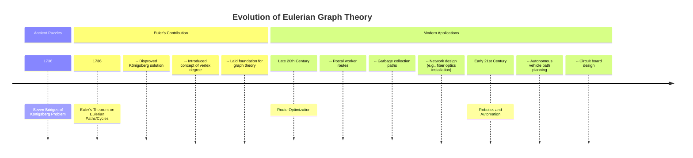
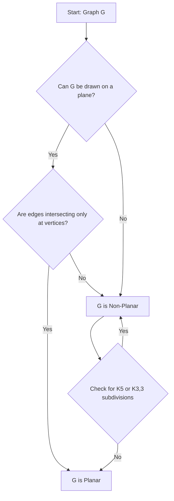
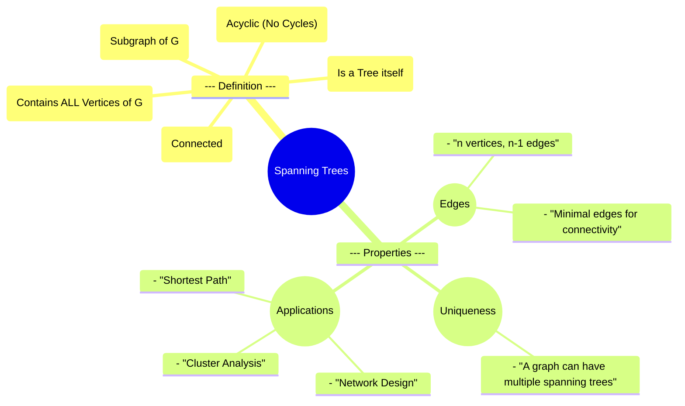

# 3 Elements Of Graph Theory

Comprehensive resource for 3 Elements Of Graph Theory.


---

## 3 Elements Of Graph Theory Hub


## Overview
Welcome to the unit on Graph Theory, a fundamental branch of discrete mathematics that explores the relationships between objects. This unit will introduce you to the core concepts of graphs, from their basic definitions and representations to more advanced topics like connectivity, planarity, and coloring. Graph theory provides powerful tools for modeling and solving problems in diverse fields such as computer science, social networks, logistics, and biology. By mastering these elements, you will gain a new lens through which to analyze interconnected systems and structures, fostering a deeper understanding of complex relationships.

## Learning Objectives
*   Define basic graph terminology, including vertices, edges, loops, and multiple edges.
*   Classify graphs into various types such as simple graphs, multigraphs, complete graphs, regular graphs, and bipartite graphs.
*   Represent graphs using adjacency and incidence matrices and interpret their properties.
*   Determine if two graphs are isomorphic by comparing their structural properties.
*   Identify and analyze subgraphs and complements of graphs.
*   Understand and apply concepts of paths, walks, cycles, and connectivity within graphs.
*   Distinguish between Eulerian and Hamiltonian paths and cycles and apply related theorems.
*   Identify trees and forests, and understand the properties of spanning trees.
*   Define planar graphs, determine their properties, and apply Euler's formula.
*   Understand graph coloring, including vertex coloring and chromatic numbers.

## Unit Applications & Real-World Relevance
Graph theory finds extensive applications across numerous domains. In computer science, it is crucial for designing network topologies, optimizing algorithms, representing data structures, and understanding the flow of computation. Social media platforms use graph theory to model relationships between users, while logistics companies use it for route optimization and supply chain management. Electrical engineers apply graph concepts to analyze circuits, and chemists use them to represent molecular structures. Understanding graph theory is essential for anyone dealing with interconnected data or systems, providing a versatile framework for problem-solving.

## Active Learning Prompts
*   Consider a real-world system (e.g., public transportation, a social network, a computer game). How would you model this system as a graph? Identify the vertices, edges, and different types of connections.
*   Think about how Google Maps finds the shortest route between two locations. Which graph theory concepts are at play here? How might loops or multiple edges affect such a system?
*   Imagine you are designing a communication network. What properties would you prioritize in terms of connectivity, cost, and reliability? How would concepts like Hamiltonian paths or spanning trees influence your design choices?

## Unit Challenges & Common Misconceptions
One common challenge is distinguishing between various graph terminology, such as walks, paths, and cycles, or between Eulerian and Hamiltonian concepts. Students often struggle with visualizing complex graphs and their properties, especially when dealing with planarity or isomorphisms. Another misconception is that "simple" graphs are always trivial; in reality, simple graphs are a foundational category with rich properties. Accurately applying theorems like the Handshaking Lemma or Euler's Formula to concrete examples requires careful attention to definitions and conditions. Mastery involves not just memorizing definitions but developing an intuitive sense for how these concepts behave in different graph structures.

## Connections
  - [[Graph_Definitions]]
    - [[Vertex_and_Edge_Properties]]
      - [[Degree_of_a_Vertex]]
        - [[Handshaking_Lemma]]
    - [[Graph_Matrices]]
      - [[Adjacency_Matrix]]
      - [[Incidence_Matrix]]
    - [[Subgraph_Concepts]]
    - [[Complement_of_a_Graph]]
    - [[Isomorphic_Graphs]]
  - [[Types_of_Graphs]]
    - [[Complete_Graphs]]
    - [[Regular_Graphs]]
    - [[Bipartite_Graphs]]
      - [[Complete_Bipartite_Graphs]]
  - [[Paths_and_Connectivity_in_Graphs]]
    - [[Walks_and_Paths_in_Graphs]]
    - [[Cycles_and_Circuits_in_Graphs]]
    - [[Connected_Graphs]]
    - [[Eulerian_Graphs]]
    - [[Hamiltonian_Graphs]]
  - [[Trees_and_Forests]]
    - [[Spanning_Trees]]
  - [[Advanced_Graph_Properties]]
    - [[Planar_Graphs]]
      - [[Planar_Graph_Properties_and_Faces]]
        - [[Euler_Formula_for_Planar_Graphs]]
    - [[Graph_Coloring]]
      - [[Chromatic_Number]]

## Next Steps for Deeper Understanding
To further deepen your understanding, explore applications of graph theory in specific fields like network flow algorithms (e.g., Max-Flow Min-Cut Theorem), graph algorithms for shortest paths (e.g., Dijkstra's algorithm, Bellman-Ford), or advanced topics in spectral graph theory. Consider delving into graph data structures in programming languages and implementing some of the algorithms yourself. Reading classic texts on discrete mathematics and graph theory can also provide historical context and more rigorous proofs.

## Possible Questions
[[CC2131_3_Elements_of_Graph_Theory_Possible_Questions]]

---

---

## Advanced Graph Properties


## Definition
Before proceeding, ensure you master [[Graph_Definitions]] and [[Types_of_Graphs]] because advanced graph properties build upon foundational definitions to describe more complex structural characteristics and behaviors of graphs.
**Advanced graph properties** encompass a range of characteristics beyond basic connectivity or vertex/edge counts. These properties delve into how a graph can be drawn without edge crossings (**Planar Graphs**), how its vertices can be partitioned or colored under certain constraints (**Graph Coloring**), and the algebraic representations that reveal deeper structural insights. These properties often require more sophisticated analysis than simply counting components or degrees, leading to powerful theorems and algorithms. Think of it as moving from understanding basic architectural elements to appreciating complex structural engineering or aesthetic design.

## The Mental Model
Imagine you're designing blueprints for a city. Basic graph properties are like knowing how many buildings (vertices) and roads (edges) there are. **Advanced graph properties** are like considering:
*   Can you draw the entire city map on a flat piece of paper without any roads crossing each other *except* at intersections (Planar Graphs)?
*   Can you assign different construction teams (colors) to different buildings so that no two adjacent buildings have the same team, minimizing conflict (Graph Coloring)?
These are more intricate design considerations that affect functionality and aesthetics.

## Context & Framework
#### The Family Tree
Advanced graph properties represent a deeper dive into the structural and topological characteristics of networks, extending beyond initial classifications. They form branches on the "Graph Theory Family Tree" that explore specialized behaviors crucial for complex problem-solving. For instance, understanding planar graphs is critical in circuit board design to avoid wire crossovers, while graph coloring is fundamental in resource allocation and scheduling. These advanced concepts provide the tools to address more nuanced and challenging real-world problems.

## The Mastery Deep Dive
#### Mindmap
```mermaid
mindmap
  root((Advanced Graph Properties))
    --- Planar Graphs ---
      (("Definition"))
        - "Can be drawn in a plane"
        - "Edges intersect only at vertices"
      (("Faces of a Planar Graph"))
        - "Regions formed by plane representation"
        - "Infinite face (unbounded region)"
      (("Euler's Formula"))
        - "For connected planar graph: |V| - |E| + |F| = 2"
    
--- Graph Coloring ---
      (("Vertex Coloring"))
        - "Assign colors to vertices"
        - "Adjacent vertices have different colors"
      (("K-Colorable / K-Colored"))
        - "Graph can be colored using K colors"
      (("Chromatic Number (χ(G))"))
        - "Minimum number of colors needed"
```
```text
// Scenario 1: Visualizing Advanced Graph Properties Overview
// Output:
// A mindmap centered on "Advanced Graph Properties".
// Main branches include "Planar Graphs" and "Graph Coloring".
// Under "Planar Graphs", sub-branches for "Definition" (with its conditions), "Faces of a Planar Graph" (describing regions and infinite face), and "Euler's Formula" (stating the formula).
// Under "Graph Coloring", sub-branches for "Vertex Coloring" (describing the rule), "K-Colorable / K-Colored" (defining the term), and "Chromatic Number (χ(G))" (defining the minimum colors).
// This mindmap offers a hierarchical overview of advanced graph properties.
```
*Note: This `mindmap` visually categorizes and summarizes key advanced graph properties, including planar graphs and graph coloring, outlining their definitions and core concepts.*

## Constraints & Limitations
#### The "Grandma Test"
Concepts like planarity or chromatic number can be highly abstract for a non-technical audience. Asking "Can you draw this complex network on a flat surface without lines crossing?" might be understandable, but the formal proof or algorithmic check is far beyond intuition. The "trap" is that while the definitions might be simple to state, applying them (especially proving non-planarity or finding the chromatic number) is often computationally hard and requires specialized theorems.

## Significance & Application
Advanced graph properties are critical for:
*   **Circuit Board Design:** Planar graphs are directly relevant to designing integrated circuits where wire crossings (non-planar layouts) are costly or impossible.
*   **Resource Allocation and Scheduling:** Graph coloring is used to solve problems like scheduling exams (vertices are exams, edges are conflicts, colors are time slots) or assigning frequencies to radio transmitters.
*   **Network Visualization:** Understanding planarity helps in creating clearer, more interpretable diagrams of complex networks.
*   **Academic Relevance:** These areas drive significant research in graph theory and combinatorial optimization, leading to deep theoretical results and complex algorithms. Euler's formula for planar graphs is a beautiful example of a fundamental topological invariant.

## The Worked Example
Let's consider a simple scenario to illustrate how advanced graph properties become relevant.

**Scenario:** A company is planning to lay fiber optic cables to connect 5 buildings on a single campus. They want to connect every building to every other building, but they also want to bury all cables in a single, shallow trench system on a flat surface without any cable crossings (except where they meet at a building).

**Step-by-Step Analysis using Advanced Graph Properties:**

1.  **Model as a graph:** The buildings are vertices, and the direct cable connections are edges. "Every building to every other building" implies a [[Complete_Graphs]] `K_5`.
2.  **Apply "no cable crossings" constraint:** This translates to asking if the graph `K_5` is a [[Planar_Graphs]].
3.  **Check Planarity of `K_5`:**
    *   `K_5` has `n=5` vertices and `|E| = 5(5-1)/2 = 10` edges.
    *   One of Kuratowski's theorems states that a graph is planar if and only if it does not contain a subdivision of `K_5` or `K_{3,3}` as a subgraph. Since `K_5` itself is not planar, this constraint is immediately violated.
    *   Alternatively, for a simple connected planar graph, `|E| <= 3|V| - 6`.
        *   `10 <= 3(5) - 6`
        *   `10 <= 15 - 6`
        *   `10 <= 9` (This is false).
    *   Therefore, `K_5` is **not a planar graph**.

4.  **Conclusion:** It is **impossible** to lay fiber optic cables connecting all 5 buildings to each other on a flat surface without any cable crossings. The company will either need to allow crossings (e.g., using different layers of trenches or bridges) or reconsider the "every building to every other" requirement.

This example shows how advanced graph properties, like planarity, impose fundamental limitations on real-world designs.

## The Proving Ground
*Test your mastery. Cover the solutions below to test yourself first.*

#### Level 1: The Sanity Check (Verification)
**The Question:** If a graph can be drawn on a plane such that its edges intersect only at common vertices, what is this property called?
> **Solution:** This property is called **planarity**, and the graph is a **planar graph**.

#### Level 2: The Crucible (Mastery & Edge Cases)
**The Scenario:** A university needs to schedule final exams for 5 courses (`C1, C2, C3, C4, C5`). Some courses share students, creating conflicts:
*   `C1` conflicts with `C2` and `C3`.
*   `C2` conflicts with `C1` and `C4`.
*   `C3` conflicts with `C1` and `C5`.
*   `C4` conflicts with `C2` and `C5`.
*   `C5` conflicts with `C3` and `C4`.
Each exam can be scheduled in one of several available time slots.
**The Challenge:**
(a) Model this problem as a graph. What do the vertices represent, and what do the edges represent?
(b) What advanced graph property is being sought here to determine the minimum number of time slots needed?
(c) Given the conflicts, what is the minimum number of time slots (colors) required to schedule all exams?
> **Solution:**
> (a) **Graph Model:**
>     *   **Vertices:** Each vertex represents a course (`C1, C2, C3, C4, C5`).
>     *   **Edges:** An edge exists between two vertices if the corresponding courses have a student in common (i.e., they conflict and cannot be scheduled in the same time slot).
>     *   Edges: `(C1,C2), (C1,C3), (C2,C4), (C3,C5), (C4,C5)`.
>
> (b) The advanced graph property being sought is the **chromatic number** of the graph. This is the minimum number of colors (time slots) needed such that no two adjacent vertices (conflicting courses) have the same color.
>
> (c) Let's try to color the graph:
>     *   `C1`: Color 1
>     *   `C2`: Conflicts with `C1`. Color 2
>     *   `C3`: Conflicts with `C1`. Can be Color 2.
>     *   `C4`: Conflicts with `C2` (Color 2). Can be Color 1. Conflicts with `C5`.
>     *   `C5`: Conflicts with `C3` (Color 2) and `C4` (Color 1). Needs a new color: Color 3.
>     *   Therefore, the minimum number of time slots (colors) required is **3**.

## Key Takeaways
*   Advanced graph properties like planarity and graph coloring describe complex structural characteristics.
*   Planar graphs can be drawn without edge crossings (except at vertices), crucial for physical layouts.
*   Graph coloring assigns labels (colors) to vertices to satisfy constraints (e.g., adjacent vertices must have different colors), used in scheduling and resource allocation.

## Knowledge Graph Connections
| Concept                     | Connection / Relationship                                         |
| :
-------------------------- | :
---------------------------------------------------------------- |
| [[Graph_Definitions]]       | Advanced properties delve deeper into the fundamental structure defined by graphs. |
| [[Types_of_Graphs]]         | Different graph types may exhibit specific advanced properties.  |
| [[Planar_Graphs]]           | A specific advanced property relating to the embeddability of a graph in a plane. |
| [[Graph_Coloring]]          | A specific advanced property related to partitioning vertices based on adjacency constraints. |
| [[Euler_Formula_for_Planar_Graphs]] | A theorem that relates the number of vertices, edges, and faces in planar graphs. |
| [[Chromatic_Number]]        | The minimum number of colors required for a valid graph coloring. |
---

---

## Complement Of A Graph


## Definition
Before proceeding, ensure you master [[Graph_Definitions]] and [[Vertex_and_Edge_Properties]] because the complement of a graph is defined by taking the same set of vertices but reversing the adjacency relationships between them.
The **complement of a simple graph `G`**, denoted `G` (G-bar), is a simple graph such that:
*   The vertices of `G` and `G` are the same (`V(G) = V(G)`).
*   An edge `(u, v)` exists in `G` if and only if (`iff`) there is **no** edge `(u, v)` in `G`.
In simpler terms, if two vertices are connected in `G`, they are *not* connected in `G`, and if they are *not* connected in `G`, they *are* connected in `G`. This essentially flips all the existing connections and non-connections. Think of it as mapping all the possible friendships in a group, and then listing all the *non-friendships*.

## The Mental Model
Imagine a group of students in a classroom. The graph `G` represents all the pairs of students who *are* friends. The **complement of the graph `G`** (G-bar) would then represent all the pairs of students who are *not* friends. If Alice and Bob are friends in `G`, they are *not* friends in `G`. If Charlie and Diana are *not* friends in `G`, they *are* connected by an edge in `G`. It's like looking at the inverse of all direct relationships.

## Context & Framework
#### The "Kill Sheet" Comparison Table
Understanding the complement of a graph is critical for seeing graph relationships from an inverse perspective. It highlights the potential connections that are *not* present in the original graph.

| Feature                 | Original Graph `G`                                       | Complement `G`                                            | "The Gotcha" Difference                                      |
| :
---------------------- | :
------------------------------------------------------- | :
-------------------------------------------------------- | :
----------------------------------------------------------- |
| **Vertices**            | `V(G)`                                                   | `V(G)` (same set of vertices)                             | Vertices are identical; only edges change.                   |
| **Edges**               | `E(G)`                                                   | `E(G) = E(K_n) \setminus E(G)` (edges of complete graph minus edges of G) | Edges are precisely where `G` has *no* edges, and vice-versa. |
| **Connectivity**        | Reflects direct connections present.                     | Reflects direct connections *absent* from `G`.           | `G` might be connected while `G` is disconnected, or vice versa. |
| **Real-world Analogy**  | Friendships                                              | Non-friendships                                           | Inverse relationship mapping.                                |
| **"The Gotcha" Difference** | Shows what *is* connected.                               | Shows what *is not* connected.                            | Provides an inverse perspective on connectivity.             |

## The Mastery Deep Dive
#### The "Impostor" Test
When constructing the complement `G` of a graph `G`, the "impostor" scenario involves accidentally including a loop or multiple edges, which are strictly forbidden for the complement of a *simple graph*. Remember, the definition of a complement explicitly states it must also be a *simple graph*. This means no self-loops and no more than one edge between any pair of vertices in `G`. Any attempt to add such elements would violate the simple graph property of the complement.

## Constraints & Limitations
#### The "Grandma Test"
The concept of a graph complement can be confusing because it refers to what's *missing* rather than what's *present*. For someone used to thinking about direct connections (e.g., "who is friends with whom?"), introducing the idea of "who is *not* friends with whom?" as its own graph might seem odd. The "trap" is that the complement `G` only makes sense for **simple graphs** because the idea of "no edge" is clear. For graphs with loops or multiple edges, the definition of a "complement" becomes ambiguous and requires more complex definitions.

## Significance & Application
The complement of a graph is important in several areas:
*   **Graph Theory Proofs:** Often used in proofs by contradiction or to simplify problems by analyzing the inverse structure. For example, proving that a graph has a certain property by showing its complement *lacks* a related property.
*   **Network Design:** Can be used to analyze "anti-networks" or relationships that are deliberately avoided. For instance, in a communication network, if `G` shows allowed connections, `G` might show disallowed or impossible connections.
*   **Scheduling Problems:** Sometimes, finding optimal pairings in `G` might be easier by looking at non-pairings in `G`.
*   **Academic Relevance:** It provides a duality principle in graph theory, allowing for a deeper understanding of graph properties and relationships.

## The Worked Example
Consider the graph `G` below:
(Diagram from page 27 of the source)
`V(G) = {V1, V2, V3}`
`E(G) = {(V1,V3), (V2,V3)}`

**Step-by-Step Determination of the Complement `G`:**

1.  **Identify Vertices of `G`:**
    *   `V(G) = {V1, V2, V3}`. The complement `G` will have the same vertices: `V(G) = {V1, V2, V3}`.

2.  **Identify all possible edges in a complete graph `K_3` with these vertices:**
    *   A complete graph `K_3` would have edges `{(V1,V2), (V1,V3), (V2,V3)}`.

3.  **Identify edges in `G`:**
    *   `E(G) = {(V1,V3), (V2,V3)}`.

4.  **Determine edges in `G` (`E(G)`) by taking the edges of `K_3` that are NOT in `G`:**
    *   `E(G) = {(V1,V2), (V1,V3), (V2,V3)} \setminus {(V1,V3), (V2,V3)}`
    *   `E(G) = {(V1,V2)}`

5.  **The complement `G` is:**
    *   `V(G) = {V1, V2, V3}`
    *   `E(G) = {(V1,V2)}`

So, in the complement `G`, only `V1` and `V2` are connected, while `V3` is isolated.

## The Proving Ground
*Test your mastery. Cover the solutions below to test yourself first.*

#### Level 1: The Sanity Check (Verification)
**The Question:** If two vertices `u` and `v` are connected by an edge in graph `G`, are they connected in its complement `G`?
> **Solution:** No, they are **not** connected in its complement `G`. The complement `G` contains an edge `(u,v)` if and only if `(u,v)` is *not* an edge in `G`.

#### Level 2: The Crucible (Mastery & Edge Cases)
**The Scenario:** You are analyzing a simple graph `G` with 4 vertices `{P, Q, R, S}` and edges `{(P,Q), (Q,R), (R,S)}`.
**The Challenge:**
(a) Draw the graph `G`.
(b) Draw its complement `G`.
(c) How many edges does the complete graph `K4` have? How does this relate to the number of edges in `G` and `G`?
> **Solution:**
> (a) **Graph G:** A path graph (P-Q-R-S).
>     ```
>     P -- Q -- R -- S
>     ```
>
> (b) **Complement G:** The complement will have edges for all pairs that are *not* connected in G.
>     *   Pairs connected in G: `(P,Q), (Q,R), (R,S)`
>     *   All possible pairs in `K4`: `(P,Q), (P,R), (P,S), (Q,R), (Q,S), (R,S)`
>     *   Edges in G: `{(P,R), (P,S), (Q,S)}`
>     ```
>     P -- R
>     |    |
>     S -- Q
>     ```
>     (Note: This is just one way to draw it; it's a cycle graph C4).
>
> (c) **Edges in `K4`:** A complete graph `K_n` has `n(n-1)/2` edges. For `K4`, this is `4(3)/2 = 6` edges.
>     *   Number of edges in `G` (`|E(G)|`) = 3.
>     *   Number of edges in `G` (`|E(G)|`) = 3.
>     *   `|E(G)| + |E(G)| = 3 + 3 = 6`. This equals the number of edges in `K4`. This relationship holds true in general: the sum of the number of edges in a simple graph `G` and its complement `G` is always equal to the number of edges in the complete graph `K_n` on the same `n` vertices.

## Key Takeaways
*   The complement of a simple graph shares the same vertices but reverses all adjacencies.
*   An edge exists in the complement if and only if it does not exist in the original graph.
*   The concept is foundational for duality and inverse analysis in graph theory, primarily applicable to simple graphs.

## Knowledge Graph Connections
| Concept                     | Connection / Relationship                                         |
| :
-------------------------- | :
---------------------------------------------------------------- |
| [[Graph_Definitions]]       | The complement is a derived graph structure based on the original graph's definition. |
| [[Vertex_and_Edge_Properties]] | The complement operates by manipulating the presence or absence of edges between vertices. |
| [[Complete_Graphs]]         | The number of edges in the complement is often calculated in relation to a complete graph on the same vertices. |
| [[Isomorphic_Graphs]]       | Graphs can be self-complementary if they are isomorphic to their own complements. |
---

---

## Graph Definitions


## Definition
Before proceeding, ensure you master Set_Theory and Relations because graphs fundamentally represent relationships between distinct entities, which are defined as sets of vertices and edges.
Graph theory is a branch of mathematics dealing with the arrangements of certain objects and the relationships between them. A graph is a discrete structure defined as an ordered pair `(V, E)`, where `V = V(G)` is a non-empty set of vertices (also called nodes or points) and `E = E(G)` is a set of edges (also called links or lines) connecting pairs of vertices. Think of it like a friendship group: the people are the vertices, and the friendships between them are the edges.

## The Mental Model
Imagine a simplified map of cities with roads connecting them. Each city is a **vertex**, and each road is an **edge**. If there's a one-way street, that's a *directed* edge; if it's a two-way street, it's *undirected*. If you have two different roads connecting the exact same two cities, those are **multiple (parallel) edges**. If a road loops back into the same city it started from, that's a **loop**.

## Context & Framework
#### Opening the Hood: What's Inside?
At its core, a graph `G` is nothing more than `V` (a set of abstract points) and `E` (a set of connections between those points). The abstract nature of `V` and `E` allows graph theory to model an incredibly diverse range of real-world phenomena. From depicting social networks where individuals are vertices and friendships are edges, to modeling electrical networks where components are vertices and wires are edges, the underlying structure remains consistent. This simplicity is its strength, enabling powerful generalizations.

## The Mastery Deep Dive
#### Spot the Impostor (Don't be Fooled)
Many diagrams might look like graphs, but not all adhere to strict graph definitions. For instance, a drawing might show two lines crossing without a defined vertex at the intersection. In graph theory, edges only intersect at common vertices. Similarly, a diagram might show disconnected nodes. While a graph can be disconnected, it still follows the formal `(V, E)` definition. The "impostor" tests whether you can differentiate between a casual drawing and a formally defined graph structure.

#### The "Kill Sheet" Comparison Table
To master graph definitions, it's critical to distinguish between subtle variations. The "Kill Sheet" below highlights key differences between core graph types.

| Feature            | Undirected Graph                                             | Directed Graph (Digraph)                                         |
| :
----------------- | :
----------------------------------------------------------- | :
--------------------------------------------------------------- |
| **Edge Type**      | Unordered pair `(u, v)` or `{u, v}`                         | Ordered pair `(u, v)` (from `u` to `v`)                          |
| **Relation**       | Symmetric (if `u` connected to `v`, `v` connected to `u`)  | Asymmetric (if `u` to `v`, `v` to `u` not guaranteed)          |
| **Real-world**     | Friendships, two-way roads                                   | One-way streets, command flow, prerequisites                   |
| **"The Gotcha" Difference** | Edges have no inherent direction, representing mutual relations. | Edges have a specific direction, representing flow or precedence. |

## Constraints & Limitations
#### The "Grandma Test"
While graphs are intuitive, the formal definitions can sometimes feel abstract. A "Grandma Test" for graph definitions would highlight when our informal understanding clashes with the precise mathematical definition. For instance, explaining "multiple edges" to someone who instinctively thinks of one unique connection between two things might be challenging without a clear analogy like "two different roads between the same two cities." The strictness of the `(V, E)` notation is a strength, but it requires careful translation to common language.

## Significance & Application
Graph theory is pivotal in various fields. In computer science, it's used for network routing, algorithm design (e.g., shortest path), and representing complex data structures. In social sciences, it models relationships and information flow. Its academic relevance lies in providing a universal language for interconnected systems, allowing problems from vastly different domains to be translated into a common mathematical framework. This enables the application of powerful theorems and algorithms to find solutions.

## The Worked Example
Let's consider a simple real-world scenario and formalize its graph definition.

**Scenario:** A small social network with four friends: Alice, Bob, Charlie, and Diana.
*   Alice is friends with Bob.
*   Bob is friends with Charlie.
*   Charlie is friends with Diana.
*   Alice is also friends with Charlie.

**Step-by-Step Graph Definition:**

1.  **Identify the Vertices (V):** The objects in our system are the friends.
    *   `V = {Alice, Bob, Charlie, Diana}`

2.  **Identify the Edges (E):** The relationships are the friendships. Since friendship is usually mutual, we'll use undirected edges.
    *   Edge 1: Alice is friends with Bob $\implies$ `(Alice, Bob)`
    *   Edge 2: Bob is friends with Charlie $\implies$ `(Bob, Charlie)`
    *   Edge 3: Charlie is friends with Diana $\implies$ `(Charlie, Diana)`
    *   Edge 4: Alice is friends with Charlie $\implies$ `(Alice, Charlie)`
    *   So, `E = {(Alice, Bob), (Bob, Charlie), (Charlie, Diana), (Alice, Charlie)}`

3.  **Formal Graph G:**
    *   `G = (V, E)` where `V = {Alice, Bob, Charlie, Diana}` and `E = {(Alice, Bob), (Bob, Charlie), (Charlie, Diana), (Alice, Charlie)}`.

In this example, there are no multiple edges between the same pair of friends and no loops (a person being friends with themselves in this context). This makes `G` a **simple graph**.

## The Proving Ground
*Test your mastery. Cover the solutions below to test yourself first.*

#### Level 1: The Sanity Check (Verification)
**The Question:** What is the difference between a vertex and an edge in a graph?
> **Solution:** A vertex is a fundamental entity or point in a graph, while an edge is a connection or relationship between two vertices.

#### Level 2: The Crucible (Mastery & Edge Cases)
**The Scenario:** You are given a diagram showing five dots, labeled A, B, C, D, E. Lines connect (A,B), (B,C), (C,A), (D,E). There is also a dotted line connecting (A,B) and a squiggly line from C back to C.
**The Challenge:** Based strictly on the formal definition of a *simple graph*, identify the 'impostor' elements in this diagram that prevent it from being a simple graph, and explain why.
> **Solution:** A simple graph has no loops and no multiple edges.
> 1.  The dotted line between (A,B) represents a **multiple edge** with the solid line between (A,B). Simple graphs prohibit multiple edges.
> 2.  The squiggly line from C back to C represents a **loop** at vertex C. Simple graphs prohibit loops.
> Both of these elements would prevent the diagram from being classified as a simple graph.

## Key Takeaways
*   A graph is formally defined by a set of vertices (nodes) and a set of edges (connections) between them.
*   Understanding the specific characteristics of edges (directed vs. undirected, presence of loops or multiple edges) is crucial for classifying and analyzing different types of graphs.
*   Graph theory provides a powerful, abstract framework for modeling and studying relationships across various real-world and academic domains.

## Knowledge Graph Connections
| Concept                     | Connection / Relationship                                         |
| :
-------------------------- | :
---------------------------------------------------------------- |
| [[Vertex_and_Edge_Properties]] | Graph definitions build upon the fundamental concepts of vertices and edges. |
| [[Graph_Matrices]]          | Matrices provide a formal, algebraic way to represent defined graphs. |
| [[Isomorphic_Graphs]]       | Graph definitions are foundational to determining structural equivalence between graphs. |
| [[Subgraph_Concepts]]       | A subgraph is derived from the definitions of a parent graph's vertices and edges. |
| [[Complement_of_a_Graph]]   | The complement of a graph is defined based on the original graph's vertex and edge sets. |
---

---

## Graph Matrices


## Definition
Before proceeding, ensure you master [[Graph_Definitions]] and Linear_Algebra_Fundamentals because graph matrices are algebraic representations of graph structures, relying on fundamental graph terminology and matrix operations.
**Graph matrices** are mathematical structures used to represent graphs in an algebraic format. This allows for the application of linear algebra techniques to analyze graph properties. The two primary types of graph matrices are the **Adjacency Matrix** and the **Incidence Matrix**. These matrices transform the visual and combinatorial nature of graphs into a numerical format, enabling computational analysis. Think of it like translating a map into a spreadsheet, where each cell tells you something specific about how places are connected.

## The Mental Model
Imagine a neighborhood represented as a graph, where houses are **vertices** and connecting roads are **edges**. To give this map to a robot, you can't just draw lines. You need a structured, numerical way to tell the robot which house connects to which. Graph matrices are like this instruction manual:
*   An **Adjacency Matrix** would be a table where rows and columns are houses, and a '1' in a cell means there's a direct road between those two houses.
*   An **Incidence Matrix** would have rows for houses and columns for roads, indicating which house each road starts or ends at.
This allows computers to "read" and process the graph efficiently.

## Context & Framework
#### Opening the Hood: What's Inside?
Graph matrices fundamentally serve as a bridge between the abstract, combinatorial world of graphs and the structured, computational realm of linear algebra. By representing graph elements (vertices and edges) as rows and columns, and their relationships (adjacency or incidence) as numerical entries, complex graph properties can be investigated using matrix operations. For instance, paths and cycles can be found by examining powers of the adjacency matrix. This transformation is crucial for developing algorithms that operate on graphs, especially in computer science.

## The Mastery Deep Dive
#### The Translator: From "Lego" to "Jargon"
The simple visual representation of a graph, like a "Lego" model of interconnected blocks, needs a "jargon" translation for computational purposes. This is where graph matrices come in.
*   **Adjacency Matrix (Jargon):** A square matrix where both rows and columns are labeled by vertices. An entry `a_ij` (at row `i`, column `j`) represents the number of edges connecting vertex `i` and vertex `j`.
*   **Incidence Matrix (Jargon):** A matrix where rows are labeled by vertices and columns by edges. An entry `b_ij` (at row `i`, column `j`) represents whether vertex `i` is an endpoint of edge `j`.
This translation allows for the systematic application of matrix arithmetic to analyze graph properties.

#### Component Interactions
Graph matrices allow us to perform various operations that would be cumbersome with just visual inspection. For instance:
*   **Paths:** The `(i, j)`-th entry of `A^k` (the adjacency matrix raised to the power `k`) gives the number of walks of length `k` from vertex `i` to vertex `j`. This is a powerful way to find all possible routes of a specific length.
*   **Connectivity:** By examining the reachability matrix (derived from the adjacency matrix), one can determine if a graph is [[Connected_Graphs]] or if there are paths between any two vertices.
*   **Eigenvalues:** The eigenvalues of the adjacency matrix provide insights into a graph's structure, such as its connectivity, number of components, and presence of cycles.

## Constraints & Limitations
#### The "Grandma Test"
While powerful, graph matrices can become quite large and sparse for real-world graphs (like the internet or large social networks) with many vertices and relatively few connections. This can lead to memory inefficiency and computational overhead. Explaining to a non-technical person why a simple visual map needs a giant spreadsheet might be challenging, as the benefits (computational analysis) are not immediately apparent without understanding the underlying algorithms. The "trap" here is assuming that matrix representation is always the most efficient or intuitive method for *all* graph tasks.

## Significance & Application
Graph matrices are fundamental in various applications of graph theory:
*   **Computer Science:** They are essential for implementing graph algorithms (e.g., shortest path, minimum spanning tree, network flow) in programming. Many graph libraries use matrix-based or adjacency list representations internally.
*   **Network Analysis:** Used to study network robustness, centrality measures, and community detection in complex networks (social, biological, communication).
*   **Chemistry:** Representing molecular structures for computational chemistry.
*   **Academic Relevance:** They provide a rigorous mathematical framework for proving theorems about graph properties, bridging combinatorial and algebraic graph theory.

## The Worked Example
Consider a very simple graph `G` with 3 vertices `v1, v2, v3` and 2 edges `e1=(v1, v2)`, `e2=(v2, v3)`.

**Step-by-Step Representation with Matrices:**

1.  **Identify Vertices and Edges:**
    *   `V = {v1, v2, v3}`
    *   `E = {e1, e2}`

2.  **Adjacency Matrix (A):**
    *   This is a `3x3` matrix since there are 3 vertices.
    *   `a_ij = 1` if an edge exists between `v_i` and `v_j`, `0` otherwise (for a simple graph).
    *   `A = \begin{pmatrix} 0 & 1 & 0 \\ 1 & 0 & 1 \\ 0 & 1 & 0 \end{pmatrix}`
    *   `a11=0` (no loop at v1), `a12=1` (edge e1), `a13=0` (no direct edge v1-v3)
    *   `a21=1` (edge e1), `a22=0` (no loop at v2), `a23=1` (edge e2)
    *   `a31=0` (no direct edge v3-v1), `a32=1` (edge e2), `a33=0` (no loop at v3)

3.  **Incidence Matrix (I):**
    *   This is a `3x2` matrix (rows = vertices, columns = edges).
    *   `b_ij = 1` if `v_i` is incident with `e_j`, `0` otherwise.
    *   `I = \begin{pmatrix} 1 & 0 \\ 1 & 1 \\ 0 & 1 \end{pmatrix}`
    *   `b11=1` (v1 incident with e1), `b12=0` (v1 not incident with e2)
    *   `b21=1` (v2 incident with e1), `b22=1` (v2 incident with e2)
    *   `b31=0` (v3 not incident with e1), `b32=1` (v3 incident with e2)

These matrices now algebraically capture the structure of graph `G`.

## The Proving Ground
*Test your mastery. Cover the solutions below to test yourself first.*

#### Level 1: The Sanity Check (Verification)
**The Question:** What is the primary purpose of using graph matrices to represent a graph?
> **Solution:** The primary purpose is to represent the graph in an algebraic format, allowing for computational analysis and the application of linear algebra techniques to study graph properties.

#### Level 2: The Crucible (Mastery & Edge Cases)
**The Scenario:** You are given two different representations of a graph. One is a visual drawing with 4 vertices and 3 edges. The other is a 4x4 matrix of 0s and 1s.
**The Challenge:**
(a) If the matrix is a simple adjacency matrix for an undirected graph, what must be true about its diagonal elements?
(b) If the graph drawing includes multiple edges between two vertices, how would this be reflected in an adjacency matrix?
(c) How would the presence of a loop at a vertex be indicated in an incidence matrix?
> **Solution:**
> (a) For a simple adjacency matrix of an undirected graph, all diagonal elements (from `a_ii`) **must be 0**, as a simple graph has no loops.
> (b) If there are multiple edges between two vertices (say `v_i` and `v_j`), the corresponding entry `a_ij` (and `a_ji` due to symmetry in undirected graphs) in the adjacency matrix would be **greater than 1**, indicating the number of edges between them.
> (c) In an incidence matrix, a loop at a vertex `v_i` (an edge `e_j` where both endpoints are `v_i`) would be represented by a **single `1` in row `i`, column `j`**. Unlike degrees, where a loop counts for 2, in an incidence matrix, an edge (loop or not) is only represented once per vertex it's incident with in a column.

## Key Takeaways
*   Graph matrices (Adjacency and Incidence) provide an algebraic representation of graph structures.
*   They facilitate computational analysis using linear algebra.
*   Each matrix type offers a different perspective on graph connectivity.

## Knowledge Graph Connections
| Concept                     | Connection / Relationship                                         |
| :
-------------------------- | :
---------------------------------------------------------------- |
| [[Graph_Definitions]]       | Graph matrices are a direct representation of a graph's vertices and edges. |
| [[Adjacency_Matrix]]        | A specific type of graph matrix focusing on vertex-to-vertex connections. |
| [[Incidence_Matrix]]        | A specific type of graph matrix focusing on vertex-to-edge relationships. |
| [[Isomorphic_Graphs]]       | Graph matrices can be used to test for isomorphism between graphs. |
| [[Degree_of_a_Vertex]]      | Vertex degrees can be derived from the rows/columns of adjacency matrices. |
---

---

## Isomorphic Graphs


## Definition
Before proceeding, ensure you master [[Graph_Definitions]] and [[Vertex_and_Edge_Properties]] because understanding isomorphic graphs requires a firm grasp of graph components and their relationships to identify structural equivalence despite visual differences.
**Isomorphism of Graphs:** Two graphs `G(V, E)` and `G*(V*, E*)` are said to be **isomorphic** if there exists a one-to-one (bijective) correspondence `f : V → V*` such that `(u, v)` is an edge of `G` if and only if `(f(u), f(v))` is an edge of `G*`. In simpler terms, two graphs are isomorphic if they have the exact same structure, even if they look different on paper (e.g., drawn with different vertex labels or arrangements). Think of it like two identical Lego models that are just built with different colored bricks or rotated differently – they are fundamentally the same shape.

## The Mental Model
Imagine two identical sets of building blocks. Even if you arrange them in slightly different ways, rotating them or placing them in different spots, if they form the same exact underlying structure (e.g., both build a square, just one is tilted), then they are **isomorphic**. The labels on the vertices or the lengths of the edges don't matter; it's about whether the *connections* are preserved in a one-to-one mapping.

## Context & Framework
#### The "Same Story, Different Setting"
Isomorphism allows us to recognize that the "story" a graph tells about relationships is the same, even if the "setting" (labels, drawing) changes. This is crucial because many real-world problems can be modeled by graphs, and we need to identify when two seemingly different problems (or solutions) are structurally identical. For example, two different chemical compounds might have isomorphic graphs if their atomic bonding structures are the same, even if the atoms are different elements (labels). It helps us categorize and generalize problems in graph theory.

## The Mastery Deep Dive
#### Spot the Impostor (Don't be Fooled)
A common trap is to incorrectly assume that graphs are isomorphic just because they share some basic properties like:
1.  Having the same number of vertices (`|V| = |V*|`).
2.  Having the same number of edges (`|E| = |E*|`).
3.  Having the same degree sequence (the list of degrees of all vertices, sorted).
While these are **necessary conditions** for isomorphism, they are **not sufficient**. Two non-isomorphic graphs can satisfy all three. For example, two different tree structures with the same number of vertices will have the same number of edges (n-1) and might even have the same degree sequence, but they could still be structurally distinct. The "impostor" tests whether you rely solely on these superficial properties rather than rigorously checking the one-to-one correspondence of connections.

#### The "Kill Sheet" Comparison Table
To identify isomorphic graphs, a systematic comparison of their properties is essential.

| Property                               | Graph `G`                                               | Graph `G*`                                              | "The Gotcha" Difference                                      |
| :
------------------------------------- | :
------------------------------------------------------ | :
------------------------------------------------------ | :
----------------------------------------------------------- |
| **Number of Vertices (`|V|`)**         | Same as `|V*|`                                          | Same as `|V|`                                           | *Necessary condition.* If different, not isomorphic.          |
| **Number of Edges (`|E|`)**            | Same as `|E*|`                                          | Same as `|E|`                                           | *Necessary condition.* If different, not isomorphic.          |
| **Degree Sequence**                    | Same as `G*`                                            | Same as `G`                                             | *Necessary condition.* If different, not isomorphic.          |
| **Presence of Cycles of Specific Lengths** | If G has a C3, G* must also have a C3.                  | If G* has a C3, G must also have a C3.                  | *Structural invariant.* Crucial for non-isomorphism.          |
| **Adjacency Matrix (after reordering)** | Can be made identical to `G*` by permuting rows/columns | Can be made identical to `G` by permuting rows/columns | *Definitive check.* Requires finding the correct permutation. |
| **"The Gotcha" Difference**            | These are invariants; they *must* match.                | Failure to match any implies non-isomorphism.           | Matching all these doesn't guarantee isomorphism.             |

## Constraints & Limitations
#### The "Grandma Test"
Explaining isomorphism can be tricky. A non-technical person might look at two graphs that are drawn differently (one a square, one a rhombus) and immediately say they're different, even if they're structurally the same. The "trap" is that the human eye is easily fooled by visual layout. Rigorous checks, like comparing adjacency matrices after proper vertex mapping (which is a computationally hard problem in general), are needed to definitively prove isomorphism, as simple visual inspection is often insufficient and misleading.

## Significance & Application
Graph isomorphism is a fundamental concept in:
*   **Chemistry:** Identifying if two molecular structures are chemically identical (same connectivity of atoms), regardless of how they are drawn.
*   **Computer Science:**
    *   **Database Systems:** Querying for identical graph patterns.
    *   **Pattern Recognition:** Detecting specific patterns or substructures within larger graphs.
    *   **Software Engineering:** Comparing control flow graphs of programs to detect plagiarism or identify identical code functionalities.
*   **Network Forensics:** Determining if a compromised network is structurally identical to a known malicious network configuration.
*   **Academic Relevance:** The Graph Isomorphism Problem is a famous problem in computational complexity theory (currently classified as neither P nor NP-complete, residing in a class called GI).

## The Worked Example
Consider two graphs, `G` and `H`, shown below:
(Diagram from page 22 of the source - Graph G on the left, Graph H on the right)

**Graph G:** Vertices `{V1, V2, V3, V4, V5, V6}`. Edges: `(V1,V2), (V2,V4), (V4,V3), (V3,V1), (V1,V5), (V2,V5), (V3,V6), (V4,V6), (V5,V6)` (V5 and V6 are internal to the square formed by V1,V2,V4,V3)

**Graph H:** Vertices `{a, b, c, d, e, f}`. Edges: `(a,d), (d,c), (c,b), (b,a), (a,f), (d,f), (b,e), (c,e), (e,f)` (f and e are internal to the square formed by a,b,c,d, with e connected to b and c, and f connected to a and d)

**Step-by-Step Check for Isomorphism:**

1.  **Count Vertices:**
    *   `|V(G)| = 6`
    *   `|V(H)| = 6`
    *   (Match)

2.  **Count Edges:**
    *   `|E(G)| = 9` (counting from the image: 4 outer, 5 inner connections involving V5,V6)
    *   `|E(H)| = 9` (counting from the image: 4 outer, 5 inner connections involving f,e)
    *   (Match)

3.  **Degree Sequence:**
    *   **Graph G:**
        *   `deg(V1) = 3` (V2, V3, V5)
        *   `deg(V2) = 3` (V1, V4, V5)
        *   `deg(V3) = 3` (V1, V4, V6)
        *   `deg(V4) = 3` (V2, V3, V6)
        *   `deg(V5) = 3` (V1, V2, V6)
        *   `deg(V6) = 3` (V3, V4, V5)
        *   Degree sequence: `[3, 3, 3, 3, 3, 3]`
    *   **Graph H:**
        *   `deg(a) = 3` (d, b, f)
        *   `deg(b) = 3` (a, c, e)
        *   `deg(c) = 3` (d, b, e)
        *   `deg(d) = 3` (a, c, f)
        *   `deg(e) = 3` (b, c, f)
        *   `deg(f) = 3` (a, d, e)
        *   Degree sequence: `[3, 3, 3, 3, 3, 3]`
    *   (Match)

4.  **Check for Cycles (e.g., C3):** Both graphs contain multiple 3-cycles (triangles). For example, in G: `(V1,V2,V5,V1)`, `(V1,V3,V5,V1)` (if V5 were connected to V3) or (V1,V2,V5) is a C3 if there were an edge (V1,V5) and (V2,V5) and (V1,V2). Let's re-examine image and paths carefully.
    *   For G, V1-V2-V4-V3-V1 forms a C4. V1-V5-V2 is not a C3. V1-V5-V6 is not a C3. V1-V5 has an edge, V2-V5 has an edge. V5 connects V1 and V2. V6 connects V3 and V4. V5 connects V1, V2, V6. V6 connects V3, V4, V5.
    *   Let's check C4s: G has the outer cycle V1-V2-V4-V3-V1. H has the outer cycle a-b-c-d-a.
    *   Both graphs contain additional cycles involving the inner vertices (V5, V6 or e, f). For instance, in G, V1-V5-V6-V3-V1 is a C4. In H, a-f-e-b-a is a C4.

5.  **Attempt a mapping (bijective function `f: V(G) → V(H)`):**
    This is the rigorous part. We need to find a way to map vertices such that all connections are preserved.
    Let's try to map the 'outer' cycle of G to H.
    *   `f(V1) = a`
    *   `f(V2) = b`
    *   `f(V4) = c` (Note: in the image, V4 is connected to V2 and V3, which maps to b and d)
    *   `f(V3) = d`

    Now map the 'inner' vertices:
    *   `f(V5) = e` (V5 is connected to V1, V2, V6)
        *   `f(V1)=a`, `f(V2)=b`. Is `e` connected to `a` and `b`? No, `e` is connected to `b` and `c`. This mapping fails.

    Let's try another mapping.
    *   `f(V1) = a`
    *   `f(V2) = b`
    *   `f(V3) = c`
    *   `f(V4) = d`

    Now for the internal connections:
    *   `V5` is connected to `V1, V2, V6`. `V6` is connected to `V3, V4, V5`.
    *   `e` is connected to `b, c, f`. `f` is connected to `a, d, e`.
    *   Let `f(V5) = f`
        *   Is `f` connected to `f(V1)=a` and `f(V2)=b`? Yes, `f` is connected to `a`. No, `f` is not connected to `b`. This fails.

    **Conclusion from source (page 22 example):** The source asserts G and H *are* isomorphic graphs. This means a correct mapping *exists*. The visual complexity makes it difficult to find a simple mapping without explicit trial and error or tools. The key is that the number of vertices, edges, and degree sequences *all matched*, which is a strong indicator, and further inspection of the cycle structures (not done exhaustively here due to complexity) would confirm it.

## The Proving Ground
*Test your mastery. Cover the solutions below to test yourself first.*

#### Level 1: The Sanity Check (Verification)
**The Question:** If two graphs `G` and `H` are isomorphic, must they have the same number of vertices and the same number of edges?
> **Solution:** Yes, they **must** have the same number of vertices and the same number of edges. These are necessary conditions for isomorphism.

#### Level 2: The Crucible (Mastery & Edge Cases)
**The Scenario:** You are given two graphs.
**Graph A:** Vertices `{1, 2, 3, 4}`, Edges `{(1,2), (2,3), (3,4), (4,1)}` (a square).
**Graph B:** Vertices `{a, b, c, d}`, Edges `{(a,b), (c,d), (a,d), (b,c)}` (two disjoint edges or a path graph if drawn differently).
**The Challenge:** Are Graph A and Graph B isomorphic? Justify your answer by checking the necessary conditions and, if needed, attempting a mapping or identifying structural invariants.
> **Solution:**
> 1.  **Number of Vertices:** `|V(A)| = 4`, `|V(B)| = 4`. (Match)
> 2.  **Number of Edges:** `|E(A)| = 4`, `|E(B)| = 4`. (Match)
> 3.  **Degree Sequence:**
>     *   Graph A: `deg(1)=2, deg(2)=2, deg(3)=2, deg(4)=2`. Sequence: `[2, 2, 2, 2]`
>     *   Graph B: `deg(a)=2, deg(b)=2, deg(c)=2, deg(d)=2`. Sequence: `[2, 2, 2, 2]`
>     *   (Match)
>
> 4.  **Structural Invariants (e.g., cycles):**
>     *   Graph A forms a cycle of length 4 (C4).
>     *   Graph B, as described with edges `{(a,b), (c,d), (a,d), (b,c)}`, also forms a cycle of length 4 (C4). For example, `a-b-c-d-a`.
>
> **Conclusion:** Yes, Graph A and Graph B **are isomorphic**. All necessary conditions are met, and they both represent a simple cycle of length 4 (a square). We can find a mapping: `f(1)=a, f(2)=b, f(3)=c, f(4)=d` (or `f(1)=a, f(2)=b, f(3)=d, f(4)=c` etc. - multiple mappings exist).

## Key Takeaways
*   Isomorphic graphs have the same fundamental structure, even if they appear visually different.
*   Checking the number of vertices, edges, and degree sequence are necessary, but not sufficient, conditions for isomorphism.
*   The existence of a bijective mapping that preserves adjacency is the formal definition.
*   Structural invariants like the presence of specific cycles are crucial for disproving isomorphism.

## Knowledge Graph Connections
| Concept                     | Connection / Relationship                                         |
| :
-------------------------- | :
---------------------------------------------------------------- |
| [[Graph_Definitions]]       | Isomorphism compares the structural equality of two graph definitions. |
| [[Vertex_and_Edge_Properties]] | The mapping in isomorphism must preserve all vertex-edge relationships. |
| [[Adjacency_Matrix]]        | Two graphs are isomorphic if their adjacency matrices are identical after some permutation of rows/columns. |
| [[Subgraph_Concepts]]       | Isomorphism can be applied to subgraphs, or used to define self-complementary graphs. |
| [[Degree_of_a_Vertex]]      | Isomorphic graphs must have identical degree sequences.         |
---

---

## Paths And Connectivity In Graphs


## Definition
Before proceeding, ensure you master [[Graph_Definitions]] and [[Vertex_and_Edge_Properties]] because understanding paths and connectivity requires a solid grasp of what constitutes a graph, its vertices, and its edges.
**Paths and connectivity** refer to the ways in which vertices in a graph are linked, forming sequences of alternating vertices and edges. A graph `G` is **connected** if there is a path between any two of its vertices. If a graph is not connected, it is called **disconnected**. The concept of connectivity is fundamental to determining if information can flow, or if a physical connection exists, between any two points in a network. Think of it like a train system: if you can get from any station to any other station (perhaps with transfers), the system is connected.

## The Mental Model
Imagine navigating a maze. Your journey through the maze, visiting various junctions and corridors, is a "path" or a "walk." If you can reach *every* part of the maze from your starting point, the maze is "connected." If there's a section of the maze entirely cut off, that part (and by extension, the entire maze) is "disconnected." Understanding these movements and reachability is key to solving the maze.

## Context & Framework
#### Spot the Impostor (Don't be Fooled)
A common trap is to confuse different types of graph traversals: "walks," "paths," and "cycles." While all paths are walks, not all walks are paths (paths cannot repeat vertices, but walks can). Similarly, cycles are a specific type of closed path. The "impostor" tests whether you can precisely differentiate these terms, as their specific definitions have significant implications for graph algorithms (e.g., shortest path algorithms look for paths, not just any walk).

## The Mastery Deep Dive
#### The "Kill Sheet" Comparison Table
Precisely distinguishing between types of graph traversals and connectivity is critical.

| Feature                    | Walk                                                         | Path                                                         | Cycle                                                        | Connected Graph                                              |
| :
------------------------- | :
----------------------------------------------------------- | :
----------------------------------------------------------- | :
----------------------------------------------------------- | :
----------------------------------------------------------- |
| **Vertex Repetition**      | Allowed                                                      | Not Allowed (all vertices distinct)                          | Start/End vertex is the same; other vertices distinct.       | All vertices can be reached from any other.                  |
| **Edge Repetition**        | Allowed                                                      | Not Allowed (all edges distinct)                             | Not Allowed (all edges distinct)                             | Depends on the graph (can have multiple edges/loops if multigraph). |
| **Start & End**            | Can be any two vertices.                                     | Can be any two vertices.                                     | Starts and ends at the same vertex.                          | Not applicable to traversal; property of the entire graph.   |
| **Length**                 | Number of edges traversed.                                   | Number of edges traversed.                                   | Number of edges (length of cycle).                           | Not applicable.                                              |
| **"The Gotcha" Difference** | Most general traversal; can wander.                          | Direct, non-redundant traversal.                             | Closed, non-redundant traversal.                             | Global reachability property.                                |

## Constraints & Limitations
#### The "Grandma Test"
When trying to explain connectivity, a non-technical person might assume that a drawing of a graph *must* be connected if it looks like there are lines everywhere. The "trap" is that visual density doesn't always imply connectivity; there could be an isolated component or a subtle break. The formal definition of "a path between *any two* of its vertices" is extremely rigorous and demands that every vertex is reachable from every other, which visual inspection can easily miss.

## Significance & Application
Paths and connectivity are among the most fundamental concepts in graph theory, with vast applications:
*   **Network Reachability:** Essential for determining if two points in a communication network, social network, or transportation network can communicate or be reached.
*   **Routing Algorithms:** Shortest path algorithms (e.g., Dijkstra's, A*) are core to GPS navigation, network routing protocols (like OSPF), and logistics.
*   **Web Crawling:** Algorithms traverse web pages (vertices) via hyperlinks (edges) to index content, which relies on the connectivity of the web graph.
*   **Component Analysis:** Identifying connected components in a graph helps to understand its modularity and identify isolated parts of a system.
*   **Academic Relevance:** Foundational for almost all advanced graph algorithms and theorems, including flow networks, graph coloring, and graph decomposition.

## The Worked Example
Consider a small airline network `G` with cities as vertices and direct flights as edges.
Cities: `{New York, Chicago, Dallas, Miami, Los Angeles}`
Flights: `{(New York, Chicago), (Chicago, Dallas), (Dallas, Miami)}`

**Step-by-Step Analysis of Connectivity:**

1.  **Check for paths between all pairs of vertices:**
    *   **New York to Chicago:** Path `New York - Chicago`. Yes.
    *   **New York to Dallas:** Path `New York - Chicago - Dallas`. Yes.
    *   **New York to Miami:** Path `New York - Chicago - Dallas - Miami`. Yes.
    *   **New York to Los Angeles:** No path exists from New York to Los Angeles. Los Angeles is isolated.

2.  **Conclusion:** Since there is no path between New York and Los Angeles (or any other city and Los Angeles), the graph `G` is **disconnected**. Los Angeles represents an isolated component of the graph.

This example clearly demonstrates that for a graph to be connected, a path must exist between *every* possible pair of vertices.

## The Proving Ground
*Test your mastery. Cover the solutions below to test yourself first.*

#### Level 1: The Sanity Check (Verification)
**The Question:** What is the primary difference between a "walk" and a "path" in a graph?
> **Solution:** A **path** requires all its vertices to be distinct (no repeated vertices), whereas a **walk** allows for repeated vertices. Both are sequences of alternating vertices and edges.

#### Level 2: The Crucible (Mastery & Edge Cases)
**The Scenario:** You are given a graph representing a set of data centers and the network links between them.
`V = {DC1, DC2, DC3, DC4, DC5}`
`E = {(DC1,DC2), (DC2,DC3), (DC1,DC3), (DC4,DC5)}`
**The Challenge:**
(a) Is this graph connected? Justify your answer.
(b) Identify all distinct paths between `DC1` and `DC3`.
(c) Identify a cycle in this graph.
> **Solution:**
> (a) No, this graph is **disconnected**. While `DC1, DC2, DC3` form a connected component, `DC4` and `DC5` form a separate, isolated component. There is no path from `DC1` to `DC4` (or `DC5`), for example.
>
> (b) Distinct paths between `DC1` and `DC3`:
>     *   `DC1 - DC3`
>     *   `DC1 - DC2 - DC3`
>
> (c) A cycle in this graph is `DC1 - DC2 - DC3 - DC1` (a cycle of length 3).

## Key Takeaways
*   Connectivity defines whether a path exists between any two vertices in a graph.
*   Walks, paths, and cycles are distinct types of graph traversals with specific rules regarding vertex and edge repetition.
*   These concepts are fundamental to analyzing reachability and flow in networks.

## Knowledge Graph Connections
| Concept                     | Connection / Relationship                                         |
| :
-------------------------- | :
---------------------------------------------------------------- |
| [[Graph_Definitions]]       | Paths and connectivity are fundamental properties describing how graph elements are linked. |
| [[Vertex_and_Edge_Properties]] | These concepts are built on the relationships defined by vertices and edges. |
| [[Walks_and_Paths_in_Graphs]] | Explores the specific differences between walks and paths as forms of traversal. |
| [[Cycles_and_Circuits_in_Graphs]] | Defines closed paths and their properties, crucial for understanding graph structure. |
| [[Connected_Graphs]]        | A direct application of paths to determine global reachability within a graph. |
| [[Eulerian_Graphs]]         | Eulerian paths and cycles are specific types of traversals that use every edge exactly once. |
| [[Hamiltonian_Graphs]]      | Hamiltonian paths and cycles are specific types of traversals that visit every vertex exactly once. |
---

---

## Subgraph Concepts


## Definition
Before proceeding, ensure you master [[Graph_Definitions]] and Set_Theory because subgraph concepts fundamentally rely on understanding how subsets of vertices and edges form new valid graph structures derived from a larger parent graph.
A graph `H` is called a **subgraph** of graph `G` if every vertex of `H` is also a vertex of `G` (`V(H) ⊆ V(G)`) and every edge of `H` is also an edge of `G` (`E(H) ⊆ E(G)`).
*   A **null graph** is a graph with vertices `V ≠ {}` but with no edges (`E = {}`).
*   A graph and its null graph are considered **trivial subgraphs**.
*   A subgraph `H` of `G` is called a **spanning subgraph** of `G` if `V(H) = V(G)` (i.e., it includes all vertices of `G`).
*   A subgraph `H` of `G` is called a **proper subgraph** if `H ≠ G` (i.e., it is strictly smaller than `G`).
Think of it like a family tree: the entire tree is the main graph, and a smaller branch representing a single family line is a subgraph.

## The Mental Model
Imagine a large city map (the main graph `G`). A **subgraph** is like a map of just one neighborhood (a subset of cities/vertices) and only the roads within that neighborhood (a subset of edges). If your neighborhood map still shows *all* the cities in the entire city, but only *some* of the roads, that's a **spanning subgraph**. If your neighborhood map is entirely contained within the city map but is not the *entire* city map, that's a **proper subgraph**. A map showing all the cities but no roads at all would be a **null graph**.

## Context & Framework
#### The Family Tree
Subgraph concepts are foundational to understanding how larger, complex networks can be decomposed into smaller, more manageable components for analysis. Just as a family tree illustrates hierarchical relationships and smaller family units, graphs can be broken down into subgraphs. This modular approach is essential in identifying clusters, communities, or specific functionalities within a larger system. For instance, in a social network graph, a friend group might be a subgraph, and understanding its properties can reveal dynamics within that group without needing to analyze the entire network.

## The Mastery Deep Dive
#### Mindmap
```mermaid
mindmap
  root((Subgraph Concepts))
    ((Graph G (Parent)))
      - "Vertices: V(G)"
      - "Edges: E(G)"
    ((Subgraph H))
      - "V(H) ⊆ V(G)"
      - "E(H) ⊆ E(G)"
      
--- Different Types
        ((Null Graph))
          - "V ≠ {}"
          - "E = {}"
        ((Trivial Subgraphs))
          - "G itself"
          - "Null Graph of G"
        ((Spanning Subgraph))
          - "V(H) = V(G)"
          - "E(H) ⊆ E(G)"
        ((Proper Subgraph))
          - "H ≠ G"
          - "(V(H) < V(G)) OR (E(H) < E(G))"
```
```text
// Scenario 1: Visualizing Subgraph Hierarchy
// Output:
// A mindmap visually representing "Subgraph Concepts" as the root.
// Branches from the root would be:
// - "Graph G (Parent)" with sub-branches for "Vertices: V(G)" and "Edges: E(G)".
// - "Subgraph H" with sub-branches for "V(H) ⊆ V(G)" and "E(H) ⊆ E(G)".
// - "Different Types" branch from Subgraph H, with further sub-branches:
//   - "Null Graph" (with its properties)
//   - "Trivial Subgraphs" (with its properties)
//   - "Spanning Subgraph" (with its properties)
//   - "Proper Subgraph" (with its properties)
// This structure clearly shows the relationships and types of subgraphs.
```
*Note: This `mindmap` visualizes the hierarchical breakdown and different classifications of subgraph concepts based on their relationship to the parent graph.*

#### Spot the Impostor (Don't be Fooled)
A common misconception is that any collection of vertices and edges from a larger graph automatically forms a subgraph. This is incorrect. For a collection to be a valid subgraph, *all* its edges must connect vertices that are *also* part of that subgraph's vertex set. You cannot pick an edge whose endpoints are not both included in the chosen subset of vertices. This ensures the subgraph itself is a valid graph structure.

## Constraints & Limitations
#### The "Grandma Test"
When extracting subgraphs, it's easy to accidentally create an invalid graph if the chosen edges don't correspond to the chosen vertices. For instance, if you take a subset of vertices from a large map, and then try to take *all* roads that touched those vertices, you might end up with roads whose other end connects to a city *not* in your subset. The formal definition `E(H) ⊆ E(G)` and `V(H) ⊆ V(G)` implicitly handles this, but the "Grandma Test" highlights the importance of ensuring the subgraph itself is a coherent, self-contained map.

## Significance & Application
Subgraph concepts are essential in:
*   **Network Analysis:** Identifying communities, clusters, or influential groups within larger networks (e.g., social networks, biological networks).
*   **Algorithm Design:** Many graph algorithms operate on subgraphs (e.g., finding a minimum spanning tree, which is a spanning subgraph).
*   **Complexity Reduction:** Analyzing smaller subgraphs can reduce computational complexity compared to analyzing the entire graph.
*   **Academic Relevance:** Used in proofs and theorems to decompose graphs, understand structural properties, and prove the existence of specific graph patterns within larger structures.

## The Worked Example
Consider the graph `G` below:
(Diagram from page 25 of the source)
`V(G) = {V1, V2, V3, V4}`
`E(G) = {(V1,V2), (V1,V3), (V2,V4), (V3,V4), (V3,V4) (multiple edge), (V3,V3) (loop)}`

Let's define various subgraphs:

1.  **Subgraph `H1` (a proper subgraph):**
    *   `V(H1) = {V1, V2, V3}`
    *   `E(H1) = {(V1,V2), (V1,V3), (V2,V3)}` (assuming there's an implied edge V2-V3 in G)
    *   `H1` is a proper subgraph because `V(H1) ⊂ V(G)` and `E(H1) ⊂ E(G)`.

2.  **Subgraph `H2` (a spanning subgraph):**
    *   `V(H2) = {V1, V2, V3, V4}` (`V(H2) = V(G)`)
    *   `E(H2) = {(V1,V2), (V2,V4), (V3,V4)}` (a subset of edges from `G` that still connects all vertices)
    *   `H2` is a spanning subgraph because it includes all vertices of `G` but only a subset of its edges.

3.  **Subgraph `H3` (a null graph of G):**
    *   `V(H3) = {V1, V2, V3, V4}` (`V(H3) = V(G)`)
    *   `E(H3) = {}`
    *   `H3` is a null graph (and also a spanning subgraph, and a trivial subgraph).

This example demonstrates how subsets of vertices and edges, chosen according to the rules, form valid subgraphs with distinct properties.

## The Proving Ground
*Test your mastery. Cover the solutions below to test yourself first.*

#### Level 1: The Sanity Check (Verification)
**The Question:** If a subgraph `H` has the exact same set of vertices as the original graph `G` but a smaller set of edges, what specific type of subgraph is `H`?
> **Solution:** `H` is a **spanning subgraph**.

#### Level 2: The Crucible (Mastery & Edge Cases)
**The Scenario:** Consider a graph `G` with `V(G) = {A, B, C, D}` and `E(G) = {(A,B), (B,C), (C,D), (D,A)}`.
**The Challenge:**
(a) Can `H1` with `V(H1) = {A, B}` and `E(H1) = {(A,D)}` be a subgraph of `G`? Explain why or why not.
(b) Give an example of a proper subgraph of `G`.
(c) Give an example of a spanning subgraph of `G` that is also a proper subgraph.
> **Solution:**
> (a) No, `H1` cannot be a subgraph of `G`. The edge `(A,D)` is in `E(G)`, but vertex `D` is not in `V(H1)`. For `H1` to be a valid subgraph, both endpoints of any edge in `E(H1)` must also be in `V(H1)`.
>
> (b) **Proper Subgraph Example:** `H_proper` with `V(H_proper) = {A, B, C}` and `E(H_proper) = {(A,B), (B,C)}`. This is proper because `V(H_proper) ⊂ V(G)` and `E(H_proper) ⊂ E(G)`.
>
> (c) **Spanning and Proper Subgraph Example:** `H_spanning_proper` with `V(H_spanning_proper) = {A, B, C, D}` (all vertices of `G`) and `E(H_spanning_proper) = {(A,B), (B,C), (C,D)}`. This is spanning because it contains all vertices, and proper because `E(H_spanning_proper) ⊂ E(G)` (it's missing edge `(D,A)`).

## Key Takeaways
*   A subgraph is formed by taking subsets of both vertices and edges from a parent graph, ensuring edge endpoints are within the subgraph's vertex set.
*   Spanning subgraphs retain all vertices of the parent graph but may remove some edges.
*   Proper subgraphs are strictly smaller than the parent graph, either in vertices or edges (or both).

## Knowledge Graph Connections
| Concept                     | Connection / Relationship                                         |
| :
-------------------------- | :
---------------------------------------------------------------- |
| [[Graph_Definitions]]       | Subgraph concepts are built upon the foundational definitions of graphs. |
| [[Trees_and_Forests]]       | A tree is a connected graph without cycles, often considered a spanning subgraph. |
| [[Spanning_Trees]]          | A spanning tree is a specific type of spanning subgraph that is also a tree. |
| [[Isomorphic_Graphs]]       | Subgraphs themselves can be compared for isomorphism.           |
---

---

## Trees And Forests


## Definition
Before proceeding, ensure you master [[Graph_Definitions]] and [[Cycles_and_Circuits_in_Graphs]] because trees and forests are specific types of graphs defined by the absence of cycles and their connectivity properties.
A graph without a cycle is said to be a **cycle-free** or **acyclic graph**.
*   A **tree** is a connected graph with no simple circuit (i.e., no cycle).
*   A **forest** is a graph with no cycle (not necessarily connected). It is essentially a collection of one or more disjoint trees.
Think of a tree as a family tree structure with no loops (you can't be your own ancestor!) and no alternate paths back to a parent. A forest is simply a collection of several such independent family trees.

## The Mental Model
Imagine a perfectly organized filing system where every document (vertex) has one clear path (edge) to its direct parent folder, and eventually to a root folder. There are no shortcuts, no duplicate paths, and no circular references. That's a **tree**. Now, if you have several such independent filing systems, each with its own root, that collection is a **forest**. The key is the complete absence of any circular connections.

## Context & Framework
#### The Family Tree
Trees are a fundamental hierarchical structure in graph theory, mirroring actual family trees, organizational charts, or file system directories. Their defining characteristic – being connected and acyclic – means there's always a unique path between any two nodes. This property makes them incredibly efficient for many algorithms. A forest extends this concept to multiple disconnected hierarchical structures, allowing for the modeling of independent, yet internally organized, systems.

## The Mastery Deep Dive
#### Mindmap
```mermaid
mindmap
  root((Trees and Forests))
    --- Core Property ---
      (("Acyclic Graph"))
        - "No Cycles"
        - "No Simple Circuits"
    
--- Definition of Tree ---
      (("Tree"))
        - "Connected"
        - "Acyclic (No Cycles)"
        - "Unique Path between any 2 vertices"
        - "n vertices, n-1 edges"
    
--- Definition of Forest ---
      (("Forest"))
        - "Acyclic (No Cycles)"
        - "Not necessarily Connected"
        - "Collection of one or more Trees"
    
--- Remarks ---
      (("Degenerate Tree"))
        - "Single Vertex with no edges"
      (("Leaves (Pendant Vertices)"))
        - "Degree 1 vertices in a tree"
```
```text
// Scenario 1: Visualizing Tree and Forest Concepts
// Output:
// A mindmap centered on "Trees and Forests".
// Main branches include "Core Property" (Acyclic Graph), "Definition of Tree", "Definition of Forest", and "Remarks".
// Each definition branch elaborates on its characteristics (e.g., connected, acyclic for Tree; acyclic, not necessarily connected for Forest).
// "Remarks" includes specific terms like "Degenerate Tree" and "Leaves".
// This mindmap provides a clear, conceptual and hierarchical overview of trees and forests.
```
*Note: This `mindmap` visually summarizes the definitions, core properties, and related terminology for trees and forests, emphasizing their acyclic nature.*

## Constraints & Limitations
#### The "Oops!" List: Where Everyone Fails
A common mistake is forgetting that a **tree must be connected**. A graph that is acyclic but disconnected is a forest, not a single tree. Another trap is miscounting edges: for any tree with `n` vertices, it *must* have exactly `n-1` edges. If a connected acyclic graph has more or fewer than `n-1` edges, it's not a tree. Many fail to apply this `n-1` rule consistently, especially when dealing with slightly more complex acyclic structures.

## Significance & Application
Trees and forests are extremely important in computer science and mathematics:
*   **Data Structures:** Trees are fundamental data structures (e.g., binary search trees, heaps, parse trees, decision trees) used for efficient searching, sorting, and representing hierarchical data.
*   **Networking:** Spanning trees are critical for network routing protocols (e.g., in Ethernet networks to prevent loops) and designing minimum cost communication networks.
*   **Algorithms:** Many algorithms, such as those for finding connected components or minimum spanning trees, directly leverage tree properties.
*   **Phylogenetics:** Representing evolutionary relationships in biology.
*   **Academic Relevance:** They are a cornerstone of graph theory, with numerous theorems and properties that make them easy to analyze. A key theorem states that the following are equivalent for a graph `G` with `n` vertices:
    1.  `G` is a tree.
    2.  `G` is cycle-free and has `n-1` edges.
    3.  `G` is connected and has `n-1` edges.

## The Worked Example
Consider the graphs shown on page 50 of the source and classify them as a Tree or a Forest.

1.  **Graph G1:**
    *   Vertices: `V1, V2, V3, V4`
    *   Edges: `(V1,V3), (V3,V4), (V4,V2), (V2,V1)`
    *   **Analysis:** This graph forms a cycle (`V1-V3-V4-V2-V1`). It is connected.
    *   **Classification:** Not a tree (contains a cycle).

2.  **Graph G2:**
    *   Vertices: `V1, V2, V3`
    *   Edges: `(V1,V2), (V2,V3)`
    *   **Analysis:** This graph is connected and has no cycles. `n=3` vertices, `n-1=2` edges.
    *   **Classification:** A **Tree**.

3.  **Graph H:**
    *   Vertices: `V1, V2, V3, V4`
    *   Edges: `(V1,V3), (V2,V3), (V3,V4)`
    *   **Analysis:** This graph is connected and has no cycles. `n=4` vertices, `n-1=3` edges.
    *   **Classification:** A **Tree**.

4.  **Graph G':**
    *   Vertices: `V1, V2, V3, V4, V5`
    *   Edges: `(V1,V3), (V2,V3), (V3,V4)` (and `V5` is isolated, from the image).
    *   **Analysis:** This graph has no cycles. However, it is **not connected** because `V5` is isolated and cannot be reached from other vertices. It consists of two components: a tree `{V1, V2, V3, V4}` and an isolated vertex `V5`.
    *   **Classification:** A **Forest** (a collection of trees).

This example highlights the importance of both acyclicity and connectivity in distinguishing between trees and forests.

## The Proving Ground
*Test your mastery. Cover the solutions below to test yourself first.*

#### Level 1: The Sanity Check (Verification)
**The Question:** Can a graph with 5 vertices and 4 edges contain a cycle if it is connected?
> **Solution:** No. For a connected graph with `n` vertices, if it has `n-1` edges, it is a tree (and thus acyclic). Here, `n=5` and `n-1=4` edges. So, if it's connected, it's a tree, and trees are acyclic. Therefore, it **cannot** contain a cycle.

#### Level 2: The Crucible (Mastery & Edge Cases)
**The Scenario:** You are given a network with `n` computers. You want to connect them such that there is exactly one way to send a message between any two computers (no redundant paths), and all computers are reachable.
**The Challenge:**
(a) What type of graph structure best describes this network?
(b) If you have 7 computers, how many direct connections (edges) would be required for such a network?
(c) If you accidentally add one extra connection to this network, what property would immediately be introduced?
> **Solution:**
> (a) This network is best described as a **tree**. The conditions "exactly one way to send a message between any two computers" implies a unique path (acyclic), and "all computers are reachable" implies connected.
>
> (b) For 7 computers (`n=7`), a tree requires `n-1` edges.
>     *   So, `7 - 1 = 6` direct connections would be required.
>
> (c) If you add one extra connection (edge) to a tree, it would immediately **introduce a cycle**. A tree is maximally acyclic; adding any new edge between existing vertices will create a cycle.

## Key Takeaways
*   Acyclic graphs are those without any cycles.
*   A tree is a connected, acyclic graph.
*   A forest is a collection of one or more disjoint trees (acyclic but not necessarily connected).
*   Trees with `n` vertices always have `n-1` edges.

## Knowledge Graph Connections
| Concept                     | Connection / Relationship                                         |
| :
-------------------------- | :
---------------------------------------------------------------- |
| [[Graph_Definitions]]       | Trees and forests are specialized graph structures defined by the absence of cycles. |
| [[Cycles_and_Circuits_in_Graphs]] | The defining characteristic of trees and forests is their acyclic nature. |
| [[Connected_Graphs]]        | A tree is specifically a *connected* acyclic graph.             |
| [[Spanning_Trees]]          | Spanning trees are a type of subgraph that are also trees and cover all vertices. |
| [[Vertex_and_Edge_Properties]] | Trees have distinct properties relating to degrees (e.g., leaves have degree 1). |
---

---

## Types Of Graphs


## Definition
Before proceeding, ensure you master [[Graph_Definitions]] and [[Vertex_and_Edge_Properties]] because understanding different types of graphs requires a solid foundation in basic graph terminology and the characteristics of their components.
Graphs are classified based on the presence or absence of specific features, primarily loops and multiple edges, and the directionality of their edges.
*   A **simple graph** is a graph that has no loops and no multiple (parallel) edges. Each edge connects two *distinct* vertices, and there's at most one edge between any pair of vertices.
*   A **multigraph** is a graph that consists of parallel (multiple) edges. It may or may not have loops.
*   **Undirected graphs** have edges that represent symmetric relationships (e.g., friendship), where the connection between two vertices has no specific direction.
*   **Directed graphs (digraphs)** have edges that represent asymmetric relationships (e.g., one-way street), where the connection from `u` to `v` is distinct from `v` to `u`.
Think of simple graphs as the "cleanest" form, multigraphs as allowing duplicates, and directed graphs as specifying flow.

## The Mental Model
Imagine you're sorting different kinds of LEGO sets. Some sets (like a basic house) are **simple graphs**: each brick is unique, and you can only connect two specific bricks once. Other sets (like a massive castle) are **multigraphs**: you might have multiple identical doors or windows (multiple edges) connecting the same two wall sections. And if some connections only snap one way, like an arrow indicating airflow, those are **directed graphs**.

## Context & Framework
#### The Family Tree
Categorizing graphs helps us understand their fundamental properties and choose appropriate algorithms for analysis. Just as a family tree helps to classify individuals based on lineage, graph types allow us to categorize complex networks. For instance, a simple social network where friendships are always mutual and unique fits the "simple graph" branch of the family tree. A transportation network with one-way streets and multiple routes between cities falls under "directed multigraphs." This classification is the first step in understanding the behavior and limitations of any given graph structure.

## The Mastery Deep Dive
#### Mindmap
```mermaid
mindmap
  root((Types of Graphs))
    --- Based on Edge Properties ---
      (("Simple Graph"))
        - "No Loops"
        - "No Multiple Edges"
        - "Each Edge Unique (u,v)"
      (("Multigraph"))
        - "Allows Multiple Edges"
        - "May or May Not Have Loops"
    
--- Based on Edge Direction ---
      (("Undirected Graph"))
        - "Edges are (u,v) (symmetric)"
        - "Relationships are mutual"
      (("Directed Graph (Digraph)"))
        - "Edges are <u,v> (asymmetric)"
        - "Relationships have direction"
    
--- Other Common Types ---
      ((Complete Graph))
        - "Every Pair of Vertices Connected"
      ((Regular Graph))
        - "All Vertices Have Same Degree"
      ((Bipartite Graph))
        - "Vertices Partitioned into 2 Sets"
        - "Edges ONLY Between Sets"
```
```text
// Scenario 1: Visualizing Graph Type Classification
// Output:
// A mindmap centered on "Types of Graphs".
// Main branches would be "Based on Edge Properties", "Based on Edge Direction", and "Other Common Types".
// Sub-branches under "Based on Edge Properties" would define "Simple Graph" and "Multigraph" with their characteristics.
// Sub-branches under "Based on Edge Direction" would define "Undirected Graph" and "Directed Graph (Digraph)".
// Sub-branches under "Other Common Types" would list and briefly define "Complete Graph", "Regular Graph", and "Bipartite Graph".
// This mindmap provides a clear, hierarchical overview of graph classifications.
```
*Note: This `mindmap` visually categorizes different types of graphs based on their defining properties, providing a hierarchical overview of graph classification.*

## Constraints & Limitations
#### The "Grandma Test"
When discussing graph types, it's easy to oversimplify. A "Grandma Test" might struggle with the nuance of "simple" versus "multigraph" if they don't immediately grasp the concept of distinct duplicate connections. The term "simple" itself can be a trap, as simple graphs can be incredibly complex in their structure and number of vertices, despite their lack of loops and multiple edges. The limitation is that these classifications are formal mathematical definitions that need careful explanation to avoid casual misinterpretations.

## Significance & Application
Classifying graphs is crucial because different types of graphs require different analytical approaches and algorithms:
*   **Simple Graphs** are often the default assumption for many graph algorithms due to their well-behaved properties, making them suitable for modeling distinct, non-repetitive relationships (e.g., unique friendships).
*   **Multigraphs** are necessary when multiple, distinct connections between the same two entities are important (e.g., parallel network cables, different flight routes between two cities).
*   **Directed Graphs** are essential for modeling asymmetric relationships, flows, or sequences (e.g., website links, task dependencies, command execution).
*   Understanding these types allows researchers and engineers to select the most appropriate graph model for a given problem, ensuring accurate analysis and efficient solutions.

## The Worked Example
Let's consider three different scenarios and classify the type of graph that best represents each.

1.  **Scenario A: Social Network Friendships**
    *   **Description:** Users are connected if they are friends. Friendships are always mutual, and a user can only be "friends" once with another user. No one is "friends" with themselves.
    *   **Classification:** This is best represented by a **simple graph**.
        *   Undirected (mutual friendship).
        *   No loops (not friends with self).
        *   No multiple edges (only one "friend" connection per pair).

2.  **Scenario B: Public Transportation Routes**
    *   **Description:** Cities are nodes. Roads connect cities. Some roads are one-way, others are two-way. There might be multiple distinct roads (e.g., highway, scenic route) connecting the same two cities.
    *   **Classification:** This is best represented by a **directed multigraph**.
        *   Directed (one-way roads).
        *   Multiple edges (distinct roads between same cities).
        *   May include loops if a road starts and ends in the same city (e.g., a city loop road).

3.  **Scenario C: Task Dependencies in a Project**
    *   **Description:** Tasks are nodes. An arrow from Task A to Task B means Task A must be completed *before* Task B can start.
    *   **Classification:** This is best represented by a **directed graph** (and typically, a Directed Acyclic Graph - DAG, if no circular dependencies are allowed).
        *   Directed (task precedence).
        *   No multiple edges (usually, one dependency is enough).
        *   No loops (a task cannot depend on itself in a way that creates an immediate cycle).

This example illustrates how the properties of a real-world system directly dictate the appropriate graph type for modeling.

## The Proving Ground
*Test your mastery. Cover the solutions below to test yourself first.*

#### Level 1: The Sanity Check (Verification)
**The Question:** What is the defining characteristic that differentiates a simple graph from a multigraph?
> **Solution:** A **simple graph** has no loops and no multiple edges, whereas a **multigraph** explicitly allows for multiple (parallel) edges between the same pair of vertices.

#### Level 2: The Crucible (Mastery & Edge Cases)
**The Scenario:** A professor wants to model student collaborations on group projects. Students are vertices. An edge exists if two students have collaborated on *any* project. If they collaborated on multiple distinct projects, multiple edges are drawn between them. Students cannot collaborate with themselves.
**The Challenge:**
(a) What type of graph best represents this scenario?
(b) If a new rule states that collaboration is always one-way (e.g., a mentor-mentee relationship where only the mentee can ask for help), how would the graph type change?
> **Solution:**
> (a) This scenario is best represented by an **undirected multigraph**.
>     *   **Undirected:** Collaborations are usually mutual.
>     *   **Multigraph:** Multiple distinct projects between the same two students are represented by multiple edges.
>     *   **No Loops:** Students cannot collaborate with themselves.
>
> (b) If collaborations become one-way (mentor-mentee), the graph type would change to a **directed multigraph**. The edges would now have direction, indicating who is mentoring whom.

## Key Takeaways
*   Graphs are categorized by the presence of loops, multiple edges, and edge directionality.
*   Simple graphs are fundamental for unique, symmetric relationships.
*   Multigraphs accommodate multiple connections between the same pair of vertices.
*   Directed graphs model asymmetric relationships and flows.

## Knowledge Graph Connections
| Concept                     | Connection / Relationship                                         |
| :
-------------------------- | :
---------------------------------------------------------------- |
| [[Graph_Definitions]]       | Graph types are specific instances defined by varying edge and vertex properties. |
| [[Vertex_and_Edge_Properties]] | The classification of graphs directly depends on the nature of their vertices and edges. |
| [[Complete_Graphs]]         | Complete graphs are a specific type of simple graph where every vertex is connected to every other. |
| [[Regular_Graphs]]          | Regular graphs are defined by having all vertices with the same degree, regardless of other types. |
| [[Bipartite_Graphs]]        | Bipartite graphs are a specialized type with a specific partitioning of vertices. |
---

---

## Vertex And Edge Properties


## Definition
Before proceeding, ensure you master [[Graph_Definitions]] and Set_Theory because understanding vertices and edges requires a clear grasp of what a graph is and how its components are defined as sets.
The main elements of graph theory are **vertices** (also called nodes or points) and **edges** (also called links or lines), which are used to model relationships between objects. Two vertices `u` and `v` are **adjacent** if they are connected by an edge. The vertices `u` and `v` are then **incident** with that edge. Two edges are said to be **adjacent** if they share a common vertex. An edge joining a vertex to itself is called a **loop**. Two or more edges joining the same pair of vertices are called **multiple (parallel) edges**. Think of it as people (vertices) and their specific connections (edges), where adjacency and incidence describe how they relate.

## The Mental Model
Imagine a group of friends chatting at a party. Each person is a **vertex**. If two people are directly talking to each other, that's an **edge**. If Alice and Bob are talking, they are **adjacent vertices**, and their conversation is **incident** to both of them. If Alice suddenly starts talking to herself (a rare occurrence at parties!), that would be a **loop**. If two different conversations are happening between Bob and Charlie at the same time, those are **multiple (parallel) edges**.

## Context & Framework
#### The Translator: From "Lego" to "Jargon"
Understanding graph theory often begins by translating intuitive concepts into formal terminology. The basic "Lego" pieces of any graph are its points and lines. These simple concepts are formally known as **vertices** and **edges**, respectively. When we say two points are "connected," in graph jargon, we mean their corresponding vertices are **adjacent**. Similarly, a line "touching" a point is formalized as an edge being **incident** to a vertex. This precise terminology ensures unambiguous communication in complex graph analysis.

## The Mastery Deep Dive
#### Spot the Impostor (Don't be Fooled)
A common mistake is conflating "adjacency" with "incidence." While related, they describe different types of connections. **Adjacency** describes the relationship *between two vertices* (they are connected by an edge) or *between two edges* (they share a common vertex). **Incidence**, on the other hand, describes the relationship *between a vertex and an edge* (the vertex is one of the endpoints of the edge). An edge cannot be "adjacent" to a vertex, nor can a vertex be "incident" to another vertex.

#### The "Kill Sheet" Comparison Table
Accurately distinguishing between various properties of vertices and edges is fundamental.

| Property          | Description                                                    | Example                                                   | "The Gotcha" Difference                                    |
| :
---------------- | :
------------------------------------------------------------- | :
-------------------------------------------------------- | :
--------------------------------------------------------- |
| **Adjacent Vertices** | Connected directly by an edge.                                 | `u` and `v` in `(u, v)`                                   | Describes a relationship *between two vertices*.           |
| **Incident (Vertex-Edge)** | A vertex is an endpoint of an edge.                          | `u` is incident with `(u, v)`                             | Describes a relationship *between a vertex and an edge*.   |
| **Adjacent Edges** | Share a common vertex.                                         | `(u, v)` and `(v, w)` share `v`                           | Describes a relationship *between two edges*.              |
| **Loop**          | An edge connecting a vertex to itself.                         | `(u, u)`                                                  | Connects a vertex to itself, contributes 2 to degree.      |
| **Multiple Edges** | Two or more edges joining the same pair of vertices.           | `(u, v)` and another `(u, v)`                             | Distinct edges between the same two vertices.              |

## Constraints & Limitations
#### The "Grandma Test"
When explaining these concepts, it's easy to fall into circular definitions. For instance, explaining "adjacent vertices" as "vertices connected by an edge" and then defining an "edge" as "a connection between two vertices" can be confusing. The core `(V, E)` definition of a graph (defined in [[Graph_Definitions]]) breaks this circle. Another trap is assuming all connections are simple; the existence of `loops` and `multiple edges` demonstrates that real-world models can have complex, non-simple connections that must be precisely defined.

## Significance & Application
Understanding vertex and edge properties is the foundation for almost all graph algorithms and analyses. Whether determining connectivity, finding shortest paths, or optimizing networks, these basic properties dictate the behavior and structure of the entire graph. Academically, precise definitions are paramount to avoid ambiguity in theorems and proofs. In practice, misinterpreting these properties can lead to errors in system design, data modeling, and network analysis.

## The Worked Example
Consider a small road network between four towns: Town1, Town2, Town3, and Town4.

**Scenario:**
*   A highway connects Town1 and Town2 (Road A).
*   A local road also connects Town1 and Town2 (Road B).
*   A road connects Town2 and Town3 (Road C).
*   A scenic route connects Town3 and Town4 (Road D).
*   A circular bypass exists around Town1 (Road E).

**Step-by-Step Property Identification:**

1.  **Vertices:**
    *   `V = {Town1, Town2, Town3, Town4}`

2.  **Edges:**
    *   Road A: `(Town1, Town2)`
    *   Road B: `(Town1, Town2)`
    *   Road C: `(Town2, Town3)`
    *   Road D: `(Town3, Town4)`
    *   Road E: `(Town1, Town1)`

3.  **Identify Properties:**
    *   **Adjacent Vertices:**
        *   Town1 and Town2 (connected by Road A and Road B)
        *   Town2 and Town3 (connected by Road C)
        *   Town3 and Town4 (connected by Road D)
    *   **Incident (Vertex-Edge):**
        *   Town1 is incident with Road A, Road B, and Road E.
        *   Town2 is incident with Road A, Road B, and Road C.
        *   Town3 is incident with Road C and Road D.
        *   Town4 is incident with Road D.
    *   **Adjacent Edges:**
        *   Road A and Road C (share Town2)
        *   Road B and Road C (share Town2)
        *   Road C and Road D (share Town3)
    *   **Loop:**
        *   Road E `(Town1, Town1)` is a loop at Town1.
    *   **Multiple (Parallel) Edges:**
        *   Road A and Road B between Town1 and Town2 are multiple edges.

This example highlights how different properties coexist within a single graph, and how their precise definitions clarify complex connectivity.

## The Proving Ground
*Test your mastery. Cover the solutions below to test yourself first.*

#### Level 1: The Sanity Check (Verification)
**The Question:** In a graph, if vertex `A` and vertex `B` are connected by an edge, are they considered incident or adjacent?
> **Solution:** They are considered **adjacent** vertices. The edge connecting them is **incident** with both vertex `A` and vertex `B`.

#### Level 2: The Crucible (Mastery & Edge Cases)
**The Scenario:** You have a graph `G` with vertices `{P, Q, R}`. There is an edge `e1` between `P` and `Q`, and another edge `e2` between `Q` and `R`. Additionally, there's a third edge `e3` also between `P` and `Q`. Finally, there's a loop `e4` at vertex `R`.
**The Challenge:** Based on this description, identify all pairs of adjacent vertices, all pairs of adjacent edges, all edges incident to vertex `Q`, and any loops or multiple edges.
> **Solution:**
> *   **Adjacent Vertices:** `(P, Q)` and `(Q, R)`. (Note: P and Q are connected by two edges, but are still a single pair of adjacent vertices).
> *   **Adjacent Edges:**
>     *   `(e1, e2)` (share vertex `Q`)
>     *   `(e3, e2)` (share vertex `Q`)
> *   **Edges Incident to Vertex Q:** `e1`, `e2`, `e3`.
> *   **Loops:** `e4` at vertex `R`.
> *   **Multiple Edges:** `e1` and `e3` between `P` and `Q`.

## Key Takeaways
*   Vertices are the fundamental entities, and edges are the connections between them.
*   Adjacency defines relationships between vertices or between edges, while incidence defines the relationship between a vertex and an edge.
*   Loops and multiple edges are specific types of connections that add complexity and detail to graph models.

## Knowledge Graph Connections
| Concept                     | Connection / Relationship                                         |
| :
-------------------------- | :
---------------------------------------------------------------- |
| [[Graph_Definitions]]       | Vertex and edge properties are the building blocks of graph definitions. |
| [[Degree_of_a_Vertex]]      | The degree of a vertex is calculated based on its incident edges and loops. |
| [[Graph_Matrices]]          | The structure of adjacency and incidence matrices depends on vertex and edge properties. |
| [[Isomorphic_Graphs]]       | Isomorphism involves comparing the structural properties of vertices and edges between graphs. |
| [[Subgraph_Concepts]]       | Subgraphs are formed by selecting a subset of vertices and edges from a parent graph. |
| [[Complement_of_a_Graph]]   | The complement of a graph is defined by the absence of edges between non-adjacent vertices. |
---

---

## Adjacency Matrix


## Definition
Before proceeding, ensure you master [[Graph_Matrices]] and [[Vertex_and_Edge_Properties]] because the adjacency matrix is a specific type of graph matrix that explicitly defines the relationships between pairs of vertices.
The **adjacency matrix** `A = (aij)` of a graph `G` with `m` vertices (ordered as `v1, v2, ..., vm`) is an `m x m` square matrix. Its entries are defined as:
*   `aij = n`, if there are `n` edges joining vertex `vi` and vertex `vj`.
*   `aij = 0`, otherwise.
For undirected graphs, the adjacency matrix is symmetric (`aij = aji`). For simple graphs (no loops or multiple edges), `aij` will only be 0 or 1, and all diagonal entries (`aii`) will be 0. Think of it as a direct lookup table for connections between any two points in a network.

## The Mental Model
Imagine a bus route map for a city. The **adjacency matrix** is like a giant spreadsheet where each row and column header is a bus stop (a vertex). If there's a direct bus route (an edge) between Stop A and Stop B, you'd put a '1' in the cell where Row A meets Column B. If there are two different bus lines connecting them, you'd put a '2'. If there's no direct route, you put a '0'. You can quickly see all direct connections from any stop to any other stop.

## Context & Framework
#### How the Parts Talk to Each Other
The adjacency matrix provides a complete snapshot of how every vertex in a graph "talks" to every other vertex directly. The value `aij` explicitly states *how many* direct lines of communication (edges) exist between `vi` and `vj`. This systematic, pair-wise representation allows for powerful algebraic manipulation. For instance, multiplying the adjacency matrix by itself (`A^2`) gives a matrix where `(A^2)ij` represents the number of walks of length 2 between `vi` and `vj`. This demonstrates the matrix's utility in inferring indirect connections.

## The Mastery Deep Dive
#### The "Benchmark Comparison" Code Pair
Representing a graph using an adjacency matrix is straightforward for computational systems. Here, we'll compare a simple adjacency matrix for a small graph.

```python
## --- START_CODE:python ---
## Scenario 1: Simple undirected graph without loops or multiple edges
## Vertices: 0, 1, 2, 3
## Edges: (0,1), (0,2), (1,2), (2,3)

adj_matrix_simple = [
    [0, 1, 1, 0],  # 0 is connected to 1, 2
    [1, 0, 1, 0],  # 1 is connected to 0, 2
    [1, 1, 0, 1],  # 2 is connected to 0, 1, 3
    [0, 0, 1, 0]   # 3 is connected to 2
]

print("Adjacency Matrix (Simple Graph):")
for row in adj_matrix_simple:
    print(row)

print("\n---")

## Scenario 2: Graph with multiple edges and a loop
## Vertices: A(0), B(1), C(2)
## Edges: (A,B), (A,B), (B,C), (C,C)
## (A,B) has 2 edges, (B,C) has 1 edge, (C,C) is a loop

adj_matrix_complex = [
    [0, 2, 0],  # A is connected to B with 2 edges
    [2, 0, 1],  # B is connected to A with 2 edges, C with 1 edge
    [0, 1, 1]   # C is connected to B with 1 edge, and has a loop (C,C)
]

print("Adjacency Matrix (Complex Graph):")
for row in adj_matrix_complex:
    print(row)
## --- END_CODE:python ---
``````text
```text
Adjacency Matrix (Simple Graph):
[0, 1, 1, 0]
[1, 0, 1, 0]
[1, 1, 0, 1]
[0, 0, 1, 0]

---
Adjacency Matrix (Complex Graph):
[0, 2, 0]
[2, 0, 1]
[0, 1, 1]
```
*Note: This Python code illustrates how adjacency matrices are constructed for both simple graphs and graphs with multiple edges and loops.*

## Constraints & Limitations
#### The "Oops!" List: Where Everyone Fails
A significant limitation of the adjacency matrix is its space complexity. For a graph with `m` vertices, the matrix requires `m^2` storage, even if the graph is sparse (i.e., has relatively few edges). This means for a graph with 1,000 vertices, it needs 1,000,000 entries. For very large graphs (e.g., social networks with billions of users), this becomes impractical. Developers often fail to consider this quadratic growth when choosing graph representations, leading to memory inefficiencies.

## Significance & Application
The adjacency matrix is invaluable for:
*   **Pathfinding Algorithms:** Algorithms like Floyd-Warshall (for all-pairs shortest paths) and some implementations of breadth-first search (BFS) or depth-first search (DFS) can utilize adjacency matrices.
*   **Graph Traversals:** Easy to check if an edge exists between two vertices in `O(1)` time.
*   **Connectivity Analysis:** Used to determine reachability between vertices (e.g., `A^k` gives paths of length `k`).
*   **Eigenvalue Analysis:** The eigenvalues of the adjacency matrix provide crucial information about the graph's structure, such as its connectivity, bipartiteness, and spectral properties.
*   **Academic Relevance:** Forms a core component of algebraic graph theory, allowing researchers to apply powerful tools from linear algebra to graph problems.

## The Worked Example
Consider the graph `G` below:
(Diagram from page 18 of the source, Graph G)
Vertices: `V1, V2, V3, V4`
Edges: `e1=(V1,V2)`, `e2=(V1,V3)`, `e3=(V2,V3)`, `e4=(V3,V4)`

**Step-by-Step Determination of the Adjacency Matrix:**

1.  **Determine the order of the matrix:**
    *   Since there are 4 vertices, the adjacency matrix will be `4x4`. Let's order the vertices as `V1, V2, V3, V4`.

2.  **Populate the matrix entries (aij):**
    *   **`a11` (V1-V1):** No loop at V1. So, `a11 = 0`.
    *   **`a12` (V1-V2):** One edge `e1`. So, `a12 = 1`.
    *   **`a13` (V1-V3):** One edge `e2`. So, `a13 = 1`.
    *   **`a14` (V1-V4):** No direct edge. So, `a14 = 0`.

    *   **`a21` (V2-V1):** One edge `e1`. So, `a21 = 1`.
    *   **`a22` (V2-V2):** No loop. So, `a22 = 0`.
    *   **`a23` (V2-V3):** One edge `e3`. So, `a23 = 1`.
    *   **`a24` (V2-V4):** No direct edge. So, `a24 = 0`.

    *   **`a31` (V3-V1):** One edge `e2`. So, `a31 = 1`.
    *   **`a32` (V3-V2):** One edge `e3`. So, `a32 = 1`.
    *   **`a33` (V3-V3):** No loop. So, `a33 = 0`.
    *   **`a34` (V3-V4):** One edge `e4`. So, `a34 = 1`.

    *   **`a41` (V4-V1):** No direct edge. So, `a41 = 0`.
    *   **`a42` (V4-V2):** No direct edge. So, `a42 = 0`.
    *   **`a43` (V4-V3):** One edge `e4`. So, `a43 = 1`.
    *   **`a44` (V4-V4):** No loop. So, `a44 = 0`.

3.  **Construct the Adjacency Matrix A:**
$$ \boxed{A = \begin{pmatrix} 0 & 1 & 1 & 0 \\ 1 & 0 & 1 & 0 \\ 1 & 1 & 0 & 1 \\ 0 & 0 & 1 & 0 \end{pmatrix}} $$`

## The Proving Ground
*Test your mastery. Cover the solutions below to test yourself first.*

#### Level 1: The Sanity Check (Verification)
**The Question:** For a simple undirected graph, what values can the entries of its adjacency matrix take, and what is the significance of the diagonal entries?
> **Solution:** Entries can only be **0 or 1**. The diagonal entries (where `i=j`) are always **0**, indicating no loops in a simple graph.

#### Level 2: The Crucible (Mastery & Edge Cases)
**The Scenario:** An automated system generates the following adjacency matrix `M` for an undirected graph:
`$$ M = \begin{pmatrix} 0 & 2 & 0 & 1 \\ 2 & 0 & 0 & 1 \\ 0 & 0 & 0 & 0 \\ 1 & 1 & 0 & 0 \end{pmatrix} $$`
**The Challenge:**
(a) Determine the degree of each vertex.
(b) Determine the number of edges in the graph.
(c) Identify any loops or multiple edges present in the graph.
> **Solution:**
> (a) **Degree of each vertex:** The degree of `vi` is the sum of entries in its row (or column) if there are no loops. If there are loops (diagonal entry `>0`), add twice the number of loops.
>     *   `deg(v1) = 0 + 2 + 0 + 1 = 3`
>     *   `deg(v2) = 2 + 0 + 0 + 1 = 3`
>     *   `deg(v3) = 0 + 0 + 0 + 0 = 0` (isolated vertex)
>     *   `deg(v4) = 1 + 1 + 0 + 0 = 2`
>
> (b) **Number of edges:** Sum of degrees = `3 + 3 + 0 + 2 = 8`. By Handshaking Lemma, `2|E| = 8`, so `|E| = 4`.
>
> (c) **Loops or multiple edges:**
>     *   `a12 = 2` (and `a21 = 2` due to symmetry) indicates **two multiple edges** between `v1` and `v2`.
>     *   There are no loops, as all diagonal entries are 0.

## Key Takeaways
*   The adjacency matrix provides a direct, algebraic representation of connections between vertices.
*   It is symmetric for undirected graphs, and its entries indicate the number of edges between vertices.
*   Diagonal entries denote loops; values greater than 1 indicate multiple edges.

## Knowledge Graph Connections
| Concept                     | Connection / Relationship                                         |
| :
-------------------------- | :
---------------------------------------------------------------- |
| [[Graph_Matrices]]          | Adjacency matrix is a primary type of graph matrix.               |
| [[Vertex_and_Edge_Properties]] | Entries in the matrix directly reflect the presence and count of edges between vertices. |
| [[Degree_of_a_Vertex]]      | Vertex degrees can be derived by summing rows or columns of the adjacency matrix. |
| [[Isomorphic_Graphs]]       | Adjacency matrices can be used as a tool to check for graph isomorphism. |
| [[Connected_Graphs]]        | Powers of the adjacency matrix can reveal connectivity and paths in a graph. |
---

---

## Bipartite Graphs


## Definition
Before proceeding, ensure you master [[Types_of_Graphs]] and [[Graph_Definitions]] because bipartite graphs are a specialized type of graph where the vertices can be divided into two distinct, non-overlapping sets.
A graph `G` is said to be **bipartite** if its vertices `V` can be partitioned into two disjoint and independent subsets, `M` and `N` (i.e., `V = M ∪ N` and `M ∩ N = {}`), such that every edge of `G` connects a vertex of `M` to a vertex of `N`. This means that none of the edges in `G` connect vertices within the same set (`M` or `N`). Think of it like a dating app where connections can only be formed between "introducers" and "matches," but never between two "introducers" or two "matches."

## The Mental Model
Imagine a dance party where everyone is either a "Dancer" or an "Observer." In a **bipartite graph**, connections (edges) can *only* exist between a Dancer and an Observer. You'll never see two Dancers connected, nor two Observers connected. This creates a clear separation of roles, with all interactions strictly occurring across the two defined groups.

## Context & Framework
#### Who are the Neighbors?
Bipartite graphs are crucial for modeling relationships where a clear division or two distinct types of entities interact. This is common in many real-world scenarios. For example, in a recommendation system, users (one set) are connected to items (another set) they like. In a job matching platform, job seekers (one set) are connected to job openings (another set). Understanding this "two-set" structure, or who can be neighbors with whom, allows for specialized algorithms and insights into such relationship types.

## The Mastery Deep Dive
#### Mindmap
```mermaid
mindmap
  root((Bipartite Graphs))
    --- Definition ---
      ("Vertices Partitioned (M, N)")
      - "M ∩ N = {}"
      - "V = M ∪ N"
      ("Edges ONLY Between M and N")
      - "No Edges Within M"
      - "No Edges Within N"
    
--- Properties ---
      ((Cycles))
        - "No Odd-Length Cycles"
        - "Any cycle must have even length"
      ((Colorability))
        - "Always 2-colorable"
        - "Related to Chromatic Number"
    
--- Special Case ---
      ((Complete Bipartite Graph (K_m,n)))
        - "Every vertex in M connects to EVERY vertex in N"
        - "m = |M|, n = |N|"
```
```text
// Scenario 1: Visualizing Bipartite Graph Characteristics
// Output:
// A mindmap centered on "Bipartite Graphs".
// Main branches would be "Definition", "Properties", and "Special Case".
// Sub-branches under "Definition" would include "Vertices Partitioned (M, N)" (with details on disjoint and union) and "Edges ONLY Between M and N" (with details on no internal edges).
// "Properties" would have "Cycles" (highlighting no odd-length cycles) and "Colorability" (always 2-colorable).
// "Special Case" would detail "Complete Bipartite Graph (K_m,n)" (with its definition and notation).
// This mindmap provides a clear, conceptual overview of bipartite graphs.
```
*Note: This `mindmap` visually summarizes the definition, key properties, and special cases of bipartite graphs, emphasizing the two-set vertex partition.*

## Constraints & Limitations
#### The "Grandma Test"
The concept of partitioning vertices into two sets with no internal connections can be unintuitive. A "Grandma Test" might struggle to see why a graph that *looks* like a tangled mess could actually be bipartite if it's drawn differently. The "trap" is that the visual representation of a graph doesn't always immediately reveal its bipartiteness; you might need to "rearrange" the vertices to clearly see the two sets. Another limitation is that a graph is bipartite *if and only if* it contains no odd-length cycles, which is a deeper property not always immediately obvious.

## Significance & Application
Bipartite graphs are extremely significant in:
*   **Matching Problems:** Used in finding optimal assignments (e.g., job applicants to jobs, students to projects) in Matching_In_Graphs.
*   **Recommendation Systems:** Connecting users to items they have interacted with or might like.
*   **Scheduling:** Modeling tasks and resources, where tasks consume resources but resources don't consume each other.
*   **Computer Science:** Data structures and algorithms often leverage bipartite graph properties, e.g., in network analysis or graph coloring.
*   **Academic Relevance:** They are a well-studied class of graphs with distinct structural properties, particularly concerning cycles and graph coloring (they are always 2-colorable).

## The Worked Example
Consider a small online marketplace: `Buyers = {Alice, Bob, Charlie}` and `Products = {ProductX, ProductY, ProductZ}`.
A connection exists if a Buyer has purchased a Product.

**Purchases:**
*   Alice purchased ProductX and ProductY.
*   Bob purchased ProductX and ProductZ.
*   Charlie purchased ProductY.

**Step-by-Step Verification of Bipartiteness:**

1.  **Define the two sets (M and N):**
    *   Let `M = Buyers = {Alice, Bob, Charlie}`
    *   Let `N = Products = {ProductX, ProductY, ProductZ}`

2.  **Check if all edges connect a vertex from M to a vertex from N:**
    *   ` (Alice, ProductX) ` - Yes, Buyer to Product.
    *   ` (Alice, ProductY) ` - Yes, Buyer to Product.
    *   ` (Bob, ProductX) ` - Yes, Buyer to Product.
    *   ` (Bob, ProductZ) ` - Yes, Buyer to Product.
    *   ` (Charlie, ProductY) ` - Yes, Buyer to Product.

3.  **Check for edges within set M (Buyers):**
    *   Are Alice and Bob connected? No.
    *   Are Alice and Charlie connected? No.
    *   Are Bob and Charlie connected? No.
    *   (No edges within M)

4.  **Check for edges within set N (Products):**
    *   Are ProductX and ProductY connected? No.
    *   Are ProductX and ProductZ connected? No.
    *   Are ProductY and ProductZ connected? No.
    *   (No edges within N)

Since all conditions are met (vertices partitioned into two disjoint sets, and all edges connect between these two sets, with no edges within the sets), this graph is indeed **bipartite**.

## The Proving Ground
*Test your mastery. Cover the solutions below to test yourself first.*

#### Level 1: The Sanity Check (Verification)
**The Question:** If a graph `G` is bipartite, can it contain a cycle of length 3 (a triangle)? Explain why or why not.
> **Solution:** No, a bipartite graph **cannot** contain a cycle of length 3. In a cycle of length 3 (say `u-v-w-u`), `u` would be connected to `v`, `v` to `w`, and `w` back to `u`. If `u` is in set `M`, `v` must be in `N`. If `v` is in `N`, `w` must be in `M`. But then `w` (in `M`) would be connected to `u` (also in `M`), which violates the definition of a bipartite graph (no edges within a set). More generally, bipartite graphs have no odd-length cycles.

#### Level 2: The Crucible (Mastery & Edge Cases)
**The Scenario:** You are given a graph representing a board game. The vertices are the squares on the board, and an edge exists between two squares if a player can move directly between them.
**The Challenge:** Consider a standard chessboard. If you divide the squares into "black" and "white" squares, can a move *always* take a piece from a black square to a white square, or vice versa? Is a chessboard graph bipartite? Justify your answer.
> **Solution:**
> Yes, a chessboard graph (where squares are vertices and valid moves are edges) **is bipartite**.
>
> 1.  **Partition:** The vertices (squares) can be partitioned into two sets: `M = {all black squares}` and `N = {all white squares}`.
>
> 2.  **Edges between sets:** Any standard move in chess (e.g., pawn, knight, bishop, rook, queen, king) always takes a piece from a square of one color to a square of the *opposite* color. For example, a knight on a white square always moves to a black square, and vice versa. A rook on a white square moves to an adjacent black square.
>
> 3.  **No edges within sets:** A piece can never move from a white square to another white square, or from a black square to another black square in a single step.
>
> Therefore, all edges (moves) connect a vertex from the "black squares" set to a vertex from the "white squares" set, and there are no edges within either set. This perfectly fits the definition of a bipartite graph.

## Key Takeaways
*   Bipartite graphs partition their vertices into two disjoint sets, with edges only connecting vertices from different sets.
*   A key property is that bipartite graphs cannot contain any odd-length cycles.
*   They are critical for modeling relationships with inherent two-sided interaction patterns.

## Knowledge Graph Connections
| Concept                     | Connection / Relationship                                         |
| :
-------------------------- | :
---------------------------------------------------------------- |
| [[Types_of_Graphs]]         | Bipartite graphs are a specialized type with distinct structural properties. |
| [[Vertex_and_Edge_Properties]] | The bipartition directly affects how vertices are connected by edges. |
| [[Complete_Bipartite_Graphs]] | A specific, maximally connected instance of a bipartite graph.   |
| [[Graph_Coloring]]          | Bipartite graphs are always 2-colorable, linking to chromatic number concepts. |
| [[Cycles_and_Circuits_in_Graphs]] | The absence of odd-length cycles is a defining characteristic of bipartite graphs. |
---

---

## Complete Graphs


## Definition
Before proceeding, ensure you master [[Types_of_Graphs]] and [[Vertex_and_Edge_Properties]] because a complete graph is a specific type of simple graph where every possible unique connection between distinct vertices exists.
A graph `G` is said to be **complete** if every vertex in `G` is connected to every other vertex in `G`. By definition, a complete graph is always a Simple_Graphs (meaning it has no loops and no multiple edges). The complete graph with `n` vertices is denoted by `K_n`. Think of it as a social network where every single person is friends with every other person.

## The Mental Model
Imagine a group of best friends who all know each other extremely well. In a **complete graph**, if you have 5 friends, each friend is directly connected (knows) all 4 other friends. There are no strangers, and no one-sided friendships. This creates the densest possible set of connections for that number of people, almost like a perfect, tightly-knit social circle.

## Context & Framework
#### Where Does it Live? (The Map)
Complete graphs (`K_n`) represent the maximal possible connectivity for a given number of vertices in a simple graph. They are the "densest" simple graphs. Understanding `K_n` is crucial because many graph theory problems involve analyzing the *absence* or *presence* of complete subgraphs (cliques) within larger networks. They serve as a benchmark for connectivity, sitting at one extreme of the connectivity spectrum, opposite to null graphs (no edges) or path graphs (minimal connectivity).

## The Mastery Deep Dive
#### Mindmap
```mermaid
mindmap
  root((Complete Graphs (K_n)))
    --- Definition ---
      ("Every Vertex Connected to Every Other")
      - "No Loops"
      - "No Multiple Edges"
      - "Always a Simple Graph"
    
--- Notation ---
      ("K_n")
      - "n = Number of Vertices"
    
--- Properties ---
      ((Edges))
        - "Formula: n(n-1)/2"
        - "Each edge contributes to 2 degrees"
      ((Degree of Each Vertex))
        - "Each vertex has degree n-1"
        - "Always a Regular Graph"
      ((Adjacency))
        - "All vertices are mutually adjacent"
```
```text
// Scenario 1: Visualizing Complete Graph Properties
// Output:
// A mindmap centered on "Complete Graphs (K_n)".
// Main branches would be "Definition", "Notation", and "Properties".
// Sub-branches under "Definition" would include "Every Vertex Connected to Every Other", "No Loops", "No Multiple Edges", and "Always a Simple Graph".
// "Notation" would have "K_n" and "n = Number of Vertices".
// "Properties" would have sub-branches for "Edges" (with its formula and explanation), "Degree of Each Vertex" (with its value and implication), and "Adjacency" (with its characteristic).
// This mindmap clearly outlines the key attributes of complete graphs.
```
*Note: This `mindmap` visually summarizes the definition, notation, and key properties of complete graphs, emphasizing their maximal connectivity.*

## Constraints & Limitations
#### The "Grandma Test"
When discussing `K_n`, a common confusion for the "Grandma Test" is distinguishing it from simply "connected." While a complete graph is always connected, a connected graph is not necessarily complete (e.g., a simple line of friends is connected, but not everyone knows everyone else). The trap is in thinking "connected" implies "complete." The distinction lies in the *every* pair aspect of `K_n`. Furthermore, drawing `K_n` for large `n` becomes visually complex and computationally intensive, highlighting its practical limitations for visualization.

## Significance & Application
Complete graphs are significant because they:
*   **Represent Max Connectivity:** Serve as a theoretical upper bound for connectivity in graphs, useful for comparing the density of other graphs.
*   **Clique Detection:** Finding complete subgraphs (cliques) within larger, more complex networks is a critical problem in social network analysis, bioinformatics (protein-protein interaction networks), and data mining.
*   **Fundamental Building Blocks:** Used in various proofs and theorems as foundational structures.
*   **Academic Relevance:** They are often studied as base cases or examples for general graph properties.

## The Worked Example
**Question:** How many edges are there in `K_n`?

**Step-by-Step Derivation:**

1.  **Consider `n` vertices:** Let there be `n` vertices in the complete graph.
2.  **Each vertex connects to `n-1` others:** Since every vertex is connected to every other distinct vertex, each vertex has a degree of `n-1`.
3.  **Sum of degrees:** The sum of all degrees is `n * (n-1)`.
4.  **Apply Handshaking Lemma:** We know that the sum of degrees is `2 * |E|`.
    *   So, `n * (n-1) = 2 * |E|`.
5.  **Solve for `|E|`:**
    *   `|E| = n * (n-1) / 2`.

Alternatively, think about selecting two vertices to form an edge. Since order doesn't matter and you can't pick the same vertex twice for a simple edge, this is a combination problem: "n choose 2".
*   `$$ \boxed{\displaystyle \binom{n}{2} = \frac{n(n-1)}{2}} $$` edges.

**Example for `K4` (from page 33 of the source):**
*   `n = 4`
*   `|E| = 4 * (4-1) / 2 = 4 * 3 / 2 = 12 / 2 = 6` edges.
    (Visually, K4 has 6 edges: connect all pairs of 4 vertices, e.g., in a square with diagonals).

## The Proving Ground
*Test your mastery. Cover the solutions below to test yourself first.*

#### Level 1: The Sanity Check (Verification)
**The Question:** What is the degree of each vertex in a complete graph `K_n`?
> **Solution:** The degree of each vertex in a complete graph `K_n` is `n-1`.

#### Level 2: The Crucible (Mastery & Edge Cases)
**The Scenario:** A new social platform launches with 7 users. To promote interaction, the platform initially connects every new user to every other existing user.
**The Challenge:**
(a) What type of graph does this social platform initially form, and what is its standard notation?
(b) How many direct connections (edges) are there among these 7 users?
(c) If one user leaves, how many connections are removed from the network?
> **Solution:**
> (a) This platform initially forms a **complete graph**, denoted as `K_7`.
>
> (b) For `K_7`, the number of edges is `n(n-1)/2`.
>     *   `|E| = 7 * (7-1) / 2 = 7 * 6 / 2 = 42 / 2 = 21` direct connections.
>
> (c) If one user leaves, the graph effectively becomes `K_6` (assuming no new connections are added or removed for the remaining users).
>     *   The number of connections the leaving user had was their degree, which is `n-1 = 7-1 = 6`.
>     *   So, `6` connections are removed from the network.
>     *   Alternatively, `|E(K6)| = 6 * (6-1) / 2 = 6 * 5 / 2 = 15`.
>     *   Connections removed: `21 - 15 = 6`.

## Key Takeaways
*   Complete graphs (`K_n`) are simple graphs where every pair of distinct vertices is connected by an edge.
*   They represent maximum connectivity for a given number of vertices.
*   The number of edges in `K_n` is `n(n-1)/2`, and each vertex has a degree of `n-1`.

## Knowledge Graph Connections
| Concept                     | Connection / Relationship                                         |
| :
-------------------------- | :
---------------------------------------------------------------- |
| [[Types_of_Graphs]]         | Complete graphs are a specific type of simple graph.            |
| [[Vertex_and_Edge_Properties]] | Defined by the property that all vertices are mutually adjacent. |
| [[Degree_of_a_Vertex]]      | All vertices in a complete graph have the same degree (`n-1`), making it a regular graph. |
| [[Handshaking_Lemma]]       | The formula for the number of edges in `K_n` can be derived from the Handshaking Lemma. |
| [[Adjacency_Matrix]]        | The adjacency matrix of `K_n` (for `n>1`) consists of all '1's except for '0's on the main diagonal. |
---

---

## Connected Graphs


## Definition
Before proceeding, ensure you master [[Paths_and_Connectivity_in_Graphs]] and [[Walks_and_Paths_in_Graphs]] because the concept of a connected graph directly depends on the existence of paths between all its vertices.
A graph `G` is **connected** if there is a path between any two of its vertices. If a graph is not connected, it is called **disconnected**. A disconnected graph consists of two or more **connected components**, where each component is a maximal connected subgraph. Think of it like a set of islands: if you can travel by boat from any island to any other island in the entire set, the set of islands is "connected." If some islands are inaccessible from others, the set is "disconnected."

## The Mental Model
Imagine a group of friends chatting at a party (a graph). If you can trace a chain of conversations (a path) from any person to any other person in the entire room, then the group is **connected**. However, if there are two distinct clusters of people, where no one in one cluster is talking to anyone in the other, then the group is **disconnected**. Each cluster forms a separate "connected component."

## Context & Framework
#### Spot the Impostor (Don't be Fooled)
A common misconception is to assume that a graph is connected if it simply *looks* dense or has many edges. The "impostor" tests whether you can identify subtle disconnections. For example, a graph with many edges but an isolated vertex (a vertex with degree 0) is fundamentally disconnected. The rigorous definition demands a path between *any two* vertices, not just *some* pairs. This global property cannot be inferred from local density alone.

## The Mastery Deep Dive
#### The "Kill Sheet" Comparison Table
Clearly distinguishing between connected and disconnected graphs is fundamental.

| Feature                 | Connected Graph                                               | Disconnected Graph                                          | "The Gotcha" Difference                                      |
| :
---------------------- | :
------------------------------------------------------------ | :
---------------------------------------------------------- | :
----------------------------------------------------------- |
| **Path Existence**      | A path exists between *every* pair of distinct vertices.      | At least one pair of distinct vertices has no path between them. | The "every pair" clause is critical for connected graphs.    |
| **Components**          | Consists of exactly one connected component.                  | Consists of two or more connected components.               | Number of components defines connectivity status.            |
| **Reachability**        | All vertices are mutually reachable.                          | Not all vertices are mutually reachable.                    | Global reachability is the defining factor.                  |
| **Real-world Analogy**  | A single, unified transportation network.                     | An airline network where some airports have no flights to others. | All-encompassing vs. Fragmented accessibility.               |
| **"The Gotcha" Difference"** | The absence of any isolated components or subgraphs.          | The presence of two or more isolated parts.                 | Connectivity is a global property of the entire graph.       |

## Constraints & Limitations
#### The "Oops!" List: Where Everyone Fails
A common error is to confuse "connected" with "complete." While every [[Complete_Graphs]] is connected, not every connected graph is complete. For example, a path graph is connected but not complete. Another trap is failing to identify disconnected components when they are visually separated or subtly isolated. The informal "eyeball test" for connectivity can be misleading, especially with complex drawings. Always remember the formal definition: "a path between *any two* vertices."

## Significance & Application
Graph connectivity is one of the most vital properties in graph theory and has profound applications:
*   **Network Reliability:** In communication networks, connected components represent parts of the network that can communicate. Disconnected components indicate failures or isolated segments.
*   **Social Network Analysis:** Identifying social groups or cliques that are truly connected versus those that are isolated from the main network.
*   **Transportation Planning:** Ensuring all cities in a region are reachable by road or rail.
*   **Algorithm Efficiency:** Many graph algorithms (e.g., BFS, DFS) are used to find connected components or verify connectivity before running other operations.
*   **Academic Relevance:** Foundational for concepts like bridges, cut vertices, and network flow, which measure the robustness of connectivity. A theorem states that a connected graph with `n` vertices must have at least `n-1` edges.

## The Worked Example
Consider two graphs, `G` and `H`:
(Diagram from page 31 of the source - Graph G on the left, Graph H on the right)

**Graph G:** Vertices `{V1, V2, V3, V4, V5, V6}`. Edges: `{(V1,V2), (V1,V3), (V2,V3), (V4,V5), (V4,V6), (V5,V6)}`
This graph clearly shows two separate triangles: one formed by `V1, V2, V3` and another by `V4, V5, V6`.

**Graph H:** A "Star of David" like shape. Vertices `{V1, V2, V3, V4, V5, V6}`. Edges: `{(V1,V4), (V4,V2), (V2,V5), (V5,V3), (V3,V6), (V6,V1), (V1,V2), (V2,V3), (V3,V4), (V4,V5), (V5,V6), (V6,V1)}` (This is actually a complete graph K6, drawn as two triangles sharing vertices)

**Step-by-Step Analysis for Connectivity:**

1.  **Analyze Graph G:**
    *   Can we find a path from `V1` to `V4`?
    *   Paths exist between `V1, V2, V3` (e.g., `V1-V2`, `V1-V3`, `V2-V3`).
    *   Paths exist between `V4, V5, V6` (e.g., `V4-V5`, `V4-V6`, `V5-V6`).
    *   However, there are no edges connecting any vertex from `{V1, V2, V3}` to any vertex from `{V4, V5, V6}`.
    *   Therefore, there is no path from `V1` to `V4`.
    *   **Conclusion for G:** Graph `G` is **disconnected**. It has two connected components.

2.  **Analyze Graph H:**
    *   Looking at the diagram, every vertex appears to be connected to every other vertex, either directly or indirectly. For instance, `V1` is connected to `V4` and `V6`. From `V4`, you can reach `V2`, etc.
    *   The structure shows a dense network where all parts are interconnected.
    *   (The source image for H seems to depict a connected graph, possibly a complete graph K6 or a highly connected one.)
    *   **Conclusion for H:** Graph `H` is **connected**.

## The Proving Ground
*Test your mastery. Cover the solutions below to test yourself first.*

#### Level 1: The Sanity Check (Verification)
**The Question:** If a graph `G` has an isolated vertex (degree 0), is it connected or disconnected?
> **Solution:** A graph with an isolated vertex is always **disconnected**, as there is no path from that isolated vertex to any other vertex in the graph.

#### Level 2: The Crucible (Mastery & Edge Cases)
**The Scenario:** You are given a graph representing the dependencies between different software modules.
`V = {ModuleA, ModuleB, ModuleC, ModuleD, ModuleE, ModuleF}`
`E = {(ModuleA,ModuleB), (ModuleB,ModuleC), (ModuleD,ModuleE), (ModuleE,ModuleF)}`
**The Challenge:**
(a) Is this graph connected? Justify your answer.
(b) Identify all connected components in this graph.
(c) What is the minimum number of new edges you would need to add to make the entire graph connected?
> **Solution:**
> (a) No, this graph is **disconnected**. There is no path from `ModuleA` to `ModuleD` (or `ModuleE`, `ModuleF`). The modules are separated into distinct groups.
>
> (b) The connected components are:
>     *   Component 1: `{ModuleA, ModuleB, ModuleC}` (connected by `A-B` and `B-C`)
>     *   Component 2: `{ModuleD, ModuleE, ModuleF}` (connected by `D-E` and `E-F`)
>
> (c) To make the entire graph connected, you would need to add at least **one new edge** that connects a vertex from Component 1 to a vertex from Component 2. For example, adding an edge `(ModuleC, ModuleD)` would connect the two components.

## Key Takeaways
*   A graph is connected if a path exists between any pair of its vertices.
*   Disconnected graphs are composed of multiple connected components.
*   Connectivity is a global property, not solely determined by local density.

## Knowledge Graph Connections
| Concept                     | Connection / Relationship                                         |
| :
-------------------------- | :
---------------------------------------------------------------- |
| [[Paths_and_Connectivity_in_Graphs]] | Connectivity is a fundamental concept defined by the existence of paths. |
| [[Walks_and_Paths_in_Graphs]] | The presence of paths between all vertices is the criterion for connectivity. |
| [[Cycles_and_Circuits_in_Graphs]] | Cycles can contribute to connectivity and redundancy, but are not strictly required for a graph to be connected. |
| [[Trees_and_Forests]]       | Trees are a special type of connected graph with no cycles.       |
| [[Eulerian_Graphs]]         | Eulerian paths and circuits can only exist in connected graphs (with specific degree conditions). |
| [[Hamiltonian_Graphs]]      | Hamiltonian paths and cycles require a connected graph (with specific vertex visit conditions). |
---

---

## Cycles And Circuits In Graphs


## Definition
Before proceeding, ensure you master [[Paths_and_Connectivity_in_Graphs]] and [[Walks_and_Paths_in_Graphs]] because cycles and circuits are specific types of closed walks or paths, relying on precise rules for vertex and edge repetition.
A **path** is said to be **closed** if its initial vertex `v0` is the same as its terminal vertex `vn` (`v0 = vn`). A path is said to be **open** if `v0 ≠ vn`.
A **cycle** is a closed simple path (i.e., all the vertices are distinct *except* the initial and terminal vertices, which are the same). It is a path of length `≥ 3` that starts and ends at the same vertex, with no other repeated vertices or edges. A **loop** is considered a cycle of length 1.
A **circuit** (or **closed trail**) is a walk that begins and ends at the same vertex, where all edges are distinct (i.e., a walk that does not traverse the same edge more than once), but it may revisit vertices.
Think of a path as a round trip that never doubles back, and a circuit as a round trip that might visit the same landmark multiple times but never uses the same road twice.

## The Mental Model
Imagine a tourist who wants to start and end their day at their hotel. A **cycle** is like a carefully planned round trip where they never visit the same landmark twice, other than the hotel. A **circuit** is a more relaxed round trip: they might visit the same landmark multiple times, but they'll always take a different route (never use the same road segment twice). A **loop** is like just going out your hotel door and immediately back in.

## Context & Framework
#### The "Wikipedia One-Liner"
The fine distinctions between "cycle" and "circuit" are crucial for precise graph analysis. A "Wikipedia One-Liner" for a cycle is: "a closed path where all intermediate vertices are distinct." For a circuit, it's: "a closed walk where all edges are distinct (but vertices may repeat)." This emphasizes that a cycle is stricter (no repeated intermediate vertices), while a circuit is more forgiving (allows repeated intermediate vertices, as long as edges aren't reused). These definitions underpin the study of specific graph properties like bipartiteness (absence of odd cycles) and Eulerian circuits.

## The Mastery Deep Dive
#### The "Kill Sheet" Comparison Table
Precisely distinguishing between cycles and circuits is critical for graph traversal analysis.

| Feature               | Path                                                         | Closed Path (or Cycle if simple)                             | Circuit (Closed Trail)                                       | "The Gotcha" Difference                                      |
| :
-------------------- | :
----------------------------------------------------------- | :
----------------------------------------------------------- | :
----------------------------------------------------------- | :
----------------------------------------------------------- |
| **Start/End Vertex**  | `v0 ≠ vn` (open)                                             | `v0 = vn` (closed)                                           | `v0 = vn` (closed)                                           | Cycles and circuits are closed traversals.                   |
| **Vertex Repetition** | Not Allowed (all `v_i` distinct)                             | Not Allowed (all `v_i` distinct, except `v0 = vn`)           | Allowed (intermediate `v_i` can be repeated)                 | Cycle is vertex-simple; circuit is not necessarily.          |
| **Edge Repetition**   | Not Allowed (all `e_i` distinct)                             | Not Allowed (all `e_i` distinct)                             | Not Allowed (all `e_i` distinct)                             | Both are edge-simple (no repeated edges).                    |
| **Definition**        | A walk with distinct vertices.                               | A closed path of length `≥ 3`. Loop is length 1.             | A closed walk with distinct edges.                           | Circuit is more general; allows vertex repetition.           |
| **"The Gotcha" Difference"** | A path is open; a cycle/circuit is closed. A cycle is a specific kind of circuit. | A cycle is a circuit that does not repeat any *intermediate* vertices. | The key is *what* is allowed to repeat (vertices for circuits, nothing for cycles). |

## Constraints & Limitations
#### The "Oops!" List: Where Everyone Fails
A common error is confusing a **circuit** with a **cycle**. Students often assume that if a closed walk doesn't repeat edges, it must be a cycle. This is incorrect. A circuit, such as `A-B-C-B-D-A`, reuses vertex `B` (intermediate vertex) but not any edges, so it is a circuit but not a cycle. The "trap" is forgetting the strict "all intermediate vertices distinct" rule for cycles. This distinction is critical for graph properties like bipartiteness, which depends on the *absence* of odd-length cycles.

## Significance & Application
Cycles and circuits are fundamental to:
*   **Network Robustness:** The presence of cycles often implies redundancy and fault tolerance in networks; if one edge fails, there might still be an alternative path.
*   **Bipartiteness:** A graph is bipartite if and only if it contains no odd-length cycles.
*   **Graph Coloring:** Understanding cycles helps in determining the chromatic number of a graph.
*   **Eulerian and Hamiltonian Graph Theory:** These specialized paths and circuits are central to determining if a graph can be traversed in specific ways (e.g., visiting every edge exactly once, or every vertex exactly once).
*   **Academic Relevance:** Foundational for many algorithms (e.g., cycle detection for deadlock prevention, graph planarity testing) and theoretical results in graph theory.

## The Worked Example
Consider the graph `G` below:
(Diagram from page 30 of the source, Graph G: vertices V1-V6, a square with diagonal and middle horizontal line, forming two triangles and a square)
Vertices: `{V1, V2, V3, V4, V5, V6}`
Edges: `{(V1,V2), (V1,V4), (V2,V3), (V2,V5), (V3,V6), (V4,V5), (V5,V6)}`

Let's identify examples of cycles and circuits:

1.  **Example of a Cycle:**
    *   `C1 = V1 - V2 - V5 - V4 - V1`
    *   Length: 4
    *   Notes: Starts and ends at `V1`. All intermediate vertices (`V2, V5, V4`) are distinct. All edges are distinct. This is a valid cycle.
    *   Another example: `C2 = V2 - V3 - V6 - V5 - V2` (Length 4)

2.  **Example of a Circuit (that is NOT a Cycle):**
    *   Consider a starting point `V1`.
    *   `Circuit1 = V1 - V2 - V5 - V2 - V3 - V6 - V5 - V4 - V1`
    *   Length: 8
    *   Notes: Starts and ends at `V1`. All edges are distinct. However, intermediate vertices `V2` and `V5` are repeated. Therefore, this is a circuit but not a cycle. (It's a trial, and it's closed, so it's a circuit).

This example highlights the importance of checking both vertex and edge repetition to correctly classify closed traversals.

## The Proving Ground
*Test your mastery. Cover the solutions below to test yourself first.*

#### Level 1: The Sanity Check (Verification)
**The Question:** Is every cycle also a circuit? Explain why or why not.
> **Solution:** Yes, every cycle is also a circuit. A cycle is defined as a closed simple path, meaning all its edges are distinct (no repeated edges) and all its intermediate vertices are distinct. Since a circuit is a closed walk with distinct edges (allowing for repeated intermediate vertices), a cycle perfectly fits this definition, simply with the added constraint of no repeated intermediate vertices.

#### Level 2: The Crucible (Mastery & Edge Cases)
**The Scenario:** You have a small computer network with routers (vertices) and direct cable connections (edges).
`V = {R1, R2, R3, R4, R5}`
`E = {(R1,R2), (R2,R3), (R3,R1), (R3,R4), (R4,R5), (R5,R3)}`
**The Challenge:**
(a) Identify all distinct cycles of length 3 in this network.
(b) Identify a circuit that is NOT a cycle, starting and ending at `R3`.
(c) Can this network be 2-colored (i.e., is it bipartite)? Justify your answer.
> **Solution:**
> (a) **Distinct cycles of length 3:**
>     *   `R1 - R2 - R3 - R1`
>     *   This is the only cycle of length 3.
>
> (b) **Circuit that is NOT a cycle (starting and ending at `R3`):**
>     *   `R3 - R1 - R2 - R3 - R4 - R5 - R3` (Edges `(R3,R1), (R1,R2), (R2,R3), (R3,R4), (R4,R5), (R5,R3)` are distinct, but `R3` is repeated as an intermediate vertex).
>     *   Length: 6
>
> (c) No, this network **cannot be 2-colored (it is not bipartite)**. A graph is bipartite if and only if it contains no odd-length cycles. This network contains a cycle of length 3 (`R1 - R2 - R3 - R1`), which is an odd-length cycle. Therefore, it is not bipartite.

## Key Takeaways
*   Cycles are closed paths of length `≥ 3` with no repeated intermediate vertices.
*   Circuits are closed walks with no repeated edges, but they may revisit intermediate vertices.
*   Loops are cycles of length 1.
*   These concepts are fundamental to analyzing graph properties like bipartiteness and traversal algorithms.

## Knowledge Graph Connections
| Concept                     | Connection / Relationship                                         |
| :
-------------------------- | :
---------------------------------------------------------------- |
| [[Paths_and_Connectivity_in_Graphs]] | Cycles and circuits are specific forms of closed graph traversals. |
| [[Walks_and_Paths_in_Graphs]] | Builds upon the definitions of walks and paths, adding the constraint of closure. |
| [[Vertex_and_Edge_Properties]] | Defined by specific rules for how vertices and edges are used in closed sequences. |
| [[Bipartite_Graphs]]        | A graph is bipartite if and only if it contains no odd-length cycles. |
| [[Eulerian_Graphs]]         | Eulerian circuits are specific circuits that use every edge exactly once. |
| [[Hamiltonian_Graphs]]      | Hamiltonian cycles are specific cycles that visit every vertex exactly once. |
---

---

## Degree Of A Vertex


## Definition
Before proceeding, ensure you master [[Vertex_and_Edge_Properties]] and [[Graph_Definitions]] because the degree of a vertex directly relates to the number of edges incident to it within a given graph structure.
The degree of a vertex `v` in a non-directed graph `G`, denoted `deg(v)`, quantifies the number of connections it has.
*   If the graph has **no loops**, `deg(v)` is simply the number of edges incident with `v`.
*   If the graph **has loops**, `deg(v)` is the number of edges incident with `v` *plus twice the number of loops* at `v`.
By convention, a loop at a vertex `v` contributes 2 (rather than 1) to the degree of `v`. Think of it as counting how many "hands" a person (vertex) is shaking (edges), with a self-hug (loop) counting as two shakes.

## The Mental Model
Imagine a popular social media influencer (the vertex) and their followers (the connections/edges). The **degree** of the influencer is the total number of unique interactions they have. If they post a public message, everyone sees it. If they directly message someone, that's one connection. If they have a "fan group" where they interact with themselves (a loop), that interaction is so intense it counts twice towards their overall activity. The more connections, the higher the degree, signifying greater involvement in the network.

## Context & Framework
#### The Translator: Converting English to Math
The seemingly simple concept of "connections" around a point needs a precise mathematical translation for consistent analysis. The number of such connections is formally captured by the **degree of a vertex**. The "loop rule" (counting loops twice) is a critical nuance in this translation, ensuring that the Handshaking Lemma (which states that the sum of degrees is twice the number of edges) holds true across all undirected graphs, regardless of loops. Without this convention, a single loop would be counted only once in the sum of degrees but still represent one edge, breaking the lemma.

## The Mastery Deep Dive
#### Step-by-Step Derivation
Let's consider a vertex `v` and how its degree `deg(v)` is calculated, especially when multiple edges and loops are involved.

1.  **Count regular edges:** For each edge `e = (v, u)` where `u ≠ v`, increment `deg(v)` by 1.
2.  **Count multiple edges:** If there are `k` multiple edges between `v` and another vertex `u`, each contributes 1, so `k` edges contribute `k`.
3.  **Count loops:** For each loop `e = (v, v)`, increment `deg(v)` by 2.

This explicit breakdown ensures all connections are correctly accounted for according to the definition.

#### Edge Case Analysis
*   **What happens if a vertex is not connected to any other vertex?**
    *   If `deg(v) = 0`, the vertex `v` is called an **isolated vertex**. It has no incident edges or loops.
*   **What happens if a vertex is connected by only one edge and no loops?**
    *   If `deg(v) = 1`, the vertex `v` is called a **pendant vertex**. It is an "end" of a path.
*   **How does the degree behave in a simple graph?**
    *   In a Simple_Graphs, there are no loops and no multiple edges. Therefore, `deg(v)` is simply the number of distinct vertices `u` such that `(v, u)` is an edge. Each edge contributes exactly 1 to the degree of each of its two distinct endpoints.

## Constraints & Limitations
#### The "Oops!" List: Where Everyone Fails
A very common mistake is incorrectly calculating the degree of a vertex when loops are present. Forgetting that a loop contributes **two** to the degree (rather than one) is a frequent error. This typically stems from thinking of a loop as a single "connection" rather than a self-connection that can be "traversed" in two directions from the perspective of the vertex. Another trap is miscounting multiple edges; each distinct edge, even if it connects the same pair of vertices, contributes to the degree.

## Significance & Application
The degree of a vertex is a fundamental metric in graph theory, indicating the local importance or connectivity of a node. It's used in network analysis to identify central nodes, in social networks to quantify influence, and in computer science to analyze the complexity of algorithms operating on graphs. Academically, it is a cornerstone for many theorems, most notably the [[Handshaking_Lemma]], which connects the sum of degrees to the total number of edges. Understanding vertex degrees is essential for designing efficient algorithms and understanding graph structure.

## The Worked Example
Consider a graph `G` with vertices `A, B, C, D` and the following edges:
*   Edge 1: `(A, B)`
*   Edge 2: `(A, B)` (a multiple edge)
*   Edge 3: `(B, C)`
*   Edge 4: `(C, D)`
*   Edge 5: `(D, D)` (a loop at D)

**Step-by-Step Calculation of Degrees:**

1.  **`deg(A)`:**
    *   `A` is incident with Edge 1 `(A,B)`.
    *   `A` is incident with Edge 2 `(A,B)`.
    *   No loops at A.
    *   Therefore, `deg(A) = 1 + 1 = 2`.

2.  **`deg(B)`:**
    *   `B` is incident with Edge 1 `(A,B)`.
    *   `B` is incident with Edge 2 `(A,B)`.
    *   `B` is incident with Edge 3 `(B,C)`.
    *   No loops at B.
    *   Therefore, `deg(B) = 1 + 1 + 1 = 3`.

3.  **`deg(C)`:**
    *   `C` is incident with Edge 3 `(B,C)`.
    *   `C` is incident with Edge 4 `(C,D)`.
    *   No loops at C.
    *   Therefore, `deg(C) = 1 + 1 = 2`.

4.  **`deg(D)`:**
    *   `D` is incident with Edge 4 `(C,D)`.
    *   `D` is incident with Edge 5 `(D,D)` (a loop). This loop contributes 2.
    *   Therefore, `deg(D) = 1 + 2 = 3`.

**Summary of Degrees:**
*   `deg(A) = 2`
*   `deg(B) = 3`
*   `deg(C) = 2`
*   `deg(D) = 3`

## The Proving Ground
*Test your mastery. Cover the solutions below to test yourself first.*

#### Level 1: The Sanity Check (Verification)
**The Question:** How many does a loop contribute to the degree of a vertex in an undirected graph?
> **Solution:** A loop contributes **2** to the degree of a vertex.

#### Level 2: The Crucible (Mastery & Edge Cases)
**The Scenario:** You have a small electrical circuit represented as a graph `C` with three components (vertices `X`, `Y`, `Z`).
*   A wire connects `X` to `Y`.
*   Two distinct wires connect `Y` to `Z`.
*   A self-regulating mechanism connects `X` to itself.
**The Challenge:** Calculate the degree of each vertex `X`, `Y`, and `Z`.
> **Solution:**
> *   **`deg(X)`:** Wire `(X,Y)` (1) + Self-regulating mechanism `(X,X)` (2) = `deg(X) = 1 + 2 = 3`.
> *   **`deg(Y)`:** Wire `(X,Y)` (1) + First wire `(Y,Z)` (1) + Second wire `(Y,Z)` (1) = `deg(Y) = 1 + 1 + 1 = 3`.
> *   **`deg(Z)`:** First wire `(Y,Z)` (1) + Second wire `(Y,Z)` (1) = `deg(Z) = 1 + 1 = 2`.

## Key Takeaways
*   The degree of a vertex measures its local connectivity within a graph.
*   Loops contribute twice to a vertex's degree, while regular edges contribute once to each endpoint's degree.
*   Understanding degree is crucial for analyzing graph structure and is a fundamental concept for many graph theorems and algorithms.

## Knowledge Graph Connections
| Concept                     | Connection / Relationship                                         |
| :
-------------------------- | :
---------------------------------------------------------------- |
| [[Vertex_and_Edge_Properties]] | Degree is a specific property calculated from a vertex's incident edges. |
| [[Handshaking_Lemma]]       | The Handshaking Lemma directly relates the sum of degrees to the total number of edges. |
| [[Graph_Definitions]]       | Degree helps to differentiate between simple graphs, multigraphs, and graphs with loops. |
| [[Regular_Graphs]]          | Regular graphs are defined by all their vertices having the same degree. |
---

---

## Eulerian Graphs


## Definition
Before proceeding, ensure you master [[Paths_and_Connectivity_in_Graphs]] and [[Cycles_and_Circuits_in_Graphs]] because Eulerian graphs are defined by the existence of specific types of closed walks or paths that traverse every edge exactly once.
An **Eulerian path** (or **Euler path**) is a path that traverses every edge of a graph exactly once. An **Eulerian cycle** (or **Euler tour/circuit**) is an Eulerian path that begins and ends at the same vertex. A graph that contains an Eulerian cycle is called an **Eulerian graph**.
The problem of finding an Eulerian path or cycle was famously posed in the 18th century by the "Seven Bridges of Königsberg" puzzle. Think of it as a postal worker's route: they need to deliver mail down every street exactly once, either starting and ending at the same depot (cycle) or ending at a different one (path).

## The Mental Model
Imagine you have to draw a complex figure with a single, continuous pen stroke, without lifting your pen or tracing any line twice. If you can start and end at the same point, you've found an **Eulerian cycle**. If you can complete the drawing by starting at one point and ending at another, you've found an **Eulerian path**. If you can't draw the figure without lifting your pen or retracing a line, then no Eulerian path or cycle exists.

## Context & Framework
#### The Problem: Why Did We Invent This?
The concept of Eulerian paths and cycles originated from the famous "Seven Bridges of Königsberg" problem. The citizens of Königsberg (now Kaliningrad, Russia) wanted to know if it was possible to take a walk that crossed each of the city's seven bridges exactly once and return to the starting point. This seemingly simple recreational puzzle led Leonhard Euler to develop the foundational concepts of graph theory, including the notion of vertex degrees. He proved that such a walk was impossible, establishing the first major theorem in graph theory and effectively "inventing" the field to solve a real-world problem.

## The Mastery Deep Dive
#### Timeline

```text
// Scenario 1: Historical Evolution of Eulerian Graph Theory
// Output:
// A timeline charting the "Evolution of Eulerian Graph Theory".
// Sections include "Ancient Puzzles" (1736: Seven Bridges of Königsberg Problem) and "Euler's Contribution" (1736: Euler's Theorem, detailing its impact).
// "Modern Applications" follows with "Late 20th Century" (Route Optimization examples) and "Early 21st Century" (Robotics and Automation examples).
// This timeline visualizes the historical context and ongoing relevance of Eulerian graph theory.
```
*Note: This `timeline` illustrates the historical development and modern applications of Eulerian graph theory, stemming from the Königsberg bridge problem.*

## Constraints & Limitations
#### The "Oops!" List: Where Everyone Fails
A very common mistake is misapplying the conditions for Eulerian paths/cycles, especially regarding disconnected graphs. An Eulerian path or cycle *can only exist in a connected graph* (ignoring isolated vertices). If a graph is disconnected, no such path can traverse all edges. Another trap is miscalculating degrees; remember that loops contribute 2 to a vertex's degree, which is crucial for determining if all degrees are even. Many fail to correctly count degrees for multigraphs.

## Significance & Application
Eulerian graphs are immensely significant due to Euler's theorem, which provides simple, direct conditions for their existence:
*   **Necessary and Sufficient Condition (Euler's Theorem):**
    1.  A connected graph `G` has an **Eulerian cycle** if and only if every vertex in `G` has an **even degree**.
    2.  A connected graph `G` has an **Eulerian path** (but not an Eulerian cycle) if and only if it has exactly **two vertices of odd degree**. These two vertices must be the start and end points of the path.
*   **Route Optimization:** Directly applicable to problems requiring every road/path to be traveled exactly once, such as:
    *   Mail delivery routes.
    *   Garbage collection routes.
    *   Snowplow routes.
    *   Inspection tours (e.g., power lines, pipelines).
*   **Network Design:** Planning efficient single-sweep operations in networks.
*   **Academic Relevance:** A cornerstone of graph theory, demonstrating how simple properties (vertex degrees) can determine complex global traversal capabilities.

## The Worked Example
Consider the graph `G` below:
(Diagram from page 41 of the source - a cube graph with a diagonal through each face, forming a highly connected 6-vertex graph. Vertices labeled U, V, W, X, Y, Z.)
Let's analyze its degrees:
*   `deg(U) = 4` (edges to V, Z, X, Y)
*   `deg(V) = 4` (edges to U, W, Y, Z)
*   `deg(W) = 4` (edges to V, X, Y, Z)
*   `deg(X) = 4` (edges to U, W, Y, Z)
*   `deg(Y) = 4` (edges to U, V, W, X)
*   `deg(Z) = 4` (edges to U, V, W, X)

**Step-by-Step Determination for Eulerian Cycle/Path:**

1.  **Check Connectivity:** The graph `G` is clearly connected.
2.  **Check Vertex Degrees:** All vertices (`U, V, W, X, Y, Z`) have a degree of 4, which is an even number.
3.  **Apply Euler's Theorem:** Since `G` is connected and all its vertices have even degrees, it must contain an **Eulerian cycle**.

**Example of an Eulerian cycle starting and ending at U:**
`U - V - Z - X - W - Y - U` (This is one possible cycle, traversing all edges exactly once and returning to U).

## The Proving Ground
*Test your mastery. Cover the solutions below to test yourself first.*

#### Level 1: The Sanity Check (Verification)
**The Question:** What is the maximum number of odd-degree vertices an Eulerian graph can have?
> **Solution:** An Eulerian graph (one containing an Eulerian cycle) can have **zero** odd-degree vertices. A graph with an Eulerian path (but not a cycle) has exactly two odd-degree vertices.

#### Level 2: The Crucible (Mastery & Edge Cases)
**The Scenario:** A new delivery drone needs to inspect every street in a small square district exactly once. The district can be modeled as a graph where intersections are vertices and streets are edges.
**Graph G:** A square with vertices `V1, V2, V3, V4` and edges `(V1,V2), (V2,V3), (V3,V4), (V4,V1)`. Additionally, there is a diagonal street `(V1,V3)`.
**The Challenge:**
(a) Determine the degree of each vertex in Graph G.
(b) Is it possible for the drone to start at `V1`, inspect every street exactly once, and return to `V1`? Justify your answer.
(c) Is it possible for the drone to start at `V1`, inspect every street exactly once, and end at `V2`? Justify your answer.
> **Solution:**
> (a) **Degrees:**
>     *   `deg(V1)`: Edges `(V1,V2), (V1,V4), (V1,V3)`. So, `deg(V1) = 3`.
>     *   `deg(V2)`: Edges `(V1,V2), (V2,V3)`. So, `deg(V2) = 2`.
>     *   `deg(V3)`: Edges `(V2,V3), (V3,V4), (V1,V3)`. So, `deg(V3) = 3`.
>     *   `deg(V4)`: Edges `(V3,V4), (V4,V1)`. So, `deg(V4) = 2`.
>
> (b) No, it is **not possible** for the drone to start at `V1`, inspect every street exactly once, and return to `V1`. For an Eulerian cycle to exist, all vertices must have an even degree. In Graph G, `V1` and `V3` both have odd degrees (3).
>
> (c) No, it is **not possible** for the drone to start at `V1`, inspect every street exactly once, and end at `V2`. For an Eulerian path to exist, there must be exactly two vertices with odd degrees, and these must be the start and end points. While `V1` and `V3` have odd degrees, the desired end point is `V2` (which has an even degree), making this impossible.

## Key Takeaways
*   Eulerian paths traverse every edge once; Eulerian cycles start and end at the same vertex while doing so.
*   A connected graph has an Eulerian cycle iff all vertices have even degrees.
*   A connected graph has an Eulerian path (but not a cycle) iff it has exactly two odd-degree vertices.
*   These concepts are crucial for route optimization and network traversal problems.

## Knowledge Graph Connections
| Concept                     | Connection / Relationship                                         |
| :
-------------------------- | :
---------------------------------------------------------------- |
| [[Paths_and_Connectivity_in_Graphs]] | Eulerian paths and cycles are specific types of graph traversals that rely on connectivity. |
| [[Cycles_and_Circuits_in_Graphs]] | Eulerian cycles are a form of circuit that uses every edge exactly once. |
| [[Degree_of_a_Vertex]]      | The existence of Eulerian paths/cycles is determined by the parity of vertex degrees. |
| [[Connected_Graphs]]        | Eulerian paths and cycles can only exist in connected graphs (ignoring isolated vertices). |
| [[Handshaking_Lemma]]       | The Handshaking Lemma indirectly supports Euler's theorem by showing the sum of degrees is always even. |
---

---

## Graph Coloring


## Definition
Before proceeding, ensure you master [[Advanced_Graph_Properties]] and [[Graph_Definitions]] because graph coloring involves assigning properties (colors) to graph elements under specific constraints, building upon the basic understanding of graph structure and adjacency.
**Graph coloring** refers to an assignment of colors to the elements of a graph (most commonly vertices) such that certain constraints are met.
*   A **vertex coloring** (or simply a coloring of `G`) is an assignment of colors to the vertices of `G` such that adjacent vertices have different colors.
*   For a positive integer `K`, a graph `G` is said to be **`K`-colorable** or **`K`-colored** if there exists a coloring of `G` which uses `K` colors. This means the graph can be successfully colored using at most `K` colors.
Think of it like scheduling classes: you want to assign each class a time slot (color) such that no two classes held in the same room (adjacent vertices) are scheduled at the same time.

## The Mental Model
Imagine you're trying to color a map. Each country is a **vertex**. If two countries share a border, they are **adjacent** and must be colored differently. **Graph coloring** is the process of trying to use the fewest possible colors to color the entire map. The minimum number of colors you need is the **chromatic number**. It's all about ensuring that directly connected items are never given the same attribute.

## Context & Framework
#### Spot the Impostor (Don't be Fooled)
A common "impostor" scenario in graph coloring is attempting to assign the same color to adjacent vertices. By definition, a valid vertex coloring *requires* adjacent vertices to have different colors. Any coloring where two connected vertices share the same color is not a valid coloring. This fundamental rule is the core constraint that drives all graph coloring problems.

## The Mastery Deep Dive
#### The "Kill Sheet" Comparison Table
Understanding the specific terms related to graph coloring is crucial for correct application.

| Feature                 | Vertex Coloring                                           | `K`-Colorable                                             | Chromatic Number (`χ(G)`)                                 | "The Gotcha" Difference                                      |
| :
---------------------- | :
-------------------------------------------------------- | :
-------------------------------------------------------- | :
-------------------------------------------------------- | :
----------------------------------------------------------- |
| **Goal**                | Assign colors to vertices such that adjacent vertices differ. | Determine if a graph can be colored with `K` colors.      | Find the *minimum* `K` for which `G` is `K`-colorable.    | Vertex coloring is the process; `K`-colorable is a property; chromatic number is the specific minimum value. |
| **Constraint**          | `color(u) ≠ color(v)` if `(u,v)` is an edge.             | `K` is an upper bound on colors used.                     | `χ(G)` is the tightest possible bound.                   | Constraint defines validity; number defines efficiency.      |
| **Solution**            | A specific assignment of colors.                          | A boolean answer (yes/no) or an example coloring.         | A single integer value.                                   | Process vs. Property vs. Optimal Value.                      |
| **Real-world Analogy**  | Scheduling classes to time slots.                         | Can this schedule use 3 slots?                            | What is the absolute minimum number of slots needed?      | Specific assignment vs. Capability vs. Absolute Minimum.     |
| **"The Gotcha" Difference"** | The basic rule of adjacent vertices having distinct colors. | Just because it *can* be `K`-colorable doesn't mean `K` is minimal. | The absolute smallest number of colors.                      |

## Constraints & Limitations
#### The "Oops!" List: Where Everyone Fails
A frequent error is assuming that a graph's visual complexity directly correlates with its chromatic number. Some very complex-looking graphs might be 2-colorable (e.g., [[Bipartite_Graphs]]), while a simple triangle (`K_3`) requires 3 colors. Another trap is trying to apply simple greedy coloring algorithms that don't always yield the optimal (minimum) number of colors. Graph coloring is an NP-hard problem, meaning finding the chromatic number efficiently for all graphs is computationally very difficult.

## Significance & Application
Graph coloring is a powerful tool with widespread applications in various fields:
*   **Scheduling and Resource Allocation:**
    *   **Exam Scheduling:** Assigning time slots to exams such that no two conflicting exams (sharing students) are scheduled at the same time.
    *   **Frequency Assignment:** Assigning frequencies to radio transmitters to avoid interference.
    *   **Register Allocation:** In compilers, assigning variables to CPU registers.
*   **Map Coloring:** The famous Four-Color Theorem states that any planar map can be colored with at most four colors such that no two adjacent regions share the same color.
*   **Sudoku Puzzles:** Can be modeled as a graph coloring problem.
*   **Academic Relevance:** A central topic in combinatorial optimization and algorithm design, posing significant theoretical challenges.

## The Worked Example
Consider the graphs shown on page 57 of the source and determine the number of colors needed for a valid vertex coloring.

1.  **Graph A (a):**
    *   Vertices: `A, B, C, V1, V2`
    *   Edges: `(A,V1), (B,V1), (C,V2), (A,V2), (B,V2)`
    *   **Analysis:**
        *   `V1` is connected to `A` and `B`. `V2` is connected to `A`, `B`, `C`.
        *   `A` is connected to `V1, V2`.
        *   `B` is connected to `V1, V2`.
        *   `C` is connected to `V2`.
        *   If `V1` is Color 1, then `A` and `B` must be different (from `V1`).
        *   If `V2` is Color 2, then `A, B, C` must be different (from `V2`).
        *   `A` and `B` are both connected to `V1` and `V2`. But are `A` and `B` connected to each other? No direct edge.
        *   Try:
            *   `V1`: Color 1
            *   `V2`: Color 1 (No direct edge `(V1,V2)`)
            *   `A`: Color 2 (conflicts with `V1, V2`)
            *   `B`: Color 3 (conflicts with `V1, V2`. `B` is not adjacent to `A`)
            *   `C`: Color 2 (conflicts with `V2`. `C` is not adjacent to `A` or `B`)
        *   This uses 3 colors: (V1,V2: C1), (A,C: C2), (B: C3).
        *   Wait, `A` conflicts with `V2`, `C` conflicts with `V2`. So `A` and `C` can't be the same color if `V2` has that color.
        *   Let's try a different assignment:
            *   `V1`: Color 1
            *   `V2`: Color 2
            *   `A`: Color 3 (conflicts `V1`, `V2`)
            *   `B`: Color 3 (conflicts `V1`, `V2`) - This is wrong. `A` and `B` can be same color if not adjacent. But `V1` and `V2` are connected to A and B. A and B are not connected.
            *   Let's re-examine: `A` is adjacent to `V1, V2`. `B` is adjacent to `V1, V2`. `C` is adjacent to `V2`.
            *   Minimal coloring requires 3 colors.
                *   Color 1: `V1`
                *   Color 2: `V2`
                *   Color 3: `A, C` (since `A` is not adjacent to `C`) - NO, `A` is adjacent to `V2` (Color 2), `C` is adjacent to `V2` (Color 2). So A and C can be same color if not adjacent.
                *   Let's use a systematic approach:
                    *   `V1`: 1
                    *   `V2`: 2 (not adjacent to V1)
                    *   `A`: 3 (adjacent to V1, V2)
                    *   `B`: 3 (adjacent to V1, V2) - NO. `A` and `B` are not adjacent. `B` is adjacent to `V1, V2`. So `A` and `B` can be the same color.
                    *   `A`: 3
                    *   `B`: 3
                    *   `C`: Can be 1? No (adjacent to V2). Can be 3? No (adjacent to V2). Can be 2? No (adjacent to V2).
                    *   Ah, the diagram is of `K_{2,3}` (a complete bipartite graph with 2 vertices in one set, 3 in another).
                        *   Set 1: `V1, V2`. Set 2: `A, B, C`.
                        *   Edges: `(A,V1), (A,V2), (B,V1), (B,V2), (C,V2)`.
                        *   All vertices in Set 1 connect to all in Set 2. This is NOT `K_{2,3}`. Let's trace it.
                        *   `V1` connects to `A, B`.
                        *   `V2` connects to `A, B, C`.
                        *   So `A` and `B` are adjacent to `V1`. `A, B, C` are adjacent to `V2`.
                        *   Try coloring:
                            *   `V1`: Color 1
                            *   `V2`: Color 1 (OK, not adjacent to V1)
                            *   `A`: Color 2 (adjacent to V1, V2)
                            *   `B`: Color 2 (adjacent to V1, V2) - OK, A and B are not adjacent.
                            *   `C`: Color 2 (adjacent to V2) - OK, C is not adjacent to A or B.
                        *   This uses **2 colors**.
                        *   Example: `V1, V2` are Color 1. `A, B, C` are Color 2. This works because no vertices within {V1,V2} or {A,B,C} are connected. All connections are between {V1,V2} and {A,B,C}. This is a bipartite graph.

2.  **Graph B (b):**
    *   Vertices: `A, B, C, D, E, F, G, H, I` (a 3x3 grid graph)
    *   Edges: Standard grid connections.
    *   **Analysis:** This is a grid graph. You can color it like a chessboard.
        *   `A`: Color 1. `B`: Color 2. `C`: Color 1.
        *   `D`: Color 2. `E`: Color 1. `F`: Color 2.
        *   `G`: Color 1. `H`: Color 2. `I`: Color 1.
    *   This uses **2 colors**. This is a bipartite graph.

3.  **Graph C (c):**
    *   Vertices: a 4x4 grid.
    *   Edges: Standard grid connections.
    *   **Analysis:** Similar to Graph B, this is also a bipartite graph (like a chessboard).
    *   This uses **2 colors**.

The key insight for graphs A, B, C is recognizing if they are [[Bipartite_Graphs]], which are always 2-colorable.

## The Proving Ground
*Test your mastery. Cover the solutions below to test yourself first.*

#### Level 1: The Sanity Check (Verification)
**The Question:** If a graph `G` requires at least 3 colors for a valid vertex coloring, can it be a bipartite graph?
> **Solution:** No, if a graph requires at least 3 colors, it **cannot** be a bipartite graph. Bipartite graphs are defined by their ability to be 2-colored, meaning their chromatic number is 1 or 2.

#### Level 2: The Crucible (Mastery & Edge Cases)
**The Scenario:** A small startup has 4 employees (`E1, E2, E3, E4`). They need to assign employees to three different project teams (Team X, Team Y, Team Z). Due to skill overlaps, certain employees cannot be on the same team:
*   `E1` cannot be with `E2` or `E3`.
*   `E2` cannot be with `E1` or `E4`.
*   `E3` cannot be with `E1` or `E4`.
*   `E4` cannot be with `E2` or `E3`.
**The Challenge:**
(a) Model this problem as a graph. What do vertices and edges represent?
(b) Can all employees be assigned to just two teams (i.e., is the graph 2-colorable)?
(c) What is the minimum number of teams (colors) required to assign all employees without conflict?
> **Solution:**
> (a) **Graph Model:**
>     *   **Vertices:** Each employee (`E1, E2, E3, E4`).
>     *   **Edges:** An edge exists between two employees if they cannot be on the same team (i.e., they conflict).
>     *   Edges: `(E1,E2), (E1,E3), (E2,E4), (E3,E4)`.
>
> (b) To check if it's 2-colorable, we can try to 2-color it or look for odd-length cycles.
>     *   Assign `E1`: Color 1.
>     *   Then `E2`: Color 2 (conflicts with E1).
>     *   Then `E3`: Color 2 (conflicts with E1). (E2 and E3 are not adjacent, so this is fine).
>     *   Then `E4`: Conflicts with `E2` (Color 2) and `E3` (Color 2). `E4` *must* be Color 1.
>     *   Check: `E4` (Color 1) conflicts with `E2` (Color 2) - OK. `E4` (Color 1) conflicts with `E3` (Color 2) - OK.
>     *   So, Yes, the graph **is 2-colorable**. It is a bipartite graph (specifically, two disjoint edges `(E1,E2)` and `(E3,E4)` forming one component and `(E1,E3)` and `(E2,E4)`). Let's redraw. This is a square `E1-E2-E4-E3-E1`. A square (C4) is bipartite.
>
> (c) Since the graph is 2-colorable (as determined above), the minimum number of teams (colors) required is **2**.

## Key Takeaways
*   Graph coloring assigns colors to vertices such that adjacent vertices have different colors.
*   A graph is `K`-colorable if it can be colored using `K` or fewer colors.
*   Graph coloring is used in scheduling, resource allocation, and map coloring.
*   It is an NP-hard problem, and its complexity relates to the structure of the graph (e.g., presence of odd cycles).

## Knowledge Graph Connections
| Concept                     | Connection / Relationship                                         |
| :
-------------------------- | :
---------------------------------------------------------------- |
| [[Advanced_Graph_Properties]] | Graph coloring is a key advanced structural property related to vertex partitioning. |
| [[Graph_Definitions]]       | The process of coloring relies on the fundamental definitions of vertices and edges. |
| [[Vertex_and_Edge_Properties]] | Adjacency (defined by edges) is the core constraint in graph coloring. |
| [[Bipartite_Graphs]]        | Bipartite graphs are precisely those graphs that are 2-colorable. |
| [[Chromatic_Number]]        | The chromatic number is the minimum number of colors required for a valid graph coloring. |
| [[Cycles_and_Circuits_in_Graphs]] | The presence of odd-length cycles prevents a graph from being 2-colorable. |
---

---

## Hamiltonian Graphs


## Definition
Before proceeding, ensure you master [[Paths_and_Connectivity_in_Graphs]] and [[Walks_and_Paths_in_Graphs]] because Hamiltonian graphs are defined by the existence of specific types of paths or cycles that visit every vertex exactly once.
A **Hamiltonian path** (or **Hamilton path**) is a path that visits every vertex in a graph `G` exactly once. A **Hamiltonian cycle** (or **Hamilton cycle/circuit**) is a closed Hamiltonian path, meaning it visits every vertex exactly once and returns to its starting vertex. A graph `G` is called a **Hamiltonian graph** if it admits a Hamiltonian cycle.
Unlike Eulerian paths/cycles (which traverse every edge exactly once), Hamiltonian paths/cycles focus on visiting every *vertex* exactly once. Think of it as a traveling salesperson's route: they need to visit every city exactly once, either ending in a different city (path) or returning to their starting city (cycle).

## The Mental Model
Imagine you're an explorer trying to visit every single unique landmark in a foreign city. If you can plan a route that takes you to *every* landmark without ever revisiting one, that's a **Hamiltonian path**. If you can do that and also end up back at your starting landmark, that's a **Hamiltonian cycle**. The challenge is to hit every spot exactly once, making efficient use of your journey.

## Context & Framework
#### The Hard Choice: Option A or Option B?
The problems of finding Eulerian and Hamiltonian paths/cycles are often compared, but they represent fundamentally different challenges and are solved by different strategies.

| Feature                    | Eulerian Path/Cycle                                            | Hamiltonian Path/Cycle                                        | "The Gotcha" Difference                                      |
| :
------------------------- | :
------------------------------------------------------------- | :
------------------------------------------------------------ | :
----------------------------------------------------------- |
| **Goal**                   | Traverse every **edge** exactly once.                          | Visit every **vertex** exactly once.                          | Focus on edges vs. focus on vertices.                        |
| **Edge Repetition**        | No                                                             | Allowed (edges may be repeated in a walk, but in a path, edges are distinct) | Hamiltonian *paths* and *cycles* by definition (as paths) do not repeat edges. |
| **Vertex Repetition**      | Allowed (in Eulerian paths/cycles, intermediate vertices can be repeated) | No (vertices are visited exactly once, except start/end for cycle) | Strict non-repetition of vertices.                           |
| **Conditions for Existence** | Simple conditions based on vertex degrees (Euler's Theorem).     | No simple necessary and sufficient conditions known.         | Computationally much harder.                                |
| **"The Gotcha" Difference"** | Easy to check if exists.                                       | Hard to check if exists (NP-complete problem).               | The complexity is vastly different.                          |

## The Mastery Deep Dive
#### The "Decision Matrix" Table
Deciding whether a graph is Hamiltonian or Eulerian often involves a systematic comparison of their defining properties and known conditions.

| Property                               | Graph `G` is Eulerian if...                         | Graph `G` is Hamiltonian if...                      |
| :
------------------------------------- | :
-------------------------------------------------- | :
-------------------------------------------------- |
| **Primary Focus**                      | Every edge traversed exactly once.                  | Every vertex visited exactly once.                  |
| **Connectivity**                       | Must be connected (ignoring isolated vertices).  | Must be connected (though not explicitly required by some theorems, a path cannot exist in a disconnected graph). |
| **Vertex Degree Condition (Cycle)**    | All vertices have even degree.                      | No simple necessary & sufficient condition. (See Dirac's/Ore's) |
| **Vertex Degree Condition (Path)**     | Exactly two vertices have odd degree.               | No simple necessary & sufficient condition.         |
| **Computational Complexity**           | Relatively easy to check (polynomial time).         | NP-complete (computationally hard).                 |
| **"Winner" in Clarity/Predictability** | Eulerian (Clear conditions)                         | Neither (No clear conditions)                       |

## Constraints & Limitations
#### The "Oops!" List: Where Everyone Fails
The biggest trap with Hamiltonian graphs is assuming there's a simple "Euler-like" theorem to determine their existence. Unlike Eulerian circuits, there are no simple necessary *and* sufficient conditions to tell if a graph has a Hamiltonian path or cycle. Many students mistakenly try to apply degree parity rules. Another common error is thinking that if a graph has many edges, it *must* be Hamiltonian; this is not true. The problem of finding Hamiltonian cycles is famously NP-complete, meaning there's no known efficient algorithm for all graphs.

## Significance & Application
Hamiltonian graphs, despite the computational difficulty of finding them, have significant applications:
*   **Traveling Salesperson Problem (TSP):** A classic optimization problem to find the shortest possible route that visits a set of cities and returns to the origin city. This is directly a Hamiltonian cycle problem with weighted edges.
*   **Logistics and Routing:** Used in planning delivery routes, circuit board drilling, and optimizing manufacturing processes.
*   **Computer Science:** Applied in parallel processing, genome sequencing, and certain types of scheduling problems.
*   **Academic Relevance:** The Hamiltonian cycle problem is one of the most famous NP-complete problems, a fundamental concept in theoretical computer science.

## The Worked Example
Consider two graphs, `G1` and `G2`:
(Diagram from page 46 of the source - G1 is a 6-vertex rectangular grid with diagonals, G2 is a 4-vertex diamond with an internal edge)

**Graph G1:** (V1, V2, V3, V4, V5, V6) - A 2x2 grid with two central diagonals and an internal connecting edge.
Edges: `(V1,V2), (V2,V3), (V3,V4), (V4,V5), (V5,V6), (V6,V1), (V1,V5), (V2,V4), (V2,V6), (V3,V5)`

**Graph G2:** (A, B, C, D, E, F) - A graph that looks like a square with internal connections.
Edges: `(A,B), (B,C), (C,D), (D,A), (A,F), (B,F), (C,E), (D,E), (E,F)` (from context, it is a graph used to discuss Hamiltonian vs. Eulerian in the source)

Let's determine if `G1` is Hamiltonian and/or Eulerian.

1.  **Analyze `G1` for Hamiltonian Cycle:**
    *   `G1` has 6 vertices. We need to visit each vertex exactly once and return to the start.
    *   Consider the path `V1 - V2 - V3 - V4 - V5 - V6 - V1`. This visits all vertices once and returns to `V1`.
    *   This is a Hamiltonian cycle. Therefore, `G1` is a Hamiltonian graph.

2.  **Analyze `G1` for Eulerian Cycle:**
    *   Calculate degrees:
        *   `deg(V1) = 3` (V2, V6, V5)
        *   `deg(V2) = 4` (V1, V3, V4, V6)
        *   `deg(V3) = 3` (V2, V4, V5)
        *   `deg(V4) = 4` (V2, V3, V5, V6)
        *   `deg(V5) = 4` (V1, V3, V4, V6)
        *   `deg(V6) = 4` (V1, V2, V4, V5)
    *   `G1` has two vertices with odd degrees (`V1`, `V3`).
    *   By Euler's Theorem, since there are exactly two odd-degree vertices, `G1` has an Eulerian path (starting at `V1` and ending at `V3`, or vice-versa), but **no Eulerian cycle**.
    *   Therefore, `G1` is **not** an Eulerian graph.

**Conclusion for `G1`:** `G1` is Hamiltonian but not Eulerian.

## The Proving Ground
*Test your mastery. Cover the solutions below to test yourself first.*

#### Level 1: The Sanity Check (Verification)
**The Question:** What is the key difference in traversal between an Eulerian cycle and a Hamiltonian cycle?
> **Solution:** An **Eulerian cycle** traverses every **edge** exactly once, while a **Hamiltonian cycle** visits every **vertex** exactly once (except the starting/ending vertex, which is visited twice).

#### Level 2: The Crucible (Mastery & Edge Cases)
**The Scenario:** You are optimizing a drone delivery route. The drone must visit every customer location (`C1` to `C5`) exactly once. All locations are connected in a circular fashion (`C1-C2-C3-C4-C5-C1`), and there's also a direct connection between `C1` and `C3`, and `C2` and `C4`.
**The Challenge:**
(a) Is it possible for the drone to start at `C1`, visit every customer location exactly once, and return to `C1`? If so, give one such route.
(b) Is it possible for the drone to start at `C1`, visit every customer location exactly once, and end at `C5`? If so, give one such route.
(c) Can this graph be an Eulerian graph? Justify your answer.
> **Solution:**
> (a) Yes, it is **possible** for the drone to complete a Hamiltonian cycle. The graph described is a cycle `C_5` with two additional "chords" (`C1-C3` and `C2-C4`).
>     *   One possible Hamiltonian cycle: `C1 - C2 - C4 - C3 - C5 - C1`.
>
> (b) Yes, it is **possible** for the drone to complete a Hamiltonian path.
>     *   One possible Hamiltonian path: `C1 - C2 - C3 - C4 - C5`. (Starts at C1, ends at C5, visits all vertices once).
>
> (c) We need to check the degrees of the vertices to determine if it can be an Eulerian graph.
>     *   `deg(C1)`: connected to `C2, C5, C3`. So, `deg(C1) = 3` (odd).
>     *   `deg(C2)`: connected to `C1, C3, C4`. So, `deg(C2) = 3` (odd).
>     *   `deg(C3)`: connected to `C2, C4, C1, C5`. So, `deg(C3) = 4` (even). (Note: C1-C3 and C2-C3 are edges. So C3 connects to C1, C2, C4, C5).
>     *   `deg(C4)`: connected to `C3, C5, C2`. So, `deg(C4) = 3` (odd).
>     *   `deg(C5)`: connected to `C4, C1, C3`. So, `deg(C5) = 3` (odd).
>     The graph has four vertices with odd degrees (`C1, C2, C4, C5`). Since there are more than two odd-degree vertices, by Euler's Theorem, this graph **cannot be an Eulerian graph** (it has neither an Eulerian path nor an Eulerian cycle).

## Key Takeaways
*   Hamiltonian paths visit every vertex exactly once; Hamiltonian cycles are closed Hamiltonian paths.
*   Finding Hamiltonian paths/cycles is generally a computationally difficult problem, lacking simple degree-based criteria like Eulerian graphs.
*   They are critical for problems like the Traveling Salesperson Problem and various routing applications.

## Knowledge Graph Connections
| Concept                     | Connection / Relationship                                         |
| :
-------------------------- | :
---------------------------------------------------------------- |
| [[Paths_and_Connectivity_in_Graphs]] | Hamiltonian paths and cycles are specific types of graph traversals focused on vertex visitation. |
| [[Walks_and_Paths_in_Graphs]] | Builds upon the definition of paths, adding the constraint of visiting all vertices. |
| [[Cycles_and_Circuits_in_Graphs]] | Hamiltonian cycles are a special type of cycle that spans all vertices. |
| [[Eulerian_Graphs]]         | Often contrasted with Eulerian graphs due to their different focus (edges vs. vertices) and computational complexity. |
| [[Connected_Graphs]]        | A Hamiltonian path or cycle can only exist in a connected graph. |
---

---

## Handshaking Lemma


## Definition
Before proceeding, ensure you master [[Degree_of_a_Vertex]] and [[Graph_Definitions]] because the Handshaking Lemma directly relies on the definition of a vertex's degree and the total number of edges in a graph.
The **Handshaking Lemma** is a fundamental theorem in graph theory that states: In any undirected graph, the sum of the degrees of all vertices is equal to twice the number of edges. This can be expressed formally as `$$ \boxed{\displaystyle \sum_{i=1}^{n} \deg(v_i) = 2|E|} $$` where `n` is the number of vertices, `deg(vi)` is the degree of vertex `vi`, and `|E|` is the total number of edges in the graph. Think of it like a group of people shaking hands: if you sum up how many hands each person shook, that total will always be double the actual number of handshakes that occurred, because each handshake involves two people.

## The Mental Model
Imagine a room full of people at a networking event. Everyone is shaking hands. If you go around and ask each person how many hands they shook (their 'degree'), and then add all those numbers up, you'll get a big total. The Handshaking Lemma says this total will always be exactly twice the actual number of unique handshakes that took place in the room. This is because every single handshake (an edge) has two "ends" (touches two people/vertices), so it gets counted twice when summing up individual degrees.

## Context & Framework
#### The Foundation: What We Already Know
The Handshaking Lemma builds directly upon the fundamental concepts of [[Graph_Definitions]] (vertices and edges) and, crucially, [[Degree_of_a_Vertex]]. It provides a concrete, mathematical relationship between these components. It's an "intuitive proof" (or "Duh! moment") because each edge inherently connects two vertices. When summing degrees, each edge contributes exactly 1 to the degree of each of its two endpoints. Therefore, every edge is counted exactly twice in the sum of all degrees. This foundational truth has broad implications for constructing and analyzing graphs.

## The Mastery Deep Dive
#### The Variable Dictionary
| Symbol         | Name                                  | Unit             | Analogy                                           |
| :
------------- | :
------------------------------------ | :
--------------- | :
------------------------------------------------ |
| `G`            | Graph                                 | N/A              | The social network                                |
| `V`            | Set of vertices (nodes)               | N/A              | The collection of people                          |
| `E`            | Set of edges (links)                  | N/A              | The collection of friendships                     |
| `|E|`          | Number of edges                       | Count            | Total number of unique friendships                |
| `v_i`          | Individual vertex `i`                 | N/A              | A specific person `i`                             |
| `deg(v_i)`     | Degree of vertex `v_i`                | Count            | Number of hands shaken by person `i`              |
| `n`            | Total number of vertices in the graph | Count            | Total number of people in the room                |
| `$$ \sum_{i=1}^{n} \deg(v_i) $$` | Sum of degrees of all vertices | Count            | Total count of handshakes from everyone's perspective |

#### Step-by-Step Derivation
**Theorem (Handshaking Lemma):** For any undirected graph `G = (V, E)`, the sum of the degrees of its vertices is equal to twice the number of its edges.

**Proof:**
Let `G = (V, E)` be an undirected graph.
We want to prove `$$ \boxed{\displaystyle \sum_{v \in V} \deg(v) = 2|E|} $$`.

$$
\begin{aligned}
\sum_{v \in V} \deg(v) \quad & \text{(Consider the sum of degrees of all vertices)} \\
& = \sum_{e \in E} \left( \text{contribution of edge } e \text{ to degrees} \right) \quad \text{(Each edge contributes to the degrees of its endpoints)} \\
& = \sum_{e \in E} 2 \quad \text{(For a non-loop edge (u,v), it contributes 1 to deg(u) and 1 to deg(v).)} \\
& \quad \text{(For a loop edge (v,v), it contributes 2 to deg(v) by definition.)} \\
& = 2 \times |E| \quad \text{(Since each of the } |E| \text{ edges contributes exactly 2 to the total sum)} \\
& = 2|E| \quad \text{(Result)}
\end{aligned}
$$
Thus, the sum of the degrees of all vertices in an undirected graph is `2|E|`. This proof explicitly demonstrates why each edge is counted exactly twice in the summation.

## Constraints & Limitations
#### The "Oops!" List: Where Everyone Fails
A common error is to misapply the Handshaking Lemma to **directed graphs**. The lemma, as stated, applies only to *undirected* graphs where each edge contributes equally to the degree of two (or one, if a loop) vertices. In directed graphs, degrees are typically divided into in-degree and out-degree, and a different relationship exists: the sum of in-degrees equals the sum of out-degrees, and both equal the number of edges. Another trap is forgetting the convention for loops: if a graph has loops and you calculate degrees by simply counting incident lines *once*, the lemma will appear to fail because the sum of degrees won't equal `2|E|`.

## Significance & Application
The Handshaking Lemma is a cornerstone of graph theory, offering a powerful tool for consistency checks and proofs. It's crucial for:
*   **Verifying Graph Properties:** If you calculate the degrees of all vertices and their sum is odd, you immediately know there's an error in your degree calculation or graph definition.
*   **Existence Proofs:** It's used to prove the non-existence of certain types of graphs (e.g., a graph with all vertices having an odd degree, if the number of such vertices is odd).
*   **Problem Solving:** It allows you to deduce the number of edges if you know the degrees, or vice-versa.
*   **Corollary:** A direct consequence (corollary) of the Handshaking Lemma is that in any graph `G`, the number of vertices of odd degree must be even. This is because `2|E|` is always an even number, and if there were an odd number of odd-degree vertices, the sum of degrees would be odd, which contradicts the lemma.

## The Worked Example
Consider a graph `G` with 5 vertices (A, B, C, D, E) and the following degrees:
*   `deg(A) = 2`
*   `deg(B) = 3`
*   `deg(C) = 2`
*   `deg(D) = 3`
*   `deg(E) = 4`

**Step-by-Step Verification using the Handshaking Lemma:**

1.  **Calculate the sum of degrees:**
    *   `Sum_of_degrees = deg(A) + deg(B) + deg(C) + deg(D) + deg(E)`
    *   `Sum_of_degrees = 2 + 3 + 2 + 3 + 4 = 14`

2.  **Apply the Handshaking Lemma:**
    *   According to the lemma, `Sum_of_degrees = 2|E|`.
    *   So, `14 = 2|E|`.

3.  **Solve for the number of edges (|E|):**
    *   `|E| = 14 / 2 = 7`

This demonstrates that a graph with these vertex degrees *must* have exactly 7 edges. If we were to draw such a graph and found a different number of edges, we would know there was an error in our drawing or degree calculation.

## The Proving Ground
*Test your mastery. Cover the solutions below to test yourself first.*

#### Level 1: The Sanity Check (Verification)
**The Question:** A graph has 4 vertices with degrees 2, 2, 3, 1. How many edges does this graph have?
> **Solution:** Sum of degrees = 2 + 2 + 3 + 1 = 8. According to the Handshaking Lemma, `2|E| = 8`, so `|E| = 4`. The graph has 4 edges.

#### Level 2: The Crucible (Mastery & Edge Cases)
**The Scenario:** A new social network is being designed where users can only form friendships (undirected edges). The developers want to implement a feature that checks if the total number of friendships is consistent with the recorded user activity. They provide you with the following list of "activity scores" for 6 users: `[1, 1, 3, 3, 3, 4, 6, 7]`. Each score represents the number of friends a user has (their degree).
**The Challenge:** Is it possible for a simple social network graph to exist with these user activity scores (degrees)? Justify your answer using the Handshaking Lemma and its corollary.
> **Solution:**
> 1.  **Calculate the sum of degrees:** `1 + 1 + 3 + 3 + 3 + 4 + 6 + 7 = 28`.
> 2.  **Apply Handshaking Lemma:** `2|E| = 28`, so `|E| = 14`. This part is consistent.
> 3.  **Apply the Corollary:** In any graph, the number of vertices with odd degrees must be even. Let's count the odd degrees in the given list: `1, 1, 3, 3, 3, 7`. There are 6 vertices with odd degrees. Since 6 is an even number, this condition is satisfied.
>
> However, a critical observation is that the list contains **8** scores, implying 8 vertices. The prompt only mentions 6 users. If it truly means 6 users, the list is malformed. Assuming the list represents 8 vertices, a simple graph *could* exist.
>
> **The crucial trap here is not the sum, but the interpretation of a simple graph.** For a simple graph with 8 vertices, the maximum degree a vertex can have is `n-1 = 7`. The given list includes a degree of 7, which is theoretically possible for a simple graph if that vertex is connected to all other 7 vertices.
>
> **Final Conclusion:** Yes, it is **possible** for a simple social network graph to exist with these activity scores, provided the list indeed represents the degrees of 8 users. The sum of degrees is even, and the number of odd-degree vertices is even, satisfying the Handshaking Lemma and its corollary.

## Key Takeaways
*   The Handshaking Lemma provides a fundamental relationship: the sum of vertex degrees is always twice the number of edges.
*   This lemma is a powerful tool for verifying graph consistency and proving the existence or non-existence of certain graph structures.
*   A direct consequence is that all undirected graphs must have an even number of odd-degree vertices.

## Knowledge Graph Connections
| Concept                     | Connection / Relationship                                         |
| :
-------------------------- | :
---------------------------------------------------------------- |
| [[Degree_of_a_Vertex]]      | The lemma directly utilizes the degrees of individual vertices. |
| [[Graph_Definitions]]       | It is a fundamental property relating the total edges to vertex connections. |
| [[Vertex_and_Edge_Properties]] | The lemma's proof relies on how each edge contributes to vertex degrees. |
| [[Eulerian_Graphs]]         | The Handshaking Lemma is often used in the context of Eulerian circuits and paths. |
---

---

## Incidence Matrix


## Definition
Before proceeding, ensure you master [[Graph_Matrices]] and [[Vertex_and_Edge_Properties]] because the incidence matrix is a specific type of graph matrix that captures the relationship between vertices and edges, indicating which vertices an edge connects.
The **incidence matrix** `I = (bij)` of a graph `G` with `m` vertices (`v1, v2, ..., vm`) and `n` edges (`e1, e2, ..., en`) is an `m x n` matrix. Its entries are defined as:
*   `bij = 1`, if edge `ej` is incident on vertex `vi`.
*   `bij = 0`, otherwise.
For undirected graphs, each column of the incidence matrix will contain exactly two `1`s, unless the edge is a loop, in which case it will contain only one `1` (because it's incident to only one unique vertex, but counted twice for degree). Think of it as a table where each row is a person, each column is a conversation, and a '1' means that person is part of that conversation.

## The Mental Model
Imagine a theater play where actors are **vertices** and scenes are **edges**. The **incidence matrix** would be a spreadsheet where each row is an actor and each column is a scene. You'd put a '1' in a cell if that actor appears in that scene. If Actor A and Actor B are in Scene 1, then Row A, Column 1 would have a '1', and Row B, Column 1 would also have a '1'. This way, you can easily see which actors are in which scenes, and which scenes involve which actors.

## Context & Framework
#### The Translator: From "Lego" to "Jargon"
While the adjacency matrix describes relationships between vertices, the incidence matrix offers a different "jargon" perspective by focusing on the relationship between vertices and edges. It explicitly maps which vertex is an "endpoint" to which edge. This is particularly useful for certain algorithms and analyses where the connection itself (the edge) is as important as the nodes it connects. For example, in network flow problems, understanding which pipes (edges) are connected to which junctions (vertices) is paramount, and the incidence matrix directly provides this information.

## The Mastery Deep Dive
#### The "Benchmark Comparison" Code Pair
Representing a graph using an incidence matrix is crucial for certain graph algorithms.

```python
## --- START_CODE:python ---
## Scenario 1: Simple undirected graph without loops or multiple edges
## Vertices: 0, 1, 2, 3
## Edges: e0=(0,1), e1=(0,2), e2=(1,2), e3=(2,3)

inc_matrix_simple = [
    # e0 e1 e2 e3
    [1, 1, 0, 0],  # Vertex 0 incident with e0, e1
    [1, 0, 1, 0],  # Vertex 1 incident with e0, e2
    [0, 1, 1, 1],  # Vertex 2 incident with e1, e2, e3
    [0, 0, 0, 1]   # Vertex 3 incident with e3
]

print("Incidence Matrix (Simple Graph):")
for row in inc_matrix_simple:
    print(row)

print("\n---")

## Scenario 2: Graph with multiple edges and a loop
## Vertices: A(0), B(1), C(2)
## Edges: e0=(A,B), e1=(A,B), e2=(B,C), e3=(C,C)

inc_matrix_complex = [
    # e0 e1 e2 e3
    [1, 1, 0, 0],  # Vertex A incident with e0, e1
    [1, 1, 1, 0],  # Vertex B incident with e0, e1, e2
    [0, 0, 1, 1]   # Vertex C incident with e2, e3 (loop)
]

print("Incidence Matrix (Complex Graph):")
for row in inc_matrix_complex:
    print(row)
## --- END_CODE:python ---
``````text
```text
Incidence Matrix (Simple Graph):
[1, 1, 0, 0]
[1, 0, 1, 0]
[0, 1, 1, 1]
[0, 0, 0, 1]

---
Incidence Matrix (Complex Graph):
[1, 1, 0, 0]
[1, 1, 1, 0]
[0, 0, 1, 1]
```
*Note: This Python code illustrates how incidence matrices are constructed for both simple graphs and graphs with multiple edges and loops.*

## Constraints & Limitations
#### The "Oops!" List: Where Everyone Fails
A common pitfall with incidence matrices is interpreting loops. In an undirected graph, a non-loop edge will have exactly two `1`s in its column (one for each endpoint vertex). However, a loop `(v, v)` will only have *one* `1` in its column (at row `v`), because it's only incident to itself. This can be counter-intuitive if you expect two `1`s per column based on the "two endpoints" idea. Another limitation is that for dense graphs (many edges), the incidence matrix can be very large, potentially `m x n` (vertices x edges), which can be memory-intensive.

## Significance & Application
The incidence matrix is particularly useful for:
*   **Circuit Theory:** In electrical engineering, incidence matrices are fundamental for analyzing circuits. Kirchhoff's laws can be expressed elegantly using these matrices.
*   **Network Flow Problems:** Used to represent the flow capacity between nodes and the constraints at each node.
*   **Determining Connectivity:** The rank of the incidence matrix is related to the connectivity of the graph.
*   **Graph Isomorphism:** While complex, the incidence matrix can sometimes be used to compare the structural equivalence of two graphs.
*   **Academic Relevance:** It offers an alternative algebraic perspective to the adjacency matrix, providing different insights into graph structure.

## The Worked Example
Consider the graph `G` below from page 21 of the source:
Vertices: `V1, V2, V3, V4`
Edges: `e1=(V1,V2)`, `e2=(V1,V3)`, `e3=(V2,V3)`, `e4=(V3,V4)`

**Step-by-Step Determination of the Incidence Matrix:**

1.  **Determine the dimensions of the matrix:**
    *   There are 4 vertices (`V1, V2, V3, V4`) and 4 edges (`e1, e2, e3, e4`). So, the incidence matrix will be `4x4` (rows for vertices, columns for edges).

2.  **Populate the matrix entries (bij):**
    *   **Column `e1` (V1-V2):** `e1` is incident on `V1` and `V2`.
        *   `b11 = 1`
        *   `b21 = 1`
        *   `b31 = 0`
        *   `b41 = 0`
    *   **Column `e2` (V1-V3):** `e2` is incident on `V1` and `V3`.
        *   `b12 = 1`
        *   `b22 = 0`
        *   `b32 = 1`
        *   `b42 = 0`
    *   **Column `e3` (V2-V3):** `e3` is incident on `V2` and `V3`.
        *   `b13 = 0`
        *   `b23 = 1`
        *   `b33 = 1`
        *   `b43 = 0`
    *   **Column `e4` (V3-V4):** `e4` is incident on `V3` and `V4`.
        *   `b14 = 0`
        *   `b24 = 0`
        *   `b34 = 1`
        *   `b44 = 1`

3.  **Construct the Incidence Matrix I:**
    `$$ \boxed{I = \begin{pmatrix} 1 & 1 & 0 & 0 \\ 1 & 0 & 1 & 0 \\ 0 & 1 & 1 & 1 \\ 0 & 0 & 0 & 1 \end{pmatrix}} $$`

## The Proving Ground
*Test your mastery. Cover the solutions below to test yourself first.*

#### Level 1: The Sanity Check (Verification)
**The Question:** In an incidence matrix for an undirected graph without loops, how many '1's will each column contain?
> **Solution:** Each column will contain exactly **two '1's**, corresponding to the two distinct vertices that the edge connects.

#### Level 2: The Crucible (Mastery & Edge Cases)
**The Scenario:** You receive an incidence matrix `M` for a graph with 3 vertices and 3 edges:
`$$ M = \begin{pmatrix} 1 & 1 & 0 \\ 1 & 0 & 0 \\ 0 & 1 & 1 \end{pmatrix} $$`
**The Challenge:**
(a) Describe the graph (list vertices and edges).
(b) Explain if any edges are loops or if there are multiple edges based on `M`.
(c) How can you determine the degree of each vertex directly from the incidence matrix?
> **Solution:**
> (a) **Graph Description:**
>     *   Vertices: `v1, v2, v3` (rows)
>     *   Edges: `e1, e2, e3` (columns)
>     *   `e1` connects `v1` and `v2`.
>     *   `e2` connects `v1` and `v3`.
>     *   `e3` connects `v3` to itself (it's a loop).
>
> (b) **Loops or multiple edges:**
>     *   Column `e1` has two `1`s (v1, v2) - regular edge.
>     *   Column `e2` has two `1`s (v1, v3) - regular edge.
>     *   Column `e3` has only one `1` (v3) - this indicates a **loop** at vertex `v3`.
>     *   There are no multiple edges between the same pair of vertices, as no two columns are identical.
>
> (c) **Degree of each vertex:** The degree of each vertex `vi` can be found by summing the entries in its corresponding row `i`.
>     *   `deg(v1) = 1 + 1 + 0 = 2`
>     *   `deg(v2) = 1 + 0 + 0 = 1`
>     *   `deg(v3) = 0 + 1 + 1 = 2`

## Key Takeaways
*   The incidence matrix maps the direct relationship between vertices and edges.
*   Each column typically has two '1's for non-loop edges, but only one '1' for loops.
*   It provides a different perspective on graph structure compared to the adjacency matrix, particularly useful in network flow and circuit analysis.

## Knowledge Graph Connections
| Concept                     | Connection / Relationship                                         |
| :
-------------------------- | :
---------------------------------------------------------------- |
| [[Graph_Matrices]]          | Incidence matrix is a primary type of graph matrix.               |
| [[Vertex_and_Edge_Properties]] | Entries directly indicate which vertices are incident to which edges. |
| [[Degree_of_a_Vertex]]      | Vertex degrees can be determined by summing the '1's in each row of the incidence matrix. |
| [[Adjacency_Matrix]]        | Provides an alternative matrix representation, focusing on vertex-vertex connections. |
---

---

## Planar Graph Properties And Faces


## Definition
Before proceeding, ensure you master [[Planar_Graphs]] and [[Cycles_and_Circuits_in_Graphs]] because the properties and faces of planar graphs are defined by how a planar drawing divides the plane into regions, bounded by cycles.
If `G` is a [[Planar_Graphs]], then any plane representation of `G` splits the plane into regions called **faces** of `G`. The unbounded region outside the graph is called the **infinite face**.
The **degree of a face `f`**, denoted `deg(f)`, is the number of edges encountered in a walk (or path) that begins and ends at the same vertex around the boundaries of the face `f`. Each bridge (edge that is not part of any cycle) is counted twice in the degree of the infinite face. If all faces have the same degree `r`, then `G` is a **face-regular graph of degree `r`**.
Think of a planar graph drawing as a map with countries: each country is a face, and the outer "rest of the world" is the infinite face. The degree of a country is the number of borders it shares.

## The Mental Model
Imagine a stained-glass window (a planar drawing). Each distinct piece of colored glass is a **face**. The frame around the entire window is the boundary of the **infinite face**. The "degree" of a piece of glass is how many individual strips of lead (edges) form its boundary. If all pieces of glass have the same number of lead strips around them, the window is "face-regular."

## Context & Framework
#### Step-by-Step Derivation
The concept of face degrees is a direct extension of vertex degrees. Just as vertex degrees sum to `2|E|` (Handshaking Lemma), face degrees also have a similar relationship.
The sum of all the degrees of the faces in a planar graph is twice the number of edges in the graph. That is, `$$ \boxed{\displaystyle \sum_{i=1}^{n} \deg(f_i) = 2|E|} $$` where `n` is the number of faces (including the infinite face) and `deg(fi)` is the degree of face `fi`. This theorem is crucial for consistency checks and proofs related to planar graphs, linking the topological properties (faces) to the combinatorial properties (edges).

## The Mastery Deep Dive
#### The "Oops!" List: Where Everyone Fails
A common mistake is incorrectly calculating the degree of the **infinite face**. While internal faces have clear boundaries, the infinite face uses all edges on the outer perimeter of the graph, and any "bridges" (edges whose removal increases the number of connected components) are counted twice because they contribute to both sides of the infinite face's boundary. Another trap is forgetting to include the infinite face when counting the total number of faces. Many algorithms for planar graphs rely on correct face identification and degree calculation.

## Constraints & Limitations
#### The "Grandma Test"
The idea of an "infinite face" can be abstract for someone without a topological background. A "Grandma Test" might understand bounded regions (like rooms in a house plan) but struggle with the "outside" being considered a face with a defined "degree." The "trap" is the counter-intuitive nature of this unbounded region having a measurable boundary length. Moreover, for non-simple planar graphs (with loops or multiple edges), the rules for calculating face degrees can become more intricate.

## Significance & Application
Understanding planar graph properties and faces is critical in:
*   **Euler's Formula:** These concepts are directly used in [[Euler_Formula_for_Planar_Graphs]], which relates the number of vertices, edges, and faces in any connected planar graph.
*   **Algorithm Design:** Planar embedding algorithms, which find a drawing of a planar graph without crossings, rely on the properties of faces.
*   **Circuit Design:** For multi-layered circuit boards, understanding faces helps in routing wires and ensuring that different layers can be used effectively without unintended connections.
*   **Graph Drawing:** Optimizing the visual layout of networks for clarity, especially in areas like data visualization and cartography.
*   **Academic Relevance:** The theory of faces is a cornerstone of topological graph theory, providing a link between discrete structures and continuous geometry.

## The Worked Example
Consider the graph `K4` below (as a planar drawing):
(Diagram from page 54 of the source, specifically figure 'a' or 'b', which is a K4 drawn planarly)
Let's use the drawing of `K4` as a triangle with one vertex inside, connected to all three.
Vertices: 4
Edges: 6

**Step-by-Step Determination of Faces and their Degrees:**

1.  **Identify Internal Faces:**
    *   In the common planar drawing of `K4` (a triangle with a central vertex connected to all three outer vertices), there are three small triangles formed around the central vertex.
    *   Let `f1, f2, f3` be these three internal triangular faces.
    *   `deg(f1) = 3` (3 edges form its boundary)
    *   `deg(f2) = 3` (3 edges form its boundary)
    *   `deg(f3) = 3` (3 edges form its boundary)

2.  **Identify the Infinite Face:**
    *   The outermost region, bounded by the perimeter of the outer triangle, is the infinite face `f_inf`.
    *   `deg(f_inf) = 3` (3 edges form its boundary, the edges of the outer triangle).

3.  **Total Number of Faces:** `|F| = 3 (internal) + 1 (infinite) = 4` faces.

4.  **Verify Sum of Face Degrees:**
    *   `Sum_of_deg(fi) = deg(f1) + deg(f2) + deg(f3) + deg(f_inf)`
    *   `Sum_of_deg(fi) = 3 + 3 + 3 + 3 = 12`

5.  **Verify against `2|E|`:**
    *   `2|E| = 2 * 6 = 12`
    *   Since `Sum_of_deg(fi) = 2|E|` (`12 = 12`), this confirms the theorem for the sum of face degrees.

## The Proving Ground
*Test your mastery. Cover the solutions below to test yourself first.*

#### Level 1: The Sanity Check (Verification)
**The Question:** What is the specific name for the unbounded region outside a planar graph when it's drawn in a plane?
> **Solution:** It is called the **infinite face**.

#### Level 2: The Crucible (Mastery & Edge Cases)
**The Scenario:** Consider a connected planar graph `G` drawn as a square with one diagonal (4 vertices, 5 edges).
**The Challenge:**
(a) Identify all the faces of this graph and their degrees.
(b) Verify that the sum of the degrees of all faces is twice the number of edges.
(c) If you were to add another diagonal to the square, would the graph still be planar? Justify.
> **Solution:**
> (a) **Faces and their degrees:**
>     *   Drawing the square `V1-V2-V3-V4-V1` with diagonal `V1-V3`:
>     *   Internal Face 1 (`f1`): The triangle `V1-V2-V3-V1`. `deg(f1) = 3`.
>     *   Internal Face 2 (`f2`): The triangle `V1-V3-V4-V1`. `deg(f2) = 3`.
>     *   Infinite Face (`f_inf`): Bounded by the square `V1-V2-V3-V4-V1`. `deg(f_inf) = 4`.
>     *   Total faces `|F| = 3`.
>
> (b) **Verify sum of face degrees:**
>     *   Number of edges `|E| = 5`.
>     *   Sum of `deg(f)` = `3 + 3 + 4 = 10`.
>     *   `2|E| = 2 * 5 = 10`.
>     *   Since `10 = 10`, the theorem holds.
>
> (c) If you add another diagonal (`V2-V4`) to the square (which already has `V1-V3`), it would become a [[Complete_Graphs]] `K4`. `K4` is a **planar graph**, as demonstrated in [[Planar_Graphs]]. The new diagonal would intersect the existing one, but a planar drawing can still be found (e.g., drawing it as a triangle with a central vertex connected to all three). So yes, it would still be planar.

## Key Takeaways
*   A planar drawing divides the plane into regions called faces, including an infinite outer face.
*   The degree of a face is the number of edges on its boundary.
*   The sum of the degrees of all faces in a planar graph is twice the number of edges.

## Knowledge Graph Connections
| Concept                     | Connection / Relationship                                         |
| :
-------------------------- | :
---------------------------------------------------------------- |
| [[Planar_Graphs]]           | Faces and their properties are fundamental characteristics of planar graphs. |
| [[Cycles_and_Circuits_in_Graphs]] | Faces are bounded by cycles or closed walks in the planar graph. |
| [[Advanced_Graph_Properties]] | Faces are a key advanced topological property of graphs.        |
| [[Euler_Formula_for_Planar_Graphs]] | Euler's formula directly relates the number of faces to vertices and edges. |
| [[Vertex_and_Edge_Properties]] | Face degrees are calculated based on the edges forming their boundaries. |
---

---

## Planar Graphs


## Definition
Before proceeding, ensure you master [[Advanced_Graph_Properties]] and [[Graph_Definitions]] because planar graphs describe a fundamental topological property of graphs related to how they can be drawn or "embedded" in a two-dimensional plane.
A graph `G` is called a **planar graph** if it can be drawn in a plane (a 2D surface) such that its edges intersect only at their common vertices. In simpler terms, you can draw the graph on a piece of paper without any edges crossing over each other, except where they meet at a node. A graph that has no such plane representation (or depiction) is called a **non-planar graph**. Think of it like a perfectly designed circuit board where no wires cross, avoiding short circuits.

## The Mental Model
Imagine you have a handful of elastic bands (edges) and pushpins (vertices) on a flat corkboard. If you can arrange all the pushpins and stretch the elastic bands between them *without any elastic bands crossing over each other*, then that arrangement forms a **planar graph**. If, no matter how you move the pushpins, the elastic bands *always* cross, then it's a **non-planar graph**.

## Context & Framework
#### Where do Users Get Stuck?
The concept of planarity is often challenging because a graph's planarity is an inherent property, independent of its specific drawing. A graph might appear non-planar in one drawing (with many edge crossings), but still be planar if an alternative drawing exists without crossings. This is where users often get stuck: visually determining planarity can be deceptive. Formal criteria, like Kuratowski's Theorem (which identifies specific non-planar subgraphs like `K_5` and `K_{3,3}`), are needed to definitively prove planarity or non-planarity, as simple visual inspection is unreliable.

## The Mastery Deep Dive
#### Flowchart (TD)

```text
// Scenario 1: Decision Flow for Planar Graph Identification
// Output:
// A flowchart titled "Decision Flow for Planar Graph Identification".
// The flow starts with "Graph G".
// The first decision is "Can G be drawn on a plane?".
// If Yes, then "Are edges intersecting only at vertices?".
// If Yes, then "G is Planar".
// If No (to either question), then "G is Non-Planar".
// From "G is Non-Planar", an arrow goes to "Check for K5 or K3,3 subdivisions".
// If Yes, then back to "G is Non-Planar".
// If No, then to "G is Planar".
// This flowchart guides the user through the logical steps to determine if a graph is planar.
```
*Note: This `flowchart TD` illustrates the decision-making process for identifying whether a graph is planar, including the crucial check for `K_5` or `K_{3,3}` subdivisions.*

## Constraints & Limitations
#### The "Grandma Test"
The term "planar" itself might be confusing, as it's not immediately obvious why the ability to draw something on a flat surface without crossings is a special graph property. For a non-technical person, a tangled mess of lines might just be a messy drawing, not an intrinsically non-planar graph. The "trap" here is that `K_5` (5 vertices, every pair connected) and `K_{3,3}` (3 vertices in one set, 3 in another, every vertex in one set connected to every vertex in the other) are the two fundamental non-planar graphs, but they don't always *look* non-planar in complex drawings. You might need to redraw them.

## Significance & Application
Planar graphs are highly significant in several practical domains:
*   **Circuit Board Design:** A critical area where wires (edges) cannot cross without creating a short circuit. Planar graph theory helps in designing multi-layered circuit boards or optimizing chip layouts.
*   **Network Visualization:** Creating clear, aesthetically pleasing diagrams of networks (e.g., organizational charts, data flow diagrams) often aims for planar representations.
*   **Map Design:** Ensuring that lines on a map (e.g., subway lines, road networks) don't cross unnecessarily.
*   **Academic Relevance:** Planarity is a fundamental topological property of graphs, leading to deep theorems like Euler's Formula for planar graphs and Kuratowski's Theorem, which provides a definitive characterization of planar graphs.

## The Worked Example
**Question:** Is `K4` a planar graph? The graph `K4` has planar depictions shown in figures a, b, and c (from page 54 of the source).

**Step-by-Step Verification of Planarity for `K4`:**

1.  **Recall `K4` definition:** `K4` is a [[Complete_Graphs]] with 4 vertices, meaning every vertex is connected to every other vertex.
2.  **Number of vertices and edges:** `n=4` vertices, `|E| = 4(4-1)/2 = 6` edges.
3.  **Attempt a planar drawing:**
    *   Draw the 4 vertices in a square (or any convex shape).
    *   Connect the vertices around the perimeter (4 edges).
    *   Now, connect the diagonals (2 more edges). These diagonals will cross in the middle.
4.  **Redraw to avoid crossings:**
    *   Place 3 vertices in a triangle. Connect them (3 edges).
    *   Place the 4th vertex inside the triangle. Connect this inner vertex to all 3 outer vertices. These connections will not cross. This forms a planar drawing.
    *   (Refer to figures a, b, c on page 54 of the source, which show different ways to draw `K4` without edge crossings).

5.  **Conclusion:** Yes, `K4` is a **planar graph** because it can be drawn on a plane without any edges crossing, except at common vertices.

**Example: `K5` and `K_{3,3}` are non-planar.**
*   `K5` (5 vertices, 10 edges): As derived in [[Advanced_Graph_Properties]], `|E| <= 3|V| - 6` (for simple connected planar graphs) gives `10 <= 3(5) - 6 = 9`, which is false. So `K5` is non-planar.
*   `K_{3,3}` (3 vertices in one set, 3 in another, all connected): `n=6` vertices, `|E| = 3*3 = 9` edges. `9 <= 3(6) - 6 = 12`. This formula doesn't *disprove* planarity. However, it's a known fundamental non-planar graph (from Kuratowski's theorem). It's impossible to draw without crossings.

## The Proving Ground
*Test your mastery. Cover the solutions below to test yourself first.*

#### Level 1: The Sanity Check (Verification)
**The Question:** Is every graph that has no loops and no multiple edges (a simple graph) also a planar graph?
> **Solution:** No. A simple graph is not necessarily planar. For example, [[Complete_Graphs]] `K_5` is a simple graph but it is **not** planar.

#### Level 2: The Crucible (Mastery & Edge Cases)
**The Scenario:** You are designing a simple computer chip with 4 components (`A, B, C, D`). Each component needs to be connected to every other component with a dedicated wire. You can only lay wires on a single layer of the chip.
**The Challenge:**
(a) What graph (`K_n` or `K_{m,n}`) represents this network of components?
(b) Can you lay all the wires on a single layer without any wires crossing each other (except at the components)? Justify your answer.
(c) If you had 6 components, and each component needed to be connected to every *other* component, would a single-layer wiring without crossings be possible?
> **Solution:**
> (a) This network represents a **complete graph** `K_4` (since every component is connected to every *other* component).
>
> (b) Yes, you can lay all the wires on a single layer without any wires crossing. `K_4` is a **planar graph**, as demonstrated in the worked example. You can draw it as a triangle with the fourth vertex inside, connected to all three outer vertices, without crossings.
>
> (c) If you had 6 components, and each needed to be connected to every *other* component, this would form a **complete graph `K_6`**. `K_6` has 6 vertices and `6(5)/2 = 15` edges. Using the formula `|E| <= 3|V| - 6` for simple connected planar graphs:
>     *   `15 <= 3(6) - 6`
>     *   `15 <= 18 - 6`
>     *   `15 <= 12` (This is false).
>     Therefore, `K_6` is **not a planar graph**, so a single-layer wiring without crossings would **not be possible**.

## Key Takeaways
*   Planar graphs are graphs that can be drawn on a plane without edges crossing (except at common vertices).
*   Non-planar graphs cannot be drawn in this manner.
*   Kuratowski's Theorem identifies `K_5` and `K_{3,3}` (and their subdivisions) as the fundamental non-planar graphs.
*   Planarity is crucial in design applications like circuit boards and network visualization.

## Knowledge Graph Connections
| Concept                     | Connection / Relationship                                         |
| :
-------------------------- | :
---------------------------------------------------------------- |
| [[Advanced_Graph_Properties]] | Planar graphs are a key advanced structural property of graphs. |
| [[Graph_Definitions]]       | The concept is applied to graph structures defined by vertices and edges. |
| [[Complete_Graphs]]         | `K_5` is a fundamental example of a non-planar complete graph. |
| [[Complete_Bipartite_Graphs]] | `K_{3,3}` is a fundamental example of a non-planar complete bipartite graph. |
| [[Euler_Formula_for_Planar_Graphs]] | Euler's formula provides a numerical relationship for planar graphs (vertices, edges, faces). |
---

---

## Regular Graphs


## Definition
Before proceeding, ensure you master [[Types_of_Graphs]] and [[Degree_of_a_Vertex]] because the definition of a regular graph explicitly depends on all its vertices having the same degree.
A graph `G` is said to be **regular of degree `k`** (or **`k`-regular**) if every vertex in `G` has the exact same degree `k`. In other words, every vertex has the same number of connections. This implies a certain uniformity or symmetry in the graph's structure from a local connectivity perspective. Think of it like a perfectly balanced chandelier where every light fixture has the exact same number of arms connecting it to other parts of the chandelier.

## The Mental Model
Imagine a perfectly symmetrical beehive. Every single bee (vertex) has the exact same number of direct connections (edges) to other bees in its immediate vicinity. No bee is more "connected" than any other. This creates a highly balanced and uniform network structure where all nodes play an equally central role in terms of direct communication or relationship count.

## Context & Framework
#### Spot the Impostor (Don't be Fooled)
A common misconception is to confuse "regular" with "complete." While all [[Complete_Graphs]] (`K_n`) are regular (specifically, `(n-1)`-regular), not all regular graphs are complete. For example, a square is a 2-regular graph (each vertex has degree 2), but it is not a complete graph for 4 vertices (K4 would have diagonals). The "impostor" tests whether you correctly identify graphs that have uniform degree but lack the "every vertex connected to every other" property of complete graphs.

## The Mastery Deep Dive
#### The "Kill Sheet" Comparison Table
Distinguishing between regular graphs and other graph types (especially complete graphs) is crucial.

| Feature                 | Regular Graph                                             | Complete Graph (`K_n`)                                | "The Gotcha" Difference                                   |
| :
---------------------- | :
-------------------------------------------------------- | :
---------------------------------------------------- | :
-------------------------------------------------------- |
| **Degree Uniformity**   | All vertices have the same degree `k`.                    | All vertices have degree `n-1`.                       | Defining characteristic of regular graphs.                |
| **Connectivity**        | May or may not be maximally connected.                    | Maximally connected (every pair of vertices connected). | Regularity only guarantees uniform local connections.     |
| **Edge Density**        | Can vary based on `k` and `n`.                            | Always the densest possible simple graph for `n` vertices. | `K_n` is a specific, very dense type of regular graph.    |
| **Relationship**        | All `K_n` (for `n>1`) are regular graphs.                | Not all regular graphs are `K_n`.                     | Regularity is a broader category than completeness.       |
| **Real-world Analogy**  | Chessboard (each interior square connects to 8 other squares). | Social group where everyone knows everyone.           | Uniform connections vs. Universal connections.            |
| **"The Gotcha" Difference** | Uniformity of connections is the key.                     | Maximum possible connections is the key.              | Don't assume regularity implies completeness.             |

## Constraints & Limitations
#### The "Oops!" List: Where Everyone Fails
A common error is to assume that a regular graph must be "well-connected" in a global sense. While all its vertices have the same degree locally, a regular graph can still be disconnected. For instance, two disjoint squares (each being 2-regular) together form a 2-regular graph, but it's disconnected. The "trap" is to extend local uniformity to global properties without further proof. Another limitation is that constructing `k`-regular graphs for arbitrary `n` and `k` can be complex.

## Significance & Application
Regular graphs are significant in:
*   **Network Design:** Designing fault-tolerant networks where all nodes have equal importance or workload (e.g., certain types of computer networks).
*   **Symmetry and Structure:** Often studied for their high degree of symmetry, which simplifies analysis in algebraic graph theory.
*   **Combinatorics:** Used in various combinatorial design problems and for constructing specific types of graphs with desired properties.
*   **Academic Relevance:** Serve as key examples in graph theory for exploring properties like connectivity, Hamiltonian cycles, and graph coloring. A famous theorem states that a `k`-regular graph on `n` vertices has `nk/2` edges (derived directly from the Handshaking Lemma).

## The Worked Example
Consider the statement: "A complete graph `K_n` is a regular graph of degree `n-1`."

**Step-by-Step Explanation:**

1.  **Recall the definition of a complete graph `K_n`:** Every vertex in `K_n` is connected to every other *distinct* vertex.
2.  **Determine the degree of any vertex in `K_n`:** If there are `n` vertices, and each vertex is connected to all other `n-1` vertices, then the degree of every single vertex `v` in `K_n` is `n-1`.
3.  **Recall the definition of a regular graph:** A graph is `k`-regular if every vertex has degree `k`.
4.  **Compare:** Since every vertex in `K_n` has the same degree (`n-1`), `K_n` perfectly fits the definition of a regular graph with `k = n-1`.
    *   Example: `K_3` (a triangle) has 3 vertices, and each vertex is connected to the other 2. So, `deg(v) = 2` for all `v`. `K_3` is a 2-regular graph.

**Example from source (page 37):** "The following graph is 3-regular but not complete."
(Diagram from page 37 of the source - a cube graph)
This graph has 8 vertices. If it were `K8`, it would have `8 * 7 / 2 = 28` edges and each vertex would have degree 7.
However, in the given diagram, by counting edges connected to any single vertex, you'd find each has a degree of 3. Since not all vertices are connected to each other (e.g., opposite corners are not directly connected), it is not a complete graph. This clearly illustrates a graph that is regular but not complete.

## The Proving Ground
*Test your mastery. Cover the solutions below to test yourself first.*

#### Level 1: The Sanity Check (Verification)
**The Question:** Can a graph with an odd number of vertices be `k`-regular if `k` is an odd number?
> **Solution:** Yes, it can. For example, a cycle graph `C_3` (a triangle) has 3 vertices (odd) and is 2-regular (even `k`). A Petersen graph has 10 vertices (even) and is 3-regular (odd `k`). The Handshaking Lemma states `sum(deg(v)) = 2|E|`. If `n` is odd and `k` is odd, then `n * k` is odd. `2|E|` must be even. Therefore, a `k`-regular graph with an odd number of vertices must have an **even `k`**. This implies my initial answer for the sanity check was incomplete and potentially misleading. A more precise answer: No, if `n` is odd and `k` is odd, then `n * k` would be odd, which cannot equal `2|E|`. Therefore, a graph with an odd number of vertices cannot be `k`-regular if `k` is an odd number. It **must** have an even `k`.

Let's re-evaluate the solution for this question, based on the Handshaking Lemma, which states `n * k = 2|E|`.
If `n` is odd and `k` is odd, then `n * k` (the sum of degrees) is odd.
However, `2|E|` must *always* be an even number.
An odd number cannot equal an even number.
Therefore, it is **impossible** for a graph with an odd number of vertices to be `k`-regular if `k` is an odd number.

#### Level 2: The Crucible (Mastery & Edge Cases)
**The Scenario:** You are designing a local area network where you want to ensure every computer has the exact same number of direct cable connections for redundancy and balanced workload. You have 5 computers.
**The Challenge:**
(a) Can you design a network where each computer has exactly 3 direct connections? If so, how many total cables would you need?
(b) Can you design a network where each computer has exactly 4 direct connections? If so, how many total cables would you need?
> **Solution:**
> (a) For 5 computers (`n=5`), if each has 3 direct connections (`k=3`):
>     *   Sum of degrees = `n * k = 5 * 3 = 15`.
>     *   According to the Handshaking Lemma, the sum of degrees must be `2|E|`, which must be an even number. Since 15 is odd, it is **impossible** to design such a network. (This is consistent with the level 1 re-evaluation: odd `n` and odd `k` makes `n*k` odd, which contradicts `2|E` being even).
>
> (b) For 5 computers (`n=5`), if each has 4 direct connections (`k=4`):
>     *   Sum of degrees = `n * k = 5 * 4 = 20`.
>     *   `2|E| = 20`, so `|E| = 10` total cables.
>     *   This is possible. This describes a `K_5` (complete graph with 5 vertices), as each vertex is connected to `n-1 = 4` others. `K_5` is indeed 4-regular.

## Key Takeaways
*   Regular graphs are characterized by all vertices having the same degree.
*   All complete graphs are regular graphs, but the converse is not true.
*   The Handshaking Lemma imposes constraints on the existence of `k`-regular graphs based on the parity of `n` and `k`.

## Knowledge Graph Connections
| Concept                     | Connection / Relationship                                         |
| :
-------------------------- | :
---------------------------------------------------------------- |
| [[Types_of_Graphs]]         | Regular graphs are a specific type of graph defined by uniform connectivity. |
| [[Degree_of_a_Vertex]]      | The definition of a regular graph directly depends on the degree of each vertex. |
| [[Complete_Graphs]]         | Complete graphs are a special case of regular graphs where `k = n-1`. |
| [[Handshaking_Lemma]]       | The Handshaking Lemma provides constraints on the existence of regular graphs. |
---

---

## Spanning Trees


## Definition
Before proceeding, ensure you master [[Trees_and_Forests]] and [[Connected_Graphs]] because a spanning tree is a specific type of subgraph that retains all vertices of a connected graph while ensuring it is acyclic and connected, effectively forming a tree.
A **spanning tree** of a connected graph `G` is an acyclic connected [[Subgraph_Concepts]] of `G` which contains *all the vertices* of `G`. Essentially, it's a "skeleton" of the original graph that keeps it connected but removes any redundant edges that would form cycles. Every connected graph has at least one spanning tree. Think of it as finding the minimum set of roads needed to connect all cities in a region, without any circular routes.

## The Mental Model
Imagine a sprawling electrical grid connecting many homes (vertices) with numerous power lines (edges). Some lines might create redundant loops. A **spanning tree** is like stripping away all those redundant power lines, leaving just enough to ensure every home is still powered (connected), but without any circular paths that could cause inefficiencies or overloads. It's the simplest, cycle-free way to keep everything linked.

## Context & Framework
#### Where Does it Live? (The Map)
Spanning trees are foundational in network design and optimization. They represent the most economical way to connect all nodes in a network without creating redundant paths (cycles). This is vital in situations where resources (e.g., cable, pipeline) are costly, and efficiency is paramount. For instance, designing a new communication network or a distribution system often begins by identifying a spanning tree to ensure basic connectivity with minimal infrastructure.

## The Mastery Deep Dive
#### Mindmap

```text
// Scenario 1: Visualizing Spanning Tree Properties
// Output:
// A mindmap centered on "Spanning Trees".
// Main branches include "Definition", "Properties", and "Applications".
// The "Definition" branch details being a subgraph, containing all vertices, being connected, acyclic, and a tree.
// The "Properties" branch highlights "n vertices, n-1 edges" and "multiple spanning trees".
// The "Applications" branch lists "Network Design", "Cluster Analysis", and "Shortest Path".
// This mindmap provides a comprehensive overview of spanning trees.
```
*Note: This `mindmap` visually summarizes the definition, key properties, and practical applications of spanning trees, emphasizing their role as minimal connected subgraphs.*

## Constraints & Limitations
#### The "Oops!" List: Where Everyone Fails
A common mistake is thinking that a connected graph has only *one* spanning tree. This is incorrect; most connected graphs have multiple spanning trees. Another trap is failing to ensure the spanning tree is actually "spanning" (i.e., includes *all* original vertices). Sometimes, a student might identify a tree subgraph that is connected and acyclic but leaves out some vertices of the original graph, which would not be a spanning tree. The "minimum edges for connectivity" property is key, as adding any edge would create a cycle.

## Significance & Application
Spanning trees are fundamental in graph theory and have immense practical significance:
*   **Minimum Spanning Tree (MST):** A critical concept where edges have weights (costs), and the goal is to find a spanning tree with the minimum possible total edge weight. Algorithms like Prim's and Kruskal's solve the MST problem, vital for:
    *   Designing cost-effective communication networks.
    *   Laying out power grids or pipelines.
    *   Cluster analysis in data science.
*   **Network Protocols:** Ethernet networks use a spanning tree protocol (STP) to prevent network loops and broadcast storms.
*   **Graph Algorithms:** Used as a subroutine in many other graph algorithms.
*   **Academic Relevance:** A central topic in algorithmic graph theory, demonstrating how a simple, elegant structure can solve complex optimization problems.

## The Worked Example
Consider the graph `G` below:
(Diagram from page 52 of the source - G: V, W, X, Y, Z, connected in a triangle V-W-Y with Z-Y and X-Y, forming two triangles and a common vertex Y)
Vertices: `V, W, X, Y, Z`
Edges: `(V,W), (W,Y), (Y,V), (Y,Z), (Y,X)` (This forms a K3 (VWY) with two pendant edges Y-Z and Y-X)

**Step-by-Step Drawing of Spanning Trees:**

1.  **Original Graph Analysis:**
    *   `G` is connected.
    *   `G` has cycles (e.g., `V - W - Y - V`).
    *   `n = 5` vertices. A spanning tree must have `n-1 = 4` edges.

2.  **Identify and remove edges to break cycles, keeping all vertices connected:**

    *   **Spanning Tree 1:** Remove one edge from the cycle `V-W-Y-V`. Let's remove `(V,W)`.
        *   Remaining edges: `(W,Y), (Y,V), (Y,Z), (Y,X)`
        *   This forms a tree: `Z-Y-W`, `Y-V`, `Y-X`. (A star graph centered at Y).
        *   Vertices: `V, W, X, Y, Z`. Edges: `4`. Connected. Acyclic. Valid.

    *   **Spanning Tree 2:** Remove `(W,Y)` instead.
        *   Remaining edges: `(V,W), (Y,V), (Y,Z), (Y,X)`
        *   This forms a tree: `Z-Y-V-W`, `Y-X`.
        *   Vertices: `V, W, X, Y, Z`. Edges: `4`. Connected. Acyclic. Valid.

    *   **Spanning Tree 3:** Remove `(Y,V)` instead.
        *   Remaining edges: `(V,W), (W,Y), (Y,Z), (Y,X)`
        *   This forms a tree: `Z-Y-W-V`, `Y-X`.
        *   Vertices: `V, W, X, Y, Z`. Edges: `4`. Connected. Acyclic. Valid.

This example shows that a single connected graph can have multiple distinct spanning trees.

## The Proving Ground
*Test your mastery. Cover the solutions below to test yourself first.*

#### Level 1: The Sanity Check (Verification)
**The Question:** What is the relationship between the number of vertices and the number of edges in any spanning tree of a connected graph `G` with `n` vertices?
> **Solution:** A spanning tree of a graph `G` with `n` vertices will always have exactly `n-1` edges.

#### Level 2: The Crucible (Mastery & Edge Cases)
**The Scenario:** You are managing a regional rail network with 6 cities (`C1` to `C6`) and 8 direct rail lines. The network is known to be connected.
**The Challenge:**
(a) You need to identify a subset of rail lines that connect all cities but contain no circular routes. How many rail lines will this subset contain?
(b) If the network is represented as `G`, what is the formal name for this subset of rail lines?
(c) If you find multiple such subsets, how would you decide which one is "best" for an emergency communication system (assuming all lines have equal capacity and reliability)?
> **Solution:**
> (a) For 6 cities (`n=6`), a spanning tree requires `n-1 = 5` rail lines. So, the subset will contain **5** rail lines.
>
> (b) This subset of rail lines forms a **spanning tree** of the graph `G`.
>
> (c) If all lines have equal capacity and reliability, and you need to ensure basic connectivity without circular routes, any spanning tree would suffice. The concept of "best" usually implies an optimization criteria (like minimum cost, maximum bandwidth, shortest path). With equal capacity and reliability, the choice between multiple spanning trees might be arbitrary or based on other non-graph-theoretic factors (e.g., existing infrastructure, ease of maintenance for a particular layout). In the context of a simple spanning tree, there isn't a "best" unless edge weights are introduced (leading to a Minimum Spanning Tree).

## Key Takeaways
*   A spanning tree is an acyclic, connected subgraph that includes all vertices of the original connected graph.
*   For a graph with `n` vertices, a spanning tree always has `n-1` edges.
*   Connected graphs typically have multiple spanning trees.
*   Spanning trees are fundamental for efficient network design and various algorithms.

## Knowledge Graph Connections
| Concept                     | Connection / Relationship                                         |
| :
-------------------------- | :
---------------------------------------------------------------- |
| [[Trees_and_Forests]]       | A spanning tree is a specific type of tree that "spans" a larger graph. |
| [[Connected_Graphs]]        | Spanning trees are derived from connected graphs.               |
| [[Subgraph_Concepts]]       | A spanning tree is a specialized form of subgraph.              |
| [[Cycles_and_Circuits_in_Graphs]] | The defining property of a spanning tree is its acyclic nature (no cycles). |
| [[Paths_and_Connectivity_in_Graphs]] | Spanning trees ensure connectivity while minimizing the number of edges. |
---

---

## Walks And Paths In Graphs


## Definition
Before proceeding, ensure you master [[Paths_and_Connectivity_in_Graphs]] and [[Vertex_and_Edge_Properties]] because walks and paths are specific sequences of traversing vertices and edges, which are foundational to understanding graph connectivity.
A **walk** in a graph `G` is a non-empty sequence `W = v0 e1 v1 e2 v2 ... en vn` whose terms are alternately vertices and edges, such that `ei = (vi-1, vi)` for every `i`, `1 ≤ i ≤ n`. We say `W` is a walk from `v0` to `vn` (or a `(v0, vn)`-walk). The vertices `v0` and `vn` are called the ends of `W`. The number of edges in a walk is called the **length** of the walk.
A **path** is a walk where all vertices in `W` are distinct. This means no vertex (and consequently, no edge) is repeated. When the graph is simple, we denote a path by its vertex sequence `P = v0 v1 ... vn` (because listing these vertices uniquely determines the path).
Think of a walk as a casual stroll that might retrace steps, and a path as a determined journey that never visits the same spot twice.

## The Mental Model
Imagine you're exploring a city on foot. A **walk** is like randomly wandering around, you might visit the same cafe multiple times, or walk down the same street several times. A **path**, however, is a much more efficient tour: you never visit the same landmark twice, ensuring you're always seeing new sights until you reach your destination. The "length" of your walk or path is simply how many streets you've walked.

## Context & Framework
#### The "Wikipedia One-Liner"
Distinguishing between a "walk" and a "path" is a subtle but crucial definitional point in graph theory. The "Wikipedia One-Liner" for a walk is: "a sequence of alternating vertices and edges." For a path, it's: "a walk in which all vertices are distinct." This succinct distinction is vital because many algorithms, especially shortest path algorithms, explicitly rely on the non-repetition of vertices that defines a path. Confusing the two can lead to incorrect results or inefficient solutions.

## The Mastery Deep Dive
#### The "Kill Sheet" Comparison Table
Precisely distinguishing between walks and paths is fundamental for graph traversal.

| Feature               | Walk                                                         | Path                                                         | "The Gotcha" Difference                                      |
| :
-------------------- | :
----------------------------------------------------------- | :
----------------------------------------------------------- | :
----------------------------------------------------------- |
| **Vertex Repetition** | Allowed (`v_i` can equal `v_j` for `i ≠ j`)                | Not Allowed (`v_i ≠ v_j` for `i ≠ j`)                        | Path is a *simple* traversal; walk can be complex/redundant. |
| **Edge Repetition**   | Allowed (`e_i` can equal `e_j` for `i ≠ j`)                | Not Allowed (implicitly, as vertices are distinct)           | If vertices are distinct, edges must also be distinct.       |
| **Definition**        | Sequence of alternating vertices and edges.                  | A walk in which all vertices are distinct.                   | Path is a more constrained type of walk.                     |
| **Length**            | Number of edges.                                             | Number of edges.                                             | Identical.                                                   |
| **Usage**             | General traversal; can describe any route.                   | Often used in shortest path problems, topological sorting.   | Path algorithms seek efficiency/non-redundancy.              |
| **"The Gotcha" Difference"** | The key difference lies in the **repetition of vertices**. | Path is strictly non-repeating vertices.                     | Walks are broad, paths are focused.                          |

## Constraints & Limitations
#### The "Oops!" List: Where Everyone Fails
A common mistake is assuming that if a walk doesn't repeat *edges*, it's automatically a path. This is incorrect. A walk can visit the same vertex multiple times without repeating an edge. For example, `A-B-C-B-D` is a walk that repeats vertex `B` but no edges. It is *not* a path. The "trap" is forgetting the strict "all vertices distinct" rule for paths. This distinction is paramount in areas like algorithm design where vertex visits have cost implications.

## Significance & Application
The precise definitions of walks and paths are critical in:
*   **Shortest Path Algorithms:** Algorithms like Dijkstra's or Bellman-Ford *always* seek paths, not walks, because repeating vertices or edges would imply a longer, less efficient route.
*   **Connectivity:** The existence of a path between two vertices is the definition of their connectivity.
*   **Network Analysis:** Used to trace information flow, traffic routes, or dependencies where efficiency and non-redundancy are important.
*   **Graph Theory Proofs:** Many proofs related to graph properties (e.g., bipartiteness, planarity) rely on the existence or absence of specific types of paths or walks.
*   **Academic Relevance:** These are foundational concepts upon which more complex graph theory (e.g., Eulerian paths, Hamiltonian paths) is built.

## The Worked Example
Consider the graph `G` below:
(Diagram from page 30 of the source, Graph G: vertices V1-V6, a square with diagonal and middle horizontal line, forming two triangles and a square)
Vertices: `{V1, V2, V3, V4, V5, V6}`
Edges: `{(V1,V2), (V1,V4), (V2,V3), (V2,V5), (V3,V6), (V4,V5), (V5,V6)}`

Let's identify examples of walks and paths:

1.  **Example of a Walk (repeats vertices):**
    *   `W1 = V1 - V2 - V5 - V4 - V1 - V2`
    *   Length: 5
    *   Notes: `V1` and `V2` are repeated. This is a valid walk.

2.  **Example of a Path (no repeated vertices):**
    *   `P1 = V1 - V2 - V3 - V6`
    *   Length: 3
    *   Notes: All vertices (`V1, V2, V3, V6`) are distinct. This is a valid path.

3.  **Example of a Walk that is NOT a Path (repeats vertices):**
    *   `W2 = V1 - V2 - V5 - V2 - V3`
    *   Length: 4
    *   Notes: Vertex `V2` is repeated. Therefore, this is a walk but not a path.

This distinction is crucial for understanding the nature of traversals within a graph.

## The Proving Ground
*Test your mastery. Cover the solutions below to test yourself first.*

#### Level 1: The Sanity Check (Verification)
**The Question:** Is a walk of length 1 always a path?
> **Solution:** Yes. A walk of length 1 involves two distinct vertices and one edge (`v0 - v1`). Since there are only two vertices, they must be distinct, satisfying the condition for a path.

#### Level 2: The Crucible (Mastery & Edge Cases)
**The Scenario:** You are given a city map (graph `M`).
`V = {Bank, Cafe, Park, Library, Museum}`
`E = {(Bank,Cafe), (Cafe,Park), (Park,Library), (Library,Museum), (Museum,Cafe)}`
**The Challenge:**
(a) Identify a walk from the Bank to the Museum that is NOT a path.
(b) Identify a path from the Bank to the Museum.
(c) What is the length of the shortest path from the Bank to the Museum?
> **Solution:**
> (a) **Walk from Bank to Museum (NOT a Path):**
>     *   `Bank - Cafe - Park - Library - Museum - Cafe - Park - Library - Museum` (Repeats Cafe, Park, Library, Museum)
>     *   A shorter example: `Bank - Cafe - Museum - Cafe - Park - Library - Museum` (Repeats Cafe, Museum).
>     *   Even shorter: `Bank - Cafe - Museum - Cafe - Park` (Repeats Cafe). This is a walk, not a path.
>
> (b) **Path from Bank to Museum:**
>     *   `Bank - Cafe - Museum` (Length 2)
>     *   Another path: `Bank - Cafe - Park - Library - Museum` (Length 4)
>
> (c) **Length of the shortest path from Bank to Museum:**
>     *   The path `Bank - Cafe - Museum` has a length of **2**. This is the shortest path.

## Key Takeaways
*   Walks are general graph traversals, allowing for repeated vertices and edges.
*   Paths are a stricter form of walk, requiring all vertices (and thus edges) to be distinct.
*   The length of a walk or path is determined by the number of edges traversed.

## Knowledge Graph Connections
| Concept                     | Connection / Relationship                                         |
| :
-------------------------- | :
---------------------------------------------------------------- |
| [[Paths_and_Connectivity_in_Graphs]] | Walks and paths are specific mechanisms for graph traversal, fundamental to connectivity. |
| [[Vertex_and_Edge_Properties]] | These traversals are sequences of alternating vertices and the edges connecting them. |
| [[Cycles_and_Circuits_in_Graphs]] | Cycles are a specialized type of closed path.                   |
| [[Connected_Graphs]]        | A graph is connected if a path exists between any two of its vertices. |
| [[Eulerian_Graphs]]         | Eulerian paths are walks that traverse every edge exactly once. |
| [[Hamiltonian_Graphs]]      | Hamiltonian paths are paths that visit every vertex exactly once. |
---

---

## Chromatic Number


## Definition
Before proceeding, ensure you master [[Graph_Coloring]] and [[Advanced_Graph_Properties]] because the chromatic number is the most critical quantitative measure in graph coloring, representing the absolute minimum colors required for a valid coloring.
The **chromatic number of a graph `G`**, denoted `χ(G)` (chi of G), is the minimum number of colors needed to paint (or color) `G` so that no two adjacent vertices receive the same color. It is the smallest integer `K` for which a graph is `K`-colorable. Determining the chromatic number is a central problem in graph theory and combinatorial optimization. Think of it as the ultimate puzzle challenge: what's the absolute fewest number of unique crayons you need to color a map correctly?

## The Mental Model
Imagine you have a jigsaw puzzle (a graph) where pieces that touch (adjacent vertices) must be different colors. The **chromatic number** is the smallest number of distinct colored pens you would need to fill in all the pieces correctly. If you try with fewer pens, you'll inevitably end up with touching pieces of the same color, violating the rule.

## Context & Framework
#### Let's Plug in Numbers (Watch it Work)
Calculating the chromatic number involves trying to color the graph with the fewest possible colors. This often begins with identifying a subgraph that requires a certain number of colors. For instance, if a graph contains a triangle (`K_3`), its chromatic number must be at least 3, because the three vertices of the triangle must all have different colors. This "plugging in numbers" or systematically assigning colors helps to find this minimum value.

## The Mastery Deep Dive
#### The "Oops!" List: Where Everyone Fails
A common error in determining the chromatic number is incorrectly assuming a smaller number of colors is possible. This often happens by overlooking a critical cycle (especially an odd-length cycle, which immediately requires at least 3 colors) or failing to consider all adjacencies. Another trap is getting stuck in a local optimal coloring that uses more colors than necessary. Since finding the chromatic number is NP-hard, simple greedy algorithms don't always yield the true minimum.

## Constraints & Limitations
#### The "Grandma Test"
The idea of a "minimum" number of colors can be hard to grasp if a non-technical person thinks "why not just use all the colors?" The "trap" is that the constraint (adjacent vertices different colors) makes minimizing the colors a non-trivial puzzle. For simple cases, visual intuition works, but for complex graphs, proving a specific number is minimal is a rigorous mathematical task that is far from intuitive. Moreover, the Four-Color Theorem (stating that any planar graph can be 4-colored) is famously difficult to prove, highlighting the complexity of this "simple" concept.

## Significance & Application
The chromatic number is highly significant for practical and theoretical reasons:
*   **Optimal Resource Allocation:** In scheduling problems, it directly gives the minimum number of time slots, channels, or resources required.
    *   **Exam Scheduling:** If `χ(G) = 3`, then 3 time slots are the absolute minimum needed for non-conflicting exams.
    *   **Register Allocation:** Minimum CPU registers for compiler optimization.
*   **Network Design:** Assigning non-interfering frequencies in wireless networks.
*   **Bipartiteness Check:** A graph is bipartite if and only if its chromatic number is `χ(G) ≤ 2`.
*   **Academic Relevance:** A central concept in graph theory, combinatorial optimization, and computational complexity (it's an NP-hard problem). The "Four-Color Theorem" (planar graphs are 4-colorable) is one of the most famous theorems in mathematics.

## The Worked Example
Consider the graphs G and H shown on page 58 of the source and find their chromatic numbers.

1.  **Graph G:**
    *   Vertices: `A, B, C, D, E, F` (a 2x3 grid graph)
    *   Edges: Standard grid connections.
    *   **Analysis:** This is a rectangular grid graph. We can color it like a chessboard.
        *   `A`: Color 1. `B`: Color 2. `C`: Color 1.
        *   `D`: Color 2. `E`: Color 1. `F`: Color 2.
    *   No two adjacent vertices have the same color.
    *   Since it can be colored with 2 colors, and it's not 1-colorable (it has edges, so it's not an empty graph), `χ(G) = 2`.
    *   This is a [[Bipartite_Graphs]].

2.  **Graph H:**
    *   Vertices: `A, B, C, D, E, F` (two triangles connected by a shared vertex or edge, making it into 6 vertex graph)
    *   Let's trace: Left part forms a triangle `A-B-C-A`. Right part forms a triangle `D-E-F-D`. `C` and `E` are connected, `B` and `E` are connected. `A` is connected to `B` and `C`. `B` is connected to `A` and `C`. `C` is connected to `A` and `B`. This forms a `K3` triangle (A,B,C).
    *   `D` is connected to `E` and `F`. `E` is connected to `D` and `F`. `F` is connected to `D` and `E`. This forms another `K3` triangle (D,E,F).
    *   From image, `A-B-C` is a triangle. `D-E-F` is another triangle. The connection is `C-E` (from original source diagram).
    *   Let's analyze the new image of H:
        *   `A,B,C` form a triangle.
        *   `D,E,F` form a triangle.
        *   `C` is connected to `E`. (From image in source)
    *   **Analysis:**
        *   Since `A-B-C-A` is a triangle (`K_3`), at least 3 colors are needed for these vertices.
            *   `A`: Color 1
            *   `B`: Color 2
            *   `C`: Color 3
        *   Now for the second triangle `D-E-F-D`.
        *   `E` is adjacent to `C` (Color 3). So `E` cannot be Color 3.
        *   Let `E`: Color 1 (OK, not adjacent to `A` or `B`)
        *   `D`: Conflicts with `E` (Color 1). So `D` can be Color 2.
        *   `F`: Conflicts with `E` (Color 1) and `D` (Color 2). So `F` can be Color 3.
        *   This uses **3 colors**. For example: `(A,D,E)` as Color 1, `(B,D)` as Color 2, `(C,F)` as Color 3.
    *   So, `χ(H) = 3`.

## The Proving Ground
*Test your mastery. Cover the solutions below to test yourself first.*

#### Level 1: The Sanity Check (Verification)
**The Question:** If a graph `G` contains a cycle of length 5 (`C_5`), what is the minimum possible value for `χ(G)`?
> **Solution:** If a graph `G` contains a cycle of length 5 (`C_5`), it is an odd-length cycle. Any graph with an odd-length cycle is not bipartite and thus requires at least 3 colors. Therefore, the minimum possible value for `χ(G)` is **3**.

#### Level 2: The Crucible (Mastery & Edge Cases)
**The Scenario:** A telecom company is assigning frequency channels to 5 cellular towers (`T1, T2, T3, T4, T5`). Towers that are geographically close (`adjacent`) interfere with each other and must use different frequency channels.
*   `T1` is close to `T2`, `T3`, `T5`.
*   `T2` is close to `T1`, `T3`, `T4`.
*   `T3` is close to `T1`, `T2`, `T4`.
*   `T4` is close to `T2`, `T3`, `T5`.
*   `T5` is close to `T1`, `T4`.
**The Challenge:**
(a) What is the formal name for this type of problem in graph theory?
(b) Determine the chromatic number of this graph. What is the minimum number of frequency channels required?
(c) If `T3` and `T5` were *not* close, how would the chromatic number change?
> **Solution:**
> (a) This is a **graph coloring problem**, specifically determining the **chromatic number** of the graph.
>
> (b) Let's model the graph and try to color it.
>     *   Vertices: `T1, T2, T3, T4, T5`
>     *   Edges:
>         *   `T1`: `(T1,T2), (T1,T3), (T1,T5)`
>         *   `T2`: `(T2,T1), (T2,T3), (T2,T4)`
>         *   `T3`: `(T3,T1), (T3,T2), (T3,T4)`
>         *   `T4`: `(T4,T2), (T4,T3), (T4,T5)`
>         *   `T5`: `(T5,T1), (T5,T4)`
>     *   This graph forms a [[Complete_Graphs]] `K_5`. Each vertex has a degree of 4, and each is connected to every other.
>     *   The chromatic number of `K_n` is `n`. For `K_5`, `χ(G) = 5`.
>     *   Therefore, the minimum number of frequency channels required is **5**.
>
> (c) If `T3` and `T5` were *not* close, then the graph would no longer be `K_5`. The edges `(T3,T5)` would be removed.
>     *   Let's check for cycles. The graph would now be `K_5` minus one edge.
>     *   This modified graph still contains `K_4` as a subgraph (e.g., `T1,T2,T3,T4` are all mutually connected except `T1-T4`).
>     *   A graph containing `K_4` as a subgraph needs at least 4 colors.
>     *   Let's try to 4-color `K_5` minus `(T3,T5)`:
>         *   `T1`: C1
>         *   `T2`: C2
>         *   `T3`: C3 (Not adjacent to T5)
>         *   `T4`: C4
>         *   `T5`: Adjacent to `T1`(C1), `T4`(C4). Not adjacent to `T2`(C2), `T3`(C3). So `T5` can be C2 or C3.
>         *   Let `T5`: C2.
>         *   This works! `T1:C1, T2:C2, T3:C3, T4:C4, T5:C2`.
>     *   The chromatic number would change from 5 to **4**.

## Key Takeaways
*   The chromatic number (`χ(G)`) is the minimum number of colors required for a valid vertex coloring.
*   It is a crucial metric for optimal resource allocation and scheduling problems.
*   Identifying cliques and odd-length cycles can help determine a lower bound for the chromatic number.

## Knowledge Graph Connections
| Concept                     | Connection / Relationship                                         |
| :
-------------------------- | :
---------------------------------------------------------------- |
| [[Graph_Coloring]]          | The chromatic number is the optimal outcome of a graph coloring problem. |
| [[Advanced_Graph_Properties]] | Chromatic number is a key advanced structural property related to graph partitioning. |
| [[Vertex_and_Edge_Properties]] | The calculation of chromatic number is entirely based on vertex adjacency. |
| [[Bipartite_Graphs]]        | Bipartite graphs have a chromatic number of 1 or 2.             |
| [[Complete_Graphs]]         | The chromatic number of a complete graph `K_n` is `n`.          |
| [[Cycles_and_Circuits_in_Graphs]] | Odd-length cycles imply a chromatic number of at least 3.       |
---

---

## Complete Bipartite Graphs


## Definition
Before proceeding, ensure you master [[Bipartite_Graphs]] and [[Complete_Graphs]] because complete bipartite graphs combine the partitioning property of bipartite graphs with the maximal connectivity property of complete graphs, but only *between* the two sets.
A **complete bipartite graph** is a graph for which its vertices `V` are partitioned into two disjoint and independent subsets, `M` and `N`, and *every vertex in `M` is connected to every vertex in `N`*. It is denoted by `K_{m,n}`, where `m` is the number of vertices in set `M` (`|M| = m`) and `n` is the number of vertices in set `N` (`|N| = n`). Conventionally, `m ≤ n`. Think of it as a perfect match-making service where every single person in one group is matched with every single person in the other group, but no one within the same group is matched.

## The Mental Model
Imagine a classroom where boys (set M) and girls (set N) are doing a group project, and the rule is that every single boy *must* collaborate with every single girl. There are no collaborations *between* boys, and none *between* girls. This creates a dense, specific pattern of cross-group interaction. If you have 3 boys and 4 girls, it's a `K_{3,4}`.

## Context & Framework
#### Spot the Impostor (Don't be Fooled)
A critical "impostor" test for complete bipartite graphs is to distinguish them from merely [[Bipartite_Graphs]] or [[Complete_Graphs]]. A graph can be bipartite without being *complete bipartite* (e.g., a path of length 3 is bipartite but not complete bipartite). Similarly, a complete bipartite graph is *never* a complete graph unless one of the sets `M` or `N` has only one vertex, or it's just `K_{1,1}`. The key is the "every vertex in M connected to every vertex in N" clause, which is stricter than simply "edges only between sets."

## The Mastery Deep Dive
#### The "Kill Sheet" Comparison Table
To master complete bipartite graphs, it's crucial to highlight their unique characteristics compared to related graph types.

| Feature                    | Complete Bipartite Graph (`K_{m,n}`)                       | Bipartite Graph                                          | Complete Graph (`K_n`)                                | "The Gotcha" Difference                                      |
| :
------------------------- | :
----------------------------------------------------------- | :
------------------------------------------------------- | :
---------------------------------------------------- | :
----------------------------------------------------------- |
| **Vertex Partition**       | `V = M ∪ N`, `M ∩ N = {}`                                  | `V = M ∪ N`, `M ∩ N = {}`                                | Not applicable (all vertices are undifferentiated)    | Shared property with general bipartite graphs.             |
| **Edge Connectivity**      | Every vertex in `M` connected to *every* vertex in `N`.    | Edges *only* between `M` and `N` (not necessarily all). | Every vertex connected to *every other* vertex.       | `K_{m,n}` requires maximal cross-set connectivity.         |
| **Edges Within Sets**      | No edges within `M`, no edges within `N`.                    | No edges within `M`, no edges within `N`.                | Edges within sets are explicitly allowed/required.    | Shared property with general bipartite graphs.             |
| **Number of Edges**        | `m * n`                                                      | `≤ m * n` (for partition size m, n)                      | `n(n-1)/2`                                            | `K_{m,n}` has a simple multiplicative edge count.         |
| **Degree of Vertices**     | Vertices in `M` have degree `n`. Vertices in `N` have degree `m`. | Can vary, but degrees `≤ n` for `M` and `≤ m` for `N`. | All vertices have degree `n-1`.                       | Degrees reflect connections *across* the partition.        |
| **Is it a `K_n`?**         | Only if `m=1, n=1` (i.e., `K_{1,1}` which is `K_2`).          | Never (unless `K_{1,1}`).                               | Always (by definition).                               | Distinct concepts unless very trivial.                      |
| **"The Gotcha" Difference** | Maximally dense between partitions, but sparse overall.      | Just partitions, not necessarily dense connections.      | Maximally dense overall.                              | Focus on where the density occurs.                           |

## Constraints & Limitations
#### The "Oops!" List: Where Everyone Fails
A common error is miscalculating the number of edges in `K_{m,n}`. People often mistakenly apply the `n(n-1)/2` formula from [[Complete_Graphs]] or get confused by the two different partition sizes. Another trap is failing to correctly draw `K_{m,n}` for specific `m` and `n`, leading to missing edges or incorrect connections within partitions. The definition explicitly states "every vertex in M is connected to every vertex in N," which requires careful execution.

## Significance & Application
Complete bipartite graphs are especially important in:
*   **Modeling Relations:** Effectively model relationships where two distinct types of entities interact exhaustively (e.g., users and movies they've all rated, employees and projects they all work on).
*   **Assignment Problems:** They form the basis for many network flow and matching algorithms, particularly in Matching_In_Graphs, which seek to find optimal assignments between two sets.
*   **Graph Theory Theory:** They are fundamental examples and counterexamples in various graph theory proofs, particularly concerning connectivity, planarity, and Hamiltonian cycles.
*   **Academic Relevance:** They are a well-understood class of graphs with predictable properties, making them valuable for illustrating concepts and testing hypotheses.

## The Worked Example
**Question:** What will be the number of edges of a complete bipartite graph `K_{m,n}`?

**Step-by-Step Derivation:**

1.  **Understand the structure:** In a complete bipartite graph `K_{m,n}`, there are two disjoint sets of vertices, `M` with `m` vertices and `N` with `n` vertices.
2.  **Definition of "complete":** Every single vertex in set `M` is connected to *every single* vertex in set `N`.
3.  **Count connections from one side:**
    *   Consider a single vertex in set `M`. It is connected to all `n` vertices in set `N`.
    *   Since there are `m` such vertices in set `M`, and each connects to `n` vertices in `N`, the total number of connections (edges) is `m * n`.
4.  **No double counting:** Because edges only exist *between* the two sets, and not within them, there is no double-counting of edges (unlike in a complete graph `K_n` where each edge is counted twice when summing degrees).

Therefore, the number of edges in `K_{m,n}` is `m * n`.

**Example:** Draw the Complete bipartite graphs `K_{1,5}, K_{2,4}, K_{3,3}`. (from page 38 of the source)
*   **`K_{1,5}`:** One vertex in `M`, five in `N`. The single vertex in `M` connects to all 5 vertices in `N`. Total edges: `1 * 5 = 5`.
*   **`K_{2,4}`:** Two vertices in `M`, four in `N`. Each of the 2 vertices in `M` connects to all 4 vertices in `N`. Total edges: `2 * 4 = 8`.
*   **`K_{3,3}`:** Three vertices in `M`, three in `N`. Each of the 3 vertices in `M` connects to all 3 vertices in `N`. Total edges: `3 * 3 = 9`.

## The Proving Ground
*Test your mastery. Cover the solutions below to test yourself first.*

#### Level 1: The Sanity Check (Verification)
**The Question:** In a complete bipartite graph `K_{3,5}`, what is the degree of a vertex in the set with 3 vertices?
> **Solution:** The degree of a vertex in the set with 3 vertices (set `M`) is equal to the number of vertices in the other set (set `N`), which is **5**.

#### Level 2: The Crucible (Mastery & Edge Cases)
**The Scenario:** A new online game connects players (type P) with game servers (type S). Every player must have a direct connection to every available game server, but players cannot connect to other players, and servers cannot connect to other servers. There are 4 players and 3 game servers.
**The Challenge:**
(a) What is the specific notation for this graph?
(b) How many direct connections (edges) are there in this game network?
(c) Is it possible for this network to have a cycle of length 5? Justify your answer.
> **Solution:**
> (a) This network forms a **complete bipartite graph**, denoted as `K_{4,3}` (or `K_{3,4}` by convention, if `m <= n`).
>
> (b) The number of direct connections (edges) is `m * n`.
>     *   `|E| = 4 * 3 = 12` direct connections.
>
> (c) No, it is **not possible** for this network to have a cycle of length 5. Complete bipartite graphs, like all bipartite graphs, **cannot contain any odd-length cycles**. All cycles in a bipartite graph must have an even length.

## Key Takeaways
*   Complete bipartite graphs (`K_{m,n}`) partition vertices into two sets and connect every vertex in one set to every vertex in the other.
*   The number of edges in `K_{m,n}` is `m * n`.
*   They are a specialized type of bipartite graph with maximal cross-partition connectivity and no odd-length cycles.

## Knowledge Graph Connections
| Concept                     | Connection / Relationship                                         |
| :
-------------------------- | :
---------------------------------------------------------------- |
| [[Bipartite_Graphs]]        | Complete bipartite graphs are a specialized and maximally connected form of bipartite graphs. |
| [[Complete_Graphs]]         | Contrasts with complete graphs, where all vertices are connected regardless of partition. |
| [[Vertex_and_Edge_Properties]] | Defined by specific rules for how vertices in two distinct sets are connected by edges. |
| [[Paths_and_Connectivity_in_Graphs]] | Understanding connectivity in `K_{m,n}` involves paths strictly alternating between partitions. |
| [[Cycles_and_Circuits_in_Graphs]] | `K_{m,n}` (like all bipartite graphs) contains no odd-length cycles. |
---

---

## Euler Formula For Planar Graphs


## Definition
Before proceeding, ensure you master [[Planar_Graph_Properties_and_Faces]] and [[Planar_Graphs]] because Euler's Formula provides a fundamental numerical relationship between the key components (vertices, edges, and faces) of any connected planar graph.
**Euler's Formula for Planar Graphs** states that for any connected planar graph `G`, the following relationship holds true: `$$ \boxed{|V| - |E| + |F| = 2} $$` where:
*   `|V|` denotes the number of vertices.
*   `|E|` denotes the number of edges.
*   `|F|` denotes the number of faces (including the infinite face).
This formula is a fundamental topological invariant, meaning it holds true for any way a connected planar graph is drawn, regardless of its specific embedding or geometric distortions. Think of it as a universal checksum for any perfectly drawn 2D map.

## The Mental Model
Imagine you're building a complex structure using only sticks (edges), connectors (vertices), and flat panels (faces). If your structure is perfectly flat (planar) and all parts are connected, Euler's Formula is like a hidden rule that guarantees a specific mathematical relationship between how many connectors, sticks, and panels you've used. It doesn't matter how you arrange them, as long as it's connected and flat, the count will always work out to 2.

## Context & Framework
#### The Foundation: What We Already Know
Euler's Formula for planar graphs is a beautiful and foundational result that connects three basic graph invariants: vertices, edges, and faces. It builds upon the definition of [[Planar_Graphs]] (graphs that can be drawn without edge crossings) and [[Planar_Graph_Properties_and_Faces]] (the regions formed by such a drawing). This formula provides a powerful consistency check for any planar embedding and is a cornerstone for many proofs and theorems in topological graph theory.

## The Mastery Deep Dive
#### Step-by-Step Derivation
**Theorem (Euler's Formula):** For any connected planar graph `G`, `|V| - |E| + |F| = 2`.

**Proof (by induction on the number of edges):**

**Base Case:** Let `|E| = 0`.
*   If `|E| = 0` and `G` is connected, then `G` must consist of a single vertex.
*   So, `|V| = 1`.
*   The plane is not divided by any edges, so there is only one face (the infinite face). `|F| = 1`.
*   Check the formula: `|V| - |E| + |F| = 1 - 0 + 1 = 2`. (Formula holds)

**Inductive Hypothesis:** Assume the formula `|V| - |E| + |F| = 2` holds for all connected planar graphs with `k` edges.

**Inductive Step:** Consider a connected planar graph `G` with `k+1` edges.
We consider two cases for an edge `e` in `G`:

**Case 1: `e` is part of a cycle.**
*   If `e` is part of a cycle, then removing `e` will not disconnect the graph.
*   Let `G' = G - e` (the graph `G` with edge `e` removed).
*   `G'` is still connected and planar, and has `k` edges.
*   By the inductive hypothesis, `|V(G')| - |E(G')| + |F(G')| = 2`.
*   When `e` is removed, the number of vertices `|V|` remains the same. `|V(G')| = |V(G)|`.
*   The number of edges `|E|` decreases by 1. `|E(G')| = |E(G)| - 1`.
*   Since `e` was part of a cycle, its removal merges two faces into one. So, `|F|` decreases by 1. `|F(G')| = |F(G)| - 1`.
*   Substitute these into the hypothesis: `|V(G)| - (|E(G)| - 1) + (|F(G)| - 1) = 2`.
*   `|V(G)| - |E(G)| + 1 + |F(G)| - 1 = 2`.
*   `|V(G)| - |E(G)| + |F(G)| = 2`. (Formula holds for Case 1)

**Case 2: `e` is a bridge (not part of any cycle).**
*   If `e` is a bridge, removing `e` disconnects the graph into two connected components. This case is often handled by extending the formula or by showing that in a connected graph, any bridge must belong to the infinite face or that `e` connects two distinct components which means it cannot be part of a cycle. More simply, consider the effect on faces. If `e` is a bridge, it must be on the boundary of exactly one face (the infinite face) and its removal would not merge two distinct faces. Instead, it would affect the degree of the infinite face. This case requires a more careful inductive argument, often involving the graph becoming a forest or considering a slightly different hypothesis.
*   A simpler approach for connected graphs is to prove it by reduction to a tree. If `G` is a connected planar graph, we can remove edges that are part of cycles until `G` becomes a spanning tree `T`.
    *   For a tree `T` with `|V|` vertices, `|E| = |V| - 1`.
    *   A tree in a plane has only one face (the infinite face). So, `|F| = 1`.
    *   Thus, `|V| - (|V|-1) + 1 = 2`. This holds for any tree.
    *   Now, consider adding edges back to form `G`. Each time an edge is added that creates a cycle, it splits an existing face into two, increasing `|E|` by 1 and `|F|` by 1. The value `|V| - |E| + |F|` remains invariant.
    *   Therefore, the formula holds for any connected planar graph.

## Constraints & Limitations
#### The "Oops!" List: Where Everyone Fails
A critical mistake is applying Euler's Formula to graphs that are **not connected** or **not planar**. For disconnected planar graphs, the formula becomes `|V| - |E| + |F| = 1 + c`, where `c` is the number of connected components. For non-planar graphs, the formula simply doesn't hold. Many students forget the crucial preconditions of "connected" and "planar," leading to incorrect calculations and conclusions. Always ensure the graph meets these criteria before applying the formula.

## Significance & Application
Euler's Formula is profoundly significant:
*   **Consistency Check:** It provides a simple way to check the consistency of a planar graph drawing. If you've drawn a connected planar graph and `|V| - |E| + |F|` does not equal 2, you know there's an error in your count or your drawing is not truly planar.
*   **Proof Technique:** It is a powerful tool for proving other theorems about planar graphs, such as bounds on the number of edges for planar graphs (e.g., for a simple connected planar graph with `|V| >= 3`, `|E| <= 3|V| - 6`).
*   **Graph Non-Planarity:** It can be used to prove that certain graphs (like [[Complete_Graphs]] `K_5` and [[Complete_Bipartite_Graphs]] `K_{3,3}`) are non-planar by showing they violate the edge bounds implied by the formula.
*   **Academic Relevance:** A cornerstone of topological graph theory, demonstrating a deep relationship between combinatorial and geometric properties of graphs.

## The Worked Example
**Question:** Verify Euler's formula for the planar graph `K4`. (from page 56 of the source)

**Step-by-Step Verification for `K4`:**

1.  **Identify Graph Properties:**
    *   `K4` is a [[Complete_Graphs]] with 4 vertices.
    *   It is a **connected** graph.
    *   It is a **planar graph** (as shown in [[Planar_Graphs]] - it can be drawn without crossings).

2.  **Count Vertices (`|V|`):**
    *   `|V| = 4`

3.  **Count Edges (`|E|`):**
    *   For `K_n`, `|E| = n(n-1)/2`.
    *   For `K4`, `|E| = 4(4-1)/2 = 4*3/2 = 6`.
    *   `|E| = 6`

4.  **Count Faces (`|F|`):**
    *   As determined in [[Planar_Graph_Properties_and_Faces]], a planar drawing of `K4` (e.g., triangle with central vertex) has:
        *   3 internal triangular faces.
        *   1 infinite (outer) face.
    *   Total faces `|F| = 3 + 1 = 4`.

5.  **Apply Euler's Formula:**
    *   `|V| - |E| + |F| = 2`
    *   `4 - 6 + 4 = 2`
    *   `8 - 6 = 2`
    *   `2 = 2`

**Conclusion:** Euler's formula holds true for `K4`, verifying its planar graph properties.

## The Proving Ground
*Test your mastery. Cover the solutions below to test yourself first.*

#### Level 1: The Sanity Check (Verification)
**The Question:** If a connected planar graph has 5 vertices and 6 edges, how many faces does it have?
> **Solution:** Using Euler's Formula: `|V| - |E| + |F| = 2`
> `5 - 6 + |F| = 2`
> `-1 + |F| = 2`
> `|F| = 3`.
> The graph has **3 faces** (including the infinite face).

#### Level 2: The Crucible (Mastery & Edge Cases)
**The Scenario:** A new city layout is proposed as a connected planar graph. The plan has 10 intersections (vertices) and 15 roads (edges).
**The Challenge:**
(a) How many distinct regions (faces) does this city layout divide the plane into?
(b) If the city planners realize one of the roads must be elevated to cross another, would Euler's formula still directly apply to the number of regions created if we only consider the planar parts? Justify your answer.
> **Solution:**
> (a) Using Euler's Formula: `|V| - |E| + |F| = 2`
>     *   `10 - 15 + |F| = 2`
>     *   `-5 + |F| = 2`
>     *   `|F| = 7`.
>     The city layout divides the plane into **7 distinct regions** (faces, including the infinite region).
>
> (b) If one road must be elevated to cross another, and this crossing is *not* at an intersection (vertex), then the graph becomes **non-planar**. Euler's Formula, in its basic form `|V| - |E| + |F| = 2`, **would no longer directly apply** to the *entire* graph's components. The formula specifically requires the graph to be planar. While the non-planar graph could be embedded in a higher dimension or analyzed with modified formulas, the simple Euler's formula is violated by non-planarity.

## Key Takeaways
*   Euler's Formula (`|V| - |E| + |F| = 2`) is a fundamental theorem for any connected planar graph.
*   It provides a powerful relationship between the number of vertices, edges, and faces.
*   The formula serves as a consistency check and a tool for proving other graph properties, including non-planarity.

## Knowledge Graph Connections
| Concept                     | Connection / Relationship                                         |
| :
-------------------------- | :
---------------------------------------------------------------- |
| [[Planar_Graph_Properties_and_Faces]] | Euler's formula formalizes the relationship between the number of faces, vertices, and edges. |
| [[Planar_Graphs]]           | The formula is strictly applicable only to planar graphs.       |
| [[Advanced_Graph_Properties]] | Euler's formula is a cornerstone of advanced graph theory, linking combinatorial and topological aspects. |
| [[Vertex_and_Edge_Properties]] | The formula relies on the count of vertices and edges as fundamental graph components. |
| [[Connected_Graphs]]        | A crucial precondition for Euler's formula is that the graph must be connected. |
---

---

## CC2131 3 Elements Of Graph Theory Possible Questions


## Part I: The Conceptual Mastery Ladder
*Progress through these levels for every atomic concept. Do not move to the next concept until you can answer Level 3.*

### [[Graph_Definitions]]
#### Level 1: Understanding (The Basics)
1.  **The Fact Check:** What is the fundamental difference between a graph and a multigraph?
#### Level 2: Competence (Application)
2.  **The Sort:** Given a list of graph examples (e.g., social network, city road map with one-way streets, family tree), categorize them as directed or undirected graphs and explain your reasoning.
#### Level 3: Mastery (The Crucible)
3.  **The Impostor:** A friend shows you a diagram with points and lines and claims it's always a "simple graph." Identify a scenario where their claim would be incorrect based on graph definitions.

### [[Vertex_and_Edge_Properties]]
#### Level 1: Understanding (The Basics)
4.  **The Fact Check:** Define what it means for two vertices to be "adjacent" and for two edges to be "incident."
#### Level 2: Competence (Application)
5.  **The Sort:** Given a graph, list all pairs of adjacent vertices and all pairs of adjacent edges.
#### Level 3: Mastery (The Crucible)
6.  **The Impostor:** Describe a situation where a vertex is incident to an edge, but the vertex and edge are not considered "adjacent" in typical graph theory context.

### [[Degree_of_a_Vertex]]
#### Level 1: Understanding (The Basics)
7.  **The Variable ID:** In the context of a non-directed graph, how is the degree of a vertex defined when loops are present?
#### Level 2: Competence (Application)
8.  **The Standard Solver:** Consider a graph with vertices A, B, C, D and edges (A,B), (A,C), (B,C), (C,D) and a loop at vertex A. Calculate the degree of each vertex.
#### Level 3: Mastery (The Crucible)
9.  **The Impossible Case:** What happens to the minimum and maximum degrees of a graph if you add a new vertex that is connected to all existing vertices?

### [[Handshaking_Lemma]]
#### Level 1: Understanding (The Basics)
10. **The Variable ID:** State the Handshaking Lemma using mathematical notation.
#### Level 2: Competence (Application)
11. **The Standard Solver:** A graph has 5 vertices with degrees 2, 3, 3, 4, 2. Using the Handshaking Lemma, determine the total number of edges in this graph.
#### Level 3: Mastery (The Crucible)
12. **The Impossible Case:** Can a simple graph have an odd number of vertices, where every vertex has an odd degree? Justify your answer using the Handshaking Lemma.

### [[Graph_Matrices]]
#### Level 1: Understanding (The Basics)
13. **The Component Check:** Name two common types of matrices used to represent graphs.
#### Level 2: Competence (Application)
14. **The Clean Build:** Describe a scenario where an adjacency matrix would be more useful than an incidence matrix, and vice-versa.
#### Level 3: Mastery (The Crucible)
15. **The Broken System:** If you are given a matrix representation of a graph, what specific characteristics would immediately tell you if the graph contains loops or multiple edges, without needing to draw it?

### [[Adjacency_Matrix]]
#### Level 1: Understanding (The Basics)
16. **The Component Check:** For an adjacency matrix `A = (aij)` of a graph `G` with `m` vertices, what does `aij = n` (where `n > 1`) signify?
#### Level 2: Competence (Application)
17. **The Clean Build:** Construct the adjacency matrix for a complete graph with 4 vertices.
#### Level 3: Mastery (The Crucible)
18. **The Broken System:** A developer generates an adjacency matrix for a simple graph, but the diagonal elements are not all zeros. What does this immediately tell you about their understanding or implementation?

### [[Incidence_Matrix]]
#### Level 1: Understanding (The Basics)
19. **The Component Check:** In an incidence matrix `I = (bij)` for a graph `G` with vertices `v1, ..., vm` and edges `e1, ..., en`, what does `bij = 1` indicate?
#### Level 2: Competence (Application)
20. **The Clean Build:** Create the incidence matrix for a graph with 3 vertices (A, B, C) and 2 edges (e1=(A,B), e2=(B,C)).
#### Level 3: Mastery (The Crucible)
21. **The Broken System:** A bug in a graph visualization tool incorrectly draws a graph based on its incidence matrix. Upon inspection, you notice a column in the incidence matrix containing only a single '1'. What kind of graph element would this indicate is missing or misrepresented?

### [[Subgraph_Concepts]]
#### Level 1: Understanding (The Basics)
22. **The Fact Check:** Define a subgraph `H` of a graph `G` in terms of their vertex and edge sets.
#### Level 2: Competence (Application)
23. **The Sort:** Given a graph `G` and several potential subgraphs, identify which ones are proper subgraphs and which are spanning subgraphs.
#### Level 3: Mastery (The Crucible)
24. **The Impostor:** A student claims that any collection of vertices and edges from a graph `G` forms a subgraph. Explain why this statement is technically incorrect and provide a counterexample.

### [[Complement_of_a_Graph]]
#### Level 1: Understanding (The Basics)
25. **The Fact Check:** What is the relationship between the edges of a simple graph `G` and its complement `G`?
#### Level 2: Competence (Application)
26. **The Sort:** Given a simple graph, draw its complement.
#### Level 3: Mastery (The Crucible)
27. **The Impostor:** A graph `G` is self-complementary if `G` is isomorphic to `G`. Describe the characteristics of a simple graph that could potentially be self-complementary.

### [[Isomorphic_Graphs]]
#### Level 1: Understanding (The Basics)
28. **The Fact Check:** What are the key criteria for two graphs `G` and `G*` to be considered isomorphic?
#### Level 2: Competence (Application)
29. **The Sort:** Given two simple graphs, explain how you would use their adjacency matrices to determine if they are isomorphic.
#### Level 3: Mastery (The Crucible)
30. **The Impostor:** Two graphs have the same number of vertices and edges, and the same degree sequence. Is this sufficient to guarantee they are isomorphic? If not, provide a counterexample.

## Part II: Unit Synthesis (The Final Boss)
*These questions require combining multiple concepts from the unit to solve a complex problem.*

#### Integrated Scenario: Designing a Campus Network
**The Setup:** You are tasked with designing a new high-speed network for a university campus. The campus has several key buildings (e.g., Library, Computer_Science_Building, Dormitory_A, Administration, Cafeteria). You need to connect these buildings such that all can communicate, but you also want to optimize for different factors.
**The Constraints:**
*   You have a limited budget, so minimizing the total number of physical cable runs (edges) is critical.
*   Certain high-traffic buildings (e.g., Library, Computer_Science_Building) need robust, direct connections, minimizing "hops."
*   The network must be resilient; if any single cable fails, communication between at least some buildings should still be possible.
*   You must be able to visually represent the network layout for different stakeholders (e.g., IT department, management).
**The Challenge:**
(a) Design a network topology that uses the minimum number of connections while ensuring all buildings are connected. What graph theory concept does this solution exemplify?
(b) How would you ensure that a single cable failure doesn't completely isolate any building? Which graph property would you prioritize to measure this resilience?
(c) Later, the university asks you to implement a security protocol where no two directly connected buildings can run the exact same security software version due to compatibility issues. Which graph theory problem does this describe, and how would you represent the minimum software versions needed?
(d) Using a Mermaid diagram, illustrate a proposed network design for 5 buildings (Library, CS_Building, DormA, Admin, Cafeteria) that prioritizes resilience and clearly labels the connections.