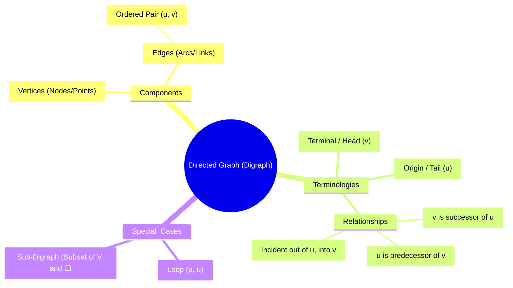
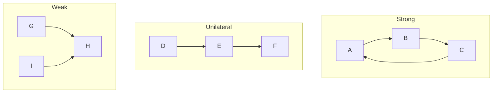
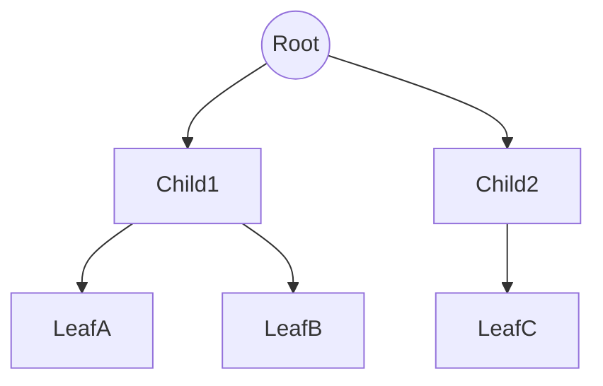
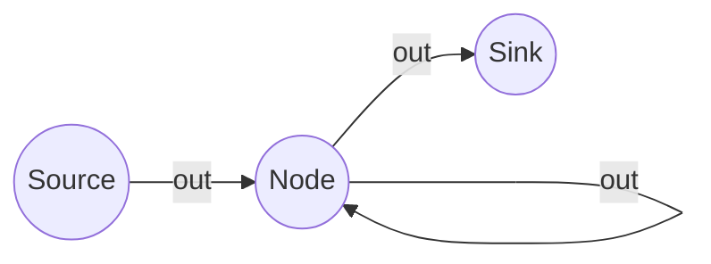
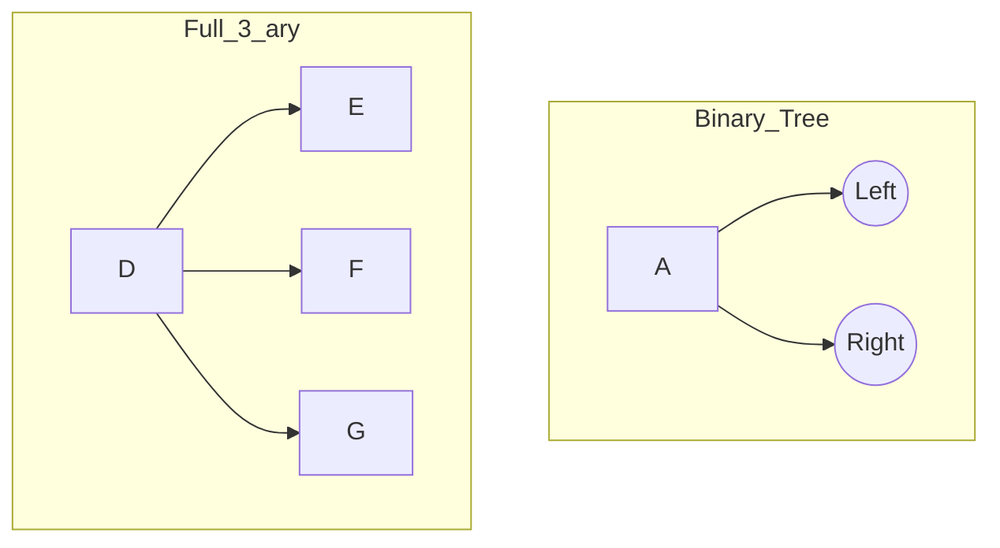

# 4 Directed Graphs

Comprehensive resource for 4 Directed Graphs.


---

## 4 Directed Graphs Hub


## Overview
Directed Graphs (Digraphs) represent the fundamental framework for modeling systems where direction matters, from one-way traffic systems to digital logic circuits. Unlike undirected graphs, digraphs consist of vertices connected by directed edges (arcs), introducing concepts of flow, precedence, and hierarchy. This unit establishes the rigorous mathematical definitions of digraphs, explores the metrics of vertex degrees (in-degree vs. out-degree), and methods for computational representation using matrices. It culminates in the analysis of connectivity types and the structured hierarchy of trees, which are essential for understanding data structures and algorithms in computer science.

## Learning Objectives
*   Define a Directed Graph and identify its components (vertices, arcs, sources, sinks).
*   Calculate and verify the in-degree and out-degree of vertices, applying the Handshaking Lemma for digraphs.
*   Construct and interpret Adjacency and Incidence Matrices to represent digraph structures computationally.
*   Distinguish between Strongly, Unilaterally, and Weakly connected graphs.
*   Analyze Rooted Trees, including properties of Binary and M-ary trees, depth, and balancing.

## Unit Applications & Real-World Relevance
*   **Computer Networks:** Modeling packet routing where data flows in specific directions.
*   **Web Page Ranking:** The PageRank algorithm uses digraphs where web pages are nodes and hyperlinks are directed edges.
*   **Project Management:** PERT and CPM charts use digraphs to model task dependencies (Task A must finish before Task B starts).
*   **Social Networks:** Modeling "Follow" relationships (Alice follows Bob, but Bob doesn't follow Alice).

## Active Learning Prompts
*   Draw the "Directed Graph" of your morning routine. What are the nodes (tasks)? What are the directed edges (dependencies)? Is it a linear path or a tree?
*   Try to construct a digraph that is *Weakly Connected* but not *Unilaterally Connected*. Is it possible? Why or why not?
*   Convert a simple Adjacency Matrix into a visual graph. Can you reverse the process without losing information?

## Unit Challenges & Common Misconceptions
*   **Connectivity Confusion:** Students often confuse "Strongly Connected" (round trip possible between any two nodes) with "Complete Graphs" (every node connected to every other).
*   **Matrix Orientation:** Confusing rows (Out-degree) and columns (In-degree) in Adjacency Matrices is a frequent error.
*   **Tree Terminology:** Mixing up "Depth" (distance from root) and "Height" (distance to deepest leaf) or "Level".

## Connections
*   [[Directed_Graph_Fundamentals]]
  *   [[Vertex_Degrees_in_Digraphs]]
  *   [[Matrix_Representations_of_Digraphs]]
  *   [[Connectivity_in_Directed_Graphs]]
  *   [[Rooted_Tree_Structures]]
    *   [[Binary_and_M_ary_Tree_Properties]]

## Next Steps for Deeper Understanding
*   Explore **Graph Traversal Algorithms** (BFS/DFS) specifically for directed graphs.
*   Study **Network Flow** problems (Max Flow Min Cut theorem).
*   Investigate **Finite State Machines** (Automata Theory) which are essentially labeled digraphs.

## Possible Questions
[[CC2131_4_Directed_Graphs_Possible_Questions]]

---

---

## Directed Graph Fundamentals


## Definition
Before proceeding, ensure you master the basic concept of **Sets and Relations** because Directed Graphs are formally defined as sets of vertices and ordered pairs (relations) of edges.
A Directed Graph (or Digraph) is a discrete structure consisting of a set of vertices (nodes) and a set of directed edges (arcs), where each edge connects an ordered pair of vertices. Unlike a standard graph where a connection is mutual (like a handshake), a directed graph represents a one-way relationship (like a tweet: you can mention someone, but they don't have to mention you back). Formally, $D = (V, E)$, where $E$ is a set of ordered pairs $(u, v)$.

## The Mental Model
Think of a city's road network where every single street is a **One-Way Street**. The intersections are the **Vertices**. The one-way streets are the **Directed Edges**. If you can drive from Intersection A to Intersection B, it doesn't automatically mean you can drive from B to A; you might need to take a different loop. A "loop" in this context would be a roundabout that just circles back to the same intersection.


```text
// Scenario: Visualizing the structure of a Digraph Concept
// Output:
// A central node "Directed Graph (Digraph)" branches into:
// 1. Components: containing Vertices and Edges (defined as Ordered Pairs).
// 2. Terminologies: defining Initial Node (Tail), Terminal Node (Head), and Relationships (Successor/Predecessor).
// 3. Special Cases: defining Loop (self-connection) and Sub-Digraph.
```
*Note: This mindmap organizes the core nomenclature of Directed Graphs, separating physical components from relational terms.*

## Context & Framework
#### Where Does it Live? (The Map)
Directed Graphs reside at the intersection of Set Theory and Topology. They are the fundamental structure for any system involving **flow, state changes, or dependency**.
*   **Underlying Graph:** If you strip away the arrows (direction), you get the "Underlying Graph" (or undirected graph).
*   **Sub-Digraph:** Just like a subset, a sub-digraph consists of a selection of vertices from the original graph and a selection of edges that connect *only* those chosen vertices.
*   **Connected Components:** In disconnected graphs, these are the isolated "islands" of subgraphs.

## The Mastery Deep Dive
#### The Anatomy of an Arrow
In a directed edge $e = (u, v)$:
*   **$u$ (The Tail):** The origin. The "From" point. $u$ is adjacent *to* $v$.
*   **$v$ (The Head):** The destination. The "To" point. $v$ is adjacent *from* $u$.
*   **Successor/Predecessor:** If the arrow points $u \to v$, $v$ is the successor (what comes next), and $u$ is the predecessor (what came before).

#### Neighbors and Incidence
We don't just say an edge is "connected" to a vertex; we must be specific about *how*.
*   An edge is **incident out of** the tail ($u$).
*   An edge is **incident into** the head ($v$).
*   **Loop:** An edge $(u, u)$ that starts and ends at the same vertex.

## Constraints & Limitations
#### The "False Friend" (Undirected vs. Directed)
Don't be fooled by the visual similarity to undirected graphs.
*   **The Trap:** In an undirected graph, $\{u, v\}$ is the same set as $\{v, u\}$. In a digraph, the ordered pair $(u, v)$ is **completely different** from $(v, u)$. $(u, v)$ means a road from $u$ to $v$. $(v, u)$ means a road from $v$ to $u$. Existence of one does not imply the other.
*   **Gotcha:** A "path" in a digraph *must* follow the arrows. You cannot walk against traffic.

## Significance & Application
Digraphs are crucial in computer science for:
*   **Garbage Collection:** Determining which memory objects are reachable.
*   **Deadlock Detection:** Analyzing resource allocation graphs in Operating Systems.
*   **Task Scheduling:** Ensuring prerequisites are met before a task begins.

## The Worked Example
**Task:** Identify the components of the following edge relation.
**Given:** Edge $e_1 = (A, B)$.
**Analysis:**
1.  **Origin (Tail):** $A$.
2.  **Terminal (Head):** $B$.
3.  **Relationship:** $B$ is the successor of $A$. $A$ is the predecessor of $B$.
4.  **Adjacency:** $A$ is adjacent *to* $B$. $B$ is adjacent *from* $A$.
5.  **Incidence:** Edge $e_1$ is incident *out of* $A$ and *into* $B$.

## The Proving Ground
*Test your mastery. Cover the solutions below to test yourself first.*

#### Level 1: The Sanity Check (Verification)
**The Question:** In a directed edge $e = (X, Y)$, which vertex is the "Head" and which is the "Tail"?
> **Solution:** $X$ is the Tail (Origin), and $Y$ is the Head (Terminal).

#### Level 2: The Crucible (Mastery & Edge Cases)
**The Scenario:** You have a digraph with vertices $\{1, 2, 3\}$. The edges are $E = \{(1, 2), (2, 3), (3, 1), (2, 2)\}$.
Identify: (a) All loops. (b) The successor(s) of Vertex 2. (c) Is this a sub-digraph of a graph containing edge $(1, 3)$?
> **Solution:**
> (a) Loop: $(2, 2)$ (starts and ends at 2).
> (b) Successors of 2: Vertices that 2 points to. From $(2, 3)$ and $(2, 2)$, successors are $\{3, 2\}$.
> (c) Yes, provided the vertices $\{1, 2, 3\}$ are in the larger graph. A sub-digraph can contain a subset of edges. The fact that the larger graph has $(1, 3)$ (which is missing here) doesn't prevent this from being a valid sub-digraph.

## Key Takeaways
*   A Digraph is defined by **Ordered Pairs**; direction is fundamental and non-negotiable.
*   Terminology is precise: **Tail $\to$ Head**, **Origin $\to$ Terminal**, **Adjacent To $\to$ Adjacent From**.
*   A **Loop** is a valid edge connecting a vertex to itself.

## Knowledge Graph Connections
| Concept | Connection / Relationship |
| :
--- | :
--- |
| [[Vertex_Degrees_in_Digraphs]] | Degree counting relies on separating "incident into" vs "incident out of". |
| [[Matrix_Representations_of_Digraphs]] | Matrices encode the $u \to v$ relationships numerically. |
| [[Connectivity_in_Directed_Graphs]] | Connectivity types depend entirely on the direction of paths. |

---

---

## Connectivity In Directed Graphs


## Definition
Before proceeding, ensure you master [[Directed_Graph_Fundamentals]] to understand valid paths (following arrows).
Connectivity in digraphs is nuanced because paths are one-way. We distinguish between three levels of connectedness:
1.  **Strongly Connected:** You can get from $u \to v$ AND $v \to u$ for *every* pair of vertices. (The "Round Trip" standard).
2.  **Unilaterally Connected (Semi-Connected):** For every pair $u, v$, there is a path $u \to v$ OR $v \to u$. (The "One-Way" standard).
3.  **Weakly Connected:** The graph is connected if you ignore the direction of the arrows (treat it as undirected). (The "Structure" standard).

## The Mental Model
*   **Strong:** A city where you can drive from any house to any other house and back.
*   **Unilateral:** A river flowing downhill. You can go from Up to Down, but never back. Every point is connected to the flow, but only one way.
*   **Weak:** A group of islands connected by bridges, but some bridges are one-way pointing *away* from each other, making travel impossible between certain islands, even though they are physically linked.


```text
// Scenario: Visualizing Connectivity Types
// Output:
// Strong: Cycle A->B->C->A. (Round trip possible).
// Unilateral: Line D->E->F. (D can reach F, F cannot reach D. But they are connected one-way).
// Weak: G->H<-I. (G can reach H, I can reach H. But G cannot reach I, and I cannot reach G. Connected only if arrows ignored).
```
*Note: Strong implies Unilateral. Unilateral implies Weak.*

## Context & Framework
#### The Hierarchy of Connection
Connectivity is hierarchical.
*   If **Strong**, it is automatically **Unilateral** and **Weak**.
*   If **Unilateral**, it is automatically **Weak**.
*   **Weak** is the bare minimum requirement to be considered a single "piece" rather than disjoint components.

## The Mastery Deep Dive
#### The "Kill Sheet" (Distinguishing the Types)
| Feature | Strongly Connected | Unilaterally Connected | Weakly Connected |
| :
--- | :
--- | :
--- | :
--- |
| **Path $u \to v$** | Exists for ALL pairs. | Exists for at least one direction per pair. | Might not exist. |
| **Path $v \to u$** | Exists for ALL pairs. | Might not exist. | Might not exist. |
| **Undirected View** | Connected. | Connected. | Connected. |
| **Analogy** | Two-way Street Network. | River / Assembly Line. | Mixed One-way streets facing apart. |
| **Key Test** | Can I return to start? (Cycles). | Can I reach everyone from somewhere? | Is the graph in one piece? |

#### Connected Components
*   **Strongly Connected Component (SCC):** The largest subgraph where every node is strongly connected to every other. Even in a weak graph, you might have small islands of strong connectivity (like a roundabout in a one-way city).

## Constraints & Limitations
#### The "Disconnected" Trap
If the underlying graph (undirected) is disconnected (two separate islands), the digraph is **Disconnected**. It is not even Weakly connected.

## Significance & Application
*   **Routing Protocols:** Internet routers need Strong connectivity to ensure acknowledgement packets can return.
*   **Compiler Optimization:** identifying SCCs helps in analyzing loops in code.

## The Worked Example
**Graph:** $1 \to 2$, $2 \to 3$.
**Analysis:**
1.  **Test Strong:** Can 3 reach 1? No. $\implies$ Not Strong.
2.  **Test Unilateral:**
    *   Pair (1, 2): $1 \to 2$ exists. OK.
    *   Pair (2, 3): $2 \to 3$ exists. OK.
    *   Pair (1, 3): $1 \to 2 \to 3$ exists. OK.
    *   $\implies$ Unilaterally Connected.
3.  **Test Weak:** Ignore arrows. $1-2-3$. It is connected. $\implies$ Weakly Connected.
**Conclusion:** The graph is Unilaterally Connected (and Weakly).

## The Proving Ground
*Test your mastery. Cover the solutions below to test yourself first.*

#### Level 1: The Sanity Check (Verification)
**The Question:** Is a cycle $A \to B \to C \to A$ Strongly Connected?
> **Solution:** Yes. From any node, you can traverse the cycle to reach any other node.

#### Level 2: The Crucible (Mastery & Edge Cases)
**The Scenario:** Graph $G: A \to B$, $C \to B$. (V shape pointing to B). Classify the connectivity.
> **Solution:**
> *   Strong? No. A cannot reach C. C cannot reach A. B cannot reach anyone.
> *   Unilateral? Check pair (A, C). Path $A \to C$? No (blocked at B). Path $C \to A$? No (blocked at B). Since neither direction works for pair (A, C), it is **NOT** Unilateral.
> *   Weak? Ignore arrows: $A-B-C$. It is connected.
> *   **Result:** Weakly Connected.

## Key Takeaways
*   **Strong:** Round trip ($u \leftrightarrow v$).
*   **Unilateral:** One way ($u \to v$ OR $v \to u$).
*   **Weak:** Skeleton only (Undirected connected).
*   **Hierarchy:** Strong $\subset$ Unilateral $\subset$ Weak.

## Knowledge Graph Connections
| Concept | Connection / Relationship |
| :
--- | :
--- |
| [[Directed_Graph_Fundamentals]] | Connectivity describes the global structure formed by fundamental edges. |
| [[Matrix_Representations_of_Digraphs]] | Connectivity can be calculated using the Reachability Matrix ($R$). |
| [[Rooted_Tree_Structures]] | Trees are a specific class of Unilaterally Connected graphs (usually). |

---

---

## Matrix Representations Of Digraphs


## Definition
Before proceeding, ensure you master [[Vertex_Degrees_in_Digraphs]] because calculating matrix row and column sums directly yields vertex degrees.
Graphs are visual, but computers need numbers. We use matrices to represent digraphs computationally.
1.  **Adjacency Matrix ($A$):** A square matrix recording connectivity between vertices. $A_{ij} = n$ if there are $n$ edges from vertex $i$ to vertex $j$.
2.  **Incidence Matrix ($I$):** A matrix recording relationships between vertices and edges. Rows are vertices, columns are edges.

## The Mental Model
*   **Adjacency Matrix:** Like a "Flight Distance Table" in a magazine, but instead of miles, it shows "Flights per day" from City Row to City Column.
*   **Incidence Matrix:** A "Ticket" list. Each column is a Ticket (Edge). It has a "Departure" (Vertex = 1) and an "Arrival" (Vertex = -1).

```python
## Adjacency Matrix for a Digraph with vertices 0, 1, 2
## Edge 0->1, Edge 1->2, Edge 2->0 (A Cycle)

##      To 0  To 1  To 2
adj = [[0,    1,    0],   # From 0
       [0,    0,    1],   # From 1
       [1,    0,    0]]   # From 2
## A_ij = 1 means there is an edge FROM i TO j
```
```text
// Scenario: Interpreting the Adjacency Matrix
// Output:
// Row 0: [0, 1, 0] -> Edge from 0 to 1. (Out-degree of 0 is 1)
// Column 0: [0, 0, 1] -> Edge from 2 to 0. (In-degree of 0 is 1)
// The matrix represents a cycle 0 -> 1 -> 2 -> 0.
```
*Note: Read Rows for "From", Columns for "To".*

## Context & Framework
#### Adjacency Matrix ($A_{ij}$) Structure
For a graph with $m$ vertices $v_1, ..., v_m$:
*   **Rows ($i$):** Represent the **Origin** (From). Sum of Row $i$ = $\text{outdeg}(v_i)$.
*   **Columns ($j$):** Represent the **Destination** (To). Sum of Column $j$ = $\text{indeg}(v_j)$.
*   **Values:** $0$ = No edge. $n$ = Number of parallel edges (or 1 if simple).

#### Incidence Matrix ($B_{ij}$) Structure
Rows are Vertices ($m$), Columns are Edges ($n$).
*   $1$: Edge starts here (Incident From / Out).
*   $-1$: Edge ends here (Incident To / In).
*   $0$: No connection.
*   **Loop Rule:** Customarily, loops are tricky in incidence matrices; sometimes represented as $2$, $0$, or handled separately depending on convention (slides define loop-free for incidence).

## The Mastery Deep Dive
#### The "Blueprint" of Connectivity
The **Adjacency Matrix** is the standard for dense graphs. It allows checking "Is there a road from A to B?" in $O(1)$ time—just look up coordinate $(A, B)$.
$$ A = (a_{ij}) \quad \text{where } a_{ij} = \text{count of edges } v_i \to v_j $$

#### The "Blueprint" of Topology
The **Incidence Matrix** captures the exact identity of edges. It is useful for network flow problems (Kirchhoff's laws).
$$ B_{ij} = \begin{cases} 1 & \text{edge } j \text{ leaves vertex } i \\ -1 & \text{edge } j \text{ enters vertex } i \\ 0 & \text{otherwise} \end{cases} $$
*Note: Each column (edge) must sum to exactly 0 (one +1, one -1), unless it's a loop.*

## Constraints & Limitations
#### The "Space" Trade-off (Space Complexity)
*   **Adjacency Matrix:** Uses $O(V^2)$ space. Good for dense graphs (lots of edges). Bad for sparse graphs (mostly zeros).
*   **Incidence Matrix:** Uses $O(V \times E)$ space.

## Significance & Application
*   **Social Networks:** Adjacency matrix of "follows". $A^2$ (Matrix multiplication) can find "Friends of Friends".
*   **Physics:** Incidence matrices describe circuits in electrical engineering.

## The Worked Example
**Graph:** Vertices $\{1, 2\}$, Edges: $e_1: 1 \to 2$, $e_2: 1 \to 1$ (Loop), $e_3: 2 \to 1$.
**Construct Adjacency Matrix:**
*   $1 \to 1$ (Yes, $e_2$): $A_{11} = 1$
*   $1 \to 2$ (Yes, $e_1$): $A_{12} = 1$
*   $2 \to 1$ (Yes, $e_3$): $A_{21} = 1$
*   $2 \to 2$ (No): $A_{22} = 0$
$$ A = \begin{pmatrix} 1 & 1 \\ 1 & 0 \end{pmatrix} $$

**Construct Incidence Matrix (Assuming loop-free definition from source, or handling loops carefully):**
*   *Note: Standard Incidence definition ($1, -1$) fails for loops (1 to 1) because a cell cannot be both 1 and -1. The source slides specify "Loop-free digraph" for Incidence Matrix definition.*
*   So, consider subgraph without loop $e_2$: $e_1 (1 \to 2)$, $e_3 (2 \to 1)$.
*   Col 1 ($e_1$): Row 1 (+1), Row 2 (-1).
*   Col 2 ($e_3$): Row 1 (-1), Row 2 (+1).
$$ I = \begin{pmatrix} 1 & -1 \\ -1 & 1 \end{pmatrix} $$

## The Proving Ground
*Test your mastery. Cover the solutions below to test yourself first.*

#### Level 1: The Sanity Check (Verification)
**The Question:** In an Adjacency Matrix, if the sum of Row 3 is 5, what does that tell you about Vertex 3?
> **Solution:** The Out-Degree of Vertex 3 is 5.

#### Level 2: The Crucible (Mastery & Edge Cases)
**The Scenario:** You have an incidence matrix where Column 4 has a '1' at Row A and a '-1' at Row B. All other entries in Column 4 are 0. (a) Describe Edge 4. (b) What is the sum of any column in a standard incidence matrix?
> **Solution:**
> (a) Edge 4 is a directed edge from Vertex A to Vertex B ($A \to B$).
> (b) The sum is 0 (since $1 + (-1) = 0$).

## Key Takeaways
*   **Adjacency Matrix:** $A_{ij}$ is From $i$ To $j$. Row Sum = Out-Degree. Col Sum = In-Degree.
*   **Incidence Matrix:** Columns are edges. entries are $+1$ (Start) and $-1$ (End).
*   **Loop Limitation:** Incidence matrices ($1/-1$) cannot standardly represent loops without modification.

## Knowledge Graph Connections
| Concept | Connection / Relationship |
| :
--- | :
--- |
| [[Directed_Graph_Fundamentals]] | Matrices are the digital translation of the fundamental graph components. |
| [[Vertex_Degrees_in_Digraphs]] | Matrix sums provide a computational method to verify degrees. |
| [[Connectivity_in_Directed_Graphs]] | Matrix multiplication ($A^n$) is used to determine path existence and connectivity. |

---

---

## Rooted Tree Structures


## Definition
Before proceeding, ensure you master [[Directed_Graph_Fundamentals]] and [[Connectivity_in_Directed_Graphs]] as trees are specific types of connected digraphs without cycles.
A **Rooted Tree** is a connected digraph with **no cycles** and a unique vertex called the **Root** which has an **In-Degree of 0**. All other vertices have an In-Degree of exactly 1. It represents a strict hierarchical relationship.

## The Mental Model
Think of a **Family Tree** (Descendants chart).
*   **Root:** The Ancestor.
*   **Children:** Direct descendants.
*   **Leaves:** The youngest generation (no children yet).
*   **Arrows:** Point from Parent to Child.


```text
// Scenario: Visualizing Tree Hierarchy
// Output:
// Level 0: Root.
// Level 1: Child1, Child2 (Siblings).
// Level 2: LeafA, LeafB, LeafC (Leaves).
// Arrows flow strictly Down. No cycles.
```
*Note: In CS trees, the Root is at the top.*

## Context & Framework
#### Terminology
*   **Parent/Child:** If $u \to v$, $u$ is parent, $v$ is child.
*   **Siblings:** Vertices sharing the same parent.
*   **Leaf:** Vertex with **Out-Degree = 0** (No children).
*   **Internal Vertex:** Vertex with **Out-Degree > 0** (Has children).
*   **Branch:** A directed path from the root to a leaf.

## The Mastery Deep Dive
#### Measurement: Level vs. Depth vs. Height
*   **Level of $u$:** Length of path from Root to $u$. (Root is Level 0).
*   **Depth of $u$:** Same as Level. The distance *down* from the root.
*   **Height of Tree:** The maximum depth (level) of any node in the tree.

#### The "One Parent" Rule
In a valid rooted tree (except the root), every node must have **exactly one parent**.
*   If a node has 2 parents, it's not a tree (it's a general DAG - Directed Acyclic Graph).
*   If the root has a parent, it's not a root.

## Constraints & Limitations
#### The "No Cycle" Rule
A tree cannot have a back-link. If a child points back to a parent or ancestor, the hierarchy breaks, and it ceases to be a tree.

## Significance & Application
*   **File Systems:** Folders (Directories) are internal nodes, Files are leaves.
*   **HTML DOM:** The document structure of a webpage is a tree.
*   **Organization Charts:** CEO (Root) $\to$ Managers $\to$ Employees.

## The Worked Example
**Tree:** $R \to A$, $R \to B$, $A \to C$.
**Analysis:**
*   **Root:** $R$ (In-degree 0).
*   **Leaves:** $B, C$ (Out-degree 0).
*   **Internal:** $R, A$.
*   **Level of C:** Path $R \to A \to C$ is length 2. Level = 2.
*   **Siblings:** $A$ and $B$ (share parent $R$). $C$ has no siblings.

## The Proving Ground
*Test your mastery. Cover the solutions below to test yourself first.*

#### Level 1: The Sanity Check (Verification)
**The Question:** If Node X is at Level 3, how many edges are in the path from the Root to X?
> **Solution:** 3 edges.

#### Level 2: The Crucible (Mastery & Edge Cases)
**The Scenario:** You have a graph $A \to B$, $A \to C$, $C \to B$. Is this a rooted tree?
> **Solution:** No.
> Check B: B has edges coming from A AND C. In-Degree of B is 2.
> Rule violation: In a tree, every node (except Root) must have In-Degree 1. This is a DAG, not a tree.

## Key Takeaways
*   **Root:** Unique start, In-degree 0.
*   **Leaf:** End point, Out-degree 0.
*   **Unique Path:** There is exactly one path from Root to any node.

## Knowledge Graph Connections
| Concept | Connection / Relationship |
| :
--- | :
--- |
| [[Directed_Graph_Fundamentals]] | Trees are a restricted subset of digraphs. |
| [[Binary_and_M_ary_Tree_Properties]] | Defines specific structural constraints on trees (max children). |
| [[Connectivity_in_Directed_Graphs]] | Trees are weakly connected and unilaterally connected (from root down). |

---

---

## Vertex Degrees In Digraphs


## Definition
Before proceeding, ensure you master [[Directed_Graph_Fundamentals]] to understand the distinction between "incident to" and "incident from".
Vertex Degree in a digraph is the count of edges associated with a vertex, split into two distinct metrics: **In-Degree** (number of edges arriving) and **Out-Degree** (number of edges leaving). This is unlike undirected graphs where there is just one "degree".
*   **In-Degree ($\text{deg}^-(v)$):** The number of edges ending at vertex $v$.
*   **Out-Degree ($\text{deg}^+(v)$):** The number of edges starting at vertex $v$.

## The Mental Model
Imagine a house (Vertex).
*   **Out-Degree:** The number of roads leading *away* from your house.
*   **In-Degree:** The number of roads leading *to* your house.
*   **Source:** A power plant. It produces output (Out-degree > 0) but receives nothing (In-degree = 0).
*   **Sink:** A drain. It receives everything (In-degree > 0) but produces nothing (Out-degree = 0).


```text
// Scenario 1: Analyzing Degrees
// Output:
// Node S (Source): In-degree=0, Out-degree=1.
// Node N (Node): In-degree=2 (from S and self-loop), Out-degree=2 (to K and self-loop).
// Node K (Sink): In-degree=1, Out-degree=0.
```
*Note: Node 'N' has a loop. A loop adds 1 to In-Degree AND 1 to Out-Degree.*

## Context & Framework
#### The Handshaking Lemma (Directed Version)
In any digraph, the total "sending" must equal the total "receiving". Every arrow that starts somewhere must end somewhere.
**Theorem:**
$$ \sum_{v \in V} \text{deg}^-(v) = \sum_{v \in V} \text{deg}^+(v) = |E| $$
The sum of all in-degrees equals the sum of all out-degrees, which equals the total number of edges $|E|$.

#### The Variable Dictionary
| Symbol | Name | Unit | Analogy |
| :
--- | :
--- | :
--- | :
--- |
| $\text{deg}^-(v)$ | In-Degree | Count (Integer) | Incoming emails. |
| $\text{deg}^+(v)$ | Out-Degree | Count (Integer) | Sent emails. |
| $|E|$ | Cardinality of Edges | Count (Integer) | Total emails sent in the system. |
| $\sum$ | Summation | Operator | The total count. |

## The Mastery Deep Dive
#### The "Accounting" of Edges
When you draw a single directed edge $u \to v$:
1.  You add **1** to the Out-Degree of $u$.
2.  You add **1** to the In-Degree of $v$.
3.  You add **1** to the total edge count $|E|$.
Therefore, the global tally of "Outs" and "Ins" always rises in perfect lockstep. They are two sides of the same coin.

#### Sources and Sinks
*   **Source:** $\text{deg}^-(v) = 0$. Pure origin. (e.g., The "Start" node in a flowchart).
*   **Sink:** $\text{deg}^+(v) = 0$. Pure destination. (e.g., The "End" or "Trash" node).
*   **Isolated Vertex:** $\text{deg}^-(v) = 0$ AND $\text{deg}^+(v) = 0$. It is not connected to anything.

## Constraints & Limitations
#### The "Loop" Trap
A common mistake is miscounting loops.
*   **The Trap:** Thinking a loop only counts once.
*   **The Reality:** A loop $(v, v)$ is an edge leaving $v$ AND entering $v$. It contributes **1 to the Out-Degree** and **1 to the In-Degree** of the *same* vertex.

## Significance & Application
*   **Web Search:** "Authorities" (high in-degree) vs. "Hubs" (high out-degree).
*   **Supply Chain:** Sources are raw material factories; Sinks are consumers.

## The Worked Example
**Problem:** Calculate degrees for a graph with edges $E = \{(A, B), (A, C), (B, B), (C, A)\}$.
**Step-by-Step Derivation:**
$$ \begin{aligned} & \textbf{Vertex A:} \\ & \quad \text{Starts: } (A, B), (A, C) \implies \text{deg}^+(A) = 2 \\ & \quad \text{Ends: } (C, A) \implies \text{deg}^-(A) = 1 \\ \\ & \textbf{Vertex B:} \\ & \quad \text{Starts: } (B, B) \implies \text{deg}^+(B) = 1 \\ & \quad \text{Ends: } (A, B), (B, B) \implies \text{deg}^-(B) = 2 \quad \text{(Note loop counts for both)} \\ \\ & \textbf{Vertex C:} \\ & \quad \text{Starts: } (C, A) \implies \text{deg}^+(C) = 1 \\ & \quad \text{Ends: } (A, C) \implies \text{deg}^-(C) = 1 \end{aligned} $$

**Verification:**
Sum of Out-Degrees: $2 + 1 + 1 = 4$.
Sum of In-Degrees: $1 + 2 + 1 = 4$.
Total Edges: 4. The math holds.

## The Proving Ground
*Test your mastery. Cover the solutions below to test yourself first.*

#### Level 1: The Sanity Check (Verification)
**The Question:** If a vertex has 3 arrows pointing in and 2 arrows pointing out, what is its In-Degree and Out-Degree? Is it a Source or Sink?
> **Solution:** In-Degree = 3, Out-Degree = 2. It is neither a Source (In > 0) nor a Sink (Out > 0).

#### Level 2: The Crucible (Mastery & Edge Cases)
**The Scenario:** A graph has 4 vertices. The Out-Degrees are 2, 2, 3, and $x$. The In-Degrees are 1, 3, 2, and 2. Find $x$.
> **Solution:**
> Apply the Theorem: $\sum \text{deg}^+ = \sum \text{deg}^-$.
> Sum of In-Degrees = $1 + 3 + 2 + 2 = 8$.
> Sum of Out-Degrees = $2 + 2 + 3 + x = 7 + x$.
> $7 + x = 8 \implies x = 1$.

## Key Takeaways
*   **Split Degrees:** Always specify "In" or "Out".
*   **Theorem of Sums:** Total In = Total Out = Total Edges.
*   **Loop Rule:** A loop counts for both In and Out on the same node.

## Knowledge Graph Connections
| Concept | Connection / Relationship |
| :
--- | :
--- |
| [[Directed_Graph_Fundamentals]] | Degrees are properties of the vertices defined in fundamentals. |
| [[Matrix_Representations_of_Digraphs]] | Row/Column sums in matrices directly correspond to Out/In degrees. |
| [[Connectivity_in_Directed_Graphs]] | High degrees often correlate with stronger connectivity. |

---

---

## Binary And M Ary Tree Properties


## Definition
Before proceeding, ensure you master [[Rooted_Tree_Structures]].
These are specific classifications of rooted trees based on the number of children a node can have.
*   **m-ary Tree:** Every internal vertex has *at most* $m$ children.
*   **Full m-ary Tree:** Every internal vertex has *exactly* $m$ children.
*   **Binary Tree ($m=2$):** A special case where every node has at most 2 children (Left Child, Right Child).

## The Mental Model
*   **Binary Tree:** A decision path where every question is Yes/No (2 branches).
*   **Full 3-ary Tree:** A hierarchy where every manager *must* hire exactly 3 employees.
*   **Balanced Tree:** A tree that is "bushy" and full, not stringy like a line. All leaves are at roughly the same depth ($h$ or $h-1$).


```text
// Scenario: Comparing Tree Types
// Output:
// Binary Tree: Node A splits into B and C. (Max 2 children).
// Full 3-ary: Node D splits into E, F, G. (Exactly 3 children).
```
*Note: In a Binary Search Tree, the "Left" and "Right" positions carry specific meaning (Left < Parent < Right).*

## Context & Framework
#### Binary Search Tree (BST)
A crucial data structure.
*   **Structure:** Binary Tree.
*   **Rule:** For any node $N$: Values in Left Subtree < Value of $N$ < Values in Right Subtree.
*   **Uniqueness:** Data values must be unique.

#### Balanced Tree
A tree of height $h$ is balanced if all leaves are at level $h$ or $h-1$. This ensures operations (search, insert) remain efficient ($O(\log n)$) rather than degrading to a linked list ($O(n)$).

## The Mastery Deep Dive
#### The "Taxonomy" Check
1.  **Is it a Tree?** (Connected, No cycles, 1 Root).
2.  **Count Max Children ($k$):** It is a $k$-ary tree.
3.  **Check Internal Nodes:** Do they ALL have exactly $k$ children? $\implies$ **Full** $k$-ary.
4.  **Check Leaves:** Are they all at the bottom 2 levels? $\implies$ **Balanced**.

## Constraints & Limitations
#### The "Skewed" Trap
A binary tree where every node has only a right child is essentially a **Linked List**. It is a tree by definition, but it is **Unbalanced** and loses the efficiency benefits of a tree structure.

## Significance & Application
*   **Binary Search Trees:** Efficient data storage and retrieval.
*   **Heaps:** Complete binary trees used for priority queues.
*   **B-Trees:** m-ary trees used in Database indexing.

## The Worked Example
**Tree T:** Root $A$. Children of $A$: $B, C$. Child of $B$: $D$.
**Analysis:**
1.  **Max Children:** $A$ has 2. $B$ has 1. Max is 2. $\implies$ Binary Tree.
2.  **Full?** Internal nodes are $A, B$. $A$ has 2 children. $B$ has 1 child. Since $B$ does not have 2, it is **NOT** a Full Binary Tree.
3.  **Balanced?** Height $h=2$ (Leaf $D$ at level 2). Leaf $C$ is at level 1. Leaves are at $h$ and $h-1$. $\implies$ **Balanced**.

## The Proving Ground
*Test your mastery. Cover the solutions below to test yourself first.*

#### Level 1: The Sanity Check (Verification)
**The Question:** In a Full Binary Tree, can an internal node have 1 child?
> **Solution:** No. In a **Full** Binary Tree, every internal node must have exactly 2 children.

#### Level 2: The Crucible (Mastery & Edge Cases)
**The Scenario:** Construct a tree that is a Binary Tree but **NOT** a Full Binary Tree and **NOT** Balanced.
> **Solution:**
> Nodes: Root $\to$ A $\to$ B $\to$ C.
> *   Binary? Yes, max children is 1 (which is $\le 2$).
> *   Full? No. Root has 1 child (needs 2).
> *   Balanced? Height is 3 (C is at level 3). Leaf C is at level 3. Wait, is there another leaf? No. Wait, usually unbalanced implies leaves at very different levels. A linear chain is technically balanced by the definition "leaves at h or h-1" if there is only 1 leaf!
> *   **Correction:** To be Unbalanced, we need a leaf at level $h$ and a leaf at level $< h-1$.
> *   **Better Example:** Root $\to$ Left (Leaf). Root $\to$ Right $\to$ R1 $\to$ R2 (Leaf).
> *   Left Leaf is at Level 1. Right Leaf (R2) is at Level 3.
> *   Difference is 2. $\implies$ Not Balanced.

## Key Takeaways
*   **m-ary:** Limit on children.
*   **Full:** Strict count of children.
*   **Balanced:** Compact height (efficient).

## Knowledge Graph Connections
| Concept | Connection / Relationship |
| :
--- | :
--- |
| [[Rooted_Tree_Structures]] | The parent category for all these tree types. |
| [[Directed_Graph_Fundamentals]] | The underlying rules of nodes/edges still apply. |

---

---

## CC2131 4 Directed Graphs Possible Questions


## Part I: The Conceptual Mastery Ladder
*Progress through these levels for every atomic concept. Do not move to the next concept until you can answer Level 3.*

### [[Directed_Graph_Fundamentals]]
#### Level 1: Understanding (The Basics)
1.  **The Component Check:** Given the set representation $V = \{x, y, z\}$ and $E = \{(x, y), (y, z), (z, z)\}$, identify all vertices that act as a "Tail" in at least one edge.
#### Level 2: Competence (Application)
2.  **The Sort:** Given a list of graph elements—$(u, v)$, $\{u, v\}$, Loop, Arc—categorize them into "Directed Graph Components" and "Undirected Graph Components".
#### Level 3: Mastery (The Crucible)
3.  **The Impostor:** You are analyzing a system that claims to be a valid **Sub-Digraph** of $G$. The Sub-Digraph contains edge $(A, B)$, but vertex $B$ is missing from its vertex set. Explain why this is impossible and violates the definition of a digraph.

### [[Vertex_Degrees_in_Digraphs]]
#### Level 1: Understanding (The Basics)
4.  **The Variable ID:** In the equation $\sum \text{deg}^-(v) = |E|$, what physical quantity does $|E|$ represent in a traffic network analogy?
#### Level 2: Competence (Application)
5.  **The Standard Solver:** A graph has 5 vertices. The in-degrees are 2, 2, 1, 1, and 3. What is the sum of the out-degrees?
#### Level 3: Mastery (The Crucible)
6.  **The Impossible Case:** A student claims to have drawn a digraph with 3 edges where the sum of In-Degrees is 3 and the sum of Out-Degrees is 4. Explain, using the Handshaking Lemma, why this graph cannot exist.

### [[Matrix_Representations_of_Digraphs]]
#### Level 1: Understanding (The Basics)
7.  **The Component Check:** In an Adjacency Matrix $A$, does the entry $A_{23}$ represent an edge from Vertex 2 to 3, or from 3 to 2?
#### Level 2: Competence (Application)
8.  **The Clean Build:** Construct the Adjacency Matrix for a graph with vertices $\{1, 2, 3\}$ and edges $1 \to 2$, $2 \to 3$, and $3 \to 1$.
```text
// Scenario: Matrix Construction
// Expected Output:
// [[0, 1, 0],
//  [0, 0, 1],
//  [1, 0, 0]]
```
#### Level 3: Mastery (The Crucible)
9.  **The Broken System:** You are given an **Incidence Matrix** where one column contains two '1's and no '-1's. What rule of standard incidence matrices does this violate, and what would this physically imply about the edge?

### [[Connectivity_in_Directed_Graphs]]
#### Level 1: Understanding (The Basics)
10. **The Neighbor Check:** If a graph is "Strongly Connected", does it imply that it is also "Weakly Connected"?
#### Level 2: Competence (Application)
11. **The Sort:** You have three graphs:
    *   Graph A: Cycle $1 \to 2 \to 1$.
    *   Graph B: Line $1 \to 2 \to 3$.
    *   Graph C: Disconnected $1 \to 2$, $3 \to 4$.
    Categorize them as Strongly, Unilaterally, or Disconnected.
#### Level 3: Mastery (The Crucible)
12. **The Impostor:** Consider a graph that is **Weakly Connected** but **Not Unilaterally Connected**. Describe the structure of such a graph (e.g., using 3 vertices) and explain why the "Unilateral" test fails.

### [[Rooted_Tree_Structures]]
#### Level 1: Understanding (The Basics)
13. **The Variable ID:** In a tree rooted at $R$, what is the specific In-Degree of any node $v$ where $v \neq R$?
#### Level 2: Competence (Application)
14. **The Routine Run:** Trace the path from Root to the deepest leaf in a given diagram and calculate the Height of the tree.
#### Level 3: Mastery (The Crucible)
15. **The Disaster Drill:** You are building a file system tree. A user tries to create a "Shortcut" that points from a Sub-Folder back to its Parent Folder. Explain why this structure is no longer a "Tree" and what specific property (Cycles) is violated.

### [[Binary_and_M_ary_Tree_Properties]]
#### Level 1: Understanding (The Basics)
16. **The Component Check:** What is the maximum number of children allowed for any node in a Binary Tree?
#### Level 2: Competence (Application)
17. **The Sort:** Classify a tree where the Root has 3 children, and all other internal nodes have 3 children, as either a Full Binary Tree, Full 3-ary Tree, or neither.
#### Level 3: Mastery (The Crucible)
18. **The Impostor:** You are shown a "Full Binary Tree" where one internal node has only 1 child. Explain why the label "Full" is incorrect for this structure.

## Part II: Unit Synthesis (The Final Boss)
*These questions require combining multiple concepts from the unit to solve a complex problem.*

#### Integrated Scenario: The Network Architect
**The Setup:** You are designing a network topology for a secure communication system. The system must represent a hierarchy (Command HQ $\to$ Squads) but also allow for redundancy.
**The Constraints:**
1.  The core command structure must be a **Rooted Tree**.
2.  However, for backup purposes, you add extra directed edges so that if any one link fails, the graph remains at least **Weakly Connected**.
3.  You must calculate the link budget (Total Edges) using degrees.
**The Challenge:**
(a) Start with a **Full Binary Tree** of height 2 (Root + 2 levels). Draw the Adjacency Matrix.
(b) Calculate the $\sum \text{deg}^-(v)$ for this tree.
(c) Now, add a directed edge from a Leaf back to the Root. How does this change the **Connectivity** classification of the graph (Strong/Unilateral/Weak)?
(d) Does this new edge make the graph a "Strongly Connected" system? Why or why not?

```text
// Scenario: Synthesis Analysis
// Output:
// (a) Matrix size 7x7 (1 Root, 2 Children, 4 Grandchildren).
// (b) Sum of In-degrees = Total Edges = 6. (Tree with N=7 nodes has N-1 edges).
// (c) Adding Leaf->Root creates a cycle. Connectivity might become Strong depending on the specific path, or remain Unilateral if not all nodes are in the cycle.
// (d) Analysis: Since it was a full binary tree, Leaf->Root creates a cycle Root->...->Leaf->Root. However, can sibling leaves reach each other? No. So it is NOT Strongly Connected.
```