# 4 Promoting Inclusive Culture

Comprehensive resource for 4 Promoting Inclusive Culture.


---

## 4 Promoting Inclusive Culture Hub


## Overview
This unit, "Promoting Inclusive Culture," serves as a cornerstone for understanding and fostering environments where all individuals, regardless of their differences, feel valued, respected, and have equitable access to opportunities. It delves into the multifaceted nature of inclusive culture, moving beyond mere physical presence to encompass deep integration and participation within communities, workplaces, and educational settings. The focus is on establishing foundational principles, exploring various dimensions, and outlining the collective effort required to build truly inclusive societies.

## Learning Objectives
*   Define inclusive culture and articulate its core values such as representation, receptivity, and fairness.
*   Identify and explain the three key dimensions of an inclusive culture: universal design, recruitment/training/advancement, and workplace accommodations.
*   Describe the characteristics and justifications for building an inclusive community, emphasizing the role of leadership.
*   Analyze inclusive values in terms of cultural norms, including the seven pillars of inclusion and broader value frameworks.
*   Explore the significance of indigenous inclusive values and practices and their potential integration into modern curricula.
*   Critically evaluate scenarios related to fostering inclusive environments and identify areas for improvement.

## Unit Applications & Real-World Relevance
Promoting inclusive culture has profound real-world relevance across various sectors. In **education**, it guides the creation of curricula and learning environments accessible to all students, including those with disabilities. In the **workplace**, it informs policies and practices that ensure equitable opportunities, fair treatment, and reasonable accommodations, leading to diverse and productive teams. In **community development**, it drives initiatives that break down barriers to participation, foster social cohesion, and respond effectively to discriminatory incidents. Understanding inclusive culture is essential for policymakers, educators, human resource professionals, community organizers, and anyone aspiring to contribute to a more just and equitable society.

## Active Learning Prompts
*   Reflect on a personal experience where you observed either an inclusive or exclusive cultural practice. What were the key elements that contributed to that experience?
*   Imagine you are tasked with designing a new public building. How would you apply the principles of Universal Design to ensure it is inclusive for a wide range of users, considering both visible and non-visible disabilities?
*   Consider a common societal issue (e.g., poverty, access to healthcare). How might an inclusive approach, leveraging principles of representation and fairness, lead to more effective and equitable solutions?

## Unit Challenges & Common Misconceptions
A significant challenge in promoting inclusive culture is overcoming deeply ingrained biases and resistance to change. A common misconception is that inclusion is solely about accommodating disabilities, rather than a broader commitment to valuing all forms of diversity. Another pitfall is viewing "fairness" as treating everyone exactly the same, when true fairness often requires differentiated approaches and reasonable accommodations to ensure equitable outcomes. The passive adoption of inclusive policies without active engagement and ongoing evaluation can also lead to a superficial, rather than genuinely inclusive, culture.

## Connections
  - [[Definition_of_Inclusive_Culture]]
    - [[Representation_in_Inclusive_Culture]]
    - [[Receptivity_in_Inclusive_Culture]]
    - [[Fairness_in_Inclusive_Culture]]
  - [[Dimensions_of_Inclusive_Culture]]
    - [[Universal_Design]]
    - [[Recruitment_Training_and_Advancement]]
    - [[Workplace_Accommodations_and_Accessibility]]
  - [[Building_Inclusive_Community]]
    - [[Characteristics_of_Inclusive_Community]]
    - [[Leadership_for_Inclusive_Culture]]
  - [[Inclusive_Values_in_Cultural_Norms]]
    - [[Seven_Pillars_of_Inclusion]]
    - [[Frameworks_of_Inclusive_Values]]
  - [[Indigenous_Inclusive_Values_and_Practices]]

## Next Steps for Deeper Understanding
To further deepen your understanding, consider exploring case studies of successful inclusive initiatives in different countries. Research specific legal frameworks and policies related to disability rights and inclusion in your region. Investigate the role of technology in fostering accessibility and inclusion. Engage with advocacy groups for people with disabilities or marginalized communities to gain firsthand perspectives on their experiences and needs.

## Possible Questions
[[CC0113_4_Promoting_Inclusive_Culture_Possible_Questions]]

---

---

## Building Inclusive Community


## Definition
Before proceeding, ensure you master Concept_Of_Inclusion and [[Definition_of_Inclusive_Culture]] because building an inclusive community is the active application of inclusive principles at a broader societal level, requiring a foundational understanding of what inclusion is and how it manifests as a culture. Building an inclusive community refers to the **deliberate and continuous process of establishing environments where all citizens are respected, have full access to resources, experience equal treatment and opportunity, and actively participate in decisions that affect their lives**. It is a commitment to eliminate all forms of discrimination and respond quickly to incidents that undermine diversity. Think of it like constructing a resilient city, not just for some, but where every citizen has their voice heard, their needs met, and their safety guaranteed.

## The Mental Model
Imagine a diverse group of people deciding to build a shared home. "Building an Inclusive Community" is the ongoing effort to make sure that home truly serves everyone. This means laying a strong foundation of respect and equal access (like accessible ramps and shared resources). It involves actively working to fix any "leaks" or "cracks" (discrimination) and ensuring everyone has a say in how the home is run (decision-making). It's also about celebrating the unique "decor" and "flavors" each person brings (valuing diversity) and quickly addressing any disputes or problems that arise (responding to incidents).

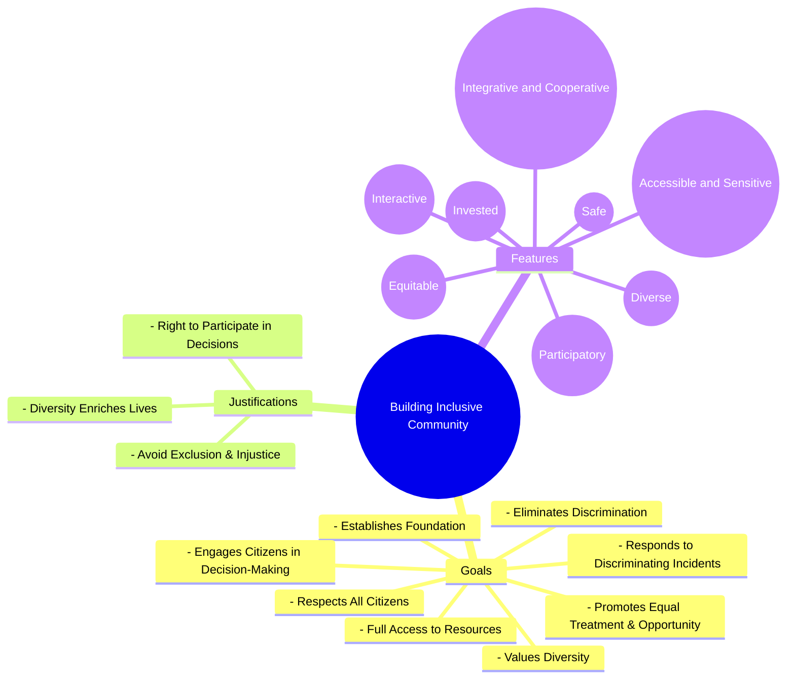
```text
// Scenario 1: Overview of elements for Building Inclusive Community
// Output:
// (A visual mindmap showing "Building Inclusive Community" at the root, branching into "Goals", "Justifications", and "Features".
// "Goals" branches into "Establishes Foundation", "Respects All Citizens", "Full Access to Resources", "Promotes Equal Treatment & Opportunity", "Eliminates Discrimination", "Engages Citizens in Decision-Making", "Values Diversity", "Responds to Discriminating Incidents".
// "Justifications" branches into "Avoid Exclusion & Injustice", "Right to Participate in Decisions", "Diversity Enriches Lives".
// "Features" branches into "Integrative and Cooperative", "Interactive", "Invested", "Diverse", "Equitable", "Accessible and Sensitive", "Participatory", "Safe".)
```
*Note: This `mindmap` illustrates the various goals, justifications, and features associated with building an inclusive community.*

## Context & Framework
#### Where Does it Live? (The Map)
The concept of "Building Inclusive Community" maps directly onto the tangible actions and ongoing efforts within neighborhoods, cities, and national contexts. It exists not just in policy documents, but in the everyday interactions, public spaces, community initiatives, and decision-making structures that shape collective life. This process is fundamentally tied to the principles of social justice and equity, ensuring that the fabric of society is woven with threads of respect and opportunity for all.

## The Mastery Deep Dive
#### Who are the Neighbors?
Building an inclusive community is deeply interconnected with several neighboring concepts. It operationalizes the core values of [[Definition_of_Inclusive_Culture]] such as fairness and representation, by putting them into practice at a community level. It relies on effective [[Leadership_for_Inclusive_Culture]] to champion these values and drive change. Furthermore, the success of building such a community is measured by the realization of its [[Characteristics_of_Inclusive_Community]], such as being integrative, interactive, and participatory. It ultimately aims to embed [[Inclusive_Values_in_Cultural_Norms]] within the very fabric of local life.

#### The "Wikipedia One-Liner"
Building an inclusive community is the continuous effort to create a society that empowers and promotes the social, economic, and political inclusion of all individuals, irrespective of age, sex, disability, race, ethnicity, origin, religion, economic, or other status, thereby leaving no one behind. This involves establishing foundations of respect, ensuring access to resources, eliminating discrimination, fostering civic engagement, valuing diversity, and responding swiftly to discriminatory incidents.

## Constraints & Limitations
#### Spot the Impostor (Don't be Fooled)
A community claiming to be inclusive but failing to engage all its citizens in decision-making processes, particularly those from marginalized groups, is an "impostor." True inclusion requires active participation, not just passive provision of services. If decisions affecting the community are made by a select few, even with good intentions, it undermines the principle that "all people have the right to be part of decisions that affect their lives." Similarly, valuing diversity superficially without actively responding to discriminatory incidents also falls short of building a truly inclusive community.

## Significance & Application
Building inclusive communities is crucial for societal stability, economic prosperity, and human rights. In urban planning, it informs decisions about accessible infrastructure and public spaces. In social policy, it drives initiatives for equitable housing, employment, and healthcare. For grassroots organizations, it provides a framework for advocacy and community development. This concept ensures that society's progress benefits everyone, preventing marginalization and fostering a sense of collective ownership and well-being.

## The Worked Example
This lecture slides focus on definitions and conceptual understanding. A worked example here would be a detailed case study illustrating the steps involved in building an inclusive community.

**Scenario:** The city of Harmonyville decides to launch a "Community for All" initiative to address disparities and foster greater inclusion.

**Step 1: Establishing Foundational Principles**
The city council passes a resolution affirming respect for all citizens and committing to equal treatment and opportunity, making this the cornerstone of the initiative. They launch public awareness campaigns about the importance of diversity and inclusion. This establishes a "foundation that respects all citizens, gives them full access to resources, and promotes equal treatment and opportunity," aligning with the first goal of `Building_Inclusive_Community`.

**Step 2: Eliminating Discrimination and Fostering Participation**
Harmonyville implements a new ombudsman office dedicated to investigating and quickly responding to incidents of discrimination, whether based on race, disability, or other factors. Simultaneously, they establish community forums and online platforms where all residents can voice concerns and contribute to policy-making, ensuring that decisions affecting their lives are truly participatory. This directly addresses the goals of "Works to eliminate all forms of discrimination" and "Engages all its citizens in decision-making processes that affect their lives."

**Step 3: Actively Valuing Diversity**
The city earmarks funds for cultural exchange programs, supports local businesses owned by marginalized groups, and integrates diverse perspectives into public art and historical narratives. They actively promote the unique contributions of all cultural groups residing in Harmonyville. This fulfills the objective to "Values diversity" and actively promotes the understanding that "Diversity enriches our lives, so it is worthwhile to value our community's diversity," a key justification for building inclusive communities.

**Step 4: Demonstrating Inclusive Leadership Behaviors**
The mayor and city council members undergo training on inclusive leadership, focusing on `Empowerment_of_Inclusive_Leaders` and `Accountability_of_Inclusive_Leaders`. They publicly commit to fostering an environment where all residents feel safe and heard, and actively promote `Courage_of_Inclusive_Leaders` by challenging existing norms that might perpetuate exclusion. This reinforces the features of an inclusive community, guided by `Leadership_for_Inclusive_Culture`.

By following these steps, Harmonyville actively constructs a community that not only acknowledges but champions inclusivity, ensuring that no resident is left behind.

## The Proving Ground
*Test your mastery. Cover the solutions below to test yourself first.*

#### Level 1: The Sanity Check (Verification)
**The Fact Check:** What are two reasons why building an inclusive community is considered important?
> **Solution:** Two reasons are that acts of exclusion and injustice based on group identity should not be allowed to occur/continue, and all people have the right to be part of decisions that affect their lives.

#### Level 2: The Crucible (Mastery & Edge Cases)
**The Impostor:** A newly developed urban area, "Prosperity Heights," is lauded for its beautiful parks, modern infrastructure, and high standard of living. The developers claim it's an "inclusive community" because it has diverse residents (based on visible demographics). However, new community association rules heavily favor homeowners in decision-making, effectively marginalizing renters. Additionally, despite the diverse population, there are no specific programs or initiatives to address the unique needs of different cultural or socio-economic groups, and complaints of subtle discrimination are dismissed. Analyze why Prosperity Heights, despite its claims, fails to fully embody an inclusive community, referencing specific features and justifications.
> **Solution:** Prosperity Heights is an "impostor" of an inclusive community for several reasons. Firstly, by favoring homeowners in decision-making and marginalizing renters, it fails to "Engage all its citizens in decision-making processes that affect their lives," violating a core goal. This also contradicts the justification that "All people have the right to be part of decisions that affect their lives and the groups they belong to." Secondly, despite claiming diversity, the lack of specific programs for unique cultural or socio-economic needs, and the dismissal of discrimination complaints, indicate a failure to truly "Value diversity" and "Respond quickly to racist and other discriminating incidents." It therefore lacks key `Characteristics_of_Inclusive_Community` such as being truly "Equitable," "Accessible and Sensitive," and "Participatory." A truly inclusive community goes beyond mere demographic presence; it actively works to eliminate discrimination, ensures equitable access, and fosters genuine participation for *all* its members.

## Key Takeaways
*   Building an inclusive community is an active and continuous process focused on respect, equitable access, and full participation for all citizens.
*   Key justifications include preventing injustice, upholding the right to participate in decisions, and valuing diversity for societal enrichment.
*   Inclusive communities are characterized by being integrative, interactive, invested, diverse, equitable, accessible, sensitive, participatory, and safe.

## Knowledge Graph Connections
| Concept                               | Connection / Relationship                                                          |
| :
------------------------------------ | :
--------------------------------------------------------------------------------- |
| [[Characteristics_of_Inclusive_Community]] | Are the defining attributes that an inclusive community strives to embody.        |
| [[Leadership_for_Inclusive_Culture]]  | Is essential for guiding and sustaining the efforts to build an inclusive community. |
| [[Inclusive_Values_in_Cultural_Norms]] | Form the ethical foundation upon which an inclusive community is built.            |
| [[Definition_of_Inclusive_Culture]]   | Building an inclusive community is the practical manifestation of an inclusive culture. |
---

---

## Definition Of Inclusive Culture


## Definition
Before proceeding, ensure you master Understanding_Disability_And_Vulnerability and Concept_Of_Inclusion because inclusive culture builds upon the foundational understanding of disability and the core principles of inclusion. Inclusive culture is a dynamic ecosystem where **diverse individuals are fully integrated and successfully participate** in all facets of society, such as workplaces, schools, and communities. It is not merely about presence but about the active creation of an accommodative environment that fosters belongingness and social networking. Think of it as a well-tended garden where every plant, no matter how different, has the right soil, light, and space to flourish, and its unique beauty contributes to the overall vibrancy of the garden.

## The Mental Model
Imagine a large, bustling city square. The "Inclusive Culture" of this square means that not only are there people from all walks of life present (diversity), but the square itself is designed and operates in a way that *actively encourages* everyone to participate. This includes accessible paths for wheelchairs, clear signage in multiple languages, benches for resting, and events that cater to various interests and age groups. It's about ensuring the city square's social behavior and customs make everyone feel welcome and able to engage, just as a librarian manages books for all patrons.

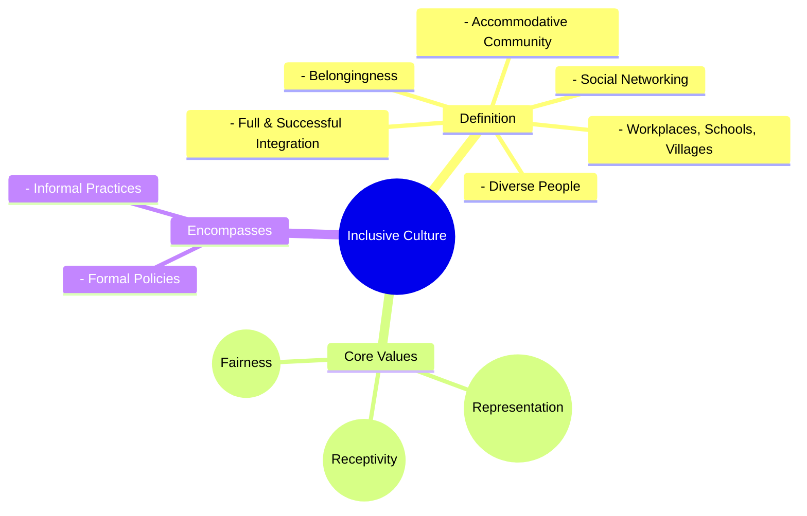
```text
// Scenario 1: Basic understanding of Inclusive Culture components
// Output:
// (A visual mindmap showing "Inclusive Culture" at the root, branching into "Definition", "Core Values", and "Encompasses".
// "Definition" branches into "Full & Successful Integration", "Diverse People", "Workplaces, Schools, Villages", "Accommodative Community", "Belongingness", "Social Networking".
// "Core Values" branches into "Representation", "Receptivity", "Fairness".
// "Encompasses" branches into "Formal Policies", "Informal Practices".)
```
*Note: This `mindmap` visualizes the multifaceted aspects and core components that define an inclusive culture.*

## Context & Framework
#### Where Does it Live? (The Map)
Inclusive culture resides within the shared consciousness and observable behaviors of a collective group—be it a family, an organization, or an entire society. It is the unspoken agreement, the visible actions, and the underlying values that dictate how diversity is not just acknowledged but actively embraced and leveraged. This culture manifests in policies, leadership styles, communication patterns, and even the physical design of spaces.

## The Mastery Deep Dive
#### Who are the Neighbors?
Inclusive culture is intricately linked to several "neighboring" concepts. It is the practical application of the Concept_Of_Inclusion, translating abstract principles into concrete actions. It relies on the presence of [[Representation_in_Inclusive_Culture]], ensuring diverse voices are heard, and requires [[Receptivity_in_Inclusive_Culture]]—an open-mindedness to differences. Furthermore, its foundation is built on [[Fairness_in_Inclusive_Culture]], guaranteeing equitable access and opportunities for all. Without these interconnected elements, an inclusive culture cannot truly flourish.

#### The "Wikipedia One-Liner"
Formally, inclusive culture is defined as "the ideas, customs, and social behavior of a particular people or society" that proactively accommodate and integrate diverse individuals, ensuring their belongingness, participation, and social networking within that community or institution. This involves both explicit policies and implicit practices designed to respect differences and provide equitable access to resources and decision-making processes.

## Constraints & Limitations
#### Spot the Impostor (Don't be Fooled)
A common misconception is mistaking superficial diversity for an inclusive culture. An organization might have diverse employees (representation), but if decision-making processes remain exclusive, communication styles are not adapted, or underlying biases persist, it lacks genuine receptivity and fairness. True inclusive culture goes beyond demographics; it requires continuous effort to dismantle barriers, challenge norms, and adapt practices to ensure meaningful participation for all. A mere head count of diverse individuals is an "impostor" for a truly inclusive culture.

## Significance & Application
Inclusive culture is vital for societal harmony and organizational effectiveness. Academically, it is a key focus in sociology, education, and organizational studies, informing theories of social justice and equity. Practically, it leads to more innovative workplaces, richer educational experiences, and more resilient communities. By fostering an environment where every voice is heard and valued, inclusive cultures drive progress and solve complex problems more effectively.

## The Worked Example
This lecture slides focus on definitions and conceptual understanding. A worked example here would be a detailed case study illustrating the principles of inclusive culture in action.

**Scenario:** A local community center decides to revamp its programs and facilities to be truly inclusive.

**Step 1: Assessing Current Culture & Needs (Representation & Receptivity)**
The center first forms a diverse committee, including people with disabilities, seniors, single parents, and recent immigrants. They conduct surveys and focus groups, actively listening to feedback on barriers to participation, such as inaccessible entrances, inconvenient program times, or lack of translated materials. This directly addresses `Representation_in_Inclusive_Culture` by including diverse voices in the planning process and `Receptivity_in_Inclusive_Culture` by actively seeking and respecting differences in needs and preferences.

**Step 2: Implementing Universal Design Principles (Dimensions of Inclusive Culture)**
Based on feedback, the center redesigns its entrance with a ramp alongside stairs, installs automatic doors, and ensures all restrooms are gender-neutral and accessible. Program schedules are diversified to accommodate working parents and varying cultural holidays. This demonstrates the application of `Universal_Design` as a key dimension of inclusive culture, ensuring the physical environment is organically accessible without special modification.

**Step 3: Ensuring Fairness in Programs (Fairness & Leadership)**
New program registration processes are simplified, offering online, phone, and in-person options, and providing financial assistance for low-income families. Staff receive training on unconscious bias and cultural competence. The center's director actively models inclusive behaviors, holding staff accountable for equitable treatment. This directly addresses `Fairness_in_Inclusive_Culture` by removing barriers to access and promoting equitable opportunities, reinforced by `Leadership_for_Inclusive_Culture`.

**Step 4: Continuous Evaluation & Adaptation (Building Inclusive Community)**
The center establishes an ongoing feedback mechanism and regularly reviews participation rates across different demographics. They celebrate diverse cultural events and integrate indigenous knowledge into specific workshops. If new barriers are identified, the center quickly adapts its practices. This shows a commitment to `Building_Inclusive_Community` by valuing diversity and responding quickly to ensure full engagement and accessibility, making the community center a truly inclusive space.

## The Proving Ground
*Test your mastery. Cover the solutions below to test yourself first.*

#### Level 1: The Sanity Check (Verification)
**The Fact Check:** What are the three core values that an inclusive culture encompasses, as explicitly mentioned in the source material?
> **Solution:** Representation, Receptivity, and Fairness.

#### Level 2: The Crucible (Mastery & Edge Cases)
**The Impostor:** A newly opened private club advertises itself as having "exclusive membership for successful individuals" and a "very diverse membership" in terms of professions and backgrounds. However, it implicitly restricts access based on high membership fees and a lengthy vetting process that often screens out individuals from marginalized communities. Does this club genuinely embody an "inclusive culture"? Explain why or why not, referencing the key aspects of inclusive culture.
> **Solution:** No, the club does not genuinely embody an inclusive culture. While it claims "diverse membership," its restrictive access based on high fees and an exclusionary vetting process directly violates the core value of [[Fairness_in_Inclusive_Culture]] by denying equitable access to resources and opportunities. It also fails in [[Representation_in_Inclusive_Culture]] if it systematically screens out marginalized communities, and lacks true [[Receptivity_in_Inclusive_Culture]] if its customs and social behavior (e.g., vetting process) do not respect differences and actively include a wide range of individuals. An inclusive culture involves the *full and successful integration* of diverse people, not just a superficial headcount within an exclusive, high-cost framework. This scenario illustrates a "false friend" or an "impostor" of inclusion because the underlying structures and practices contradict the stated value of diversity.

## Key Takeaways
*   Inclusive culture is about the full and successful integration of diverse people, fostered by accommodative communities that ensure belongingness and social networking.
*   Its core values are representation (presence across leadership), receptivity (respect for differences), and fairness (equitable access to resources and decision-making).
*   Genuine inclusive culture goes beyond superficial diversity, requiring continuous effort in formal policies and informal practices to dismantle barriers and ensure meaningful participation for all.

## Knowledge Graph Connections
| Concept                         | Connection / Relationship                                                          |
| :
------------------------------ | :
--------------------------------------------------------------------------------- |
| [[Representation_in_Inclusive_Culture]] | Is a core value ensuring diverse presence in an inclusive culture.                 |
| [[Receptivity_in_Inclusive_Culture]]    | Is a core value promoting respect for differences within an inclusive culture.     |
| [[Fairness_in_Inclusive_Culture]]       | Is a core value guaranteeing equitable access and opportunities in an inclusive culture. |
| [[Dimensions_of_Inclusive_Culture]]     | Are the structural elements that define and enable an inclusive culture.           |
| [[Building_Inclusive_Community]]        | Describes how an inclusive culture is actively established and maintained in practice. |
---

---

## Dimensions Of Inclusive Culture


## Definition
Before proceeding, ensure you master [[Definition_of_Inclusive_Culture]] and Concept_Of_Inclusion because understanding the dimensions of inclusive culture requires a clear grasp of what inclusion means and how it is broadly defined. The dimensions of inclusive culture refer to the **fundamental elements or pillars that collectively contribute to its formation and sustenance**. These dimensions move beyond theoretical definitions to outline the practical areas where inclusivity must be actively built and maintained. Think of it like building a house: you need a strong foundation (the definition), but then you need specific walls, a roof, and doors (the dimensions) to make it functional and livable for everyone.

## The Mental Model
Imagine a company striving to be truly inclusive. The "Dimensions of Inclusive Culture" are like the different departments or strategic initiatives they must focus on. One department handles making sure their office buildings are physically accessible (Universal Design). Another focuses on how they hire and promote people (Recruitment, Training, and Advancement). A third ensures that everyone in the company has the tools and adjustments they need to do their best work (Workplace Accommodations and Accessibility). All these "dimensions" work together to create an inclusive environment.

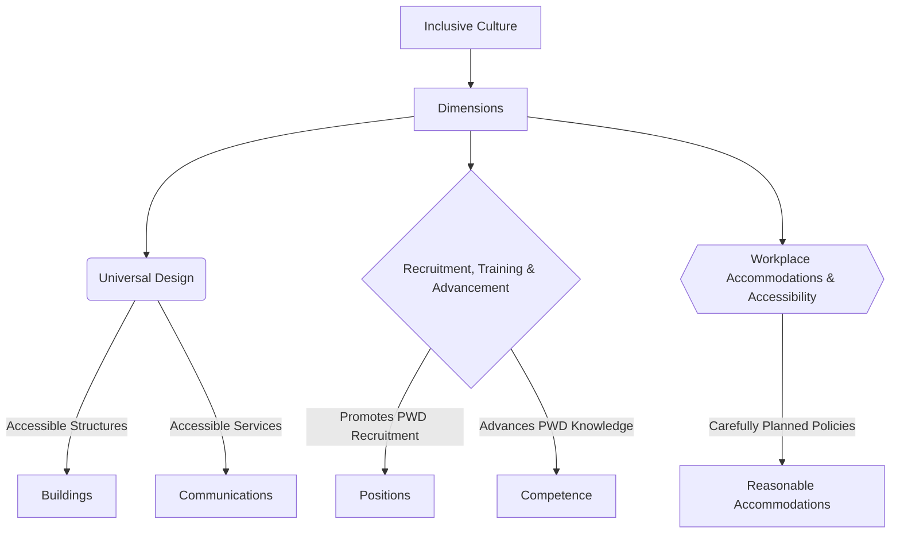
```text
// Scenario 1: Overview of Inclusive Culture Dimensions
// Output:
// (A flowchart showing "Inclusive Culture" leading to "Dimensions", which then branches into "Universal Design", "Recruitment, Training & Advancement", and "Workplace Accommodations & Accessibility".
// "Universal Design" further branches into "Accessible Structures" (leading to "Buildings") and "Accessible Services" (leading to "Communications").
// "Recruitment, Training & Advancement" branches into "Promotes PWD Recruitment" (leading to "Positions") and "Advances PWD Knowledge" (leading to "Competence").
// "Workplace Accommodations & Accessibility" branches into "Carefully Planned Policies" (leading to "Reasonable Accommodations").)
```
*Note: This `graph TD` illustrates the three primary dimensions of an inclusive culture and their key components.*

## Context & Framework
#### The Family Tree
The dimensions of inclusive culture form a hierarchical structure, where the overarching concept of inclusive culture branches into specific, actionable areas. This structure helps organizations and communities systematically approach inclusivity, ensuring that no critical aspect is overlooked. Each dimension supports the others, creating a robust framework for fostering belongingness and equity.

## The Mastery Deep Dive
#### The Cheat Code: How to Remember This
To remember the three dimensions of inclusive culture, think of the acronym **"URA"**:
*   **U**niversal Design: Designing things from the start to be accessible for everyone.
*   **R**ecruitment, Training, and Advancement: Ensuring equitable opportunities for professional growth.
*   **A**ccommodations and Accessibility (Workplace): Providing necessary adjustments for meaningful participation.
This mnemonic helps to quickly recall the broad categories of action required to build an inclusive environment.

#### The "Wikipedia One-Liner"
The dimensions of inclusive culture are defined as: **Universal Design**, which focuses on creating environments and resources organically accessible to all; **Recruitment, Training, and Advancement Opportunities**, promoting the professional growth of persons with disabilities; and **Workplace Accommodations and Accessibility**, ensuring policies and practices facilitate meaningful inclusion. These three elements are integral to the full and successful integration of diverse individuals within society.

## Constraints & Limitations
#### Spot the Impostor (Don't be Fooled)
A common pitfall is to focus on only one dimension while neglecting the others, creating an "impostor" of true inclusivity. For instance, a company might implement a stunning Universal Design in its new office (e.g., ramps, wide doors) but then fail to actively recruit persons with disabilities or provide necessary workplace accommodations. This selective application creates an environment that *looks* inclusive but falls short in practice, as it addresses only a single aspect of the multi-dimensional challenge. All three dimensions must be addressed comprehensively for genuine inclusion.

## Significance & Application
Understanding the dimensions of inclusive culture provides a roadmap for practical implementation. In education, it guides curriculum development and facility design. In corporate settings, it shapes HR policies and workplace infrastructure. For urban planners, it influences public space design. By recognizing and addressing each dimension, societies can move beyond symbolic gestures to create environments where inclusion is not an afterthought but an inherent characteristic.

## The Worked Example
This lecture slides focus on definitions and conceptual understanding. A worked example here would be a detailed case study illustrating the implementation of these dimensions in a real-world setting.

**Scenario:** A large tech company, "InnovateCo," aims to become a leader in inclusive workplace culture. They decide to tackle all three dimensions systematically.

**Step 1: Implementing Universal Design for New Infrastructure**
InnovateCo is building a new headquarters. They consult with accessibility experts to ensure the building's blueprint incorporates [[Universal_Design]] principles from the outset. This includes not just ramps and automatic doors, but also height-adjustable workstations, tactile paving for navigation, clear visual and auditory alerts for emergencies, and diverse seating options in communal areas. The goal is that the default design works for the widest possible range of users without needing retrofitting.

**Step 2: Reforming Recruitment, Training, and Advancement Protocols**
Next, InnovateCo revamps its HR processes to explicitly promote [[Recruitment_Training_and_Advancement]] for Persons With Disabilities (PWDs). They partner with disability employment agencies, offer internships specifically for PWDs, and ensure job descriptions are free of unintentional biases. Internal training programs are adapted to be accessible, and mentorship programs are established to support PWDs in advancing their professional knowledge and competence to leadership roles.

**Step 3: Enhancing Workplace Accommodations and Accessibility**
Finally, InnovateCo develops robust policies for [[Workplace_Accommodations_and_Accessibility]]. They establish a dedicated fund for reasonable accommodations, ranging from specialized software and assistive devices to flexible work schedules and quiet zones. An "accessibility task force" is created to review existing practices and proactively identify areas for improvement. This ensures that current employees with disabilities have the necessary support to perform effectively and thrive.

By addressing all three dimensions concurrently, InnovateCo creates a comprehensive and genuinely inclusive workplace culture, rather than just isolated initiatives.

## The Proving Ground
*Test your mastery. Cover the solutions below to test yourself first.*

#### Level 1: The Sanity Check (Verification)
**The Fact Check:** What is the primary focus of "Universal Design" as a dimension of inclusive culture?
> **Solution:** Universal design refers to the construction of structures, spaces, services, communications, and resources that are organically accessible to a range of people with and without disabilities, without further need for modification or accommodation.

#### Level 2: The Crucible (Mastery & Edge Cases)
**The Impostor:** A community initiative focuses heavily on providing accessible transportation (e.g., wheelchair-friendly buses, clear schedules) for people with disabilities to attend local events. While commendable, a critique is raised that the *events themselves* are often held in buildings with narrow doorways, lack sign language interpreters, and involve activities that require high physical stamina. Which dimension of inclusive culture is being adequately addressed, and which is being neglected, potentially creating an "impostor" of full inclusivity?
> **Solution:** The initiative is adequately addressing the "Workplace Accommodations and Accessibility" dimension by focusing on accessible transportation, which helps with the practical provision of services. However, it is neglecting the "Universal Design" dimension regarding the event venues and activities themselves. By having narrow doorways, no interpreters, and high-stamina activities, the events are not "organically accessible to a range of people with and without disabilities," thus requiring further modification or creating barriers. This creates an "impostor" of full inclusivity because while access *to* the event is facilitated, inclusion *within* the event is compromised due to a lack of universally designed spaces and activities.

## Key Takeaways
*   Inclusive culture is built upon three primary dimensions: Universal Design, Recruitment/Training/Advancement, and Workplace Accommodations/Accessibility.
*   Universal Design focuses on proactive accessibility in structures and services, eliminating the need for later modifications.
*   Recruitment, training, and advancement ensure equitable professional growth for persons with disabilities, while workplace accommodations provide necessary adjustments for participation.

## Knowledge Graph Connections
| Concept                                | Connection / Relationship                                                          |
| :
------------------------------------- | :
--------------------------------------------------------------------------------- |
| [[Definition_of_Inclusive_Culture]]    | The dimensions provide the practical framework for realizing an inclusive culture. |
| [[Universal_Design]]                   | Is one of the three core dimensions ensuring organic accessibility.                |
| [[Recruitment_Training_and_Advancement]] | Is a dimension focused on equitable career opportunities for PWDs.                 |
| [[Workplace_Accommodations_and_Accessibility]] | Is a dimension ensuring supportive environments for people with disabilities.      |
---

---

## Indigenous Inclusive Values And Practices


## Definition
Before proceeding, ensure you master [[Inclusive_Values_in_Cultural_Norms]] and Concept_Of_Inclusion because understanding indigenous inclusive values and practices requires a background in how inclusive values integrate into cultural norms generally, and a clear grasp of the core concept of inclusion. Indigenous inclusive values and practices refer to the **customs, norms, and traditional ways of learning developed by indigenous societies over generations, which intrinsically promote collective well-being, respect for diversity (including human and ecological), and community-centric approaches to knowledge and participation**. Incorporating these into educational practices holds significant potential to benefit all learners, fostering a more holistic and culturally sensitive approach to inclusion. Think of it as a deep-rooted tree whose traditional wisdom nourishes the entire forest, offering unique insights into harmonious coexistence.

## The Mental Model
Imagine a wise elder sharing stories and lessons around a campfire. "Indigenous Inclusive Values and Practices" are like the ways this elder teaches: not just through words, but through respect for nature, listening to everyone, sharing resources, and learning by doing. It's about how the community has always learned and lived together in a way that includes everyone and respects the earth. Incorporating this into a modern school is like bringing the wisdom of that campfire circle into the classroom, enriching everyone's learning journey.

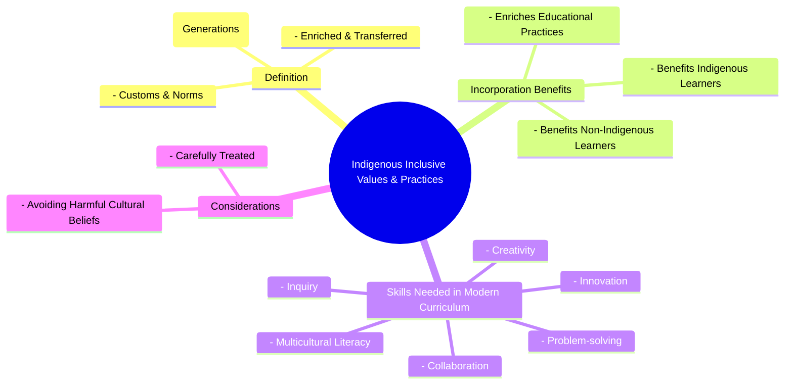
```text
// Scenario 1: Overview of Indigenous Inclusive Values and Practices
// Output:
// (A visual mindmap showing "Indigenous Inclusive Values & Practices" at the root, branching into "Definition", "Incorporation Benefits", "Skills Needed in Modern Curriculum", and "Considerations".
// "Definition" branches into "Customs & Norms", "Developed Culturally (Generations)", "Enriched & Transferred".
// "Incorporation Benefits" branches into "Benefits Indigenous Learners", "Benefits Non-Indigenous Learners", "Enriches Educational Practices".
// "Skills Needed in Modern Curriculum" branches into "Collaboration", "Creativity", "Innovation", "Problem-solving", "Inquiry", "Multicultural Literacy".
// "Considerations" branches into "Carefully Treated", "Avoiding Harmful Cultural Beliefs".)
```
*Note: This `mindmap` illustrates the definition, benefits of incorporation, and considerations for indigenous inclusive values and practices.*

## Context & Framework
#### Where Does it Live? (The Map)
Indigenous inclusive values and practices are deeply embedded within the historical narratives, traditional governance structures, spiritual beliefs, and educational methodologies of indigenous communities worldwide. They represent a wealth of knowledge developed in specific ecological and social contexts. Mapping their "location" means acknowledging the diverse global tapestry of indigenous cultures and understanding that these values are living, evolving systems of knowledge. Their integration into broader systems is a process of respectful cross-cultural exchange and learning.

## The Mastery Deep Dive
#### Who are the Neighbors?
Indigenous inclusive values and practices are closely related to Multicultural_Literacy (a skill needed in modern curriculum), which promotes understanding and appreciation of diverse cultures. They enrich the broader framework of [[Inclusive_Values_in_Cultural_Norms]] by offering unique perspectives on community, sustainability, and interconnectedness. Furthermore, their incorporation directly impacts Educational_Practices, aligning with the goals of creating curricula that are relevant and beneficial for all learners, both indigenous and non-indigenous. The principles of Collaboration_In_Modern_Curriculum and Problem_Solving_In_Modern_Curriculum (as critical skills) are often inherently present in indigenous learning approaches.

#### The "Wikipedia One-Liner"
Indigenous inclusive values and practices are the intergenerational customs and norms of indigenous societies that inherently foster comprehensive inclusion through community-centric learning, respect for all life, and sustainable coexistence. Their integration into contemporary educational practices enriches curricula by cultivating essential skills such as collaboration, creativity, and multicultural literacy, benefiting both indigenous and non-indigenous learners while carefully navigating potentially harmful traditional beliefs.

## Constraints & Limitations
#### Spot the Impostor (Don't be Fooled)
A significant "impostor" of genuine incorporation of indigenous inclusive values is **tokenism** or superficial integration. Simply adding a single "Native American history month" or a ceremonial land acknowledgment without deeply embedding indigenous pedagogies, knowledge systems, or community involvement into the curriculum is a shallow gesture. True integration requires authentic partnership, critical self-reflection to avoid perpetuating stereotypes, and careful treatment to ensure harmful cultural beliefs are not inadvertently promoted. Without this depth, it risks becoming an "impostor" that appears inclusive but fails to provide meaningful benefit or respect.

## Significance & Application
The significance of indigenous inclusive values and practices lies in their potential to decolonize education, enrich curricula, and foster a more holistic understanding of inclusion. Academically, this area contributes to indigenous studies, intercultural education, and sustainable development. Practically, it guides the development of culturally responsive pedagogies, promotes reconciliation, and equips learners with critical skills for a globalized world, such as Multicultural_Literacy_In_Education and [[Inquiry-Based_Learning]]. It offers alternative paradigms for education and community building that prioritize collective well-being and ecological wisdom.

## The Worked Example
This lecture slides focus on definitions and conceptual understanding. A worked example here would be a detailed case study illustrating the incorporation of indigenous inclusive values and practices in a modern educational setting.

**Scenario:** A national education board decides to overhaul its curriculum to genuinely incorporate indigenous inclusive values and practices, moving beyond token gestures.

**Step 1: Curriculum Development with Indigenous Knowledge Holders**
The board establishes a co-creation committee composed equally of curriculum developers and indigenous knowledge holders from various communities. They work together to identify key indigenous pedagogies (e.g., storytelling, experiential learning, place-based education) and content that aligns with modern learning objectives while preserving cultural integrity. This ensures that indigenous ways of learning are truly integrated, not just appended.

**Step 2: Fostering Skills for Modern Curriculum**
The revised curriculum emphasizes skills like Collaboration_In_Modern_Curriculum through group projects that mirror indigenous community practices, Creativity_In_Modern_Curriculum through artistic expressions tied to cultural narratives, and Problem_Solving_In_Modern_Curriculum by addressing local ecological challenges with traditional solutions. [[Inquiry-Based_Learning]] is encouraged by exploring indigenous perspectives on scientific phenomena. This aligns with the explicit need for these skills in a modern curriculum.

**Step 3: Teacher Training and Resource Development**
Teachers undergo mandatory professional development led by indigenous educators, focusing on culturally responsive teaching methods and understanding the historical and contemporary contexts of indigenous peoples. The board also develops new learning resources, including digital stories, interactive maps of traditional territories, and partnerships with indigenous cultural centers, ensuring accuracy and authenticity.

**Step 4: Continuous Evaluation and Adaptation**
An ongoing process of feedback and evaluation is established with indigenous communities to ensure the curriculum remains relevant, respectful, and effective. Mechanisms are put in place to address any concerns about **avoiding harmful cultural beliefs** and to ensure the practices truly benefit both indigenous and non-indigenous learners.

This comprehensive approach moves beyond superficial inclusion to a deep, respectful integration of indigenous values and practices, enriching the educational experience for all.

## The Proving Ground
*Test your mastery. Cover the solutions below to test yourself first.*

#### Level 1: The Sanity Check (Verification)
**The Fact Check:** According to the source, how do indigenous values originate and how are they maintained?
> **Solution:** Indigenous values are customs and norms of a society developed in the course of past cultural practices, and are enriched and transferred from generation to generation.

#### Level 2: The Crucible (Mastery & Edge Cases)
**The Impostor:** A primary school implements an "Indigenous Story Time" once a month where volunteers read translated traditional stories. The school proudly states this is how they are incorporating indigenous inclusive values into their curriculum. Analyze why this approach, while well-intentioned, is an "impostor" for genuine incorporation of indigenous inclusive values and practices, referencing specific aspects of the definition and benefits.
> **Solution:** This approach is an "impostor" for genuine incorporation because it is superficial and lacks depth. Firstly, "Indigenous Story Time" primarily benefits non-indigenous learners by exposing them to stories, but it may not fully "benefit both Indigenous and non-Indigenous learners" if indigenous children do not see their broader culture reflected or participate meaningfully in its sharing beyond being passive recipients. Secondly, genuine incorporation involves "Indigenous ways of learning" and a deep integration into "educational practices," not just a singular activity. It fails to cultivate essential skills like Collaboration_In_Modern_Curriculum or Problem_Solving_In_Modern_Curriculum that indigenous pedagogies often emphasize. Without active engagement, curriculum reform, and addressing the need for Multicultural_Literacy_In_Education through deeper practices, it remains a token gesture that misses the transformative potential of truly embedding indigenous inclusive values.

## Key Takeaways
*   Indigenous inclusive values and practices are traditional customs and norms fostering collective well-being, diversity respect, and community-centric learning.
*   Incorporating these into education benefits all learners by enriching practices and cultivating skills like collaboration, creativity, and multicultural literacy.
*   Careful treatment is required to avoid harmful cultural beliefs, ensuring authentic and respectful integration.

## Knowledge Graph Connections
| Concept                               | Connection / Relationship                                                          |
| :
------------------------------------ | :
--------------------------------------------------------------------------------- |
| [[Inclusive_Values_in_Cultural_Norms]] | Indigenous values represent a rich source of specific inclusive values for cultural norms. |
| Concept_Of_Inclusion              | Indigenous practices offer historical and holistic approaches to achieving inclusion. |
| Multicultural_Literacy_In_Education | Incorporating indigenous practices directly contributes to developing multicultural literacy. |
| Collaboration_In_Modern_Curriculum | Indigenous learning often emphasizes collaborative approaches, directly enriching modern curriculum skills. |
---

---

## Characteristics Of Inclusive Community


## Definition
Before proceeding, ensure you master [[Building_Inclusive_Community]] and [[Definition_of_Inclusive_Culture]] because understanding the characteristics of an inclusive community provides the specific attributes required for a community to genuinely embody inclusion. Characteristics of an inclusive community refer to the **distinguishing qualities and inherent features that define a collective wherein all individuals feel valued, respected, and have opportunities for full participation and belonging**. These qualities include being integrative and cooperative, interactive, invested, diverse, equitable, accessible and sensitive, participatory, and safe. They represent the observable traits and underlying principles that make a community genuinely welcoming and supportive of everyone. Think of it like a puzzle where every piece, regardless of its shape or color, fits together perfectly, contributing to a vibrant and complete picture, and the overall design ensures no piece is left out.

## The Mental Model
Imagine a thriving, bustling town square. The "Characteristics of an Inclusive Community" are like the vital signs of its health. If the square is **Integrative and Cooperative**, people work together. If it's **Interactive**, people talk and engage. If it's **Invested**, people care about it. If it's **Diverse**, many different types of people are there. If it's **Equitable**, everyone has fair access. If it's **Accessible and Sensitive**, everyone can get around and feel understood. If it's **Participatory**, everyone has a say. And if it's **Safe**, everyone feels secure. These are the qualities that make the town square truly vibrant and welcoming to all.

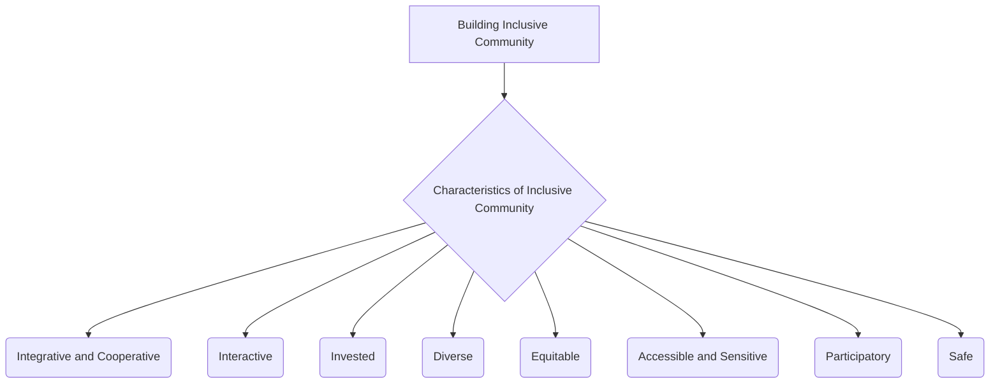
```text
// Scenario 1: Overview of the Characteristics of an Inclusive Community
// Output:
// (A flowchart showing "Building Inclusive Community" leading to "Characteristics of Inclusive Community", which then branches into "Integrative and Cooperative", "Interactive", "Invested", "Diverse", "Equitable", "Accessible and Sensitive", "Participatory", "Safe".)
```
*Note: This `graph TD` illustrates the various distinguishing characteristics of an inclusive community.*

## Context & Framework
#### The Family Tree
The Characteristics of Inclusive Community are a direct branch extending from the foundational concept of [[Building_Inclusive_Community]]. They provide the specific, observable attributes that confirm whether a community is indeed inclusive. These characteristics are also deeply intertwined with the overarching [[Frameworks_of_Inclusive_Values]] (such as Equality, Rights, Respect for Diversity) and are often influenced by the effective application of the [[Seven_Pillars_of_Inclusion]]. They represent the tangible outcomes of a successful commitment to inclusion at a societal level.

## The Mastery Deep Dive
#### The Cheat Code: How to Remember This
To remember the characteristics, think of the acronym **"III DEAPS"**:
*   **I**ntegrative and Cooperative: Working together, bringing people in.
*   **I**nteractive: Engaging in dialogue and shared activities.
*   **I**nvested: Caring and committing to the community.
*   **D**iverse: Comprising a wide range of individuals.
*   **E**quitable: Ensuring fair treatment and access.
*   **A**ccessible and Sensitive: Physical and social environments remove barriers.
*   **P**articipatory: Everyone has a say and can contribute.
*   **S**afe: Free from harm and discrimination.

This mnemonic helps to recall the multifaceted nature of a truly inclusive community.

#### The "Wikipedia One-Liner"
Characteristics of an inclusive community are the defining features, such as being integrative and cooperative, interactive, invested, diverse, equitable, accessible and sensitive, participatory, and safe, which collectively ensure that all individuals feel valued, respected, and empowered to participate fully and belong within that collective. These attributes are crucial for assessing and fostering genuine societal inclusion.

## Constraints & Limitations
#### Spot the Impostor (Don't be Fooled)
A common "impostor" of an inclusive community is one that claims to be "Diverse" (e.g., having many different ethnic groups) but lacks other critical characteristics. For instance, a diverse community that is not "Equitable" (unequal access to resources), not "Participatory" (only a few dominant voices in decision-making), or not "Safe" (unaddressed discrimination or hate incidents) is not truly inclusive. Mere demographic diversity, without the accompanying qualities of genuine engagement, fairness, and safety, creates an illusion of inclusion without the substance, making it an "impostor" of a genuinely inclusive community. All characteristics must be present for full integrity.

## Significance & Application
Understanding these characteristics provides a clear blueprint for community development and policy-making aimed at inclusion. Academically, they are central to urban studies, social work, and public administration, guiding research on community cohesion and well-being. Practically, they inform the design of public spaces, the development of social programs, and the evaluation of community initiatives. By striving for these characteristics, communities can foster environments where social capital is maximized, conflicts are constructively resolved, and every resident can thrive, contributing to a richer collective life.

## The Worked Example
This lecture slides focus on definitions and conceptual understanding. A worked example here would be a detailed case study illustrating the development of these characteristics in an inclusive community.

**Scenario:** The town of "Unityville" launches a comprehensive initiative to transform itself into a truly inclusive community, focusing on embodying its defined `Characteristics_of_Inclusive_Community`.

**Step 1: Fostering Integration, Cooperation, and Interaction**
Unityville establishes a "Community Connect" program that pairs new residents with long-term residents for mentorship and cultural exchange, promoting **Integrative and Cooperative** relationships. They organize regular "Town Hall Tuesdays" with open forums and small group discussions, encouraging **Interactive** engagement and dialogue among all citizens.

**Step 2: Cultivating Investment and Valuing Diversity**
The local government allocates a portion of its budget to community-led projects, empowering residents to invest in their shared spaces. Volunteer programs are heavily promoted, fostering collective ownership and demonstrating that citizens are **Invested**. The town actively celebrates its many cultural festivals, showcasing its **Diverse** population through parades, food fairs, and art exhibits, recognizing the richness each culture brings.

**Step 3: Ensuring Equity, Accessibility, and Sensitivity**
Unityville revamps its public transportation system to be fully accessible, including paratransit services, and builds a new community center with `Universal_Design` principles incorporated throughout. Educational programs are launched to raise awareness about various disabilities and cultural nuances, fostering an **Accessible and Sensitive** environment. Policies are reviewed to ensure **Equitable** access to housing, employment, and educational opportunities for all.

**Step 4: Promoting Participation and Ensuring Safety**
A "Youth Voice" council is established, giving younger residents a direct say in town decisions. Online platforms are created for direct feedback on public services, ensuring broad **Participatory** governance. The police department implements community policing strategies and anti-hate crime task forces, ensuring that all residents feel **Safe** and protected from discrimination or violence.

By systematically addressing each of these characteristics, Unityville transforms itself into a vibrant and truly inclusive community where every citizen feels a deep sense of belonging and empowerment.

## The Proving Ground
*Test your mastery. Cover the solutions below to test yourself first.*

#### Level 1: The Sanity Check (Verification)
**The Fact Check:** List at least four distinguishing qualities that define an inclusive community.
> **Solution:** Integrative and cooperative, interactive, invested, diverse, equitable, accessible and sensitive, participatory, and safe (any four).

#### Level 2: The Crucible (Mastery & Edge Cases)
**The Impostor:** A bustling metropolitan district, "Global City," is globally renowned for its immense "Diversity" due to its large international population. It boasts many cultural restaurants and annual festivals. However, many immigrant residents report facing significant language barriers in accessing public services, a lack of culturally sensitive healthcare options, and feeling unrepresented in local governance. Additionally, reported hate incidents targeting minorities are often slow to be addressed by authorities. Analyze why Global City, despite its celebrated diversity, is an "impostor" for a truly inclusive community, referencing specific characteristics.
> **Solution:** Global City, despite its "Diversity," is an "impostor" for a truly inclusive community because it fails to embody several other critical characteristics. The "significant language barriers," lack of "culturally sensitive healthcare options," and feeling "unrepresented in local governance" all indicate a failure to be **Accessible and Sensitive**. The lack of proportional representation in governance also means it's not truly **Participatory**. Furthermore, the slow response to "hate incidents targeting minorities" undermines the characteristic of being **Safe**. While the city has demographic diversity, it lacks the deep integration, equitable access, and responsive support systems necessary for all individuals to feel valued and fully included, thus failing to be genuinely **Integrative and Cooperative** or **Equitable**.

## Key Takeaways
*   Inclusive communities are defined by qualities like being integrative, cooperative, interactive, invested, diverse, equitable, accessible and sensitive, participatory, and safe.
*   These characteristics ensure all individuals feel valued, respected, and have opportunities for full participation and belonging.
*   Mere diversity is not sufficient; an inclusive community must embody all these qualities for genuine inclusion.

## Knowledge Graph Connections
| Concept                               | Connection / Relationship                                                          |
| :
------------------------------------ | :
--------------------------------------------------------------------------------- |
| [[Building_Inclusive_Community]]      | These characteristics are the defining features that contribute to building an inclusive community. |
| [[Frameworks_of_Inclusive_Values]]    | The characteristics are tangible manifestations of underlying inclusive value frameworks like Equality and Respect for Diversity. |
| [[Seven_Pillars_of_Inclusion]]        | The implementation of the Seven Pillars directly contributes to a community exhibiting these characteristics. |
| [[Definition_of_Inclusive_Culture]]   | These characteristics exemplify what an inclusive culture looks like in practice at a community level. |
---

---

## Fairness In Inclusive Culture


## Definition
Before proceeding, ensure you master [[Definition_of_Inclusive_Culture]] and Concept_Of_Inclusion because fairness is a core value of an inclusive culture, requiring a clear understanding of what that culture strives to achieve. Fairness in inclusive culture refers to the **principle of equitable access to all resources, opportunities, networks, and decision-making processes for every individual, irrespective of their differences**. It is not about treating everyone identically, but rather about providing what each person needs to participate fully and thrive, addressing historical disadvantages and systemic barriers. Think of it like a race where some runners start with obstacles: fairness means removing those obstacles or giving them a head start, so everyone has a genuine chance to reach the finish line, rather than just starting everyone from the same, unequal position.

## The Mental Model
Imagine a game where everyone needs to reach a treasure. "Fairness" in an inclusive culture means that the rules are set up so that everyone, no matter their abilities or starting point, has a genuine chance to play and win. If someone uses a wheelchair, there are ramps. If someone speaks a different language, there are interpreters. It's about ensuring equal access to the game's resources (clues, tools) and having an equal say in how the game is played, so everyone feels like a valued participant, and no one is excluded due to factors beyond their control.

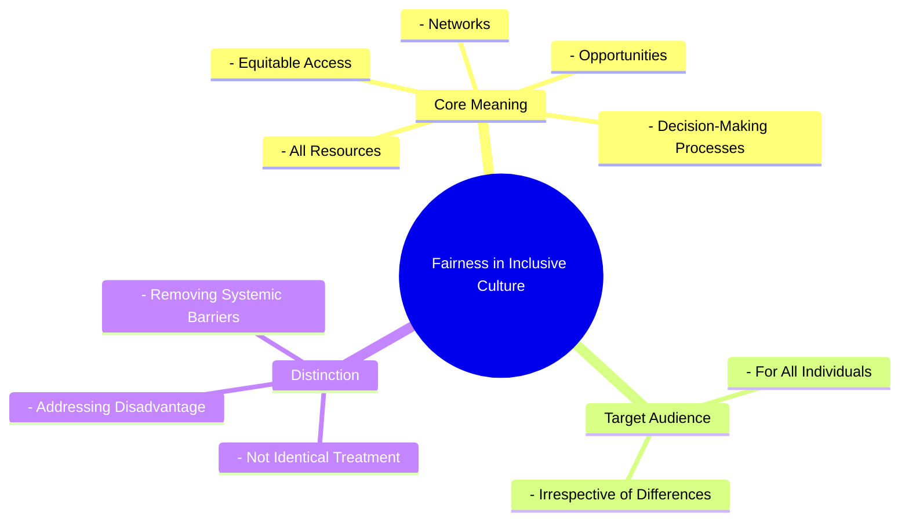
```text
// Scenario 1: Basic understanding of Fairness in Inclusive Culture
// Output:
// (A visual mindmap showing "Fairness in Inclusive Culture" at the root, branching into "Core Meaning", "Target Audience", and "Distinction".
// "Core Meaning" branches into "Equitable Access", "All Resources", "Opportunities", "Networks", "Decision-Making Processes".
// "Target Audience" branches into "For All Individuals", "Irrespective of Differences".
// "Distinction" branches into "Not Identical Treatment", "Addressing Disadvantage", "Removing Systemic Barriers".)
```
*Note: This `mindmap` visualizes the core meaning, target audience, and distinctions of fairness within an inclusive culture.*

## Context & Framework
#### Where Does it Live? (The Map)
Fairness in inclusive culture manifests in the design of public services, the policies of educational institutions, the hiring practices of corporations, and the governance structures of community organizations. It is found in anti-discrimination laws, affirmative action programs, and the allocation of support resources. This concept directly confronts historical and systemic inequalities by insisting on proactive measures to ensure that opportunities are genuinely accessible and equitable for all, rather than perpetuating existing power dynamics.

## The Mastery Deep Dive
#### Who are the Neighbors?
Fairness is a critical neighbor to [[Representation_in_Inclusive_Culture]], as the presence of diverse voices is fundamental to understanding what constitutes equitable access and how to remove barriers. It is also deeply intertwined with [[Receptivity_in_Inclusive_Culture]], as an open-mindedness to different needs is essential for designing truly fair systems. Furthermore, fairness is a cornerstone of [[Building_Inclusive_Community]], ensuring that all citizens have full access to resources and participate equitably in decision-making. Without fairness, the aspirations of an inclusive culture cannot be realized, becoming merely symbolic.

#### The "Wikipedia One-Liner"
Fairness in inclusive culture is the core principle ensuring equitable access to all resources, opportunities, networks, and decision-making processes for every individual, regardless of their differences. This involves actively addressing historical disadvantages and systemic barriers through differentiated support, rather than merely treating everyone identically, thereby fostering genuine participation and belonging.

## Constraints & Limitations
#### Spot the Impostor (Don't be Fooled)
A common "impostor" of true fairness is the principle of **"treating everyone the same."** While seemingly egalitarian, this approach often fails to account for existing systemic disadvantages or diverse needs, thereby perpetuating inequity. For example, if a job application process is identical for all candidates, but some have disabilities that make standard interview formats inaccessible, treating them "the same" is not fair. True fairness requires understanding and accommodating differences to ensure equitable outcomes, often through customized support, rather than a blanket application of uniformity that ignores varied starting points.

## Significance & Application
Fairness is indispensable for achieving social justice, promoting human rights, and building legitimate institutions. Academically, it is a core concept in ethics, law, and political philosophy, exploring theories of justice and equality. Practically, it guides the development of anti-discrimination legislation, informs policies for reasonable accommodation, and influences equitable resource allocation. Upholding fairness builds trust, reduces social stratification, and ensures that everyone has the chance to contribute their full potential to society.

## The Worked Example
This lecture slides focus on definitions and conceptual understanding. A worked example here would be a detailed case study illustrating the implementation of fairness in an inclusive culture.

**Scenario:** A large public university, "Apex University," is committed to upholding `Fairness_in_Inclusive_Culture` in its admissions process, especially for students with diverse backgrounds and needs.

**Step 1: Addressing Systemic Barriers to Access**
Apex University revises its application forms to be fully accessible online and offers alternative formats (e.g., large print, audio). They also remove mandatory standardized test scores for certain programs, recognizing that these tests can create barriers for students from under-resourced schools or those with specific learning disabilities. This directly addresses ensuring "equitable access to all resources" by dismantling systemic barriers that might disadvantage certain groups.

**Step 2: Providing Equitable Opportunities through Differentiated Support**
The university introduces a robust program for "contextualized admissions," where applicants' socio-economic backgrounds, family responsibilities, and unique life challenges are considered alongside academic performance. They also establish a dedicated support office to provide reasonable accommodations during the application and interview stages for students with disabilities, ensuring they have an "equitable opportunity" to showcase their abilities. This reflects the principle that fairness is "not about treating everyone identically, but rather about providing what each person needs."

**Step 3: Ensuring Fair Representation in Decision-Making**
The admissions committee is diversified to include faculty members from various ethnic backgrounds, staff from the disability services office, and alumni who represent a wide range of experiences. This ensures that diverse perspectives inform the "decision-making processes," helping to identify and mitigate unconscious biases that might inadvertently lead to unfair outcomes. The presence of diverse members fosters `Representation_in_Inclusive_Culture`.

**Step 4: Continuous Review and Feedback**
Apex University establishes an anonymous feedback mechanism for applicants and an annual review process for its admissions policies, specifically looking at equity metrics across different demographic groups. If disparities are identified, the policies are re-evaluated and adjusted, demonstrating a commitment to continuous improvement in achieving `Fairness_in_Inclusive_Culture`.

Through these measures, Apex University moves beyond a simplistic "treat everyone the same" approach to genuinely embed fairness into its admissions culture, ensuring that all deserving students have an equitable chance to succeed.

## The Proving Ground
*Test your mastery. Cover the solutions below to test yourself first.*

#### Level 1: The Sanity Check (Verification)
**The Fact Check:** In the context of an inclusive culture, what specific areas should exhibit "equitable access" as part of fairness?
> **Solution:** Equitable access should extend to all resources, opportunities, networks, and decision-making processes.

#### Level 2: The Crucible (Mastery & Edge Cases)
**The Impostor:** A popular online gaming platform implements a new anti-cheat system designed to "treat all players equally" by automatically banning anyone detected using third-party software. While the intention is to ensure fair play, the system, due to a bug, disproportionately flags and bans players using certain legitimate accessibility software designed for gamers with motor impairments. The platform argues it's "fair" because the rule applies to everyone. Analyze why this platform's approach, despite its claims of equality, is an "impostor" for genuine fairness in an inclusive culture, referencing the core definition and distinctions of fairness.
> **Solution:** This platform's approach is an "impostor" for genuine fairness because it fails to provide "equitable access to all resources [the game] and opportunities" for players with motor impairments. While the rule "applies to everyone," this identical treatment overlooks the fact that some players require "legitimate accessibility software" to participate equally. True fairness is "not about treating everyone identically" but about "addressing historical disadvantages and systemic barriers." The buggy anti-cheat system creates a systemic barrier for a specific group, directly contradicting the goal of equitable access. A genuinely fair system would distinguish between malicious third-party software and legitimate accessibility tools, thereby providing what each person needs to participate fully, rather than penalizing those who require accommodations.

## Key Takeaways
*   Fairness in inclusive culture ensures equitable access to resources, opportunities, networks, and decision-making for all individuals.
*   It emphasizes providing what each person needs to thrive, addressing historical disadvantages and systemic barriers.
*   Genuine fairness goes beyond treating everyone identically, often requiring differentiated approaches to ensure equitable outcomes.

## Knowledge Graph Connections
| Concept                         | Connection / Relationship                                                          |
| :
------------------------------ | :
--------------------------------------------------------------------------------- |
| [[Definition_of_Inclusive_Culture]] | Fairness is a foundational core value that defines an inclusive culture.           |
| [[Representation_in_Inclusive_Culture]] | Fairness is achieved through effective representation, ensuring all voices have influence. |
| [[Receptivity_in_Inclusive_Culture]] | A receptive culture is essential for understanding diverse needs to implement fair policies. |
| [[Building_Inclusive_Community]]  | Fairness is a key component in establishing an inclusive community that respects all citizens. |
---

---

## Frameworks Of Inclusive Values


## Definition
Before proceeding, ensure you master [[Inclusive_Values_in_Cultural_Norms]] and Concept_Of_Inclusion because frameworks of inclusive values represent the broader ethical principles that underpin cultural norms, guiding how inclusion is conceptualized and enacted. Frameworks of inclusive values refer to the **comprehensive sets of fundamental ethical principles and moral ideals that guide the development and sustenance of an inclusive society**. These extend beyond operational pillars to encompass overarching concepts such as Equality, Rights, Participation, Community, Respect for Diversity, Sustainability, Non-violence, Trust, Compassion, Honesty, Courage, Joy, Love, Hope/Optimism, and Beauty. They provide a deeper philosophical grounding for why inclusion is important and what it ultimately strives to achieve. Think of them as the constitution or foundational philosophy of a society, outlining the core beliefs that shape all its laws and cultural practices.

## The Mental Model
Imagine a wise old tree with deep roots. The "Frameworks of Inclusive Values" are like these deep roots, providing the fundamental strength and nourishment for the entire tree (society). Values like Equality, Rights, Respect for Diversity, and Trust are the deep, unspoken beliefs that hold everything together and guide how the branches (policies) and leaves (daily interactions) grow. These values are the bedrock, ensuring the tree stands strong and provides shade and fruit for everyone, rather than just a select few.

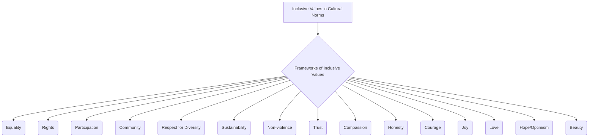
```text
// Scenario 1: Overview of Frameworks of Inclusive Values
// Output:
// (A flowchart showing "Inclusive Values in Cultural Norms" leading to "Frameworks of Inclusive Values", which then branches into "Equality", "Rights", "Participation", "Community", "Respect for Diversity", "Sustainability", "Non-violence", "Trust", "Compassion", "Honesty", "Courage", "Joy", "Love", "Hope/Optimism", "Beauty".)
```
*Note: This `graph TD` illustrates the various values that constitute the frameworks of inclusive values within cultural norms.*

## Context & Framework
#### The Family Tree
Frameworks of inclusive values represent a foundational layer beneath the concept of [[Inclusive_Values_in_Cultural_Norms]]. While the [[Seven_Pillars_of_Inclusion]] offer operational guidelines, these frameworks provide the broader ethical and moral principles that inform both the pillars and the overall cultural approach to inclusion. These values are often expressed in national constitutions, human rights declarations, and ethical codes of conduct, setting the aspirational standards for a just and equitable society.

## The Mastery Deep Dive
#### The Cheat Code: How to Remember This
To remember the extensive list of values, categorize them:
*   **Fundamental Principles:** Equality, Rights, Participation, Community, Respect for Diversity
*   **Societal Well-being:** Sustainability, Non-violence
*   **Interpersonal Virtues:** Trust, Compassion, Honesty, Courage
*   **Emotional & Aspirational:** Joy, Love, Hope/Optimism, Beauty

This categorization helps to organize and recall the diverse range of values that constitute these frameworks.

#### The "Wikipedia One-Liner"
Frameworks of inclusive values encompass fundamental ethical principles such as Equality, Rights, Participation, Respect for Diversity, and Sustainability, alongside virtues like Trust, Compassion, and Courage, which collectively establish the moral and philosophical underpinnings for genuinely inclusive cultural norms and societal structures. These overarching ideals guide the development and implementation of policies and practices aimed at fostering a just and equitable society.

## Constraints & Limitations
#### Spot the Impostor (Don't be Fooled)
A major "impostor" of genuinely upholding inclusive value frameworks is **rhetorical commitment without practical action**. A society might proudly declare its commitment to "Equality" and "Rights," but if systemic discrimination persists in its institutions (e.g., unequal access to justice, education, or employment), or if "Respect for Diversity" is merely preached but not practiced in daily interactions, then these values remain hollow. The gap between proclaimed values and lived reality exposes the impostor. True integration requires consistent, tangible efforts to align all policies, practices, and individual behaviors with these foundational ethical principles, ensuring they are not just words on paper but active forces in cultural norms.

## Significance & Application
Frameworks of inclusive values provide the moral compass for building just and equitable societies. Academically, they are studied in philosophy, political science, sociology, and human rights, forming the theoretical basis for advocating for social change. Practically, they inspire the drafting of human rights charters, guide the development of ethical codes for organizations, and inform educational curricula aimed at fostering civic responsibility and empathy. By articulating these core values, societies set a clear vision for what it means to live together harmoniously and inclusively, transcending mere legal compliance to embed a deeper ethical commitment.

## The Worked Example
This lecture slides focus on definitions and conceptual understanding. A worked example here would be a detailed case study illustrating the integration of frameworks of inclusive values into cultural norms.

**Scenario:** A newly formed international non-profit organization, "Global Unity," aims to base its entire organizational culture and operations on robust `Frameworks_of_Inclusive_Values`.

**Step 1: Defining Core Values and Mission**
Global Unity's founding document explicitly lists its core values, including **Equality**, **Rights**, **Respect for Diversity**, **Sustainability**, and **Compassion**. These values are not just statements but are integrated into the organization's mission to promote global cooperation and support marginalized communities. All employees are trained on these values from their first day, ensuring a shared understanding of the ethical foundation.

**Step 2: Operationalizing Values in Policies and Practices**
Every organizational policy, from hiring and performance reviews to project selection and stakeholder engagement, is vetted against these core values. For instance, their hiring policy explicitly seeks diverse candidates and provides accommodations (upholding `Equality` and `Rights`). Project selection prioritizes initiatives that promote environmental and social `Sustainability` and empower local communities (`Community`, `Participation`). Communication protocols emphasize `Trust` and `Honesty` in all dealings.

**Step 3: Fostering Virtues and Interpersonal Behavior**
Global Unity actively cultivates virtues like `Compassion` and `Courage` among its staff through leadership development programs and conflict resolution training. Employees are encouraged to approach challenges with `Hope/Optimism` and to find `Joy` in collective achievements. Mentorship programs are designed to promote `Love` and mutual support among colleagues, creating a supportive and ethical work environment.

**Step 4: Continuous Ethical Reflection and Accountability**
The organization establishes an ethics committee to regularly review its operations against its stated values and to address any discrepancies or ethical dilemmas. Feedback mechanisms allow staff and beneficiaries to report concerns confidentially, ensuring `Accountability_of_Inclusive_Leaders` and continuous improvement in upholding the values. This demonstrates that these values are living principles, not just static declarations.

By integrating these frameworks of inclusive values into its foundational principles, operational policies, and internal culture, Global Unity establishes itself as an organization deeply committed to genuine inclusion and ethical practice.

## The Proving Ground
*Test your mastery. Cover the solutions below to test yourself first.*

#### Level 1: The Sanity Check (Verification)
**The Fact Check:** Name three of the broader frameworks of inclusive values mentioned in the source material.
> **Solution:** Equality, Rights, and Participation (or any three from the provided list).

#### Level 2: The Crucible (Mastery & Edge Cases)
**The Impostor:** A country's constitution proudly guarantees "Equality" and "Rights" for all its citizens. However, its legal system is notoriously slow and expensive, making effective access to justice impossible for low-income individuals. Furthermore, while "Respect for Diversity" is espoused in public discourse, government media frequently promotes a singular national identity that implicitly marginalizes minority cultures. Analyze why this country, despite its constitutional claims, is an "impostor" for genuinely upholding the full `Frameworks_of_Inclusive_Values`, specifically referencing the listed values.
> **Solution:** This country is an "impostor" for genuinely upholding the full `Frameworks_of_Inclusive_Values` because there's a significant gap between its stated constitutional values and its actual cultural norms and practices. While "Equality" and "Rights" are guaranteed on paper, the expensive and slow legal system effectively denies "equitable access to all resources and opportunities" (a component of fairness, linked to equality and rights), making these rights practically unattainable for low-income citizens. This undermines the value of Rights and Equality. Furthermore, while "Respect for Diversity" is publicly discussed, the government media's promotion of a "singular national identity" actively contradicts the spirit of Respect_For_Diversity by implicitly marginalizing minority cultures. This shows a failure to truly embed these values into cultural norms, exposing the "impostor" nature of its claims. The value of Participation might also be undermined if only certain groups feel empowered to engage with the legal or political system.

## Key Takeaways
*   Frameworks of inclusive values are comprehensive sets of ethical principles (e.g., Equality, Rights, Respect for Diversity, Trust) guiding an inclusive society.
*   They provide a deeper philosophical grounding for inclusion, extending beyond operational pillars to overarching ideals.
*   Genuine upholding requires aligning all policies, practices, and individual behaviors with these foundational principles.

## Knowledge Graph Connections
| Concept                               | Connection / Relationship                                                          |
| :
------------------------------------ | :
--------------------------------------------------------------------------------- |
| [[Inclusive_Values_in_Cultural_Norms]] | These frameworks provide the foundational ethical principles for inclusive cultural norms. |
| [[Seven_Pillars_of_Inclusion]]        | The Seven Pillars are an operational subset, informed by these broader value frameworks. |
| [[Building_Inclusive_Community]]      | Upholding these value frameworks is essential for creating a morally sound inclusive community. |
| [[Definition_of_Inclusive_Culture]]   | These frameworks articulate the aspirational ideals that define an inclusive culture. |
---

---

## Inclusive Values In Cultural Norms


## Definition
Before proceeding, ensure you master [[Building_Inclusive_Community]] and [[Definition_of_Inclusive_Culture]] because understanding inclusive values in cultural norms requires knowledge of how inclusivity is built in a community and what constitutes an inclusive culture. Inclusive values in cultural norms refers to the **embedding of principles that promote equality, respect for diversity, participation, and sustainability into the shared beliefs, customs, and practices of a society**. This goes beyond mere policy to encompass the ethical foundations that guide behavior and interactions, ensuring that inclusion is not just an aspiration but a lived reality within the fabric of a culture. Think of it as the moral compass that directs a community towards a just and equitable future for all its members.

## The Mental Model
Imagine a family deciding on their "house rules." "Inclusive Values in Cultural Norms" are like the core beliefs that underpin these rules: everyone's voice matters, we respect each other's space, and we share responsibilities fairly. These aren't just written down; they become the unspoken ways the family interacts, celebrates, and solves problems. It's the moral code that guides behavior, ensuring that every family member feels a sense of belonging and contributes to the shared household.

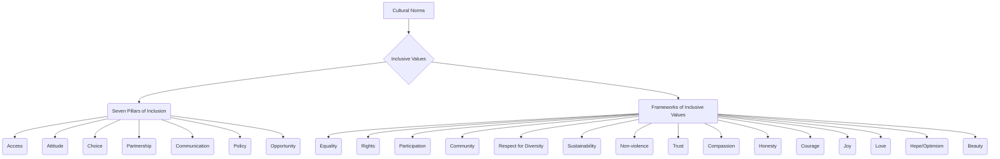
```text
// Scenario 1: Overview of Inclusive Values within Cultural Norms
// Output:
// (A flowchart showing "Cultural Norms" leading to "Inclusive Values", which then branches into "Seven Pillars of Inclusion" and "Frameworks of Inclusive Values".
// "Seven Pillars of Inclusion" branches into "Access", "Attitude", "Choice", "Partnership", "Communication", "Policy", "Opportunity".
// "Frameworks of Inclusive Values" branches into "Equality", "Rights", "Participation", "Community", "Respect for Diversity", "Sustainability", "Non-violence", "Trust", "Compassion", "Honesty", "Courage", "Joy", "Love", "Hope/Optimism", "Beauty".)
```
*Note: This `graph TD` illustrates how inclusive values are structured within cultural norms, categorized into the Seven Pillars and broader frameworks.*

## Context & Framework
#### The Family Tree
The concept of inclusive values in cultural norms forms a hierarchical tree, with the overarching cultural norms as the root. Branching from this are the two major categories: the [[Seven_Pillars_of_Inclusion]] and the broader [[Frameworks_of_Inclusive_Values]]. These pillars and frameworks then further subdivide into specific values such as access, equality, and respect for diversity. This structure helps to systematically understand the different layers and components of value systems that underpin an inclusive culture.

## The Mastery Deep Dive
#### The Cheat Code: How to Remember This
To remember the Seven Pillars of Inclusion, think of the acronym **"AACCPOO"**:
*   **A**ccess: Ensuring everyone can reach resources and opportunities.
*   **A**ttitude: Fostering positive mindsets towards diversity.
*   **C**hoice: Empowering individuals to make their own decisions.
*   **P**artnership: Encouraging collaboration and shared responsibility.
*   **C**ommunication: Promoting clear, accessible, and respectful dialogue.
*   **P**olicy: Establishing rules that support inclusion.
*   **O**pportunity: Providing chances for growth and participation.

This mnemonic provides a simple way to recall the key operational components of inclusive values in action.

#### The "Wikipedia One-Liner"
Inclusive values in cultural norms represent the active implementation of inclusive principles into the customs, ideas, and social behaviors of a society. This involves upholding principles like equality, rights, and respect for diversity through frameworks such as the Seven Pillars of Inclusion (Access, Attitude, Choice, Partnership, Communication, Policy, Opportunity) and broader value sets (e.g., trust, compassion, sustainability), ensuring that inclusion is intrinsically woven into the societal fabric.

## Constraints & Limitations
#### Spot the Impostor (Don't be Fooled)
A common "impostor" scenario occurs when a society claims to uphold inclusive values, yet its cultural norms subtly perpetuate exclusion. For example, a community might advocate for "equality" but maintain unwritten social rules that marginalize certain groups or discourage their participation in cultural events. Similarly, a focus on "sustainability" might be framed narrowly (e.g., environmental protection) without considering the social equity implications for marginalized communities. True integration of inclusive values requires consistent alignment between stated values and actual cultural practices, addressing both overt and covert forms of exclusion.

## Significance & Application
Inclusive values embedded in cultural norms are the bedrock of a truly equitable society. Academically, this concept is central to cultural studies, ethics, and social development, examining how values shape collective identity and behavior. Practically, it guides educational initiatives to instill empathy and respect, informs human rights advocacy, and influences public discourse to promote solidarity. When values like trust and compassion become cultural norms, they foster social cohesion and resilience.

## The Worked Example
This lecture slides focus on definitions and conceptual understanding. A worked example here would be a detailed case study illustrating the integration of inclusive values into cultural norms.

**Scenario:** A multi-ethnic school, "Global Heights Academy," recognizes the importance of moving beyond mere diversity to deeply embed inclusive values into its daily cultural norms.

**Step 1: Instilling Core Inclusive Values**
The school begins by explicitly teaching and modeling the `Frameworks_of_Inclusive_Values` such as "Respect for Diversity," "Participation," and "Community." During assemblies and in classroom discussions, specific examples of these values in action are shared, and students are encouraged to reflect on their own behaviors. The school's mission statement is revised to clearly articulate these values.

**Step 2: Activating the Seven Pillars of Inclusion**
To operationalize these values, the school implements the `Seven_Pillars_of_Inclusion`. For "Access," they review all digital and physical learning materials for accessibility. For "Attitude," they launch a peer-mentoring program to foster positive interactions across different groups. "Choice" is promoted by offering diverse extracurricular activities and allowing students input in course selection. "Partnership" involves parent-teacher associations that are intentionally inclusive of all cultural backgrounds. "Communication" protocols ensure multilingual options and clear, respectful dialogue. "Policy" adjustments reflect fair disciplinary practices and support for all learning styles. "Opportunity" is enhanced by scholarships and programs targeting underrepresented students.

**Step 3: Addressing Cultural Norms Through Leadership**
School leaders actively demonstrate inclusive behaviors, showcasing `Leadership_for_Inclusive_Culture`. For example, the principal publicly acknowledges and addresses instances of microaggressions, modeling "Courage." Teachers are empowered to integrate diverse cultural perspectives into their lessons, fostering "Creativity" and "Collaboration" as cultural norms. This ensures that the inclusive values are not just abstract ideas but are actively woven into the school's social behavior and customs.

**Step 4: Continuous Reinforcement and Feedback**
The school establishes student councils and anonymous feedback mechanisms to continuously monitor the effectiveness of these efforts. They celebrate cultural festivals and recognize students who exemplify inclusive behaviors, reinforcing the "Joy" and "Hope/Optimism" derived from a truly inclusive cultural environment.

By systematically embedding these values and pillars into its cultural norms, Global Heights Academy creates a truly inclusive environment where every student feels respected, valued, and empowered to participate fully.

## The Proving Ground
*Test your mastery. Cover the solutions below to test yourself first.*

#### Level 1: The Sanity Check (Verification)
**The Fact Check:** According to the source material, what is the most important way inclusion is seen in terms of cultural norms?
> **Solution:** Inclusion is most importantly seen as putting inclusive values into action.

#### Level 2: The Crucible (Mastery & Edge Cases)
**The Impostor:** A tech company has a written "Diversity and Inclusion" policy that includes values like "Equality" and "Respect for Diversity." However, the company culture (unwritten norms) is highly competitive and individualistic, with a strong emphasis on long working hours that disproportionately affect employees with caregiving responsibilities. Furthermore, constructive criticism is often delivered harshly, leading to a climate where quieter voices are rarely heard, despite the policy's stated commitment to "Participation." Analyze why this company's cultural norms act as an "impostor" for its stated inclusive values, specifically referencing the Seven Pillars of Inclusion and other frameworks.
> **Solution:** This company's cultural norms create an "impostor" of inclusive values because the unwritten rules directly contradict its stated policies. The highly competitive and individualistic culture, with its emphasis on long hours, undermines the value of Equality from the `Frameworks_of_Inclusive_Values` by creating unequal burdens for employees, particularly those with caregiving responsibilities. This also negatively impacts the [[Seven_Pillars_of_Inclusion]], specifically **Access** (to work-life balance) and **Opportunity** (for those unable to meet the unofficial "long hours" norm). The harsh criticism and silencing of quieter voices directly violate the pillar of **Communication** (lack of respectful dialogue) and the framework value of Participation. Despite the written policy, the actual cultural norms fail to embody fundamental inclusive values, demonstrating a disconnect between rhetoric and reality.

## Key Takeaways
*   Inclusive values in cultural norms involve embedding principles like equality and respect for diversity into a society's shared beliefs and practices.
*   The `Seven_Pillars_of_Inclusion` (Access, Attitude, Choice, Partnership, Communication, Policy, Opportunity) provide a framework for putting these values into action.
*   Broader `Frameworks_of_Inclusive_Values` (e.g., Equality, Rights, Trust, Compassion) further define the ethical foundations.

## Knowledge Graph Connections
| Concept                               | Connection / Relationship                                                          |
| :
------------------------------------ | :
--------------------------------------------------------------------------------- |
| [[Seven_Pillars_of_Inclusion]]        | Are a specific framework of operational values crucial for cultural inclusion.     |
| [[Frameworks_of_Inclusive_Values]]    | Are broader ethical principles that guide the integration of inclusive values.     |
| [[Building_Inclusive_Community]]      | Relies on embedding inclusive values into cultural norms for long-term success.    |
| [[Definition_of_Inclusive_Culture]]   | These values define the ethical underpinnings of an inclusive culture.             |
| [[Leadership_for_Inclusive_Culture]]  | Is vital for championing and modeling inclusive values within cultural norms.      |
---

---

## Leadership For Inclusive Culture


## Definition
Before proceeding, ensure you master [[Building_Inclusive_Community]] and [[Definition_of_Inclusive_Culture]] because effective leadership is crucial for actively cultivating and sustaining an inclusive culture within any community or institution. Leadership for inclusive culture refers to the **demonstration of specific behaviors and traits by individuals in positions of influence that actively champion, promote, and embed inclusive values and practices throughout an organization or society**. These behaviors include Empowerment, Accountability, Courage, and Humility. Such leadership is not just about managing diversity, but about actively creating an environment where every voice is heard, respected, and contributes to collective success. Think of it like a conductor leading a diverse orchestra: they don't just tell people what to play, but empower each musician, hold them accountable, have the courage to try new arrangements, and approach the music with humility, ensuring a harmonious and inclusive performance.

## The Mental Model
Imagine a ship's captain. A captain focused on "Leadership for Inclusive Culture" doesn't just bark orders. This captain **Empowers** the crew by trusting them with responsibilities. They instill **Accountability** so everyone takes ownership. They show **Courage** by navigating through storms and admitting mistakes. And they lead with **Humility**, valuing every crew member's experience, from the deckhand to the first mate. This leadership style ensures everyone feels valued, contributes their best, and the ship sails effectively together.

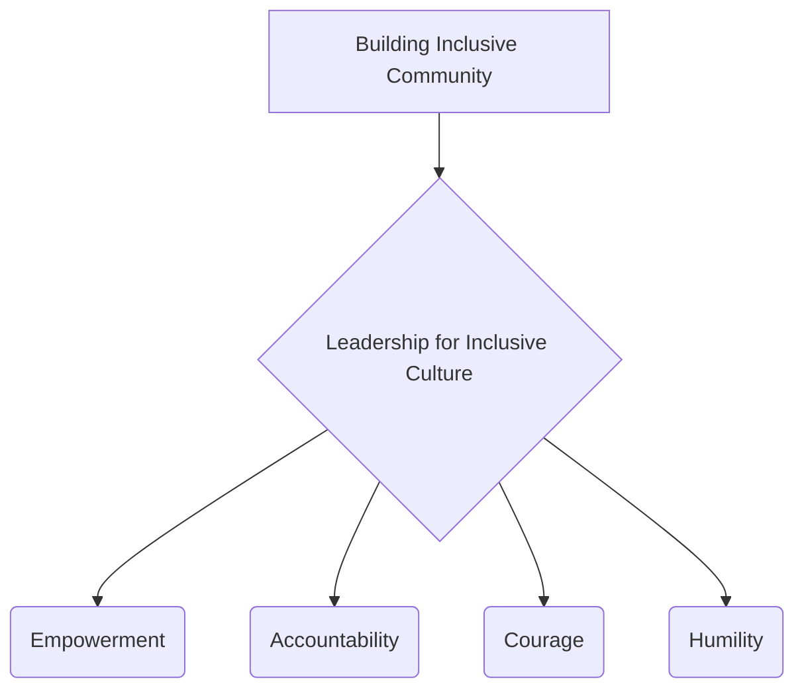
```text
// Scenario 1: Overview of Leadership behaviors for Inclusive Culture
// Output:
// (A flowchart showing "Building Inclusive Community" leading to "Leadership for Inclusive Culture", which then branches into "Empowerment", "Accountability", "Courage", "Humility".)
```
*Note: This `graph TD` illustrates the key behaviors expected of leaders fostering an inclusive culture.*

## Context & Framework
#### The Family Tree
Leadership for Inclusive Culture resides within the overarching concept of [[Building_Inclusive_Community]], serving as the driving force for its realization. These leadership behaviors are also instrumental in translating [[Inclusive_Values_in_Cultural_Norms]] (such as Equality, Respect for Diversity) into daily practice. Effective inclusive leadership ensures that the [[Characteristics_of_Inclusive_Community]] (like being participatory, equitable, and safe) are not just aspirational but are actively cultivated and sustained. Without strong, principled leadership, efforts to build an inclusive culture often falter, highlighting its critical role in the broader framework of inclusion.

## The Mastery Deep Dive
#### The Cheat Code: How to Remember This
To remember the key behaviors of inclusive leaders, think of the acronym **"EACH"**:
*   **E**mpowerment: Delegating authority and trusting team members.
*   **A**ccountability: Taking responsibility and holding others to standards.
*   **C**ourage: Speaking up against injustice and embracing difficult conversations.
*   **H**umility: Acknowledging mistakes and valuing all contributions.

This mnemonic provides a simple way to recall the essential qualities of leadership that champion inclusion.

#### The "Wikipedia One-Liner"
Leadership for inclusive culture entails the consistent demonstration of behaviors such as Empowerment, Accountability, Courage, and Humility by individuals in positions of influence, actively promoting inclusive values and practices to create environments where all voices are respected, contributions are valued, and systemic barriers are dismantled. This dynamic leadership is essential for fostering a truly equitable and participatory community or institution.

## Constraints & Limitations
#### Spot the Impostor (Don't be Fooled)
A common "impostor" of genuine inclusive leadership is **"performative allyship"** or **"lip service."** A leader might frequently *speak* about diversity and inclusion (e.g., in public statements) but fail to demonstrate the actual behaviors. For example, if a leader talks about "Empowerment" but micromanages their team, or preaches "Accountability" but ignores instances of discrimination within their ranks, they are acting as an impostor. Similarly, a lack of "Courage" to challenge the status quo or a lack of "Humility" to admit when they don't know something undermines their claims. True inclusive leadership requires consistent alignment between rhetoric and action, ensuring that stated values are genuinely embodied in daily practice and decision-making.

## Significance & Application
Inclusive leadership is vital for driving organizational change, fostering positive work cultures, and building resilient communities. Academically, it is a key area of study in organizational leadership, public administration, and social psychology, exploring its impact on employee engagement, innovation, and social equity. Practically, it guides leadership development programs, shapes corporate governance, and influences public policy aimed at promoting diversity. By embodying empowerment, accountability, courage, and humility, leaders can create environments where every individual feels respected, heard, and motivated to contribute their unique talents.

## The Worked Example
This lecture slides focus on definitions and conceptual understanding. A worked example here would be a detailed case study illustrating the qualities of leadership for inclusive culture.

**Scenario:** The CEO of "Global Horizons," Ms. Anya Sharma, decides to transform the company's culture into a model of inclusion, personally embodying `Leadership_for_Inclusive_Culture`.

**Step 1: Empowering Teams and Delegating Authority**
Ms. Sharma actively delegates decision-making power to diverse cross-functional teams, trusting them to develop and implement new initiatives. She provides resources and support but avoids micromanaging, instead fostering a sense of ownership and autonomy. For example, she empowers an employee resource group for Persons With Disabilities to lead the design of new accessibility features for their products. This demonstrates `Empowerment`.

**Step 2: Fostering Accountability at All Levels**
Ms. Sharma implements a transparent accountability framework where all managers are responsible for diversity and inclusion metrics within their teams, which are tied to performance reviews. She herself takes public responsibility for any failures in inclusion initiatives and communicates corrective actions. When an employee raises a concern about a discriminatory practice, she ensures a thorough investigation and visible action, demonstrating `Accountability`.

**Step 3: Demonstrating Courage in Challenging Norms**
During a tense board meeting, when a long-standing discriminatory hiring practice is brought up, Ms. Sharma bravely challenges senior executives who resist change, articulating the ethical and business imperative for inclusive practices. She also encourages employees to speak up against microaggressions without fear of reprisal. This showcases `Courage`.

**Step 4: Leading with Humility and Continuous Learning**
Ms. Sharma publicly acknowledges that she is still learning about various facets of inclusion and regularly seeks feedback from employees, particularly from marginalized groups. She participates in empathy-building workshops alongside her staff and actively listens to diverse perspectives, adapting her approach based on new insights. This consistent demonstration of `Humility` fosters trust and encourages a culture of continuous improvement.

Through Ms. Sharma's consistent demonstration of these leadership behaviors, Global Horizons successfully transforms into a genuinely inclusive organization where every employee feels valued and empowered.

## The Proving Ground
*Test your mastery. Cover the solutions below to test yourself first.*

#### Level 1: The Sanity Check (Verification)
**The Fact Check:** Name two of the key behaviors that leaders for an inclusive culture should demonstrate.
> **Solution:** Empowerment, Accountability, Courage, Humility (any two).

#### Level 2: The Crucible (Mastery & Edge Cases)
**The Impostor:** The CEO of "InnovateCorp" frequently appears in public campaigns promoting diversity and inclusion, stating that their company "empowers" every voice. However, internally, decision-making remains highly centralized, dissenting opinions from junior staff are often ignored, and the CEO rarely acknowledges mistakes or takes responsibility when diversity initiatives fail. When faced with criticism, the CEO tends to deflect blame. Analyze why this CEO, despite their public image, is an "impostor" for genuine `Leadership_for_Inclusive_Culture`, referencing the specified behaviors.
> **Solution:** This CEO is an "impostor" for genuine `Leadership_for_Inclusive_Culture` because their actions contradict their public statements, specifically failing on multiple key behaviors. While claiming to "empower" every voice, the "highly centralized" decision-making and ignoring "dissenting opinions from junior staff" directly undermine **Empowerment**. The CEO's failure to "acknowledge mistakes or take responsibility when diversity initiatives fail," and tendency to "deflect blame," indicates a severe lack of **Accountability**. Furthermore, the absence of publicly addressing failures and the reluctance to genuinely engage with diverse viewpoints suggest a lack of **Courage** to confront uncomfortable truths or challenge the status quo, and a definite absence of **Humility** to learn and adapt. True inclusive leadership requires consistent embodiment of these behaviors, not just rhetoric, to build a culture where all feel genuinely valued and respected.

## Key Takeaways
*   Leadership for inclusive culture involves specific behaviors: Empowerment, Accountability, Courage, and Humility.
*   These leaders actively champion and embed inclusive values, creating environments where all voices are heard and respected.
*   Genuine inclusive leadership requires consistent alignment between rhetoric and action, fostering trust and driving systemic change.

## Knowledge Graph Connections
| Concept                               | Connection / Relationship                                                          |
| :
------------------------------------ | :
--------------------------------------------------------------------------------- |
| [[Building_Inclusive_Community]]      | Strong leadership is essential for cultivating and sustaining an inclusive community. |
| [[Inclusive_Values_in_Cultural_Norms]] | Leaders champion the integration of inclusive values into cultural norms through their behaviors. |
| [[Characteristics_of_Inclusive_Community]] | Leadership directly influences whether a community exhibits characteristics like being participatory and equitable. |
| [[Definition_of_Inclusive_Culture]]   | Inclusive leadership is a driving force in establishing and maintaining an inclusive culture. |
---

---

## Receptivity In Inclusive Culture


## Definition
Before proceeding, ensure you master [[Definition_of_Inclusive_Culture]] and Concept_Of_Inclusion because receptivity is a core value of an inclusive culture, building on the foundational understanding of what inclusion truly entails. Receptivity in inclusive culture refers to the **active willingness and capacity of individuals, communities, and institutions to acknowledge, understand, and genuinely respect differences among people**. It involves an open-minded approach to diverse perspectives, needs, and experiences, moving beyond mere tolerance to a proactive embrace of variety. Think of it like a sponge that eagerly absorbs all kinds of liquids, recognizing that each contributes to a richer, more complete solution, rather than just repelling what's unfamiliar.

## The Mental Model
Imagine a diverse group of musicians trying to create a new song together. "Receptivity" in this context means each musician isn't just playing their own part, but actively *listening* to the others, adjusting their tempo or volume, and being open to new melodies or rhythms suggested by their bandmates. It's about respecting that each instrument and style brings something unique, and being willing to adapt to create a richer, more harmonious piece of music. It's an active process of listening and adapting, not just allowing others to be present.

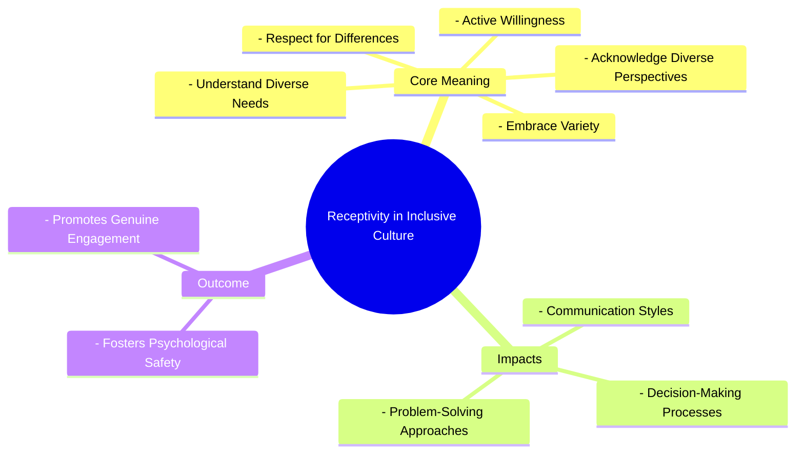
```text
// Scenario 1: Basic understanding of Receptivity in Inclusive Culture
// Output:
// (A visual mindmap showing "Receptivity in Inclusive Culture" at the root, branching into "Core Meaning", "Impacts", and "Outcome".
// "Core Meaning" branches into "Respect for Differences", "Active Willingness", "Acknowledge Diverse Perspectives", "Understand Diverse Needs", "Embrace Variety".
// "Impacts" branches into "Communication Styles", "Decision-Making Processes", "Problem-Solving Approaches".
// "Outcome" branches into "Fosters Psychological Safety", "Promotes Genuine Engagement".)
```
*Note: This `mindmap` visualizes the core meaning, impacts, and outcomes of receptivity within an inclusive culture.*

## Context & Framework
#### Where Does it Live? (The Map)
Receptivity in inclusive culture lives in the daily interactions, meeting dynamics, feedback mechanisms, and conflict resolution approaches of any group. It is found in how leaders respond to suggestions, how teams incorporate dissenting opinions, and how communities engage with newcomers. This value is a prerequisite for effective cross-cultural communication and collaborative problem-solving, mapping directly onto the capacity of individuals and collectives to learn, adapt, and grow through engagement with difference.

## The Mastery Deep Dive
#### Who are the Neighbors?
Receptivity is an essential neighbor to [[Representation_in_Inclusive_Culture]], as the presence of diverse voices is only valuable if there is an active willingness to listen to and respect those voices. It also works hand-in-hand with [[Fairness_in_Inclusive_Culture]], as being receptive to different needs often informs how equitable access and opportunities are provided. A culture of receptivity is a fundamental component of [[Building_Inclusive_Community]], enabling the community to genuinely value diversity and engage all its citizens. Without receptivity, genuine dialogue and integration are impossible.

#### The "Wikipedia One-Liner"
Receptivity in inclusive culture is the active commitment to respect and understand differences, encompassing an open-minded approach to diverse perspectives, needs, and experiences, thereby fostering an environment where all individuals feel genuinely valued and heard. This core value moves beyond passive tolerance to a proactive embrace of the richness that diversity brings to a community or institution.

## Constraints & Limitations
#### Spot the Impostor (Don't be Fooled)
A significant "impostor" of true receptivity is **passive tolerance**, where differences are merely "put up with" rather than genuinely embraced or integrated. An institution might state it "tolerates" all employees, but if it doesn't actively seek feedback from marginalized groups, adapt its communication styles, or genuinely consider alternative viewpoints in decision-making, it lacks true receptivity. This passive stance maintains existing power structures and marginalizes diverse voices, failing to create an environment where differences are truly valued and leveraged for collective benefit.

## Significance & Application
Receptivity is crucial for fostering psychological safety, promoting innovation, and building stronger relationships within diverse groups. Academically, it is a key concept in communication studies, organizational behavior, and conflict resolution, exploring how open-mindedness drives positive group dynamics. Practically, it guides active listening training, informs the design of inclusive feedback systems, and is vital for effective intercultural dialogue, ensuring that every individual's contribution is genuinely considered and appreciated.

## The Worked Example
This lecture slides focus on definitions and conceptual understanding. A worked example here would be a detailed case study illustrating the implementation of receptivity in an inclusive culture.

**Scenario:** A multi-national team at "GlobalConnect Corp" is struggling with communication and collaboration due to diverse cultural backgrounds and working styles. The leadership decides to focus on fostering `Receptivity_in_Inclusive_Culture`.

**Step 1: Implementing Active Listening Training**
GlobalConnect mandates a workshop on active listening and empathetic communication for all team members. The training focuses on techniques like paraphrasing, asking clarifying questions, and withholding judgment. Team members are encouraged to consciously practice these skills in meetings and daily interactions, fostering an environment where diverse perspectives are genuinely heard and understood. This directly builds "active willingness" to "acknowledge diverse perspectives" and "understand diverse needs."

**Step 2: Establishing Diverse Communication Channels**
Recognizing that not all cultures communicate directly or verbally, GlobalConnect introduces multiple channels for feedback and ideas, including anonymous suggestion boxes, structured online forums, and dedicated "safe spaces" for one-on-one dialogue with managers. This ensures that quieter voices or those who prefer indirect communication can also contribute effectively, demonstrating "respect for differences" in communication styles.

**Step 3: Integrating Diverse Problem-Solving Approaches**
For complex projects, teams are encouraged to intentionally invite different cultural approaches to problem-solving. For example, if one culture favors detailed planning upfront and another prefers iterative, agile development, the team facilitates discussions to find hybrid models that leverage both strengths. This proactive "embrace of variety" in working styles directly promotes an inclusive culture by valuing diverse methods.

**Step 4: Leadership Modeling Receptivity**
Team managers and project leads are trained to actively model receptive behaviors. They explicitly solicit differing opinions, avoid interrupting, and frequently summarize discussions to ensure all viewpoints have been captured. When conflicts arise, they facilitate dialogue rather than dictating solutions, demonstrating "respect for differences" and a genuine desire to understand underlying perspectives. This reinforces the cultural norm of receptivity from the top down.

Through these concerted efforts, GlobalConnect fosters a culture where receptivity is a tangible practice, leading to improved team cohesion and innovative solutions.

## The Proving Ground
*Test your mastery. Cover the solutions below to test yourself first.*

#### Level 1: The Sanity Check (Verification)
**The Fact Check:** In the context of an inclusive culture, what is the core essence of "receptivity"?
> **Solution:** Receptivity means respect for differences.

#### Level 2: The Crucible (Mastery & Edge Cases)
**The Impostor:** A university department claims to be very "open-minded" and frequently holds informal "brainstorming sessions" where all members are invited to share ideas. However, these sessions are dominated by a few vocal individuals, new faculty members or those from different academic backgrounds are often interrupted or their ideas are quickly dismissed, and decisions are still primarily made by the long-standing senior professors. Analyze why this department's "open-mindedness" is an "impostor" for genuine receptivity in an inclusive culture, referencing the core meaning and impact of receptivity.
> **Solution:** This department's "open-mindedness" is an "impostor" for genuine receptivity because it lacks the "active willingness" and "capacity to acknowledge, understand, and genuinely respect differences." While all members are "invited" (implying initial presence), the domination by vocal individuals, interruptions, and quick dismissal of new ideas directly contradict the "respect for differences" and willingness to "understand diverse needs and perspectives." The fact that decisions are still made by senior professors, despite brainstorming, shows that diverse voices are not truly influencing processes. This demonstrates a passive tolerance at best, not a proactive embrace of variety, failing to foster "psychological safety" and "genuine engagement" that true receptivity would ensure.

## Key Takeaways
*   Receptivity in inclusive culture is the active willingness to acknowledge, understand, and genuinely respect differences among people.
*   It involves open-mindedness to diverse perspectives, needs, and experiences, moving beyond mere tolerance to a proactive embrace of variety.
*   Genuine receptivity fosters psychological safety, promotes engagement, and enables communities to learn and adapt through diverse inputs.

## Knowledge Graph Connections
| Concept                         | Connection / Relationship                                                          |
| :
------------------------------ | :
--------------------------------------------------------------------------------- |
| [[Definition_of_Inclusive_Culture]] | Receptivity is a fundamental core value that defines an inclusive culture.         |
| [[Representation_in_Inclusive_Culture]] | Effective representation requires a receptive culture for diverse voices to be truly heard. |
| [[Fairness_in_Inclusive_Culture]] | Receptivity helps inform how fairness is achieved by understanding diverse needs for equitable access. |
| [[Building_Inclusive_Community]]  | A receptive environment is crucial for engaging all citizens and valuing diversity in a community. |
---

---

## Recruitment Training And Advancement


## Definition
Before proceeding, ensure you master [[Dimensions_of_Inclusive_Culture]] and Concept_Of_Inclusion because recruitment, training, and advancement constitute a critical dimension of an inclusive culture, highlighting how inclusion is practically applied in professional development. Recruitment, training, and advancement refer to the **systematic promotion of equitable opportunities for Persons With Disabilities (PWDs) in all stages of their professional journey**, from initial hiring to continuous skill development and career progression. This dimension actively works to dismantle barriers in employment practices, ensuring that PWDs have fair access to positions, can enhance their professional knowledge and competence through accessible training, and are supported in advancing to leadership roles. Think of it like a carefully cultivated career path where every individual, regardless of their disability, has clearly marked trails, supportive guides, and opportunities to reach the summit of their potential.

## The Mental Model
Imagine a ladder in a workplace. "Recruitment, Training, and Advancement" is about making sure that not only is the ladder accessible (e.g., with handrails and wide rungs for everyone, including those with mobility aids), but also that everyone knows *how* to climb it. This means active efforts to invite diverse people to *start* climbing (recruitment), providing the right coaching and tools to help them *learn* new skills (training), and ensuring they have clear paths and support to *move up* the ladder (advancement). It's a holistic approach to career growth that explicitly addresses historical inequalities.

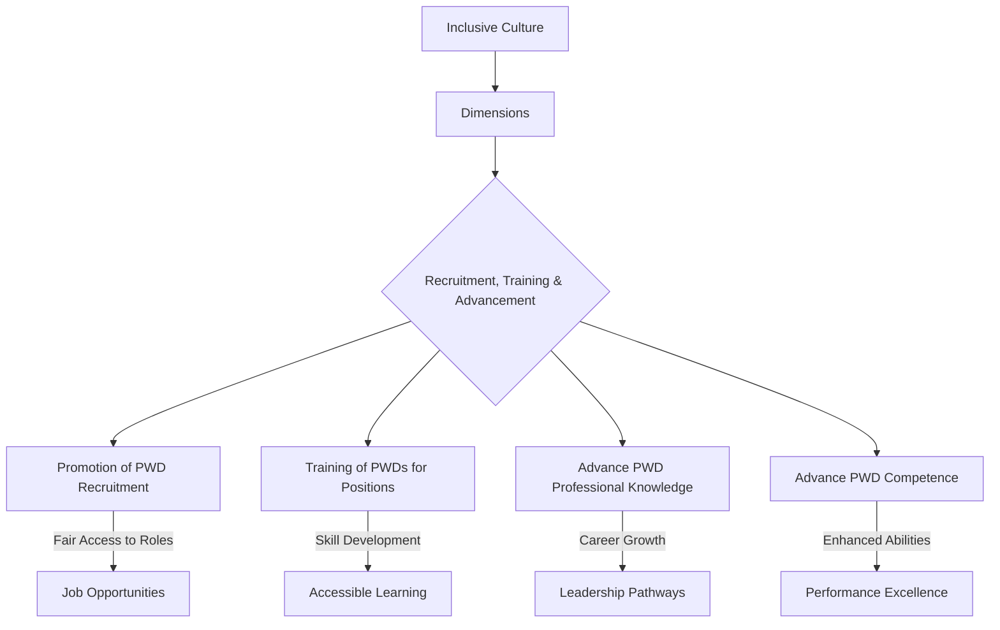
```text
// Scenario 1: Overview of Recruitment, Training, and Advancement in Inclusive Culture
// Output:
// (A flowchart showing "Inclusive Culture" leading to "Dimensions", which then branches into "Recruitment, Training & Advancement".
// "Recruitment, Training & Advancement" further branches into "Promotion of PWD Recruitment" (leading to "Job Opportunities"), "Training of PWDs for Positions" (leading to "Accessible Learning"), "Advance PWD Professional Knowledge" (leading to "Leadership Pathways"), and "Advance PWD Competence" (leading to "Performance Excellence").)
```
*Note: This `graph TD` illustrates the components of the "Recruitment, Training, and Advancement" dimension and their objectives within an inclusive culture.*

## Context & Framework
#### The Family Tree
Recruitment, training, and advancement sit within the broader "Dimensions of Inclusive Culture" as a critical branch related to human capital and organizational development. This dimension further breaks down into specific processes: talent acquisition (recruitment), skill enhancement (training), and career progression (advancement). It is deeply intertwined with organizational policies, HR practices, and legal compliance, forming a systemic approach to ensuring equitable opportunities throughout an individual's professional life cycle.

## The Mastery Deep Dive
#### The Cheat Code: How to Remember This
To remember the components of this dimension, think of the career journey: **R**ecruit (get them in), **T**rain (skill them up), and **A**dvance (move them up). The **"RTA Cycle"** emphasizes that inclusion isn't a one-time event (like just hiring) but a continuous process throughout an employee's career. Each stage builds on the previous, ensuring sustained support and growth.

#### The "Wikipedia One-Liner"
Recruitment, training, and advancement, as a dimension of inclusive culture, refers to the active promotion of recruitment and training opportunities for Persons With Disabilities (PWDs) for suitable positions, coupled with initiatives to advance their professional knowledge and competence, thereby ensuring equitable career progression and full integration within the workforce. This holistic approach addresses systemic barriers across the entire employment lifecycle.

## Constraints & Limitations
#### Spot the Impostor (Don't be Fooled)
A common "impostor" of genuine recruitment, training, and advancement is **"hire and forget."** An organization might make efforts to recruit PWDs (recruitment) but then fail to provide accessible training opportunities or clear paths for career advancement. This creates a ceiling for PWDs, preventing them from enhancing their professional knowledge or competence and progressing to leadership roles. Such a selective approach, focusing only on the initial hiring, undermines the full spirit of this dimension, creating an illusion of inclusion without real equity in career growth. True inclusion demands support throughout the entire "RTA Cycle."

## Significance & Application
This dimension is crucial for building diverse, skilled, and innovative workforces. Academically, it is studied in human resources management, organizational behavior, and disability studies, informing best practices for equitable employment. Practically, it guides the development of inclusive hiring strategies, accessible learning platforms, mentorship programs, and succession planning. By prioritizing the RTA of PWDs, organizations benefit from a wider talent pool, enhanced creativity, and a stronger commitment to social responsibility, while individuals gain economic empowerment and professional fulfillment.

## The Worked Example
This lecture slides focus on definitions and conceptual understanding. A worked example here would be a detailed case study illustrating the implementation of recruitment, training, and advancement in an inclusive culture.

**Scenario:** A financial services firm, "CapitalGrowth," recognizes its lack of diversity, particularly regarding Persons With Disabilities (PWDs), and decides to implement a comprehensive strategy focusing on `Recruitment_Training_and_Advancement` to build a more inclusive workforce.

**Step 1: Overhauling Recruitment Practices**
CapitalGrowth partners with specialist disability recruitment agencies and reviews all job descriptions to ensure they are inclusive and highlight the firm's commitment to accessibility. During interviews, they offer flexible formats (e.g., video interviews, alternative testing methods) and provide accommodations upon request. They also actively source candidates from universities with strong disability support programs. This directly aligns with the "promotion of recruitment of PWDs for a certain position."

**Step 2: Developing Accessible Training Programs**
Once PWDs are hired, CapitalGrowth ensures all mandatory and elective training programs are universally accessible. This includes providing materials in multiple formats (e.g., large print, digital text for screen readers), offering sign language interpreters or captioning for virtual sessions, and utilizing accessible learning management systems. They also offer mentorship programs specifically designed to help new PWD employees integrate and acquire new skills, ensuring they can "advance their professional knowledge."

**Step 3: Creating Clear Advancement Pathways**
CapitalGrowth establishes clear career progression paths for all employees, with a focus on eliminating biases in promotion decisions. They implement blind resume reviews for internal promotions and require managers to undergo unconscious bias training. Individual development plans are co-created with PWD employees, identifying opportunities for skill development and leadership roles, explicitly aiming to "advance their professional knowledge and competence." A senior executive champions disability inclusion, actively seeking out and mentoring PWDs for advancement.

**Step 4: Measuring Impact and Accountability**
The firm sets measurable targets for PWD representation at all levels and tracks retention and promotion rates. These metrics are regularly reviewed by the executive board, and managers are held accountable for their teams' diversity and inclusion outcomes. This ensures the "systematic promotion of equitable opportunities" is continuously monitored and improved.

Through this integrated approach to recruitment, training, and advancement, CapitalGrowth fosters a genuinely inclusive culture where PWDs are not just hired but are empowered to build successful and fulfilling careers.

## The Proving Ground
*Test your mastery. Cover the solutions below to test yourself first.*

#### Level 1: The Sanity Check (Verification)
**The Fact Check:** What is the specific aim of the "Recruitment, Training, and Advancement" dimension of inclusive culture regarding PWDs?
> **Solution:** This dimension refers to the promotion of recruitment and training of PWDs for a certain position and to advance their professional knowledge and competence.

#### Level 2: The Crucible (Mastery & Edge Cases)
**The Impostor:** A government agency proudly announces a new initiative where 10% of all new hires will be Persons With Disabilities (PWDs). However, the agency's internal professional development courses are only available in a format inaccessible to visually impaired employees, and all promotion decisions are based solely on years of service rather than demonstrated competence or growth. Analyze why this agency, despite its hiring quota, is an "impostor" for genuinely implementing the "Recruitment, Training, and Advancement" dimension of an inclusive culture.
> **Solution:** This agency is an "impostor" for genuinely implementing the "Recruitment, Training, and Advancement" dimension because it fails to address the "training" and "advancement" components. While it successfully "promotes of recruitment of PWDs" with a hiring quota, the inaccessibility of "professional development courses" directly hinders PWDs from "advanc[ing] their professional knowledge and competence." Furthermore, basing "promotion decisions solely on years of service" rather than merit or skill development creates an arbitrary barrier to genuine "advancement," effectively blocking career progression for many PWDs who might otherwise be highly competent. True implementation requires equitable access to *all three stages*: getting hired, developing skills, and moving up, ensuring that PWDs are not just employed but empowered to thrive professionally.

## Key Takeaways
*   Recruitment, Training, and Advancement focuses on equitable opportunities for PWDs from hiring through career progression.
*   It involves dismantling employment barriers, ensuring accessible training, and supporting advancement to leadership roles.
*   Genuine implementation requires a holistic approach throughout the entire professional journey, not just initial hiring.

## Knowledge Graph Connections
| Concept                         | Connection / Relationship                                                          |
| :
------------------------------ | :
--------------------------------------------------------------------------------- |
| [[Dimensions_of_Inclusive_Culture]] | Is a critical dimension for building an inclusive culture, specifically in the workforce. |
| [[Universal_Design]]              | Ensures that training materials and workplaces are accessible, supporting this dimension. |
| [[Workplace_Accommodations_and_Accessibility]] | Provides the necessary adjustments to enable PWDs to benefit from training and advancement. |
| [[Fairness_in_Inclusive_Culture]] | This dimension promotes fairness by ensuring equitable access to career opportunities. |
---

---

## Representation In Inclusive Culture


## Definition
Before proceeding, ensure you master [[Definition_of_Inclusive_Culture]] and Concept_Of_Inclusion because "representation" is a core value underpinning an inclusive culture, requiring a clear understanding of what that culture strives to achieve. Representation in inclusive culture refers to the **active presence and meaningful participation of diverse individuals, particularly those with disabilities, across a range of membership and leadership roles within a community or institution**. It goes beyond mere numbers to ensure that different voices are not only present but are also heard, valued, and able to influence decision-making processes. Think of it like a truly diverse orchestra where every instrument, from the smallest flute to the largest tuba, is not only present but also actively plays its part, contributing its unique sound to the overall harmony.

## The Mental Model
Imagine a large community meeting. "Representation" in an inclusive culture means that not only are people from all parts of the community (different ages, backgrounds, abilities) invited, but they are also actively seated at the main table, given microphones, and their opinions are genuinely sought and acted upon. It's not just about having a few people from diverse groups in the audience; it's about them being part of the organizing committee, leading discussions, and holding positions of influence.

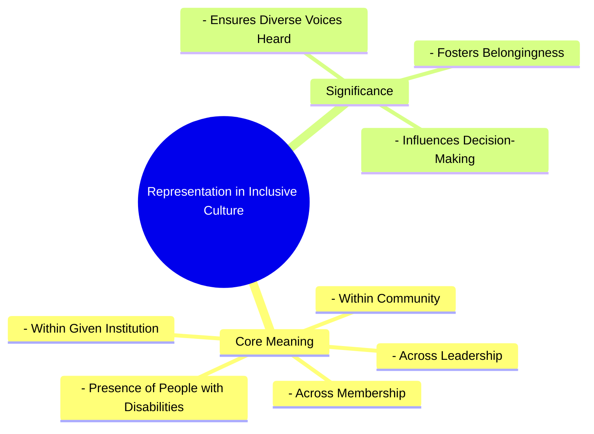
```text
// Scenario 1: Basic understanding of Representation in Inclusive Culture
// Output:
// (A visual mindmap showing "Representation in Inclusive Culture" at the root, branching into "Core Meaning" and "Significance".
// "Core Meaning" branches into "Presence of People with Disabilities", "Across Membership", "Across Leadership", "Within Community", "Within Given Institution".
// "Significance" branches into "Ensures Diverse Voices Heard", "Influences Decision-Making", "Fosters Belongingness".)
```
*Note: This `mindmap` visualizes the core meaning and significance of representation within an inclusive culture.*

## Context & Framework
#### Where Does it Live? (The Map)
Representation in inclusive culture is mapped across the organizational charts of institutions, the demographic breakdowns of community groups, and the composition of leadership bodies. It is found in classrooms, boardrooms, public forums, and media portrayals. This concept directly challenges historical patterns of exclusion and marginalization by advocating for the visible and active presence of those often underrepresented, ensuring that diverse perspectives are intrinsically woven into the fabric of decision-making and collective identity.

## The Mastery Deep Dive
#### Who are the Neighbors?
Representation is a crucial neighbor to [[Fairness_in_Inclusive_Culture]], as it ensures equitable access to opportunities and decision-making power, rather than just nominal presence. It is also intimately linked with [[Receptivity_in_Inclusive_Culture]], as the presence of diverse voices is meaningless without a willingness to listen and value those differences. Furthermore, robust representation is a hallmark of a truly [[Building_Inclusive_Community]], where all citizens are engaged and respected. Without strong representation, the stated ideals of an inclusive culture remain largely theoretical.

#### The "Wikipedia One-Liner"
Representation in inclusive culture is the fundamental value that mandates the active presence and leadership of people with disabilities and other diverse groups across all levels of an organization or community, thereby ensuring their voices contribute to decision-making and promoting a genuine sense of belonging. This core tenet moves beyond mere statistical presence to demand meaningful engagement and influence from all segments of society.

## Constraints & Limitations
#### Spot the Impostor (Don't be Fooled)
A major "impostor" of genuine representation is **tokenism**, where a minimal presence of diverse individuals (e.g., one person with a disability on a board) is used to project an image of inclusivity without granting actual influence or addressing systemic barriers. This superficial presence often leads to "representatives" feeling isolated, overburdened, or ignored, ultimately hindering rather than fostering true inclusion. Real representation involves systemic changes that enable diverse individuals to thrive, contribute authentically, and hold genuine power, not just occupy a seat.

## Significance & Application
Representation is fundamental for challenging stereotypes, promoting empathy, and ensuring that policies and services truly meet the needs of all community members. Academically, it is studied in fields like sociology, political science, and media studies, exploring its impact on social equity and identity. Practically, it informs diversity quotas in hiring, mandates for accessible media content, and initiatives to increase political participation of marginalized groups. Strong representation leads to more informed decisions, richer cultural experiences, and greater social justice.

## The Worked Example
This lecture slides focus on definitions and conceptual understanding. A worked example here would be a detailed case study illustrating the implementation of representation in an inclusive culture.

**Scenario:** A large technology company, "TechForward," aims to enhance its inclusive culture by specifically strengthening the representation of people with disabilities (PWDs) at all levels.

**Step 1: Auditing Current Representation and Identifying Gaps**
TechForward conducts a comprehensive internal audit to understand the current representation of PWDs across various departments, management tiers, and project teams. They discover that while they have some PWDs in entry-level positions, there is a significant underrepresentation in leadership and product development roles. This initial step aligns with understanding the "presence of people with disabilities across a range of membership and leadership."

**Step 2: Implementing Targeted Recruitment and Mentorship Programs**
To address the leadership gap, TechForward launches a targeted recruitment drive specifically for experienced PWDs for senior and managerial positions. They partner with organizations specializing in disability employment. Simultaneously, a mentorship program is established, pairing junior PWD employees with senior leaders (both PWD and non-PWD) to foster professional development and prepare them for advancement. This directly impacts "Across Membership and Leadership within the given institution."

**Step 3: Ensuring Meaningful Participation in Decision-Making**
TechForward creates a "Disability Inclusion Council" comprising PWD employees from various levels. This council is tasked with advising the executive team on accessibility issues, product design (e.g., ensuring new software is screen-reader friendly), and workplace policies. Their recommendations are formally considered in strategic planning, ensuring that diverse voices are not just present but "influenc[ing] decision-making." This ensures their presence is not tokenistic but genuinely impactful.

**Step 4: Public Commitment and Accountability**
The CEO publicly commits to specific representation targets for PWDs in leadership roles over the next five years and includes these metrics in the company's annual diversity report. Department heads are held accountable for achieving these targets, demonstrating a genuine commitment to strengthening `Representation_in_Inclusive_Culture`.

By taking these steps, TechForward moves beyond passive acceptance to actively building a culture where PWDs are meaningfully represented and empowered.

## The Proving Ground
*Test your mastery. Cover the solutions below to test yourself first.*

#### Level 1: The Sanity Check (Verification)
**The Fact Check:** In the context of an inclusive culture, where should the presence of people with disabilities be evident, according to the definition?
> **Solution:** The presence of people with disabilities should be evident across a range of membership and leadership within the community and given institution.

#### Level 2: The Crucible (Mastery & Edge Cases)
**The Impostor:** A national sports organization creates a new "Inclusive Athletes" committee and appoints one athlete with a physical disability, one with a visual impairment, and one with a hearing impairment. The organization then declares its commitment to representation. However, the committee's meetings are always scheduled during regular training hours, its recommendations are rarely implemented, and the three athletes are the *only* visible members with disabilities in the entire organization's governance structure. Analyze why this scenario, despite appearing to address representation, falls short and is an "impostor" of genuine representation, referencing the core aspects of representation in inclusive culture.
> **Solution:** This scenario is an "impostor" of genuine representation because it fails on multiple fronts beyond mere presence. While it initially shows "presence of people with disabilities across a range of membership," the scheduling of meetings during training hours effectively creates a barrier to "meaningful participation," undermining their ability to influence decision-making. The fact that their recommendations are "rarely implemented" further indicates a lack of genuine influence, reducing their presence to tokenism. Moreover, if these three are the "only visible members with disabilities in the entire organization's governance structure," it highlights a severe lack of broader representation "across a range of membership and leadership" within the institution, failing to truly integrate diverse voices at multiple levels. True representation requires not just being present, but being heard, valued, and empowered to effect change.

## Key Takeaways
*   Representation in inclusive culture means active presence and meaningful participation of diverse individuals, especially those with disabilities, in all roles.
*   It ensures diverse voices are heard, valued, and influence decision-making, fostering a sense of belonging.
*   Genuine representation goes beyond tokenism, requiring systemic changes for authentic contribution and power-sharing.

## Knowledge Graph Connections
| Concept                         | Connection / Relationship                                                          |
| :
------------------------------ | :
--------------------------------------------------------------------------------- |
| [[Definition_of_Inclusive_Culture]] | Representation is a fundamental core value contributing to an inclusive culture.   |
| [[Fairness_in_Inclusive_Culture]] | Representation ensures fairness by providing equitable access to influence and opportunities. |
| [[Receptivity_in_Inclusive_Culture]] | Effective representation requires a receptive culture that values diverse perspectives. |
| [[Building_Inclusive_Community]]  | Strong representation is a key feature of a truly inclusive community.              |
---

---

## Seven Pillars Of Inclusion


## Definition
Before proceeding, ensure you master [[Inclusive_Values_in_Cultural_Norms]] and Concept_Of_Inclusion because the Seven Pillars of Inclusion represent a practical framework for putting inclusive values into action within cultural norms, serving as a guide for implementing inclusion. The Seven Pillars of Inclusion refer to a **specific framework of operational values and principles that serve as foundational elements for fostering genuinely inclusive environments**. These pillars are: **Access, Attitude, Choice, Partnership, Communication, Policy, and Opportunity**. Each pillar outlines a distinct area where active effort is required to dismantle barriers, promote respect, and ensure equitable participation for all individuals within a society or institution. Think of them as the seven key supports holding up a magnificent archway, where each pillar is essential for the entire structure to stand strong and allow everyone to pass through freely.

## The Mental Model
Imagine a community garden. The "Seven Pillars of Inclusion" are like the different tools and rules that ensure everyone can participate and benefit from the garden. There's a pillar for making sure everyone can *get into* the garden (Access). Another for encouraging positive *feelings* about different types of plants and gardeners (Attitude). One for letting people *decide* what they want to grow (Choice). One for working *together* (Partnership). One for talking *clearly* to each other (Communication). One for the *rules* of the garden (Policy). And finally, one for making sure everyone has a *chance* to grow their favorite vegetables (Opportunity). All seven are needed for a thriving, inclusive garden.

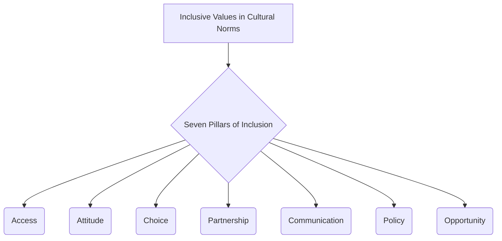
```text
// Scenario 1: Overview of the Seven Pillars of Inclusion
// Output:
// (A flowchart showing "Inclusive Values in Cultural Norms" leading to "Seven Pillars of Inclusion", which then branches into "Access", "Attitude", "Choice", "Partnership", "Communication", "Policy", "Opportunity".)
```
*Note: This `graph TD` illustrates the Seven Pillars of Inclusion as key components of inclusive values in cultural norms.*

## Context & Framework
#### The Family Tree
The Seven Pillars of Inclusion reside as a prominent branch under the broader concept of [[Inclusive_Values_in_Cultural_Norms]]. They are distinct from, but complementary to, other [[Frameworks_of_Inclusive_Values]] (such as Equality, Rights, etc.) by offering a more operational, action-oriented guide. These pillars are often referenced in policy development, organizational audits, and community development initiatives, providing a structured approach to assessing and improving inclusivity across various sectors. Each pillar represents a functional area where cultural norms can either support or hinder inclusion.

## The Mastery Deep Dive
#### The Cheat Code: How to Remember This
To remember the Seven Pillars of Inclusion, think of the acronym **"AACCPOO"**:
*   **A**ccess: Ensuring all individuals can physically and intellectually reach resources and opportunities.
*   **A**ttitude: Fostering positive and respectful mindsets towards diversity.
*   **C**hoice: Empowering individuals to make autonomous decisions about their lives and participation.
*   **P**artnership: Promoting collaborative relationships among diverse stakeholders.
*   **C**ommunication: Ensuring clear, accessible, and respectful dialogue that reaches everyone.
*   **P**olicy: Establishing rules, laws, and guidelines that actively support inclusion.
*   **O**pportunity: Providing equitable chances for growth, learning, and contribution.

This mnemonic provides a simple yet comprehensive way to recall and apply this crucial framework.

#### The "Wikipedia One-Liner"
The Seven Pillars of Inclusion are a foundational framework comprising Access, Attitude, Choice, Partnership, Communication, Policy, and Opportunity, which collectively guide the active implementation of inclusive values within cultural norms. Each pillar represents a critical area for fostering equitable participation, respect for diversity, and the dismantling of systemic barriers in any given society or institution.

## Constraints & Limitations
#### Spot the Impostor (Don't be Fooled)
A common "impostor" of genuinely implementing the Seven Pillars is **selective application**. For example, an organization might focus heavily on providing physical "Access" (e.g., ramps, elevators) and boast about its "Policy" (e.g., anti-discrimination statements) but neglect "Attitude" (e.g., perpetuating unconscious biases among staff) or "Choice" (e.g., offering limited options for participation). This piecemeal approach creates an illusion of inclusion because while some pillars are addressed, the overall structure of inclusion remains weak, failing to provide comprehensive support and engagement for all individuals. All seven pillars must be considered holistically for true inclusive transformation.

## Significance & Application
The Seven Pillars of Inclusion provide a practical and actionable framework for organizations, governments, and communities to assess and enhance their inclusive practices. Academically, this framework is used in social policy analysis, educational design, and organizational development to evaluate the effectiveness of inclusion initiatives. Practically, it guides the development of accessibility audits, anti-bias training programs, user-centered design, and legislative reforms. By addressing each pillar, societies can systematically remove barriers and create environments where every individual feels genuinely valued and can participate fully.

## The Worked Example
This lecture slides focus on definitions and conceptual understanding. A worked example here would be a detailed case study illustrating the application of the Seven Pillars of Inclusion.

**Scenario:** A local government agency, "CivicConnect," is reviewing its public services to ensure they align with the `Seven_Pillars_of_Inclusion` and create a truly inclusive experience for all citizens.

**Step 1: Enhancing Access (Physical & Digital)**
CivicConnect ensures all government buildings have ramps, elevators, and accessible restrooms. Their official website is redesigned to meet WCAG accessibility standards, and all public documents are available in multiple formats (e.g., large print, Braille, digital text for screen readers). They also establish mobile service units to reach citizens in remote areas, expanding physical and digital access.

**Step 2: Cultivating a Positive Attitude**
All public-facing staff undergo mandatory training on disability awareness, cultural competence, and unconscious bias. The training emphasizes respectful language and active listening to foster positive `Attitude` towards diverse citizens. Public awareness campaigns are launched to celebrate the diversity within the community, promoting understanding and empathy.

**Step 3: Providing Choice and Encouraging Partnership**
For services like social support programs, CivicConnect offers multiple options for how services are delivered (e.g., in-person, phone, online, home visits), giving citizens `Choice` in how they engage. They actively seek `Partnership` with community organizations representing marginalized groups, involving them in the co-creation of new programs and services.

**Step 4: Improving Communication and Policy**
All public announcements and informational materials are disseminated through multiple accessible channels and in multiple languages relevant to the community. Official government `Policy` is reviewed and revised to explicitly state a commitment to inclusion, ensuring non-discrimination clauses are robust and grievance mechanisms are clear. New policies are enacted to proactively remove barriers rather than just react to complaints.

**Step 5: Ensuring Opportunity**
CivicConnect establishes internship and employment programs specifically targeting underrepresented groups, ensuring `Opportunity` for economic participation. They also provide grants for community-led initiatives that promote social inclusion and skill development for marginalized populations.

By systematically addressing each of the Seven Pillars, CivicConnect transforms its services into a model of genuine inclusion, ensuring all citizens can participate fully and equitably in civic life.

## The Proving Ground
*Test your mastery. Cover the solutions below to test yourself first.*

#### Level 1: The Sanity Check (Verification)
**The Fact Check:** List the seven pillars of inclusion as identified in the source material.
> **Solution:** The seven pillars are Access, Attitude, Choice, Partnership, Communication, Policy, and Opportunity.

#### Level 2: The Crucible (Mastery & Edge Cases)
**The Impostor:** A newly developed urban park proudly advertises its "inclusive design" with wide paved paths (Access) and clearly posted rules (Policy). However, the park's staff are frequently observed making dismissive comments about different cultural practices, there are no multilingual signs, and all recreational activities require high physical agility, with no alternative options. Analyze why this park, despite addressing two pillars, is an "impostor" for genuine inclusion according to the Seven Pillars of Inclusion.
> **Solution:** This park is an "impostor" for genuine inclusion because while it addresses "Access" (wide paths) and "Policy" (posted rules), it fundamentally neglects several other critical pillars. The staff's dismissive comments indicate a failure in fostering a positive **Attitude**. The absence of multilingual signs is a significant breakdown in **Communication**. Furthermore, offering only activities requiring "high physical agility" with no alternatives means there is no true **Choice** or **Opportunity** for many individuals to participate, and the park fails to provide equitable **Opportunity**. The selective application of pillars, while neglecting others, prevents the creation of a truly comprehensive and inclusive environment, making it an "impostor" of the full framework.

## Key Takeaways
*   The Seven Pillars of Inclusion (Access, Attitude, Choice, Partnership, Communication, Policy, Opportunity) form a framework for fostering inclusive environments.
*   Each pillar addresses a distinct area crucial for dismantling barriers and ensuring equitable participation for all.
*   Comprehensive application of all seven pillars is necessary to avoid selective and superficial inclusion.

## Knowledge Graph Connections
| Concept                               | Connection / Relationship                                                          |
| :
------------------------------------ | :
--------------------------------------------------------------------------------- |
| [[Inclusive_Values_in_Cultural_Norms]] | The Seven Pillars are an operational framework for putting inclusive values into cultural norms. |
| [[Frameworks_of_Inclusive_Values]]    | The Seven Pillars are a more specific, action-oriented subset of broader inclusive value frameworks. |
| [[Building_Inclusive_Community]]      | Applying the Seven Pillars is a practical strategy for building an inclusive community. |
| [[Definition_of_Inclusive_Culture]]   | These pillars provide concrete actions for achieving the definition of an inclusive culture. |
---

---

## Universal Design


## Definition
Before proceeding, ensure you master [[Dimensions_of_Inclusive_Culture]] and Concept_Of_Inclusion because Universal Design is one of the foundational dimensions for achieving an inclusive culture, requiring an understanding of how inclusion is practically implemented. Universal Design refers to the **proactive construction and development of structures, spaces, services, communications, and resources that are inherently and organically accessible to the widest possible range of people, with and without disabilities, without requiring further modification or accommodation**. It is about designing for diversity from the outset, eliminating barriers before they arise, and fostering an environment where accessibility is the default, not an afterthought. Think of it like designing a building where the main entrance is a ramp *and* stairs, a single design choice that works seamlessly for everyone without needing a separate accessible entrance.

## The Mental Model
Imagine you're designing a playground. "Universal Design" means you don't just build a standard playground and then add a special accessible swing later. Instead, from the very beginning, you design the whole playground with different surfaces for different mobility aids, sensory play areas for children with various needs, and equipment that can be used by children of all abilities. It's about building a playground where *everyone* can play together, without anyone feeling like an add-on or needing special adjustments.

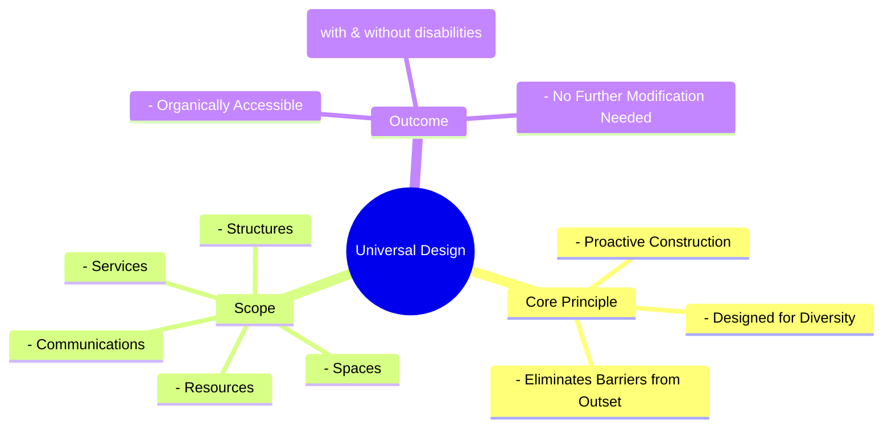
```text
// Scenario 1: Basic understanding of Universal Design principles
// Output:
// (A visual mindmap showing "Universal Design" at the root, branching into "Core Principle", "Scope", and "Outcome".
// "Core Principle" branches into "Proactive Construction", "Designed for Diversity", "Eliminates Barriers from Outset".
// "Scope" branches into "Structures", "Spaces", "Services", "Communications", "Resources".
// "Outcome" branches into "Organically Accessible", "For Range of People (with & without disabilities)", "No Further Modification Needed".)
```
*Note: This `mindmap` visualizes the core principle, scope, and outcomes of Universal Design.*

## Context & Framework
#### Where Does it Live? (The Map)
Universal Design is found in architecture, urban planning, product development, information technology, and educational curriculum design. It applies to physical spaces (e.g., buildings, parks), digital interfaces (e.g., websites, apps), and services (e.g., public transportation, customer support). This concept directly aligns with the broader goal of [[Building_Inclusive_Community]] by ensuring that environments and tools are fundamentally accessible, promoting participation and equitable access as inherent features rather than special provisions.

## The Mastery Deep Dive
#### Who are the Neighbors?
Universal Design is a crucial neighbor to [[Workplace_Accommodations_and_Accessibility]] as it proactively reduces the need for individualized accommodations by designing accessible environments from the start. It complements [[Recruitment_Training_and_Advancement]] by creating accessible workplaces and training materials, thereby removing barriers to employment and growth for persons with disabilities. Furthermore, it is a foundational element of the [[Dimensions_of_Inclusive_Culture]], providing the physical and informational infrastructure necessary for true inclusion. Without Universal Design, other dimensions of inclusivity can be significantly hampered.

#### The "Wikipedia One-Liner"
Universal Design is the comprehensive approach to creating structures, environments, products, and services that are inherently usable by all people, to the greatest extent possible, without the need for adaptation or specialized design. It is a key dimension of inclusive culture, advocating for proactive accessibility from the conceptual stage, thereby minimizing barriers and fostering widespread participation for individuals with and without disabilities.

## Constraints & Limitations
#### Spot the Impostor (Don't be Fooled)
A common "impostor" of Universal Design is **"accessible design" as an afterthought**. This occurs when a product or environment is initially designed without considering accessibility, and then modifications (e.g., adding a ramp to a building with only stairs) are made later. While these modifications improve accessibility, they are not Universal Design. Universal Design involves anticipating diverse user needs *from the very beginning* of the design process, making accessibility an intrinsic feature, not a retrofitted addition or a "special solution" for a specific group. An add-on ramp is an accessible modification, but not a universal design solution.

## Significance & Application
Universal Design has profound significance for promoting equity, efficiency, and enhanced user experience for everyone. Academically, it is studied in fields like architecture, industrial design, human-computer interaction, and education, influencing pedagogical approaches. Practically, it leads to smarter public infrastructure, more user-friendly technology, and more engaging learning environments. By ensuring products and environments are "organically accessible," Universal Design benefits not only people with disabilities but also seniors, parents with strollers, and anyone navigating temporary limitations.

## The Worked Example
This lecture slides focus on definitions and conceptual understanding. A worked example here would be a detailed case study illustrating the application of Universal Design principles.

**Scenario:** A tech company, "InnoApp," is developing a new social media application and wants to ensure it is designed using `Universal_Design` principles from the ground up, rather than adding accessibility features later.

**Step 1: User Research with Diverse Abilities**
Before writing any code, InnoApp's design team conducts extensive user research, including participants with various disabilities (e.g., visual impairments, motor impairments, cognitive disabilities) and diverse demographics. They gather insights on how different users interact with apps, what barriers they encounter, and what features would enhance their experience. This proactive step ensures "designing for diversity from the outset."

**Step 2: Designing for Multiple Input and Output Modalities**
The app's interface is designed to support multiple input methods (e.g., touch, voice commands, keyboard navigation) and output methods (e.g., visual display, screen reader compatibility, haptic feedback). For example, every image includes descriptive alt-text, and videos have synchronized captions and audio descriptions. This ensures "communications and resources are organically accessible" to a wide range of users, making it usable without specific modifications.

**Step 3: Ensuring Clear and Consistent Navigation**
The navigation structure is kept simple, intuitive, and consistent across all screens, minimizing cognitive load. Labels for buttons and icons are clear and unambiguous, and color contrast ratios meet accessibility standards to benefit users with low vision or color blindness. Text can be easily resized without breaking the layout. This proactive attention to clarity and usability benefits all users, not just those with disabilities.

**Step 4: Incorporating User-Adjustable Settings**
The app includes a robust settings menu that allows users to customize their experience, such as adjusting font sizes, choosing high-contrast themes, modifying animation speeds, and setting notification preferences. These user-adjustable settings empower individuals to tailor the app to their specific needs, ensuring it is "organically accessible" without needing developers to create separate "accessible versions."

By implementing these Universal Design principles, InnoApp creates a social media platform that is inherently inclusive, providing a seamless and engaging experience for the widest possible audience, aligning with its role as a dimension of `Inclusive_Culture`.

## The Proving Ground
*Test your mastery. Cover the solutions below to test yourself first.*

#### Level 1: The Sanity Check (Verification)
**The Fact Check:** What is the core characteristic of resources developed using Universal Design, in terms of their accessibility?
> **Solution:** Resources developed using Universal Design are organically accessible to a range of people with and without disabilities, without further need for modification or accommodation.

#### Level 2: The Crucible (Mastery & Edge Cases)
**The Impostor:** A software company develops a new operating system with a high-contrast mode and a screen reader built-in. They proudly market these features as evidence of their commitment to "Universal Design." However, the default user interface is extremely complex with tiny icons, relies heavily on complex mouse gestures for navigation, and frequently uses flashing animations that can trigger discomfort for sensitive users. Analyze why this operating system, despite its accessibility features, is an "impostor" for genuine Universal Design, referencing the core definition and proactive nature of Universal Design.
> **Solution:** This operating system is an "impostor" for genuine Universal Design because while it includes *some* accessibility features (high-contrast mode, screen reader), the fundamental design of its "structures, spaces, services, communications, and resources" (the default UI) is *not* "organically accessible to the widest possible range of people, with and without disabilities, without requiring further modification or accommodation." The complex UI, reliance on mouse gestures, and flashing animations create barriers from the outset. True Universal Design is about "proactive construction" and "designing for diversity from the outset," making accessibility the default experience for all. Adding accessibility features as a separate mode or tool *after* an inherently inaccessible default design is a form of accessible design (an afterthought), not Universal Design, which aims to eliminate the need for such separate features by building inclusivity into the core experience.

## Key Takeaways
*   Universal Design is the proactive creation of inherently accessible structures, spaces, services, and resources for all, without further modification.
*   It's about designing for diversity from the outset, eliminating barriers before they arise, making accessibility the default.
*   This dimension of inclusive culture benefits everyone, not just people with disabilities, by creating user-friendly environments.

## Knowledge Graph Connections
| Concept                         | Connection / Relationship                                                          |
| :
------------------------------ | :
--------------------------------------------------------------------------------- |
| [[Dimensions_of_Inclusive_Culture]] | Universal Design is a foundational dimension for establishing an inclusive culture. |
| [[Workplace_Accommodations_and_Accessibility]] | Universal Design reduces the need for individual accommodations by creating inherently accessible environments. |
| [[Recruitment_Training_and_Advancement]] | Universal Design ensures accessible training and workplaces, facilitating fair recruitment and advancement. |
| [[Building_Inclusive_Community]]  | Implementing Universal Design is a key step in creating physically and digitally inclusive communities. |
---

---

## Workplace Accommodations And Accessibility


## Definition
Before proceeding, ensure you master [[Dimensions_of_Inclusive_Culture]] and Concept_Of_Inclusion because workplace accommodations and accessibility represent a core dimension of an inclusive culture, detailing how environments are adapted for effective inclusion. Workplace accommodations and accessibility refers to the **deliberate and systematic implementation of policies and practices designed to provide reasonable adjustments and ensure an accessible environment for people with disabilities**, thereby facilitating their full and meaningful inclusion in the workforce. This involves removing physical, communication, and attitudinal barriers that might prevent individuals from performing their jobs effectively and participating fully in the workplace culture. Think of it like tailoring a uniform: instead of a single, rigid size, accommodations ensure that each garment is adjusted to fit the individual perfectly, enabling them to move and perform their duties comfortably and effectively.

## The Mental Model
Imagine a diverse group of gardeners tending a shared plot. "Workplace Accommodations and Accessibility" means providing each gardener with the specific tools and adjustments they need to work effectively. If one gardener uses a wheelchair, they get a raised garden bed. If another has low vision, they get larger labels and brighter lighting. It's about ensuring the physical space and the available tools are adapted so that everyone can perform their tasks and contribute their best to the shared garden, making their inclusion meaningful and productive.

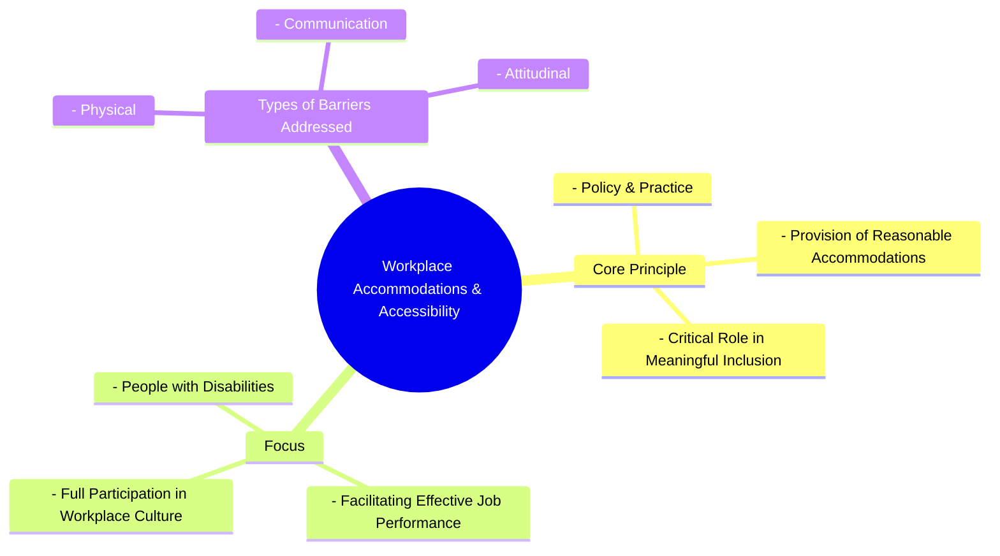
```text
// Scenario 1: Basic understanding of Workplace Accommodations & Accessibility
// Output:
// (A visual mindmap showing "Workplace Accommodations & Accessibility" at the root, branching into "Core Principle", "Focus", and "Types of Barriers Addressed".
// "Core Principle" branches into "Policy & Practice", "Provision of Reasonable Accommodations", "Critical Role in Meaningful Inclusion".
// "Focus" branches into "People with Disabilities", "Facilitating Effective Job Performance", "Full Participation in Workplace Culture".
// "Types of Barriers Addressed" branches into "Physical", "Communication", "Attitudinal".)
```
*Note: This `mindmap` visualizes the core principle, focus, and types of barriers addressed by workplace accommodations and accessibility.*

## Context & Framework
#### Where Does it Live? (The Map)
Workplace accommodations and accessibility are found in HR policies, facility management guidelines, IT department protocols, and organizational culture statements. It is mandated by anti-discrimination laws and often overseen by diversity and inclusion committees. This concept directly supports the broader aim of [[Building_Inclusive_Community]] within an organizational context, ensuring that economic participation and professional development are truly open to all, and that the work environment itself is designed to empower every individual.

## The Mastery Deep Dive
#### Who are the Neighbors?
Workplace accommodations and accessibility are intimately linked to [[Universal_Design]], which seeks to proactively design environments accessible to all, thereby reducing the need for individual accommodations. It is also a critical complement to [[Recruitment_Training_and_Advancement]] as it ensures that once hired, trained, or promoted, Persons With Disabilities (PWDs) have the necessary support to perform effectively in their roles. Furthermore, it embodies the spirit of [[Fairness_in_Inclusive_Culture]] by guaranteeing equitable access to the work environment and job functions. This dimension is crucial for translating inclusive policies into tangible, supportive practices.

#### The "Wikipedia One-Liner"
Workplace accommodations and accessibility, as a dimension of inclusive culture, refers to the systematic planning and provision of reasonable adjustments and an accessible physical and digital environment to enable people with disabilities to perform their jobs effectively and participate meaningfully in all aspects of the workplace. This includes carefully planned policies that remove barriers to employment and foster full integration.

## Constraints & Limitations
#### Spot the Impostor (Don't be Fooled)
A common "impostor" of genuine workplace accommodations and accessibility is **"reactive compliance."** This occurs when accommodations are only provided grudgingly or after significant struggle, solely to meet minimal legal requirements, rather than proactively integrating accessibility into policies and practices. If accommodations are seen as an "extra cost" or a "favor," rather than an inherent part of an inclusive workplace, it fosters a culture where people with disabilities feel burdensome or excluded. True accessibility and accommodations are integrated into organizational planning and are seen as essential for maximizing the potential of all employees.

## Significance & Application
This dimension is fundamental for creating equitable employment opportunities, enhancing productivity, and fostering a positive work environment for all. Academically, it is studied in disability employment research, organizational psychology, and human rights law, informing legislative frameworks and best practices. Practically, it guides employers in providing assistive technologies, modifying work schedules, adjusting job duties, and redesigning physical spaces. By ensuring meaningful inclusion, organizations benefit from diverse talents, improved morale, and reduced turnover, while PWDs gain economic independence and professional fulfillment.

## The Worked Example
This lecture slides focus on definitions and conceptual understanding. A worked example here would be a detailed case study illustrating the implementation of workplace accommodations and accessibility.

**Scenario:** A marketing agency, "CreativeFlow," is growing rapidly and wants to ensure its new office space and operational policies fully support `Workplace_Accommodations_and_Accessibility` for all employees, especially those with disabilities.

**Step 1: Proactive Accessibility Audit of New Office Design**
Before construction begins, CreativeFlow hires an accessibility consultant to review the blueprints for their new office. They ensure not just basic ramp access, but also automatic doors, height-adjustable desks for all employees, clear visual and auditory fire alarms, non-glare lighting, and accessible restroom stalls that exceed minimum requirements. This proactive approach aims to reduce the need for later "reasonable accommodations" by integrating `Universal_Design` from the start.

**Step 2: Developing Comprehensive Accommodation Policies**
CreativeFlow develops a clear, confidential process for employees to request accommodations. The policy outlines a range of possible adjustments, from assistive technology (e.g., screen readers, voice recognition software), modified workstations, and ergonomic equipment, to flexible work arrangements (e.g., modified hours, remote work options) and communication support (e.g., sign language interpreters for meetings). This provides a framework for "carefully planned policies for the provision of reasonable accommodations."

**Step 3: Training Management and Staff on Inclusive Practices**
All managers undergo mandatory training on disability awareness, the accommodations process, and inclusive communication strategies. They learn to identify potential barriers and proactively engage with employees to understand their needs. General staff also receive training to foster an inclusive culture that removes attitudinal barriers, making them more receptive and supportive of diverse colleagues. This addresses the "in addition to recruitment, training and advancement" aspect by fostering a supportive environment.

**Step 4: Integrating Accessibility into Digital Tools and Communication**
The IT department ensures all internal software, communication platforms, and company websites comply with accessibility standards (e.g., WCAG guidelines). Documents are created in accessible formats, and virtual meetings offer live captioning. This provides `Accessible_Communications` and ensures everyone can fully participate in information flow and collaborate effectively, enabling "meaningful inclusion of people with disabilities."

By integrating these policies and practices, CreativeFlow establishes a workplace where accommodations and accessibility are not just a legal requirement but a fundamental aspect of its inclusive culture, empowering all employees to contribute their best.

## The Proving Ground
*Test your mastery. Cover the solutions below to test yourself first.*

#### Level 1: The Sanity Check (Verification)
**The Fact Check:** What is the critical role that workplace accommodations and accessibility play in relation to people with disabilities?
> **Solution:** They play a critical role in generating meaningful inclusion of people with disabilities.

#### Level 2: The Crucible (Mastery & Edge Cases)
**The Impostor:** A large manufacturing company installs a single ramp at its main entrance and designates one accessible parking spot, then declares itself fully "accessible" for its employees with disabilities. However, within the factory floor, heavy machinery is operated with controls that require fine motor skills, safety briefings are delivered only verbally in a noisy environment, and break rooms are located on a second floor with no elevator. Analyze why this company, despite its initial efforts, is an "impostor" for genuinely implementing "Workplace Accommodations and Accessibility" for meaningful inclusion.
> **Solution:** This company is an "impostor" for genuinely implementing "Workplace Accommodations and Accessibility" because its efforts are superficial and fail to address comprehensive accessibility. While the ramp and parking spot address *some* physical access (and are perhaps a basic form of `Universal_Design`), they neglect the need for "reasonable accommodations" and a truly accessible environment within the actual "work place." The machinery controls requiring fine motor skills, verbal-only safety briefings in a noisy setting (a communication barrier), and inaccessible break rooms (a physical barrier) all prevent "meaningful inclusion of people with disabilities." Effective implementation requires "carefully planned policies" that cover all aspects of the work environment and job functions, not just minimal, isolated improvements. The company's claims are an "impostor" because it fails to address the systemic barriers within the core work environment itself.

## Key Takeaways
*   Workplace accommodations and accessibility involve policies and practices providing reasonable adjustments for people with disabilities.
*   Their critical role is to ensure meaningful inclusion by removing physical, communication, and attitudinal barriers.
*   Genuine implementation requires systematic planning and a proactive approach, rather than reactive compliance.

## Knowledge Graph Connections
| Concept                         | Connection / Relationship                                                          |
| :
------------------------------ | :
--------------------------------------------------------------------------------- |
| [[Dimensions_of_Inclusive_Culture]] | This dimension is vital for creating an inclusive workplace within the broader culture. |
| [[Universal_Design]]              | Proactive Universal Design reduces the need for extensive workplace accommodations. |
| [[Recruitment_Training_and_Advancement]] | Accommodations ensure PWDs can access and benefit from training and career advancement. |
| [[Fairness_in_Inclusive_Culture]] | Workplace accommodations promote fairness by providing equitable access to employment opportunities. |
---

---

## CC0113 4 Promoting Inclusive Culture Possible Questions


## Part I: The Conceptual Mastery Ladder
*Progress through these levels for every atomic concept. Do not move to the next concept until you can answer Level 3.*

### [[Definition_of_Inclusive_Culture]]
#### Level 1: Understanding (The Basics)
1.  **The Fact Check:** Describe in your own words what an inclusive culture entails, considering its role in community and individual needs.
#### Level 2: Competence (Application)
2.  **The Sort:** Given a list of organizational practices, identify which ones exemplify an inclusive culture and which do not. Justify your sorting.
#### Level 3: Mastery (The Crucible)
3.  **The Impostor:** A school claims to have an "inclusive culture" because it accepts students with disabilities. Identify if this is a false claim and explain why, referencing deeper aspects of inclusive culture.

### [[Representation_in_Inclusive_Culture]]
#### Level 1: Understanding (The Basics)
4.  **The Fact Check:** Define "representation" as a core value within an inclusive culture.
#### Level 2: Competence (Application)
5.  **The Sort:** In a corporate board meeting, a discussion arises about increasing diversity. Propose specific actions that demonstrate genuine representation of people with disabilities, beyond symbolic gestures.
#### Level 3: Mastery (The Crucible)
6.  **The Impostor:** A university publicizes a student with a disability receiving an award. While positive, explain why this single event does not automatically signify strong representation within its inclusive culture.

### [[Receptivity_in_Inclusive_Culture]]
#### Level 1: Understanding (The Basics)
7.  **The Fact Check:** What does "receptivity" mean in the context of fostering an inclusive culture?
#### Level 2: Competence (Application)
8.  **The Sort:** A team leader observes a conflict arising from differing communication styles. Outline steps they can take to demonstrate receptivity and mediate the situation inclusively.
#### Level 3: Mastery (The Crucible)
9.  **The Impostor:** A community group states they "tolerate" differences. Explain why "tolerance" is insufficient for true receptivity in an inclusive culture.

### [[Fairness_in_Inclusive_Culture]]
#### Level 1: Understanding (The Basics)
10. **The Fact Check:** How is "fairness" defined as a core value in an inclusive culture?
#### Level 2: Competence (Application)
11. **The Sort:** A job application process requires all candidates to complete a timed written exam. For a candidate with a specific learning disability, what measures could be taken to ensure fairness without compromising assessment integrity?
#### Level 3: Mastery (The Crucible)
12. **The Impostor:** A government policy provides identical services to all citizens. While appearing fair, analyze how this "one-size-fits-all" approach might actually undermine true fairness in an inclusive society.

### [[Dimensions_of_Inclusive_Culture]]
#### Level 1: Understanding (The Basics)
13. **The Fact Check:** List the three primary dimensions that constitute an inclusive culture.
#### Level 2: Competence (Application)
14. **The Sort:** For a new start-up company, prioritize which of the three dimensions of inclusive culture should be addressed first, and justify your prioritization.
#### Level 3: Mastery (The Crucible)
15. **The Impostor:** A building is constructed with ramps and wide doorways. While it incorporates some elements of a dimension of inclusive culture, explain what might still be missing for it to be fully inclusive.

### [[Universal_Design]]
#### Level 1: Understanding (The Basics)
16. **The Fact Check:** Define Universal Design in the context of an inclusive culture.
#### Level 2: Competence (Application)
17. **The Sort:** Provide three distinct examples of how Universal Design principles can be applied to technology products.
#### Level 3: Mastery (The Crucible)
18. **The Impostor:** A company designs an app specifically for visually impaired users. While beneficial, explain why this approach differs from Universal Design and why the latter is generally preferred for inclusive culture.

### [[Recruitment_Training_and_Advancement]]
#### Level 1: Understanding (The Basics)
19. **The Fact Check:** Explain the importance of recruitment, training, and advancement in fostering an inclusive workplace culture.
#### Level 2: Competence (Application)
20. **The Sort:** Outline a strategy for a human resources department to promote the recruitment and professional development of individuals with disabilities within their organization.
#### Level 3: Mastery (The Crucible)
21. **The Impostor:** A company boasts about hiring several individuals with disabilities but provides no specific training or career advancement paths for them. Critique this scenario from the perspective of promoting an inclusive culture.

### [[Workplace_Accommodations_and_Accessibility]]
#### Level 1: Understanding (The Basics)
22. **The Fact Check:** What role do workplace accommodations and accessibility play in creating a meaningful inclusive culture?
#### Level 2: Competence (Application)
23. **The Sort:** A manager has an employee who requires specific adjustments to their workspace due to a physical disability. List three reasonable accommodations that could be provided.
#### Level 3: Mastery (The Crucible)
24. **The Impostor:** An organization installs an elevator in an old building, claiming it now provides full accessibility. Explain why this might not fully address workplace accommodations for all types of disabilities, thus failing to create a truly inclusive environment.

### [[Building_Inclusive_Community]]
#### Level 1: Understanding (The Basics)
25. **The Fact Check:** According to the principles of inclusive communities, what is the primary role of an inclusive community regarding its citizens' decision-making processes?
#### Level 2: Competence (Application)
26. **The Sort:** Imagine you are a local council member. Propose two specific initiatives your council could implement to build a more inclusive community.
#### Level 3: Mastery (The Crucible)
27. **The Impostor:** A neighborhood association claims to be inclusive because it hosts annual cultural festivals. While positive, explain why this alone does not fulfill the definition of an inclusive community, considering factors like power dynamics and sustained engagement.

### [[Characteristics_of_Inclusive_Community]]
#### Level 1: Understanding (The Basics)
28. **The Fact Check:** List at least four defining characteristics of an inclusive community.
#### Level 2: Competence (Application)
29. **The Sort:** For each of the following scenarios, identify which characteristic of an inclusive community is most prominently displayed: (a) a town meeting where all voices are heard, (b) a support group where members collaborate, (c) a public park designed for all ages and abilities.
#### Level 3: Mastery (The Crucible)
30. **The Impostor:** A community advertises itself as "diverse" due to its varied population. Explain why "diversity" alone does not guarantee an "inclusive" community, highlighting other essential characteristics.

### [[Leadership_for_Inclusive_Culture]]
#### Level 1: Understanding (The Basics)
31. **The Fact Check:** Identify two key behaviors expected of leaders who champion an inclusive culture.
#### Level 2: Competence (Application)
32. **The Sort:** A CEO announces a new diversity and inclusion initiative. Describe how they could demonstrate "empowerment" and "accountability" in their leadership to ensure the initiative's success.
#### Level 3: Mastery (The Crucible)
33. **The Impostor:** A leader frequently speaks about the importance of inclusion but rarely consults with marginalized groups before making decisions. Analyze which inclusive leadership behavior is missing and why this creates a barrier to a truly inclusive culture.

### [[Inclusive_Values_in_Cultural_Norms]]
#### Level 1: Understanding (The Basics)
34. **The Fact Check:** What is the overarching principle regarding the application of inclusive values in cultural norms?
#### Level 2: Competence (Application)
35. **The Sort:** Consider a school environment. Provide examples of how the inclusive values of "respect for diversity" and "participation" can be integrated into daily classroom norms.
#### Level 3: Mastery (The Crucible)
36. **The Impostor:** A community emphasizes traditional values of uniformity. Explain how this cultural norm might clash with the concept of inclusive values, and what adjustments would be needed for greater inclusivity.

### [[Seven_Pillars_of_Inclusion]]
#### Level 1: Understanding (The Basics)
37. **The Fact Check:** List at least four of the seven pillars of inclusion.
#### Level 2: Competence (Application)
38. **The Sort:** For a public transportation system, describe how the "Access" and "Choice" pillars of inclusion could be practically implemented.
#### Level 3: Mastery (The Crucible)
39. **The Impostor:** A government introduces a new policy without consulting any affected minority groups, yet claims the policy promotes "equality." Which pillar of inclusion is most likely violated, and why?

### [[Frameworks_of_Inclusive_Values]]
#### Level 1: Understanding (The Basics)
40. **The Fact Check:** Identify three values that are part of the frameworks of inclusive values.
#### Level 2: Competence (Application)
41. **The Sort:** A non-profit organization is developing its core mission statement. Select two inclusive values from the provided frameworks (e.g., "Sustainability," "Community") and explain how they would shape the organization's work.
#### Level 3: Mastery (The Crucible)
42. **The Impostor:** A company prioritizes profit above all else, yet claims to uphold "sustainability." Explain how their singular focus on profit might contradict a genuine commitment to the inclusive value of sustainability.

### [[Indigenous_Inclusive_Values_and_Practices]]
#### Level 1: Understanding (The Basics)
43. **The Fact Check:** Explain what indigenous values are and how their incorporation into educational practices can be beneficial.
#### Level 2: Competence (Application)
44. **The Sort:** Describe two examples of how indigenous ways of learning or traditional practices could be integrated into a modern curriculum to promote inclusivity.
#### Level 3: Mastery (The Crucible)
45. **The Impostor:** A school attempts to integrate indigenous knowledge by simply adding a historical chapter on local tribes. Explain why this approach is insufficient for truly incorporating indigenous inclusive values and practices into education.

## Part II: Unit Synthesis (The Final Boss)
*These questions require combining multiple concepts from the unit to solve a complex problem.*

#### Integrated Scenario: Designing an Inclusive Community Center
**The Setup:** You are part of a team tasked with designing a new community center that aims to be a beacon of inclusivity for a diverse urban neighborhood. The neighborhood includes residents of various ages, cultural backgrounds, socioeconomic statuses, and abilities.
**The Constraints:** You have a limited budget, and the center must prioritize sustainable and easily maintainable solutions. Furthermore, all design choices must consider both physical and social accessibility.
**The Challenge:**
(a) Based on the [[Dimensions_of_Inclusive_Culture]], detail how you would integrate [[Universal_Design]], and ensure effective [[Workplace_Accommodations_and_Accessibility]] for staff.
(b) Explain how the center's leadership will embody [[Leadership_for_Inclusive_Culture]] principles like empowerment and accountability, and how this will be reflected in the center's [[Characteristics_of_Inclusive_Community]].
(c) Propose how the center will actively foster [[Fairness_in_Inclusive_Culture]] in its programs and services, ensuring equitable access for all residents, including those with unique needs, referencing the [[Seven_Pillars_of_Inclusion]].