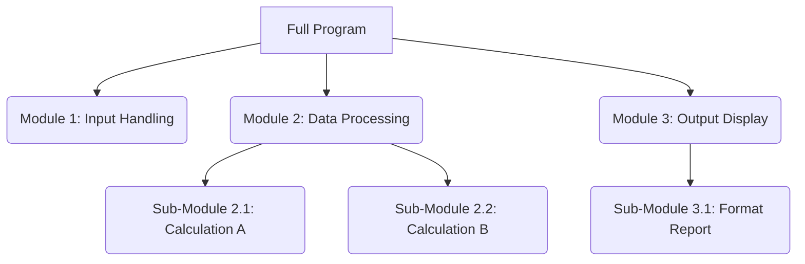
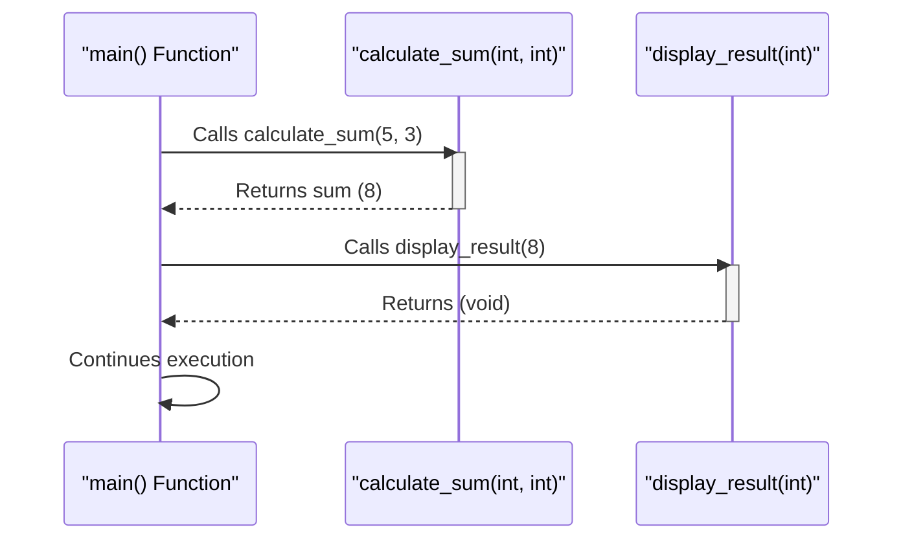
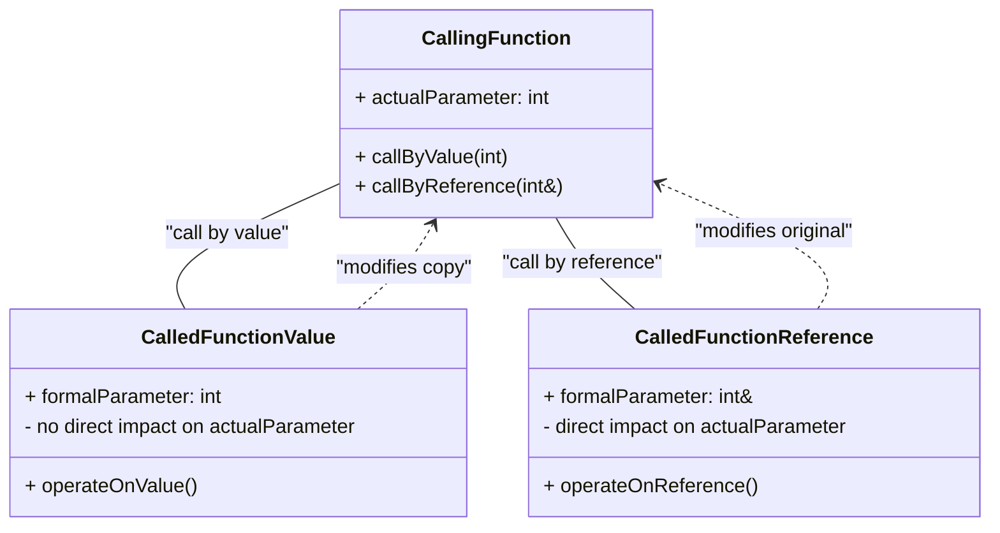

# 5 Modular Programming

Comprehensive resource for 5 Modular Programming.


---

## 5 Modular Programming Hub


## Overview
Modular programming breaks down programs into functions or modules for easier management, testing, and debugging. This unit introduces the core concepts of C++ functions, including their declaration, definition, execution flow, and how they interact through parameter passing. It further delves into advanced topics like recursion, function overloading, inline functions, and storage classes, which are fundamental for writing efficient and maintainable C++ code.

## Learning Objectives
*   Understand the principles of modular programming and its benefits.
*   Differentiate between function prototypes and function definitions in C++.
*   Explain the role of `return` statements and early exits in functions.
*   Analyze the execution flow of functions, including function calls and recursion.
*   Distinguish between local and global scope for identifiers and utilize the scope resolution operator.
*   Compare and contrast call by value and call by reference parameter passing mechanisms.
*   Apply function overloading to create flexible functions.
*   Evaluate the advantages and disadvantages of inline functions.
*   Describe the different storage classes (`auto`, `register`, `static`, `extern`) and their implications on variable lifetime and scope.
*   Implement functions with default parameters.

## Unit Applications & Real-World Relevance
Modular programming is the cornerstone of complex software development, from operating systems to web applications. Functions encapsulate specific tasks, making code reusable, understandable, and testable. Concepts like parameter passing are critical for inter-component communication. Recursion is vital in algorithms (e.g., tree traversals, sorting). Understanding scope and storage classes is crucial for preventing bugs related to data accessibility and memory management, while function overloading enhances code readability and flexibility in C++ libraries and applications.

## Active Learning Prompts
*   Design a simple program that would significantly benefit from modular programming principles, explaining why.
*   Trace the execution of a recursive factorial function with a given input, step by step, illustrating the call stack.
*   Propose a scenario where `call by reference` would be absolutely essential over `call by value` and justify your choice.

## Unit Challenges & Common Misconceptions
*   **Scope Confusion:** Students often struggle with `local` vs. `global` scope, especially when local variables `shadow` global ones.
*   **Infinite Recursion:** Forgetting the `base case` in a recursive function is a common error leading to stack overflow.
*   **Call by Value vs. Reference:** Misunderstanding when changes to parameters affect the original argument.
*   **Function Overloading Ambiguity:** Creating overloaded functions that the compiler cannot uniquely resolve due to similar parameter lists.
*   **Inline Function Misuse:** Overusing `inline` for large functions, which can lead to code bloat instead of performance improvement.

## Connections
  - [[Modular_Programming]]
    - [[Functions_C++]]
      - [[Function_Prototypes]]
      - [[Function_Definition]]
      - [[Return_Statement_C++]]
      - [[Function_Call_and_Execution]]
    - [[Scope_of_Identifiers]]
      - [[Scope_Resolution_Operator_C++]]
    - [[Parameter_Passing_Mechanisms]]
      - [[Call_by_Value]]
      - [[Call_by_Reference]]
    - [[Recursion_Concepts]]
    - [[Function_Overloading_C++]]
    - [[Inline_Functions_C++]]
    - [[Storage_Classes_C++]]
      - [[Static_and_Automatic_Variables]]
    - [[Default_Parameters_C++]]

## Next Steps for Deeper Understanding
Explore advanced C++ features like function pointers, lambdas, and templates. Research design patterns that leverage modularity (e.g., Strategy pattern). Study compiler optimization techniques related to function calls and inlining. Delve into memory management within operating systems to better understand variable lifetimes.

## Possible Questions
[[CS1220_5_Modular_Programming_Possible_Questions]]

---

---

## Modular Programming


## Definition
Before proceeding, ensure you master Computer_Programming and Basic_Elements_Of_C++ as Modular Programming builds upon these foundational concepts to create organized and efficient code.
Modular Programming is an approach to software design that breaks down a program into individual, independent, and interchangeable components, often called modules or functions. Each module performs a specific task and can be developed, tested, and maintained separately. A simpler way to think about it is like building a complex Lego model: instead of building everything as one giant piece, you construct smaller, functional sections (like the car, the house, or the tree) independently and then connect them to form the complete model.

## The Mental Model
Imagine you're trying to organize a very large library. Instead of having all books piled in one chaotic room, you divide the library into sections: "Fiction," "Non-Fiction," "Reference," etc. Within "Fiction," you have further divisions by genre, and within each genre, by author. Each section (or module) can be managed by a different librarian (developer) without affecting the others, making the whole library easier to navigate and maintain.


```text
// Scenario 1: Conceptual Program Decomposition
// Output:
// (A visual representation of a flowchart demonstrating how a "Full Program" is broken down into "Module 1: Input Handling", "Module 2: Data Processing", and "Module 3: Output Display". "Module 2" further decomposes into "Sub-Module 2.1: Calculation A" and "Sub-Module 2.2: Calculation B". "Module 3" further decomposes into "Sub-Module 3.1: Format Report".)
// This diagram illustrates the hierarchical breakdown of a large program into smaller, manageable, and focused modules.
```
*Note: This `graph TD` diagram visually represents how a complex program can be decomposed into a hierarchy of independent modules, each with a specific responsibility.*

## Context & Framework
#### The Family Tree
Modular programming establishes a hierarchical structure, much like a family tree, where a larger program (the ancestor) consists of smaller, more focused modules (descendants). This decomposition allows for a clear lineage of responsibility, where parent modules orchestrate the actions of their child modules. This structure not only clarifies the program's design but also simplifies the process of identifying where specific functionalities reside, enhancing both development speed and debugging efficiency.

## The Mastery Deep Dive
#### Breaking Down the Wall
Breaking down a large, monolithic program into smaller, distinct modules is akin to demolishing a single, massive wall into individual bricks. Each brick (module) has a defined purpose and interface, making it easier to construct, inspect, and replace. This process reduces complexity by isolating different concerns, meaning a change in one module is less likely to break functionality in another. The clear boundaries between modules enforce a disciplined approach to design, preventing tangled dependencies that often plague large, undifferentiated codebases.

#### The Lego Block Principle
The concept of modules being programmable and testable independently is similar to the Lego Block Principle. Each Lego block (module) can be snapped together with others, but it can also be tested on its own to ensure it functions as expected before integration. This isolation in testing significantly reduces the time and effort required to identify and fix bugs, as the problem can be pinpointed to a specific, smaller component rather than searching through an entire program. Furthermore, well-designed modules can be reused across different parts of the same program or even in entirely different projects, leading to considerable savings in development time and effort.

## Constraints & Limitations
#### The "Too Much Glue" Trap
While modularity offers significant advantages, it's possible to over-modularize a program, leading to the "Too Much Glue" trap. This occurs when modules are too small or too numerous, requiring excessive "glue code" (interfaces, function calls, data conversions) to connect them. The overhead of managing these numerous small modules and their interactions can negate the benefits of modularity, making the program harder to understand, debug, and even slower due to increased function call overhead. Finding the right granularity for modules is a critical design decision.

## Significance & Application
Modular programming is a fundamental practice in software engineering, enabling the creation of large-scale, robust, and maintainable applications. It's applied in almost every domain, from operating systems (where processes are distinct modules) and web browsers (where different components handle rendering, networking, and UI) to complex enterprise applications. Its principles directly contribute to code reusability, easier team collaboration on large projects, and improved system reliability.

## The Worked Example
This conceptual example illustrates how a simple calculator program can be broken down into modular components.

**Problem:** Design a calculator program that can perform addition, subtraction, multiplication, and division.

**Modular Design:**
Instead of one large `main` function handling everything, we can create separate modules (functions) for each operation and for input/output.

1.  **Input Module:** Handles reading numbers from the user.
2.  **Arithmetic Modules:** Separate functions for `add`, `subtract`, `multiply`, `divide`.
3.  **Output Module:** Displays the result to the user.

```cpp
// Modular Calculator Program - Conceptual Example

// 1. Input Module
// Function to get a single number from the user
double get_number() {
    // Logic to prompt user and read a double value
    // For demonstration, let's assume it returns a hardcoded value
    return 10.0;
}

// 2. Arithmetic Modules
// Function for addition
double add(double num1, double num2) {
    return num1 + num2;
}

// Function for subtraction
double subtract(double num1, double num2) {
    return num1 - num2;
}

// Function for multiplication
double multiply(double num1, double num2) {
    return num1 * num2;
}

// Function for division - includes basic error handling for division by zero
double divide(double num1, double num2) {
    if (num2 != 0) {
        return num1 / num2;
    } else {
        // Handle division by zero error
        return 0.0; // Or throw an exception, or return a special error code
    }
}

// 3. Output Module
// Function to display the result
void display_result(double result) {
    // Logic to format and print the result
    // For demonstration, it prints directly
    // std::cout << "The result is: " << result << std::endl;
}

// Main program to orchestrate the modules
int main() {
    double operand1 = get_number(); // Get first number
    double operand2 = get_number(); // Get second number

    double sum_result = add(operand1, operand2);
    display_result(sum_result);

    double product_result = multiply(operand1, operand2);
    display_result(product_result);

    return 0;
}
```
```text
// Scenario 1: Basic Addition and Multiplication
// Input: (Assume get_number() returns 10.0 and then 5.0 for consecutive calls)
// Expected Output (conceptual, as I/O is commented out for simplicity):
// The result is: 15.0
// The result is: 50.0

// Scenario 2: Division by Zero
// Input: (Assume get_number() returns 10.0 and then 0.0)
// Expected Output (conceptual, with division by zero handling):
// The result is: 0.0 (or an error message if more robust error handling was implemented)
```
*Note: This C++ pseudo-code demonstrates the separation of concerns, where each function (module) has a distinct responsibility, making the overall `main` function cleaner and easier to understand.*

## The Proving Ground
*Test your mastery. Cover the solutions below to test yourself first.*

#### Level 1: The Sanity Check (Verification)
**The Neighbor Check:** List three key advantages of decomposing a large software project into smaller, independent modules.
> **Solution:** The advantages include easier testing, improved maintainability, and enhanced code reusability.

#### Level 2: The Crucible (Mastery & Edge Cases)
**The Sort:** You're tasked with developing a complex e-commerce application. Explain how you would apply modular programming principles to design the system, providing examples of at least three distinct modules and how they would interact.
> **Solution:** I would create modules such as `User_Authentication` (handling login/logout, user sessions), `Product_Catalog` (managing product listings, inventory), and `Order_Processing` (handling shopping cart, checkout, payment). These modules would interact through well-defined interfaces; for instance, `Order_Processing` would rely on `User_Authentication` to verify the user and `Product_Catalog` to retrieve product details and update inventory. Each module could be developed and tested independently.

---

---

## Default Parameters C++


## Definition
Before proceeding, ensure you master [[Functions_C++]] and [[Function_Prototypes]] because default parameters provide a flexible way to define function behaviors without needing to create multiple overloaded versions.
`Default parameters` in C++ allow a function to have predefined values for some of its parameters. If a calling function does not provide an argument for a parameter with a default value, the compiler automatically uses that default value. This makes functions more flexible and can reduce the number of overloaded functions needed. A simpler way to think about it is like a restaurant menu offering a default side dish (e.g., "fries") with every burger. You can order the burger without specifying a side and get fries, or you can explicitly ask for a different side.

## The Mental Model
Imagine you're sending an email. Most email clients have a "Cc" and "Bcc" field that are usually empty. You can fill them if needed, but if you don't, they default to "no one." `Default parameters` are like those fields: they have a standard, pre-set value that's used if you don't provide a specific one.

```cpp
##include <iostream>
##include <string>

// Function prototype with default parameters
// Default values are specified in the prototype (or definition if no prototype)
void print_message(std::string message, int times = 1, char separator = '-');

int main() {
    // 1. Call without optional arguments (uses defaults for `times` and `separator`)
    std::cout << "
--- Calling with default parameters (1st) ---" << std::endl;
    print_message("Hello"); // Output: Hello-

    // 2. Call with one optional argument (uses default for `separator`)
    std::cout << "\n--- Calling with one default parameter used (2nd) ---" << std::endl;
    print_message("World", 3); // Output: World-World-World-

    // 3. Call with all arguments explicitly provided
    std::cout << "\n--- Calling with all arguments provided (3rd) ---" << std::endl;
    print_message("C++", 2, '*'); // Output: C++*C++*

    return 0;
}

// Function definition
void print_message(std::string message, int times, char separator) {
    for (int i = 0; i < times; ++i) {
        std::cout << message;
        if (i < times - 1) { // Don't print separator after the last message
            std::cout << separator;
        }
    }
    std::cout << std::endl;
}
```
```text
// Scenario 1: Function call without optional arguments
// Input: print_message("Hello")
// Output:
// --- Calling with default parameters (1st) ---
// Hello
// Explanation: `times` defaults to 1, `separator` defaults to '-'.

// Scenario 2: Function call with one optional argument
// Input: print_message("World", 3)
// Output:
// --- Calling with one default parameter used (2nd) ---
// World-World-World
// Explanation: `message` is "World", `times` is 3, `separator` defaults to '-'.

// Scenario 3: Function call with all arguments provided
// Input: print_message("C++", 2, '*')
// Output:
// --- Calling with all arguments provided (3rd) ---
// C++*C++
// Explanation: All arguments are explicitly passed, overriding default values.
```
// This C++ code demonstrates how `print_message` uses default parameters
// (`times = 1`, `separator = '-'`) to allow flexible function calls, from
// minimal arguments to fully specified ones.

## Context & Framework
#### How the Parts Talk to Each Other
Default parameters simplify function calls by allowing a function to be invoked with fewer arguments than it has parameters. The compiler handles this by filling in the missing arguments with their predefined default values. This mechanism facilitates flexible interfaces and reduces the need for multiple overloaded functions that perform similar tasks with slight variations in input. When designing functions with default parameters, the parameter with a default value acts as an optional input, allowing for more concise code by omitting arguments when the default behavior is desired.

## The Mastery Deep Dive
#### Right-to-Left Rule
A critical rule for default parameters is that **all default parameters must be the rightmost parameters in the parameter list**. Once you provide a default value for a parameter, all subsequent parameters to its right *must also* have default values. This rule exists to prevent ambiguity during function calls: the compiler fills in missing arguments from left to right. If a non-default parameter followed a default one, the compiler wouldn't know if a passed argument was for the non-default parameter or an earlier default one. For example, `void func(int a, int b = 0, int c);` is illegal because `c` has no default value and is to the right of `b`, which does.

#### Value Sources
Default values for parameters can come from several sources:
*   **Constants:** Literal values like `int x = 10;`.
*   **Global Variables:** The value of a globally accessible variable (e.g., `int global_setting = 5; void func(int x = global_setting);`). The value is determined at the time the function's prototype or definition is processed.
*   **Function Calls:** The result of another function call (e.g., `int get_default_val(); void func(int x = get_default_val());`). This function call is executed when the default value is needed.

However, you **cannot assign a constant value as a default value to a reference parameter** (e.g., `void func(int &x = 10);` is illegal) because a reference must bind to an existing lvalue.

## Constraints & Limitations
#### The "Missing Argument" Trap
A common trap with default parameters is violating the "Right-to-Left Rule." If you define a function with a default parameter, and then a non-default parameter to its right, the compiler will issue an error. For example: `void calculate(int a = 1, int b, int c = 3);` is invalid because `b` does not have a default value but is positioned to the right of `a`, which does. This trap highlights the strict positional requirement for default parameters, ensuring that the compiler can unambiguously match arguments during a function call by filling from left to right.

## Significance & Application
Default parameters are a valuable feature for designing flexible and user-friendly functions. They reduce boilerplate code by eliminating the need for multiple overloaded versions of a function for minor variations in input. They are widely used in C++ libraries and applications to provide sensible default behaviors, allowing developers to call functions with minimal arguments while retaining the option for full customization. This flexibility improves code maintainability and ease of use.

## The Worked Example
This example shows correct and incorrect usage of default parameters, particularly highlighting the "Right-to-Left Rule."

```cpp
##include <iostream>

// Correct: All default parameters are to the right
void display_info(std::string name, int age = 30, std::string city = "Unknown") {
    std::cout << "Name: " << name << ", Age: " << age << ", City: " << city << std::endl;
}

// Correct: All parameters have defaults
void configure_settings(bool debug_mode = false, int log_level = 1) {
    std::cout << "Debug Mode: " << (debug_mode ? "On" : "Off") << ", Log Level: " << log_level << std::endl;
}

// INCORRECT (conceptual example): Violates "Right-to-Left Rule"
// void invalid_func(int a = 1, int b, int c = 3) { ... } // Compilation Error!
// 'b' does not have a default value and is to the right of 'a' which does.

int main() {
    // Correct usage of display_info
    display_info("Alice");                // name="Alice", age=30, city="Unknown"
    display_info("Bob", 25);              // name="Bob", age=25, city="Unknown"
    display_info("Charlie", 40, "New York"); // name="Charlie", age=40, city="New York"

    std::cout << "
------------------------" << std::endl;

    // Correct usage of configure_settings
    configure_settings();          // debug_mode=false, log_level=1
    configure_settings(true);      // debug_mode=true, log_level=1
    configure_settings(true, 5);   // debug_mode=true, log_level=5

    // Example of calling an 'invalid_func' (if it were defined incorrectly)
    // The compiler would prevent this with an error about missing default argument for 'b'.
    // invalid_func(10, 20); // This would not compile if 'invalid_func' existed as declared above.

    return 0;
}
```
```text
// Scenario 1: Flexible calls to display_info
// Input: various calls to display_info
// Output:
// Name: Alice, Age: 30, City: Unknown
// Name: Bob, Age: 25, City: Unknown
// Name: Charlie, Age: 40, City: New York
// ------------------------
// Debug Mode: Off, Log Level: 1
// Debug Mode: On, Log Level: 1
// Debug Mode: On, Log Level: 5
// Explanation: The compiler correctly applies default values when arguments are omitted,
// or uses the provided arguments, demonstrating the flexibility.

// Scenario 2: Conceptual failure due to "Right-to-Left Rule" violation
// If `invalid_func(int a = 1, int b, int c = 3)` were actually compiled,
// the compiler error would prevent any output, because `b` doesn't have a default
// but `a` does, making argument matching ambiguous.
```
*Note: This C++ code provides clear examples of correctly using default parameters in `display_info` and `configure_settings`, showcasing the flexibility in function calls. It also conceptually explains a common error if the "Right-to-Left Rule" is violated.*

## The Proving Ground
*Test your mastery. Cover the solutions below to test yourself first.*

#### Level 1: The Sanity Check (Verification)
**The Component Check:** When can you assign a `default value` to a function parameter in C++?
> **Solution:** You can assign a default value to a function parameter when the function's name appears for the first time (typically in its prototype or definition if no prototype is used).

#### Level 2: The Crucible (Mastery & Edge Cases)
**The Broken System:** A function is declared as `void process_data(int data, int mode, bool verbose = false)`. A developer attempts to call it as `process_data(100, true);`. Explain why this call is invalid and what must be done to make it a valid call while still using the default for `verbose`.
> **Solution:** This call is invalid because `true` is a `boolean` value, and the compiler expects an `int` for the `mode` parameter (which is the second argument). Since default parameters must be specified from the rightmost, if `verbose` is omitted, `mode` *must* be provided. The compiler cannot implicitly skip `mode` and apply `true` to `verbose`.
> To make it a valid call while using the default for `verbose`, the `mode` parameter *must* be explicitly provided with an integer value. For example: `process_data(100, 1);` (where `1` is the integer value for `mode`, and `verbose` defaults to `false`).

## Key Takeaways
*   Default parameters provide predefined values for function arguments if none are supplied in the call.
*   They must be the rightmost parameters in the function's parameter list to avoid ambiguity.
*   Default values can be constants, global variables, or function calls, but not constant values for reference parameters.

## Knowledge Graph Connections
| Concept                     | Connection / Relationship                                                                   |
| :
-------------------------- | :
------------------------------------------------------------------------------------------ |
| [[Functions_C++]]           | Default parameters are a feature that enhances the flexibility of C++ functions.            |
| [[Function_Prototypes]]     | Default values are typically specified in the function prototype (first declaration).       |
| [[Function_Overloading_C++]] | Default parameters can often reduce the need for multiple overloaded functions.             |
| [[Parameter_Passing_Mechanisms]] | Default parameters influence how arguments are matched during function calls.               |
---

---

## Function Call And Execution


## Definition
Before proceeding, ensure you master [[Functions_C++]] because understanding function calls is essential to comprehend how individual functions contribute to the overall program execution.
A function call is the process of invoking a function to execute the code defined within its body. When a function is called, the program's execution flow temporarily transfers from the calling function to the called function. Once the called function completes its task (either by reaching its `return` statement or the end of its body), execution returns to the exact point in the calling function immediately after the call. A simpler analogy is like pressing a button on a vending machine: you initiate an action (function call), the machine (function) performs its internal operations (execution), and then it provides a product (return value) or simply finishes its process, and you can continue with your day.

## The Mental Model
Imagine you're navigating a large building (your program). When you need to go to a specific office (a function), you temporarily leave your current location (the calling function), walk to that office, complete your task there, and then return to resume exactly where you left off. The "function call" is like the act of deciding to go to that office, and "execution" is the work you do while you're there.


```text
// Scenario 1: Basic Function Call Flow
// Output:
// (A visual representation of the sequence diagram showing the flow:
// 1. `main()` calls `calculate_sum(5, 3)`.
// 2. `calculate_sum` activates, performs its task.
// 3. `calculate_sum` returns the sum `8` to `main()`.
// 4. `main()` then calls `display_result(8)`.
// 5. `display_result` activates, performs its task.
// 6. `display_result` returns (as it's void) to `main()`.
// 7. `main()` continues its execution.)
// This diagram illustrates the sequence of interactions and control transfers between functions.
```
*Note: This `sequenceDiagram` visualizes the typical flow of control from the `main` function to `calculate_sum` and `display_result`, illustrating how execution temporarily shifts and then returns.*

## Context & Framework
#### Follow the Ball: A Slow-Motion Trace
When a function is called, the program's execution does a precise dance: it temporarily halts the current function's operations, stores its current state (on the call stack), and then jumps to the starting point of the called function. The arguments passed during the call are typically copied (for pass by value) or referenced (for pass by reference) to the called function's parameters. Once the called function has executed all its statements and reaches a `return` statement (or its closing brace for `void` functions), the stored state of the calling function is restored, and execution resumes from the exact line where the function call was made. This seamless "pause and resume" mechanism is fundamental to modular program flow.

## The Mastery Deep Dive
#### The Call Stack
At the heart of function call and execution is the **call stack**. This specialized region of memory is used by the program to manage the sequence of active function calls. Whenever a function is called, a "stack frame" is pushed onto the call stack. This frame contains vital information such as the function's local variables, its parameters, and the return address (the memory location in the calling function where execution should resume). When a function completes, its stack frame is popped off, and control reverts to the function whose frame is now at the top of the stack. This stack-based mechanism ensures that functions can be called and returned from in a predictable, nested manner, even with recursive calls.

#### Control Transfer
The transfer of control during a function call is a precise operation. When the program encounters a function call, it first evaluates any arguments that need to be passed. Then, it saves the current execution context of the calling function (including the address of the next instruction to execute). Finally, control "jumps" to the first instruction of the called function's body. Once the called function finishes, the saved return address is used to jump back, resuming the calling function's execution from precisely where it left off. This mechanism, facilitated by the call stack, allows functions to operate as independent units while contributing to a unified program flow.

#### The Reality Check: Theory vs. Real Life
While the theory of function calls suggests a seamless transfer of control, in real-life systems, there's always a slight **overhead** associated with each function call. This overhead includes the time taken to push a new stack frame onto the call stack, copy arguments (for call by value), jump to the function's starting address, and then pop the stack frame and jump back. For very small functions that are called frequently, this overhead can sometimes become significant, potentially impacting performance. Modern compilers often employ optimizations (like inlining) to mitigate this, but understanding this underlying cost helps in designing efficient modular programs, especially in performance-critical applications.

## Constraints & Limitations
#### The "Infinite Loop" Trap
A critical trap related to function execution, especially with recursive functions, is the "Infinite Loop" (or infinite recursion). This occurs when a function calls itself, directly or indirectly, without ever reaching a termination condition (a base case). Without a base case, the function continuously calls itself, pushing more and more stack frames onto the call stack. Eventually, this consumes all available stack memory, leading to a "stack overflow" error, which typically causes the program to crash. This highlights the absolute necessity of carefully designing termination conditions for any function that might call itself.

## Significance & Application
Understanding function call and execution is fundamental to debugging, performance optimization, and grasping the overall control flow of any C++ program. It's crucial for correctly interpreting program behavior, especially in complex applications with multiple interacting functions, event-driven architectures, or concurrent programming. Developers rely on this knowledge to predict how data and control will move through their code, ensuring logical correctness and efficient resource utilization.

## The Worked Example
This example illustrates a multi-level function call, demonstrating how execution flows from `main` to `first_function`, and then `first_function` calls `second_function`, with each returning control sequentially.

```cpp
##include <iostream>

// Function prototype for second_function
void second_function(int val);

// Function prototype for first_function
void first_function(int data);

int main() {
    std::cout << "Main: Starting program." << std::endl;
    first_function(10); // Main calls first_function
    std::cout << "Main: Program finished." << std::endl;
    return 0;
}

// Definition of first_function
void first_function(int data) {
    std::cout << "First Function: Received data = " << data << std::endl;
    second_function(data * 2); // first_function calls second_function
    std::cout << "First Function: Resuming after second_function call." << std::endl;
}

// Definition of second_function
void second_function(int val) {
    std::cout << "Second Function: Received value = " << val << std::endl;
    std::cout << "Second Function: Performing task." << std::endl;
    // No explicit return statement for void, implicit return at end
}
```
```text
// Scenario 1: Multi-level function call execution
// Output:
// Main: Starting program.
// First Function: Received data = 10
// Second Function: Received value = 20
// Second Function: Performing task.
// First Function: Resuming after second_function call.
// Main: Program finished.
// Explanation: Execution starts in `main`, passes to `first_function`, then `second_function`, then returns back up the chain.

// Scenario 2: Error in understanding call stack (conceptual)
// If one incorrectly assumes `second_function` returns directly to `main`,
// they would miss the `First Function: Resuming...` output, indicating a misunderstanding
// of the sequential return process on the call stack.
```
*Note: This C++ code provides a clear trace of execution, showing the sequential invocation of `main`, `first_function`, and `second_function`, and the return of control back up the call chain.*

## The Proving Ground
*Test your mastery. Cover the solutions below to test yourself first.*

#### Level 1: The Sanity Check (Verification)
**The Follow the Ball:** Describe the immediate effect on program execution when a function call is encountered.
> **Solution:** When a function call is encountered, the program's execution temporarily transfers from the calling function to the called function, and execution in the calling function is paused.

#### Level 2: The Crucible (Mastery & Edge Cases)
**The Reality Check:** You're analyzing a program where `main()` calls `funcA()`, and `funcA()` then calls `funcB()`. If `funcB()` enters an infinite loop, what will eventually happen to the program, and why?
> **Solution:** The program will eventually crash due to a stack overflow. This occurs because `funcB()` continuously calls itself (implicitly or explicitly in an infinite loop context), causing new stack frames to be pushed onto the call stack without ever being popped off. The call stack will eventually exhaust its allocated memory, leading to a fatal error.

## Key Takeaways
*   A function call transfers execution control to the called function, pausing the caller.
*   Execution resumes in the caller at the point of the call after the called function completes.
*   The call stack is crucial for managing nested function calls and ensuring correct return points.

## Knowledge Graph Connections
| Concept                     | Connection / Relationship                                                                   |
| :
-------------------------- | :
------------------------------------------------------------------------------------------ |
| [[Functions_C++]]           | Function calls are how C++ functions are invoked to execute their code.                     |
| [[Function_Prototypes]]     | Prototypes provide the compiler with information to validate function calls.                |
| [[Function_Definition]]     | The function's body is executed when a function is called.                                  |
| [[Return_Statement_C++]]    | The `return` statement signals the completion of a function call and returns control.       |
| [[Recursion_Concepts]]      | Recursion is a special case of function call where a function calls itself.                 |
---

---

## Function Definition


## Definition
Before proceeding, ensure you master [[Function_Prototypes]] because a function definition provides the actual implementation details that correspond to a function's declaration.
A function definition in C++ is the actual implementation of a function, providing the specific code block that executes when the function is called. It consists of two main parts: the function header (identical to its prototype, but with required parameter names) and the function body, enclosed in curly braces, which contains the statements that perform the function's designated task. A simpler analogy is like having a recipe card (the prototype) that tells you what ingredients (parameters) you need and what kind of dish (return type) you'll make. The function definition is the actual cooking process itself, where you combine ingredients and follow steps to create the final dish.

## The Mental Model
Imagine you have a magic spell (function prototype) that says, "If you say 'teleport X to Y', something will happen." The function definition is the actual magic being performed. It's where the raw ingredients of your spell (parameters) are transformed by mystical incantations (statements in the body) to achieve the desired effect (return value or side effect). You can't just wave your hands; you need the full instructions.

```cpp
// Example of a function definition
// This function takes two integers, 'x' and 'y', and returns their sum.
int add_numbers(int x, int y) // Function header (must match prototype, parameter names required)
{ // Start of function body
    // Declarations and statements to perform the task
    int sum = x + y; // Local variable 'sum' declared and initialized
    return sum;      // Returns the calculated sum
} // End of function body
```
```text
// Scenario 1: Addition of two positive integers
// Input (from calling code): add_numbers(10, 20)
// Output (return value): 30
// Explanation: The function receives 10 and 20, calculates their sum as 30, and returns this value.

// Scenario 2: Addition of a positive and a negative integer
// Input (from calling code): add_numbers(5, -3)
// Output (return value): 2
// Explanation: The function receives 5 and -3, calculates their sum as 2, and returns this value.
```
// This C++ code snippet clearly outlines the structure of a function definition.
// The header `int add_numbers(int x, int y)` matches a prototype, and the
// curly braces `{}` enclose the body with its declarations and statements.

## Context & Framework
#### Opening the Hood: What's Inside?
A function definition is the blueprint fully realized; it provides the operational details of how a function achieves its task. It starts with the **function header**, which specifies the return type, the function's name, and the types and names of its parameters. Crucially, unlike a prototype, **parameter names are mandatory in the definition** to allow for their use within the function body. The **function body**, enclosed in curly braces `{}`, contains all the local variable declarations and executable statements that define the function's logic. This clear structure encapsulates the function's behavior, making it a self-contained unit of code that can be called and reused.

## The Mastery Deep Dive
#### The Function Body
The function body is the heart of the function definition, where all the magic happens. It's a block of code containing declarations of local variables, control structures (like `if` statements, `for` loops), and other executable statements. These statements collectively carry out the specific task assigned to the function, operating on the input parameters and any locally declared data. The sequence of these statements determines the function's logic and ultimately its output or effect. The execution flow typically proceeds from the first statement after the opening brace `{` down to the last statement before the closing brace `}`, unless altered by control flow statements or a `return` statement.

#### Parameters and Logic
Parameters in a function definition act as placeholders for the values that will be passed into the function when it is called. Each parameter must have a declared type, and its name allows it to be referenced and used within the function's logic. These parameters provide the necessary data for the function to perform its calculations or operations. The logic within the function body manipulates these parameters (and any internal variables) to achieve its goal, whether that's performing arithmetic, processing strings, or managing complex data structures. The consistent use of parameter names and types ensures that the function operates predictably with its inputs.

## Constraints & Limitations
#### The "Missing Piece" Trap
A significant constraint in C++ is that it **does not allow nested function definitions**. This means you cannot define one function entirely inside the body of another function. Each function must be defined at the global scope (outside of any other function). Attempting to embed a function definition within another will result in a compilation error. This design choice simplifies the compiler's task and promotes a cleaner global structure for the program, ensuring that functions are independent and clearly delineated rather than creating complex, deeply nested dependencies.

## Significance & Application
Function definitions are the core of any functional program. They translate the abstract concept of a task (the prototype) into a concrete set of instructions. They are essential for every user-defined function in a C++ program. Proper function definitions ensure that functions are correctly implemented, perform their intended task, and integrate seamlessly into the overall program structure, contributing to code correctness, maintainability, and reusability.

## The Worked Example
This example shows a full function definition and its interaction with the `main` function. It also highlights the mandatory inclusion of parameter names in the definition.

```cpp
##include <iostream>
##include <string>

// Function Prototype (usually in a header file or before main)
void display_greeting(const std::string& message, int count);

int main() {
    // Call the function defined below
    display_greeting("Hello C++!", 3);
    display_greeting("Welcome", 1); // Calling with different arguments

    return 0;
}

// Function Definition
// Parameter names are required here (message, count) to be used in the body
void display_greeting(const std::string& message, int count) {
    std::cout << "
--- Start Greeting ---" << std::endl;
    for (int i = 0; i < count; ++i) {
        std::cout << (i + 1) << ". " << message << std::endl;
    }
    std::cout << "
--- End Greeting ---" << std::endl;
}
```
```text
// Scenario 1: Display "Hello C++!" three times
// Input (from main): display_greeting("Hello C++!", 3);
// Output:
// --- Start Greeting ---
// 1. Hello C++!
// 2. Hello C++!
// 3. Hello C++!
// --- End Greeting ---

// Scenario 2: Display "Welcome" once
// Input (from main): display_greeting("Welcome", 1);
// Output:
// --- Start Greeting ---
// 1. Welcome
// --- End Greeting ---
```
*Note: This C++ code demonstrates the full definition of `display_greeting`, showing its header with named parameters (`message`, `count`) and its body with a `for` loop, effectively encapsulating the task of repeating a message.*

## The Proving Ground
*Test your mastery. Cover the solutions below to test yourself first.*

#### Level 1: The Sanity Check (Verification)
**The Component Check:** What are the two essential components that make up a complete C++ function definition?
> **Solution:** The two essential components are the function header and the function body.

#### Level 2: The Crucible (Mastery & Edge Cases)
**The Broken System:** You are working on a C++ project and attempt to write a function `void outer_function() { int inner_func() { return 0; } }`. The compiler throws an error. Explain why this syntax is invalid in C++ and what constraint it violates.
> **Solution:** This syntax is invalid because C++ does not allow nested function definitions. The constraint violated is that every function must be defined at the global scope, outside the body of any other function. The error indicates an attempt to define `inner_func` within `outer_function`, which is prohibited.

## Key Takeaways
*   A function definition provides the actual code implementation for a function.
*   It consists of a function header (with parameter names) and a body enclosed in curly braces.
*   C++ does not permit nested function definitions; all functions must be defined at the global scope.

## Knowledge Graph Connections
| Concept                     | Connection / Relationship                                                                   |
| :
-------------------------- | :
------------------------------------------------------------------------------------------ |
| [[Functions_C++]]           | Function definitions are the concrete implementations of C++ functions.                     |
| [[Function_Prototypes]]     | The function definition's header must exactly match its prototype's signature.              |
| [[Return_Statement_C++]]    | The function body contains the return statement, which dictates the function's output.      |
| [[Function_Call_and_Execution]] | The function definition's body is executed when the function is called.                   |
---

---

## Function Overloading C++


## Definition
Before proceeding, ensure you master [[Functions_C++]] and [[Function_Prototypes]] because function overloading builds upon the concept of functions and their unique signatures to allow for multiple functions with the same name.
Function overloading in C++ is a feature that allows multiple functions to have the same name, as long as their parameter lists (also known as their `signatures`) are different. The compiler uses the number, types, and order of the arguments passed during a function call to determine which overloaded function to execute. This enhances code readability and reusability by allowing functions that perform similar tasks on different data types to share a common, descriptive name. A simpler analogy is having different tools in a toolbox all named "Cut," but one "Cut" is for paper, another "Cut" is for wood, and a third "Cut" is for fabric. You pick the right "Cut" tool based on what material you provide.

## The Mental Model
Imagine you have a personal assistant named "Help." If you say "Help (me with my homework)," they bring books. If you say "Help (me with my groceries)," they go shopping. The assistant (compiler) knows which "Help" task to perform based on what you ask for (the arguments). The name is the same, but the context (parameters) tells them what to do.

## Context & Framework
#### Spot the Impostor (Don't be Fooled)
Function overloading is a powerful feature, but it comes with strict rules that can sometimes be confused. The key to valid overloading lies exclusively in the **function's signature**, which comprises the `number`, `types`, and `order` of its parameters.
*   **Valid Overloading:**
    *   Different number of parameters (e.g., `add(int, int)` vs. `add(int, int, int)`).
    *   Different types of parameters (e.g., `print(int)` vs. `print(double)`).
    *   Different order of parameters (e.g., `calc(int, float)` vs. `calc(float, int)`).
*   **Invalid Overloading (Compiler Error/Ambiguity):**
    *   Only by different return types (e.g., `int func()` vs. `double func()`).
    *   Only by different parameter names (e.g., `add(int x, int y)` vs. `add(int a, int b)`).
    *   Only by value vs. reference (e.g., `func(int)` vs. `func(int&)` is a valid overload if the argument is an L-value, but can lead to ambiguity issues if overused with implicit conversions).

Understanding these distinctions is crucial for writing correct and unambiguous overloaded functions.

## The Mastery Deep Dive
#### Resolution at Compile Time
The compiler plays a crucial role in `function overloading`. When an overloaded function is called, the C++ compiler performs a process called `overload resolution`. It examines the types and number of arguments provided in the function call and attempts to find the best match among all available overloaded functions with that name. This matching process happens at `compile time`. If the compiler finds exactly one function whose signature perfectly matches or can be implicitly converted to match the arguments, that function is selected. If multiple functions could potentially match, or no function matches, the compiler reports an error (ambiguous call or no matching function).

#### Why not Return Type?
A common point of confusion is why functions cannot be overloaded based solely on their `return type`. The reason is simple: when a function is called, the compiler primarily relies on the arguments to determine which function's code to execute. The return value is typically used *after* the function has already been invoked. If two functions had the same name and parameter list but different return types (e.g., `int getValue()` and `double getValue()`), the compiler wouldn't know which one to call based on the arguments alone, leading to an impossible ambiguity at the point of the call. Hence, return type is not part of the function signature used for overloading.

#### Benefits to Readability & Reusability
Function overloading significantly enhances code readability and reusability. Instead of inventing unique names for functions that perform conceptually similar operations but on different data types (e.g., `addInts`, `addDoubles`, `addFloats`), a single, intuitive name like `add()` can be used. This makes the code more natural to read and understand, as the programmer doesn't need to remember a myriad of distinct function names. Furthermore, it promotes code reuse by abstracting common operations under a consistent interface, simplifying the development and maintenance of libraries and applications.

## Constraints & Limitations
#### The "Ambiguous Signal" Trap
The most dangerous trap with function overloading is creating an "Ambiguous Signal," where the compiler cannot definitively decide which overloaded function to call for a given set of arguments. This typically happens when arguments can be implicitly converted in multiple ways, leading to several overloaded functions appearing equally "good" matches. For example, if you have `void func(int)` and `void func(float)`, and you call `func(5.5)`, `5.5` (a `double`) could be converted to an `int` or a `float`. Neither conversion is inherently "better," so the compiler reports an ambiguity error. This trap highlights the importance of designing overloaded functions with distinct parameter lists that leave no room for doubt during overload resolution.

## Significance & Application
Function overloading is a fundamental C++ feature that greatly improves code flexibility, readability, and maintainability. It is widely used in standard libraries (e.g., `std::cout <<` is heavily overloaded for various data types), in class constructors, and for creating user-defined functions that operate consistently across different data types. Mastery of overloading is crucial for writing expressive and robust object-oriented C++ code.

## The Worked Example
This example demonstrates valid function overloading with different numbers and types of parameters, and an invalid attempt to overload by return type only.

```cpp
##include <iostream>
##include <string>

// --- Valid Overloads ---

// 1. Overload based on different number of parameters
int add(int a, int b) {
    std::cout << "Calling add(int, int)" << std::endl;
    return a + b;
}

int add(int a, int b, int c) {
    std::cout << "Calling add(int, int, int)" << std::endl;
    return a + b + c;
}

// 2. Overload based on different types of parameters
double add(double a, double b) {
    std::cout << "Calling add(double, double)" << std::endl;
    return a + b;
}

// --- Invalid Overload (Conceptual Error) ---
// int getValue() { return 0; }
// double getValue() { return 0.0; } // This would be a compile-time error!
// Cannot overload by return type only.

int main() {
    // Calling int add(int, int)
    std::cout << "Sum of 2 and 3: " << add(2, 3) << std::endl;

    // Calling int add(int, int, int)
    std::cout << "Sum of 2, 3, and 4: " << add(2, 3, 4) << std::endl;

    // Calling double add(double, double)
    std::cout << "Sum of 2.5 and 3.5: " << add(2.5, 3.5) << std::endl;

    // Example of a call that *would* be ambiguous if not for implicit conversions:
    // If you had `void func(int)` and `void func(float)` and called `func(5.5)`,
    // it would be ambiguous. Here, `add(2.5, 3.5)` correctly calls the `double` version.

    return 0;
}
```
```text
// Scenario 1: Demonstrating valid function overloading
// Output:
// Calling add(int, int)
// Sum of 2 and 3: 5
// Calling add(int, int, int)
// Sum of 2, 3, and 4: 9
// Calling add(double, double)
// Sum of 2.5 and 3.5: 6
// Explanation: The compiler correctly selects the appropriate `add` function based on the number and types of arguments provided in each call.
```
*Note: This C++ code provides a clear example of valid function overloading, where multiple `add` functions exist with the same name but different parameter lists, and the compiler correctly resolves which one to call based on the arguments.*

## The Proving Ground
*Test your mastery. Cover the solutions below to test yourself first.*

#### Level 1: The Sanity Check (Verification)
**The Spot the Impostor:** Define function overloading in C++.
> **Solution:** Function overloading is a C++ feature that allows multiple functions to have the same name, provided their parameter lists (signatures) differ in the number, type, or order of arguments.

#### Level 2: The Crucible (Mastery & Edge Cases)
**The Impostor Test:** You have a C++ program with two functions: `void process(int x)` and `void process(double y)`. If you attempt to call `process(5.5);`, explain why the compiler might report an ambiguous call, even though `5.5` is a `double`. How would you ensure the `process(double y)` function is unambiguously called?
> **Solution:** The literal `5.5` in C++ is by default a `double`. While `process(double y)` is an exact match for `double`, the compiler also considers implicit conversions. It could potentially convert `5.5` (a `double`) to an `int` for the `process(int x)` function. If both conversions are considered equally viable or if there are other overloads, it can lead to ambiguity.
> To ensure `process(double y)` is unambiguously called, you can explicitly cast the argument to a `double`: `process(static_cast<double>(5.5));` or simply pass a double literal by suffixing `f` for float `process(5.5f)` to call a `process(float)` if it existed. In this specific case, `process(5.5)` should ideally call `process(double y)` directly without ambiguity because `double` is an exact match. However, the conceptual point highlights situations where implicit conversions *can* create ambiguity with other potential overloads.

## Key Takeaways
*   Function overloading allows multiple functions to share the same name with different parameter lists.
*   The compiler resolves overloaded calls at compile time based on the number, types, and order of arguments.
*   Overloading cannot be based solely on return type; ambiguity errors occur if the compiler cannot uniquely resolve a call.

## Knowledge Graph Connections
| Concept                     | Connection / Relationship                                                                   |
| :
-------------------------- | :
------------------------------------------------------------------------------------------ |
| [[Functions_C++]]           | Function overloading is a feature of C++ functions for enhancing flexibility and readability. |
| [[Function_Prototypes]]     | Overloaded functions require distinct prototypes (signatures) for proper compilation.       |
| [[Function_Call_and_Execution]] | The compiler performs overload resolution during a function call to determine the correct function. |
| [[Parameter_Passing_Mechanisms]] | The types and order of parameters, affected by passing mechanisms, are crucial for distinguishing overloads. |
---

---

## Function Prototypes


## Definition
Before proceeding, ensure you master [[Functions_C++]] because function prototypes are essential for the compiler to understand and correctly process C++ function calls.
A function prototype (also known as a function declaration) in C++ is a statement that informs the compiler about a function's name, return type, and the number and types of its parameters. It essentially provides the function's signature. The primary purpose of a prototype is to allow the compiler to check for correct usage of a function before its actual definition is encountered. A simpler analogy is like receiving a blueprint for a specific tool: you know what the tool is called, what materials it uses (input types), and what kind of result it produces (return type), even if you haven't seen the actual tool being built or used yet.

## The Mental Model
Imagine you're trying to call a friend on the phone, but you don't have their number stored. Before you can dial them, you need to look up their number in your contact list. The function prototype is like that contact list entry; it tells the compiler exactly what to expect (the "phone number" or signature) when a function is called, even if the actual "conversation" (function definition) happens later.

```cpp
// Function prototype for an `Area` calculation function
long Area(int length, int width); // Notice the semicolon at the end
// return_type  function_name (type [parameterName1], type [ParameterName2]);
// Example:   long          Area           (int,             int);
// Parameters can be named or unnamed in the prototype, but types are essential.
```
```text
// Scenario 1: Basic prototype for Area function
// Output:
// (No direct executable output, as this is a declaration.
// The compiler reads this to understand that a function named `Area` exists,
// it expects two integer arguments, and it will return a `long` integer.)
// This prototype allows the compiler to validate calls to `Area` later in the code.
```
// This C++ code snippet shows the required elements for a function prototype:
// `long` is the return type, `Area` is the function name, and `(int length, int width)`
// specifies the parameter types. The semicolon indicates it's a declaration, not a definition.

## Context & Framework
#### How the Parts Talk to Each Other
Function prototypes are critical for enabling the compiler to properly manage function calls, especially when functions are defined *after* they are called (e.g., `main` calling a function defined below it). The prototype acts as a forward declaration, providing just enough information for the compiler to verify the correctness of any function call. It ensures that the number, type, and order of arguments passed in a function call match the function's expected signature. This "pre-announcement" prevents compilation errors that would otherwise occur due to the compiler not knowing about a function's existence or its parameter requirements at the point of call.

## The Mastery Deep Dive
#### The Compiler's Map
Function prototypes serve as a crucial map for the C++ compiler. Without them, if a function is called before its full definition appears in the code, the compiler would report an "undeclared function" error because it hasn't yet encountered the necessary information about that function. Prototypes resolve this by providing the compiler with the essential details (return type, name, and parameter types) upfront. This allows the compiler to generate correct machine code for the function call and perform type checking, even if the function's implementation details are provided later in the source file or in a separate file (e.g., via `#include` directives for header files).

#### Syntax Breakdown
A function prototype is a single statement that ends with a semicolon. Its syntax closely resembles a function header, but without the function body. It comprises the `return_type`, followed by the `function_name`, and then a `parameter_list` enclosed in parentheses. Within the parameter list, only the `type` of each parameter is strictly required; parameter names are optional but can improve readability. For example, `int add(int, int);` is a valid prototype, as is `int add(int x, int y);`. Both convey the same essential information to the compiler: the function `add` returns an `int` and takes two `int` arguments.

#### The Translator: From "Lego" to "Jargon"
The "Lego" analogy for function prototypes is that they specify the *shape* and *connection points* of a function block. The return type is the shape of the output piece, and the parameter types are the shapes of the input pieces it accepts. The "jargon" involves formally recognizing that `return_type function_name (type1 param1, type2 param2);` is the explicit syntax. It's the declaration that tells the compiler, "Hey, a piece with these specific inputs and outputs exists, so you can plan for it, even if you don't have the full details of what's inside yet."

## Constraints & Limitations
#### The "Mismatched Map" Trap
A common trap with function prototypes is creating a "Mismatched Map," where the prototype's signature does not exactly match the function's definition. This can involve differences in the return type, the number of parameters, or the types (and order) of parameters. Even if the names of parameters in the prototype differ from the definition (which is allowed), their types and order *must* be identical. If the prototype and definition don't align, the compiler will typically issue a linking error (if the prototype exists but the definition is different) or a compilation error (if the definition is seen first, then a conflicting prototype). This mismatch is a critical source of errors, as the compiler expects the "map" (prototype) to accurately describe the "terrain" (definition).

## Significance & Application
Function prototypes are essential for the proper compilation of C++ programs, especially in larger projects where functions might be defined in different files or after their calls. They enforce type safety, allow for separate compilation of source files, and are the basis of header files (e.g., `.h` or `.hpp`), which declare functions and classes used throughout a project. Without prototypes, organizing complex codebases would be significantly more challenging, leading to tightly coupled and difficult-to-maintain programs.

## The Worked Example
This example demonstrates the importance of a function prototype when a function is defined after `main()`.

```cpp
##include <iostream>

// --- Function Prototype ---
// This line declares that a function named 'greet_user' exists.
// It tells the compiler it returns nothing (void) and takes a string argument.
void greet_user(std::string name);

int main() {
    std::string user_name = "Alice";
    // Call the function. The compiler knows about 'greet_user' because of the prototype.
    greet_user(user_name);
    return 0;
}

// --- Function Definition ---
// The actual implementation of the function, which can now be placed after main()
void greet_user(std::string name) {
    std::cout << "Hello, " << name << "! Welcome to the program." << std::endl;
}
```
```text
// Scenario 1: Successful compilation and execution
// Input: (No user input for this example)
// Output:
// Hello, Alice! Welcome to the program.
// Explanation: The prototype allows `main` to call `greet_user` even though its definition appears later.

// Scenario 2: Without the prototype (conceptual error)
// If the line `void greet_user(std::string name);` was removed, the compiler would report an error
// (e.g., "error: 'greet_user' was not declared in this scope") when compiling `main()`,
// because it wouldn't know about `greet_user` at that point.
```
*Note: This C++ code clearly illustrates how the function prototype `void greet_user(std::string name);` enables `main()` to successfully call `greet_user` even though `greet_user`'s full definition appears later in the code.*

## The Proving Ground
*Test your mastery. Cover the solutions below to test yourself first.*

#### Level 1: The Sanity Check (Verification)
**The Component Check:** What is the main information a function prototype conveys to the C++ compiler?
> **Solution:** A function prototype informs the compiler about the function's name, its return type, and the number and types of its parameters.

#### Level 2: The Crucible (Mastery & Edge Cases)
**The Broken System:** A developer writes a function `int calculateSum(int a, int b) { return a + b; }` and a corresponding prototype `void calculateSum(int, int);`. Later, `main()` calls `int result = calculateSum(5, 3);`. Explain the error that will occur during compilation.
> **Solution:** A compilation error will occur because the return type in the prototype (`void`) does not match the return type in the function definition (`int`). The compiler sees the `void` return type in the prototype and expects `calculateSum` not to return a value, but then encounters `return a + b;` in the definition, leading to a type mismatch error.

## Key Takeaways
*   Function prototypes are declarations that inform the compiler about a function's signature before its definition.
*   They specify the function's return type, name, and parameter types (names are optional).
*   Prototypes are crucial for forward declarations, type checking, and enabling functions to be defined after their calls, often placed in header files.

## Knowledge Graph Connections
| Concept                     | Connection / Relationship                                                                   |
| :
-------------------------- | :
------------------------------------------------------------------------------------------ |
| [[Functions_C++]]           | Function prototypes are declarations for C++ functions.                                     |
| [[Function_Definition]]     | A prototype must accurately match the signature of its corresponding function definition.     |
| [[Function_Call_and_Execution]] | The compiler uses prototypes to validate function calls.                                    |
| [[Return_Statement_C++]]    | The return type in the prototype must match the value returned by the function.             |
---

---

## Functions C++


## Definition
Before proceeding, ensure you master [[Modular_Programming]] because C++ functions are the primary building blocks for implementing modularity in C++ programs.
In C++, a function is a named block of code designed to perform a specific task. It acts as a subprogram that can operate on data and return a value. Functions are the mechanism by which C++ supports modular programming, allowing developers to break down complex problems into smaller, manageable units. A simpler way to understand a function is like a specialized appliance in your kitchen, such as a toaster: you give it input (bread), it performs a specific task (toasting), and it gives you an output (toast), all without you needing to know the intricate internal workings.

## The Mental Model
Think of a function as a mini-factory. You send raw materials (arguments) into this factory. Inside, a series of specific processes (the function's code) transform those materials. Finally, the factory produces a finished product (the return value) which it sends back. This factory operates independently, and you only need to know what materials it needs and what product it makes, not every single machine involved.

```cpp
// Example of a basic C++ function
// This function takes two integers, adds them, and returns the sum.
int add_numbers(int num1, int num2) { // Function header: return type, name, parameters
    // Function body: contains the statements that perform the task
    int sum = num1 + num2; // Calculates the sum
    return sum; // Returns the result
}
```
```text
// Scenario 1: Function call with positive integers
// Input: add_numbers(5, 3)
// Output: 8
// Explanation: The function receives 5 and 3, adds them, and returns 8.

// Scenario 2: Function call with negative integers
// Input: add_numbers(-10, 2)
// Output: -8
// Explanation: The function receives -10 and 2, adds them, and returns -8.
```
// This simple `add_numbers` function demonstrates the fundamental components:
// a return type (`int`), a name (`add_numbers`), parameters (`int num1`, `int num2`),
// and a body with a `return` statement.

## Context & Framework
#### Opening the Hood: What's Inside?
A C++ function, at its core, is composed of two main elements: the function header and the function body. The **function header** defines the function's interface to the rest of the program, specifying its return type, name, and the types and names of its parameters. This header acts as a contract, telling the compiler what kind of input the function expects and what kind of output it will produce. The **function body**, enclosed in curly braces `{}`, contains the actual executable statements that carry out the function's task. This separation allows for clear structural organization and makes functions predictable in their behavior.

## The Mastery Deep Dive
#### The Function Blueprint
Every C++ program begins its execution in a special function named `main()`. While `main()` is essential, a program can (and often should) contain multiple other functions. These functions enable the program to be structured into logical, reusable units. The flexibility of C++ allows for two primary types of functions: **user-defined functions**, which are custom-built by the programmer to meet specific application requirements, and **built-in functions**, which are pre-defined and provided by the C++ standard library (e.g., `sqrt()`, `pow()`, `strlen()`). This rich ecosystem of functions allows developers to either create new functionalities or leverage existing, optimized ones, accelerating development and improving reliability.

#### Anatomy of a C++ Function
Understanding the anatomy of a C++ function is crucial. A function's definition always includes its **return type** (e.g., `int`, `double`, `void`), which specifies the data type of the value the function will send back to its caller. The **function name** (e.g., `calculateSum`, `displayMessage`) uniquely identifies the function. The **parameter list**, enclosed in parentheses `()`, declares the data types and names of the inputs (arguments) the function expects. For example, `(int a, float b)` indicates two parameters. If a function takes no arguments, the parentheses can be empty or contain `void`. This precise structure ensures that functions can interact predictably and correctly within a larger program.

## Constraints & Limitations
#### The "Broken Blueprint" Trap
A critical trap in C++ function usage is not adhering to the principle that every C++ program **must have exactly one `main()` function**, which serves as the entry point for execution. Attempting to define multiple `main()` functions or omitting it entirely will result in compilation errors. While `main()` is unique, other user-defined functions must have unique names within the same scope or be correctly overloaded. Misunderstanding this foundational rule can lead to basic program compilation failures, hindering the entire development process from the outset.

## Significance & Application
Functions are the bedrock of modular, reusable, and maintainable C++ code. They enable code reuse, reduce redundancy, and make programs easier to debug and understand. Functions are used extensively in all forms of C++ programming, from low-level system utilities to complex applications, scientific simulations, and game development. Mastering function creation and usage is fundamental to becoming a proficient C++ programmer.

## The Worked Example
This example demonstrates a simple C++ program that utilizes both a user-defined function and a built-in function to perform a calculation and display the result.

```cpp
##include <iostream> // Required for input/output operations like `cout` and `cin`
##include <cmath>    // Required for mathematical functions like `sqrt`

// User-defined function: Calculates the square of a number
double calculate_square(double number) { // Function header: returns a double, takes a double
    return number * number; // Function body: calculates square and returns it
}

int main() {
    double input_value;

    std::cout << "Enter a number: ";
    std::cin >> input_value; // Get input from the user

    // Call the user-defined function
    double squared_result = calculate_square(input_value);
    std::cout << "The square of " << input_value << " is: " << squared_result << std::endl;

    // Call a built-in function: Calculate the square root of the squared_result
    double square_root_result = std::sqrt(squared_result);
    std::cout << "The square root of " << squared_result << " is: " << square_root_result << std::endl;

    return 0; // Indicate successful program termination
}
```
```text
// Scenario 1: Positive input
// Input:
// Enter a number: 9
// Output:
// The square of 9 is: 81
// The square root of 81 is: 9

// Scenario 2: Decimal input
// Input:
// Enter a number: 3.5
// Output:
// The square of 3.5 is: 12.25
// The square root of 12.25 is: 3.5
```
*Note: This program shows how `calculate_square` (user-defined) and `std::sqrt` (built-in) are called from `main()` to perform distinct tasks, demonstrating modularity.*

## The Proving Ground
*Test your mastery. Cover the solutions below to test yourself first.*

#### Level 1: The Sanity Check (Verification)
**The Component Check:** What is a function in C++, and what are the two main types of functions you can use?
> **Solution:** A function in C++ is a block of code designed to perform a specific task. The two main types are user-defined functions (created by the programmer) and built-in functions (provided by the C++ standard library).

#### Level 2: The Crucible (Mastery & Edge Cases)
**The Broken System:** You are given a C++ program that has a `main` function and another function `void greet(string name)`. The `greet` function is defined *after* `main`, and `main` tries to call `greet("Alice")`. The compiler reports an error " 'greet' was not declared in this scope". Explain why this error occurs and suggest a fix.
> **Solution:** The error occurs because the `main` function attempts to call `greet` before the compiler has seen `greet`'s definition. The compiler processes code sequentially, and when it encounters the call to `greet` in `main`, it doesn't yet know about the function's signature. The fix is to provide a function prototype for `greet` *before* `main`, like `void greet(string name);`.

## Key Takeaways
*   Functions are self-contained blocks of code performing specific tasks, essential for modular programming.
*   C++ programs must have a single `main()` function as their entry point, and can utilize both user-defined and built-in functions.
*   Understanding the components of a function – return type, name, and parameters – is crucial for correct syntax and interaction.

## Knowledge Graph Connections
| Concept                     | Connection / Relationship                                          |
| :
-------------------------- | :
----------------------------------------------------------------- |
| [[Modular_Programming]]     | Functions are the primary means to achieve modularity in C++.      |
| [[Function_Prototypes]]     | Functions require prototypes for forward declarations.             |
| [[Function_Definition]]     | Functions have a distinct definition separate from their prototype. |
| [[Return_Statement_C++]]    | Functions use return statements to send values back to the caller. |
| [[Function_Call_and_Execution]] | Functions are executed via function calls.                         |
---

---

## Inline Functions C++


## Definition
Before proceeding, ensure you master [[Functions_C++]] and [[Function_Call_and_Execution]] because inline functions are a compiler optimization that modifies how function calls are handled during execution.
An `inline` function in C++ is a function for which the compiler is advised to replace the function call with the actual function code directly at the point of call (compile time), rather than performing a normal function call. This "inlining" can potentially eliminate the overhead associated with function calls, leading to faster execution for small, frequently called functions. The `inline` keyword is merely a *suggestion* to the compiler, which it may choose to ignore. A simpler way to think about it is like a chef using a pre-made spice mix: instead of calling a separate person to mix spices every time, the chef just adds the pre-mixed spices directly to the dish, saving time on the "call."

## The Mental Model
Imagine you have a small, repetitive task, like signing your name. If you had to call a "Sign Name" function every time, that's overhead (picking up the phone, saying "sign here," waiting for a response). An `inline` function is like just signing your name directly wherever it's needed, without the formal "call" process. It's faster for small tasks, but if the "task" was writing a whole novel, doing it directly every time would be inefficient.

## Context & Framework
#### The Benchmark: O(n) vs O(log n)
While `inline` functions aren't directly tied to Big-O notation for algorithmic complexity, they are relevant to understanding real-world performance. The goal of inlining is to reduce constant factors in execution time by eliminating function call overhead. For algorithms with high asymptotic complexity (e.g., O(n^2)), the overhead of a function call is usually negligible compared to the algorithmic work. However, for extremely efficient algorithms or operations on very small data sets where the constant factors dominate, or for very frequent calls to tiny functions (e.g., getter/setter methods), the slight performance gain from inlining can sometimes be measurable. The optimization is about improving the "speed" of an existing "step" in the algorithm, not changing the fundamental steps (`O(n)`) themselves.

## The Mastery Deep Dive
#### Eliminating Call Overhead
The primary advantage of `inline` functions is the elimination of `function call overhead`. A normal function call involves several steps: pushing arguments onto the stack, saving the return address, jumping to the function's code, executing the function, and then popping the stack and returning. This process takes a small but measurable amount of time. When a function is inlined, the compiler essentially copies the function's body directly into the calling code. This bypasses the entire function call mechanism, potentially leading to faster execution, especially for very short functions that are called many times within a loop.

#### The Engineering Trade-off: Code Bloat
While inlining can speed up execution, it comes with a significant `engineering trade-off`: `code bloat`. When a function's code is copied directly into every place it's called, the size of the compiled executable file can increase significantly. If a large function is inlined multiple times, its code might appear repeatedly in the executable, consuming more memory. This increased executable size can sometimes lead to other performance penalties, such as poorer cache utilization or longer loading times. Therefore, `inline` is best reserved for very small functions (typically a few lines of code) to balance the performance gain against the increase in code size.

#### Compiler's Discretion
It's crucial to remember that the `inline` keyword is merely a `suggestion` or `hint` to the compiler, not a command. The compiler is free to ignore the `inline` qualifier if it deems that inlining would not be beneficial (e.g., for very large functions, functions with complex control flow like loops or recursion, or if it determines the performance gain is negligible). Modern optimizing compilers are often very good at making these decisions themselves, sometimes inlining functions even without the `inline` keyword if they are small enough, and conversely, ignoring the keyword for larger functions. This means `inline` is more about expressing intent to the compiler than enforcing an action.

## Constraints & Limitations
#### The "Over-Optimization" Trap
The "Over-Optimization" trap with `inline` functions is the incorrect belief that `more inline` always equals `more performance`. Overusing the `inline` keyword, especially on large or complex functions, often leads to `code bloat` without any corresponding performance benefit (because the compiler will likely ignore it anyway). In some cases, excessive inlining can even *decrease* performance by increasing cache misses due to a larger instruction footprint. This trap emphasizes the importance of profiling and measuring performance rather than blindly applying optimizations. `Inline` is a tool for specific, small, frequently called functions, not a general performance panacea.

## Significance & Application
`Inline` functions are an important optimization tool in C++ for fine-tuning performance, particularly in performance-critical applications or libraries where every CPU cycle counts. They are commonly used for small "accessor" functions (getters and setters) in classes, simple arithmetic operations, or wrapper functions. Understanding when and how to suggest inlining (and when the compiler might ignore it) is a valuable skill for advanced C++ development.

## The Worked Example
This example demonstrates a simple `cube` function using the `inline` keyword, conceptually showing how the function call overhead is eliminated.

```cpp
##include <iostream>

// Declare a simple inline function to calculate the cube of a number
inline double cube(const double s) { // 'inline' keyword suggests inlining
    return s * s * s;
}

int main() {
    double value = 2.5;

    // When `cube(value)` is called, the compiler *might* replace this line with:
    // double result = value * value * value;
    double result = cube(value);

    std::cout << "The cube of " << value << " is: " << result << std::endl;

    // Demonstrate with another value
    double another_value = 4.0;
    double another_result = cube(another_value);
    std::cout << "The cube of " << another_value << " is: " << another_result << std::endl;

    return 0;
}
```
```text
// Scenario 1: Calculating the cube of 2.5
// Input: value = 2.5
// Output:
// The cube of 2.5 is: 15.625
// Explanation: The compiler replaces the call to `cube(2.5)` with `2.5 * 2.5 * 2.5` directly at compile time (if it honors the `inline` suggestion), resulting in 15.625.

// Scenario 2: Calculating the cube of 4.0
// Input: another_value = 4.0
// Output:
// The cube of 4 is: 64
// Explanation: Similar to above, the call to `cube(4.0)` is replaced by `4.0 * 4.0 * 4.0` at compile time, resulting in 64.
```
*Note: This C++ code demonstrates the use of the `inline` keyword for a small `cube` function. The conceptual output highlights how the compiler would ideally replace the function call with the function's body at compile time for performance optimization.*

## The Proving Ground
*Test your mastery. Cover the solutions below to test yourself first.*

#### Level 1: The Sanity Check (Verification)
**The Traffic Jam:** What is the primary advantage of using an `inline` function?
> **Solution:** The primary advantage of using an `inline` function is the potential elimination of function call overhead, which can lead to faster execution for small, frequently called functions.

#### Level 2: The Crucible (Mastery & Edge Cases)
**The Benchmark:** A developer marks a very large and complex function (e.g., one containing multiple loops and conditional branches) with the `inline` keyword, expecting a significant performance boost. Explain why the C++ compiler would likely *ignore* this `inline` suggestion and what the unintended consequence of attempting to inline such a function could be if the compiler *did* honor it.
> **Solution:** The C++ compiler would likely ignore the `inline` suggestion for a very large and complex function because inlining such a function would lead to severe `code bloat`. Copying many lines of code to every call site would drastically increase the executable's size. If the compiler *did* honor the suggestion, the unintended consequence would be a larger executable, which could paradoxically *decrease* performance due to increased instruction cache misses and longer program loading times, rather than providing the expected speed boost. The overhead of function calls becomes negligible for complex functions compared to the work done inside them.

## Key Takeaways
*   `inline` functions suggest to the compiler that function calls should be replaced by the function's code at compile time.
*   The primary advantage is reduced function call overhead, leading to faster execution for small, frequently called functions.
*   A significant disadvantage is `code bloat` (increased executable size), and the compiler often ignores the `inline` keyword for larger functions.

## Knowledge Graph Connections
| Concept                     | Connection / Relationship                                                                   |
| :
-------------------------- | :
------------------------------------------------------------------------------------------ |
| [[Functions_C++]]           | Inline functions are a specific type of C++ function designed for performance optimization. |
| [[Function_Call_and_Execution]] | Inlining directly targets the overhead associated with normal function call execution.      |
| [[Modular_Programming]]     | Inline functions allow for modularity without incurring the performance penalty of call overhead for very small tasks. |
| [[Storage_Classes_C++]]     | While not directly a storage class, inline functions are concerned with runtime characteristics, similar to how storage classes manage lifetime. |
---

---

## Parameter Passing Mechanisms


## Definition
Before proceeding, ensure you master [[Functions_C++]] and [[Scope_of_Identifiers]] because parameter passing mechanisms determine how data is exchanged between functions, directly impacting variable scope and modification.
Parameter passing mechanisms in C++ define how arguments (actual parameters) are transferred from a calling function to the parameters (formal parameters) of the called function. The two primary mechanisms are `call by value` and `call by reference`, each having distinct implications for whether the original argument in the caller can be modified. A simpler way to think about it is like giving instructions to someone: `call by value` is like giving them a photocopy of a document – they can write all over it, but your original document is untouched. `Call by reference` is like giving them the original document – any changes they make are directly on your document.

## The Mental Model
Imagine a painter creating a portrait. If you `call by value`, you give the painter a photograph (a copy) of the subject. They can paint on the photo, but the actual person remains unchanged. If you `call by reference`, you give the painter the living person to paint directly. Any changes the painter makes (e.g., adding makeup) directly affect the person themselves.


```text
// Scenario 1: Illustrating Parameter Passing Types
// Output:
// (A visual representation of a class diagram showing:
// - `CallingFunction` with `actualParameter`, `callByValue(int)`, and `callByReference(int&)`.
// - `CalledFunctionValue` with `formalParameter: int` and `operateOnValue()`.
// - `CalledFunctionReference` with `formalParameter: int&` and `operateOnReference()`.
// - Relationship `CallingFunction -- CalledFunctionValue : "call by value"`.
// - Relationship `CallingFunction -- CalledFunctionReference : "call by reference"`.
// - Relationship `CalledFunctionValue ..> CallingFunction : "modifies copy"`.
// - Relationship `CalledFunctionReference ..> CallingFunction : "modifies original"`.
// - Notes: `CalledFunctionValue` has "- no direct impact on actualParameter", and `CalledFunctionReference` has "- direct impact on actualParameter".)
// This diagram visually distinguishes the fundamental differences and impacts of call by value versus call by reference.
```
*Note: This `classDiagram` illustrates the core distinction between `call by value` (where a copy is modified) and `call by reference` (where the original argument is modified), highlighting their respective impacts on the calling function's data.*

## Context & Framework
#### Spot the Impostor (Don't be Fooled)
Parameter passing mechanisms are often a source of confusion because they *look* similar in function calls but have fundamentally different behaviors. The key distinction lies in whether the formal parameter in the called function receives a *copy* of the actual argument's value or a *direct reference* (an alias) to the actual argument's memory location. Misunderstanding this difference can lead to bugs where programmers expect changes made within a function to affect the original variable, but they don't, or vice-versa. Accurately identifying which mechanism is in play is crucial for predicting and controlling program state.

## The Mastery Deep Dive
#### Value vs. Reference: The Core Distinction
The fundamental difference between `call by value` and `call by reference` centers on how the actual argument's data is made available to the called function. In `call by value`, a separate, independent copy of the argument's value is created and passed to the formal parameter. Any modifications made to this formal parameter within the called function affect only the copy, leaving the original actual argument unchanged. Conversely, in `call by reference`, the formal parameter becomes an `alias` for the actual argument. It directly refers to the same memory location, meaning any changes made to the formal parameter inside the function will *directly* modify the original actual argument in the calling function.

#### Choosing the Right Tool
The choice between `call by value` and `call by reference` is a critical design decision with implications for program correctness, efficiency, and clarity.
*   **Call by Value** is generally preferred when:
    *   The function does not need to modify the original argument.
    *   The argument is a small, primitive type (e.g., `int`, `char`, `bool`) where copying overhead is minimal.
    *   Protecting the original data from modification is a priority.
*   **Call by Reference** is typically used when:
    *   The function needs to modify the original argument (e.g., a `swap` function, populating a complex object).
    *   The argument is a large object or complex data structure, where copying would be inefficient in terms of memory and time.
    *   Returning multiple values from a function is desired (by modifying several reference parameters).

Making an informed choice requires understanding both the functional requirements and the performance characteristics of the data being passed.

## Constraints & Limitations
#### The "Silent Failure" Trap
A subtle but dangerous trap with parameter passing is the "Silent Failure" when using `call by value` incorrectly. If a programmer *intends* for a function to modify its arguments (e.g., a function to "normalize" a value) but mistakenly uses `call by value` instead of `call by reference`, the function will appear to execute successfully. However, the original arguments in the calling code will remain unchanged, leading to incorrect program behavior that can be difficult to diagnose because no immediate compilation or runtime error is generated. This emphasizes the importance of explicitly defining the function's intent and selecting the parameter passing mechanism that aligns with that intent.

## Significance & Application
Parameter passing mechanisms are fundamental to inter-function communication in C++ and thus to modular programming. They dictate data flow, control side effects, and are crucial for efficiency. Mastery of these mechanisms is essential for correctly designing functions that interact with data in predictable ways, whether for computation, data manipulation, or output. This understanding is critical for writing robust and efficient C++ code in any application domain.

## The Worked Example
This example provides a "kill sheet" comparison table, directly contrasting `call by value` and `call by reference` with clear examples and their impacts.

**The Kill Sheet: Call by Value vs. Call by Reference**

| Feature              | Call by Value                                   | Call by Reference                                | The "Gotcha" Difference                                                  |
| :
------------------- | :
---------------------------------------------- | :
----------------------------------------------- | :
----------------------------------------------------------------------- |
| **Data Transfer**    | A copy of the actual argument's value.          | A direct alias (reference) to the actual argument's memory location. | **Copy vs. Alias**: Copy means isolation, alias means shared memory.   |
| **Modification Impact** | Changes to formal parameter do NOT affect the original actual argument. | Changes to formal parameter DO affect the original actual argument. | **Original vs. Copy**: Whether the original variable changes after the function call. |
| **Syntax**           | `void func(int param)`                          | `void func(int &param)`                          | **Ampersand (`&`)**: Its presence in the formal parameter list signals call by reference. |
| **Overhead**         | Higher for large objects (copying cost).        | Lower for large objects (only address passed).   | **Performance**: Large object copying is expensive; referencing is cheap. |
| **Safety**           | Inherently safer; original data is protected.   | Less safe; original data can be unintentionally modified. | **Data Protection**: Call by value offers implicit protection.           |

This table explicitly highlights the core operational and semantic differences, with a focus on where misunderstandings typically occur.

## The Proving Ground
*Test your mastery. Cover the solutions below to test yourself first.*

#### Level 1: The Sanity Check (Verification)
**The Spot the Impostor:** Name the two primary parameter passing mechanisms in C++.
> **Solution:** The two primary parameter passing mechanisms are `call by value` and `call by reference`.

#### Level 2: The Crucible (Mastery & Edge Cases)
**The Impostor Test:** You have a C++ function `void update(int x)` that is supposed to increment the value of an integer passed to it. After calling `update` with a variable `my_var`, `my_var` remains unchanged. Explain what parameter passing mechanism was used and why `my_var` wasn't updated. What change would be needed to achieve the intended behavior?
> **Solution:** The parameter passing mechanism used was `call by value`. When `x` was passed by value, a copy of `my_var`'s value was created for `x` within the `update` function. Any increment to `x` only affected this local copy, leaving `my_var` in the calling function unchanged. To achieve the intended behavior (increment `my_var`), `call by reference` should be used by changing the function signature to `void update(int &x)`.

## Key Takeaways
*   Parameter passing mechanisms (`call by value`, `call by reference`) control how arguments are transferred to functions.
*   `Call by value` passes a copy, protecting the original argument from modification.
*   `Call by reference` passes an alias, allowing direct modification of the original argument.
*   The choice of mechanism impacts data integrity, efficiency, and the function's ability to produce side effects on its arguments.

## Knowledge Graph Connections
| Concept                     | Connection / Relationship                                                                   |
| :
-------------------------- | :
------------------------------------------------------------------------------------------ |
| [[Functions_C++]]           | Parameter passing is how functions receive inputs from and potentially modify outputs for their callers. |
| [[Call_by_Value]]           | Call by value is a specific mechanism for parameter passing, emphasizing data copying.      |
| [[Call_by_Reference]]       | Call by reference is another specific mechanism, enabling direct modification of original arguments. |
| [[Scope_of_Identifiers]]    | Parameter passing affects the scope and lifetime of the data within the called function relative to the caller. |
---

---

## Recursion Concepts


## Definition
Before proceeding, ensure you master [[Functions_C++]] and [[Function_Call_and_Execution]] because recursion is a powerful programming technique where a function calls itself, relying heavily on the mechanics of function calls.
Recursion is a programming technique where a function calls itself directly or indirectly to solve a problem. It breaks down a problem into smaller, self-similar subproblems until a simple "base case" is reached, which can be solved directly. The results of these base cases are then combined back up the chain of calls to solve the original problem. A simpler way to think about it is like looking up a word in a dictionary: if you see a word in its definition that you don't understand, you look up *that* word, and so on, until you get to a word you *do* understand. Then you work your way back up.

## The Mental Model
Imagine cracking a nut. If the nut is easy to open, you just crack it (base case). If it's too hard, you give it to a smaller, stronger version of yourself (recursive call) and tell them to crack it. They, in turn, might give it to an even smaller, stronger version if it's still too hard. This continues until a version can crack it, and the result (the cracked nut) is passed back up the chain until the original you has the cracked nut.

## Context & Framework
#### Anatomy of the Formula (Who is Who?)
Recursion can be elegantly expressed through mathematical formulas that define a sequence or a relationship based on previous terms. For example, the factorial of a non-negative integer `n`, denoted `n!`, is the product of all positive integers less than or equal to `n`. It's defined as:
*   `n! = n * (n-1)!` for `n > 0`
*   `0! = 1` (Base case)

Here, `n * (n-1)!` is the **recursive step**, as it refers to the factorial of a smaller number, and `0! = 1` is the **base case**, providing a stopping point. Understanding how to translate these mathematical definitions into code is central to mastering recursive problem-solving.

## The Mastery Deep Dive
#### Base Case & Recursive Case
Every well-designed recursive function must have two fundamental parts:
1.  **Base Case:** This is the non-recursive part of the function. It defines the simplest instance of the problem that can be solved directly without further recursion. The base case acts as the termination condition, preventing infinite recursion. Without a base case, the function would call itself indefinitely, leading to a stack overflow error.
2.  **Recursive Case:** This is the part where the function calls itself. It breaks down the larger problem into one or more smaller subproblems that are identical in nature to the original problem, but closer to the base case. The result of the recursive call(s) is then typically combined with some other operations to solve the current problem. The recursive step must always make progress towards the base case.

#### The Problem Decomposition
Recursion excels at solving problems that exhibit a self-similar structure, meaning a problem can be defined in terms of smaller instances of itself. The process involves:
1.  **Divide:** The function checks if the current problem is the base case.
2.  **Conquer (Base Case):** If it's the base case, solve it directly and return the result.
3.  **Conquer (Recursive Case):** If it's not the base case, the function performs some work (e.g., a calculation, a transformation) and then makes one or more recursive calls to itself with smaller, simpler versions of the problem.
4.  **Combine:** It then takes the results from the recursive calls and combines them with its own work to produce the final result for the current level of the problem.
This systematic decomposition and re-composition process is how complex problems are elegantly handled by recursion.

## Constraints & Limitations
#### The "Infinite Loop" Trap
The most critical trap in recursion is the "Infinite Loop," or more accurately, **infinite recursion**. This occurs when a recursive function fails to define a proper `base case`, or if the `recursive step` does not reliably make progress towards the base case. When a function continuously calls itself without a termination condition, it rapidly consumes memory on the call stack. Each new function call adds a new stack frame, and without any returns, the stack eventually overflows, leading to a program crash. Debugging infinite recursion can be challenging as the program simply exits with a "stack overflow" error, without always pinpointing the exact logical flaw.

## Significance & Application
Recursion is a powerful and elegant programming technique for solving problems that can be broken down into smaller, self-similar subproblems. It's fundamental in algorithms for tree and graph traversals (e.g., depth-first search), sorting (e.g., merge sort, quicksort), parsing expressions, and many mathematical computations (e.g., factorial, Fibonacci sequence). While it can sometimes be less efficient than iteration due to function call overhead, its conceptual clarity and conciseness for certain problems make it an invaluable tool in a programmer's arsenal.

## The Worked Example
This example illustrates the recursive calculation of a factorial, tracing the steps both as a series of calls and the returns.

```cpp
##include <iostream>

// Function to calculate factorial recursively
unsigned long factorial(unsigned long n) {
    if (n == 0 || n == 1) { // Base case: factorial of 0 or 1 is 1
        return 1;
    } else { // Recursive case: n * factorial of (n-1)
        return n * factorial(n - 1);
    }
}

int main() {
    int number = 5;
    std::cout << "Calculating factorial of " << number << " recursively:" << std::endl;
    unsigned long result = factorial(number);
    std::cout << "Factorial of " << number << " is: " << result << std::endl;

    return 0;
}
```
```text
// Scenario 1: Factorial of 5
// Input: factorial(5)
// Recursive Call Trace:
// factorial(5) calls factorial(4)
// factorial(4) calls factorial(3)
// factorial(3) calls factorial(2)
// factorial(2) calls factorial(1)
// factorial(1) hits base case, returns 1
// factorial(2) returns 2 * 1 = 2
// factorial(3) returns 3 * 2 = 6
// factorial(4) returns 4 * 6 = 24
// factorial(5) returns 5 * 24 = 120
// Output:
// Calculating factorial of 5 recursively:
// Factorial of 5 is: 120
// Explanation: The function calls itself until it reaches the base case (factorial(1) = 1), then multiplies results back up.

// Scenario 2: Factorial of 0
// Input: factorial(0)
// Output:
// Calculating factorial of 0 recursively:
// Factorial of 0 is: 1
// Explanation: The base case `n == 0` is hit immediately, returning `1`.
```
*Note: This C++ code provides a recursive implementation of the factorial function, showcasing both the base case (`n == 0 || n == 1`) and the recursive step (`n * factorial(n - 1)`).*

## The Proving Ground
*Test your mastery. Cover the solutions below to test yourself first.*

#### Level 1: The Sanity Check (Verification)
**The Variable ID:** What are the two fundamental parts that every well-structured recursive function must contain?
> **Solution:** Every recursive function must contain a `base case` (termination condition) and a `recursive case` (where the function calls itself with a smaller subproblem).

#### Level 2: The Crucible (Mastery & Edge Cases)
**The Impossible Case:** A developer writes a recursive function `int sum_up_to(int n) { return n + sum_up_to(n - 1); }`. If `sum_up_to(10)` is called, what will happen, and why? How would you fix this to correctly sum integers from 1 to `n`?
> **Solution:** If `sum_up_to(10)` is called, it will result in an infinite recursion and eventually a stack overflow error, causing the program to crash. This happens because the function is missing its `base case`. It will continue to call `sum_up_to(n - 1)` indefinitely (e.g., `sum_up_to(10)`, `sum_up_to(9)`, ..., `sum_up_to(0)`, `sum_up_to(-1)`, etc.), never reaching a condition to stop and return.
> To fix this, a base case is needed. For summing integers from 1 to `n`, the base case is typically when `n` is `0` or `1`.
> Corrected function:
> `int sum_up_to(int n) { if (n <= 0) return 0; // Base case else return n + sum_up_to(n - 1); // Recursive case }`

## Key Takeaways
*   Recursion is a technique where a function calls itself to solve smaller, self-similar subproblems.
*   A `base case` is essential to terminate recursion and prevent infinite loops (stack overflow).
*   The `recursive case` reduces the problem towards the base case and makes recursive calls.

## Knowledge Graph Connections
| Concept                     | Connection / Relationship                                                                   |
| :
-------------------------- | :
------------------------------------------------------------------------------------------ |
| [[Functions_C++]]           | Recursion is a specialized form of function invocation where a function calls itself.       |
| [[Function_Call_and_Execution]] | Recursive calls deeply rely on the call stack mechanism for proper execution and return.    |
| [[Modular_Programming]]     | Recursion provides an elegant way to modularize solutions for self-similar problems.        |
| [[Return_Statement_C++]]    | The return statement is critical for returning values and unwinding the call stack in recursion. |
---

---

## Scope Of Identifiers


## Definition
Before proceeding, ensure you master [[Modular_Programming]] because effective modularity relies on careful management of identifier visibility and accessibility.
The scope of an identifier (like a variable, function, or class name) in C++ defines the region of the program where that identifier is recognized and can be accessed. It determines the identifier's visibility and lifetime. There are primarily two kinds of scope: local scope and global scope. A simpler way to think about it is like different levels of access in a building: a `global` identifier is like a public notice board visible to everyone, while a `local` identifier is like a personal notepad only visible to the person in a specific office (function or block).

## The Mental Model
Imagine a theater. The `global` scope is like the main stage where everyone in the audience can see what's happening. `Local` scope is like the private dressing rooms backstage; only the actors in that specific room can see their costumes and props. An actor (variable) can exist on the main stage *and* have a separate identical-looking costume in their dressing room, but when they're in the dressing room, they only see *their own* costume.

```mermaid
mindmap
  root((Program))
    Global_Scope
      - Global_Variable_X
      - Global_Function_A()
    Function_Main()
      - Local_Variable_Y
      - Block_Scope
        - Local_Variable_Z
    Function_Calculate()
      - Local_Variable_P
      - Block_Scope
        - Loop_Counter_I
```
```text
// Scenario 1: Visualizing Identifier Scopes
// Output:
// (A visual representation of a mindmap:
// - The "Program" root branches into "Global_Scope", "Function_Main()", and "Function_Calculate()".
// - "Global_Scope" contains "Global_Variable_X" and "Global_Function_A()".
// - "Function_Main()" contains "Local_Variable_Y" and a nested "Block_Scope" containing "Local_Variable_Z".
// - "Function_Calculate()" contains "Local_Variable_P" and a nested "Block_Scope" containing "Loop_Counter_I".)
// This mindmap clearly illustrates the hierarchical organization of different identifier scopes within a program.
```
*Note: This `mindmap` visually categorizes where identifiers are declared and, therefore, where they are accessible within a C++ program, distinguishing between global, function, and block-level scopes.*

## Context & Framework
#### Where Does it Live? (The Map)
The scope of an identifier provides a map of its visibility within the program. An identifier declared at the outermost level of a program, outside of any function, possesses **global scope**. This means it is accessible from any function or block within that program. Conversely, an identifier declared inside a function or a specific code block (e.g., inside a `for` loop or an `if` statement) has **local scope**. Such identifiers are only accessible within the confines of the function or block where they are declared. This fundamental distinction is crucial for managing data and preventing naming conflicts in larger software projects.

## The Mastery Deep Dive
#### The Global Neighborhood
Identifiers declared in the `global scope` are essentially available throughout the entire program, like a resource in a shared neighborhood. This means any function, including `main()`, can directly access and modify global variables. While convenient, overuse of global variables can lead to tightly coupled code, making it harder to debug, test, and maintain, as any part of the program can inadvertently alter a global variable. However, global functions are essential for providing program-wide utilities that can be called from anywhere.

#### The Local Office
`Local identifiers` are declared within a specific function or a block of code (defined by curly braces `{}`). These identifiers exist only as long as that function or block is active. Once the execution leaves that scope, the local variables "go out of existence," and their memory is typically deallocated. This encapsulation of data is a cornerstone of modular programming, as it prevents accidental modification from other parts of the program and allows the same variable name to be reused in different local scopes without conflict.

#### Who are the Neighbors?
The concept of scope also extends to how identifiers interact when names are reused. If a local variable has the same name as a global variable, the local variable takes precedence within its scope; it "hides" or "shadows" the global variable. This means that inside the function or block where the local variable is declared, references to that name will refer to the local variable, not the global one. Understanding this "shadowing" effect is crucial for avoiding bugs where programmers might mistakenly believe they are modifying a global variable when, in fact, they are operating on a local copy.

## Constraints & Limitations
#### The "Hidden Street Sign" Trap
A common trap with identifier scope is the "Hidden Street Sign" where a local variable `shadows` a global variable with the same name. This can lead to subtle bugs, as the programmer might intend to modify the global variable but is unknowingly operating on the local one. While this behavior is defined, it can be confusing and makes debugging difficult if not explicitly anticipated. Good programming practice often recommends using distinct names for global and local variables to avoid this ambiguity, or employing the scope resolution operator (`::`) when a global variable explicitly needs to be accessed when shadowed by a local one.

## Significance & Application
Understanding scope is fundamental to writing correct, maintainable, and robust C++ programs. It dictates where variables and functions can be accessed, preventing unintended side effects and promoting data encapsulation. Proper use of local scope enhances modularity and reduces the risk of naming collisions in large projects. Conversely, carefully managing global scope is important for program-wide resources while minimizing the risks associated with broad accessibility.

## The Worked Example
This example demonstrates both local and global scope, as well as the concept of a local variable shadowing a global one.

```cpp
##include <iostream>

// Global variable
int global_value = 100;

void print_values() {
    // Local variable within print_values function
    int local_value_func = 20;

    std::cout << "Inside print_values function:" << std::endl;
    std::cout << "  Local value (func): " << local_value_func << std::endl;
    std::cout << "  Global value: " << global_value << std::endl;
}

int main() {
    // Local variable within main function
    int local_value_main = 50;

    std::cout << "Inside main function (before print_values call):" << std::endl;
    std::cout << "  Local value (main): " << local_value_main << std::endl;
    std::cout << "  Global value: " << global_value << std::endl;

    print_values(); // Call the function

    // Demonstrating shadowing: a local variable with the same name as global_value
    int global_value = 5; // This local variable 'shadows' the global one

    std::cout << "Inside main function (after shadowing):" << std::endl;
    std::cout << "  Local 'global_value' (shadowing): " << global_value << std::endl;
    std::cout << "  Original global_value (still 100, but hidden): Use '::global_value' to access: " << ::global_value << std::endl;


    return 0;
}
```
```text
// Scenario 1: Standard execution with shadowing
// Output:
// Inside main function (before print_values call):
//   Local value (main): 50
//   Global value: 100
// Inside print_values function:
//   Local value (func): 20
//   Global value: 100
// Inside main function (after shadowing):
//   Local 'global_value' (shadowing): 5
//   Original global_value (still 100, but hidden): Use '::global_value' to access: 100
// Explanation: 'local_value_main' is only in main. 'local_value_func' is only in print_values.
// The global 'global_value' is accessible everywhere, but is 'shadowed' by the local 'global_value = 5;'
// in the latter part of main, requiring `::global_value` for access.
```
*Note: This C++ code clearly illustrates the distinction between local and global scope, demonstrating how variables declared in different contexts have different accessibility, and how local variables can shadow global ones.*

## The Proving Ground
*Test your mastery. Cover the solutions below to test yourself first.*

#### Level 1: The Sanity Check (Verification)
**The Where Does it Live?:** Differentiate between local and global identifiers in C++ in terms of their accessibility.
> **Solution:** A local identifier is accessible only within the function or block where it is declared, while a global identifier is accessible from any function or block throughout the entire program.

#### Level 2: The Crucible (Mastery & Edge Cases)
**The Who are the Neighbors?:** Consider a C++ program with a global variable `int counter = 10;`. Inside `main()`, a local variable `int counter = 5;` is declared. A function `void display_counter() { std::cout << counter << std::endl; }` is also defined at the global scope. If `main()` calls `display_counter()`, what value of `counter` will be printed? Explain why.
> **Solution:** When `main()` calls `display_counter()`, the value `10` will be printed. This is because `display_counter()` is a function defined at the global scope and `int counter = 5;` inside `main()` is a local variable. The `counter` inside `display_counter()` refers to the global `counter`, as there is no local `counter` declared within `display_counter()` itself, nor is the `main` function's local `counter` visible outside `main`.

## Key Takeaways
*   Scope defines where an identifier is accessible within a program, primarily categorizing as local or global.
*   Local identifiers exist only within their defining function or block, promoting encapsulation and reusability.
*   Global identifiers are accessible program-wide, but can be shadowed by local identifiers with the same name.

## Knowledge Graph Connections
| Concept                     | Connection / Relationship                                                                   |
| :
-------------------------- | :
------------------------------------------------------------------------------------------ |
| [[Modular_Programming]]     | Proper scope management is essential for building well-structured modular programs.         |
| [[Functions_C++]]           | Functions define their own local scopes for variables declared within them.                 |
| [[Scope_Resolution_Operator_C++]] | The scope resolution operator is used to explicitly access global identifiers when shadowed. |
| [[Storage_Classes_C++]]     | Storage classes (`auto`, `static`, `extern`) directly influence an identifier's scope and lifetime. |
---

---

## Storage Classes C++


## Definition
Before proceeding, ensure you master [[Scope_of_Identifiers]] because storage classes directly determine an identifier's scope and how long it persists in memory, thus impacting its accessibility throughout the program.
Storage classes in C++ define the scope (visibility) and lifetime of variables and functions. They determine where a variable is stored, how it's initialized, and for how long it exists during program execution. C++ provides four primary storage classes: `auto`, `register`, `static`, and `extern`. A simpler way to think about it is like different types of employee roles and their office resources: an `auto` variable is like a temporary intern's desk, only existing for their current task. A `static` variable is like a permanent office fixture, always there. An `extern` variable is like a shared company resource, defined once but accessible by many departments.

## The Mental Model
Imagine a theater's prop room.
*   `auto` props: created for a specific scene, disappear when the scene ends.
*   `register` props: very frequently used props, kept right next to the actor for quickest access.
*   `static` props: created once for the entire play, but only available for one specific actor's scene (local to a function, retains value).
*   `extern` props: a shared prop, defined in the main workshop but used by various plays/scenes.

## Context & Framework
#### Opening the Hood: What's Inside?
Storage classes are fundamental keywords that tell the C++ compiler how to manage the memory and visibility of a variable or function. Each storage class provides specific instructions:
*   **`auto`**: The default for local variables, they are created upon entering a block and destroyed upon exiting.
*   **`register`**: A hint to the compiler to store the variable in a CPU register for faster access, typically used for frequently accessed local variables.
*   **`static`**: Gives a local variable a lifetime spanning the entire program execution, while retaining its local scope. For global/namespace scope, it limits visibility to the current translation unit.
*   **`extern`**: Declares a variable or function that is defined in another source file, making it globally accessible across multiple files.

These classes determine how variables are managed in memory and how widely they can be "seen" by different parts of the program.

## The Mastery Deep Dive
#### The `auto` Story (Automatic)
The `auto` storage class is the default for local variables declared inside a function or block. Variables declared `auto` (or without any explicit storage class specifier, making them `auto` by default) are created when their block of code is entered and automatically destroyed when the block is exited. Their scope is strictly local to the block in which they are defined. This ephemeral nature means they don't retain their values across multiple calls to the same function. While C++11 repurposed `auto` for type deduction, its original meaning as a storage class still implicitly applies to local variables without other specifiers.

#### The `register` Suggestion
The `register` storage class is a hint to the compiler that the declared variable will be used very frequently. The compiler, if possible, will try to store such a variable in a CPU register instead of main memory. Accessing data in registers is significantly faster than accessing it in RAM, potentially leading to performance improvements for highly-used local variables. However, `register` is merely a suggestion; the compiler might ignore it if registers are unavailable or if it determines that storing the variable in memory is more efficient. Also, you cannot take the address of a `register` variable because it might not reside in memory.

#### The `static` Paradox (Local Persistence, Limited Visibility)
The `static` storage class is perhaps the most nuanced. When applied to a `local variable` within a function, it gives that variable a lifetime equivalent to the entire program's execution, even though its scope remains local to the function. This means a `static` local variable is initialized only once (on the first call to the function) and retains its value between subsequent function calls. When applied to a `global variable` or a `function` at the file scope, `static` restricts its visibility to only the file (translation unit) in which it is declared, preventing other files from accessing it. It's a paradox: "local persistence" for function-level variables and "file-level privacy" for global entities.

#### The `extern` Promise (External Linkage)
The `extern` storage class declares a variable or function that is `defined elsewhere` (external linkage). It tells the compiler that the identifier exists, but its actual definition (memory allocation and initialization) will be found in another source file or later in the current file. This is crucial for sharing global variables and functions across multiple source files in a larger project. Without `extern` declarations, each file might assume a separate definition, leading to linker errors (multiple definitions) or incorrect behavior. `extern` is a "promise" to the compiler that the definition will be provided at linking time.

## Constraints & Limitations
#### The "Phantom Data" Trap
A significant trap with storage classes is misunderstanding the `lifetime` of `auto` variables, leading to the "Phantom Data" trap. If a programmer attempts to return a pointer or reference to a local `auto` variable from a function, that variable will be destroyed (deallocated) when the function returns. The pointer/reference then becomes "dangling," pointing to memory that is no longer valid or may be reused. Accessing this dangling pointer/reference leads to undefined behavior, which can cause crashes or corrupted data that is very difficult to debug. This trap emphasizes the importance of ensuring that any data referenced or pointed to out of a function's scope has a lifetime that persists beyond the function's execution.

## Significance & Application
Storage classes are fundamental to managing memory and controlling access to data and functions in C++. They enable programmers to optimize performance (`register`), maintain state within functions (`static` local), protect global entities within files (`static` global/function), and share global resources across multiple source files (`extern`). Mastery of storage classes is crucial for writing efficient, modular, and correctly linked C++ programs.

## The Worked Example
This example demonstrates the core behaviors of `auto`, `static`, and `extern` storage classes in a simple program.

```cpp
##include <iostream>

// Global variable - implicitly 'extern' if defined in another file,
// but explicitly declared here for demonstration.
// For multi-file projects, 'extern int global_counter;' would be in a header,
// and 'int global_counter = 0;' in one .cpp file.
int global_counter = 0; // Definition of global_counter

// Function demonstrating 'static' local variable
void function_with_static() {
    static int static_local_var = 0; // Initialized once, retains value
    static_local_var++;
    global_counter++; // Modify global counter
    std::cout << "  Static Local (func_with_static): " << static_local_var << std::endl;
}

// Function demonstrating 'auto' local variable
void function_with_auto() {
    auto int auto_local_var = 0; // Re-initialized on each call
    auto_local_var++;
    std::cout << "  Auto Local (func_with_auto): " << auto_local_var << std::endl;
}

int main() {
    std::cout << "Initial Global Counter: " << global_counter << std::endl;

    std::cout << "\n--- Calling function_with_static() ---\n";
    function_with_static(); // Call 1
    function_with_static(); // Call 2
    std::cout << "Global Counter after static function calls: " << global_counter << std::endl;

    std::cout << "\n--- Calling function_with_auto() ---\n";
    function_with_auto(); // Call 1
    function_with_auto(); // Call 2
    std::cout << "Global Counter after auto function calls: " << global_counter << std::endl;

    // Demonstrating 'extern' (conceptually, if global_counter was defined in another .cpp)
    // Here, we just access the global variable directly.
    extern int global_counter; // Declaration of global_counter (optional here as already defined in this file)
    std::cout << "\nAccessing extern (global) counter: " << global_counter << std::endl;


    return 0;
}
```
```text
// Scenario 1: Multiple calls to functions with different storage classes
// Output:
// Initial Global Counter: 0
//
// --- Calling function_with_static() ---
//   Static Local (func_with_static): 1
//   Static Local (func_with_static): 2
// Global Counter after static function calls: 2
//
// --- Calling function_with_auto() ---
//   Auto Local (func_with_auto): 1
//   Auto Local (func_with_auto): 1
// Global Counter after auto function calls: 2
//
// Accessing extern (global) counter: 2
// Explanation: `static_local_var` retains its value across calls to `function_with_static()`.
// `auto_local_var` is re-initialized to 0 on each call to `function_with_auto()`.
// `global_counter` is updated by `function_with_static()` and retains its value throughout the program.
```
*Note: This C++ code provides a clear demonstration of `auto` (re-initialized), `static` (retains value, local scope), and `extern` (global access to `global_counter`), illustrating their distinct impacts on variable lifetime and scope.*

## The Proving Ground
*Test your mastery. Cover the solutions below to test yourself first.*

#### Level 1: The Sanity Check (Verification)
**The Component Check:** What are the four primary storage classes available in C++?
> **Solution:** The four primary storage classes in C++ are `auto`, `register`, `static`, and `extern`.

#### Level 2: The Crucible (Mastery & Edge Cases)
**The Broken System:** You are building a C++ game. You have a global function `void reset_game()` that should reset a specific counter, but only for the current game session, not impacting other parts of the game that might use a `player_score` variable of the same name. You declare `int game_counter = 0;` inside `reset_game()`. However, you realize this isn't behaving as expected, as it doesn't persist across multiple calls to `reset_game()` if you're trying to count how many times *reset* happened within a game. Explain why this happens with `auto` variables, and how you would modify `game_counter` to retain its value across calls to `reset_game()` while still being local to that function.
> **Solution:** Declaring `int game_counter = 0;` inside `reset_game()` makes it an `auto` variable by default. This means `game_counter` is initialized to `0` *every single time* `reset_game()` is called, and it is destroyed when the function exits. Thus, it will never retain a count across multiple calls.
> To modify `game_counter` to retain its value across calls to `reset_game()` while remaining local to that function, you should declare it with the `static` storage class:
> `void reset_game() { static int game_counter = 0; // Initialized only once game_counter++; /* ... rest of function ... */ }`

## Key Takeaways
*   Storage classes control variable lifetime and scope (`auto`, `register`, `static`, `extern`).
*   `auto` variables are local, temporary, and created/destroyed with their block.
*   `static` local variables persist throughout program execution but retain local scope.
*   `extern` declares variables/functions defined elsewhere, enabling multi-file linkage.

## Knowledge Graph Connections
| Concept                     | Connection / Relationship                                                                   |
| :
-------------------------- | :
------------------------------------------------------------------------------------------ |
| [[Scope_of_Identifiers]]    | Storage classes are direct determinants of an identifier's scope and visibility.            |
| [[Static_and_Automatic_Variables]] | Static and automatic variables are specific examples of concepts defined by storage classes. |
| [[Modular_Programming]]     | Proper use of storage classes supports modularity by managing data persistence and encapsulation. |
| [[Functions_C++]]           | Storage classes are applied to variables and functions to control their behavior and accessibility. |
---

---

## Call By Reference


## Definition
Before proceeding, ensure you master [[Parameter_Passing_Mechanisms]] because `call by reference` is the other fundamental way to transfer data to functions, allowing direct modification of original arguments for powerful effects and efficiency.
`Call by reference` is a parameter passing mechanism in C++ where a reference (an alias) to the actual argument's memory location is passed to the formal parameter of the called function. This means that the formal parameter does not receive a copy of the value, but rather directly refers to the original variable. Any modifications made to the formal parameter within the function will therefore directly affect and modify the original actual argument in the calling function. A simpler way to think about it is like giving someone the actual master key to a safe: they can open it and change its contents directly, and those changes are immediately reflected in the original safe.

## The Mental Model
Imagine you're sharing a single, unique whiteboard with someone. When you "call by reference," both you and the other person are drawing directly on that same whiteboard. Any mark either of you makes is immediately visible to both, and directly alters the original board. There are no separate copies.

```cpp
##include <iostream>

// Function that takes an integer by reference (note the '&')
void increment_by_reference(int &x) { // x is an alias for the argument
    std::cout << "Inside increment_by_reference - initial x: " << x << std::endl;
    x = x + 1; // Modifies the original variable that x refers to
    std::cout << "Inside increment_by_reference - updated x: " << x << std::endl;
}

int main() {
    int num = 5;

    std::cout << "Before call: num = " << num << std::endl;
    increment_by_reference(num); // Call the function, passing num by reference
    std::cout << "After call: num = " << num << std::endl; // num is now changed

    return 0;
}
```
```text
// Scenario 1: Demonstrating call by reference
// Output:
// Before call: num = 5
// Inside increment_by_reference - initial x: 5
// Inside increment_by_reference - updated x: 6
// After call: num = 6
// Explanation: `num` (5) is passed by reference. `x` becomes an alias for `num`.
// When `x` is incremented to `6`, the original `num` is also incremented to `6`.

// Scenario 2: Error in understanding (conceptual)
// If one mistakenly thinks `num` would still be `5` after the call,
// they have misunderstood that call by reference directly modifies the original variable.
```
// This C++ code demonstrates `call by reference`: `increment_by_reference` receives
// a reference to `num` via `&x`, so changes to `x` within the function directly
// affect the original `num` in `main()`.

## Context & Framework
#### The Transformation: Before and After
In `call by reference`, there is no copy created; instead, the formal parameter essentially becomes an `alias` or another name for the actual argument. This means both the actual argument in the calling function and the formal parameter in the called function refer to the exact same memory location. Consequently, any modification performed on the formal parameter inside the function will *directly* and *immediately* modify the original actual argument. This powerful mechanism allows functions to produce side effects on their inputs, which is essential for tasks like swapping values, populating data structures, or returning multiple "values" implicitly through modified arguments.

## The Mastery Deep Dive
#### Direct Manipulation
The defining characteristic of `call by reference` is its ability to directly manipulate the actual argument. By using the ampersand (`&`) in the formal parameter declaration (e.g., `int &x`), you declare a reference parameter. This parameter then acts as a synonym for the original variable passed from the calling context. Because both names refer to the same memory location, any operation performed on `x` inside the function is effectively an operation on the original variable. This direct manipulation is invaluable when a function's purpose is to alter the state of variables owned by its caller, such as a function that increments a global counter or sorts an array passed to it.

#### Efficiency for Large Objects
`Call by reference` offers significant efficiency advantages when passing large objects or complex data structures (like `std::vector`, `std::string`, or custom class objects). Instead of incurring the overhead of creating an expensive deep copy of the entire object (as would happen with `call by value`), only the memory address of the original object is effectively passed. This is a very lightweight operation, regardless of the size of the object. Therefore, for functions that need to access or modify large objects, `call by reference` is almost always the preferred choice to avoid unnecessary copying and improve performance. If the function needs to access but *not* modify a large object, `const reference` (`const Type&`) is used to combine efficiency with data protection.

## Constraints & Limitations
#### The "Unintended Consequence" Trap
A significant trap with `call by reference` is the "Unintended Consequence." Because a function using call by reference can directly modify the original arguments, it can lead to unexpected side effects if the programmer (or another developer maintaining the code) is not aware that the function alters its inputs. This lack of transparency can make debugging challenging, as a variable's value might change seemingly out of nowhere, altered by a function call that appears, on the surface, only to perform a calculation. To mitigate this, clear documentation and choosing `const reference` (`const Type&`) when modification is not intended are crucial best practices.

## Significance & Application
`Call by reference` is a crucial mechanism for functions that need to modify their input arguments or avoid the overhead of copying large objects. It's extensively used in algorithms (e.g., sorting, searching that rearrange data in-place), functions that return multiple values (e.g., `void get_coords(int &x, int &y)`), and for optimizing performance when dealing with complex data structures. Mastering `call by reference` is essential for writing efficient, flexible, and powerful C++ programs.

## The Worked Example
This example demonstrates a `correct` way to swap two values using `call by reference`, showing how it successfully modifies the original variables.

```cpp
##include <iostream>

// Function that correctly swaps two integers using call by reference
void swap_by_reference(int &a, int &b) { // 'a' and 'b' are references to the actual arguments
    std::cout << "Inside swap_by_reference - before swap: a = " << a << ", b = " << b << std::endl;
    int temp = a; // 'temp' stores the value of the original variable 'a' refers to
    a = b;        // Original 'a' gets the value of original 'b'
    b = temp;     // Original 'b' gets the value of 'temp' (original 'a')
    std::cout << "Inside swap_by_reference - after swap: a = " << a << ", b = " << b << std::endl;
}

int main() {
    int x = 5, y = 10;

    std::cout << "Before swap_by_reference call: x = " << x << ", y = " << y << std::endl;
    swap_by_reference(x, y); // x and y are passed by reference
    std::cout << "After swap_by_reference call: x = " << x << ", y = " << y << std::endl; // x and y are now swapped

    return 0;
}
```
```text
// Scenario 1: Successfully swapping with call by reference
// Input: x = 5, y = 10
// Output:
// Before swap_by_reference call: x = 5, y = 10
// Inside swap_by_reference - before swap: a = 5, b = 10
// Inside swap_by_reference - after swap: a = 10, b = 5
// After swap_by_reference call: x = 10, y = 5
// Explanation: Inside `swap_by_reference`, `a` and `b` are aliases for `x` and `y`.
// Swapping `a` and `b` directly modifies `x` and `y` in `main`.
```
*Note: This C++ code provides a clear demonstration of how `call by reference` (`int &a, int &b`) successfully swaps the values of `x` and `y` in `main()` by directly manipulating the original variables through their references.*

## The Proving Ground
*Test your mastery. Cover the solutions below to test yourself first.*

#### Level 1: The Sanity Check (Verification)
**The Transformation:** When an argument is passed using `call by reference`, what happens to the data received by the formal parameter?
> **Solution:** A reference (an alias) to the actual argument's memory location is passed to the formal parameter.

#### Level 2: The Crucible (Mastery & Edge Cases)
**The Reality Check:** You are designing a function `void process_large_data(std::string &data_buffer)` that needs to read and process a very large string (potentially megabytes long) and modify it in place. Explain why `call by reference` is the overwhelmingly preferred parameter passing mechanism here, considering both performance and functional requirements.
> **Solution:** `Call by reference` is preferred for two main reasons:
> 1.  **Performance:** If the large string were passed `by value`, an extremely expensive deep copy of the entire string would be created. This would consume significant memory and CPU cycles, severely impacting performance. Passing by reference avoids this copying overhead, making the function call very efficient regardless of string size.
> 2.  **Functional Requirement (Modification):** The requirement states the function needs to "modify it in place." `Call by reference` directly provides this capability, as the formal parameter `data_buffer` is an alias for the original string, allowing direct modification. `Call by value` would operate on a copy, and any modifications would be lost when the function returns.

## Key Takeaways
*   `Call by reference` passes an alias to the original argument, allowing direct modification.
*   It is crucial for functions needing to alter caller-owned data or return multiple "values."
*   Offers significant performance benefits for large objects by avoiding costly data copying.

## Knowledge Graph Connections
| Concept                     | Connection / Relationship                                                                   |
| :
-------------------------- | :
------------------------------------------------------------------------------------------ |
| [[Parameter_Passing_Mechanisms]] | Call by reference is one of the two fundamental parameter passing mechanisms.                 |
| [[Call_by_Value]]           | Call by reference enables direct modification of original data, contrasting with call by value's data isolation. |
| [[Functions_C++]]           | Functions use call by reference for scenarios requiring efficient modification of inputs.    |
| [[Scope_of_Identifiers]]    | A reference parameter essentially extends the scope of the actual argument into the function. |
---

---

## Call By Value


## Definition
Before proceeding, ensure you master [[Parameter_Passing_Mechanisms]] because `call by value` is one of the fundamental ways to transfer data to functions, directly impacting how modifications affect original arguments.
`Call by value` is a parameter passing mechanism in C++ where a copy of the actual argument's value is passed to the formal parameter of the called function. This means that the function operates on a separate, independent copy of the data. Any modifications made to the formal parameter within the function will affect only this local copy, leaving the original actual argument in the calling function entirely unchanged. A simpler way to think about it is like giving someone a duplicate key: they can use it to open a door (perform an action), but if they lose or break their duplicate key, your original key is still safe and functional.

## The Mental Model
Imagine a sculptor who wants to create a copy of a famous statue. You give them a photograph of the statue. They can then sculpt their own version based on the photo. Any changes they make to their sculpture, or if they drop it, do not affect the original famous statue. Your original is perfectly preserved.

```cpp
##include <iostream>

// Function that takes an integer by value
void increment_by_value(int x) { // x receives a copy of the argument
    std::cout << "Inside increment_by_value - initial x: " << x << std::endl;
    x = x + 1; // Modifies the local copy of x
    std::cout << "Inside increment_by_value - updated x: " << x << std::endl;
}

int main() {
    int num = 5;

    std::cout << "Before call: num = " << num << std::endl;
    increment_by_value(num); // Call the function, passing num by value
    std::cout << "After call: num = " << num << std::endl; // num remains unchanged

    return 0;
}
```
```text
// Scenario 1: Demonstrating call by value
// Output:
// Before call: num = 5
// Inside increment_by_value - initial x: 5
// Inside increment_by_value - updated x: 6
// After call: num = 5
// Explanation: `num` (5) is copied to `x`. `x` becomes `6`, but `num` remains `5` because `increment_by_value` worked on a copy.

// Scenario 2: What if we wanted to change `num`? (Conceptual error using call by value)
// If the goal was to increment `num` in `main`, this function fails to do so.
// The output "After call: num = 5" clearly shows the original variable was not modified.
```
// This C++ code demonstrates how `call by value` works: `increment_by_value` receives a copy of `num`,
// so changes to `x` within the function do not affect the original `num` in `main()`.

## Context & Framework
#### The Transformation: Before and After
In `call by value`, the actual argument undergoes a significant transformation before being used by the called function: its value is copied. This means that the formal parameter within the function starts with the same value as the actual argument, but it is an entirely distinct entity in memory. Consequently, any operations performed on the formal parameter (e.g., assignment, arithmetic operations) affect only this separate copy. The original actual argument, residing in the calling function's memory space, remains completely isolated and untouched by these internal manipulations. This guarantees data integrity for the caller's variables.

## The Mastery Deep Dive
#### Data Isolation
The core principle behind `call by value` is data isolation. When a variable is passed by value, the formal parameter essentially becomes a new, local variable within the called function. This new variable is initialized with the value of the actual argument. From that point on, the formal parameter and the actual argument are completely independent. This isolation acts as a protective shield, preventing any unintended side effects on the original data. Programmers can confidently modify the formal parameter within the function, knowing that it will not corrupt or alter the state of variables in the calling environment.

#### Efficiency Considerations
While `call by value` offers excellent data safety, it's important to consider its efficiency implications, especially when dealing with large objects or complex data structures. Copying a small, primitive type (like `int` or `char`) incurs minimal overhead. However, copying a large object (e.g., a `std::vector` with thousands of elements or a complex user-defined class) can be computationally expensive and consume significant memory. In such cases, the overhead of creating and initializing a deep copy of the object for the formal parameter might outweigh the benefits of data isolation, leading to performance bottlenecks. Therefore, the choice of `call by value` should be weighed against the size and complexity of the data being passed.

## Constraints & Limitations
#### The "No Shared Story" Trap
A crucial trap with `call by value` is the "No Shared Story" scenario. If a function is designed with the intention of *modifying* a variable in the calling function (e.g., updating a counter, changing a flag, or populating a data structure), but `call by value` is used, the function will silently fail to produce the desired effect on the original data. The function might correctly modify its internal copy, but these changes will be lost when the function returns, as the copy is destroyed. This trap often leads to perplexing bugs where a program's state doesn't update as expected, requiring careful inspection of parameter passing types.

## Significance & Application
`Call by value` is the default and most common parameter passing mechanism in C++ for primitive data types and when data protection is paramount. It ensures that functions operate on their own copies of data, making them easier to reason about and less prone to side effects. It's widely used in functions that perform calculations, validations, or generate new values without needing to alter their inputs.

## The Worked Example
This example shows an `incorrect` attempt to swap two values using `call by value`, demonstrating why it fails to modify the original variables.

```cpp
##include <iostream>

// Function that attempts to swap two integers using call by value
void swap_by_value(int a, int b) { // 'a' and 'b' are copies of the actual arguments
    std::cout << "Inside swap_by_value - before swap: a = " << a << ", b = " << b << std::endl;
    int temp = a; // 'temp' stores the value of local 'a'
    a = b;        // Local 'a' gets the value of local 'b'
    b = temp;     // Local 'b' gets the value of 'temp' (original local 'a')
    std::cout << "Inside swap_by_value - after swap: a = " << a << ", b = " << b << std::endl;
}

int main() {
    int x = 5, y = 10;

    std::cout << "Before swap_by_value call: x = " << x << ", y = " << y << std::endl;
    swap_by_value(x, y); // x and y are passed by value
    std::cout << "After swap_by_value call: x = " << x << ", y = " << y << std::endl; // x and y remain unchanged

    return 0;
}
```
```text
// Scenario 1: Attempting to swap with call by value
// Input: x = 5, y = 10
// Output:
// Before swap_by_value call: x = 5, y = 10
// Inside swap_by_value - before swap: a = 5, b = 10
// Inside swap_by_value - after swap: a = 10, b = 5
// After swap_by_value call: x = 5, y = 10
// Explanation: Inside `swap_by_value`, local `a` and `b` are swapped.
// However, since `a` and `b` are copies, the original `x` and `y` in `main` are unaffected.
```
*Note: This C++ code clearly demonstrates that `call by value` is ineffective for modifying original arguments, as the `swap_by_value` function only manipulates local copies, leaving `x` and `y` in `main` unchanged.*

## The Proving Ground
*Test your mastery. Cover the solutions below to test yourself first.*

#### Level 1: The Sanity Check (Verification)
**The Transformation:** When an argument is passed using `call by value`, what happens to the data received by the formal parameter?
> **Solution:** A copy of the actual argument's value is created and passed to the formal parameter.

#### Level 2: The Crucible (Mastery & Edge Cases)
**The Reality Check:** You have a C++ function `void process_data(std::vector<int> numbers)` that takes a `std::vector` by value. If this vector typically contains thousands of elements, explain the potential performance implications of using `call by value` in this scenario, and suggest an alternative if the function doesn't need to modify the original vector.
> **Solution:** Passing a `std::vector` with thousands of elements by value will incur significant performance overhead. This is because a deep copy of the entire vector, including all its elements, must be created when the function is called. This consumes considerable memory and CPU time, especially if the function is called frequently. If the function does not need to modify the original vector, an alternative is to pass it `by constant reference` (`const std::vector<int>& numbers`). This avoids the expensive copy operation while still guaranteeing that the original vector cannot be modified by the function.

## Key Takeaways
*   `Call by value` passes a copy of the argument, ensuring the original remains unchanged.
*   Modifications within the function affect only the local copy, providing data isolation.
*   It is generally safe but can be inefficient for large objects due to copying overhead.

## Knowledge Graph Connections
| Concept                     | Connection / Relationship                                                                   |
| :
-------------------------- | :
------------------------------------------------------------------------------------------ |
| [[Parameter_Passing_Mechanisms]] | Call by value is one of the two fundamental parameter passing mechanisms.                 |
| [[Call_by_Reference]]       | Call by value stands in direct contrast to call by reference in terms of data modification. |
| [[Functions_C++]]           | Functions commonly use call by value for inputs that should not be altered.                 |
| [[Scope_of_Identifiers]]    | The formal parameter in call by value has local scope, independent of the actual argument.  |
---

---

## Return Statement C++


## Definition
Before proceeding, ensure you master [[Function_Definition]] because the `return` statement is a critical component within a function's body, controlling its output and execution flow.
The `return` statement in C++ is used to terminate the execution of a function and return control to the calling function. It can optionally return a value to the caller, whose type must match the function's declared return type. For `void` functions, `return` simply exits the function without returning a value. A simpler way to think about it is like a delivery person completing their route: they either deliver a package (return a value) or simply finish their rounds (exit a `void` function) and then go back to the central office (the calling function).

## The Mental Model
Imagine you've sent a messenger to retrieve an item. The messenger (function) goes to its location, finds the item, and then *returns* to you with it. The `return` statement is the moment the messenger hands you the item and their task for that specific request is complete. If you just sent the messenger to check on something without needing anything back, they would still return to you, but empty-handed.

```cpp
// Examples of `return` statements in C++ functions

// 1. Function returning a value (int)
int add(int a, int b) {
    return a + b; // Returns the sum of a and b
}

// 2. Function not returning a value (void)
void greet() {
    std::cout << "Hello there!" << std::endl;
    return; // Optional: simply exits the function, no value returned
}

// 3. Early exit using return for validation (commonly returns error codes)
int check_value(int x) {
    if (x < 0) {
        return -1; // Early exit: returns an error code if x is negative
    }
    // ... further processing for valid x ...
    return 1; // Returns a success code if processing continues
}
```
```text
// Scenario 1: `add` function call
// Input: add(5, 3)
// Output: 8
// Explanation: `add` computes `5+3` and returns `8`.

// Scenario 2: `greet` function call
// Input: greet()
// Output:
// Hello there!
// Explanation: `greet` prints a message and then returns, not providing a value to the caller.

// Scenario 3: `check_value` function call with invalid input
// Input: check_value(-10)
// Output: -1
// Explanation: The `if (x < 0)` condition is true, so the function immediately returns `-1` (an error code) and skips any subsequent code.

// Scenario 4: `check_value` function call with valid input
// Input: check_value(5)
// Output: 1
// Explanation: The `if (x < 0)` condition is false, so the function proceeds to the final `return 1` statement.
```
// This C++ code demonstrates various uses of the `return` statement:
// returning a computed value, exiting a `void` function, and using an early `return`
// for conditional termination, often with error codes.

## Context & Framework
#### How the Parts Talk to Each Other
The `return` statement is the primary mechanism by which a function communicates its outcome or result back to the calling function. When a `return` statement is executed, the function's local variables are typically deallocated (unless they are `static`), and the program's execution flow immediately jumps back to the point where the function was called. If a value is returned, it effectively replaces the function call expression in the calling code. This seamless transfer of control and data is fundamental to how functions interact and contribute to the overall program logic, ensuring that information flows correctly between modular components.

## The Mastery Deep Dive
#### Data & Control Flow
The `return` statement fundamentally governs both data flow and control flow in a C++ program. In terms of **data flow**, if a function is declared with a non-`void` return type, the `return` statement must provide a value of that type (or a type convertible to it). This value is then passed back to the caller. For **control flow**, the `return` statement immediately terminates the function's execution, regardless of any remaining statements in its body. Control then transfers to the exact point in the calling code where the function was invoked. This immediate transfer is crucial for managing program logic, allowing functions to complete their tasks and hand over control precisely when needed.

#### Early Exit Strategies
A powerful application of the `return` statement is the "early exit" strategy. This involves placing `return` statements strategically within a function, often after validation checks or error conditions. If a certain condition (e.g., invalid input, a database connection failure) makes further execution of the function pointless or problematic, an `if` statement can trigger an immediate `return`. For non-`void` functions, this often means returning a specific error code (e.g., `-1`, `nullptr`) to signal the failure to the caller. This approach improves code readability by reducing nested `if` statements and enhances robustness by preventing functions from proceeding with invalid or dangerous states.

#### Translator: From "Lego" to "Jargon"
The "Lego" analogy for the `return` statement is the completion of a mini-task within a larger build, where a finished component is delivered back. The "jargon" involves understanding that `return` is a keyword that explicitly transfers control and an optional value back to the caller. Formally, for a function `T func()`, `return expr;` means that `expr` (of type `T` or convertible to `T`) is evaluated, and its value is sent back. For `void func()`, `return;` simply means "stop and go back," akin to a worker finishing their shift. This formal understanding is key for predicting and controlling program behavior.

## Constraints & Limitations
#### The "Lost Data" Trap
A significant trap with the `return` statement is attempting to return a value from a function declared with a `void` return type, or failing to return a value from a function declared with a non-`void` return type. If a `void` function includes `return expression;`, it will result in a compilation error. Conversely, if a non-`void` function reaches its closing brace `}` without executing a `return` statement, it will lead to undefined behavior, which is a severe bug that can manifest in unpredictable ways (e.g., returning garbage values, program crashes). The compiler usually warns about missing return statements in non-`void` functions, highlighting the critical need for a return path.

## Significance & Application
The `return` statement is central to the functionality of C++ programs, enabling functions to produce results and control program flow. It's used in virtually all functions that perform calculations, validations, or produce output to be consumed by other parts of the program. Its effective use, especially in early exit scenarios, is a mark of well-structured and robust code, contributing significantly to error handling and overall program stability.

## The Worked Example
This example demonstrates a function that calculates the area of a rectangle, utilizing a `return` statement to send the computed value back to the `main` function. It also includes an early exit for invalid inputs.

```cpp
##include <iostream>

// Function prototype
long calculate_area(int length, int width);

int main() {
    int room_length = 12;
    int room_width = 8;

    // Call calculate_area and store its returned value
    long area1 = calculate_area(room_length, room_width);
    if (area1 != -1) { // Check for error code
        std::cout << "Area of the room: " << area1 << " sq units" << std::endl;
    } else {
        std::cout << "Error: Invalid dimensions provided for the room." << std::endl;
    }

    // Demonstrate early exit with invalid input
    long area2 = calculate_area(-5, 10);
    if (area2 != -1) {
        std::cout << "Area with invalid dimensions: " << area2 << " sq units" << std::endl;
    } else {
        std::cout << "Error: Invalid dimensions provided for the second calculation." << std::endl;
    }

    return 0;
}

// Function definition
long calculate_area(int length, int width) {
    // Early exit if dimensions are invalid (e.g., negative)
    if (length <= 0 || width <= 0) {
        std::cerr << "Warning: Length and width must be positive values." << std::endl;
        return -1; // Return a specific error code
    }
    return static_cast<long>(length) * width; // Calculate and return the area
}
```
```text
// Scenario 1: Valid dimensions
// Input: room_length = 12, room_width = 8
// Output:
// Area of the room: 96 sq units
// Explanation: `calculate_area` returns `96`, which `main` then prints.

// Scenario 2: Invalid dimensions triggering early exit
// Input: length = -5, width = 10
// Output:
// Warning: Length and width must be positive values.
// Error: Invalid dimensions provided for the second calculation.
// Explanation: The `if (length <= 0 || width <= 0)` condition is met, `calculate_area` prints a warning and immediately returns `-1`. `main` detects this error code and prints an error message.
```
*Note: This C++ code exemplifies the use of the `return` statement to send back a computed area or an error code for invalid inputs, showcasing both normal and early exit behaviors.*

## The Proving Ground
*Test your mastery. Cover the solutions below to test yourself first.*

#### Level 1: The Sanity Check (Verification)
**The Component Check:** What is the primary purpose of the `return` keyword in a C++ function?
> **Solution:** The primary purpose of the `return` keyword is to terminate the execution of the function and return control to the calling function, optionally passing a value back.

#### Level 2: The Crucible (Mastery & Edge Cases)
**The Broken System:** Consider a function `void process_data(int value)` that's intended to process a positive integer. If `value` is negative, the function should immediately stop processing. A developer writes: `void process_data(int value) { if (value < 0) { std::cout << "Error: Negative value." << std::endl; return -1; } /* ... processing code ... */ }`. Explain the compilation error in this code and how to correct it.
> **Solution:** The compilation error is that a `void` function cannot return a value. The function `process_data` is declared `void`, but it attempts to `return -1`. To correct this, if the function truly needs to signal an error via a return value, its return type should be changed (e.g., `int`), and the calling code would then check for that returned error code. If it must remain `void`, the `return;` statement should simply be `return;` without any value, and error signaling would need to occur via other means (e.g., printing an error message, throwing an exception, or modifying a reference parameter).

## Key Takeaways
*   The `return` statement exits a function and optionally sends a value back to the caller.
*   For `void` functions, `return;` simply exits; for non-`void` functions, a value matching the return type is mandatory.
*   Early exits using `return` statements are effective for validation and error handling, improving code clarity and robustness.

## Knowledge Graph Connections
| Concept                     | Connection / Relationship                                                                   |
| :
-------------------------- | :
------------------------------------------------------------------------------------------ |
| [[Function_Definition]]     | The `return` statement is a key part of the function's body that defines its output.        |
| [[Functions_C++]]           | Return statements are fundamental to how C++ functions produce results.                     |
| [[Function_Prototypes]]     | The return type declared in the prototype dictates what value can be returned.              |
| [[Function_Call_and_Execution]] | The `return` statement signifies the end of a function's execution and transfers control. |
---

---

## Scope Resolution Operator C++


## Definition
Before proceeding, ensure you master [[Scope_of_Identifiers]] because the scope resolution operator (`::`) is specifically designed to manage identifier visibility, particularly when local names shadow global ones.
The unary scope resolution operator (`::`) in C++ is a special operator used to explicitly specify which scope an identifier belongs to. Its primary use is to access a global variable when a local variable with the same name exists (i.e., when the local variable "shadows" the global one). It can also be used to access static members of a class or to refer to members of a namespace. A simpler way to think about it is like needing to use a person's full name, including their family name, when two people in the same room have the same first name; `::` acts as the "family name" for global variables, ensuring you refer to the correct one.

## The Mental Model
Imagine you're in a classroom, and there are two students named "John." If you say "John," everyone assumes you mean the John sitting closest to you (the local variable). But if you need to talk to the John who works at the school administration (the global variable), you'd say "John, the Administrator." The `::` is like saying "the Administrator" – it clarifies which "John" you mean.

```cpp
##include <iostream>

// Global variable 'num'
float num = 10.8f; // Using 'f' suffix for float literal

int main() {
    // Local variable 'num', which shadows the global 'num'
    float num = 9.66f;

    // Access the local 'num'
    std::cout << "Local num is: " << num << std::endl;

    // Access the global 'num' using the scope resolution operator
    std::cout << "Global num is: " << ::num << std::endl;

    return 0;
}
```
```text
// Scenario 1: Accessing shadowed global variable
// Output:
// Local num is: 9.66
// Global num is: 10.8
// Explanation: The local `num` is printed first. Then, `::num` explicitly accesses and prints the global `num`, demonstrating its utility when a local variable shadows a global one.

// Scenario 2: Omitting the scope resolution operator when global access is intended (conceptual error)
// If `std::cout << "Global num is: " << num << std::endl;` was used instead of `::num`,
// the output for "Global num is:" would incorrectly be "9.66" because it would refer to the local `num`.
```
// This C++ code snippet demonstrates the use of the `::` operator to explicitly
// access a global variable (`::num`) when a local variable with the same name (`num`)
// is declared within `main()`, effectively "un-shadowing" the global identifier.

## Context & Framework
#### Opening the Hood: How the Operator Works
The unary scope resolution operator (`::`) works by instructing the compiler to look for an identifier in the global scope (or a specified namespace/class scope, though not in this unary form). When a local variable has the same name as a global variable, the local variable takes precedence (it `shadows` the global one). By prefixing the identifier with `::`, you explicitly tell the compiler to ignore the local declaration and search for the identifier starting from the outermost global scope. This mechanism provides a way to unambiguously refer to global entities even in the presence of local name conflicts, ensuring the correct variable is accessed.

## The Mastery Deep Dive
#### Un-shadowing Globals
The most common and crucial application of the unary scope resolution operator is to `un-shadow` global variables. When a local variable or parameter inside a function has the same name as a global variable, any reference to that name within the function's scope will by default refer to the local variable. The `::` operator provides a direct path to the global variable, bypassing the local one. For example, if `int x;` is global and `int x;` is local within `main()`, then `x` refers to the local `x`, but `::x` refers to the global `x`. This capability is vital for managing potential name conflicts in large C++ programs where global variables might exist.

#### Scope and Context
The `::` operator, while commonly seen as unary for global access, is actually a versatile operator with broader applications in C++. It's used in contexts beyond just global variables, such as:
*   **Class Scope:** To access static members or member functions of a class from outside the class scope (e.g., `ClassName::staticMember`).
*   **Namespace Scope:** To explicitly access members of a specific namespace (e.g., `std::cout`).
*   **Nested Classes:** To refer to members of a nested class.

Understanding its role across these contexts reinforces the idea that `::` is about specifying the exact `scope` in which an identifier should be looked up.

## Constraints & Limitations
#### The "No Global Equivalent" Trap
A significant trap with the unary scope resolution operator is attempting to use it for a local variable that does *not* have a corresponding global variable with the same name. If you write `::local_variable` and `local_variable` only exists within the current function or block (and there's no global `local_variable`), the compiler will report an "undeclared identifier" error for `::local_variable`. The `::` operator doesn't create a global variable; it merely forces the lookup to start from the global scope. This trap emphasizes that `::` is for resolving existing name conflicts, not for arbitrarily promoting local variables to global accessibility.

## Significance & Application
The scope resolution operator is an indispensable tool in C++ for managing name visibility and resolving ambiguity. It's particularly important in large codebases where name collisions between local and global identifiers are more likely. By allowing explicit access to global variables, it prevents unintended modifications of local data and ensures that the correct variables are manipulated, contributing to robust and error-free programming.

## The Worked Example
This example demonstrates the core use of the scope resolution operator to access a global variable when a local variable with the same name is present.

```cpp
##include <iostream>

// Declare a global variable
int data_value = 100;

void print_local_and_global() {
    int data_value = 5; // Local variable 'data_value' (shadows global)

    std::cout << "Inside function:" << std::endl;
    std::cout << "  Local data_value: " << data_value << std::endl;   // Accesses local
    std::cout << "  Global data_value: " << ::data_value << std::endl; // Accesses global
}

int main() {
    int data_value = 20; // Local variable 'data_value' (shadows global)

    std::cout << "Inside main (before function call):" << std::endl;
    std::cout << "  Local data_value: " << data_value << std::endl;   // Accesses local
    std::cout << "  Global data_value: " << ::data_value << std::endl; // Accesses global

    print_local_and_global(); // Call the function

    std::cout << "Inside main (after function call):" << std::endl;
    std::cout << "  Local data_value: " << data_value << std::endl;   // Still accesses main's local
    std::cout << "  Global data_value: " << ::data_value << std::endl; // Still accesses global

    return 0;
}
```
```text
// Scenario 1: Global variable accessed when shadowed
// Output:
// Inside main (before function call):
//   Local data_value: 20
//   Global data_value: 100
// Inside function:
//   Local data_value: 5
//   Global data_value: 100
// Inside main (after function call):
//   Local data_value: 20
//   Global data_value: 100
// Explanation: The local `data_value` in `main` (20) and `print_local_and_global` (5)
// temporarily hides the global `data_value` (100). The `::data_value` explicitly accesses
// the global variable in both `main` and the function. The global variable's value
// remains unchanged by the local variables.
```
*Note: This C++ code clearly demonstrates how the scope resolution operator (`::`) allows unambiguous access to the global `data_value` even when local variables with the same name are present, preventing confusion and ensuring the correct variable is used.*

## The Proving Ground
*Test your mastery. Cover the solutions below to test yourself first.*

#### Level 1: The Sanity Check (Verification)
**The Component Check:** What is the primary use case for the unary scope resolution operator (`::`) in C++ related to variable names?
> **Solution:** Its primary use is to access a global variable when a local variable with the same name exists (i.e., when the local variable shadows the global one).

#### Level 2: The Crucible (Mastery & Edge Cases)
**The Broken System:** A C++ program has a global variable `int count = 10;`. Inside a function `void process_data()`, a local variable `int count = 5;` is declared. A developer then tries to print the global `count` using `std::cout << ::count << std::endl;` but gets a compilation error. Identify the error and correct the code, explaining why the `::` operator is necessary.
> **Solution:** The prompt states "but gets a compilation error" for `std::cout << ::count << std::endl;` which is incorrect. This statement *should not* cause a compilation error. The `::` operator *is* correctly used to access the global `count` when a local `count` shadows it. If there *were* a compilation error, it would likely be due to other syntax issues not shown, or a misunderstanding of how the `::` operator works. Assuming the intent was to *illustrate* why `::` is needed, if the developer simply wrote `std::cout << count << std::endl;` inside `process_data()`, it would print the *local* `count` (5). The `::` operator (`::count`) is necessary precisely because it forces the compiler to look in the global scope, allowing access to the global variable (10) even though a local variable with the same name is present.

## Key Takeaways
*   The unary scope resolution operator (`::`) explicitly accesses identifiers from the global scope.
*   It is crucial for resolving ambiguity when a local variable "shadows" a global variable with the same name.
*   Understanding `::` ensures precise control over which identifier is accessed, preventing common naming-related bugs.

## Knowledge Graph Connections
| Concept                     | Connection / Relationship                                                                   |
| :
-------------------------- | :
------------------------------------------------------------------------------------------ |
| [[Scope_of_Identifiers]]    | The `::` operator provides a mechanism to override local scope precedence for global identifiers. |
| [[Functions_C++]]           | Allows functions to explicitly access global variables even if they have local variables of the same name. |
| [[Modular_Programming]]     | Contributes to robust modular design by enabling clear access to shared global resources when needed. |
---

---

## Static And Automatic Variables


## Definition
Before proceeding, ensure you master [[Storage_Classes_C++]] and [[Scope_of_Identifiers]] because understanding the distinction between `static` and `automatic` variables is crucial for managing variable lifetime and memory behavior within specific scopes.
`Automatic variables` are local variables that are created when a function or code block is entered and automatically destroyed when the function or block is exited. They do not retain their values between successive calls. By contrast, `static variables` (when declared locally within a function) are initialized only once, when the program starts or the first time their definition is encountered, and they retain their values throughout the entire program's execution, even across multiple function calls. While local, their lifetime is global. A simpler way to think about it is `automatic` is like a temporary sticky note you use for a single task and then throw away, while `static` is like a permanent whiteboard in an office that keeps its notes, even if the person using it leaves and comes back.

## The Mental Model
Imagine a construction site. An `automatic` worker (variable) is hired for a single shift, does their job, and then leaves, forgetting everything about the site. A `static` worker is hired for the entire project. They report for duty only once (initialization), remember all their tasks between shifts (retain value), but only work in their designated area (local scope).

## Context & Framework
#### The Kill Sheet: Static vs. Automatic Variables
| Feature         | Automatic Variables (Default for Local)                          | Static Local Variables                                   | The "Gotcha" Difference                                                                          |
| :
-------------- | :
--------------------------------------------------------------- | :
------------------------------------------------------- | :
----------------------------------------------------------------------------------------------- |
| **Declaration** | `int x;` or `auto int x;` (inside a function/block)              | `static int x;` (inside a function/block)                | **Keyword `static`**: Its presence changes behavior.                                            |
| **Initialization** | On each entry to the block/function where declared.             | Only once, the first time the definition is encountered. | **Once vs. Every Time**: `static` retains previous value, `auto` resets.                       |
| **Lifetime**    | From block/function entry to exit.                               | Throughout the entire program execution.                 | **Ephemeral vs. Persistent**: `auto` is temporary, `static` is long-lived within its scope.    |
| **Scope**       | Local to the block/function.                                     | Local to the block/function.                             | **Scope remains local**: Both are only directly accessible where declared.                      |
| **Memory**      | Stack (typically).                                               | Data segment (initialized to zero by default if not specified). | **Memory Location**: Different memory segments imply different allocation/deallocation patterns. |
| **Value Retention** | DO NOT retain values between function calls.                  | DO retain values between function calls.                 | **Memory**: This is the most crucial functional difference for tracking state.                 |

This table explicitly highlights the core operational and semantic differences, with a focus on where misunderstandings typically occur.

## The Mastery Deep Dive
#### Lifecycle of Automatic Variables
`Automatic variables` are the default storage class for local variables. Their lifecycle is tied directly to the execution of the code block or function in which they are declared. When the program's execution enters that block, memory is allocated for the `automatic` variable (typically on the call stack). This variable is then initialized. When the block or function is exited (either by reaching its end or executing a `return` statement), the `automatic` variable is automatically destroyed, and its memory is deallocated. This means `automatic variables` do not retain their values across multiple calls to the same function; they are "fresh" on each invocation.

#### The Persistent Local: Static Variables
When the `static` keyword is applied to a local variable within a function, it alters the variable's `lifetime` significantly without changing its `scope`. A `static` local variable is initialized only once, the very first time its definition is encountered during program execution. Crucially, it retains its value between subsequent calls to the function. Even when the function exits, the `static` variable's memory remains allocated for the duration of the program. Its `scope`, however, remains local to the function, meaning it can only be directly accessed and modified from within that function. This combination of local scope and program-long lifetime makes `static` local variables ideal for maintaining a persistent state or count unique to a function.

## Constraints & Limitations
#### The "Phantom Reset" Trap
A common trap with `automatic variables` is the "Phantom Reset" when a programmer *intends* to retain a value across function calls but uses an `automatic` variable. For instance, if you declare `int counter = 0;` inside a function and increment it, thinking it will count function calls, it will always reset to `0` on each new call. This leads to incorrect logic and can be difficult to diagnose if the programmer isn't explicitly aware of the `automatic` variable's limited lifetime. This trap emphasizes the importance of choosing the correct storage class based on the required lifetime of the data.

## Significance & Application
Understanding the difference between `static` and `automatic` variables is critical for controlling data persistence, managing memory efficiently, and correctly implementing stateful logic within functions. `Automatic variables` are suitable for temporary, task-specific data. `Static local variables` are invaluable for implementing counters, flags, or cached results that need to persist across function calls without exposing them to the global scope. This distinction is fundamental to writing robust, memory-safe, and correctly functioning C++ programs.

## The Worked Example
This example demonstrates a function with both an `automatic` and a `static` local variable, illustrating their different behaviors across multiple function calls.

```cpp
##include <iostream>

void demonstrate_variables() {
    // Automatic local variable - initialized to 0 each time function is called
    int auto_var = 0;
    auto_var++; // Incremented on each call

    // Static local variable - initialized only once, retains value across calls
    static int static_var = 0;
    static_var++; // Incremented on each call

    std::cout << "  Automatic Variable: " << auto_var << std::endl;
    std::cout << "  Static Variable:    " << static_var << std::endl;
    std::cout << "
------------------------" << std::endl;
}

int main() {
    std::cout << "First call to demonstrate_variables():" << std::endl;
    demonstrate_variables();

    std::cout << "Second call to demonstrate_variables():" << std::endl;
    demonstrate_variables();

    std::cout << "Third call to demonstrate_variables():" << std::endl;
    demonstrate_variables();

    return 0;
}
```
```text
// Scenario 1: Multiple calls to a function with static and automatic locals
// Output:
// First call to demonstrate_variables():
//   Automatic Variable: 1
//   Static Variable:    1
// ------------------------
// Second call to demonstrate_variables():
//   Automatic Variable: 1
//   Static Variable:    2
// ------------------------
// Third call to demonstrate_variables():
//   Automatic Variable: 1
//   Static Variable:    3
// ------------------------
// Explanation: `auto_var` resets to 0 and becomes 1 on each call. `static_var`
// is initialized to 0 only once, then increments to 1, 2, and 3 on subsequent calls,
// demonstrating its persistence.
```
*Note: This C++ code clearly illustrates the distinct behaviors of `automatic` and `static` local variables within the `demonstrate_variables` function. The `auto_var` resets on each call, while `static_var` retains and increments its value, demonstrating its persistent lifetime.*

## The Proving Ground
*Test your mastery. Cover the solutions below to test yourself first.*

#### Level 1: The Sanity Check (Verification)
**The Spot the Impostor:** What is the key difference in lifetime between `automatic` and `static` variables (when declared locally within a function)?
> **Solution:** `Automatic variables` have a lifetime limited to the function/block execution, being created upon entry and destroyed upon exit. `Static local variables`, however, have a lifetime that spans the entire program execution, retaining their values across multiple function calls.

#### Level 2: The Crucible (Mastery & Edge Cases)
**The Impostor Test:** A function `void generate_id()` is intended to assign a unique sequential ID each time it's called, starting from 1. A developer writes `void generate_id() { int current_id = 0; current_id++; std::cout << "ID: " << current_id << std::endl; }`. Explain why this approach fails to generate unique sequential IDs and how to correct it using the appropriate storage class.
> **Solution:** This approach fails because `current_id` is an `automatic variable`. This means it is initialized to `0` *every single time* `generate_id()` is called. Consequently, `current_id` will always be `1` after incrementing, effectively resetting for each function call and failing to generate unique sequential IDs.
> To correct this, `current_id` should be declared as a `static local variable`. This ensures it is initialized to `0` only once (on the very first call) and retains its incremented value across subsequent calls.
> Corrected code: `void generate_id() { static int current_id = 0; // Initialized once current_id++; std::cout << "ID: " << current_id << std::endl; }`

## Key Takeaways
*   `Automatic variables` are created and destroyed with their block, losing state between calls.
*   `Static local variables` are initialized once and retain their value throughout program execution, while keeping local scope.
*   The choice between `static` and `automatic` is crucial for managing variable persistence and state within functions.

## Knowledge Graph Connections
| Concept                     | Connection / Relationship                                                                   |
| :
-------------------------- | :
------------------------------------------------------------------------------------------ |
| [[Storage_Classes_C++]]     | Automatic and static are two fundamental storage classes in C++.                            |
| [[Scope_of_Identifiers]]    | Both static and automatic local variables have local scope, despite their differing lifetimes. |
| [[Functions_C++]]           | The behavior of variables within functions is heavily influenced by whether they are static or automatic. |
| [[Modular_Programming]]     | Strategic use of static local variables allows for encapsulated state management within modules. |
---

---

## CS1220 5 Modular Programming Possible Questions


## Part I: The Conceptual Mastery Ladder
*Progress through these levels for every atomic concept. Do not move to the next concept until you can answer Level 3.*

### [[Modular_Programming]]
#### Level 1: Understanding (The Basics)
1.  **The Neighbor Check:** List three benefits of using modular programming in a large software project.
#### Level 2: Competence (Application)
2.  **The Sort:** Given a program with 1000 lines of code, describe how you would apply modular programming principles to refactor it, outlining the steps you would take to identify potential modules.
#### Level 3: Mastery (The Crucible)
3.  **The Impostor:** Explain why simply dividing a large program file into multiple smaller files without considering functional cohesion does *not* constitute true modular programming, using distinctions between modularity and mere file separation.

### [[Functions_C++]]
#### Level 1: Understanding (The Basics)
4.  **The Component Check:** Define what a function is in C++ and identify its two main types.
#### Level 2: Competence (Application)
5.  **The Clean Build:** Write a C++ function `calculateProduct` that takes two integers as arguments and returns their product.
#### Level 3: Mastery (The Crucible)
6.  **The Broken System:** You are given a C++ program where a `main` function is trying to call `void myFunction(int x)` defined later in the file, but it's getting a "function not declared" error. Explain the flaw and propose two different fixes.

### [[Function_Prototypes]]
#### Level 1: Understanding (The Basics)
7.  **The Component Check:** What is the primary purpose of a function prototype in C++?
#### Level 2: Competence (Application)
8.  **The Clean Build:** Provide the function prototype for a function named `computeAverage` that takes three `double` values and returns a `double`.
#### Level 3: Mastery (The Crucible)
9.  **The Broken System:** A developer defines a function `void processData(int value)` but provides a prototype `void processData(float data)`. Explain what kind of error this will cause and why, referring to the compiler's role.

### [[Function_Definition]]
#### Level 1: Understanding (The Basics)
10. **The Component Check:** What two main parts constitute a function definition?
#### Level 2: Competence (Application)
11. **The Clean Build:** Write the full definition for the `computeAverage` function prototyped in the previous question (taking three `double` values and returning a `double` average).
#### Level 3: Mastery (The Crucible)
12. **The Broken System:** A C++ programmer is attempting to define a function `int innerFunc() { return 10; }` inside another function `void outerFunc() { ... }`. Explain why this is not allowed in C++ and its implications.

### [[Return_Statement_C++]]
#### Level 1: Understanding (The Basics)
13. **The Component Check:** What is the `return` keyword used for in C++ functions?
#### Level 2: Competence (Application)
14. **The Clean Build:** Write a C++ function `checkEligibility(int age)` that returns `true` if `age` is 18 or greater, and `false` otherwise.
#### Level 3: Mastery (The Crucible)
15. **The Broken System:** Consider a function `int processStatus(int code)` that's supposed to return `0` for success, or a negative integer for different error codes. A specific error case `if (code == -1)` has a `return -1;` statement, but the function also contains complex logic afterward. Explain how the early `return` impacts the function's flow and why it's a useful pattern in such scenarios.

### [[Function_Call_and_Execution]]
#### Level 1: Understanding (The Basics)
16. **The Follow the Ball:** Describe the sequence of events that occur when a `main` function makes a call to another function, say `calculateSum()`.
#### Level 2: Competence (Application)
17. **The Transformation:** If function `A` calls function `B`, and function `B` calls function `C`, trace the order in which these functions will complete their execution and return control.
#### Level 3: Mastery (The Crucible)
18. **The Reality Check:** You're debugging a program where a function call `result = calculateValue(input);` seems to hang indefinitely. What might be the underlying problem related to function execution flow that causes this, and what is a common programming error that leads to this?

### [[Scope_of_Identifiers]]
#### Level 1: Understanding (The Basics)
19. **The Where Does it Live?:** Differentiate between `local` and `global` identifiers in C++.
#### Level 2: Competence (Application)
20. **The Who are the Neighbors?:** Given a C++ program with a global variable `int count = 0;` and a function `void increment() { int count = 10; count++; }`, what will be the value of the global `count` after calling `increment()`? Explain why.
#### Level 3: Mastery (The Crucible)
21. **The Impostor:** You have a deeply nested function call chain. A variable `temp` is declared in the outermost function, and another `temp` is declared in an innermost function. Explain how the compiler resolves which `temp` is being accessed at different points, particularly how local scope protects the innermost `temp`.

### [[Scope_Resolution_Operator_C++]]
#### Level 1: Understanding (The Basics)
22. **The Component Check:** What is the primary purpose of the unary scope resolution operator (`::`) in C++?
#### Level 2: Competence (Application)
23. **The Clean Build:** Write a C++ code snippet that demonstrates how to access a global variable `int value = 50;` from within a `main` function where a local variable `int value = 10;` is also declared.
#### Level 3: Mastery (The Crucible)
24. **The Broken System:** A C++ program has a global variable `double PI = 3.14;` and a local variable `PI` inside a function that needs to use the *global* `PI` for a specific calculation. If the local `PI` is used accidentally, explain the potential error and how `::PI` would prevent it.

### [[Parameter_Passing_Mechanisms]]
#### Level 1: Understanding (The Basics)
25. **The Spot the Impostor:** What are the two main mechanisms for passing parameters to functions in C++?
#### Level 2: Competence (Application)
26. **The Kill Sheet:** Create a comparison table highlighting three key differences between `call by value` and `call by reference` in C++.
#### Level 3: Mastery (The Crucible)
27. **The Impostor Test:** Describe a scenario where a programmer *intends* to modify an argument within a function but uses the wrong parameter passing mechanism, leading to unexpected results. Explain the mechanism used, the intended outcome, and the actual outcome.

### [[Call_by_Value]]
#### Level 1: Understanding (The Basics)
28. **The Follow the Ball:** When an argument is passed `by value` to a function, what does the function receive?
#### Level 2: Competence (Application)
29. **The Transformation:** Trace the value of a variable `int x = 5;` when passed `by value` to a function `void modify(int val) { val = 10; }`. What is the value of `x` after the function call?
#### Level 3: Mastery (The Crucible)
30. **The Reality Check:** You have a function that takes a large `struct` or `class` object `by value`. Explain why this might be inefficient in terms of memory and performance, and suggest an alternative if the function doesn't need to modify the original object.

### [[Call_by_Reference]]
#### Level 1: Understanding (The Basics)
31. **The Follow the Ball:** When an argument is passed `by reference` to a function, what does the function receive?
#### Level 2: Competence (Application)
32. **The Transformation:** Trace the value of a variable `int y = 5;` when passed `by reference` to a function `void modify(int &val) { val = 10; }`. What is the value of `y` after the function call?
#### Level 3: Mastery (The Crucible)
33. **The Reality Check:** Consider a function `void swap(int &a, int &b)` designed to exchange the values of two integer variables. Explain why passing `by reference` is critical for this function to work correctly, as opposed to `call by value`.

### [[Recursion_Concepts]]
#### Level 1: Understanding (The Basics)
34. **The Variable ID:** What are the two essential components of any recursive function?
#### Level 2: Competence (Application)
35. **The Standard Solver:** Write a C++ recursive function to calculate the Nth Fibonacci number (where `Fib(0)=0, Fib(1)=1, Fib(n)=Fib(n-1)+Fib(n-2)`).
#### Level 3: Mastery (The Crucible)
36. **The Impossible Case:** A recursive function is designed to sum integers from 1 to N, but it's missing its base case. Describe what will happen when this function is called with a positive integer N, and how the absence of a base case leads to an unrecoverable error.

### [[Function_Overloading_C++]]
#### Level 1: Understanding (The Basics)
37. **The Spot the Impostor:** Define function overloading in C++.
#### Level 2: Competence (Application)
38. **The Kill Sheet:** Create a comparison table for the following function declarations, indicating whether they represent valid overloading and explaining why: `int func(int a)`, `float func(int a)`, `int func(int a, float b)`, `int func(float a, int b)`.
#### Level 3: Mastery (The Crucible)
39. **The Impostor Test:** A C++ program has two functions: `void process(int x)` and `void process(double y)`. If `process(5)` is called, which function will be invoked? If `process(5.5)` is called, explain why this might lead to ambiguous overloading in certain C++ versions or with specific compiler settings.

### [[Inline_Functions_C++]]
#### Level 1: Understanding (The Basics)
40. **The Traffic Jam:** What is the primary advantage of using an `inline` function?
#### Level 2: Competence (Application)
41. **The Backpack Rule:** Explain the trade-off between increased executable file size and reduced function call overhead when a function is inlined.
#### Level 3: Mastery (The Crucible)
42. **The Benchmark:** Under what circumstances would the C++ compiler likely *ignore* the `inline` keyword, and why would it make that decision, even if the programmer requested inlining?

### [[Storage_Classes_C++]]
#### Level 1: Understanding (The Basics)
43. **The Component Check:** Name the four storage classes in C++.
#### Level 2: Competence (Application)
44. **The How the Parts Talk to Each Other:** For the `static` storage class, describe its lifetime and scope.
#### Level 3: Mastery (The Crucible)
45. **The Broken System:** You are working on a C++ program with a function `void logCount() { static int call_count = 0; call_count++; }`. If `logCount()` is called multiple times, what will be the value of `call_count` on the third call? How would this differ if `call_count` were an `auto` variable?

### [[Static_and_Automatic_Variables]]
#### Level 1: Understanding (The Basics)
46. **The Spot the Impostor:** What is the key difference in lifetime between `static` and `automatic` variables?
#### Level 2: Competence (Application)
47. **The Kill Sheet:** Create a comparison table outlining the differences in scope, lifetime, and initialization for `static` vs. `automatic` variables.
#### Level 3: Mastery (The Crucible)
48. **The Impostor Test:** A function needs to count how many times it has been called. A junior developer attempts this by declaring an `int counter = 0;` at the beginning of the function body. Explain why this approach fails and how changing `counter` to a `static` variable resolves the issue.

### [[Default_Parameters_C++]]
#### Level 1: Understanding (The Basics)
49. **The Component Check:** When can you assign a `default value` to a function parameter in C++?
#### Level 2: Competence (Application)
50. **The How the Parts Talk to Each Other:** Write a C++ function prototype for `printMessage(string msg, int times = 1)` that displays a given message a specified number of times, defaulting to once.
#### Level 3: Mastery (The Crucible)
51. **The Broken System:** A function is declared as `void calculate(int a = 1, int b, int c = 3)`. Explain why this function declaration is syntactically incorrect according to C++ rules for default parameters.

## Part II: Unit Synthesis (The Final Boss)
*These questions require combining multiple concepts from the unit to solve a complex problem.*

#### Integrated Scenario: Designing a Modular Gradebook System
**The Setup:** You are tasked with designing a modular C++ program for a simplified gradebook system. The system needs to:
*   Read student scores from user input.
*   Calculate the average score for a student.
*   Assign a letter grade based on the average.
*   Store student data for multiple students.
**The Constraints:**
*   You cannot use any global variables for student scores.
*   All input/output operations for scores must be handled by a dedicated function.
*   The system must be able to swap two student's records by modifying their data directly within a function.
*   The letter grade assignment should handle an edge case where a score is below 0 or above 100.
**The Challenge:**
(a) Design the function prototypes for at least three functions: one for input, one for calculating average and assigning grade (which should *not* directly print the grade, but return it), and one for swapping student records. Justify your parameter passing choices for each.
(b) For the `assignGrade` function, describe how you would use `return` statements to handle the invalid score edge case (below 0 or above 100) without crashing the program, perhaps by returning a special error value or status.
(c) If you decide to use recursion for calculating a sum of an arbitrary list of numbers (not scores) elsewhere in your gradebook program, outline the base case and recursive step for such a function.
(d) Consider a scenario where you have multiple `calculateAverage` functions (e.g., for different types of scores). Explain how function overloading would be used here, and provide two distinct function prototypes that would be valid overloaded versions.