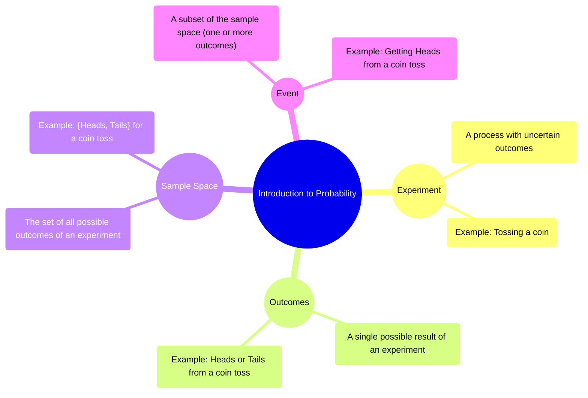
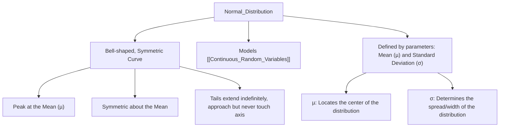
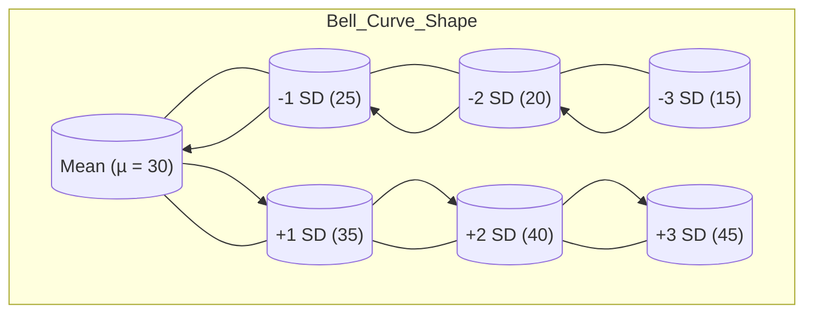
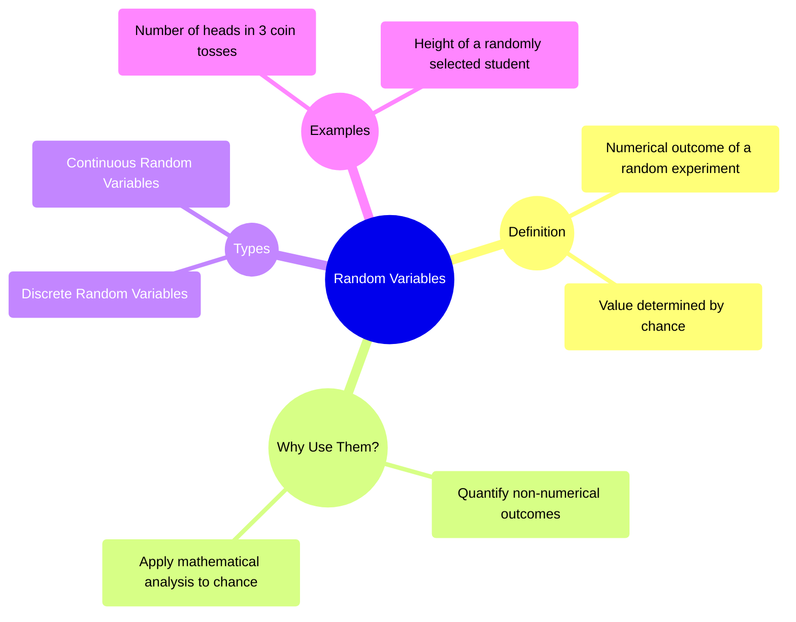
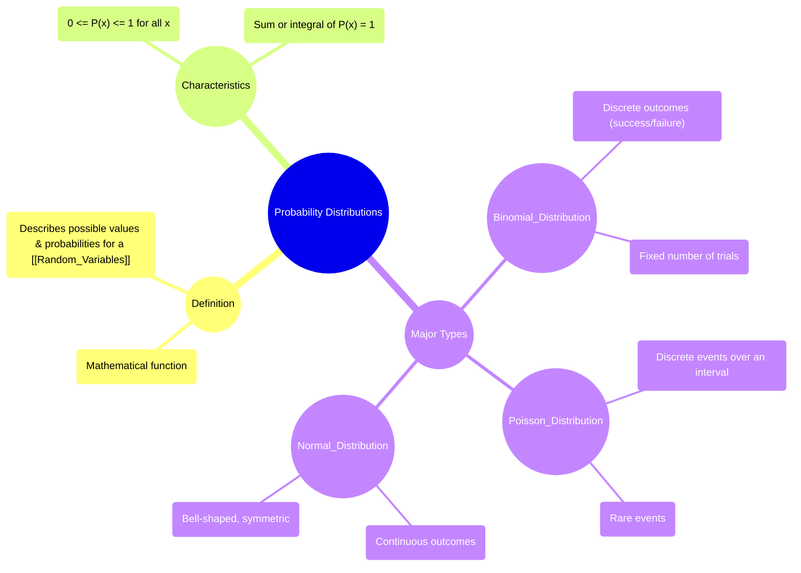
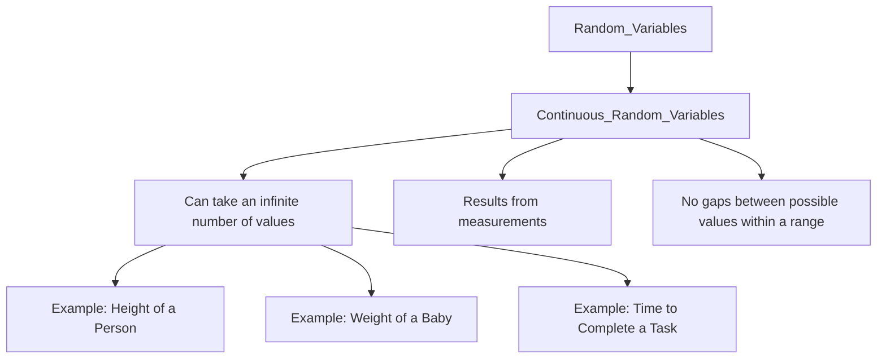
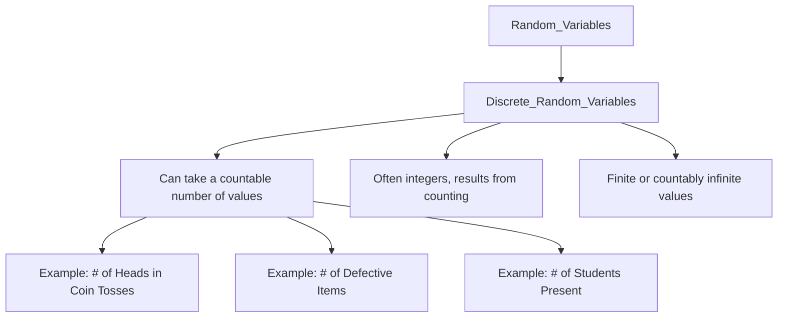
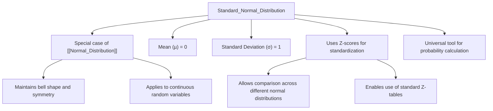

# 6 Probability And Probability Distributions

Comprehensive resource for 6 Probability And Probability Distributions.


---

## 6 Probability And Probability Distributions Hub


## Overview
This unit serves as a foundational exploration into the concepts of probability and the various distributions used to model random phenomena. It begins by establishing core definitions and principles of probability, building a solid understanding of how to quantify uncertainty and analyze events. Subsequently, it delves into the characteristics and applications of key probability distributions, including discrete and continuous random variables, as well as specific distributions like binomial, Poisson, and normal distributions. The aim is to equip you with the tools to both calculate probabilities and interpret the underlying patterns in data, moving from theoretical understanding to practical application.

## Learning Objectives
*   Define different terms of probability, like experiment, outcomes, sample space, events, and so on.
*   Distinguish the difference between mutually exclusive and non-mutually exclusive events.
*   Solve problems involving the use of the addition rules of probability.
*   Distinguish the difference between dependent and independent events of probability.
*   Apply multiplication theorems of probability to find the probability of dependent and independent events.
*   Discuss the three types of probability distributions, namely: Normal, Binomial, and Poisson's probability distributions.
*   Solve different types of problems applying the rules of normal and binomial distributions.

## Unit Applications & Real-World Relevance
Probability and probability distributions are indispensable in a vast array of real-world scenarios. In finance, they are used to model stock price movements and assess investment risks. In engineering, they help predict system failures and optimize maintenance schedules. Medical research relies on them for clinical trial analysis and understanding disease prevalence. Even in everyday decision-making, from weather forecasting to game theory, an intuitive grasp of probability aids in making more informed choices. For instance, understanding a normal distribution allows predicting customer behavior or quality control variations in manufacturing, while binomial distributions can model the success rate of marketing campaigns.

## Active Learning Prompts
*   Consider a complex real-world scenario (e.g., predicting the outcome of a sports game, assessing the risk of a natural disaster). How would you break down the problem using the concepts of events, sample spaces, and different probability rules?
*   Think about a situation where you need to make a decision under uncertainty. How could understanding probability distributions help you quantify the risks and potential rewards of different choices? Provide a specific example.
*   Given the characteristics of binomial, Poisson, and normal distributions, describe a unique real-world phenomenon that each distribution could effectively model. Explain *why* that particular distribution is the best fit.

## Unit Challenges & Common Misconceptions
A common challenge in probability is distinguishing between independent and dependent events, especially when the wording of a problem might be misleading. Students often assume independence where dependence exists, leading to incorrect application of multiplication rules. Another misconception arises in understanding "at least" or "at most" scenarios, which often require calculating cumulative probabilities. Furthermore, many struggle with interpreting the results of probability calculations in a practical context, beyond just getting the correct numerical answer. Grasping the distinction between discrete and continuous random variables, and when to apply which type of distribution, also presents a significant hurdle.

## Connections
  - [[Introduction_to_Probability]]
    - [[Mutually_Exclusive_and_Non_Mutually_Exclusive_Events]]
    - [[Addition_Rule_of_Probability]]
    - [[Dependent_and_Independent_Events]]
      - [[Multiplication_Rule_of_Probability]]
      - [[Conditional_Probability]]
    - [[Tree_Diagrams]]
  - [[Random_Variables]]
    - [[Discrete_Random_Variables]]
    - [[Continuous_Random_Variables]]
  - [[Types_of_Probability_Distributions_Overview]]
    - [[Binomial_Distribution]]
    - [[Poisson_Distribution]]
    - [[Normal_Distribution]]
      - [[Standard_Normal_Distribution]]
      - [[Empirical_Rule_and_Z_Score_Conversion]]

## Next Steps for Deeper Understanding
To deepen your understanding, explore advanced topics like the Central Limit Theorem, which underpins much of inferential statistics and demonstrates the widespread applicability of the normal distribution. Investigate other specialized probability distributions such as the Exponential or Chi-Squared distributions, and examine how they model different types of real-world data. Consider how Bayesian probability differs from frequentist approaches and its implications for decision-making under uncertainty. Finally, engage with statistical software (like R or Python libraries) to simulate random processes and visualize probability distributions, bringing these abstract concepts to life through practical computation.

## Possible Questions
[[CC2135_6_Probability_and_Probability_Distributions_Possible_Questions]]

---

---

## Introduction To Probability


## Definition
Before proceeding, understand that [[Random_Variables]] will be explored later, building upon these foundational definitions of chance.
At its core, probability quantifies the likelihood of an event occurring. It is the branch of mathematics that deals with uncertainty, providing a systematic way to analyze random phenomena. Imagine setting up a game: the initial actions, potential results, and specific conditions you're looking for all fall under probability. A simpler way to think about it is like predicting whether it will rain today: it might, or it might not, and probability gives us a number between 0 (impossible) and 1 (certain) to express this chance.

## The Mental Model
Imagine you are playing a game with a standard six-sided die. The act of rolling the die is your **experiment**. The specific number that lands face-up after the roll (e.g., a 3, a 6) is an **outcome**. The entire collection of all possible outcomes when you roll the die once (numbers 1, 2, 3, 4, 5, 6) is the **sample space**. If you're hoping to roll an even number (2, 4, or 6), that specific collection of outcomes is an **event**. Probability helps us quantify how likely that event is.


```text
// Scenario 1: Conceptual understanding of probability terms.
// Output:
// (A visual mindmap illustrating the core concepts of Introduction to Probability.)
// The mindmap will show "Introduction to Probability" as the central theme.
// Branches will extend to "Experiment" (defined as a process with uncertain outcomes, e.g., tossing a coin).
// "Outcomes" (single possible results, e.g., Heads or Tails).
// "Sample Space" (all possible outcomes, e.g., {Heads, Tails}).
// "Event" (a subset of the sample space, e.g., Getting Heads).
```
*Note: This `mindmap` visually organizes the fundamental terms in probability, showing their hierarchical relationships.*

## Context & Framework
#### Unpacking the Elements of Chance
To navigate the realm of probability, it is essential to first establish a common vocabulary. An **experiment** is any process that yields an observable outcome that cannot be predicted with certainty. For instance, flipping a coin, rolling a die, or drawing a card are all experiments. The individual results of an experiment are called **outcomes**. When you flip a coin, "heads" is an outcome, and "tails" is another. The **sample space**, denoted by $S$, is the complete set of all possible outcomes of an experiment. For a single coin flip, $S = \{Heads, Tails\}$. An **event** is any subset of the sample space; it can be a single outcome or a collection of outcomes. For example, in a coin flip, "getting heads" is an event, as is "getting tails." These foundational definitions provide the structural 'Lego' pieces for building more complex probabilistic models.

## The Mastery Deep Dive
#### Mapping the Landscape: Interconnected Concepts
Understanding the relationships between these core concepts is critical. An **experiment** *produces* **outcomes**. The collection of *all* possible **outcomes** forms the **sample space**. An **event** is then simply a *specific collection* of these outcomes, a subset of the sample space, that we are interested in. This hierarchy ensures that every probabilistic statement is grounded in a clearly defined context. For instance, if the experiment is drawing a card from a deck, a specific outcome might be the "Ace of Spades." The sample space would be all 52 cards. An event could be "drawing an Ace" (comprising 4 outcomes) or "drawing a red card" (comprising 26 outcomes).

#### The Rigorous Translator: From Idea to Notation
Translating intuitive probabilistic ideas into formal mathematical notation is crucial for precise analysis and communication. The sample space is typically denoted by the capital letter $S$. Individual outcomes are often represented by lowercase letters, such as $\omega$ (omega). Events are usually represented by capital letters like $A, B, C$, etc. The probability of an event $A$ is written as $P(A)$. When an event $A$ can happen in $h$ ways out of a total of $n$ equally likely outcomes in the sample space $S$, the probability of event $A$ is formally defined as:
$$ \boxed{\displaystyle P(A) = \frac{\text{Number of favorable outcomes for A}}{\text{Total number of possible outcomes in S}} = \frac{n(A)}{n(S)}} $$
This formula serves as the fundamental bridge between the conceptual understanding of chance and its quantitative expression.

## Constraints & Limitations
#### The Illusory Certainty: Common Pitfalls
A common pitfall in grasping basic probability is the incorrect identification of the sample space or the outcomes. If the sample space is not exhaustively defined, or if outcomes are not treated as equally likely (when they should be), then all subsequent probability calculations will be flawed. For example, when rolling two dice, simply listing "sums" as outcomes (e.g., sum of 2, sum of 3, etc.) without considering the individual die combinations (e.g., (1,1), (1,2), (2,1)) leads to an incorrect assumption of equally likely outcomes. Another error is confusing an event with an outcome; an event can be a collection, while an outcome is a single result.

## Significance & Application
The principles of probability are foundational to virtually all quantitative fields. In academic settings, it underpins statistics, enabling hypothesis testing, data analysis, and predictive modeling in research across sciences, social sciences, and engineering. In the real world, probability is indispensable for risk assessment in insurance, financial modeling, quality control in manufacturing, predictive analytics in marketing, and even in daily decision-making like evaluating medical test results. It provides the essential framework for understanding and making informed decisions in an uncertain world.

## The Worked Example
Consider an experiment of rolling a single, fair six-sided die once.

1.  **Define the Experiment:** The act of rolling the die.
2.  **List Possible Outcomes:** The numbers that can land face-up. These are 1, 2, 3, 4, 5, 6.
3.  **Identify the Sample Space (S):** The set of all possible outcomes. $S = \{1, 2, 3, 4, 5, 6\}$.
4.  **Define an Event (A):** Let event A be "rolling an even number."
5.  **Identify Outcomes for Event A:** The outcomes for event A are 2, 4, 6. So, $A = \{2, 4, 6\}$.
6.  **Calculate the Probability of Event A ($P(A)$):**
    *   Number of favorable outcomes for A, $n(A) = 3$.
    *   Total number of possible outcomes in S, $n(S) = 6$.
    *   Using the formula $P(A) = \frac{n(A)}{n(S)}$:
        $$ \displaystyle P(A) = \frac{3}{6} = \frac{1}{2} = 0.5 $$
    So, the probability of rolling an even number is 0.5 or 50%.

## The Proving Ground
*Test your mastery. Cover the solutions below to test yourself first.*

#### Level 1: The Sanity Check (Verification)
**The Question:** Define the term "sample space" in the context of a probability experiment.
> **Solution:** The sample space is the set of all possible outcomes of a probability experiment.

#### Level 2: The Crucible (Mastery & Edge Cases)
**The Scenario:** You have a bag containing 3 red balls, 2 blue balls, and 1 green ball. You perform an experiment of drawing one ball at random.
(a) List all the individual outcomes of this experiment.
(b) Identify the sample space for this experiment.
(c) Define an event "drawing a primary color" and list its outcomes.
> **Solution:**
> (a) The individual outcomes are: Red, Red, Red, Blue, Blue, Green.
> (b) The sample space $S = \{Red, Blue, Green\}$. (Note: Even though there are multiple red balls, "Red" is a single distinct outcome in terms of color).
> (c) The event "drawing a primary color" would include: Red, Blue. Its outcomes are $\{Red, Blue\}$.

## Key Takeaways
*   Probability quantifies the likelihood of events, built upon defining experiments, outcomes, sample spaces, and specific events.
*   The sample space is the complete set of all possible results of an experiment, while an event is a particular subset of these outcomes.
*   The probability of an event is calculated as the ratio of favorable outcomes to the total possible outcomes, assuming equal likelihood.

## Knowledge Graph Connections
| Concept                     | Connection / Relationship                                                                   |
| :
-------------------------- | :
------------------------------------------------------------------------------------------ |
| [[Random_Variables]]        | Provides the fundamental concepts for defining and understanding random variables.           |
| [[Mutually_Exclusive_and_Non_Mutually_Exclusive_Events]] | Defines the core events on which these probability classifications are built. |
| [[Addition_Rule_of_Probability]] | Explains the fundamental principles for combining probabilities of different events.         |
| [[Dependent_and_Independent_Events]] | Introduces the nature of relationships between events that influence their probabilities. |
| [[Tree_Diagrams]]           | Utilizes the foundational definitions of outcomes and events to visualize sequences.        |
---

---

## Normal Distribution


## Definition
Before proceeding, ensure you master [[Types_of_Probability_Distributions_Overview]] and [[Continuous_Random_Variables]] because the normal distribution is the most important continuous probability distribution.
The Normal Distribution, also known as the **Gaussian distribution** or the **"bell curve,"** is a **continuous probability distribution** that is symmetric about its mean. It is characterized by its distinctive bell-shaped curve, where the majority of data points cluster around the mean, and the frequency of data points gradually decreases as one moves further away from the mean. It is defined by two parameters: its mean ($\mu$) and its standard deviation ($\sigma$). A simpler way to think about it: imagine a natural phenomenon like human height. Most people are "average" height, fewer are very tall, and fewer still are very short. When you plot these heights, you get a beautiful, smooth, bell-shaped curve – that's the normal distribution.

## The Mental Model
Imagine a perfectly balanced seesaw (the mean). People of varying weights are trying to sit on it. Most people are near the center, making it stable. As you move further out, fewer people can sit there without tipping the seesaw. The shape formed by the distribution of people on the seesaw (with the most in the middle and fewer at the ends) perfectly mimics the bell curve. The mean is the center, and the standard deviation tells you how "spread out" the people are on the seesaw.


```text
// Scenario 1: Conceptual understanding of the Normal Distribution's characteristics.
// Output:
// (A visual graph diagram illustrating the characteristics of the Normal Distribution.)
// The diagram shows "Normal_Distribution" branching to "Bell-shaped, Symmetric Curve", "Models Continuous_Random_Variables", and "Defined by parameters: Mean (µ) and Standard Deviation (σ)".
// Further branches elaborate on "Bell-shaped, Symmetric Curve": "Peak at the Mean (µ)", "Symmetric about the Mean", "Tails extend indefinitely, approach but never touch axis".
// And on "Parameters": "µ: Locates the center of the distribution", "σ: Determines the spread/width of the distribution".
```
*Note: This `graph TD` visually organizes the key characteristics and defining parameters of the Normal Distribution.*

## Context & Framework
#### The Universal Pattern: A Natural Phenomenon
The normal distribution is arguably the most important distribution in statistics due to its ubiquitous presence in natural, social, and physical phenomena. Many variables (e.g., height, blood pressure, measurement errors, IQ scores) tend to be normally distributed, or at least approximately so. Its importance is further cemented by the Central Limit Theorem, which states that the distribution of sample means will be approximately normal, regardless of the population distribution, provided the sample size is sufficiently large.
Key characteristics of a Normal Distribution:
1.  **Bell Shape and Symmetry:** The curve is bell-shaped and perfectly symmetrical around its mean ($\mu$). Half of the total area under the curve lies to the left of the mean, and half lies to the right.
2.  **Mean, Median, Mode Coincidence:** For a perfectly normal distribution, the mean, median, and mode are all equal and located at the center of the distribution.
3.  **Total Area = 1 (or 100%):** The entire area under the probability density curve is equal to 1, representing the total probability of all possible outcomes.
4.  **Asymptotic Tails:** The tails of the curve extend indefinitely in both directions, approaching (but never touching) the horizontal axis. Although they never touch, the area beyond $\mu \pm 3\sigma$ (mean plus/minus three standard deviations) is considered virtually zero for practical purposes.

## The Mastery Deep Dive
#### The Axiom: Probability Density Function (PDF)
The probability density function (PDF) for a normal distribution, denoted as $f(x)$, describes the relative likelihood for a continuous random variable $X$ to take on a given value $x$. The formula is:
$$ \boxed{\displaystyle f(x) = \frac{1}{\sigma \sqrt{2\pi}} e^{-\frac{1}{2}\left(\frac{x-\mu}{\sigma}\right)^2}} $$
Where:
*   $f(x)$ is the probability density at value $x$.
*   $\mu$ (mu) is the mean of the distribution, which is also its center and peak.
*   $\sigma$ (sigma) is the standard deviation of the distribution, which measures its spread.
*   $\pi$ (pi) is the mathematical constant (approximately 3.14159).
*   $e$ is Euler's number (approximately 2.71828).

This formula dictates the precise shape of the bell curve. The term $(x-\mu)/\sigma$ is particularly important, as it standardizes the distance of $x$ from the mean in terms of standard deviations, a concept central to the [[Standard_Normal_Distribution]]. The function never actually reaches zero, illustrating the asymptotic nature of the tails.

| Symbol      | Name                     | Unit/Description | Analogy                                   |
| :
---------- | :
----------------------- | :
--------------- | :
---------------------------------------- |
| $f(x)$      | Probability Density      | Density          | Relative likelihood of a specific value.  |
| $\mu$       | Mean                     | Unit of $x$      | The average or central value.             |
| $\sigma$    | Standard Deviation       | Unit of $x$      | How spread out the data is from the mean. |
| $\pi$       | Pi                       | Constant         | Circle constant, fundamental in many areas. |
| $e$         | Euler's Number           | Constant         | Base of natural logarithms, used in growth. |

## Constraints & Limitations
#### The "Oops!" List: Deviations from Normality
A common mistake is assuming that all continuous data is normally distributed. While many phenomena approximate normality, some datasets are heavily skewed, bimodal, or have extremely heavy tails, making the normal distribution an inappropriate model. Applying normal distribution tests or inferences to non-normal data can lead to incorrect conclusions. Tools like histograms, Q-Q plots, and statistical tests (e.g., Shapiro-Wilk) should always be used to check for normality before proceeding with normal-based analyses. Additionally, the probability of an *exact single value* for a continuous variable is zero, a concept often difficult for new learners.

## Significance & Application
The normal distribution is foundational to inferential statistics, allowing for robust hypothesis testing, confidence interval construction, and prediction. In academic disciplines:
*   **Psychology/Education:** Modeling IQ scores, test results.
*   **Biology:** Analyzing population characteristics like height, weight.
*   **Economics:** Modeling financial data (e.g., stock returns) (though often with caveats for tail behavior).
In the real world:
*   **Manufacturing:** Quality control (e.g., ensuring product dimensions are within acceptable ranges).
*   **Healthcare:** Tracking health metrics like blood pressure or cholesterol levels.
*   **Social Sciences:** Analyzing survey data and demographics.
Its pervasive applicability makes it an indispensable tool for understanding variability and making statistically sound inferences from data.

## The Worked Example
Consider a dataset that is normally distributed with a mean ($\mu$) of 30 and a standard deviation ($\sigma$) of 5.

1.  **Visualize the Distribution:** The curve will be bell-shaped, centered at 30.
2.  **Interpret Spread:** Most of the data will fall between $30 - 3\sigma$ and $30 + 3\sigma$.
    *   One standard deviation from the mean: $[30-5, 30+5] =$
    *   Two standard deviations from the mean: $[30-10, 30+10] =$
    *   Three standard deviations from the mean: $[30-15, 30+15] =$
This means roughly 68% of data falls between 25 and 35, 95% between 20 and 40, and 99.7% between 15 and 45.


```text
// Scenario 1: Visualizing a Normal Distribution with its mean and standard deviations.
// Output:
// (A visual graph diagram illustrating the Normal Distribution's key points.)
// The diagram shows "Mean (µ = 30)" as the center.
// Branches extend to standard deviation points: "-1 SD (25)", "+1 SD (35)", "-2 SD (20)", "+2 SD (40)", "-3 SD (15)", "+3 SD (45)".
// The "Bell_Curve_Shape" subgraph visually connects these points, emphasizing the symmetry and spread around the mean.
//
// This visualization demonstrates how the mean and standard deviation define the center and spread of the normal distribution, respectively.
```
*Note: This `graph TD` illustrates the symmetric nature of the normal distribution, centered around the mean ($\mu$), with key points at each standard deviation ($\sigma$) marking its spread.*

## The Proving Ground
*Test your mastery. Cover the solutions below to test yourself first.*

#### Level 1: The Sanity Check (Verification)
**The Question:** What two parameters define any normal distribution?
> **Solution:** The mean ($\mu$) and the standard deviation ($\sigma$).

#### Level 2: The Crucible (Mastery & Edge Cases)
**The Scenario:** A new drug is being tested, and its effect on blood pressure is expected to be normally distributed. However, due to a measurement error, the standard deviation is reported as zero. Explain why a normal distribution with a standard deviation of zero is a theoretically "impossible case" for a continuous random variable and what it would imply.
> **Solution:** A normal distribution with a standard deviation ($\sigma$) of zero is theoretically impossible for a *continuous* random variable. Standard deviation measures the spread or variability of data. If $\sigma=0$, it implies that all data points are identical and equal to the mean ($\mu$). For a continuous random variable, this would mean that the variable can only take on *one exact value* with 100% probability, contradicting the definition of a continuous variable (which can take an infinite number of values within a range). It would essentially collapse into a discrete point mass.

## Key Takeaways
*   The Normal Distribution is a continuous, symmetric, bell-shaped probability distribution.
*   It is defined by its mean ($\mu$) and standard deviation ($\sigma$).
*   The mean, median, and mode coincide at the center of the distribution.

## Knowledge Graph Connections
| Concept                     | Connection / Relationship                                                                   |
| :
-------------------------- | :
------------------------------------------------------------------------------------------ |
| [[Types_of_Probability_Distributions_Overview]] | Is the most prominent continuous probability distribution, building on its overview. |
| [[Continuous_Random_Variables]] | Specifically models this type of random variable, dealing with measurable outcomes.        |
| [[Standard_Normal_Distribution]] | Is a special case of the normal distribution, with specific mean and standard deviation values. |
| [[Empirical_Rule_and_Z_Score_Conversion]] | These concepts are directly applicable to the normal distribution to interpret data spread. |
---

---

## Random Variables


## Definition
Before proceeding, ensure you master [[Introduction_to_Probability]] because random variables are numerical representations of outcomes from probability experiments.
A random variable is a **variable whose value is a numerical outcome of a random phenomenon or experiment**. Its value is determined by chance. Unlike algebraic variables that have a fixed, albeit unknown, value, a random variable can take on different values with associated probabilities. A simpler way to think about it: imagine rolling a die. The outcome itself is a number (1, 2, 3, 4, 5, or 6). This numerical outcome is the random variable. We don't know *which* number it will be before we roll, but we know the possible values and their probabilities.

## The Mental Model
Imagine you're at a carnival game where you spin a wheel. The actual physical outcome is where the pointer lands (e.g., "Red Sector," "Blue Sector," "Green Sector"). A **random variable** is simply a way to assign a *number* to each of those outcomes. For example, if landing on "Red" gives you 10 points, "Blue" 5 points, and "Green" 0 points, then the "points won" in this game is a random variable. It's a numerical summary of a random process. We're translating qualitative results into quantifiable values that we can then analyze mathematically.


```text
// Scenario 1: Conceptual overview of Random Variables.
// Output:
// (A visual mindmap illustrating the core concepts of Random Variables.)
// The mindmap will show "Random Variables" as the central theme.
// Branches will extend to "Definition" (numerical outcome, value by chance).
// "Why Use Them?" (quantify outcomes, mathematical analysis).
// "Types" (Discrete and Continuous).
// "Examples" (number of heads, student height).
```
*Note: This `mindmap` visually organizes the definition, purpose, types, and examples of random variables.*

## Context & Framework
#### Quantifying Uncertainty: Bridging Outcomes to Numbers
Random variables serve as a critical bridge between the qualitative outcomes of an experiment and the quantitative tools of probability and statistics. By assigning numerical values to the outcomes, we can apply mathematical functions, plot distributions, and calculate expected values. This transformation allows us to move beyond simply listing "heads" or "tails" to talking about the "number of heads" in a series of flips, which is a numerical value.
A **random experiment** is a process whose outcome is not known in advance. The result is uncertain. For example, the tossing of an unbiased coin is a random experiment because we don't know whether it will be heads or tails. A random variable, $X$, assigns a real number to each outcome in the sample space of a random experiment. This numerical assignment is what enables statistical analysis, as we can then talk about the probability of $X$ taking on certain values.

## The Mastery Deep Dive
#### Mapping the Landscape: Categorization by Countability
The primary way to map the landscape of random variables is by distinguishing their types based on the nature of the numerical values they can assume:
1.  **Discrete Random Variables:** These variables can take on only a **countable** number of distinct values. Typically, these are integers resulting from counting. For example, the number of defective items in a batch, the number of heads in five coin tosses, or the number of students present in a class are all discrete random variables. Even if the number of possible values is very large, as long as it's finite or countably infinite, it's discrete.
2.  **Continuous Random Variables:** These variables can take on an **infinite** number of possible values within a given range. These values typically arise from measurements. For example, the height of a person, the weight of a baby, the time taken to complete a task, or the temperature in a room are all continuous random variables. Between any two possible values, there is an infinite number of other possible values.

#### The Rigorous Translator: From Event to Numerical Function
Formally, a random variable $X$ is a **function** that maps each outcome $\omega$ in the sample space $S$ of an experiment to a unique real number, $X(\omega)$. This transformation is critical because it allows us to define probabilities for numerical events. Instead of $P(\{Heads\})$, we can define $P(X=1)$ if $X$ represents the number of heads (where Heads = 1, Tails = 0). This formalization enables the development of probability distributions, which associate each possible value of the random variable with its probability of occurrence. This is the bridge that links the abstract concept of chance to concrete mathematical models.

## Constraints & Limitations
#### The Illusory Certainty: Confusing Values with Randomness
A common misconception is to confuse a variable that *produces* random numbers (like a computer's random number generator) with a true random variable defined by an experiment. While a generator outputs numbers, a random variable is strictly tied to the *outcomes of an actual random experiment*. Another pitfall is mistaking any numerical observation for a random variable; the key is that the value must be *determined by chance* from an experiment. For example, a student's fixed ID number is not a random variable, but the ID number of a *randomly selected* student is.

## Significance & Application
Random variables are the fundamental building blocks for all statistical inference and modeling. They enable us to apply mathematical rigor to real-world uncertainty. Academically, they form the basis for understanding probability distributions (like the binomial, Poisson, and normal distributions), which are central to inferential statistics. In practical applications, random variables are used extensively in risk management (e.g., modeling insurance claims), engineering (e.g., stress on materials), finance (e.g., stock price fluctuations), and science (e.g., measurement errors). They transform unpredictable events into quantifiable data, allowing for predictions, hypothesis testing, and informed decision-making.

## The Worked Example
Consider the experiment of tossing a fair coin three times.

1.  **Define the Sample Space (S):**
    The possible outcomes are: HHH, HHT, HTH, THH, HTT, THT, TTH, TTT.
2.  **Define a Random Variable (X):**
    Let $X$ be the number of heads obtained in the three tosses.
3.  **Map Outcomes to Numerical Values for X:**
    *   HHH $\to X=3$
    *   HHT $\to X=2$
    *   HTH $\to X=2$
    *   THH $\to X=2$
    *   HTT $\to X=1$
    *   THT $\to X=1$
    *   TTH $\to X=1$
    *   TTT $\to X=0$
4.  **Identify the Possible Values of X:**
    The random variable $X$ can take on the values $\{0, 1, 2, 3\}$.
5.  **Calculate Probabilities for Each Value of X:**
    *   $P(X=0) = P(\{TTT\}) = 1/8$
    *   $P(X=1) = P(\{HTT, THT, TTH\}) = 3/8$
    *   $P(X=2) = P(\{HHT, HTH, THH\}) = 3/8$
    *   $P(X=3) = P(\{HHH\}) = 1/8$

This shows how a random variable converts non-numerical outcomes (like HHH) into numerical values (like 3) for easier probabilistic analysis.

## The Proving Ground
*Test your mastery. Cover the solutions below to test yourself first.*

#### Level 1: The Sanity Check (Verification)
**The Question:** What is the defining characteristic of a random variable?
> **Solution:** A random variable is a variable whose value is a numerical outcome of a random experiment, determined by chance.

#### Level 2: The Crucible (Mastery & Edge Cases)
**The Scenario:** A new product's success is being evaluated. The outcomes are "Failure," "Moderate Success," or "Wild Success."
(a) How can you define a random variable to quantify these outcomes?
(b) Give an example of a value this random variable might take for "Moderate Success."
> **Solution:**
> (a) Define a random variable $X$ representing the "degree of success."
> (b) For example:
>     *   $X=0$ for "Failure"
>     *   $X=1$ for "Moderate Success"
>     *   $X=2$ for "Wild Success"
> (Other numerical assignments are also valid, as long as they are consistent and ordered if appropriate).

## Key Takeaways
*   A random variable assigns numerical values to the outcomes of a random experiment.
*   It quantifies uncertainty, allowing for mathematical analysis of chance events.
*   Random variables are categorized as either discrete (countable values) or continuous (infinite values within a range).

## Knowledge Graph Connections
| Concept                     | Connection / Relationship                                                                   |
| :
-------------------------- | :
------------------------------------------------------------------------------------------ |
| [[Introduction_to_Probability]] | Provides the foundational understanding of experiments and outcomes which random variables quantify. |
| [[Discrete_Random_Variables]] | Is a specific type of random variable, characterized by countable outcomes.                  |
| [[Continuous_Random_Variables]] | Is a specific type of random variable, characterized by measurable outcomes within a range. |
| [[Types_of_Probability_Distributions_Overview]] | Random variables are the subject of probability distributions, which describe their behavior. |
---

---

## Types Of Probability Distributions Overview


## Definition
Before proceeding, ensure you master [[Random_Variables]] because probability distributions describe the behavior and likelihood of different values of random variables.
A probability distribution is a **mathematical function that describes all the possible values and probabilities for a random variable in a given range**. It provides a comprehensive summary of all possible outcomes of a random experiment and their associated likelihoods. Think of it as a "map" that tells you how likely each value or range of values of a random variable is to occur. There are many different types of probability distributions, each suited to model different kinds of random phenomena. A simpler way to think about it: it's like a recipe that tells you exactly how much of each ingredient (outcome) you're going to get when you "cook" (perform) a random experiment.

## The Mental Model
Imagine you're tracking the results of a game where you spin a pointer on a numbered wheel. A probability distribution is like a detailed graph that shows you every possible score you could get and how frequently you'd expect to get each score if you spun the wheel many, many times. It visually or mathematically lays out the entire spectrum of possibilities, rather than just telling you about one specific outcome.


```text
// Scenario 1: Conceptual overview of probability distributions and their types.
// Output:
// (A visual mindmap illustrating the core concepts and types of Probability Distributions.)
// The mindmap shows "Probability Distributions" as the central theme.
// Branches extend to "Definition" (mathematical function, describes values/probabilities for Random_Variables).
// "Characteristics" (probabilities between 0 and 1, sum/integral is 1).
// "Major Types" (Binomial_Distribution with discrete/fixed trials; Poisson_Distribution with discrete/rare events; Normal_Distribution with continuous/bell-shaped characteristics).
```
*Note: This `mindmap` visually organizes the definition, characteristics, and major types of probability distributions, highlighting their key features.*

## Context & Framework
#### The Universe of Chance: Mapping Probable Outcomes
Probability distributions provide the foundational framework for understanding the behavior of random variables. They describe how the probabilities are "distributed" across all the possible values that a random variable can take. The type of distribution used depends fundamentally on whether the random variable is discrete or continuous, and the specific nature of the random experiment.
Two key characteristics universally apply to all probability distributions:
1.  **Probability Range:** For any given value $x$ of a random variable, its probability $P(X=x)$ or probability density $f(x)$ must be between 0 and 1, inclusive: $0 \le P(x) \le 1$.
2.  **Total Probability:** The sum of all probabilities for a discrete random variable, or the integral of the probability density function for a continuous random variable, must equal 1. This signifies that the total probability of all possible outcomes is 100%.
    *   For discrete: $\Sigma P(x) = 1$
    *   For continuous: $\int f(x) dx = 1$
These characteristics ensure that the distribution is a valid and complete model of uncertainty.

## The Mastery Deep Dive
#### Taxonomist: Categorizing the Models of Uncertainty
Understanding the major types of probability distributions is key to selecting the correct model for a given real-world scenario. They are broadly categorized based on the nature of the random variable they describe:
*   **Binomial Distribution:** This is a **discrete** probability distribution that models the number of successes in a fixed number of independent trials, where each trial has only two possible outcomes (success or failure). It's applicable to discrete random variables only. (e.g., number of heads in 10 coin flips).
*   **Poisson Distribution:** This is also a **discrete** probability distribution. It models the number of events occurring in a fixed interval of time or space, given that these events occur with a known average rate and independently of the time since the last event. It's often used for rare events. (e.g., number of customer calls per hour).
*   **Normal Distribution:** This is a **continuous** probability distribution, characterized by its symmetric, bell-shaped curve. It's one of the most important distributions in statistics, as many natural phenomena are approximately normally distributed. It's applicable to continuous random variables. (e.g., heights of people, measurement errors).

Each of these distributions has unique parameters that define its specific shape and location (e.g., mean, standard deviation, number of trials, success probability), allowing for precise modeling of various types of random behavior.

## Constraints & Limitations
#### The "Oops!" List: Mismatching Variable Type
A common error is attempting to use a discrete probability distribution (like binomial or Poisson) to model a continuous random variable, or vice-versa. For example, trying to apply the binomial distribution to model the exact height of students is a fundamental mismatch. Discrete distributions are for countable outcomes, while continuous distributions are for measurable outcomes over a range. This mismatch leads to incorrect probabilistic models and flawed conclusions. Always ensure the chosen distribution's properties align with the type of random variable and the nature of the experiment.

## Significance & Application
The ability to identify and apply the correct probability distribution is paramount in both academic and practical settings. In academic research, selecting the appropriate distribution (e.g., Normal for hypothesis testing of means, Binomial for analyzing proportions) is critical for valid statistical analysis. In the real world:
*   **Engineering:** Normal distribution is used for quality control (e.g., part dimensions), while Poisson might model machine failures over time.
*   **Medicine:** Binomial distribution can model the success rate of a treatment.
*   **Finance:** Normal distribution (or variants) often model asset returns.
*   **Social Sciences:** Understanding these distributions allows for modeling survey responses, demographic trends, and more.
This foundational knowledge empowers analysts and researchers to quantify uncertainty, make predictions, and drive evidence-based decisions in a wide array of domains.

## The Worked Example
**Scenario 1: Identifying a Binomial Distribution**
You are performing an experiment where you flip a fair coin 10 times and count the number of heads.
*   **Random Variable Type:** Discrete (number of heads is countable).
*   **Characteristics:** Fixed number of trials (10 flips), two outcomes per trial (heads/tails), trials are independent, probability of success (0.5 for heads) is constant.
*   **Conclusion:** This scenario can be modeled by a [[Binomial_Distribution]].

**Scenario 2: Identifying a Poisson Distribution**
You are observing the number of emails received by a customer service department in a 1-hour period. Historically, they receive an average of 15 emails per hour.
*   **Random Variable Type:** Discrete (number of emails is countable).
*   **Characteristics:** Events occur over a fixed interval (1 hour), at a known average rate (15/hour), and independently.
*   **Conclusion:** This scenario can be modeled by a [[Poisson_Distribution]].

**Scenario 3: Identifying a Normal Distribution**
You are measuring the heights of adult males in a large population.
*   **Random Variable Type:** Continuous (height is a measurement, infinite values possible within a range).
*   **Characteristics:** Measurements tend to cluster around a mean, with fewer values further away, forming a symmetric, bell-shaped curve.
*   **Conclusion:** This scenario can be modeled by a [[Normal_Distribution]].

## The Proving Ground
*Test your mastery. Cover the solutions below to test yourself first.*

#### Level 1: The Sanity Check (Verification)
**The Question:** What are the two universal characteristics that apply to all probability distributions?
> **Solution:** 1. All probabilities (or probability densities) must be between 0 and 1. 2. The sum (for discrete) or integral (for continuous) of all probabilities must equal 1.

#### Level 2: The Crucible (Mastery & Edge Cases)
**The Scenario:** A continuous probability distribution is defined over the interval. A student attempts to assign a probability of 0.5 to the exact value $X=0.5$. Why is this approach fundamentally flawed for a continuous distribution?
> **Solution:** For a continuous probability distribution, the probability of any *exact single value* (like $X=0.5$) is theoretically zero. Probabilities are defined over intervals, representing the area under the probability density function. Assigning a non-zero probability to a single point contradicts the nature of continuous random variables.

## Key Takeaways
*   Probability distributions map all possible values of a random variable to their probabilities.
*   All probabilities must be between 0 and 1, and their sum/integral must equal 1.
*   Key types include Binomial (discrete, fixed trials), Poisson (discrete, events over interval), and Normal (continuous, bell-shaped).

## Knowledge Graph Connections
| Concept                     | Connection / Relationship                                                                   |
| :
-------------------------- | :
------------------------------------------------------------------------------------------ |
| [[Random_Variables]]        | Probability distributions describe the behavior and likelihood of the values taken by random variables. |
| [[Discrete_Random_Variables]] | Is a type of random variable modeled by discrete probability distributions like Binomial and Poisson. |
| [[Continuous_Random_Variables]] | Is a type of random variable modeled by continuous probability distributions like the Normal Distribution. |
| [[Binomial_Distribution]]   | Is a specific type of discrete probability distribution outlined in this overview.        |
| [[Poisson_Distribution]]    | Is a specific type of discrete probability distribution outlined in this overview.        |
| [[Normal_Distribution]]     | Is a specific type of continuous probability distribution outlined in this overview.      |
---

---

## Addition Rule Of Probability


## Definition
Before proceeding, ensure you master [[Mutually_Exclusive_and_Non_Mutually_Exclusive_Events]] because the form of the addition rule depends critically on whether events can occur simultaneously.
The Addition Rule of Probability is used to find the probability that **at least one** of two or more events occurs. It addresses scenarios involving the "OR" conjunction. There are two primary forms of the rule, depending on whether the events are mutually exclusive or non-mutually exclusive. A simpler way to think about it: if you want to know the chance of either event A happening OR event B happening, the Addition Rule helps you calculate that total probability. It's like asking "What's the chance of rain or snow today?"

## The Mental Model
Imagine two buckets of colored balls. Bucket A has red and blue, Bucket B has yellow and green. If you want to know the probability of drawing a red ball from Bucket A OR a yellow ball from Bucket B, you can simply add their probabilities because these are separate, distinct actions (mutually exclusive in this context).
Now, imagine a single bucket with red, blue, and striped balls (red and blue stripes). If you want to know the probability of drawing a red ball OR a blue ball, you need to be careful not to double-count the striped balls. This is where the general addition rule comes in, accounting for the "overlap."

## Context & Framework
#### The Disjoint Sum: Mutually Exclusive Events
When two events, $A$ and $B$, are **mutually exclusive** (meaning they cannot occur at the same time, so $A \cap B = \emptyset$), the probability that either $A$ or $B$ occurs is simply the sum of their individual probabilities. This is because there is no overlap to account for.
$$ \boxed{\displaystyle P(A \text{ or } B) = P(A \cup B) = P(A) + P(B)} $$
This rule extends to more than two mutually exclusive events. For example, if you're rolling a die, the probability of rolling a 1 or a 6 is $P(1) + P(6) = 1/6 + 1/6 = 2/6 = 1/3$. The formal justification comes from the axioms of probability which state that the probability of the union of disjoint events is the sum of their probabilities.

#### The Overlapping Adjustment: Non-Mutually Exclusive Events
When two events, $A$ and $B$, are **non-mutually exclusive** (meaning they can occur at the same time, so $A \cap B \neq \emptyset$), simply adding their probabilities would double-count the outcomes that are common to both events. To correct for this double-counting, the probability of their intersection (the outcomes where both $A$ and $B$ occur) must be subtracted.
$$ \boxed{\displaystyle P(A \text{ or } B) = P(A \cup B) = P(A) + P(B) - P(A \cap B)} $$
This is the general form of the Addition Rule and is always applicable. If events are mutually exclusive, then $P(A \cap B) = 0$, and the formula simplifies to the specific rule for mutually exclusive events. For example, the probability of drawing a red card or a King from a standard deck requires subtracting the probability of drawing a red King to avoid counting those cards twice.

## The Mastery Deep Dive
#### Step-by-Step Derivation: The Set Theory Foundation
The Addition Rule can be rigorously understood through basic set theory principles. For any two events $A$ and $B$ in a sample space $S$:
1.  **Start with the intuitive sum:** When we add $P(A) + P(B)$, we are essentially summing the "sizes" of the two sets of outcomes corresponding to $A$ and $B$.
2.  **Identify the overlap:** If $A$ and $B$ overlap (i.e., they are non-mutually exclusive), then the outcomes in their intersection ($A \cap B$) are counted once as part of $P(A)$ and again as part of $P(B)$. This means the intersection has been counted twice.
3.  **Correct for double-counting:** To get the correct probability of $A$ or $B$ occurring (the union, $A \cup B$), we must subtract the probability of the overlap (the intersection, $A \cap B$) once.
    $$ \begin{aligned}
    & P(A \cup B) = P(A) + P(B) - P(A \cap B) \quad \text{(General Addition Rule)}
    \end{aligned} $$
    This is because $n(A \cup B) = n(A) + n(B) - n(A \cap B)$ from set theory.
4.  **Special case for mutually exclusive events:** If $A$ and $B$ are mutually exclusive, then there is no overlap; their intersection is empty, so $P(A \cap B) = 0$. In this case, the general rule simplifies to:
    $$ \begin{aligned}
    & P(A \cup B) = P(A) + P(B) - 0 \\
    & P(A \cup B) = P(A) + P(B) \quad \text{(Addition Rule for Mutually Exclusive Events)}
    \end{aligned} $$
This systematic derivation ensures that the probability of the union of events is accurately calculated, regardless of whether they share outcomes.

## Constraints & Limitations
#### The "Oops!" List: Forgetting the Overlap
The most common error when applying the Addition Rule is forgetting to subtract the intersection when events are non-mutually exclusive. This leads to an inflated probability (greater than 1, or simply incorrect) for the union of events. For example, calculating the probability of "drawing a red card OR a face card" and simply adding $P(Red) + P(Face)$ without subtracting $P(Red \cap Face)$ will yield an incorrect result because red face cards would be counted twice. Always verify whether events are mutually exclusive before applying the simpler rule.

## Significance & Application
The Addition Rule is a cornerstone of probability theory, with profound implications across various disciplines. In quality control, it's used to calculate the probability of a product having *at least one* of several possible defects. In medical diagnosis, it helps determine the likelihood of a patient having *either* symptom A *or* symptom B. Financial analysts use it to assess the probability of a portfolio experiencing *either* a market downturn *or* a specific company's stock drop. Fundamentally, this rule provides the mathematical basis for combining probabilities of different events to make comprehensive inferences about complex scenarios, enabling more robust risk assessments and decision-making.

## The Worked Example
**Scenario 1: Mutually Exclusive Events**
A company manufactures light bulbs. The probability that a bulb is defective in wiring (Event W) is 0.02, and the probability that it is defective in its filament (Event F) is 0.03. These types of defects are mutually exclusive (a bulb cannot have both). What is the probability that a randomly selected bulb has a wiring defect OR a filament defect?

1.  Identify Events:
    *   Event W: Bulb has wiring defect, $P(W) = 0.02$.
    *   Event F: Bulb has filament defect, $P(F) = 0.03$.
2.  Determine if Mutually Exclusive: Yes, stated as mutually exclusive.
3.  Apply Addition Rule for Mutually Exclusive Events:
    $$ \boxed{\displaystyle P(W \cup F) = P(W) + P(F)} $$
    $$ P(W \cup F) = 0.02 + 0.03 = 0.05 $$
The probability that a bulb has a wiring defect OR a filament defect is 0.05 (5%).

**Scenario 2: Non-Mutually Exclusive Events**
In a survey of college students, 40% read newspaper A (Event A), 30% read newspaper B (Event B), and 10% read both (Event $A \cap B$). What is the probability that a randomly selected student reads newspaper A OR newspaper B?

1.  Identify Events and Probabilities:
    *   Event A: Reads newspaper A, $P(A) = 0.40$.
    *   Event B: Reads newspaper B, $P(B) = 0.30$.
    *   Intersection: Reads both, $P(A \cap B) = 0.10$.
2.  Determine if Mutually Exclusive: No, $P(A \cap B) \neq 0$.
3.  Apply General Addition Rule:
    $$ \boxed{\displaystyle P(A \cup B) = P(A) + P(B) - P(A \cap B)} $$
    $$ P(A \cup B) = 0.40 + 0.30 - 0.10 = 0.60 $$
The probability that a student reads newspaper A OR newspaper B is 0.60 (60%).

## The Proving Ground
*Test your mastery. Cover the solutions below to test yourself first.*

#### Level 1: The Sanity Check (Verification)
**The Question:** If events $X$ and $Y$ are mutually exclusive, write the formula for $P(X \text{ or } Y)$.
> **Solution:** $P(X \text{ or } Y) = P(X) + P(Y)$.

#### Level 2: The Crucible (Mastery & Edge Cases)
**The Scenario:** A card is drawn from a standard 52-card deck. Let event $A$ be "drawing a face card" (Jack, Queen, King) and event $B$ be "drawing a red card."
(a) Determine if events A and B are mutually exclusive.
(b) Calculate $P(A \cup B)$, the probability of drawing a face card or a red card.
> **Solution:**
> (a) No, events A and B are not mutually exclusive. There are 6 red face cards (King of Hearts, King of Diamonds, Queen of Hearts, Queen of Diamonds, Jack of Hearts, Jack of Diamonds) that are common to both events. Therefore, $P(A \cap B) = 6/52$.
> (b) $P(A) = 12/52$ (4 Jacks, 4 Queens, 4 Kings).
> $P(B) = 26/52$ (26 red cards).
> $P(A \cap B) = 6/52$ (6 red face cards).
> Using the general Addition Rule:
> $P(A \cup B) = P(A) + P(B) - P(A \cap B) = 12/52 + 26/52 - 6/52 = 32/52 = 8/13$.

## Key Takeaways
*   The Addition Rule calculates the probability of at least one of two or more events occurring.
*   For mutually exclusive events, $P(A \cup B) = P(A) + P(B)$.
*   For non-mutually exclusive events, $P(A \cup B) = P(A) + P(B) - P(A \cap B)$ to correct for double-counting shared outcomes.

## Knowledge Graph Connections
| Concept                     | Connection / Relationship                                                                   |
| :
-------------------------- | :
------------------------------------------------------------------------------------------ |
| [[Mutually_Exclusive_and_Non_Mutually_Exclusive_Events]] | The choice of Addition Rule formula is directly dependent on this classification of events. |
| [[Introduction_to_Probability]] | Relies on the fundamental definitions of events and their probabilities.                   |
| [[Conditional_Probability]] | Can be used in conjunction with the Addition Rule to solve complex problems.               |
---

---

## Binomial Distribution


## Definition
Before proceeding, ensure you master [[Types_of_Probability_Distributions_Overview]] and [[Discrete_Random_Variables]] because the binomial distribution is a specific discrete probability distribution used for a particular type of experiment.
The Binomial Distribution is a **discrete probability distribution** that describes the number of successes in a **fixed number of independent trials**, where each trial has **only two possible outcomes** (typically labeled "success" or "failure"), and the **probability of success remains constant** for every trial. These individual trials are known as Bernoulli trials. A simpler way to think about it: imagine repeating a simple "yes/no" experiment (like a coin flip) a set number of times. The binomial distribution tells you how likely it is to get a certain number of "yes" results in those repeats. It literally means "two numbers" (bi-nomial), referring to the two outcomes.

## The Mental Model
Imagine you are playing a game where you try to shoot a basketball through a hoop 10 times. Each shot is either a "success" (it goes in) or a "failure" (it misses). Each shot is independent, and your skill (probability of success) doesn't change from shot to shot. The Binomial Distribution is the mathematical tool that tells you, for example, the probability of making exactly 7 shots out of those 10 attempts.

## Context & Framework
#### The Bernoulli Foundation: Two Outcomes, Many Trials
The binomial distribution is built upon the concept of a **Bernoulli trial**, which is a single experiment with only two possible outcomes: success (with probability $p$) and failure (with probability $q = 1-p$). The "binomial" aspect comes from the fact that we are interested in the distribution of outcomes when a Bernoulli trial is repeated multiple times.
The key characteristics for a situation to be modeled by a binomial distribution are:
1.  **Fixed Number of Trials (n):** The experiment consists of a predetermined number of repetitions.
2.  **Two Possible Outcomes:** Each trial must result in either a "success" or a "failure."
3.  **Independent Trials:** The outcome of one trial does not affect the outcome of any other trial.
4.  **Constant Probability of Success (p):** The probability of success remains the same for every trial.
If these conditions are met, the random variable $X$ representing the number of successes in $n$ trials follows a binomial distribution.

## The Mastery Deep Dive
#### The Solver: Binomial Probability Mass Function
For a random variable $X$ that follows a binomial distribution with $n$ trials and probability of success $p$, the probability of getting exactly $r$ successes is given by the Probability Mass Function (PMF):
$$ \boxed{\displaystyle P(X=r) = {n \choose r} p^r (1-p)^{n-r}} $$
Where:
*   $P(X=r)$ is the probability of exactly $r$ successes.
*   ${n \choose r} = \frac{n!}{r!(n-r)!}$ is the binomial coefficient, representing the number of ways to choose $r$ successes from $n$ trials.
*   $n$ is the total number of trials.
*   $r$ is the number of successes.
*   $p$ is the probability of success on a single trial.
*   $(1-p)$ is the probability of failure on a single trial, often denoted as $q$.

The term $p^r$ represents the probability of getting $r$ successes, and $(1-p)^{n-r}$ represents the probability of getting $(n-r)$ failures. The binomial coefficient accounts for all the different orders in which these $r$ successes and $(n-r)$ failures can occur.

| Symbol      | Name                     | Unit       | Analogy                                   |
| :
---------- | :
----------------------- | :
--------- | :
---------------------------------------- |
| $P(X=r)$    | Probability of $r$ successes | Proportion | Chance of getting your target count.      |
| $n$         | Total number of trials   | Count      | Total number of attempts.                 |
| $r$         | Number of successes      | Count      | Your desired number of positive outcomes. |
| $p$         | Probability of success   | Proportion | The individual chance of a "win" per try. |
| $(1-p)$ or $q$ | Probability of failure   | Proportion | The individual chance of a "loss" per try. |
| ${n \choose r}$ | Binomial coefficient   | Count      | Number of different paths to $r$ successes. |

## Constraints & Limitations
#### The "Oops!" List: Violating Assumptions
A common mistake is applying the binomial distribution to situations where its underlying assumptions are violated. For instance, if trials are *not* independent (e.g., drawing cards without replacement, which is a hypergeometric distribution scenario), or if the probability of success changes from trial to trial, the binomial formula will yield incorrect results. Another error is confusing a "fixed number of trials" with an "unlimited number of trials until success" (which would be a geometric or negative binomial distribution). Always rigorously check the independence, fixed trials, two outcomes, and constant probability assumptions before using the binomial model.

## Significance & Application
The binomial distribution is one of the most widely used discrete probability distributions due to its ability to model a vast array of real-world phenomena involving binary outcomes. In academic contexts, it's fundamental for understanding statistical inference, hypothesis testing for proportions, and concepts like polling and sampling. In practical applications:
*   **Quality Control:** Probability of a certain number of defective items in a sample.
*   **Medicine:** Probability of patients responding to a new treatment (success/failure).
*   **Marketing:** Probability of customers buying a product (purchase/no purchase).
*   **Genetics:** Probability of inheriting a specific trait.
It provides a robust framework for quantifying the likelihood of specific counts of "successes" in repetitive, binary experiments.

## The Worked Example
A quiz consists of 10 multiple-choice questions. Each question has 5 possible answers, only one of which is correct. Petros plans to guess the answer to each question. Find the probability that Petros gets:
a. one answer correct
b. all 10 answers correct

**Given:**
*   $n = 10$ (number of trials/questions)
*   Probability of success (guessing correctly) $p = 1/5 = 0.2$
*   Probability of failure (guessing incorrectly) $q = 1 - p = 1 - 0.2 = 0.8$

**a. Probability of one answer correct ($r=1$):**
Using the binomial PMF: $P(X=r) = {n \choose r} p^r (1-p)^{n-r}$
$$ \boxed{\displaystyle P(X=1) = {10 \choose 1} (0.2)^1 (0.8)^{10-1}} $$
$$ P(X=1) = \frac{10!}{1!(10-1)!} (0.2)^1 (0.8)^9 $$
$$ P(X=1) = 10 \times (0.2) \times (0.1342177) $$
$$ P(X=1) = 2 \times 0.1342177 = 0.2684354 \approx 0.2684 $$
The probability of getting one answer correct is approximately 26.84%.

**b. Probability of all 10 answers correct ($r=10$):**
Using the binomial PMF:
$$ \boxed{\displaystyle P(X=10) = {10 \choose 10} (0.2)^{10} (0.8)^{10-10}} $$
$$ P(X=10) = \frac{10!}{10!(10-10)!} (0.2)^{10} (0.8)^0 $$
$$ P(X=10) = 1 \times (0.0000001024) \times 1 $$
$$ P(X=10) = 0.0000001024 \approx 0.0000001 $$
The probability of getting all 10 answers correct is approximately 0.00001%.

## The Proving Ground
*Test your mastery. Cover the solutions below to test yourself first.*

#### Level 1: The Sanity Check (Verification)
**The Question:** For a binomial distribution, what does the term 'n' represent?
> **Solution:** 'n' represents the fixed number of trials in the experiment.

#### Level 2: The Crucible (Mastery & Edge Cases)
**The Scenario:** A factory produces electronic chips, and each chip has a 3% chance of being defective. If 20 chips are inspected, what is the probability that *at most one* chip is defective?
> **Solution:**
> Given: $n=20$, $p=0.03$ (probability of defective), $1-p=0.97$.
> "At most one chip is defective" means $P(X \le 1)$, which is $P(X=0) + P(X=1)$.
>
> $P(X=0) = {20 \choose 0} (0.03)^0 (0.97)^{20} = 1 \times 1 \times 0.54379 \approx 0.5438$
> $P(X=1) = {20 \choose 1} (0.03)^1 (0.97)^{19} = 20 \times 0.03 \times 0.56066 \approx 0.3364$
>
> $P(X \le 1) = P(X=0) + P(X=1) = 0.5438 + 0.3364 = 0.8802$.
> The probability that at most one chip is defective is approximately 88.02%.

#### Level 3: Mastery (The Crucible)
**The Scenario:** In a statistics exam, 45% of students pass. If a class of 20 students takes the exam, find the probability that *more than 16 students* pass.
> **Solution:**
> Given: $n=20$, $p=0.45$ (probability of passing), $1-p=0.55$.
> "More than 16 students pass" means $P(X > 16)$, which is $P(X=17) + P(X=18) + P(X=19) + P(X=20)$.
>
> $P(X=17) = {20 \choose 17} (0.45)^{17} (0.55)^3 = 1140 \times (0.00001695) \times (0.166375) \approx 0.003219$
> $P(X=18) = {20 \choose 18} (0.45)^{18} (0.55)^2 = 190 \times (0.000007627) \times (0.3025) \approx 0.000438$
> $P(X=19) = {20 \choose 19} (0.45)^{19} (0.55)^1 = 20 \times (0.000003432) \times (0.55) \approx 0.0000377$
> $P(X=20) = {20 \choose 20} (0.45)^{20} (0.55)^0 = 1 \times (0.000001544) \times 1 \approx 0.0000015$
>
> $P(X > 16) = 0.003219 + 0.000438 + 0.0000377 + 0.0000015 = 0.0036962 \approx 0.0037$.
> The probability that more than 16 students pass is approximately 0.37%. This "crucible" scenario requires synthesizing multiple calculations of the binomial PMF, demonstrating a deep understanding of cumulative probabilities.

## Key Takeaways
*   The Binomial Distribution models the number of successes in a fixed number of independent trials with two outcomes.
*   The Probability Mass Function $P(X=r) = {n \choose r} p^r (1-p)^{n-r}$ is used to calculate exact probabilities.
*   Assumptions of fixed trials, two outcomes, independence, and constant probability of success are critical for its application.

## Knowledge Graph Connections
| Concept                     | Connection / Relationship                                                                   |
| :
-------------------------- | :
------------------------------------------------------------------------------------------ |
| [[Types_of_Probability_Distributions_Overview]] | Is one of the fundamental discrete probability distributions, expanding on its overview. |
| [[Discrete_Random_Variables]] | Specifically applies to this type of random variable, as it deals with countable outcomes. |
| [[Poisson_Distribution]]    | Can be contrasted with it, as both are discrete distributions but model different types of events. |
---

---

## Conditional Probability


## Definition
Before proceeding, ensure you master [[Dependent_and_Independent_Events]] because conditional probability quantifies the very essence of event dependence.
Conditional probability is the probability of an event occurring **given that another event has already occurred**. It essentially narrows down the sample space to only those outcomes where the given event has happened. This is often denoted as $P(B|A)$, which reads as "the probability of event B given event A." A simpler way to think about it is like getting new information: if you know it's raining, what's the probability that you need an umbrella? The "given that it's raining" part changes the initial probability of needing an umbrella.

## The Mental Model
Imagine you have a full deck of cards, and you want to know the probability of drawing a King. That's a straightforward $4/52$.
Now, imagine you *already know* that the card you drew is a face card (King, Queen, or Jack). With this new information, the sample space has effectively shrunk. What's the probability that this card is a King, *given that it's a face card*? Your denominator is no longer 52; it's 12 (the total number of face cards). This "given that" information redefines the universe for your probability calculation.

## Context & Framework
#### The Reduced Sample Space: The "Given That" Clause
Conditional probability fundamentally involves a reduction of the sample space. When we calculate the probability of event $B$ given event $A$ (denoted $P(B|A)$), we are effectively considering only those outcomes where $A$ has already occurred. This subset of the original sample space becomes our *new* sample space for evaluating the probability of $B$. The formula for conditional probability is:
$$ \boxed{\displaystyle P(B|A) = \frac{P(A \cap B)}{P(A)}} $$
This formula states that the probability of $B$ given $A$ is the probability of both $A$ and $B$ occurring, divided by the probability of $A$ occurring. It's crucial that $P(A) > 0$. For example, if we consider drawing a card from a deck, the probability of drawing a Queen (Event B) given that the card drawn is a face card (Event A) is $P(B|A) = P(\text{Queen and Face Card}) / P(\text{Face Card}) = (4/52) / (12/52) = 4/12 = 1/3$. This is a direct application of shrinking the sample space to relevant outcomes.

## The Mastery Deep Dive
#### Step-by-Step Derivation: Formalizing the Shift
The derivation of the conditional probability formula $P(B|A) = \frac{P(A \cap B)}{P(A)}$ comes directly from our understanding of how event occurrences redefine our universe of possibilities.
1.  **Start with the joint event:** We are interested in the instances where both $A$ and $B$ occur, but *only* within the context of $A$ having occurred. The joint probability $P(A \cap B)$ represents the outcomes common to both events within the *original* sample space.
2.  **Redefine the "total":** When we say "given $A$", we are saying that $A$ is now certain to have happened. Therefore, the "total possible outcomes" relevant to $B$'s occurrence are now limited to just the outcomes within event $A$. The probability $P(A)$ quantifies this new, restricted total.
3.  **Ratio of overlap to new total:** Thus, $P(B|A)$ is the proportion of outcomes where both $A$ and $B$ happen, *relative to* all the outcomes where $A$ happens.
    $$ \begin{aligned}
    & P(B|A) = \frac{P(\text{outcomes where A and B both occur})}{P(\text{outcomes where A occurs})} \\
    & P(B|A) = \frac{P(A \cap B)}{P(A)} \quad \text{(Definition of Conditional Probability)}
    \end{aligned} $$
This formula is robust and applicable to any events $A$ and $B$ where $P(A) > 0$, providing a precise way to update probabilities based on new information.

## Constraints & Limitations
#### The "Oops!" List: Confusing $P(B|A)$ with $P(A \cap B)$
A common mistake is to confuse conditional probability $P(B|A)$ with the joint probability $P(A \cap B)$. While they are related, $P(A \cap B)$ is the probability of both events occurring within the *entire* original sample space, whereas $P(B|A)$ is the probability of $B$ occurring *given that A has already happened*, implying a reduced sample space. Forgetting to divide by $P(A)$ (the new sample space's probability) in the conditional probability formula will lead to an incorrect result, often underestimating the true conditional likelihood. Always remember that "given that" means a new denominator is in play.

## Significance & Application
Conditional probability is a cornerstone concept with vast applications, especially in areas where information evolves or decisions are sequential. In medical diagnosis, it's used to calculate the probability of having a disease *given* a positive test result. In financial markets, it helps assess the probability of a stock price increase *given* a positive earnings report. In criminal justice, it aids in determining the likelihood of a suspect's guilt *given* new evidence. It forms the basis for Bayesian inference and machine learning algorithms that update beliefs based on observations, making it an indispensable tool for understanding and navigating uncertainty.

## The Worked Example
A student is selected at random from a university. 60% of the students are female (Event F), and 20% of the students major in Computer Science (Event CS). It is known that 15% of all students are female and major in Computer Science (Event $F \cap CS$). What is the probability that a randomly selected student majors in Computer Science, given that the student is female?

1.  **Identify Probabilities:**
    *   $P(F) = 0.60$ (Probability of being female)
    *   $P(CS) = 0.20$ (Probability of majoring in Computer Science)
    *   $P(F \cap CS) = 0.15$ (Probability of being female AND majoring in Computer Science)
2.  **Define the Conditional Probability needed:** We need to find $P(CS|F)$, the probability of majoring in Computer Science given that the student is female.
3.  **Apply Conditional Probability Formula:**
    $$ \boxed{\displaystyle P(CS|F) = \frac{P(F \cap CS)}{P(F)}} $$
    $$ P(CS|F) = \frac{0.15}{0.60} = 0.25 $$
The probability that a randomly selected student majors in Computer Science, given that the student is female, is 0.25 (25%).

## The Proving Ground
*Test your mastery. Cover the solutions below to test yourself first.*

#### Level 1: The Sanity Check (Verification)
**The Question:** Write the formula for the probability of event A given event B.
> **Solution:** $P(A|B) = \frac{P(A \cap B)}{P(B)}$.

#### Level 2: The Crucible (Mastery & Edge Cases)
**The Scenario:** In a city, 30% of adults have a university degree (Event D), and 10% of adults are unemployed (Event U). 5% of adults have a university degree AND are unemployed. What is the probability that a randomly selected unemployed adult has a university degree?
> **Solution:**
> We need to find $P(D|U)$.
> $P(D) = 0.30$
> $P(U) = 0.10$
> $P(D \cap U) = 0.05$
> $P(D|U) = \frac{P(D \cap U)}{P(U)} = \frac{0.05}{0.10} = 0.50$.
> The probability that an unemployed adult has a university degree is 50%.

#### Level 3: Mastery (The Crucible)
**The Scenario:** A medical test is designed to detect a certain disease. The probability of having the disease is $P(D) = 0.01$. The probability of a positive test result given you have the disease is $P(T+|D) = 0.95$ (true positive rate). The probability of a positive test result given you do *not* have the disease is $P(T+|D') = 0.02$ (false positive rate). Calculate the probability that a randomly selected person has the disease *given* they tested positive, $P(D|T+)$.
> **Solution:** This requires Bayes' Theorem, which builds on conditional probability.
> First, we need $P(T+)$.
> $P(T+) = P(T+|D)P(D) + P(T+|D')P(D')$
> $P(D') = 1 - P(D) = 1 - 0.01 = 0.99$
> $P(T+) = (0.95)(0.01) + (0.02)(0.99) = 0.0095 + 0.0198 = 0.0293$.
>
> Now, apply the conditional probability formula for $P(D|T+)$:
> $P(D|T+) = \frac{P(D \cap T+)}{P(T+)} = \frac{P(T+|D)P(D)}{P(T+)}$
> $P(D|T+) = \frac{(0.95)(0.01)}{0.0293} = \frac{0.0095}{0.0293} \approx 0.3242$.
>
> The probability of having the disease given a positive test is approximately 32.42%. This highlights that even with a good test, a positive result doesn't guarantee the disease due to low disease prevalence and false positives.

## Key Takeaways
*   Conditional probability $P(B|A)$ is the probability of event B occurring, given that event A has already occurred.
*   The formula is $P(B|A) = P(A \cap B) / P(A)$, effectively narrowing the sample space to $P(A)$.
*   It is crucial for analyzing dependent events and updating probabilities based on new information.

## Knowledge Graph Connections
| Concept                     | Connection / Relationship                                                                   |
| :
-------------------------- | :
------------------------------------------------------------------------------------------ |
| [[Dependent_and_Independent_Events]] | Quantifies the relationship between dependent events, as $P(B|A) \neq P(B)$ for dependent events. |
| [[Multiplication_Rule_of_Probability]] | Is a core component of the multiplication rule for dependent events.                       |
| [[Introduction_to_Probability]] | Builds upon the fundamental definitions of events and probabilities.                       |
---

---

## Continuous Random Variables


## Definition
Before proceeding, ensure you master [[Random_Variables]] because continuous random variables are a specific type of random variable, characterized by their measurable nature.
A continuous random variable is a **random variable that can take on any infinite number of possible values within a given interval or range**. These values typically arise from measurements rather than counting. The "continuous" aspect means that between any two possible values, there is an infinite number of other possible values, with no discernible gaps. A simpler way to think about it: if you can measure something to an arbitrary level of precision (e.g., length, weight, time), then you're dealing with a continuous random variable. It's like measuring a person's height – they could be 170 cm, 170.5 cm, 170.53 cm, and so on.

## The Mental Model
Imagine painting a continuous line on a wall. You can pick any point along that line, and there's an infinite number of points between any two points you choose. This is how continuous random variables behave. They represent quantities that are measured, not counted. For example, the time it takes to run a race could be 10.5 seconds, 10.53 seconds, 10.538 seconds, and so on. The variable can "flow" smoothly through an entire range of values.


```text
// Scenario 1: Hierarchical classification and examples of Continuous Random Variables.
// Output:
// (A visual graph diagram illustrating the classification of Continuous Random Variables under Random Variables.)
// The diagram shows "Random_Variables" leading to "Continuous_Random_Variables".
// From "Continuous_Random_Variables", branches explain its characteristics: "Can take an infinite number of values", "Results from measurements", "No gaps between possible values within a range".
// Further examples branch from "Can take an infinite number of values": "Height of a Person", "Weight of a Baby", "Time to Complete a Task".
```
*Note: This `graph TD` illustrates the hierarchical classification and key characteristics of continuous random variables, along with typical examples.*

## Context & Framework
#### Measuring the Unpredictable: Infinite Possibilities
Continuous random variables arise in situations where the outcomes are measured rather than counted. The values can fall anywhere within a specified interval, limited only by the precision of the measuring instrument.
Examples include:
*   The **weight of a baby at birth**. A baby's weight could be 3.5 kg, 3.51 kg, 3.512 kg, etc., within a certain range.
*   The **time needed to finish a task**. Time can be measured to fractions of seconds.
*   The **life of an individual in a community**. A lifespan can be 0 years, 70 years, or any value in between (e.g., 65.34 years).
*   The **voltage of an electrical current**.
These examples demonstrate that continuous random variables take any value within a range. For continuous random variables, we use a **Probability Density Function (PDF)**, rather than a PMF, to describe their probabilities. The probability of a continuous random variable taking on *any exact single value* is theoretically zero; instead, we talk about the probability of the variable falling within an *interval*.

## The Mastery Deep Dive
#### Taxonomist: Categorizing Measurable Events
Continuous random variables are fundamentally characterized by the **measurability of their outcomes** within an interval. This means that if you were to plot the possible values on a number line, they would form a continuous segment or interval without any gaps. This is a direct contrast to discrete variables, which only take on isolated values.
The formal distinction lies in the mathematical concept of uncountability. The set of possible values for a continuous random variable is uncountable, meaning its elements cannot be put into a one-to-one correspondence with the set of natural numbers.
This characteristic significantly impacts how probabilities are assigned and calculated for these variables. For continuous random variables, we use a **Probability Density Function (PDF)**, denoted as $f(x)$. The probability of $X$ falling within an interval $[a, b]$ is found by integrating the PDF over that interval: $P(a \le X \le b) = \int_a^b f(x) dx$. The total area under the PDF curve must equal 1.

## Constraints & Limitations
#### The "Oops!" List: Zero Probability for Single Points
A common pitfall with continuous random variables is the idea that the probability of the variable taking on any *exact single value* is zero. For example, the probability that a person's height is *exactly* 170.000... cm is infinitesimally small, effectively zero. We always calculate probabilities over *intervals*. Misinterpreting this can lead to incorrect calculations, such as attempting to assign a non-zero probability to a single point. This is a fundamental conceptual difference from discrete random variables, where single values can have positive probabilities.

## Significance & Application
Continuous random variables are indispensable for modeling phenomena where measurements can be arbitrarily precise. In academic fields, they are central to concepts like the Normal, Exponential, and Uniform distributions, which are widely used in advanced statistics, calculus-based probability, and hypothesis testing involving measured data. In the real world, continuous random variables are applied in diverse scenarios:
*   **Engineering:** The lifespan of a component, the exact breaking point of a material.
*   **Environmental Science:** Daily temperature, rainfall amounts.
*   **Finance:** Returns on investments, changes in interest rates.
*   **Medicine:** Blood pressure, cholesterol levels.
By providing a framework for quantifying uncertainties that span continuous ranges, these variables enable sophisticated modeling and analysis in fields requiring precise measurements.

## The Worked Example
Consider the experiment of measuring the exact temperature in a room at a random moment.

1.  **Define the Experiment:** Measuring the temperature in a room at a random instant.
2.  **Define a Random Variable (Y):** Let $Y$ be the temperature in degrees Celsius.
3.  **Identify Possible Values of Y:**
    The temperature could theoretically be any value within a given range (e.g., between 15°C and 25°C). It could be 20.0°C, 20.1°C, 20.05°C, 20.0001°C, etc.
    So, $Y \in$ (or whatever the relevant range is, it's an interval).
4.  **Confirm Continuous Nature:**
    The values are not distinct or countable; they can take on any real number within an interval. Therefore, $Y$ is a continuous random variable.

## The Proving Ground
*Test your mastery. Cover the solutions below to test yourself first.*

#### Level 1: The Sanity Check (Verification)
**The Question:** Is the amount of time a customer waits in a queue a continuous random variable? Explain why.
> **Solution:** Yes, it is a continuous random variable because time can be measured to any degree of precision (e.g., 2.5 minutes, 2.53 seconds, etc.) within a given interval.

#### Level 2: The Crucible (Mastery & Edge Cases)
**The Scenario:** A scientist is measuring the pH of a solution, which can range from 0 to 14. Is the measured pH a continuous random variable? Justify.
> **Solution:** Yes, the measured pH is a continuous random variable. pH is a measurement that can take on any value within its theoretical range (0 to 14), limited only by the precision of the measuring instrument. There are infinitely many possible pH values between, for example, 7.0 and 7.1.

## Key Takeaways
*   Continuous random variables take on an infinite number of values within a given interval, typically from measurements.
*   There are no gaps between possible values; they form a continuous range.
*   Probabilities are calculated over intervals using a Probability Density Function (PDF), not for single points.

## Knowledge Graph Connections
| Concept                     | Connection / Relationship                                                                   |
| :
-------------------------- | :
------------------------------------------------------------------------------------------ |
| [[Random_Variables]]        | Is a specific type of random variable, distinguishing it from discrete variables.          |
| [[Discrete_Random_Variables]] | Provides a contrast by defining the other major type of random variable based on countability. |
| [[Normal_Distribution]]     | Is a probability distribution specifically for continuous random variables.                  |
| [[Standard_Normal_Distribution]] | Is a specific type of continuous probability distribution derived from the normal distribution. |
---

---

## Dependent And Independent Events


## Definition
Before proceeding, ensure you master [[Introduction_to_Probability]] because understanding what an event is and how its probability is defined is fundamental to determining if events are dependent or independent.
**Independent events** are those where the occurrence or non-occurrence of one event **does not affect the probability** of another event. Conversely, **dependent events** are those where the occurrence or non-occurrence of one event **does affect the probability** of another event. A simpler way to think about it: Independent events are like rolling a die and then flipping a coin—the die roll has no bearing on the coin flip. Dependent events are like drawing two cards from a deck *without replacing the first card*—the first draw changes the probabilities for the second draw.

## The Mental Model
Imagine you are a detective investigating two seemingly unrelated incidents. If the outcome of Incident A (e.g., a power outage in one neighborhood) has absolutely no bearing on the probability of Incident B (e.g., a traffic accident on the other side of town), then these incidents are **independent events**.
However, if solving Incident A (e.g., finding a missing key) directly changes the likelihood of solving Incident B (e.g., opening a locked box), then these are **dependent events**. The crucial element is whether the probability landscape for the second event remains constant or shifts after the first event occurs.

## Context & Framework
#### Distinguishing Influence: Does One Event Change the Game?
The core distinction between dependent and independent events lies in whether the probability of one event is influenced by the outcome of another. When events $A$ and $B$ are **independent**, the probability of $B$ occurring is the same whether $A$ has occurred or not, i.e., $P(B|A) = P(B)$. Similarly, $P(A|B) = P(A)$. A classic example is flipping a coin multiple times; each flip is independent of the previous ones.
When events $A$ and $B$ are **dependent**, the probability of $B$ occurring *changes* given that $A$ has occurred, i.e., $P(B|A) \neq P(B)$. This means the outcome of the first event provides new information that alters our assessment of the second event's likelihood. Drawing cards from a deck *without replacement* is a prime example of dependent events, as each draw changes the composition of the remaining deck, thus altering the probabilities for subsequent draws. This distinction is critical for correctly applying the Multiplication Rule of Probability.

## The Mastery Deep Dive
#### The "Kill Sheet": Interacting Probabilities
| Characteristic                | Independent Events                                       | Dependent Events                                          | **The "Gotcha" Difference**                                   |
| :
---------------------------- | :
------------------------------------------------------- | :
-------------------------------------------------------- | :
------------------------------------------------------------ |
| **Probability Influence**     | Occurrence of one event does NOT affect the probability of the other. | Occurrence of one event DOES affect the probability of the other. | **Conditional Probability:** Is $P(B|A)$ equal to $P(B)$?      |
| **Conditional Probability ($P(B|A)$)** | $P(B|A) = P(B)$                                          | $P(B|A) \neq P(B)$                                        | **Shifting Odds:** Do the odds change after the first event?  |
| **Multiplication Rule**       | $P(A \cap B) = P(A) \times P(B)$                         | $P(A \cap B) = P(A) \times P(B|A)$                        | **Formula Choice:** Which multiplication formula is appropriate? |
| **Example (Coin Toss)**       | First toss (Heads) and Second toss (Heads)               |                                                           |                                                               |
| **Example (Card Draw)**       | Drawing a card, *replacing it*, then drawing another.    | Drawing a card, *not replacing it*, then drawing another. |                                                               |

#### The Rigorous Translator: From Influence to Formula
The formal definition of independence is rooted in conditional probability. Two events $A$ and $B$ are independent if and only if $P(A \cap B) = P(A) \times P(B)$. This relationship implies that $P(A|B) = P(A)$ and $P(B|A) = P(B)$, meaning the conditional probability is simply the marginal (unconditional) probability.
If, however, $P(A \cap B) \neq P(A) \times P(B)$, then the events are dependent. In such cases, the probability of both events occurring is given by the general multiplication rule: $P(A \cap B) = P(A) \times P(B|A)$ or $P(A \cap B) = P(B) \times P(A|B)$. This indicates that the probability of the second event is *conditional* on the first event having occurred, signifying a direct influence.

## Constraints & Limitations
#### The Illusory Certainty: Assuming Independence
A common error is to assume independence between events when they are, in fact, dependent. This often occurs in "without replacement" scenarios, such as drawing multiple items from a finite collection. If a student calculates the probability of drawing two aces from a deck by $(4/52) \times (4/52)$, they are incorrectly assuming independence. The removal of the first ace changes the total number of cards and the number of aces remaining, making the events dependent. The correct calculation should be $(4/52) \times (3/51)$. Always check if the sample space is altered by the first event before assuming independence.

## Significance & Application
The distinction between dependent and independent events is absolutely fundamental to accurate probabilistic modeling and decision-making across diverse fields. In genetics, the inheritance of certain traits can be treated as independent events. However, in epidemiology, whether a person contracts a disease might be dependent on their exposure to another infected individual. In finance, stock movements of different companies can be dependent or independent, influencing portfolio diversification strategies. Understanding this concept is crucial for applying the correct multiplication rule, which forms the basis for calculating joint probabilities and building more sophisticated statistical models.

## The Worked Example
Consider drawing two marbles from a bag containing 5 red and 3 blue marbles.

**Scenario 1: With Replacement (Independent Events)**
You draw one marble, note its color, and **replace it** before drawing a second marble.
*   Event A: Drawing a red marble on the first draw. $P(A) = 5/8$.
*   Event B: Drawing a red marble on the second draw. Since the first marble was replaced, the bag composition is unchanged, so $P(B) = 5/8$.
Since $P(B|A) = P(B)$, the events are independent.
The probability of drawing two red marbles is $P(A \cap B) = P(A) \times P(B) = (5/8) \times (5/8) = 25/64$.

**Scenario 2: Without Replacement (Dependent Events)**
You draw one marble, note its color, and **do NOT replace it** before drawing a second marble.
*   Event A: Drawing a red marble on the first draw. $P(A) = 5/8$.
*   Event B: Drawing a red marble on the second draw, given the first was red. If the first was red, 4 red marbles and 3 blue marbles remain (total 7). So, $P(B|A) = 4/7$.
Since $P(B|A) \neq P(B)$, the events are dependent.
The probability of drawing two red marbles is $P(A \cap B) = P(A) \times P(B|A) = (5/8) \times (4/7) = 20/56 = 5/14$.

## The Proving Ground
*Test your mastery. Cover the solutions below to test yourself first.*

#### Level 1: The Sanity Check (Verification)
**The Question:** Describe a situation involving two events that would be considered independent.
> **Solution:** Flipping a coin and then rolling a die. The outcome of the coin flip does not affect the outcome of the die roll.

#### Level 2: The Crucible (Mastery & Edge Cases)
**The Scenario:** A jar contains 6 green jelly beans and 4 purple jelly beans. You randomly select two jelly beans one after another.
(a) Are the events "first jelly bean is green" and "second jelly bean is purple" independent if you **replace** the first jelly bean?
(b) Are the events "first jelly bean is green" and "second jelly bean is purple" independent if you **do NOT replace** the first jelly bean?
> **Solution:**
> (a) Yes, they are independent. If you replace the first jelly bean, the probability of drawing a purple jelly bean on the second draw remains $4/10$, regardless of the color of the first jelly bean.
> (b) No, they are dependent. If you do not replace the first jelly bean, the total number of jelly beans and potentially the number of purple jelly beans changes, affecting the probability of the second event. For example, if the first was green, $P(\text{Purple second}|\text{Green first}) = 4/9$. If the first was purple, $P(\text{Purple second}|\text{Purple first}) = 3/9$.

## Key Takeaways
*   Independent events' probabilities are unaffected by each other's occurrence; dependent events' probabilities are.
*   Conditional probability $P(B|A)$ is equal to $P(B)$ for independent events, and not equal for dependent events.
*   The distinction between dependence and independence dictates the correct application of the Multiplication Rule of Probability.

## Knowledge Graph Connections
| Concept                     | Connection / Relationship                                                                   |
| :
-------------------------- | :
------------------------------------------------------------------------------------------ |
| [[Introduction_to_Probability]] | Builds upon the fundamental concepts of events and their underlying likelihoods.             |
| [[Multiplication_Rule_of_Probability]] | The specific form of the multiplication rule used depends on whether events are dependent or independent. |
| [[Conditional_Probability]] | Directly defines event dependence by quantifying how the probability of one event changes given another. |
| [[Tree_Diagrams]]           | Often used to visualize sequences of dependent or independent events and their outcomes.    |
---

---

## Discrete Random Variables


## Definition
Before proceeding, ensure you master [[Random_Variables]] because discrete random variables are a specific type of random variable, characterized by their countable nature.
A discrete random variable is a **random variable that can take on only a countable number of distinct values**. These values are typically integers and often result from counting something. The "countable" aspect means that you can list the possible values, even if the list is infinite. A simpler way to think about it: if you can tally the possible outcomes using whole numbers (0, 1, 2, 3, etc.), then you're dealing with a discrete random variable. It's like counting the number of times you land on "heads" when flipping a coin – you can have 0, 1, 2, etc., heads, but not 1.5 heads.

## The Mental Model
Imagine you're trying to count items in distinct, separate chunks. For example, if you count the number of red cars passing a street in an hour, you'll get a whole number: 0, 1, 2, 3, and so on. You won't get 1.7 red cars. This makes "number of red cars" a discrete random variable. The key is that there are "gaps" between the possible values, meaning the variable jumps from one specific value to the next without taking on any values in between.


```text
// Scenario 1: Hierarchical classification and examples of Discrete Random Variables.
// Output:
// (A visual graph diagram illustrating the classification of Discrete Random Variables under Random Variables.)
// The diagram shows "Random_Variables" leading to "Discrete_Random_Variables".
// From "Discrete_Random_Variables", branches explain its characteristics: "Can take a countable number of values", "Often integers, results from counting", "Finite or countably infinite values".
// Further examples branch from "Can take a countable number of values": "# of Heads in Coin Tosses", "# of Defective Items", "# of Students Present".
```
*Note: This `graph TD` illustrates the hierarchical classification and key characteristics of discrete random variables, along with typical examples.*

## Context & Framework
#### Counting the Unpredictable: Discrete Values
Discrete random variables arise in situations where the outcomes can be listed or counted. The values are distinct and separate, often whole numbers (integers), and there are no intermediate values between any two consecutive values.
Examples include:
*   The **number of members in a family**. You can have 2, 3, 4 members, but not 3.5.
*   The **number of defective light bulbs in a box of 10 bulbs**. The possible values are 0, 1, 2, ..., 10.
*   The **number of houses in a specific living compound**.
*   The **number of customers who visit a bank during any given hour**.
These examples highlight that discrete random variables represent numbers found by counting. Even if a set of values is theoretically infinite (like the number of coin flips until the first head appears), if they can be counted as distinct items (1st flip, 2nd flip, etc.), the variable is discrete.

## The Mastery Deep Dive
#### Taxonomist: Categorizing Countable Events
Discrete random variables are fundamentally characterized by the **countability of their outcomes**. This means that if you were to plot the possible values on a number line, there would be distinct, isolated points with gaps in between. This is in stark contrast to continuous variables, which can take any value within an interval.
The formal distinction lies in the mathematical concept of countability. A set is countable if its elements can be put into a one-to-one correspondence with the set of natural numbers. Thus, for a discrete random variable $X$, its possible values $\{x_1, x_2, x_3, \dots\}$ can be enumerated.
This characteristic directly impacts how probabilities are assigned and calculated for these variables. For discrete random variables, we typically use a **Probability Mass Function (PMF)**, which assigns a probability $P(X=x)$ to each specific value $x$ that the random variable can take. The sum of all probabilities in a PMF must equal 1.

## Constraints & Limitations
#### The "Oops!" List: Averaging Discrete Counts
A common misconception is to treat the *average* of discrete counts as itself a discrete random variable. For instance, if the average number of children per family is 2.3, "2.3 children" isn't a discrete outcome; it's a summary statistic derived from discrete data. The random variable itself (number of children in a *single* randomly selected family) is discrete. This confusion can lead to incorrectly applying continuous probability distributions where discrete ones are appropriate, or misinterpreting the nature of the data. Always remember that the underlying *individual outcomes* determine whether the variable is discrete or continuous.

## Significance & Application
Discrete random variables are fundamental to understanding and modeling phenomena where outcomes are distinct and countable. In academic fields, they are central to concepts like the Binomial, Poisson, and Hypergeometric distributions, which are widely used in combinatorics, statistical inference, and hypothesis testing. In the real world, discrete random variables are applied in various scenarios:
*   **Quality Control:** The number of defects per batch of products.
*   **Epidemiology:** The number of new cases of a disease in a given period.
*   **Marketing:** The number of clicks on an advertisement.
*   **Finance:** The number of stock price increases in a week.
By providing a clear framework for quantifying countable uncertainties, discrete random variables enable precise predictions and informed decisions in these and many other domains.

## The Worked Example
Consider the experiment of observing the number of cars that pass through a toll booth in a 5-minute interval.

1.  **Define the Experiment:** Observing car count at a toll booth over 5 minutes.
2.  **Define a Random Variable (X):** Let $X$ be the number of cars passing in 5 minutes.
3.  **Identify Possible Values of X:**
    Since we are counting cars, the values can only be non-negative integers. It's possible 0 cars pass, 1 car, 2 cars, and so on. There's no theoretical upper limit unless specified by some external factor, but the values are still distinct counts.
    So, $X \in \{0, 1, 2, 3, \dots \}$.
4.  **Confirm Discrete Nature:**
    The values are distinct and countable. We can list them. Therefore, $X$ is a discrete random variable. We cannot have, for example, 1.5 cars pass through.

## The Proving Ground
*Test your mastery. Cover the solutions below to test yourself first.*

#### Level 1: The Sanity Check (Verification)
**The Question:** Is the number of goals scored in a football match a discrete random variable? Explain why.
> **Solution:** Yes, it is a discrete random variable because the number of goals can only be whole, countable numbers (0, 1, 2, 3, etc.), not fractional values.

#### Level 2: The Crucible (Mastery & Edge Cases)
**The Scenario:** A survey asks participants for their household income, rounded to the nearest thousand dollars. Is this a discrete random variable? Justify your answer.
> **Solution:** Yes, this is a discrete random variable. Even though income itself can be continuous, rounding to the "nearest thousand dollars" forces the possible values into distinct, countable categories (e.g., $10,000, $11,000, etc.). The act of rounding makes the variable's observed values discrete.

## Key Takeaways
*   Discrete random variables take on only countable, distinct values, typically integers from counting.
*   They have "gaps" between possible values and are often represented by Probability Mass Functions (PMFs).
*   Examples include counts of events, defects, or people.

## Knowledge Graph Connections
| Concept                     | Connection / Relationship                                                                   |
| :
-------------------------- | :
------------------------------------------------------------------------------------------ |
| [[Random_Variables]]        | Is a specific type of random variable, distinguishing it from continuous variables.        |
| [[Continuous_Random_Variables]] | Provides a contrast by defining the other major type of random variable based on measurability. |
| [[Binomial_Distribution]]   | Is a probability distribution specifically for discrete random variables.                   |
| [[Poisson_Distribution]]    | Is a probability distribution specifically for discrete random variables.                   |
---

---

## Empirical Rule And Z Score Conversion


## Definition
Before proceeding, ensure you master [[Normal_Distribution]] and [[Standard_Normal_Distribution]] because the Empirical Rule provides a quick interpretation of spread in normal distributions, and Z-score conversion is the bridge to standardization.
The **Empirical Rule (or 68-95-99.7 Rule)** is a statistical guideline stating that for a bell-shaped (normal) distribution, approximately:
*   **68%** of the data falls within one standard deviation ($\pm 1\sigma$) of the mean ($\mu$).
*   **95%** of the data falls within two standard deviations ($\pm 2\sigma$) of the mean.
*   **99.7%** of the data falls within three standard deviations ($\pm 3\sigma$) of the mean.
**Z-score conversion** is the process of transforming a raw data point ($x$) from any normal distribution into a standard score ($Z$), which represents how many standard deviations the raw score is from the mean. This allows for standardized comparison and probability calculation using the [[Standard_Normal_Distribution]]. A simpler way to think about it: the Empirical Rule gives you quick, easy-to-remember benchmarks for where most data lies in a bell curve. Z-score conversion is your tool to zoom in on any specific data point and see exactly where it stands on that universal bell curve.

## The Mental Model
Imagine a target board with a bullseye. The bullseye is your mean. The rings around it are your standard deviations. The Empirical Rule tells you that most of your shots (data) will land in the first ring (68%), almost all in the second (95%), and nearly every shot in the third (99.7%). If someone tells you they hit "2 rings away from the center," that's like their Z-score: it tells you how far out they are in terms of those standard "rings."

## Context & Framework
#### The "Back-of-the-Envelope" Rule: Quick Normal Approximations
The Empirical Rule is a practical approximation for understanding the spread of data in a normal distribution without needing complex calculations or Z-tables. It's particularly useful for quickly assessing whether data points are common, unusual, or extremely rare.
*   **Within $1\sigma$:** Roughly 68.26% of data (about two-thirds).
*   **Within $2\sigma$:** Roughly 95.44% of data.
*   **Within $3\sigma$:** Roughly 99.74% of data, meaning very few observations fall outside this range.
This rule provides immediate insight into data variability around the mean.

#### Bridging to Standardization: The Z-Score as a Universal Translator
While the Empirical Rule offers quick estimates, **Z-score conversion** provides a precise method to locate any data point within *any* normal distribution. The formula for a Z-score is:
$$ \boxed{\displaystyle Z = \frac{x - \mu}{\sigma}} $$
This conversion transforms a raw score ($x$) into a standardized score ($Z$) that follows the [[Standard_Normal_Distribution]] (with $\mu=0$ and $\sigma=1$). This standardization is invaluable because it allows us to use a single Z-table to find probabilities for any normal variable, regardless of its original scale. For example, a Z-score of 1 means a data point is one standard deviation above the mean, which, by the Empirical Rule, places it within the central 68% for most normal distributions.

## The Mastery Deep Dive
#### Step-by-Step Derivation: Calculating Relative Position
The Z-score calculation is a simple algebraic manipulation that captures a data point's relative position.
1.  **Find the Deviation:** The first step, $x - \mu$, calculates how far the raw score $x$ deviates from the mean $\mu$. This difference tells you the absolute distance.
2.  **Standardize the Deviation:** The second step, dividing by $\sigma$, normalizes this deviation. It expresses the absolute distance in terms of "how many standard deviations" away it is.
    $$ \begin{aligned}
    & \text{Deviation from Mean} = x - \mu \\
    & \text{Number of Standard Deviations} = \frac{x - \mu}{\sigma} \quad \text{(This is the Z-score)}
    \end{aligned} $$
This two-step process effectively translates any value from its original scale to the universal Z-scale, where comparisons and probability lookups become straightforward.

| Symbol      | Name                     | Unit/Description | Analogy                                   |
| :
---------- | :
----------------------- | :
--------------- | :
---------------------------------------- |
| $Z$         | Z-score                  | Standard Deviations | Your relative position on a standardized scale. |
| $x$         | Raw Score (Observed Value) | Unit of $x$      | The specific data point you measured.     |
| $\mu$       | Population Mean          | Unit of $x$      | The average of all possible measurements. |
| $\sigma$    | Population Std. Deviation | Unit of $x$      | How much measurements typically vary.     |

#### The "Pilot's Checklist": Applying the Empirical Rule
Applying the Empirical Rule is like a quick check before deeper analysis:
1.  **[X] Confirm Bell Shape:** First, verify that the data distribution is approximately bell-shaped (normal). The rule is an approximation and doesn't apply well to skewed distributions.
2.  **[X] Identify Mean ($\mu$):** Locate the central value of the distribution.
3.  **[X] Identify Standard Deviation ($\sigma$):** Determine the measure of spread.
4.  **[X] Define Intervals:** Calculate the ranges for $\mu \pm 1\sigma$, $\mu \pm 2\sigma$, and $\mu \pm 3\sigma$.
5.  **[X] Apply Percentages:** Use 68%, 95%, and 99.7% to estimate the proportion of data within these intervals.
This checklist ensures the rule is applied correctly and its limitations are recognized.

## Constraints & Limitations
#### The "Oops!" List: Not Bell-Shaped Data
The Empirical Rule is strictly an approximation that works well *only* for distributions that are unimodal and symmetric, resembling a bell curve. Applying it to highly skewed data, bimodal distributions, or distributions with extreme outliers will lead to wildly inaccurate estimations. This is the most significant constraint; always visually inspect a histogram or use other normality tests before relying on the Empirical Rule. It's a quick guide, not a precise calculator for all data.

## Significance & Application
Both the Empirical Rule and Z-score conversion are fundamental tools for understanding and interpreting data, particularly in fields dealing with variability.
*   **Academic:** They provide intuitive foundations for understanding the concept of variation, confidence intervals, and the meaning of statistical significance in introductory statistics courses.
*   **Real-World:**
    *   **Quality Control:** Quickly assessing if a product dimension is within acceptable limits (e.g., within $2\sigma$ of the target mean).
    *   **Healthcare:** Interpreting a patient's lab result relative to the healthy population's mean and standard deviation (e.g., "This blood pressure is 1.5 standard deviations above average for their age group").
    *   **Education:** Understanding how a student's test score compares to the class average.
These tools transform raw numbers into meaningful relative measures, enabling better communication and more informed decisions.

## The Worked Example
The age distribution of a sample of individuals is bell-shaped with a mean ($\mu$) of 40 years and a standard deviation ($\sigma$) of 12 years. Determine the approximate percentage of people who are 16 to 64 years old.

1.  **Identify Mean and Standard Deviation:**
    *   $\mu = 40$ years
    *   $\sigma = 12$ years
2.  **Convert Raw Scores to Z-Scores:**
    *   For $x_1 = 16$: $Z_1 = \frac{16 - 40}{12} = \frac{-24}{12} = -2$
    *   For $x_2 = 64$: $Z_2 = \frac{64 - 40}{12} = \frac{24}{12} = 2$
3.  **Apply the Empirical Rule:**
    The range from 16 to 64 years corresponds to $Z = -2$ to $Z = +2$.
    According to the Empirical Rule, approximately **95%** of the data falls within two standard deviations of the mean.
The approximate percentage of people who are 16 to 64 years old is 95%.

## The Proving Ground
*Test your mastery. Cover the solutions below to test yourself first.*

#### Level 1: The Sanity Check (Verification)
**The Question:** What is the approximate percentage of data that falls within three standard deviations of the mean in a normal distribution, according to the Empirical Rule?
> **Solution:** Approximately 99.7%.

#### Level 2: The Crucible (Mastery & Edge Cases)
**The Scenario:** A professor grades on a curve, where exam scores are normally distributed with a mean of 75 and a standard deviation of 8. A student scores 83.
(a) Convert this score to a Z-score.
(b) Using the Empirical Rule, estimate the percentage of students who scored between 67 and 83.
> **Solution:**
> (a) Z-score for $x=83$: $Z = \frac{83 - 75}{8} = \frac{8}{8} = 1$.
> (b) The interval 67 to 83 corresponds to:
>     *   $x=67$: $Z = \frac{67 - 75}{8} = \frac{-8}{8} = -1$.
>     *   $x=83$: $Z = 1$.
> So, the interval is from $-1\sigma$ to $+1\sigma$. According to the Empirical Rule, approximately **68%** of the students scored between 67 and 83.

#### Level 3: Mastery (The Crucible)
**The Scenario:** The average daily temperature in a city during summer is normally distributed with a mean of 28°C and a standard deviation of 2°C. A new climate model predicts a shift where the mean temperature remains 28°C, but the standard deviation increases to 4°C. Describe how this change would impact the interpretation of "normal" temperatures using the Empirical Rule and what "warning light" this might signal for city planners.
> **Solution:**
> Original distribution: $\mu=28, \sigma=2$.
> *   Within $1\sigma$: $$ (68% of days)
> *   Within $2\sigma$: $$ (95% of days)
> *   Within $3\sigma$: $$ (99.7% of days)
>
> New distribution: $\mu=28, \sigma=4$.
> *   Within $1\sigma$: $$ (68% of days)
> *   Within $2\sigma$: $$ (95% of days)
> *   Within $3\sigma$: $$ (99.7% of days)
>
> The "warning light" for city planners is that while the average temperature remains the same, the *variability* has significantly increased. Days that were once considered "unusual" or "extreme" (e.g., 34°C, which was $3\sigma$ away in the old model) are now within the "normal" range ($1.5\sigma$ away in the new model). This means the city will experience much wider swings in daily temperature, with more frequent very hot and very cool days, even though the average is the same. This signals a need to adapt infrastructure for greater temperature extremes.

## Key Takeaways
*   The Empirical Rule (68-95-99.7) approximates the percentage of data within 1, 2, and 3 standard deviations of the mean for normal distributions.
*   Z-score conversion standardizes data points ($Z = \frac{x - \mu}{\sigma}$), indicating their position relative to the mean in terms of standard deviations.
*   These tools are vital for quick data interpretation and comparison, but only reliable for bell-shaped distributions.

## Knowledge Graph Connections
| Concept                     | Connection / Relationship                                                                   |
| :
-------------------------- | :
------------------------------------------------------------------------------------------ |
| [[Normal_Distribution]]     | The Empirical Rule directly describes the spread of data within this specific distribution. |
| [[Standard_Normal_Distribution]] | Z-score conversion is the bridge to this distribution, allowing probabilities to be found using Z-tables. |
| [[Continuous_Random_Variables]] | These concepts apply to continuous random variables, as normal distributions model such data. |
---

---

## Multiplication Rule Of Probability


## Definition
Before proceeding, ensure you master [[Dependent_and_Independent_Events]] because the form of the multiplication rule depends entirely on whether the events are independent or dependent.
The Multiplication Rule of Probability is used to find the probability that **two or more events occur in sequence** or **all occur simultaneously** (the "AND" conjunction). It also accounts for whether these events influence each other. There are distinct formulas for independent and dependent events. A simpler way to think about it: if you want to know the chance of event A happening AND then event B happening, the Multiplication Rule helps you figure out that combined probability. It's like asking "What's the chance of rolling a 6 AND then flipping a head?"

## The Mental Model
Imagine you're trying to win a prize by successfully completing two challenges.
If the first challenge (e.g., guessing a number) has no impact on the second challenge (e.g., throwing a dart), then your chance of winning *both* is simply the product of your chances in each, as they are **independent events**.
However, if the first challenge (e.g., opening a locked box with a key) makes the second challenge (e.g., retrieving the item inside) easier or harder, then your chance of winning *both* depends on how successful you were in the first. These are **dependent events**, and the rule must account for that linkage.

## Context & Framework
#### The Simple Product: Independent Events
When two events, $A$ and $B$, are **independent** (meaning the occurrence of one does not affect the probability of the other), the probability that both $A$ and $B$ occur (their intersection) is found by simply multiplying their individual probabilities.
$$ \boxed{\displaystyle P(A \text{ and } B) = P(A \cap B) = P(A) \times P(B)} $$
This rule is a direct consequence of the definition of independence. For example, the probability of flipping a coin and getting a head ($P(H) = 0.5$) and then rolling a die and getting a 6 ($P(6) = 1/6$) is $P(H \cap 6) = P(H) \times P(6) = 0.5 \times (1/6) = 1/12$. This simplicity arises because the outcome of one event provides no new information about the other.

#### The Conditional Product: Dependent Events
When two events, $A$ and $B$, are **dependent** (meaning the occurrence of $A$ affects the probability of $B$), the probability that both $A$ and $B$ occur is found by multiplying the probability of the first event by the conditional probability of the second event, given that the first has already occurred.
$$ \boxed{\displaystyle P(A \text{ and } B) = P(A \cap B) = P(A) \times P(B|A)} $$
Alternatively, $P(A \cap B) = P(B) \times P(A|B)$. This rule is the more general form and reduces to the independent case if $P(B|A) = P(B)$. For instance, if you draw two cards without replacement from a deck, the probability of drawing two aces is $P(\text{Ace on 1st}) \times P(\text{Ace on 2nd} | \text{Ace on 1st}) = (4/52) \times (3/51)$. The conditional probability $P(B|A)$ explicitly captures the influence of the first event on the second.

## The Mastery Deep Dive
#### Step-by-Step Derivation: From Conditional Probability
The multiplication rule for dependent events is fundamentally derived from the definition of conditional probability. Recall that conditional probability is defined as:
$$ \boxed{\displaystyle P(B|A) = \frac{P(A \cap B)}{P(A)}} $$
To find the joint probability $P(A \cap B)$, we can rearrange this equation by multiplying both sides by $P(A)$:
$$ \begin{aligned}
& P(A) \times P(B|A) = P(A \cap B) \quad \text{(Multiplication Rule for Dependent Events)}
\end{aligned} $$
This shows that the probability of both $A$ and $B$ occurring is the probability of $A$ times the probability of $B$ given that $A$ has already happened. This is a direct, robust relationship.

For **independent events**, by definition, $P(B|A) = P(B)$. Substituting this into the general multiplication rule:
$$ \begin{aligned}
& P(A \cap B) = P(A) \times P(B) \quad \text{(Multiplication Rule for Independent Events)}
\end{aligned} $$
This derivation elegantly demonstrates how the rule for independent events is a special case of the more general rule for dependent events, highlighting the importance of understanding the relationship between events.

## Constraints & Limitations
#### The "Oops!" List: Confusing "And" with Independence
A frequent mistake is to indiscriminately apply the simple multiplication rule ($P(A) \times P(B)$) for all "and" scenarios, ignoring potential dependence. This is particularly treacherous in "sampling without replacement" problems. For example, a bag contains 5 red and 5 blue marbles. The probability of drawing two red marbles without replacement is *not* $(5/10) \times (5/10)$ (which incorrectly assumes independence), but rather $(5/10) \times (4/9)$ (which correctly accounts for dependence). Always check if the selection or outcome of the first event alters the conditions for the second event.

## Significance & Application
The Multiplication Rule of Probability is crucial for calculating the likelihood of compound events, which are prevalent in real-world situations. In genetics, it's used to determine the probability of inheriting multiple specific traits from parents. In manufacturing, it helps assess the probability of multiple components failing in a system, which might be dependent on a shared stress factor. In quality control, it can determine the chance of two successive items being defective. By accurately quantifying joint probabilities, this rule empowers more precise risk assessment, scenario planning, and predictive modeling in various scientific, engineering, and business contexts.

## The Worked Example
Consider a deck of 52 playing cards.

**Scenario 1: Independent Events (With Replacement)**
What is the probability of drawing a King, replacing it, and then drawing another King?

1.  Event A: Drawing a King on the first draw. $P(A) = 4/52$.
2.  Event B: Drawing a King on the second draw. Since the first card is replaced, the events are independent. $P(B) = 4/52$.
3.  Apply Multiplication Rule for Independent Events:
    $$ \boxed{\displaystyle P(A \cap B) = P(A) \times P(B)} $$
    $$ P(A \cap B) = \frac{4}{52} \times \frac{4}{52} = \frac{16}{2704} \approx 0.0059 $$
The probability of drawing two Kings with replacement is approximately 0.59%.

**Scenario 2: Dependent Events (Without Replacement)**
What is the probability of drawing a King, **without replacing it**, and then drawing another King?

1.  Event A: Drawing a King on the first draw. $P(A) = 4/52$.
2.  Event B|A: Drawing a King on the second draw, given the first was a King and not replaced. Now there are 3 Kings left out of 51 cards. $P(B|A) = 3/51$.
3.  Apply Multiplication Rule for Dependent Events:
    $$ \boxed{\displaystyle P(A \cap B) = P(A) \times P(B|A)} $$
    $$ P(A \cap B) = \frac{4}{52} \times \frac{3}{51} = \frac{12}{2652} \approx 0.0045 $$
The probability of drawing two Kings without replacement is approximately 0.45%.

## The Proving Ground
*Test your mastery. Cover the solutions below to test yourself first.*

#### Level 1: The Sanity Check (Verification)
**The Question:** If events A and B are independent, write the formula for the probability of both A and B occurring.
> **Solution:** $P(A \text{ and } B) = P(A) \times P(B)$.

#### Level 2: The Crucible (Mastery & Edge Cases)
**The Scenario:** A security system has two independent components. The probability that component 1 fails is 0.05, and the probability that component 2 fails is 0.03. What is the probability that both components fail?
> **Solution:** Let F1 be the event that component 1 fails, and F2 be the event that component 2 fails. Since they are independent:
> $P(F1 \cap F2) = P(F1) \times P(F2) = 0.05 \times 0.03 = 0.0015$.
> The probability that both components fail is 0.0015 (0.15%).

#### Level 3: Mastery (The Crucible)
**The Scenario:** You have a bag containing 7 red pens and 3 blue pens. You select two pens at random *without replacement*. Your friend incorrectly calculates the probability of selecting two red pens as $(7/10) \times (7/10)$. Explain why this calculation is wrong and provide the correct calculation, referencing the concept of dependent events.
> **Solution:** The friend's calculation is wrong because they treated the two selections as independent events, which they are not since the pens are selected *without replacement*. When the first pen is selected, it changes the total number of pens remaining and the number of red pens remaining, making the second selection dependent on the first.
> Correct calculation:
> $P(\text{Red on 1st}) = 7/10$
> $P(\text{Red on 2nd | Red on 1st}) = 6/9$ (since one red pen is removed, there are 6 red pens left out of 9 total).
> $P(\text{Two Red Pens}) = P(\text{Red on 1st}) \times P(\text{Red on 2nd | Red on 1st}) = (7/10) \times (6/9) = 42/90 = 7/15 \approx 0.4667$.

## Key Takeaways
*   The Multiplication Rule finds the probability of multiple events occurring together ("AND").
*   For independent events, simply multiply their individual probabilities: $P(A \cap B) = P(A) \times P(B)$.
*   For dependent events, multiply the probability of the first by the conditional probability of the second given the first: $P(A \cap B) = P(A) \times P(B|A)$.

## Knowledge Graph Connections
| Concept                     | Connection / Relationship                                                                   |
| :
-------------------------- | :
------------------------------------------------------------------------------------------ |
| [[Dependent_and_Independent_Events]] | The type of events (dependent or independent) directly determines which form of the multiplication rule to apply. |
| [[Conditional_Probability]] | Is a direct component of the multiplication rule for dependent events.                      |
| [[Introduction_to_Probability]] | Utilizes the basic definitions of events and their individual probabilities.               |
| [[Tree_Diagrams]]           | Often used to visually represent and calculate joint probabilities using the multiplication rule. |
---

---

## Mutually Exclusive And Non Mutually Exclusive Events


## Definition
Before proceeding, ensure you master [[Introduction_to_Probability]] because understanding basic events and sample spaces is fundamental to classifying them as mutually exclusive or non-mutually exclusive.
Mutually exclusive events are events that **cannot occur at the same time** during a single trial of an experiment. Their occurrence is said to be "disjoint." Conversely, non-mutually exclusive events are those that **can occur simultaneously**; they share one or more common outcomes. A simpler way to think about it: mutually exclusive events are like choosing between turning left or turning right at a fork in the road – you can't do both at the exact same moment. Non-mutually exclusive events are like choosing to wear a blue shirt and also wearing jeans – both can happen together.

## The Mental Model
Imagine you're sorting playing cards.
If you pick a card, and it's a "Heart," can it also be a "Club" at the same time? No, a single card cannot be both a Heart and a Club. These are **mutually exclusive events**.
Now, if you pick a card, and it's a "Heart," can it also be a "King" at the same time? Yes, it could be the King of Hearts. These are **non-mutually exclusive events** because they share a common outcome (the King of Hearts). The key is whether there's any overlap in their "membership."

## Context & Framework
#### Distinguishing Disjoint vs. Overlapping Events
The classification of events as either mutually exclusive (disjoint) or non-mutually exclusive (overlapping) is a fundamental step in correctly applying probability rules. When two events $A$ and $B$ are **mutually exclusive**, their intersection is empty, meaning $A \cap B = \emptyset$. There are no outcomes common to both events. This is akin to two separate, non-intersecting circles in a Venn diagram. For example, when rolling a single die, the event of rolling an even number ($A = \{2, 4, 6\}$) and the event of rolling an odd number ($B = \{1, 3, 5\}$) are mutually exclusive because they share no common outcomes.
In contrast, **non-mutually exclusive events** have at least one common outcome, meaning their intersection is not empty, $A \cap B \neq \emptyset$. In a Venn diagram, these would be two overlapping circles. For instance, when rolling a single die, the event of rolling an even number ($A = \{2, 4, 6\}$) and the event of rolling a number less than 3 ($B = \{1, 2\}$) are non-mutually exclusive because they both include the outcome '2'. This distinction is paramount for determining which addition rule of probability to apply.

## The Mastery Deep Dive
#### The "Kill Sheet": Intersecting Realities
| Characteristic               | Mutually Exclusive Events                                   | Non-Mutually Exclusive Events                             | **The "Gotcha" Difference**                                   |
| :
--------------------------- | :
---------------------------------------------------------- | :
-------------------------------------------------------- | :
------------------------------------------------------------ |
| **Simultaneous Occurrence**  | Cannot happen at the same time in a single trial.           | Can happen at the same time in a single trial.            | **Shared Outcomes:** Do they have any common results?        |
| **Intersection ($A \cap B$)** | Is an empty set ($\emptyset$).                             | Is a non-empty set ($A \cap B \neq \emptyset$).          | **Overlap:** The presence or absence of shared elements.      |
| **Probability of Intersection** | $P(A \cap B) = 0$.                                          | $P(A \cap B) > 0$.                                        | **Zero Probability:** Can their joint occurrence be zero?    |
| **Venn Diagram Representation** | Separate circles, no overlap.                               | Overlapping circles, common region exists.                | **Visual Separation:** Are the conceptual boundaries distinct? |
| **Addition Rule Impact**     | Simple sum: $P(A \cup B) = P(A) + P(B)$.                    | Adjusted sum: $P(A \cup B) = P(A) + P(B) - P(A \cap B)$. | **Double Counting:** Do you need to subtract the overlap?     |

#### The Rigorous Translator: Set Theory to Probabilistic Language
From a set theory perspective, events are subsets of the sample space. Mutually exclusive events are essentially **disjoint sets**. If event $A$ is rolling a 1 or 2 on a die ($A = \{1, 2\}$) and event $B$ is rolling a 5 or 6 ($B = \{5, 6\}$), then their intersection $A \cap B$ is $\emptyset$. In probability terms, $P(A \cap B) = 0$.
For non-mutually exclusive events (overlapping sets), if event $A$ is rolling an even number ($A = \{2, 4, 6\}$) and event $C$ is rolling a number greater than 4 ($C = \{5, 6\}$), then their intersection $A \cap C = \{6\}$. In probability, $P(A \cap C) > 0$ because there's a common outcome (rolling a 6). This distinction is directly tied to the fundamental Addition Rule, ensuring that shared outcomes are not counted multiple times when determining the probability of either event occurring.

## Constraints & Limitations
#### The Illusory Certainty: Confusing "Either/Or" with Disjoint
A common misconception is to assume that if events are presented with "or," they must be mutually exclusive. For instance, being asked the probability of "drawing a red card OR a King" from a deck might lead one to simply add $P(Red) + P(King)$. However, these events are non-mutually exclusive because the King of Hearts and King of Diamonds are both red cards and Kings. Failing to recognize this overlap leads to "double-counting" and an inflated probability. This error stems from not rigorously checking for common outcomes between the events.

## Significance & Application
The distinction between mutually exclusive and non-mutually exclusive events is vital for accurate probability calculations and decision-making across numerous fields. In medical diagnostics, a test result might be positive (event A) or negative (event B) – these are mutually exclusive. However, having a specific symptom (event X) and having a particular disease (event Y) are non-mutually exclusive events, as a patient can have both. In risk management, understanding whether two failure modes are mutually exclusive or can occur concurrently (leading to greater total risk) is critical. This fundamental concept directly informs the correct application of the Addition Rule of Probability, ensuring that probabilities of combined events are not over or underestimated.

## The Worked Example
Consider drawing a single card from a standard 52-card deck.

**Scenario 1: Mutually Exclusive Events**
Let Event A be "drawing a Spade" ($P(A) = 13/52$).
Let Event B be "drawing a Diamond" ($P(B) = 13/52$).
Can a single card be both a Spade and a Diamond? No. Thus, A and B are mutually exclusive.
The probability of drawing a Spade OR a Diamond is $P(A \cup B) = P(A) + P(B) = 13/52 + 13/52 = 26/52 = 1/2$.

**Scenario 2: Non-Mutually Exclusive Events**
Let Event C be "drawing a Red Card" ($P(C) = 26/52$).
Let Event D be "drawing a King" ($P(D) = 4/52$).
Can a single card be both a Red Card and a King? Yes, the King of Hearts and the King of Diamonds.
The intersection ($C \cap D$) is "drawing a Red King" ($P(C \cap D) = 2/52$).
Thus, C and D are non-mutually exclusive.
The probability of drawing a Red Card OR a King is $P(C \cup D) = P(C) + P(D) - P(C \cap D) = 26/52 + 4/52 - 2/52 = 28/52 = 7/13$.

## The Proving Ground
*Test your mastery. Cover the solutions below to test yourself first.*

#### Level 1: The Sanity Check (Verification)
**The Question:** Are the events "rolling an even number" and "rolling an odd number" on a single six-sided die mutually exclusive?
> **Solution:** Yes, they are mutually exclusive because a single roll cannot be both an even and an odd number simultaneously.

#### Level 2: The Crucible (Mastery & Edge Cases)
**The Scenario:** In a group of 100 students, 60 are taking Math, 40 are taking Physics, and 20 are taking both.
(a) Are the events "taking Math" and "taking Physics" mutually exclusive?
(b) Calculate the probability that a randomly selected student is taking Math or Physics.
> **Solution:**
> (a) No, they are not mutually exclusive because 20 students are taking both Math and Physics, meaning their intersection is not empty.
> (b) $P(Math) = 60/100 = 0.6$, $P(Physics) = 40/100 = 0.4$, $P(Math \cap Physics) = 20/100 = 0.2$.
> Using the addition rule for non-mutually exclusive events:
> $P(Math \cup Physics) = P(Math) + P(Physics) - P(Math \cap Physics) = 0.6 + 0.4 - 0.2 = 0.8$.
> So, the probability is 80%.

## Key Takeaways
*   Mutually exclusive events cannot occur simultaneously, having no common outcomes ($P(A \cap B) = 0$).
*   Non-mutually exclusive events can occur simultaneously, sharing one or more common outcomes ($P(A \cap B) > 0$).
*   Recognizing this distinction is crucial for correctly applying the Addition Rule of Probability.

## Knowledge Graph Connections
| Concept                     | Connection / Relationship                                                                   |
| :
-------------------------- | :
------------------------------------------------------------------------------------------ |
| [[Introduction_to_Probability]] | Builds upon the basic definitions of events and their relationships within a sample space. |
| [[Addition_Rule_of_Probability]] | Directly dictates which form of the addition rule is applied based on event type.            |
| [[Dependent_and_Independent_Events]] | Relates to how events influence each other, a distinct concept from simultaneous occurrence. |
---

---

## Poisson Distribution


## Definition
Before proceeding, ensure you master [[Types_of_Probability_Distributions_Overview]] and [[Discrete_Random_Variables]] because the Poisson distribution is another specific discrete probability distribution, distinct from the binomial.
The Poisson Distribution is a **discrete probability distribution** that models the number of events occurring in a fixed interval of time or space, given that these events occur with a **known constant average rate** and **independently** of the time since the last event. It is often used to model **rare events**. It does not have a given number of trials ($n$) like the binomial distribution. A simpler way to think about it: imagine counting how many times a specific, infrequent event (like a lightning strike in your city) happens within a set period (like a year). The Poisson distribution tells you the probability of observing exactly 0, 1, 2, or any number of those events in that interval.

## The Mental Model
Imagine you're watching a specific intersection for exactly one hour, counting how many emergency vehicles pass by. You don't know *how many* chances there are for a vehicle to pass (it's not a fixed number of "trials"), but you know the average rate. The Poisson distribution is like a tool that predicts how likely you are to see exactly 0, 1, 2, or more emergency vehicles in that hour. It's best for these "counts per interval" situations, especially when the events are relatively rare.

## Context & Framework
#### Counting Occurrences in an Interval: The Rate-Based Model
The Poisson distribution is named after Simeon Denis Poisson, a French mathematician. It is a powerful tool for discrete events that occur over a continuous interval (time, distance, area, volume) when we're interested in the *number of occurrences* of the event.
The key characteristics for a situation to be modeled by a Poisson distribution are:
1.  **Discrete Events:** The variable $X$ represents the count of events (e.g., 0, 1, 2, ...).
2.  **Fixed Interval:** The events occur within a defined and fixed interval of time or space (e.g., per hour, per square meter).
3.  **Known Average Rate ($\lambda$):** The average number of occurrences in that interval is known and constant. This average rate is denoted by $\lambda$ (lambda).
4.  **Independent Occurrences:** The occurrence of one event does not affect the probability of another event occurring in the same or a different non-overlapping interval.
5.  **Rare Events:** The events should be relatively rare compared to the total number of opportunities for them to occur.
Unlike the binomial distribution, there isn't a fixed 'n' (number of trials) because we are observing events over a continuum, not discrete trials.

## The Mastery Deep Dive
#### The Solver: Poisson Probability Mass Function
For a random variable $X$ that follows a Poisson distribution with an average rate of $\lambda$ events in a given interval, the probability of getting exactly $r$ occurrences in that interval is given by the Probability Mass Function (PMF):
$$ \boxed{\displaystyle P(X=r) = \frac{e^{-\lambda} \lambda^r}{r!}} $$
Where:
*   $P(X=r)$ is the probability of exactly $r$ occurrences.
*   $e$ is Euler's number (approximately 2.71828).
*   $\lambda$ (lambda) is the average number of events in the specified interval.
*   $r$ is the actual number of occurrences desired.
*   $r!$ is the factorial of $r$.

The Poisson distribution has a single parameter, $\lambda$, which represents both its mean and its variance.

| Symbol      | Name                     | Unit       | Analogy                                   |
| :
---------- | :
----------------------- | :
--------- | :
---------------------------------------- |
| $P(X=r)$    | Probability of $r$ occurrences | Proportion | Chance of observing your target count.      |
| $e$         | Euler's number           | Constant   | Mathematical constant for exponential growth. |
| $\lambda$   | Average rate of events   | Rate (e.g., events/hour) | The typical frequency of events in the interval. |
| $r$         | Number of occurrences    | Count      | Your desired number of observed events.   |

#### The "Kill Sheet": Poisson vs. Binomial
While both are discrete distributions, their applications differ significantly.
| Characteristic          | Binomial Distribution                                         | Poisson Distribution                                         | **The "Gotcha" Difference**                                   |
| :
---------------------- | :
------------------------------------------------------------ | :
----------------------------------------------------------- | :
------------------------------------------------------------ |
| **Random Variable**     | Number of successes ($r$) in fixed trials ($n$).             | Number of events ($r$) in a fixed interval.                  | **Fixed Trials vs. Fixed Interval:** What are you counting?    |
| **Parameters**          | $n$ (number of trials), $p$ (probability of success).         | $\lambda$ (average rate of events).                          | **Inputs:** Do you have `n` and `p`, or just `lambda`?      |
| **Nature of Trials**    | Discrete, independent trials with binary outcome.             | Continuous opportunities for event occurrence.               | **Opportunity Structure:** Is it distinct attempts or an ongoing flow? |
| **Typical Use Case**    | Successes/failures in samples (e.g., defective items in a batch). | Rare events over time/space (e.g., phone calls per minute).  | **Event Type:** Is it a result of "attempts" or "occurrences"? |
| **Approximation**       | Poisson can approximate Binomial if $n$ is large, $p$ is small ($np \approx \lambda$). | Binomial can approximate Poisson if you conceptualize "opportunities". | **Interchangeability:** When can one stand in for the other?  |

## Constraints & Limitations
#### The "Oops!" List: Constant Rate Assumption
The most critical limitation of the Poisson distribution is the assumption of a constant average rate ($\lambda$) and independent occurrences. If the rate of events changes significantly over the interval (e.g., more calls during peak hours vs. off-peak), or if events are not independent (e.g., one customer call often triggers another related call), then the Poisson model may not be appropriate. Additionally, it models counts of events, so it's not suitable for continuous variables or for scenarios where there's a predefined upper limit to the number of possible events within the interval (which might lean towards binomial).

## Significance & Application
The Poisson distribution is an invaluable tool for modeling discrete event occurrences over specific intervals, particularly for rare phenomena. In academic settings, it's crucial for understanding queuing theory, epidemiology, and quality control. In the real world:
*   **Customer Service:** Modeling the number of calls received by a call center per hour.
*   **Public Health:** Analyzing the number of disease outbreaks in a region per month.
*   **Insurance:** Predicting the number of claims filed per day.
*   **Ecology:** Counting the number of rare species observed in a defined area.
It provides a powerful statistical framework for managing resources, predicting demand, and understanding the variability of event frequencies.

## The Worked Example
A call center receives on average 6 calls per hour. What is the probability that exactly 4 calls arrive in a half-hour period?

**Given:**
*   Average rate for 1 hour ($\lambda_{\text{hour}}$) = 6 calls.
*   We need the probability for a **half-hour period**. So, we must adjust $\lambda$ for this new interval:
    $\lambda_{\text{half-hour}} = \lambda_{\text{hour}} \times (0.5 \text{ hours}) = 6 \times 0.5 = 3$ calls.
*   Number of occurrences desired ($r$) = 4 calls.

Using the Poisson PMF: $P(X=r) = \frac{e^{-\lambda} \lambda^r}{r!}$
$$ \boxed{\displaystyle P(X=4) = \frac{e^{-3} 3^4}{4!}} $$
$$ P(X=4) = \frac{0.049787 \times 81}{24} $$
$$ P(X=4) = \frac{4.032747}{24} \approx 0.1680 $$
The probability that exactly 4 calls arrive in a half-hour period is approximately 0.1680 or 16.80%.

## The Proving Ground
*Test your mastery. Cover the solutions below to test yourself first.*

#### Level 1: The Sanity Check (Verification)
**The Question:** What does the parameter $\lambda$ represent in a Poisson distribution?
> **Solution:** $\lambda$ represents the average number of events occurring in the specified interval of time or space.

#### Level 2: The Crucible (Mastery & Edge Cases)
**The Scenario:** Suppose a certain type of manufacturing defect occurs at an average rate of 2 defects per 10 square meters of material. What is the probability that there are no defects in a 5 square meter section of material?
> **Solution:**
> Given: Average rate for 10 sq. meters ($\lambda_{10sqm}$) = 2 defects.
> We need the probability for a 5 sq. meter section. Adjust $\lambda$:
> $\lambda_{5sqm} = \lambda_{10sqm} \times (5/10) = 2 \times 0.5 = 1$ defect.
> Number of occurrences desired ($r$) = 0 defects.
>
> Using the Poisson PMF: $P(X=0) = \frac{e^{-1} 1^0}{0!}$
> $P(X=0) = \frac{e^{-1} \times 1}{1} = e^{-1} \approx 0.367879$
> The probability of no defects in a 5 square meter section is approximately 36.79%.

#### Level 3: Mastery (The Crucible)
**The Scenario:** A website receives an average of 10 hits per minute. You observe the website for a 30-second interval. What is the probability that you observe *at least one* hit during that 30-second interval?
> **Solution:**
> Given: Average rate for 1 minute ($\lambda_{1min}$) = 10 hits.
> We need the probability for a 30-second interval (0.5 minutes). Adjust $\lambda$:
> $\lambda_{30sec} = \lambda_{1min} \times (30/60) = 10 \times 0.5 = 5$ hits.
> We need $P(X \ge 1)$, which is $1 - P(X=0)$.
>
> First, calculate $P(X=0)$:
> $P(X=0) = \frac{e^{-5} 5^0}{0!} = \frac{e^{-5} \times 1}{1} = e^{-5} \approx 0.006738$.
>
> Then, $P(X \ge 1) = 1 - P(X=0) = 1 - 0.006738 = 0.993262$.
> The probability of observing at least one hit in a 30-second interval is approximately 99.33%. This "crucible" scenario requires adjusting the interval's rate and applying the complementary probability concept ($1-P(X=0)$).

## Key Takeaways
*   The Poisson Distribution models the number of discrete events in a fixed interval with a known average rate ($\lambda$).
*   It is often used for rare events and does not have a fixed number of trials like the binomial distribution.
*   The Probability Mass Function is $P(X=r) = \frac{e^{-\lambda} \lambda^r}{r!}$.

## Knowledge Graph Connections
| Concept                     | Connection / Relationship                                                                   |
| :
-------------------------- | :
------------------------------------------------------------------------------------------ |
| [[Types_of_Probability_Distributions_Overview]] | Is one of the fundamental discrete probability distributions, expanding on its overview. |
| [[Discrete_Random_Variables]] | Specifically applies to this type of random variable, as it deals with countable occurrences. |
| [[Binomial_Distribution]]   | Is often contrasted with it, as both are discrete but model different types of event generation processes. |
---

---

## Standard Normal Distribution


## Definition
Before proceeding, ensure you master [[Normal_Distribution]] because the standard normal distribution is a special, standardized form of any normal distribution.
The Standard Normal Distribution is a **special case of the normal distribution** where the mean ($\mu$) is equal to **0** and the standard deviation ($\sigma$) is equal to **1**. It is also known as the Z-distribution. Any value from a general normal distribution can be transformed into a Z-score, effectively converting it to a value on the standard normal distribution. This standardization allows for comparison of data from different normal distributions and simplifies probability calculations using standard Z-tables. A simpler way to think about it: imagine you have many different bell curves (e.g., one for heights, one for weights). The standard normal distribution is like a universal "measuring stick" that lets you convert any of those bell curves into a single, common curve, making it easy to compare values and find probabilities.

## The Mental Model
Imagine you have different rulers (different normal distributions with different means and spreads). The Standard Normal Distribution is like a universal "master ruler" that is always centered at zero and has units of one. Any measurement from your specific ruler can be translated into a "Z-score" on the master ruler, telling you how many "standard units" away from the center it is. This way, a "tall person" from one population can be directly compared to a "heavy person" from another population by looking at their Z-scores.


```text
// Scenario 1: Conceptual understanding of the Standard Normal Distribution.
// Output:
// (A visual graph diagram illustrating the characteristics and purpose of the Standard Normal Distribution.)
// The diagram shows "Standard_Normal_Distribution" branching to "Special case of Normal_Distribution", "Mean (µ) = 0", "Standard Deviation (σ) = 1", "Uses Z-scores for standardization", and "Universal tool for probability calculation".
// Further branches elaborate on "Z-scores for standardization": "Allows comparison across different normal distributions", "Enables use of standard Z-tables".
// And on "Special case": "Maintains bell shape and symmetry", "Applies to continuous random variables".
```
*Note: This `graph TD` illustrates the defining characteristics and utility of the Standard Normal Distribution as a specialized form of the normal distribution.*

## Context & Framework
#### The Universal Bell Curve: Z-Scores for Standardization
The standard normal distribution is crucial because it provides a single, universal curve that can be used to calculate probabilities for *any* normally distributed variable, regardless of its original mean or standard deviation. This is achieved through the process of **standardization**, where an observed value $x$ from a normal distribution is converted into a **Z-score**.
A **Z-score** represents the number of standard deviations an element is from the mean. A positive Z-score indicates the value is above the mean, while a negative Z-score indicates it's below the mean.
The standard normal distribution table (often called a Z-table) lists the area under the standard normal curve, which corresponds to probabilities. This area can be used to find the probability of a value falling within a certain range, or above/below a certain point. It's important to remember that while Z-values can be negative (representing values below the mean), the area (probability) under the curve is always positive.

## The Mastery Deep Dive
#### The Axiom: The Z-Score Formula
The formula to convert any normally distributed random variable $X$ with mean $\mu$ and standard deviation $\sigma$ into a Z-score is:
$$ \boxed{\displaystyle Z = \frac{x - \mu}{\sigma}} $$
Where:
*   $Z$ is the Z-score, the value on the standard normal distribution.
*   $x$ is the observed value from the original normal distribution.
*   $\mu$ (mu) is the mean of the original normal distribution.
*   $\sigma$ (sigma) is the standard deviation of the original normal distribution.

This formula essentially shifts the distribution so its mean is at 0 and scales it so its standard deviation is 1. The result is a standard normal variable, $Z \sim N(0, 1)$, meaning it has a normal distribution with mean 0 and variance 1 (and thus standard deviation 1).

| Symbol      | Name                     | Unit/Description | Analogy                                   |
| :
---------- | :
----------------------- | :
--------------- | :
---------------------------------------- |
| $Z$         | Z-score                  | Standard Deviations | How many "steps" away from the average.   |
| $x$         | Observed Value           | Unit of $x$      | The specific data point you're interested in. |
| $\mu$       | Population Mean          | Unit of $x$      | The average of the entire population.     |
| $\sigma$    | Population Std. Deviation | Unit of $x$      | The typical spread of the population.     |

## Constraints & Limitations
#### The "Oops!" List: Non-Normal Data
A critical error is to apply Z-score transformations and use the standard normal distribution for data that is *not* normally distributed. The Z-score transformation itself is purely mathematical, but interpreting the resulting Z-score's probability using the standard normal table is only valid if the original data follows a normal (or approximately normal) distribution. Misapplication to skewed or non-bell-shaped data will lead to inaccurate probability estimations. Always verify normality assumptions before relying on the standard normal distribution for inferential purposes.

## Significance & Application
The standard normal distribution is indispensable for statistical analysis due to its power in standardizing and comparing diverse datasets. In academic settings, it's fundamental for hypothesis testing (e.g., Z-tests), constructing confidence intervals, and understanding the sampling distribution of means. In practical applications:
*   **Education:** Comparing student test scores from different exams that have varying means and standard deviations.
*   **Quality Control:** Monitoring product consistency by converting measurements to Z-scores to identify outliers.
*   **Healthcare:** Analyzing health indicators relative to population averages.
*   **Finance:** Assessing the risk of an investment's return relative to its historical performance.
It provides a universal framework for measuring relative standing and calculating probabilities, making complex statistical problems manageable.

## The Worked Example
Let $X$ be a normal random variable that has a mean ($\mu$) of 50 and a standard deviation ($\sigma$) of 10. Convert the following $x$ values into Z-scores:
a) $x = 55$
b) $x = 35$

**a) Convert $x=55$ to a Z-score:**
Given: $x=55$, $\mu=50$, $\sigma=10$.
Using the Z-score formula:
$$ \boxed{\displaystyle Z = \frac{x - \mu}{\sigma}} $$
$$ Z_{55} = \frac{55 - 50}{10} = \frac{5}{10} = 0.5 $$
An $x$ value of 55 corresponds to a Z-score of 0.5. This means 55 is 0.5 standard deviations above the mean.

**b) Convert $x=35$ to a Z-score:**
Given: $x=35$, $\mu=50$, $\sigma=10$.
Using the Z-score formula:
$$ \boxed{\displaystyle Z = \frac{x - \mu}{\sigma}} $$
$$ Z_{35} = \frac{35 - 50}{10} = \frac{-15}{10} = -1.5 $$
An $x$ value of 35 corresponds to a Z-score of -1.5. This means 35 is 1.5 standard deviations below the mean.

## The Proving Ground
*Test your mastery. Cover the solutions below to test yourself first.*

#### Level 1: The Sanity Check (Verification)
**The Question:** If a data point has a Z-score of 0, what does that imply about its relationship to the mean?
> **Solution:** A Z-score of 0 means the data point is exactly equal to the mean ($\mu$).

#### Level 2: The Crucible (Mastery & Edge Cases)
**The Scenario:** Suppose a normal random variable $x$ has a mean of 40 and a standard deviation of 5. Find the probability $P(x > 55)$.
> **Solution:**
> 1. Convert $x=55$ to a Z-score:
>    $Z_{55} = \frac{55 - 40}{5} = \frac{15}{5} = 3$.
> 2. Find $P(Z > 3)$ using a standard normal table. The area between $Z=0$ and $Z=3$ is approximately 0.4987.
> 3. Since the total area to the right of the mean is 0.5, $P(Z > 3) = 0.5 - P(0 < Z < 3) = 0.5 - 0.4987 = 0.0013$.
> So, $P(x > 55) = 0.0013$ (0.13%).

#### Level 3: Mastery (The Crucible)
**The Scenario:** Consider a normal random variable $x$ with a mean of 40 and a standard deviation of 5. Find the probability $P(x < 30)$.
> **Solution:**
> 1. Convert $x=30$ to a Z-score:
>    $Z_{30} = \frac{30 - 40}{5} = \frac{-10}{5} = -2$.
> 2. Find $P(Z < -2)$ using a standard normal table. Since the normal distribution is symmetric, $P(Z < -2) = P(Z > 2)$.
> 3. The area between $Z=0$ and $Z=2$ is approximately 0.4772.
> 4. So, $P(Z < -2) = 0.5 - P(-2 < Z < 0) = 0.5 - P(0 < Z < 2) = 0.5 - 0.4772 = 0.0228$.
> Therefore, $P(x < 30) = 0.0228$ (2.28%). This "crucible" scenario requires interpreting negative Z-scores and using symmetry to find the probability in the left tail.

## Key Takeaways
*   The Standard Normal Distribution has a mean of 0 and a standard deviation of 1.
*   Any normal value ($x$) can be converted to a Z-score ($Z = \frac{x - \mu}{\sigma}$), indicating how many standard deviations $x$ is from the mean.
*   Z-tables are used to find probabilities (areas) under the standard normal curve.

## Knowledge Graph Connections
| Concept                     | Connection / Relationship                                                                   |
| :
-------------------------- | :
------------------------------------------------------------------------------------------ |
| [[Normal_Distribution]]     | Is a special, standardized instance of the general normal distribution.                     |
| [[Empirical_Rule_and_Z_Score_Conversion]] | The Z-score formula is the core mechanism for converting values to the standard normal scale, enabling the application of the Empirical Rule. |
| [[Continuous_Random_Variables]] | This distribution specifically models continuous random variables, providing a standardized framework. |
---

---

## Tree Diagrams


## Definition
Before proceeding, ensure you master [[Introduction_to_Probability]] and [[Multiplication_Rule_of_Probability]] because tree diagrams visually organize the outcomes and probabilities of sequential or multi-stage experiments.
Tree diagrams are graphical tools used to list all possible outcomes of a sequence of events and to calculate their associated probabilities. Each "branch" of the tree represents a possible outcome of an event, and the probability of that outcome is written along the branch. The structure allows for easy visualization of how probabilities multiply along paths (sequences of events) and add across branches (alternative outcomes). A simpler way to think about it: it's like a decision tree for chance, where each choice or step has a probability, and you can trace all the possible "stories" or paths to see their overall likelihood.

## The Mental Model
Imagine you're navigating a path through a forest. At each junction, you have a choice (or a random event occurs, like a coin flip). Each path segment represents an outcome, and its "width" (or a label next to it) is the probability of taking that path. A tree diagram helps you map out every single possible route from start to finish, showing you the likelihood of ending up at any particular destination. To find the probability of a specific full route, you "multiply" the widths of the path segments you took. To find the probability of reaching any of several destinations, you "add" the total probabilities of those routes.

## Context & Framework
#### Mapping Sequential Outcomes: The Visual Flow of Probability
Tree diagrams are exceptionally useful for visualizing and calculating probabilities in **multi-stage experiments**—where an experiment consists of a sequence of two or more simpler experiments. Each stage of the experiment is represented by a set of branches originating from a node (or decision point).
*   **Branches:** Each branch represents a possible outcome of an event, and its length or label often indicates its probability.
*   **Nodes:** The points where branches split represent the occurrence of an event.
*   **Paths:** A complete path from the starting point (root) to an end point (leaf) represents a sequence of outcomes, constituting a composite outcome of the entire experiment.

To calculate the probability of a specific sequence of events (a path), you **multiply the probabilities along the branches** of that path (Multiplication Rule of Probability).
To calculate the probability of an event that can occur through several different sequences, you **add the probabilities of all the paths** that lead to that event (Addition Rule of Probability, typically for mutually exclusive paths).
The sum of probabilities for all branches stemming from a single node must equal 1. Similarly, the sum of probabilities for all end-point paths must equal 1.

## The Mastery Deep Dive
#### Constructing the Narrative: Step-by-Step Visualization
The process of constructing a tree diagram is a methodical application of sequential event analysis.
1.  **Start Node:** Begin with a single "root" node representing the start of the experiment.
2.  **First Stage Branches:** From the root, draw branches for each possible outcome of the first event. Label each branch with its probability.
3.  **Subsequent Stages:** From the end of each first-stage branch, draw new branches for the outcomes of the second event. These branches are labeled with their *conditional probabilities* (if events are dependent) or their unconditional probabilities (if events are independent).
4.  **Endpoint Outcomes:** Continue this process for all stages of the experiment. The ends of the final branches represent all possible composite outcomes of the experiment.
5.  **Path Probabilities:** To find the probability of each complete sequence of outcomes (each "path"), multiply the probabilities along the branches from the start to that endpoint.
6.  **Event Probabilities:** To find the probability of a specific event (e.g., "at least one head"), identify all paths that lead to that event and sum their individual path probabilities.

Tree diagrams are particularly powerful because they visually enforce the rules of probability, making it harder to forget conditional probabilities or to misapply the multiplication/addition rules. They are a visual "engineer's blueprint" for calculating complex probabilities by breaking them down into manageable, sequential steps.

## Constraints & Limitations
#### The "Oops!" List: Mislabeling Branches
A common error in tree diagrams is incorrectly labeling the probabilities along the branches, especially for dependent events. If the events are "without replacement," the probabilities for the second set of branches MUST be conditional probabilities, reflecting the reduced sample space after the first event. Forgetting to update these probabilities is a critical flaw. Another pitfall is failing to ensure that the probabilities stemming from any single node sum to 1, indicating a missed or misidentified outcome. Always double-check that "going down" branches sums to 1 and "going across" branches multiplies for path probabilities.

## Significance & Application
Tree diagrams are a highly versatile and intuitive tool for probabilistic analysis, essential across various fields. In business, they help model decision-making under uncertainty, such as analyzing the potential outcomes and probabilities of different investment strategies. In quality control, they can map the probability of multiple defects occurring in a production line. In genetics, they illustrate the inheritance patterns of traits over generations. Their visual nature makes complex sequential probabilities more accessible and less prone to calculation errors, serving as a powerful aid for both understanding and communicating probabilistic scenarios.

## The Worked Example
An urn contains 3 red balls and 2 blue balls. You draw two balls without replacement. Construct a tree diagram and use it to find the probability of drawing one red and one blue ball.

**1. First Draw:**
*   From start, branch to "Red (R)" with $P(R_1) = 3/5$.
*   From start, branch to "Blue (B)" with $P(B_1) = 2/5$.

**2. Second Draw (Conditional Probabilities, since without replacement):**
*   From "Red (R)" (meaning 2 R, 2 B left):
    *   Branch to "Red (R)" with $P(R_2|R_1) = 2/4 = 1/2$.
    *   Branch to "Blue (B)" with $P(B_2|R_1) = 2/4 = 1/2$.
*   From "Blue (B)" (meaning 3 R, 1 B left):
    *   Branch to "Red (R)" with $P(R_2|B_1) = 3/4$.
    *   Branch to "Blue (B)" with $P(B_2|B_1) = 1/4$.

**3. Calculate Path Probabilities (Multiply along branches):**
*   Path 1 (R, R): $P(R_1 \cap R_2) = (3/5) \times (2/4) = 6/20$.
*   Path 2 (R, B): $P(R_1 \cap B_2) = (3/5) \times (2/4) = 6/20$.
*   Path 3 (B, R): $P(B_1 \cap R_2) = (2/5) \times (3/4) = 6/20$.
*   Path 4 (B, B): $P(B_1 \cap B_2) = (2/5) \times (1/4) = 2/20$.

**4. Find Probability of "One Red and One Blue" (Add relevant path probabilities):**
This event includes Path 2 (R, B) and Path 3 (B, R).
$P(\text{One Red and One Blue}) = P(R_1 \cap B_2) + P(B_1 \cap R_2) = 6/20 + 6/20 = 12/20 = 3/5$.

```mermaid
graph TD
    Start --> A[First Draw: Red (3/5)]
    Start --> B[First Draw: Blue (2/5)]

    A --> C[Second Draw: Red (2/4)]
    A --> D[Second Draw: Blue (2/4)]

    B --> E[Second Draw: Red (3/4)]
    B --> F[Second Draw: Blue (1/4)]

    C -- "P(R,R) = (3/5)*(2/4) = 6/20" --> RR_Outcome((RR))
    D -- "P(R,B) = (3/5)*(2/4) = 6/20" --> RB_Outcome((RB))
    E -- "P(B,R) = (2/5)*(3/4) = 6/20" --> BR_Outcome((BR))
    F -- "P(B,B) = (2/5)*(1/4) = 2/20" --> BB_Outcome((BB))
```
```text
// Scenario 1: Drawing two balls without replacement.
// Output:
// (A visual flow chart representing the tree diagram for drawing two balls without replacement.)
// Start node branches to "First Draw: Red (3/5)" and "First Draw: Blue (2/5)".
// From "First Draw: Red (3/5)", branches to "Second Draw: Red (2/4)" and "Second Draw: Blue (2/4)".
// From "First Draw: Blue (2/5)", branches to "Second Draw: Red (3/4)" and "Second Draw: Blue (1/4)".
// Each end node shows the calculated path probability (e.g., P(R,R) = 6/20).
//
// The visual diagram illustrates the sequential choices and their associated conditional probabilities, leading to the joint probabilities of each outcome sequence.
```
*Note: This `flowchart TD` illustrates a probability tree, showing sequential events and their conditional probabilities along each path. `RR` means two reds, `RB` means red then blue, etc.*

## The Proving Ground
*Test your mastery. Cover the solutions below to test yourself first.*

#### Level 1: The Sanity Check (Verification)
**The Question:** In a tree diagram, what mathematical operation do you perform on the probabilities along a single path to find the probability of that sequence of events?
> **Solution:** Multiply.

#### Level 2: The Crucible (Mastery & Edge Cases)
**The Scenario:** A football team has two remaining matches. The probability of winning (W) is 0.3, drawing (D) is 0.5, and losing (L) is 0.2. The outcome of the first match does not affect the probability of the second match's outcome.
(a) Draw a tree diagram showing all possible outcomes for the two matches.
(b) Calculate the probability that the team wins exactly one match.
> **Solution:**
> (a) (Tree Diagram would be similar to the Worked Example structure but with 3 branches at each stage).
>
> **First Match (M1):**
>     - Win (W1): 0.3
>     - Draw (D1): 0.5
>     - Lose (L1): 0.2
>
> **Second Match (M2) - from each M1 outcome (probabilities are independent):**
>     - From W1: W2 (0.3), D2 (0.5), L2 (0.2)
>     - From D1: W2 (0.3), D2 (0.5), L2 (0.2)
>     - From L1: W2 (0.3), D2 (0.5), L2 (0.2)
>
> **Paths & Probabilities:**
>     - WW: 0.3 * 0.3 = 0.09
>     - WD: 0.3 * 0.5 = 0.15
>     - WL: 0.3 * 0.2 = 0.06
>     - DW: 0.5 * 0.3 = 0.15
>     - DD: 0.5 * 0.5 = 0.25
>     - DL: 0.5 * 0.2 = 0.10
>     - LW: 0.2 * 0.3 = 0.06
>     - LD: 0.2 * 0.5 = 0.10
>     - LL: 0.2 * 0.2 = 0.04
>
> (b) Winning exactly one match means the paths (W,D), (W,L), (D,W), (L,W).
> $P(\text{exactly one win}) = P(WD) + P(WL) + P(DW) + P(LW) = 0.15 + 0.06 + 0.15 + 0.06 = 0.42$.

#### Level 3: Mastery (The Crucible)
**The Scenario:** A factory produces chips. Machine A produces 60% of the chips, and Machine B produces 40%. 2% of chips from Machine A are defective, while 3% of chips from Machine B are defective. You pick a chip at random. Construct a tree diagram to illustrate this process, and then, using the diagram, calculate the probability that the chip is defective.
> **Solution:**
> **Stage 1 (Machine Selection):**
>     - Branch to Machine A: $P(A) = 0.60$
>     - Branch to Machine B: $P(B) = 0.40$
>
> **Stage 2 (Defective/Non-Defective - conditional on machine):**
>     - From Machine A:
>         - Defective (D): $P(D|A) = 0.02$
>         - Non-Defective (ND): $P(ND|A) = 0.98$
>     - From Machine B:
>         - Defective (D): $P(D|B) = 0.03$
>         - Non-Defective (ND): $P(ND|B) = 0.97$
>
> **Paths & Probabilities:**
>     - A and D: $P(A \cap D) = P(A) \times P(D|A) = 0.60 \times 0.02 = 0.012$
>     - A and ND: $P(A \cap ND) = P(A) \times P(ND|A) = 0.60 \times 0.98 = 0.588$
>     - B and D: $P(B \cap D) = P(B) \times P(D|B) = 0.40 \times 0.03 = 0.012$
>     - B and ND: $P(B \cap ND) = P(B) \times P(ND|B) = 0.40 \times 0.97 = 0.388$
>
> **Probability of Defective Chip:** Add probabilities of paths leading to Defective (D).
> $P(D) = P(A \cap D) + P(B \cap D) = 0.012 + 0.012 = 0.024$.
>
> This scenario demonstrates a "disaster drill" where tracking probabilities through a tree diagram helps identify the overall defect rate from multiple sources.

## Key Takeaways
*   Tree diagrams visually represent sequences of events and their probabilities, ideal for multi-stage experiments.
*   Path probabilities are found by multiplying probabilities along branches.
*   Event probabilities are found by summing the probabilities of all paths leading to that event.

## Knowledge Graph Connections
| Concept                     | Connection / Relationship                                                                   |
| :
-------------------------- | :
------------------------------------------------------------------------------------------ |
| [[Introduction_to_Probability]] | Visually organizes the sample space, outcomes, and events of multi-stage experiments.      |
| [[Multiplication_Rule_of_Probability]] | Directly applies this rule along branches to calculate the probability of sequences of events. |
| [[Conditional_Probability]] | Effectively shows conditional probabilities on subsequent branches, given prior outcomes.    |
| [[Dependent_and_Independent_Events]] | Clearly illustrates how probabilities change (or don't change) depending on the nature of events. |
---

---

## CC2135 6 Probability And Probability Distributions Possible Questions


## Part I: The Conceptual Mastery Ladder
*Progress through these levels for every atomic concept. Do not move to the next concept until you can answer Level 3.*

### [[Introduction_to_Probability]]
#### Level 1: Understanding (The Basics)
1.  **The Fact Check:** Define what an 'experiment' is in the context of probability theory and provide two examples that are not given in the notes.
#### Level 2: Competence (Application)
2.  **The Sort:** A bag contains three red marbles, two blue marbles, and five green marbles. If you draw one marble, what is the sample space for the color of the marble drawn?
#### Level 3: Mastery (The Crucible)
3.  **The Impostor:** Your friend claims that if you roll a standard six-sided die, "getting an even number" and "getting a number less than 3" are mutually exclusive events. Is your friend correct? Explain why or why not, referring to the definitions of events and sample space.

### [[Mutually_Exclusive_and_Non_Mutually_Exclusive_Events]]
#### Level 1: Understanding (The Basics)
4.  **The Fact Check:** Explain the key characteristic that distinguishes mutually exclusive events from non-mutually exclusive events.
#### Level 2: Competence (Application)
5.  **The Sort:** From a deck of 52 cards, categorize the following pairs of events as either mutually exclusive or non-mutually exclusive: (a) Drawing a heart and drawing a club; (b) Drawing a red card and drawing a King.
#### Level 3: Mastery (The Crucible)
6.  **The Impostor:** A restaurant offers a daily special that includes either a soup or a salad, and either chicken or fish. Your friend states that choosing soup and choosing chicken are mutually exclusive events. Why is this statement a "false friend" regarding the concept of mutually exclusive events?

### [[Addition_Rule_of_Probability]]
#### Level 1: Understanding (The Basics)
7.  **The Variable ID:** In the addition rule for two mutually exclusive events, $P(A \cup B) = P(A) + P(B)$, what does the symbol $\cup$ physically represent in terms of the events?
#### Level 2: Competence (Application)
8.  **The Standard Solver:** A local high school has 35% of its students enrolled in the drama club and 20% enrolled in the debate club. If no student is in both clubs, what is the probability that a randomly selected student is in either the drama club or the debate club?
#### Level 3: Mastery (The Crucible)
9.  **The Impossible Case:** Consider the formula for the addition rule for non-mutually exclusive events: $P(A \cup B) = P(A) + P(B) - P(A \cap B)$. If you mistakenly apply this formula to two events that are *mutually exclusive*, what value would $P(A \cap B)$ take, and why does this lead to the simplified mutually exclusive rule?

### [[Dependent_and_Independent_Events]]
#### Level 1: Understanding (The Basics)
10. **The Fact Check:** How does the occurrence of one event affect the probability of another event in the case of dependent events?
#### Level 2: Competence (Application)
11. **The Trade-off:** You have two coin tosses. Would the outcome of the first toss impact the outcome of the second toss? Justify your answer.
#### Level 3: Mastery (The Crucible)
12. **The Lose-Lose Scenario:** You are drawing two cards from a standard deck. Your friend argues that drawing a King as the first card and drawing a King as the second card are independent events. Explain why this leads to a "lose-lose" interpretation if you *don't* replace the first card, referring to the core definition of dependent events.

### [[Multiplication_Rule_of_Probability]]
#### Level 1: Understanding (The Basics)
13. **The Variable ID:** Write down the multiplication rule for two independent events A and B.
#### Level 2: Competence (Application)
14. **The Standard Solver:** A fair coin is tossed twice. What is the probability of getting two heads in a row?
#### Level 3: Mastery (The Crucible)
15. **The Impossible Case:** Imagine two dependent events, X and Y. If the probability of X is $P(X) = 0.6$ and the probability of Y occurring given X is $P(Y|X) = 0.5$, calculate $P(X \cap Y)$. If you accidentally treated these as independent events, what incorrect probability would you calculate, and how does it demonstrate the pitfall of misapplying the multiplication rule?

### [[Conditional_Probability]]
#### Level 1: Understanding (The Basics)
16. **The Variable ID:** What notation is used to represent the probability of event B occurring given that event A has already occurred?
#### Level 2: Competence (Application)
17. **The Standard Solver:** A bag contains 8 red balls and 5 blue balls. If two balls are drawn without replacement, what is the probability that the second ball drawn is red, given that the first ball drawn was also red?
#### Level 3: Mastery (The Crucible)
18. **The Impossible Case:** You are given that $P(A) = 0.4$, $P(B) = 0.7$, and $P(A \cap B) = 0.3$. Calculate the conditional probability $P(B|A)$. If, for some reason, $P(A \cap B)$ was found to be $0.5$ (which would imply $P(A \cap B) > P(A)$), explain why this scenario is mathematically impossible and what it reveals about the constraints on conditional probability.

### [[Tree_Diagrams]]
#### Level 1: Understanding (The Basics)
19. **The Element ID:** What is the primary purpose of a tree diagram in probability?
#### Level 2: Competence (Application)
20. **The Flow Chart:** Draw a tree diagram to represent the outcomes and probabilities of flipping a biased coin twice, where the probability of heads is 0.6.
#### Level 3: Mastery (The Crucible)
21. **The Friction Point:** You are analyzing a process where there are three sequential decisions. Each decision has two possible outcomes. You are asked to construct a tree diagram to find the probability of a specific sequence of outcomes. Identify a potential "friction point" or common error a user might make when calculating probabilities along the branches and when combining probabilities across different branches in such a diagram.

### [[Random_Variables]]
#### Level 1: Understanding (The Basics)
22. **The Fact Check:** Define what a random variable is in your own words.
#### Level 2: Competence (Application)
23. **The Sort:** For each of the following, state whether it represents a random variable: (a) The number of pages in a textbook; (b) The number of heads when tossing a coin 10 times; (c) The speed of a car on a highway.
#### Level 3: Mastery (The Crucible)
24. **The Impostor:** Your friend argues that a "random number generator" on a computer truly produces random variables in the same way that tossing a coin does. Explain why this is a misleading comparison, focusing on the fundamental definition of a random variable.

### [[Discrete_Random_Variables]]
#### Level 1: Understanding (The Basics)
25. **The Neighbor Check:** What characteristic defines a discrete random variable, particularly in terms of the values it can take?
#### Level 2: Competence (Application)
26. **The Sort:** Classify the following as discrete random variables or not: (a) The number of defective items in a batch of 100; (b) The height of a student; (c) The number of cars passing a point on a road in an hour.
#### Level 3: Mastery (The Crucible)
27. **The Impostor:** You are measuring the "average" number of customers entering a store per hour. Your assistant suggests treating this as a continuous random variable because the average can have decimal values. Explain why this is an "impostor" argument and why the underlying count data makes it a discrete random variable.

### [[Continuous_Random_Variables]]
#### Level 1: Understanding (The Basics)
28. **The Neighbor Check:** How do continuous random variables differ from discrete random variables in terms of the range of values they can assume?
#### Level 2: Competence (Application)
29. **The Sort:** For each of the following, determine if it represents a continuous random variable: (a) The temperature in a room; (b) The number of correct answers on a quiz; (c) The time it takes to complete a task.
#### Level 3: Mastery (The Crucible)
30. **The Impossible Case:** Consider a scenario where you are measuring the exact weight of a new species of insect. Your lab partner claims that, due to measurement limitations, this variable should be treated as discrete. Explain why, theoretically, this is an "impossible case" for a continuous random variable, even with practical measurement constraints.

### [[Types_of_Probability_Distributions_Overview]]
#### Level 1: Understanding (The Basics)
31. **The Element ID:** Name three common types of probability distributions discussed in this unit.
#### Level 2: Competence (Application)
32. **The Sort:** Briefly describe a key characteristic that differentiates binomial, Poisson, and normal distributions.
#### Level 3: Mastery (The Crucible)
33. **The Impostor:** Your colleague suggests that all probability distributions are fundamentally the same because they all deal with probabilities summing to 1. Explain why this perspective is an "impostor" when trying to understand the distinct applications and properties of different distribution types.

### [[Binomial_Distribution]]
#### Level 1: Understanding (The Basics)
34. **The Variable ID:** State the two possible outcomes associated with each trial in a binomial distribution.
#### Level 2: Competence (Application)
35. **The Standard Solver:** A manufacturer knows that 5% of their products are defective. If a random sample of 15 products is inspected, what is the probability that exactly 2 of them are defective?
#### Level 3: Mastery (The Crucible)
36. **The Impossible Case:** A student is trying to calculate the probability of getting exactly 7 heads in 10 coin tosses using the binomial distribution. They incorrectly set the probability of success, *p*, to 1.2. Explain why this value for *p* makes the calculation an "impossible case" within the context of probability, and what fundamental principle it violates.

### [[Poisson_Distribution]]
#### Level 1: Understanding (The Basics)
37. **The Element ID:** In a Poisson distribution, what does the variable typically represent?
#### Level 2: Competence (Application)
38. **The Standard Solver:** A call center receives an average of 4 calls per hour. What is the probability that exactly 3 calls are received in a specific hour?
#### Level 3: Mastery (The Crucible)
39. **The Lose-Lose Scenario:** You are modeling the number of cars arriving at a toll booth per minute. Your colleague suggests using a binomial distribution with a very large number of trials (*n*) and a very small probability of success (*p*). Explain why, while mathematically approximating Poisson, relying purely on the binomial model here might lead to a "lose-lose" interpretation regarding the conceptual simplicity and direct applicability of the Poisson distribution for rare events over an interval.

### [[Normal_Distribution]]
#### Level 1: Understanding (The Basics)
40. **The Element ID:** What is the common visual shape of a normal distribution curve?
#### Level 2: Competence (Application)
41. **The Flow Chart:** A dataset is normally distributed with a mean of 50 and a standard deviation of 10. Draw a simple sketch of this normal curve, labeling the mean and the points one, two, and three standard deviations away from the mean on both sides.
#### Level 3: Mastery (The Crucible)
42. **The Impossible Case:** If a normal distribution is perfectly symmetric, why is it impossible for its mean, median, and mode to have significantly different values? What fundamental property of symmetry does this violate?

### [[Standard_Normal_Distribution]]
#### Level 1: Understanding (The Basics)
43. **The Variable ID:** What are the specific values for the mean ($\mu$) and standard deviation ($\sigma$) of a standard normal distribution?
#### Level 2: Competence (Application)
44. **The Standard Solver:** Convert an X value of 65 from a normal distribution with a mean of 50 and a standard deviation of 10 into its corresponding Z-score.
#### Level 3: Mastery (The Crucible)
45. **The Impossible Case:** A student calculates a Z-score of -4.5. While possible, explain why an event corresponding to this Z-score is practically an "impossible case" in most real-world applications of the normal distribution, referencing the properties of the tails of the curve.

### [[Empirical_Rule_and_Z_Score_Conversion]]
#### Level 1: Understanding (The Basics)
46. **The Fact Check:** According to the Empirical Rule, approximately what percentage of data falls within one standard deviation of the mean in a bell-shaped distribution?
#### Level 2: Competence (Application)
47. **The Standard Solver:** Suppose the heights of adult men are normally distributed with a mean of 69 inches and a standard deviation of 2.5 inches. Using the Empirical Rule, estimate the percentage of men whose heights are between 64 and 74 inches.
#### Level 3: Mastery (The Crucible)
48. **The Disaster Drill:** You are monitoring a manufacturing process where the weight of a product is normally distributed. Due to a fault, the standard deviation unexpectedly doubles, while the mean remains the same. How would this change impact the percentages described by the Empirical Rule (e.g., within 1, 2, or 3 standard deviations) without altering the shape of the distribution, and what "warning light" would this signal for quality control?