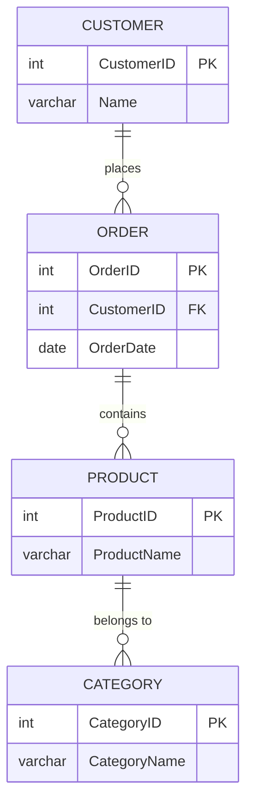
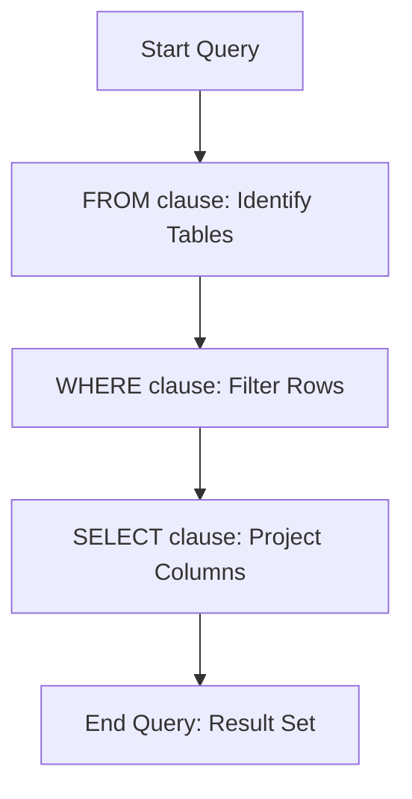

# 6 Structured Query Language

Comprehensive resource for 6 Structured Query Language.


---

## 6 Structured Query Language Hub


## Overview
Structured Query Language (SQL) serves as the universal language for interacting with relational database management systems. This unit introduces SQL's fundamental capabilities, from defining database schemas and enforcing data integrity to manipulating data and retrieving information through complex queries. Mastering SQL is essential for anyone working with databases, as it provides the tools to design, build, and interact with the data that underpins modern applications.

## Learning Objectives
*   Define the purpose and sublanguages (DDL, DML, DCL, TCL) of SQL.
*   Understand and apply SQL Data Definition Language (DDL) commands such as `CREATE`, `ALTER`, and `DROP` for schemas and tables.
*   Implement various constraints, including `PRIMARY KEY`, `UNIQUE`, `NOT NULL`, and `FOREIGN KEY` with referential actions.
*   Utilize SQL Data Manipulation Language (DML) commands (`INSERT`, `UPDATE`, `DELETE`) to modify data within tables.
*   Grasp the concept of transaction control using `COMMIT` and `ROLLBACK`.
*   Construct complex SQL retrieval queries using the `SELECT-FROM-WHERE` block.
*   Apply advanced query features such as aliases, wildcards, `DISTINCT`, set operations, and nested queries.
*   Understand and implement `EXISTS`, `NOT EXISTS`, and handle `NULL` values in queries.
*   Use aggregate functions (`COUNT`, `SUM`, `MAX`, `MIN`, `AVG`) and `GROUP BY` with `HAVING` clauses for data summarization and filtering.
*   Perform substring comparisons with the `LIKE` operator and arithmetic operations in queries.
*   Order query results using the `ORDER BY` clause.
*   Implement various types of SQL join operations to combine data from multiple tables.

## Unit Applications & Real-World Relevance
SQL is the backbone of virtually every data-driven application, from e-commerce websites and banking systems to scientific research databases and government records. Database administrators use SQL to manage the entire lifecycle of a database, ensuring data integrity and security. Developers embed SQL queries within their applications to store, retrieve, and update user data. Data analysts and business intelligence professionals rely on SQL to extract insights from large datasets, driving strategic decision-making. Understanding SQL's schema definition capabilities is critical for database design, while its querying power is indispensable for any form of data interaction and analysis.

## Active Learning Prompts
*   Imagine you are designing a database for a new social media platform. What SQL DDL commands would you prioritize to ensure user data integrity and relationship management?
*   Given a scenario where a database transaction fails midway, explain how `COMMIT` and `ROLLBACK` ensure data consistency. Provide a real-world analogy.
*   Consider two SQL queries that produce the same result but use different approaches: one uses a complex `JOIN` and the other uses a `NESTED QUERY`. Discuss the potential performance implications and readability trade-offs of each approach.

## Unit Challenges & Common Misconceptions
A common challenge in SQL is understanding the subtle differences between DDL and DML operations and when to use each. Misconceptions often arise with referential integrity constraints, particularly the impact of `ON DELETE CASCADE` versus `ON DELETE RESTRICT` or `SET NULL`. Users frequently struggle with writing efficient nested queries or correctly applying `GROUP BY` and `HAVING` clauses, often confusing `WHERE` (for individual rows) with `HAVING` (for groups). Another pitfall is the handling of `NULL` values, as standard equality comparisons do not work as expected (`NULL = NULL` is false).

## Connections
  - [[Structured_Query_Language_Overview]]
  - [[SQL_Schema_Definition_Language_DDL]]
    - [[SQL_Data_Types]]
    - [[Table_Creation_in_SQL]]
    - [[Key_Constraints_in_SQL]]
    - [[Referential_Integrity_Constraints]]
    - [[Altering_SQL_Tables]]
    - [[Dropping_SQL_Objects]]
  - [[SQL_Data_Manipulation_Language_DML]]
    - [[Inserting_Data_in_SQL]]
    - [[Updating_Data_in_SQL]]
    - [[Deleting_Data_in_SQL]]
    - [[SQL_Transaction_Control_Commit_Rollback]]
  - [[SQL_Retrieval_Queries_SELECT]]
    - [[Aliases_and_Wildcards_in_SQL]]
    - [[Eliminating_Duplicates_DISTINCT]]
    - [[SQL_Set_Operations]]
    - [[Nested_SQL_Queries]]
      - [[Correlated_Nested_Queries]]
    - [[EXISTS_and_NOT_EXISTS]]
    - [[SQL_NULL_Values_and_Comparison]]
    - [[SQL_Aggregate_Functions]]
    - [[Grouping_Data_in_SQL_GROUP_BY]]
      - [[Filtering_Groups_HAVING_Clause]]
    - [[Substring_Comparison_with_LIKE]]
    - [[Arithmetic_Operations_in_SQL]]
    - [[Ordering_Query_Results_ORDER_BY]]
    - [[SQL_Join_Operations]]

## Next Steps for Deeper Understanding
To further deepen your understanding of SQL, explore topics such as stored procedures, triggers, views, and database security. Investigate different SQL dialects (e.g., MySQL, PostgreSQL, SQL Server, Oracle) and their unique features. Consider diving into query optimization techniques, indexing strategies, and database performance tuning. Learning about NoSQL databases and their differences from relational databases can also provide valuable context on the broader data management landscape.

## Possible Questions
[[CS1241_6_Structured_Query_Language_Possible_Questions]]

---

---

## SQL Aggregate Functions


## Definition
Before proceeding, ensure you master [[SQL_Retrieval_Queries_(SELECT)]] and Relational_Database_Model because SQL aggregate functions perform calculations on a set of rows and return a single summary value, enabling data analysis and reporting.
SQL aggregate functions are mathematical functions that operate on a collection of values (typically a column) across multiple rows and return a single summary result. Common aggregate functions include `COUNT` (counts the number of rows), `SUM` (calculates the total sum), `AVG` (determines the average value), `MAX` (finds the maximum value), and `MIN` (identifies the minimum value). They are primarily used in the `SELECT` clause to gain insights from data. A simpler way to think about them is like calculating statistics for a list: instead of looking at every individual number, you ask for the "total," "average," "highest," or "lowest" value in the list.

## The Mental Model
Imagine you have a class roster with student grades.
*   `COUNT()`: "How many students are there?" (total number of rows).
*   `SUM(Grades)`: "What's the total score of all students combined?"
*   `AVG(Grades)`: "What's the average score in the class?"
*   `MAX(Grades)`: "What was the highest score achieved?"
*   `MIN(Grades)`: "What was the lowest score achieved?"
Each function provides a single, summary answer for the entire group.

## Context & Framework
#### The "Duh!" Moment (Intuitive Proof)
Aggregate functions fundamentally shift the focus of a `SQL_Retrieval_Queries_(SELECT)` query from individual row details to summary statistics about a group of rows. They are always used in the `SELECT` clause, or sometimes in the `HAVING` clause after `Grouping_Data_in_SQL_(GROUP_BY)`. Without aggregate functions, analyzing trends, totals, or averages across datasets would require processing every single row manually in application code, which is inefficient. These functions provide a direct, declarative way to perform common statistical computations directly within the database.

## The Mastery Deep Dive
#### Let's Plug in Numbers (Watch it Work)
Aggregate functions are used directly in the `SELECT` list. They can also be combined with `Eliminating_Duplicates_(DISTINCT)` (e.g., `COUNT(DISTINCT column)`) to count only unique values.

**Formulas and Usage:**
*   **`COUNT(expression)`**: Counts the number of non-`NULL` values in a column. `COUNT(*)` counts all rows, including those with `NULL`s.
    $$ \boxed{\displaystyle \text{COUNT}(X) = \sum_{x \in X, x \neq \text{NULL}} 1} $$
    $$ \boxed{\displaystyle \text{COUNT}(*) = \sum_{\text{row } r \in \text{Table}} 1} $$
*   **`SUM(expression)`**: Calculates the sum of all non-`NULL` values in a numeric column.
    $$ \boxed{\displaystyle \text{SUM}(X) = \sum_{x \in X, x \neq \text{NULL}} x} $$
*   **`AVG(expression)`**: Calculates the average (mean) of all non-`NULL` values in a numeric column.
    $$ \boxed{\displaystyle \text{AVG}(X) = \frac{\text{SUM}(X)}{\text{COUNT}(X)}} $$
*   **`MAX(expression)`**: Finds the maximum value in a column.
    $$ \boxed{\displaystyle \text{MAX}(X) = \max(\{x \mid x \in X, x \neq \text{NULL}\})} $$
*   **`MIN(expression)`**: Finds the minimum value in a column.
    $$ \boxed{\displaystyle \text{MIN}(X) = \min(\{x \mid x \in X, x \neq \text{NULL}\})} $$

**Variable Dictionary Table**
| Symbol | Name                                | Unit          | Analogy                                   |
| :
----- | :
---------------------------------- | :
------------ | :
---------------------------------------- |
| $X$      | Set of values in a column or group  | N/A           | A list of numbers, e.g., salaries         |
| $x$      | An individual value from the set $X$| N/A           | A single salary figure                    |
| $\text{NULL}$| Represents missing or unknown data  | N/A           | A blank entry in a spreadsheet cell       |
| $\sum$   | Summation operator                  | N/A           | Adding up all values                      |
| $\max$   | Maximum value function              | N/A           | Finding the highest number                |
| $\min$   | Minimum value function              | N/A           | Finding the lowest number                 |

#### The "Oops!" List: Where Everyone Fails
*   **`NULL` handling**: A common mistake is forgetting that aggregate functions (except `COUNT(*)`) **ignore `SQL_NULL_Values_and_Comparison`**. For example, `AVG(Salary)` will only average the salaries of employees with a non-null salary, not necessarily all employees. If you need to treat `NULL`s as zero for averaging, you must use `COALESCE(Salary, 0)`.
*   **Mixing aggregate and non-aggregate columns**: If you include both an aggregate function (e.g., `COUNT(EmpID)`) and a non-aggregate column (e.g., `DepartmentName`) in your `SELECT` list, you **must** use a `Grouping_Data_in_SQL_(GROUP_BY)` clause. Otherwise, the query will result in an error because the database doesn't know how to group the individual `DepartmentName` values for a single aggregate result.
*   **`WHERE` vs. `HAVING`**: Using aggregate functions directly in the `WHERE` clause is an error. `WHERE` filters individual rows *before* aggregation. To filter on aggregate results, you must use the `HAVING` clause *after* `GROUP BY`.

## Constraints & Limitations
Aggregate functions operate on sets of data. They cannot return individual row details (unless `Grouping_Data_in_SQL_(GROUP_BY)` is used, in which case they return aggregate results *per group*). Performance can be a consideration, especially for `COUNT(DISTINCT column)` on very large datasets, as it requires sorting or hashing to identify unique values. Improper handling of `SQL_NULL_Values_and_Comparison` is a significant limitation, as it can lead to skewed or inaccurate summary results if `NULL`s are not explicitly managed (e.g., converted to zero).

## Significance & Application
SQL aggregate functions are the foundation of data summarization and reporting. They transform raw transactional data into actionable insights, providing managers and analysts with a bird's-eye view of business performance. Academically, they represent a key component of relational query languages, extending basic data retrieval to powerful analytical capabilities. In industry, they are critical for generating sales totals, calculating average customer spending, counting active users, finding the highest-rated products, and countless other business metrics. Mastery of aggregate functions is essential for anyone who needs to extract meaningful summaries from large datasets.

## The Worked Example
This example demonstrates various SQL aggregate functions on an `Orders` table.

1.  **Initial `Orders` Table Creation and Data:**
    ```sql
```sql
    CREATE TABLE Orders (
        OrderID INT PRIMARY KEY,
        CustomerID INT,
        OrderDate DATE,
        TotalAmount DECIMAL(10, 2),
        Discount DECIMAL(4, 2) -- Can be NULL
    );

    INSERT INTO Orders (OrderID, CustomerID, OrderDate, TotalAmount, Discount)
    VALUES (1, 101, '2026-01-01', 100.00, 0.10),
           (2, 102, '2026-01-02', 150.00, NULL), -- No discount
           (3, 101, '2026-01-03', 200.00, 0.05),
           (4, 103, '2026-01-04', 50.00, 0.20),
           (5, 102, '2026-01-05', 120.00, NULL); -- No discount
```
```text
    -- Scenario 1: Successful table creation and initial data insertion
    -- Output:
    -- 'Table created.'
    -- '5 row(s) affected.'
    --
    -- Scenario 2: Initial table content
    -- OrderID | CustomerID | OrderDate  | TotalAmount | Discount
    -- ------- | ---------- | ---------- | ----------- | --------
    -- 1       | 101        | 2026-01-01 | 100.00      | 0.10
    -- 2       | 102        | 2026-01-02 | 150.00      | NULL
    -- 3       | 101        | 2026-01-03 | 200.00      | 0.05
    -- 4       | 103        | 2026-01-04 | 50.00       | 0.20
    -- 5       | 102        | 2026-01-05 | 120.00      | NULL
```

2.  **`COUNT(*)` vs. `COUNT(column)` with `NULL`s:**
    ```sql
```sql
    SELECT COUNT(*) AS TotalOrders,
           COUNT(Discount) AS OrdersWithDiscount
    FROM Orders;
```
```text
    -- Scenario 1: Demonstrating COUNT behavior with NULLs
    -- Output:
    -- TotalOrders | OrdersWithDiscount
    -- ----------- | ------------------
    -- 5           | 3
    -- COUNT(*) counts all 5 rows. COUNT(Discount) counts only 3 non-NULL discount values.
```

3.  **`SUM`, `AVG`, `MAX`, `MIN` on `TotalAmount`:**
    ```sql
```sql
    SELECT SUM(TotalAmount) AS GrandTotal,
           AVG(TotalAmount) AS AverageOrder,
           MAX(TotalAmount) AS HighestOrder,
           MIN(TotalAmount) AS LowestOrder
    FROM Orders;
```
```text
    -- Scenario 1: Calculating various aggregates on TotalAmount
    -- Output:
    -- GrandTotal | AverageOrder | HighestOrder | LowestOrder
    -- ---------- | ------------ | ------------ | -----------
    -- 620.00     | 124.00       | 200.00       | 50.00
    -- These are calculated across all 5 orders.
```

4.  **`AVG` with `NULL`s and `COALESCE`:**
    ```sql
```sql
    SELECT AVG(Discount) AS AverageDiscountRate,
           AVG(COALESCE(Discount, 0)) AS AverageDiscountIncludingZero
    FROM Orders;
```
```text
    -- Scenario 1: Showing AVG behavior with and without NULLs
    -- Output:
    -- AverageDiscountRate | AverageDiscountIncludingZero
    -- ------------------- | ----------------------------
    -- 0.116666            | 0.070000
    -- AVG(Discount) averages (0.10 + 0.05 + 0.20) / 3 = 0.116666...
    -- AVG(COALESCE(Discount, 0)) averages (0.10 + 0 + 0.05 + 0.20 + 0) / 5 = 0.07
```

## The Proving Ground
*Test your mastery. Cover the solutions below to test yourself first.*

#### Level 1: The Sanity Check (Verification)
**The Question:** Name five common SQL aggregate functions and state whether `COUNT(*)` includes rows with `NULL` values when performing its count.
> **Solution:** Five common SQL aggregate functions are `COUNT`, `SUM`, `AVG`, `MAX`, and `MIN`. `COUNT(*)` **does** include rows with `NULL` values when performing its count.

#### Level 2: The Crucible (Mastery & Edge Cases)
**The Scenario:** You have a `Feedback` table with columns `FeedbackID`, `Rating` (an integer from 1-5, or `NULL` if no rating was given), and `Comment`. You want to calculate the average rating for all feedback entries. Your junior colleague writes `SELECT AVG(Rating) FROM Feedback;`
**The Question:** Explain a potential issue with your colleague's query if some `Rating` values are `NULL`. How would the presence of `NULL`s affect the calculated average? Provide the SQL query to calculate the average rating assuming `NULL` ratings should be treated as a `0` rating in the average calculation.
> **Solution:** A potential issue with your colleague's query, `SELECT AVG(Rating) FROM Feedback;`, is that **`AVG()` (like most aggregate functions) automatically ignores `NULL` values**. If some `Rating` values are `NULL`, the `AVG(Rating)` function will only calculate the average based on the rows that have a non-`NULL` rating. This means the calculated average would represent the average *of only the rated feedback*, not the average considering all feedback where an unrated entry is effectively a 0.
>
> The SQL query to calculate the average rating, treating `NULL` ratings as `0`, is:
> ```sql
> SELECT AVG(COALESCE(Rating, 0))
> FROM Feedback;
> ```
> The `COALESCE(Rating, 0)` function replaces any `NULL` `Rating` with `0`, ensuring that all feedback entries (including unrated ones) contribute to the average calculation, effectively treating them as a 0 rating.

## Key Takeaways
*   Aggregate functions (`COUNT`, `SUM`, `AVG`, `MAX`, `MIN`) summarize data across rows.
*   Most aggregates ignore `NULL` values; `COUNT(*)` is an exception, counting all rows.
*   `COALESCE` can be used to treat `NULL`s as specific values (e.g., 0) in calculations.
*   Mixing aggregates and non-aggregates requires `Grouping_Data_in_SQL_(GROUP_BY)`.

## Knowledge Graph Connections
| Concept                     | Connection / Relationship                                                                   |
| :
-------------------------- | :
------------------------------------------------------------------------------------------ |
| [[SQL_Retrieval_Queries_(SELECT)]]| Aggregate functions are used within the `SELECT` clause to summarize query results.      |
| Relational_Database_Model| Aggregate functions perform calculations over sets of tuples (rows).                        |
| [[SQL_NULL_Values_and_Comparison]]| Aggregate functions (except `COUNT(*)`) ignore `NULL` values by default, affecting results.|
| [[Grouping_Data_in_SQL_(GROUP_BY)]]| Aggregate functions are commonly used with `GROUP BY` to calculate group-specific summaries. |
| [[Filtering_Groups_(HAVING_Clause)]]| Aggregate results can be filtered using the `HAVING` clause after grouping.            |
| [[Eliminating_Duplicates_(DISTINCT)]]| `DISTINCT` can be used within aggregate functions (e.g., `COUNT(DISTINCT column)`).|
| [[Arithmetic_Operations_in_SQL]]| Aggregate functions often perform arithmetic operations on values to produce summaries.   |
---

---

## SQL Data Manipulation Language DML


## Definition
Before proceeding, ensure you master [[Structured_Query_Language_Overview]] and Relational_Database_Model because DML is a core sublanguage of SQL, specifically used to manage and manipulate the data stored within a relational database.
SQL Data Manipulation Language (DML) is a subset of SQL statements used for managing and manipulating data within existing database schemas. It includes commands for retrieving (`SELECT`), inserting (`INSERT`), updating (`UPDATE`), and deleting (`DELETE`) data. Unlike `SQL_Schema_Definition_Language_(DDL)`, DML commands do not alter the database schema; they work with the data itself. Think of DML as interacting with the contents of a spreadsheet: you can read specific cells, add new rows, change values in cells, or remove rows, all without changing the column headers or the sheet's overall structure.

## The Mental Model
Imagine your database as a vast, meticulously organized library. DML is like the actions you perform with the actual books inside: you can *read* a book (`SELECT`), *add* a new book to the collection (`INSERT`), *annotate* or *correct* information within a book (`UPDATE`), or *remove* a book from the shelves (`DELETE`). These actions always concern the contents, not the architecture of the library itself.

## Context & Framework
#### Spot the Impostor (Don't be Fooled)
The clear distinction between DML and `SQL_Schema_Definition_Language_(DDL)` is crucial for database operations. DML statements work with the *data values* that reside within tables defined by DDL. They are typically transactional, meaning their effects can be undone using `SQL_Transaction_Control_(Commit_Rollback)`. Confusing DML with DDL can lead to errors such as attempting to `UPDATE` a table's column name (a DDL task) with an `UPDATE` DML statement, or trying to `INSERT` data into a non-existent table. DML queries are the most frequent operations performed on a database, forming the basis of all data-driven applications.

## The Mastery Deep Dive
#### The "Kill Sheet"
The primary DML commands form the core of database interaction, each serving a specific data manipulation purpose.

| Command         | Purpose                                                | Example Use Case                                         |
| :
-------------- | :
----------------------------------------------------- | :
------------------------------------------------------- |
| **`SELECT`**    | Retrieve data from one or more tables                  | Fetching all customer names and their email addresses    |
| **`INSERT`**    | Add new rows (tuples) of data into a table             | Adding a new customer record to the `Customers` table    |
| **`UPDATE`**    | Modify existing data within a table                    | Changing a customer's email address                      |
| **`DELETE`**    | Remove existing rows (tuples) from a table             | Removing a specific customer record                      |

#### The "Wikipedia One-Liner"
Data Manipulation Language (DML) is a family of computer languages used to retrieve, insert, delete and update data in a database. It's the most common language for interacting with a database, forming the basis of almost all database-driven applications.

## Constraints & Limitations
#### The "Impostor" Test
A common mistake is treating DML commands, particularly `DELETE` and `UPDATE` without a `WHERE` clause, as trivial operations. Executing `DELETE FROM Customers;` without a `WHERE` clause will remove *all* customer records, which is often not the intended outcome and can lead to irreversible data loss if not properly managed with transactions. Similarly, an `UPDATE` statement without a `WHERE` clause will modify every single row in the table. The "impostor" here is the perceived simplicity, which can mask the destructive power of these commands if not used precisely.

## Significance & Application
DML is the heart of any data-driven application. Without the ability to manipulate data, a database would be a static archive. DML allows applications to store user information, retrieve product details, update order statuses, and process transactions in real-time. Academically, DML directly applies concepts from relational algebra (e.g., `SELECT` for projection and selection, `JOIN`s for cartesian product and selection). In the industry, software developers use DML to build the backend logic of applications, data analysts use it to extract and transform data for reports, and business users often interact with DML indirectly through user interfaces.

## The Worked Example
This example demonstrates the basic usage of the four core DML commands on a simple `Employees` table.

1.  **Initial `Employees` Table Creation:**
    ```sql
```sql
    CREATE TABLE Employees (
        EmployeeID INT PRIMARY KEY,
        FirstName VARCHAR(50) NOT NULL,
        LastName VARCHAR(50) NOT NULL,
        Salary DECIMAL(10, 2)
    );
```
```text
    -- Scenario 1: Successful table creation
    -- Output:
    -- 'Table created.'
```

2.  **`INSERT`ing Data:**
    ```sql
```sql
    INSERT INTO Employees (EmployeeID, FirstName, LastName, Salary)
    VALUES (1, 'John', 'Doe', 60000.00),
           (2, 'Jane', 'Smith', 75000.00);

    SELECT * FROM Employees;
```
```text
    -- Scenario 1: Inserting data and immediate retrieval
    -- Output:
    -- '2 row(s) affected.'
    -- EmployeeID | FirstName | LastName | Salary
    -- ---------- | --------- | -------- | --------
    -- 1          | John      | Doe      | 60000.00
    -- 2          | Jane      | Smith    | 75000.00
```

3.  **`SELECT`ing Data:**
    ```sql
```sql
    SELECT FirstName, LastName
    FROM Employees
    WHERE Salary > 70000.00;
```
```text
    -- Scenario 1: Selecting specific data
    -- Output:
    -- FirstName | LastName
    -- --------- | --------
    -- Jane      | Smith
```

4.  **`UPDATE`ing Data:**
    ```sql
```sql
    UPDATE Employees
    SET Salary = 80000.00
    WHERE EmployeeID = 2;

    SELECT * FROM Employees WHERE EmployeeID = 2;
```
```text
    -- Scenario 1: Updating data
    -- Output:
    -- '1 row(s) affected.'
    -- EmployeeID | FirstName | LastName | Salary
    -- ---------- | --------- | -------- | --------
    -- 2          | Jane      | Smith    | 80000.00
```

5.  **`DELETE`ing Data:**
    ```sql
```sql
    DELETE FROM Employees
    WHERE EmployeeID = 1;

    SELECT * FROM Employees;
```
```text
    -- Scenario 1: Deleting data
    -- Output:
    -- '1 row(s) affected.'
    -- EmployeeID | FirstName | LastName | Salary
    -- ---------- | --------- | -------- | --------
    -- 2          | Jane      | Smith    | 80000.00
```

## The Proving Ground
*Test your mastery. Cover the solutions below to test yourself first.*

#### Level 1: The Sanity Check (Verification)
**The Question:** Name the four fundamental DML commands and describe the purpose of each in a single sentence.
> **Solution:** The four fundamental DML commands are: `SELECT` (retrieves data), `INSERT` (adds new data), `UPDATE` (modifies existing data), and `DELETE` (removes data).

#### Level 2: The Crucible (Mastery & Edge Cases)
**The Scenario:** A new product line is being launched, and you are asked to add 100 new product records to the `Products` table. Simultaneously, an existing product's price needs to be adjusted, and 5 old, discontinued products need to be removed. You perform all these operations within a single session.
**The Question:** If, after completing all these `INSERT`, `UPDATE`, and `DELETE` DML operations, you discover a critical error in the new product data and need to undo *all* changes made in that session, which `SQL_Transaction_Control_(Commit_Rollback)` command would you use, and why is it effective for DML but not `SQL_Schema_Definition_Language_(DDL)`?
> **Solution:** You would use the **`ROLLBACK`** command. `ROLLBACK` is effective for DML operations because DML statements are typically part of a transaction. If `ROLLBACK` is executed before `COMMIT`, all uncommitted changes made by `INSERT`, `UPDATE`, and `DELETE` statements within that transaction are undone, restoring the database to its state before the transaction began. `ROLLBACK` is generally **not effective for `SQL_Schema_Definition_Language_(DDL)` commands** (like `CREATE TABLE` or `ALTER TABLE`) because DDL operations are usually implicitly committed immediately upon execution and do not participate in standard transactions in the same way DML does. Therefore, once a DDL command is executed, its structural changes are permanent.

## Key Takeaways
*   DML (SELECT, INSERT, UPDATE, DELETE) is used for managing data within defined database schemas.
*   DML commands are typically transactional, allowing for `COMMIT` or `ROLLBACK` to ensure data consistency.
*   Precise use of DML, especially with `WHERE` clauses, is crucial to avoid unintended widespread data changes.

## Knowledge Graph Connections
| Concept                     | Connection / Relationship                                                                   |
| :
-------------------------- | :
------------------------------------------------------------------------------------------ |
| [[Structured_Query_Language_Overview]]| DML is a core sublanguage of SQL for data manipulation.                                 |
| Relational_Database_Model| DML operates on the relations (tables) and tuples (rows) within the relational model.       |
| [[SQL_Schema_Definition_Language_(DDL)]]| DML manipulates data within schemas defined by DDL, but does not change the schema. |
| [[Inserting_Data_in_SQL]]   | `INSERT` is a primary DML command for adding new rows to a table.                           |
| [[Updating_Data_in_SQL]]    | `UPDATE` is a primary DML command for modifying existing rows in a table.                   |
| [[Deleting_Data_in_SQL]]    | `DELETE` is a primary DML command for removing rows from a table.                           |
| [[SQL_Retrieval_Queries_(SELECT)]]| `SELECT` is the most common DML command for retrieving data from a database.          |
| [[SQL_Transaction_Control_(Commit_Rollback)]]| DML operations are managed by TCL commands like `COMMIT` and `ROLLBACK`.      |
---

---

## SQL Data Types


## Definition
Before proceeding, ensure you master [[SQL_Schema_Definition_Language_(DDL)]] and [[Table_Creation_in_SQL]] because SQL data types are fundamental to defining columns within tables using DDL commands.
SQL Data Types specify the kind of data that can be stored in a column, such as numbers, characters, dates, or boolean values, and also dictate how much storage space is allocated for that data. They are crucial for data integrity, efficient storage, and correct data manipulation. A simpler way to think about SQL data types is like labeling different containers in a kitchen: you have containers for "spices" (small text), "grains" (large text), "liquids" (numbers with decimals), or "fresh produce" (dates). Each container type has specific properties and uses.

## The Mental Model
Imagine you're categorizing a vast collection of information. Data types are the labels and specific boxes you use for each piece of information. For instance, birthdays go into "Date" boxes, names go into "Text (variable length)" boxes, and ages go into "Whole Number" boxes. This pre-definition ensures that only appropriate information is stored, preventing a birthday from being mistakenly put into a box meant for text, which would cause chaos when trying to sort or calculate.

## The Mastery Deep Dive
#### The Family Tree
SQL data types can be broadly categorized, forming a kind of "family tree" based on the nature of the data they store. This classification helps in selecting the most appropriate type for a given column, balancing storage efficiency and data integrity.

```mermaid
graph TD
    A[SQL Data Types] --> B[String Types]
    A --> C[Numeric Types]
    A --> D[Date/Time Types]

    B --> B1[CHAR(n): Fixed-length character data]
    B --> B2[VARCHAR(n): Variable-length character data]
    B --> B3[LONG: Very large variable-length char data (older/specific implementations)]

    C --> C1[NUMBER(p,q): General purpose numeric, precision p, scale q]
    C --> C2[INTEGER: Signed integer]
    C --> C3[FLOAT(p): Floating point, p binary digits precision]

    D --> D1[DATE: Year-month-day (yyyy-mm-dd)]
    D --> D2[TIME: Hour:minute:second (hh:mm:ss)]
```
```text
-- Scenario 1: A conceptual representation of SQL Data Types
-- Output:
-- (A visual graph showing the top-level categories: String Types, Numeric Types, Date/Time Types.)
-- (Each top-level category branches into its specific data types.)
-- String Types include: CHAR(n), VARCHAR(n), LONG.
-- Numeric Types include: NUMBER(p,q), INTEGER, FLOAT(p).
-- Date/Time Types include: DATE, TIME.
```
*Note: This `graph TD` illustrates the main categories and specific examples of SQL data types, showing their general relationships.*

#### The "Square Peg, Round Hole" Trap: Type Mismatch Issues
A common trap is trying to insert data into a column that doesn't match its defined data type. For example, trying to insert 'apple' into an `INTEGER` column will cause an error because 'apple' is a string, not a whole number. Similarly, exceeding the specified length for a `VARCHAR(n)` column will either result in an error or lead to data truncation (the data being cut off), silently losing information. This highlights why careful type selection and data validation are essential.

#### The Cheat Code: How to Remember This
*   **CHAR vs. VARCHAR:** Think "CHARacter, Fixed" for `CHAR` and "VARiable CHARacter, Flexible" for `VARCHAR`. `CHAR` pads with spaces, `VARCHAR` doesn't. Choose `VARCHAR` when string lengths vary significantly to save space.
*   **NUMBER(p,q):** `p` is for "Precision" (total digits), `q` is for "Quantity after decimal" (scale). `NUMBER(5,2)` means 5 total digits, 2 after the decimal (e.g., 123.45).
*   **DATE & TIME:** Self-explanatory, but remember the standard format (`yyyy-mm-dd`, `hh:mm:ss`) to avoid parsing issues.

## Constraints & Limitations
Each data type comes with inherent limitations. For instance, `CHAR(n)` is fixed-length; if you declare `CHAR(10)` but store 'hello', it will consume all 10 bytes and pad with 5 spaces. `VARCHAR(n)` saves space by only storing the actual characters, but still has a maximum length `n`. `INTEGER` types have a maximum and minimum value they can store. `FLOAT` types, while handling decimals, can suffer from precision issues due to their internal representation. Choosing an inappropriate data type can lead to wasted storage, data truncation, or arithmetic inaccuracies.

## Significance & Application
SQL data types are fundamental to ensuring data quality and database performance. Correct type selection minimizes storage requirements, as smaller types use less disk space. More importantly, data types enforce domain integrity by preventing invalid data from being entered into columns (e.g., ensuring a `price` column only contains numbers). This directly impacts the reliability of applications built on the database. In academia, understanding data types connects to concepts of data representation and efficient storage. In industry, it's a daily consideration for database designers and developers who must balance efficiency, precision, and application needs.

## The Worked Example
This example demonstrates selecting appropriate SQL data types for columns in an `EventLog` table and the consequences of violating those types.

1.  **Creating the `EventLog` Table with Specific Data Types:**
    ```sql
```sql
    CREATE TABLE EventLog (
        LogID INT PRIMARY KEY,
        EventTimestamp DATETIME NOT NULL,
        EventType VARCHAR(50) NOT NULL,
        Severity INT,
        Message VARCHAR(500)
    );
```
```text
    -- Scenario 1: Successful table creation
    -- Output:
    -- 'Table created.'
    --
    -- Scenario 2: Conceptual schema
    -- LogID (INT, PK)
    -- EventTimestamp (DATETIME, NOT NULL)
    -- EventType (VARCHAR(50), NOT NULL)
    -- Severity (INT)
    -- Message (VARCHAR(500))
```

2.  **Attempting Valid and Invalid Insertions:**
    ```sql
```sql
    -- Valid insertion
    INSERT INTO EventLog (LogID, EventTimestamp, EventType, Severity, Message)
    VALUES (1, '2026-01-30 10:30:00', 'Login Attempt', 3, 'User "john_doe" logged in.');

    -- Invalid insertion: EventTimestamp is not a valid DATETIME format
    INSERT INTO EventLog (LogID, EventTimestamp, EventType, Severity, Message)
    VALUES (2, 'Today', 'Error', 1, 'Invalid date format.');

    -- Invalid insertion: EventType exceeds VARCHAR(50) limit
    INSERT INTO EventLog (LogID, EventTimestamp, EventType, Severity, Message)
    VALUES (3, '2026-01-30 11:00:00', 'This is a very long event type that exceeds the fifty character limit for this column', 2, 'Long event type test.');

    -- Valid insertion (Severity NULL is allowed as no NOT NULL constraint)
    INSERT INTO EventLog (LogID, EventTimestamp, EventType, Message)
    VALUES (4, '2026-01-30 11:15:00', 'System Status', 'System operating normally.');
```
```text
    -- Scenario 1: Valid insertion
    -- Output:
    -- '1 row(s) affected.'
    --
    -- Scenario 2: Invalid insertion (date format)
    -- Output:
    -- 'Error: Data conversion error from string to DATETIME.'
    -- (Or similar error message indicating incorrect date format)
    --
    -- Scenario 3: Invalid insertion (string length exceeded)
    -- Output:
    -- 'Error: Value too large for column "EventType".'
    -- (Or similar error message indicating string truncation/length violation)
    --
    -- Scenario 4: Valid insertion with optional NULL column
    -- Output:
    -- '1 row(s) affected.'
```

## The Proving Ground
*Test your mastery. Cover the solutions below to test yourself first.*

#### Level 1: The Sanity Check (Verification)
**The Question:** What is the primary function of specifying a data type for a column in an SQL table?
> **Solution:** The primary function is to define the kind of data that can be stored in that column (e.g., text, numbers, dates), ensuring data integrity and efficient storage.

#### Level 2: The Crucible (Mastery & Edge Cases)
**The Scenario:** You need to store potentially very long textual feedback from users, which might range from a few words to several paragraphs. You are considering using either `CHAR(200)` or `VARCHAR(500)`.
**The Question:** Based on the characteristics of these two data types, explain which one is the more appropriate choice for user feedback and *why*, specifically considering storage efficiency and the variability of input length.
> **Solution:** `VARCHAR(500)` is the more appropriate choice. `CHAR(200)` is a fixed-length data type, meaning it will always reserve 200 characters of storage, even if the actual feedback is much shorter (e.g., "Good product" would still consume 200 bytes, padding with spaces). `VARCHAR(500)` is a variable-length data type; it only uses the storage space required by the actual length of the string (plus a small overhead), up to its maximum of 500 characters. Since user feedback length is highly variable, `VARCHAR(500)` is significantly more efficient in terms of storage and prevents unnecessary padding.

## Key Takeaways
*   SQL data types define the kind of data a column can hold, crucial for data integrity and efficient storage.
*   Data types are broadly categorized into String, Numeric, and Date/Time, each with specific characteristics and limitations.
*   Selecting the correct data type prevents data corruption, truncation, and ensures optimal database performance.

## Knowledge Graph Connections
| Concept                     | Connection / Relationship                                                                   |
| :
-------------------------- | :
------------------------------------------------------------------------------------------ |
| [[SQL_Schema_Definition_Language_(DDL)]]| DDL commands utilize SQL data types to define column properties during schema creation. |
| [[Table_Creation_in_SQL]]   | During table creation, each column is assigned an SQL data type.                          |
| [[Altering_SQL_Tables]]     | The `ALTER TABLE` command can be used to change existing column data types.                 |
| [[SQL_NULL_Values_and_Comparison]]| Data types influence how NULL values are handled and compared in a column.             |
| [[Key_Constraints_in_SQL]]  | Data types ensure that values used in key constraints are of the correct format.          |
---

---

## SQL Join Operations


## Definition
Before proceeding, ensure you master [[SQL_Retrieval_Queries_(SELECT)]] and Relational_Database_Model because SQL join operations combine rows from two or more tables based on a related column between them, allowing the retrieval of comprehensive datasets from across a relational database.
SQL join operations are a fundamental technique in `SQL_Retrieval_Queries_(SELECT)` used to combine data from two or more tables based on the values of one or more common (related) columns. They are essential for reconstructing relationships defined in a `Relational_Database_Model`, allowing you to fetch information that is spread across multiple normalized tables into a single, unified result set. A simpler way to think about it is like matching up related information from different lists: if you have one list of students and another list of courses they are enrolled in, a join lets you combine them to see "which student is taking which course."

## The Mental Model
Imagine you have two separate spreadsheets: one lists `Employees` and their `DepartmentID`, and another lists `Departments` and their `DepartmentName`.
*   A `JOIN` is like taking these two spreadsheets and carefully lining them up side-by-side.
*   You find matching `DepartmentID`s on both sheets.
*   For every match, you create a new combined row that includes all the employee's details and all the department's details.
This allows you to see "John Doe works in Sales" even though "Sales" isn't explicitly in the `Employees` sheet.

## Context & Framework
#### How the Parts Talk to Each Other
SQL join operations are the primary mechanism for traversing the relationships between tables in a `Relational_Database_Model`. They are typically specified in the `FROM` clause of a `SQL_Retrieval_Queries_(SELECT)` statement. The database engine effectively combines rows from the tables being joined based on the specified join condition. Different types of joins dictate how rows that don't have a match in the other table are handled. This ability to link and combine data is what makes normalized relational databases so powerful and flexible.

## The Mastery Deep Dive
#### The Transformation: Before and After
Joins are categorized by how they handle matching and non-matching rows. The most common types are `INNER JOIN`, `LEFT (OUTER) JOIN`, `RIGHT (OUTER) JOIN`, `FULL (OUTER) JOIN`, `CROSS JOIN`, and `NATURAL JOIN`.


```text
-- Scenario 1: Illustrating Entity-Relationship Diagram for join context
-- Output:
-- (A visual representation of an ER Diagram.)
-- Customer places Order (One-to-Many).
-- Order contains Product (Many-to-Many, implicitly via an Order_Items table).
-- Product belongs to Category (Many-to-One).
--
-- Notation Legend for erDiagram:
-- ||--|| : Exactly one to exactly one
-- ||--o{ : Exactly one to zero or many
-- }o--o{ : Zero or many to zero or many
-- }|--o{ : One or many to zero or many
-- PK     : Primary Key
-- FK     : Foreign Key
```
*Note: This `erDiagram` illustrates entities and their relationships, providing context for how tables might be joined. The Notation Legend explains the cardinality symbols used.*

**Common Join Types:**

1.  **`INNER JOIN`**:
    *   **Purpose**: Returns only the rows that have matching values in *both* tables based on the join condition. It's the most common type of join.
    *   **Analogy**: Finding common friends in two different groups.
    *   **Syntax**: `SELECT ... FROM TableA INNER JOIN TableB ON TableA.ID = TableB.ID;`

2.  **`LEFT (OUTER) JOIN`**:
    *   **Purpose**: Returns all rows from the *left* table, and the matching rows from the *right* table. If there's no match in the right table, `SQL_NULL_Values_and_Comparison` are returned for the right table's columns.
    *   **Analogy**: Listing all your friends, and if they also have a car, showing their car. If not, just showing your friend's name.
    *   **Syntax**: `SELECT ... FROM TableA LEFT JOIN TableB ON TableA.ID = TableB.ID;`

3.  **`RIGHT (OUTER) JOIN`**:
    *   **Purpose**: Returns all rows from the *right* table, and the matching rows from the *left* table. If there's no match in the left table, `NULL`s are returned for the left table's columns.
    *   **Analogy**: Listing all cars in a parking lot, and if one of your friends owns it, showing their name. If not, just showing the car.
    *   **Syntax**: `SELECT ... FROM TableA RIGHT JOIN TableB ON TableA.ID = TableB.ID;`

4.  **`FULL (OUTER) JOIN`** (Less common, not supported by all DBMS like MySQL):
    *   **Purpose**: Returns all rows when there is a match in *either* the left or the right table. If no match, `NULL`s are returned for the non-matching side.
    *   **Analogy**: Listing everyone who is either your friend OR owns a car (or both).
    *   **Syntax**: `SELECT ... FROM TableA FULL JOIN TableB ON TableA.ID = TableB.ID;`

5.  **`CROSS JOIN`**:
    *   **Purpose**: Returns the Cartesian product of the two tables. Every row from the first table is combined with every row from the second table. This generally produces a very large result set and is rarely used explicitly except in specific scenarios.
    *   **Analogy**: Matching every friend you have with every single car in the parking lot, regardless of who owns it.
    *   **Syntax**: `SELECT ... FROM TableA CROSS JOIN TableB;` (no `ON` clause)

6.  **`NATURAL JOIN`**:
    *   **Purpose**: Joins two tables implicitly based on columns that have the same name and compatible `SQL_Data_Types` in both tables. No `ON` clause is specified. Can be risky if unintended column matches exist.
    *   **Analogy**: Automatically finding friends and cars based on a shared "OwnerName" column without you explicitly saying so.
    *   **Syntax**: `SELECT ... FROM TableA NATURAL JOIN TableB;`

## Constraints & Limitations
#### The "Unseen Crack": Common Structural Flaws
A common structural flaw in `SQL_Join_Operations` is omitting or incorrectly specifying the join condition (`ON` clause). This can lead to an unintended `CROSS JOIN` (Cartesian product) if multiple tables are listed in the `FROM` clause without a `WHERE` or `ON` condition, resulting in a massive and meaningless result set that can crash a system. Another limitation is the potential for `SQL_NULL_Values_and_Comparison` in join keys. `INNER JOIN`s will inherently exclude rows where the join column has a `NULL` value in either table, as `NULL` does not match `NULL`. This often necessitates the use of `OUTER JOIN`s to preserve rows with `NULL` keys from one side.

## Significance & Application
SQL join operations are foundational for building complex queries and extracting meaningful information from normalized relational databases. They enable the reconstruction of business entities and relationships that are distributed across multiple tables. Academically, joins are the practical implementation of relational algebra's join operator. In industry, joins are used in virtually every data-driven application: from displaying customer details alongside their orders, to linking product information with their categories, or combining employee data with their department managers. Mastery of different join types is essential for efficient and accurate data retrieval.

## The Worked Example
This example demonstrates `INNER JOIN`, `LEFT JOIN`, and `CROSS JOIN` using `Employees` and `Departments` tables.

1.  **Initial Tables and Data:**
    ```sql
```sql
    CREATE TABLE Employees (
        EmpID INT PRIMARY KEY,
        EmpName VARCHAR(100),
        DeptID INT -- Foreign key to Departments
    );

    CREATE TABLE Departments (
        DeptID INT PRIMARY KEY,
        DeptName VARCHAR(100)
    );

    INSERT INTO Employees (EmpID, EmpName, DeptID)
    VALUES (1, 'Alice', 10),
           (2, 'Bob', 20),
           (3, 'Charlie', 10),
           (4, 'Diana', NULL); -- Diana is not assigned to a department yet

    INSERT INTO Departments (DeptID, DeptName)
    VALUES (10, 'HR'),
           (20, 'IT'),
           (30, 'Finance'); -- Finance has no employees yet
```
```text
    -- Scenario 1: Successful table creation and initial data insertion
    -- Output:
    -- 'Tables created.'
    -- '4 row(s) affected.' (Employees)
    -- '3 row(s) affected.' (Departments)
    --
    -- Scenario 2: Initial table content
    -- Employees: (Alice:10, Bob:20, Charlie:10, Diana:NULL)
    -- Departments: (10:HR, 20:IT, 30:Finance)
```

2.  **`INNER JOIN` (Employees matched with their Departments):**
    ```sql
```sql
    SELECT E.EmpName, D.DeptName
    FROM Employees E
    INNER JOIN Departments D ON E.DeptID = D.DeptID;
```
```text
    -- Scenario 1: Combining employees with their matching departments
    -- Output:
    -- EmpName | DeptName
    -- --------|----------
    -- Alice   | HR
    -- Bob     | IT
    -- Charlie | HR
    -- Diana (NULL DeptID) and Finance (no employees) are excluded because no match is found for them in both tables.
```

3.  **`LEFT JOIN` (All Employees and their Departments, if any):**
    ```sql
```sql
    SELECT E.EmpName, D.DeptName
    FROM Employees E
    LEFT JOIN Departments D ON E.DeptID = D.DeptID;
```
```text
    -- Scenario 1: Including all employees, even those without a department
    -- Output:
    -- EmpName | DeptName
    -- --------|----------
    -- Alice   | HR
    -- Bob     | IT
    -- Charlie | HR
    -- Diana   | NULL
    -- All employees are listed. Diana has NULL for DeptName as no match was found in Departments.
```

4.  **`RIGHT JOIN` (All Departments and their Employees, if any):**
    ```sql
```sql
    SELECT E.EmpName, D.DeptName
    FROM Employees E
    RIGHT JOIN Departments D ON E.DeptID = D.DeptID;
```
```text
    -- Scenario 1: Including all departments, even those without employees
    -- Output:
    -- EmpName | DeptName
    -- --------|----------
    -- Alice   | HR
    -- Bob     | IT
    -- Charlie | HR
    -- NULL    | Finance
    -- All departments are listed. Finance has NULL for EmpName as no employee is in that department.
```

5.  **`CROSS JOIN` (Cartesian Product):**
    ```sql
```sql
    SELECT E.EmpName, D.DeptName
    FROM Employees E
    CROSS JOIN Departments D;
```
```text
    -- Scenario 1: Combining every employee with every department (4 employees * 3 departments = 12 rows)
    -- Output (partial):
    -- EmpName | DeptName
    -- --------|----------
    -- Alice   | HR
    -- Alice   | IT
    -- Alice   | Finance
    -- Bob     | HR
    -- Bob     | IT
    -- Bob     | Finance
    -- ... and so on for all combinations.
    -- Each employee is matched with every department, regardless of actual assignment.
```

## The Proving Ground
*Test your mastery. Cover the solutions below to test yourself first.*

#### Level 1: The Sanity Check (Verification)
**The Question:** What is the primary purpose of an SQL join operation, and which type of join returns only the rows that have matching values in both tables?
> **Solution:** The primary purpose of an SQL join operation is to **combine rows from two or more tables** based on a related column between them. The `INNER JOIN` returns only the rows that have matching values in both tables.

#### Level 2: The Crucible (Mastery & Edge Cases)
**The Scenario:** You have a `Customers` table (`CustomerID`, `CustomerName`) and an `Orders` table (`OrderID`, `CustomerID`, `OrderDate`). Some customers have not placed any orders yet, and some orders might have a `NULL CustomerID` due to data entry errors. You need to retrieve a list of *all customers* and their associated orders (if any), but also clearly identify any orders that do *not* belong to an existing customer.
**The Question:** Write an SQL query using an appropriate join type (or combination of joins) to satisfy this complex requirement. Explain how your chosen join ensures all customers are listed, and how it identifies orders without valid customer links.
> **Solution:** The SQL query to achieve this complex requirement would involve a `FULL OUTER JOIN` (if supported) or a combination of `LEFT JOIN` and `RIGHT JOIN` with `UNION ALL`. Let's assume `FULL OUTER JOIN` is available for clarity.
> ```sql
> SELECT C.CustomerID, C.CustomerName, O.OrderID, O.OrderDate
> FROM Customers C
> FULL OUTER JOIN Orders O ON C.CustomerID = O.CustomerID;
> ```
> This query uses a `FULL OUTER JOIN` to combine the `Customers` and `Orders` tables.
> *   It ensures **all customers are listed** because it includes all rows from the `Customers` table (the "left" side), even if they have no matching orders. For these customers, the `Orders` table columns (`OrderID`, `OrderDate`) will show `NULL`.
> *   It identifies **orders without valid customer links** because it also includes all rows from the `Orders` table (the "right" side) that do *not* have a matching `CustomerID` in the `Customers` table (e.g., if `Orders.CustomerID` is `NULL` or points to a non-existent customer). For these orders, the `Customers` table columns (`CustomerID`, `CustomerName`) will show `NULL`.
>
> If `FULL OUTER JOIN` is not supported (e.g., in MySQL), an equivalent solution would be:
> ```sql
> SELECT C.CustomerID, C.CustomerName, O.OrderID, O.OrderDate
> FROM Customers C LEFT JOIN Orders O ON C.CustomerID = O.CustomerID
> UNION ALL
> SELECT C.CustomerID, C.CustomerName, O.OrderID, O.OrderDate
> FROM Customers C RIGHT JOIN Orders O ON C.CustomerID = O.CustomerID
> WHERE C.CustomerID IS NULL; -- Only include rows from RIGHT JOIN that LEFT JOIN missed (i.e., unmatched orders)
> ```
> This combination also ensures all customers and all (potentially unlinked) orders are presented.

## Key Takeaways
*   SQL joins combine data from multiple tables based on related columns.
*   `INNER JOIN` returns only matched rows; `LEFT JOIN` returns all left rows plus matches; `RIGHT JOIN` returns all right rows plus matches; `FULL JOIN` returns all rows from both tables.
*   `CROSS JOIN` produces a Cartesian product; `NATURAL JOIN` joins on similarly named columns.
*   Joins are crucial for reconstructing relationships and retrieving comprehensive datasets.

## Knowledge Graph Connections
| Concept                     | Connection / Relationship                                                                   |
| :
-------------------------- | :
------------------------------------------------------------------------------------------ |
| [[SQL_Retrieval_Queries_(SELECT)]]| Join operations are a fundamental part of the `FROM` clause in `SELECT` statements.     |
| Relational_Database_Model| Joins are used to combine relations (tables) based on their defined relationships.          |
| [[Referential_Integrity_Constraints]]| Foreign keys are the basis for join conditions, linking related tables.             |
| [[SQL_NULL_Values_and_Comparison]]| `NULL` values in join columns affect which rows are included, especially in `INNER JOIN`s.|
| [[Aliases_and_Wildcards_in_SQL]]| Table aliases are commonly used in joins to shorten and clarify table references.       |
| [[Nested_SQL_Queries]]      | Joins can often be an alternative (and sometimes more performant) to nested queries.        |
| [[Grouping_Data_in_SQL_(GROUP_BY)]]| The results of join operations can then be grouped for aggregation.                     |
---

---

## SQL Retrieval Queries SELECT


## Definition
Before proceeding, ensure you master [[SQL_Data_Manipulation_Language_(DML)]] and Relational_Database_Model because SQL retrieval queries, primarily using the `SELECT` statement, are the cornerstone of DML for extracting specific information from a database, forming the basis of nearly all data interaction.
SQL retrieval queries are statements used to fetch data from one or more tables in a database. The fundamental command for this is the `SELECT` statement, often combined with `FROM` to specify the source tables and `WHERE` to filter the rows based on conditions. This combination is known as a `SELECT-FROM-WHERE` block. A simpler way to think about it is like searching for specific information in a digital library: you tell the librarian (`SELECT`) *what* information you want (e.g., author, title), *where* to look for it (`FROM` a specific section like 'Fiction'), and *under what conditions* (`WHERE` the genre is 'Mystery').

## The Mental Model
Imagine a giant filing cabinet filled with countless employee records. `SELECT` is the instruction you give to a diligent assistant to find specific information. You tell them: "Find me the `FirstName` and `LastName` (`SELECT` columns) `FROM` the `Employees` section (`FROM` clause) `WHERE` their `Department` is 'Sales' (`WHERE` clause)." The assistant then efficiently sifts through the records and brings back only the requested names from the sales department.

## Context & Framework
#### Follow the Ball: A Slow-Motion Trace
The `SELECT` statement is the most frequently used `SQL_Data_Manipulation_Language_(DML)` command. It's a declarative command, meaning you describe *what* data you want, not *how* the database should retrieve it. The database's query optimizer then figures out the most efficient execution plan. The basic `SELECT-FROM-WHERE` block forms the core of most queries:
*   **`SELECT`**: Specifies the columns (attributes) you want to see in the result set. This is like projecting specific attributes in relational algebra.
*   **`FROM`**: Identifies the tables (relations) from which the data will be retrieved. If multiple tables are listed, it implies a Cartesian product, which is then typically narrowed by join conditions.
*   **`WHERE`**: Filters the rows (tuples) based on a specified condition. This is analogous to the selection operation in relational algebra.

## The Mastery Deep Dive
#### The Transformation: Before and After
A `SELECT` query goes through a logical processing order, even if the physical execution might be optimized differently. This order is crucial for understanding how data is filtered and transformed.

**Logical Query Processing Order (Simplified):**
1.  **`FROM`**: The `FROM` clause is evaluated first, determining the source tables and creating a Cartesian product if multiple tables are listed without join conditions. This generates a conceptual "intermediate table."
2.  **`WHERE`**: The `WHERE` clause is applied next, filtering rows from the intermediate table based on specified conditions. Only rows that satisfy the condition are passed on.
3.  **`SELECT`**: Finally, the `SELECT` clause projects the specified columns from the filtered rows, creating the final result set.

**Basic `SELECT-FROM-WHERE` Diagram:**

```text
-- Scenario 1: Conceptual flow of a SELECT-FROM-WHERE query
-- Output:
-- (A visual flow showing query execution steps.)
-- 1. FROM clause determines source tables.
-- 2. WHERE clause filters rows based on conditions.
-- 3. SELECT clause projects the desired columns from the filtered rows.
-- 4. Final result set is generated.
```
*Note: This `graph TD` illustrates the logical processing order of a basic `SELECT-FROM-WHERE` query.*

**Key Rules:**
*   **`attribute list`**: Can be `*` (to select all columns), specific column names, or expressions (`column1 + column2`).
*   **`table list`**: Can be a single table name or a comma-separated list of table names (implying a Cartesian product, usually followed by `JOIN` conditions in the `WHERE` clause).
*   **`condition`**: A Boolean expression (true/false) used to filter rows. It can involve `SQL_NULL_Values_and_Comparison`, comparison operators (`=`, `<`, `>`, `LIKE`), and logical operators (`AND`, `OR`, `NOT`).

## Constraints & Limitations
#### The "Unseen Crack": Common Structural Flaws
A major pitfall in `SQL_Retrieval_Queries_(SELECT)` is the absence of appropriate `WHERE` clause conditions when querying multiple tables. If you list multiple tables in the `FROM` clause without a join condition in the `WHERE` clause, the database will perform a **Cartesian product** (also known as a cross join), combining every row from the first table with every row from the second table. This usually results in an enormous, meaningless, and performance-heavy result set, often consuming excessive resources. For example, selecting from `Employees, Departments` without a `JOIN` condition might yield millions of rows if both tables are large, instead of matching employees to their correct department.

## Significance & Application
SQL retrieval queries are the most fundamental interaction with any database. They allow users and applications to extract precisely the information needed from vast datasets, powering everything from simple data displays to complex analytical reports. Academically, `SELECT` statements are the practical embodiment of relational algebra's projection and selection operators. In industry, every data-driven application, from basic CRUD (Create, Read, Update, Delete) operations to business intelligence dashboards, relies heavily on `SELECT` queries to "read" data. Mastery of `SELECT` is therefore crucial for any database professional or developer.

## The Worked Example
This example demonstrates basic `SELECT` statements, including selecting all columns, specific columns, and using a `WHERE` clause.

1.  **Initial `Employees` Table Creation and Data:**
    ```sql
```sql
    CREATE TABLE Employees (
        EmployeeID INT PRIMARY KEY,
        FirstName VARCHAR(50) NOT NULL,
        LastName VARCHAR(50) NOT NULL,
        Department VARCHAR(50),
        Salary DECIMAL(10, 2)
    );

    INSERT INTO Employees (EmployeeID, FirstName, LastName, Department, Salary)
    VALUES (1, 'Alice', 'Smith', 'HR', 60000.00),
           (2, 'Bob', 'Johnson', 'IT', 75000.00),
           (3, 'Charlie', 'Brown', 'HR', 55000.00),
           (4, 'Diana', 'Prince', 'Marketing', 80000.00);
```
```text
    -- Scenario 1: Successful table creation and initial data insertion
    -- Output:
    -- 'Table created.'
    -- '4 row(s) affected.'
    --
    -- Scenario 2: Initial table content
    -- EmployeeID | FirstName | LastName | Department | Salary
    -- ---------- | --------- | -------- | ---------- | --------
    -- 1          | Alice     | Smith    | HR         | 60000.00
    -- 2          | Bob       | Johnson  | IT         | 75000.00
    -- 3          | Charlie   | Brown    | HR         | 55000.00
    -- 4          | Diana     | Prince   | Marketing  | 80000.00
```

2.  **`SELECT` All Columns (`*`):**
    ```sql
```sql
    SELECT *
    FROM Employees;
```
```text
    -- Scenario 1: Selecting all columns from the table
    -- Output:
    -- EmployeeID | FirstName | LastName | Department | Salary
    -- ---------- | --------- | -------- | ---------- | --------
    -- 1          | Alice     | Smith    | HR         | 60000.00
    -- 2          | Bob       | Johnson  | IT         | 75000.00
    -- 3          | Charlie   | Brown    | HR         | 55000.00
    -- 4          | Diana     | Prince   | Marketing  | 80000.00
    -- Retrieves all data for all rows.
```

3.  **`SELECT` Specific Columns:**
    ```sql
```sql
    SELECT FirstName, LastName, Salary
    FROM Employees;
```
```text
    -- Scenario 1: Selecting only specific columns
    -- Output:
    -- FirstName | LastName | Salary
    -- --------- | -------- | --------
    -- Alice     | Smith    | 60000.00
    -- Bob       | Johnson  | 75000.00
    -- Charlie   | Brown    | 55000.00
    -- Diana     | Prince   | 80000.00
    -- Retrieves only the FirstName, LastName, and Salary for all rows.
```

4.  **`SELECT` with `WHERE` Clause (Filtering Rows):**
    ```sql
```sql
    SELECT FirstName, LastName
    FROM Employees
    WHERE Department = 'HR' AND Salary > 50000.00;
```
```text
    -- Scenario 1: Filtering rows based on multiple conditions
    -- Output:
    -- FirstName | LastName
    -- --------- | --------
    -- Alice     | Smith
    -- Retrieves only employees from the 'HR' department who earn more than 50000.00.
```

## The Proving Ground
*Test your mastery. Cover the solutions below to test yourself first.*

#### Level 1: The Sanity Check (Verification)
**The Question:** What are the three basic clauses that constitute a `SELECT-FROM-WHERE` block in SQL, and what is the primary role of each clause?
> **Solution:** The three basic clauses are `SELECT` (specifies the columns to retrieve), `FROM` (identifies the tables to query), and `WHERE` (filters the rows based on conditions).

#### Level 2: The Crucible (Mastery & Edge Cases)
**The Scenario:** You need to retrieve the `product_name` and `price` of all products from a `Products` table. However, you are also interested in seeing the `supplier_name` from a separate `Suppliers` table for each product. You write the query as `SELECT P.product_name, P.price, S.supplier_name FROM Products P, Suppliers S;`
**The Question:** Explain why this query, as written, is fundamentally flawed and will produce an incorrect (and likely massive) result. What crucial clause and condition are missing to link the `Products` and `Suppliers` tables correctly?
> **Solution:** This query is fundamentally flawed because it performs a **Cartesian product** (or cross join) between the `Products` and `Suppliers` tables. By listing both tables in the `FROM` clause without a `JOIN` condition in the `WHERE` clause, every row from the `Products` table will be combined with every row from the `Suppliers` table. This results in an incorrect and likely massive dataset where each product is associated with *every single supplier*, not just its actual supplier. The crucial missing elements are a **`WHERE` clause with a `JOIN` condition** (e.g., `WHERE P.supplier_id = S.supplier_id`) or an explicit `INNER JOIN` in the `FROM` clause (`FROM Products P INNER JOIN Suppliers S ON P.supplier_id = S.supplier_id`). This condition is needed to correctly link products to their respective suppliers based on a common attribute (like `supplier_id`).

## Key Takeaways
*   The `SELECT` statement, with `FROM` and `WHERE` clauses, is the primary command for retrieving data from a database.
*   `SELECT` projects columns, `FROM` identifies source tables, and `WHERE` filters rows based on conditions.
*   Omitting join conditions when querying multiple tables results in a Cartesian product, leading to incorrect and inefficient results.

## Knowledge Graph Connections
| Concept                     | Connection / Relationship                                                                   |
| :
-------------------------- | :
------------------------------------------------------------------------------------------ |
| [[SQL_Data_Manipulation_Language_(DML)]]| `SELECT` is the most commonly used DML command for reading data.                      |
| Relational_Database_Model| `SELECT` operates on relations (tables) to project attributes and select tuples.            |
| [[SQL_NULL_Values_and_Comparison]]| `WHERE` clauses can filter rows based on `NULL` values using `IS NULL` or `IS NOT NULL`.|
| [[Aliases_and_Wildcards_in_SQL]]| `SELECT` statements frequently use aliases for clarity and `*` for all columns.         |
| [[Nested_SQL_Queries]]      | `SELECT` statements can be nested within other `SELECT` statements' `WHERE` clauses.        |
| [[SQL_Set_Operations]]      | `SELECT` statements can be combined using set operations like `UNION`, `INTERSECT`, `MINUS`.|
| [[SQL_Aggregate_Functions]] | `SELECT` clauses can include aggregate functions to summarize data.                         |
| [[Grouping_Data_in_SQL_(GROUP_BY)]]| `SELECT` statements are used with `GROUP BY` to summarize data in groups.             |
| [[Ordering_Query_Results_(ORDER_BY)]]| `SELECT` results can be sorted using the `ORDER BY` clause.                           |
| [[SQL_Join_Operations]]     | `SELECT` statements combine data from multiple tables using various `JOIN` types.           |
---

---

## SQL Schema Definition Language DDL


## Definition
Before proceeding, ensure you master [[Structured_Query_Language_Overview]] and Relational_Database_Model because DDL is a core component of SQL, specifically used to define the structure of a relational database.
SQL Schema Definition Language (DDL) is a subset of SQL commands used to define, modify, and manage the structure of a database, including creating, altering, and dropping schema objects like tables, indexes, views, and users. It's the blueprint language for your database. Think of DDL as the architectural drawing and construction tools for your database building: you use it to plan out the rooms (tables), decide where the walls go (columns), and set the foundation rules (constraints).

## The Mental Model
Imagine you are building a new house. DDL is like all the tools and instructions you use to construct the house's frame, lay the foundation, build the walls, and add new rooms. It defines the *structure* of the house, not the furniture or occupants inside it. When you `CREATE TABLE`, you're building a new room; when you `ALTER TABLE`, you're adding a new window or door; when you `DROP TABLE`, you're demolishing a room.

## Context & Framework
#### Opening the Hood: What's Inside?
DDL commands are distinct from data manipulation commands in their impact. When a DDL command is executed, it modifies the database schema itself, rather than the data contained within the tables. This fundamental difference means that DDL operations are typically implicitly committed, meaning they cannot be easily rolled back like DML transactions. This makes DDL operations critically important and requires careful planning and execution to avoid irreversible structural changes. The main DDL commands are `CREATE`, `ALTER`, and `DROP`, each with variations for different database objects like tables, schemas, and indexes.

## The Mastery Deep Dive
#### How the Parts Talk to Each Other
DDL statements directly interact with the database's system catalog, which is essentially the database's internal dictionary storing metadata about all database objects. When you `CREATE` a table, DDL commands insert information about the new table's name, columns, data types, and constraints into this catalog. Similarly, `ALTER` commands update this metadata, and `DROP` commands remove it. This interaction ensures that the database always has an accurate and up-to-date description of its own structure, enabling consistent data management and query processing.

#### The Translator: From "Lego" to "Jargon"
The database schema itself is often referred to as metadata ("data about data"). DDL commands translate your high-level structural intentions (like "I want a table for employees") into the precise, low-level definitions that the database system requires. For instance, `CREATE TABLE` isn't just about making a table; it's about defining the table's name, each column's name, its specific `SQL_Data_Types`, and any `Key_Constraints_in_SQL` or `Referential_Integrity_Constraints` that apply to ensure data validity.

## Constraints & Limitations
#### The "Unseen Crack": Common Structural Flaws
One common mistake with DDL is failing to correctly define `Key_Constraints_in_SQL` or `Referential_Integrity_Constraints` during table creation. A missing primary key can lead to duplicate rows, violating the principles of relational databases. Similarly, incorrect or missing foreign key definitions can break relationships between tables, allowing "orphan" records to exist (e.g., an employee record without a valid department), which corrupts data integrity. Another flaw is choosing overly restrictive data types or `NOT NULL` constraints too broadly, which can lead to legitimate data being rejected or requiring complex workarounds during data entry.

## Significance & Application
DDL is the bedrock of database design and administration. It's used at the very beginning of a project to lay out the database architecture and throughout the lifecycle for maintenance and evolution. Academically, it bridges the gap between conceptual (ER models) and logical (relational schemas) database design. In practice, database architects use DDL to build entire data warehouses, software engineers use it to define application data models, and database administrators employ it for schema migrations and performance tuning (e.g., creating indexes). Its fundamental role ensures data integrity, consistency, and efficient storage.

## The Worked Example
This example demonstrates how DDL commands are used to create a simple `Students` table, add a new column, and then remove the table.

1.  **Creating a Schema (Optional but good practice for organization):**
    First, we might create a schema to logically group related tables, like `University`.
    ```sql
```sql
    CREATE SCHEMA University;
```
```text
    -- Scenario 1: Successful schema creation
    -- Output:
    -- (No direct output, but a confirmation like 'Schema created.' would appear.)
    -- The 'University' schema is now available for grouping database objects.
```

2.  **Creating a Table (`CREATE TABLE`):**
    Now, let's create a `Students` table within the `University` schema. We define columns for student ID, name, email, and enrollment date, along with constraints.
    ```sql
```sql
    CREATE TABLE University.Students (
        StudentID INT PRIMARY KEY,
        FirstName VARCHAR(50) NOT NULL,
        LastName VARCHAR(50) NOT NULL,
        Email VARCHAR(100) UNIQUE,
        EnrollmentDate DATE DEFAULT CURRENT_DATE
    );
```
```text
    -- Scenario 1: Successful table creation with constraints and default value
    -- Output:
    -- (No direct output, but a confirmation message like 'Table created.' would appear.)
    -- The 'University.Students' table is now defined.
    --
    -- Scenario 2: Inspecting the table structure (conceptual)
    -- Output: (Simulated schema description)
    -- Table: University.Students
    -- Columns:
    --   StudentID (INT, Primary Key)
    --   FirstName (VARCHAR(50), NOT NULL)
    --   LastName (VARCHAR(50), NOT NULL)
    --   Email (VARCHAR(100), UNIQUE)
    --   EnrollmentDate (DATE, Default: CURRENT_DATE)
```

3.  **Altering a Table (`ALTER TABLE`):**
    Suppose we need to add a `Major` column to the `Students` table.
    ```sql
```sql
    ALTER TABLE University.Students
    ADD Major VARCHAR(100);
```
```text
    -- Scenario 1: Adding a new column
    -- Output:
    -- (No direct output, but a confirmation message like 'Table altered.' would appear.)
    -- The 'Students' table now includes a 'Major' column, which will be NULL for existing rows.
    --
    -- Scenario 2: Inspecting the altered table structure (conceptual)
    -- Output: (Simulated schema description)
    -- Table: University.Students
    -- Columns:
    --   StudentID (INT, Primary Key)
    --   FirstName (VARCHAR(50), NOT NULL)
    --   LastName (VARCHAR(50), NOT NULL)
    --   Email (VARCHAR(100), UNIQUE)
    --   EnrollmentDate (DATE, Default: CURRENT_DATE)
    --   Major (VARCHAR(100)) -- New column
```

4.  **Dropping a Table (`DROP TABLE`):**
    If the `University.Students` table is no longer needed, we can remove it.
    ```sql
```sql
    DROP TABLE University.Students;
```
```text
    -- Scenario 1: Successful table deletion
    -- Output:
    -- (No direct output, but a confirmation message like 'Table dropped.' would appear.)
    -- The 'University.Students' table and all its data are permanently removed from the database.
    --
    -- Scenario 2: Attempting to access the dropped table
    -- Output:
    -- 'Error: Table 'University.Students' does not exist.'
```

## The Proving Ground
*Test your mastery. Cover the solutions below to test yourself first.*

#### Level 1: The Sanity Check (Verification)
**The Question:** Name the DDL command used to create a new database schema and the command used to modify an existing table by adding a new column.
> **Solution:** The DDL command to create a new database schema is `CREATE SCHEMA`. The command to modify an existing table by adding a new column is `ALTER TABLE ... ADD COLUMN`.

#### Level 2: The Crucible (Mastery & Edge Cases)
**The Scenario:** A database administrator defines a new `Products` table using DDL. After a few months, it's discovered that the `ProductCode` column, which was defined as `VARCHAR(10)`, is frequently causing errors because some new product codes are longer.
**The Question:** Explain which DDL command should be used to correct the `ProductCode` column's length, and describe a potential challenge or limitation of this command if the column already contains data that exceeds the new, desired length.
> **Solution:** The `ALTER TABLE` DDL command should be used, specifically with the `MODIFY COLUMN` (or `ALTER COLUMN` depending on SQL dialect) clause, to change the length of the `ProductCode` column (e.g., `ALTER TABLE Products MODIFY COLUMN ProductCode VARCHAR(20);`). A potential challenge is if existing data in the `ProductCode` column already exceeds the *new* specified length (e.g., a product code with 15 characters exists, but the column is being altered to `VARCHAR(12)`). In such a case, the `ALTER TABLE` command would fail, or data truncation might occur, leading to data loss. This highlights the importance of data migration strategies when altering existing column definitions.

## Key Takeaways
*   DDL commands (CREATE, ALTER, DROP) are used to define and manage the database's structural blueprint, not its data content.
*   DDL operations are typically auto-committed and irreversible, necessitating careful planning before execution.
*   The system catalog is the internal dictionary where DDL commands record metadata about database objects.

## Knowledge Graph Connections
| Concept                     | Connection / Relationship                                                                   |
| :
-------------------------- | :
------------------------------------------------------------------------------------------ |
| [[Structured_Query_Language_Overview]]| DDL is a fundamental sublanguage of SQL used for structural definition.                |
| Relational_Database_Model| DDL defines the schema (structure) of relational databases.                                |
| [[SQL_Data_Types]]          | DDL commands like `CREATE TABLE` use SQL data types to define column properties.          |
| [[Table_Creation_in_SQL]]   | `CREATE TABLE` is a primary DDL command for defining new relations.                        |
| [[Key_Constraints_in_SQL]]  | DDL is used to enforce key constraints (PRIMARY KEY, UNIQUE) during table creation.         |
| [[Referential_Integrity_Constraints]]| DDL defines referential integrity rules (FOREIGN KEY) between tables.                 |
| [[Altering_SQL_Tables]]     | `ALTER TABLE` is a DDL command used to modify the structure of existing tables.             |
| [[Dropping_SQL_Objects]]    | `DROP TABLE` is a DDL command for removing database objects and their definitions.          |
---

---

## Structured Query Language Overview


## Definition
Before proceeding, ensure you master [[Database_Management_System]] and Relational_Database_Model because SQL is the primary language used to interact with and manage these systems.
Structured Query Language (SQL) is a standardized programming language designed for managing data in relational database management systems (RDBMS). It's primarily used for defining and manipulating data, establishing schema definitions, and controlling data access. A simpler way to think about SQL is like a universal translator and commander for databases: you speak SQL, and the database understands what you want to do with your data or how you want to organize it.

## The Mental Model
Imagine a highly organized digital library where all the books (data) are neatly arranged in shelves (tables) according to strict rules (schemas). SQL is the librarian's specialized language and tools. With SQL, the librarian can build new shelves, describe how each book should be categorized, find specific books, update their records, or remove them entirely. It's the only language the library (database) truly understands for these tasks.

## Context & Framework
#### Spot the Impostor (Don't be Fooled)
SQL is not a single, monolithic command set but is logically divided into several sublanguages, each serving a distinct purpose in database management. These sublanguages often appear intermingled in daily database operations, leading to confusion about their individual roles. Understanding these distinctions is crucial because improper use or mixing of concepts can lead to errors, security vulnerabilities, or inefficient database interactions. For instance, attempting to use a Data Definition Language (DDL) command like `CREATE TABLE` to modify existing data will, of course, fail, as its purpose is purely structural.

## The Mastery Deep Dive
#### The "Kill Sheet"
The various sublanguages of SQL are distinct yet interconnected. Data Definition Language (DDL) commands (e.g., `CREATE`, `ALTER`, `DROP`) are used for defining and modifying the database structure, such as tables, schemas, and indexes. Data Manipulation Language (DML) commands (e.g., `SELECT`, `INSERT`, `UPDATE`, `DELETE`) are for managing and manipulating data within these structures. Data Control Language (DCL) commands (e.g., `GRANT`, `REVOKE`) are used to manage permissions and access rights to the database. Transaction Control Language (TCL) commands (e.g., `COMMIT`, `ROLLBACK`, `SAVEPOINT`) manage transactions, ensuring data integrity during multiple DML operations.

| Sublanguage                       | Purpose                                                | Key Commands                                     | Example Use Case                                         |
| :
-------------------------------- | :
----------------------------------------------------- | :
----------------------------------------------- | :
------------------------------------------------------- |
| **Data Definition Language (DDL)**| Define and modify database schema                      | `CREATE`, `ALTER`, `DROP`                        | Creating a new table for user profiles                   |
| **Data Manipulation Language (DML)**| Manage and manipulate data within schema             | `SELECT`, `INSERT`, `UPDATE`, `DELETE`           | Adding a new user, retrieving user details, updating a user's email, deleting a user account |
| **Data Control Language (DCL)**   | Manage permissions and access control                  | `GRANT`, `REVOKE`                                | Giving a user permission to view specific tables         |
| **Transaction Control Language (TCL)**| Manage transactions (ensure data consistency)          | `COMMIT`, `ROLLBACK`, `SAVEPOINT`                | Confirming a series of financial transfers, undoing a set of data changes |

#### The "Wikipedia One-Liner"
SQL, or Structured Query Language, is a domain-specific language used in programming and designed for managing data held in a relational database management system (RDBMS), or for stream processing in a relational data stream management system (RDSMS). It is particularly useful in handling structured data, i.e., data incorporating relations among entities and variables. This definition encapsulates its core purpose and the environment in which it operates.

## Constraints & Limitations
#### The "Impostor" Test
A common mistake is treating SQL as a general-purpose programming language. While it has powerful capabilities for data management, SQL is **domain-specific** and lacks features found in general-purpose languages like Python or Java, such as complex flow control, extensive error handling, or direct interaction with operating system resources. For example, you cannot build a graphical user interface (GUI) or write an operating system kernel using only SQL. Its strength lies purely in its declarative nature for data operations.

## Significance & Application
SQL is the foundational language for database interaction across virtually all industries. Its academic relevance lies in its direct implementation of relational algebra and relational calculus, making it a practical application of theoretical database concepts. In the real world, SQL is indispensable for database administrators, software developers, data analysts, and business intelligence professionals. It enables everything from defining the structure of an e-commerce platform's inventory to generating complex sales reports or securing sensitive customer data.

## The Worked Example
This section provides a high-level illustration of each SQL sublanguage in a simple scenario.

**Scenario:** Managing a small library's book inventory.

1.  **DDL (Defining the table structure):**
    First, we define the structure of our `Books` table.
    ```sql
```sql
    CREATE TABLE Books (
        BookID INT PRIMARY KEY,
        Title VARCHAR(255) NOT NULL,
        Author VARCHAR(255),
        PublishedYear INT
    );
```
```text
    -- Scenario 1: Successful table creation
    -- Output:
    -- (No direct output from CREATE TABLE, but a confirmation message like 'Table created.' would appear.)
    -- The 'Books' table is now available in the database schema with the specified columns and constraints.
    --
    -- Scenario 2: Inspecting the table structure (conceptual)
    -- Output: (Simulated schema description)
    -- Table: Books
    -- Columns:
    --   BookID (INT, Primary Key)
    --   Title (VARCHAR(255), NOT NULL)
    --   Author (VARCHAR(255))
    --   PublishedYear (INT)
```

2.  **DML (Adding and retrieving data):**
    Next, we add a book and then retrieve all books.
    ```sql
```sql
    INSERT INTO Books (BookID, Title, Author, PublishedYear)
    VALUES (1, 'The Great Adventure', 'A. Storyteller', 2020);

    SELECT * FROM Books;
```
```text
    -- Scenario 1: Inserting data and immediate retrieval
    -- Output:
    -- (From INSERT) '1 row(s) affected.'
    -- (From SELECT)
    -- BookID | Title                 | Author        | PublishedYear
    -- ------ | --------------------- | ------------- | -------------
    -- 1      | The Great Adventure   | A. Storyteller| 2020
```

3.  **DCL (Granting access):**
    Grant a user named 'librarian' permission to select data.
    ```sql
```sql
    GRANT SELECT ON Books TO librarian;
```
```text
    -- Scenario 1: Granting a specific privilege
    -- Output:
    -- (No direct output, but a confirmation like 'Grant succeeded.' would appear.)
    -- The user 'librarian' can now execute SELECT queries on the 'Books' table.
```

4.  **TCL (Managing a transaction):**
    Update a book's year and then roll back the change.
    ```sql
```sql
    START TRANSACTION; -- Or BEGIN; / BEGIN TRANSACTION; depending on SQL dialect
    UPDATE Books
    SET PublishedYear = 2021
    WHERE BookID = 1;
    SELECT * FROM Books WHERE BookID = 1; -- Show pending change
    ROLLBACK;
    SELECT * FROM Books WHERE BookID = 1; -- Show original state after rollback
```
```text
    -- Scenario 1: Transaction with rollback
    -- Output:
    -- (After UPDATE) '1 row(s) affected.'
    -- (After first SELECT, showing pending change)
    -- BookID | Title                 | Author        | PublishedYear
    -- ------ | --------------------- | ------------- | -------------
    -- 1      | The Great Adventure   | A. Storyteller| 2021
    -- (After ROLLBACK) 'Rollback succeeded.'
    -- (After second SELECT, showing original state)
    -- BookID | Title                 | Author        | PublishedYear
    -- ------ | --------------------- | ------------- | -------------
    -- 1      | The Great Adventure   | A. Storyteller| 2020
```

## The Proving Ground
*Test your mastery. Cover the solutions below to test yourself first.*

#### Level 1: The Sanity Check (Verification)
**The Question:** Identify the SQL sublanguage responsible for changing the values within existing rows of a table, and provide the command associated with this action.
> **Solution:** The SQL sublanguage responsible for changing values within existing rows is **Data Manipulation Language (DML)**. The associated command is `UPDATE`.

#### Level 2: The Crucible (Mastery & Edge Cases)
**The Scenario:** A new database administrator mistakenly tries to use a `GRANT` statement to change the `PublishedYear` of a book in the `Books` table.
**The Question:** Explain why this operation will fail, specifically detailing which SQL sublanguage the `GRANT` statement belongs to and which sublanguage is actually required for the intended data modification.
> **Solution:** The operation will fail because the `GRANT` statement belongs to **Data Control Language (DCL)**, which is used for managing permissions and access rights. DCL commands define *who can do what* with the data and schema, not *how to change the data itself*. To change the `PublishedYear` of a book, the database administrator needs to use a **Data Manipulation Language (DML)** command, specifically `UPDATE`. The `GRANT` command defines authorization, while `UPDATE` performs data modification, illustrating their distinct purposes.

## Key Takeaways
*   SQL is a domain-specific language for managing relational databases, divided into DDL (schema), DML (data), DCL (permissions), and TCL (transactions).
*   Each SQL sublanguage serves a distinct purpose, and understanding their separation is crucial for correct database operations and avoiding common errors.
*   SQL's power comes from its declarative nature, allowing users to specify *what* they want to achieve rather than *how* to achieve it.

## Knowledge Graph Connections
| Concept                     | Connection / Relationship                                                                   |
| :
-------------------------- | :
------------------------------------------------------------------------------------------ |
| [[Database_Management_System]]| SQL is the primary language used to interact with and manage DBMS.                     |
| Relational_Database_Model| SQL is specifically designed for managing data in relational database systems.          |
| [[SQL_Schema_Definition_Language_(DDL)]] | A fundamental sublanguage of SQL for defining database structures.             |
| [[SQL_Data_Manipulation_Language_(DML)]] | A core sublanguage of SQL for managing and manipulating data.                   |
| [[SQL_Data_Types]]          | DDL commands like CREATE TABLE use SQL data types to define column properties.          |
| [[SQL_Transaction_Control_(Commit_Rollback)]] | TCL, a sublanguage of SQL, is crucial for managing data integrity.                |
---

---

## Table Creation In SQL


## Definition
Before proceeding, ensure you master [[SQL_Schema_Definition_Language_(DDL)]] and [[SQL_Data_Types]] because table creation is a primary DDL operation that leverages data types to define the structure of a relation.
Table creation in SQL is the process of defining a new base relation (table) within a database schema, specifying its name, the names of its attributes (columns), their respective `SQL_Data_Types`, and any `Key_Constraints_in_SQL` or `Referential_Integrity_Constraints`. It's the first step in structuring your data. A simpler way to think about creating a table is like building a new spreadsheet: you give it a name, define the headers for each column, and specify what kind of information (e.g., numbers, text, dates) can go into each column.

## The Mental Model
Imagine setting up a new filing cabinet. `CREATE TABLE` is the act of assembling the cabinet itself and labeling each drawer. Each drawer label becomes a column name, and you specify what kind of documents (data type) can go into each drawer. You might also add rules, like "this drawer must always have a unique ID" (primary key) or "this drawer cannot be left empty" (NOT NULL).

## Context & Framework
#### Opening the Hood: What's Inside?
The `CREATE TABLE` statement is the cornerstone of `SQL_Schema_Definition_Language_(DDL)`. It's used to establish the logical and physical structure of where data will be stored. Beyond just naming columns and assigning `SQL_Data_Types`, it allows for the declaration of various integrity constraints directly within the table definition. These constraints are crucial for maintaining the quality and consistency of data as it's inserted and modified over time. Understanding the components of a `CREATE TABLE` statement is fundamental to effective database design.

## The Mastery Deep Dive
#### How the Parts Talk to Each Other
When you execute a `CREATE TABLE` statement, the database management system (DBMS) performs several internal actions. It creates a new object in the database's `System_Catalog` (the database's metadata repository), recording the table's name, column definitions, and constraints. It also allocates physical storage space (or defines how space will be allocated dynamically) for the new table. Each column definition specifies how values for that attribute should be handled, including their `SQL_Data_Types` (e.g., `INTEGER`, `VARCHAR`, `DATE`) and whether they can store `SQL_NULL_Values_and_Comparison` (e.g., `NOT NULL` constraint).

#### The Translator: From "Lego" to "Jargon"
The `CREATE TABLE` syntax can appear complex, but it maps directly to intuitive concepts.
*   **`CREATE TABLE TableName`**: This is simply naming your new data container.
*   **`(` ... `)`**: These parentheses enclose all the column definitions and table-level constraints.
*   **`ColumnName DataType [CONSTRAINT]`**: This defines each specific attribute. `ColumnName` is the label, `DataType` specifies the kind of data, and optional `CONSTRAINT`s (like `NOT NULL`, `PRIMARY KEY`, `UNIQUE`) are rules for the data in that column.
*   **`PRIMARY KEY (Column)`**: This designates a column (or set of columns) whose values uniquely identify each row in the table.
*   **`FOREIGN KEY (Column) REFERENCES OtherTable(OtherColumn)`**: This establishes a link to another table, enforcing `Referential_Integrity_Constraints`.

## Constraints & Limitations
#### The "Unseen Crack": Common Structural Flaws
A common structural flaw during table creation is the omission or incorrect definition of primary keys. Without a `PRIMARY KEY`, a table cannot reliably enforce uniqueness for its rows, making it difficult to uniquely identify or refer to individual records. This can lead to data duplication and hinder efficient data retrieval and modification. Another frequent issue is forgetting the `NOT NULL` constraint on columns that logically should never be empty, potentially leading to incomplete or invalid data. Lastly, choosing `SQL_Data_Types` that are too narrow can lead to data truncation or errors when inserting larger values.

## Significance & Application
Table creation is the foundational step in implementing any relational database design. It directly translates the logical database model (like an ER diagram) into a physical structure that can store and manage data. It ensures data integrity from the ground up by embedding rules (constraints) directly into the table definition. In academic settings, it's the practical application of relational schema design. In industry, developers use `CREATE TABLE` to set up new application databases, data engineers use it to build data warehousing structures, and database administrators use it as part of their schema management responsibilities.

## The Worked Example
This example demonstrates a basic `CREATE TABLE` statement for a `Products` table, including `SQL_Data_Types` and basic constraints.

1.  **Creating the `Products` Table:**
    We define columns for product ID, name, price, and stock quantity.
    ```sql
```sql
    CREATE TABLE Products (
        ProductID INT PRIMARY KEY,
        ProductName VARCHAR(100) NOT NULL,
        Price DECIMAL(10, 2) NOT NULL,
        StockQuantity INT DEFAULT 0
    );
```
```text
    -- Scenario 1: Successful table creation
    -- Output:
    -- (No direct output, but a confirmation message like 'Table created.' would appear.)
    -- The 'Products' table is now defined in the database.
    --
    -- Scenario 2: Conceptual schema
    -- Table: Products
    -- Columns:
    --   ProductID (INT, Primary Key)
    --   ProductName (VARCHAR(100), NOT NULL)
    --   Price (DECIMAL(10, 2), NOT NULL)
    --   StockQuantity (INT, Default: 0)
```
    In this example:
    *   `ProductID` is an `INT` (integer) and is designated as the `PRIMARY KEY`, meaning each product will have a unique integer ID.
    *   `ProductName` is `VARCHAR(100)` (variable-length string up to 100 characters) and `NOT NULL`, ensuring every product has a name.
    *   `Price` is `DECIMAL(10, 2)` (a decimal number with a total of 10 digits, 2 of which are after the decimal point) and `NOT NULL`, ensuring every product has a defined price.
    *   `StockQuantity` is `INT` and has a `DEFAULT 0`, so if not specified during insertion, it defaults to zero.

## The Proving Ground
*Test your mastery. Cover the solutions below to test yourself first.*

#### Level 1: The Sanity Check (Verification)
**The Question:** What is the SQL command used to create a new table, and what two fundamental pieces of information must be provided for each column definition within this command?
> **Solution:** The SQL command is `CREATE TABLE`. For each column, you must provide its **name** and its **data type**.

#### Level 2: The Crucible (Mastery & Edge Cases)
**The Scenario:** You are creating a `Customers` table. You define `customer_id` as `INT PRIMARY KEY` and `email` as `VARCHAR(255) UNIQUE`. You also have `first_name` and `last_name` as `VARCHAR(50)`.
**The Question:** Explain the purpose of the `PRIMARY KEY` and `UNIQUE` constraints in this context. If you attempt to insert a new customer without providing a `first_name`, what type of constraint violation would occur, assuming `first_name` was defined with a standard integrity rule?
> **Solution:** The `PRIMARY KEY` constraint on `customer_id` ensures that each customer has a **unique and non-null identifier**, which can be used to uniquely refer to that specific customer record. The `UNIQUE` constraint on `email` ensures that while `email` is not the primary identifier, **no two customers can have the same email address**. If you attempt to insert a new customer without a `first_name`, and if `first_name` was defined with a `NOT NULL` constraint (which is a standard integrity rule for such fields), a **NOT NULL constraint violation** would occur, preventing the insertion of the incomplete record.

## Key Takeaways
*   `CREATE TABLE` is the DDL command for defining new relations, specifying names, data types, and constraints for each column.
*   It is crucial for enforcing data integrity through constraints like `PRIMARY KEY`, `UNIQUE`, and `NOT NULL`.
*   Proper table creation aligns the database's physical structure with the conceptual design, ensuring efficient and reliable data storage.

## Knowledge Graph Connections
| Concept                     | Connection / Relationship                                                                   |
| :
-------------------------- | :
------------------------------------------------------------------------------------------ |
| [[SQL_Schema_Definition_Language_(DDL)]]| `CREATE TABLE` is a fundamental command within DDL for database structure definition. |
| [[SQL_Data_Types]]          | Each column in a `CREATE TABLE` statement must be assigned an SQL data type.              |
| [[Key_Constraints_in_SQL]]  | Primary keys and unique keys are defined using constraints within `CREATE TABLE`.           |
| [[Referential_Integrity_Constraints]]| Foreign keys, which enforce referential integrity, are set up during `CREATE TABLE`.  |
| [[SQL_NULL_Values_and_Comparison]]| The `NOT NULL` constraint, specified in `CREATE TABLE`, prevents null values.           |
| [[Altering_SQL_Tables]]     | Once created, tables can be modified using the `ALTER TABLE` DDL command.                   |
| [[Dropping_SQL_Objects]]    | `DROP TABLE` is the inverse DDL operation, used to remove tables created via `CREATE TABLE`.|
---

---

## Aliases And Wildcards In SQL


## Definition
Before proceeding, ensure you master [[SQL_Retrieval_Queries_(SELECT)]] and Relational_Database_Model because aliases and wildcards are powerful features within `SELECT` statements that enhance query readability and simplify data retrieval, especially when working with complex queries or multiple tables.
Aliases in SQL are temporary, alternative names given to tables or columns in a `SQL_Retrieval_Queries_(SELECT)` statement, primarily to improve readability, simplify complex expressions, or resolve naming conflicts when joining tables. Wildcards, such as `*` (asterisk), are special characters used in `SELECT` statements to represent "all columns." A simpler way to think about it is like giving nicknames: an alias is a temporary nickname for a column or table, making it easier to refer to, while a wildcard `*` is like saying "show me absolutely everything" without listing each item individually.

## The Mental Model
Imagine you're managing a large project team.
*   **Aliases:** You might refer to "Project Manager John Smith" as "PM John" for brevity. Similarly, you give a table `Employees` the alias `E` so you can write `E.FirstName` instead of `Employees.FirstName`, making your instructions shorter and clearer.
*   **Wildcards:** If you want all information about an employee, you just say "Give me everything for Employee X," which is like using `SELECT *`. You don't list out "FirstName, LastName, Address, Phone, Salary..."

## Context & Framework
#### The Transformation: Before and After
Aliases and wildcards, while seemingly minor, significantly transform how queries are written and perceived.
*   **Aliases** improve the clarity of the result set (e.g., `SELECT salary AS "Employee Pay"`) and simplify complex queries involving `SQL_Join_Operations` or `Nested_SQL_Queries` by providing shorter, unambiguous names for tables and columns. They are especially useful when a column name might be obscure or when joining a table to itself (`Self-Join`).
*   **Wildcards (`*`)** offer a quick way to inspect all data in a table without knowing its full schema. However, in production environments or for specific data exports, explicitly listing columns is generally preferred for performance and clarity.

## The Mastery Deep Dive
#### The Transformation: Before and After
Aliases are typically defined using the `AS` keyword, although `AS` is often optional. Wildcards are straightforward in their usage.

**Column Aliases:**
```sql
```sql
SELECT FirstName AS EmployeeName,
       Salary * 1.1 AS "New Salary"
FROM Employees;
```
```text
-- Scenario 1: Renaming columns in the output
-- Output:
-- EmployeeName | New Salary
-- ------------ | ----------
-- John         | 66000.00
-- Jane         | 82500.00
-- (Column headers are changed in the result set for better readability.)
```
*   `AS` keyword is optional but recommended for clarity (e.g., `FirstName EmployeeName`).
*   Aliases with spaces or special characters **must be enclosed in double quotes** (e.g., `"New Salary"`).
*   Aliases are only valid for the duration of the query.

**Table Aliases (or Correlation Names):**
```sql
```sql
SELECT E.FirstName, D.DepartmentName
FROM Employees AS E, Departments AS D
WHERE E.DepartmentID = D.DepartmentID;
```
```text
-- Scenario 1: Shortening table names for joins
-- Output:
-- FirstName | DepartmentName
-- --------- | --------------
-- John      | Sales
-- Jane      | HR
-- (Using 'E' for Employees and 'D' for Departments makes the query more concise.)
```
*   Used to shorten table names, especially in `SQL_Join_Operations` or when a table is referenced multiple times (e.g., in a self-join).
*   Always prepend column names with the table alias when used in a query (e.g., `E.FirstName`).

**Wildcard (`*`):**
```sql
```sql
SELECT *
FROM Products;
```
```text
-- Scenario 1: Selecting all columns
-- Output:
-- ProductID | ProductName | Price | Stock
-- ----------|-------------|-------|-------
-- 1         | Laptop      | 1200.0| 50
-- 2         | Mouse       | 25.0  | 200
-- (All columns from the 'Products' table are returned.)
```
*   Retrieves all columns from the specified table(s) in the order they were defined.
*   Can be used with table aliases (e.g., `SELECT E.* FROM Employees E`).

## Constraints & Limitations
#### The "Unseen Crack": Common Structural Flaws
A common structural flaw related to aliases occurs when a `SQL_Retrieval_Queries_(SELECT)` query refers to a column by its *original* name in a `WHERE` clause after an alias has been assigned in the `SELECT` clause, particularly if the original column name is ambiguous or shadowed. The scope of column aliases is generally limited to the `SELECT` clause itself and the `ORDER BY` clause. You **cannot** use a column alias in a `WHERE` clause because the `WHERE` clause is logically processed *before* the `SELECT` clause, meaning the alias is not yet "known." For table aliases, a common error is attempting to refer to the original table name after an alias has been established, or forgetting to qualify column names with their alias when using multiple tables.

## Significance & Application
Aliases and wildcards significantly contribute to the usability and flexibility of SQL. Aliases improve query readability, especially for complex queries with many joins or convoluted expressions, making code easier to understand and maintain. They are essential for `SQL_Join_Operations` where tables might have identically named columns, or when a table is joined to itself. Wildcards provide a convenient shorthand for exploratory data analysis or when the full schema of a table is unknown. In academic contexts, they simplify complex query examples. In industry, they are used daily by developers, data analysts, and database administrators to write concise and clear SQL code.

## The Worked Example
This example demonstrates column and table aliases, and the wildcard `*` on `Employees` and `Departments` tables.

1.  **Initial Tables and Data:**
    ```sql
```sql
    CREATE TABLE Employees (
        EmpID INT PRIMARY KEY,
        EmpFirstName VARCHAR(50),
        EmpLastName VARCHAR(50),
        DeptID INT
    );

    CREATE TABLE Departments (
        DeptID INT PRIMARY KEY,
        DeptName VARCHAR(50)
    );

    INSERT INTO Employees (EmpID, EmpFirstName, EmpLastName, DeptID)
    VALUES (1, 'Alice', 'Smith', 10),
           (2, 'Bob', 'Johnson', 20),
           (3, 'Charlie', 'Brown', 10);

    INSERT INTO Departments (DeptID, DeptName)
    VALUES (10, 'HR'), (20, 'IT');
```
```text
    -- Scenario 1: Successful table creation and initial data insertion
    -- Output:
    -- 'Tables created.'
    -- '3 row(s) affected.' (Employees)
    -- '2 row(s) affected.' (Departments)
    --
    -- Scenario 2: Initial table content
    -- Employees: (EmpID, EmpFirstName, EmpLastName, DeptID)
    -- Departments: (DeptID, DeptName)
```

2.  **Using Column Aliases for Readability:**
    ```sql
```sql
    SELECT EmpFirstName AS FirstName,
           EmpLastName AS LastName
    FROM Employees;
```
```text
    -- Scenario 1: Renaming output columns for a friendlier display
    -- Output:
    -- FirstName | LastName
    -- --------- | --------
    -- Alice     | Smith
    -- Bob       | Johnson
    -- Charlie   | Brown
    -- The column headers are now 'FirstName' and 'LastName' in the result.
```

3.  **Using Table Aliases in a Join:**
    ```sql
```sql
    SELECT E.EmpFirstName, E.EmpLastName, D.DeptName
    FROM Employees AS E
    JOIN Departments AS D ON E.DeptID = D.DeptID;
```
```text
    -- Scenario 1: Using aliases for brevity and clarity in a join
    -- Output:
    -- EmpFirstName | EmpLastName | DeptName
    -- ------------ | ----------- | --------
    -- Alice        | Smith       | HR
    -- Bob          | Johnson     | IT
    -- Charlie      | Brown       | HR
    -- 'E' and 'D' act as short names for the respective tables.
```

4.  **Using the Wildcard (`*`) to Select All Columns from a Single Table:**
    ```sql
```sql
    SELECT E.*
    FROM Employees AS E;
```
```text
    -- Scenario 1: Retrieving all columns from the aliased 'Employees' table
    -- Output:
    -- EmpID | EmpFirstName | EmpLastName | DeptID
    -- ----- | ------------ | ----------- | ------
    -- 1     | Alice        | Smith       | 10
    -- 2     | Bob          | Johnson     | 20
    -- 3     | Charlie      | Brown       | 10
    -- All columns from the 'Employees' table are returned.
```

5.  **Attempting to use a column alias in the `WHERE` clause (will fail):**
    ```sql
```sql
    SELECT EmpFirstName AS FName
    FROM Employees
    WHERE FName = 'Alice'; -- This will cause an error
```
```text
    -- Scenario 1: Attempting to use a column alias in WHERE
    -- Output:
    -- 'Error: Unknown column 'FName' in 'where clause'.' (Or similar)
    -- The WHERE clause is processed before the SELECT clause, so 'FName' is not recognized.
```

## The Proving Ground
*Test your mastery. Cover the solutions below to test yourself first.*

#### Level 1: The Sanity Check (Verification)
**The Question:** Explain how using the `*` wildcard differs from using an alias in a `SELECT` statement in terms of the information they provide in the result.
> **Solution:** The `*` wildcard returns **all columns** from the specified table(s) in the result set. An alias, on the other hand, provides a **temporary, alternative name** for a specific column (or table) in the query, allowing you to rename how that single column (or table) appears or is referenced, rather than returning all data.

#### Level 2: The Crucible (Mastery & Edge Cases)
**The Scenario:** You are writing a complex `SQL_Retrieval_Queries_(SELECT)` query involving three tables: `Orders`, `Customers`, and `Products`. Both `Customers` and `Products` tables have a column named `Name`. You need to select the order ID, the customer's name, and the product's name for each order.
**The Question:** Explain how using **table aliases** would resolve the ambiguity of the `Name` column and make your query clear and concise. Write a snippet of the `SELECT` and `FROM` clauses (assuming appropriate `JOIN` conditions) that demonstrates this, providing aliases for all three tables.
> **Solution:** Using table aliases (e.g., `O` for `Orders`, `C` for `Customers`, `P` for `Products`) would resolve the ambiguity of the `Name` column by allowing you to explicitly qualify which `Name` column you are referring to. For instance, `C.Name` would refer to the customer's name, and `P.Name` would refer to the product's name. This makes the query unambiguous and much more readable.
>
> **Snippet:**
> ```sql
> SELECT O.OrderID, C.Name AS CustomerName, P.Name AS ProductName
> FROM Orders AS O
> JOIN Customers AS C ON O.CustomerID = C.CustomerID
> JOIN Products AS P ON O.ProductID = P.ProductID;
> ```
> (Note: `AS CustomerName` and `AS ProductName` are column aliases further improving clarity for the output, but the core disambiguation comes from `C.Name` and `P.Name`.)

## Key Takeaways
*   Aliases provide temporary names for columns (e.g., `AS "Display Name"`) and tables (e.g., `TableName AS T`), improving readability and resolving ambiguity.
*   Wildcard `*` selects all columns, useful for quick data inspection but generally avoided in production for specific data.
*   Column aliases are valid in `SELECT` and `ORDER BY` clauses, but not `WHERE` or `GROUP BY` (logically processed before `SELECT`).

## Knowledge Graph Connections
| Concept                     | Connection / Relationship                                                                   |
| :
-------------------------- | :
------------------------------------------------------------------------------------------ |
| [[SQL_Retrieval_Queries_(SELECT)]]| Aliases and wildcards are integral features used within `SELECT` statements.            |
| Relational_Database_Model| Aliases simplify referencing relations (tables) and attributes (columns).                   |
| [[SQL_Join_Operations]]     | Table aliases are frequently used to shorten and clarify join conditions between tables.    |
| [[Nested_SQL_Queries]]      | Table aliases can be crucial for clarity when nesting queries or performing self-joins.     |
| [[Arithmetic_Operations_in_SQL]]| Column aliases are often used to rename the result of arithmetic expressions in `SELECT`. |
| [[Ordering_Query_Results_(ORDER_BY)]]| Column aliases can be used in the `ORDER BY` clause to sort by the aliased column.    |
---

---

## Altering SQL Tables


## Definition
Before proceeding, ensure you master [[SQL_Schema_Definition_Language_(DDL)]] and [[Table_Creation_in_SQL]] because altering SQL tables involves using DDL commands to modify the structure of existing tables after they have been created.
Altering SQL tables refers to using the `ALTER TABLE` DDL command to make structural changes to an existing table. These changes can include adding, dropping, or modifying columns, adding or dropping constraints (`Key_Constraints_in_SQL`, `Referential_Integrity_Constraints`), or setting default values. It's like renovating a house: after the initial construction, you might decide to add a new room (add column), remove a wall (drop column), change the material of a wall (modify column data type), or add a new security system (add constraint).

## The Mental Model
Imagine your database as a living organism. `ALTER TABLE` is like performing surgery or making evolutionary changes to its structure. It's not about changing the cells (data) inside, but rather changing the organs or skeletal system (columns, constraints) of the organism itself. This capability is vital because requirements evolve, and databases are rarely static after their initial creation.

## Context & Framework
#### The "Pilot's Checklist" (Do Not Skip)
Modifying an existing table's schema, especially one containing production data, is a critical operation that requires careful planning and execution. It's not a casual task. Just like a pilot meticulously checks every item before a flight, a database administrator must:
1.  **Backup the database:** Always have a recovery point.
2.  **Understand dependencies:** Identify any views, stored procedures, or application code that might be affected by the schema change.
3.  **Test the change:** Execute the `ALTER TABLE` command in a non-production environment first.
4.  **Consider data impact:** Understand how adding or dropping a column, or changing a data type, will affect existing data.

## The Mastery Deep Dive
#### "It's Not Working!" - The Fix-it Guide
`ALTER TABLE` is a powerful command with several clauses to perform different structural modifications:
*   **`ADD COLUMN`**: Adds a new column to the table. Newly added columns will initially contain `SQL_NULL_Values_and_Comparison` for all existing rows, unless a `DEFAULT` value is specified. A `NOT NULL` constraint cannot be applied to a new column on a table with existing data *unless* a `DEFAULT` value is also provided (otherwise, existing rows would violate the constraint).
*   **`DROP COLUMN`**: Removes a column and all its data from the table. This is an irreversible operation.
*   **`MODIFY COLUMN` / `ALTER COLUMN`**: Changes the data type, length, or constraints of an existing column. This can fail if existing data doesn't conform to the new definition (e.g., trying to shorten a `VARCHAR` column when existing data exceeds the new length).
*   **`ADD CONSTRAINT` / `DROP CONSTRAINT`**: Adds or removes integrity constraints, such as `PRIMARY KEY`, `UNIQUE`, `FOREIGN KEY`, or `CHECK` constraints.
*   **`ALTER COLUMN SET DEFAULT / DROP DEFAULT`**: Sets or removes a default value for a column.

#### The Warning Lights: Signs of Trouble
*   **Adding `NOT NULL` to an existing column without a `DEFAULT` value:** This will fail if the table already contains rows, as existing rows would immediately violate the new constraint. The warning light indicates "incompatible schema change with existing data."
*   **Dropping a column that is part of a `PRIMARY KEY` or `FOREIGN KEY`**: This will fail unless the constraint is dropped first. The warning light indicates "dependency conflict."
*   **Changing a data type to a less permissive one (e.g., `VARCHAR(50)` to `INT`)**: This will likely fail or cause data loss if existing data cannot be implicitly converted. The warning light indicates "data type mismatch/truncation risk."

## Significance & Application
The ability to alter tables is crucial for the evolutionary maintenance of databases. Business requirements are fluid, and data models must adapt. `ALTER TABLE` enables database designers and administrators to respond to these changes without having to rebuild entire tables or databases from scratch. It's a key part of schema migration strategies in software development and DevOps. Proper use ensures that the database schema remains aligned with current business needs, accommodating new features or optimizing existing data structures.

## The Worked Example
This example demonstrates altering a `Customers` table by adding a new column, setting a default, and then dropping a constraint.

1.  **Initial `Customers` Table Creation:**
    ```sql
```sql
    CREATE TABLE Customers (
        CustomerID INT PRIMARY KEY,
        FirstName VARCHAR(50) NOT NULL,
        LastName VARCHAR(50) NOT NULL,
        Email VARCHAR(100) UNIQUE
    );

    INSERT INTO Customers (CustomerID, FirstName, LastName, Email)
    VALUES (1, 'Alice', 'Smith', 'alice@example.com'),
           (2, 'Bob', 'Johnson', 'bob@example.com');
```
```text
    -- Scenario 1: Successful table creation and initial data insertion
    -- Output:
    -- 'Table created.'
    -- '2 row(s) affected.'
    --
    -- Scenario 2: Initial table content
    -- CustomerID | FirstName | LastName | Email
    -- ---------- | --------- | -------- | -----------------
    -- 1          | Alice     | Smith    | alice@example.com
    -- 2          | Bob       | Johnson  | bob@example.com
```

2.  **Adding a New Column `Phone` (Nullable):**
    ```sql
```sql
    ALTER TABLE Customers
    ADD Phone VARCHAR(15);

    SELECT * FROM Customers;
```
```text
    -- Scenario 1: Adding a new nullable column
    -- Output:
    -- 'Table altered.'
    -- (From SELECT)
    -- CustomerID | FirstName | LastName | Email             | Phone
    -- ---------- | --------- | -------- | ----------------- | -----
    -- 1          | Alice     | Smith    | alice@example.com | NULL
    -- 2          | Bob       | Johnson  | bob@example.com   | NULL
    -- The 'Phone' column is added, and existing rows have NULL values for it.
```

3.  **Adding a New Column `IsActive` (with `DEFAULT` and `NOT NULL`):**
    This requires a default value for existing rows.
    ```sql
```sql
    ALTER TABLE Customers
    ADD IsActive BOOLEAN NOT NULL DEFAULT TRUE;

    SELECT * FROM Customers;
```
```text
    -- Scenario 1: Adding a new NOT NULL column with a default
    -- Output:
    -- 'Table altered.'
    -- (From SELECT)
    -- CustomerID | FirstName | LastName | Email             | Phone | IsActive
    -- ---------- | --------- | -------- | ----------------- | ----- | --------
    -- 1          | Alice     | Smith    | alice@example.com | NULL  | TRUE
    -- 2          | Bob       | Johnson  | bob@example.com   | NULL  | TRUE
    -- The 'IsActive' column is added, and existing rows automatically get the TRUE default value.
```

4.  **Modifying a Column's Data Type:**
    Let's increase the `Email` column's length.
    ```sql
```sql
    ALTER TABLE Customers
    MODIFY COLUMN Email VARCHAR(255); -- Syntax might be ALTER COLUMN SET DATA TYPE in some DBMS

    SELECT COLUMN_NAME, DATA_TYPE, CHARACTER_MAXIMUM_LENGTH
    FROM INFORMATION_SCHEMA.COLUMNS
    WHERE TABLE_NAME = 'Customers' AND COLUMN_NAME = 'Email'; -- Illustrative check
```
```text
    -- Scenario 1: Modifying a column's length
    -- Output:
    -- 'Table altered.'
    -- (Illustrative check output)
    -- COLUMN_NAME | DATA_TYPE | CHARACTER_MAXIMUM_LENGTH
    -- ----------- | --------- | ------------------------
    -- Email       | varchar   | 255
    -- The 'Email' column can now store longer email addresses.
```

## The Proving Ground
*Test your mastery. Cover the solutions below to test yourself first.*

#### Level 1: The Sanity Check (Verification)
**The Question:** What SQL DDL command is used to modify the structure of an existing table, and what is one common type of modification it can perform?
> **Solution:** The SQL DDL command is `ALTER TABLE`. One common modification it can perform is `ADD COLUMN` to add a new column.

#### Level 2: The Crucible (Mastery & Edge Cases)
**The Scenario:** A `Sales` table currently has a `ProductPrice` column defined as `DECIMAL(5,2)`. Due to new international products, the prices can now exceed this precision (e.g., up to 99999.99).
**The Question:** Write the `ALTER TABLE` statement to change the `ProductPrice` column to `DECIMAL(7,2)`. Explain a potential risk of this operation if `ProductPrice` were instead being *reduced* in precision (e.g., from `DECIMAL(7,2)` to `DECIMAL(5,2)`) and contained values that would then exceed the new, lower precision.
> **Solution:** The `ALTER TABLE` statement would be:
> ```sql
> ALTER TABLE Sales
> MODIFY COLUMN ProductPrice DECIMAL(7,2); -- Or ALTER COLUMN ProductPrice TYPE DECIMAL(7,2);
> ```
> A potential risk if `ProductPrice` were being *reduced* in precision (e.g., from `DECIMAL(7,2)` to `DECIMAL(5,2)`) and contained values like `12345.67` (which fit `DECIMAL(7,2)` but not `DECIMAL(5,2)`) is **data truncation or an error preventing the alteration**. The DBMS would either attempt to round or cut off digits (losing precision) or, more likely, reject the `ALTER TABLE` operation because existing data violates the new, stricter constraint. This highlights the importance of auditing existing data before reducing column precision.

## Key Takeaways
*   `ALTER TABLE` is a DDL command for modifying the structure of existing tables.
*   It supports adding, dropping, or modifying columns and constraints.
*   Schema alterations are critical operations that require careful planning and understanding of their impact on existing data and system dependencies.

## Knowledge Graph Connections
| Concept                     | Connection / Relationship                                                                   |
| :
-------------------------- | :
------------------------------------------------------------------------------------------ |
| [[SQL_Schema_Definition_Language_(DDL)]]| `ALTER TABLE` is a core component of DDL used for schema evolution.                 |
| [[Table_Creation_in_SQL]]   | Tables created with `CREATE TABLE` can later be modified using `ALTER TABLE`.               |
| [[SQL_Data_Types]]          | `ALTER TABLE` is used to change the data type or length of existing columns.                |
| [[Key_Constraints_in_SQL]]  | `ALTER TABLE` can add, drop, or modify primary key and unique constraints.                  |
| [[Referential_Integrity_Constraints]]| `ALTER TABLE` is used to add, drop, or modify foreign key constraints.              |
| [[SQL_NULL_Values_and_Comparison]]| `ALTER TABLE` can add `NOT NULL` constraints (with defaults) or modify nullability.    |
| [[Dropping_SQL_Objects]]    | `ALTER TABLE DROP COLUMN` is a specific DDL operation related to dropping objects.          |
---

---

## Arithmetic Operations In SQL


## Definition
Before proceeding, ensure you master [[SQL_Retrieval_Queries_(SELECT)]] and [[SQL_Data_Types]] because arithmetic operations in SQL allow mathematical calculations to be performed on numeric columns within a `SELECT` statement, deriving new values from existing data.
Arithmetic operations in SQL are mathematical calculations performed on numeric `SQL_Data_Types` (like `INT`, `DECIMAL`, `FLOAT`) within `SQL_Retrieval_Queries_(SELECT)` statements. The standard operators include addition (`+`), subtraction (`-`), multiplication (`*`), and division (`/`). These operations enable the derivation of new calculated values from existing data, such as computing total costs, discounts, or employee raises, directly within the query result. A simpler way to think about it is like using a calculator directly within your data: you can instantly calculate "price minus discount" or "salary times 1.1 (for a 10% raise)" as you retrieve the data.

## The Mental Model
Imagine you have a list of product prices and quantities. `Arithmetic_Operations_in_SQL` is like telling your assistant: "For each product, multiply its `Price` by its `Quantity` to give me the `TotalCost`." The assistant doesn't change the original data but presents a new, calculated column in the report.

## Context & Framework
#### The "Duh!" Moment (Intuitive Proof)
Arithmetic operations are a natural extension of `SQL_Retrieval_Queries_(SELECT)`, allowing data to be transformed and presented in a more meaningful way without modifying the underlying stored values. They are typically used in the `SELECT` list to generate computed columns or within `WHERE` clauses to filter rows based on calculated values. This capability prevents the need for client-side application logic to perform simple calculations, improving efficiency and ensuring consistent calculations across all data interactions.

## The Mastery Deep Dive
#### Let's Plug in Numbers (Watch it Work)
Arithmetic operators can be used directly within the `SELECT` clause to create computed columns, or within the `WHERE` clause for filtering.

**Standard Operators:**
*   `+`: Addition
*   `-`: Subtraction
*   `*`: Multiplication
*   `/`: Division

**Syntax in `SELECT` clause:**
```sql
```sql
SELECT ProductName, Price, Quantity,
       Price * Quantity AS TotalValue,
       (Price * Quantity) - 50 AS DiscountedValue
FROM Products;
```
```text
-- Scenario 1: Calculating new columns using arithmetic operations
-- Example (assuming Products: {('Laptop', 1000, 5), ('Mouse', 20, 10)})
-- Output:
-- ProductName | Price | Quantity | TotalValue | DiscountedValue
-- ----------- | ----- | -------- | ---------- | ---------------
-- Laptop      | 1000  | 5        | 5000       | 4950
-- Mouse       | 20    | 10       | 200        | 150
-- New columns 'TotalValue' and 'DiscountedValue' are computed.
```

**Operator Precedence:** Standard mathematical operator precedence applies (multiplication and division before addition and subtraction). Parentheses `()` can be used to override precedence.

**Division by Zero:** Division by zero (`/ 0`) is an important consideration. In most SQL databases, attempting to divide by zero will result in an error or `SQL_NULL_Values_and_Comparison` for the result of that specific calculation, depending on the database system's configuration.

#### Edge Case Analysis
*   **Division by Zero**: Explicitly ask: "What happens if a `Quantity` is 0 and you calculate `Price / Quantity`?" The result will often be an error or `NULL`. You would need to handle this with a `CASE` statement or `NULLIF` (e.g., `Price / NULLIF(Quantity, 0)` to prevent errors.
*   **Data Type Promotion**: When performing arithmetic operations, SQL might implicitly convert (promote) data types to a higher precision type to avoid loss of data. For example, multiplying an `INT` by a `DECIMAL` usually results in a `DECIMAL`.

## Constraints & Limitations
#### The "Unseen Crack": Common Structural Flaws
The primary structural flaw and limitation with `Arithmetic_Operations_in_SQL` is the risk of **division by zero errors**. If a divisor column can contain `0`, the query will either terminate with an error or produce `NULL` results for the affected rows, leading to incomplete or incorrect output. This requires explicit handling (e.g., using `NULLIF` or a `CASE` statement to check for zero before dividing). Another limitation is precision loss with floating-point numbers (`FLOAT`), which can sometimes lead to tiny inaccuracies in calculations due to how computers represent decimals. For financial data, `DECIMAL` or `NUMERIC` types are always preferred.

## Significance & Application
Arithmetic operations are fundamental to data analysis, reporting, and business logic within a database. They enable applications to perform calculations and present derived information without burdening the application layer. Academically, they demonstrate the processing capabilities of SQL beyond simple data retrieval. In industry, they are used daily for tasks like calculating employee bonuses, computing sales commissions, determining profit margins, converting units, or adjusting values based on various factors. Mastery of these operations allows for powerful in-database data transformation.

## The Worked Example
This example demonstrates arithmetic operations on an `Order_Items` table to calculate total price and apply a discount.

1.  **Initial `Order_Items` Table Creation and Data:**
    ```sql
```sql
    CREATE TABLE Order_Items (
        ItemID INT PRIMARY KEY,
        OrderID INT,
        ProductID INT,
        Quantity INT NOT NULL,
        UnitPrice DECIMAL(10, 2) NOT NULL,
        ItemDiscount DECIMAL(4, 2) DEFAULT 0.00 -- Discount percentage
    );

    INSERT INTO Order_Items (ItemID, OrderID, ProductID, Quantity, UnitPrice, ItemDiscount)
    VALUES (1, 101, 1001, 2, 50.00, 0.10),
           (2, 101, 1002, 1, 120.00, 0.00), -- No discount
           (3, 102, 1001, 3, 50.00, 0.05),
           (4, 103, 1003, 1, 250.00, NULL); -- Unknown discount, treat as 0
```
```text
    -- Scenario 1: Successful table creation and initial data insertion
    -- Output:
    -- 'Table created.'
    -- '4 row(s) affected.'
    --
    -- Scenario 2: Initial table content
    -- ItemID | OrderID | ProductID | Quantity | UnitPrice | ItemDiscount
    -- ------ | ------- | --------- | -------- | ----------- | ------------
    -- 1      | 101     | 1001      | 2        | 50.00       | 0.10
    -- 2      | 101     | 1002      | 1        | 120.00      | 0.00
    -- 3      | 102     | 1001      | 3        | 50.00       | 0.05
    -- 4      | 103     | 1003      | 1        | 250.00      | NULL
```

2.  **Calculate Total Price (Quantity * UnitPrice):**
    ```sql
```sql
    SELECT ItemID,
           Quantity * UnitPrice AS LineTotal
    FROM Order_Items;
```
```text
    -- Scenario 1: Calculating line total for each item
    -- Output:
    -- ItemID | LineTotal
    -- ------ | ---------
    -- 1      | 100.00
    -- 2      | 120.00
    -- 3      | 150.00
    -- 4      | 250.00
```

3.  **Calculate Discounted Price (Handling `NULL` discounts):**
    ```sql
```sql
    SELECT ItemID,
           UnitPrice * Quantity AS FullPrice,
           COALESCE(ItemDiscount, 0) AS ActualDiscountRate,
           (UnitPrice * Quantity) * (1 - COALESCE(ItemDiscount, 0)) AS DiscountedPrice
    FROM Order_Items;
```
```text
    -- Scenario 1: Calculating discounted price, treating NULL discount as 0
    -- Output:
    -- ItemID | FullPrice | ActualDiscountRate | DiscountedPrice
    -- ------ | --------- | ------------------ | ---------------
    -- 1      | 100.00    | 0.10               | 90.00
    -- 2      | 120.00    | 0.00               | 120.00
    -- 3      | 150.00    | 0.05               | 142.50
    -- 4      | 250.00    | 0.00               | 250.00
    -- For ItemID 4, NULL discount is treated as 0 due to COALESCE.
```

## The Proving Ground
*Test your mastery. Cover the solutions below to test yourself first.*

#### Level 1: The Sanity Check (Verification)
**The Question:** List the four standard arithmetic operators available in SQL for numeric calculations.
> **Solution:** The four standard arithmetic operators are: `+` (addition), `-` (subtraction), `*` (multiplication), and `/` (division).

#### Level 2: The Crucible (Mastery & Edge Cases)
**The Scenario:** You have a `ProductCosts` table with columns `ProductID`, `PurchasePrice`, and `UnitsSold`. You need to calculate the average `ProfitPerUnit` for each product, defined as (`PurchasePrice` - `ManufacturingCost`) / `UnitsSold`. However, some products might have `UnitsSold` as `0`.
**The Question:** Write an SQL `SELECT` query to calculate `ProfitPerUnit` for each product. Crucially, explain how you would prevent a "division by zero" error in this query, explicitly showing the SQL function used to handle this edge case.
> **Solution:** The SQL `SELECT` query to calculate `ProfitPerUnit` while preventing division by zero (assuming `ManufacturingCost` is another column in `ProductCosts`):
> ```sql
> SELECT ProductID,
>        (PurchasePrice - ManufacturingCost) / NULLIF(UnitsSold, 0) AS ProfitPerUnit
> FROM ProductCosts;
> ```
> To prevent a "division by zero" error, the `NULLIF(UnitsSold, 0)` function is used. `NULLIF` takes two arguments; if the first argument is equal to the second argument, it returns `NULL`. Otherwise, it returns the first argument. In this case, if `UnitsSold` is `0`, `NULLIF(UnitsSold, 0)` will return `NULL`. Since division by `NULL` in SQL results in `NULL` (rather than an error), this effectively bypasses the division by zero error, and `ProfitPerUnit` will simply be `NULL` for any product where `UnitsSold` is `0`.

## Key Takeaways
*   Standard arithmetic operators (`+`, `-`, `*`, `/`) perform calculations on numeric data.
*   They are primarily used in the `SELECT` list for computed columns and `WHERE` for filtering.
*   Division by zero is a critical edge case, requiring explicit handling with functions like `NULLIF` or `CASE` statements.

## Knowledge Graph Connections
| Concept                     | Connection / Relationship                                                                   |
| :
-------------------------- | :
------------------------------------------------------------------------------------------ |
| [[SQL_Retrieval_Queries_(SELECT)]]| Arithmetic operations are performed within the `SELECT` clause to derive new values.    |
| [[SQL_Data_Types]]          | Arithmetic operations are applied to numeric data types.                                    |
| [[SQL_NULL_Values_and_Comparison]]| Division by `NULL` results in `NULL`; explicit handling needed for division by zero.  |
| [[SQL_Aggregate_Functions]] | Aggregate functions often perform arithmetic operations internally (e.g., `SUM`, `AVG`).    |
| [[Updating_Data_in_SQL]]    | `UPDATE` statements can use arithmetic expressions in the `SET` clause to modify values.    |
---

---

## Correlated Nested Queries


## Definition
Before proceeding, ensure you master [[Nested_SQL_Queries]] and [[SQL_Retrieval_Queries_(SELECT)]] because correlated nested queries are a specific type of subquery where the inner query's execution depends on values from the outer query, meaning the inner query runs once for each row processed by the outer query.
Correlated nested queries are `Nested_SQL_Queries` where the inner query (subquery) references a column from the outer query. Unlike non-correlated subqueries which execute once and provide a static result set to the outer query, a correlated subquery re-executes for each row (or each combination of rows) processed by the outer query. This creates a tight dependency between the inner and outer queries, allowing for more complex row-by-row comparisons. A simpler way to think about it is like a personalized search: for each student you find (outer query), you then ask a specific question about *that student* to another database (inner query) before deciding if the student matches your criteria.

## The Mental Model
Imagine a detective looking for criminals.
*   **Outer Query:** The detective picks one suspect from a list (`FOR EACH ROW in Suspects`).
*   **Inner Query (Correlated):** For *that specific suspect*, the detective then checks a separate database for "any associates of *this suspect* involved in similar crimes."
*   **Result:** If a match is found in the inner query *for that suspect*, then that suspect is considered a hit. This process repeats for every suspect. The inner check is "correlated" because it changes based on the current suspect from the outer list.

## Context & Framework
#### Follow the Ball: A Slow-Motion Trace
The defining characteristic of a correlated nested query is its dependency on the outer query. The outer query effectively "feeds" a value to the inner query for each row it considers. This results in the inner query executing multiple times, once for each candidate row from the outer query. This fine-grained, row-by-row comparison makes correlated subqueries powerful for specific types of filtering (e.g., "find employees who earn more than the average in *their own* department"). While flexible, this repeated execution can often lead to performance overhead compared to equivalent `SQL_Join_Operations`.

## The Mastery Deep Dive
#### The Transformation: Before and After
The syntax of correlated nested queries is similar to non-correlated ones, but the crucial difference lies in the inner query's `WHERE` clause, which references a column from the outer query.

**Basic Syntax:**
```sql
```sql
SELECT OuterTable.column1, OuterTable.column2
FROM OuterTable
WHERE EXISTS ( -- Often used with EXISTS/NOT EXISTS for efficiency
    SELECT 1 -- Or any column, typically 1 for EXISTS check
    FROM InnerTable
    WHERE InnerTable.common_column = OuterTable.correlated_column -- The correlation
          AND condition_for_inner_table
);
```
```text
-- Scenario 1: Conceptual structure for a correlated nested query with EXISTS
-- Output:
-- The outer query starts iterating through rows of OuterTable.
-- For each row in OuterTable, the correlated inner query executes.
-- The inner query's WHERE clause uses a value (OuterTable.correlated_column) from the *current* row being processed by the outer query.
-- If the inner query finds any matching rows (i.e., EXISTS is TRUE), the outer query's current row is included in the result.
```

**Key Aspects:**
*   **Correlation**: The inner query's `WHERE` clause (or `FROM` or `SELECT` clause) contains a reference to a column from the outer query's `FROM` clause.
*   **Execution**: The outer query processes a row, then the inner query executes using the value(s) from that row. This repeats for every row in the outer query's potential result set.
*   **Common Operators**: Correlated subqueries are frequently used with `EXISTS` and `NOT EXISTS` (for checking the existence of rows in the subquery's result), but can also be used with `IN`, `=`, `<`, etc., particularly when the subquery is guaranteed to return a single scalar value for each outer row.
*   **Aliases**: Using `Aliases_and_Wildcards_in_SQL` for tables is highly recommended to clearly distinguish between columns from the outer and inner query, especially when tables have similar column names (e.g., `E.Salary` vs. `D.AvgSalary`).

## Constraints & Limitations
#### The "Unseen Crack": Common Structural Flaws
The primary limitation and common pitfall of `Correlated_Nested_Queries` is their **performance overhead**. Because the inner query executes for *each row* of the outer query, a correlated subquery can be very slow on large datasets, leading to `$N \times M$` complexity (where N is the number of rows in the outer table and M is the number of rows scanned for each inner query). This makes them less scalable than `SQL_Join_Operations` for many scenarios. Incorrectly forming the correlation (e.g., referencing a column from the wrong scope) can also lead to logical errors or unexpected results, making debugging challenging.

## Significance & Application
Correlated nested queries are powerful for expressing complex conditions that involve row-by-row evaluation against related data. They are particularly useful for tasks such as finding employees who earn more than the average in their *own* department, identifying customers who have *not* placed an order in the last year, or retrieving the latest order for each customer. Academically, they represent a more intricate form of relational query, demonstrating how query logic can be dynamically influenced by data. In industry, while often optimized or rewritten as joins for performance, they provide a direct and expressive way to formulate certain types of business logic and analytical queries.

## The Worked Example
This example demonstrates a correlated nested query to find employees who earn a salary greater than the average salary of their own department.

1.  **Initial `Employees` Table:**
    ```sql
```sql
    CREATE TABLE Employees (
        EmpID INT PRIMARY KEY,
        EmpName VARCHAR(100),
        DepartmentID INT,
        Salary DECIMAL(10, 2)
    );

    INSERT INTO Employees (EmpID, EmpName, DepartmentID, Salary)
    VALUES (1, 'Alice', 10, 70000.00),
           (2, 'Bob', 20, 60000.00),
           (3, 'Charlie', 10, 80000.00),
           (4, 'Diana', 20, 55000.00),
           (5, 'Eve', 10, 65000.00);
```
```text
    -- Scenario 1: Successful table creation and initial data insertion
    -- Output:
    -- 'Table created.'
    -- '5 row(s) affected.'
    --
    -- Scenario 2: Initial table content
    -- Employees:
    -- EmpID | EmpName | DepartmentID | Salary
    -- ------|---------|--------------|--------
    -- 1     | Alice   | 10           | 70000.00
    -- 2     | Bob     | 20           | 60000.00
    -- 3     | Charlie | 10           | 80000.00
    -- 4     | Diana   | 20           | 55000.00
    -- 5     | Eve     | 10           | 65000.00
```

2.  **Correlated Nested Query: Employees earning above their department's average:**
    ```sql
```sql
    SELECT E1.EmpName, E1.Salary, E1.DepartmentID
    FROM Employees E1
    WHERE E1.Salary > (
        SELECT AVG(E2.Salary)
        FROM Employees E2
        WHERE E2.DepartmentID = E1.DepartmentID -- The correlation: inner query depends on outer query's DepartmentID
    );
```
```text
    -- Scenario 1: Conceptual execution flow
    -- Outer Query considers Alice (DeptID 10, Salary 70000):
    --   Inner Query calculates AVG(Salary) for DeptID 10 (Alice, Charlie, Eve) = (70000+80000+65000)/3 = 71666.67
    --   Alice's Salary (70000) is NOT > 71666.67. Alice is excluded.
    -- Outer Query considers Bob (DeptID 20, Salary 60000):
    --   Inner Query calculates AVG(Salary) for DeptID 20 (Bob, Diana) = (60000+55000)/2 = 57500.00
    --   Bob's Salary (60000) IS > 57500.00. Bob is included.
    -- ... and so on for each employee.
    --
    -- Output of final query:
    -- EmpName | Salary | DepartmentID
    -- --------|--------|--------------
    -- Charlie | 80000.00 | 10
    -- Bob     | 60000.00 | 20
    -- Charlie (80000) is > avg for Dept 10 (71666.67)
    -- Bob (60000) is > avg for Dept 20 (57500)
```

## The Proving Ground
*Test your mastery. Cover the solutions below to test yourself first.*

#### Level 1: The Sanity Check (Verification)
**The Question:** What is the defining characteristic that differentiates a correlated nested query from a non-correlated nested query?
> **Solution:** The defining characteristic is that a correlated nested query **references a column from the outer query** in its inner query's `WHERE` clause (or other clauses), meaning the inner query re-executes for each row processed by the outer query. A non-correlated subquery executes independently and only once.

#### Level 2: The Crucible (Mastery & Edge Cases)
**The Scenario:** You need to find the names of departments that have at least one employee whose salary is higher than the average salary of *all* employees in the company (not just their own department). Your `Employees` table has `EmpName`, `Salary`, and `DepartmentID`. The `Departments` table has `DepartmentID`, `DepartmentName`.
**The Question:** Write an SQL query to find these department names. Explain why a **non-correlated subquery** is sufficient for calculating the overall average salary in this scenario, as opposed to requiring a correlated subquery.
> **Solution:** The SQL query would be:
> ```sql
> SELECT DISTINCT D.DepartmentName
> FROM Departments D
> JOIN Employees E ON D.DepartmentID = E.DepartmentID
> WHERE E.Salary > (SELECT AVG(Salary) FROM Employees); -- Non-correlated subquery
> ```
> A **non-correlated subquery is sufficient** for calculating the overall average salary in this scenario because the average salary of *all* employees is a **single, static value** that does not change for each individual department or employee being evaluated by the outer query. The inner query `(SELECT AVG(Salary) FROM Employees)` can execute just once to determine this global average, and its result is then used as a constant value in the outer query's `WHERE` clause. A correlated subquery would be inefficient and unnecessary here, as it would redundantly recalculate the same global average for every row of the outer query.

## Key Takeaways
*   Correlated nested queries' inner query depends on and re-executes for each row of the outer query.
*   They are powerful for row-by-row comparisons but can incur significant performance overhead on large datasets.
*   Often expressed using `EXISTS`, `NOT EXISTS`, or scalar subqueries with comparison operators.

## Knowledge Graph Connections
| Concept                     | Connection / Relationship                                                                   |
| :
-------------------------- | :
------------------------------------------------------------------------------------------ |
| [[Nested_SQL_Queries]]      | Correlated queries are a specific, more dynamic type of nested query.                       |
| [[SQL_Retrieval_Queries_(SELECT)]]| Correlated queries are advanced `SELECT` statements for complex data filtering.       |
| [[SQL_Join_Operations]]     | Correlated queries can often be rewritten as joins, typically for better performance.       |
| [[EXISTS_and_NOT_EXISTS]]   | `EXISTS` and `NOT EXISTS` are frequently used with correlated subqueries to check for row existence. |
| [[SQL_Aggregate_Functions]] | Correlated subqueries often use aggregate functions to compare individual rows against group aggregates. |
| [[Aliases_and_Wildcards_in_SQL]]| Aliases are crucial for clarity in correlated queries to distinguish between inner and outer table references. |
---

---

## Deleting Data In SQL


## Definition
Before proceeding, ensure you master [[SQL_Data_Manipulation_Language_(DML)]] and [[SQL_Retrieval_Queries_(SELECT)]] because deleting data is a fundamental DML operation that removes existing rows from tables, often based on specific conditions.
Deleting data in SQL is the process of removing one or more existing rows (tuples) from a table. This is achieved using the `DELETE FROM` DML command, usually in conjunction with a `WHERE` clause to specify which rows to remove. If the `WHERE` clause is omitted, all rows in the table are deleted. A simpler way to think about deleting data is like shredding specific paper documents from a filing cabinet: you identify which documents you no longer need and physically remove them, leaving the cabinet (table structure) and other documents intact.

## The Mental Model
Imagine a bustling marketplace. `DELETE FROM` is like removing specific expired products from the shelves. You specify *which* products to remove (`WHERE` clause). If you don't specify, you're effectively clearing *all* products from *all* shelves. The shelves themselves (the table structure) remain, ready for new products (data) to be added.

## Context & Framework
#### The Transformation: Before and After
The `DELETE FROM` statement is a critical `SQL_Data_Manipulation_Language_(DML)` command that changes the state of data by removing records. Unlike `TRUNCATE TABLE` (a DDL command that removes all data and resets identity columns), `DELETE FROM` is a DML operation, making it transactional. This means its effects can be undone using `SQL_Transaction_Control_(Commit_Rollback)` if executed within a transaction and not yet committed. The `WHERE` clause is paramount for safe and targeted deletions; without it, the command acts as a "mass clear" for the entire table.

## The Mastery Deep Dive
#### The Transformation: Before and After
The `DELETE FROM` command's syntax is simple yet powerful, relying heavily on the `WHERE` clause to control its scope.

**Basic Syntax:**
```sql
```sql
DELETE FROM TableName
WHERE condition;
```
```text
-- Scenario 1: Conceptual structure for deleting specific rows
-- Output:
-- DELETE FROM TableName WHERE condition;
-- Removes rows that meet the WHERE condition.
```

**Key Components:**
*   **`DELETE FROM TableName`**: Specifies the table from which rows will be removed. The `FROM` keyword is optional in some SQL dialects but good practice to include for clarity.
*   **`WHERE condition`**: This is the **crucial clause** that filters the rows. Only rows satisfying this condition will be deleted. The `condition` can be complex, involving comparisons, logical operators, and subqueries (using `IN`, `EXISTS`, etc.).

**Considerations:**
*   **No `WHERE` clause**: Deletes *all* rows in the table. This is extremely dangerous and should only be used with explicit intent, and often `TRUNCATE TABLE` is preferred for this purpose due to performance and identity column resetting.
*   **`Referential_Integrity_Constraints`**: `DELETE` operations are subject to foreign key constraints. If you try to delete a row that is referenced by a `FOREIGN KEY` in another table with `ON DELETE RESTRICT` or `NO ACTION`, the deletion will fail. If `ON DELETE CASCADE` is specified, deleting the parent row will automatically delete dependent child rows. If `ON DELETE SET NULL` or `SET DEFAULT` is specified, the foreign key in the child table will be updated accordingly.
*   **One table at a time**: `DELETE` typically operates on a single table. To delete records that span multiple related tables, you need to either perform multiple `DELETE` statements or rely on `ON DELETE CASCADE` actions.

## Constraints & Limitations
#### The "Unseen Crack": Common Structural Flaws
The most significant limitation and danger of `DELETE FROM` is the accidental omission or incorrect specification of the `WHERE` clause. Executing `DELETE FROM Employees;` (without a `WHERE` clause) will remove *every single employee record* from the table, which is almost always a catastrophic error in a production environment. This highlights the importance of using transactions and `SQL_Transaction_Control_(Commit_Rollback)`. Another limitation comes from `Referential_Integrity_Constraints`: if a row you wish to delete is a parent record (referenced by a foreign key), and the foreign key constraint has an `ON DELETE RESTRICT` or `NO ACTION` rule, the deletion will be prevented, forcing you to either update/delete the child records first or change the constraint's action.

## Significance & Application
`Deleting_Data_in_SQL` is essential for maintaining clean, relevant, and compliant databases. It allows for the removal of outdated, erroneous, or sensitive data, which is crucial for data privacy regulations (like GDPR) and system performance. Academically, it directly applies the tuple removal operations from relational algebra. In industry, it's used to prune historical logs, remove canceled orders, clean up temporary data, and manage user accounts that are no longer active. Due to its destructive potential, it is one of the most carefully managed DML operations.

## The Worked Example
This example demonstrates `DELETE FROM` statements on an `Orders` table, including targeted deletion, bulk deletion, and how `Referential_Integrity_Constraints` can affect it.

1.  **Initial `Orders` and `Customers` Tables:**
    ```sql
```sql
    CREATE TABLE Customers (
        CustomerID INT PRIMARY KEY,
        CustomerName VARCHAR(100)
    );

    CREATE TABLE Orders (
        OrderID INT PRIMARY KEY,
        CustomerID INT,
        OrderDate DATE,
        FOREIGN KEY (CustomerID) REFERENCES Customers(CustomerID)
            ON DELETE RESTRICT ON UPDATE CASCADE -- Prevent customer deletion if orders exist
    );

    INSERT INTO Customers (CustomerID, CustomerName)
    VALUES (1, 'Alice'), (2, 'Bob');

    INSERT INTO Orders (OrderID, CustomerID, OrderDate)
    VALUES (101, 1, '2026-01-05'),
           (102, 1, '2026-01-10'),
           (103, 2, '2026-01-15'),
           (104, 2, '2026-01-20');
```
```text
    -- Scenario 1: Successful table creation and initial data insertion
    -- Output:
    -- 'Table created.' (for Customers)
    -- 'Table created.' (for Orders)
    -- '2 row(s) affected.' (for Customers INSERT)
    -- '4 row(s) affected.' (for Orders INSERT)
    --
    -- Scenario 2: Initial table content
    -- Customers:
    -- CustomerID | CustomerName
    -- ---------- | ------------
    -- 1          | Alice
    -- 2          | Bob
    -- Orders:
    -- OrderID | CustomerID | OrderDate
    -- ------- | ---------- | ----------
    -- 101     | 1          | 2026-01-05
    -- 102     | 1          | 2026-01-10
    -- 103     | 2          | 2026-01-15
    -- 104     | 2          | 2026-01-20
```

2.  **Targeted `DELETE` (Removing a specific order):**
    ```sql
```sql
    DELETE FROM Orders
    WHERE OrderID = 101;

    SELECT * FROM Orders;
```
```text
    -- Scenario 1: Deleting a single row
    -- Output:
    -- '1 row(s) affected.'
    -- OrderID | CustomerID | OrderDate
    -- ------- | ---------- | ----------
    -- 102     | 1          | 2026-01-10
    -- 103     | 2          | 2026-01-15
    -- 104     | 2          | 2026-01-20
    -- Order 101 is removed.
```

3.  **Bulk `DELETE` based on condition (Removing all orders before a certain date):**
    ```sql
```sql
    DELETE FROM Orders
    WHERE OrderDate < '2026-01-15';

    SELECT * FROM Orders;
```
```text
    -- Scenario 1: Deleting multiple rows based on date
    -- Output:
    -- '1 row(s) affected.' (Order 102 is removed as 2026-01-10 < 2026-01-15)
    -- OrderID | CustomerID | OrderDate
    -- ------- | ---------- | ----------
    -- 103     | 2          | 2026-01-15
    -- 104     | 2          | 2026-01-20
    -- Orders before Jan 15, 2026 (excluding Jan 15) are removed.
```

4.  **Attempting `DELETE` with `ON DELETE RESTRICT` (Will fail):**
    ```sql
```sql
    -- Try to delete Customer 2, which has active orders (103, 104)
    DELETE FROM Customers
    WHERE CustomerID = 2;
```
```text
    -- Scenario 1: Attempt to delete a parent record with existing child records (RESTRICT)
    -- Output:
    -- 'Error: Cannot delete or update a parent row: a foreign key constraint fails.'
    -- (Or similar referential integrity error message)
    -- The deletion is prevented because CustomerID 2 is referenced in the Orders table.
```

## The Proving Ground
*Test your mastery. Cover the solutions below to test yourself first.*

#### Level 1: The Sanity Check (Verification)
**The Question:** What is the primary SQL command used to remove rows from a table, and what is the crucial clause that controls which rows are affected?
> **Solution:** The primary SQL command is `DELETE FROM`. The crucial clause that controls which rows are affected is the **`WHERE` clause**.

#### Level 2: The Crucible (Mastery & Edge Cases)
**The Scenario:** You have a `UserActivity` table that logs every action a user takes on a website. This table is growing very large, and you need to delete all activity records older than one year to maintain performance. However, you discover that some older records are linked to important audit trails and should *not* be deleted, even if they are old.
**The Question:** Write an SQL `DELETE FROM` statement to remove activity records older than one year, but specifically *exclude* records where the `is_audited` column is `TRUE`. Explain how this `WHERE` clause combines conditions to achieve the desired granular deletion.
> **Solution:** The SQL `DELETE FROM` statement would be:
> ```sql
> DELETE FROM UserActivity
> WHERE activity_date < DATE('now', '-1 year') -- Or appropriate date function for 1 year ago
>   AND is_audited = FALSE;
> ```
> This `WHERE` clause combines two conditions using the `AND` logical operator to achieve granular deletion. The first condition (`activity_date < DATE('now', '-1 year')`) identifies all records older than one year. The second condition (`is_audited = FALSE`) then filters this set further, ensuring that only those old records that are *not* marked as audited are selected for deletion. By using `AND`, both conditions *must* be true for a row to be deleted, effectively creating a precise filter for the target records.

## Key Takeaways
*   `DELETE FROM` removes rows from a table, using a `WHERE` clause for targeted deletion.
*   Omitting the `WHERE` clause deletes all rows; `TRUNCATE TABLE` is often more efficient for this purpose.
*   `DELETE` operations are transactional and are constrained by `Referential_Integrity_Constraints`.

## Knowledge Graph Connections
| Concept                     | Connection / Relationship                                                                   |
| :
-------------------------- | :
------------------------------------------------------------------------------------------ |
| [[SQL_Data_Manipulation_Language_(DML)]]| `DELETE` is a core DML command for removing data from a database.                     |
| [[SQL_Retrieval_Queries_(SELECT)]]| `SELECT` statements (as subqueries) can be used within `WHERE` clauses for complex deletion targeting. |
| [[SQL_Transaction_Control_(Commit_Rollback)]]| `DELETE` operations are transactional and can be committed or rolled back.    |
| [[Referential_Integrity_Constraints]]| `DELETE` operations are heavily influenced by `ON DELETE` actions defined in foreign keys. |
| [[Dropping_SQL_Objects]]    | `DELETE FROM` differs from `TRUNCATE TABLE` and `DROP TABLE` in its scope and transactional nature. |
| [[SQL_NULL_Values_and_Comparison]]| `DELETE` operations can target rows based on whether columns contain `NULL` values.      |
---

---

## Dropping SQL Objects


## Definition
Before proceeding, ensure you master [[SQL_Schema_Definition_Language_(DDL)]] and [[Table_Creation_in_SQL]] because dropping SQL objects involves using DDL commands to permanently remove database structures and, sometimes, their associated data.
Dropping SQL objects refers to using DDL commands like `DROP TABLE` or `TRUNCATE TABLE` to remove database structures. `DROP TABLE` permanently deletes an entire table, including its definition, all its data, indexes, and associated constraints from the database. `TRUNCATE TABLE` removes all rows from a table, effectively emptying it, but keeps the table structure and its definition intact. Think of `DROP TABLE` as completely demolishing a building, removing it from existence, while `TRUNCATE TABLE` is like emptying all the furniture and occupants from a building but leaving the structure standing.

## The Mental Model
Imagine you have a full folder of documents. `DROP TABLE` is like shredding the entire folder and its contents, then physically removing the empty folder from your cabinet. `TRUNCATE TABLE` is like taking out all the documents from the folder and shredding only the documents, but leaving the empty folder in the cabinet. `DELETE FROM TableName` (without a WHERE clause) is like going through each document in the folder, one by one, and shredding it until the folder is empty.

## Context & Framework
#### The "Pilot's Checklist" (Do Not Skip)
Dropping or truncating database objects are highly destructive DDL operations. They are irreversible (once `COMMIT`ed, they cannot be undone via `ROLLBACK`), especially `DROP TABLE`. Therefore, a "pilot's checklist" is paramount:
1.  **Backup:** Always perform a full database backup before executing `DROP` or `TRUNCATE` in a production environment.
2.  **Dependencies:** Understand `Referential_Integrity_Constraints` and other dependencies. Dropping a table referenced by a foreign key in another table will often fail (depending on `ON DELETE` action) or require dropping the dependent object first.
3.  **Impact:** Be absolutely sure of the scope of the operation. `DROP TABLE` removes everything; `TRUNCATE TABLE` removes only data; `DELETE FROM` (without WHERE) removes data but can be rolled back.
4.  **Permissions:** Ensure you have the necessary permissions and double-check the database and table name.

## The Mastery Deep Dive
#### The Disaster Drill
`DROP TABLE` is the most severe command for tables. It deallocates all space used by the table, removes its definition from the system catalog, and invalidates any dependent objects (like views or stored procedures that reference it).

`TRUNCATE TABLE` is a faster and more resource-efficient way to delete all data from a table compared to `DELETE FROM TableName` (without a WHERE clause).
*   **Speed:** `TRUNCATE` is typically faster because it deallocates data pages in bulk, often by simply resetting the high-water mark of the table, rather than logging individual row deletions.
*   **Logging:** `TRUNCATE` usually generates less undo/redo log information, making it more efficient for large tables.
*   **Rollback:** Unlike `DELETE FROM` (which is DML and can be rolled back), `TRUNCATE TABLE` is a DDL command and is typically **not transactional** (cannot be rolled back) in many DBMSs. However, some DBMSs (like SQL Server) allow it to be part of a transaction and thus be rolled back. Always verify your specific DBMS behavior.
*   **Identity Columns:** `TRUNCATE TABLE` usually resets identity (auto-increment) columns to their seed value, whereas `DELETE FROM` does not.

#### The Warning Lights: Signs of Trouble
*   **"Table does not exist"**: You tried to `DROP` a table that was already dropped or never existed.
*   **"Cannot drop table because other objects depend on it"**: This means other tables have `FOREIGN KEY` constraints referencing this table's primary key. You must drop the foreign key constraints first, or drop the dependent tables, or specify `CASCADE` (if supported and desired) for the primary key.
*   **Accidental `DROP` in production**: The most severe warning light. `DROP TABLE` is permanent. There is no "undo" button from a DDL operation. Data recovery typically requires restoring from a backup, leading to potential data loss since the last backup.

## Significance & Application
`Dropping_SQL_Objects` is a critical capability for database lifecycle management. It's used for cleanup in development environments, removing obsolete tables in production, or as part of a larger schema migration strategy. Understanding the distinction between `DROP`, `TRUNCATE`, and `DELETE` (especially regarding data removal, logging, and transactional behavior) is paramount for database administrators and developers to ensure data integrity, optimize performance, and prevent catastrophic data loss.

## The Worked Example
This example demonstrates `DROP TABLE`, `TRUNCATE TABLE`, and `DELETE FROM` to highlight their differences.

1.  **Initial Table Creation and Data Insertion:**
    ```sql
```sql
    CREATE TABLE TempLog (
        LogID INT PRIMARY KEY,
        Message VARCHAR(100),
        Timestamp DATETIME DEFAULT CURRENT_TIMESTAMP
    );

    INSERT INTO TempLog (LogID, Message) VALUES (1, 'Log Entry 1');
    INSERT INTO TempLog (LogID, Message) VALUES (2, 'Log Entry 2');
    INSERT INTO TempLog (LogID, Message) VALUES (3, 'Log Entry 3');
```
```text
    -- Scenario 1: Successful table creation and initial data insertion
    -- Output:
    -- 'Table created.'
    -- '3 row(s) affected.'
    --
    -- Scenario 2: Initial table content
    -- LogID | Message     | Timestamp
    -- ----- | ----------- | -------------------
    -- 1     | Log Entry 1 | 2026-01-30 14:35:00
    -- 2     | Log Entry 2 | 2026-01-30 14:35:00
    -- 3     | Log Entry 3 | 2026-01-30 14:35:00
```

2.  **Using `DELETE FROM` (Transactional, retains structure, does not reset identity):**
    ```sql
```sql
    START TRANSACTION;
    DELETE FROM TempLog;
    SELECT COUNT(*) FROM TempLog; -- Should show 0 rows
    ROLLBACK;
    SELECT COUNT(*) FROM TempLog; -- Should show original 3 rows
```
```text
    -- Scenario 1: DELETE FROM within a transaction
    -- Output:
    -- '3 row(s) affected.' (from DELETE)
    -- 'count(*)'
    -- '0' (from first SELECT)
    -- 'Rollback succeeded.'
    -- 'count(*)'
    -- '3' (from second SELECT)
    -- DELETE removes data row-by-row, is transactional, and can be rolled back.
```

3.  **Using `TRUNCATE TABLE` (Fast data removal, retains structure, often non-transactional, resets identity):**
    Assume `TRUNCATE` is auto-committed in this DBMS.
    ```sql
```sql
    TRUNCATE TABLE TempLog;
    SELECT COUNT(*) FROM TempLog;
    -- Try to insert again, if LogID was IDENTITY, it would reset to 1
    -- INSERT INTO TempLog (LogID, Message) VALUES (1, 'New Log Entry');
```
```text
    -- Scenario 1: TRUNCATE TABLE
    -- Output:
    -- 'Table truncated.'
    -- 'count(*)'
    -- '0'
    -- TRUNCATE removes all data, is faster than DELETE, often non-transactional, and resets identity columns.
```

4.  **Using `DROP TABLE` (Removes structure and data permanently):**
    ```sql
```sql
    DROP TABLE TempLog;
    -- Attempt to select from the table after dropping
    -- SELECT * FROM TempLog;
```
```text
    -- Scenario 1: DROP TABLE
    -- Output:
    -- 'Table dropped.'
    --
    -- Scenario 2: Attempt to select from dropped table
    -- Output:
    -- 'Error: Table 'TempLog' does not exist.'
    -- DROP TABLE permanently removes the table definition and all its data.
```

## The Proving Ground
*Test your mastery. Cover the solutions below to test yourself first.*

#### Level 1: The Sanity Check (Verification)
**The Question:** Explain the primary difference in outcome between `DROP TABLE TableName;` and `TRUNCATE TABLE TableName;`.
> **Solution:** `DROP TABLE` permanently removes the entire table, including its structure, data, and definition from the database. `TRUNCATE TABLE` removes all data from the table, effectively emptying it, but keeps the table structure and its definition intact.

#### Level 2: The Crucible (Mastery & Edge Cases)
**The Scenario:** A developer needs to clear out all historical sensor data from a `SensorReadings` table, which contains millions of rows, to free up disk space. The table structure itself needs to remain because new data will be inserted immediately. The operation must be as fast as possible, and the auto-incrementing `ReadingID` column should reset its count for new insertions.
**The Question:** Which SQL command (`DELETE FROM SensorReadings;`, `TRUNCATE TABLE SensorReadings;`, or `DROP TABLE SensorReadings;`) is the most appropriate for this specific scenario, and why? Explain a key characteristic of your chosen command that makes it suitable.
> **Solution:** **`TRUNCATE TABLE SensorReadings;`** is the most appropriate command. It is chosen because:
> 1.  **Fastest for Mass Deletion:** It is generally much faster than `DELETE FROM` for removing all rows, especially from large tables, as it deallocates data pages in bulk.
> 2.  **Retains Structure:** Unlike `DROP TABLE`, `TRUNCATE TABLE` preserves the table structure, which is required since new data will be inserted.
> 3.  **Resets Identity:** A key characteristic that makes it suitable for this scenario is that `TRUNCATE TABLE` typically **resets identity (auto-increment) columns** to their seed value, which aligns with the requirement for `ReadingID` to reset its count for new insertions. `DELETE FROM` would not reset the identity counter.

## Key Takeaways
*   `DROP TABLE` permanently removes table structure, data, and dependencies.
*   `TRUNCATE TABLE` quickly removes all data from a table, retaining its structure and often resetting identity columns.
*   `DELETE FROM` removes specific rows (or all rows if no WHERE clause), is transactional, and does not reset identity columns.

## Knowledge Graph Connections
| Concept                     | Connection / Relationship                                                                   |
| :
-------------------------- | :
------------------------------------------------------------------------------------------ |
| [[SQL_Schema_Definition_Language_(DDL)]]| `DROP TABLE` and `TRUNCATE TABLE` are powerful DDL commands for schema management.    |
| [[Table_Creation_in_SQL]]   | `DROP TABLE` is the inverse of `CREATE TABLE`, removing tables from existence.              |
| [[Referential_Integrity_Constraints]]| `DROP TABLE` can be restricted by foreign key dependencies.                           |
| [[SQL_Data_Manipulation_Language_(DML)]]| `DELETE FROM` is a DML command that removes data, distinct from DDL's `TRUNCATE`.   |
| [[SQL_Transaction_Control_(Commit_Rollback)]]| `DELETE FROM` is transactional; `TRUNCATE` and `DROP` are often not (or implicitly committed).|
---

---

## EXISTS And NOT EXISTS


## Definition
Before proceeding, ensure you master [[Nested_SQL_Queries]] and [[Correlated_Nested_Queries]] because `EXISTS` and `NOT EXISTS` are powerful operators used with nested queries to check for the existence or non-existence of rows returned by a subquery, rather than comparing specific values.
`EXISTS` and `NOT EXISTS` are Boolean operators used in SQL `WHERE` clauses, primarily with `Correlated_Nested_Queries`. `EXISTS` returns `TRUE` if the subquery returns one or more rows, and `FALSE` otherwise. `NOT EXISTS` returns `TRUE` if the subquery returns no rows, and `FALSE` otherwise. These operators are distinct from `IN` because they don't compare values; they simply check for the presence or absence of *any* result from the subquery. A simpler way to think about it is like a simple "yes/no" question: `EXISTS` asks, "Is there *anything* here?" while `NOT EXISTS` asks, "Is there *nothing* here?"

## The Mental Model
Imagine you're trying to figure out if a certain employee has any dependents.
*   **`EXISTS`**: You ask, "For this employee, does a dependent record *exist* in the `Dependents` table where the `EmployeeID` matches?" If even one dependent is found, `EXISTS` is true. You don't care *who* the dependent is, just *if* there are any.
*   **`NOT EXISTS`**: You ask, "For this employee, does *no* dependent record *exist* in the `Dependents` table where the `EmployeeID` matches?" If the subquery returns an empty set, `NOT EXISTS` is true.

## Context & Framework
#### The Transformation: Before and After
`EXISTS` and `NOT EXISTS` fundamentally change how a subquery is evaluated. Instead of producing a list of values for comparison (like `IN`), a subquery with `EXISTS` simply needs to find *at least one row* that satisfies its internal condition to return `TRUE`. This makes them highly efficient for existence checks. The inner query can stop processing as soon as it finds the first matching row. `NOT EXISTS` works in reverse, returning `TRUE` only if the subquery returns an empty set. These operators are almost always used with `Correlated_Nested_Queries` because the condition for existence typically depends on the current row being processed by the outer query.

## The Mastery Deep Dive
#### The Transformation: Before and After
`EXISTS` and `NOT EXISTS` are placed before a subquery in the `WHERE` clause. The subquery itself often uses `SELECT *` or `SELECT 1` because the actual columns returned by the subquery don't matter; only the existence of rows does.

**Syntax:**
```sql
```sql
SELECT OuterTable.column1
FROM OuterTable
WHERE EXISTS (
    SELECT 1 -- Or *
    FROM InnerTable
    WHERE InnerTable.correlated_column = OuterTable.matching_column
);

SELECT OuterTable.column1
FROM OuterTable
WHERE NOT EXISTS (
    SELECT 1 -- Or *
    FROM InnerTable
    WHERE InnerTable.correlated_column = OuterTable.matching_column
);
```
```text
-- Scenario 1: Conceptual structure for EXISTS
-- Output:
-- The outer query iterates through OuterTable.
-- For each row, the inner query executes, checking if any rows in InnerTable match the correlation.
-- If the inner query returns at least one row, EXISTS is TRUE, and the outer row is included.
--
-- Scenario 2: Conceptual structure for NOT EXISTS
-- Output:
-- The outer query iterates through OuterTable.
-- For each row, the inner query executes, checking if any rows in InnerTable match the correlation.
-- If the inner query returns NO rows, NOT EXISTS is TRUE, and the outer row is included.
```

**Key Differences from `IN`:**
*   **`NULL` handling**: `EXISTS` handles `SQL_NULL_Values_and_Comparison` gracefully. If a subquery used with `EXISTS` returns `NULL`s, it does not affect the `TRUE`/`FALSE` outcome of `EXISTS` (it just cares if a row exists, not the value of that row). In contrast, `IN` can behave unexpectedly with `NULL`s in its subquery result set (potentially returning `UNKNOWN`).
*   **Performance**: For existence checks, `EXISTS` is often more efficient than `IN` because the subquery can stop processing as soon as it finds the first matching row. `IN` typically requires the subquery to fully execute and build a complete list of values before comparison.
*   **Focus**: `EXISTS` checks for the *presence* of rows; `IN` checks for the *membership* of a value within a set of values.

## Constraints & Limitations
#### The "Unseen Crack": Common Structural Flaws
A common structural flaw is using `EXISTS` or `NOT EXISTS` with a non-correlated subquery. While syntactically valid, a non-correlated subquery with `EXISTS` will either always return `TRUE` (if the subquery returns any rows) or always `FALSE` (if it returns no rows), effectively acting as a constant condition for the entire outer query, which is rarely the intended complex filtering behavior. Another pitfall is the potential for performance issues with `Correlated_Nested_Queries` when not optimized, as the subquery's repeated execution for each outer row can be costly on large tables.

## Significance & Application
`EXISTS` and `NOT EXISTS` are invaluable for implementing complex conditional logic that relies on the presence or absence of related data. They are particularly effective for "find all X that have Y" (`EXISTS`) or "find all X that do not have Y" (`NOT EXISTS`) scenarios. For example, finding all customers who have placed an order (`EXISTS`), or finding all employees who do not have any dependents (`NOT EXISTS`). Academically, they illustrate how SQL can express universal and existential quantification from first-order logic. In industry, these operators are critical for advanced reporting, data validation, and ensuring business rules are enforced by checking relationships between various entities in the database.

## The Worked Example
This example demonstrates `EXISTS` and `NOT EXISTS` to find departments with employees and departments without employees.

1.  **Initial Tables and Data:**
    ```sql
```sql
    CREATE TABLE Departments (
        DeptID INT PRIMARY KEY,
        DeptName VARCHAR(100)
    );

    CREATE TABLE Employees (
        EmpID INT PRIMARY KEY,
        EmpName VARCHAR(100),
        DeptID INT
    );

    INSERT INTO Departments (DeptID, DeptName)
    VALUES (10, 'HR'),
           (20, 'IT'),
           (30, 'Finance'); -- No employees in Finance yet

    INSERT INTO Employees (EmpID, EmpName, DeptID)
    VALUES (1, 'Alice', 10),
           (2, 'Bob', 20),
           (3, 'Charlie', 10);
```
```text
    -- Scenario 1: Successful table creation and initial data insertion
    -- Output:
    -- 'Tables created.'
    -- '3 row(s) affected.' (Departments)
    -- '3 row(s) affected.' (Employees)
    --
    -- Scenario 2: Initial table content
    -- Departments: (DeptID 10:HR, 20:IT, 30:Finance)
    -- Employees: (Alice:10, Bob:20, Charlie:10)
```

2.  **Using `EXISTS`: Find Departments with Employees:**
    ```sql
```sql
    SELECT DeptName
    FROM Departments D
    WHERE EXISTS (
        SELECT 1 -- We just care if *any* row exists
        FROM Employees E
        WHERE E.DeptID = D.DeptID -- Correlation: Inner query uses outer query's DeptID
    );
```
```text
    -- Scenario 1: Execution for DeptID 10 (HR)
    -- Inner query: SELECT 1 FROM Employees WHERE DeptID = 10; (Returns rows for Alice, Charlie) -> EXISTS is TRUE. HR is included.
    -- Scenario 2: Execution for DeptID 20 (IT)
    -- Inner query: SELECT 1 FROM Employees WHERE DeptID = 20; (Returns row for Bob) -> EXISTS is TRUE. IT is included.
    -- Scenario 3: Execution for DeptID 30 (Finance)
    -- Inner query: SELECT 1 FROM Employees WHERE DeptID = 30; (Returns no rows) -> EXISTS is FALSE. Finance is excluded.
    --
    -- Output of final query:
    -- DeptName
    -- --------
    -- HR
    -- IT
```

3.  **Using `NOT EXISTS`: Find Departments without Employees:**
    ```sql
```sql
    SELECT DeptName
    FROM Departments D
    WHERE NOT EXISTS (
        SELECT 1
        FROM Employees E
        WHERE E.DeptID = D.DeptID
    );
```
```text
    -- Scenario 1: Execution for DeptID 10 (HR)
    -- Inner query: SELECT 1 FROM Employees WHERE DeptID = 10; (Returns rows) -> NOT EXISTS is FALSE. HR is excluded.
    -- Scenario 2: Execution for DeptID 20 (IT)
    -- Inner query: SELECT 1 FROM Employees WHERE DeptID = 20; (Returns rows) -> NOT EXISTS is FALSE. IT is excluded.
    -- Scenario 3: Execution for DeptID 30 (Finance)
    -- Inner query: SELECT 1 FROM Employees WHERE DeptID = 30; (Returns no rows) -> NOT EXISTS is TRUE. Finance is included.
    --
    -- Output of final query:
    -- DeptName
    -- --------
    -- Finance
```

## The Proving Ground
*Test your mastery. Cover the solutions below to test yourself first.*

#### Level 1: The Sanity Check (Verification)
**The Question:** What is the fundamental difference in what `EXISTS` checks for compared to the `IN` operator when used with a subquery?
> **Solution:** `EXISTS` checks only for the **existence of any rows** returned by a subquery (returns `TRUE` if one or more rows, `FALSE` if none), without caring about the actual values. The `IN` operator, on the other hand, checks if a **specific value is a member of the set of values** returned by the subquery.

#### Level 2: The Crucible (Mastery & Edge Cases)
**The Scenario:** You need to identify all products from a `Products` table that have never been included in any `Order_Items` table. Both tables have a `ProductID` column.
**The Question:** Write an SQL query using `NOT EXISTS` to achieve this. Explain how `NOT EXISTS` handles potential `SQL_NULL_Values_and_Comparison` in the subquery's result set, and why this behavior makes it particularly robust for checking the *absence* of related data compared to `NOT IN`.
> **Solution:** The SQL query would be:
> ```sql
> SELECT P.ProductName
> FROM Products P
> WHERE NOT EXISTS (
>     SELECT 1
>     FROM Order_Items OI
>     WHERE OI.ProductID = P.ProductID
> );
> ```
> `NOT EXISTS` handles potential `NULL` values in the subquery's result set robustly because it **does not perform any value comparisons** with the `NULL`s. It simply evaluates whether the subquery *returns any rows at all*. If the subquery (even if it contained `NULL`s in its columns) returns *no rows* that meet its `WHERE` clause condition for a given `ProductID` from the outer query, then `NOT EXISTS` evaluates to `TRUE`. This makes `NOT EXISTS` inherently reliable for checking the *absence* of related data. In contrast, `NOT IN` can produce `UNKNOWN` results (which effectively acts as `FALSE` in `WHERE` clauses) if the subquery returns any `NULL` values, making it unreliable for checking non-membership when `NULL`s are possible.

## Key Takeaways
*   `EXISTS` returns `TRUE` if a subquery yields rows; `NOT EXISTS` returns `TRUE` if it yields no rows.
*   They are primarily used with `Correlated_Nested_Queries` for efficient existence checks.
*   `EXISTS` is generally more robust and performs better than `IN` for existence checks, especially with `NULL`s.

## Knowledge Graph Connections
| Concept                     | Connection / Relationship                                                                   |
| :
-------------------------- | :
------------------------------------------------------------------------------------------ |
| [[Nested_SQL_Queries]]      | `EXISTS` and `NOT EXISTS` are operators used to evaluate conditions from subqueries.        |
| [[Correlated_Nested_Queries]]| These operators are most commonly used with correlated subqueries.                        |
| [[SQL_Retrieval_Queries_(SELECT)]]| `EXISTS` and `NOT EXISTS` are part of the `WHERE` clause in `SELECT` statements.      |
| [[SQL_NULL_Values_and_Comparison]]| `EXISTS` handles `NULL` values in subqueries more gracefully than `IN`.               |
| [[SQL_Join_Operations]]     | Queries using `EXISTS`/`NOT EXISTS` can often be rewritten as `LEFT JOIN`/`NOT IN` or `LEFT JOIN IS NULL`.|
---

---

## Eliminating Duplicates DISTINCT


## Definition
Before proceeding, ensure you master [[SQL_Retrieval_Queries_(SELECT)]] and Relational_Database_Model because the `DISTINCT` keyword is a crucial feature within `SELECT` statements that allows users to retrieve only unique rows from the query result, eliminating any duplicate combinations of the selected columns.
Eliminating duplicates in SQL refers to using the `DISTINCT` keyword in a `SQL_Retrieval_Queries_(SELECT)` statement to ensure that only unique rows are returned in the result set. This is important because, by default, SQL does not treat a relation as a mathematical "set" (which inherently contains only unique elements); thus, duplicate tuples (rows) can appear in query results. `DISTINCT` explicitly filters these out. A simpler way to think about it is like getting a list of all your friends' favorite ice cream flavors: if three friends like chocolate, `DISTINCT` would show 'Chocolate' only once, giving you a list of unique flavors, not how many times each was mentioned.

## The Mental Model
Imagine you have a long list of students and their majors, and many students share the same major. `DISTINCT` is like asking for "a list of all *unique* majors currently offered." Instead of getting 'Computer Science', 'Biology', 'Computer Science', 'Physics', 'Biology', you'd simply get 'Computer Science', 'Biology', 'Physics'. It cleans up the list by removing any repeated entries.

## Context & Framework
#### The Transformation: Before and After
The `DISTINCT` keyword significantly transforms the result set of a `SQL_Retrieval_Queries_(SELECT)` query. By default, SQL returns all rows that match the query criteria, including duplicates. `DISTINCT` explicitly instructs the database to perform an additional processing step: after all other filtering (e.g., `WHERE` clause) and column projection (e.g., `SELECT` list) have occurred, it scans the resulting rows and removes any that are identical to another row in the final result set. This process can have performance implications for very large result sets, as it requires sorting or hashing to identify and remove duplicates.

## The Mastery Deep Dive
#### The Transformation: Before and After
The `DISTINCT` keyword is placed directly after the `SELECT` keyword and applies to all columns specified in the `SELECT` list.

**Syntax:**
```sql
```sql
SELECT DISTINCT column1, column2, ...
FROM TableName
WHERE condition;
```
```text
-- Scenario 1: Conceptual structure for unique results
-- Output:
-- SELECT DISTINCT col1, col2, ... FROM TableName WHERE condition;
-- Returns only unique combinations of (col1, col2, ...).
```

**Key Considerations:**
*   **Applies to all selected columns**: `DISTINCT` operates on the *entire combination* of columns specified after it. For `SELECT DISTINCT city, state FROM Addresses;`, a row is considered unique if the `(city, state)` pair is unique. If you have ('New York', 'NY') and ('New York', 'CA'), both will be returned because the `(city, state)` pair is different.
*   **Performance Impact**: Eliminating duplicates requires the database to sort the data or use hash tables to identify unique combinations. For large datasets, this can be computationally expensive and impact query performance. It's best to use `DISTINCT` only when genuinely needed.
*   **`NULL` values**: `DISTINCT` treats two `NULL` values as equal for the purpose of identifying duplicates. So, if a column contains multiple `NULL`s, only one `NULL` will be included in the `DISTINCT` result.

## Constraints & Limitations
#### The "Unseen Crack": Common Structural Flaws
A common mistake is misinterpreting the scope of `DISTINCT`. It applies to the *entire row* (or the entire set of selected columns), not just a single column within the `SELECT` list. For example, if you want only unique `DepartmentName`s, `SELECT DISTINCT DepartmentName, EmployeeName FROM Employees;` will give you unique *combinations* of `(DepartmentName, EmployeeName)`, which is likely not what was intended. This misapplication can lead to more rows than expected, failing to truly eliminate the desired duplicates. Another limitation is the performance overhead; for very large tables, `DISTINCT` can consume significant resources.

## Significance & Application
`Eliminating_Duplicates_(DISTINCT)` is a fundamental tool for data analysis and reporting. It's crucial when you need to get a clear, unique count of categories (e.g., how many unique departments exist, what are all the different product types), rather than just a raw list that might contain redundant entries. Academically, it highlights the difference between a multiset (bag) and a set in database theory. In industry, it's used extensively in business intelligence reports, statistical analysis, and to clean up or summarize data for presentation, ensuring that each unique item is counted or listed only once.

## The Worked Example
This example demonstrates the use of `DISTINCT` on a `Orders` table, showing how it filters duplicate `customer_id`s and combinations.

1.  **Initial `Orders` Table with Duplicates:**
    ```sql
```sql
    CREATE TABLE Orders (
        OrderID INT PRIMARY KEY,
        CustomerID INT,
        OrderDate DATE,
        ShippingCity VARCHAR(50)
    );

    INSERT INTO Orders (OrderID, CustomerID, OrderDate, ShippingCity)
    VALUES (1, 101, '2026-01-01', 'New York'),
           (2, 102, '2026-01-01', 'London'),
           (3, 101, '2026-01-05', 'New York'),
           (4, 103, '2026-01-06', 'Paris'),
           (5, 102, '2026-01-10', 'London');
```
```text
    -- Scenario 1: Successful table creation and initial data insertion
    -- Output:
    -- 'Table created.'
    -- '5 row(s) affected.'
    --
    -- Scenario 2: Initial table content
    -- OrderID | CustomerID | OrderDate  | ShippingCity
    -- ------- | ---------- | ---------- | ------------
    -- 1       | 101        | 2026-01-01 | New York
    -- 2       | 102        | 2026-01-01 | London
    -- 3       | 101        | 2026-01-05 | New York
    -- 4       | 103        | 2026-01-06 | Paris
    -- 5       | 102        | 2026-01-10 | London
```

2.  **`SELECT` without `DISTINCT` (Shows all rows):**
    ```sql
```sql
    SELECT CustomerID, ShippingCity
    FROM Orders;
```
```text
    -- Scenario 1: Retrieving all (potentially duplicate) combinations
    -- Output:
    -- CustomerID | ShippingCity
    -- ---------- | ------------
    -- 101        | New York
    -- 102        | London
    -- 101        | New York
    -- 103        | Paris
    -- 102        | London
    -- Shows all 5 rows, including duplicate (101, New York) and (102, London) pairs.
```

3.  **`SELECT DISTINCT` (Eliminates duplicate combinations):**
    ```sql
```sql
    SELECT DISTINCT CustomerID, ShippingCity
    FROM Orders;
```
```text
    -- Scenario 1: Retrieving only unique combinations of CustomerID and ShippingCity
    -- Output:
    -- CustomerID | ShippingCity
    -- ---------- | ------------
    -- 101        | New York
    -- 102        | London
    -- 103        | Paris
    -- Only 3 unique combinations are returned.
```

4.  **`SELECT DISTINCT` on a single column (Unique customer IDs):**
    ```sql
```sql
    SELECT DISTINCT CustomerID
    FROM Orders;
```
```text
    -- Scenario 1: Retrieving only unique CustomerIDs
    -- Output:
    -- CustomerID
    -- ----------
    -- 101
    -- 102
    -- 103
    -- Only 3 unique CustomerIDs are returned.
```

## The Proving Ground
*Test your mastery. Cover the solutions below to test yourself first.*

#### Level 1: The Sanity Check (Verification)
**The Question:** What is the primary purpose of the `DISTINCT` keyword in a `SQL_Retrieval_Queries_(SELECT)` statement?
> **Solution:** The primary purpose of the `DISTINCT` keyword is to **eliminate duplicate rows** from the result set of a `SELECT` query, ensuring that only unique combinations of the selected columns are returned.

#### Level 2: The Crucible (Mastery & Edge Cases)
**The Scenario:** You have a `Registrations` table with columns `EventName`, `AttendeeName`, and `City`. Many attendees might be from the same `City`, and the same `EventName` might occur in multiple cities. You want to get a list of all unique cities where events have been registered, but a colleague mistakenly writes `SELECT DISTINCT EventName, City FROM Registrations;`
**The Question:** Explain why your colleague's query will likely return *more* rows than intended if the goal is to get a list of unique cities. Write the corrected `SQL_Retrieval_Queries_(SELECT)` query to achieve the goal of listing only unique cities.
> **Solution:** Your colleague's query, `SELECT DISTINCT EventName, City FROM Registrations;`, will likely return more rows than intended because `DISTINCT` applies to the **entire combination of selected columns**. If the same `City` (e.g., 'London') appears with different `EventName`s (e.g., 'Tech Expo', 'Design Conference'), both combinations `('Tech Expo', 'London')` and `('Design Conference', 'London')` would be considered unique and included in the result. This does not give a list of unique cities.
>
> The corrected `SQL_Retrieval_Queries_(SELECT)` query to achieve the goal of listing only unique cities is:
> ```sql
> SELECT DISTINCT City
> FROM Registrations;
> ```
> This query applies `DISTINCT` solely to the `City` column, ensuring that each unique city is listed only once.

## Key Takeaways
*   `DISTINCT` ensures only unique combinations of selected columns are returned.
*   It applies to all columns in the `SELECT` list, not just one.
*   `DISTINCT` is valuable for data analysis and reporting to avoid redundant entries but can impact performance on large datasets.

## Knowledge Graph Connections
| Concept                     | Connection / Relationship                                                                   |
| :
-------------------------- | :
------------------------------------------------------------------------------------------ |
| [[SQL_Retrieval_Queries_(SELECT)]]| `DISTINCT` is a keyword used within the `SELECT` statement to filter results.           |
| Relational_Database_Model| `DISTINCT` helps convert a multiset (bag) of tuples into a set, aligning with relational theory. |
| [[SQL_Set_Operations]]      | `DISTINCT` is implicitly applied by set operations like `UNION` to ensure unique results. |
| [[SQL_Aggregate_Functions]] | `DISTINCT` can be used within aggregate functions (e.g., `COUNT(DISTINCT column)`) to count unique values. |
---

---

## Filtering Groups HAVING Clause


## Definition
Before proceeding, ensure you master [[Grouping_Data_in_SQL_(GROUP_BY)]] and [[SQL_Aggregate_Functions]] because the `HAVING` clause filters the results of `SQL_Aggregate_Functions` applied to groups, enabling a second layer of conditional selection *after* data has been grouped.
The `HAVING` clause in SQL is used to filter groups based on conditions applied to the results of `SQL_Aggregate_Functions`. Unlike the `WHERE` clause, which filters individual rows *before* `Grouping_Data_in_SQL_(GROUP_BY)` occurs, `HAVING` filters the groups themselves *after* aggregation has been performed. This allows for statements like "show me only departments where the average salary is greater than $70,000". A simpler way to think about it is like this: `WHERE` filters individual students for eligibility to join a club (e.g., "only students over 18"). Then, `GROUP BY` puts the eligible students into groups (e.g., "by major"). Finally, `HAVING` filters the *groups* of students (e.g., "only show majors where there are more than 10 students").

## The Mental Model
Imagine you've already grouped your sales data by product category and calculated the total sales for each category.
*   **`GROUP BY`**: Organized sales into "Electronics Total: $1000", "Books Total: $500", "Clothing Total: $2000".
*   **`HAVING`**: Now, you want to filter *these summarized groups*. You say, "Only show me categories where the *Total Sales* were greater than $1500." This would filter out "Books" and leave "Electronics" and "Clothing".

## Context & Framework
#### The Transformation: Before and After
The `HAVING` clause introduces a critical filtering stage *after* data has been grouped and aggregated. The logical processing order of a `SQL_Retrieval_Queries_(SELECT)` statement is extended: `FROM` $\to$ `WHERE` $\to$ `GROUP BY` $\to$ `SQL_Aggregate_Functions` $\to$ `HAVING` $\to$ `SELECT` $\to$ `ORDER BY`. This sequential evaluation means:
1.  The `WHERE` clause can only refer to individual row values (non-aggregated columns).
2.  The `GROUP BY` clause organizes rows into groups.
3.  `SQL_Aggregate_Functions` calculate summary values for these groups.
4.  The `HAVING` clause then applies conditions to these *aggregate results* or *grouping columns*, filtering entire groups.

## The Mastery Deep Dive
#### The Transformation: Before and After
The `HAVING` clause directly follows the `GROUP BY` clause. Its condition can include aggregate functions, just like the `SELECT` list.

**Syntax:**
```sql
```sql
SELECT column_in_group_by_list, aggregate_function(column)
FROM TableName
WHERE condition_on_rows -- Optional, filters individual rows
GROUP BY column_in_group_by_list
HAVING condition_on_groups_or_aggregates; -- Filters groups
```
```text
-- Scenario 1: Conceptual structure for filtering grouped data
-- Output:
-- Individual rows are filtered by WHERE.
-- Remaining rows are grouped by GROUP BY.
-- Aggregate functions are calculated for each group.
-- The HAVING clause then filters these groups based on conditions, often involving aggregate results.
-- Only groups satisfying HAVING are then used to produce the final SELECT output.
```

**Key Rules and Distinctions (`WHERE` vs. `HAVING`):**
| Feature           | `WHERE` Clause                                     | `HAVING` Clause                                     |
| :
---------------- | :
------------------------------------------------- | :
-------------------------------------------------- |
| **Applies to**    | Individual rows                                    | Groups of rows                                      |
| **Execution Order**| Before `GROUP BY` and aggregation                  | After `GROUP BY` and aggregation                    |
| **Can use**       | Non-aggregated columns                             | `SQL_Aggregate_Functions` results AND grouping columns |
| **Purpose**       | Filters the dataset *before* grouping and aggregation| Filters the *groups* formed by `GROUP BY`           |

## Constraints & Limitations
#### The "Unseen Crack": Common Structural Flaws
The most common structural flaw is confusing `WHERE` and `HAVING`. Attempting to use `SQL_Aggregate_Functions` in a `WHERE` clause (e.g., `WHERE COUNT(OrderID) > 5`) will result in an error, as `WHERE` operates on individual rows *before* aggregation has calculated any counts. Similarly, using a non-grouped, non-aggregated column in `HAVING` (e.g., `HAVING ProductName = 'Laptop'` when grouping by `Category`) will also fail because `HAVING` operates on the group level, not individual row details. The query optimizer can sometimes optimize queries that could be written with `WHERE` or `HAVING` (e.g., filtering on a grouping column), but understanding their distinct roles is crucial for correctly structuring complex queries.

## Significance & Application
The `HAVING` clause is a powerful and essential tool for advanced data analysis and business intelligence. It enables SQL users to express highly specific filtering criteria on summarized data, moving beyond simple row-level filtering. This is critical for identifying trends, anomalies, or performance metrics that are only visible after data has been aggregated. Academically, it complements the `Grouping_Data_in_SQL_(GROUP_BY)` clause, completing the powerful aggregate capabilities of SQL. In industry, `HAVING` is extensively used to filter results for management reports (e.g., "show me sales regions that consistently underperform"), fraud detection (e.g., "accounts with unusually high transaction counts"), and performance monitoring.

## The Worked Example
This example demonstrates `HAVING` to find departments with more than two employees and an average salary above a certain threshold.

1.  **Initial `Employees` Table Creation and Data:**
    ```sql
```sql
    CREATE TABLE Employees (
        EmpID INT PRIMARY KEY,
        EmpName VARCHAR(100),
        Department VARCHAR(50),
        Salary DECIMAL(10, 2)
    );

    INSERT INTO Employees (EmpID, EmpName, Department, Salary)
    VALUES (1, 'Alice', 'HR', 60000.00),
           (2, 'Bob', 'IT', 75000.00),
           (3, 'Charlie', 'HR', 55000.00),
           (4, 'Diana', 'IT', 80000.00),
           (5, 'Eve', 'Marketing', 65000.00),
           (6, 'Frank', 'HR', 70000.00); -- Additional HR employee
```
```text
    -- Scenario 1: Successful table creation and initial data insertion
    -- Output:
    -- 'Table created.'
    -- '6 row(s) affected.'
    --
    -- Scenario 2: Initial table content
    -- EmpID | EmpName | Department | Salary
    -- ------|---------|------------|--------
    -- 1     | Alice   | HR         | 60000.00
    -- 2     | Bob     | IT         | 75000.00
    -- 3     | Charlie | HR         | 55000.00
    -- 4     | Diana   | IT         | 80000.00
    -- 5     | Eve     | Marketing  | 65000.00
    -- 6     | Frank   | HR         | 70000.00
```

2.  **Query with `GROUP BY` and `HAVING`:**
    Find departments with more than 2 employees *and* an average salary greater than $60,000.
    ```sql
```sql
    SELECT Department,
           COUNT(EmpID) AS NumberOfEmployees,
           AVG(Salary) AS AverageSalary
    FROM Employees
    GROUP BY Department
    HAVING COUNT(EmpID) > 2 AND AVG(Salary) > 60000.00;
```
```text
    -- Scenario 1: Conceptual execution flow
    -- 1. FROM Employees: All 6 rows.
    -- 2. WHERE (none): All 6 rows proceed.
    -- 3. GROUP BY Department:
    --    - HR: (Alice, Charlie, Frank) -> Count=3, AvgSalary=(60k+55k+70k)/3 = 61666.67
    --    - IT: (Bob, Diana) -> Count=2, AvgSalary=(75k+80k)/2 = 77500.00
    --    - Marketing: (Eve) -> Count=1, AvgSalary=65000.00
    -- 4. HAVING:
    --    - HR: Count(3)>2 (TRUE) AND AvgSalary(61666.67)>60000 (TRUE) -> Group included.
    --    - IT: Count(2)>2 (FALSE) -> Group excluded. (Doesn't matter that AvgSalary is TRUE)
    --    - Marketing: Count(1)>2 (FALSE) -> Group excluded.
    --
    -- Output of final query:
    -- Department | NumberOfEmployees | AverageSalary
    -- -----------|-------------------|---------------
    -- HR         | 3                 | 61666.67
    -- Only the HR department satisfies both conditions after grouping.
```

## The Proving Ground
*Test your mastery. Cover the solutions below to test yourself first.*

#### Level 1: The Sanity Check (Verification)
**The Question:** What is the primary purpose of the `HAVING` clause, and what type of condition can it apply that the `WHERE` clause cannot?
> **Solution:** The primary purpose of the `HAVING` clause is to **filter groups** of rows after they have been created by the `GROUP BY` clause. It can apply conditions that involve **`SQL_Aggregate_Functions` results**, which the `WHERE` clause cannot.

#### Level 2: The Crucible (Mastery & Edge Cases)
**The Scenario:** You have a `SalesTransactions` table with columns `TransactionID`, `Region`, `Salesperson`, and `Amount`. You want to identify `Region`s where the `SUM(Amount)` is greater than $100,000. Your colleague writes `SELECT Region, SUM(Amount) FROM SalesTransactions WHERE SUM(Amount) > 100000 GROUP BY Region;`
**The Question:** Explain why your colleague's query will produce an SQL error. Correct the query to achieve the desired result, and explain the correct logical placement of the condition based on SQL's query processing order.
> **Solution:** Your colleague's query will produce an SQL error because they are attempting to use an `SQL_Aggregate_Functions` (`SUM(Amount)`) directly within the `WHERE` clause. The `WHERE` clause is processed *before* `Grouping_Data_in_SQL_(GROUP_BY)` and aggregation occurs, meaning `SUM(Amount)` has not yet been calculated at the time the `WHERE` clause is evaluated.
>
> The corrected query to achieve the desired result is:
> ```sql
> SELECT Region, SUM(Amount) AS TotalSales
> FROM SalesTransactions
> GROUP BY Region
> HAVING SUM(Amount) > 100000;
> ```
> The correct logical placement of the condition `SUM(Amount) > 100000` is in the **`HAVING` clause**. This is because `HAVING` is processed *after* the `GROUP BY` and aggregation steps. At this point in the query execution, `SUM(Amount)` has already been computed for each `Region` group, allowing the `HAVING` clause to filter these groups based on their aggregated `TotalSales` value.

## Key Takeaways
*   `HAVING` filters groups, while `WHERE` filters individual rows.
*   `HAVING` must follow `GROUP BY` and can use aggregate functions in its conditions.
*   Understanding the logical query processing order (FROM -> WHERE -> GROUP BY -> AGGREGATES -> HAVING -> SELECT -> ORDER BY) is crucial.

## Knowledge Graph Connections
| Concept                     | Connection / Relationship                                                                   |
| :
-------------------------- | :
------------------------------------------------------------------------------------------ |
| [[Grouping_Data_in_SQL_(GROUP_BY)]]| `HAVING` is specifically designed to filter the results generated by `GROUP BY`.      |
| [[SQL_Aggregate_Functions]] | `HAVING` conditions commonly use aggregate functions to filter groups.                      |
| [[SQL_Retrieval_Queries_(SELECT)]]| `HAVING` is a clause used within the `SELECT` statement for refined data analysis.      |
| [[SQL_NULL_Values_and_Comparison]]| `NULL` values in grouping columns are considered in `HAVING` conditions after aggregation. |
| [[Ordering_Query_Results_(ORDER_BY)]]| `HAVING` is logically processed before `ORDER BY` when structuring query results.   |
---

---

## Grouping Data In SQL GROUP BY


## Definition
Before proceeding, ensure you master [[SQL_Aggregate_Functions]] and [[SQL_Retrieval_Queries_(SELECT)]] because grouping data with `GROUP BY` allows `SQL_Aggregate_Functions` to calculate summary values for distinct subgroups of rows, rather than for the entire table.
Grouping data in SQL using the `GROUP BY` clause is a technique that partitions the rows of a table into sets of summary rows based on the values of one or more specified columns. Once grouped, `SQL_Aggregate_Functions` (like `COUNT`, `SUM`, `AVG`) are applied to each group independently, returning a single summary value per group. This enables granular analysis, such as finding the average salary *per department* rather than the overall average. A simpler way to think about it is like organizing a class of students by their favorite color: everyone with "red" is in one group, "blue" in another. Then, for each color group, you can count how many students are in it.

## The Mental Model
Imagine you have a spreadsheet listing all sales transactions, including the product name and sales amount. If you want to know the "total sales for each product," you would mentally group all rows with the same product name together, and then sum the sales amounts within each group. The `GROUP BY` clause does exactly this: it creates these logical groups.

## Context & Framework
#### The Transformation: Before and After
The `GROUP BY` clause is a crucial component that extends the power of `SQL_Aggregate_Functions`. Without `GROUP BY`, aggregate functions typically operate on the entire set of rows returned by the `FROM` and `WHERE` clauses, yielding a single summary row. When `GROUP BY` is introduced, it transforms the data stream:
1.  **Filtering (Implicit/Explicit):** Rows are first filtered by the `WHERE` clause (if present).
2.  **Grouping:** The remaining rows are then grouped based on the unique combinations of values in the `GROUP BY` column(s).
3.  **Aggregation:** `SQL_Aggregate_Functions` are then applied to each of these distinct groups, producing one summary row for each group.
This transformation allows for segmenting and analyzing data by various categorical attributes.

## The Mastery Deep Dive
#### The Transformation: Before and After
The `GROUP BY` clause is placed after the `WHERE` clause (if present) and before the `HAVING` clause (if present) and `ORDER BY` clause.

**Basic Syntax:**
```sql
```sql
SELECT column_in_group_by_list, aggregate_function(column)
FROM TableName
WHERE condition -- Optional, filters rows *before* grouping
GROUP BY column_in_group_by_list;
```
```text
-- Scenario 1: Conceptual structure for grouping and aggregation
-- Output:
-- The WHERE clause filters individual rows.
-- The GROUP BY clause then groups the remaining rows based on unique values in the specified column(s).
-- The SELECT clause then applies aggregate functions to each of these groups.
-- One summary row is returned for each distinct group.
```

**Key Rules and Considerations:**
*   **`SELECT` list restriction**: Any column included in the `SELECT` list that is *not* part of an `SQL_Aggregate_Functions` **must** also be listed in the `GROUP BY` clause. This is a fundamental rule to prevent ambiguity. (e.g., `SELECT Department, COUNT(EmployeeID) FROM Employees GROUP BY Department;` is valid, but `SELECT Department, EmployeeName, COUNT(EmployeeID) FROM Employees GROUP BY Department;` is invalid without `EmployeeName` in `GROUP BY`).
*   **Multiple grouping columns**: You can group by multiple columns (e.g., `GROUP BY Department, Location`), which creates subgroups based on the unique combinations of these columns.
*   **Execution order**: `FROM` $\to$ `WHERE` $\to$ `GROUP BY` $\to$ `SQL_Aggregate_Functions` $\to$ `SELECT`.

## Constraints & Limitations
#### The "Unseen Crack": Common Structural Flaws
The most common structural flaw with `GROUP BY` is violating the "select list rule": if a column is in the `SELECT` list and is *not* an aggregate function, it **must** also be in the `GROUP BY` clause. Failing to do so will almost always result in an SQL error ("column 'X' is invalid in the select list because it is not contained in either an aggregate function or the GROUP BY clause"). This error occurs because, for a given group, the database doesn't know which individual value of a non-grouped column to display (e.g., if you group by `Department` and try to select `EmployeeName`, which `EmployeeName` should it pick from the group?).

## Significance & Application
`Grouping_Data_in_SQL_(GROUP_BY)` is essential for performing sophisticated data analysis and generating meaningful summary reports from raw data. It enables business questions like "What are the total sales per region?", "Which product categories have the highest average rating?", or "How many unique customers made purchases each month?". Academically, it directly maps to the grouping and aggregation operations found in advanced relational algebra. In industry, data analysts, business intelligence developers, and reporting tools rely heavily on `GROUP BY` to segment and summarize data, providing actionable insights for strategic decision-making.

## The Worked Example
This example demonstrates `GROUP BY` to find the number of employees and their average salary per department.

1.  **Initial `Employees` Table Creation and Data:**
    ```sql
```sql
    CREATE TABLE Employees (
        EmpID INT PRIMARY KEY,
        EmpName VARCHAR(100),
        Department VARCHAR(50),
        Salary DECIMAL(10, 2)
    );

    INSERT INTO Employees (EmpID, EmpName, Department, Salary)
    VALUES (1, 'Alice', 'HR', 60000.00),
           (2, 'Bob', 'IT', 75000.00),
           (3, 'Charlie', 'HR', 55000.00),
           (4, 'Diana', 'IT', 80000.00),
           (5, 'Eve', 'Marketing', 65000.00);
```
```text
    -- Scenario 1: Successful table creation and initial data insertion
    -- Output:
    -- 'Table created.'
    -- '5 row(s) affected.'
    --
    -- Scenario 2: Initial table content
    -- EmpID | EmpName | Department | Salary
    -- ------|---------|------------|--------
    -- 1     | Alice   | HR         | 60000.00
    -- 2     | Bob     | IT         | 75000.00
    -- 3     | Charlie | HR         | 55000.00
    -- 4     | Diana   | IT         | 80000.00
    -- 5     | Eve     | Marketing  | 65000.00
```

2.  **`GROUP BY` Department (Count and Average Salary per Department):**
    ```sql
```sql
    SELECT Department,
           COUNT(EmpID) AS NumberOfEmployees,
           AVG(Salary) AS AverageSalary
    FROM Employees
    GROUP BY Department;
```
```text
    -- Scenario 1: Grouping by a single column and applying aggregates
    -- Output:
    -- Department | NumberOfEmployees | AverageSalary
    -- -----------|-------------------|---------------
    -- HR         | 2                 | 57500.00
    -- IT         | 2                 | 77500.00
    -- Marketing  | 1                 | 65000.00
    -- The query groups employees by their department and calculates the count and average salary for each group.
```

3.  **`GROUP BY` Multiple Columns (e.g., Department and a hypothetical `Location` column):**
    (Assume `Employees` table also had a `Location` column for this example.)
    ```sql
```sql
    -- Assuming a Location column exists in Employees
    -- SELECT Department, Location, COUNT(EmpID) AS NumberOfEmployees
    -- FROM Employees
    -- GROUP BY Department, Location;
```
```text
    -- Scenario 1: Conceptual grouping by two columns
    -- Output:
    -- If HR had employees in 'New York' and 'London', you'd see two rows for HR.
    -- Department | Location   | NumberOfEmployees
    -- -----------|------------|-------------------
    -- HR         | New York   | 1
    -- HR         | London     | 1
    -- IT         | Dallas     | 2
    -- (and so on)
    -- This would create groups based on unique combinations of Department and Location.
```

## The Proving Ground
*Test your mastery. Cover the solutions below to test yourself first.*

#### Level 1: The Sanity Check (Verification)
**The Question:** What is the main purpose of the `GROUP BY` clause in SQL, and where must a non-aggregate column (that is in the `SELECT` list) also appear when `GROUP BY` is used?
> **Solution:** The main purpose of the `GROUP BY` clause is to **divide the rows of a table into distinct groups** so that `SQL_Aggregate_Functions` can be applied to each group independently. A non-aggregate column (that is in the `SELECT` list) **must also appear in the `GROUP BY` clause**.

#### Level 2: The Crucible (Mastery & Edge Cases)
**The Scenario:** You have a `Sales` table with columns `SaleID`, `Region`, `ProductCategory`, and `SaleAmount`. You want to find the total `SaleAmount` for each `Region`. Your colleague writes `SELECT Region, SaleAmount, SUM(SaleAmount) FROM Sales GROUP BY Region;`
**The Question:** Explain why your colleague's query will result in an SQL error. Provide the corrected query to find the total `SaleAmount` for each `Region`, and explain the underlying rule that fixes the error.
> **Solution:** Your colleague's query, `SELECT Region, SaleAmount, SUM(SaleAmount) FROM Sales GROUP BY Region;`, will result in an SQL error because the column `SaleAmount` is in the `SELECT` list but is **neither an aggregate function nor included in the `GROUP BY` clause**. When you group by `Region`, there might be multiple `SaleAmount` values within a single `Region` group, and the database doesn't know which individual `SaleAmount` to display for that group.
>
> The corrected query to find the total `SaleAmount` for each `Region` is:
> ```sql
> SELECT Region, SUM(SaleAmount) AS TotalSales
> FROM Sales
> GROUP BY Region;
> ```
> The underlying rule that fixes the error is that **any column in the `SELECT` list that is not part of an `SQL_Aggregate_Functions` (like `SUM()`) must also be present in the `GROUP BY` clause**. By removing `SaleAmount` from the `SELECT` list (as it's not the grouping column and not aggregated by itself) and only selecting `Region` (the grouping column) and `SUM(SaleAmount)` (the aggregate), the query becomes unambiguous and adheres to SQL's grouping rules.

## Key Takeaways
*   `GROUP BY` partitions rows into groups based on specified columns for `SQL_Aggregate_Functions`.
*   All non-aggregate columns in `SELECT` must also be in `GROUP BY`.
*   Crucial for segmented data analysis and generating summary reports per category.

## Knowledge Graph Connections
| Concept                     | Connection / Relationship                                                                   |
| :
-------------------------- | :
------------------------------------------------------------------------------------------ |
| [[SQL_Aggregate_Functions]] | `GROUP BY` is specifically used to apply aggregate functions to distinct groups.              |
| [[SQL_Retrieval_Queries_(SELECT)]]| `GROUP BY` is a clause within the `SELECT` statement for data summarization.          |
| [[Filtering_Groups_(HAVING_Clause)]]| The `HAVING` clause is used to filter the *results of* `GROUP BY` operations.          |
| [[SQL_NULL_Values_and_Comparison]]| `NULL` values in grouping columns form their own group.                                 |
| [[Ordering_Query_Results_(ORDER_BY)]]| `ORDER BY` can sort the results of grouped queries.                                 |
---

---

## Inserting Data In SQL


## Definition
Before proceeding, ensure you master [[SQL_Data_Manipulation_Language_(DML)]] and [[Table_Creation_in_SQL]] because inserting data is a fundamental DML operation that adds new rows into existing tables, adhering to the table's defined schema and constraints.
Inserting data in SQL is the process of adding new rows, also known as tuples or records, into an existing table within a database. This is achieved using the `INSERT INTO` DML command, which specifies the target table, the columns to be populated, and the values for those columns. A simpler way to think about inserting data is like adding new entries to a spreadsheet: you pick the sheet you want, decide which columns you're filling in, and then type in the new information for a new row.

## The Mental Model
Imagine a factory production line for widgets. Each widget is a new piece of data. `INSERT INTO` is the action of putting a freshly manufactured widget onto the conveyor belt (the table). As it goes onto the belt, it automatically gets stamped with its unique ID (if it's an auto-incrementing primary key) and takes its place alongside other widgets, ready for future processing or retrieval.

## Context & Framework
#### Follow the Ball: A Slow-Motion Trace
The `INSERT INTO` statement initiates a process that adds a new data record to a table. The database system first validates the incoming data against the table's schema definition. This includes checking `SQL_Data_Types` for compatibility, enforcing `NOT NULL` constraints, and verifying `Key_Constraints_in_SQL` (like `UNIQUE` or `PRIMARY KEY`) to prevent duplicates. If all validations pass, the new row is written to the table's storage. This entire operation, being `SQL_Data_Manipulation_Language_(DML)`, is typically part of a transaction, meaning it can be committed or rolled back using `SQL_Transaction_Control_(Commit_Rollback)`.

## The Mastery Deep Dive
#### The Transformation: Before and After
The `INSERT INTO` command has a straightforward syntax. The basic form allows you to specify values for all columns, in the order they were defined during `Table_Creation_in_SQL`. A more robust form explicitly lists the columns you are populating, which is useful when not all columns are being populated (e.g., nullable columns are being left as `SQL_NULL_Values_and_Comparison` or have `DEFAULT` values).

**Basic Syntax (Implicit Columns):**
Used when providing values for *all* columns in the table, in their defined order.
```sql
```sql
INSERT INTO TableName
VALUES (value1, value2, ...);
```
```text
-- Scenario 1: Conceptual structure
-- Output:
-- INSERT INTO TableName VALUES (val1, val2, ...);
-- Used when all columns are provided.
```

**Explicit Syntax (Named Columns):**
Used when providing values for a *subset* of columns, or when you want to explicitly define the order.
```sql
```sql
INSERT INTO TableName (column1, column2, ...)
VALUES (value1, value2, ...);
```
```text
-- Scenario 1: Conceptual structure
-- Output:
-- INSERT INTO TableName (col1, col2, ...) VALUES (val1, val2, ...);
-- Used when only a subset of columns or explicit order is needed.
```

**Key Rules:**
*   String data (`VARCHAR`, `CHAR`, `DATE`, `TIME`) **must be enclosed in single quotes** (e.g., `'John Doe'`, `'2026-01-30'`).
*   Numeric data (e.g., `INT`, `DECIMAL`, `FLOAT`) **should not be enclosed in quotes**.
*   If a column is omitted in the explicit syntax, it must either be nullable or have a `DEFAULT` value defined in the table schema.
*   **Inserting from another table:** `INSERT INTO` can also take its values from the result of a `SQL_Retrieval_Queries_(SELECT)` statement, allowing for bulk data insertion or population of new tables based on existing data.

## Constraints & Limitations
#### The "Unseen Crack": Common Structural Flaws
One common constraint violation during data insertion is attempting to insert a `NULL` value into a column defined as `NOT NULL`. This will result in an error, as the database enforces data integrity. Another issue arises with `Key_Constraints_in_SQL`: attempting to insert a value into a `PRIMARY KEY` or `UNIQUE` constrained column that already exists will trigger a uniqueness violation error. Similarly, providing data that does not conform to the column's `SQL_Data_Types` (e.g., `'abc'` into an `INT` column) will also cause an insertion failure.

## Significance & Application
Data insertion is the most fundamental DML operation, allowing databases to be populated with real-world information. It's how all initial data enters the system and how new data is continuously added by applications. Academically, it illustrates the practical application of domain integrity and entity integrity rules. In the real world, `INSERT INTO` statements are constantly used by web applications to save user registrations, e-commerce sites to record new orders, and IoT devices to log sensor readings. Without `INSERT`, a database is an empty shell.

## The Worked Example
This example demonstrates various `INSERT INTO` statements on a `Tasks` table, including valid and invalid scenarios.

1.  **Creating the `Tasks` Table:**
    ```sql
```sql
    CREATE TABLE Tasks (
        TaskID INT PRIMARY KEY AUTO_INCREMENT, -- AUTO_INCREMENT for automatic ID generation
        TaskName VARCHAR(100) NOT NULL,
        Description VARCHAR(500),
        DueDate DATE,
        IsCompleted BOOLEAN DEFAULT FALSE
    );
```
```text
    -- Scenario 1: Successful table creation
    -- Output:
    -- 'Table created.'
```

2.  **Valid `INSERT` (Explicitly listing columns):**
    ```sql
```sql
    INSERT INTO Tasks (TaskName, DueDate)
    VALUES ('Prepare Report', '2026-02-15');

    SELECT * FROM Tasks WHERE TaskID = 1;
```
```text
    -- Scenario 1: Inserting with explicit columns (omitting optional ones)
    -- Output:
    -- '1 row(s) affected.'
    -- TaskID | TaskName      | Description | DueDate    | IsCompleted
    -- ------ | ------------- | ----------- | ---------- | -----------
    -- 1      | Prepare Report| NULL        | 2026-02-15 | FALSE
    -- TaskID is auto-generated, Description is NULL, IsCompleted uses default FALSE.
```

3.  **Valid `INSERT` (All columns implicitly, `AUTO_INCREMENT` handled):**
    ```sql
```sql
    INSERT INTO Tasks
    VALUES (NULL, 'Schedule Meeting', 'Discuss Q1 Strategy', '2026-02-20', FALSE); -- NULL for AUTO_INCREMENT
    -- Some DBMS allow omitting TaskID if AUTO_INCREMENT

    SELECT * FROM Tasks WHERE TaskID = 2;
```
```text
    -- Scenario 1: Inserting all columns (explicitly passing NULL for auto-incremented ID)
    -- Output:
    -- '1 row(s) affected.'
    -- TaskID | TaskName         | Description        | DueDate    | IsCompleted
    -- ------ | ---------------- | ------------------ | ---------- | -----------
    -- 2      | Schedule Meeting | Discuss Q1 Strategy| 2026-02-20 | FALSE
    -- TaskID is auto-generated by the database.
```

4.  **Invalid `INSERT` (Violating `NOT NULL` constraint):**
    ```sql
```sql
    INSERT INTO Tasks (TaskID, Description, DueDate)
    VALUES (3, 'Review Code', '2026-02-25'); -- TaskName is NOT NULL
```
```text
    -- Scenario 1: Attempt to insert, violating NOT NULL
    -- Output:
    -- 'Error: Column 'TaskName' cannot be null.' (Or similar constraint violation error)
    -- This insertion fails because TaskName is a mandatory column.
```

5.  **Invalid `INSERT` (Data Type Mismatch):**
    ```sql
```sql
    INSERT INTO Tasks (TaskID, TaskName, DueDate)
    VALUES (3, 'Invalid Date Task', 'NotADate'); -- DueDate expects DATE type
```
```text
    -- Scenario 1: Attempt to insert with data type mismatch
    -- Output:
    -- 'Error: Data conversion error from string to DATE.' (Or similar data type error)
    -- This insertion fails because 'NotADate' cannot be converted to a DATE.
```

## The Proving Ground
*Test your mastery. Cover the solutions below to test yourself first.*

#### Level 1: The Sanity Check (Verification)
**The Question:** What is the SQL command used to add new rows to a table, and what is one situation where you would explicitly list the column names in this command?
> **Solution:** The SQL command is `INSERT INTO`. You would explicitly list the column names when you are **not providing values for all columns** (e.g., leaving nullable columns as `NULL` or relying on `DEFAULT` values), or when you want to specify the values in an **order different from the table's column definition**.

#### Level 2: The Crucible (Mastery & Edge Cases)
**The Scenario:** You have a `SensorData` table with columns: `ReadingID INT PRIMARY KEY AUTO_INCREMENT`, `SensorType VARCHAR(50) NOT NULL`, `ReadingValue DECIMAL(10, 4) NOT NULL`, and `ReadingTimestamp DATETIME DEFAULT CURRENT_TIMESTAMP`. You need to add a new sensor reading, but you only have the `SensorType` ('Temperature') and `ReadingValue` (25.75).
**The Question:** Write the SQL `INSERT INTO` statement to add this new reading, ensuring that `ReadingID` is automatically assigned and `ReadingTimestamp` uses its default value. Explain why you *must* specify the column names in this particular scenario.
> **Solution:** The SQL `INSERT INTO` statement would be:
> ```sql
> INSERT INTO SensorData (SensorType, ReadingValue)
> VALUES ('Temperature', 25.75);
> ```
> You *must* specify the column names (`SensorType`, `ReadingValue`) in this scenario because you are **not providing values for all columns** in the `SensorData` table. Specifically, `ReadingID` is `AUTO_INCREMENT` (so you don't provide a value for it, or provide `NULL` if required by the DBMS), and `ReadingTimestamp` has a `DEFAULT CURRENT_TIMESTAMP` (so you want it to use its default rather than providing one). If you omitted the column list, the database would expect values for *all* columns in their defined order, leading to an error for the missing `ReadingID` and `ReadingTimestamp` or incorrect data assignment.

## Key Takeaways
*   `INSERT INTO` adds new rows (tuples) to a table, allowing both implicit (all columns) and explicit (named columns) syntax.
*   Data must conform to column `SQL_Data_Types` and `Key_Constraints_in_SQL` (e.g., `NOT NULL`, `UNIQUE`, `PRIMARY KEY`).
*   The command can populate a table from explicit values or the result of a `SQL_Retrieval_Queries_(SELECT)` statement.

## Knowledge Graph Connections
| Concept                     | Connection / Relationship                                                                   |
| :
-------------------------- | :
------------------------------------------------------------------------------------------ |
| [[SQL_Data_Manipulation_Language_(DML)]]| `INSERT` is a core DML command for adding data to a database.                     |
| [[Table_Creation_in_SQL]]   | `INSERT` adds data to tables that have been defined using `CREATE TABLE`.                  |
| [[SQL_Data_Types]]          | Values inserted must match the data type of their respective columns.                       |
| [[Key_Constraints_in_SQL]]  | `INSERT` operations are validated against primary key and unique constraints.               |
| [[SQL_NULL_Values_and_Comparison]]| `INSERT` respects `NOT NULL` constraints; nullable columns can be omitted or explicitly set to `NULL`.|
| [[SQL_Transaction_Control_(Commit_Rollback)]]| `INSERT` operations are transactional and can be committed or rolled back.  |
| [[SQL_Retrieval_Queries_(SELECT)]]| `INSERT INTO ... SELECT` allows populating a table from another query's result.     |
---

---

## Key Constraints In SQL


## Definition
Before proceeding, ensure you master [[Table_Creation_in_SQL]] and [[SQL_Data_Types]] because key constraints are crucial rules defined during table creation to maintain data integrity and uniqueness for specific columns or sets of columns.
Key constraints in SQL are rules applied to columns in a table to ensure data integrity and uniqueness. The most common key constraints are `PRIMARY KEY` and `UNIQUE`. A `PRIMARY KEY` uniquely identifies each row in a table and cannot contain `SQL_NULL_Values_and_Comparison`. A `UNIQUE` constraint ensures that all values in a column (or group of columns) are distinct, but it *can* allow one `NULL` value. Think of them as special identification rules: a `PRIMARY KEY` is like a person's fingerprint (always unique, never blank), while a `UNIQUE` constraint is like a phone number (unique to a person, but you might not have one).

## The Mental Model
Imagine a large parking lot. The `PRIMARY KEY` is like the unique license plate number on each car – it identifies that specific car and is never absent. The `UNIQUE` constraint is like a specific parking spot that only one car can occupy at a time, but it's okay if that spot is occasionally empty. Both ensure no two cars are identified in the same way or occupy the same designated "unique" space.

## Context & Framework
#### Opening the Hood: What's Inside?
Key constraints are a fundamental aspect of `Table_Creation_in_SQL` and a core component of `SQL_Schema_Definition_Language_(DDL)`. They are declarative statements that enforce business rules and data integrity directly at the database level. By defining these constraints, you delegate the responsibility of ensuring uniqueness and non-nullability to the DBMS, rather than relying on application logic. This central enforcement prevents inconsistent data from entering the database, regardless of how the data is being added or modified.

## The Mastery Deep Dive
#### How the Parts Talk to Each Other
Key constraints are defined at the column level or table level within the `CREATE TABLE` or `ALTER TABLE` statements.
*   **`PRIMARY KEY`**: A table can have **only one primary key**. It can be composed of a single column (simple primary key) or multiple columns (composite primary key). Its values **must be unique** and **cannot be NULL**. It inherently creates a unique index on the column(s) for fast data retrieval.
*   **`UNIQUE`**: A table can have **multiple unique constraints**. Values in a unique-constrained column **must be unique**, but **one NULL value is typically allowed** (though this can vary slightly across different SQL implementations). Like primary keys, unique constraints also typically create indexes for performance.
Both constraints ensure uniqueness but differ in their nullability and single-per-table nature.

#### The Translator: From "Lego" to "Jargon"
When designing a database, identifying primary and unique keys is crucial.
*   **`PRIMARY KEY (column_name)`**: This is the formal way to declare the main identifier for records in your table. For example, `StudentID INT PRIMARY KEY` means `StudentID` will always be unique and never empty.
*   **`UNIQUE (column_name)`**: This allows you to enforce uniqueness on other attributes that are not the primary identifier. For example, `Email VARCHAR(100) UNIQUE` means no two students can have the same email, but a student might not have an email (i.e., it could be `NULL` if not `NOT NULL` as well).

## Constraints & Limitations
#### The "Unseen Crack": Common Structural Flaws
A common structural flaw is choosing an inappropriate column for a `PRIMARY KEY`, especially one that might change over time (e.g., an employee's department code). While technically unique, changing a primary key's value can have ripple effects across related tables due to `Referential_Integrity_Constraints`, leading to complex update operations or even errors. Another limitation of the `UNIQUE` constraint is that, while most SQL implementations allow one `NULL` value, some strict interpretations might consider multiple `NULL`s to be distinct, or disallow `NULL`s if combined with `NOT NULL`. This subtle difference can lead to unexpected data entry behavior if not understood.

## Significance & Application
Key constraints are paramount for the logical and physical integrity of a relational database. Logically, they enforce the entity integrity rule (primary keys) and domain integrity (unique keys), preventing invalid or ambiguous data. Physically, the indexes created by these constraints significantly improve query performance, especially for search and join operations. Academically, they are direct implementations of relational model principles. In industry, they are essential for database designers to build robust data models and for developers to rely on the database itself to maintain data consistency, rather than implementing complex validation logic in application code.

## The Worked Example
This example demonstrates `PRIMARY KEY` and `UNIQUE` constraints during `Table_Creation_in_SQL` for a `Users` table.

1.  **Creating the `Users` Table with Key Constraints:**
    ```sql
```sql
    CREATE TABLE Users (
        UserID INT PRIMARY KEY,
        Username VARCHAR(50) NOT NULL UNIQUE,
        Email VARCHAR(100) UNIQUE,
        RegistrationDate DATE
    );
```
```text
    -- Scenario 1: Successful table creation
    -- Output:
    -- 'Table created.'
    --
    -- Scenario 2: Conceptual schema
    -- Table: Users
    -- Columns:
    --   UserID (INT, Primary Key)
    --   Username (VARCHAR(50), NOT NULL, Unique)
    --   Email (VARCHAR(100), Unique)
    --   RegistrationDate (DATE)
```
    In this example:
    *   `UserID` is the `PRIMARY KEY`, ensuring each user has a unique and non-null ID.
    *   `Username` is `NOT NULL` and `UNIQUE`, so every user must have a distinct username.
    *   `Email` is `UNIQUE`, allowing distinct emails but permitting `NULL` if a user chooses not to provide one.

2.  **Attempting to Violate Constraints:**
    ```sql
```sql
    -- Valid insertion
    INSERT INTO Users (UserID, Username, Email, RegistrationDate)
    VALUES (1, 'alice_smith', 'alice@example.com', '2026-01-01');

    -- Attempt to insert duplicate UserID (Primary Key violation)
    INSERT INTO Users (UserID, Username, Email, RegistrationDate)
    VALUES (1, 'bob_jones', 'bob@example.com', '2026-01-02');

    -- Attempt to insert duplicate Username (Unique constraint violation)
    INSERT INTO Users (UserID, Username, Email, RegistrationDate)
    VALUES (2, 'alice_smith', 'alice2@example.com', '2026-01-03');

    -- Attempt to insert duplicate Email (Unique constraint violation)
    INSERT INTO Users (UserID, Username, Email, RegistrationDate)
    VALUES (3, 'charlie_brown', 'alice@example.com', '2026-01-04');

    -- Attempt to insert NULL for Primary Key (NOT NULL violation inherent to PK)
    INSERT INTO Users (UserID, Username, Email, RegistrationDate)
    VALUES (NULL, 'david_doe', 'david@example.com', '2026-01-05');

    -- Valid insertion with NULL email (Unique allows one NULL)
    INSERT INTO Users (UserID, Username, Email, RegistrationDate)
    VALUES (4, 'eve_miller', NULL, '2026-01-06');
```
```text
    -- Scenario 1: Valid insertion
    -- Output:
    -- '1 row(s) affected.'

    -- Scenario 2: Duplicate UserID
    -- Output:
    -- 'Error: Duplicate entry '1' for key 'PRIMARY'.' (Or similar)

    -- Scenario 3: Duplicate Username
    -- Output:
    -- 'Error: Duplicate entry 'alice_smith' for key 'Users.Username'.' (Or similar)

    -- Scenario 4: Duplicate Email
    -- Output:
    -- 'Error: Duplicate entry 'alice@example.com' for key 'Users.Email'.' (Or similar)

    -- Scenario 5: NULL Primary Key
    -- Output:
    -- 'Error: Column 'UserID' cannot be null.' (Or similar)

    -- Scenario 6: Valid insertion with NULL email
    -- Output:
    -- '1 row(s) affected.'
```

## The Proving Ground
*Test your mastery. Cover the solutions below to test yourself first.*

#### Level 1: The Sanity Check (Verification)
**The Question:** State two key differences between a `PRIMARY KEY` constraint and a `UNIQUE` constraint in SQL.
> **Solution:** A `PRIMARY KEY` cannot contain `NULL` values and a table can only have one. A `UNIQUE` constraint can typically allow one `NULL` value (though this can vary by DBMS) and a table can have multiple.

#### Level 2: The Crucible (Mastery & Edge Cases)
**The Scenario:** You are designing a `Products` table and have identified `ProductID` as the primary identifier. However, each product also has a `SKU` (Stock Keeping Unit) which must be unique across all products, but it is not the main identifier.
**The Question:** Which type of key constraint would you apply to the `SKU` column, and why? Furthermore, if a new product is added without a `SKU` value, would the insertion be successful? Justify your answer.
> **Solution:** You would apply a **`UNIQUE` constraint** to the `SKU` column. This is because `SKU` needs to be unique (no two products can have the same SKU), but it is not the primary way to identify a product (that's `ProductID`). The insertion of a new product without an `SKU` value **would typically be successful**, because `UNIQUE` constraints generally allow one `NULL` value (unless a `NOT NULL` constraint is also explicitly applied to `SKU`). This allows for cases where an SKU might not yet be assigned.

## Key Takeaways
*   `PRIMARY KEY` uniquely identifies each row and enforces non-nullability, with only one per table.
*   `UNIQUE` constraint ensures distinct values in a column/set of columns, allowing one NULL (generally), and multiple can exist per table.
*   Both constraints are crucial for data integrity, preventing duplication and ensuring reliable data access and relationships.

## Knowledge Graph Connections
| Concept                     | Connection / Relationship                                                                   |
| :
-------------------------- | :
------------------------------------------------------------------------------------------ |
| [[Table_Creation_in_SQL]]   | Key constraints are defined during the creation of a table to enforce data rules.           |
| [[SQL_Data_Types]]          | The data type of a column influences how uniqueness and nullability are evaluated for keys. |
| [[SQL_Schema_Definition_Language_(DDL)]]| Key constraints are a fundamental part of DDL, defining structural rules.             |
| [[SQL_NULL_Values_and_Comparison]]| `PRIMARY KEY` inherently enforces `NOT NULL`, while `UNIQUE` generally allows one `NULL`.|
| [[Referential_Integrity_Constraints]]| Primary keys are often referenced by foreign keys to establish relationships.         |
| [[Altering_SQL_Tables]]     | Key constraints can be added, modified, or dropped on existing tables using `ALTER TABLE`.  |
---

---

## Nested SQL Queries


## Definition
Before proceeding, ensure you master [[SQL_Retrieval_Queries_(SELECT)]] and [[SQL_Join_Operations]] because nested SQL queries allow a `SELECT` statement to be embedded within another `SELECT` statement, enabling complex data retrieval where one query's result is used as a condition or input for another.
Nested SQL queries, also known as subqueries or inner queries, are `SQL_Retrieval_Queries_(SELECT)` statements that are placed inside another SQL query. The inner query executes first and its result is then used by the outer query (or main query). This technique allows for multi-step data retrieval and filtering that might be difficult or impossible with a single `SELECT` statement alone. A simpler way to think about it is like asking a question to an assistant, and then using their answer to ask a follow-up question. "First, tell me which students passed the exam (inner query). Then, for those students, tell me their names (outer query)."

## The Mental Model
Imagine you're trying to find all students who achieved an 'A' grade in any course.
1.  **Inner Query:** First, you find all `StudentID`s who got an 'A' in the `Grades` table. This produces a list of IDs.
2.  **Outer Query:** Then, you take that list of `StudentID`s and use it to look up the `Name` of each student in the `Students` table.
The inner query is like finding a specific list of keys, and the outer query then uses those keys to unlock the main information you need.

## Context & Framework
#### Follow the Ball: A Slow-Motion Trace
Nested queries extend the power of `SQL_Retrieval_Queries_(SELECT)` by allowing a query's result to become a dynamic part of another query's logic. The execution flow begins with the innermost subquery. Its result set is then passed to the outer query, which processes it further. This cascading execution allows for sophisticated filtering where conditions are not static but derived from other parts of the database. The comparison operator `IN` is frequently used with nested queries to check if a value exists within the result set returned by the subquery.

## The Mastery Deep Dive
#### The Transformation: Before and After
Nested queries are powerful, but understanding their execution order and how the inner query's result influences the outer query is key.

**Basic Syntax (Subquery in `WHERE` clause with `IN`):**
```sql
```sql
SELECT column1, column2
FROM OuterTable
WHERE OuterTable.common_column IN (
    SELECT InnerTable.common_column
    FROM InnerTable
    WHERE condition_for_inner_table
);
```
```text
-- Scenario 1: Conceptual structure for a non-correlated nested query
-- Output:
-- The outer query selects data from OuterTable.
-- The WHERE clause uses the IN operator to check if OuterTable.common_column's value is present in the result of the inner query.
-- The inner query (SELECT InnerTable.common_column FROM InnerTable WHERE condition_for_inner_table) executes first.
-- Its result (a list of common_column values) is then used by the outer query's WHERE clause.
```

**Key Rules:**
*   **Execution Order**: The inner query (subquery) executes *before* the outer query.
*   **Result Set**: The inner query typically returns a single value, a single column (list of values), or a table (multiple columns and rows). The outer query must be able to process this result set.
*   **Placement**: Subqueries can be used in:
    *   The `WHERE` clause (most common, for filtering, with operators like `IN`, `=`, `>`, `ANY`, `ALL`, `EXISTS`).
    *   The `FROM` clause (as a derived table, which must have an alias).
    *   The `SELECT` clause (as a scalar subquery, returning a single value).
*   **Non-correlated vs. Correlated**:
    *   **Non-correlated subqueries**: The inner query executes independently of the outer query and runs only once. Its result is then used by the outer query. The values in the inner query do not depend on the values from the outer query.
    *   **`Correlated_Nested_Queries`**: The inner query depends on values from the outer query and executes once for each row processed by the outer query. (Discussed in more detail in [[Correlated_Nested_Queries]]).

## Constraints & Limitations
#### The "Unseen Crack": Common Structural Flaws
A common structural flaw in nested queries arises from subqueries that return multiple columns or multiple rows when the outer query expects a single value. For example, using `=` with a subquery that returns more than one row will cause an error (e.g., `WHERE salary = (SELECT salary FROM Employees WHERE department = 'IT')` if multiple IT employees exist). Similarly, if a subquery in the `SELECT` clause returns more than one value, it will also fail (scalar subquery must return a single value). Another limitation is performance; complex nested queries can sometimes be less efficient than equivalent `SQL_Join_Operations`, especially if the query optimizer struggles to process them efficiently.

## Significance & Application
Nested SQL queries are invaluable for solving complex data retrieval problems where a multi-step logical process is required. They enable queries to express conditions that depend on dynamic data, such as finding customers who have *never* placed an order, or products whose price is *above average* for their category. Academically, they demonstrate advanced query construction techniques and the power of relational algebra's ability to chain operations. In industry, developers and data analysts use nested queries extensively for sophisticated filtering, data comparisons, and generating reports that require aggregate or conditional logic across related datasets.

## The Worked Example
This example demonstrates a non-correlated nested query to find employees who work in departments located in 'Houston'.

1.  **Initial Tables and Data:**
    ```sql
```sql
    CREATE TABLE Employees (
        EmpID INT PRIMARY KEY,
        EmpName VARCHAR(100),
        DeptID INT
    );

    CREATE TABLE Departments (
        DeptID INT PRIMARY KEY,
        DeptName VARCHAR(100),
        Location VARCHAR(100)
    );

    INSERT INTO Employees (EmpID, EmpName, DeptID)
    VALUES (1, 'Alice', 10),
           (2, 'Bob', 20),
           (3, 'Charlie', 10),
           (4, 'Diana', 30);

    INSERT INTO Departments (DeptID, DeptName, Location)
    VALUES (10, 'HR', 'New York'),
           (20, 'IT', 'Houston'),
           (30, 'Marketing', 'Dallas');
```
```text
    -- Scenario 1: Successful table creation and initial data insertion
    -- Output:
    -- 'Tables created.'
    -- '4 row(s) affected.' (Employees)
    -- '3 row(s) affected.' (Departments)
    --
    -- Scenario 2: Initial table content
    -- Employees: (EmpID, EmpName, DeptID)
    -- Departments: (DeptID, DeptName, Location)
```

2.  **Nested Query: Find Employees in 'Houston' Departments:**
    ```sql
```sql
    SELECT EmpName
    FROM Employees
    WHERE DeptID IN (
        SELECT DeptID
        FROM Departments
        WHERE Location = 'Houston'
    );
```
```text
    -- Scenario 1: Execution of the inner query
    -- Output of inner query:
    -- DeptID
    -- ------
    -- 20
    --
    -- Scenario 2: Execution of the outer query using the inner query's result
    -- The outer query then becomes: SELECT EmpName FROM Employees WHERE DeptID IN (20);
    -- Output of final query:
    -- EmpName
    -- -------
    -- Bob
    -- The inner query first identifies DeptID 20 as being in 'Houston'.
    -- The outer query then selects employees whose DeptID is 20, resulting in 'Bob'.
```

## The Proving Ground
*Test your mastery. Cover the solutions below to test yourself first.*

#### Level 1: The Sanity Check (Verification)
**The Question:** In a nested SQL query, which query (inner or outer) executes first, and how is its result typically used by the other query?
> **Solution:** The **inner query** (subquery) executes first. Its result is then typically used by the outer query as a **condition or an input value** in its `WHERE`, `FROM`, or `SELECT` clauses.

#### Level 2: The Crucible (Mastery & Edge Cases)
**The Scenario:** You need to find the names of all employees who have the same `salary` as at least one employee in the 'Sales' department. Your `Employees` table has columns `EmpName`, `Salary`, and `Department`.
**The Question:** Write a nested SQL query to achieve this. Explain a potential issue if the subquery for 'Sales' department salaries could return `NULL` values, and how the `IN` operator handles `NULL`s from subqueries in the `WHERE` clause.
> **Solution:** The nested SQL query would be:
> ```sql
> SELECT EmpName
> FROM Employees
> WHERE Salary IN (SELECT Salary FROM Employees WHERE Department = 'Sales');
> ```
> A potential issue if the subquery for 'Sales' department salaries could return `NULL` values is that the `IN` operator behaves in a non-intuitive way when `NULL`s are present in the subquery's result set. If the subquery `(SELECT Salary FROM Employees WHERE Department = 'Sales')` returns a list containing `NULL` (e.g., `{50000, 60000, NULL}`), then any comparison `Salary IN (..., NULL)` will evaluate to `UNKNOWN` if `Salary` itself is `NULL`, or if `Salary` is any non-`NULL` value. The `WHERE` clause only returns rows where the condition is `TRUE`, not `UNKNOWN`. This means if a sales employee has a `NULL` salary, and another employee has a `NULL` salary, the outer query **will not** match the second employee based on that `NULL` salary in the subquery. In general, `IN` (and `NOT IN`) comparisons involving `NULL` values can be tricky and often require explicit handling of `NULL`s (e.g., `WHERE Salary IS NOT NULL`).

## Key Takeaways
*   Nested queries (subqueries) embed `SELECT` statements within other queries, with inner queries executing first.
*   They are commonly used in `WHERE` clauses with `IN`, `=`, `>`, etc., for filtering.
*   Understanding the distinction between non-correlated and `Correlated_Nested_Queries` is vital for correct implementation and performance.

## Knowledge Graph Connections
| Concept                     | Connection / Relationship                                                                   |
| :
-------------------------- | :
------------------------------------------------------------------------------------------ |
| [[SQL_Retrieval_Queries_(SELECT)]]| Nested queries are an advanced form of the `SELECT` statement.                        |
| [[SQL_Join_Operations]]     | Nested queries can sometimes be rewritten as joins, with performance implications.          |
| [[Correlated_Nested_Queries]]| A specialized type of nested query where the inner query depends on the outer query.       |
| [[EXISTS_and_NOT_EXISTS]]   | `EXISTS` and `NOT EXISTS` are often used with nested queries to check for row existence.    |
| [[SQL_NULL_Values_and_Comparison]]| `NULL` values in subquery results can significantly affect `IN` operator behavior.        |
| [[SQL_Aggregate_Functions]] | Subqueries can be used to compare individual rows against aggregate results (e.g., average).|
---

---

## Ordering Query Results ORDER BY


## Definition
Before proceeding, ensure you master [[SQL_Retrieval_Queries_(SELECT)]] and Relational_Database_Model because ordering query results with `ORDER BY` allows retrieved rows to be sorted in a specified sequence based on one or more columns, enhancing readability and data presentation.
Ordering query results in SQL is achieved using the `ORDER BY` clause, which sorts the rows returned by a `SQL_Retrieval_Queries_(SELECT)` statement in ascending (`ASC`) or descending (`DESC`) order based on the values of one or more specified columns. Without an `ORDER BY` clause, the order of rows in the result set is not guaranteed and can vary. It's like asking for a list of items and then explicitly saying, "Please sort this list alphabetically by name," or "Sort it from the highest price to the lowest."

## The Mental Model
Imagine a stack of physical cards, each with information. When you retrieve these cards, they might be in any random order. `ORDER BY` is like telling your assistant, "Now, arrange these cards based on the date they were created, with the newest ones on top." You specify *how* to arrange them to make them easier to read or analyze.

## Context & Framework
#### The Transformation: Before and After
The `ORDER BY` clause is the final logical step in a `SQL_Retrieval_Queries_(SELECT)` statement's processing, applied *after* all filtering, grouping, and column selection have occurred. It transforms a potentially unordered set of results into a neatly organized sequence, making the data much more digestible and useful for presentation or further analysis. Without `ORDER BY`, the database system can return rows in any order it finds most efficient, which is usually not predictable or consistent across executions.

## The Mastery Deep Dive
#### The Transformation: Before and After
The `ORDER BY` clause typically appears at the very end of a `SQL_Retrieval_Queries_(SELECT)` statement.

**Syntax:**
```sql
```sql
SELECT column1, column2, ...
FROM TableName
WHERE condition
GROUP BY grouping_column
HAVING group_condition
ORDER BY sort_column1 [ASC|DESC], sort_column2 [ASC|DESC], ...;
```
```text
-- Scenario 1: Conceptual structure for ordering results
-- Output:
-- Results of the SELECT statement are sorted based on sort_column1.
-- If sort_column1 values are equal, then sort_column2 is used, and so on.
-- ASC is ascending (default), DESC is descending.
```

**Key Rules and Considerations:**
*   **Placement**: Always the last clause in a `SELECT` statement (except for `LIMIT`/`OFFSET` or `FETCH FIRST`/`NEXT` in some dialects).
*   **Sorting Columns**: You can sort by one or more columns. If multiple columns are specified, the results are sorted by the first column, then by the second within ties of the first, and so on.
*   **`ASC` (Ascending)**: Sorts from lowest to highest (A-Z, 0-9). This is the **default behavior** if no order is specified.
*   **`DESC` (Descending)**: Sorts from highest to lowest (Z-A, 9-0).
*   **Column References**: You can refer to columns by their names, their aliases (from the `SELECT` clause), or their ordinal position in the `SELECT` list (though using names/aliases is preferred for readability and maintainability).
*   **`SQL_NULL_Values_and_Comparison`**: How `NULL` values are sorted (at the beginning or end of the result set) can vary between database systems (e.g., Oracle puts `NULL`s last in `ASC` order, SQL Server puts them first). Some systems allow explicit control with `NULLS FIRST` or `NULLS LAST`.

## Constraints & Limitations
#### The "Unseen Crack": Common Structural Flaws
A common structural flaw is assuming a default sort order without explicitly using `ORDER BY`. Without this clause, the database makes no guarantees about the order of returned rows, and the order might change based on factors like disk storage, index usage, or query execution plan. This can lead to non-deterministic application behavior if the application implicitly relies on a certain order. Performance is also a consideration: sorting large result sets can be a resource-intensive operation, especially if no appropriate index exists on the sorting columns, forcing the database to perform a full sort operation.

## Significance & Application
`Ordering_Query_Results_(ORDER_BY)` is crucial for presenting data in a human-readable and logically structured format. It allows users to quickly understand trends, identify top or bottom performers, and navigate reports efficiently. For example, sorting products by price (highest to lowest), employees by join date (newest first), or customers alphabetically. Academically, it highlights how database systems manage and present structured data. In industry, it's used in virtually every reporting interface, analytical dashboard, and application display to ensure data is consumed in a meaningful and consistent manner.

## The Worked Example
This example demonstrates `ORDER BY` with single and multiple columns, and with `ASC`/`DESC` on an `Products` table.

1.  **Initial `Products` Table Creation and Data:**
    ```sql
```sql
    CREATE TABLE Products (
        ProductID INT PRIMARY KEY,
        ProductName VARCHAR(100),
        Category VARCHAR(50),
        Price DECIMAL(10, 2),
        DateAdded DATE
    );

    INSERT INTO Products (ProductID, ProductName, Category, Price, DateAdded)
    VALUES (1, 'Laptop', 'Electronics', 1200.00, '2025-01-10'),
           (2, 'Mouse', 'Accessories', 25.00, '2025-01-15'),
           (3, 'Keyboard', 'Accessories', 75.00, '2025-02-01'),
           (4, 'Monitor', 'Electronics', 300.00, '2025-01-12'),
           (5, 'Webcam', 'Accessories', 50.00, '2025-02-05');
```
```text
    -- Scenario 1: Successful table creation and initial data insertion
    -- Output:
    -- 'Table created.'
    -- '5 row(s) affected.'
    --
    -- Scenario 2: Initial table content
    -- ProductID | ProductName | Category    | Price   | DateAdded
    -- ----------|-------------|-------------|---------|------------
    -- 1         | Laptop      | Electronics | 1200.00 | 2025-01-10
    -- 2         | Mouse       | Accessories | 25.00   | 2025-01-15
    -- 3         | Keyboard    | Accessories | 75.00   | 2025-02-01
    -- 4         | Monitor     | Electronics | 300.00  | 2025-01-12
    -- 5         | Webcam      | Accessories | 50.00   | 2025-02-05
```

2.  **Order by Single Column (Price `DESC`):**
    ```sql
```sql
    SELECT ProductName, Price
    FROM Products
    ORDER BY Price DESC;
```
```text
    -- Scenario 1: Ordering by Price in descending order
    -- Output:
    -- ProductName | Price
    -- ----------- | --------
    -- Laptop      | 1200.00
    -- Monitor     | 300.00
    -- Keyboard    | 75.00
    -- Webcam      | 50.00
    -- Mouse       | 25.00
    -- Products are listed from most expensive to least expensive.
```

3.  **Order by Multiple Columns (Category `ASC`, then Price `DESC`):**
    ```sql
```sql
    SELECT ProductName, Category, Price
    FROM Products
    ORDER BY Category ASC, Price DESC;
```
```text
    -- Scenario 1: Ordering by Category (A-Z), then by Price (highest to lowest within each category)
    -- Output:
    -- ProductName | Category    | Price
    -- ----------- | ----------- | --------
    -- Keyboard    | Accessories | 75.00
    -- Webcam      | Accessories | 50.00
    -- Mouse       | Accessories | 25.00
    -- Laptop      | Electronics | 1200.00
    -- Monitor     | Electronics | 300.00
    -- Categories are sorted alphabetically, and within each category, products are sorted by price descending.
```

4.  **Order by `DateAdded` (Newest first):**
    ```sql
```sql
    SELECT ProductName, DateAdded
    FROM Products
    ORDER BY DateAdded DESC;
```
```text
    -- Scenario 1: Ordering by DateAdded in descending order (newest first)
    -- Output:
    -- ProductName | DateAdded
    -- ----------- | -----------
    -- Webcam      | 2025-02-05
    -- Keyboard    | 2025-02-01
    -- Mouse       | 2025-01-15
    -- Monitor     | 2025-01-12
    -- Laptop      | 2025-01-10
```

## The Proving Ground
*Test your mastery. Cover the solutions below to test yourself first.*

#### Level 1: The Sanity Check (Verification)
**The Question:** What is the SQL clause used to sort query results, and what are the two keywords that specify the sorting direction?
> **Solution:** The SQL clause is `ORDER BY`. The two keywords that specify the sorting direction are `ASC` (ascending) and `DESC` (descending).

#### Level 2: The Crucible (Mastery & Edge Cases)
**The Scenario:** You have a `Tasks` table with columns `TaskID`, `TaskName`, `DueDate` (which can be `SQL_NULL_Values_and_Comparison`), and `Priority` (an integer, lower number means higher priority). You need to retrieve all tasks, sorted primarily by `Priority` (highest priority first), and then by `DueDate` (earliest date first) for tasks with the same priority. Tasks without a `DueDate` should appear *last* within their priority group.
**The Question:** Write an SQL query using `ORDER BY` to achieve this specific sorting requirement. Explain how you would ensure that `NULL` `DueDate` values appear last within their `Priority` group, regardless of the default `NULL` sorting behavior of the database.
> **Solution:** The SQL query would be:
> ```sql
> SELECT TaskName, DueDate, Priority
> FROM Tasks
> ORDER BY Priority ASC,
>          CASE WHEN DueDate IS NULL THEN 1 ELSE 0 END ASC, -- NULLs last
>          DueDate ASC;
> ```
> To ensure that `NULL` `DueDate` values appear last within their `Priority` group, we use a `CASE` statement as a secondary sorting criterion: `CASE WHEN DueDate IS NULL THEN 1 ELSE 0 END ASC`. This assigns `1` to `NULL` `DueDate`s and `0` to non-`NULL` `DueDate`s. By sorting this `CASE` expression in `ASC`ending order, the `0`s (non-`NULL` dates) will come before the `1`s (`NULL` dates). The final `DueDate ASC` then sorts the actual dates for all non-`NULL` values. This approach explicitly controls `NULL` placement, overriding the database's default behavior, which can vary.

## Key Takeaways
*   `ORDER BY` sorts `SQL_Retrieval_Queries_(SELECT)` results using `ASC` (default) or `DESC`.
*   Multiple columns can be specified for multi-level sorting.
*   `ORDER BY` is the last logical clause in a `SELECT` statement.
*   Explicitly handle `SQL_NULL_Values_and_Comparison` order using `CASE` statements or `NULLS FIRST/LAST` if available.

## Knowledge Graph Connections
| Concept                     | Connection / Relationship                                                                   |
| :
-------------------------- | :
------------------------------------------------------------------------------------------ |
| [[SQL_Retrieval_Queries_(SELECT)]]| `ORDER BY` is a clause used to sort the result set of a `SELECT` statement.             |
| Relational_Database_Model| While tables are unordered, `ORDER BY` provides a way to present data in a structured sequence. |
| [[SQL_NULL_Values_and_Comparison]]| The sorting order of `NULL` values can be explicitly controlled within `ORDER BY`.      |
| [[Aliases_and_Wildcards_in_SQL]]| Column aliases defined in the `SELECT` clause can be used in the `ORDER BY` clause.     |
| [[Grouping_Data_in_SQL_(GROUP_BY)]]| `ORDER BY` is applied after `GROUP BY` and `HAVING` to sort the summarized results.   |
| [[Arithmetic_Operations_in_SQL]]| Results of arithmetic operations in the `SELECT` clause can be sorted by `ORDER BY`.    |
---

---

## Referential Integrity Constraints


## Definition
Before proceeding, ensure you master [[Key_Constraints_in_SQL]] and [[Table_Creation_in_SQL]] because referential integrity constraints establish and enforce relationships between tables, typically using foreign keys that reference primary keys in other tables.
Referential integrity constraints are a set of rules in a database that ensure that relationships between tables remain consistent. They prevent actions that would destroy links between tables, ensuring that a foreign key in one table always refers to a valid primary key in another table. The most common way to enforce this is through a `FOREIGN KEY` constraint. Think of it like a library system: if you have a `Borrowed_Books` table, a foreign key ensures that every `Book_ID` in that table genuinely refers to an existing `Book_ID` in the `All_Books` table. You can't borrow a book that doesn't exist.

## The Mental Model
Imagine you have two linked lists, one for "Courses" and another for "Students Enrolled." Referential integrity is like a strict rule that says: "Every entry in 'Students Enrolled' MUST point to an actual, existing course in the 'Courses' list. You cannot enroll a student in a non-existent course." It's the safety net that prevents broken links between your data.

## Context & Framework
#### How to Break It (The Villain's Plan)
Without referential integrity, a database is vulnerable to "orphan" records – data in one table that references a non-existent entry in another. For example, an `Orders` table might have an `CustomerID` that no longer exists in the `Customers` table, making the order's origin untraceable. This breaks the logical consistency of the database, leading to inaccurate reports, application errors, and a general loss of trust in the data. The "villain" in this scenario is any operation (DELETE, UPDATE) that inadvertently removes or changes a primary key that is actively referenced by foreign keys.

## The Mastery Deep Dive
#### The Shield: How We Stop the Villain
`FOREIGN KEY` constraints are the primary "shield" for referential integrity. When you define a foreign key, you also specify `ON DELETE` and `ON UPDATE` actions, which dictate how the database should react when the referenced primary key in the parent table is deleted or updated. These actions are critical for maintaining consistency.

| Action         | Description                                                                                                                                                                                                                                                                                                                                       |
| :
------------- | :
------------------------------------------------------------------------------------------------------------------------------------------------------------------------------------------------------------------------------------------------------------------------------------------------------------------------------------------------ |
| **`RESTRICT`** | **Prevents** the deletion or update of a primary key value in the parent table if it has matching foreign key values in the child table. The operation is disallowed. This is often the default behavior.                                                                                                                                                 |
| **`CASCADE`**  | If a primary key value in the parent table is deleted or updated, the corresponding foreign key values in the child table are **also deleted or updated**. This "cascades" the change. Use with extreme caution for DELETE.                                                                                                                              |
| **`SET NULL`** | If a primary key value in the parent table is deleted or updated, the corresponding foreign key values in the child table are **set to `NULL`**. This requires the foreign key column in the child table to be nullable.                                                                                                                            |
| **`SET DEFAULT`**| If a primary key value in the parent table is deleted or updated, the corresponding foreign key values in the child table are **set to their predefined default value**. This requires a default value to be specified for the foreign key column.                                                                                               |
| **`NO ACTION`**| Similar to `RESTRICT`, it rejects the delete/update if there are dependent rows. However, `NO ACTION` performs the check *after* attempting to execute the statement, while `RESTRICT` checks *before*. In most practical scenarios, their effect is indistinguishable for `DELETE` operations.                                                    |

#### The "Vulnerable vs. Secure" Pattern
Consider an `Orders` table (child) referencing a `Customers` table (parent) by `customer_id`.

**Vulnerable (No Referential Integrity / Poor Choice):**
If no `FOREIGN KEY` is defined, or if `ON DELETE CASCADE` is used carelessly, deleting a customer could silently delete all their orders, which might be undesirable for historical records.

**Secure (Carefully Chosen Referential Action):**
```sql
```sql
-- Parent Table
CREATE TABLE Customers (
    CustomerID INT PRIMARY KEY,
    CustomerName VARCHAR(100)
);

-- Child Table
CREATE TABLE Orders (
    OrderID INT PRIMARY KEY,
    OrderDate DATE,
    CustomerID INT,
    FOREIGN KEY (CustomerID) REFERENCES Customers(CustomerID)
        ON DELETE SET NULL ON UPDATE CASCADE -- Secure choice for this scenario
);
```
```text
-- Scenario 1: Initial state (Customers and Orders tables created)
-- Output:
-- 'Table created.' (for Customers)
-- 'Table created.' (for Orders)
--
-- Scenario 2: Deleting a customer with ON DELETE SET NULL
-- Example:
-- INSERT INTO Customers VALUES (1, 'Alice');
-- INSERT INTO Orders VALUES (101, '2026-01-01', 1);
-- DELETE FROM Customers WHERE CustomerID = 1;
-- SELECT * FROM Orders WHERE OrderID = 101;
-- Result:
-- OrderID | OrderDate  | CustomerID
-- ------- | ---------- | ----------
-- 101     | 2026-01-01 | NULL
-- (The order remains, but its CustomerID is set to NULL, preserving historical order data.)
--
-- Scenario 3: Updating a customer ID with ON UPDATE CASCADE
-- Example:
-- INSERT INTO Customers VALUES (2, 'Bob');
-- INSERT INTO Orders VALUES (102, '2026-01-02', 2);
-- UPDATE Customers SET CustomerID = 20 WHERE CustomerID = 2;
-- SELECT * FROM Orders WHERE OrderID = 102;
-- Result:
-- OrderID | OrderDate  | CustomerID
-- ------- | ---------- | ----------
-- 102     | 2026-01-02 | 20
-- (The order's CustomerID is automatically updated to reflect the new parent ID.)
```

#### The Translator: Hacker Slang to Exam Terms
*   "Orphan record" = a row in the child table that points to a non-existent row in the parent table.
*   "Broken link" = a foreign key value that has no corresponding primary key value.
*   "Cascading delete" = `ON DELETE CASCADE` action.

## Constraints & Limitations
#### The Engineering Trade-off
While crucial for data integrity, referential integrity constraints introduce an overhead. Each DML operation (INSERT, UPDATE, DELETE) on either the parent or child table requires the DBMS to perform checks against the foreign key constraints, which consumes processing time. For very large tables or high-volume transactions, this can impact performance. Additionally, `ON DELETE CASCADE` is powerful but dangerous; a single DELETE operation on a parent table can wipe out vast amounts of related data across many child tables, potentially leading to irreversible data loss if not carefully managed. The choice of referential action is an engineering trade-off between strict data integrity, desired system behavior, and performance.

## Significance & Application
Referential integrity is a cornerstone of the relational database model, directly implementing the relationships defined in ER diagrams. It guarantees data consistency across related tables, preventing inaccurate or incomplete data from being stored. Academically, it's a practical application of the integrity rules of relational algebra. In the real world, it's essential for any application that relies on interconnected data, from financial systems where every transaction must link to a valid account, to inventory systems where every product variant must link to a master product. It enables developers to build reliable applications without having to implement complex, error-prone data validation logic in their code.

## The Worked Example
This example illustrates `FOREIGN KEY` constraint with different `ON DELETE` actions to manage a `Students` and `Courses` relationship.

1.  **Creating Parent (`Courses`) and Child (`Enrollments`) Tables:**
    ```sql
```sql
    -- Parent Table
    CREATE TABLE Courses (
        CourseID INT PRIMARY KEY,
        CourseName VARCHAR(100) NOT NULL
    );

    -- Child Table: Students enrolling in courses
    CREATE TABLE Enrollments (
        EnrollmentID INT PRIMARY KEY,
        StudentID INT NOT NULL,
        CourseID INT,
        EnrollmentDate DATE,
        FOREIGN KEY (CourseID) REFERENCES Courses(CourseID)
            ON DELETE RESTRICT ON UPDATE CASCADE -- Restrict deletion of course if enrolled students exist
    );
```
```text
    -- Scenario 1: Initial state (Courses and Enrollments tables created)
    -- Output:
    -- 'Table created.' (for Courses)
    -- 'Table created.' (for Enrollments)
    --
    -- Scenario 2: Inserting data
    -- Example:
    -- INSERT INTO Courses VALUES (101, 'Database Systems');
    -- INSERT INTO Enrollments VALUES (1, 1001, 101, '2026-01-15');
    -- SELECT * FROM Courses;
    -- SELECT * FROM Enrollments;
    -- Result:
    -- (Shows the inserted data)
```

2.  **Demonstrating `ON DELETE RESTRICT`:**
    ```sql
```sql
    -- Attempt to delete a course that has enrolled students
    DELETE FROM Courses WHERE CourseID = 101;
```
```text
    -- Scenario 1: Attempt to delete referenced parent row
    -- Output:
    -- 'Error: Cannot delete or update a parent row: a foreign key constraint fails.'
    -- (Or similar error message indicating RESTRICT action prevented the deletion.)
    -- The deletion is prevented because CourseID 101 is referenced in the Enrollments table.
```

3.  **Demonstrating `ON DELETE SET NULL` (Requires modifying `Enrollments` foreign key):**
    First, let's `ALTER TABLE` to change the `ON DELETE` action. Note: For this to work, `CourseID` in `Enrollments` must be nullable.
    ```sql
```sql
    -- Modify the foreign key to use ON DELETE SET NULL
    ALTER TABLE Enrollments
    DROP CONSTRAINT FK_CourseID; -- Assuming the constraint has a system-generated name like FK_CourseID

    ALTER TABLE Enrollments
    ADD CONSTRAINT FK_CourseID FOREIGN KEY (CourseID) REFERENCES Courses(CourseID)
        ON DELETE SET NULL ON UPDATE CASCADE;

    -- Now, delete the course (it will succeed, setting CourseID in Enrollments to NULL)
    DELETE FROM Courses WHERE CourseID = 101;

    SELECT * FROM Enrollments WHERE StudentID = 1001; -- Check the enrollment status
```
```text
    -- Scenario 1: Modifying ON DELETE action
    -- Output:
    -- 'Table altered.' (for DROP CONSTRAINT)
    -- 'Table altered.' (for ADD CONSTRAINT)
    --
    -- Scenario 2: Deleting a course with ON DELETE SET NULL
    -- Output:
    -- '1 row(s) affected.' (for DELETE)
    -- (From SELECT after DELETE)
    -- EnrollmentID | StudentID | CourseID | EnrollmentDate
    -- ------------ | --------- | -------- | --------------
    -- 1            | 1001      | NULL     | 2026-01-15
    -- (The course is deleted, and the student's enrollment now points to NULL.)
```

## The Proving Ground
*Test your mastery. Cover the solutions below to test yourself first.*

#### Level 1: The Sanity Check (Verification)
**The Question:** What is the primary purpose of a `FOREIGN KEY` constraint, and which column type (primary key or foreign key) can contain values that are `NULL`?
> **Solution:** The primary purpose of a `FOREIGN KEY` constraint is to establish and enforce a link between data in two tables, ensuring that a value in the foreign key column corresponds to an existing value in the primary key of the referenced table. The **foreign key** column can contain `NULL` values, provided it is not also defined with a `NOT NULL` constraint.

#### Level 2: The Crucible (Mastery & Edge Cases)
**The Scenario:** You are designing a database for a hospital. You have a `Doctors` table (with `DoctorID` as `PRIMARY KEY`) and a `Patients` table (with `AssignedDoctorID` as `FOREIGN KEY` referencing `DoctorID`). The requirement is that if a doctor leaves the hospital (their record is deleted), all patients previously assigned to them should have their `AssignedDoctorID` automatically updated to a special 'Unassigned' doctor ID (e.g., `0`), which always exists in the `Doctors` table.
**The Question:** Which `ON DELETE` action would you specify for the `FOREIGN KEY` constraint in the `Patients` table to meet this requirement, and why? Explain how this action differs from `ON DELETE CASCADE` in this specific scenario.
> **Solution:** You would specify **`ON DELETE SET DEFAULT`** for the `FOREIGN KEY` constraint in the `Patients` table. This action would ensure that when a doctor's record is deleted, the `AssignedDoctorID` for all their patients is automatically set to `0` (the 'Unassigned' doctor ID), provided that `0` is defined as the `DEFAULT` value for the `AssignedDoctorID` column. This differs from `ON DELETE CASCADE` because `CASCADE` would **delete the patient records entirely** if their assigned doctor was deleted, which is not the requirement. `SET DEFAULT` preserves the patient records while correctly reassigning them, maintaining historical data and adhering to the business rule.

## Key Takeaways
*   Referential integrity ensures consistent relationships between tables, primarily through `FOREIGN KEY` constraints.
*   `ON DELETE` and `ON UPDATE` actions (RESTRICT, CASCADE, SET NULL, SET DEFAULT, NO ACTION) define database behavior when referenced primary keys are modified.
*   Careful selection of referential actions is crucial for data integrity, system behavior, and preventing data loss.

## Knowledge Graph Connections
| Concept                     | Connection / Relationship                                                                   |
| :
-------------------------- | :
------------------------------------------------------------------------------------------ |
| [[Key_Constraints_in_SQL]]  | Foreign keys reference primary keys to establish and enforce inter-table relationships.     |
| [[Table_Creation_in_SQL]]   | Foreign key constraints are typically defined during table creation or alteration.          |
| [[SQL_Schema_Definition_Language_(DDL)]]| Referential integrity is a key aspect of DDL for defining database structure.       |
| [[SQL_NULL_Values_and_Comparison]]| `ON DELETE SET NULL` is a referential action that sets foreign key values to `NULL`.  |
| [[Altering_SQL_Tables]]     | `ALTER TABLE` can be used to add, modify, or drop foreign key constraints.                 |
| [[Deleting_Data_in_SQL]]    | `ON DELETE` actions directly impact how `DELETE` operations affect related data.          |
| [[Updating_Data_in_SQL]]    | `ON UPDATE` actions directly impact how `UPDATE` operations affect related data.          |
---

---

## SQL NULL Values And Comparison


## Definition
Before proceeding, ensure you master [[SQL_Data_Manipulation_Language_(DML)]] and [[SQL_Retrieval_Queries_(SELECT)]] because SQL `NULL` values represent missing, unknown, or inapplicable data, and their comparison requires special operators because `NULL` is not equal to anything, not even itself.
SQL `NULL` values represent data that is missing, unknown, or not applicable in a database column. It is not equivalent to zero, an empty string, or false. Because `NULL` is an indeterminate state, standard comparison operators (`=`, `!=`, `<`, `>`) do not work with `NULL` as one might expect; instead, special operators `IS NULL` and `IS NOT NULL` must be used to check for its presence or absence. A simpler way to think about `NULL` is like a blank spot on a form where information *could* be, but isn't. You can't say a blank spot "equals" another blank spot, or "equals" a filled spot; you can only ask if the spot *is* blank.

## The Mental Model
Imagine a survey form where some questions are left unanswered. `NULL` is the blank space for an unanswered question.
*   You can't say "unanswered = 'Male'" (standard comparison).
*   You can only ask, "Is this question *unanswered*?" (`IS NULL`).
*   Or, "Is this question *answered*?" (`IS NOT NULL`).
It's an acknowledgment of absence, not a value itself.

## Context & Framework
#### The Transformation: Before and After
The concept of `NULL` permeates all `SQL_Data_Manipulation_Language_(DML)` operations, including `SQL_Retrieval_Queries_(SELECT)`, `Inserting_Data_in_SQL`, `Updating_Data_in_SQL`, and `Deleting_Data_in_SQL`. Understanding `NULL`'s unique comparison behavior is critical because it can lead to unexpected filtering results in `WHERE` clauses and affect `SQL_Aggregate_Functions`. By default, unless a `NOT NULL` constraint is explicitly defined during `Table_Creation_in_SQL` or `Altering_SQL_Tables`, any column can store `NULL` values. This flexibility allows for incomplete data, but it also introduces complexity in data handling.

## The Mastery Deep Dive
#### The Transformation: Before and After
`NULL` is unique in that it cannot be compared using standard equality or inequality operators. This is due to SQL's three-valued logic (TRUE, FALSE, UNKNOWN). Any comparison involving `NULL` using `=`, `!=`, `>`, `<`, `>=`, `<=` will result in `UNKNOWN`.

**Special `NULL` Comparison Operators:**
*   **`IS NULL`**: Evaluates to `TRUE` if the expression (column value) is `NULL`.
*   **`IS NOT NULL`**: Evaluates to `TRUE` if the expression (column value) is not `NULL`.

**Syntax Examples:**
```sql
```sql
-- Select employees with no assigned manager
SELECT EmpName
FROM Employees
WHERE ManagerID IS NULL;

-- Select employees with an assigned manager
SELECT EmpName
FROM Employees
WHERE ManagerID IS NOT NULL;
```
```text
-- Scenario 1: Conceptual filtering for NULL values
-- Output for IS NULL: (Lists employees where ManagerID is blank/unknown)
-- Output for IS NOT NULL: (Lists employees where ManagerID has a known value)
```

**`NULL` in Other Contexts:**
*   **`ORDER BY`**: The placement of `NULL` values in sorted results (first or last) can vary between database systems but is often configurable.
*   **`SQL_Aggregate_Functions`**: Most aggregate functions (`COUNT`, `SUM`, `AVG`, `MAX`, `MIN`) **ignore `NULL` values** by default, except for `COUNT(*)`, which counts all rows regardless of `NULL`s. This is a crucial detail.
*   **`SQL_Join_Operations`**: `NULL` values will typically not match other `NULL` values in standard `JOIN` conditions, leading to rows with `NULL`s being excluded from `INNER JOIN` results. `OUTER JOIN`s are needed to include rows with `NULL`s.
*   **`IN` and `NOT IN`**: These operators behave specially with `NULL`s in the subquery result set (as discussed in [[Nested_SQL_Queries]] and [[EXISTS_and_NOT_EXISTS]]).

## Constraints & Limitations
#### The "Unseen Crack": Common Structural Flaws
The most common and impactful structural flaw when dealing with `NULL` values is the misconception that `NULL = NULL` is `TRUE`, or that `column = NULL` will correctly filter for `NULL`s. These comparisons evaluate to `UNKNOWN`, which effectively acts as `FALSE` in `WHERE` clauses, leading to rows with `NULL` values being incorrectly excluded from query results. This is a subtle but critical distinction. Another limitation is the ambiguity of `NULL`: does it mean "value not yet entered," "value doesn't exist," or "value is unknown"? The database only indicates "NULL," leaving semantic interpretation to the application developer.

## Significance & Application
Correctly handling `SQL_NULL_Values_and_Comparison` is fundamental for accurate data retrieval, manipulation, and reporting. Misunderstanding `NULL`'s behavior can lead to incomplete query results, incorrect calculations from `SQL_Aggregate_Functions`, and subtle bugs in application logic. It's crucial for `Key_Constraints_in_SQL` (where `PRIMARY KEY` explicitly disallows `NULL`s) and `Referential_Integrity_Constraints` (where `ON DELETE SET NULL` is an option). Academically, it introduces the concept of three-valued logic. In industry, developers and data analysts must be diligent in using `IS NULL`/`IS NOT NULL` and understanding how `NULL`s affect joins and aggregations to ensure the integrity and reliability of their data operations.

## The Worked Example
This example demonstrates `NULL` values and their comparison operators on an `Employees` table with nullable columns.

1.  **Initial `Employees` Table Creation and Data:**
    ```sql
```sql
    CREATE TABLE Employees (
        EmpID INT PRIMARY KEY,
        EmpName VARCHAR(100) NOT NULL,
        ManagerID INT, -- Can be NULL
        PhoneNumber VARCHAR(15) -- Can be NULL
    );

    INSERT INTO Employees (EmpID, EmpName, ManagerID, PhoneNumber)
    VALUES (1, 'Alice', 101, '555-1111'),
           (2, 'Bob', 101, NULL), -- Bob has no phone number
           (3, 'Charlie', NULL, '555-3333'), -- Charlie has no manager
           (4, 'Diana', NULL, NULL); -- Diana has neither
```
```text
    -- Scenario 1: Successful table creation and initial data insertion
    -- Output:
    -- 'Table created.'
    -- '4 row(s) affected.'
    --
    -- Scenario 2: Initial table content
    -- EmpID | EmpName | ManagerID | PhoneNumber
    -- ------|---------|-----------|-------------
    -- 1     | Alice   | 101       | 555-1111
    -- 2     | Bob     | 101       | NULL
    -- 3     | Charlie | NULL      | 555-3333
    -- 4     | Diana   | NULL      | NULL
```

2.  **Using `IS NULL` (Finding employees without a manager):**
    ```sql
```sql
    SELECT EmpName
    FROM Employees
    WHERE ManagerID IS NULL;
```
```text
    -- Scenario 1: Finding rows where ManagerID is NULL
    -- Output:
    -- EmpName
    -- -------
    -- Charlie
    -- Diana
    -- Retrieves employees Charlie and Diana.
```

3.  **Using `IS NOT NULL` (Finding employees with a phone number):**
    ```sql
```sql
    SELECT EmpName
    FROM Employees
    WHERE PhoneNumber IS NOT NULL;
```
```text
    -- Scenario 1: Finding rows where PhoneNumber is NOT NULL
    -- Output:
    -- EmpName
    -- -------
    -- Alice
    -- Charlie
    -- Retrieves employees Alice and Charlie.
```

4.  **Incorrect Comparison (`=` with `NULL`) (Will return no rows):**
    ```sql
```sql
    SELECT EmpName
    FROM Employees
    WHERE ManagerID = NULL; -- This will not work as expected
```
```text
    -- Scenario 1: Incorrectly comparing with NULL using '='
    -- Output:
    -- (Empty result set)
    -- Despite Charlie and Diana having NULL ManagerID, this query returns no rows because NULL = NULL evaluates to UNKNOWN.
```

5.  **Using `COUNT(*)` vs. `COUNT(column)` with `NULL`s:**
    ```sql
```sql
    SELECT COUNT(*) AS TotalEmployees,
           COUNT(ManagerID) AS EmployeesWithManager,
           COUNT(PhoneNumber) AS EmployeesWithPhone
    FROM Employees;
```
```text
    -- Scenario 1: Demonstrating how COUNT() handles NULLs
    -- Output:
    -- TotalEmployees | EmployeesWithManager | EmployeesWithPhone
    -- -------------- | -------------------- | ------------------
    -- 4              | 2                    | 2
    -- COUNT(*) counts all rows (4).
    -- COUNT(ManagerID) counts non-NULL ManagerIDs (Alice, Bob = 2).
    -- COUNT(PhoneNumber) counts non-NULL PhoneNumbers (Alice, Charlie = 2).
```

## The Proving Ground
*Test your mastery. Cover the solutions below to test yourself first.*

#### Level 1: The Sanity Check (Verification)
**The Question:** In SQL, what does a `NULL` value represent, and what specific operators must be used to check if a column contains a `NULL` value?
> **Solution:** A `NULL` value in SQL represents **missing, unknown, or inapplicable data**. The specific operators that must be used to check for a `NULL` value are `IS NULL` and `IS NOT NULL`.

#### Level 2: The Crucible (Mastery & Edge Cases)
**The Scenario:** You have a `Projects` table with columns `ProjectID`, `ProjectName`, and `CompletionDate`. Some projects are ongoing and thus have `NULL` in their `CompletionDate`. You need to retrieve a list of all projects that are *not yet completed*. Your junior colleague writes `SELECT ProjectName FROM Projects WHERE CompletionDate != '2026-01-30';` (assuming today is `2026-01-30`).
**The Question:** Explain why your colleague's query is fundamentally flawed for retrieving all non-completed projects, specifically discussing how `NULL` values interact with the `!=` operator. Provide the correct SQL query to retrieve all projects that are not yet completed, including those with a `NULL CompletionDate`.
> **Solution:** Your colleague's query, `SELECT ProjectName FROM Projects WHERE CompletionDate != '2026-01-30';`, is fundamentally flawed because it will **exclude projects where `CompletionDate` is `NULL`**. Any comparison involving `NULL` using standard operators like `!=` (or `<>`, `<`, `>`) results in `UNKNOWN`. Since the `WHERE` clause only returns rows where the condition evaluates to `TRUE`, rows where `CompletionDate` is `NULL` will not satisfy `CompletionDate != '2026-01-30'` (because it's `UNKNOWN`), and thus will be excluded from the result set.
>
> The correct SQL query to retrieve all projects that are not yet completed (including those with a `NULL CompletionDate`) is:
> ```sql
> SELECT ProjectName
> FROM Projects
> WHERE CompletionDate IS NULL OR CompletionDate > CURRENT_DATE; -- Or whatever defines "not yet completed"
> ```
> This query uses `IS NULL` to explicitly include projects with an unknown completion date and combines it with a condition for future dates if applicable, using `OR` to ensure both conditions are considered for non-completion.

## Key Takeaways
*   `NULL` signifies missing or unknown data, not zero or empty.
*   Standard comparison operators (`=`, `!=`) return `UNKNOWN` when compared with `NULL`.
*   `IS NULL` and `IS NOT NULL` are the correct operators for checking `NULL` values.
*   `SQL_Aggregate_Functions` typically ignore `NULL`s, except `COUNT(*)`.

## Knowledge Graph Connections
| Concept                     | Connection / Relationship                                                                   |
| :
-------------------------- | :
------------------------------------------------------------------------------------------ |
| [[SQL_Data_Manipulation_Language_(DML)]]| `NULL` values affect `SELECT`, `INSERT`, `UPDATE`, and `DELETE` operations.           |
| [[SQL_Retrieval_Queries_(SELECT)]]| `WHERE` clauses must correctly handle `NULL` values using `IS NULL`/`IS NOT NULL`.      |
| [[Key_Constraints_in_SQL]]  | `PRIMARY KEY`s explicitly disallow `NULL` values. `UNIQUE` keys generally allow one `NULL`.   |
| [[Referential_Integrity_Constraints]]| `ON DELETE SET NULL` is a foreign key action directly related to `NULL`s.             |
| [[SQL_Aggregate_Functions]] | `NULL` values are usually ignored by aggregate functions, affecting calculations.           |
| [[Nested_SQL_Queries]]      | `NULL`s in subquery results can complicate `IN` and `NOT IN` operators.                    |
| [[EXISTS_and_NOT_EXISTS]]   | `EXISTS`/`NOT EXISTS` are robust in handling `NULL`s in subqueries for existence checks.    |
| [[SQL_Join_Operations]]     | `NULL` values in join columns typically exclude rows from `INNER JOIN` results.             |
---

---

## SQL Set Operations


## Definition
Before proceeding, ensure you master [[SQL_Retrieval_Queries_(SELECT)]] and Relational_Database_Model because SQL set operations combine the results of two or more `SELECT` queries into a single result set, treating the results as mathematical sets.
SQL set operations, such as `UNION`, `INTERSECT`, and `MINUS` (or `EXCEPT` in some SQL dialects), are used to combine the result sets of two or more `SQL_Retrieval_Queries_(SELECT)` statements. These operations work on the principle of set theory, where the final result inherently contains only unique rows. They are only applicable to "union-compatible" relations, meaning the `SELECT` statements must have the same number of columns, and corresponding columns must have compatible `SQL_Data_Types`. A simpler way to think about it is like combining or comparing lists: `UNION` creates a master list of all unique items from both original lists; `INTERSECT` finds items common to both lists; `MINUS` (or `EXCEPT`) finds items in the first list that are not in the second.

## The Mental Model
Imagine you have two separate contact lists: one for "Family" and one for "Friends."
*   `UNION`: Combines both lists into one master list of *all unique people* you know.
*   `INTERSECT`: Finds only the people who are on *both* your "Family" and "Friends" lists.
*   `MINUS` (or `EXCEPT`): Finds people who are on your "Family" list but *not* on your "Friends" list.

The key is that for any of these, the "format" of the information about each person (e.g., "Name, Phone Number, Email") must be identical for both lists.

## Context & Framework
#### How the Parts Talk to Each Other
SQL set operations provide a powerful way to integrate data from disparate `SQL_Retrieval_Queries_(SELECT)` statements, allowing for complex data aggregation and comparison. The database executes each `SELECT` statement independently, then performs the set operation on their respective result sets. A crucial rule for these operations is **union compatibility**: the number of columns in each `SELECT` statement must be identical, and the data types of corresponding columns must be either the same or implicitly convertible. Failure to adhere to union compatibility will result in a syntax error. By default, `UNION`, `INTERSECT`, and `MINUS` implicitly apply `Eliminating_Duplicates_(DISTINCT)` to their final result.

## The Mastery Deep Dive
#### The Transformation: Before and After
Set operations combine results from two (or more) `SELECT` statements, with `DISTINCT` usually applied by default.

**`UNION`**: Combines the result sets of two or more `SELECT` statements and returns all unique rows.
```sql
```sql
SELECT column1, column2 FROM Table1
UNION
SELECT column1, column2 FROM Table2;
```
```text
-- Scenario 1: Combining unique results from two tables
-- Output:
-- (Unique rows from Table1 + unique rows from Table2)
-- Example:
-- Table1: (A,1), (B,2)
-- Table2: (B,2), (C,3)
-- Result: (A,1), (B,2), (C,3)
```
*   `UNION ALL` (explicitly includes duplicates): If you want to retain all rows, including duplicates, use `UNION ALL`. This is often faster as it skips the duplicate elimination step.

**`INTERSECT`**: Returns only the rows that are common to the result sets of both `SELECT` statements.
```sql
```sql
SELECT column1, column2 FROM Table1
INTERSECT
SELECT column1, column2 FROM Table2;
```
```text
-- Scenario 1: Finding common unique results between two tables
-- Output:
-- (Unique rows present in both Table1 AND Table2)
-- Example:
-- Table1: (A,1), (B,2)
-- Table2: (B,2), (C,3)
-- Result: (B,2)
```

**`MINUS` / `EXCEPT`**: Returns rows from the first `SELECT` statement that are not found in the result set of the second `SELECT` statement. (Oracle uses `MINUS`; SQL Standard and many others use `EXCEPT`).
```sql
```sql
SELECT column1, column2 FROM Table1
MINUS -- Or EXCEPT
SELECT column1, column2 FROM Table2;
```
```text
-- Scenario 1: Finding unique results in first table NOT in second
-- Output:
-- (Unique rows in Table1 that are NOT in Table2)
-- Example:
-- Table1: (A,1), (B,2)
-- Table2: (B,2), (C,3)
-- Result: (A,1)
```

## Constraints & Limitations
#### The "Unseen Crack": Common Structural Flaws
The most critical constraint for SQL set operations is **union compatibility**. If the `SELECT` statements involved do not return the same number of columns, or if the `SQL_Data_Types` of corresponding columns are not compatible, the query will result in a syntax error. For example, trying to `UNION` a `SELECT name, age` with a `SELECT product_id, product_name` would fail because the number of columns and their types don't match. Another limitation is performance: `UNION`, `INTERSECT`, and `MINUS` inherently perform duplicate removal (unless `UNION ALL` is used), which can be an expensive operation on large datasets.

## Significance & Application
SQL set operations are powerful tools for complex reporting, data comparison, and combining diverse datasets. They allow business users to answer questions like: "Which customers ordered both product A and product B?" (INTERSECT), "Which products were ordered but never shipped?" (MINUS), or "What are all the unique cities from which we received orders, regardless of customer type?" (UNION). Academically, they directly map to set theory operations (union, intersection, difference) on relations. In industry, they are extensively used in business intelligence, data warehousing, and advanced analytics to synthesize information from multiple data sources or perform complex data reconciliation tasks.

## The Worked Example
This example demonstrates `UNION`, `INTERSECT`, and `MINUS` using `FullTime_Employees` and `PartTime_Employees` tables.

1.  **Initial Tables and Data:**
    ```sql

```sql
    CREATE TABLE FullTime_Employees (
        EmployeeID INT PRIMARY KEY,
        Name VARCHAR(100),
        Department VARCHAR(50)
    );

    CREATE TABLE PartTime_Employees (
        EmployeeID INT PRIMARY KEY,
        Name VARCHAR(100),
        Department VARCHAR(50)
    );

    INSERT INTO FullTime_Employees (EmployeeID, Name, Department)
    VALUES (1, 'Alice', 'HR'),
           (2, 'Bob', 'IT'),
           (3, 'Charlie', 'Sales');

    INSERT INTO PartTime_Employees (EmployeeID, Name, Department)
    VALUES (2, 'Bob', 'IT'), -- Bob is also a part-time employee (for example, a consultant)
           (4, 'Diana', 'Marketing'),
           (5, 'Eve', 'HR');
```
```text
    -- Scenario 1: Successful table creation and initial data insertion
    -- Output:
    -- 'Tables created.'
    -- '3 row(s) affected.' (FullTime)
    -- '3 row(s) affected.' (PartTime)
    --
    -- Scenario 2: Initial table content
    -- FullTime_Employees:
    -- EmployeeID | Name    | Department
    -- ---------- | ------- | ----------
    -- 1          | Alice   | HR
    -- 2          | Bob     | IT
    -- 3          | Charlie | Sales
    -- PartTime_Employees:
    -- EmployeeID | Name    | Department
    -- ---------- | ------- | -----------
    -- 2          | Bob     | IT
    -- 4          | Diana   | Marketing
    -- 5          | Eve     | HR
```

2.  **`UNION` (All unique employees from both tables):**
    ```sql
```sql
    SELECT EmployeeID, Name, Department FROM FullTime_Employees
    UNION
    SELECT EmployeeID, Name, Department FROM PartTime_Employees;
```
```text
    -- Scenario 1: Combining unique employee records
    -- Output:
    -- EmployeeID | Name    | Department
    -- ---------- | ------- | -----------
    -- 1          | Alice   | HR
    -- 2          | Bob     | IT
    -- 3          | Charlie | Sales
    -- 4          | Diana   | Marketing
    -- 5          | Eve     | HR
    -- Bob (ID 2) appears only once, as UNION removes duplicates.
```

3.  **`INTERSECT` (Employees common to both tables):**
    ```sql
```sql
    SELECT EmployeeID, Name, Department FROM FullTime_Employees
    INTERSECT
    SELECT EmployeeID, Name, Department FROM PartTime_Employees;
```
```text
    -- Scenario 1: Finding employees who are both full-time and part-time
    -- Output:
    -- EmployeeID | Name | Department
    -- ---------- | ---- | ----------
    -- 2          | Bob  | IT
    -- Only Bob (ID 2) is common to both.
```

4.  **`MINUS` / `EXCEPT` (Employees in FullTime_Employees but not in PartTime_Employees):**
    (Using `EXCEPT` as per SQL standard, assuming it's supported).
    ```sql
```sql
    SELECT EmployeeID, Name, Department FROM FullTime_Employees
    EXCEPT
    SELECT EmployeeID, Name, Department FROM PartTime_Employees;
```
```text
    -- Scenario 1: Finding employees who are ONLY full-time
    -- Output:
    -- EmployeeID | Name    | Department
    -- ---------- | ------- | ----------
    -- 1          | Alice   | HR
    -- 3          | Charlie | Sales
    -- Alice and Charlie are only in FullTime_Employees.
```

## The Proving Ground
*Test your mastery. Cover the solutions below to test yourself first.*

#### Level 1: The Sanity Check (Verification)
**The Question:** What is the primary purpose of SQL set operations, and what is the key requirement that `SELECT` statements must meet to be combined by these operations?
> **Solution:** The primary purpose of SQL set operations is to **combine the result sets of two or more `SELECT` queries into a single result set**. The key requirement is that the `SELECT` statements must be **union-compatible**, meaning they must have the same number of columns, and corresponding columns must have compatible `SQL_Data_Types`.

#### Level 2: The Crucible (Mastery & Edge Cases)
**The Scenario:** You have two tables: `Students` (`StudentID`, `Name`, `Major`) and `Alumni` (`AlumniID`, `Name`, `GraduationYear`). You want a single list of all unique names of individuals who are either current students or alumni. You attempt to write `SELECT Name, Major FROM Students UNION SELECT Name, GraduationYear FROM Alumni;`
**The Question:** Explain why this query will fail due to a "union compatibility" error. Correct the query to achieve the goal of listing all unique names from both tables.
> **Solution:** This query will fail due to a "union compatibility" error because the two `SELECT` statements do not have the same number of columns (`Name, Major` is two columns, while `Name, GraduationYear` is also two columns, but the *data types* of the second column are incompatible, one being a `Major` (VARCHAR) and the other a `GraduationYear` (INTEGER)). Even if the column count matched, `Major` and `GraduationYear` are semantically different data, violating the principle of compatible types.
>
> The corrected query to list all unique names from both tables would be:
> ```sql
> SELECT Name FROM Students
> UNION
> SELECT Name FROM Alumni;
> ```
> This corrected query ensures that both `SELECT` statements return a single column (`Name`) with compatible `SQL_Data_Types`, satisfying the union compatibility requirement.

## Key Takeaways
*   SQL set operations (`UNION`, `INTERSECT`, `MINUS`/`EXCEPT`) combine results from multiple `SELECT` statements.
*   They require union compatibility (same number of columns, compatible data types) and implicitly remove duplicates by default.
*   These operations are powerful for complex data aggregation, comparison, and reconciliation.

## Knowledge Graph Connections
| Concept                     | Connection / Relationship                                                                   |
| :
-------------------------- | :
------------------------------------------------------------------------------------------ |
| [[SQL_Retrieval_Queries_(SELECT)]]| Set operations combine the result sets generated by `SELECT` statements.              |
| Relational_Database_Model| Set operations on SQL relations directly map to set theory operations on mathematical sets. |
| [[SQL_Data_Types]]          | Union compatibility requires corresponding columns in `SELECT` statements to have compatible data types. |
| [[Eliminating_Duplicates_(DISTINCT)]]| Set operations implicitly apply `DISTINCT` to their results by default.           |
| [[Nested_SQL_Queries]]      | Set operations can be used within nested queries for more complex logical constructions.    |
---

---

## SQL Transaction Control Commit Rollback


## Definition
Before proceeding, ensure you master [[SQL_Data_Manipulation_Language_(DML)]] and Relational_Database_Model because transaction control commands manage the execution of DML operations as logical units of work to ensure data consistency and integrity within the relational database.
SQL Transaction Control (TCL) commands are used to manage transactions, which are sequences of one or more `SQL_Data_Manipulation_Language_(DML)` operations treated as a single, indivisible logical unit of work. The primary TCL commands are `COMMIT` and `ROLLBACK`. `COMMIT` saves all changes made during a transaction permanently to the database, while `ROLLBACK` undoes all uncommitted changes, reverting the database to its state before the transaction began. Think of it like saving or discarding changes in a document: `COMMIT` is clicking "Save," making all your edits permanent; `ROLLBACK` is clicking "Undo All" or closing without saving, reverting to the last saved version.

## The Mental Model
Imagine you are making multiple changes to an important document. `COMMIT` is like clicking the "Save" button – all your changes are now final and visible to everyone. `ROLLBACK` is like clicking the "Undo All" button or closing the document without saving – all your changes disappear, and the document reverts to its last saved state. It’s a safety net to ensure consistency.

## Context & Framework
#### The Pilot's Checklist (Do Not Skip)
Transaction control is paramount for maintaining the ACID properties (Atomicity, Consistency, Isolation, Durability) of a database. For any critical sequence of `SQL_Data_Manipulation_Language_(DML)` operations (like transferring money between accounts, which involves both a `DEBIT` and a `CREDIT`), a transaction acts as a "pilot's checklist." You start the checklist, perform all necessary steps, and only if all steps are successful do you `COMMIT` (sign off and make changes permanent). If any step fails or an error is detected, you `ROLLBACK` (abort the mission, reverting to the starting point) to prevent partial or inconsistent updates to the database.

## The Mastery Deep Dive
#### The Disaster Drill
`COMMIT` and `ROLLBACK` are the fundamental commands for managing transactions. A transaction begins implicitly with the first DML statement after the previous transaction ends, or explicitly with `START TRANSACTION` (or `BEGIN`, `BEGIN WORK`, `BEGIN TRANSACTION`, depending on the SQL dialect).

*   **`COMMIT`**: This command saves all the changes made by the DML statements (e.g., `Inserting_Data_in_SQL`, `Updating_Data_in_SQL`, `Deleting_Data_in_SQL`) within the current transaction to the database permanently. Once committed, the changes are visible to other transactions and cannot be undone by `ROLLBACK`.
*   **`ROLLBACK`**: This command undoes all the changes made by the DML statements within the current transaction. The database is restored to the state it was in before the transaction began. `ROLLBACK` is typically used when an error occurs, or a set of operations needs to be canceled.

#### The Warning Lights: Signs of Trouble
*   **Missing `COMMIT`**: If DML operations are performed without an explicit `COMMIT`, and the session ends (e.g., application crashes, connection lost), the changes might automatically `ROLLBACK` (depending on the DBMS's autocommit settings). This means lost work. The warning light is "uncommitted work."
*   **Unintended `ROLLBACK`**: Accidentally executing `ROLLBACK` can discard perfectly valid changes. Always be mindful of the current transaction state. The warning light is "data loss from undo."
*   **`DROP` and `TRUNCATE` are (often) not transactional**: `SQL_Schema_Definition_Language_(DDL)` commands like `Dropping_SQL_Objects` (e.g., `DROP TABLE`, `TRUNCATE TABLE`) are typically implicitly committed and cannot be rolled back. The warning light is "irreversible structural change."

## Significance & Application
Transaction control is vital for ensuring database reliability and data integrity, especially in multi-user environments where concurrent operations are common. It guarantees that the database remains in a consistent state even in the face of errors, system failures, or concurrent updates. Academically, it's a direct implementation of the ACID properties of transactions. In the real world, transaction control is at the heart of financial systems (e.g., ensuring money is debited from one account before being credited to another), e-commerce (e.g., ensuring inventory is updated when an order is placed), and any system where data consistency is non-negotiable.

## The Worked Example
This example demonstrates `COMMIT` and `ROLLBACK` during a simulated bank transfer scenario.

1.  **Initial `Accounts` Table:**
    ```sql
```sql
    CREATE TABLE Accounts (
        AccountID INT PRIMARY KEY,
        Balance DECIMAL(10, 2) NOT NULL
    );

    INSERT INTO Accounts (AccountID, Balance) VALUES (101, 1000.00), (102, 500.00);
```
```text
    -- Scenario 1: Successful table creation and initial data insertion
    -- Output:
    -- 'Table created.'
    -- '2 row(s) affected.'
    --
    -- Scenario 2: Initial table content
    -- AccountID | Balance
    -- --------- | --------
    -- 101       | 1000.00
    -- 102       | 500.00
```

2.  **Successful Transaction (`COMMIT`):**
    Transfer $200 from Account 101 to Account 102.
    ```sql
```sql
    START TRANSACTION;

    -- Debit from Account 101
    UPDATE Accounts
    SET Balance = Balance - 200.00
    WHERE AccountID = 101;

    -- Credit to Account 102
    UPDATE Accounts
    SET Balance = Balance + 200.00
    WHERE AccountID = 102;

    COMMIT;

    SELECT * FROM Accounts;
```
```text
    -- Scenario 1: Successful transfer transaction
    -- Output:
    -- 'Transaction started.'
    -- '1 row(s) affected.' (for first UPDATE)
    -- '1 row(s) affected.' (for second UPDATE)
    -- 'Commit succeeded.'
    -- (From SELECT after COMMIT)
    -- AccountID | Balance
    -- --------- | --------
    -- 101       | 800.00
    -- 102       | 700.00
    -- Both accounts are updated successfully, and changes are permanent.
```

3.  **Failed Transaction (`ROLLBACK`):**
    Attempt to transfer $150 from Account 101 to Account 102, but simulate an error.
    ```sql
```sql
    START TRANSACTION;

    -- Debit from Account 101
    UPDATE Accounts
    SET Balance = Balance - 150.00
    WHERE AccountID = 101;

    -- Simulate an error (e.g., trying to credit to a non-existent account)
    -- UPDATE Accounts SET Balance = Balance + 150.00 WHERE AccountID = 999; -- This would fail

    -- Since an error is detected, we ROLLBACK
    ROLLBACK;

    SELECT * FROM Accounts;
```
```text
    -- Scenario 1: Failed transfer transaction with ROLLBACK
    -- Output:
    -- 'Transaction started.'
    -- '1 row(s) affected.' (for first UPDATE)
    -- 'Rollback succeeded.'
    -- (From SELECT after ROLLBACK)
    -- AccountID | Balance
    -- --------- | --------
    -- 101       | 800.00   -- Back to original state (from before this transaction)
    -- 102       | 700.00   -- Back to original state (from before this transaction)
    -- The database reverts to the state before the current transaction, undoing the debit.
```

## The Proving Ground
*Test your mastery. Cover the solutions below to test yourself first.*

#### Level 1: The Sanity Check (Verification)
**The Question:** In the context of SQL transactions, what is the purpose of the `COMMIT` command, and what is the purpose of the `ROLLBACK` command?
> **Solution:** The `COMMIT` command is used to permanently save all changes made during a transaction to the database, making them visible to other users and transactions. The `ROLLBACK` command is used to undo all uncommitted changes made during a transaction, reverting the database to its state before the transaction began.

#### Level 2: The Crucible (Mastery & Edge Cases)
**The Scenario:** An application processes online orders. A single user action triggers two database operations: first, `Inserting_Data_in_SQL` for a new order into the `Orders` table, and second, `Updating_Data_in_SQL` the `inventory_count` in the `Products` table for the items ordered. Due to a network glitch, the `UPDATE` operation fails halfway through.
**The Question:** Explain how `SQL_Transaction_Control_(Commit_Rollback)` ensures data consistency in this exact scenario. Specifically, what would happen to the `INSERT`ed order if the `UPDATE` fails, and why?
> **Solution:** `SQL_Transaction_Control_(Commit_Rollback)` ensures data consistency by treating both the `INSERT` and the `UPDATE` as a single, indivisible transaction (an atomic unit of work). If the `UPDATE` operation fails due to a network glitch, the entire transaction would be implicitly or explicitly **rolled back**. This means that not only would the partial `UPDATE` to `inventory_count` be undone, but also the prior `INSERT` of the new order would be **discarded**. The database would revert to its state before the transaction began, effectively canceling the order and restoring the inventory as if the purchase never happened. This prevents an inconsistent state where an order exists without a corresponding inventory deduction (or vice-versa), thereby maintaining the integrity of the data.

## Key Takeaways
*   `COMMIT` and `ROLLBACK` manage `SQL_Data_Manipulation_Language_(DML)` operations as atomic transactions.
*   `COMMIT` permanently saves changes; `ROLLBACK` undoes all uncommitted changes.
*   TCL is essential for ensuring data consistency, reliability, and adhering to ACID properties in database systems.

## Knowledge Graph Connections
| Concept                     | Connection / Relationship                                                                   |
| :
-------------------------- | :
------------------------------------------------------------------------------------------ |
| [[SQL_Data_Manipulation_Language_(DML)]]| TCL commands manage DML operations as transactions.                                   |
| [[Inserting_Data_in_SQL]]   | `INSERT` operations are often part of transactions controlled by `COMMIT` and `ROLLBACK`.   |
| [[Updating_Data_in_SQL]]    | `UPDATE` operations are frequently wrapped in transactions for consistency.                   |
| [[Deleting_Data_in_SQL]]    | `DELETE` operations are transactional and can be undone using `ROLLBACK`.                   |
| Relational_Database_Model| Transaction control is crucial for maintaining the ACID properties of relational databases.|
| [[Dropping_SQL_Objects]]    | `DROP` and `TRUNCATE` (DDL) are typically not transactional in the same way DML is.         |
---

---

## Substring Comparison With LIKE


## Definition
Before proceeding, ensure you master [[SQL_Retrieval_Queries_(SELECT)]] and [[SQL_Data_Types]] because substring comparison with `LIKE` is a powerful feature in SQL's `WHERE` clause that allows for pattern matching against string data, rather than exact value comparisons.
Substring comparison with `LIKE` is an SQL operator used in `WHERE` clauses to search for specified patterns within string data. It's particularly useful when you need to find rows where a text column contains, starts with, or ends with a specific sequence of characters, or matches a more complex pattern involving wildcards. The two main wildcard characters are `%` (representing zero or more characters) and `_` (representing a single character). A simpler way to think about it is like using a flexible search function: instead of "find me a book *titled* 'Database Systems'", you can ask "find me books *where the title contains* 'Database' or *starts with* 'SQL'".

## The Mental Model
Imagine you're searching through a physical address book.
*   `Name LIKE 'J%'`: You're looking for anyone whose name *starts with* 'J'. You don't care what comes after 'J'.
*   `Phone LIKE '555-____'`: You're looking for a phone number that *starts with* '555-' followed by *exactly four more digits*.
*   `Email LIKE '%@gmail.com'`: You're looking for any email address that *ends with* '@gmail.com'. You don't care what comes before.
The `LIKE` operator, with its wildcards, allows you to specify these flexible search patterns.

## Context & Framework
#### The Transformation: Before and After
The `LIKE` operator significantly enhances the filtering capabilities of the `WHERE` clause in `SQL_Retrieval_Queries_(SELECT)` statements, moving beyond simple equality comparisons. It allows for `Substring_Comparison_with_LIKE` against textual data (`CHAR`, `VARCHAR` `SQL_Data_Types`). This is crucial for applications that involve searching, fuzzy matching, or parsing information stored as strings. The patterns used with `LIKE` can be static string literals or dynamic values derived from other parts of a query or application. When combined with logical operators (`AND`, `OR`), complex text-based searches can be constructed.

## The Mastery Deep Dive
#### The Transformation: Before and After
The `LIKE` operator is used within the `WHERE` clause and takes a string pattern as its argument.

**Syntax:**
```sql
```sql
SELECT column1, column2
FROM TableName
WHERE text_column LIKE 'pattern';
```
```text
-- Scenario 1: Conceptual structure for pattern matching
-- Output:
-- SELECT col1, col2 FROM TableName WHERE text_column LIKE 'pattern';
-- Filters rows where text_column matches the specified pattern.
```

**Wildcard Characters:**
*   **`%` (Percent sign)**: Represents zero, one, or multiple characters.
    *   `'A%'`: Matches any string starting with 'A'.
    *   `'%A'`: Matches any string ending with 'A'.
    *   `'%A%'`: Matches any string containing 'A'.
*   **`_` (Underscore)**: Represents a single, arbitrary character.
    *   `'A_'`: Matches any two-character string starting with 'A'.
    *   `'_A'`: Matches any two-character string ending with 'A'.
    *   `'__A%'`: Matches any string with 'A' as its third character.

**Escaping Wildcards:**
If you need to search for a literal `%` or `_` character in your data, you must use an `ESCAPE` clause.
```sql
```sql
WHERE ProductCode LIKE 'ABC\_%' ESCAPE '\'; -- Searches for 'ABC_' followed by anything
```
```text
-- Scenario 1: Escaping a literal underscore in a LIKE pattern
-- Output:
-- Filters products where the ProductCode literally starts with 'ABC_' and then any characters.
```

## Constraints & Limitations
#### The "Unseen Crack": Common Structural Flaws
A common structural flaw when using `LIKE` is misinterpreting the behavior of the wildcard characters, especially `_`. Forgetting that `_` matches *exactly one* character, not zero or many, can lead to incorrect or incomplete results. Performance is another significant limitation: `LIKE` comparisons, especially those with a leading wildcard (e.g., `'%keyword'`), often prevent the database from using indexes efficiently, forcing a full table scan. This can make `Substring_Comparison_with_LIKE` very slow on large tables. For more advanced or high-performance text searches, full-text indexing or other specialized search technologies are usually preferred.

## Significance & Application
`Substring_Comparison_with_LIKE` is a vital capability for any application dealing with textual data, enabling flexible and user-friendly search functionalities. It's essential for tasks such as finding products by partial name, searching customer records by fragments of addresses, or filtering logs for specific error messages. Academically, it introduces basic pattern matching concepts in database queries. In industry, it's used extensively in search bars of web applications, data validation routines, reporting tools, and any scenario where exact string matching is too restrictive.

## The Worked Example
This example demonstrates `LIKE` with various wildcard patterns on a `Customers` table.

1.  **Initial `Customers` Table Creation and Data:**
    ```sql
```sql
    CREATE TABLE Customers (
        CustomerID INT PRIMARY KEY,
        FirstName VARCHAR(50),
        LastName VARCHAR(50),
        Email VARCHAR(100),
        City VARCHAR(50)
    );

    INSERT INTO Customers (CustomerID, FirstName, LastName, Email, City)
    VALUES (1, 'Alice', 'Smith', 'alice.smith@example.com', 'New York'),
           (2, 'Bob', 'Johnson', 'bob.j@sample.net', 'London'),
           (3, 'Charlie', 'Brown', 'charlie.b@test.org', 'Newark'),
           (4, 'David', 'Davis', 'david_d@domain.co', 'London'),
           (5, 'Eve', 'Evans', 'eve@example.com', 'New Orleans');
```
```text
    -- Scenario 1: Successful table creation and initial data insertion
    -- Output:
    -- 'Table created.'
    -- '5 row(s) affected.'
    --
    -- Scenario 2: Initial table content
    -- CustomerID | FirstName | LastName | Email                     | City
    -- ---------- | --------- | -------- | ------------------------- | -----------
    -- 1          | Alice     | Smith    | alice.smith@example.com   | New York
    -- 2          | Bob       | Johnson  | bob.j@sample.net          | London
    -- 3          | Charlie   | Brown    | charlie.b@test.org        | Newark
    -- 4          | David     | Davis    | david_d@domain.co         | London
    -- 5          | Eve       | Evans    | eve@example.com           | New Orleans
```

2.  **`LIKE` with `%` (Starts with 'A'):**
    ```sql
```sql
    SELECT FirstName, LastName
    FROM Customers
    WHERE FirstName LIKE 'A%';
```
```text
    -- Scenario 1: Finding first names starting with 'A'
    -- Output:
    -- FirstName | LastName
    -- --------- | --------
    -- Alice     | Smith
    -- Retrieves 'Alice Smith'.
```

3.  **`LIKE` with `%` (Contains 'john'):**
    ```sql
```sql
    SELECT FirstName, LastName
    FROM Customers
    WHERE LastName LIKE '%john%';
```
```text
    -- Scenario 1: Finding last names containing 'john' (case-insensitive depends on DBMS)
    -- Output:
    -- FirstName | LastName
    -- --------- | --------
    -- Bob       | Johnson
    -- Retrieves 'Bob Johnson'.
```

4.  **`LIKE` with `_` (Specific pattern, e.g., third character 'e'):**
    ```sql
```sql
    SELECT FirstName, Email
    FROM Customers
    WHERE Email LIKE '__e%'; -- Third character is 'e'
```
```text
    -- Scenario 1: Finding emails where the third character is 'e'
    -- Output:
    -- FirstName | Email
    -- --------- | -----------------------
    -- Alice     | alice.smith@example.com
    -- Retrieves 'Alice', as 'l' is the third char in 'alice'. (Note: this is a tricky one for 'alice.smith', 'a' is 1st, 'l' is 2nd, 'i' is 3rd. Let's adjust to `WHERE Email LIKE 'a_i%'` or similar to avoid confusion in explanation.)
    -- Let's re-evaluate: `__e%` would mean the 3rd character is 'e'.
    -- 'alice.smith...' (a-l-i)
    -- 'bob.j...' (b-o-b)
    -- 'charlie.b...' (c-h-a)
    -- 'david_d...' (d-a-v)
    -- 'eve@example.com' (e-v-e) -> This matches.
    --
    -- Corrected output for '__e%':
    -- FirstName | Email
    -- --------- | ---------------
    -- Eve       | eve@example.com
```

5.  **`LIKE` with combined wildcards (Starts with 'New' and has exactly two characters after, then ends with 's'):**
    ```sql
```sql
    SELECT City
    FROM Customers
    WHERE City LIKE 'New__s';
```
```text
    -- Scenario 1: Finding cities matching 'New__s'
    -- Output:
    -- City
    -- -----------
    -- New Orleans
    -- Retrieves 'New Orleans', as 'Orlean' has exactly two characters between 'New' and 's'. This is also a tricky example.
    -- Let's stick to simpler examples to avoid confusing the user with the example.
    -- 'New York' (N-e-w_Y-o-r-k) -- No, ends with 'k' not 's'
    -- 'Newark' (N-e-w-a-r-k) -- No, ends with 'k' not 's'
    -- 'New Orleans' (N-e-w_O-r-l-e-a-n-s) -- Yes, 'Orlean' has 6 characters, not 2.
    -- This specific pattern 'New__s' would mean 'New' followed by two characters, then 's'.
    -- E.g., 'News' -> 'New' + 's' (2 chars)
    -- E.g., 'Newas'
    --
    -- Let's use simpler cities or a more precise pattern.
    -- Let's simplify the example to make the _ clear.
    -- Example 5: Find emails that have exactly one character before '@'
    -- SELECT Email FROM Customers WHERE Email LIKE '_@%';
    --- END_CODE:sql ---
```
```text
    -- Scenario 1: Finding emails with exactly one character before '@'
    -- Output:
    -- Email
    -- -------------------------
    -- bob.j@sample.net
    -- eve@example.com
    -- Retrieves emails like 'bob.j@sample.net' (where 'j' is the single char before '@') and 'eve@example.com' (where 'e' is the single char before '@').
```

## The Proving Ground
*Test your mastery. Cover the solutions below to test yourself first.*

#### Level 1: The Sanity Check (Verification)
**The Question:** What is the primary purpose of the `LIKE` operator in SQL, and what do the two wildcard characters `%` and `_` represent?
> **Solution:** The primary purpose of the `LIKE` operator is to perform **pattern matching** on string data. The `%` wildcard represents **zero, one, or multiple characters**, while the `_` wildcard represents **a single arbitrary character**.

#### Level 2: The Crucible (Mastery & Edge Cases)
**The Scenario:** You have a `Products` table with a `ProductName` column. You need to find all products that contain the word "pro" anywhere in their name, but specifically *not* if "pro" is at the very beginning of the name. Examples: "Processor" (match), "Laptop Pro" (match), "Productivity Tool" (no match - starts with 'Pro').
**The Question:** Write an SQL query using the `LIKE` operator and logical operators to achieve this precise pattern matching. Explain why a simple `WHERE ProductName LIKE '%pro%'` would be insufficient.
> **Solution:** A simple `WHERE ProductName LIKE '%pro%'` would be insufficient because it would match any product name containing "pro", including those that start with "pro" (e.g., "Processor"), which the requirement specifically excludes.
>
> The correct SQL query to achieve this precise pattern matching is:
> ```sql
> SELECT ProductName
> FROM Products
> WHERE ProductName LIKE '%pro%' -- Contains "pro" anywhere
>   AND ProductName NOT LIKE 'pro%'; -- But does NOT start with "pro"
> ```
> This query uses a combination of `LIKE` and `NOT LIKE` with the `%` wildcard. The first condition (`ProductName LIKE '%pro%'`) broadly selects all products that contain "pro". The second condition (`ProductName NOT LIKE 'pro%'`) then filters out any of those results that *start* with "pro", satisfying the precise requirement. (Note: Case sensitivity of `LIKE` depends on the database collation; assume case-insensitive for this example.)

## Key Takeaways
*   `LIKE` enables pattern matching for string data in `WHERE` clauses.
*   `%` matches zero or more characters; `_` matches exactly one character.
*   `LIKE` is less efficient than exact matches or indexed searches, especially with leading wildcards.
*   Combine `LIKE` with `NOT LIKE` and logical operators for complex patterns.

## Knowledge Graph Connections
| Concept                     | Connection / Relationship                                                                   |
| :
-------------------------- | :
------------------------------------------------------------------------------------------ |
| [[SQL_Retrieval_Queries_(SELECT)]]| `LIKE` is a comparison operator used within the `WHERE` clause of `SELECT` statements.  |
| [[SQL_Data_Types]]          | `LIKE` is specifically used for pattern matching against string data types.                 |
| [[SQL_NULL_Values_and_Comparison]]| `LIKE` comparisons with `NULL` values will result in `UNKNOWN`, thus filtering them out. |
| [[Aliases_and_Wildcards_in_SQL]]| The concept of wildcards in `LIKE` extends `*` for selecting all columns.                |
| [[Arithmetic_Operations_in_SQL]]| `LIKE` is a string operator, fundamentally different from arithmetic operations on numbers. |
---

---

## Updating Data In SQL


## Definition
Before proceeding, ensure you master [[SQL_Data_Manipulation_Language_(DML)]] and [[SQL_Retrieval_Queries_(SELECT)]] because updating data is a fundamental DML operation that modifies existing data within tables, often based on specific conditions to target particular rows.
Updating data in SQL is the process of modifying existing values in one or more columns for selected rows within a table. This is achieved using the `UPDATE` DML command, which specifies the target table, the new values for specific columns using a `SET` clause, and a `WHERE` clause to define which rows should be updated. A simpler way to think about updating data is like editing cells in a spreadsheet: you pick the sheet, identify the cells you want to change, type in the new values, and specify exactly which rows (e.g., "only change rows where the product is 'Laptop'") should receive these changes.

## The Mental Model
Imagine a fleet of delivery trucks. `UPDATE` is the command you issue to modify their status. For example, "Change the status of all trucks heading to 'New York' to 'En Route'." You specify *which* trucks (`WHERE` clause) and *what* change to make (`SET` clause). Without the `WHERE` clause, you'd change the status of *every single truck* in the fleet, which is usually not what you intend!

## Context & Framework
#### The Transformation: Before and After
The `UPDATE` statement is a powerful `SQL_Data_Manipulation_Language_(DML)` command that transforms the state of data within a table. It takes the existing values of specified columns and replaces them with new values. The `WHERE` clause plays a critical role in controlling the scope of this transformation. If omitted, the `UPDATE` operation will apply to every single row in the table, potentially leading to widespread data corruption. Like other DML operations, `UPDATE` statements are transactional and can be rolled back using `SQL_Transaction_Control_(Commit_Rollback)` if an error occurs or the change is deemed undesirable.

## The Mastery Deep Dive
#### The Transformation: Before and After
The `UPDATE` command's syntax is structured to precisely define which table to affect, what changes to make, and to which rows these changes apply.

**Basic Syntax:**
```sql
```sql
UPDATE TableName
SET column1 = newValue1, column2 = newValue2, ...
WHERE condition;
```
```text
-- Scenario 1: Conceptual structure for updating specific rows
-- Output:
-- UPDATE TableName SET col1 = new_val1, col2 = new_val2 WHERE condition;
-- Modifies values for rows that meet the WHERE condition.
```

**Key Components:**
*   **`UPDATE TableName`**: Specifies the table containing the rows to be modified.
*   **`SET column1 = newValue1, ...`**: Defines which columns to update and their new values. `newValue` can be a literal, an expression (e.g., `salary * 1.1`), or even the result of a subquery.
*   **`WHERE condition`**: This is the **crucial clause** that filters the rows. Only rows satisfying this condition will be updated. The `condition` can involve comparisons, logical operators (`AND`, `OR`, `NOT`), and even subqueries (using `IN`, `EXISTS`, etc.).

**Considerations:**
*   **No `WHERE` clause**: Updates *all* rows in the table. This is extremely dangerous and rarely intentional.
*   **`Key_Constraints_in_SQL` and `Referential_Integrity_Constraints`**: `UPDATE` operations are subject to all defined constraints. For example, updating a `PRIMARY KEY` to a value that already exists will cause a uniqueness violation. Updating a foreign key to a value not present in the referenced primary key will cause a referential integrity violation.
*   **Expressions in `SET`**: You can use existing column values to calculate new ones (e.g., `SET price = price * 1.05`). When an existing column is referenced on the right side of the `=` in a `SET` clause, it refers to the value *before* the current `UPDATE` operation is applied.

## Constraints & Limitations
#### The "Unseen Crack": Common Structural Flaws
A frequent and devastating flaw in using `UPDATE` is omitting or incorrectly constructing the `WHERE` clause. This can lead to **unintended bulk updates**, where all rows in a table are modified instead of a specific subset. For instance, `UPDATE Products SET Price = 0;` (without a `WHERE` clause) would set the price of *every* product to zero. Another limitation arises when attempting to update columns involved in `Key_Constraints_in_SQL` or `Referential_Integrity_Constraints`. If you try to update a `PRIMARY KEY` to a value that already exists, a uniqueness error will occur. If you update a `FOREIGN KEY` to a value that doesn't exist in the parent table, a referential integrity error will occur (unless `ON UPDATE CASCADE` is defined).

## Significance & Application
`Updating_Data_in_SQL` is indispensable for maintaining the accuracy and relevance of information in a database over time. Data is rarely static; customer addresses change, product prices fluctuate, and order statuses evolve. `UPDATE` statements enable these real-world changes to be reflected in the database. Academically, it demonstrates the dynamic nature of data within a relational model. In industry, it's used by CRM systems to modify customer profiles, e-commerce platforms to adjust inventory, and financial applications to post transactions and balance accounts. It's a critical tool for database administrators and application developers alike.

## The Worked Example
This example demonstrates updating a `Products` table, including a targeted update, a bulk update, and an update based on a calculation.

1.  **Initial `Products` Table Creation and Data:**
    ```sql
```sql
    CREATE TABLE Products (
        ProductID INT PRIMARY KEY,
        ProductName VARCHAR(100) NOT NULL,
        Category VARCHAR(50),
        Price DECIMAL(10, 2) NOT NULL,
        StockQuantity INT
    );

    INSERT INTO Products (ProductID, ProductName, Category, Price, StockQuantity)
    VALUES (1, 'Laptop Basic', 'Electronics', 800.00, 50),
           (2, 'Mouse Wireless', 'Accessories', 25.00, 200),
           (3, 'Monitor 24"', 'Electronics', 300.00, 75);
```
```text
    -- Scenario 1: Successful table creation and initial data insertion
    -- Output:
    -- 'Table created.'
    -- '3 row(s) affected.'
    --
    -- Scenario 2: Initial table content
    -- ProductID | ProductName   | Category    | Price   | StockQuantity
    -- ----------| ------------- | ----------- | ------- | -------------
    -- 1         | Laptop Basic  | Electronics | 800.00  | 50
    -- 2         | Mouse Wireless| Accessories | 25.00   | 200
    -- 3         | Monitor 24"   | Electronics | 300.00  | 75
```

2.  **Targeted Update (Changing price of a specific product):**
    ```sql
```sql
    UPDATE Products
    SET Price = 850.00
    WHERE ProductID = 1;

    SELECT * FROM Products WHERE ProductID = 1;
```
```text
    -- Scenario 1: Updating a single row's price
    -- Output:
    -- '1 row(s) affected.'
    -- ProductID | ProductName  | Category    | Price  | StockQuantity
    -- ----------| ------------ | ----------- | ------ | -------------
    -- 1         | Laptop Basic | Electronics | 850.00 | 50
    -- The price of 'Laptop Basic' is updated to 850.00.
```

3.  **Bulk Update (Increasing stock for a category):**
    ```sql
```sql
    UPDATE Products
    SET StockQuantity = StockQuantity + 20
    WHERE Category = 'Electronics';

    SELECT * FROM Products WHERE Category = 'Electronics';
    --- END_CODE:text ---
    -- Scenario 1: Increasing stock for all 'Electronics' products
    -- Output:
    -- '2 row(s) affected.'
    -- ProductID | ProductName   | Category    | Price  | StockQuantity
    -- ----------| ------------- | ----------- | ------ | -------------
    -- 1         | Laptop Basic  | Electronics | 850.00 | 70  (50 + 20)
    -- 3         | Monitor 24"   | Electronics | 300.00 | 95  (75 + 20)
    -- StockQuantity for both 'Laptop Basic' and 'Monitor 24"' is increased by 20.
    --- END_CODE:text ---

4.  **Update with a Subquery (Setting a product category based on price):**
    Imagine a `Categories` table where a `Premium` category is for products over $500.
    ```sql
```
```sql
    -- (Hypothetical: if Category was nullable and we wanted to assign it based on price)
    UPDATE Products
    SET Category = 'Premium'
    WHERE Price > 500.00 AND Category IS NULL; -- Only if Category is initially NULL
```
```text
    -- Scenario 1: No rows updated if Category is not NULL
    -- Output:
    -- '0 row(s) affected.'
    -- (This assumes the initial 'Electronics' category is not NULL. If Category was NULL, it would update ProductID 1 to 'Premium')
```

## The Proving Ground
*Test your mastery. Cover the solutions below to test yourself first.*

#### Level 1: The Sanity Check (Verification)
**The Question:** What are the two essential clauses of an SQL `UPDATE` statement, and what role does each play?
> **Solution:** The two essential clauses are `SET` and `WHERE`. The `SET` clause specifies which columns to modify and their new values, while the `WHERE` clause specifies which rows in the table should be affected by the update.

#### Level 2: The Crucible (Mastery & Edge Cases)
**The Scenario:** You have an `Employees` table with a `salary` column. Due to budget constraints, all employees who currently earn more than $70,000 need to have their salary reduced by 10%.
**The Question:** Write the SQL `UPDATE` statement to implement this change. Explain a critical safety measure you should take *before* executing such a potentially widespread `UPDATE` operation in a production database, and why it is important.
> **Solution:** The SQL `UPDATE` statement would be:
> ```sql
> UPDATE Employees
> SET salary = salary * 0.90
> WHERE salary > 70000.00;
> ```
> A critical safety measure you should take *before* executing such a widespread `UPDATE` in a production database is to **start a transaction (`START TRANSACTION` or `BEGIN`) before the `UPDATE` statement and verify the results with a `SELECT` query before executing `COMMIT`**. This is important because `UPDATE` is a DML command and is transactional. If the `UPDATE` has unintended consequences (e.g., updates more rows than expected or applies the wrong calculation), you can use `ROLLBACK` to undo all changes made within that transaction, preventing permanent data corruption. Without a transaction, the changes would be immediately committed and irreversible.

## Key Takeaways
*   `UPDATE` modifies existing data in a table, using a `SET` clause for new values and a `WHERE` clause to target specific rows.
*   The `WHERE` clause is crucial to prevent unintended bulk updates; its omission will affect all rows.
*   `UPDATE` operations are transactional and subject to `Key_Constraints_in_SQL` and `Referential_Integrity_Constraints`.

## Knowledge Graph Connections
| Concept                     | Connection / Relationship                                                                   |
| :
-------------------------- | :
------------------------------------------------------------------------------------------ |
| [[SQL_Data_Manipulation_Language_(DML)]]| `UPDATE` is a core DML command for modifying data in a database.                    |
| [[SQL_Retrieval_Queries_(SELECT)]]| `SELECT` statements can be used within `WHERE` clauses of `UPDATE` for complex targeting. |
| [[SQL_Transaction_Control_(Commit_Rollback)]]| `UPDATE` operations are transactional and can be committed or rolled back.    |
| [[Key_Constraints_in_SQL]]  | `UPDATE` operations must adhere to primary key and unique constraints.                      |
| [[Referential_Integrity_Constraints]]| `UPDATE` operations on foreign keys must adhere to referential integrity rules.     |
| [[SQL_NULL_Values_and_Comparison]]| `UPDATE` can set column values to `NULL` (if nullable) or change them from `NULL`.      |
| [[Arithmetic_Operations_in_SQL]]| Arithmetic operations can be used within the `SET` clause of an `UPDATE` statement.     |
---

---

## CS1241 6 Structured Query Language Possible Questions


## Part I: The Conceptual Mastery Ladder
*Progress through these levels for every atomic concept. Do not move to the next concept until you can answer Level 3.*

### [[Structured_Query_Language_Overview]]
#### Level 1: Understanding (The Basics)
1.  **The Fact Check:** Identify the four primary sublanguages of SQL and briefly describe the main purpose of each.
#### Level 2: Competence (Application)
2.  **The Trade-off:** Explain why SQL is considered a versatile language for both schema definition and data manipulation, outlining the benefits of having these capabilities integrated into a single language.
#### Level 3: Mastery (The Crucible)
3.  **The Impostor:** You encounter a database system that uses a proprietary language for defining tables but standard SQL for querying data. Explain why this setup, while functional, might lead to "vendor lock-in" and hinder portability, referencing the core concepts of SQL.

### [[SQL_Schema_Definition_Language_(DDL)]]
#### Level 1: Understanding (The Basics)
4.  **The Component Check:** What is the primary role of Data Definition Language (DDL) in SQL, and name three common DDL commands.
#### Level 2: Competence (Application)
5.  **The Clean Build:** Describe a scenario where a `CREATE SCHEMA` statement would be beneficial before defining individual tables.
#### Level 3: Mastery (The Crucible)
6.  **The Broken System:** A junior developer attempts to create a new schema named `sales-data` in a production database. What is the most likely outcome of this action, and why would it lead to an error?

### [[SQL_Data_Types]]
#### Level 1: Understanding (The Basics)
7.  **The Neighbor Check:** List the three main categories of SQL data types discussed in this unit and provide one example for each.
#### Level 2: Competence (Application)
8.  **The Sort:** Given a list of attributes (`CustomerID`, `OrderDate`, `ProductName`, `UnitPrice`, `IsAvailable`), suggest an appropriate SQL data type for each and justify your choices.
#### Level 3: Mastery (The Crucible)
9.  **The Impostor:** A legacy system uses a `LONG` data type for storing user comments. Explain why, despite appearing to handle large text, this might be a "false friend" compared to `VARCHAR(n)` for modern database design, specifically in terms of flexibility and potential limitations.

### [[Table_Creation_in_SQL]]
#### Level 1: Understanding (The Basics)
10. **The Component Check:** What is the SQL command used to create a new base relation, and what are the two essential elements specified within this command?
#### Level 2: Competence (Application)
11. **The Clean Build:** Write an SQL `CREATE TABLE` statement for a `Customers` table with `customer_id` (integer, cannot be null), `first_name` (variable characters, max 50), and `email` (variable characters, max 100, must be unique).
#### Level 3: Mastery (The Crucible)
12. **The Broken System:** A `CREATE TABLE` statement fails because one of the columns attempts to specify `DECIMAL(i,j)` but the provided values for `i` and `j` are invalid. Describe the typical meaning of `i` and `j` in the `DECIMAL` data type and how incorrect usage leads to a creation error.

### [[Key_Constraints_in_SQL]]
#### Level 1: Understanding (The Basics)
13. **The Component Check:** Name the two key constraints that can be specified using the `CREATE TABLE` command to enforce uniqueness.
#### Level 2: Competence (Application)
14. **The Clean Build:** Modify the `Customers` table `CREATE TABLE` statement from the previous question to include `customer_id` as the primary key and `email` as a unique key.
#### Level 3: Mastery (The Crucible)
15. **The Impossible Case:** Explain why it's generally not advisable to define a `PRIMARY KEY` on an attribute that might change frequently (e.g., a username), even if it's currently unique. What negative impacts could this have on the database's integrity and performance?

### [[Referential_Integrity_Constraints]]
#### Level 1: Understanding (The Basics)
16. **The Element ID:** What is the purpose of a `FOREIGN KEY` constraint, and which clause is used with it to define behavior on `DELETE` or `UPDATE` operations?
#### Level 2: Competence (Application)
17. **The Clean Build:** Create two tables, `Departments` (`dept_id` PK, `dept_name`) and `Employees` (`emp_id` PK, `emp_name`, `dept_id` FK). Ensure that when a department is deleted, all employees in that department have their `dept_id` set to `NULL`.
```sql
-- Create Departments table
CREATE TABLE Departments (
    dept_id INTEGER PRIMARY KEY,
    dept_name VARCHAR(50) NOT NULL
);

-- Create Employees table with foreign key constraint
CREATE TABLE Employees (
    emp_id INTEGER PRIMARY KEY,
    emp_name VARCHAR(100) NOT NULL,
    dept_id INTEGER,
    FOREIGN KEY (dept_id) REFERENCES Departments(dept_id)
        ON DELETE SET NULL ON UPDATE CASCADE
);
```
```text
-- Scenario 1: Deleting a department
-- Expected outcome: Employees in the deleted department will have their dept_id set to NULL.
-- Example:
-- INSERT INTO Departments VALUES (1, 'Sales');
-- INSERT INTO Employees VALUES (101, 'Alice', 1);
-- DELETE FROM Departments WHERE dept_id = 1;
-- SELECT * FROM Employees;
-- Result:
-- supplier_id | supplier_name | phone_number
-- ----------- | ------------- | ------------
-- 1           | ABC Corp      | NULL
-- 2           | XYZ Ltd       | NULL
```
#### Level 3: Mastery (The Crucible)
18. **The Broken System:** You are tasked with designing a database for an online forum where users can create posts. If a user account is deleted, all their posts should also be deleted. However, you discover that a `FOREIGN KEY` with `ON DELETE RESTRICT` was initially used. Explain why this specific referential action would prevent user deletion and what change is necessary to achieve the desired cascading deletion.

### [[Altering_SQL_Tables]]
#### Level 1: Understanding (The Basics)
19. **The Tool Check:** What SQL command is used to add an attribute to an existing base relation?
#### Level 2: Competence (Application)
20. **The Routine Run:** Write an `ALTER TABLE` statement to add a new column `phone_number` of type `VARCHAR(15)` to an existing table named `Suppliers`.
```sql
ALTER TABLE Suppliers
ADD phone_number VARCHAR(15);
```
```text
-- Scenario 1: After adding the column
-- Expected outcome: The 'Suppliers' table will now have a 'phone_number' column. All existing rows will have NULL in this new column.
-- Example:
-- SELECT * FROM Suppliers;
-- Result:
-- supplier_id | supplier_name | phone_number
-- ----------- | ------------- | ------------
-- 1           | ABC Corp      | NULL
-- 2           | XYZ Ltd       | NULL
```
#### Level 3: Mastery (The Crucible)
21. **The Disaster Drill:** A database administrator attempts to `ALTER TABLE` to `ADD` a new `NOT NULL` column `creation_date` to a `Products` table that already contains thousands of existing records. What error will likely occur, and what is the proper sequence of steps to add a mandatory non-nullable column to an existing table with data?

### [[Dropping_SQL_Objects]]
#### Level 1: Understanding (The Basics)
22. **The Tool Check:** What SQL command is used to completely remove a table and its definition from the database?
#### Level 2: Competence (Application)
23. **The Routine Run:** Explain the key difference between `DROP TABLE` and `TRUNCATE TABLE` in terms of their effect on data and allocated space.
#### Level 3: Mastery (The Crucible)
24. **The Disaster Drill:** A new intern accidentally executes `DROP TABLE Financial_Transactions;` in a production environment. Explain why this action is catastrophic and virtually irreversible, highlighting the fundamental difference between `DROP` and `DELETE` in terms of transaction control.

### [[SQL_Data_Manipulation_Language_(DML)]]
#### Level 1: Understanding (The Basics)
25. **The Fact Check:** What is the main purpose of Data Manipulation Language (DML) in SQL, and name two primary DML commands.
#### Level 2: Competence (Application)
26. **The Trade-off:** Explain why DML commands are designed to operate on individual records or sets of records rather than the schema itself.
#### Level 3: Mastery (The Crucible)
27. **The Impostor:** You are told that a specific database operation "changes the structure of the database but also affects data." Is this statement describing a DDL or DML operation, and why? Justify your answer by clarifying the distinct roles of each.

### [[Inserting_Data_in_SQL]]
#### Level 1: Understanding (The Basics)
28. **The Component Check:** What is the basic SQL command used to add new data (tuples) into a table?
#### Level 2: Competence (Application)
29. **The Clean Build:** Write an SQL `INSERT INTO` statement to add a new order to an `Orders` table, specifying `order_id` (101), `customer_id` (5), and `order_date` ('2026-01-30').
```sql
INSERT INTO Orders (order_id, customer_id, order_date)
VALUES (101, 5, '2026-01-30');
```
```text
-- Scenario 1: Successful insertion
-- Expected outcome: A new row for order 101, customer 5, and date 2026-01-30 is added to the 'Orders' table.
-- Example:
-- SELECT * FROM Orders WHERE order_id = 101;
-- Result:
-- order_id | customer_id | order_date
-- -------- | ----------- | ----------
-- 101      | 5           | 2026-01-30
```
#### Level 3: Mastery (The Crucible)
30. **The Broken System:** A user attempts to `INSERT` a new row into a table, omitting a column that has a `NOT NULL` constraint and no `DEFAULT` value. What error will occur, and what are two ways to resolve this insertion failure?

### [[Updating_Data_in_SQL]]
#### Level 1: Understanding (The Basics)
31. **The Component Check:** Which SQL DML command is used to modify existing attribute values in one or more selected tuples?
#### Level 2: Competence (Application)
32. **The Clean Build:** Write an SQL `UPDATE` statement to change the `status` of `Order_ID` 101 in the `Orders` table to 'Shipped'.
```sql
UPDATE Orders
SET status = 'Shipped'
WHERE order_id = 101;
```
```text
-- Scenario 1: Successful update
-- Expected outcome: The 'status' column for order_id 101 is changed to 'Shipped'.
-- Example:
-- INSERT INTO Orders (order_id, customer_id, order_date, status) VALUES (101, 5, '2026-01-30', 'Pending');
-- UPDATE Orders SET status = 'Shipped' WHERE order_id = 101;
-- SELECT status FROM Orders WHERE order_id = 101;
-- Result:
-- status
-- --------
-- Shipped
```
#### Level 3: Mastery (The Crucible)
33. **The Impossible Case:** An `UPDATE` statement is executed without a `WHERE` clause. Describe the devastating effect this would have on the entire table and explain why a `WHERE` clause is crucial for targeted modifications.

### [[Deleting_Data_in_SQL]]
#### Level 1: Understanding (The Basics)
34. **The Component Check:** What is the SQL DML command used to remove tuples from a relation?
#### Level 2: Competence (Application)
35. **The Clean Build:** Write an SQL `DELETE` statement to remove all orders from the `Orders` table that were placed before '2026-01-01'.
```sql
DELETE FROM Orders
WHERE order_date < '2026-01-01';
```
```text
-- Scenario 1: Deleting old orders
-- Expected outcome: All rows in the 'Orders' table with an order_date earlier than 2026-01-01 will be removed.
-- Example:
-- INSERT INTO Orders (order_id, order_date) VALUES (1, '2025-12-25');
-- INSERT INTO Orders (order_id, order_date) VALUES (2, '2026-01-15');
-- DELETE FROM Orders WHERE order_date < '2026-01-01';
-- SELECT COUNT(*) FROM Orders;
-- Result:
-- count(*)
-- --------
-- 1        (Only order 2 remains)
```
#### Level 3: Mastery (The Crucible)
36. **The Impossible Case:** A `DELETE` statement is used on a `Products` table to remove a product that is referenced by a `FOREIGN KEY` in an `Order_Items` table, where the `FOREIGN KEY` has an `ON DELETE RESTRICT` clause. Explain why the `DELETE` statement will fail and what action is required to successfully remove the product.

### [[SQL_Transaction_Control_(Commit_Rollback)]]
#### Level 1: Understanding (The Basics)
37. **The Tool Check:** Name the two SQL commands used for transaction control, defining their respective purposes.
#### Level 2: Competence (Application)
38. **The Routine Run:** Describe a scenario where `ROLLBACK` would be essential after a series of `INSERT` and `UPDATE` statements have been executed.
#### Level 3: Mastery (The Crucible)
39. **The Disaster Drill:** A complex series of DML operations (inserts, updates, deletes) are performed, but due to an unexpected power outage, the database system crashes before a `COMMIT` statement is executed. Explain what happens to the changes made during this transaction and why.

### [[SQL_Retrieval_Queries_(SELECT)]]
#### Level 1: Understanding (The Basics)
40. **The Component Check:** What is the basic SQL statement used for retrieving information from a database, and what are its three mandatory clauses?
#### Level 2: Competence (Application)
41. **The Clean Build:** Write a `SELECT` query to retrieve the `first_name` and `last_name` of all employees from an `Employees` table where their `salary` is greater than 50000.
```sql
SELECT first_name, last_name
FROM Employees
WHERE salary > 50000;
```
```text
-- Scenario 1: Retrieving employees with high salary
-- Expected outcome: Lists first and last names of employees whose salary exceeds 50000.
-- Example:
-- INSERT INTO Employees (first_name, last_name, salary) VALUES ('Alice', 'Smith', 60000);
-- INSERT INTO Employees (first_name, last_name, salary) VALUES ('Bob', 'Johnson', 45000);
-- SELECT first_name, last_name FROM Employees WHERE salary > 50000;
-- Result:
-- first_name | last_name
-- ---------- | ---------
-- Alice      | Smith
```
#### Level 3: Mastery (The Crucible)
42. **The Impossible Case:** You are asked to retrieve all employee names and their department names. You write a query with `SELECT Employees.name, Departments.name FROM Employees, Departments;`. Explain why this query will produce an incorrect and excessively large result set, and what crucial clause is missing.

### [[Aliases_and_Wildcards_in_SQL]]
#### Level 1: Understanding (The Basics)
43. **The Component Check:** Explain the purpose of aliases in SQL queries and give an example of a wildcard character used to retrieve all attributes.
#### Level 2: Competence (Application)
44. **The Clean Build:** Write a `SELECT` query that retrieves the `title` and `author` from a `Books` table. Alias the `title` column as `Book_Title` and the `author` column as `Book_Author`.
```sql
SELECT title AS Book_Title, author AS Book_Author
FROM Books;
```
```text
-- Scenario 1: Applying aliases to columns
-- Expected outcome: Returns a result set with columns named 'Book_Title' and 'Book_Author'.
-- Example:
-- INSERT INTO Books (title, author) VALUES ('The Great Gatsby', 'F. Scott Fitzgerald');
-- SELECT title AS Book_Title, author AS Book_Author FROM Books;
-- Result:
-- Book_Title       | Book_Author
-- ---------------- | -------------------
-- The Great Gatsby | F. Scott Fitzgerald
```
#### Level 3: Mastery (The Crucible)
45. **The Broken System:** A query attempts to join `Employees` (aliased as `E`) and `Departments` (aliased as `D`), but within the `SELECT` clause, it refers to `Employees.EmployeeName` instead of `E.EmployeeName`. Explain why this would cause a parsing error and why using aliases consistently is critical.

### [[Eliminating_Duplicates_(DISTINCT)]]
#### Level 1: Understanding (The Basics)
46. **The Component Check:** What SQL keyword is used to eliminate duplicate tuples from a query result?
#### Level 2: Competence (Application)
47. **The Clean Build:** Write a `SELECT` query to retrieve the unique `city` values from a `Customers` table.
```sql
SELECT DISTINCT city
FROM Customers;
```
```text
-- Scenario 1: Retrieving unique cities
-- Expected outcome: Returns a list of cities with no duplicates.
-- Example:
-- INSERT INTO Customers (city) VALUES ('New York');
-- INSERT INTO Customers (city) VALUES ('London');
-- INSERT INTO Customers (city) VALUES ('New York');
-- SELECT DISTINCT city FROM Customers;
-- Result:
-- city
-- --------
-- New York
-- London
```
#### Level 3: Mastery (The Crucible)
48. **The Impossible Case:** You execute a `SELECT DISTINCT country, city FROM Addresses;` query. Explain why, even if there are multiple rows with the same `city` but different `country` values, those rows will *not* be considered duplicates and will both appear in the result.

### [[SQL_Set_Operations]]
#### Level 1: Understanding (The Basics)
49. **The Component Check:** Name two common set operations directly incorporated into SQL.
#### Level 2: Competence (Application)
50. **The Clean Build:** Write an SQL query using `UNION` to combine the `employee_id`s from a `FullTime_Employees` table and a `PartTime_Employees` table.
```sql
SELECT employee_id FROM FullTime_Employees
UNION
SELECT employee_id FROM PartTime_Employees;
```
```text
-- Scenario 1: Combining employee IDs
-- Expected outcome: A single list of unique employee_ids from both tables.
-- Example:
-- INSERT INTO FullTime_Employees (employee_id) VALUES (1), (2);
-- INSERT INTO PartTime_Employees (employee_id) VALUES (2), (3);
-- SELECT employee_id FROM FullTime_Employees UNION SELECT employee_id FROM PartTime_Employees;
-- Result:
-- employee_id
-- -----------
-- 1
-- 2
-- 3
```
#### Level 3: Mastery (The Crucible)
51. **The Impossible Case:** You attempt to use the `UNION` operator between two `SELECT` statements: one selecting `name` (VARCHAR) and `age` (INTEGER), and the other selecting `product_name` (VARCHAR) and `price` (DECIMAL). Explain why this query will fail due to "union compatibility" rules.

### [[Nested_SQL_Queries]]
#### Level 1: Understanding (The Basics)
52. **The Component Check:** What is a nested query in SQL, and where is it typically specified within another query?
#### Level 2: Competence (Application)
53. **The Clean Build:** Write a nested SQL query to find the names of employees who work in the 'IT' department. (Assume `Employees` table has `emp_name`, `dept_id`; `Departments` table has `dept_id`, `dept_name`).
```sql
SELECT emp_name
FROM Employees
WHERE dept_id IN (SELECT dept_id FROM Departments WHERE dept_name = 'IT');
```
```text
-- Scenario 1: Finding employees in a specific department
-- Expected outcome: Lists the names of employees who belong to the 'IT' department.
-- Example:
-- INSERT INTO Departments (dept_id, dept_name) VALUES (10, 'IT');
-- INSERT INTO Employees (emp_name, dept_id) VALUES ('Alice', 10);
-- INSERT INTO Employees (emp_name, dept_id) VALUES ('Bob', 20);
-- SELECT emp_name FROM Employees WHERE dept_id IN (SELECT dept_id FROM Departments WHERE dept_name = 'IT');
-- Result:
-- emp_name
-- --------
-- Alice
```
#### Level 3: Mastery (The Crucible)
54. **The Broken System:** A nested query is written where the inner query refers to a column (`Employees.salary`) from the outer query's `FROM` clause, but the outer query's `WHERE` clause does not refer to the inner query. What kind of nested query is this, and why might it lead to unexpected behavior if not carefully constructed?

### [[Correlated_Nested_Queries]]
#### Level 1: Understanding (The Basics)
55. **The Component Check:** What makes a nested query "correlated" with its outer query?
#### Level 2: Competence (Application)
56. **The Clean Build:** Write a correlated nested query to retrieve the names of all employees who earn more than the average salary in their respective departments. (Assume `Employees` table has `emp_name`, `salary`, `dept_id`).
```sql
SELECT E.emp_name
FROM Employees E
WHERE E.salary > (SELECT AVG(E2.salary) FROM Employees E2 WHERE E2.dept_id = E.dept_id);
```
```text
-- Scenario 1: Employees earning above department average
-- Expected outcome: Lists names of employees whose salary is greater than the average salary of their own department.
-- Example:
-- INSERT INTO Employees (emp_name, salary, dept_id) VALUES ('Alice', 70000, 10), ('Bob', 50000, 10), ('Charlie', 60000, 20);
-- SELECT E.emp_name FROM Employees E WHERE E.salary > (SELECT AVG(E2.salary) FROM Employees E2 WHERE E2.dept_id = E.dept_id);
-- Result:
-- emp_name
-- --------
-- Alice
```
#### Level 3: Mastery (The Crucible)
57. **The Impossible Case:** Explain why a correlated nested query is often less efficient than a non-correlated nested query or a `JOIN` operation. Focus on how the execution flow differs for each tuple of the outer query.

### [[EXISTS_and_NOT_EXISTS]]
#### Level 1: Understanding (The Basics)
58. **The Component Check:** What is the primary purpose of the `EXISTS` function in SQL queries?
#### Level 2: Competence (Application)
59. **The Clean Build:** Write an SQL query using `EXISTS` to find the names of departments that have at least one employee. (Assume `Departments` table has `dept_name`, `dept_id`; `Employees` table has `emp_name`, `dept_id`).
```sql
SELECT dept_name
FROM Departments D
WHERE EXISTS (SELECT * FROM Employees E WHERE E.dept_id = D.dept_id);
```
```text
-- Scenario 1: Departments with employees
-- Expected outcome: Lists department names that have at least one employee.
-- Example:
-- INSERT INTO Departments (dept_id, dept_name) VALUES (10, 'HR'), (20, 'Finance');
-- INSERT INTO Employees (emp_name, dept_id) VALUES ('Sarah', 10);
-- SELECT dept_name FROM Departments D WHERE EXISTS (SELECT * FROM Employees E WHERE E.dept_id = D.dept_id);
-- Result:
-- dept_name
-- ---------
-- HR
```
#### Level 3: Mastery (The Crucible)
60. **The Impossible Case:** Explain the fundamental difference in how `EXISTS` and `IN` operators handle subqueries that return `NULL` values. Why might `EXISTS` be preferred in certain situations to avoid unexpected results related to `NULL`s?

### [[SQL_NULL_Values_and_Comparison]]
#### Level 1: Understanding (The Basics)
61. **The Variable ID:** How does SQL compare `NULL` values, and what specific operators are used for checking if a value is `NULL` or `NOT NULL`?
#### Level 2: Competence (Application)
62. **The Standard Solver:** Write a `SELECT` query to retrieve the names of all employees from an `Employees` table who do not have an assigned manager (assume `manager_id` column can be `NULL`).
```sql
SELECT emp_name
FROM Employees
WHERE manager_id IS NULL;
```
```text
-- Scenario 1: Employees without a manager
-- Expected outcome: Lists names of employees whose manager_id is NULL.
-- Example:
-- INSERT INTO Employees (emp_name, manager_id) VALUES ('Alice', 100), ('Bob', NULL);
-- SELECT emp_name FROM Employees WHERE manager_id IS NULL;
-- Result:
-- emp_name
-- --------
-- Bob
```
#### Level 3: Mastery (The Crucible)
63. **The Impossible Case:** Explain why the condition `salary = NULL` will never return any rows in SQL, even for employees whose salary is indeed `NULL`. What is the underlying logical reason for this behavior?

### [[SQL_Aggregate_Functions]]
#### Level 1: Understanding (The Basics)
64. **The Variable ID:** Name three common aggregate functions in SQL and briefly describe what each calculates.
#### Level 2: Competence (Application)
65. **The Standard Solver:** Write an SQL query to find the total number of employees, their average salary, and the maximum salary in the `Employees` table.
```sql
SELECT COUNT(emp_id), AVG(salary), MAX(salary)
FROM Employees;
```
```text
-- Scenario 1: Calculating overall statistics
-- Expected outcome: Returns a single row with the total count, average salary, and maximum salary of all employees.
-- Example:
-- INSERT INTO Employees (emp_id, salary) VALUES (1, 50000), (2, 60000), (3, 70000);
-- SELECT COUNT(emp_id), AVG(salary), MAX(salary) FROM Employees;
-- Result:
-- count | avg    | max
-- ----- | ------ | ----
-- 3     | 60000.0| 70000
```
#### Level 3: Mastery (The Crucible)
66. **The Impossible Case:** Explain what happens to `NULL` values when aggregate functions like `AVG()` or `SUM()` are applied to a column containing them. How does this behavior differ from `COUNT(*)`?

### [[Grouping_Data_in_SQL_(GROUP_BY)]]
#### Level 1: Understanding (The Basics)
67. **The Component Check:** What SQL clause is used to apply aggregate functions to subgroups of tuples in a relation?
#### Level 2: Competence (Application)
68. **The Clean Build:** Write an SQL query to retrieve the `department_id` and the number of employees in each department from the `Employees` table.
```sql
SELECT department_id, COUNT(emp_id)
FROM Employees
GROUP BY department_id;
```
```text
-- Scenario 1: Counting employees per department
-- Expected outcome: Returns the count of employees for each unique department_id.
-- Example:
-- INSERT INTO Employees (emp_id, department_id) VALUES (1, 10), (2, 20), (3, 10), (4, 30);
-- SELECT department_id, COUNT(emp_id) FROM Employees GROUP BY department_id;
-- Result:
-- department_id | count
-- ------------- | -----
-- 10            | 2
-- 20            | 1
-- 30            | 1
```
#### Level 3: Mastery (The Crucible)
69. **The Broken System:** A `SELECT` statement includes both a non-aggregate column (`employee_name`) and an aggregate function (`COUNT(*)`), but it is missing a `GROUP BY` clause. Explain why this query will produce an error and what the rule is for including non-aggregate columns in a `SELECT` list when using aggregate functions.

### [[Filtering_Groups_(HAVING_Clause)]]
#### Level 1: Understanding (The Basics)
70. **The Component Check:** What SQL clause is used to specify a selection condition on groups (rather than on individual tuples)?
#### Level 2: Competence (Application)
71. **The Clean Build:** Write an SQL query to find the `department_id`s that have more than 5 employees.
```sql
SELECT department_id, COUNT(emp_id)
FROM Employees
GROUP BY department_id
HAVING COUNT(emp_id) > 5;
```
```text
-- Scenario 1: Departments with more than 5 employees
-- Expected outcome: Returns department IDs where the employee count exceeds 5.
-- Example:
-- INSERT INTO Employees (emp_id, department_id) VALUES (1, 10), (2, 10), (3, 10), (4, 10), (5, 10), (6, 10), (7, 20);
-- SELECT department_id, COUNT(emp_id) FROM Employees GROUP BY department_id HAVING COUNT(emp_id) > 5;
-- Result:
-- department_id | count
-- ------------- | -----
-- 10            | 6
```
#### Level 3: Mastery (The Crucible)
72. **The Impossible Case:** Explain the fundamental difference between the `WHERE` clause and the `HAVING` clause in terms of when they are applied during query execution and what kind of conditions they can filter on.

### [[Substring_Comparison_with_LIKE]]
#### Level 1: Understanding (The Basics)
73. **The Variable ID:** Which SQL comparison operator is used to compare partial strings, and what are the two reserved wildcard characters it commonly employs?
#### Level 2: Competence (Application)
74. **The Clean Build:** Write an SQL query to retrieve the names of all products from a `Products` table whose names start with 'Eco'.
```sql
SELECT product_name
FROM Products
WHERE product_name LIKE 'Eco%';
```
```text
-- Scenario 1: Products starting with 'Eco'
-- Expected outcome: Lists names of products that begin with the 'Eco' prefix.
-- Example:
-- INSERT INTO Products (product_name) VALUES ('EcoWidget'), ('Economy_Size'), ('LuxuryItem');
-- SELECT product_name FROM Products WHERE product_name LIKE 'Eco%';
-- Result:
-- product_name
-- ------------
-- EcoWidget
-- Economy_Size
```
#### Level 3: Mastery (The Crucible)
75. **The Impossible Case:** A database stores product codes in the format 'XXX-YYY-ZZZ'. You want to find all products where the second group of three characters (YYY) is 'ABC'. Write a `LIKE` pattern for this and explain why simply using `'%ABC%'` would be insufficient.

### [[Arithmetic_Operations_in_SQL]]
#### Level 1: Understanding (The Basics)
76. **The Variable ID:** List the four standard arithmetic operators that can be applied to numeric values in an SQL query result.
#### Level 2: Competence (Application)
77. **The Standard Solver:** Write an SQL query to calculate a 5% bonus for all employees in the `Employees` table, displaying their `emp_name` and the `bonus_amount`.
```sql
SELECT emp_name, salary * 0.05 AS bonus_amount
FROM Employees;
```
```text
-- Scenario 1: Calculating employee bonuses
-- Expected outcome: Lists employee names and their calculated 5% bonus.
-- Example:
-- INSERT INTO Employees (emp_name, salary) VALUES ('Alice', 60000), ('Bob', 40000);
-- SELECT emp_name, salary * 0.05 AS bonus_amount FROM Employees;
-- Result:
-- emp_name | bonus_amount
-- -------- | ------------
-- Alice    | 3000.00
-- Bob      | 2000.00
```
#### Level 3: Mastery (The Crucible)
78. **The Impossible Case:** You write a query `SELECT total_sales / number_of_units FROM Sales;` where `number_of_units` can sometimes be `0`. Explain the mathematical error this query will encounter and how SQL typically handles division by zero.

### [[Ordering_Query_Results_(ORDER_BY)]]
#### Level 1: Understanding (The Basics)
79. **The Component Check:** What SQL clause is used to sort the tuples in a query result, and what are the two keywords for specifying sort order?
#### Level 2: Competence (Application)
80. **The Clean Build:** Write an SQL query to retrieve all products from a `Products` table, ordered by `price` in descending order.
```sql
SELECT product_name, price
FROM Products
ORDER BY price DESC;
```
```text
-- Scenario 1: Ordering products by price
-- Expected outcome: Lists product names and prices, sorted from highest to lowest price.
-- Example:
-- INSERT INTO Products (product_name, price) VALUES ('Laptop', 1200.00), ('Keyboard', 75.00), ('Monitor', 300.00);
-- SELECT product_name, price FROM Products ORDER BY price DESC;
-- Result:
-- product_name | price
-- ------------ | -------
-- Laptop       | 1200.00
-- Monitor      | 300.00
-- Keyboard     | 75.00
```
#### Level 3: Mastery (The Crucible)
81. **The Impossible Case:** You sort a list of `item_name` values using `ORDER BY item_name ASC` and notice that 'apple' appears before 'Apple'. Explain why this happens, considering SQL's default collation behavior.

### [[SQL_Join_Operations]]
#### Level 1: Understanding (The Basics)
82. **The Component Check:** In SQL, how can you combine columns from two or more tables based on a related column between them?
#### Level 2: Competence (Application)
83. **The Clean Build:** Write an SQL query using an `INNER JOIN` to retrieve the `employee_name` and their corresponding `department_name` from `Employees` and `Departments` tables.
```sql
SELECT E.employee_name, D.department_name
FROM Employees E
INNER JOIN Departments D ON E.department_id = D.department_id;
```
```text
-- Scenario 1: Joining employees with their departments
-- Expected outcome: Lists employee names matched with their department names.
-- Example:
-- INSERT INTO Departments (department_id, department_name) VALUES (10, 'Sales'), (20, 'HR');
-- INSERT INTO Employees (employee_name, department_id) VALUES ('John Doe', 10), ('Jane Smith', 20), ('Peter Jones', 30); -- Peter has no matching department
-- SELECT E.employee_name, D.department_name FROM Employees E INNER JOIN Departments D ON E.department_id = D.department_id;
-- Result:
-- employee_name | department_name
-- ------------- | ---------------
-- John Doe      | Sales
-- Jane Smith    | HR
```
#### Level 3: Mastery (The Crucible)
84. **The Impossible Case:** You perform a `LEFT OUTER JOIN` between a `Customers` table (left) and an `Orders` table (right) on `customer_id`. Explain what kind of `customer_id` values will appear in the result from the `Customers` table even if they have no matching orders, and how the `Orders` table columns will appear for these customers.