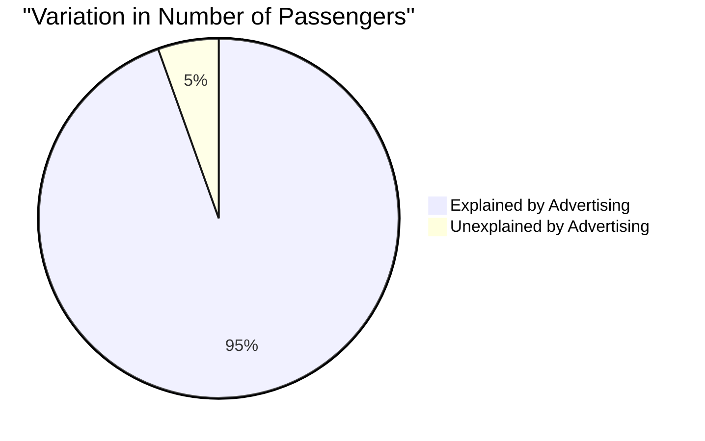
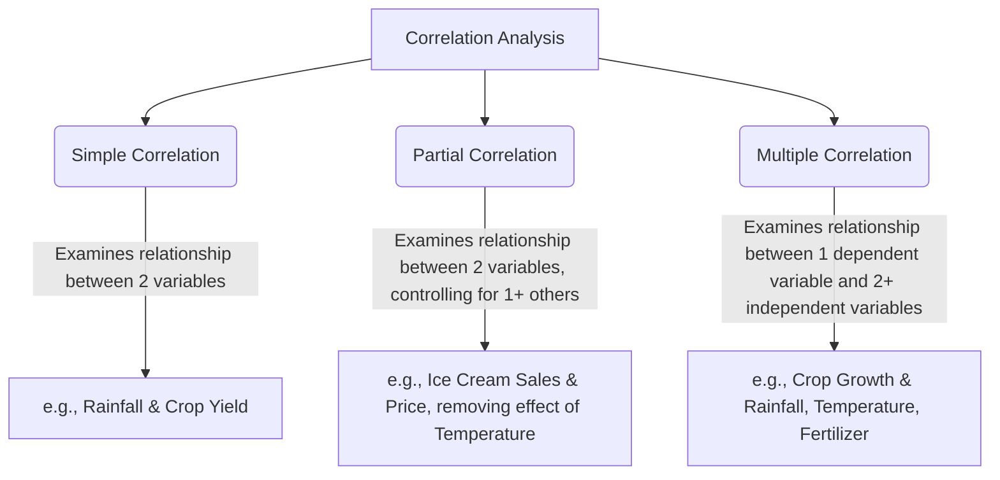
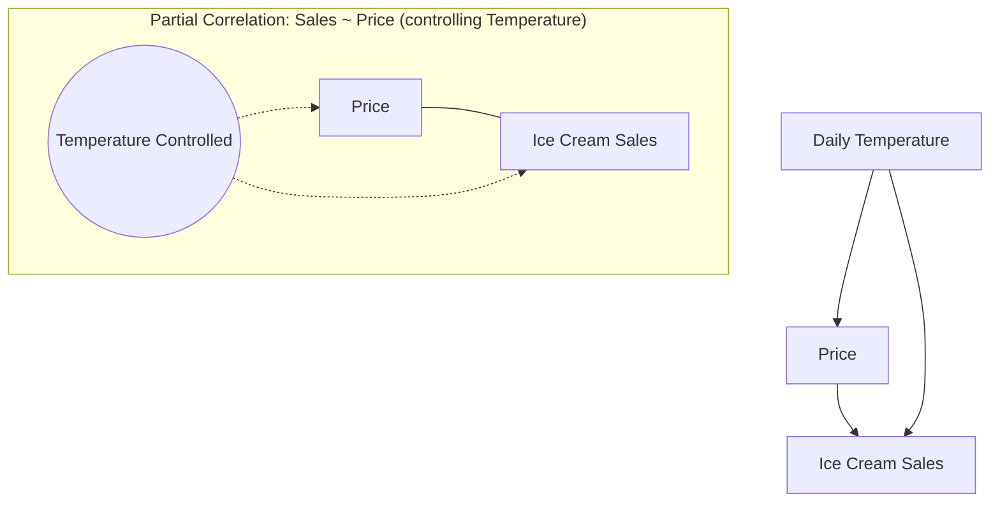
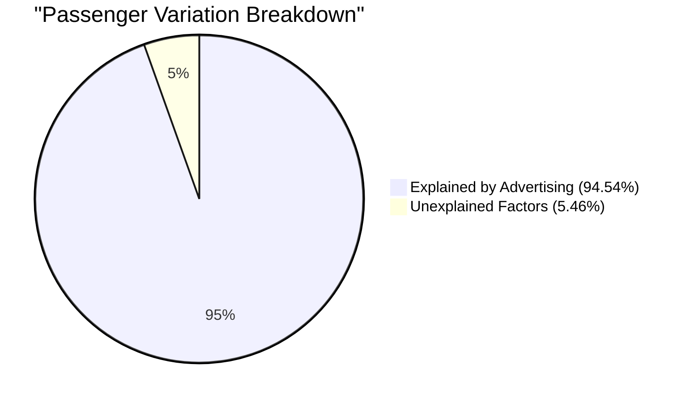

# 7 Correlation And Regression Analysis

Comprehensive resource for 7 Correlation And Regression Analysis.


---

## 7 Correlation And Regression Analysis Hub


## Overview
This unit introduces the fundamental statistical concepts of **regression analysis** and **correlation analysis**. We will explore how to identify and quantify relationships between variables, distinguish between different types of correlations, and utilize these analytical tools for prediction and understanding. The primary objective is to equip you with the knowledge to describe the pattern of relationships between variables (regression) and measure the strength and direction of those relationships (correlation).

## Learning Objectives
*   Define dependent and independent variables and explain their roles in statistical analysis.
*   Distinguish between linear and non-linear, and positive and negative correlations.
*   Describe the purpose and interpretation of scatter diagrams.
*   Calculate and interpret Karl Pearson's and Spearman's rank correlation coefficients.
*   Define simple linear regression and compute the regression equation, including its slope and y-intercept.
*   Interpret the meaning of the slope and y-intercept in the context of a regression model.
*   Understand and calculate the coefficient of determination (R-squared) and differentiate between explained and unexplained variation.
*   Apply regression models to predict values of a dependent variable based on independent variables.

## Unit Applications & Real-World Relevance
Regression and correlation analysis are cornerstones of data science, economics, engineering, and many other fields. They enable:
*   **Predictive Modeling:** Forecasting sales based on advertising spend, predicting housing prices based on features like size and location, or estimating crop yield based on fertilizer use.
*   **Relationship Understanding:** Identifying how changes in one variable impact another, such as the relationship between study hours and exam scores, or economic indicators and stock market returns.
*   **Risk Assessment:** Analyzing the strength of associations between risk factors and outcomes in medical or financial contexts.
*   **Quality Control:** Monitoring process variables to predict and prevent defects in manufacturing.

## Active Learning Prompts
*   Consider a real-world scenario where you believe two variables are related. How would you determine if this relationship is positive or negative, and linear or non-linear?
*   Think of a situation where correlation might be mistaken for causation. How would you design a study to differentiate between the two?
*   If you were a business owner, how could understanding regression and correlation help you make better strategic decisions? Provide a specific example.

## Unit Challenges & Common Misconceptions
*   **Correlation does not imply causation:** A strong correlation between two variables does not automatically mean one causes the other. There might be confounding variables or a spurious relationship.
*   **Extrapolation beyond data range:** Using a regression model to predict values outside the range of the original data can lead to inaccurate or misleading results.
*   **Outliers' impact:** Extreme values (outliers) can significantly distort correlation coefficients and regression lines, leading to misinterpretations.
*   **Misinterpreting R-squared:** A high R-squared value indicates a good fit, but it doesn't necessarily mean the model is perfect or that the independent variables are the *only* factors influencing the dependent variable.

## Connections
  - [[Dependent_and_Independent_Variables]]
  - [[Regression_Analysis]]
    - [[Non_Linear_Regression]] out of scope
    - [[Simple_Linear_Regression]]
      - [[Regression_Line]]
        - [[Slope_of_Regression_Line]]
        - [[Y_Intercept_of_Regression_Line]]
      - [[Coefficient_of_Determination]]
        - [[Explained_and_Unexplained_Variation]]
  - [[Correlation_Analysis]]
    - [[Positive_and_Negative_Correlation]]
    - [[Linear_and_Non_Linear_Correlation]]
    - [[Simple_Partial_and_Multiple_Correlation]]
    - [[Scatter_Diagram]]
    - [[Karl_Pearson_Correlation_Coefficient]]
    - [[Rank_Correlation]]
      - [[Spearman_Correlation_Coefficient]]

## Next Steps for Deeper Understanding
*   Explore advanced regression techniques like multiple regression, logistic regression, or time series analysis.
*   Investigate different types of non-parametric correlation methods beyond Spearman's rank correlation.
*   Delve into the assumptions behind linear regression models and how to test for their validity (e.g., linearity, independence of errors, homoscedasticity, normality of residuals).

## Possible Questions
[[CC2135_7_Correlation_and_Regression_Analysis_Possible_Questions]]

---

---

## Correlation Analysis


## Definition
Before proceeding, ensure you master [[Dependent_and_Independent_Variables]] and Data_Variability because correlation analysis quantifies the relationship between variables and how they vary together.
**Correlation analysis** is a statistical tool which studies and measures the extent and direction of the relationship, or association, between two or more variables. It helps us to decide the strength of the linear relationships between two variables. A simpler way to think about it is "how much do two things move together, and in what direction?" It doesn't tell you if one causes the other, just if they are related.

## The Mental Model
Imagine you have two friends who always arrive at a party around the same time. If one arrives early, the other usually arrives early too. If one is late, the other is also late. Correlation analysis is like measuring how consistently they arrive together. It's not about predicting the *exact* arrival time of one from the other (that's more like regression), but rather quantifying how much their arrivals "co-vary" or move in sync.

## Context & Framework
#### The Problem: Quantifying Observed Associations
For a long time, people observed associations between phenomena—e.g., taller parents tend to have taller children, or as temperature rises, ice cream sales increase. While these observations were clear, the ability to precisely quantify the *strength* and *direction* of such associations was limited. Correlation analysis, particularly with the development of coefficients like Karl Pearson's, provided a rigorous mathematical framework to move beyond anecdotal evidence. It allowed scientists to assign a numerical value to the degree of association, answering questions like "how strong is the relationship?" and "do they move in the same direction or opposite directions?". This transformation from qualitative observation to quantitative measurement was a significant step in the evolution of statistical reasoning.

## The Mastery Deep Dive
#### The Family Tree: Types of Correlation
Correlation analysis can be categorized based on several factors, including the number of variables, the nature of the relationship, and its direction.

```mermaid
graph TD
    A[Correlation Analysis] --> B[By Direction]
    A --> C[By Linearity]
    A --> D[By Number of Variables]

    B --> B1(Positive Correlation)
    B --> B2(Negative Correlation)

    C --> C1(Linear Correlation)
    C --> C2(Non-Linear Correlation)

    D --> D1(Simple Correlation)
    D --> D2(Partial Correlation)
    D --> D3(Multiple Correlation)

    B1 -- "Variables move in same direction" --> B1_Desc[e.g., Study Hours & Exam Scores]
    B2 -- "Variables move in opposite directions" --> B2_Desc[e.g., Price & Demand]

    C1 -- "Constant ratio of change" --> C1_Desc[e.g., Treadmill Time & Calories Burned]
    C2 -- "Non-constant ratio of change" --> C2_Desc[e.g., Fertilizer & Crop Yield (U-shaped)]

    D1 -- "Between two variables" --> D1_Desc[e.g., Height & Weight]
    D2 -- "Between two variables, controlling for others" --> D2_Desc[e.g., Ice Cream Sales & Price, controlling Temp]
    D3 -- "Between one dependent and multiple independent variables" --> D3_Desc[e.g., Crop Growth & Rainfall, Temp, Fertilizer]
```
```text
// Scenario 1: Basic Correlation Types Overview
// Output:
// (A visual representation of the graph TD diagram showing the categorization of correlation analysis.)
// Correlation analysis is categorized by direction (positive/negative), linearity (linear/non-linear), and number of variables (simple/partial/multiple).
// Positive correlation indicates variables moving in the same direction.
// Negative correlation indicates variables moving in opposite directions.
// Linear correlation implies a constant ratio of change.
// Non-linear correlation implies a non-constant ratio of change.
// Simple correlation studies two variables, partial controls for others, and multiple involves one dependent and multiple independent variables.
```
*Note: This `graph TD` diagram illustrates the different ways correlation analysis can be categorized based on the nature of the relationship being studied.*

#### Component Interactions
The type of correlation analysis used dictates the mathematical approach and the interpretation of the results:
*   **Directional Types** (positive/negative) determine if variables increase/decrease together or in opposition.
*   **Linearity Types** (linear/non-linear) influence whether a straight line adequately describes the relationship or if a curve is needed.
*   **Variable Count Types** (simple/partial/multiple) determine the complexity of the model and the specific coefficient used (e.g., Pearson's r for simple, multiple R for multiple correlation).

These classifications guide the choice of appropriate statistical tools and the accurate interpretation of the strength and pattern of relationships.

## Constraints & Limitations
#### The "Oops!" List: Correlation Does Not Equal Causation
The most critical trap in correlation analysis is the misconception that a strong correlation between two variables implies a causal relationship. This is a profound "trap" because:
1.  **Confounding Variables:** A third, unobserved variable might be influencing both correlated variables, creating an apparent association without direct causality. For example, ice cream sales and drowning incidents are highly correlated in summer, but the true cause of both is warmer weather, not that ice cream causes drowning.
2.  **Reverse Causality:** It might be that Y causes X, instead of X causing Y. For example, a correlation between high self-esteem and good academic performance could mean high self-esteem leads to better grades, but it could also mean good grades boost self-esteem.
3.  **Spurious Relationships:** Some correlations are purely coincidental and have no logical connection whatsoever (e.g., the number of pirates globally and global average temperature over time).
Therefore, always approach correlations with caution; they highlight associations that warrant further investigation, but they rarely prove causation on their own.

## Significance & Application
Correlation analysis is vital for understanding the interdependence of variables in diverse fields. In **market research**, it helps identify relationships between consumer demographics and purchasing habits. In **medical studies**, it can show the association between lifestyle factors and disease incidence. In **environmental science**, it might reveal how pollution levels correlate with changes in biodiversity. Its ability to quantify the strength and direction of these associations allows researchers to:
*   Identify potential risk factors.
*   Guide the formulation of hypotheses for further causal studies.
*   Inform policy decisions by highlighting areas where intervention might be effective, even without proving direct causation.
It is an indispensable tool for initial data exploration and hypothesis generation.

## The Worked Example
Consider a simple example to illustrate the visual concept of correlation, specifically using a scatter diagram which is a primary method for studying it.

We are looking at `Number of items produced` and `Cost incurred`. If we were to plot these on a scatter diagram, we would see how they relate.

**Example Data:**

| Number of items produced (X) | Cost incurred (Y) |
| :
--------------------------- | :
---------------- |
| 4                            | 15                |
| 5                            | 18                |
| 6                            | 18                |
| 8                            | 20                |
| 9                            | 22                |

If we visualize these points, we would observe a pattern:

```mermaid
xychart-beta
    title "Items Produced vs. Cost Incurred"
    x-axis "Number of Items Produced" min:0 max:10
    y-axis "Cost Incurred (Birr)" min:0 max:25
    line "Production Cost" [,,,,]
```
```text
// Scenario 1: Scatter plot visualization
// Output:
// (A visual representation of an XY chart showing data points for items produced and cost incurred.)
// The data points show a general upward trend, indicating that as the number of items produced increases, the cost incurred also tends to increase.
// This visual trend suggests a positive linear correlation between the two variables.
```
*Note: This `xychart-beta` visually represents the scatter of data points, allowing for an intuitive understanding of the relationship between production and cost.*

In this example, as the "Number of items produced" increases, the "Cost incurred" also tends to increase. This visual assessment points towards a **positive correlation**. Correlation analysis would then involve calculating a coefficient (like Karl Pearson's or Spearman's) to quantify the strength and direction of this observed linear relationship.

## The Proving Ground
*Test your mastery. Cover the solutions below to test yourself first.*

#### Level 1: The Sanity Check (Verification)
**The Neighbor Check:** What is the primary focus of correlation analysis?
> **Solution:** The primary focus of correlation analysis is to study and measure the extent and direction of the relationship or association between two or more variables.

#### Level 2: The Crucible (Mastery & Edge Cases)
**The Impostor:** A health magazine publishes an article highlighting a strong correlation between people who regularly eat organic food (X) and those who live longer lives (Y), concluding that eating organic food *causes* increased longevity. Explain how this falls into the "Correlation Does Not Equal Causation" trap (as discussed in `# Constraints & Limitations`). What is a significant confounding variable that might be influencing both X and Y, creating an apparent causal link where none directly exists?
> **Solution:** This scenario is a classic example of the "Correlation Does Not Equal Causation" trap. The magazine's conclusion is an "impostor" because a strong correlation between organic food consumption and longevity does not automatically mean organic food *causes* longer life. A significant **confounding variable** that might be influencing both X (organic food consumption) and Y (longevity) is **socioeconomic status (SES)**. People with higher SES often have:
> 1.  More disposable income to afford organic food (influencing X).
> 2.  Better access to healthcare, healthier overall lifestyles, less stressful jobs, and living in safer environments (all influencing Y, longevity, independently of just food choice).
> Thus, higher SES could be the underlying factor driving both organic food choices and longer lifespans, creating an apparent causal link between organic food and longevity that isn't actually direct causation. The correlation identifies an association, but other factors are likely at play.

## Key Takeaways
*   Correlation analysis quantifies the strength and direction of the relationship between variables.
*   It classifies relationships as positive or negative, linear or non-linear, and simple, partial, or multiple.
*   Crucially, correlation identifies association but does not imply causation.

## Knowledge Graph Connections
| Concept                     | Connection / Relationship                                          |
| :
-------------------------- | :
----------------------------------------------------------------- |
| [[Dependent_and_Independent_Variables]] | Correlation analysis examines the relationship between these variable types. |
| [[Regression_Analysis]]     | Correlation analysis often complements regression analysis by quantifying the strength of relationships modeled. |
| [[Positive_and_Negative_Correlation]] | These are types of directional relationships identified by correlation analysis. |
| [[Linear_and_Non_Linear_Correlation]] | These categorize the shape of the relationship identified by correlation analysis. |
| [[Scatter_Diagram]]         | Scatter diagrams are a primary visual tool for exploring correlation. |
---

---

## Dependent And Independent Variables


## Definition
Before proceeding, ensure you master fundamental Mathematical_Functions and Data_Points because understanding relationships between variables inherently relies on these mathematical concepts and data representation.
In statistics, variables are broadly categorized into **dependent** and **independent** based on their role in explaining or predicting a phenomenon. The **dependent variable** is the outcome variable, or the variable whose value is influenced or is to be predicted. The **independent variable(s)** are the predictor variables, or the variables whose values influence or predict the dependent variable. A simpler way to think about it is cause and effect: the independent variable is the "cause" you're looking at, and the dependent variable is the "effect" you're observing.

## The Mental Model
Imagine you're trying to figure out how much ice cream someone eats. You might think that the temperature outside "causes" people to eat more or less ice cream. Here, the "temperature outside" is like the **independent variable** – it's what you observe and think changes things. The "amount of ice cream eaten" is like the **dependent variable** – it's the outcome that changes because of the temperature. It "depends" on the temperature.

## Context & Framework
#### The Problem: When One Thing Affects Another
In many real-world scenarios, we observe that a change in one factor seems to be associated with a change in another. For instance, the amount of rainfall might influence crop yield, or the time spent studying might affect exam scores. Before statistics could formally quantify these relationships, people often made assumptions or relied on anecdotal evidence. The development of concepts like dependent and independent variables provided a structured way to analyze these influences, moving from mere observation to quantifiable analysis. This foundational distinction is critical for setting up any statistical investigation, whether for prediction or for understanding underlying mechanisms.

## The Mastery Deep Dive
#### The "Kill Sheet": Dependent vs. Independent Variables
| Feature              | Dependent Variable (Y)                               | Independent Variable (X)                               | The "Gotcha" Difference                                    |
| :
------------------- | :
--------------------------------------------------- | :
----------------------------------------------------- | :
--------------------------------------------------------- |
| **Role**             | Outcome, Effect, Response                            | Predictor, Cause, Explanatory                        | The dependent variable is *measured* as a result, the independent is *manipulated* or *observed* to affect Y. |
| **Influence**        | Its value is *influenced by* the independent variable(s) | Its value *influences* the dependent variable(s)     | Think of it as X *changes* Y, but Y *does not change* X (in this context). |
| **Measurement**      | Observed, measured, or recorded                      | Manipulated, chosen, or controlled by the researcher | The dependent variable is the "what you measure," the independent is the "what you change." |
| **Graphical Axis**   | Plotted on the Y-axis                              | Plotted on the X-axis                                | Always remember "DRY MIX": Dependent, Responding, Y-axis; Manipulated, Independent, X-axis. |
| **Example (Sales)**  | Ice Cream Sales                                      | Daily Temperature                                    | Sales depend *on* temperature; temperature doesn't depend *on* sales. |

#### Etymology/Semantics
The term "**dependent**" literally means "contingent on or determined by." This directly reflects its role as the variable whose value is determined by, or contingent on, the values of other variables. Conversely, "**independent**" means "not controlled by others," indicating that this variable is free to vary on its own, and its changes are presumed to *cause* or *explain* changes in the dependent variable. Understanding these root meanings clarifies their statistical roles.

## Constraints & Limitations
#### The "Oops!" List: Misidentifying Variables
A common mistake is incorrectly identifying which variable is dependent and which is independent. This can lead to flawed research questions and incorrect interpretations of statistical results. For example, if one investigates the relationship between "study hours" and "exam scores," mistakenly classifying exam scores as the independent variable and study hours as the dependent variable would imply that higher exam scores lead to more studying, which contradicts the causal direction typically assumed in educational research. Another trap is assuming a causal relationship simply because variables are identified as dependent and independent; this nomenclature merely describes their roles in a model, not necessarily a verified cause-and-effect.

## Significance & Application
The distinction between dependent and independent variables is foundational across all scientific and research disciplines. In **medicine**, a dependent variable might be patient recovery rate, while independent variables are drug dosage and treatment type. In **economics**, inflation (dependent) might be influenced by interest rates and government spending (independent). In **computer science**, the execution time of an algorithm (dependent) could depend on the input size and algorithm type (independent). This clear differentiation allows researchers to formulate hypotheses, design experiments, build predictive models, and ultimately draw meaningful conclusions from data.

## The Worked Example
Consider a simple scenario where we want to predict a student's final exam score based on the number of hours they spent studying for that exam.

Here's how we'd identify the variables:
*   **Hours Studied:** This is the factor we believe influences the outcome. We can vary or observe this amount without it being directly "caused" by the exam score itself. Therefore, "Hours Studied" is the **independent variable (X)**.
*   **Final Exam Score:** This is the outcome we are trying to predict or explain. Its value is expected to "depend" on how many hours the student studied. Therefore, "Final Exam Score" is the **dependent variable (Y)**.

If a student studies for 5 hours, we would *predict* their exam score. We wouldn't say their exam score *caused* them to study for 5 hours. This distinction is crucial for setting up a regression equation, where we typically write $Y$ as a function of $X$.

## The Proving Ground
*Test your mastery. Cover the solutions below to test yourself first.*

#### Level 1: The Sanity Check (Verification)
**The Component Check:** In a study examining the effect of fertilizer amount on crop yield, identify the dependent and independent variables.
> **Solution:** Dependent Variable: Crop Yield; Independent Variable: Fertilizer Amount.

#### Level 2: The Crucible (Mastery & Edge Cases)
**The Impostor:** A health organization wants to understand the relationship between daily step count and body mass index (BMI). They define "Daily Step Count" as the independent variable and "BMI" as the dependent variable. However, a junior researcher argues that a person's existing BMI might also influence their motivation to increase their daily step count. Explain how this scenario highlights the "Oops! Misidentifying Variables" trap by complicating the presumed one-way influence and why simply labeling them as dependent/independent might be an oversimplification without further causal investigation.
> **Solution:** While initially defining "Daily Step Count" as independent and "BMI" as dependent is standard for assessing the impact of activity on weight, the junior researcher's point reveals a potential **bidirectional relationship** or a **feedback loop**. If high BMI *also* influences step count (e.g., lower motivation to walk due to higher BMI), then the independent variable is not truly independent of the dependent variable. The "Oops!" trap here is assuming a strict causal flow when a more complex interplay exists. In such a scenario, simply labeling them can be an oversimplification because it suggests a one-way street of influence, which isn't always the case in real-world biological or behavioral systems, indicating the need for more advanced modeling or careful experimental design to disentangle causality (as discussed in `# Constraints & Limitations`).

## Key Takeaways
*   Dependent variables are outcomes or effects, whose values are influenced by other factors.
*   Independent variables are predictors or causes, whose values influence dependent variables.
*   Accurate identification of variable types is foundational for sound statistical analysis and interpretation.

## Knowledge Graph Connections
| Concept                     | Connection / Relationship                                          |
| :
-------------------------- | :
----------------------------------------------------------------- |
| [[Regression_Analysis]]     | Regression models predict the dependent variable from independent variables. |
| [[Correlation_Analysis]]    | Correlation measures the association between dependent and independent variables. |
| Data_Points             | Each data point consists of values for both dependent and independent variables. |
| Statistical_Investigation | The distinction is fundamental for designing and analyzing a statistical investigation. |
---

---

## Regression Analysis


## Definition
Before proceeding, ensure you master [[Dependent_and_Independent_Variables]] and Mathematical_Modeling because regression analysis fundamentally involves establishing a mathematical relationship between these types of variables.
**Regression analysis** is a statistical methodology used to develop an estimating equation, which is a mathematical formula that relates a dependent variable to one or more independent variables. It is concerned with the "prediction" of the most likely value of one variable when the value of the other variable is known. A simpler way to think about it is forecasting: if you know how much advertising you're doing, regression helps you forecast how many sales you might make.

## The Mental Model
Imagine you're trying to guess how tall a tree will be in 10 years. You know how tall it is now, how much sunlight it gets, and how much water. Regression analysis is like building a special "prediction machine" that takes all that known information (sunlight, water, current height) and gives you an educated guess about its future height. It’s a mathematical way of drawing a trend line through data points to make future predictions.

## Context & Framework
#### The Problem: Predicting the Unknown from the Known
Historically, people have always sought to predict future outcomes or understand how different factors influence a particular result. From predicting crop yields based on weather patterns to estimating the trajectory of celestial bodies, the challenge has been to move beyond intuition. Early attempts at prediction were often based on observation or simple rules of thumb. Regression analysis, pioneered by Sir Francis Galton in the late 19th century while studying heredity, provided a formal, mathematical framework to quantify these relationships. It allowed scientists to ask, "If I know X, what is the most likely value of Y?" This transformed prediction from an art to a science, offering a powerful tool for informed decision-making across diverse fields.

## The Mastery Deep Dive
#### Step-by-Step Derivation
The core idea of regression is to find a function that best describes the relationship between variables. For simple linear regression (the most basic form), this involves finding a straight line that minimizes the sum of the squared differences between the observed dependent variable values and the values predicted by the line. This method is called the "Least Squares Method."

Let's consider the simple linear regression model:
$$ \boxed{\displaystyle Y = \beta_0 + \beta_1 X + \epsilon} \quad \text{(Population Regression Model)}$$
Where:
*   $Y$ is the dependent variable.
*   $X$ is the independent variable.
*   $\beta_0$ is the population y-intercept.
*   $\beta_1$ is the population slope.
*   $\epsilon$ is the error term, representing unexplained variation.

Our goal in regression analysis is to estimate $\beta_0$ and $\beta_1$ from sample data. We denote these estimates as $b_0$ and $b_1$, respectively, leading to the estimated regression line:
$$ \boxed{\displaystyle \hat{Y} = b_0 + b_1 X} \quad \text{(Estimated Regression Line)}$$
Here, $\hat{Y}$ (pronounced "Y-hat") is the predicted value of the dependent variable.

The formulas for calculating $b_1$ and $b_0$ using the least squares method are derived by minimizing the sum of squared errors (SSE), which is $\sum(Y - \hat{Y})^2$. This involves calculus, taking partial derivatives with respect to $b_0$ and $b_1$ and setting them to zero. The resulting "normal equations" can be solved to yield:

Calculating the slope ($b_1$):
$$ \boxed{\displaystyle b_1 = \frac{n\sum XY - (\sum X)(\sum Y)}{n\sum X^2 - (\sum X)^2}} \quad \text{(Formula for Slope)}$$
Calculating the y-intercept ($b_0$):
$$ \boxed{\displaystyle b_0 = \bar{Y} - b_1 \bar{X}} \quad \text{(Formula for Y-Intercept)}$$
Where:
*   $n$ is the number of data points.
*   $\sum X$, $\sum Y$, $\sum XY$, $\sum X^2$ are sums of the observed values.
*   $\bar{X}$ is the mean of $X$ values.
*   $\bar{Y}$ is the mean of $Y$ values.

These formulas allow us to fit a unique straight line to a set of data points, providing the best linear unbiased estimates of the population parameters, assuming the model's assumptions hold.

## Constraints & Limitations
#### The "Oops!" List: Misinterpreting Regression
One of the most significant pitfalls in regression analysis is misinterpreting the results as evidence of **causation**. Just because a strong regression model exists (e.g., high R-squared) between two variables, it does not automatically imply that the independent variable *causes* the dependent variable. There might be:
1.  **Confounding Variables:** An unobserved third variable influencing both X and Y.
2.  **Reverse Causality:** Y actually causes X, not the other way around.
3.  **Spurious Relationships:** The relationship is purely coincidental.
For example, a regression might show that ice cream sales are a good predictor of drowning incidents. This is a spurious relationship influenced by a confounding variable: summer temperature. High temperatures lead to both more ice cream sales and more swimming (and thus, sadly, more drownings), but ice cream does not cause drownings. Always consider the context and theoretical underpinnings before inferring causation from regression.

## Significance & Application
Regression analysis is a cornerstone of predictive analytics and understanding relationships in data. In **business**, it helps predict sales, customer churn, or stock prices. In **healthcare**, it can model disease progression based on patient characteristics or the effectiveness of treatments. In **environmental science**, it might predict pollution levels based on industrial output or weather patterns. Its ability to quantify how changes in one variable relate to changes in another makes it an indispensable tool for evidence-based decision-making, hypothesis testing, and forecasting across nearly every quantitative discipline.

## The Worked Example
Let's consider a basic example to illustrate the mathematical application of regression analysis. Suppose a small business tracks its advertising expenses (X, in thousands of birr) and the number of products sold (Y, in thousands of units) over 5 months.

| Month | Advertising Expense (X) | Products Sold (Y) |
| :
---- | :
---------------------- | :
---------------- |
| 1     | 10                      | 15                |
| 2     | 12                      | 17                |
| 3     | 8                       | 13                |
| 4     | 17                      | 23                |
| 5     | 10                      | 17                |

We want to find the simple linear regression equation $\hat{Y} = b_0 + b_1 X$ to predict products sold based on advertising expense.

**Step 1: Calculate the necessary sums.**
First, we need to extend our table to calculate $XY$, $X^2$, and $Y^2$ (though $Y^2$ is not directly needed for $b_0$ and $b_1$, it's good practice for related calculations like R-squared).

| Month | X | Y | XY  | X^2 | Y^2 |
| :
---- | :- | :- | :-- | :-- | :-- |
| 1     | 10 | 15 | 150 | 100 | 225 |
| 2     | 12 | 17 | 204 | 144 | 289 |
| 3     | 8  | 13 | 104 | 64  | 169 |
| 4     | 17 | 23 | 391 | 289 | 529 |
| 5     | 10 | 17 | 170 | 100 | 289 |
| **Sum** | **57** | **85** | **1019** | **697** | **1501** |

From the table:
*   $n = 5$
*   $\sum X = 57$
*   $\sum Y = 85$
*   $\sum XY = 1019$
*   $\sum X^2 = 697$

**Step 2: Calculate the slope ($b_1$).**
Using the formula:
$$ \displaystyle b_1 = \frac{n\sum XY - (\sum X)(\sum Y)}{n\sum X^2 - (\sum X)^2} $$
$$ \displaystyle b_1 = \frac{5(1019) - (57)(85)}{5(697) - (57)^2} $$
$$ \displaystyle b_1 = \frac{5095 - 4845}{3485 - 3249} $$
$$ \displaystyle b_1 = \frac{250}{236} \approx 1.0593 $$

**Step 3: Calculate the mean of X ($\bar{X}$) and Y ($\bar{Y}$).**
$$ \displaystyle \bar{X} = \frac{\sum X}{n} = \frac{57}{5} = 11.4 $$
$$ \displaystyle \bar{Y} = \frac{\sum Y}{n} = \frac{85}{5} = 17 $$

**Step 4: Calculate the y-intercept ($b_0$).**
Using the formula:
$$ \displaystyle b_0 = \bar{Y} - b_1 \bar{X} $$
$$ \displaystyle b_0 = 17 - (1.0593)(11.4) $$
$$ \displaystyle b_0 = 17 - 12.07592 \approx 4.92408 $$

**Step 5: Write the estimated regression equation.**
$$ \boxed{\displaystyle \hat{Y} = 4.9241 + 1.0593 X} $$
This equation can now be used to predict the number of products sold ($\hat{Y}$) for a given advertising expense ($X$). For instance, if the advertising expense is 15 (i.e., 15,000 birr), the predicted sales would be $\hat{Y} = 4.9241 + 1.0593(15) = 4.9241 + 15.8895 = 20.8136$ (or 20,813.6 units).

## The Proving Ground
*Test your mastery. Cover the solutions below to test yourself first.*

#### Level 1: The Sanity Check (Verification)
**The Variable ID:** What is the primary purpose of regression analysis?
> **Solution:** The primary purpose of regression analysis is to develop a mathematical equation that can be used to predict the value of a dependent variable based on the value(s) of one or more independent variables.

#### Level 2: The Crucible (Mastery & Edge Cases)
**The Impossible Case:** A climatologist develops a regression model to predict global average temperature (dependent variable) based on the number of sunspots (independent variable). The model shows a strong fit (high R-squared). However, another scientist points out that solar activity, and thus sunspot count, peaked in the late 20th century, while global temperatures have continued to rise sharply. Explain how this scenario highlights the "Misinterpreting Regression" trap, specifically concerning causation versus correlation, and what additional data or analysis might be needed to avoid drawing incorrect conclusions.
> **Solution:** This scenario perfectly illustrates the "Misinterpreting Regression" trap by highlighting that **correlation does not imply causation**. While there might be a historical correlation between sunspot count and temperature, the divergence in recent trends strongly suggests that sunspots are **not the sole or primary causal factor** for global temperature rise. The "impossible case" here is trying to attribute causation based purely on model fit, ignoring other known scientific evidence (e.g., greenhouse gas emissions). To avoid incorrect conclusions, the climatologist would need to:
> 1.  **Include other independent variables:** Incorporate factors like greenhouse gas concentrations, volcanic activity, and deforestation into a **multiple regression model**.
> 2.  **Examine residuals:** Analyze the pattern of the errors (residuals) to see if there are systematic deviations that suggest missing variables or a non-linear relationship.
> 3.  **Consult domain expertise:** Integrate findings from atmospheric physics and climate science, which point to other dominant drivers of recent warming.
> This demonstrates that a strong statistical relationship is only a piece of the puzzle, and causal inference requires careful consideration of all relevant factors and scientific context.

## Key Takeaways
*   Regression analysis is a statistical tool used for modeling and predicting relationships between variables.
*   It primarily seeks to establish a mathematical equation that describes how a dependent variable changes with one or more independent variables.
*   The core method, least squares, aims to find the best-fitting line or curve that minimizes the sum of squared errors between observed and predicted values.

## Knowledge Graph Connections
| Concept                     | Connection / Relationship                                          |
| :
-------------------------- | :
----------------------------------------------------------------- |
| [[Dependent_and_Independent_Variables]] | Regression analysis models the dependent variable as a function of independent variables. |
| [[Simple_Linear_Regression]]| Simple linear regression is a specific type of regression analysis involving one independent variable. |
| Mathematical_Modeling   | Regression analysis is a form of mathematical modeling used for prediction and explanation. |
| Prediction              | The primary objective of regression analysis is prediction.         |
| Least_Squares_Method    | The least squares method is the statistical technique used to fit the regression line. |
---

---

## Coefficient Of Determination


## Definition
Before proceeding, ensure you master [[Simple_Linear_Regression]] and Variation because the coefficient of determination quantifies the proportion of variation in the dependent variable that is explained by the regression model.
The **coefficient of determination**, denoted as $R^2$ (or sometimes $r^2$ for simple linear regression), is the portion of the total variation in the dependent variable that is explained by the variation in the independent variable(s) of a regression model. It is a measure of how well the regression line fits the observed data, with values always between 0 and 1 inclusive ($0 \le R^2 \le 1$). A higher $R^2$ indicates a better fit of the model to the data. A simpler way to think about it is "how much of the mystery about Y can X explain?"

## The Mental Model
Imagine you're trying to figure out why some students score higher on a test than others. You might consider how many hours they studied. If "hours studied" explains 70% of the differences in test scores, then your $R^2$ is 0.70. The remaining 30% is still a mystery (maybe it's natural ability, sleep, etc.). So, $R^2$ tells you how much of the "score mystery" your "study hours" explanation solves.

## Context & Framework
#### The Problem: Quantifying the "Goodness of Fit"
After fitting a regression line to data, an essential question arises: how well does this line actually represent the data points? Visually inspecting a scatter plot can give a qualitative sense, but a precise, quantitative measure of the "goodness of fit" is needed for objective evaluation and comparison of models. The coefficient of determination ($R^2$) emerged as this crucial metric. It transformed the subjective assessment of how closely data points cluster around a regression line into an objective proportion: the percentage of the dependent variable's variance that the independent variable(s) can account for. This allows researchers to confidently state the explanatory power of their models and assess their practical utility.

## The Mastery Deep Dive
#### Step-by-Step Derivation
The coefficient of determination ($R^2$) is calculated from the sums of squares related to the regression model. It can be understood as the ratio of explained variation to total variation.

**Key Components:**
1.  **Total Sum of Squares (SST):** Measures the total variation in the dependent variable ($Y$) around its mean ($\bar{Y}$).
    $$ \boxed{\displaystyle SST = \sum (Y_i - \bar{Y})^2} \quad \text{(Total Variation)} $$
2.  **Regression Sum of Squares (SSR):** Measures the variation in $Y$ that is explained by the regression model (i.e., by the relationship with $X$). This is the variation between the predicted values ($\hat{Y}$) and the mean of $Y$.
    $$ \boxed{\displaystyle SSR = \sum (\hat{Y}_i - \bar{Y})^2} \quad \text{(Explained Variation)} $$
3.  **Error Sum of Squares (SSE):** Measures the variation in $Y$ that is *not* explained by the regression model. This is the residual variation between the observed values ($Y$) and the predicted values ($\hat{Y}$).
    $$ \boxed{\displaystyle SSE = \sum (Y_i - \hat{Y}_i)^2} \quad \text{(Unexplained Variation)}$$

**Relationship:** The total variation is the sum of the explained and unexplained variation:
$$ \boxed{\displaystyle SST = SSR + SSE} \quad \text{(Decomposition of Variation)} $$

**Formula for $R^2$:**
The coefficient of determination is defined as the proportion of the total variation in the dependent variable ($Y$) that is explained by the regression model:
$$ \boxed{\displaystyle R^2 = \frac{SSR}{SST} = 1 - \frac{SSE}{SST}} \quad \text{(Formula for R-squared)}$$

For **simple linear regression** only, $R^2$ is simply the square of the Karl Pearson correlation coefficient ($r$):
$$ \boxed{\displaystyle R^2 = r^2} \quad \text{(R-squared for Simple Linear Regression)}$$
This is why it's also sometimes denoted as $r^2$.

**Worked Example Calculation:**
Let's use the advertising expense (X) and products sold (Y) example from previous notes.
From `Simple_Linear_Regression` calculations, we found the Karl Pearson correlation coefficient $r \approx 0.9723$.

Using the relationship $R^2 = r^2$:
$$ \displaystyle R^2 = (0.9723)^2 \quad \text{(Square the correlation coefficient)} $$
$$ \boxed{\displaystyle R^2 \approx 0.9453} \quad \text{(Calculate R-squared)}$$

**Interpretation:**
An $R^2$ of approximately 0.9453 (or 94.53%) means that approximately 94.53% of the total variation in products sold (Y) can be explained by the variation in advertising expense (X). This indicates a very strong fit of the regression model to the data, suggesting that advertising expense is an excellent predictor of product sales.

## Constraints & Limitations
#### The "Oops!" List: Misinterpreting High R-squared
A high $R^2$ (or $r^2$) value is often seen as the ultimate goal, but it can be a significant "trap" if misinterpreted. The core pitfalls are:
1.  **Causation vs. Correlation:** A high $R^2$ only indicates that the independent variable(s) explain a large proportion of the variance in the dependent variable; it does **not** imply a causal relationship. Spurious correlations can yield high $R^2$ values.
2.  **Model Validity:** A high $R^2$ does not guarantee that the regression model is appropriate or valid. For instance, if linearity assumptions are violated, a high $R^2$ might still indicate a strong association but a poor model of the underlying mechanism.
3.  **Overfitting:** Especially with multiple regression, adding more independent variables will always increase $R^2$, even if the new variables are irrelevant. This can lead to overfitting, where the model performs well on training data but poorly on new data.
Therefore, a high $R^2$ should be interpreted cautiously and in conjunction with other diagnostic measures, domain knowledge, and a check of model assumptions. It's a measure of explanatory power, not necessarily proof of causation or perfect predictive ability.

## Significance & Application
The coefficient of determination ($R^2$) is a crucial metric for evaluating the utility and "goodness of fit" of a regression model. It provides a clear, standardized percentage that quantifies the explanatory power of the independent variables. In **market research**, an $R^2$ of 0.80 for a model predicting consumer spending based on income suggests that 80% of the variability in spending can be attributed to income. In **quality control**, an $R^2$ between manufacturing process settings and product defect rates indicates how well the settings control defects. This measure allows researchers and practitioners to assess the strength of their models, compare alternative explanations for phenomena, and communicate the practical significance of their findings in a universally understood way.

## The Worked Example
Let's refer to the example from the lecture slides that calculates the coefficient of determination. We are given the correlation coefficient ($r$) for advertising expense and number of passengers.

From lecture slide 63/76, the coefficient of correlation is $r = 0.9723$.

**Step 1: Calculate the coefficient of determination ($r^2$).**
Since this is simple linear regression, $r^2$ is simply the square of the correlation coefficient:
$$ \boxed{\displaystyle r^2 = (0.9723)^2} \quad \text{(Square the correlation coefficient)} $$
$$ \boxed{\displaystyle r^2 \approx 0.94537229} \quad \text{(Calculate the squared value)} $$

**Step 2: Express $r^2$ as a percentage.**
$$ \displaystyle r^2 \times 100\% \approx 0.94537229 \times 100\% \approx 94.54\% \quad \text{(Convert to percentage)} $$

**Step 3: Interpret the result.**
This figure indicates that there is a very strong correlation between advertising expense and the number of passengers. More specifically, approximately **94.54% of the total variation in the number of passengers can be explained by the variation in advertising expense**. The remaining approximately 5.46% of the variation in passenger numbers is attributed to other factors not included in this model (unexplained variation).


```text
// Scenario 1: High R-squared interpretation
// Input: R-squared = 0.9454 (94.54%)
// Output: 94.54% of the variability in passenger numbers is accounted for by advertising expense. This implies a very strong relationship and high predictive power.
//
// Scenario 2: Low R-squared interpretation (Hypothetical)
// Input: R-squared = 0.10 (10%)
// Output: Only 10% of the variability in passenger numbers is accounted for by advertising expense. This indicates a weak relationship and low predictive power, suggesting many other factors are at play.
```
*Note: This `pie` chart visually represents the proportion of explained versus unexplained variation, providing a clear intuitive understanding of the $R^2$ value.*

## The Proving Ground
*Test your mastery. Cover the solutions below to test yourself first.*

#### Level 1: The Sanity Check (Verification)
**The Variable ID:** What is the possible range of values for the coefficient of determination ($R^2$)?
> **Solution:** The possible range of values for the coefficient of determination ($R^2$) is between 0 and 1 inclusive ($0 \le R^2 \le 1$).

#### Level 2: The Crucible (Mastery & Edge Cases)
**The Impossible Case:** A social scientist builds a simple linear regression model to predict an individual's happiness score (Y) based on their daily screen time (X). The model yields an $R^2$ of 0.88. The scientist enthusiastically concludes that reducing screen time *will directly cause* a significant increase in happiness. Explain how this conclusion falls into the "Misinterpreting High R-squared" trap (as discussed in `# Constraints & Limitations`). What critical distinction is the scientist missing, and what alternative factors might actually be influencing both screen time and happiness?
> **Solution:** This conclusion falls directly into the "Misinterpreting High R-squared" trap, specifically conflating correlation with causation. The "impossible case" is the leap from a strong statistical association ($R^2 = 0.88$) to a direct causal claim. The scientist is missing the critical distinction that **correlation does not imply causation**. While there's a strong statistical relationship, it doesn't mean that screen time *causes* happiness. There could be numerous **alternative factors** or **confounding variables** influencing both screen time and happiness, such as:
> 1.  **Mental health:** Individuals experiencing depression or anxiety might spend more time on screens (X) and simultaneously report lower happiness (Y). Here, mental health is a confounding variable, not screen time itself.
> 2.  **Social isolation:** Lack of social interaction might lead to both increased screen time and decreased happiness.
> 3.  **Job satisfaction/stress:** A stressful job could increase screen time (for escapism or work-related reasons) and reduce happiness.
> A high $R^2$ simply means screen time is a good *predictor* of happiness within this dataset, but it doesn't confirm it as the *cause*. To infer causation, a controlled experiment (randomized controlled trial) would be needed, or advanced causal inference techniques that go beyond simple regression.

## Key Takeaways
*   The coefficient of determination ($R^2$) measures the proportion of variance in the dependent variable explained by the model.
*   It ranges from 0 to 1, with higher values indicating a better fit.
*   A high $R^2$ does not imply causation and must be interpreted carefully with regard to model validity and potential overfitting.

## Knowledge Graph Connections
| Concept                     | Connection / Relationship                                          |
| :
-------------------------- | :
----------------------------------------------------------------- |
| [[Simple_Linear_Regression]]| $R^2$ is a key metric for evaluating the goodness of fit of a simple linear regression model. |
| Correlation_Coefficient | For simple linear regression, $R^2$ is the square of the Karl Pearson correlation coefficient. |
| [[Explained_and_Unexplained_Variation]]| $R^2$ is the ratio of explained variation to total variation. |
| Prediction              | A higher $R^2$ generally indicates better predictive power of the model. |
| Goodness_Of_Fit         | $R^2$ is a direct measure of the goodness of fit of a regression model to the observed data. |
---

---

## Karl Pearson Correlation Coefficient


## Definition
Before proceeding, ensure you master [[Correlation_Analysis]] and Linear_Relationships because Karl Pearson's correlation coefficient is the most common measure of the strength and direction of a linear relationship between two quantitative variables.
**Karl Pearson's correlation coefficient**, often denoted by 'r', is a numerical measure that quantifies the strength and direction of the linear relationship between two quantitative variables. It is always a number between -1 and +1, inclusive. A value of +1 indicates a perfect positive linear correlation, -1 indicates a perfect negative linear correlation, and 0 indicates no linear correlation. A simpler way to think about it is a "score" that tells you how perfectly two things move together in a straight line.

## The Mental Model
Imagine a tug-of-war between two teams (your two variables).
*   If `r = +1`, it's like both teams are pulling perfectly in the same direction, with the same strength. A perfect sync.
*   If `r = -1`, it's like they're pulling perfectly in opposite directions, with equal strength. Still a perfect sync, but opposite.
*   If `r = 0`, it's like they're both just standing there, or pulling randomly. No coordinated movement.
Any value between -1 and +1 indicates a partial agreement, and the closer to +1 or -1, the stronger the coordinated pull.

## Context & Framework
#### The Problem: Quantifying Linear Associations Precisely
While [[Scatter_Diagram]]s provided a visual sense of linear relationships, a precise numerical measure was needed to objectively quantify the strength and direction of these associations. Karl Pearson, a prominent statistician, developed his product-moment correlation coefficient in the late 19th century to address this need. His formula provided a standardized value, independent of the units of measurement, that directly indicated how closely two variables moved together in a linear fashion. This advancement allowed for rigorous comparisons between different studies and transformed the qualitative observation of relationships into a precise, universally understood quantitative metric, becoming a cornerstone of modern statistical analysis.

## The Mastery Deep Dive
#### Step-by-Step Derivation
The Karl Pearson correlation coefficient ($r$) is calculated using the following formula:

$$ \boxed{\displaystyle r = \frac{n\sum XY - (\sum X)(\sum Y)}{\sqrt{[n\sum X^2 - (\sum X)^2][n\sum Y^2 - (\sum Y)^2]}}} \quad \text{(Pearson's Correlation Coefficient Formula)}$$

Where:
*   $n$: Number of data points (pairs of X and Y values)
*   $\sum X$: Sum of all X values
*   $\sum Y$: Sum of all Y values
*   $\sum XY$: Sum of the product of each X and Y pair
*   $\sum X^2$: Sum of the squared X values
*   $\sum Y^2$: Sum of the squared Y values

**Example Calculation:**
Let's use the advertising expense (X) and products sold (Y) example from previous notes, and explicitly calculate Karl Pearson's $r$.

| x | y | xy  | x^2 | y^2 |
| :- | :- | :-- | :-- | :-- |
| 4 | 15 | 60 | 16 | 225 |
| 5 | 18 | 90 | 25 | 324 |
| 6 | 18 | 108 | 36 | 324 |
| 8 | 20 | 160 | 64 | 400 |
| 9 | 22 | 198 | 81 | 484 |
| **32** | **93** | **616** | **222** | **1757** |

From the table:
*   $n = 5$
*   $\sum X = 32$
*   $\sum Y = 93$
*   $\sum XY = 616$
*   $\sum X^2 = 222$
*   $\sum Y^2 = 1757$

Substitute these values into the formula:
$$ \displaystyle r = \frac{5(616) - (32)(93)}{\sqrt{[5(222) - (32)^2][5(1757) - (93)^2]}} \quad \text{(Substitute values into the formula)} $$
$$ \displaystyle r = \frac{3080 - 2976}{\sqrt{[1110 - 1024][8785 - 8649]}} \quad \text{(Perform multiplication and squaring)} $$
$$ \displaystyle r = \frac{104}{\sqrt{}} \quad \text{(Perform subtraction)} $$
$$ \displaystyle r = \frac{104}{\sqrt{11696}} \quad \text{(Multiply terms in denominator)} $$
$$ \displaystyle r = \frac{104}{108.1480} \quad \text{(Calculate square root)} $$
$$ \boxed{\displaystyle r \approx 0.9616} \quad \text{(Calculate final value)} $$

**Interpretation:**
A Pearson's $r$ of approximately 0.9616 indicates a very strong positive linear relationship between advertising expense and products sold. This means as advertising expense increases, products sold tend to increase significantly and consistently.

## Constraints & Limitations
#### The "Oops!" List: Sensitivity to Outliers
Karl Pearson's correlation coefficient is highly sensitive to **outliers** (extreme data points). This is a significant "trap" because:
1.  **Distorted Magnitude:** A single outlier can dramatically inflate or deflate the value of $r$, making a weak relationship appear strong, or a strong relationship appear weak, or even changing the sign of the correlation. For example, if most data points show a moderate positive correlation, but one extreme point exists far from the trend, $r$ might shift considerably to accommodate it, misrepresenting the majority of the data.
2.  **Assumption of Normality (less strict for $r$ itself, but for inference):** While $r$ can be computed for any two variables, its interpretation for statistical inference (e.g., hypothesis testing) assumes that the data are drawn from a bivariate normal distribution.
Therefore, always visually inspect your data using a [[Scatter_Diagram]] before calculating $r$, and consider whether outliers are true data points or errors, as they can heavily bias your correlation measure.

## Significance & Application
Karl Pearson's correlation coefficient is one of the most widely used statistical measures for quantifying linear relationships, offering a clear and standardized metric. In **finance**, it's used to measure the correlation between different stocks or assets to inform portfolio diversification. In **psychology**, it might quantify the linear relationship between test scores from two different assessments. In **engineering**, it could measure the linear association between a component's temperature and its operational lifespan. Its benefits include:
*   **Standardized Measure:** Easy to interpret as it always falls between -1 and +1.
*   **Direction and Strength:** Conveys both the direction (positive/negative) and strength (magnitude) of the linear relationship.
*   **Foundation for Regression:** Its square ($r^2$) directly relates to the [[Coefficient_of_Determination]] in simple linear regression.
It provides a fundamental understanding of how two quantitative variables linearly relate.

## The Worked Example
Let's use one of the examples from the lecture slides to calculate Karl Pearson's correlation coefficient. We will use the data provided for "Number of items produced" and "Cost incurred" (lecture slides 44-47/76).

**Example Data and Sums (from lecture slide 46/76):**
*   $n = 5$
*   $\sum x = 32$
*   $\sum y = 93$
*   $\sum xy = 616$
*   $\sum x^2 = 222$
*   $\sum y^2 = 1757$

**Step 1: Calculate the numerator.**
$$ \displaystyle \text{Numerator} = n\sum xy - (\sum x)(\sum y) $$
$$ \displaystyle \text{Numerator} = 5(616) - (32)(93) \quad \text{(Substitute values)} $$
$$ \displaystyle \text{Numerator} = 3080 - 2976 \quad \text{(Perform multiplication)} $$
$$ \displaystyle \text{Numerator} = 104 \quad \text{(Perform subtraction)} $$

**Step 2: Calculate the terms under the square root in the denominator.**
*   Term 1: $n\sum x^2 - (\sum x)^2$
    $$ \displaystyle 5(222) - (32)^2 = 1110 - 1024 = 86 \quad \text{(Calculate first term)} $$
*   Term 2: $n\sum y^2 - (\sum y)^2$
    $$ \displaystyle 5(1757) - (93)^2 = 8785 - 8649 = 136 \quad \text{(Calculate second term)} $$

**Step 3: Calculate the denominator.**
$$ \displaystyle \text{Denominator} = \sqrt{(\text{Term 1}) \times (\text{Term 2})} $$
$$ \displaystyle \text{Denominator} = \sqrt{86 \times 136} \quad \text{(Multiply terms)} $$
$$ \displaystyle \text{Denominator} = \sqrt{11696} \quad \text{(Calculate square root)} $$
$$ \displaystyle \text{Denominator} \approx 108.14804 \quad \text{(Approximate value)} $$

**Step 4: Calculate Karl Pearson's correlation coefficient ($r$).**
$$ \displaystyle r = \frac{\text{Numerator}}{\text{Denominator}} $$
$$ \displaystyle r = \frac{104}{108.14804} \quad \text{(Divide numerator by denominator)} $$
$$ \boxed{\displaystyle r \approx 0.9616} \quad \text{(Round to four decimal places)} $$
This matches the calculation shown on lecture slide 47/76 (where $104 / 108.15 \approx 0.96$).

**Interpretation:**
A correlation coefficient of approximately **0.96** indicates a very strong positive linear relationship between the number of items produced and the cost incurred. This means that as more items are produced, the cost tends to increase very consistently.

## The Proving Ground
*Test your mastery. Cover the solutions below to test yourself first.*

#### Level 1: The Sanity Check (Verification)
**The Variable ID:** What is the possible range of values for Karl Pearson's correlation coefficient?
> **Solution:** Karl Pearson's correlation coefficient ranges from -1 to +1, inclusive.

#### Level 2: The Crucible (Mastery & Edge Cases)
**The Impossible Case:** A researcher investigates the linear relationship between the amount of sleep (X) and reaction time (Y) in milliseconds. Most participants show a moderate negative linear correlation (more sleep, faster reaction time). However, one participant (an insomniac) has extremely low sleep (X=1 hour) but also an unexpectedly fast reaction time (Y=150 ms) due to adrenaline. Explain how this outlier might lead to the "Sensitivity to Outliers" trap (as discussed in `# Constraints & Limitations`) when calculating Karl Pearson's $r$. How could this single data point distort the coefficient, and what alternative correlation measure might be less affected?
> **Solution:** This scenario perfectly exemplifies the "Sensitivity to Outliers" trap for Karl Pearson's $r$. The single outlier (insomniac with low sleep, fast reaction) is far removed from the general trend of "more sleep, faster reaction time." Since Pearson's $r$ uses the actual values of each data point, this extreme outlier can **significantly pull the regression line towards itself**, thereby distorting the calculated $r$ value. It could weaken an otherwise strong negative correlation, or even shift it towards zero, making it seem like sleep has less impact than it truly does for the majority of the population. The "impossible case" is that this single, potentially unrepresentative, data point could drastically alter the measure of association for the entire group.
> A more robust alternative correlation measure that would be less affected by this outlier is [[Spearman_Correlation_Coefficient]]. Spearman's rho uses the *ranks* of the data rather than their raw values, making it less sensitive to extreme observations and thus a better choice when outliers are present or when the distribution is not normal.

## Key Takeaways
*   Karl Pearson's correlation coefficient ($r$) measures the strength and direction of linear relationships.
*   It ranges from -1 (perfect negative) to +1 (perfect positive), with 0 indicating no linear correlation.
*   It is calculated using a formula involving sums of X, Y, and their products and squares.

## Knowledge Graph Connections
| Concept                     | Connection / Relationship                                          |
| :
-------------------------- | :
----------------------------------------------------------------- |
| [[Correlation_Analysis]]    | Karl Pearson's coefficient is a primary quantitative measure used in correlation analysis. |
| Linear_Relationships    | This coefficient specifically quantifies the strength and direction of linear relationships. |
| [[Scatter_Diagram]]         | The value of Pearson's $r$ should be interpreted in conjunction with a scatter diagram. |
| [[Coefficient_of_Determination]]| The square of Pearson's $r$ ($r^2$) is the coefficient of determination for simple linear regression. |
| Outliers                | Pearson's $r$ is sensitive to outliers, which can distort its value. |
---

---

## Linear And Non Linear Correlation


## Definition
Before proceeding, ensure you master [[Correlation_Analysis]] and Mathematical_Functions because understanding the form of a relationship (linear or non-linear) is crucial for selecting appropriate correlation and regression techniques.
Correlation can also be classified by the **form** of the relationship between variables:
1.  **Linear correlation:** Occurs if the change in one variable tends to bear a constant ratio to the change in the other variable. When plotted on a scatter diagram, the points tend to fall along a straight line.
2.  **Non-linear correlation:** Occurs if the amount of change in one variable does not bear a constant ratio to the amount of change in the other variable. When plotted, the points tend to follow a curved pattern.
A simpler way to think about it is: "does the relationship look like a straight line (linear) or a curve (non-linear)?"

## The Mental Model
Imagine driving a car.
*   **Linear Correlation:** If you press the accelerator pedal (X) down by 1 inch, and your speed (Y) always increases by exactly 5 mph, that's a linear relationship – a constant ratio.
*   **Non-Linear Correlation:** If you press the accelerator pedal by 1 inch, and your speed first jumps a lot, then less and less, and then perhaps even drops if you push it too far (like a gas pedal getting stuck or the engine overheating), that's a non-linear relationship. The effect isn't constant.

## Context & Framework
#### The Problem: When Reality Doesn't Follow a Straight Path
For centuries, the simplest way to describe a relationship between two quantities was often a straight line. However, the real world is rarely so simple. Phenomena like the growth of organisms, the effectiveness of medication dosage, or the impact of advertising on sales often exhibit diminishing returns or more complex curvilinear patterns. The formal distinction between linear and non-linear correlation arose from the need to accurately represent these varied relationships. This framework is essential because applying a linear model to a fundamentally non-linear relationship will lead to misleading conclusions and poor predictions. Recognizing the non-linear nature of a correlation guides the selection of more sophisticated analytical tools (like [[Non_Linear_Regression]]) to better capture the true dynamics of the data.

## The Mastery Deep Dive
#### The "Kill Sheet": Linear vs. Non-Linear Correlation
| Feature              | Linear Correlation                                            | Non-Linear Correlation                                        | The "Gotcha" Difference                                    |
| :
------------------- | :
------------------------------------------------------------ | :
------------------------------------------------------------ | :
--------------------------------------------------------- |
| **Relationship Pattern** | Constant ratio of change between variables                    | Non-constant ratio of change between variables                | The constancy (or lack thereof) of the rate of change defines the type. |
| **Graphical Shape**  | Points tend to form a straight line on a scatter plot         | Points tend to form a curve on a scatter plot                 | Visual inspection of a scatter plot is key.                |
| **Predictive Tool**  | Best modeled by [[Simple_Linear_Regression]]                  | Requires [[Non_Linear_Regression]] models (e.g., polynomial, exponential) | Choosing the right regression model depends on this distinction. |
| **Examples**         | Treadmill time & Calories burned; Height & Shoe size; Car speed & Fuel consumption (within limits) | Study time & Exam score (diminishing returns); Fertilizer & Crop yield (inverted U-shaped); Drug dosage & Effectiveness (saturation) | Real-world examples clearly show straight vs. curved patterns. |
| **Correlation Coefficient** | Pearson's $r$ is effective for measuring strength and direction | Pearson's $r$ can be misleading if applied to strong non-linear relationships | A low Pearson's $r$ doesn't necessarily mean no relationship if it's non-linear. |

#### Etymology/Semantics
"Linear" comes from "line," directly referencing the straight-line pattern of the relationship. "Non-linear" simply means "not linear," implying any pattern that deviates from a straight line. This straightforward etymology reinforces the visual and mathematical distinction between the two types of correlation.

## Constraints & Limitations
#### The "Oops!" List: Zero Linear Correlation Doesn't Mean No Relationship
A significant trap is to assume that if a calculated linear correlation coefficient (like Pearson's $r$) is close to zero, there is **no relationship whatsoever** between the variables. This is a "trap" because:
1.  **Strong Non-Linear Relationship:** Two variables can have a very strong non-linear relationship (e.g., a perfect U-shaped or inverted U-shaped curve) but still exhibit a linear correlation coefficient near zero. This happens because the positive and negative parts of the non-linear relationship "cancel out" when calculating the linear coefficient.
For example, if test scores first increase with anxiety to an optimal point, then decrease with excessive anxiety, the relationship is curvilinear. A linear correlation coefficient might be close to zero, falsely suggesting no relationship. Therefore, always visualize data using a [[Scatter_Diagram]] before relying solely on linear correlation coefficients.

## Significance & Application
Distinguishing between linear and non-linear correlation is crucial for selecting appropriate statistical models and accurately interpreting relationships. In **marketing**, understanding that advertising spend might have a non-linear effect on sales (e.g., diminishing returns after a certain point) dictates using a non-linear model for more accurate forecasting. In **medicine**, drug dosage and patient response often follow non-linear patterns, requiring non-linear models to optimize treatment. This distinction is vital for:
*   Choosing the correct regression techniques (e.g., [[Simple_Linear_Regression]] vs. [[Non_Linear_Regression]]).
*   Avoiding misleading conclusions from linear models when the true relationship is curved.
*   Developing more robust predictive models that capture the true complexity of real-world phenomena.

## The Worked Example
Let's consider two scenarios to illustrate the difference between linear and non-linear correlation.

**Scenario 1: Linear Correlation**
Consider the relationship between **Number of Push-ups (X)** performed and **Calories Burned (Y)**. Up to a certain point, it's reasonable to assume that more push-ups will burn proportionally more calories.

Example Data:
| Push-ups (X) | Calories Burned (Y) |
| :
----------- | :
------------------ |
| 10           | 20                  |
| 20           | 40                  |
| 30           | 60                  |
| 40           | 80                  |

Here, for every 10 additional push-ups, 20 more calories are burned, suggesting a constant ratio of change.

```mermaid
xychart-beta
    title "Push-ups vs. Calories Burned"
    x-axis "Number of Push-ups" min:0 max:50
    y-axis "Calories Burned" min:0 max:100
    line "Energy Expenditure" [,,,]
```
```text
// Scenario 1: Push-ups vs. Calories Burned
// Output:
// (A visual representation of an XY chart showing a straight upward trend.)
// The data points fall along a straight line, indicating a linear correlation.
```

**Scenario 2: Non-Linear Correlation (Diminishing Returns)**
Consider the relationship between **Study Time (X)** and **Exam Score (Y)**. Initially, more study time leads to large improvements, but eventually, fatigue sets in, and additional study time yields smaller and smaller gains, or even decreases, forming a curve of diminishing returns.

Example Data:
| Study Time (X, hours) | Exam Score (Y, out of 100) |
| :
-------------------- | :
------------------------- |
| 1                     | 60                         |
| 2                     | 75                         |
| 3                     | 85                         |
| 4                     | 90                         |
| 5                     | 92                         |

Here, the increase in Exam Score for each additional hour of Study Time decreases, indicating a non-constant ratio of change.

```mermaid
xychart-beta
    title "Study Time vs. Exam Score (Diminishing Returns)"
    x-axis "Study Time (hours)" min:0 max:6
    y-axis "Exam Score (0-100)" min:50 max:100
    line "Learning Curve" [,,,,]
```
```text
// Scenario 2: Study Time vs. Exam Score
// Output:
// (A visual representation of an XY chart showing a curve that flattens out.)
// The data points follow a curve, indicating that the relationship is non-linear. The increase in score diminishes with additional study time.
```
*Note: These `xychart-beta` diagrams visually demonstrate how data patterns can be linear or non-linear.*

## The Proving Ground
*Test your mastery. Cover the solutions below to test yourself first.*

#### Level 1: The Sanity Check (Verification)
**The Component Check:** How would the data points typically appear on a scatter diagram for a linear correlation?
> **Solution:** For a linear correlation, the data points would tend to fall along a straight line on a scatter diagram.

#### Level 2: The Crucible (Mastery & Edge Cases)
**The Impostor:** A market analyst calculates a Pearson correlation coefficient ($r$) of -0.05 between the price of a luxury good (X) and its sales volume (Y). Based on this very low $r$ value, she concludes that there is effectively no relationship between price and sales. However, upon plotting the data, she sees an inverted U-shaped curve: sales increase up to an optimal price point, then decline. Explain how this scenario highlights the "Zero Linear Correlation Doesn't Mean No Relationship" trap (as discussed in `# Constraints & Limitations`). What is the actual nature of the relationship, and why was the Pearson $r$ misleading?
> **Solution:** This scenario perfectly illustrates the "Zero Linear Correlation Doesn't Mean No Relationship" trap. The analyst's conclusion of "no relationship" based on $r = -0.05$ is an "impostor" because it ignores the actual visual pattern. The **actual nature of the relationship is a strong non-linear (inverted U-shaped) correlation**. The Pearson $r$ was misleading because it is designed to measure the strength of *linear* relationships. In an inverted U-shaped curve, the initial positive association (as price increases, sales increase to a point) and the subsequent negative association (as price increases further, sales decrease) can effectively **cancel each other out** when calculating the linear correlation coefficient, leading to a value close to zero. This false zero value masks a very real and important non-linear relationship. This emphasizes the critical importance of visualizing data (e.g., with a [[Scatter_Diagram]]) before relying solely on numerical correlation coefficients.

## Key Takeaways
*   Linear correlation implies a constant ratio of change between variables, forming a straight line on a scatter plot.
*   Non-linear correlation implies a non-constant ratio of change, forming a curve on a scatter plot.
*   Visual inspection of data is crucial to identify the correct form of correlation, as linear coefficients can be misleading for non-linear relationships.

## Knowledge Graph Connections
| Concept                     | Connection / Relationship                                          |
| :
-------------------------- | :
----------------------------------------------------------------- |
| [[Correlation_Analysis]]    | Linear and non-linear correlations are classifications of the form of relationships in correlation analysis. |
| [[Scatter_Diagram]]         | These types of correlations are best visualized and identified using scatter diagrams. |
| [[Simple_Linear_Regression]]| Linear correlation is the basis for simple linear regression models. |
| [[Non_Linear_Regression]]   | Non-linear correlation requires the use of non-linear regression models for accurate representation. |
| Pearson_Correlation_Coefficient | Pearson's $r$ primarily measures linear correlation and can be misleading for strong non-linear relationships. |
---

---

## Non Linear Regression


## Definition
Before proceeding, ensure you master [[Regression_Analysis]] and Mathematical_Functions because non-linear regression builds upon the foundational concepts of relationships between variables and the mathematical expressions that describe them.
**Non-linear regression** is a form of regression analysis that models relationships between a dependent variable and one or more independent variables where the relationship is not a straight line. Instead, it fits a curve to the data, often using numerical optimization to find the best parameters for a given non-linear function, which can be derived from theoretical principles. A simpler way to think about it is fitting a bendy line to your data, rather than just a straight one.

## The Mental Model
Imagine you're trying to describe the path a ball takes when you throw it up in the air. A straight line (linear regression) wouldn't work because the ball arcs. Non-linear regression is like drawing that exact curved path on a graph, predicting where the ball will be at different points in time. It's for when the "cause and effect" isn't a simple, constant increase or decrease.

## Context & Framework
#### The Problem: When a Straight Line Isn't Enough
Early statistical methods often focused on linear relationships due to their simplicity and ease of calculation. However, many natural and social phenomena do not follow a simple straight-line pattern. For instance, population growth isn't always linear, drug concentration in the bloodstream changes in a complex curve over time, and economic trends can exhibit periods of rapid growth followed by saturation. The recognition that a linear model could misrepresent these complex patterns led to the development of non-linear regression. This method allows statisticians to capture more nuanced, curved relationships, providing a more accurate and robust understanding of how variables interact when their connection isn't a simple, constant ratio.

## The Mastery Deep Dive
#### The Family Tree: Types of Non-Linear Regression
Non-linear regression encompasses a variety of models, each suited for different types of curved relationships:

```mermaid
graph TD
    A[Non-Linear Regression] --> B(Parametric Non-Linear Regression)
    A --> C(Non-Parametric Non-Linear Regression)
    B --> D(Polynomial Regression)
    B --> E(Exponential Regression)
    B --> F(Logarithmic Regression)
    B --> G(Logistic Regression)
    D -- "Fits a polynomial equation" --> D_Eq[y = b0 + b1x + b2x^2 + ... + bnx^n]
    E -- "Models exponential growth or decay" --> E_Eq[y = ae^(bx)]
    F -- "Models relationships where one variable changes logarithmically" --> F_Eq[y = a + b*ln(x)]
    G -- "Used for binary outcomes" --> G_Desc[Predicts probability of an event]
    C -- "Flexible, doesn't assume specific function form" --> C_Desc[Relies on data-driven approaches]
```
```text
// Scenario 1: Overview of Non-Linear Regression Types
// Output:
// (A visual representation of the graph TD diagram showing the hierarchy and types of non-linear regression.)
// Non-Linear Regression is categorized into Parametric and Non-Parametric types.
// Parametric Non-Linear Regression further includes Polynomial, Exponential, Logarithmic, and Logistic Regression, each with specific equation forms or applications.
// Non-Parametric Non-Linear Regression is characterized by its flexibility and data-driven approach.
```
*Note: This `graph TD` diagram illustrates the primary categories and common types of non-linear regression, including their defining characteristics.*

#### Component Interactions
Each type of non-linear regression uses a different mathematical function to model the curve. For example:
*   **Polynomial Regression** uses polynomial equations (e.g., $y = b_0 + b_1 x + b_2 x^2$) to fit curves that can bend multiple times. The number of bends depends on the polynomial degree.
*   **Exponential Regression** uses exponential functions (e.g., $y = ae^{bx}$) to model growth or decay patterns where the rate of change is proportional to the current value.
*   **Logarithmic Regression** uses logarithmic functions (e.g., $y = a + b \ln x$) often when the effect of an independent variable diminishes over time or value.
*   **Logistic Regression** uses a logistic function (S-shaped curve) to model the probability of a binary outcome (e.g., success/failure).

The choice of which non-linear model to use depends heavily on the underlying theoretical relationship between the variables and the visual pattern observed in a scatter plot. Unlike linear regression, which has a single standard equation, non-linear regression involves selecting the most appropriate curve shape.

## Constraints & Limitations
#### The "Oops!" List: Overfitting Complex Models
One of the major challenges with non-linear regression is the risk of **overfitting**. Since non-linear models can fit complex curves, it's easy to create a model that perfectly explains the *training data* but performs poorly on *new, unseen data*. This happens when the model captures noise or random fluctuations in the training data rather than the true underlying relationship. For example, using a high-degree polynomial regression to fit a few data points might result in a curve that wiggles excessively to pass through every point, but wouldn't generalize well. This overfitting is a "trap" because it gives a false sense of accuracy, leading to unreliable predictions.

## Significance & Application
Non-linear regression is crucial in fields where relationships are inherently curved or complex. In **biology**, it's used to model population growth, enzyme kinetics, or drug-response curves. In **engineering**, it can describe material fatigue over time or the performance of systems under varying loads. In **finance**, it might model option pricing or asset depreciation. Its ability to capture nuanced relationships makes it a powerful tool for more accurate predictions and deeper scientific understanding than linear models can provide, especially when dealing with phenomena that exhibit saturation, thresholds, or dynamic changes in rate.

## The Worked Example
Consider a classic example in biology: modeling population growth (Y) over time (X). Initially, a population might grow slowly, then rapidly, and finally level off as it approaches carrying capacity, forming an S-shaped curve. A simple linear regression would clearly misrepresent this.

A common non-linear model for this is the **Logistic Regression** model (when used for continuous growth, or for probabilities of binary outcomes).

Let's assume a simplified scenario where we are modeling the spread of a new technology adoption (Y, as percentage of market share) over time (X, in months). The adoption typically starts slow, accelerates, and then saturates.

Instead of writing a specific code block for complex non-linear optimization (which is beyond the scope of a simple example and would require specialized libraries), we can illustrate the *form* of the equation and its purpose:

The **logistic function** is often used for S-shaped growth:
$$ \boxed{\displaystyle Y = \frac{L}{1 + e^{-k(X - X_0)}}} $$
Where:
*   $Y$: Market share (dependent variable)
*   $X$: Time in months (independent variable)
*   $L$: The maximum possible market share (e.g., 100%)
*   $e$: Euler's number (approx. 2.718)
*   $k$: Growth rate
*   $X_0$: The X-value of the sigmoid's midpoint

```text
// Scenario 1: Initial (slow) Growth Phase
// If X is small (early months), then -k(X - X0) is a large positive number, e^(-k(X - X0)) is small, and Y is small.
// Output: Low market share.

// Scenario 2: Rapid Growth Phase
// If X is around X0, then -k(X - X0) is near zero, e^(-k(X - X0)) is near 1, and Y grows rapidly towards L/2.
// Output: Rapid increase in market share.

// Scenario 3: Saturation Phase
// If X is large (later months), then -k(X - X0) is a large negative number, e^(-k(X - X0)) is large, and Y approaches L.
// Output: Market share approaches its maximum (saturation).
```
This example shows that non-linear regression isn't about fitting a single line but about choosing the right curve family and then optimizing its parameters to best fit the observed data, particularly when the relationship exhibits phases of growth or decay.

## The Proving Ground
*Test your mastery. Cover the solutions below to test yourself first.*

#### Level 1: The Sanity Check (Verification)
**The Neighbor Check:** What fundamental characteristic distinguishes non-linear regression from simple linear regression?
> **Solution:** Non-linear regression models relationships that are not straight lines, while simple linear regression models relationships that can be represented by a straight line.

#### Level 2: The Crucible (Mastery & Edge Cases)
**The Impostor:** A biologist models the growth of a bacterial colony over time. The initial growth is exponential, but then it slows down due to resource limitations, forming an S-shaped curve. She uses a complex polynomial regression model (e.g., $y = b_0 + b_1 x + b_2 x^2 + b_3 x^3 + b_4 x^4$) to fit the data perfectly. Her R-squared value is 0.999. Explain how this situation might exemplify the "Overfitting Complex Models" trap (as discussed in `# Constraints & Limitations`) and why, despite the high R-squared, a different non-linear model, like a logistic function, might be more appropriate.
> **Solution:** This scenario perfectly illustrates the "Overfitting Complex Models" trap. While a high-degree polynomial can achieve a near-perfect R-squared (0.999) by closely tracing every data point, it might be capturing noise rather than the true underlying biological process. The "impossible case" is that the polynomial function could predict unrealistic, even negative, bacterial counts outside the observed data range or show oscillatory behavior, failing to generalize to new observations. A **logistic function** (which is a type of non-linear regression designed for S-shaped growth, as mentioned in `# The Mastery Deep Dive`) would likely be more appropriate because it is based on theoretical principles of limited growth, making it more robust and interpretable for population dynamics. The polynomial, in contrast, is more of a descriptive fit that lacks the inherent theoretical grounding for this type of phenomenon.

## Key Takeaways
*   Non-linear regression models curved relationships, in contrast to linear regression's straight-line models.
*   Various types exist (e.g., polynomial, exponential, logarithmic, logistic), each suited for specific curve patterns.
*   Care must be taken to avoid overfitting, where complex models fit training data too closely but generalize poorly.

## Knowledge Graph Connections
| Concept                     | Connection / Relationship                                          |
| :
-------------------------- | :
----------------------------------------------------------------- |
| [[Regression_Analysis]]     | Non-linear regression is a category of regression analysis.         |
| [[Simple_Linear_Regression]]| Non-linear regression handles relationships where simple linear regression is inadequate. |
| Mathematical_Functions  | Non-linear regression relies on fitting various non-linear mathematical functions to data. |
| Overfitting             | A key challenge in non-linear regression is the risk of overfitting the model to the data. |
| Data_Modeling           | Non-linear regression is a more flexible approach to data modeling for complex relationships. |
---

---

## Positive And Negative Correlation


## Definition
Before proceeding, ensure you master [[Correlation_Analysis]] and Directional_Relationships because positive and negative correlations are the fundamental ways to describe the direction of an association between variables.
When two variables are correlated, their relationship can be described by its direction:
1.  **Positive correlation:** Occurs if both variables tend to vary in the same direction; that is, if one variable increases, the other also tends to increase, or if one decreases, the other also tends to decrease.
2.  **Negative correlation:** Occurs if the variables tend to vary in opposite directions; that is, if one variable increases, the other tends to decrease, and vice versa.
A simpler way to think about it is "are they going up/down together (positive) or are they opposing each other (negative)?"

## The Mental Model
Imagine two kids on a seesaw.
*   **Positive Correlation:** If both kids are sitting on the *same side* of a playground seesaw, and one goes up, the other goes up. If one goes down, the other goes down. They move in the same direction.
*   **Negative Correlation:** If the kids are on *opposite sides* of the seesaw, and one goes up, the other goes down. They move in opposite directions.
This simple visual helps you remember whether the variables are moving in sync or in opposition.

## Context & Framework
#### The Problem: Describing How Variables Move Together
Before formal statistical methods, observers could only vaguely describe how phenomena related—e.g., "more rain, more crops" or "higher prices, fewer buyers." The conceptualization of positive and negative correlation provided a precise, universally understood language to describe the *direction* of these relationships. It moved beyond simple observation to a structured way of classifying how variables co-vary. This framework is fundamental because it informs initial hypotheses, guides data visualization (e.g., scatter plots), and sets the stage for more complex quantitative analysis, offering immediate insights into the nature of an observed association without requiring complex calculations.

## The Mastery Deep Dive
#### The "Kill Sheet": Positive vs. Negative Correlation
| Feature              | Positive Correlation                                          | Negative Correlation                                          | The "Gotcha" Difference                                    |
| :
------------------- | :
------------------------------------------------------------ | :
------------------------------------------------------------ | :
--------------------------------------------------------- |
| **Direction**        | Variables move in the same direction (both increase or both decrease) | Variables move in opposite directions (one increases, other decreases) | The direction of movement is the defining characteristic. |
| **Graphical Trend**  | Upward slope on a scatter plot (from left to right)           | Downward slope on a scatter plot (from left to right)         | A visual cue for the type of correlation.                  |
| **Correlation Coefficient** | Positive value (e.g., +0.7)                                   | Negative value (e.g., -0.7)                                   | The sign of the coefficient directly indicates direction. |
| **Examples**         | Hours studied & Exam score; Height & Weight; Income & Expenditure (luxury goods) | Price & Demand; Car speed & Travel time; Physical exercise & Weight loss | Clear real-world examples illustrate the movement.        |
| **Interpretation**   | Direct relationship                                           | Inverse relationship                                          | Positive means "more of X, more of Y"; Negative means "more of X, less of Y." |

#### Etymology/Semantics
The terms "positive" and "negative" in correlation directly reflect their mathematical signs. A positive correlation coefficient (e.g., +0.8) indicates that as the values of one variable increase, the values of the other variable also tend to increase, and vice-versa. Conversely, a negative correlation coefficient (e.g., -0.6) signifies an inverse relationship, where an increase in one variable is generally accompanied by a decrease in the other. This direct mapping from sign to direction makes the interpretation straightforward and intuitive.

## Constraints & Limitations
#### The "Oops!" List: Ignoring Strength with Direction
A common trap is focusing solely on the direction (positive/negative) and neglecting the strength of the correlation. This is a "trap" because:
1.  **Weak but Consistent:** A correlation can be positive (or negative) but very weak (e.g., +0.1 or -0.1). While the direction is clear, the practical significance of such a weak relationship might be negligible. "More X leads to more Y" might technically be true, but if "more Y" is barely noticeable, the relationship isn't impactful.
2.  **Misleading Visuals:** A few data points can sometimes create a misleading visual trend in a scatter plot, suggesting a strong direction when the overall relationship is weak or non-existent in the broader population.
Therefore, always interpret the direction (positive/negative) in conjunction with the correlation coefficient's magnitude (its strength) to form a complete and accurate understanding of the relationship.

## Significance & Application
Understanding positive and negative correlation is fundamental for interpreting data and making informed decisions. In **business**, knowing if advertising spend has a positive correlation with sales helps allocate marketing budgets, while a negative correlation between price and demand guides pricing strategies. In **health sciences**, a positive correlation between exercise and muscle mass is expected, while a negative correlation between stress levels and immune function is a concern. These directional insights are crucial for:
*   Formulating testable hypotheses.
*   Designing interventions (e.g., if X has a positive impact on Y, increasing X might be beneficial).
*   Evaluating risk (e.g., a negative correlation with safety measures and accidents is desirable).
It provides an immediate, intuitive understanding of how variables move in relation to each other.

## The Worked Example
Let's consider two distinct scenarios to clearly illustrate positive and negative correlation.

**Scenario 1: Positive Correlation**
Consider the relationship between **Hours of Study (X)** and **Exam Scores (Y)**. It is generally expected that as study hours increase, exam scores also tend to increase.

Example Data:
| Hours of Study (X) | Exam Score (Y) |
| :
----------------- | :
------------- |
| 1                  | 50             |
| 2                  | 65             |
| 3                  | 75             |
| 4                  | 85             |
| 5                  | 95             |

Here, as X increases, Y also increases, indicating a positive correlation.

```mermaid
xychart-beta
    title "Hours of Study vs. Exam Score"
    x-axis "Hours of Study" min:0 max:6
    y-axis "Exam Score" min:40 max:100
    line "Study Impact" [,,,,]
```
```text
// Scenario 1: Hours Studied vs. Exam Score
// Output:
// (A visual representation of an XY chart showing an upward trend.)
// The line trends upwards from left to right, indicating that as hours of study increase, exam scores also increase. This is a positive correlation.
```

**Scenario 2: Negative Correlation**
Consider the relationship between **Daily Commute Time (X)** and **Job Satisfaction (Y)**. It is often observed that as commute time increases, job satisfaction tends to decrease.

Example Data:
| Daily Commute Time (X, minutes) | Job Satisfaction (Y, scale of 1-10) |
| :
------------------------------ | :
---------------------------------- |
| 10                              | 9                                   |
| 20                              | 8                                   |
| 30                              | 6                                   |
| 40                              | 5                                   |
| 50                              | 3                                   |

Here, as X increases, Y decreases, indicating a negative correlation.

```mermaid
xychart-beta
    title "Commute Time vs. Job Satisfaction"
    x-axis "Daily Commute Time (minutes)" min:0 max:60
    y-axis "Job Satisfaction (1-10)" min:0 max:10
    line "Commute Impact" [,,,,]
```
```text
// Scenario 2: Commute Time vs. Job Satisfaction
// Output:
// (A visual representation of an XY chart showing a downward trend.)
// The line trends downwards from left to right, indicating that as daily commute time increases, job satisfaction decreases. This is a negative correlation.
```
*Note: These `xychart-beta` diagrams visually represent how data trends indicate positive or negative correlations.*

## The Proving Ground
*Test your mastery. Cover the solutions below to test yourself first.*

#### Level 1: The Sanity Check (Verification)
**The Component Check:** What happens to the dependent variable if the independent variable increases in a negatively correlated relationship?
> **Solution:** In a negatively correlated relationship, if the independent variable increases, the dependent variable tends to decrease.

#### Level 2: The Crucible (Mastery & Edge Cases)
**The Impostor:** A news report states that a study found a "positive correlation" between unemployment rates and the number of people enrolled in higher education programs. The reporter then implies that high unemployment *causes* people to feel positive about going to university. Explain how this scenario illustrates the "Ignoring Strength with Direction" trap (as discussed in `# Constraints & Limitations`) by misinterpreting the direction, and what is the more likely, correct interpretation of such a positive correlation.
> **Solution:** This scenario falls into the "Ignoring Strength with Direction" trap because the reporter misinterprets the *implication* of a positive correlation, leading to a flawed causal inference. While a positive correlation between unemployment rates and higher education enrollment is plausible (both increase together), the reporter's interpretation ("causes people to feel positive about going to university") is an "impostor" explanation. The more likely, correct interpretation of such a positive correlation is that **high unemployment rates *incentivize* or *compel* people to seek higher education** as a means to improve their job prospects or acquire new skills, rather than making them feel "positive" about it. It's a pragmatic response to economic conditions. The trap is assuming a positive emotional state when the correlation merely indicates co-movement in the same direction, driven by a logical, often challenging, underlying motivation.

## Key Takeaways
*   Positive correlation means variables move in the same direction (both increase or both decrease).
*   Negative correlation means variables move in opposite directions (one increases, other decreases).
*   The sign of the correlation coefficient directly indicates its direction.

## Knowledge Graph Connections
| Concept                     | Connection / Relationship                                          |
| :
-------------------------- | :
----------------------------------------------------------------- |
| [[Correlation_Analysis]]    | Positive and negative correlations are the primary directional outcomes of correlation analysis. |
| [[Scatter_Diagram]]         | These correlations are visually identifiable by the upward or downward slope of points on a scatter diagram. |
| Correlation_Coefficient | The sign of the correlation coefficient directly reflects whether the relationship is positive or negative. |
| Directional_Relationships | These terms specifically describe the direction of the statistical relationship between variables. |
---

---

## Rank Correlation


## Definition
Before proceeding, ensure you master [[Correlation_Analysis]] and Ranking_Data because rank correlation is a specific type of correlation analysis that assesses the monotonic relationship between ranked variables.
**Rank correlation** is a method used to measure the association between two characteristics, particularly when those characteristics are not directly measurable or when the assumption of normality for parametric tests (like Karl Pearson's) cannot be met. Instead of using the raw values of the data, rank correlation uses the *ranks* of the observations. It assesses the strength and direction of the monotonic relationship between ranked variables. A simpler way to think about it: "How much do the *orderings* of two things agree, rather than their exact values?"

## The Mental Model
Imagine two judges at a competition (e.g., pie baking or figure skating). They don't give exact scores on a numerical scale, but they rank the contestants from best to worst. Rank correlation is like calculating how much the judges' *rankings* agree with each other. Do they put the same contestants at the top, middle, and bottom, even if their individual scoring philosophies are different?

## Context & Framework
#### The Problem: Quantifying Relationships with Non-Normal or Ordinal Data
Traditional correlation methods like [[Karl_Pearson_Correlation_Coefficient]] assume that data are quantitative, normally distributed, and measure a linear relationship. However, many real-world situations involve data that is ordinal (e.g., satisfaction ratings: low, medium, high), non-normally distributed, or inherently qualitative but can be ranked (e.g., beauty contest rankings, subjective assessments). In such cases, applying Pearson's $r$ can be inappropriate or misleading. Rank correlation methods, particularly [[Spearman_Correlation_Coefficient]], emerged to fill this gap. By converting raw data into ranks, these methods provide a robust way to assess the strength and direction of monotonic relationships without requiring strict assumptions about the data's distribution or exact measurement scales, thereby expanding the applicability of correlation analysis to a wider range of data types.

## The Mastery Deep Dive
#### Step-by-Step Derivation
Rank correlation, particularly Spearman's method, involves several steps:

**1. Rank the data:**
*   Assign ranks to the values of the first variable (X). If there are ties, assign the average rank to the tied values.
*   Assign ranks to the values of the second variable (Y), similarly handling ties.

**2. Calculate the difference in ranks ($d_i$):**
*   For each pair of observations, find the difference between its rank in X and its rank in Y ($d_i = \text{Rank}_X - \text{Rank}_Y$).

**3. Square the differences ($d_i^2$):**
*   Square each difference in ranks.

**4. Sum the squared differences ($\sum d_i^2$):**
*   Add up all the squared differences.

**5. Apply the formula:**
*   Use the [[Spearman_Correlation_Coefficient]] formula to calculate the rank correlation coefficient.

**Handling Tied Ranks (CRITICAL):**
When two or more observations have the same value for a variable, they are considered tied. To handle ties:
*   Assign to each tied observation the average of the ranks they would have received if they had not been tied.
*   Example: If two observations are tied for ranks 3 and 4, each receives a rank of $(3+4)/2 = 3.5$.
*   Example: If three observations are tied for ranks 5, 6, and 7, each receives a rank of $(5+6+7)/3 = 6$.
Correctly handling ties is essential for an accurate Spearman's rho calculation.

## Constraints & Limitations
#### The "Oops!" List: Not Measuring Linear Strength
A crucial trap with rank correlation is to interpret it as a measure of *linear* relationship strength, similar to [[Karl_Pearson_Correlation_Coefficient]]. This is a "trap" because:
1.  **Monotonic, Not Necessarily Linear:** Rank correlation measures a **monotonic relationship**, meaning that as one variable increases, the other either consistently increases or consistently decreases, but not necessarily at a constant rate. A relationship can be perfectly monotonic (e.g., always increasing, but curving sharply) and have a rank correlation of +1, even if it's far from linear. Pearson's $r$ would be much lower in such a curvilinear but monotonic case.
2.  **Loss of Information:** By converting raw data to ranks, some information about the *magnitude* of differences between observations is lost. For example, the difference between rank 1 and 2 might correspond to a large raw value difference, while the difference between rank 2 and 3 might correspond to a small raw value difference. Rank correlation treats these rank differences equally.
Therefore, while rank correlation is robust for non-normal or ordinal data, it provides a different type of insight than linear correlation, focusing on order rather than constant rate of change.

## Significance & Application
Rank correlation is a valuable non-parametric statistical tool, particularly useful in situations where [[Karl_Pearson_Correlation_Coefficient]]'s assumptions are not met.
*   **Ordinal Data:** Ideal for data that is naturally ranked (e.g., student grades A, B, C; customer satisfaction ratings; beauty contest results).
*   **Non-Normal Distributions:** Robust against departures from normality in the data.
*   **Outlier Insensitivity:** Less affected by extreme outliers compared to Pearson's $r$, as it uses ranks rather than raw values.
*   **Subjective Assessments:** Useful for correlating subjective judgments (e.g., two art critics ranking paintings).
In **social sciences**, it can correlate two judges' ratings of a performance. In **environmental studies**, it might assess the agreement between two different methods of ranking ecological health. In **market research**, it can correlate consumer preferences for product features. It extends the power of correlation analysis to a broader range of data types and research questions where assumptions about underlying distributions or measurement scales cannot be made.

## The Worked Example
Let's consider an example of two judges rating different pies in a competition, as per the lecture slides (pages 16-19). We want to find the measure of agreement between the two judges.

**Example Data (Pie Marks):**

| Pie | Judge 1 Marks | Judge 2 Marks |
| :-- | :
------------ | :
------------ |
| 1   | 18            | 7             |
| 2   | 24            | 18            |
| 3   | 23            | 9             |
| 4   | 13            | 4             |
| 5   | 27            | 17            |
| 6   | 19            | 8             |
| 7   | 30            | 29            |
| 8   | 10            | 8             |
| 9   | 20            | 10            |

**Step 1: Rank each judge's marks.** (Highest mark gets rank 1)

**For Judge 1:**
Marks: 30, 27, 24, 23, 20, 19, 18, 13, 10
Ranks: 1, 2, 3, 4, 5, 6, 7, 8, 9
(No ties for Judge 1)

**For Judge 2:**
Marks: 29, 18, 17, 10, 9, 8, 8, 7, 4
Ranks: 1, 2, 3, 4, 5, 6, 7, 8, 9
*   **Tie for 8:** Marks of 8 appear twice. They would occupy ranks 6 and 7. So, each gets average rank: $(6+7)/2 = 6.5$.
*   Corrected ranks: 1, 2, 3, 4, 5, **6.5, 6.5**, 8, 9

**Step 2: Create a table with ranks, differences, and squared differences.**

| Pie | Judge 1 Marks | Rank 1 | Judge 2 Marks | Rank 2 | $d_i$ (Rank 1 - Rank 2) | $d_i^2$ |
| :-- | :
------------ | :
----- | :
------------ | :
----- | :
---------------------- | :
------ |
| 1   | 18            | 7      | 7             | 8      | -1                      | 1       |
| 2   | 24            | 3      | 18            | 2      | 1                       | 1       |
| 3   | 23            | 4      | 9             | 5      | -1                      | 1       |
| 4   | 13            | 8      | 4             | 9      | -1                      | 1       |
| 5   | 27            | 2      | 17            | 3      | -1                      | 1       |
| 6   | 19            | 6      | 8             | 6.5    | -0.5                    | 0.25    |
| 7   | 30            | 1      | 29            | 1      | 0                       | 0       |
| 8   | 10            | 9      | 8             | 6.5    | 2.5                     | 6.25    |
| 9   | 20            | 5      | 10            | 4      | 1                       | 1       |
| **Sum** |               |        |               |        |                         | **12.5**|

From the table, $\sum d_i^2 = 12.5$.
Number of observations $n = 9$.

**Step 3: Apply Spearman's formula (from [[Spearman_Correlation_Coefficient]] note).**
$$ \boxed{\displaystyle \rho = 1 - \frac{6 \sum d_i^2}{n(n^2 - 1)}} $$
(The calculation continues in the [[Spearman_Correlation_Coefficient]] note.)

## The Proving Ground
*Test your mastery. Cover the solutions below to test yourself first.*

#### Level 1: The Sanity Check (Verification)
**The Variable ID:** In what specific situations is rank correlation particularly useful?
> **Solution:** Rank correlation is particularly useful when characteristics are not directly measurable, when data is ordinal, or when assumptions of normality for parametric tests cannot be met.

#### Level 2: The Crucible (Mastery & Edge Cases)
**The Impossible Case:** A talent scout is ranking young athletes based on their potential. She ranks their speed (X) and their agility (Y) from a series of drills. She calculates a rank correlation coefficient of +0.95, concluding there's a near-perfect *linear* relationship between speed and agility. However, the raw data shows that while faster athletes are generally more agile, a few exceptionally fast athletes have only moderate agility, creating a slight curve in the relationship when plotted with raw scores. Explain how this scenario highlights the "Not Measuring Linear Strength" trap (as discussed in `# Constraints & Limitations`). What is the actual nature of the relationship, and why might a high rank correlation be misleading if interpreted as strictly linear?
> **Solution:** This scenario perfectly illustrates the "Not Measuring Linear Strength" trap. The talent scout's conclusion of a "near-perfect *linear* relationship" based on a high rank correlation ($\rho = +0.95$) is an "impostor." The actual nature of the relationship is a **strong *monotonic* but not strictly linear** relationship. The high rank correlation indicates that as speed *increases in rank*, agility also consistently *increases in rank*. However, because rank correlation focuses on the *order* of values rather than their *magnitude*, it can give a very high value even if the relationship curves. The "exceptionally fast athletes with only moderate agility" are precisely where the linearity breaks down, but their relative *rank* might still align well with their agility rank, resulting in a high $\rho$. The rank correlation is misleading when interpreted as strictly linear because it doesn't account for the constant rate of change that linearity implies. It captures the consistent upward trend (monotonicity) but smooths over the nuances of the actual, possibly curvilinear, distances between the data points.

## Key Takeaways
*   Rank correlation measures the association between two sets of ranks, not raw values.
*   It is suitable for ordinal data, non-normally distributed data, or when dealing with outliers.
*   It quantifies monotonic relationships, which are not necessarily linear.

## Knowledge Graph Connections
| Concept                     | Connection / Relationship                                          |
| :
-------------------------- | :
----------------------------------------------------------------- |
| [[Correlation_Analysis]]    | Rank correlation is a type of correlation analysis, distinct from Pearson's linear correlation. |
| [[Spearman_Correlation_Coefficient]]| Spearman's rank correlation coefficient is the most common measure used in rank correlation. |
| Ranking_Data            | The core principle of rank correlation is the conversion of raw data into ranks. |
| Non_Parametric_Statistics | Rank correlation methods are generally considered non-parametric.    |
| Outliers                | Rank correlation is more robust to outliers compared to Pearson's correlation coefficient. |
---

---

## Regression Line


## Definition
Before proceeding, ensure you master [[Simple_Linear_Regression]] and [[Scatter_Diagram]] because the regression line is the visual and mathematical representation of the linear relationship identified in simple linear regression, often plotted on a scatter diagram.
The **regression line**, also known as the estimated regression line or the least squares line, is a straight line that describes the dependence of the average value of one variable (the dependent variable, $Y$) on the other (the independent variable, $X$). Its equation is given by $\hat{Y} = b_0 + b_1 X$, where $\hat{Y}$ represents the predicted value of the dependent variable. A simpler way to think about it is the "trend line" that cuts through the center of your data points, showing the general direction of the relationship.

## The Mental Model
Imagine a flock of birds flying across the sky. They aren't all in a perfect straight line, but there's a clear general direction they're moving. The regression line is like drawing that invisible "average path" for the flock. Each bird is a data point, and the line shows the best estimate of where the average bird would be heading.

## Context & Framework
#### The Problem: Visualizing and Quantifying a Trend
For centuries, humans have observed patterns in data, but visually interpreting these patterns can be subjective. Drawing a "best-fit" line by eye is prone to individual bias and lacks mathematical rigor. The development of the regression line, derived from the least squares method, provided an objective and quantifiable way to represent the linear trend within a scatter of data points. This mathematical formalization allowed for consistent interpretation and prediction, transforming subjective visual assessment into an objective statistical tool. It enables scientists and analysts to not only see a trend but also to express it precisely as an equation, making predictions and testing hypotheses with greater accuracy.

## The Mastery Deep Dive
#### The Translator: Converting English to Math
The estimated regression equation formalizes the relationship between the dependent variable and the independent variable. Let's break down its components:

The equation for the estimated regression line is:
$$ \boxed{\displaystyle \hat{Y} = b_0 + b_1 X} $$

**Variable Dictionary:**
| Symbol  | Name                           | Unit                       | Analogy                                                        |
| :
------ | :
----------------------------- | :
------------------------- | :
------------------------------------------------------------- |
| $\hat{Y}$ | Predicted Dependent Variable | Units of Y                 | The "educated guess" for your outcome.                         |
| $b_0$   | Y-intercept (of the model)     | Units of Y                 | The starting point; what Y is when X is zero.                  |
| $b_1$   | Slope (or gradient) coefficient | Units of Y per unit of X | How much Y changes for every one-unit change in X.             |
| $X$     | Independent Variable           | Units of X                 | The input or predictor you are observing or changing.          |

This equation serves as a mathematical model for the linear relationship.
*   The **y-intercept ($b_0$)** is the value of $\hat{Y}$ when $X$ is zero. It's the point where the regression line crosses the y-axis.
*   The **slope ($b_1$)** indicates how much $\hat{Y}$ is expected to change for every one-unit increase in $X$. A positive slope means $\hat{Y}$ increases with $X$, while a negative slope means $\hat{Y}$ decreases with $X$.

Together, $b_0$ and $b_1$ define the position and orientation of the best-fitting straight line through the data.

## Constraints & Limitations
#### The "Oops!" List: Extrapolating Beyond Data
A major trap with regression lines is **extrapolating** predictions beyond the range of the observed independent variable data. The regression line is fitted based on a specific range of X values, and assuming that the linear relationship continues indefinitely outside this range can lead to highly inaccurate and nonsensical predictions. For example, if you model the relationship between study hours (X, from 1 to 10 hours) and exam scores (Y), predicting a score for someone who studies 100 hours (X=100) using the same linear model is risky. It's unlikely that studying 100 hours would lead to an arbitrarily high score; there are inherent limits to learning and exam scores. This means the linear relationship might break down outside the observed data range. Always check the range of your independent variable when making predictions.

## Significance & Application
The regression line is the central output of simple linear regression, offering both a visual and mathematical summary of the relationship between variables. Visually, it provides an intuitive understanding of the trend. Mathematically, its equation enables **precise prediction** of the dependent variable for any given value of the independent variable within the observed range. This is invaluable in diverse applications: a **marketing analyst** can use it to predict sales given an advertising budget; a **healthcare researcher** might predict blood pressure based on age; or an **engineer** could estimate material stress based on applied load. It provides a clear, actionable model for understanding and forecasting.

## The Worked Example
Let's consider a scenario where we've calculated the slope and y-intercept for a simple linear regression model predicting product sales (Y) based on advertising spend (X).

Suppose we found:
*   Slope ($b_1$) = 1.21
*   Y-intercept ($b_0$) = 10.86

**Step 1: Formulate the estimated regression line.**
Using the general form $\hat{Y} = b_0 + b_1 X$:
$$ \boxed{\displaystyle \hat{Y} = 10.86 + 1.21X} $$
This equation is our regression line.

**Step 2: Interpret the regression line in context.**
*   **The Y-intercept ($b_0 = 10.86$):** This means that if advertising spend ($X$) is zero, the predicted product sales ($\hat{Y}$) would be 10.86 units. In some contexts, this might represent baseline sales without any advertising. However, as noted in the "Oops! Extrapolating Beyond Data" section, if zero advertising is outside the observed range of X, this interpretation should be approached with caution.
*   **The Slope ($b_1 = 1.21$):** This means that for every one-unit increase in advertising spend ($X$), the predicted product sales ($\hat{Y}$) are expected to increase by 1.21 units. If X is in thousands of birr and Y is in thousands of units, then for every 1000 birr increase in advertising, we predict a 1210-unit increase in sales.

**Step 3: Use the regression line for prediction.**
If we want to predict sales when advertising spend ($X$) is 5 units (5,000 birr):
$$ \displaystyle \hat{Y} = 10.86 + 1.21(5) $$
$$ \displaystyle \hat{Y} = 10.86 + 6.05 $$
$$ \boxed{\displaystyle \hat{Y} = 16.91} $$
So, for an advertising spend of 5,000 birr, the predicted sales are 16.91 thousand units (or 16,910 units). This demonstrates how the regression line provides a concrete tool for forecasting.

## The Proving Ground
*Test your mastery. Cover the solutions below to test yourself first.*

#### Level 1: The Sanity Check (Verification)
**The Variable ID:** What is the mathematical equation of a simple linear regression line?
> **Solution:** The mathematical equation of a simple linear regression line is $\hat{Y} = b_0 + b_1 X$.

#### Level 2: The Crucible (Mastery & Edge Cases)
**The Impossible Case:** A researcher models the relationship between the number of hours a tree is exposed to sunlight per day (X) and its growth in height over a year (Y). The estimated regression line is $\hat{Y} = 0.5 + 0.8X$. Based on this, they predict that a tree exposed to 20 hours of sunlight per day would grow $0.5 + 0.8(20) = 16.5$ units. Explain how this prediction falls into the "Extrapolating Beyond Data" trap (as discussed in `# Constraints & Limitations`). What is the logical flaw in this specific prediction, and why might the real-world growth be very different?
> **Solution:** This prediction falls squarely into the "Extrapolating Beyond Data" trap. The logical flaw is assuming a linear relationship continues indefinitely, especially outside reasonable real-world bounds. While the mathematical calculation yields 16.5 units of growth, a tree cannot be exposed to "20 hours of sunlight per day" consistently over a year on Earth, as the maximum possible is typically around 12-16 hours in summer, and much less in winter. Furthermore, even if such exposure were possible, biological growth is rarely linear indefinitely; there are inherent limits to learning and exam scores. This means the linear relationship might break down outside the observed data range. The real-world growth might be significantly different, potentially even negative if excessive sunlight leads to scorching or other detrimental effects, completely breaking the assumed linear model.

## Key Takeaways
*   The regression line is a straight line representing the average linear relationship between two variables.
*   Its equation, $\hat{Y} = b_0 + b_1 X$, allows for predicting the dependent variable.
*   Interpreting the slope ($b_1$) and y-intercept ($b_0$) provides insights into the nature of the relationship.

## Knowledge Graph Connections
| Concept                     | Connection / Relationship                                          |
| :
-------------------------- | :
----------------------------------------------------------------- |
| [[Simple_Linear_Regression]]| The regression line is the central output and visual representation of simple linear regression. |
| [[Slope_of_Regression_Line]]| The slope ($b_1$) is a key parameter that defines the steepness and direction of the regression line. |
| [[Y_Intercept_of_Regression_Line]]| The y-intercept ($b_0$) is a key parameter that defines where the regression line crosses the y-axis. |
| Prediction              | The regression line is used to make predictions of the dependent variable. |
| [[Scatter_Diagram]]         | The regression line is visually drawn on a scatter diagram to show the trend. |
---

---

## Scatter Diagram


## Definition
Before proceeding, ensure you master Data_Visualization and Coordinate_Geometry because a scatter diagram is a fundamental graphical method for visualizing the relationship between two quantitative variables.
A **scatter diagram** (or scatter plot) is a graphical method of finding out the relationship between two quantitative variables. Given data points (pairs of X and Y values) are plotted on a graph paper as dots. It provides a visual representation of the strength and direction of the correlation between the variables. The greater the scatter of points over the graph, the lesser the relationship between the variables. A simpler way to think about it is a "cloud of dots" that visually tells you if two things are connected, and how.

## The Mental Model
Imagine you throw a handful of confetti into the air, and it falls onto a piece of graph paper. Each piece of confetti is a "data point."
*   If the confetti lands in a tight, diagonal line, it means your two variables are strongly related.
*   If it forms a loose, wide cloud, they're weakly related.
*   If it forms a curve, they're related, but not in a straight line.
The scatter diagram is simply looking at the "shape" of that confetti cloud to understand the relationship.

## Context & Framework
#### The Problem: Making Sense of Raw Paired Data
Before sophisticated statistical software, simply looking at tables of paired data (e.g., height and weight for many individuals) made it difficult to discern any patterns or relationships. The human eye struggles to process raw numbers to identify trends. The scatter diagram, introduced in the late 19th century by Francis Galton, revolutionized data analysis by providing an intuitive visual bridge. By plotting each pair of observations as a single point on a two-dimensional graph, it immediately makes patterns (or the lack thereof) apparent. This visualization allows for a quick, qualitative assessment of the direction, strength, and linearity of a relationship, serving as an indispensable first step before applying more complex numerical correlation or regression techniques.

## The Mastery Deep Dive
#### The "Friction Point" Analysis: Interpreting Scatter Plot Patterns
Different patterns in a scatter diagram reveal different types of correlation. Understanding these patterns is crucial for accurately interpreting the relationship between variables.

```mermaid
flowchart TD
    A[Start: Examine Scatter Diagram] --> B{Are points clustered along a line?}

    B -- Yes --> C{Is the line trending upwards (left to right)?}
    C -- Yes --> C1[Strong Positive Linear Correlation (e.g., r ≈ 1)]
    C -- No (Is it trending downwards?) --> C2[Strong Negative Linear Correlation (e.g., r ≈ -1)]
    C -- No (Are points somewhat linear, but scattered?) --> C3{Is the upward/downward trend noticeable?}
    C3 -- Upward --> C3A[Moderate/Low Positive Linear Correlation (e.g., r = 0.5)]
    C3 -- Downward --> C3B[Moderate/Low Negative Linear Correlation (e.g., r = -0.5)]

    B -- No (Are points clustered along a curve?) --> D{What kind of curve?}
    D -- U-shaped / Inverted U-shaped --> D1[Non-Linear Correlation (e.g., Quadratic)]
    D -- S-shaped / Logarithmic --> D2[Non-Linear Correlation (e.g., Logistic/Exponential)]
    D -- No (Are points widely scattered with no trend?) --> E[No Correlation (e.g., r ≈ 0)]
```
```text
// Scenario 1: Perfect Positive Linear Correlation
// Output: Points form a tight, upward-sloping straight line.
//
// Scenario 2: Moderate Negative Linear Correlation
// Output: Points generally trend downwards but are somewhat spread out.
//
// Scenario 3: Non-Linear (U-shaped) Correlation
// Output: Points form a distinct U-shaped curve.
//
// Scenario 4: No Correlation
// Output: Points are randomly scattered, forming a shapeless cloud.
```
*Note: This `flowchart TD` diagram outlines a systematic approach to visually interpreting patterns in scatter diagrams, identifying various types of correlations from visual trends.*

**Visual Interpretation Key:**
*   **Tight Cluster, Upward Slope (left to right):** Strong positive linear correlation (e.g., Pearson's $r$ close to +1).
*   **Tight Cluster, Downward Slope (left to right):** Strong negative linear correlation (e.g., Pearson's $r$ close to -1).
*   **Spread Out, Upward/Downward Slope:** Moderate to low positive/negative linear correlation (e.g., $r$ between 0.3-0.7 or -0.3 to -0.7).
*   **Curved Pattern:** Non-linear correlation. Pearson's $r$ might be low despite a strong relationship.
*   **Random Scatter (No Pattern):** No correlation (e.g., Pearson's $r$ close to 0).

## Constraints & Limitations
#### The "Oops!" List: Subjective Interpretation
The primary trap with scatter diagrams is their **subjectivity in interpretation**. This is a "trap" because:
1.  **Eyeball Estimation Bias:** Different individuals might "see" different trends or strengths in the same scatter plot, especially when the correlation is weak or non-linear. What one person calls "moderate," another might call "weak." This makes consistent evaluation difficult.
2.  **Influential Outliers:** A single extreme data point (an outlier) can dramatically alter the perceived direction or strength of a relationship on a scatter plot, drawing the eye away from the general pattern of the majority of data points.
3.  **Scale Manipulation:** Changing the axis scales can make a weak correlation appear stronger or a strong correlation appear weaker, leading to visual deception.
Therefore, while scatter diagrams are excellent for initial exploration, they should always be complemented by quantitative measures (like correlation coefficients) for objective assessment.

## Significance & Application
The scatter diagram is an indispensable tool in the initial stages of data analysis, providing an immediate visual understanding of the relationship between two variables. In **data science**, it's often the first plot created to explore potential relationships. In **manufacturing**, plotting process parameters against product defects can quickly reveal if a correlation exists. In **social research**, observing the scatter of data on education level and income can give immediate insights into socioeconomic trends. Its benefits include:
*   **Quick Identification of Direction and Strength:** Easily discerns positive, negative, or no correlation.
*   **Detection of Linearity:** Helps determine if a linear model is appropriate or if a non-linear relationship exists.
*   **Identification of Outliers:** Visually highlights data points that deviate significantly from the general pattern, which may warrant further investigation.
It is the gateway to more rigorous quantitative analysis, informing the choice of statistical methods.

## The Worked Example
Let's use an example of **hours spent watching TV (X)** and **test scores (Y)** to illustrate how scatter diagrams reveal the nature of correlation.

**Example Data:**

| Hours Spent Watching TV (X) | Test Score (Y, out of 100%) |
| :
-------------------------- | :
-------------------------- |
| 1                           | 90                          |
| 2                           | 83                          |
| 3                           | 75                          |
| 4                           | 77                          |
| 4                           | 70                          |
| 6                           | 60                          |

**Step 1: Plot the data points on a scatter diagram.**

```mermaid
xychart-beta
    title "Hours Spent Watching TV vs. Test Score"
    x-axis "Hours Watching TV" min:0 max:7
    y-axis "Test Score (0-100%)" min:50 max:100
    line "Student Performance" [,,,,,]
```
```text
// Scenario 1: Visual interpretation of TV Hours vs. Test Score
// Output:
// (A visual representation of an XY chart showing a general downward trend of scattered points.)
// The data points generally trend downwards from left to right, indicating that as hours spent watching TV increase, test scores tend to decrease.
// The points are somewhat scattered, suggesting a moderate negative linear correlation.
```
*Note: This `xychart-beta` diagram visually represents the relationship between TV hours and test scores, clearly showing a negative trend.*

**Step 2: Interpret the scatter diagram.**
*   **Direction:** The points generally trend downwards from left to right. This indicates a **negative correlation** – as the hours spent watching TV increase, the test scores tend to decrease.
*   **Strength:** The points are somewhat spread out but still show a clear general direction. This suggests a **moderate strength** of correlation.
*   **Linearity:** The pattern appears to follow a roughly straight line, indicating a **linear relationship**.

This visual assessment provides immediate insight into the relationship, which can then be quantified by a correlation coefficient.

## The Proving Ground
*Test your mastery. Cover the solutions below to test yourself first.*

#### Level 1: The Sanity Check (Verification)
**The Element ID:** What is the primary purpose of a scatter diagram in correlation analysis?
> **Solution:** The primary purpose of a scatter diagram is to visually represent the relationship between two quantitative variables, showing the direction, strength, and form (linearity) of their correlation.

#### Level 2: The Crucible (Mastery & Edge Cases)
**The Friction Point:** A startup plots customer engagement scores (Y) against the number of new product features released monthly (X) using a scatter diagram. They observe a clear curvilinear pattern: engagement initially rises sharply with new features, then plateaus, and eventually declines as too many features overwhelm users. However, their data scientist calculates a Karl Pearson correlation coefficient ($r$) of -0.15, concluding there's no meaningful relationship. Explain how this situation highlights the "Subjective Interpretation" trap (as discussed in `# Constraints & Limitations`) by overlooking the visual cue. What crucial information is the scatter diagram providing that the Pearson $r$ is failing to capture, and what is the underlying problem with relying solely on $r$ here?
> **Solution:** This scenario perfectly illustrates the "Subjective Interpretation" trap (specifically, **over-reliance on a single metric**) by overlooking the vivid visual cue from the scatter diagram. The scatter diagram is providing **crucial information about a strong *non-linear* relationship** that the Pearson $r$ is failing to capture. The Pearson $r$ is designed to measure the strength and direction of *linear* relationships. In an inverted U-shaped (curvilinear) pattern, the initial positive association and the subsequent negative association effectively **cancel each other out** when calculating the linear correlation coefficient, resulting in an $r$ value close to zero. The "friction point" is that the data scientist's interpretation based solely on $r$ is misleading; there *is* a very meaningful and strong relationship, but it requires a [[Non_Linear_Regression]] model or a non-linear correlation measure (like Spearman's if the data is ranked) to accurately quantify it. The scatter diagram correctly reveals that too many features become a "friction point" for user engagement.

## Key Takeaways
*   A scatter diagram visually represents the relationship between two variables as a plot of data points.
*   It allows for quick assessment of the direction (positive/negative), strength, and linearity (linear/non-linear) of correlation.
*   It's a crucial first step in data analysis, but visual interpretation should be complemented by quantitative measures.

## Knowledge Graph Connections
| Concept                     | Connection / Relationship                                          |
| :
-------------------------- | :
----------------------------------------------------------------- |
| [[Correlation_Analysis]]    | Scatter diagrams are a fundamental tool for graphically studying correlation. |
| [[Positive_and_Negative_Correlation]] | These correlations are visually identifiable by the general trend of points on a scatter diagram. |
| [[Linear_and_Non_Linear_Correlation]] | The shape of the pattern in a scatter diagram helps distinguish between linear and non-linear correlations. |
| Outliers                | Scatter diagrams are effective for visually identifying outliers in bivariate data. |
| Data_Visualization      | Scatter diagrams are a core method of data visualization in statistics. |
---

---

## Simple Linear Regression


## Definition
Before proceeding, ensure you master [[Regression_Analysis]] and [[Dependent_and_Independent_Variables]] because simple linear regression is a specific application of regression analysis involving a single relationship between these variable types.
**Simple linear regression** is a statistical method used when there is only one independent variable and one dependent variable, and the mathematical model relating them is linear. The relationship is referred to as simple linear regression if the mathematical model relating the dependent variable to the independent variable is linear. It aims to model the relationship by fitting a straight line (the regression line) to observed data points, allowing for prediction of the dependent variable's value based on the independent variable. A simpler way to think about it is drawing the best possible straight line through a scatter of points to see the trend.

## The Mental Model
Imagine you have a bunch of dots on a graph, showing how much you study and what your test score was. Simple linear regression is like drawing the perfect straight line right through the middle of those dots. This line helps you guess (predict) what score you might get if you study for a certain amount of time, assuming the relationship is pretty straight.

## Context & Framework
#### The Problem: Finding a Straight Path Through the Mess
The challenge of predicting one variable from another has existed for centuries. Early mathematicians and scientists often observed relationships that appeared somewhat linear, such as the relationship between an object's weight and the force required to move it. However, quantifying these relationships precisely, especially with real-world data that always contains some noise or variability, remained a hurdle. Simple linear regression emerged as a powerful tool to address this by providing a standardized, mathematical method to find the "best-fit" straight line through a set of data points. This allowed for more objective and consistent predictions, moving beyond mere visual estimation and paving the way for more rigorous statistical inference in various fields, from agriculture to social sciences.

## The Mastery Deep Dive
#### Step-by-Step Derivation
Simple linear regression aims to find the equation of a straight line, known as the **regression line**, that best describes the relationship between a single independent variable ($X$) and a single dependent variable ($Y$). The goal is to estimate the population regression function $Y = \beta_0 + \beta_1 X + \epsilon$ using sample data, resulting in the estimated regression equation $\hat{Y} = b_0 + b_1 X$.

Here's a step-by-step example demonstrating the calculation of the regression coefficients ($b_0$ and $b_1$):

Assume we have data for 5 students, showing their hours studied (X) and their exam scores (Y):

| Student | Hours Studied (X) | Exam Score (Y) |
| :
------ | :
---------------- | :
------------- |
| 1       | 2                 | 60             |
| 2       | 3                 | 70             |
| 3       | 4                 | 75             |
| 4       | 5                 | 80             |
| 5       | 6                 | 90             |

**1. Calculate necessary sums:**
We need $\sum X$, $\sum Y$, $\sum XY$, $\sum X^2$.

| X | Y | XY  | X^2 |
| :- | :- | :-- | :-- |
| 2 | 60 | 120 | 4   |
| 3 | 70 | 210 | 9   |
| 4 | 75 | 300 | 16  |
| 5 | 80 | 400 | 25  |
| 6 | 90 | 540 | 36  |
| **20** | **375** | **1570** | **90** |

From the table: $n=5$
*   $\sum X = 20$
*   $\sum Y = 375$
*   $\sum XY = 1570$
*   $\sum X^2 = 90$

**2. Calculate the slope ($b_1$)**:
The formula for $b_1$ is:
$$ \boxed{\displaystyle b_1 = \frac{n\sum XY - (\sum X)(\sum Y)}{n\sum X^2 - (\sum X)^2}} $$
Substitute the values:
$$ \displaystyle b_1 = \frac{5(1570) - (20)(375)}{5(90) - (20)^2} $$
$$ \displaystyle b_1 = \frac{7850 - 7500}{450 - 400} $$
$$ \displaystyle b_1 = \frac{350}{50} = 7 $$
So, the slope $b_1 = 7$.

**3. Calculate the means of X ($\bar{X}$) and Y ($\bar{Y}$)**:
$$ \displaystyle \bar{X} = \frac{\sum X}{n} = \frac{20}{5} = 4 $$
$$ \displaystyle \bar{Y} = \frac{\sum Y}{n} = \frac{375}{5} = 75 $$

**4. Calculate the y-intercept ($b_0$)**:
The formula for $b_0$ is:
$$ \boxed{\displaystyle b_0 = \bar{Y} - b_1 \bar{X}} $$
Substitute the values:
$$ \displaystyle b_0 = 75 - (7)(4) $$
$$ \displaystyle b_0 = 75 - 28 = 47 $$
So, the y-intercept $b_0 = 47$.

**5. Formulate the estimated simple linear regression equation**:
$$ \boxed{\displaystyle \hat{Y} = 47 + 7X} $$
This equation now allows us to predict the exam score ($\hat{Y}$) for any given number of hours studied ($X$). For example, if a student studies for 4.5 hours, their predicted score would be $\hat{Y} = 47 + 7(4.5) = 47 + 31.5 = 78.5$.

## Constraints & Limitations
#### The "Oops!" List: Violating Assumptions
Simple linear regression relies on several key assumptions, and failing to meet them can lead to misleading or invalid results. This is a common "trap" for new practitioners. The primary assumptions are:
1.  **Linearity:** The relationship between X and Y must be linear. If it's non-linear, simple linear regression will provide a poor fit.
2.  **Independence of Errors:** The residuals (errors) should be independent of each other. This is often violated in time-series data.
3.  **Homoscedasticity:** The variance of the residuals should be constant across all levels of the independent variable. If the spread of residuals changes, this assumption is violated.
4.  **Normality of Errors:** The residuals should be approximately normally distributed. This is important for hypothesis testing and confidence intervals.
5.  **No Multicollinearity:** (More relevant for multiple regression, but good to be aware of if extending) Independent variables should not be highly correlated with each other.

Violating these assumptions means the standard errors of the coefficients might be incorrect, leading to inaccurate p-values and confidence intervals, and ultimately, incorrect inferences about the population.

## Significance & Application
Simple linear regression is one of the most widely used statistical techniques due to its interpretability and relative simplicity. It forms the basis for more complex regression models. In **business**, it can model the impact of price on demand. In **public health**, it might assess the relationship between a community's average income and its health outcomes. In **engineering**, it can be used to model the relationship between a material's temperature and its electrical resistance. Its direct application in forecasting and hypothesis testing makes it a vital tool for understanding straightforward cause-and-effect relationships or identifying strong linear associations between two quantitative variables.

## The Worked Example
Let's use the provided lecture slide example to demonstrate simple linear regression calculations. The goal is to estimate the cost of producing 7 items given the data.

The data for `Number of items produced (x)` and `Cost incurred (y)`:

| x | y |
| :- | :- |
| 4 | 15 |
| 5 | 18 |
| 6 | 18 |
| 8 | 20 |
| 9 | 22 |

**Step 1: Calculate the necessary sums from the provided table (lecture slide 45/50).**
$n = 5$
$\sum x = 32$
$\sum y = 93$
$\sum xy = 616$
$\sum x^2 = 222$

**Step 2: Calculate the slope ($b_1$) using the formula.**
$$ \displaystyle b_1 = \frac{n\sum xy - (\sum x)(\sum y)}{n\sum x^2 - (\sum x)^2} $$
$$ \displaystyle b_1 = \frac{5(616) - (32)(93)}{5(222) - (32)^2} \quad \text{(Substitute values into the formula)} $$
$$ \displaystyle b_1 = \frac{3080 - 2976}{1110 - 1024} \quad \text{(Perform multiplication)} $$
$$ \displaystyle b_1 = \frac{104}{86} \quad \text{(Perform subtraction)} $$
$$ \displaystyle b_1 \approx 1.2093 \quad \text{(Calculate final value)} $$

**Step 3: Calculate the mean of x ($\bar{x}$) and y ($\bar{y}$).**
$$ \displaystyle \bar{x} = \frac{\sum x}{n} = \frac{32}{5} = 6.4 \quad \text{(Calculate mean of x)} $$
$$ \displaystyle \bar{y} = \frac{\sum y}{n} = \frac{93}{5} = 18.6 \quad \text{(Calculate mean of y)} $$

**Step 4: Calculate the y-intercept ($b_0$) using the formula.**
$$ \displaystyle b_0 = \bar{y} - b_1 \bar{x} $$
$$ \displaystyle b_0 = 18.6 - (1.2093)(6.4) \quad \text{(Substitute values)} $$
$$ \displaystyle b_0 = 18.6 - 7.73952 \quad \text{(Perform multiplication)} $$
$$ \displaystyle b_0 \approx 10.8605 \quad \text{(Calculate final value)} $$

**Step 5: Formulate the estimated simple linear regression equation.**
$$ \boxed{\displaystyle \hat{y} = 10.86 + 1.21x} \quad \text{(Round coefficients for presentation)} $$
This is the estimated regression line.

Now, to **estimate the cost of producing 7 items** (as requested by the original problem):
Substitute $x = 7$ into the regression equation:
$$ \displaystyle \hat{y} = 10.86 + 1.21(7) \quad \text{(Substitute x=7)} $$
$$ \displaystyle \hat{y} = 10.86 + 8.47 \quad \text{(Perform multiplication)} $$
$$ \boxed{\displaystyle \hat{y} = 19.33 \text{ birr}} \quad \text{(Calculate predicted cost)} $$
This implies that the estimated cost of producing 7 items is 19.33 birr.

## The Proving Ground
*Test your mastery. Cover the solutions below to test yourself first.*

#### Level 1: The Sanity Check (Verification)
**The Variable ID:** In simple linear regression, how many independent variables and dependent variables are typically involved?
> **Solution:** Simple linear regression involves one independent variable and one dependent variable.

#### Level 2: The Crucible (Mastery & Edge Cases)
**The Impossible Case:** A researcher performs a simple linear regression analysis to model the relationship between the number of hours spent exercising weekly (X) and resting heart rate (Y). While calculating, they realize they made an error and accidentally swapped the X and Y columns in their data input. Describe how this mistake would affect the calculated regression equation ($b_0$ and $b_1$) and why it's a critical error for interpretation, referencing the "Violating Assumptions" trap, even if the math can still be computed.
> **Solution:** Swapping the X and Y columns is a critical error because it fundamentally changes the assumed roles of the [[Dependent_and_Independent_Variables]]. While the mathematical formulas for $b_0$ and $b_1$ can still be computed, the resulting regression line ($\hat{X} = b'_0 + b'_1 Y$) would predict exercise hours from heart rate, rather than the intended heart rate from exercise hours. This violates the implicit assumption of causality or influence direction inherent in the model's setup. The "Violating Assumptions" trap here isn't a statistical assumption like linearity, but a **fundamental logical assumption about the problem context**. The calculated $b_1$ would no longer represent the change in heart rate per unit change in exercise, but rather the change in exercise per unit change in heart rate, leading to entirely different predictions and a complete misinterpretation of the relationship, despite the calculations being arithmetically correct.

## Key Takeaways
*   Simple linear regression models a linear relationship between one independent and one dependent variable.
*   It involves finding a "best-fit" straight line (the regression line) through data points.
*   The method provides an equation ($\hat{Y} = b_0 + b_1 X$) to predict the dependent variable.

## Knowledge Graph Connections
| Concept                     | Connection / Relationship                                          |
| :
-------------------------- | :
----------------------------------------------------------------- |
| [[Regression_Analysis]]     | Simple linear regression is a fundamental type of regression analysis. |
| [[Dependent_and_Independent_Variables]] | It explicitly models the dependent variable based on a single independent variable. |
| [[Regression_Line]]         | The output of simple linear regression is the estimated regression line. |
| Least_Squares_Method    | The coefficients for simple linear regression are typically determined using the least squares method. |
| Prediction              | Simple linear regression is widely used for making predictions about a dependent variable. |
---

---

## Simple Partial And Multiple Correlation


## Definition
Before proceeding, ensure you master [[Correlation_Analysis]] and [[Dependent_and_Independent_Variables]] because these classifications of correlation are based on the number of variables considered in an association.
Correlation can also be classified by the **number of variables** being studied:
1.  **Simple correlation:** When only two variables are studied, examining the direct relationship between them.
2.  **Partial correlation:** When three or more variables are studied, but the relationship between two variables is examined while the effect of one or more other variables (control variables) is held constant or removed.
3.  **Multiple correlation:** When three or more variables are studied, examining the combined relationship between one dependent variable and two or more independent variables simultaneously.
A simpler way to think about it: "Simple" is just two things. "Partial" is two things, *but we're ignoring a third's influence*. "Multiple" is one thing being influenced by *many other things at once*.

## The Mental Model
Imagine you're judging a baking competition.
*   **Simple Correlation:** You're just looking at how much sugar (one variable) affects the sweetness (another variable) of the cake.
*   **Partial Correlation:** You're still interested in sugar and sweetness, but you know the baking temperature also plays a role. So, you try to mentally "hold the temperature constant" and just see the sugar-sweetness link.
*   **Multiple Correlation:** You're trying to see how a cake's "deliciousness" (one outcome) is affected by the amount of sugar, the baking temperature, *and* the type of flour all at the same time.

## Context & Framework
#### The Problem: Isolating and Combining Influences
In simple scenarios, the relationship between two variables might seem straightforward. However, the real world is complex; many outcomes are influenced by multiple factors. The development of partial and multiple correlation methods arose from the need to manage this complexity. Simple correlation, while useful, often fails to account for confounding variables. Partial correlation allowed statisticians to isolate the relationship between two variables, stripping away the influence of others, while multiple correlation enabled the assessment of the combined explanatory power of several predictors on a single outcome. This framework was critical for moving beyond simplistic bivariate analyses to more nuanced, multivariate understandings, providing a more accurate reflection of multi-faceted relationships in various scientific disciplines.

## The Mastery Deep Dive
#### The Family Tree: Correlation by Number of Variables
These classifications build on the complexity of the relationships being analyzed.


```text
// Scenario 1: Overview of Correlation Types by Number of Variables
// Output:
// (A visual representation of the graph TD diagram showing the classification of correlation analysis.)
// Correlation analysis is divided into Simple, Partial, and Multiple types based on the number of variables studied.
// Simple correlation involves two variables.
// Partial correlation examines two variables while holding others constant.
// Multiple correlation assesses one dependent variable against multiple independent variables simultaneously.
```
*Note: This `graph TD` diagram visually categorizes correlation types based on the number of variables involved in the analysis.*

#### Component Interactions
The choice among simple, partial, and multiple correlation depends on the research question and the complexity of the phenomena being studied:
*   **Simple correlation** is typically the first step, providing a quick assessment of a direct, bivariate relationship.
*   **Partial correlation** is used when a researcher suspects that the apparent relationship between two variables is actually influenced or confounded by a third variable. By statistically "controlling" for the third variable, one can see the "true" unique association between the primary two.
*   **Multiple correlation** is used when an outcome is likely influenced by a combination of several independent factors. It measures the overall strength of the entire set of independent variables in explaining the dependent variable.

Each type offers a different lens through which to view the complexity of data relationships.

## Constraints & Limitations
#### The "Oops!" List: Misinterpreting Partial Correlation
A common trap with partial correlation is misinterpreting what "controlling for" a variable actually means. This is a "trap" because:
1.  **Statistical Control, Not Experimental Control:** Partial correlation performs *statistical control*, not actual experimental control. It mathematically removes the *linear* effect of the control variable(s). It does not mean the control variable was physically held constant during data collection, nor does it necessarily remove all confounding if the confounding relationship itself is non-linear or involves complex interactions.
2.  **Order of Control Matters (Sometimes):** While conceptually, partial correlation aims to isolate, the interpretation can become tricky if the control variable is itself causally influenced by one of the primary variables, or if the causal model is misspecified.
Therefore, a partial correlation should be interpreted as the linear association between two variables *after statistically accounting for* the linear influence of other specified variables, not as proof of an isolated causal link under laboratory conditions.

## Significance & Application
These different types of correlation analysis are crucial for navigating the complexity of real-world data, enabling more accurate insights than simple bivariate analysis alone.
*   **Simple correlation** is used in initial explorations, like finding if there's an association between study time and grades.
*   **Partial correlation** is invaluable in **social sciences** or **epidemiology** to disentangle relationships. For example, studying the correlation between exercise and heart disease risk while statistically controlling for age and smoking status helps isolate the unique effect of exercise.
*   **Multiple correlation** is widely used in **business analytics** to understand how various marketing efforts (e.g., social media ads, TV commercials, email campaigns) collectively impact sales, or in **engineering** to see how multiple design parameters jointly affect product performance. It quantifies the overall predictive power of a set of predictors. These distinctions enable researchers to ask and answer more precise questions about multivariate relationships.

## The Worked Example
Let's use the ice cream sales example from the lecture slides to illustrate partial correlation.

**Scenario:** We want to understand if there is a linear relationship between **ice cream sales (dependent variable)** and **price (independent variable)**, *whilst controlling for daily temperature*.

**Step 1: Understand the variables involved.**
*   Dependent Variable (Y): Ice Cream Sales (measured in USD)
*   Independent Variable 1 (X1): Price (measured in USD)
*   Control Variable (X2): Daily Temperature (measured in °C)

**Step 2: Conceptualize the simple correlations.**
*   We'd expect a simple correlation between Sales and Price (likely negative: higher price, lower sales).
*   We'd expect a simple correlation between Sales and Temperature (likely positive: higher temperature, higher sales).
*   We'd expect a simple correlation between Price and Temperature (perhaps complex, but let's assume they are somewhat related, e.g., prices might be adjusted based on expected demand on hot days).

**Step 3: Apply the concept of partial correlation.**
The goal of partial correlation here is to isolate the direct linear relationship between `Ice Cream Sales` and `Price`, removing any influence that `Daily Temperature` might have on both of them. For instance, if on hot days (high temperature) sales are high *regardless of price*, and on cold days (low temperature) sales are low *regardless of price*, then a simple correlation between sales and price might be misleading.

A hypothetical result for the partial correlation between Ice Cream Sales and Price, after controlling for Temperature, might be $r_{Sales, Price \cdot Temp} = -0.6$.

**Interpretation of Partial Correlation:**
*   This means that, after statistically removing the linear effect of daily temperature, there is still a **moderately strong negative linear relationship** between ice cream sales and price.
*   In practical terms, even when comparing days with similar temperatures, if the price of ice cream goes up, sales still tend to go down. This suggests that price has a significant impact on sales independent of the weather.


```text
// Scenario 1: Simple Correlation vs. Partial Correlation
// Input: Simple correlation between Sales and Price might be -0.2 (weak).
// Output: Partial correlation between Sales and Price, controlling for Temperature, is -0.6 (moderately strong).
// Interpretation: This indicates that Temperature was masking the true, stronger inverse relationship between Price and Sales. Once the influence of Temperature is removed, the pricing strategy's impact becomes much clearer.
```
*Note: This `graph TD` diagram visually illustrates how partial correlation isolates the relationship between two variables by statistically controlling for a third, here depicting the relationship between Sales and Price with Temperature's effect accounted for.*

## The Proving Ground
*Test your mastery. Cover the solutions below to test yourself first.*

#### Level 1: The Sanity Check (Verification)
**The Neighbor Check:** When is simple correlation typically used?
> **Solution:** Simple correlation is typically used when only two variables are being studied to examine the direct relationship between them.

#### Level 2: The Crucible (Mastery & Edge Cases)
**The Impostor:** A health researcher investigates the relationship between coffee consumption (X) and risk of heart disease (Y). They find a simple correlation of $r = 0.4$, suggesting a moderate positive link. They then perform a partial correlation, controlling for age (Z), and the partial correlation between coffee and heart disease becomes $r_{XY \cdot Z} = 0.1$. The researcher concludes that "age completely eliminates the effect of coffee on heart disease." Explain how this conclusion might fall into the "Misinterpreting Partial Correlation" trap (as discussed in `# Constraints & Limitations`). What specific nuance about statistical control is the researcher potentially overlooking, and what does the partial correlation *actually* signify?
> **Solution:** The researcher's conclusion falls into the "Misinterpreting Partial Correlation" trap by overstating the causal implication of statistical control. The phrase "age completely eliminates the effect" is an "impostor" because partial correlation performs **statistical control**, not *experimental or causal elimination*. What the partial correlation of $r_{XY \cdot Z} = 0.1$ *actually* signifies is that **after statistically accounting for the linear influence of age, the *remaining linear association* between coffee consumption and heart disease risk is very weak**. It means that a significant portion of the original positive simple correlation ($r=0.4$) was actually due to age confounding the relationship (e.g., older people tend to drink more coffee and are also at higher risk for heart disease, making it seem like coffee causes heart disease when age is the common factor). The nuance overlooked is that statistical control doesn't prove an absence of *any* effect, nor does it account for non-linear effects or complex interactions. It merely isolates the remaining *linear* association after removing the linear influence of the control variable. It suggests that the relationship is largely explained by shared variance with age, rather than coffee having a direct, independent linear effect once age is considered.

## Key Takeaways
*   Simple correlation studies two variables directly.
*   Partial correlation examines the relationship between two variables while holding others constant.
*   Multiple correlation assesses the combined effect of several independent variables on a dependent variable.

## Knowledge Graph Connections
| Concept                     | Connection / Relationship                                          |
| :
-------------------------- | :
----------------------------------------------------------------- |
| [[Correlation_Analysis]]    | These are categorizations of correlation based on the number of variables involved. |
| [[Dependent_and_Independent_Variables]] | All three types involve analyzing the relationships between these variable types. |
| Confounding_Variables   | Partial correlation is particularly useful for addressing the influence of confounding variables. |
| Statistical_Control     | Partial correlation employs statistical control to isolate relationships. |
---

---

## Explained And Unexplained Variation


## Definition
Before proceeding, ensure you master [[Coefficient_of_Determination]] and Data_Variability because explained and unexplained variation are the components that make up the total variability in the dependent variable, quantified by the coefficient of determination.
In regression analysis, the **total variation** in the dependent variable ($Y$) is decomposed into two parts:
1.  **Explained variation:** The portion of the total variation in the dependent variable that is accounted for by the regression model, i.e., by the relationship with the independent variable(s).
2.  **Unexplained variation (or residual variation):** The portion of the total variation in the dependent variable that is *not* accounted for by the regression model. This variation is due to chance, measurement error, or other variables not included in the model.
A simpler way to think about it is that "explained variation" is what your model "gets right" about the changes in Y, and "unexplained variation" is what your model "misses" or can't account for.

## The Mental Model
Imagine you're trying to predict how popular a new song will be (Y). You think a famous singer (X) makes a difference. "Explained variation" is how much of the song's popularity can be attributed to having a famous singer. "Unexplained variation" is all the other stuff – maybe the catchy tune, good marketing, or just luck – that your "famous singer" model doesn't account for. The total popularity is made up of both.

## Context & Framework
#### The Problem: Deconstructing the "Mystery" of Data Movement
When observing a dependent variable (like sales, student scores, or patient recovery), its values often vary. This variability is a "mystery" that researchers aim to understand. Early statistical analysis could only describe this total variability. The advent of regression analysis, and specifically the decomposition of total variation into explained and unexplained components, provided a powerful framework for unraveling this mystery. It allowed statisticians to quantify precisely how much of the dependent variable's movement could be attributed to known independent factors, and how much remained unknown or random. This breakdown is crucial for evaluating model effectiveness, identifying areas for further research (to explain the "unexplained"), and building a more nuanced understanding of complex phenomena.

## The Mastery Deep Dive
#### The "Kill Sheet": Explained vs. Unexplained Variation
| Feature              | Explained Variation (SSR)                                | Unexplained Variation (SSE)                                     | The "Gotcha" Difference                                    |
| :
------------------- | :
------------------------------------------------------- | :
-------------------------------------------------------------- | :
--------------------------------------------------------- |
| **Source**           | Due to the relationship with the independent variable(s) | Due to other factors, error, or chance not in the model       | Explained is the "signal" captured by the model; unexplained is the "noise" or missing information. |
| **Mathematical Basis** | Sum of squares of differences between predicted Y and mean Y ($\sum(\hat{Y}_i - \bar{Y})^2$) | Sum of squares of differences between observed Y and predicted Y ($\sum(Y_i - \hat{Y}_i)^2$) | Explained relates to the model's predictions; unexplained relates to the model's errors. |
| **Proportion**       | Represented by $R^2$                                     | Represented by $(1 - R^2)$                                  | $R^2$ quantifies the explained portion; $1-R^2$ quantifies the unexplained. |
| **Goal**             | Maximize explained variation                           | Minimize unexplained variation                                | A good model maximizes what it explains and minimizes what it doesn't. |

#### The "Kill Sheet": Explained vs. Unexplained Variation
**Formulas:**
*   **Proportion of Explained Variation:**
    $$ \boxed{\displaystyle \text{Proportion of Explained Variation} = R^2 \times 100\%} \quad \text{(Formula for Explained Proportion)} $$
*   **Proportion of Unexplained Variation:**
    $$ \boxed{\displaystyle \text{Proportion of Unexplained Variation} = (1 - R^2) \times 100\%} \quad \text{(Formula for Unexplained Proportion)} $$

**Example Calculation (using advertising expense and passenger numbers):**
From the [[Coefficient_of_Determination]] note (and lecture slide 64-66/76), we found $R^2 \approx 0.9454$.

1.  **Proportion of Explained Variation:**
    $$ \displaystyle 0.9454 \times 100\% = 94.54\% \quad \text{(Calculated Explained Variation)} $$
    **Interpretation:** Approximately **94.54%** of the change in the number of passengers is explained by changes in the amount of money spent on advertising.

2.  **Proportion of Unexplained Variation:**
    $$ \displaystyle (1 - 0.9454) \times 100\% = 0.0546 \times 100\% = 5.46\% \quad \text{(Calculated Unexplained Variation)} $$
    **Interpretation:** Approximately **5.46%** of the change in the number of passengers is due to factors other than advertising expense, such as chance, other economic factors, or competitor actions.

## Constraints & Limitations
#### The "Oops!" List: Unexplained Doesn't Mean Unimportant
A common trap is to dismiss "unexplained variation" as unimportant or simply "random noise." This is a "trap" because:
1.  **Missing Variables:** A large proportion of unexplained variation often indicates that important independent variables are missing from the model. This is an opportunity for further research, not a dead end. For instance, if a model for academic performance explains only 30% of the variation, the remaining 70% points to other significant factors like socioeconomic status, teacher quality, or individual motivation that should be investigated.
2.  **Model Misspecification:** High unexplained variation can also signal that the chosen model form (e.g., linear) is incorrect, and a non-linear relationship or a more complex interaction might be at play.
Therefore, a large unexplained variation should be viewed as a signal that the model is incomplete or mispecified, guiding future efforts to improve understanding rather than being ignored.

## Significance & Application
The breakdown of total variation into its explained and unexplained components is critical for deeply evaluating a regression model. It moves beyond just knowing *if* a relationship exists to quantifying *how much* of the observed changes are predictable versus how much remains mysterious. This has significant implications: in **public policy**, if a program's funding (independent variable) explains only a small portion of its success (dependent variable), it suggests other, unmeasured factors are at play, prompting a re-evaluation of the program design. In **scientific research**, a high proportion of unexplained variation encourages further investigation to identify new variables or refine theoretical models. It's the mechanism by which we gauge the completeness of our understanding and identify avenues for future discovery.

## The Worked Example
Let's consider the same example of advertising expense and number of passengers, and explicitly demonstrate the calculation and interpretation of explained and unexplained variation using the $R^2$ value.

From previous calculations (and lecture slide 64-66/76), we have:
*   Coefficient of Determination ($R^2$) $\approx 0.9454$

**Step 1: Calculate the proportion of explained variation.**
$$ \boxed{\displaystyle \text{Explained Variation} = R^2 \times 100\%} $$
$$ \displaystyle \text{Explained Variation} = 0.9454 \times 100\% = 94.54\% \quad \text{(Calculate percentage)} $$
**Interpretation:** This means that **94.54%** of the total variability observed in the number of passengers is directly accounted for or "explained" by the changes in advertising expense. This indicates a very high degree of predictive power of advertising on passenger numbers.

**Step 2: Calculate the proportion of unexplained variation.**
$$ \boxed{\displaystyle \text{Unexplained Variation} = (1 - R^2) \times 100\%} $$
$$ \displaystyle \text{Unexplained Variation} = (1 - 0.9454) \times 100\% \quad \text{(Subtract R-squared from 1)} $$
$$ \displaystyle \text{Unexplained Variation} = 0.0546 \times 100\% = 5.46\% \quad \text{(Calculate percentage)} $$
**Interpretation:** This means that **5.46%** of the total variability in the number of passengers is *not* explained by advertising expense. This portion represents the influence of other factors not included in the model (e.g., season, competitor pricing, airline reputation, economic conditions, random fluctuations, measurement error). This also points to potential areas for future research to identify and include these missing variables for an even more comprehensive model.


```text
// Scenario 1: Explained variation is very high
// Input: Explained variation = 94.54%, Unexplained variation = 5.46%
// Output: The model linking advertising expense to passenger numbers is highly effective, with only a small portion of passenger variability due to other factors.
//
// Scenario 2: Explained variation is moderate (Hypothetical)
// Input: Explained variation = 40%, Unexplained variation = 60%
// Output: The model only explains 40% of the variability. A substantial 60% remains unexplained, suggesting other significant factors are at play and the model needs improvement or expansion.
```
*Note: This `pie` chart visually breaks down the total variation, clearly illustrating the proportions of explained and unexplained components.*

## The Proving Ground
*Test your mastery. Cover the solutions below to test yourself first.*

#### Level 1: The Sanity Check (Verification)
**The Component Check:** If a regression model has an $R^2$ value of 0.70, what percentage of the total variation in the dependent variable is explained by the model?
> **Solution:** 70% of the total variation in the dependent variable is explained by the model.

#### Level 2: The Crucible (Mastery & Edge Cases)
**The Impostor:** A researcher studies the relationship between hours spent exercising per week (X) and weight loss (Y). Her model yields an $R^2$ of 0.25. She argues that because 25% of the variation in weight loss is "explained," her model is valuable. However, critics point out that 75% of the variation is "unexplained." Explain how this situation illustrates the "Unexplained Doesn't Mean Unimportant" trap (as discussed in `# Constraints & Limitations`). What opportunity does this large unexplained variation present for the researcher, rather than being simply dismissed?
> **Solution:** This situation perfectly illustrates the "Unexplained Doesn't Mean Unimportant" trap. The researcher is focusing on the 25% explained variation as validation, while the significant **75% unexplained variation** is being overlooked or potentially dismissed. The "impossible case" is that the researcher's interpretation might prematurely close off avenues for deeper understanding. This large unexplained portion is not simply "noise"; it presents a substantial opportunity for the researcher to:
> 1.  **Identify missing variables:** Investigate other crucial factors influencing weight loss, such as diet, metabolism, genetics, sleep quality, stress levels, or pre-existing medical conditions, and incorporate them into a more comprehensive Multiple_Regression model.
> 2.  **Refine model specification:** Re-evaluate if the relationship between exercise and weight loss is truly linear, or if a [[Non_Linear_Regression]] model might be more appropriate.
> Therefore, instead of dismissing the unexplained variation, it should serve as a powerful signal guiding further scientific inquiry and model refinement to gain a more complete and accurate understanding of weight loss drivers.

## Key Takeaways
*   Total variation in the dependent variable is split into explained and unexplained components.
*   Explained variation is accounted for by the regression model; unexplained variation is not.
*   A high proportion of unexplained variation highlights limitations of the current model and opportunities for further research.

## Knowledge Graph Connections
| Concept                     | Connection / Relationship                                          |
| :
-------------------------- | :
----------------------------------------------------------------- |
| [[Coefficient_of_Determination]]| The coefficient of determination ($R^2$) is the proportion of explained variation. |
| Data_Variability        | Explained and unexplained variation decompose the total variability observed in data. |
| [[Regression_Analysis]]     | Regression analysis aims to maximize explained variation and minimize unexplained variation. |
| Model_Evaluation        | The balance between explained and unexplained variation is crucial for evaluating a model's effectiveness. |
| Prediction_Error        | Unexplained variation represents the portion of prediction error not systematic to the model's predictors. |
---

---

## Slope Of Regression Line


## Definition
Before proceeding, ensure you master [[Regression_Line]] and Rate_Of_Change because the slope of the regression line precisely quantifies the rate at which the dependent variable changes relative to the independent variable.
The **slope of the regression line** (denoted as $b_1$) represents the average rate of change in the dependent variable ($\hat{Y}$) for a one-unit increase in the independent variable ($X$). It indicates the steepness and direction of the regression line. A positive slope signifies that $\hat{Y}$ increases as $X$ increases, while a negative slope indicates that $\hat{Y}$ decreases as $X$ increases. A simpler way to think about it is how much "bang for your buck" you get: if you increase X by 1, how much does Y typically go up (or down)?

## The Mental Model
Imagine you're climbing a hill. The slope of the regression line is like the steepness of that hill. If the slope is positive, you're going uphill. If it's negative, you're going downhill. A bigger number means a steeper climb (or descent), and a smaller number (closer to zero) means a gentler incline or a flatter path. It tells you exactly how much altitude you gain (or lose) for every step you take horizontally.

## Context & Framework
#### The Problem: Quantifying Influence and Responsiveness
In many quantitative fields, merely knowing that two variables are related isn't enough; one needs to quantify *how much* one variable influences another. For example, how much do sales increase for every dollar spent on advertising? Or how much does crop yield change for every additional kilogram of fertilizer? Without a precise measure like the slope, such relationships could only be described qualitatively (e.g., "more advertising leads to more sales"). The concept of the slope of the regression line provided a rigorous, unit-specific measure of this influence. It allows for direct comparison of the responsiveness of dependent variables to changes in independent variables, transforming vague observations into actionable insights and enabling precise predictions.

## The Mastery Deep Dive
#### Step-by-Step Derivation
The slope ($b_1$) is one of the two key coefficients that define the unique position of the least squares regression line. Its calculation is fundamental to understanding the quantitative relationship between X and Y.

Let's use the advertising expense (X) and products sold (Y) example from the [[Simple_Linear_Regression]] note.
From that example, we had:
*   $n = 5$
*   $\sum X = 57$
*   $\sum Y = 85$
*   $\sum XY = 1019$
*   $\sum X^2 = 697$

**Formula for the slope ($b_1$)**:
$$ \boxed{\displaystyle b_1 = \frac{n\sum XY - (\sum X)(\sum Y)}{n\sum X^2 - (\sum X)^2}} \quad \text{(Formula for Slope Calculation)} $$

**Calculation Steps:**
1.  **Calculate the numerator:**
    *   $n \sum XY = 5 \times 1019 = 5095$
    *   $(\sum X)(\sum Y) = 57 \times 85 = 4845$
    *   Numerator $= 5095 - 4845 = 250 \quad \text{(Difference in cross-products)}$

2.  **Calculate the denominator:**
    *   $n \sum X^2 = 5 \times 697 = 3485$
    *   $(\sum X)^2 = (57)^2 = 3249$
    *   Denominator $= 3485 - 3249 = 236 \quad \text{(Difference in sums of squares)}$

3.  **Compute $b_1$**:
    *   $b_1 = \frac{250}{236} \approx 1.0593 \quad \text{(Divide numerator by denominator)}$

**Interpretation:**
The slope $b_1 \approx 1.06$. If advertising expense (X) is in thousands of birr and products sold (Y) is in thousands of units, this means that for every 1 thousand birr increase in advertising expense, the predicted number of products sold increases by approximately 1.06 thousand units (or 1060 units). This quantifies the direct impact of the independent variable on the dependent variable.

## Constraints & Limitations
#### The "Oops!" List: Misinterpreting Slope Significance
A common trap is assuming that a calculated slope, even a non-zero one, necessarily represents a statistically significant or practically important relationship. This is a "trap" because:
1.  **Statistical Significance (The p-value):** The slope might be non-zero due to random chance in the sample data. A hypothesis test (checking the p-value for $b_1$) is required to determine if the observed slope is statistically significantly different from zero in the population. Without this, you might be interpreting noise.
2.  **Practical Significance (Effect Size):** A statistically significant slope might be very small in magnitude, meaning the change in Y for a unit change in X is negligible in a real-world context. For example, an increase of 0.001 sales per dollar of advertising might be statistically significant with a large enough sample, but practically meaningless.
Therefore, always consider both statistical and practical significance when interpreting the slope; a non-zero value alone is insufficient for robust conclusions.

## Significance & Application
The slope ($b_1$) is paramount in regression analysis as it directly quantifies the nature and magnitude of the relationship between the independent and dependent variables. It allows us to answer "how much" and "in what direction." For an **environmental scientist**, a slope relating carbon emissions (X) to global temperature (Y) indicates the average temperature increase per unit of carbon. For a **financial analyst**, a slope of a stock's return (Y) to market return (X) (Beta in CAPM) indicates the stock's volatility relative to the market. This precise quantification allows for informed policy decisions, risk assessments, and targeted interventions, making it a critical metric for understanding causal (or associational) impact.

## The Worked Example
Let's revisit the advertising expense and product sales example to interpret the slope derived from the lecture slide calculations.

From the `Simple_Linear_Regression` note (and lecture slide 44/50), the calculated slope ($b_1$) was approximately **1.21**.

**Interpretation of the Slope:**
*   **Mathematical Meaning:** The slope of 1.21 means that for every one-unit increase in the independent variable (advertising expense, X), the dependent variable (product sales, Y) is predicted to increase by 1.21 units.
*   **Contextual Meaning:** If advertising expense is measured in thousands of birr, and product sales are in thousands of units, then for every **1,000 birr increase in advertising expense**, the model predicts an **increase of 1.21 thousand units in product sales (or 1,210 units)**.

```mermaid
graph TD
    A[Increase Advertising Expense by 1 Unit (1000 Birr)] --> B{Predict Change in Product Sales}
    B --> C[Product Sales Increase by 1.21 Units (1210 Units)]
```
```text
// Scenario 1: Increase in advertising
// Input: Advertising expense increases by 1 unit (e.g., from 10,000 to 11,000 birr).
// Output: Predicted sales increase by approximately 1.21 units (e.g., from 17,000 to 18,210 units).
//
// Scenario 2: Decrease in advertising
// Input: Advertising expense decreases by 2 units (e.g., from 12,000 to 10,000 birr).
// Output: Predicted sales decrease by approximately 2 * 1.21 = 2.42 units (e.g., from 19,420 to 17,000 units).
```
*Note: This `graph TD` diagram visually represents the interpretation of a positive slope: an increase in X leads to an increase in Y.*

This interpretation quantifies the expected return on investment for advertising, showing how much sales responsiveness can be attributed to changes in the advertising budget.

## The Proving Ground
*Test your mastery. Cover the solutions below to test yourself first.*

#### Level 1: The Sanity Check (Verification)
**The Variable ID:** What does a slope of $b_1 = -0.5$ in a regression equation $\hat{Y} = b_0 + b_1 X$ signify?
> **Solution:** A slope of $b_1 = -0.5$ signifies that for every one-unit increase in the independent variable ($X$), the dependent variable ($\hat{Y}$) is predicted to decrease by 0.5 units, indicating an inverse relationship.

#### Level 2: The Crucible (Mastery & Edge Cases)
**The Impossible Case:** A city planner develops a regression model to predict daily traffic congestion (Y, measured in delay minutes) based on the number of active construction sites (X) in the city. The calculated slope is $b_1 = 0.8$. The planner concludes that increasing construction sites *causes* more traffic. However, a local economist points out that construction sites are often approved and opened during periods of economic growth, which independently leads to more commuters and increased traffic. Explain how this situation falls into the "Misinterpreting Slope Significance" trap (as discussed in `# Constraints & Limitations`). Why might the slope of 0.8 not represent a direct causal effect, and what caution should the planner exercise?
> **Solution:** This scenario exemplifies the "Misinterpreting Slope Significance" trap by assuming causation from a statistically derived slope without considering confounding factors. The "impossible case" is that the observed positive slope of 0.8 between construction sites and traffic might not reflect a direct causal link where construction *itself* is the sole driver of increased congestion. Instead, the economist points to **economic growth** as a potential confounding variable. Economic growth likely *causes* both an increase in active construction sites (X) and an increase in commuters/vehicles (which *causes* Y, traffic congestion). Thus, the slope of 0.8 could be capturing this indirect relationship rather than construction directly causing the bulk of the traffic increase. The planner should exercise caution by:
> 1.  **Avoiding causal language:** Until further analysis (e.g., through controlled experiments or advanced causal inference methods) confirms it, the conclusion should remain that there is an **association** or **correlation**, not necessarily causation.
> 2.  **Considering additional variables:** The model should ideally incorporate factors such as economic growth indicators or commuter numbers, to isolate the specific effect of construction sites.
> This highlights that while the slope quantifies a relationship, its interpretation, especially regarding causation, requires careful consideration of the broader context and potential confounding variables.

## Key Takeaways
*   The slope ($b_1$) quantifies the average change in the dependent variable for a one-unit change in the independent variable.
*   A positive slope indicates a direct relationship; a negative slope indicates an inverse relationship.
*   Interpreting slope requires considering both statistical significance and practical importance, and avoiding assumptions of causation.

## Knowledge Graph Connections
| Concept                     | Connection / Relationship                                          |
| :
-------------------------- | :
----------------------------------------------------------------- |
| [[Regression_Line]]         | The slope defines the steepness and direction of the regression line. |
| [[Y_Intercept_of_Regression_Line]]| The slope, along with the y-intercept, fully defines the equation of the regression line. |
| Rate_Of_Change          | The slope is a direct statistical measure of the rate of change between variables. |
| Prediction              | The slope is crucial for making quantitative predictions within a regression model. |
| [[Dependent_and_Independent_Variables]] | The slope quantifies how the dependent variable responds to changes in the independent variable. |
---

---

## Spearman Correlation Coefficient


## Definition
Before proceeding, ensure you master [[Rank_Correlation]] and Monotonic_Relationships because Spearman's correlation coefficient is the specific statistical measure used to quantify the strength and direction of a monotonic relationship between ranked variables.
The **Spearman correlation coefficient**, often denoted by the Greek letter $\rho$ (rho) or $r_s$, is a non-parametric measure of the strength and direction of a monotonic relationship between two ranked variables. It assesses how well the relationship between two variables can be described using a monotonic function (either consistently increasing or consistently decreasing). It is named after Charles Spearman and is primarily used for data analysis when characteristics are not measurable but ranks can be assigned, or when the data are not normally distributed. A simpler way to think about it is a "score" that tells you how much two lists of ranked items agree.

## The Mental Model
Imagine two art critics ranking the same 10 paintings. They don't use a numerical score, just an ordered list from 1st to 10th. Spearman's rho is like a score that tells you how similar their two lists are. If they rank them in almost the same order, rho will be high (close to +1). If they rank them in almost the opposite order, rho will be low (close to -1). If their rankings are completely random compared to each other, rho will be near 0.

## Context & Framework
#### The Problem: Quantifying Agreement in Ordered Data
Before Spearman developed his rank correlation coefficient in the early 20th century, assessing agreement between sets of ranks was often subjective or limited to simple comparisons. This posed a problem for researchers working with ordinal data (like survey responses on a Likert scale: "strongly disagree" to "strongly agree") or with data containing outliers that would distort [[Karl_Pearson_Correlation_Coefficient]]. Spearman's rho offered a robust, non-parametric alternative. By focusing on the *ranks* of the data rather than their raw magnitudes, it provided a powerful tool to quantify the strength and direction of a monotonic relationship, regardless of the underlying distribution of the raw scores. This significantly expanded the applicability of correlation analysis to a wider range of psychological, social, and evaluative studies where precise numerical measurements were either impossible or inappropriate.

## The Mastery Deep Dive
#### Step-by-Step Derivation
The Spearman correlation coefficient ($\rho$ or $r_s$) is calculated using the following formula, which is a variation of Pearson's formula applied to ranks:

$$ \boxed{\displaystyle \rho = 1 - \frac{6 \sum d_i^2}{n(n^2 - 1)}} \quad \text{(Spearman's Rank Correlation Formula)}$$

Where:
*   $\rho$: Spearman's rank correlation coefficient
*   $d_i$: The difference between the ranks of the $i^{th}$ observation for the two variables (i.e., Rank for X - Rank for Y)
*   $\sum d_i^2$: The sum of the squared differences in ranks
*   $n$: The number of observations (pairs of ranks)

**Assumptions:**
*   **Data is at least ordinal:** The data for both variables must be able to be ranked.
*   **Monotonic Relationship:** Spearman's rho assesses the strength of a monotonic relationship.

**Worked Example Calculation (from lecture slides 16-19/76):**
Using the example of two judges rating pies, we previously calculated:
*   $n = 9$ (number of pies/observations)
*   $\sum d_i^2 = 12.5$ (sum of squared differences in ranks)

Now, we substitute these values into the formula:
$$ \displaystyle \rho = 1 - \frac{6 \times 12.5}{9(9^2 - 1)} \quad \text{(Substitute values into the formula)} $$
$$ \displaystyle \rho = 1 - \frac{75}{9(81 - 1)} \quad \text{(Perform multiplication in numerator and squaring in denominator)} $$
$$ \displaystyle \rho = 1 - \frac{75}{9(80)} \quad \text{(Perform subtraction in denominator parenthesis)} $$
$$ \displaystyle \rho = 1 - \frac{75}{720} \quad \text{(Perform multiplication in denominator)} $$
$$ \displaystyle \rho = 1 - 0.104166... \quad \text{(Perform division)} $$
$$ \boxed{\displaystyle \rho \approx 0.8958} \quad \text{(Calculate final value, rounded to four decimal places)} $$

**Interpretation:**
A Spearman's $\rho$ of approximately 0.8958 indicates a very strong positive monotonic association between the rankings of the two judges. This means the judges generally agreed very closely on the relative order of the pies, even if their exact numerical scores differed.

## Constraints & Limitations
#### The "Oops!" List: Misinterpreting Monotonicity as Linearity
A common trap with Spearman's rho is to interpret a high coefficient as evidence of a strong *linear* relationship, similar to [[Karl_Pearson_Correlation_Coefficient]]. This is a "trap" because:
1.  **Monotonic vs. Linear:** Spearman's rho measures **monotonicity**, which means that as one variable's rank increases, the other's rank consistently increases (or decreases), but not necessarily at a constant rate. A relationship can be perfectly monotonic (e.g., $Y=X^3$) and yield a $\rho$ of +1, even if it's clearly non-linear when plotted with raw values. Pearson's $r$ for such a non-linear but monotonic relationship would be less than +1.
2.  **Loss of Magnitude Information:** By converting to ranks, Spearman's rho loses information about the actual *magnitude* of the differences between data points. This makes it less sensitive to extreme values but also means it doesn't quantify the linear change.
Therefore, while a high Spearman's rho indicates strong agreement in ranking, it should not be taken as direct proof of a strong linear relationship. Always combine with a visual inspection (e.g., [[Scatter_Diagram]]) to understand the shape of the relationship.

## Significance & Application
Spearman's rank correlation coefficient is a versatile and robust statistical tool, particularly valuable in situations where the assumptions for parametric correlation (like Pearson's $r$) are not met or when dealing with ordinal data.
*   **Ordinal Data:** Ideal for data that are inherently ranked, such as socio-economic status categories (low, medium, high), survey responses (Likert scales), or educational attainment levels.
*   **Non-Normal Data:** It is a non-parametric test, meaning it doesn't assume that the data follows a specific distribution (e.g., normal distribution).
*   **Outlier Robustness:** Less sensitive to outliers compared to Pearson's $r$ because it uses ranks, mitigating the influence of extreme scores.
*   **Agreement between Raters:** Commonly used to assess the consistency or agreement between two independent raters or judges.
In **psychology**, it might assess the agreement between two therapists ranking a patient's progress. In **market research**, it could quantify the consistency of consumer preferences across different product attributes. In **education**, it might correlate students' ranks in two different subjects. It provides a reliable measure of association for a wide array of non-standard data types.

## The Worked Example
Let's use Example 1 from the lecture slides (pages 8-10) regarding "Number of items produced" and "Cost incurred" to calculate Spearman's rho, explicitly handling tied ranks as shown in the lecture.

**Example Data:**

| Number of items produced | Cost incurred (birr) |
| :
----------------------- | :
------------------- |
| 4                        | 15                   |
| 5                        | 18                   |
| 6                        | 18                   |
| 8                        | 20                   |
| 9                        | 22                   |

**Step 1: Rank the data for each variable.** (Smallest value gets highest rank, 1)

**For "Number of items produced" (X):**
Values: 4, 5, 6, 8, 9
Ranks: 5, 4, 3, 2, 1
(No ties)

**For "Cost incurred" (Y):**
Values: 15, 18, 18, 20, 22
Ranks: 5, **3.5, 3.5**, 2, 1
*   **Tie for 18:** Values of 18 appear twice. They would occupy ranks 3 and 4. So, each gets average rank: $(3+4)/2 = 3.5$.

**Step 2: Create a table with ranks, differences, and squared differences.**

| X (Items) | Y (Cost) | Rank X | Rank Y | $d_i$ (Rank X - Rank Y) | $d_i^2$ |
| :
-------- | :
------- | :
----- | :
----- | :
---------------------- | :
------ |
| 4         | 15       | 5      | 5      | 0                       | 0       |
| 5         | 18       | 4      | 3.5    | 0.5                     | 0.25    |
| 6         | 18       | 3      | 3.5    | -0.5                    | 0.25    |
| 8         | 20       | 2      | 2      | 0                       | 0       |
| 9         | 22       | 1      | 1      | 0                       | 0       |
| **Sum**   |          |        |        |                         | **0.5** |

From the table, $\sum d_i^2 = 0.5$.
Number of observations $n = 5$.

**Step 3: Apply Spearman's formula.**
$$ \boxed{\displaystyle \rho = 1 - \frac{6 \sum d_i^2}{n(n^2 - 1)}} $$
$$ \displaystyle \rho = 1 - \frac{6(0.5)}{5(5^2 - 1)} \quad \text{(Substitute values into the formula)} $$
$$ \displaystyle \rho = 1 - \frac{3}{5(25 - 1)} \quad \text{(Perform multiplication in numerator, squaring in denominator)} $$
$$ \displaystyle \rho = 1 - \frac{3}{5(24)} \quad \text{(Perform subtraction in denominator parenthesis)} $$
$$ \displaystyle \rho = 1 - \frac{3}{120} \quad \text{(Perform multiplication in denominator)} $$
$$ \displaystyle \rho = 1 - 0.025 \quad \text{(Perform division)} $$
$$ \boxed{\displaystyle \rho = 0.975} \quad \text{(Calculate final value)} $$
This calculation perfectly matches lecture slide 10/76.

**Interpretation:**
A Spearman's $\rho$ of **0.975** indicates a very strong positive monotonic relationship between the rank of items produced and the rank of cost incurred. This suggests that as the rank of items produced increases (meaning fewer items produced, if rank 1 is highest), the rank of cost incurred also increases (meaning lower cost incurred). Conversely, as the rank of items produced decreases (more items produced), the rank of cost incurred also decreases (higher cost incurred). The high value indicates a consistent ordering between the two variables.

## The Proving Ground
*Test your mastery. Cover the solutions below to test yourself first.*

#### Level 1: The Sanity Check (Verification)
**The Variable ID:** When calculating Spearman's rank correlation coefficient, what does $d_i$ represent?
> **Solution:** In Spearman's rank correlation coefficient, $d_i$ represents the difference between the ranks of the $i^{th}$ observation for the two variables being compared.

#### Level 2: The Crucible (Mastery & Edge Cases)
**The Impossible Case:** Two marketing consultants rank 7 different ad campaigns based on their perceived effectiveness.
Consultant A's ranks:
Consultant B's ranks:
Upon calculating Spearman's rho, they get a value of 0.85. One consultant claims, "This means our judgments are very similar, almost identical." However, later they discover that campaigns ranked 1 and 2 by Consultant A were for completely different products and targeting very different demographics, while all other campaigns were for similar products. Explain how this scenario highlights the "Misinterpreting Monotonicity as Linearity" trap (as discussed in `# Constraints & Limitations`). What specific problem arises from the differing context of the top-ranked campaigns, and why should the interpretation of Spearman's rho be cautious here?
> **Solution:** This scenario perfectly illustrates the "Misinterpreting Monotonicity as Linearity" trap. While Spearman's rho of 0.85 indicates a strong monotonic agreement in the *ordering* of the campaigns, the "impossible case" is that the consultants are applying similar ranks to campaigns that are **not truly comparable** in their fundamental attributes (Campaigns 1 and 2). Spearman's rho will reflect the agreement in ranks, regardless of whether the items being ranked are truly homogeneous or comparable across all criteria. The problem arising from the differing context of the top-ranked campaigns is that while their *ranks* might align, the underlying *reason* for those ranks might be entirely different, rendering a direct "similarity of judgment" claim misleading.
> The interpretation of Spearman's rho should be cautious here because:
> 1.  **Homogeneity:** Spearman's rho assumes that the items being ranked are comparable across all relevant dimensions. If the top-ranked items are fundamentally different products/demographics, then a high $\rho$ might indicate consistent ranking criteria *within* each consultant's mind, but not necessarily a shared understanding of "effectiveness" across diverse contexts.
> 2.  **Contextual Nuance:** The metric itself does not capture *why* items were ranked as they were, nor does it account for qualitative differences that are lost in the ranking process.
> In essence, while the order agrees, the meaning behind that order for the most extreme cases is fundamentally different. This emphasizes that statistical measures, even robust ones like Spearman's rho, must always be interpreted within the full qualitative context of the data.

## Key Takeaways
*   Spearman's rho ($\rho$ or $r_s$) measures the strength and direction of a monotonic relationship between ranked variables.
*   It is a non-parametric test, robust to non-normal data and outliers.
*   The formula involves summing squared differences in ranks ($d_i^2$).

## Knowledge Graph Connections
| Concept                     | Connection / Relationship                                          |
| :
-------------------------- | :
----------------------------------------------------------------- |
| [[Rank_Correlation]]        | Spearman's coefficient is the primary statistical measure for rank correlation. |
| Monotonic_Relationships | It quantifies the strength of monotonic relationships.             |
| Outliers                | Spearman's rho is less affected by outliers than Pearson's $r$.    |
| Non_Parametric_Statistics | It is a widely used non-parametric statistical test.               |
| Data_Ranking            | The calculation of Spearman's rho depends entirely on the ranking of data. |
---

---

## Y Intercept Of Regression Line


## Definition
Before proceeding, ensure you master [[Regression_Line]] and Coordinate_Geometry because the Y-intercept of the regression line is a specific point on the coordinate plane crucial for defining the line's position.
The **y-intercept of the regression line** (denoted as $b_0$) is the predicted average value of the dependent variable ($\hat{Y}$) when the independent variable ($X$) is equal to zero. It represents the point where the regression line crosses the y-axis. A simpler way to think about it is the "starting point" of your prediction when the influencing factor (X) is completely absent.

## The Mental Model
Imagine you're trying to figure out how much a plant grows each week. You start measuring its height (Y) from the very beginning (Week 0, which is X=0). The Y-intercept is like the plant's initial height when you first started observing it at Week 0. It's the baseline before any "treatment" (like time passing or fertilizer) has had an effect.

## Context & Framework
#### The Problem: Establishing a Baseline for Prediction
When modeling relationships, it's often essential to understand the "baseline" or inherent value of the dependent variable when the independent variable has no influence (i.e., is zero). For instance, if predicting sales based on advertising, what are the expected sales if no advertising is done? Or what's a patient's baseline recovery without any specific intervention? The y-intercept provides a mathematical answer to this question within the linear regression framework. Historically, without this formal parameter, such a baseline would be a mere assumption. The y-intercept offers an objective, mathematically derived starting point for predictions, provided that $X=0$ is a meaningful and observed point within the data.

## The Mastery Deep Dive
#### Step-by-Step Derivation
The y-intercept ($b_0$) is the second key coefficient needed to fully define the estimated regression line. It represents the predicted value of Y when X is 0.

Let's use the advertising expense (X) and products sold (Y) example from the [[Simple_Linear_Regression]] note.
From that example, we had:
*   $n = 5$
*   $\bar{X} = 11.4$
*   $\bar{Y} = 17$
*   And we calculated the slope $b_1 \approx 1.0593$

**Formula for the y-intercept ($b_0$)**:
$$ \boxed{\displaystyle b_0 = \bar{Y} - b_1 \bar{X}} \quad \text{(Formula for Y-Intercept Calculation)} $$

**Calculation Steps:**
1.  **Retrieve means and slope:**
    *   $\bar{Y} = 17$
    *   $\bar{X} = 11.4$
    *   $b_1 = 1.0593$

2.  **Substitute values into the formula:**
    *   $b_0 = 17 - (1.0593)(11.4) \quad \text{(Substitute values for means and slope)}$
    *   $b_0 = 17 - 12.07592 \quad \text{(Perform multiplication)}$
    *   $b_0 \approx 4.92408 \quad \text{(Perform subtraction)}$

**Interpretation:**
The y-intercept $b_0 \approx 4.92$. If advertising expense (X) is in thousands of birr and products sold (Y) is in thousands of units, this means that when advertising expense (X) is zero, the predicted number of products sold ($\hat{Y}$) is approximately 4.92 thousand units (or 4920 units). This suggests a baseline level of sales that occurs even without any advertising.

## Constraints & Limitations
#### The "Oops!" List: Irrelevant Zero Point
The biggest trap when interpreting the y-intercept is assuming it always has a meaningful real-world interpretation. This is a "trap" because:
1.  **Extrapolation:** If $X=0$ falls far outside the range of your observed independent variable data, the y-intercept is an extrapolation and may not represent a realistic or observable scenario. For example, if you model weight (Y) versus height (X) for adults, and your data for height ranges from 150 cm to 190 cm, the y-intercept (predicted weight at 0 cm height) is biologically meaningless.
2.  **Contextual Meaning:** In some cases, $X=0$ simply isn't a relevant or possible value. For example, predicting house prices (Y) based on square footage (X) might yield a positive y-intercept, but a house with 0 square footage doesn't exist.
Therefore, always assess whether $X=0$ is a logical and relevant point within the scope of your study before drawing conclusions from the y-intercept. If it's not, the y-intercept merely serves its mathematical role in positioning the regression line, but has no practical interpretation.

## Significance & Application
The y-intercept ($b_0$) plays a dual role in regression analysis. Mathematically, it serves as the necessary constant to correctly position the regression line, ensuring it passes through the point $(\bar{X}, \bar{Y})$ and minimizes errors. Conceptually, when $X=0$ is a meaningful and observed point within the data, the y-intercept provides a **baseline prediction** for the dependent variable. For a **pharmacologist**, a y-intercept relating drug dosage (X) to reaction time (Y) could represent the baseline reaction time without any drug. For an **educator**, a y-intercept linking hours of tutoring (X) to test scores (Y) might represent the average score for students receiving no tutoring. This provides a crucial reference point for understanding the intrinsic value of Y when the influence of X is absent.

## The Worked Example
Let's use the advertising expense and product sales example to interpret the y-intercept derived from the lecture slide calculations.

From the `Simple_Linear_Regression` note (and lecture slide 45/50), the calculated y-intercept ($b_0$) was approximately **10.86**.

**Interpretation of the Y-Intercept:**
*   **Mathematical Meaning:** The y-intercept of 10.86 means that when the independent variable (advertising expense, X) is zero, the predicted value of the dependent variable (product sales, Y) is 10.86.
*   **Contextual Meaning:** If advertising expense is measured in thousands of birr, and product sales are in thousands of units, then when there is **zero advertising expense**, the model predicts **10.86 thousand units in product sales (or 10,860 units)**.

```mermaid
graph TD
    A[Advertising Expense = 0 Birr] --> B{Predict Product Sales}
    B --> C[Predicted Sales = 10.86 Units (10860 Units)]
```
```text
// Scenario 1: No advertising
// Input: Advertising expense is 0.
// Output: Predicted sales are 10.86 thousand units (10,860 units).
//
// Scenario 2: Advertising is minimal but not zero
// Input: Advertising expense is 1 (1,000 birr).
// Output: Predicted sales are approximately 10.86 + 1.21(1) = 12.07 thousand units (12,070 units).
```
*Note: This `graph TD` diagram illustrates the interpretation of the y-intercept: the predicted Y-value when X is zero.*

This interpretation implies that even without any advertising, the business is expected to have a baseline level of sales of 10,860 units, potentially due to brand recognition, existing customers, or other factors not included in the model. However, it's crucial to confirm if X=0 (zero advertising) is within the range of observed advertising expenses in the original data to ensure this interpretation is not an extrapolation into an irrelevant domain, as per the "Irrelevant Zero Point" trap.

## The Proving Ground
*Test your mastery. Cover the solutions below to test yourself first.*

#### Level 1: The Sanity Check (Verification)
**The Variable ID:** In the equation $\hat{Y} = 5 + 2X$, what is the value of the y-intercept?
> **Solution:** The value of the y-intercept is 5.

#### Level 2: The Crucible (Mastery & Edge Cases)
**The Impossible Case:** A nutritionist models the relationship between a child's age in months (X) and their average weight in kilograms (Y). The regression line yields a y-intercept ($b_0$) of -2 kg. Explain why this y-intercept, while mathematically correct, has an "Irrelevant Zero Point" (as discussed in `# Constraints & Limitations`) and is biologically meaningless. What would a more appropriate interpretation of the regression line near X=0 involve?
> **Solution:** This scenario demonstrates the "Irrelevant Zero Point" trap. A y-intercept ($b_0$) of -2 kg implies that when a child's age is 0 months (i.e., at birth), their predicted average weight is -2 kg. This is biologically meaningless and impossible, as babies are born with positive weight. The "impossible case" arises because $X=0$ (age at birth) is likely outside the meaningful or observed range of data used to train the model, or the linear relationship does not extend accurately to birth. A more appropriate interpretation of the regression line near $X=0$ would involve:
> 1.  **Acknowledging the data range:** State that the model is only valid for children *within the observed age range* (e.g., perhaps starting from 6 months or 1 year old, if that was the earliest data point).
> 2.  **Focusing on incremental changes:** Emphasize the interpretation of the slope, which describes the average weight gain per month *within the relevant age range*, rather than a hypothetical baseline at birth.
> This highlights the importance of critically evaluating the contextual relevance of the y-intercept, especially when $X=0$ is outside the empirical scope of the study.

## Key Takeaways
*   The y-intercept ($b_0$) is the predicted value of the dependent variable when the independent variable is zero.
*   It serves to mathematically position the regression line.
*   The real-world interpretation of the y-intercept is only meaningful if $X=0$ is a relevant and observed value within the data.

## Knowledge Graph Connections
| Concept                     | Connection / Relationship                                          |
| :
-------------------------- | :
----------------------------------------------------------------- |
| [[Regression_Line]]         | The y-intercept is a key component defining the position of the regression line. |
| [[Slope_of_Regression_Line]]| The y-intercept, along with the slope, fully determines the equation of the regression line. |
| Prediction              | The y-intercept provides a baseline prediction when the independent variable is zero. |
| [[Dependent_and_Independent_Variables]] | The y-intercept is the predicted value of the dependent variable when the independent variable is zero. |
| Data_Extrapolation      | Misinterpreting the y-intercept often occurs due to extrapolation beyond meaningful data ranges. |
---

---

## CC2135 7 Correlation And Regression Analysis Possible Questions


## Part I: The Conceptual Mastery Ladder
*Progress through these levels for every atomic concept. Do not move to the next concept until you can answer Level 3.*

### [[Dependent_and_Independent_Variables]]
#### Level 1: Understanding (The Basics)
1.  **The Component Check:** What is the primary difference between a dependent variable and an independent variable in a statistical model?
#### Level 2: Competence (Application)
2.  **The Sort:** For a study investigating the impact of daily exercise minutes on cholesterol levels, identify which is the dependent variable and which is the independent variable.
#### Level 3: Mastery (The Crucible)
3.  **The Impostor:** A researcher proposes that a student's height is an independent variable influencing their exam score. Explain why this might be a "false friend" scenario and why height is unlikely to be a true independent variable in this context.

### [[Regression_Analysis]]
#### Level 1: Understanding (The Basics)
4.  **The Variable ID:** Define regression analysis and state its main objective in statistical modeling.
#### Level 2: Competence (Application)
5.  **The Standard Solver:** Explain how regression analysis helps in predicting the average value of one variable given a specific value of another.
#### Level 3: Mastery (The Crucible)
6.  **The Impossible Case:** Discuss a significant limitation or assumption of regression analysis that, if violated, could lead to unreliable predictions.

### [[Non_Linear_Regression]]
#### Level 1: Understanding (The Basics)
7.  **The Neighbor Check:** What distinguishes non-linear regression from linear regression in terms of the relationship it models?
#### Level 2: Competence (Application)
8.  **The Sort:** Given a relationship where plant growth initially increases with sunlight but then plateaus and declines with excessive sun, would this best be modeled by linear or non-linear regression? Justify your answer.
#### Level 3: Mastery (The Crucible)
9.  **The Impostor:** A statistician suggests modeling the relationship between age and income using a linear regression model where income is transformed by taking its logarithm. Is this still considered a linear regression or a non-linear regression, and why?

### [[Simple_Linear_Regression]]
#### Level 1: Understanding (The Basics)
10. **The Variable ID:** Define simple linear regression and identify the number of dependent and independent variables involved.
#### Level 2: Competence (Application)
11. **The Standard Solver:** If the simple linear regression equation for predicting exam scores (Y) based on hours studied (X) is $Y = 50 + 5X$, estimate the exam score for a student who studied for 6 hours.
#### Level 3: Mastery (The Crucible)
12. **The Impossible Case:** Discuss two key assumptions of simple linear regression that, if not met, could invalidate the model's inferences and predictions.

### [[Regression_Line]]
#### Level 1: Understanding (The Basics)
13. **The Variable ID:** What is a regression line and what does it represent in the context of a scatter plot?
#### Level 2: Competence (Application)
14. **The Standard Solver:** Describe how to visually construct an estimated regression line on a scatter plot, even without a precise formula.
#### Level 3: Mastery (The Crucible)
15. **The Impossible Case:** Explain why simply drawing a "best-fit" line by eye is often insufficient for accurate predictions, especially if the data points are widely scattered.

### [[Slope_of_Regression_Line]]
#### Level 1: Understanding (The Basics)
16. **The Variable ID:** What does the slope of a regression line represent, both mathematically and in terms of the relationship between variables?
#### Level 2: Competence (Application)
17. **The Standard Solver:** If a regression line has a slope of 0.75, what does this value indicate about the change in the dependent variable for every one-unit increase in the independent variable?
#### Level 3: Mastery (The Crucible)
18. **The Impossible Case:** Consider a scenario where a strong outlier significantly pulls the regression line. Explain how this outlier might cause the calculated slope to misrepresent the general trend of the data.

### [[Y_Intercept_of_Regression_Line]]
#### Level 1: Understanding (The Basics)
19. **The Variable ID:** Define the y-intercept of a regression line.
#### Level 2: Competence (Application)
20. **The Standard Solver:** In a regression analysis predicting annual income (Y) based on years of education (X), the y-intercept is found to be $20,000. Interpret this value in the context of the study.
#### Level 3: Mastery (The Crucible)
21. **The Impossible Case:** Discuss a practical scenario where the y-intercept of a regression line might have no meaningful interpretation in the real world.

### [[Coefficient_of_Determination]]
#### Level 1: Understanding (The Basics)
22. **The Variable ID:** What is the coefficient of determination (R-squared) and what does it measure?
#### Level 2: Competence (Application)
23. **The Standard Solver:** If the correlation coefficient (r) between two variables is 0.8, calculate the coefficient of determination.
#### Level 3: Mastery (The Crucible)
24. **The Impossible Case:** A researcher finds an R-squared value of 0.05 for a model predicting student performance. Interpret what this low value implies about the model's usefulness and the influence of the independent variables.

### [[Explained_and_Unexplained_Variation]]
#### Level 1: Understanding (The Basics)
25. **The Component Check:** Differentiate between explained variation and unexplained variation in a regression model.
#### Level 2: Competence (Application)
26. **The Sort:** In a study where changes in temperature explain 60% of the variation in ice cream sales, identify the percentage of explained and unexplained variation.
#### Level 3: Mastery (The Crucible)
27. **The Impostor:** A model shows 90% explained variation, but a hidden confounding variable is later discovered to be the true driver. Explain how "explained variation" in this case is a misleading indicator of causal influence.

### [[Correlation_Analysis]]
#### Level 1: Understanding (The Basics)
28. **The Neighbor Check:** Define correlation analysis and explain what it aims to measure about the relationship between two variables.
#### Level 2: Competence (Application)
29. **The Sort:** Classify the following relationships as either related to `Regression_Analysis` (predicting a value) or `Correlation_Analysis` (measuring relationship strength): (a) Determining how much house price increases with square footage; (b) Quantifying the degree of association between exercise and heart rate.
#### Level 3: Mastery (The Crucible)
30. **The Impostor:** A local newspaper reports a strong correlation between ice cream sales and shark attacks. Explain why this is likely a spurious correlation and why it does not imply causation.

### [[Positive_and_Negative_Correlation]]
#### Level 1: Understanding (The Basics)
31. **The Component Check:** What is the key difference in the direction of the relationship between variables exhibiting positive correlation versus negative correlation?
#### Level 2: Competence (Application)
32. **The Sort:** Classify the following as positive or negative correlation: (a) Hours spent studying and exam scores; (b) Car speed and travel time to a destination.
#### Level 3: Mastery (The Crucible)
33. **The Impostor:** A study finds that as the number of hours spent watching TV decreases, reading comprehension scores increase. Is this an example of positive or negative correlation, and why might someone mistakenly label it otherwise?

### [[Linear_and_Non_Linear_Correlation]]
#### Level 1: Understanding (The Basics)
34. **The Component Check:** How does a linear correlation differ from a non-linear correlation in terms of the pattern of the relationship between variables?
#### Level 2: Competence (Application)
35. **The Sort:** For each scenario, indicate whether the correlation is likely to be linear or non-linear: (a) Height and weight of children; (b) The relationship between the dosage of a medication and its effectiveness, where effectiveness initially rises then tapers off.
#### Level 3: Mastery (The Crucible)
36. **The Impostor:** A scatter plot shows a clear curvilinear relationship, yet a calculated linear correlation coefficient is close to zero. Explain how this is possible and what it implies about relying solely on the linear correlation coefficient for non-linear relationships.

### [[Simple_Partial_and_Multiple_Correlation]]
#### Level 1: Understanding (The Basics)
37. **The Neighbor Check:** Briefly define simple correlation, partial correlation, and multiple correlation based on the number of variables involved.
#### Level 2: Competence (Application)
38. **The Sort:** A study aims to analyze the relationship between advertising spend and sales, while accounting for the effect of competitor pricing. Which type of correlation (simple, partial, or multiple) would be most appropriate for this specific goal?
#### Level 3: Mastery (The Crucible)
39. **The Impostor:** Explain how using only simple correlation between two variables can be misleading if a significant confounding variable is ignored, and how partial correlation helps address this issue.

### [[Scatter_Diagram]]
#### Level 1: Understanding (The Basics)
40. **The Element ID:** What is a scatter diagram and what type of information does it visually represent?
#### Level 2: Competence (Application)
41. **The Flow Chart:** Describe the basic steps involved in constructing a scatter diagram from a set of paired data points.
#### Level 3: Mastery (The Crucible)
42. **The Friction Point:** You are presented with a scatter diagram where the points are widely scattered with no discernible pattern. What interpretation would you draw from this diagram regarding the relationship between the variables, and what would a correlation coefficient of approximately zero signify in this case?

### [[Karl_Pearson_Correlation_Coefficient]]
#### Level 1: Understanding (The Basics)
43. **The Variable ID:** Define Karl Pearson's correlation coefficient (r) and state the range of values it can take.
#### Level 2: Competence (Application)
44. **The Standard Solver:** Given a dataset with $n=5$, $\sum xy = 616$, $\sum x = 32$, $\sum y = 93$, $\sum x^2 = 222$, and $\sum y^2 = 1757$, calculate the Karl Pearson correlation coefficient.
#### Level 3: Mastery (The Crucible)
45. **The Impossible Case:** If the Karl Pearson correlation coefficient between two variables is found to be 0.00, does this definitively mean there is no relationship between them? Explain your reasoning with an example.

### [[Rank_Correlation]]
#### Level 1: Understanding (The Basics)
46. **The Variable ID:** What is rank correlation, and in what situations is it typically preferred over other correlation methods?
#### Level 2: Competence (Application)
47. **The Standard Solver:** Explain why rank correlation is particularly useful when dealing with qualitative characteristics that cannot be directly measured but can be ordered or ranked.
#### Level 3: Mastery (The Crucible)
48. **The Impossible Case:** Discuss the challenges that arise in calculating rank correlation when there are ties in the ranks of the data points, and how these ties are typically handled.

### [[Spearman_Correlation_Coefficient]]
#### Level 1: Understanding (The Basics)
49. **The Variable ID:** Define Spearman's rank correlation coefficient (rho) and mention the Greek letter often used to denote it.
#### Level 2: Competence (Application)
50. **The Standard Solver:** In a small taste test, two judges ranked 5 different types of coffee. If the sum of squared differences in ranks ($\sum d_i^2$) is 0.5, calculate Spearman's rank correlation coefficient.
#### Level 3: Mastery (The Crucible)
51. **The Impossible Case:** Two art critics rank 6 paintings. If they assign the same rank to two different paintings for one critic, and for another critic, two paintings are tied for a different rank, how would you adjust the calculation of Spearman's rho to account for these ties?

## Part II: Unit Synthesis (The Final Boss)
*These questions require combining multiple concepts from the unit to solve a complex problem.*

#### Integrated Scenario: University Admissions Predictor
**The Setup:** A university admissions committee wants to develop a model to predict student success (measured by GPA at the end of Year 1) based on two factors: high school GPA and standardized test scores. They have collected data from 500 past students.
**The Constraints:** The committee has a limited budget and can only invest in a statistical method that provides a clear, interpretable measure of how well high school GPA and test scores **together** predict future GPA, and also want to understand the **individual strength of association** of each predictor with future GPA. They are also concerned about potential non-linear relationships that might be missed.
**The Challenge:**
(a) Which primary statistical technique would you recommend for developing the predictive model? Justify your choice, explaining how it meets the committee's need to understand how well high school GPA and test scores **together** predict future GPA.
(b) Describe two distinct types of correlation you would calculate to assess the **individual strength of association** between each predictor and future GPA. Explain why these two are appropriate.
(c) The committee suspects that beyond a certain threshold, increases in standardized test scores do not lead to a proportionally linear increase in university GPA. How would you investigate this suspicion using a visual tool discussed in this unit, and what characteristic would you look for to confirm a non-linear relationship?