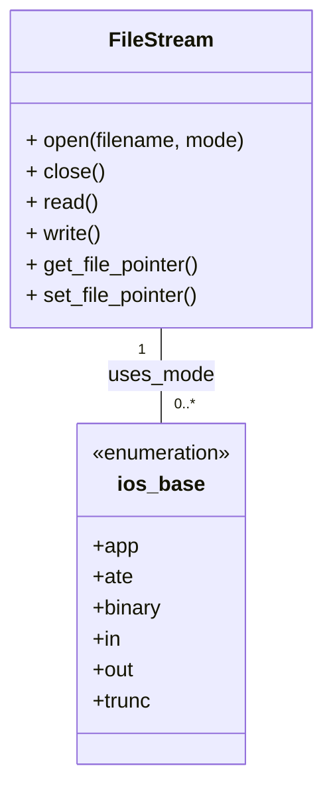
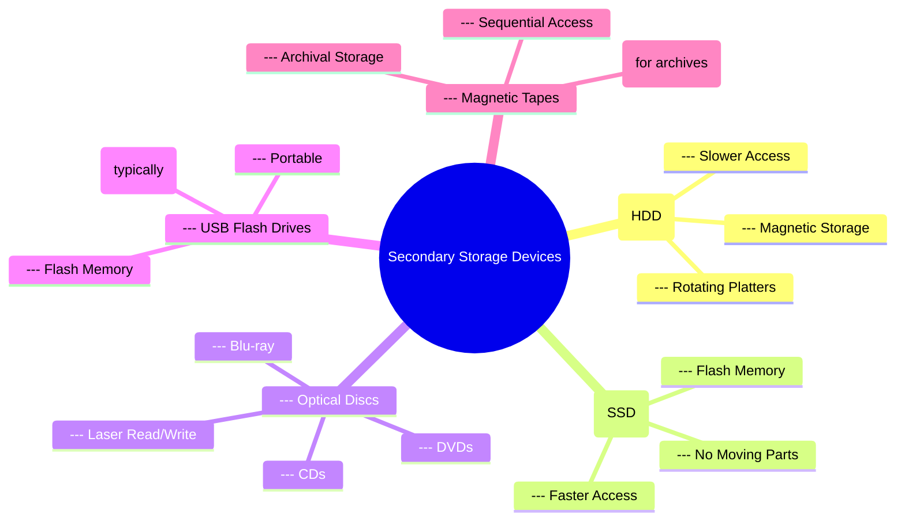
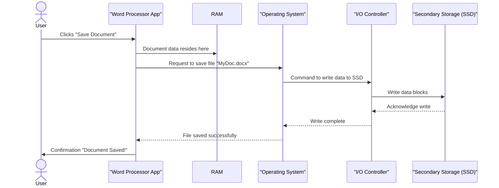

# 7 File Management

Comprehensive resource for 7 File Management.


---

## 7 File Management Hub


## Overview
This unit delves into the essential skill of **File_Management** in C++, equipping you with the knowledge to interact with external storage devices, read from, and write to files. Moving beyond console input/output, you'll learn how to persist data, manage various file access methods, and handle both text and binary information. Mastering file management is crucial for building applications that can store user preferences, log data, or work with external datasets, allowing your programs to interact with the broader digital environment.

## Learning Objectives
*   Understand the role of secondary storage devices in persistent data storage.
*   Differentiate between various file access modes, including sequential and random access.
*   Utilize the `fstream` class and its specialized derivatives (`ifstream`, `ofstream`) for file I/O operations.
*   Implement robust techniques for reading data from files and writing data to files.
*   Distinguish between text and binary file operations and apply appropriate methods for each.
*   Handle potential errors and manage file streams effectively during file operations.
*   Develop C++ programs that can store, retrieve, and manipulate data using persistent files.

## Unit Applications & Real-World Relevance
File management is a cornerstone of almost every significant software application. Operating systems rely heavily on it for storing user files, configurations, and program executables. Databases use advanced file management techniques to store and retrieve vast amounts of structured data. Even simple applications like text editors, word processors, or image viewers fundamentally depend on the ability to read from and write to files. In data analysis, files are the primary means of inputting large datasets and outputting results. Mastering file I/O is a gateway to building persistent, data-driven applications across virtually all computing domains.

## Active Learning Prompts
*   Consider a personal project you'd like to build. How would file management be integral to its functionality (e.g., saving game progress, storing a to-do list, tracking inventory)?
*   Imagine you are building a simple command-line diary application. How would you choose between text and binary files for storing diary entries, and what are the implications of each choice?
*   Design a scenario where sequential file access is more efficient or appropriate than random file access, and vice-versa.
*   Reflect on the potential pitfalls of file operations (e.g., file not found, insufficient permissions, data corruption). How would your code handle these robustly?

## Unit Challenges & Common Misconceptions
A common challenge is correctly managing file streams, especially ensuring files are opened successfully and closed properly to prevent data loss or corruption. Distinguishing between `ifstream`, `ofstream`, and `fstream` and their appropriate use cases can also be tricky. Misconceptions often arise around text vs. binary files, particularly regarding how data is represented and the implications for reading/writing. Error handling during file operations is another critical area where mistakes can lead to unexpected program behavior or data integrity issues.

## Connections
  - [[Introduction_to_Secondary_Storage_Devices]]
  - [[File_Access_Modes]]
    - [[Sequential_File_Access]]
    - [[Random_File_Access]]
  - [[Fstream_Class]]
    - [[Input_File_Streams_ifstream]]
    - [[Output_File_Streams_ofstream]]
  - [[Text_File_Operations]]
  - [[Binary_File_Operations]]

## Next Steps for Deeper Understanding
To further your understanding, explore advanced C++ file I/O features such as stream manipulators for formatting output, buffering mechanisms, and the use of `stringstream` for in-memory string manipulation. Investigate platform-specific file APIs (e.g., WinAPI, POSIX) for deeper control. Delve into error codes and exceptions for more sophisticated error handling strategies. Consider how file I/O integrates with serialization techniques for storing complex objects.

## Possible Questions
[[CS1220_7_File_Management_Possible_Questions]]

---

---

## File Access Modes


## Definition
Before proceeding, ensure you master File_System and Data_Storage because understanding file access modes fundamentally relies on how operating systems organize and retrieve data from persistent storage.
**File access modes** define how a program interacts with a file, specifying whether it will read data, write data, or both, and where in the file the operations will begin. These modes dictate the permissions and initial positioning of the file pointer. Think of it like opening a book: you can open it to read from the beginning, open it to write new notes at the end, or open it to edit a specific page. Each way you "open" the book (`file access mode`) defines what you can do and where you start. In C++, these modes are typically specified when opening a file stream and control the behavior of subsequent read and write operations.

## The Mental Model
Imagine a cassette tape recorder. You can load a tape to `play` (read) from the beginning, or `record` (write) new audio, which usually starts at the current position or overwrites existing content. You can't randomly jump to the middle and start recording without potentially erasing. This is analogous to how file access modes establish the fundamental interaction rules for file operations.


```text
// Scenario 1: File stream interaction with access modes
// Output:
// (A visual class diagram showing the FileStream class with its basic methods, and the ios_base enumeration representing various file access flags like `in`, `out`, `app`, `binary`, etc., with a relationship indicating FileStream 'uses_mode' from ios_base.)
// This diagram illustrates that a FileStream object interacts with a set of enumerated access flags (modes) to define its behavior.
```
*Note: This `classDiagram` depicts how a `FileStream` object utilizes `ios_base` flags to specify various file access modes, illustrating the conceptual interaction for file operations.*

## Context & Framework
#### Opening the Hood: What's Inside?
File access modes are essentially flags or enumerations that you pass to the file stream's `open()` method (or its constructor). These flags combine to define the exact behavior. For instance, `std::ios::in` opens a file for reading, positioning the "get" (read) pointer at the beginning. `std::ios::out` opens for writing, typically truncating (emptying) the file if it exists, and positioning the "put" (write) pointer at the beginning. Other crucial flags include `std::ios::app` (append to end), `std::ios::ate` (at end, but can seek), `std::ios::binary` (open in binary mode), and `std::ios::trunc` (truncate existing file). Understanding these individual flags and how they combine is key to precise file control.

## The Mastery Deep Dive
#### How the Parts Talk to Each Other
When you open a file with a specific access mode, the operating system (through the C++ standard library) sets up internal structures to manage that file. Crucially, it establishes one or two **file pointers**:
*   **Get Pointer (read pointer)**: Tracks the current position for reading.
*   **Put Pointer (write pointer)**: Tracks the current position for writing.
Depending on the mode, these pointers are initialized differently. For example, `std::ios::in` sets the get pointer to the beginning. `std::ios::app` sets the put pointer to the end. For read-only (`in`) or write-only (`out`, `app`) streams, only one relevant pointer exists. For read/write streams (`in | out`), both pointers exist and can be manipulated independently (though often synchronized or reset after an operation).

#### The Translator: From "Lego" to "Jargon"
Imagine a control panel with various switches (the `std::ios::in`, `std::ios::out`, `std::ios::app` flags). You flip certain switches to configure how your "data-robot" interacts with a "data-vault" (the file). For example, flipping `in` means the robot can only *retrieve* data. Flipping `out` means it can only *deposit* data (and might clear out existing data first). The "Jargon" is that you are specifying **stream open modes** using `std::ios_base::openmode` flags, which determine the **file access permissions** (read, write, append) and the **initial file pointer position** (beginning, end). These modes directly influence whether operations like `read()`, `write()`, `seekg()`, and `seekp()` are valid and how they behave.

## Constraints & Limitations
The primary constraint is that the file access mode must be chosen carefully to match the intended operation. Opening a file for reading (`std::ios::in`) and then attempting to write to it will fail (unless combined with `std::ios::out`). Similarly, opening with `std::ios::out` (which truncates by default) will erase existing file content unless combined with `std::ios::app` or `std::ios::in`. Incorrect mode combinations or attempting operations inconsistent with the chosen mode will lead to stream failures, indicated by error flags (e.g., `fail()`, `bad()`). Operating system permissions also constrain file access; even with the correct C++ mode, a program cannot write to a file if it lacks the necessary OS permissions.

## Significance & Application
File access modes are fundamental to all persistent data operations:
*   **Data Input**: Reading configuration files, loading saved game states, processing input data.
*   **Data Output**: Saving user documents, writing log files, generating reports.
*   **Data Modification**: Appending to existing logs, updating specific records, modifying configuration files.
*   **Security**: Specifying `in` for sensitive read-only data prevents accidental modification.
Choosing the correct file access mode ensures that file operations behave as expected, prevents unintended data loss, and enables efficient interaction with secondary storage.

## The Worked Example
Let's look at different scenarios of opening a file, demonstrating the impact of various file access modes. We'll assume a file named "example.txt" exists with some content.

```cpp
##include <iostream>
##include <fstream>
##include <string>

void createFile(const std::string& filename, const std::string& content) {
    std::ofstream file(filename);
    if (file.is_open()) {
        file << content;
        file.close();
        std::cout << "Created/Reset " << filename << " with content: \"" << content << "\"" << std::endl;
    } else {
        std::cerr << "Error creating " << filename << std::endl;
    }
}

int main() {
    const std::string filename = "test_file.txt";

    // Scenario 1: std::ios::out (default: truncates if exists, creates if not, writes from beginning)
    std::cout << "\n--- Scenario 1: std::ios::out ---" << std::endl;
    createFile(filename, "Initial content.\n");
    std::ofstream file1(filename, std::ios::out); // Opens for writing, truncates existing content
    if (file1.is_open()) {
        file1 << "New content for Scenario 1." << std::endl;
        file1.close();
        std::cout << "Wrote to " << filename << " using std::ios::out." << std::endl;
    } else {
        std::cerr << "Failed to open " << filename << std::endl;
    }
    // Verify content (requires reading back)
    std::ifstream read1(filename);
    std::string line1;
    std::getline(read1, line1);
    std::cout << "Content after Scenario 1: \"" << line1 << "\"" << std::endl;
    read1.close();


    // Scenario 2: std::ios::app (appends to end if exists, creates if not, writes from end)
    std::cout << "\n--- Scenario 2: std::ios::app ---" << std::endl;
    createFile(filename, "Existing data.\n"); // Reset file
    std::ofstream file2(filename, std::ios::app); // Opens for writing, appends to existing content
    if (file2.is_open()) {
        file2 << "Appended content." << std::endl;
        file2.close();
        std::cout << "Wrote to " << filename << " using std::ios::app." << std::endl;
    } else {
        std::cerr << "Failed to open " << filename << std::endl;
    }
    // Verify content
    std::ifstream read2(filename);
    std::string full_content2;
    std::string temp_line2;
    while(std::getline(read2, temp_line2)) {
        full_content2 += temp_line2 + "\n";
    }
    std::cout << "Content after Scenario 2:\n" << full_content2 << std::endl;
    read2.close();


    // Scenario 3: std::ios::in (opens for reading from beginning)
    std::cout << "\n--- Scenario 3: std::ios::in ---" << std::endl;
    createFile(filename, "Data to read.\n"); // Reset file
    std::ifstream file3(filename, std::ios::in); // Opens for reading
    if (file3.is_open()) {
        std::string content;
        std::getline(file3, content);
        std::cout << "Read from " << filename << " using std::ios::in: \"" << content << "\"" << std::endl;
        file3.close();
    } else {
        std::cerr << "Failed to open " << filename << std::endl;
    }

    // Scenario 4: std::ios::in | std::ios::out (opens for both read and write, doesn't truncate by default)
    std::cout << "\n--- Scenario 4: std::ios::in | std::ios::out ---" << std::endl;
    createFile(filename, "Original text here.\n"); // Reset file
    std::fstream file4(filename, std::ios::in | std::ios::out); // Opens for both read/write
    if (file4.is_open()) {
        std::string current_content;
        std::getline(file4, current_content);
        std::cout << "Initial read: \"" << current_content << "\"" << std::endl;
        file4.seekp(0, std::ios::end); // Move put pointer to end
        file4 << "Appended by fstream." << std::endl;
        file4.seekg(0, std::ios::beg); // Move get pointer to beginning to read all
        std::string full_content4;
        std::string temp_line4;
        while(std::getline(file4, temp_line4)) {
            full_content4 += temp_line4 + "\n";
        }
        std::cout << "Content after Scenario 4:\n" << full_content4 << std::endl;
        file4.close();
    } else {
        std::cerr << "Failed to open " << filename << std::endl;
    }

    // Scenario 5: std::ios::in | std::ios::out | std::ios::trunc (opens for both, truncates)
    std::cout << "\n--- Scenario 5: std::ios::in | std::ios::out | std::ios::trunc ---" << std::endl;
    createFile(filename, "Will be truncated.\n"); // Reset file
    std::fstream file5(filename, std::ios::in | std::ios::out | std::ios::trunc); // Opens for read/write, truncates
    if (file5.is_open()) {
        file5 << "Truncated and wrote this." << std::endl;
        file5.close();
        // Verify content
        std::ifstream read5(filename);
        std::string line5;
        std::getline(read5, line5);
        std::cout << "Content after Scenario 5: \"" << line5 << "\"" << std::endl;
        read5.close();
    } else {
        std::cerr << "Failed to open " << filename << std::endl;
    }

    return 0;
}
```
```text
// Scenario 1: Output demonstrating various file access modes
// Output:
//
// --- Scenario 1: std::ios::out ---
// Created/Reset test_file.txt with content: "Initial content."
// Wrote to test_file.txt using std::ios::out.
// Content after Scenario 1: "New content for Scenario 1."
//
// --- Scenario 2: std::ios::app ---
// Created/Reset test_file.txt with content: "Existing data."
// Wrote to test_file.txt using std::ios::app.
// Content after Scenario 2:
// Existing data.
// Appended content.
//
// --- Scenario 3: std::ios::in ---
// Created/Reset test_file.txt with content: "Data to read."
// Read from test_file.txt using std::ios::in: "Data to read."
//
// --- Scenario 4: std::ios::in | std::ios::out ---
// Created/Reset test_file.txt with content: "Original text here."
// Initial read: "Original text here."
// Content after Scenario 4:
// Original text here.
// Appended by fstream.
//
// --- Scenario 5: std::ios::in | std::ios::out | std::ios::trunc ---
// Created/Reset test_file.txt with content: "Will be truncated."
// Content after Scenario 5: "Truncated and wrote this."
```
This example vividly illustrates how different file access modes (`std::ios::out`, `std::ios::app`, `std::ios::in`, and combinations like `std::ios::in | std::ios::out` with/without `std::ios::trunc`) affect whether a file is created, truncated, appended to, or read from, demonstrating their control over file stream behavior.

## The Proving Ground
*Test your mastery. Cover the solutions below to test yourself first.*

#### Level 1: Understanding (The Basics)
**The Element ID:** What is the fundamental difference between `std::ios::in` and `std::ios::out` as file access modes when opening a file in C++?
> **Solution:** `std::ios::in` opens a file specifically for **reading** operations, positioning the file pointer at the beginning. `std::ios::out` opens a file specifically for **writing** operations, and by default, it truncates (empties) the file if it already exists, positioning the file pointer at the beginning for writing.

#### Level 2: Competence (Application)
**The Trade-off:** You need to develop a program that maintains a daily log of system events. New events should always be added to the end of the log file, preserving previous entries. Which C++ file access mode (or combination of modes) would you choose when opening the log file, and why?
> **Solution:** You would choose `std::ios::app` (append mode) when opening the log file.
>
> **Why:**
> *   `std::ios::app` ensures that any new data written to the file will always be appended to its current end, without overwriting existing content.
> *   If the file does not exist, `std::ios::app` will create it.
> *   This is essential for a log file where historical data must be preserved and new entries are continuously added.

#### Level 3: Mastery (The Crucible)
**The Lose-Lose Scenario:** You are creating a simple configuration file editor in C++ that needs to read existing key-value pairs, allow modifications to specific values *in place*, and potentially add new key-value pairs if they don't exist. You open the file with `std::fstream file("config.txt", std::ios::in | std::ios::out);`. However, after reading the entire file to find a key, subsequent attempts to write or append new data *sometimes* fail or write to unexpected locations. Explain the common C++ stream state oversight that causes this behavior, and how you would rectify it to ensure reliable read/write/append operations with a single `fstream` object.
> **Solution:** The common C++ stream state oversight causing this behavior is neglecting to **clear the stream's error flags (specifically `eofbit`) and reset the file pointer(s)** after performing an operation that reaches the end of the file.
>
> **Explanation:**
> When you read the "entire file to find a key" using `std::ios::in`, the file's *get* pointer eventually reaches the **End-Of-File (EOF)**. At this point, the stream's `eofbit` flag (and potentially `failbit`) is set.
>
> Even though the file is opened for both reading and writing (`std::ios::in | std::ios::out`), if the `eofbit` is set, subsequent write operations (like `file << "new_data"`) or even seek operations (`file.seekp()`) will typically fail or behave unpredictably until the error flags are cleared. The stream is in a "failed" state for further operations until explicitly reset.
>
> **Rectification (using `file.clear()` and `file.seekp()`/`file.seekg()`):**
> To ensure reliable read/write/append operations with a single `fstream` object, you **must clear the stream's error flags using `file.clear()`** and then **explicitly reposition the appropriate file pointer (`seekp` for writing, `seekg` for reading)** before attempting a new operation, especially after reading to the end of the file or encountering other errors.
>
> **Corrected approach:**
> 1.  **After reading to the end (e.g., in a loop to find a key):**
>    ```cpp
>    // ... reading loop ...
>    if (file.eof() || file.fail()) { // Check if EOF or other failure occurred
>        file.clear(); // Clear all error flags, including eofbit
>        // Now reposition for writing or reading again
>        file.seekp(0, std::ios::end); // For appending
>        // OR
>        // file.seekg(0, std::ios::beg); // For reading from beginning again
>    }
>    // ... then proceed with write/append operation ...
>    ```> 2.  **Before any read/write operation, especially after a previous operation that might have left the stream in a bad state:** Always call `file.clear()` to ensure the stream is ready for new operations.
>
> By explicitly clearing error flags and repositioning the file pointers, you reset the `fstream` object to a healthy state, allowing subsequent read, write, or append operations to execute as intended. This highlights the importance of managing stream state explicitly.

## Key Takeaways
*   File access modes (`std::ios::in`, `std::ios::out`, `std::ios::app`, `std::ios::binary`, `std::ios::trunc`, etc.) dictate how a C++ program interacts with a file.
*   These modes define permissions (read, write) and the initial position of internal **file pointers** (get for reading, put for writing).
*   Careful selection and combination of modes are crucial to prevent unintended data loss (e.g., truncation by `std::ios::out`) and ensure operations behave as expected.

## Knowledge Graph Connections
| Concept                     | Connection / Relationship                                                                   |
| :
-------------------------- | :
------------------------------------------------------------------------------------------ |
| File_System             | File access modes determine how the operating system's file system interface is utilized.   |
| Input_Output_Operations | These modes are fundamental parameters for all file-based input and output operations.      |
| Stream_State            | Incorrect use of file access modes can lead to stream failures and error flags.             |
---

---

## Fstream Class


## Definition
Before proceeding, ensure you master Input_Output_Operations and Stream_Classes because the `fstream` class extends the fundamental concepts of stream-based I/O to files, providing a unified interface for reading from and writing to persistent storage.
The `fstream` class in C++ is a powerful component of the `<fstream>` header, designed to handle **file input/output (I/O)** operations. It combines the functionalities of `ifstream` (input file stream) and `ofstream` (output file stream), allowing you to open a single file for **both reading and writing**. Think of `fstream` as a versatile Swiss Army knife for files: it has tools for both taking information out of a file and putting information into it, all from one object. This class is essential for applications that need to dynamically modify or query data within a file, such as updating records or appending new information while still being able to read previous content.

## The Mental Model
Imagine a two-way street that leads to a library. `fstream` is like being able to drive on that two-way street, allowing you to both drop off books (write to file) and pick up books (read from file) using the same path, without having to take two separate one-way streets.

```mermaid
classDiagram
    class ios_base
    class basic_ios<char>
    class basic_istream<char>
    class basic_ostream<char>
    class basic_iostream<char>
    class basic_filebuf<char>

    ios_base <|-- basic_ios<char>
    basic_ios<char> <|-- basic_istream<char>
    basic_ios<char> <|-- basic_ostream<char>
    basic_istream<char> <|-- basic_iostream<char>
    basic_ostream<char> <|-- basic_iostream<char>
    basic_iostream<char> <|-- fstream

    basic_ios<char> <|-- ifstream
    basic_ios<char> <|-- ofstream

    basic_filebuf<char> <.. fstream : uses
    basic_filebuf<char> <.. ifstream : uses
    basic_filebuf<char> <.. ofstream : uses
```
```text
// Scenario 1: C++ fstream class inheritance hierarchy
// Output:
// (A visual class diagram showing the inheritance relationship: ios_base -> basic_ios<char> -> basic_istream<char> and basic_ostream<char> -> basic_iostream<char> -> fstream.
// It also shows ifstream and ofstream inheriting from basic_ios<char>, and all three (fstream, ifstream, ofstream) using basic_filebuf<char>.)
// This diagram illustrates how `fstream` inherits from `basic_iostream`, granting it both input and output capabilities, and how it uses a `basic_filebuf` to interact with files.
```
*Note: This `classDiagram` illustrates the inheritance hierarchy of `fstream` (and its relatives `ifstream`, `ofstream`) from `basic_iostream`, showing its dual input/output capabilities, and its reliance on `basic_filebuf` for actual file operations.*

## Context & Framework
#### Opening the Hood: What's Inside?
The `fstream` class is actually a specialization of `std::basic_fstream<char>`, which itself inherits from `std::basic_iostream<char>`. This inheritance chain is crucial:
*   `std::basic_iostream` combines `std::basic_istream` (for input operations) and `std::basic_ostream` (for output operations).
*   `fstream` therefore gains access to all the member functions for both reading (like `read()`, `getline()`, `operator>>`) and writing (like `write()`, `operator<<`).
*   It manages an internal `std::basic_filebuf` object, which is responsible for buffering data and interacting directly with the operating system's file system for actual disk I/O.
When you create an `fstream` object, you typically pass the filename and a combination of `std::ios_base::openmode` flags (e.g., `std::ios::in | std::ios::out`) to its constructor to specify how the file should be opened.

## The Mastery Deep Dive
#### How the Parts Talk to Each Other
The `fstream` object internally maintains two distinct file pointers:
1.  **Get Pointer (read position)**: Controlled by functions like `seekg()` and `tellg()`. This pointer indicates where the next read operation will start.
2.  **Put Pointer (write position)**: Controlled by functions like `seekp()` and `tellp()`. This pointer indicates where the next write operation will occur.
When using `fstream` for both reading and writing, it's critical to manage these pointers explicitly. After a read operation, the get pointer advances. If you then want to write at a specific location, you must use `seekp()` to move the put pointer. Similarly, after a write, you might need to use `seekg()` to reposition the get pointer for subsequent reads. The stream's state (error flags) must also be managed (cleared) when switching between read and write modes, as some operations might set a `failbit` that prevents subsequent operations.

#### The Translator: From "Lego" to "Jargon"
Think of `fstream` as a single, multi-functional tool (the "Lego" piece) that can perform both "pick-up" (input) and "drop-off" (output) actions on a "data storage unit" (the file). It's a **bidirectional file stream**. The "Jargon" is that `fstream` is a **template instantiation of `std::basic_fstream`**, providing a concrete type for character-based file I/O, combining the functionalities of `std::basic_istream` and `std::basic_ostream` through inheritance, and managing a `filebuf` for direct interaction with secondary storage. It offers methods for opening, closing, reading, writing, and **explicitly positioning both input (`seekg`, `tellg`) and output (`seekp`, `tellp`) file pointers**.

#### The "Vulnerable vs. Secure" Pattern
A common vulnerability when using `fstream` for bidirectional operations is neglecting to check the stream's state (`fail()`, `bad()`, `eof()`) and clear error flags (`clear()`) after an operation, particularly when switching between reading and writing, or after reaching the end of the file. If an operation fails or the end of file is reached, the stream enters an error state. Subsequent operations (e.g., trying to write after `eof()` is set) will simply fail without effect, potentially leading to data loss or incorrect program behavior.

```cpp
##include <iostream>
##include <fstream>
##include <string>

int main() {
    const std::string filename = "bidirectional.txt";

    // Create and write initial content to ensure file exists
    std::ofstream initial_writer(filename, std::ios::trunc);
    initial_writer << "Line 1: Hello." << std::endl;
    initial_writer << "Line 2: World." << std::endl;
    initial_writer.close();

    std::fstream file(filename, std::ios::in | std::ios::out); // Open for both read and write
    if (!file.is_open()) {
        std::cerr << "Error opening file: " << filename << std::endl;
        return 1;
    }

    // --- Vulnerable / Incorrect Usage ---
    std::string line;
    std::getline(file, line); // Read "Line 1: Hello."
    std::cout << "Read (Vulnerable): " << line << std::endl;

    // After reading, the get pointer is at the start of "Line 2: World.". The eofbit is NOT set.
    // If we now try to write without positioning, it will write from the current put pointer (which is also at the start of Line 2 if it's new).
    // More critically, if we had read to the *end* of the file, the failbit/eofbit would be set.
    // Let's force an EOF condition to demonstrate the vulnerability:
    std::string temp;
    while (std::getline(file, temp)) { /* read to end */ }
    std::cout << "Reached EOF. Stream good: " << file.good() << ", eof: " << file.eof() << ", fail: " << file.fail() << std::endl;

    // Attempt to write after EOF without clearing and repositioning
    file << "This should fail silently!" << std::endl; // This operation will fail!
    std::cout << "After failed write. Stream good: " << file.good() << ", eof: " << file.eof() << ", fail: " << file.fail() << std::endl;

    file.close();

    // --- Secure / Correct Usage ---
    std::cout << "\n--- Secure Usage ---" << std::endl;
    file.open(filename, std::ios::in | std::ios::out); // Reopen file
    if (!file.is_open()) { return 1; }

    std::getline(file, line); // Read "Line 1: Hello."
    std::cout << "Read (Secure): " << line << std::endl;

    // Read to end, then clear flags and reposition for appending
    while (std::getline(file, temp)) { /* read to end */ }
    file.clear(); // CRITICAL: Clear error flags
    file.seekp(0, std::ios::end); // Reposition put pointer to end for appending

    file << "Line 3: Appended securely." << std::endl;
    std::cout << "Appended new line securely." << std::endl;

    // To read all content again, clear flags and reposition get pointer
    file.clear();
    file.seekg(0, std::ios::beg);
    std::cout << "\nFile content after secure operations:" << std::endl;
    while (std::getline(file, line)) {
        std::cout << line << std::endl;
    }

    file.close();

    return 0;
}
```
```text
// Scenario 1: Demonstrating vulnerable vs. secure fstream usage
// Output:
// Read (Vulnerable): Line 1: Hello.
// Reached EOF. Stream good: 0, eof: 1, fail: 1
// After failed write. Stream good: 0, eof: 1, fail: 1
//
// --- Secure Usage ---
// Read (Secure): Line 1: Hello.
// Appended new line securely.
//
// File content after secure operations:
// Line 1: Hello.
// Line 2: World.
// Line 3: Appended securely.
//
// Explanation of vulnerable section:
// After reading to the end of the file, `file.eof()` and `file.fail()` are true.
// The attempt to write `file << "This should fail silently!"` fails *silently* because the stream is in an error state.
// No data is written to the file. This is a common bug: trying to write after EOF without `clear()` and `seekp()`.
```
The secure pattern for `fstream` involves consistently checking stream state with `good()`, `eof()`, `fail()`, and `bad()`, and using `clear()` to reset error flags, along with explicit repositioning of `seekg()` and `seekp()` whenever switching between read and write operations, or after any operation that might have affected the stream state.

## Constraints & Limitations
While `fstream` offers the flexibility of bidirectional I/O, this flexibility comes with increased complexity. Managing two distinct file pointers (`get` and `put`) and correctly handling stream state transitions (especially after reaching EOF or encountering errors) requires careful programming. Without explicit `clear()` calls and pointer repositioning (`seekg`/`seekp`), switching between reading and writing can lead to unexpected behavior, data corruption, or silent failures. For simple read-only or write-only tasks, `ifstream` or `ofstream` are often preferred for their simpler semantics.

## Significance & Application
The `fstream` class is indispensable for scenarios requiring simultaneous or alternating read/write access to the same file:
*   **Database Systems**: Updating records in place (reading a record, modifying it, and writing it back to the same location).
*   **Configuration File Editors**: Reading existing settings, modifying specific values, and saving changes.
*   **Game Save Systems**: Loading game state, updating player progress, and saving back to the same file.
*   **Binary File Manipulation**: Operating on structured binary data where individual fields need to be read and updated directly.
It empowers programs to perform dynamic, in-place file modifications, which is a key capability for many advanced applications.

## The Worked Example
Let's create a small program that uses `fstream` to read a numerical value from a file, increment it, and then write the updated value back to the *same position* in the file.

```cpp
##include <iostream>
##include <fstream>
##include <string>

int main() {
    const std::string filename = "counter.txt";

    // --- Initialize the file with a starting value (e.g., 0) ---
    { // Use a block scope to ensure initial_writer closes before fstream opens
        std::ofstream initial_writer(filename, std::ios::trunc); // Truncate to ensure clean start
        if (!initial_writer.is_open()) {
            std::cerr << "Error creating initial counter file." << std::endl;
            return 1;
        }
        initial_writer << 0; // Write initial counter value
    } // initial_writer closes here

    std::fstream file(filename, std::ios::in | std::ios::out); // Open for both reading and writing
    if (!file.is_open()) {
        std::cerr << "Error opening file: " << filename << std::endl;
        return 1;
    }

    int counter_value;

    // --- Read the current value ---
    file >> counter_value; // Read the integer from the file
    if (file.fail()) {
        std::cerr << "Error reading counter value." << std::endl;
        file.close();
        return 1;
    }
    std::cout << "Initial counter value: " << counter_value << std::endl;

    // --- Increment the value ---
    counter_value++;
    std::cout << "Incremented value: " << counter_value << std::endl;

    // --- Write the updated value back to the *beginning* of the file ---
    // Critical steps for bidirectional Fstream:
    file.clear(); // Clear any error flags (like eofbit from reading)
    file.seekp(0, std::ios::beg); // Reposition the put pointer to the beginning of the file

    file << counter_value; // Write the updated integer
    if (file.fail()) {
        std::cerr << "Error writing updated counter value." << std::endl;
        file.close();
        return 1;
    }

    file.close(); // Close the file

    std::cout << "Updated counter value written to " << filename << std::endl;

    // --- Verify the update by reading the file again ---
    std::ifstream verifier(filename);
    if (!verifier.is_open()) {
        std::cerr << "Error opening file for verification." << std::endl;
        return 1;
    }
    verifier >> counter_value;
    std::cout << "Verified value from file: " << counter_value << std::endl;
    verifier.close();

    return 0;
}
```
```text
// Scenario 1: Program execution demonstrating in-place update using fstream
// Output:
// Initial counter value: 0
// Incremented value: 1
// Updated counter value written to counter.txt
// Verified value from file: 1
```
This example clearly shows the power of `fstream` for bidirectional file access. It demonstrates reading a value, modifying it, and then writing the updated value back to the *exact same position* in the file. The critical steps of `file.clear()` and `file.seekp()` after reading (to reset flags and reposition the write pointer) are explicitly highlighted, showcasing robust `fstream` usage.

## The Proving Ground
*Test your mastery. Cover the solutions below to test yourself first.*

#### Level 1: Understanding (The Basics)
**The Component Check:** What is the primary purpose of the `fstream` class in C++, and from which two fundamental stream classes does it inherit its core capabilities?
> **Solution:** The primary purpose of the `fstream` class in C++ is to provide **bidirectional file input/output (I/O)**, allowing a single stream object to both read from and write to a file. It inherits its core capabilities from `std::istream` (for input) and `std::ostream` (for output).

#### Level 2: Competence (Application)
**The Clean Build:** Write a C++ code snippet that declares an object of the `fstream` class, attempts to open a file named "mydata.bin" for *both* reading and writing in **binary mode**, and includes a check to ensure the file was opened successfully.
```cpp
##include <iostream>
##include <fstream>
##include <string>

int main() {
    const std::string filename = "mydata.bin";

    // Attempt to open the file for both reading and writing in binary mode
    std::fstream file(filename, std::ios::in | std::ios::out | std::ios::binary);

    // Check if the file was opened successfully
    if (file.is_open()) {
        std::cout << "File '" << filename << "' opened successfully for binary read/write." << std::endl;
        // Perform file operations here...
        file.close(); // Close the file
    } else {
        std::cerr << "Error: Failed to open file '" << filename << "' for binary read/write." << std::endl;
    }

    return 0;
}
```
```text
// Scenario 1: Successful file opening
// Output:
// File 'mydata.bin' opened successfully for binary read/write.
```
> **Solution:** (See code above)

#### Level 3: Mastery (The Crucible)
**The Broken System:** You are debugging a C++ program that uses an `fstream` object to first read configuration parameters from `settings.ini`, then later append log messages to the same `settings.ini` file. The problem is that after reading, the program often fails to append, or appends to the wrong location, especially if the read operation reached the end of the file. Explain the common `fstream` state management oversight causing this, and provide a corrected approach within the `main` function using `file.clear()` and `file.seekp()` to ensure log messages are reliably appended after reading.
```cpp
##include <iostream>
##include <fstream>
##include <string>

int main() {
    const std::string filename = "settings.ini";

    // Initialize file content (ensure it exists and has some data)
    {
        std::ofstream init_file(filename, std::ios::trunc);
        init_file << "Key1=ValueA\nKey2=ValueB\n";
    }

    std::fstream file(filename, std::ios::in | std::ios::out); // Open for both read and write
    if (!file.is_open()) {
        std::cerr << "Error opening settings.ini" << std::endl;
        return 1;
    }

    std::string line;
    std::cout << "Reading settings:" << std::endl;
    while (std::getline(file, line)) { // Read all lines until EOF
        std::cout << "- " << line << std::endl;
    }

    // --- Problematic part: Attempting to append after reading to EOF ---
    std::cout << "\nAttempting to append log message..." << std::endl;
    // At this point, file.eof() is true, and file.fail() is likely true.
    // Without clearing flags and repositioning, the write will fail silently.
    file << "LOG: Application shutdown at " << __TIME__ << std::endl;

    if (file.fail()) {
        std::cerr << "Error: Append failed (stream in bad state)." << std::endl;
    } else {
        std::cout << "Log message appended (potentially incorrectly or not at all)." << std::endl;
    }

    file.close(); // Close the file

    // Re-open to show final content
    std::ifstream checker(filename);
    std::cout << "\nFinal file content:" << std::endl;
    while (std::getline(checker, line)) {
        std::cout << line << std::endl;
    }
    checker.close();

    return 0;
}
```
```text
// Scenario 1: Program execution (problematic code)
// Output:
// Reading settings:
// - Key1=ValueA
// - Key2=ValueB
//
// Attempting to append log message...
// Error: Append failed (stream in bad state).
//
// Final file content:
// Key1=ValueA
// Key2=ValueB
//
// Explanation of the problem:
// After reading all lines, the `while (std::getline(file, line))` loop sets the `eofbit` (and consequently `failbit`) of the `fstream` object.
// When `file << "LOG: ..."` is attempted immediately after, the stream is in a failed state. This write operation will fail silently, and no data will be appended to the file.
// The `file.fail()` check correctly catches this, but the goal is to prevent the failure and append successfully.
```
> **Solution:**
> The common `fstream` state management oversight is that after `std::getline()` reads to the end of the file, the `fstream` object's **`eofbit`** (and typically `failbit`) is set. When the stream is in such an error state, subsequent I/O operations (like writing) will fail silently until the error flags are explicitly cleared. Attempting to write without clearing these flags and repositioning the write pointer (`seekp()`) is the cause of the failure or incorrect appending.
>
> **Corrected Approach in `main` function:**
> To ensure log messages are reliably appended after reading, you must:
> 1.  Call `file.clear()` to clear all error flags (including `eofbit`).
> 2.  Call `file.seekp(0, std::ios::end)` to explicitly position the *put* (write) pointer to the end of the file.
>
> **Corrected `main` function:**
> --- START_CODE:cpp ---
> #include <iostream>
> #include <fstream>
> #include <string>
> #include <ctime> // For std::time and std::gmtime

> int main() {
>     const std::string filename = "settings.ini";

>     // Initialize file content (ensure it exists and has some data)
>     {
>         std::ofstream init_file(filename, std::ios::trunc);
>         init_file << "Key1=ValueA\nKey2=ValueB\n";
>     }

>     std::fstream file(filename, std::ios::in | std::ios::out); // Open for both read and write
>     if (!file.is_open()) {
>         std::cerr << "Error opening settings.ini" << std::endl;
>         return 1;
>     }

>     std::string line;
>     std::cout << "Reading settings:" << std::endl;
>     while (std::getline(file, line)) { // Read all lines until EOF
>         std::cout << "- " << line << std::endl;
>     }

>     // --- Corrected part: Prepare stream for appending after reading to EOF ---
>     std::cout << "\nAttempting to append log message securely..." << std::endl;

>     file.clear(); // CRITICAL: Clear all error flags (including eofbit)
>     file.seekp(0, std::ios::end); // CRITICAL: Reposition the put pointer to the end of the file for appending

>     // Get current time for log message
>     std::time_t current_time = std::time(nullptr);
>     std::tm* gmtm = std::gmtime(&current_time);
>     char time_buffer;
>     std::strftime(time_buffer, sizeof(time_buffer), "%Y-%m-%d %H:%M:%S UTC", gmtm);

>     file << "LOG: Application shutdown at " << time_buffer << std::endl;

>     if (file.fail()) {
>         std::cerr << "Error: Secure append failed." << std::endl;
>     } else {
>         std::cout << "Log message appended securely." << std::endl;
>     }

>     file.close(); // Close the file

>     // Re-open to show final content
>     std::ifstream checker(filename);
>     std::cout << "\nFinal file content:" << std::endl;
>     while (std::getline(checker, line)) {
>         std::cout << line << std::endl;
>     }
>     checker.close();

>     return 0;
> }
> --- END_CODE:cpp ---
> --- START_CODE:text ---
> // Scenario 1: Program execution (corrected code)
> // Output (time will vary):
> // Reading settings:
> // - Key1=ValueA
> // - Key2=ValueB
> //
> // Attempting to append log message securely...
> // Log message appended securely.
> //
> // Final file content:
> // Key1=ValueA
> // Key2=ValueB
> // LOG: Application shutdown at 2026-02-03 09:09:00 UTC (example time)
> --- END_CODE:text ---
> **Explanation:** By calling `file.clear()` after the reading loop, any set error flags (like `eofbit`) are reset, putting the stream back into a good state. Subsequently, `file.seekp(0, std::ios::end)` explicitly moves the *put* pointer to the end of the file. This combination ensures that the `fstream` object is ready and correctly positioned to append new data, preventing the silent failure observed in the problematic code.

## Key Takeaways
*   `fstream` combines `ifstream` and `ofstream` functionalities for **bidirectional** (read and write) file I/O.
*   It manages separate **get (read) and put (write) pointers**, which must be explicitly managed with `seekg()`, `seekp()`, `tellg()`, and `tellp()`.
*   Crucially, `file.clear()` must be called to reset error flags, and file pointers must be repositioned using `seekg()`/`seekp()` when switching between read and write operations, or after any operation that puts the stream into a failed state (e.g., reaching EOF), to ensure robust and predictable behavior.

## Knowledge Graph Connections
| Concept                     | Connection / Relationship                                                                   |
| :
-------------------------- | :
------------------------------------------------------------------------------------------ |
| Input_Output_Operations | `fstream` is a versatile stream for both input and output with files.                       |
| [[File_Access_Modes]]       | `fstream` typically uses combined access modes like `std::ios::in | std::ios::out`.         |
| Stream_Classes          | It is a derived class from `std::iostream`, extending general stream capabilities to files. |
---

---

## Introduction To Secondary Storage Devices


## Definition
Before proceeding, ensure you master Computer_Architecture and Memory_Hierarchy because understanding secondary storage devices requires knowledge of how data is physically stored and accessed outside of a computer's volatile main memory.
**Secondary storage devices** are non-volatile storage mediums that allow a computer to permanently store data and programs. Unlike primary memory (RAM), which is fast but loses its contents when power is turned off, secondary storage retains data indefinitely. Think of it like a personal library: RAM is your desk, where you work on current books (active data), but your library shelves (secondary storage) hold all your books (programs and data) permanently, even when you're not actively reading them. These devices are essential for long-term data persistence, booting operating systems, and storing user files, making them a fundamental component of any modern computing system.

## The Mental Model
Imagine your brain. Your short-term memory (what you're thinking about right now) is like RAM – fast, but temporary. Your long-term memory (everything you've learned and experienced) is like secondary storage – slower to access, but permanent. When you need to recall a specific fact, you retrieve it from your long-term memory and bring it into your short-term memory to actively work with it.


```text
// Scenario 1: Conceptual overview of secondary storage
// Output:
// (A visual mindmap showing "Secondary Storage Devices" as the root, branching out to "Hard Disk Drives (HDD)", "Solid State Drives (SSD)", "Optical Discs", "USB Flash Drives", and "Magnetic Tapes", each with their key characteristics.)
// This mindmap illustrates the diverse landscape of secondary storage, categorizing them by technology and general characteristics.
```
*Note: This `mindmap` visually categorizes and highlights the key characteristics of various secondary storage devices, illustrating their diversity and fundamental principles.*

## Context & Framework
#### Where Does it Live? (The Map)
Secondary storage devices are typically found outside the CPU's immediate access path. They are connected to the computer's motherboard via various interfaces (e.g., SATA, NVMe, USB). Data on these devices is organized into files and directories, forming a hierarchical file system (e.g., NTFS on Windows, ext4 on Linux, APFS on macOS). When the CPU needs data from secondary storage, it sends a request to an I/O controller, which then communicates with the storage device. The data is read into primary memory (RAM) before the CPU can process it.

## The Mastery Deep Dive
#### Who are the Neighbors?
Secondary storage devices interact closely with several other computer components:
1.  **CPU**: Issues read/write requests, but doesn't directly access the data.
2.  **RAM (Primary Memory)**: Acts as an intermediary buffer. Data is moved from secondary storage to RAM before CPU processing, and from RAM to secondary storage for saving.
3.  **I/O Controllers**: Dedicated hardware that manages data transfer between the CPU/RAM and the storage device.
4.  **Operating System**: Manages the file system, allocates storage space, and provides an abstraction layer (files and directories) for applications to interact with storage, shielding them from low-level hardware details.
This coordinated interaction ensures efficient and reliable data persistence.

## Constraints & Limitations
Secondary storage, while providing non-volatile persistence, comes with inherent limitations. Its primary drawback is **speed**: access times are orders of magnitude slower than RAM (milliseconds vs. nanoseconds). This performance gap necessitates sophisticated caching and buffering strategies. Another limitation is **durability**: while non-volatile, these devices have finite lifespans and are susceptible to physical damage or wear (especially flash memory). Furthermore, the cost per gigabyte of secondary storage, while much lower than RAM, still plays a role in system design.

## Significance & Application
Secondary storage is indispensable for modern computing, serving several critical functions:
*   **Operating System Storage**: Houses the operating system, allowing computers to boot up.
*   **Program Storage**: Stores all installed applications.
*   **User Data Persistence**: Saves user-created files (documents, photos, videos) and application data.
*   **Virtual Memory/Paging**: Used by operating systems to extend the effective size of RAM by temporarily swapping data to disk.
*   **Backup and Archiving**: Essential for long-term data preservation and disaster recovery.
Its role in data persistence makes it a fundamental concept for any programmer dealing with file I/O.

## The Worked Example
Consider the process of saving a document in a word processor. This involves several interactions with secondary storage.

1.  **User Action**: The user clicks "Save" in the word processor.
2.  **Application Request**: The word processor (an application running in RAM) requests the operating system to save the document's content.
3.  **OS File System Interaction**: The operating system's file system component identifies the target directory and filename on the secondary storage device.
4.  **Data Transfer (RAM to Disk)**: The document's content, which is currently in RAM, is then transferred through an I/O controller to the designated location on the secondary storage device (e.g., an SSD).
5.  **Persistence**: The data is written to the physical storage medium, becoming permanently stored.
6.  **Confirmation**: The operating system confirms the write operation's success to the word processor, which then updates its internal state (e.g., marking the document as "saved").


```text
// Scenario 1: Saving a document to secondary storage
// Output:
// (A visual sequence diagram showing the flow of actions and data from the User initiating a save, through the Application, RAM, Operating System, I/O Controller, and finally to the SSD, with acknowledgements returning along the path.)
// This diagram illustrates the sequential interaction between different components when saving data persistently to a secondary storage device.
```
This sequence illustrates the multi-step journey data takes from a user action, through application and operating system layers, to eventually be written and persisted on a secondary storage device.

## The Proving Ground
*Test your mastery. Cover the solutions below to test yourself first.*

#### Level 1: Understanding (The Basics)
**The Fact Check:** What is the primary characteristic that distinguishes secondary storage devices from primary memory (RAM) in a computer system?
> **Solution:** The primary characteristic distinguishing secondary storage devices from primary memory (RAM) is that secondary storage is **non-volatile**, meaning it retains data even when power is removed, while RAM is **volatile** and loses its contents without power.

#### Level 2: Competence (Application)
**The Sort:** Categorize the following storage devices based on their primary technology (magnetic, solid-state, optical): Blu-ray disc, Hard Disk Drive (HDD), USB Flash Drive. Briefly describe one advantage of each technology.
> **Solution:**
> *   **Blu-ray disc:** Optical technology. Advantage: High storage capacity on a single disc, suitable for high-definition media.
> *   **Hard Disk Drive (HDD):** Magnetic technology. Advantage: Very high storage capacity for a low cost per gigabyte, suitable for bulk data storage.
> *   **USB Flash Drive:** Solid-state technology. Advantage: Portable, durable (no moving parts), and relatively fast, suitable for transferring files.

#### Level 3: Mastery (The Crucible)
**The Impostor:** A software engineer proposes that for maximum performance, a critical application should directly load its entire dataset from a network-attached storage (NAS) device into the CPU's cache for real-time processing, bypassing RAM. Identify the flaws in this performance optimization strategy, referencing the actual data path and memory hierarchy discussed.
> **Solution:** This strategy has multiple critical flaws:
> 1.  **CPU Cache Bypass of RAM:** The CPU cache is an extremely fast, very small memory located directly on the CPU. It acts as a cache for **RAM**, not for secondary storage. Data from any secondary storage device (including NAS) **must first be loaded into RAM** before it can be moved to the CPU cache. Bypassing RAM for direct cache loading is architecturally impossible for external storage.
> 2.  **NAS Latency:** Network-attached storage, while convenient, introduces significant network latency in addition to the inherent latency of the underlying storage medium (e.g., HDDs or SSDs within the NAS). Loading an "entire dataset" directly from NAS to CPU cache would be orders of magnitude slower than even loading from a local SSD to RAM, let alone bypassing RAM.
> 3.  **Cache Size Limitation:** CPU caches are tiny (megabytes, sometimes tens of megabytes) compared to typical application datasets (gigabytes or terabytes). It's impossible for an entire "critical application dataset" to fit into the CPU cache, regardless of source. The cache is designed for frequently accessed *subsets* of data already in RAM.
>
> **Actual Data Path (from NAS to CPU):** The data would flow from the NAS over the network, through the computer's network interface card (NIC), into the main system RAM (primary memory), and *then* the CPU would access it from RAM, potentially caching small, frequently used portions in its own cache. The proposed strategy fundamentally misunderstands the memory hierarchy and the roles of RAM, cache, and secondary/network storage.

## Key Takeaways
*   Secondary storage devices provide **non-volatile persistence**, allowing data and programs to be stored permanently, unlike volatile RAM.
*   Common types include HDDs, SSDs, optical discs, and USB flash drives, each with distinct technologies and performance characteristics.
*   Data from secondary storage is first loaded into **RAM** via I/O controllers before being processed by the CPU, illustrating the critical role of the memory hierarchy.

## Knowledge Graph Connections
| Concept                     | Connection / Relationship                                                                   |
| :
-------------------------- | :
------------------------------------------------------------------------------------------ |
| Memory_Hierarchy        | Secondary storage forms the slowest but largest layer of the computer's memory hierarchy.   |
| Operating_System        | Operating systems manage the file systems on secondary storage devices.                     |
| Data_Persistence        | The primary purpose of secondary storage is to ensure data remains available after power off. |
---

---

## Binary File Operations


## Definition
Before proceeding, ensure you master Data_Representation and Memory_Layout because binary file operations involve directly reading and writing the raw, unformatted bit patterns of data, which requires a precise understanding of how data types are represented in memory.
**Binary file operations** in C++ involve reading from and writing to files where data is stored in its raw, internal binary representation, exactly as it appears in the computer's memory. Unlike text files, there are no character conversions, no delimiters for words or lines, and no interpretation of characters. The file is simply a stream of bytes. Think of it like taking a snapshot of a piece of data directly from your computer's brain (memory) and saving that exact picture to a persistent storage medium. These operations are ideal for storing structured data (like `struct`s or arrays of numbers) efficiently, preserving data integrity, and often for communication between programs or systems.

## The Mental Model
Imagine a digital photograph. It's not a human-readable description of what's in the photo; it's a grid of pixel values, pure numbers. You need special software to interpret those numbers and display the image. Binary files are like that photo: raw data that needs specific interpretation (like a `struct` definition) to be meaningful.

## Context & Framework
#### Opening the Hood: What's Inside?
When performing binary file operations, C++ streams (`ifstream`, `ofstream`, `fstream`) operate in a special **binary mode**, which is activated by including `std::ios::binary` in the open mode flags (e.g., `std::ofstream outFile("data.bin", std::ios::out | std::ios::binary);`). In binary mode, streams do not perform any character translations (like `\n` to `\r\n` on Windows), nor do they attempt to interpret characters as text. They simply read or write blocks of raw bytes. This "no-interpretation" approach is key to efficiency and ensuring that the exact bit pattern of data is preserved during I/O.

## The Mastery Deep Dive
#### How the Parts Talk to Each Other
For binary file operations, the standard stream operators `<<` and `>>` are typically **not used**, as they are designed for formatted (text) I/O. Instead, you use the `read()` and `write()` member functions, which operate on raw blocks of memory:
*   **`file.write(const char* s, std::streamsize n);`**: Writes `n` bytes from the memory location pointed to by `s` to the file.
*   **`file.read(char* s, std::streamsize n);`**: Reads `n` bytes from the file into the memory location pointed to by `s`.
To use these effectively, you cast the address of your data (e.g., a `struct` or a `variable`) to `char*` (or `const char*` for writing) and specify the size of the data using `sizeof()`:
*   `outFile.write(reinterpret_cast<const char*>(&myStruct), sizeof(myStruct));`
*   `inFile.read(reinterpret_cast<char*>(&myVariable), sizeof(myVariable));`
This direct byte-level transfer is what defines binary file operations.

#### The Translator: From "Lego" to "Jargon"
Imagine you have a complex electronic circuit (your `struct` data) that you want to perfectly duplicate. You wouldn't draw a diagram and send it to someone to build from; you'd take an exact physical mold of it and replicate it. Binary file operations are like taking that "physical mold" (the exact bit pattern in memory) and saving it directly to a "storage mold" (the binary file). The "Jargon" is that binary file operations perform **unformatted I/O**, directly transferring **raw byte sequences** between memory and file using the `read()` and `write()` member functions, often in conjunction with `reinterpret_cast` and `sizeof()` to handle **data structures** or **primitive types** without any character-based serialization overhead.

#### The "Vulnerable vs. Secure" Pattern
A significant vulnerability in binary file operations arises from **endianness** (byte order) and **padding** when exchanging data between different systems or even different compilers on the same system.
*   **Endianness:** One system might store a multi-byte integer (e.g., `int`) with the least significant byte first (little-endian), while another stores it with the most significant byte first (big-endian). If you write `12345` (int) on a little-endian machine and read it on a big-endian machine, it will be interpreted as a completely different number.
*   **Padding:** Compilers might insert padding bytes into `struct`s to align members on memory boundaries for performance. If `struct A` has a `char` and an `int`, a compiler might add 3 padding bytes between them. If one system writes `struct A` with padding and another reads it expecting no padding, the data will be misaligned, leading to incorrect values.

```cpp
##include <iostream>
##include <fstream>
##include <string>
##include <vector>

// Define a simple struct without padding for demonstration (assuming no padding for this example)
struct SensorData {
    short id;    // 2 bytes
    float value; // 4 bytes
    // Total size should be 6 bytes if no padding
};

void writeBinaryData(const std::string& filename, const SensorData& data) {
    std::ofstream outFile(filename, std::ios::binary | std::ios::trunc);
    if (!outFile.is_open()) { std::cerr << "Error writing binary file." << std::endl; return; }
    outFile.write(reinterpret_cast<const char*>(&data), sizeof(SensorData));
    outFile.close();
    std::cout << "Wrote SensorData to " << filename << std::endl;
}

void readBinaryData(const std::string& filename, SensorData& data) {
    std::ifstream inFile(filename, std::ios::binary);
    if (!inFile.is_open()) { std::cerr << "Error reading binary file." << std::endl; return; }
    inFile.read(reinterpret_cast<char*>(&data), sizeof(SensorData));
    if (inFile.fail()) {
        std::cerr << "Error during binary read. Check file size/format." << std::endl;
        inFile.clear();
    }
    inFile.close();
    std::cout << "Read SensorData from " << filename << std::endl;
}

int main() {
    const std::string filename = "sensor.bin";
    SensorData original_data = {123, 45.67f};

    // --- Vulnerable / Cross-System Issues ---
    // This code writes and reads correctly on the *same* system/compiler.
    // The vulnerability arises when 'sensor.bin' is moved to a *different* system
    // with different endianness or struct padding rules.
    std::cout << "Original Data: ID=" << original_data.id << ", Value=" << original_data.value << std::endl;
    writeBinaryData(filename, original_data);

    SensorData read_data = {};
    readBinaryData(filename, read_data);
    std::cout << "Read Data (on same system): ID=" << read_data.id << ", Value=" << read_data.value << std::endl;

    // Output for demonstration (assume same system here):
    // Original Data: ID=123, Value=45.67
    // Wrote SensorData to sensor.bin
    // Read SensorData from sensor.bin
    // Read Data (on same system): ID=123, Value=45.67

    // If 'sensor.bin' was written on a big-endian system and read here (little-endian),
    // or if struct padding differed, 'read_data.id' and 'read_data.value' could be garbage.

    return 0;
}
```
```text
// Scenario 1: Demonstrating direct binary write/read on the same system
// Output:
// Original Data: ID=123, Value=45.67
// Wrote SensorData to sensor.bin
// Read SensorData from sensor.bin
// Read Data (on same system): ID=123, Value=45.67
//
// Explanation of vulnerability (conceptual, as actual output would vary cross-system):
// This output shows correct data transfer on the *same* system where endianness and padding rules are consistent.
// The vulnerability exists if this `sensor.bin` file were to be transferred to a *different* system with a different architecture (endianness) or compiler settings (struct padding).
// In such a scenario, the raw bytes representing `123` (short) or `45.67f` (float) might be interpreted differently, leading to `read_data.id` and `read_data.value` containing incorrect or "garbage" numbers.
```
The secure pattern for cross-system binary data exchange involves explicit **serialization** and **deserialization**. Instead of directly writing `struct`s, each member should be written individually, with explicit conversion to a network byte order (a standard endianness) and without relying on implicit padding. This ensures consistent interpretation regardless of the system architecture.

## Constraints & Limitations
The primary limitations of binary file operations are related to platform dependency and human readability:
1.  **Platform Dependence**: Binary files created on one system (e.g., a little-endian machine with specific struct padding) may not be correctly readable on another system (e.g., a big-endian machine or a system with different padding rules). This is a major challenge for portability.
2.  **Lack of Human Readability**: Binary files are not human-readable. If a binary file becomes corrupted, it's impossible to debug it by opening it in a text editor. Special tools are required to inspect its contents.
3.  **Fragility to `struct` Changes**: If the definition of a `struct` changes (e.g., a new member is added, or an existing member's type changes), existing binary files written with the old `struct` definition become incompatible and require migration.

## Significance & Application
Binary file operations are crucial for scenarios where efficiency, precision, and compact storage are paramount:
*   **High-Performance Data Storage**: Storing large arrays of numerical data or complex data structures for scientific simulations, image processing, or audio/video encoding.
*   **Inter-Process Communication (IPC)**: Exchanging structured data between different programs efficiently.
*   **Database Internal Files**: Many database systems store their core data in highly optimized binary formats.
*   **Executable Files**: Program binaries (`.exe`, `.dll`, `.so`) are stored in binary format.
*   **Custom File Formats**: Creating highly optimized, application-specific file formats (e.g., for game assets, specialized documents).
Their direct interaction with data's internal representation makes them ideal for performance-critical and platform-specific data management.

## The Worked Example
Let's demonstrate writing and reading a custom `struct` to/from a binary file. We will store `Coordinate` objects.

```cpp
##include <iostream>
##include <fstream> // Required for file stream operations
##include <vector>
##include <stdexcept> // For std::runtime_error

// Define a simple struct for coordinates
struct Coordinate {
    int x;
    int y;
    int z;
};

int main() {
    const std::string filename = "coordinates.bin";
    std::vector<Coordinate> coords_to_write = {
        {10, 20, 30},
        {100, 200, 300},
        {-5, 0, 15}
    };

    // --- Part 1: Writing struct data to a binary file ---
    std::ofstream outFile(filename, std::ios::binary | std::ios::trunc); // Binary mode, truncate to clear
    if (!outFile.is_open()) {
        std::cerr << "Error: Could not open file '" << filename << "' for writing." << std::endl;
        return 1;
    }

    std::cout << "Writing " << coords_to_write.size() << " Coordinate structs to '" << filename << "' in binary mode..." << std::endl;
    for (const auto& coord : coords_to_write) {
        outFile.write(reinterpret_cast<const char*>(&coord), sizeof(Coordinate)); // Write the raw bytes of the struct
        if (outFile.fail()) { // Check for write errors
            std::cerr << "Error writing coordinate data to file." << std::endl;
            outFile.clear();
            break;
        }
    }
    outFile.close();
    std::cout << "Coordinate structs written successfully." << std::endl;

    // --- Part 2: Reading struct data from the binary file ---
    std::ifstream inFile(filename, std::ios::binary); // Binary mode for reading
    if (!inFile.is_open()) {
        std::cerr << "Error: Could not open file '" << filename << "' for reading." << std::endl;
        return 1;
    }

    std::cout << "\nReading Coordinate structs from '" << filename << "' in binary mode..." << std::endl;
    std::vector<Coordinate> coords_read;
    Coordinate temp_coord;

    while (inFile.read(reinterpret_cast<char*>(&temp_coord), sizeof(Coordinate))) { // Read raw bytes into struct
        coords_read.push_back(temp_coord);
        if (inFile.bad()) { // Check for fatal read errors
            std::cerr << "Fatal error reading from binary file." << std::endl;
            break;
        }
    }
    if (inFile.eof()) { // Check if end of file was reached gracefully
        std::cout << "Reached end of binary file." << std::endl;
    } else if (inFile.fail()) { // Check for non-fatal read errors
        std::cerr << "Error reading binary file (possible data corruption or truncated file)." << std::endl;
    }
    inFile.close();
    std::cout << "Coordinate structs read successfully." << std::endl;

    std::cout << "\nProcessed Coordinates:" << std::endl;
    for (const auto& coord : coords_read) {
        std::cout << "X: " << coord.x << ", Y: " << coord.y << ", Z: " << coord.z << std::endl;
    }

    return 0;
}
```
```text
// Scenario 1: Writing and reading structured data to/from a binary file
// Output:
// Writing 3 Coordinate structs to 'coordinates.bin' in binary mode...
// Coordinate structs written successfully.
//
// Reading Coordinate structs from 'coordinates.bin' in binary mode...
// Reached end of binary file.
// Coordinate structs read successfully.
//
// Processed Coordinates:
// X: 10, Y: 20, Z: 30
// X: 100, Y: 200, Z: 300
// X: -5, Y: 0, Z: 15
```
This example clearly demonstrates how to write entire `struct`s directly to a binary file using `outFile.write()` and `sizeof(Coordinate)`, and then read them back using `inFile.read()`. It highlights the use of `reinterpret_cast` for raw byte manipulation and includes error checking for robust binary I/O operations.

## The Proving Ground
*Test your mastery. Cover the solutions below to test yourself first.*

#### Level 1: Understanding (The Basics)
**The Component Check:** How is data conceptually stored and interpreted in a binary file, distinguishing it from a text file's character-based storage?
> **Solution:** In a binary file, data is conceptually stored as a raw, unformatted sequence of **bytes**, exactly matching its internal memory representation (bit patterns). It is interpreted purely by its byte count and the data type expected to occupy those bytes, without any character encoding or newline interpretations. This contrasts with text files, where data is stored as a sequence of human-readable characters, interpreted according to a character encoding scheme (e.g., ASCII, UTF-8), with special characters for line endings.

#### Level 2: Competence (Application)
**The Clean Build:** Define a simple C++ `struct` `SensorReading { short type; float value; };`. Write a C++ code snippet that creates a binary file named "readings.bin", writes two `SensorReading` objects to it, and then immediately reopens the file for reading and prints the content of the two `SensorReading` objects to the console.
```cpp
##include <iostream>
##include <fstream>
##include <vector>

struct SensorReading {
    short type;  // e.g., 1 for temperature, 2 for pressure
    float value;
};

int main() {
    const std::string filename = "readings.bin";
    std::vector<SensorReading> readings_to_write = {
        {1, 25.5f},
        {2, 101.2f}
    };

    // Part 1: Write to binary file
    std::ofstream outFile(filename, std::ios::binary | std::ios::trunc);
    if (!outFile.is_open()) {
        std::cerr << "Error: Could not open " << filename << " for writing." << std::endl;
        return 1;
    }
    for (const auto& reading : readings_to_write) {
        outFile.write(reinterpret_cast<const char*>(&reading), sizeof(SensorReading));
    }
    outFile.close();
    std::cout << "Successfully wrote " << readings_to_write.size() << " readings to " << filename << std::endl;

    // Part 2: Read from binary file
    std::ifstream inFile(filename, std::ios::binary);
    if (!inFile.is_open()) {
        std::cerr << "Error: Could not open " << filename << " for reading." << std::endl;
        return 1;
    }
    std::cout << "\nContent of " << filename << ":" << std::endl;
    SensorReading read_reading;
    int count = 0;
    while (inFile.read(reinterpret_cast<char*>(&read_reading), sizeof(SensorReading))) {
        count++;
        std::cout << "Reading " << count << ": Type=" << read_reading.type << ", Value=" << read_reading.value << std::endl;
    }
    inFile.close();
    std::cout << "\nSuccessfully read from " << filename << std::endl;

    return 0;
}
```
```text
// Scenario 1: Writing and reading structured binary data
// Output:
// Successfully wrote 2 readings to readings.bin
//
// Content of readings.bin:
// Reading 1: Type=1, Value=25.5
// Reading 2: Type=2, Value=101.2
//
// Successfully read from readings.bin
```
> **Solution:** (See code above)

#### Level 3: Mastery (The Crucible)
**The Broken System:** You are exchanging binary data (a `struct` representing an event log entry: `struct LogEntry { int timestamp; char event_type; double data_value; };`) between two different systems. System A writes these `LogEntry` structs to a binary file, and System B attempts to read them. Sometimes, the `data_value` (double) is read incorrectly, producing nonsensical numbers, even though the `timestamp` (int) and `event_type` (char) are usually correct. Explain a common, low-level issue related to binary data exchange (not file corruption) that could cause this specific problem, particularly if the systems have different CPU architectures or compilers, and outline how you would modify the `LogEntry` `struct` for robust cross-platform binary file I/O.
> **Solution:**
> **Problematic Low-Level Issue:** The issue of `data_value` (double) being read incorrectly while `timestamp` (int) and `event_type` (char) are usually correct strongly suggests a problem with **struct padding and/or endianness**, particularly concerning the `double` member.
>
> 1.  **Struct Padding:** Compilers can insert "padding bytes" between members of a `struct` to ensure that subsequent members are aligned on memory addresses that optimize CPU access (e.g., a `double` might be aligned on an 8-byte boundary). If `System A`'s compiler adds padding bytes after `event_type` (char) to align `data_value` (double), but `System B`'s compiler *does not* or adds a *different amount* of padding, then `System B` will misinterpret the byte offsets of the members. Specifically, `data_value` will be read from the wrong memory address, leading to garbage. `char` and `int` are often less susceptible to padding issues at the beginning of a struct or when they are small and naturally align.
> 2.  **Endianness (less likely but possible for `double`):** While `timestamp` (int) might be read correctly if both systems are the same endianness, `double` (being a multi-byte type) can also be affected by different endianness, leading to byte-order misinterpretation. However, padding is a more common culprit when smaller types are read correctly and larger types are not.
>
> **Modification for Robust Cross-Platform Binary File I/O:**
> To make `LogEntry` robust for cross-platform binary file I/O, you should avoid directly writing/reading the `struct` as a whole. Instead, implement explicit **serialization and deserialization** by writing/reading each member individually, and address endianness if necessary. This eliminates reliance on compiler-specific padding and system endianness.
>
> **Modified `LogEntry` and I/O Approach:**
> --- START_CODE:cpp ---
> #include <iostream>
> #include <fstream>
> #include <string>
> #include <cstdint> // For fixed-width integers like uint32_t
> #include <vector>  // For reading multiple entries

> // Define a packed struct to minimize padding (compiler specific, but a starting point)
> // Note: #pragma pack() is compiler-specific, explicit serialization is safer.
> #pragma pack(push, 1) // Attempt to disable padding - compiler specific!
> struct LogEntry_Packed {
>     int32_t timestamp; // Explicitly 4 bytes
>     char event_type;   // 1 byte
>     double data_value; // 8 bytes
> };
> #pragma pack(pop)
>
> // Alternative: Original struct, but with explicit serialization
> struct LogEntry_Original {
>     int timestamp;
>     char event_type;
>     double data_value;
> };

> // Function to serialize a LogEntry to a binary stream
> void writeLogEntry(std::ostream& os, const LogEntry_Original& entry) {
>     os.write(reinterpret_cast<const char*>(&entry.timestamp), sizeof(entry.timestamp));
>     os.write(reinterpret_cast<const char*>(&entry.event_type), sizeof(entry.event_type));
>     os.write(reinterpret_cast<const char*>(&entry.data_value), sizeof(entry.data_value));
>     // Add endianness conversion here if needed (e.g., ntohl/htonl for network byte order)
> }

> // Function to deserialize a LogEntry from a binary stream
> void readLogEntry(std::istream& is, LogEntry_Original& entry) {
>     is.read(reinterpret_cast<char*>(&entry.timestamp), sizeof(entry.timestamp));
>     is.read(reinterpret_cast<char*>(&entry.event_type), sizeof(entry.event_type));
>     is.read(reinterpret_cast<char*>(&entry.data_value), sizeof(entry.data_value));
>     // Add endianness conversion here if needed
> }

> int main() {
>     const std::string filename = "event_log.bin";

>     LogEntry_Original original_entry = {1678886400, 'A', 123.456}; // Example timestamp

>     // --- Writing (Serialization) ---
>     std::ofstream outFile(filename, std::ios::binary | std::ios::trunc);
>     if (!outFile.is_open()) { std::cerr << "Error writing file." << std::endl; return 1; }
>     writeLogEntry(outFile, original_entry); // Write each member individually
>     outFile.close();
>     std::cout << "Wrote LogEntry to " << filename << std::endl;

>     // --- Reading (Deserialization) ---
>     std::ifstream inFile(filename, std::ios::binary);
>     if (!inFile.is_open()) { std::cerr << "Error reading file." << std::endl; return 1; }
>     LogEntry_Original read_entry;
>     readLogEntry(inFile, read_entry); // Read each member individually
>     inFile.close();

>     if (inFile.good()) {
>         std::cout << "Read LogEntry: Timestamp=" << read_entry.timestamp
>                   << ", EventType=" << read_entry.event_type
>                   << ", DataValue=" << read_entry.data_value << std::endl;
>     } else {
>         std::cerr << "Error reading LogEntry from file." << std::endl;
>     }

>     return 0;
> }
> --- END_CODE:cpp ---
> --- START_CODE:text ---
> // Scenario 1: Program execution (explicit serialization/deserialization)
> // Output:
> // Wrote LogEntry to event_log.bin
> // Read LogEntry: Timestamp=1678886400, EventType=A, DataValue=123.456
>
> // Explanation:
> // This output demonstrates successful writing and reading of data using explicit serialization.
> // Each member is written and read individually, bypassing any potential struct padding issues.
> // If different endianness systems were involved, additional logic (e.g., byte swapping) would be added within `writeLogEntry` and `readLogEntry`.
> --- END_CODE:text ---
> **Explanation:**
> Instead of directly writing `sizeof(LogEntry)` bytes, which is vulnerable to padding, the `writeLogEntry` function writes each member (`timestamp`, `event_type`, `data_value`) individually. Similarly, `readLogEntry` reads each member separately. This guarantees that the bytes for `data_value` are always read directly after `event_type` without any intervening padding bytes that might vary between systems. Additionally, for `int` and `double` (multi-byte types), if cross-endianness compatibility is a concern, you would integrate byte-swapping functions within `writeLogEntry` and `readLogEntry` to convert to/from a standardized "network byte order." Using fixed-width integer types (`int32_t`) from `<cstdint>` further improves type size consistency across platforms.

## Key Takeaways
*   Binary file operations directly read/write raw bytes, preserving internal memory representation without character conversions or delimiters.
*   They use `file.read(char* s, std::streamsize n)` and `file.write(const char* s, std::streamsize n)` with `reinterpret_cast` and `sizeof()`.
*   **Vulnerability:** Directly writing/reading `struct`s to binary files is highly susceptible to **struct padding** and **endianness** differences between systems, leading to incorrect data interpretation.
*   **Secure Pattern:** For cross-platform compatibility, use **explicit serialization and deserialization** (writing/reading each member individually) and consider **endianness conversion** rather than raw `struct` I/O.

## Knowledge Graph Connections
| Concept                     | Connection / Relationship                                                                   |
| :
-------------------------- | :
------------------------------------------------------------------------------------------ |
| Data_Representation     | Binary files store data in its raw machine-level bit pattern.                               |
| Memory_Layout           | Understanding memory layout, including padding, is critical for correct binary file I/O.    |
| Platform_Independence   | Binary file operations are often platform-dependent due to endianness and padding.         |
---

---

## Random File Access


## Definition
Before proceeding, ensure you master [[File_Access_Modes]] and Memory_Addressing because random file access relies on precisely addressing specific byte locations within a file, similar to how memory addresses are used to directly access data in RAM.
**Random file access** (also known as direct file access) is a method of processing data in a file that allows you to directly jump to any arbitrary position within the file to read or write data, without needing to process preceding records. This is achieved by manipulating the file's internal pointer to a specific byte offset from the beginning, current position, or end of the file. Think of it like a CD player: you can skip directly to track 7 without listening to tracks 1 through 6. This method is highly efficient for retrieving, updating, or inserting individual records, especially in structured files where record sizes are fixed or their locations are known, making it ideal for database-like applications.

## The Mental Model
Imagine a book with an index. If you want to find information about "Quantum Physics," you look it up in the index, get a page number, and then flip directly to that page. You don't have to read every page from the beginning. That's random access: directly jumping to the desired location.

## Context & Framework
#### The "Pilot's Checklist" (Do Not Skip)
When working with random file access in C++, specific steps are necessary to control the file pointer precisely:
1.  **Open the File:** Use an `fstream` (for both read/write) or an `ifstream`/`ofstream` with appropriate modes (e.g., `std::ios::in | std::ios::out | std::ios::binary` for read/write on binary files). **MANDATORY**: Check `file.is_open()`.
2.  **Determine Target Position:** Calculate the exact byte offset within the file where the desired data begins. This is often `(record_number * record_size)`.
3.  **Position the Pointer:** Use `file.seekg(offset)` for reading (get pointer) or `file.seekp(offset)` for writing (put pointer) to move to the calculated position. You can specify `std::ios::beg` (from beginning), `std::ios::cur` (from current position), or `std::ios::end` (from end, usually with a negative offset).
4.  **Perform I/O Operations:** Read data (e.g., `file.read()`) or write data (e.g., `file.write()`) at the new pointer position.
5.  **Check for Errors:** Always check stream state flags (`file.fail()`, `file.bad()`, `file.eof()`) after I/O and seek operations.
6.  **Close the File:** Use `file.close()` to ensure data integrity.
This checklist ensures precise control over file access.

## The Mastery Deep Dive
#### "It's Not Working!" - The Fix-it Guide
Problems with random file access usually involve incorrect pointer positioning or attempting to seek to an invalid location.
1.  **Incorrect Offset Calculation**: Miscalculating `(record_number * record_size)` will lead to reading/writing the wrong data or out of bounds. Double-check `sizeof()` for record structures.
2.  **Seeking Beyond File Boundaries**: Attempting to seek to a position far past the end of the file can set error flags (`failbit`), causing subsequent I/O to fail. Check `file.fail()` after `seekg`/`seekp`.
3.  **Mixing Read/Write on `fstream`**: After a read, you often need to `file.clear()` and then `file.seekp()` (or `seekg()`) before a write (or vice versa) to reset internal stream state and synchronize pointers for bidirectional operation.
The primary troubleshooting step is to ensure `file.good()` after every `seek` and I/O operation. If a problem is detected, `file.clear()` is essential before attempting further operations.

#### The Warning Lights: Signs of Trouble
*   `seekg(offset, origin)`: Moves the *get* (read) pointer. Returns the stream itself.
*   `seekp(offset, origin)`: Moves the *put* (write) pointer. Returns the stream itself.
*   `tellg()`: Returns the current position of the *get* pointer (read position).
*   `tellp()`: Returns the current position of the *put* pointer (write position).
These functions are the core "tools" for random access. After using `seekg` or `seekp`, it's vital to check the stream's state (e.g., `if (file.fail())`) because a seek to an invalid position will set the `failbit`. `tellg()` and `tellp()` can be used to verify the pointer's actual position if there's doubt.

## Constraints & Limitations
Random file access is most efficient when working with **fixed-size records** or when the exact byte offsets of data elements are known. If records have variable lengths (e.g., text files with arbitrary length strings), it becomes difficult to calculate precise offsets without reading the file sequentially to determine where each record ends. This requires additional indexing mechanisms, complicating the file structure. Furthermore, frequent random writes to the same physical disk location can lead to **fragmentation**, potentially degrading performance over time compared to purely sequential writes.

## Significance & Application
Random file access is critical for applications that need fast, direct access to specific data within a file:
*   **Databases**: Updating or retrieving individual records in large data files.
*   **Indexed Files**: When an index (e.g., a hash table or B-tree) maps record keys to byte offsets, enabling direct jumps.
*   **Operating System File Structures**: Managing disk blocks and file metadata.
*   **Game Save Files**: Quickly loading specific game states or player data.
Its ability to directly pinpoint and manipulate data makes it indispensable for any system requiring efficient, non-sequential data manipulation.

## The Worked Example
Let's demonstrate updating a specific integer in a binary file using random file access. We'll store a series of integers, then update one of them.

```cpp
##include <iostream>
##include <fstream> // Required for file stream operations
##include <vector>
##include <stdexcept> // For std::runtime_error

void createIntFile(const std::string& filename, const std::vector<int>& data) {
    std::ofstream outFile(filename, std::ios::binary | std::ios::trunc); // Binary, truncate to create/clear
    if (!outFile.is_open()) {
        throw std::runtime_error("Failed to create file for writing: " + filename);
    }
    for (int val : data) {
        outFile.write(reinterpret_cast<const char*>(&val), sizeof(int));
    }
    outFile.close();
    std::cout << "Created " << filename << " with initial integers." << std::endl;
}

void printIntFile(const std::string& filename) {
    std::ifstream inFile(filename, std::ios::binary);
    if (!inFile.is_open()) {
        throw std::runtime_error("Failed to open file for reading: " + filename);
    }
    std::cout << "\nContent of " << filename << ":" << std::endl;
    int val;
    while (inFile.read(reinterpret_cast<char*>(&val), sizeof(int))) {
        std::cout << val << " ";
    }
    inFile.close();
    std::cout << std::endl;
}

// Function to update an integer at a specific index
void updateIntAtIndex(const std::string& filename, int index, int newValue) {
    std::fstream file(filename, std::ios::in | std::ios::out | std::ios::binary);
    if (!file.is_open()) {
        throw std::runtime_error("Failed to open file for read/write: " + filename);
    }

    long offset = static_cast<long>(index) * sizeof(int); // Calculate byte offset
    file.seekp(offset, std::ios::beg); // Position put pointer to the start of the integer

    if (file.fail()) { // Warning Light: Check if seek failed (e.g., invalid offset)
        file.clear(); // Clear error flags
        std::cerr << "Error seeking to offset " << offset << ". Index might be out of bounds." << std::endl;
        file.close();
        return;
    }

    file.write(reinterpret_cast<const char*>(&newValue), sizeof(int)); // Write the new value

    if (file.fail()) { // Warning Light: Check if write failed
        file.clear();
        std::cerr << "Error writing new value at index " << index << std::endl;
    } else {
        std::cout << "Updated integer at index " << index << " to " << newValue << std::endl;
    }
    file.close();
}

int main() {
    const std::string filename = "numbers.bin";
    std::vector<int> initialData = {10, 20, 30, 40, 50};

    try {
        createIntFile(filename, initialData);
        printIntFile(filename);

        // Update the integer at index 2 (which is 30) to 35
        updateIntAtIndex(filename, 2, 35);
        printIntFile(filename);

        // Try to update an index out of bounds
        updateIntAtIndex(filename, 10, 99);
        printIntFile(filename); // Should print the original content

    } catch (const std::runtime_error& e) {
        std::cerr << "Runtime error: " << e.what() << std::endl;
        return 1;
    }

    return 0;
}
```
```text
// Scenario 1: Successful random access update
// Output:
// Created numbers.bin with initial integers.
//
// Content of numbers.bin:
// 10 20 30 40 50
// Updated integer at index 2 to 35
//
// Content of numbers.bin:
// 10 20 35 40 50
// Error seeking to offset 40. Index might be out of bounds.
//
// Content of numbers.bin:
// 10 20 35 40 50
```
This example clearly demonstrates how to use `seekp()` with a calculated offset to directly jump to and overwrite a specific integer within a binary file. It also includes error checking for seek and write operations, which is crucial for robust random access.

## The Proving Ground
*Test your mastery. Cover the solutions below to test yourself first.*

#### Level 1: Understanding (The Basics)
**The Tool Check:** What is the primary function of the `seekg()` and `seekp()` methods in C++ file streams when working with random file access?
> **Solution:** `seekg()` is used to **move the *get* (read) pointer** to a specified position within the file, allowing direct access for reading. `seekp()` is used to **move the *put* (write) pointer** to a specified position within the file, allowing direct access for writing. Both are essential for non-sequential file operations.

#### Level 2: Competence (Application)
**The Routine Run:** Outline the step-by-step procedure (without specific C++ code) to update a specific 100-byte record at a known byte offset `X` within an existing binary file, using random file access with an `fstream` object.
> **Solution:**
> 1.  **Open the file:** Open an `fstream` object with appropriate modes, including `std::ios::in | std::ios::out | std::ios::binary` to allow both reading and writing of binary data.
> 2.  **Check for successful opening:** Verify that the `fstream` object was opened successfully using `is_open()`.
> 3.  **Position the write pointer:** Use `file.seekp(X, std::ios::beg)` to move the *put* (write) pointer directly to the beginning of the record at byte offset `X` from the start of the file.
> 4.  **Check for seek errors:** After `seekp()`, check `file.fail()` to ensure the pointer was positioned successfully. If not, clear the error flags with `file.clear()`.
> 5.  **Write the updated record:** Use `file.write()` to write the new 100-byte record data at the current *put* pointer position.
> 6.  **Check for write errors:** After `write()`, check `file.fail()` or `file.bad()` to detect any write errors.
> 7.  **Close the file:** Close the `fstream` object using `file.close()` to ensure the changes are saved and resources are released.

#### Level 3: Mastery (The Crucible)
**The Disaster Drill:** A C++ program uses random file access (`fstream`) to frequently update product inventory records in a binary file. A critical error occurs: due to an incorrect calculation, `seekp()` attempts to move the file pointer to an offset *beyond the end of the file* before a write operation. What is the immediate consequence of this action, and what troubleshooting mechanism in C++ file streams would help you diagnose that the file pointer is in an invalid state without crashing the application?
> **Solution:**
> **Immediate Consequence:** If `seekp()` attempts to move the file pointer to an offset *beyond the end of the file*, the `fstream` object's **`failbit`** flag will be set. This indicates a logical error in the I/O operation (attempting to seek to an invalid position). If a write operation is then attempted while `failbit` is set, that write operation will also typically fail and likely not modify the file at all, or potentially lead to unexpected behavior (though usually not an immediate crash *from the seek itself*, but subsequent operations would fail).
>
> **Troubleshooting Mechanism:**
> The primary troubleshooting mechanism in C++ file streams to diagnose this invalid state (or any failure during an I/O or seek operation) is to immediately check the **`fail()`** method (or implicitly, the stream's boolean conversion operator).
>
> After calling `file.seekp(offset, std::ios::beg)`, you should check `if (file.fail())`. If it returns `true`, it indicates that the seek operation failed. You would then need to:
> 1.  **`file.clear()`:** Clear the `failbit` (and any other set flags like `eofbit`) to reset the stream's error state.
> 2.  **Reposition/Handle:** Decide whether to try repositioning to a valid location, report an error to the user, or terminate the operation/program gracefully.
>
> This proactive checking prevents further invalid operations on the corrupted stream state and allows for robust error handling without crashing the application. It highlights the importance of checking stream state immediately after any operation that could fail.

## Key Takeaways
*   Random file access allows direct jumps to any byte offset in a file using `seekg()` (read pointer) and `seekp()` (write pointer).
*   It is highly efficient for targeted updates and retrievals of individual records, particularly with fixed-size records in binary files.
*   Precise offset calculation and robust error checking (especially for failed seek operations using `file.fail()`) are crucial for reliable random file access.

## Knowledge Graph Connections
| Concept                     | Connection / Relationship                                                                   |
| :
-------------------------- | :
------------------------------------------------------------------------------------------ |
| [[File_Access_Modes]]       | Random access is a powerful method for non-sequential interaction with file data.           |
| [[Binary_File_Operations]]  | Random access is most effectively combined with binary files due to fixed-size records.     |
| Data_Persistence        | Enables efficient in-place modification of data stored persistently in files.               |
---

---

## Sequential File Access


## Definition
Before proceeding, ensure you master [[File_Access_Modes]] and Input_Output_Operations because sequential file access is a specific method of performing file I/O where data is processed in a strict, continuous order from beginning to end, just like reading a book page by page.
**Sequential file access** is a method of processing data in a file where records are accessed one after another, starting from the beginning of the file. To reach a specific record in the middle, all preceding records must be read or skipped in sequence. You cannot directly jump to an arbitrary position within the file. Think of it like listening to a song on an old cassette tape: to get to the third song, you have to fast-forward past the first two. This method is straightforward and efficient for processing entire files or appending new data, but less efficient for direct updates or retrievals of individual records.

## The Mental Model
Imagine a very long scroll of paper. If you want to find a specific piece of information on that scroll, you have to unroll it from the beginning, one section at a time, until you find what you're looking for. You can't just point to the middle and start reading. That's sequential access.

## Context & Framework
#### The "Pilot's Checklist" (Do Not Skip)
When working with sequential file access in C++, there's a specific, ordered set of steps you **must** follow to ensure proper operation and data integrity:
1.  **Open the File:** Use an `ifstream` for reading or an `ofstream` for writing (or `fstream` for both). Specify the appropriate access modes (e.g., `std::ios::in`, `std::ios::out | std::ios::app`). **MANDATORY**: Always check `file.is_open()` to ensure the file was successfully opened.
2.  **Perform I/O Operations:** Read data (using `>>`, `getline()`, `read()`) or write data (using `<<`, `write()`) in a continuous stream. The file pointer automatically advances with each operation.
3.  **Check for Errors/End of File:** After I/O, check stream state flags (e.g., `file.eof()`, `file.fail()`, `file.bad()`) to detect errors or determine if the end of the file has been reached.
4.  **Close the File:** Use `file.close()` to flush buffers and release system resources. This is **CRITICAL** to prevent data loss or corruption.
Following this checklist ensures predictable and safe sequential file processing.

## The Mastery Deep Dive
#### "It's Not Working!" - The Fix-it Guide
Common issues in sequential file operations often stem from incorrect file opening, failure to check stream state, or forgetting to close the file.
1.  **File Not Found/Permission Denied**: If `file.is_open()` returns `false`, the file either doesn't exist (for input) or the program lacks permissions to open/create it.
2.  **Incomplete Reads/Writes**: If an I/O operation fails (e.g., reading past EOF, disk full during write), subsequent operations on the stream might also fail. Use `file.fail()` or `file.eof()` after each operation.
3.  **Data Corruption**: Forgetting `file.close()` can leave data buffered in memory, not written to disk, leading to incomplete or corrupted files.
The immediate troubleshooting step is to check `file.is_open()` right after opening, and `file.good()` or `!file.fail()` after each significant read/write operation, followed by `file.clear()` if recovering from an error.

#### The Warning Lights: Signs of Trouble
C++ file streams have internal state flags that act as "warning lights" to indicate problems:
*   `good()`: Returns `true` if no errors, `false` otherwise.
*   `eof()`: Returns `true` if the end-of-file has been reached during an input operation.
*   `fail()`: Returns `true` if a non-fatal input/output error occurred (e.g., trying to read non-numeric data into an `int`).
*   `bad()`: Returns `true` if a fatal I/O error occurred (e.g., disk corruption, file unreadable).
*   `clear()`: Resets all error flags, allowing further operations on the stream.
Always check these flags after I/O operations to ensure data integrity and program stability.

## Constraints & Limitations
The primary constraint of sequential file access is its inherent inefficiency for retrieving or modifying individual records in the middle of a large file. To access the 1000th record, you must read or skip the preceding 999 records, which can be very slow. This method is also challenging for in-place updates: if a record's size changes, it typically requires rewriting the entire file from that point onward or using a temporary file. This makes sequential access unsuitable for dynamic databases or applications requiring frequent, arbitrary record updates.

## Significance & Application
Sequential file access is ideal for tasks that involve processing an entire file from start to finish or simply appending new data:
*   **Logging**: Adding new entries to a log file.
*   **Batch Processing**: Reading a list of transactions to process them all.
*   **Data Archiving**: Writing backup data in a continuous stream.
*   **Simple Data Storage**: Storing configuration settings or small lists where the entire content is usually read.
It's a simpler and often more memory-efficient approach for these specific use cases, as it doesn't require maintaining complex indexing structures.

## The Worked Example
Let's demonstrate writing a list of names to a file sequentially and then reading them back sequentially.

```cpp
##include <iostream>
##include <fstream> // Required for file stream operations
##include <string>
##include <vector>

int main() {
    const std::string filename = "names.txt";
    std::vector<std::string> names = {"Alice", "Bob", "Charlie", "David"};

    // --- Part 1: Writing names to the file sequentially ---
    std::ofstream outputFile(filename); // Open for writing (creates/truncates)

    if (outputFile.is_open()) { // Pilot's Checklist: Check if file opened successfully
        std::cout << "Writing names to " << filename << " sequentially..." << std::endl;
        for (const std::string& name : names) {
            outputFile << name << std::endl; // Write each name followed by a newline
            if (outputFile.fail()) { // Warning Light: Check for write errors
                std::cerr << "Error writing name: " << name << std::endl;
                break; // Stop on error
            }
        }
        outputFile.close(); // Pilot's Checklist: Close the file
        std::cout << "Names written successfully." << std::endl;
    } else {
        std::cerr << "Error: Could not open " << filename << " for writing." << std::endl;
        return 1;
    }

    // --- Part 2: Reading names from the file sequentially ---
    std::ifstream inputFile(filename); // Open for reading

    if (inputFile.is_open()) { // Pilot's Checklist: Check if file opened successfully
        std::cout << "\nReading names from " << filename << " sequentially..." << std::endl;
        std::string name_read;
        int count = 0;
        while (std::getline(inputFile, name_read)) { // Read line by line until EOF
            count++;
            std::cout << "Name " << count << ": " << name_read << std::endl;
            if (inputFile.bad()) { // Warning Light: Check for fatal read errors
                std::cerr << "Fatal error reading from file." << std::endl;
                break;
            }
        }
        if (inputFile.eof()) { // Warning Light: Check if reached end of file gracefully
            std::cout << "Reached end of file." << std::endl;
        } else if (inputFile.fail()) { // Warning Light: Check for non-fatal errors (e.g., bad data format)
            std::cerr << "Error reading file, possibly bad data." << std::endl;
        }
        inputFile.close(); // Pilot's Checklist: Close the file
        std::cout << "Names read successfully." << std::endl;
    } else {
        std::cerr << "Error: Could not open " << filename << " for reading." << std::endl;
        return 1;
    }

    return 0;
}
```
```text
// Scenario 1: Successful sequential writing and reading
// Output:
// Writing names to names.txt sequentially...
// Names written successfully.
//
// Reading names from names.txt sequentially...
// Name 1: Alice
// Name 2: Bob
// Name 3: Charlie
// Name 4: David
// Reached end of file.
// Names read successfully.
```
This example clearly shows the sequential flow: writing each name in order, then reading each name back in the same order. It also demonstrates the critical checks for file opening and stream state using the recommended "Pilot's Checklist" and "Warning Lights" for robust operation.

## The Proving Ground
*Test your mastery. Cover the solutions below to test yourself first.*

#### Level 1: Understanding (The Basics)
**The Tool Check:** When reading a file using sequential access, how does the file's internal pointer behave after each successful read operation?
> **Solution:** After each successful read operation in sequential file access, the file's internal pointer automatically **advances** to the position immediately following the data just read, preparing for the next sequential read.

#### Level 2: Competence (Application)
**The Routine Run:** Outline the typical step-by-step procedure (without specific C++ code) for creating a new text file and writing several lines of string data to it using sequential access, ensuring the file is properly handled.
> **Solution:**
> 1.  **Declare an `ofstream` object:** Create an output file stream object.
> 2.  **Open the file:** Call the `open()` method on the `ofstream` object, providing the filename. This will create a new file or truncate an existing one.
> 3.  **Check for successful opening:** Use `is_open()` or `!` operator on the `ofstream` object to verify that the file was opened without errors.
> 4.  **Write data sequentially:** Use the `<<` operator to write each line of string data to the `ofstream` object. Each write operation will automatically advance the file pointer to the end of the newly written data.
> 5.  **Check for write errors:** After writing, optionally check `fail()` or `bad()` on the `ofstream` object to detect any write errors.
> 6.  **Close the file:** Call the `close()` method on the `ofstream` object to flush any buffered data and release the file handle, ensuring data persistence.

#### Level 3: Mastery (The Crucible)
**The Disaster Drill:** You are developing a C++ application that reads a list of customer names from a `customers.txt` file, one name per line, using sequential access. Your program reads names into a `std::string` using `std::getline()`. If the file is extremely large and contains an unexpectedly malformed line (e.g., a very long string that exceeds available memory or causes an internal stream buffer overflow), explain how the C++ stream would typically react, and what specific stream status flag(s) would immediately indicate this critical failure, allowing you to stop processing that line and gracefully continue or terminate.
> **Solution:**
> If a very long, malformed line in a large file causes an internal stream buffer overflow or exceeds available memory when `std::getline()` attempts to read it into a `std::string`, the C++ stream would typically react by setting its **`failbit`** and/or **`badbit`** status flags.
>
> 1.  **`failbit`:** This flag would be set if the input operation itself failed to extract the characters due to logical errors, such as a string trying to allocate memory beyond system limits, or other internal conversion/read errors that do not involve corruption of the stream itself. `std::getline()` returning `false` would also imply this.
> 2.  **`badbit`:** This flag would be set if a fatal I/O error occurred, indicating a loss of integrity of the stream itself. While less common for just an overlong line, a severe memory allocation failure might propagate to this level.
>
> **Immediate indication:** The most immediate and common indication for this type of failure with `std::getline()` would be that `std::getline()` returns a stream object that, when evaluated in a boolean context (e.g., `while (std::getline(file, line))`), would yield `false` because the `failbit` (and potentially `badbit`) is set.
>
> **Action for graceful handling:**
> *   Immediately after the `while` loop condition (`std::getline(file, line)`), you should check `file.fail()` or `file.bad()`.
> *   If `file.fail()` or `file.bad()` is true, you can:
>    *   Log the error.
>    *   Clear the stream's error flags using `file.clear()` to potentially allow further operations if the error is recoverable (e.g., skipping the problematic line and continuing).
>    *   Choose to terminate the program gracefully if the error is deemed unrecoverable.
>
> This demonstrates the critical importance of checking stream state flags (`fail()`, `bad()`) after input operations to handle unexpected or problematic data, especially in large files where such anomalies are more likely.

## Key Takeaways
*   Sequential file access processes data strictly from beginning to end, accessing records one after another.
*   It's efficient for processing entire files or appending data but inefficient for direct record updates or retrievals.
*   A "Pilot's Checklist" (open, I/O, check errors, close) and monitoring "Warning Lights" (stream flags like `good()`, `eof()`, `fail()`, `bad()`) are crucial for robust sequential file operations.

## Knowledge Graph Connections
| Concept                     | Connection / Relationship                                                                   |
| :
-------------------------- | :
------------------------------------------------------------------------------------------ |
| [[File_Access_Modes]]       | Sequential access is one of the fundamental modes for interacting with files.               |
| [[Input_File_Streams_ifstream]] | `ifstream` is the primary C++ class used for sequential reading from files.               |
| [[Output_File_Streams_ofstream]] | `ofstream` is the primary C++ class used for sequential writing to files.                 |
---

---

## Text File Operations


## Definition
Before proceeding, ensure you master Input_Output_Operations and Character_Encoding because text file operations fundamentally rely on reading and writing human-readable characters, which necessitates an understanding of character representations.
**Text file operations** in C++ refer to reading from and writing to files where data is stored and interpreted as a sequence of human-readable characters. Each character (e.g., 'a', 'B', '5', '!') is encoded using a specific character set (like ASCII or UTF-8), and lines are typically separated by special newline characters (`\n`). Think of it as writing notes in a physical notebook: you write letters and numbers that you and others can easily read, and you start a new line whenever you want. These operations are ideal for human-readable data such as configuration files, log files, source code, or simple reports. C++ provides convenient stream operators (`<<` and `>>`) and functions (`std::getline()`) for straightforward text processing.

## The Mental Model
Imagine talking to a friend. You exchange words and sentences, pausing for new ideas (newlines). You understand each other because you're using a common language (character encoding). Text file operations are like this conversation, but with a file.

## Context & Framework
#### Opening the Hood: What's Inside?
When you perform text file operations, C++ streams (`ifstream`, `ofstream`, `fstream`) translate between the internal binary representation of data in your program and the character-based representation in the file. For example, when you write the integer `123` to a text file, the stream doesn't write the binary equivalent of `123` directly; instead, it converts it to the character sequence `'1'`, `'2'`, `'3'`, and then writes the binary codes for these characters. Similarly, when reading, it converts character sequences back into internal data types. This conversion process is handled transparently by the stream, simplifying text-based I/O for the programmer.

## The Mastery Deep Dive
#### How the Parts Talk to Each Other
Text file operations largely leverage the familiar stream operators `<<` (insertion) for writing and `>>` (extraction) for reading, along with `std::getline()` for reading entire lines.
*   **Writing (Output)**:
    *   `outputFile << variable;`: Writes the string representation of `variable` to the file.
    *   `outputFile << "Hello World";`: Writes a literal string.
    *   `outputFile << std::endl;`: Writes a newline character and flushes the buffer.
*   **Reading (Input)**:
    *   `inputFile >> variable;`: Reads whitespace-separated "words" (tokens) from the file and attempts to convert them to the type of `variable`. Whitespace (spaces, tabs, newlines) acts as a delimiter.
    *   `std::getline(inputFile, string_variable);`: Reads an entire line (including spaces) until a newline character is encountered (or EOF), storing it in `string_variable`. The newline character itself is extracted but not stored in `string_variable`.
These methods provide flexible ways to interact with character data.

#### The Translator: From "Lego" to "Jargon"
Imagine you have a stack of different colored building blocks (the internal binary data like `int`, `float`, `string`). When you want to put them into a text-based "display case" (the text file), you don't put the actual blocks in. Instead, you create a *label* for each block (its character representation), and those labels are what go into the display case, one after another, separated by small "display dividers" (newlines). The "Jargon" is that text file operations involve **formatted I/O**, where C++ streams perform **character-based serialization and deserialization** of fundamental data types using standard **extraction (`operator>>`) and insertion (`operator<<`) operators**, alongside line-oriented input with `std::getline()`, all adhering to chosen **character encodings**.

#### The "Vulnerable vs. Secure" Pattern
A common vulnerability in text file operations, especially during input, is misinterpreting whitespace or relying solely on `operator>>` for multi-word inputs. `operator>>` treats whitespace as delimiters, meaning it will only read up to the first space. If you expect to read "John Doe" but use `inputFile >> firstName >> lastName;`, it works. But if you try `inputFile >> fullName;`, it will only read "John". This leads to incomplete data and subsequent reads becoming misaligned.

```cpp
##include <iostream>
##include <fstream>
##include <string>

int main() {
    const std::string filename = "names.txt";

    // Create a sample file with names including spaces
    {
        std::ofstream writer(filename, std::ios::trunc);
        if (!writer.is_open()) { return 1; }
        writer << "Alice Wonderland" << std::endl;
        writer << "Bob The Builder" << std::endl;
        writer.close();
    }

    std::ifstream inputFile(filename);
    if (!inputFile.is_open()) {
        std::cerr << "Error opening file." << std::endl;
        return 1;
    }

    // --- Vulnerable / Incorrect Usage ---
    std::cout << "
--- Vulnerable Reading (using operator>>) ---" << std::endl;
    std::string name_part1, name_part2;
    while (inputFile >> name_part1 >> name_part2) {
        std::cout << "Read: '" << name_part1 << "' and '" << name_part2 << "'" << std::endl;
        // This implicitly assumes names are two words, and doesn't handle single words or more than two words well.
        // It also leaves the newline character in the buffer, potentially affecting subsequent reads.
    }
    inputFile.clear(); // Clear EOF/fail flags
    inputFile.seekg(0, std::ios::beg); // Reset pointer for next section
    std::cout << "Stream state good after reset: " << inputFile.good() << std::endl;

    // --- Secure / Correct Usage (using std::getline) ---
    std::cout << "\n--- Secure Reading (using std::getline) ---" << std::endl;
    std::string full_name;
    while (std::getline(inputFile, full_name)) { // Reads entire line
        std::cout << "Read full name: '" << full_name << "'" << std::endl;
    }

    inputFile.close();
    return 0;
}
```
```text
// Scenario 1: Demonstrating vulnerable vs. secure text file reading
// Output:
// --- Vulnerable Reading (using operator>>) ---
// Read: 'Alice' and 'Wonderland'
// Read: 'Bob' and 'The'
// Stream state good after reset: 1
//
// --- Secure Reading (using std::getline) ---
// Read full name: 'Alice Wonderland'
// Read full name: 'Bob The Builder'
//
// Explanation of vulnerable section:
// `inputFile >> name_part1 >> name_part2` correctly reads "Alice" into `name_part1` and "Wonderland" into `name_part2`.
// However, for "Bob The Builder", it reads "Bob" into `name_part1` and "The" into `name_part2`, *missing "Builder"* entirely.
// This shows how `operator>>`'s whitespace-delimited nature leads to incorrect parsing for multi-word inputs.
```
The secure pattern for reading text with spaces (or entire lines) is to use `std::getline()`. This function reads until a newline character, thus correctly capturing multi-word strings. After using `operator>>` and before `std::getline()`, it's often necessary to consume any remaining newline character in the input buffer using `inputFile.ignore(std::numeric_limits<std::streamsize>::max(), '\n');` to prevent `getline()` from reading an empty string.

## Constraints & Limitations
The main limitations of text file operations stem from their human-readable nature:
1.  **Storage Inefficiency**: Storing numbers as character strings (e.g., `123` takes 3 bytes) often uses more disk space than their binary equivalents (e.g., `int` 123 takes 4 bytes).
2.  **Conversion Overhead**: Converting between internal binary representations and external character representations incurs processing overhead.
3.  **Ambiguity with Variable-Length Data**: When reading, it can be challenging to reliably parse complex, variable-length data structures without explicit delimiters or a predefined format.
4.  **Character Encoding Issues**: Inconsistencies in character encoding (e.g., reading a UTF-8 file with an ASCII-expecting program) can lead to garbled text.

## Significance & Application
Text file operations are ubiquitous due to their simplicity and human readability:
*   **Configuration Files**: Easy to edit and understand by users or administrators.
*   **Log Files**: Provide a clear, sequential record of events for debugging and auditing.
*   **Source Code Files**: The very `.cpp` files you write are text files.
*   **Data Exchange**: CSV (Comma Separated Values) or JSON (JavaScript Object Notation) files are text-based formats for data exchange.
*   **Simple Databases**: For small-scale data storage where performance isn't critical.
Their ease of use makes them the default choice for many basic file I/O tasks.

## The Worked Example
Let's create a program that writes student names and scores to a text file and then reads them back, handling spaces in names.

```cpp
##include <iostream>
##include <fstream>
##include <string>
##include <vector>
##include <limits> // For std::numeric_limits

struct Student {
    std::string name;
    int score;
};

int main() {
    const std::string filename = "students.txt";
    std::vector<Student> students_to_write = {
        {"Alice Smith", 95},
        {"Bob Johnson", 88},
        {"Charlie Brown", 72}
    };

    // --- Part 1: Writing data to a text file ---
    std::ofstream outputFile(filename, std::ios::trunc); // Clear/create the file
    if (!outputFile.is_open()) {
        std::cerr << "Error: Could not open file '" << filename << "' for writing." << std::endl;
        return 1;
    }

    std::cout << "Writing student data to '" << filename << "'..." << std::endl;
    for (const auto& student : students_to_write) {
        outputFile << student.name << std::endl; // Write name on one line
        outputFile << student.score << std::endl; // Write score on the next line
    }
    outputFile.close();
    std::cout << "Student data written successfully." << std::endl;

    // --- Part 2: Reading data from the text file ---
    std::ifstream inputFile(filename);
    if (!inputFile.is_open()) {
        std::cerr << "Error: Could not open file '" << filename << "' for reading." << std::endl;
        return 1;
    }

    std::cout << "\nReading student data from '" << filename << "'..." << std::endl;
    std::vector<Student> students_read;
    std::string name_line;
    int score_value;

    while (std::getline(inputFile, name_line)) { // Read name line
        // Now, we need to read the score line.
        // std::getline leaves the input stream at the beginning of the next line,
        // so we can directly read the score with operator>>.
        // However, if the next line is only a number, `operator>>` will read it,
        // but it will leave the newline character in the buffer.
        inputFile >> score_value;

        if (inputFile.fail()) { // Check for errors after reading score
            std::cerr << "Error reading score for student: " << name_line << ". Aborting." << std::endl;
            break;
        }

        students_read.push_back({name_line, score_value});

        // CRITICAL: Consume the remaining newline character after `operator>>` for the score.
        // If not consumed, the next `std::getline` might read an empty string.
        inputFile.ignore(std::numeric_limits<std::streamsize>::max(), '\n');
    }

    inputFile.close();
    std::cout << "Student data read successfully." << std::endl;

    std::cout << "\nProcessed Students:" << std::endl;
    for (const auto& student : students_read) {
        std::cout << "Name: " << student.name << ", Score: " << student.score << std::endl;
    }

    return 0;
}
```
```text
// Scenario 1: Writing and reading student data with names containing spaces
// Output:
// Writing student data to 'students.txt'...
// Student data written successfully.
//
// Reading student data from 'students.txt'...
// Student data read successfully.
//
// Processed Students:
// Name: Alice Smith, Score: 95
// Name: Bob Johnson, Score: 88
// Name: Charlie Brown, Score: 72
```
This example demonstrates a robust way to write and read structured data (Student objects) to/from a text file, specifically handling names with spaces using `std::getline()`. It also includes the crucial step of consuming the newline character after a `operator>>` call using `inputFile.ignore()` to prevent subsequent `std::getline()` calls from reading empty lines.

## The Proving Ground
*Test your mastery. Cover the solutions below to test yourself first.*

#### Level 1: Understanding (The Basics)
**The Component Check:** How is data conceptually stored and interpreted in a text file, particularly regarding character encoding and line endings?
> **Solution:** In a text file, data is conceptually stored as a sequence of **human-readable characters**, each represented by a specific **character encoding** (e.g., ASCII, UTF-8). Lines of text are typically delimited by one or more special **newline characters** (`\n` on Unix-like systems, `\r\n` on Windows). The data is interpreted character by character, and special characters (like newlines) dictate structural elements.

#### Level 2: Competence (Application)
**The Clean Build:** Write a C++ code snippet that creates a text file named "log.txt", writes two log entries ("System started." and "User logged in.") to it, each on a new line, and then immediately reopens the same file for reading and prints the content to the console.
```cpp
##include <iostream>
##include <fstream>
##include <string>

int main() {
    const std::string filename = "log.txt";

    // Part 1: Write to file
    std::ofstream outFile(filename);
    if (!outFile.is_open()) {
        std::cerr << "Error: Could not open " << filename << " for writing." << std::endl;
        return 1;
    }
    outFile << "System started." << std::endl;
    outFile << "User logged in." << std::endl;
    outFile.close();
    std::cout << "Successfully wrote to " << filename << std::endl;

    // Part 2: Read from file
    std::ifstream inFile(filename);
    if (!inFile.is_open()) {
        std::cerr << "Error: Could not open " << filename << " for reading." << std::endl;
        return 1;
    }
    std::cout << "\nContent of " << filename << ":" << std::endl;
    std::string line;
    while (std::getline(inFile, line)) {
        std::cout << line << std::endl;
    }
    inFile.close();
    std::cout << "\nSuccessfully read from " << filename << std::endl;

    return 0;
}
```
```text
// Scenario 1: Writing and then reading text file content
// Output:
// Successfully wrote to log.txt
//
// Content of log.txt:
// System started.
// User logged in.
//
// Successfully read from log.txt
```
> **Solution:** (See code above)

#### Level 3: Mastery (The Crucible)
**The Broken System:** You have a C++ program that attempts to read product information (Product ID, Name, Price) from a text file `products.txt`. Each line in `products.txt` looks like `101 Widget 25.99`. Your current reading loop uses `operator>>` (extraction operator) for all fields. Explain why this approach fails to read multi-word product names (e.g., "Super Widget") correctly and provides an incorrect price, and provide a corrected C++ code snippet using a different input method to properly read product information, including multi-word names.
```cpp
##include <iostream>
##include <fstream>
##include <string>
##include <vector>

struct Product {
    int id;
    std::string name;
    double price;
};

int main() {
    const std::string filename = "products.txt";

    // Create sample products.txt
    {
        std::ofstream writer(filename, std::ios::trunc);
        writer << "101 Widget 25.99\n";
        writer << "102 Super Widget 49.95\n"; // Multi-word name
        writer << "103 Mega Device 120.00\n";
        writer.close();
    }

    std::ifstream inFile(filename);
    if (!inFile.is_open()) {
        std::cerr << "Error opening file." << std::endl;
        return 1;
    }

    std::vector<Product> products;
    Product p;
    std::cout << "
--- Problematic Reading ---" << std::endl;
    while (inFile >> p.id >> p.name >> p.price) { // Using operator>> for all fields
        std::cout << "Read ID: " << p.id << ", Name: " << p.name << ", Price: " << p.price << std::endl;
        products.push_back(p);
    }
    inFile.close();

    return 0;
}
```
```text
// Scenario 1: Program execution (problematic code)
// Output:
// --- Problematic Reading ---
// Read ID: 101, Name: Widget, Price: 25.99
// Read ID: 102, Name: Super, Price: 0
// Read ID: 103, Name: Mega, Price: 120
//
// Explanation of the problem:
// - For "101 Widget 25.99", it reads correctly because the name is a single word.
// - For "102 Super Widget 49.95":
//   - `inFile >> p.id` reads `102`.
//   - `inFile >> p.name` reads `Super` (stopping at the space).
//   - `inFile >> p.price` *then attempts to read `Widget` into a `double`*, which fails, setting `failbit` and leaving `p.price` as 0 (its default-constructed value, or unchanged if not default-initialized).
//   - The remaining `Widget 49.95\n` is left in the buffer, causing subsequent reads to be misaligned or fail.
// - For "103 Mega Device 120.00":
//   - `inFile >> p.id` attempts to read `Device` into `p.id` (from previous misaligned buffer), which fails.
//   - Subsequent reads also fail.
// This clearly shows `operator>>` fails when names contain spaces or the format is inconsistent.
```
> **Solution:**
> **Problem Description:** The `operator>>` (extraction operator) reads whitespace-delimited tokens. When encountering a multi-word product name like "Super Widget", `inFile >> p.name` will only read the first word ("Super"). The subsequent `inFile >> p.price` then attempts to read the *second word* of the name ("Widget") into a `double` variable, which fails because "Widget" cannot be converted to a number. This sets the stream's `failbit`, `p.price` remains uninitialized or `0`, and the remaining part of the line (`Widget 49.95`) is left in the input buffer, leading to misaligned and incorrect reads for subsequent lines.
>
> **Corrected Approach:** To correctly read product information, including multi-word names, we need to read the Product ID first, then read the *entire remaining line* for the name and price, and then parse the price from that remaining string. Alternatively, if the price is consistently the *last* item on the line, we can read the ID, then read the entire name *up to the price*, and then read the price. A more robust approach would be to read the entire line and then use `std::stringstream` to parse the individual components.
>
> For simplicity and common patterns, we will assume the structure `ID Name Price` where `Name` can have spaces. We'll read ID, then read the entire line, and then extract the Price from the *end* of that line.
>
> **Corrected C++ Code Snippet:**
> --- START_CODE:cpp ---
> #include <iostream>
> #include <fstream>
> #include <string>
> #include <vector>
> #include <sstream> // For std::stringstream
> #include <limits>  // For std::numeric_limits

> struct Product {
>     int id;
>     std::string name;
>     double price;
> };

> int main() {
>     const std::string filename = "products.txt";

>     // Create sample products.txt
>     {
>         std::ofstream writer(filename, std::ios::trunc);
>         writer << "101 Widget 25.99\n";
>         writer << "102 Super Widget 49.95\n"; // Multi-word name
>         writer << "103 Mega Device 120.00\n";
>         writer.close();
>     }

>     std::ifstream inFile(filename);
>     if (!inFile.is_open()) {
>         std::cerr << "Error opening file." << std::endl;
>         return 1;
>     }

>     std::vector<Product> products;
>     std::string line;

>     std::cout << "
--- Corrected Reading (using getline and stringstream) ---" << std::endl;
>     while (std::getline(inFile, line)) { // Read entire line
>         std::stringstream ss(line); // Create a stringstream from the line
>         Product p;
>         ss >> p.id; // Read ID
>         
>         // Read the rest of the line (potentially multi-word name and price)
>         // We need to extract the price from the end, and the rest is the name.
>         std::string temp_name_and_price;
>         std::getline(ss >> std::ws, temp_name_and_price); // Read rest of line, skip leading whitespace
>
>         // Find the last space to separate name and price
>         size_t last_space_pos = temp_name_and_price.rfind(' ');
>         if (last_space_pos != std::string::npos) {
>             p.name = temp_name_and_price.substr(0, last_space_pos);
>             std::string price_str = temp_name_and_price.substr(last_space_pos + 1);
>             std::stringstream price_ss(price_str);
>             price_ss >> p.price;
>         } else {
>             // Handle cases where there's no space after ID, only one word for name+price
>             p.name = temp_name_and_price;
>             p.price = 0.0; // Default or error price
>             std::cerr << "Warning: Could not parse price for line: " << line << std::endl;
>         }
>
>         if (ss.fail() && !ss.eof()) { // Check for errors during parsing
>             std::cerr << "Error parsing line: " << line << std::endl;
>             continue; // Skip to next line
>         }
>         
>         std::cout << "Read ID: " << p.id << ", Name: " << p.name << ", Price: " << p.price << std::endl;
>         products.push_back(p);
>     }
>     inFile.close();

>     return 0;
> }
> --- END_CODE:cpp ---
> --- START_CODE:text ---
> // Scenario 1: Program execution (corrected code)
> // Output:
> // --- Corrected Reading (using getline and stringstream) ---
> // Read ID: 101, Name: Widget, Price: 25.99
> // Read ID: 102, Name: Super Widget, Price: 49.95
> // Read ID: 103, Name: Mega Device, Price: 120
> --- END_CODE:text ---
> **Explanation:** The corrected approach uses `std::getline(inFile, line)` to read an entire line from the file, ensuring that multi-word names are captured. Then, `std::stringstream ss(line)` is used to parse the individual components from that line. `ss >> p.id` reads the ID. The trick for the name and price is to read the remaining part of the line, then `rfind` the last space to correctly separate the potentially multi-word name from the single price value. This combination provides robust parsing of structured text files with variable-length fields.

## Key Takeaways
*   Text file operations handle data as human-readable characters, ideal for logs, config files, and source code.
*   `operator>>` reads whitespace-delimited tokens; `std::getline()` reads entire lines (including spaces).
*   **Vulnerability:** Solely relying on `operator>>` for multi-word input or when whitespace is part of a field leads to incorrect parsing and data misalignment.
*   **Secure Pattern:** Use `std::getline()` for reading lines, and `std::stringstream` to parse components from the line, along with `std::ignore()` to consume newlines after `operator>>` if mixing input methods.

## Knowledge Graph Connections
| Concept                     | Connection / Relationship                                                                   |
| :
-------------------------- | :
------------------------------------------------------------------------------------------ |
| Character_Encoding      | Text file operations are inherently tied to how characters are encoded and decoded.         |
| [[Input_File_Streams_ifstream]] | `ifstream` is extensively used for reading formatted text data.                             |
| [[Output_File_Streams_ofstream]] | `ofstream` is extensively used for writing formatted text data.                           |
---

---

## Input File Streams Ifstream


## Definition
Before proceeding, ensure you master [[Fstream_Class]] and [[Sequential_File_Access]] because `ifstream` is a specialized type of file stream specifically designed for sequential reading from files, building upon the foundational file stream concepts.
The `ifstream` class (input file stream) in C++ is a specialized class from the `<fstream>` header, used exclusively for **reading data from files**. It is a direct descendant of `std::istream`, inheriting all its input functionalities, but configured to operate specifically with files on secondary storage. Think of `ifstream` as a one-way conveyor belt that only brings items *out* of a storage unit (the file) for you to inspect. It's the go-to tool for loading configurations, reading logs, processing datasets, or any other task where your program needs to consume information stored in a file without modifying it.

## The Mental Model
Imagine you have a stack of instruction manuals (a file). An `ifstream` is like picking up the first manual and reading it page by page. When you finish one, you move to the next. You're only consuming information; you're not writing anything back into the manuals.

## Context & Framework
#### The "Pilot's Checklist" (Do Not Skip)
To safely and effectively read data from a file using `ifstream`, follow this critical sequence:
1.  **Declare `ifstream` Object**: Create an `ifstream` object.
2.  **Open the File**: Call `file.open("filename.txt", std::ios::in);` (or use the constructor: `ifstream file("filename.txt");`). Note: `std::ios::in` is the default mode for `ifstream`.
3.  **Check if Opened Successfully**: **CRITICAL**: Use `if (file.is_open())` or `if (file)` to verify the file exists and could be opened. If it fails, report an error and exit.
4.  **Read Data**: Use input operators (`>>`), `std::getline()`, or `file.read()` in a loop to read data. The file pointer automatically advances.
5.  **Check Stream State**: After reading, check `file.eof()`, `file.fail()`, or `file.bad()` to detect end-of-file or errors.
6.  **Close the File**: Call `file.close()` to release the file handle.
This checklist ensures robust file input.

## The Mastery Deep Dive
#### "It's Not Working!" - The Fix-it Guide
Common issues when reading from files with `ifstream` include:
1.  **File Not Found**: The most frequent problem. `is_open()` will return `false`. Ensure the file path is correct and the file exists.
2.  **Permission Denied**: The program doesn't have read access to the file. `is_open()` will return `false`.
3.  **Incorrect Data Format**: Trying to read an `int` when the file contains text can set `failbit`. Always check `file.fail()` after numeric reads.
4.  **Reading Past EOF**: Attempting to read after the end of the file has been reached will set `eofbit` and `failbit`. The last read operation might return garbage. Always check `file.eof()` and `file.fail()` *after* reading.
The immediate fix for a failed open is to inform the user. For reading errors, `file.clear()` might allow you to continue if you can skip bad data.

#### The Warning Lights: Recognizing Stream State Flags
`ifstream` objects utilize stream state flags to communicate their condition:
*   `good()`: Returns `true` if the stream is in a healthy state (no errors, not at EOF).
*   `eof()`: Returns `true` if the **End-Of-File** marker has been reached during an input operation. It's often checked after a read loop.
*   `fail()`: Returns `true` if a non-fatal input error occurred (e.g., attempting to read a `char` into an `int`, or memory allocation failure).
*   `bad()`: Returns `true` if a fatal I/O error occurred (e.g., file system corruption, unrecoverable read error).
*   `clear()`: Resets all error flags to `good()` state. This is crucial for attempting to recover from errors or perform new operations after a failure.
These flags are your primary diagnostic tools for robust file input.

## Constraints & Limitations
`ifstream` is limited to input operations. You cannot use an `ifstream` object to write data to a file; attempting to do so will result in a compile-time error or a runtime stream failure. While `ifstream` is powerful, it does not inherently protect against reading corrupted data or data in an unexpected format; it's the programmer's responsibility to validate input or handle parse errors using stream state checks. Performance can also be a factor for extremely large files, often mitigated by internal buffering.

## Significance & Application
`ifstream` is fundamental for any C++ application that needs to:
*   **Load Configuration**: Read settings and parameters from `.ini`, `.cfg`, or `.txt` files.
*   **Process Datasets**: Read data for analysis from CSV, text logs, or custom data files.
*   **Load Game States**: Retrieve saved game progress.
*   **File Copying/Manipulation**: Read content to then write to another file or modify in memory.
It provides a straightforward and standardized way to consume data from persistent storage, making applications data-driven and persistent.

## The Worked Example
Let's demonstrate reading integers and strings from a text file using `ifstream`.

```cpp
##include <iostream>
##include <fstream> // Required for ifstream
##include <string>
##include <vector>
##include <limits>  // Required for std::numeric_limits

int main() {
    const std::string filename = "data.txt";

    // --- Create a sample file for reading ---
    {
        std::ofstream writer(filename, std::ios::trunc); // Clear/create the file
        if (!writer.is_open()) {
            std::cerr << "Error creating sample data file." << std::endl;
            return 1;
        }
        writer << "Name: Alice" << std::endl;
        writer << "Age: 30" << std::endl;
        writer << "City: New York" << std::endl;
        writer << "Score: 98.5" << std::endl;
        writer.close();
        std::cout << "Sample data file '" << filename << "' created." << std::endl;
    }

    std::ifstream inputFile(filename); // Pilot's Checklist: Declare and open file for reading
    if (!inputFile.is_open()) { // Pilot's Checklist: Check if opened successfully
        std::cerr << "Error: Could not open file '" << filename << "' for reading." << std::endl;
        return 1;
    }

    std::string label;
    std::string value_str;
    int age;
    float score;

    std::cout << "\nReading data from file:" << std::endl;

    // Read Name: Alice
    inputFile >> label; // Reads "Name:"
    inputFile >> value_str; // Reads "Alice"
    if (inputFile.good()) {
        std::cout << label << " " << value_str << std::endl;
    } else {
        std::cerr << "Warning Light: Error reading name." << std::endl;
        inputFile.clear(); // Clear flags to continue
        // Skip remaining of line if needed
        inputFile.ignore(std::numeric_limits<std::streamsize>::max(), '\n');
    }

    // Read Age: 30
    inputFile >> label; // Reads "Age:"
    inputFile >> age;   // Reads 30 as an integer
    if (inputFile.good()) {
        std::cout << label << " " << age << std::endl;
    } else {
        std::cerr << "Warning Light: Error reading age (might be non-numeric)." << std::endl;
        inputFile.clear(); // Clear flags to continue
        inputFile.ignore(std::numeric_limits<std::streamsize>::max(), '\n');
    }

    // Read City: New York (using getline for multi-word string)
    // First, clear the remaining newline character from the previous read
    inputFile.ignore(std::numeric_limits<std::streamsize>::max(), '\n');
    inputFile >> label; // Reads "City:"
    std::getline(inputFile, value_str); // Reads " New York" (note leading space)
    // Trim leading space if necessary
    if (!value_str.empty() && value_str == ' ') {
        value_str.erase(0, 1);
    }
    if (inputFile.good()) {
        std::cout << label << " " << value_str << std::endl;
    } else {
        std::cerr << "Warning Light: Error reading city." << std::endl;
        inputFile.clear();
    }

    // Read Score: 98.5
    inputFile >> label; // Reads "Score:"
    inputFile >> score; // Reads 98.5 as a float
    if (inputFile.good()) {
        std::cout << label << " " << score << std::endl;
    } else {
        std::cerr << "Warning Light: Error reading score (might be non-numeric)." << std::endl;
        inputFile.clear();
        inputFile.ignore(std::numeric_limits<std::streamsize>::max(), '\n');
    }

    // Check if end of file was reached gracefully
    if (inputFile.eof()) {
        std::cout << "\nWarning Light: Reached end of file." << std::endl;
    } else if (inputFile.fail()) {
        std::cerr << "\nWarning Light: Some error occurred during file reading." << std::endl;
    }

    inputFile.close(); // Pilot's Checklist: Close the file
    std::cout << "File '" << filename << "' closed." << std::endl;

    return 0;
}
```
```text
// Scenario 1: Reading mixed data types from a text file
// Output:
// Sample data file 'data.txt' created.
//
// Reading data from file:
// Name: Alice
// Age: 30
// City: New York
// Score: 98.5
//
// Warning Light: Reached end of file.
// File 'data.txt' closed.
```
This example demonstrates how to use `ifstream` to read different data types (strings, integers, floats) from a text file. It highlights the use of `operator>>` and `std::getline()`, along with crucial error checking (`is_open()`, `good()`, `fail()`, `eof()`, `clear()`, `ignore()`) as per the "Pilot's Checklist" and "Warning Lights" for robust input.

## The Proving Ground
*Test your mastery. Cover the solutions below to test yourself first.*

#### Level 1: Understanding (The Basics)
**The Tool Check:** What is the specific role of the `ifstream` class in C++ file I/O, and what header file must be included to use it?
> **Solution:** The `ifstream` class is used exclusively for **reading data from files**. To use it, the `<fstream>` header file must be included.

#### Level 2: Competence (Application)
**The Routine Run:** Write a C++ code snippet to open a file named "input.log" for reading, read its entire content line by line, print each line to the console, and then close the file. Include error checking for file opening.
```cpp
##include <iostream>
##include <fstream>
##include <string>

int main() {
    const std::string filename = "input.log";

    // Create a dummy file for testing
    {
        std::ofstream dummy_writer(filename);
        if (dummy_writer.is_open()) {
            dummy_writer << "First log entry.\n";
            dummy_writer << "Second log entry.\n";
            dummy_writer.close();
        }
    }

    std::ifstream inputFile(filename); // Open file for reading

    if (!inputFile.is_open()) { // Check if file opened successfully
        std::cerr << "Error: Could not open file '" << filename << "' for reading." << std::endl;
        return 1;
    }

    std::string line;
    std::cout << "Content of '" << filename << "':" << std::endl;
    while (std::getline(inputFile, line)) { // Read line by line until EOF
        std::cout << line << std::endl;
    }

    if (inputFile.eof()) { // Check if end of file was reached gracefully
        std::cout << "\nSuccessfully read all content." << std::endl;
    } else if (inputFile.fail()) { // Check for other read errors
        std::cerr << "\nError reading file content." << std::endl;
    }

    inputFile.close(); // Close the file

    return 0;
}
```
```text
// Scenario 1: Reading and printing file content
// Output:
// Content of 'input.log':
// First log entry.
// Second log entry.
//
// Successfully read all content.
```
> **Solution:** (See code above)

#### Level 3: Mastery (The Crucible)
**The Disaster Drill:** Your C++ program uses `ifstream` to read configuration parameters from `config.txt`. The program is designed to proceed with default values if the file *does not exist*. Explain the immediate impact of `ifstream` failing to open `config.txt` on subsequent input operations, and what troubleshooting method (a specific C++ stream function) you would use immediately after attempting to open the file to detect this problem and allow the program to gracefully use default values without crashing.
> **Solution:**
> **Immediate Impact of `ifstream` Failure:** If `ifstream` fails to open `config.txt` (because the file doesn't exist, or due to permissions, etc.), the `ifstream` object will be in a "bad" or "fail" state. Its internal error flags (`failbit` and/or `badbit`) will be set, and its boolean conversion (e.g., `if (inputFile)`) will evaluate to `false`. Crucially, any subsequent input operations (like `inputFile >> variable` or `std::getline(inputFile, line)`) attempted on this failed stream will also immediately fail and do nothing, leaving the target variables unchanged. This would silently prevent configuration from being loaded, but the program might not crash unless it tries to dereference a null pointer or similar logic.
>
> **Troubleshooting Method for Graceful Handling:**
> The troubleshooting method you would use immediately after attempting to open the file is to check the stream's state using the **`is_open()`** method (or implicitly, the stream's boolean conversion operator).
>
> **Example:**
> --- START_CODE:cpp ---
> #include <iostream>
> #include <fstream>
> #include <string>

> int main() {
>     const std::string filename = "non_existent_config.txt"; // This file won't exist
>     int setting1 = 100; // Default value
>     std::string setting2 = "default_name"; // Default value

>     std::ifstream configFile(filename); // Attempt to open the file

>     // Immediate check after opening:
>     if (!configFile.is_open()) { // Troubleshooting method: Check if file opened successfully
>         std::cerr << "Warning: Configuration file '" << filename << "' not found or could not be opened. Using default settings." << std::endl;
>         // Program proceeds with default values for setting1 and setting2
>     } else {
>         // If file opened, read settings
>         std::cout << "Configuration file found. Reading settings..." << std::endl;
>         configFile >> setting1 >> setting2;
>         if (configFile.fail()) {
>             std::cerr << "Error reading settings from file. Using default settings for unread values." << std::endl;
>             configFile.clear(); // Clear error flags to continue if needed
>         }
>         configFile.close();
>     }

>     std::cout << "Setting 1: " << setting1 << std::endl;
>     std::cout << "Setting 2: " << setting2 << std::endl;

>     return 0;
> }
> --- END_CODE:cpp ---
> --- START_CODE:text ---
> // Scenario 1: Program execution when config file is not found
> // Output:
> // Warning: Configuration file 'non_existent_config.txt' not found or could not be opened. Using default settings.
> // Setting 1: 100
> // Setting 2: default_name
> --- END_CODE:text ---
> **Explanation:** By checking `!configFile.is_open()`, the program can immediately detect if the file opening failed. If it did, it prints a warning and proceeds with the `setting1` and `setting2` variables retaining their initialized default values. This prevents any attempts to read from a failed stream and ensures graceful fallback without terminating the application.

## Key Takeaways
*   `ifstream` is the C++ class specifically for **reading data from files**, inheriting from `std::istream`.
*   The "Pilot's Checklist" for `ifstream` includes declaring, opening, checking `is_open()`, reading data, checking stream state (`eof()`, `fail()`, `bad()`), and closing the file.
*   `is_open()` is the critical troubleshooting method to detect file opening failures (e.g., file not found or permission denied) and enable graceful error handling.

## Knowledge Graph Connections
| Concept                     | Connection / Relationship                                                                   |
| :
-------------------------- | :
------------------------------------------------------------------------------------------ |
| [[Fstream_Class]]           | `ifstream` is a specialized input-only derivative of the broader `fstream` functionality.   |
| Input_Output_Operations | It provides the fundamental interface for input operations from persistent storage.         |
| Error_Handling          | Stream state flags (`fail()`, `bad()`, `eof()`) are crucial for `ifstream` error detection. |
---

---

## Output File Streams Ofstream


## Definition
Before proceeding, ensure you master [[Fstream_Class]] and [[Sequential_File_Access]] because `ofstream` is a specialized type of file stream specifically designed for sequential writing to files, building upon the foundational file stream concepts.
The `ofstream` class (output file stream) in C++ is a specialized class from the `<fstream>` header, used exclusively for **writing data to files**. It is a direct descendant of `std::ostream`, inheriting all its output functionalities, but configured to operate specifically with files on secondary storage. Think of `ofstream` as a one-way conveyor belt that only takes items *into* a storage unit (the file) for permanent keeping. It's the primary tool for saving documents, writing log files, serializing data, or any other task where your program needs to create or modify information persistently in a file.

## The Mental Model
Imagine you have a blank notebook (a file). An `ofstream` is like taking a pen and writing your thoughts onto the pages. You're only putting information in; you're not reading anything back from the notebook using this same tool. If you open a new blank notebook with `ofstream`, it's like starting fresh, and any old notes in that notebook are gone. If you open it to `append`, you just keep writing at the end of what's already there.

## Context & Framework
#### The "Pilot's Checklist" (Do Not Skip)
To safely and effectively write data to a file using `ofstream`, follow this critical sequence:
1.  **Declare `ofstream` Object**: Create an `ofstream` object.
2.  **Open the File**: Call `file.open("filename.txt", std::ios::out | std::ios::app);` (or use the constructor: `ofstream file("filename.txt", std::ios::app);`).
    *   `std::ios::out` (default for `ofstream`): Creates a new file or **truncates** (empties) an existing one.
    *   `std::ios::app`: Appends data to the end of an existing file (without truncating).
3.  **Check if Opened Successfully**: **CRITICAL**: Use `if (file.is_open())` or `if (file)` to verify the file could be opened/created. If it fails, report an error and exit.
4.  **Write Data**: Use output operators (`<<`) or `file.write()` to write data. The file pointer automatically advances.
5.  **Check Stream State**: After writing, check `file.fail()` or `file.bad()` to detect errors (e.g., disk full).
6.  **Close the File**: Call `file.close()` to **flush any buffered data** to disk and release the file handle. This is **CRITICAL** for data persistence.
This checklist ensures robust file output.

## The Mastery Deep Dive
#### "It's Not Working!" - The Fix-it Guide
Common issues when writing to files with `ofstream` include:
1.  **Permission Denied**: The program lacks write access to the specified directory or file. `is_open()` will return `false`.
2.  **Disk Full**: During a write operation, the disk runs out of space. `file.fail()` or `file.bad()` will return `true` after the problematic write. Subsequent writes will also likely fail.
3.  **File Not Created (or Truncated Unexpectedly)**: If `std::ios::out` is used without `std::ios::app`, and the file exists, its content will be erased. Be mindful of default truncation.
4.  **Data Not Written (Buffer Flush)**: Forgetting `file.close()` (or `file.flush()`) can leave data in an internal buffer, meaning it won't be written to disk, leading to data loss.
The immediate fix for a failed open is to inform the user. For write errors, `file.clear()` might allow you to continue if you can handle the error, but the `bad()` flag usually indicates an unrecoverable error.

#### The Warning Lights: Recognizing Stream State Flags
`ofstream` objects utilize stream state flags to communicate their condition:
*   `good()`: Returns `true` if the stream is in a healthy state (no errors).
*   `fail()`: Returns `true` if a non-fatal output error occurred (e.g., trying to write to a read-only disk after opening with `std::ios::out`).
*   `bad()`: Returns `true` if a fatal I/O error occurred (e.g., disk full, file system corruption, unrecoverable write error). This often means the stream's integrity is compromised.
*   `clear()`: Resets all error flags to `good()` state. This is crucial for attempting to recover from non-fatal errors.
These flags are your primary diagnostic tools for robust file output, especially `fail()` and `bad()`.

## Constraints & Limitations
`ofstream` is limited to output operations. You cannot use an `ofstream` object to read data from a file; attempting to do so will result in a compile-time error or a runtime stream failure. The default behavior of `std::ios::out` (truncating an existing file) requires careful consideration to avoid accidental data loss. While `ofstream` provides buffering for efficiency, it's essential to remember to call `close()` or `flush()` to ensure all data is written to the physical disk, especially before program termination or if data persistence is critical.

## Significance & Application
`ofstream` is fundamental for any C++ application that needs to:
*   **Save Data**: Store user documents, spreadsheets, or other application-generated content.
*   **Write Log Files**: Record system events, errors, or user activity.
*   **Export Data**: Generate reports or data files in various formats (e.g., CSV).
*   **Serialize Objects**: Write in-memory data structures to a file for later retrieval.
It provides a straightforward and standardized way to persist data to secondary storage, making applications data-aware and capable of saving their state.

## The Worked Example
Let's demonstrate writing simple text and a numerical value to a file using `ofstream`.

```cpp
##include <iostream>
##include <fstream> // Required for ofstream
##include <string>

int main() {
    const std::string filename = "output.txt";
    const std::string log_message = "Application started successfully.";
    const int event_code = 101;

    // --- Part 1: Write initial content (creates/truncates the file) ---
    std::ofstream outputFile1(filename); // Pilot's Checklist: Open for writing (default: std::ios::out)
    if (!outputFile1.is_open()) { // Pilot's Checklist: Check if opened successfully
        std::cerr << "Error: Could not open file '" << filename << "' for initial writing." << std::endl;
        return 1;
    }
    std::cout << "Writing initial log message to '" << filename << "'..." << std::endl;
    outputFile1 << log_message << std::endl; // Write the string and a newline
    outputFile1 << "Event Code: " << event_code << std::endl; // Write text and an integer
    if (outputFile1.fail()) { // Warning Light: Check for write errors
        std::cerr << "Warning Light: Error during initial write operation." << std::endl;
        outputFile1.clear(); // Clear flags if recoverable
    }
    outputFile1.close(); // Pilot's Checklist: Close the file (flushes buffer)
    std::cout << "Initial writing complete." << std::endl;

    // --- Part 2: Append more content (opens existing file and adds to end) ---
    std::ofstream outputFile2(filename, std::ios::app); // Pilot's Checklist: Open for appending
    if (!outputFile2.is_open()) { // Pilot's Checklist: Check if opened successfully
        std::cerr << "Error: Could not open file '" << filename << "' for appending." << std::endl;
        return 1;
    }
    std::cout << "\nAppending additional log message to '" << filename << "'..." << std::endl;
    outputFile2 << "
--- New Session ---" << std::endl;
    outputFile2 << "User logged in at " << __TIME__ << std::endl; // Append current time
    if (outputFile2.bad()) { // Warning Light: Check for fatal write errors
        std::cerr << "Warning Light: Fatal error during append operation." << std::endl;
        // Bad errors are often unrecoverable
    }
    outputFile2.close(); // Pilot's Checklist: Close the file (flushes buffer)
    std::cout << "Appending complete." << std::endl;

    // --- Verify content by reading (requires ifstream, not ofstream) ---
    std::cout << "\nVerifying file content (using ifstream):" << std::endl;
    std::ifstream verifier(filename);
    std::string line;
    while (std::getline(verifier, line)) {
        std::cout << line << std::endl;
    }
    verifier.close();

    return 0;
}
```
```text
// Scenario 1: Successful writing and appending to a text file
// Output (time will vary):
// Writing initial log message to 'output.txt'...
// Initial writing complete.
//
// Appending additional log message to 'output.txt'...
// Appending complete.
//
// Verifying file content (using ifstream):
// Application started successfully.
// Event Code: 101
// --- New Session ---
// User logged in at 09:09:00 (example time)
```
This example demonstrates writing simple strings and integers to a file using `ofstream`. It highlights the default behavior of `std::ios::out` (truncation) and the behavior of `std::ios::app` (appending), along with crucial error checking (`is_open()`, `fail()`, `bad()`) as per the "Pilot's Checklist" and "Warning Lights" for robust output.

## The Proving Ground
*Test your mastery. Cover the solutions below to test yourself first.*

#### Level 1: Understanding (The Basics)
**The Tool Check:** What is the specific role of the `ofstream` class in C++ file I/O, and what is its default behavior when opening an existing file?
> **Solution:** The `ofstream` class is used exclusively for **writing data to files**. Its default behavior when opening an existing file is to **truncate** (empty) the file before writing, effectively starting with a blank file.

#### Level 2: Competence (Application)
**The Routine Run:** Write a C++ code snippet to open a file named "my_report.txt" for writing, write the header "Daily Report" followed by two data lines "Sales: 1500" and "Expenses: 800", each on a new line, and then close the file. Include error checking for file opening.
```cpp
##include <iostream>
##include <fstream>
##include <string>

int main() {
    const std::string filename = "my_report.txt";

    std::ofstream outputFile(filename); // Open file for writing (will truncate if exists)

    if (!outputFile.is_open()) { // Check if file opened successfully
        std::cerr << "Error: Could not open file '" << filename << "' for writing." << std::endl;
        return 1;
    }

    // Write header and data lines
    outputFile << "Daily Report" << std::endl;
    outputFile << "Sales: 1500" << std::endl;
    outputFile << "Expenses: 800" << std::endl;

    if (outputFile.fail()) { // Check for any write errors
        std::cerr << "Error during writing to '" << filename << "'." << std::endl;
        outputFile.clear(); // Clear flags if recoverable
    }

    outputFile.close(); // Close the file

    std::cout << "Report successfully written to '" << filename << "'." << std::endl;

    // Optional: Verify content by reading
    std::ifstream verifier(filename);
    std::string line;
    std::cout << "\nContent verification:" << std::endl;
    while (std::getline(verifier, line)) {
        std::cout << line << std::endl;
    }
    verifier.close();

    return 0;
}
```
```text
// Scenario 1: Writing a report to a file
// Output:
// Report successfully written to 'my_report.txt'.
//
// Content verification:
// Daily Report
// Sales: 1500
// Expenses: 800
```
> **Solution:** (See code above)

#### Level 3: Mastery (The Crucible)
**The Disaster Drill:** A C++ program uses `ofstream` to write critical log data to `system_events.log`. During a prolonged writing operation, the disk where `system_events.log` resides unexpectedly becomes full, causing a write failure. Explain how the `ofstream` object's internal state would reflect this "disk full" condition, and what specific C++ stream function you would use *immediately after* a write attempt to detect this problem and prevent further (futile) writes to the failed stream.
> **Solution:**
> **How `ofstream` reflects "disk full"**: When the disk becomes full during a write operation, the `ofstream` object's **`badbit`** status flag will be set. This indicates a fatal I/O error, meaning the integrity of the stream itself is compromised and it's generally unrecoverable. The `failbit` will also typically be set alongside `badbit`.
>
> **Troubleshooting Mechanism:**
> You would use the **`bad()`** method (or implicitly, the stream's boolean conversion operator) *immediately after each significant write attempt* to detect this critical failure.
>
> **Example:**
> --- START_CODE:cpp ---
> #include <iostream>
> #include <fstream>
> #include <string>
> #include <vector> // To simulate large data

> int main() {
>     const std::string filename = "system_events.log";

>     std::ofstream logFile(filename);
>     if (!logFile.is_open()) {
>         std::cerr << "Error: Could not open log file." << std::endl;
>         return 1;
>     }

>     std::cout << "Attempting to write log data..." << std::endl;

>     // Simulate writing large amount of data
>     for (int i = 0; i < 10; ++i) { // Smaller loop for demonstration
>         logFile << "Log entry " << i << ": System activity detected.\n";
>         // Immediately check for errors after each write
>         if (logFile.bad()) { // CRITICAL: Detect fatal I/O errors like disk full
>             std::cerr << "CRITICAL ERROR: Disk full or unrecoverable I/O error detected! Stopping further writes." << std::endl;
>             break; // Stop writing immediately
>         }
>         if (logFile.fail()) { // Non-fatal error, might be recoverable
>             std::cerr << "Warning: Non-fatal write error detected. Clearing flags and attempting to continue." << std::endl;
>             logFile.clear(); // Attempt to clear and continue if possible
>         }
>     }

>     if (!logFile.good()) {
>         std::cerr << "Log file stream ended in a bad or failed state. Some data might not be written." << std::endl;
>     } else {
>         std::cout << "All log data written successfully." << std::endl;
>     }

>     logFile.close();
>     std::cout << "Log file closed." << std::endl;

>     return 0;
> }
> --- END_CODE:cpp ---
> --- START_CODE:text ---
> // Scenario 1: Program execution (simulating disk full, although it won't actually fill disk)
> // Output (if disk full happened after some writes, e.g., after entry 4):
> // Attempting to write log data...
> // Log entry 0: System activity detected.
> // Log entry 1: System activity detected.
> // Log entry 2: System activity detected.
> // Log entry 3: System activity detected.
> // CRITICAL ERROR: Disk full or unrecoverable I/O error detected! Stopping further writes.
> // Log file stream ended in a bad or failed state. Some data might not be written.
> // Log file closed.
>
> // Output (if no errors occur):
> // Attempting to write log data...
> // Log entry 0: System activity detected.
> // ...
> // Log entry 9: System activity detected.
> // All log data written successfully.
> // Log file closed.
> --- END_CODE:text ---
> **Explanation:** By immediately checking `logFile.bad()` after each write operation, the program can detect a fatal error like "disk full" as soon as it occurs. Once `badbit` is set, `logFile.bad()` returns `true`, and the program can cease further futile writes, report the critical error, and take appropriate action (e.g., attempt to free space, notify an administrator, or terminate gracefully), preventing resource waste and misleading logs. This proactive error detection is vital for robust output operations.

## Key Takeaways
*   `ofstream` is the C++ class specifically for **writing data to files**, inheriting from `std::ostream`.
*   Its default behavior is to **truncate** existing files; use `std::ios::app` to append.
*   The "Pilot's Checklist" for `ofstream` includes declaring, opening, checking `is_open()`, writing data, checking stream state (`fail()`, `bad()`), and **closing (`close()`) the file to flush buffers and ensure persistence**.
*   `bad()` is the critical troubleshooting method to detect fatal write failures (e.g., disk full or unrecoverable I/O errors).

## Knowledge Graph Connections
| Concept                     | Connection / Relationship                                                                   |
| :
-------------------------- | :
------------------------------------------------------------------------------------------ |
| [[Fstream_Class]]           | `ofstream` is a specialized output-only derivative of the broader `fstream` functionality.  |
| Input_Output_Operations | It provides the fundamental interface for output operations to persistent storage.          |
| Error_Handling          | Stream state flags like `fail()` and `bad()` are crucial for `ofstream` error detection.    |
---

---

## CS1220 7 File Management Possible Questions


## Part I: The Conceptual Mastery Ladder
*Progress through these levels for every atomic concept. Do not move to the next concept until you can answer Level 3.*

### [[Introduction_to_Secondary_Storage_Devices]]
#### Level 1: Understanding (The Basics)
1.  **The Fact Check:** What is the fundamental difference in purpose between primary memory (RAM) and secondary storage devices?

#### Level 2: Competence (Application)
2.  **The Sort:** Categorize the following storage devices into their primary type (e.g., magnetic, optical, solid-state) and briefly describe a typical use case for each in a modern computer system: Hard Disk Drive (HDD), Solid State Drive (SSD), USB Flash Drive, DVD-ROM.

#### Level 3: Mastery (The Crucible)
3.  **The Impostor:** You are told that a computer's CPU directly accesses data stored on a USB flash drive for immediate processing. Identify why this statement is a "false friend" and explain the actual path data takes from a secondary storage device to the CPU, highlighting the role of primary memory and I/O controllers.

### [[File_Access_Modes]]
#### Level 1: Understanding (The Basics)
4.  **The Element ID:** What is meant by the "access mode" of a file in the context of file input/output operations?

#### Level 2: Competence (Application)
5.  **The Trade-off:** When designing a data logging application, you must choose between sequential and random file access. Given a scenario where you are continuously appending new sensor readings to a log and occasionally need to read the *entire* log from start to finish, which access mode would you primarily use for writing and reading, and justify your choice?

#### Level 3: Mastery (The Crucible)
6.  **The Lose-Lose Scenario:** You are developing a system that stores large customer records. You need to frequently update individual customer records based on their ID, but also sometimes need to generate reports by iterating through *all* records. Using only a single file, explain why choosing *only* sequential access or *only* random access would lead to significant performance bottlenecks for at least one of these operations. Discuss the inherent performance trade-off.

### [[Sequential_File_Access]]
#### Level 1: Understanding (The Basics)
7.  **The Tool Check:** Describe the characteristic manner in which data is read from or written to a file using sequential file access.

#### Level 2: Competence (Application)
8.  **The Routine Run:** Outline the typical step-by-step procedure (without specific C++ code) required to read all lines from a text file using sequential access, from opening the file to closing it.

#### Level 3: Mastery (The Crucible)
9.  **The Disaster Drill:** You have a C++ program that attempts to read a sequence of integers from a file using sequential access. Midway through processing, the file unexpectedly becomes corrupted, leading to non-integer data. What is the immediate recovery step or mechanism in C++ stream operations that you would use to detect this issue and prevent the program from crashing, based on your troubleshooting knowledge of sequential file operations?

### [[Random_File_Access]]
#### Level 1: Understanding (The Basics)
10. **The Tool Check:** What is the primary function of the `seekg()` and `seekp()` methods in C++ file streams when working with random file access?

#### Level 2: Competence (Application)
11. **The Routine Run:** Outline the step-by-step procedure (without specific C++ code) to update a specific record located at a known byte offset within an existing binary file, using random file access. Assume the record has a fixed size.

#### Level 3: Mastery (The Crucible)
12. **The Disaster Drill:** A C++ program uses random file access to frequently update product inventory records in a binary file. A critical error occurs: due to an incorrect calculation, `seekg()` attempts to move the file pointer to an offset *beyond the end of the file* before a write operation. What is the immediate consequence of this action, and what troubleshooting mechanism in C++ file streams would help you diagnose that the file pointer is in an invalid state without crashing the application?

### [[Fstream_Class]]
#### Level 1: Understanding (The Basics)
13. **The Component Check:** What is the primary purpose of the `fstream` class in C++ and how does it relate to `ifstream` and `ofstream`?

#### Level 2: Competence (Application)
14. **The Clean Build:** Write a C++ code snippet that declares an object of the `fstream` class and attempts to open a file named "data.txt" for *both* reading and writing. Include a check to ensure the file was opened successfully.

#### Level 3: Mastery (The Crucible)
15. **The Broken System:** You are debugging a C++ program that uses an `fstream` object to both read from and write to the same file. The program sometimes produces corrupted output or fails to read correctly after a write operation. What is a common mistake related to stream positioning or flushing that could cause this behavior when using `fstream` for bidirectional operations, and how would you correctly manage the stream's state to prevent it?

### [[Input_File_Streams_ifstream]]
#### Level 1: Understanding (The Basics)
16. **The Tool Check:** What is the specific role of the `ifstream` class in C++ file I/O?

#### Level 2: Competence (Application)
17. **The Routine Run:** Write a C++ code snippet to open a file named "config.txt" for reading, read a single integer from it into a variable `setting_value`, and then close the file. Include error checking for file opening.

#### Level 3: Mastery (The Crucible)
18. **The Disaster Drill:** Your C++ program uses `ifstream` to read configuration parameters from `settings.txt`. If `settings.txt` does not exist, `ifstream` fails to open the file. Explain the immediate impact of this `ifstream` failure on subsequent input operations, and what troubleshooting method (a specific C++ stream function) you would use immediately after attempting to open the file to detect this problem and provide a user-friendly error message.

### [[Output_File_Streams_ofstream]]
#### Level 1: Understanding (The Basics)
19. **The Tool Check:** What is the specific role of the `ofstream` class in C++ file I/O?

#### Level 2: Competence (Application)
20. **The Routine Run:** Write a C++ code snippet to open a file named "output.log" for writing, write the string "Log entry: Application started." to it, and then close the file. Include error checking for file opening.

#### Level 3: Mastery (The Crucible)
21. **The Disaster Drill:** A C++ program uses `ofstream` to write critical log data to `event.log`. During a long write operation, the disk becomes full, causing a write failure. Explain how the `ofstream` object's internal state reflects this failure, and what troubleshooting mechanism (a specific C++ stream function) you would use to detect this "disk full" condition after a write attempt and prevent further writes to the failed stream.

### [[Text_File_Operations]]
#### Level 1: Understanding (The Basics)
22. **The Component Check:** How is data conceptually stored and interpreted in a text file, particularly regarding character encoding and line endings?

#### Level 2: Competence (Application)
23. **The Clean Build:** Write a C++ code snippet that creates a text file named "numbers.txt", writes the integers 10, 20, and 30 to it, each on a new line. Then, immediately reopen the same file for reading and print the content to the console.

#### Level 3: Mastery (The Crucible)
24. **The Broken System:** You have a program that attempts to read names from a text file `names.txt`. The file contains names with spaces (e.g., "John Doe", "Jane Smith"). Your current reading loop uses `operator>>` (extraction operator) to read each name. Explain why this approach fails to read multi-word names correctly and leads to data corruption, and provide a corrected C++ code snippet using a different input method to properly read full names, including spaces.

### [[Binary_File_Operations]]
#### Level 1: Understanding (The Basics)
25. **The Component Check:** How is data conceptually stored and interpreted in a binary file, distinguishing it from a text file's character-based storage?

#### Level 2: Competence (Application)
26. **The Clean Build:** Define a simple C++ `struct` `Point3D { int x, y, z; };`. Write a C++ code snippet that creates a binary file named "points.bin", writes two `Point3D` objects to it, and then immediately reopens the file for reading and prints the content of the two `Point3D` objects to the console.

#### Level 3: Mastery (The Crucible)
27. **The Broken System:** You are exchanging binary data (a `struct` representing a sensor reading: `struct SensorData { short id; float value; };`) between two different systems. One system writes the data to a binary file, and the other attempts to read it. Sometimes, the `value` (float) is read incorrectly, producing nonsensical numbers, even though the `id` (short) is usually correct. Explain a common, low-level issue related to binary data exchange (not file corruption) that could cause this specific problem, particularly if the systems have different architectures.

## Part II: Unit Synthesis (The Final Boss)
*These questions require combining multiple concepts from the unit to solve a complex problem.*

#### Integrated Scenario: Student Grade Manager
**The Setup:** You need to develop a C++ program for a student grade management system. The system should store student records (ID, Name, Grade) persistently in a file. It needs to allow adding new students, retrieving a specific student's grade by ID, and listing all students. Due to requirements for efficient updates of individual records, you've decided to use a fixed-size record approach.
**The Constraints:**
*   You must use a **binary file** for storing student records to ensure efficient access and direct storage of structured data.
*   Each student record (`struct StudentRecord { int id; char name[50]; float grade; };`) must be a fixed size.
*   The system should support:
    1.  Appending a new student record to the end of the file.
    2.  Searching for a student by ID and displaying their details.
    3.  Updating the grade for an existing student by ID.
    4.  Listing all student records from the file.
*   Your solution must include robust error handling for file operations (e.g., file opening failures, read/write errors).
**The Challenge:**
(a) Design the `StudentRecord` C++ `struct` to ensure a fixed size and accommodate the name field.
(b) Implement the following C++ functions, demonstrating their usage in `main()`:
    *   `void addStudent(fstream& file, const StudentRecord& newStudent);`
    *   `StudentRecord getStudent(fstream& file, int studentId);` (returns a record, or an empty/error record)
    *   `bool updateStudentGrade(fstream& file, int studentId, float newGrade);`
    *   `void listAllStudents(fstream& file);`
    Ensure proper file opening, closing, and stream positioning (`seekg`, `seekp`) as needed for each operation.
(c) Discuss how the choice of **binary file operations** and **random file access** (`seekg`, `seekp`) is critical for the `updateStudentGrade` function's efficiency in this fixed-size record scenario, compared to a sequential approach.
```cpp
##include <iostream>
##include <fstream>
##include <string>
##include <iomanip> // For std::setw, std::left
##include <limits>  // For std::numeric_limits

// (a) Design the StudentRecord struct
struct StudentRecord {
    int id;
    char name; // Fixed-size char array for name
    float grade;

    StudentRecord() : id(0), grade(0.0f) {
        name = '\0'; // Initialize name to empty string
    }

    // Helper to check if record is empty/invalid
    bool isEmpty() const {
        return id == 0 && name == '\0' && grade == 0.0f;
    }
};

// Function to open the file for both read/write (fstream)
std::fstream openStudentFile(const std::string& filename) {
    std::fstream file(filename, std::ios::in | std::ios::out | std::ios::binary);
    if (!file.is_open()) {
        // If file doesn't exist, create it in binary mode
        file.open(filename, std::ios::out | std::ios::binary);
        file.close(); // Close after creation
        // Reopen in desired mode
        file.open(filename, std::ios::in | std::ios::out | std::ios::binary);
    }
    return file;
}

// (b) Implement functions

// 1. Add a new student record to the end of the file
void addStudent(std::fstream& file, const StudentRecord& newStudent) {
    if (!file.is_open()) {
        std::cerr << "Error: File not open for adding student." << std::endl;
        return;
    }
    file.clear(); // Clear any error flags
    file.seekp(0, std::ios::end); // Move put pointer to the end of the file
    file.write(reinterpret_cast<const char*>(&newStudent), sizeof(StudentRecord));
    if (file.fail()) {
        std::cerr << "Error writing student record: " << newStudent.id << std::endl;
        file.clear(); // Clear error flags
    }
}

// 2. Search for a student by ID and display their details
StudentRecord getStudent(std::fstream& file, int studentId) {
    StudentRecord record;
    if (!file.is_open()) {
        std::cerr << "Error: File not open for getting student." << std::endl;
        return record;
    }
    file.clear(); // Clear any error flags
    file.seekg(0, std::ios::beg); // Move get pointer to the beginning

    while (file.read(reinterpret_cast<char*>(&record), sizeof(StudentRecord))) {
        if (record.id == studentId) {
            return record; // Found the student
        }
    }
    // If loop finishes, student not found
    file.clear(); // Clear EOF flag if end of file reached
    return StudentRecord(); // Return an empty record if not found
}

// 3. Update the grade for an existing student by ID
bool updateStudentGrade(std::fstream& file, int studentId, float newGrade) {
    if (!file.is_open()) {
        std::cerr << "Error: File not open for updating grade." << std::endl;
        return false;
    }
    file.clear(); // Clear any error flags
    file.seekg(0, std::ios::beg); // Move get pointer to the beginning

    StudentRecord record;
    long current_pos = 0; // To store position for seekp

    while (file.read(reinterpret_cast<char*>(&record), sizeof(StudentRecord))) {
        if (record.id == studentId) {
            record.grade = newGrade;
            // Move put pointer back to the start of this record
            file.seekp(current_pos);
            file.write(reinterpret_cast<const char*>(&record), sizeof(StudentRecord));
            if (file.fail()) {
                std::cerr << "Error writing updated grade for student: " << studentId << std::endl;
                file.clear();
                return false;
            }
            return true; // Grade updated successfully
        }
        current_pos = file.tellg(); // Store current position before next read
    }
    std::cerr << "Student with ID " << studentId << " not found for update." << std::endl;
    file.clear(); // Clear EOF flag if end of file reached
    return false; // Student not found
}

// 4. List all student records from the file
void listAllStudents(std::fstream& file) {
    if (!file.is_open()) {
        std::cerr << "Error: File not open for listing students." << std::endl;
        return;
    }
    file.clear(); // Clear any error flags
    file.seekg(0, std::ios::beg); // Move get pointer to the beginning

    std::cout << "\n--- All Student Records ---" << std::endl;
    std::cout << std::left << std::setw(5) << "ID"
              << std::setw(50) << "Name"
              << std::setw(10) << "Grade" << std::endl;
    std::cout << std::string(65, '-') << std::endl;

    StudentRecord record;
    while (file.read(reinterpret_cast<char*>(&record), sizeof(StudentRecord))) {
        if (!record.isEmpty()) { // Only print non-empty/valid records
            std::cout << std::left << std::setw(5) << record.id
                      << std::setw(50) << record.name
                      << std::setw(10) << std::fixed << std::setprecision(2) << record.grade << std::endl;
        }
    }
    std::cout << std::string(65, '-') << std::endl;
    file.clear(); // Clear EOF flag if end of file reached
}

int main() {
    const std::string filename = "students.dat";
    std::fstream studentFile = openStudentFile(filename);

    if (!studentFile.is_open()) {
        std::cerr << "Failed to open or create students.dat file. Exiting." << std::endl;
        return 1;
    }

    // Clear file content for a clean run each time (optional for testing)
    studentFile.close();
    studentFile.open(filename, std::ios::out | std::ios::binary | std::ios::trunc); // Truncate
    studentFile.close();
    studentFile = openStudentFile(filename); // Reopen for R/W

    // Add some initial students
    StudentRecord s1 = {101, "Alice Wonderland", 95.5f};
    StudentRecord s2 = {102, "Bob The Builder", 88.0f};
    StudentRecord s3 = {103, "Charlie Chaplin", 76.2f};

    addStudent(studentFile, s1);
    addStudent(studentFile, s2);
    addStudent(studentFile, s3);
    std::cout << "Added initial students." << std::endl;

    listAllStudents(studentFile);

    // Retrieve a specific student
    StudentRecord retrieved_s = getStudent(studentFile, 102);
    if (!retrieved_s.isEmpty()) {
        std::cout << "\nRetrieved Student 102: " << retrieved_s.name << ", Grade: " << retrieved_s.grade << std::endl;
    } else {
        std::cout << "\nStudent 102 not found." << std::endl;
    }

    // Update a student's grade
    if (updateStudentGrade(studentFile, 102, 90.0f)) {
        std::cout << "\nUpdated grade for Student 102." << std::endl;
    } else {
        std::cout << "\nFailed to update grade for Student 102." << std::endl;
    }

    listAllStudents(studentFile); // List again to see update

    // Attempt to update a non-existent student
    updateStudentGrade(studentFile, 999, 100.0f);

    studentFile.close(); // Close the file when done

    return 0;
}
```
```text
// Scenario 1: Program execution (part b)
// Output (expected):
// Added initial students.
//
// --- All Student Records ---
// ID   Name                                                Grade
// -----------------------------------------------------------------
// 101  Alice Wonderland                                    95.50
// 102  Bob The Builder                                     88.00
// 103  Charlie Chaplin                                    76.20
// -----------------------------------------------------------------
//
// Retrieved Student 102: Bob The Builder, Grade: 88
//
// Updated grade for Student 102.
//
// --- All Student Records ---
// ID   Name                                                Grade
// -----------------------------------------------------------------
// 101  Alice Wonderland                                    95.50
// 102  Bob The Builder                                     90.00
// 103  Charlie Chaplin                                    76.20
// -----------------------------------------------------------------
//
// Student with ID 999 not found for update.

// Scenario 2: Explanation of trade-offs for `updateStudentGrade` (part c)
// Output:
// The choice of **binary file operations** and **random file access** (`seekg`, `seekp`) is absolutely critical for the `updateStudentGrade` function's efficiency in this fixed-size record scenario, especially when dealing with large files.
//
// 1.  **Binary File Operations**: Storing `StudentRecord` objects directly as binary data means that the `sizeof(StudentRecord)` accurately represents the exact byte-size of each record. This fixed size is fundamental for calculating exact offsets. Text files, in contrast, have variable-length records (due to string representations of numbers, newline characters, etc.), making direct offset calculation impossible without parsing.
//
// 2.  **Random File Access (`seekg`, `seekp`)**:
//    *   For `updateStudentGrade`, the primary operation is to locate a specific record and overwrite *only that record* with the updated information.
//    *   With fixed-size binary records, the position of any record can be calculated directly: `offset = (record_index * sizeof(StudentRecord))`.
//    *   `seekg(current_pos)`: After finding the record to update via sequential reading, `seekg` is used to reposition the file's *get* pointer to the exact beginning of that record for reading the data.
//    *   `seekp(current_pos)`: Crucially, `seekp` is then used to reposition the file's *put* pointer to the *exact same location* to overwrite the old record with the new, updated record.
//    *   This allows for **in-place modification**.
//
// In contrast, a **sequential approach** for `updateStudentGrade` would be extremely inefficient:
//    *   To update a single record, you would have to read the *entire file* up to the point of the record to be updated.
//    *   Then, you would need to write the updated record.
//    *   However, because files are typically sequential write structures, you couldn't just "insert" the updated record. You would logically have to write *all subsequent records* to a *new temporary file*, then rename the temporary file, or copy the entire file content before and after the updated record.
//    *   For a file with N records, updating a record in the middle would involve reading roughly N/2 records and writing N/2 records to a new location. This becomes incredibly slow and resource-intensive as file size increases.
//
// Therefore, the combination of fixed-size binary records and random access is indispensable for efficient, targeted updates in persistent data storage.
```