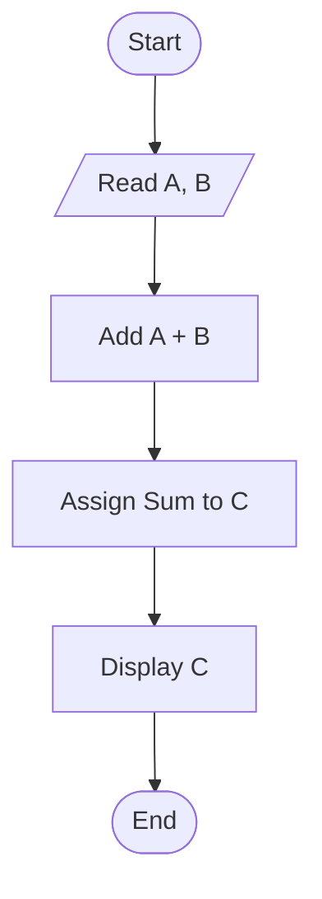

# Definition
Before proceeding, ensure you master [[Problem_Solving_Techniques_in_Programming]] and [[Algorithm_Representation_Pseudocode]].
A "flowchart" is a graphical representation of an algorithm, widely used in the design phase of programming to visually work out the logical flow of a program. It uses standardized symbols to depict different types of operations, decisions, and data flows, connected by lines with arrows indicating the sequence. Flowcharts make complex logic easier to understand and communicate. A simpler analogy is a road map: it shows different roads (operations), intersections (decisions), and the paths you can take to get from one point to another, visually laying out your journey.

# The Mental Model
Imagine you're giving directions to someone, but instead of just writing them down (like pseudocode), you draw a map with symbols.
*   An oval means "Start" or "End" of the journey.
*   A rectangle means "Drive straight for 5 miles" (an action).
*   A diamond means "Is the gas tank empty?" (a decision point where you choose one path if true, another if false).
*   Arrows show which way to go next.
This visual map is a "flowchart." It helps you see the entire journey, including all possible turns and decision points, at a glance, making it much easier to spot errors or inefficiencies in your plan before you even start driving.

# Context & Framework
### Where do Users Get Stuck?: Mapping Decision Points
Flowcharts serve as an invaluable tool for mapping out decision points and process flows visually. They utilize specific symbols to represent various operations within an algorithm, ensuring clarity and standardization:
*   **Start/End Symbol (Terminal):** An oval or rounded rectangle, marking the beginning and end of the algorithm.
*   **Action Symbol (Process):** A rectangle, representing any processing operation or instruction that changes a state (e.g., calculations, assignments).
*   **Decision Symbol:** A diamond, indicating a point where a decision is made, and the program branches into two or more paths based on a condition (e.g., true/false).
*   **Input/Output Symbol (Data):** A parallelogram, representing input or output operations (e.g., reading data, displaying results).
*   **Flowline:** An arrow, connecting symbols and indicating the direction of flow or the sequence of operations.
These symbols help visualize the entire execution path, making it easier to understand how conditions affect the program's behavior and where potential "friction points" (complex decision paths or loops) might exist for a user following the process.

# The Mastery Deep Dive
### Visualizing Program Logic
The primary power of flowcharts lies in their ability to **visually represent program logic**. By using standard graphical symbols, a programmer can illustrate the entire step-by-step sequence of an algorithm, including inputs, processes, decisions, and outputs, in an easily digestible format. This visual approach is particularly effective for understanding complex conditional logic (`if-else` statements) and iterative processes (loops), which can sometimes be difficult to parse from text-based pseudocode. A well-constructed flowchart can quickly reveal logical flaws, bottlenecks, or redundant steps in an algorithm, allowing for early correction in the design phase before any actual coding begins. This makes flowcharts an excellent tool for both design and debugging.

### Communication and Standardization
Flowcharts contribute significantly to **communication and standardization** within software development teams. Because they use a universally recognized set of symbols, flowcharts provide a common language for discussing and understanding algorithms, regardless of the programming language ultimately used for implementation. This standardization minimizes ambiguity and ensures that all stakeholders (programmers, analysts, clients) have a shared understanding of the intended system behavior. They are an effective tool for documenting existing systems, training new developers, or presenting algorithmic logic in a clear, concise manner. The visual nature transcends language barriers and specific technical jargon, making complex processes accessible.

# Constraints & Limitations
### Cumbersome for Large Programs
A significant constraint of flowcharts is that they can become **cumbersome and difficult to manage for very large or complex programs**. As the number of steps, decisions, and branching paths increases, a flowchart can quickly become sprawling, occupy multiple pages, and lose its readability. The visual nature, while an advantage for small algorithms, turns into a disadvantage when attempting to represent hundreds or thousands of lines of code. Maintaining such a large flowchart (updating symbols, rearranging flowlines) becomes a tedious and error-prone task. For modern, complex software, flowcharts are typically used for specific, critical modules or high-level overviews rather than for the entire application.

# Significance & Application
Flowcharts are historically significant as one of the earliest and most intuitive tools for algorithm design and representation, predating many modern programming languages. They remain highly relevant for:
*   **Initial Design:** Quickly sketching out the logic for new, small algorithms or critical modules.
*   **Problem Analysis:** Breaking down and understanding complex problems visually.
*   **Documentation:** Providing clear visual documentation for existing systems.
*   **Teaching:** Explaining fundamental programming concepts and control flow to beginners.
They offer a valuable visual alternative or complement to pseudocode, especially when the visual representation of branching and looping is crucial for clarity.

# The Worked Example
This example demonstrates representing an algorithm using a flowchart.

**Objective:** Draw a flowchart of an algorithm to add two numbers and display their result.

1.  **Algorithm Description (from Source Text):**
    *   Read the values of the two numbers (A and B).
    *   Add A and B.
    *   Assign the sum of A and B to C.
    *   Display the result (C).

2.  **Flowchart Representation:**


```text
    // Scenario 1: Visualizing the Addition Algorithm
    // Output:
    // (A visual representation of the flowchart diagram.)
    // Start (oval) -> Read A, B (parallelogram) -> Add A + B (rectangle) -> Assign Sum to C (rectangle) -> Display C (parallelogram) -> End (oval).
    // This output block explicitly describes the flow and shape of each step in the diagram.

    // Scenario 2: Highlighting the data flow and transformation
    // Output:
    // Program starts.
    // Inputs 'A' and 'B' are read.
    // 'A' and 'B' are added together.
    // The sum is stored in 'C'.
    // The value of 'C' is shown as output.
    // Program ends.
```
    *Note: This `flowchart TD` visually depicts the sequential steps of the algorithm using standard symbols.*

**Analysis of Flowchart Symbols:**
*   **`([Start])` and `([End])` (Ovals):** Indicate the beginning and end of the program's execution.
*   **`[/Read A, B/]` and `[Display C]` (Parallelograms):** Represent input/output operations. Here, `A` and `B` are read (input), and `C` is displayed (output).
*   **`[Add A + B]` and `[Assign Sum to C]` (Rectangles):** Represent processing steps, where computations or assignments occur. `Add A + B` is a computation, and `Assign Sum to C` is an assignment.
*   **Arrows (`-->`):** Connect the symbols, showing the exact direction of the program's flow.

This example clearly shows how a flowchart provides a structured, visual step-by-step representation of an algorithm, making its logic immediately apparent.

# The Proving Ground
*Test your mastery. Cover the solutions below to test yourself first.*

### Level 1: The Sanity Check (Verification)
**The Question:** What is a flowchart, and what kind of symbol is typically used to represent a decision point within it?
> **Solution:** A flowchart is a **graphic representation of an algorithm**, often used to work out the logical flow of a program. A **diamond symbol** is typically used to represent a decision point, where the program branches into different paths based on a condition.

### Level 2: The Crucible (Mastery & Edge Cases)
**The Scenario:** A new programmer designs a flowchart for a complex loan approval system that involves checking multiple credit scores, income levels, and debt-to-income ratios. They initially create a single, massive flowchart with dozens of decision diamonds and crisscrossing flowlines. Explain why this approach is problematic for a complex system and what "friction point" it creates for other developers trying to understand the logic, relating it to a constraint of flowcharts.
> **Solution:** This approach is problematic because the flowchart, despite being visual, becomes **cumbersome and difficult to manage for very large or complex programs**, which is a key constraint of flowcharts.
>
> The "friction point" it creates for other developers is severe **readability and maintainability issues**. With dozens of decision diamonds and crisscrossing flowlines, the diagram quickly devolves into a visually overwhelming and confusing "spaghetti chart." Developers will struggle to trace the logic, understand the various branches, or identify specific decision points without getting lost in the intricate web of connections. This undermines the very purpose of a flowchart, which is to clarify logic, making it extremely difficult to identify errors, propose modifications, or even grasp the overall system behavior.

# Key Takeaways
*   Flowcharts are graphical representations of algorithms using standardized symbols for operations, decisions, and flow.
*   They visualize program logic and aid communication, especially for decision points and sequences.
*   A key constraint is that they become cumbersome and lose readability for very large or complex programs.

# Knowledge Graph Connections
| Concept                     | Connection / Relationship                                                                   |
| :
-------------------------- | :
------------------------------------------------------------------------------------------ |
| [[Problem_Solving_Techniques_in_Programming]] | Flowcharts are a method for representing logical procedures in problem-solving.     |
| [[Algorithms_and_Programs]] | Flowcharts are a common way to represent an algorithm visually.                               |
| [[Algorithm_Representation_Pseudocode]] | Flowcharts offer a visual alternative to the text-based pseudocode representation.    |
| [[Control_Structures_Overview]] | Flowcharts explicitly depict the flow of sequence, selection, and repetition control structures. |
---