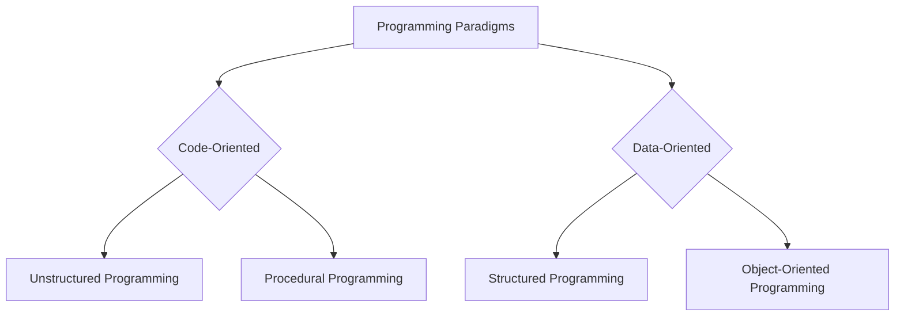

# Definition
Before proceeding, ensure you master [[What_Is_Programming]] and [[Computer_Programs_and_Source_Code]].
A "programming paradigm" is a fundamental style or approach to building the structure and elements of computer programs. It provides a conceptual framework for how programmers organize code and data, influencing how problems are decomposed and solved. Rather than being a specific language, it's a way of thinking about programming. Major paradigms include unstructured, procedural, structured, and object-oriented programming. A simpler way to think about it is different schools of thought for organizing your kitchen: one might arrange by cooking steps, another by ingredient type.

# The Mental Model
Imagine you're organizing a large, complex office. A "programming paradigm" is like the underlying philosophy you choose for how the office operates.
*   One paradigm might be: "Everyone just does their job, no strict rules, lots of shouting across desks." (This is like unstructured programming.)
*   Another: "We have clear departments, and tasks are passed from one department to the next in a sequence." (Procedural programming.)
*   Yet another: "Each department has its own internal rules and responsibilities, and they only interact through specific requests." (Object-oriented programming.)
The choice of philosophy deeply affects how efficiently tasks get done, how easily new people can join, and how adaptable the office is to change.

# Context & Framework
### The Family Tree: Programming Paradigms
Programming paradigms represent distinct conceptual approaches to organizing software. They can be broadly categorized based on how they prioritize and structure program elements. Some approaches, known as **Process-Oriented**, conceptually organize the program around the code – focusing on *what is happening* as a series of linear steps where code acts on data. Examples include [[Unstructured_Programming]] and [[Procedural_Programming]]. In contrast, other approaches, particularly **Data-Oriented** paradigms, organize the program around the data – focusing on *who is being affected* and designing structures to manage increasing complexity, often emphasizing what the data structure *can do for you*. [[Object_Oriented_Programming_OOP]] is a prime example of this.


```text
// Scenario 1: Illustrating the hierarchy of programming paradigms
// Output:
// (A visual representation of the graph diagram showing the hierarchy.)
// Programming Paradigms branches into Code-Oriented and Data-Oriented.
// Code-Oriented branches into Unstructured Programming and Procedural Programming.
// Data-Oriented branches into Structured Programming and Object-Oriented Programming.
// This visual confirms the high-level classification of paradigms.

// Scenario 2: Focus on the conceptual split between "what" and "who"
// Output:
// Programming Paradigms:
// - Code-Oriented (focus on 'what' the code does, linear steps)
//   - Unstructured Programming
//   - Procedural Programming
// - Data-Oriented (focus on 'who' is affected, managing complexity around data)
//   - Structured Programming
//   - Object-Oriented Programming
// This output explains the core conceptual difference for each branch.
```
*Note: This `graph TD` illustrates the high-level classification of programming paradigms into Code-Oriented and Data-Oriented approaches, with examples of each.*

# The Mastery Deep Dive
### Code-Oriented vs. Data-Oriented Approaches
Programming paradigms can be broadly classified by their primary focus: **code-oriented** or **data-oriented**. In code-oriented approaches (like Unstructured and Procedural Programming), the program is conceptually organized around the `code` – a sequence of instructions or procedures that act on data. The emphasis is on *what actions are being performed* and the flow of control through these actions. The data is often secondary and global. This model characterizes a program as a series of linear steps.

In contrast, data-oriented approaches (like Object-Oriented Programming and, to an extent, Structured Programming) organize the program around the `data`. The focus shifts to *who or what is being affected* – designing program elements (like objects) that encapsulate both data and the operations that can be performed on that data. This approach is designed to manage increasing complexity by asking "what can your data structure do for you?" rather than "what can your code do to your data structure?"

### The Evolution of Paradigms: Managing Complexity
The evolution of programming paradigms reflects a continuous effort to better manage the inherent complexity of software development. Early paradigms (like Unstructured) were simple but quickly became unwieldy for larger projects due to code duplication and global data issues. Procedural programming introduced modularity with procedures, allowing code reuse. Structured programming further refined this by grouping related procedures and data into modules, emphasizing top-down design. Object-Oriented Programming (OOP) emerged to address challenges in managing complex data and behaviors, promoting encapsulation, inheritance, and polymorphism. Each new paradigm offered a more sophisticated framework for organizing programs, ultimately aiming to improve maintainability, scalability, and reusability of code.

# Constraints & Limitations
### No Universal Best Paradigm
A crucial constraint regarding programming paradigms is that there is **no single "best" paradigm** that applies to all situations. Each paradigm has its strengths and weaknesses, making it more or less suitable for different types of problems, project sizes, and development teams. Forcing a specific paradigm onto a problem that is ill-suited for it can lead to over-engineering, increased complexity, or reduced performance. For example, while OOP is excellent for large, complex systems, it might introduce unnecessary overhead for a very simple scripting task where a procedural approach would be more straightforward and efficient. This necessitates that developers understand multiple paradigms and choose the most appropriate one based on context.

# Significance & Application
Understanding programming paradigms is vital for software developers as it informs fundamental design decisions and impacts the entire software development lifecycle. It helps in choosing the right language and architectural style for a project, designing scalable and maintainable systems, and collaborating effectively in teams. Academically, studying paradigms fosters a deeper understanding of computational models and the history of computer science. In practice, mastery of paradigms like object-oriented programming is a prerequisite for most modern software engineering roles, while understanding others (e.g., functional programming) expands a developer's problem-solving toolkit.

# The Worked Example
This example provides a conceptual illustration of how different programming paradigms would approach a simple task: calculating the area of various shapes.

**Objective:** Calculate the area of a rectangle and a circle.

1.  **Code-Oriented (Procedural Programming Concept):**
    In a procedural approach, you might have separate functions (procedures) that *act* on data.

```text
    # Procedural approach (Conceptual Pseudocode)

    PROCEDURE calculate_rectangle_area(length, width):
        RETURN length * width

    PROCEDURE calculate_circle_area(radius):
        PI = 3.14159
        RETURN PI * radius * radius

    # Main part of the program
    rectangle_length = 10
    rectangle_width = 5
    circle_radius = 7

    area1 = calculate_rectangle_area(rectangle_length, rectangle_width)
    area2 = calculate_circle_area(circle_radius)

    DISPLAY "Rectangle Area:", area1
    DISPLAY "Circle Area:", area2
```
```text
    // Scenario 1: Calculate areas
    // Output:
    // Rectangle Area: 50
    // Circle Area: 153.93791
```
    *Note: Here, the focus is on functions (procedures) that perform actions on input data.*

2.  **Data-Oriented (Object-Oriented Programming Concept):**
    In an object-oriented approach, you would define "objects" that encapsulate both data (characteristics like `length`, `width`, `radius`) and the operations (methods like `get_area()`) that act on that data.

```text
    # Object-Oriented approach (Conceptual Pseudocode)

    CLASS Rectangle:
        ATTRIBUTES:
            length
            width
        METHODS:
            CONSTRUCTOR(l, w):
                this.length = l
                this.width = w
            METHOD get_area():
                RETURN this.length * this.width

    CLASS Circle:
        ATTRIBUTES:
            radius
        METHODS:
            CONSTRUCTOR(r):
                this.radius = r
            METHOD get_area():
                PI = 3.14159
                RETURN PI * this.radius * this.radius

    # Main part of the program
    my_rectangle = NEW Rectangle(10, 5)
    my_circle = NEW Circle(7)

    area1 = my_rectangle.get_area()
    area2 = my_circle.get_area()

    DISPLAY "Rectangle Area:", area1
    DISPLAY "Circle Area:", area2
```
```text
    // Scenario 1: Calculate areas using objects
    // Output:
    // Rectangle Area: 50
    // Circle Area: 153.93791
```
    *Note: The focus shifts to defining objects (`Rectangle`, `Circle`) that inherently know how to calculate their own area, grouping data and behavior.*

This example illustrates that while both paradigms achieve the same result, their **conceptual organization** is fundamentally different. Procedural focuses on the `calculate_area` action as a separate entity, while OOP encapsulates the `get_area` action within the `Shape` object itself.

# The Proving Ground
*Test your mastery. Cover the solutions below to test yourself first.*

### Level 1: The Sanity Check (Verification)
**The Question:** What is a "programming paradigm," and how does it fundamentally influence the organization of a computer program?
> **Solution:** A programming paradigm is a **fundamental style or approach** to building computer programs. It fundamentally influences the organization of a program by providing a **conceptual framework for how programmers organize code and data**, guiding how problems are decomposed and solved.

### Level 2: The Crucible (Mastery & Edge Cases)
**The Scenario:** You are given a list of programming approaches: "focus on what is happening," "focus on who is being affected," "linear steps of code," "data and operations grouped." Sort these approaches into two categories, aligning them with code-centric and data-centric programming philosophies.
> **Solution:**
> **Code-Centric (Process-Oriented):**
> *   "Focus on what is happening"
> *   "Linear steps of code"
>
> **Data-Centric (Data-Oriented):**
> *   "Focus on who is being affected"
> *   "Data and operations grouped"

# Key Takeaways
*   Programming paradigms are fundamental styles that dictate how code and data are organized in a program.
*   They broadly categorize into code-oriented (e.g., procedural) focusing on actions, and data-oriented (e.g., object-oriented) focusing on data encapsulation.
*   The choice of paradigm impacts problem decomposition, complexity management, and software maintainability, with no single paradigm being universally superior.

# Knowledge Graph Connections
| Concept                     | Connection / Relationship                                                                   |
| :
-------------------------- | :
------------------------------------------------------------------------------------------ |
| [[Unstructured_Programming]] | Unstructured programming is an example of a code-oriented programming paradigm.              |
| [[Procedural_Programming]]  | Procedural programming is an example of a code-oriented programming paradigm.               |
| [[Structured_Programming]]  | Structured programming is an evolution within programming paradigms, bridging procedural and object-oriented. |
| [[Object_Oriented_Programming_OOP]] | Object-oriented programming is a prominent example of a data-oriented programming paradigm. |
---