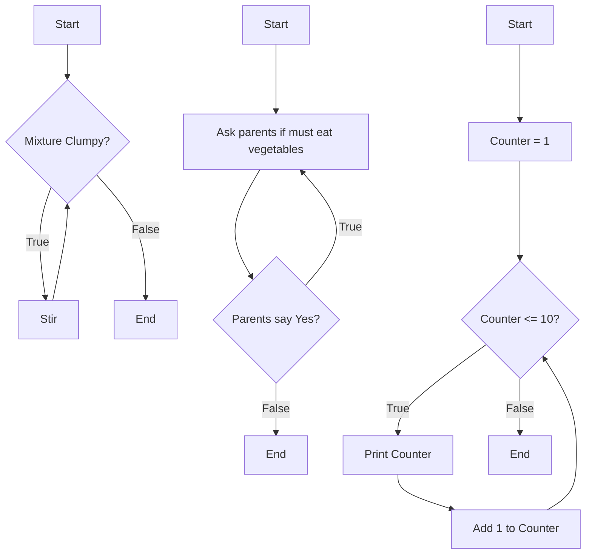

# Definition
Before proceeding, ensure you master [[Control_Structures_Overview]] and [[Selection_Control_Structure]].
The "repetition control structure," also known as a loop, enables a program to execute a block of instructions multiple times. This is essential for automating repetitive tasks without writing the same code repeatedly. Loops continue executing as long as a specified condition remains true or for a predefined number of iterations. The main types include `while` loops, `do-while` loops, and `for` loops. A simpler analogy is a chore: "Continue stirring the mixture WHILE it is still clumpy." You keep repeating the action until the condition (clumpy) is no longer true.

# The Mental Model
Imagine you're trying to teach a baby to count from 1 to 10.
*   **`While` loop:** "WHILE the counter is less than or equal to 10, print the counter and then add 1 to it." (You check the condition *before* you print anything. If the counter was already 11, you wouldn't print even once.)
*   **`Do-While` loop:** "DO print the counter and add 1 to it, WHILE the counter is less than or equal to 10." (You print *at least once*, then check if you should continue.)
*   **`For` loop (conceptual):** "FOR each number from 1 to 10, print the number." (You know exactly how many times to repeat.)
These structures allow your program to be efficient by avoiding redundant code and automating repetitive processes.


```text
// Scenario 1: Visualizing a While loop (stirring clumpy mixture)
// Output:
// (Flowchart for "Mixture Clumpy?")
// Start -> {Mixture Clumpy?}
//   If True -> Stir -> loop back to {Mixture Clumpy?}
//   If False -> End
// This visual demonstrates a pre-test loop.

// Scenario 2: Visualizing a Do-While loop (asking parents about veggies - conceptual)
// Output:
// (Flowchart for "Parents say 'Yes'?")
// Start -> Ask parents if must eat vegetables -> {Parents say "Yes"?}
//   If True -> loop back to Ask parents...
//   If False -> End
// This visual implies at least one execution before the condition check.

// Scenario 3: Visualizing a For loop (counting 1 to 10 - conceptual as a while)
// Output:
// (Flowchart for counting)
// Start -> Counter = 1 -> {Counter <= 10?}
//   If True -> Print Counter -> Add 1 to Counter -> loop back to {Counter <= 10?}
//   If False -> End
// This visual shows initialization, condition, and iteration update for a counting loop.
```
*Note: This `flowchart TD` illustrates various repetition patterns: a basic `while` loop (stirring), a conceptual `do-while` (asking parents, at least once), and a `for` loop (counting with initialization, condition, and increment).*

# Context & Framework
### Where do Users Get Stuck?: Iterative Processes
Repetition control structures, or loops, are fundamental for automating tasks that need to be performed multiple times. They eliminate the need for redundant code and enable programs to process collections of data efficiently.
*   **`while` loop:** This is a pre-test loop, meaning its condition is checked *before* each iteration. The loop body executes only if the condition is true. If the condition is initially false, the loop never runs.
*   **`do-while` loop:** This is a post-test loop, guaranteeing that its loop body executes *at least once*. After the first execution, the condition is checked, and if true, the loop continues.
*   **`for` loop:** Often used for definite iteration, where the number of repetitions is known in advance, or for iterating over elements in a collection. It typically includes initialization, a condition, and an update step within its structure.
These structures provide the means for programs to perform iterative calculations, process data streams, or repeat actions until a specific goal is achieved.

# The Mastery Deep Dive
### `while` Loop: Condition-Controlled Repetition
The `while` loop is a fundamental repetition control structure that executes a block of code repeatedly **as long as a specified Boolean condition remains true**. The key characteristic of a `while` loop is that the condition is evaluated *before* each iteration of the loop body. If the condition is initially false, the loop body will not execute even once. This makes the `while` loop suitable for situations where the number of repetitions is not known in advance, and the loop's continuation depends on a dynamic condition (e.g., "keep reading input while there's still data," or "continue searching while item not found"). It is crucial to ensure that something inside the loop body eventually makes the condition false, otherwise an infinite loop will occur.

### `do-while` Loop: Guaranteed First Execution
The `do-while` loop is similar to the `while` loop in that it repeats a block of code based on a condition, but with one critical difference: the loop body is guaranteed to execute **at least once** before the condition is evaluated for the first time. After the initial execution, the Boolean condition is checked. If it is true, the loop continues for another iteration; if false, the loop terminates. This structure is particularly useful when you need to perform an action at least once, regardless of the initial state, such as prompting a user for input and then validating it. If the input is invalid, the loop can continue to prompt until valid input is provided.

### `for` Loop: Count-Controlled Repetition
The `for` loop is typically used for **count-controlled repetition**, where the number of iterations is known or easily determinable before the loop starts. It consolidates three common components of a loop into a single header:
1.  **Initialization:** A statement executed once at the beginning of the loop (e.g., `counter = 1`).
2.  **Condition:** A Boolean expression evaluated before each iteration; the loop continues as long as it's true (e.g., `counter <= 10`).
3.  **Update:** A statement executed after each iteration (e.g., `increment counter by 1`).
`for` loops are ideal for iterating through arrays, collections, or performing a task a fixed number of times (e.g., "print numbers from 1 to 10," or "process each item in this list"). Many languages also offer a "for-each" variant for simplified iteration over collections.

# Constraints & Limitations
### Infinite Loops and Off-by-One Errors
The primary constraint and a common source of significant bugs with repetition control structures are **infinite loops**. This occurs when the loop's termination condition is never met, causing the program to execute indefinitely, consuming CPU cycles and potentially crashing the system. This often stems from incorrect loop conditions or a failure to update the variables that control the loop. Another frequent issue is **off-by-one errors**, where a loop executes one time too many or one time too few. This is typically caused by incorrect use of comparison operators (`<` vs. `<=`) or incorrect initialization/termination values, leading to subtle but persistent bugs that can corrupt data or produce inaccurate results. Careful attention to loop bounds and termination conditions is essential.

# Significance & Application
Repetition control structures are absolutely indispensable in programming, enabling the automation of countless tasks that would otherwise require tedious and repetitive manual coding. They are critical for:
*   **Data Processing:** Iterating through lists, arrays, database records, or file contents.
*   **Calculations:** Performing iterative calculations, numerical simulations, or finding sums/averages.
*   **User Interaction:** Continuously prompting for valid input until criteria are met.
*   **Algorithm Implementation:** Many algorithms (e.g., searching, sorting) inherently rely on iterative processes.
Mastery of loops is fundamental for writing efficient, concise, and powerful programs, and they are present in virtually every non-trivial software application.

# The Worked Example
This example demonstrates the `while`, `do-while`, and `for` loop structures using conceptual pseudocode for different scenarios.

**Objective:**
1.  Read numbers until a negative number is entered, then sum the positive numbers. (`while`)
2.  Ensure a password is at least 8 characters long, prompting until valid. (`do-while`)
3.  Print all even numbers from 2 to 10. (`for`)

```text
# Repetition Control Structure Examples (Conceptual Pseudocode)

// Example 1: `WHILE` Loop (Read and Sum Positive Numbers)
total_sum = 0
number = 0 // Initialize to ensure first check (if input is handled outside the loop)

DISPLAY "Enter positive numbers to sum (enter a negative number to stop):"
GET number // Get first number for initial condition check

WHILE number >= 0 DO
    total_sum = total_sum + number
    GET number // Get next number for subsequent condition checks
END WHILE

DISPLAY "Sum of positive numbers: ", total_sum


// Example 2: `DO-WHILE` Loop (Password Validation)
password = ""

DO
    DISPLAY "Enter a password (min 8 characters):"
    GET password
    IF LENGTH(password) < 8 THEN
        DISPLAY "Password is too short. Please try again."
    END IF
WHILE LENGTH(password) < 8

DISPLAY "Password set successfully!"


// Example 3: `FOR` Loop (Print Even Numbers from 2 to 10)
FOR count FROM 2 TO 10 STEP 2 DO
    DISPLAY "Even number: ", count
END FOR
```
```text
// Scenario 1: `WHILE` loop input: 5, 10, 3, -1
// Output:
// Enter positive numbers to sum (enter a negative number to stop):
// 5
// 10
// 3
// -1
// Sum of positive numbers: 18

// Scenario 2: `DO-WHILE` loop input: "short", "password123"
// Output:
// Enter a password (min 8 characters):
// short
// Password is too short. Please try again.
// Enter a password (min 8 characters):
// password123
// Password set successfully!

// Scenario 3: `FOR` loop execution
// Output:
// Even number: 2
// Even number: 4
// Even number: 6
// Even number: 8
// Even number: 10
```
*Note: This pseudocode illustrates different scenarios for each type of loop, emphasizing their distinct uses.*

**Analysis of Loops:**
*   **`WHILE` Loop:** The condition (`number >= 0`) is checked *before* any addition. If the very first input was negative, the loop body would never execute. This is ideal when the number of iterations is unknown, and it might be zero.
*   **`DO-WHILE` Loop:** The password prompt and input (`GET password`) happen *at least once* before `LENGTH(password) < 8` is checked. This guarantees a first attempt at input, then continues prompting if the condition for repetition is true (password is too short).
*   **`FOR` Loop:** The initialization (`count FROM 2`), condition (`TO 10`), and update (`STEP 2`) are all concisely expressed. This loop is used when the number of iterations is known (or easily determined) and increments in a predictable pattern, printing 2, 4, 6, 8, 10.

This example highlights the versatility of repetition structures in handling various iterative programming tasks, each suited for different control flow needs.

# The Proving Ground
*Test your mastery. Cover the solutions below to test yourself first.*

### Level 1: The Sanity Check (Verification)
**The Question:** In the context of programming, what is the primary function of a repetition control structure?
> **Solution:** The primary function of a repetition control structure is to **execute a block of instructions multiple times**, automating repetitive tasks either for a specified count or as long as a certain condition remains true.

### Level 2: The Crucible (Mastery & Edge Cases)
**The Scenario:** A new programmer is tasked with creating a system that simulates rolling a six-sided die repeatedly until a 6 is rolled. They write a `while` loop for this. However, after several test runs, they notice that sometimes the program appears to freeze, or in other cases, it never seems to end. What common control structure constraint did they likely fail to manage correctly, and what is the specific term for the problematic behavior where the program never ends?
> **Solution:** The programmer likely failed to correctly manage the **loop's termination condition** within the repetition control structure.
>
> The specific term for the problematic behavior where the program never ends is an **infinite loop**. In this scenario, it's highly probable that the random die roll `(e.g., simulating `roll = random(1, 6)` or `roll = new_roll()` )` is not being executed *inside* the `while` loop's body, or the condition to exit the loop (e.g., `while roll != 6`) is not being correctly re-evaluated with a new roll in each iteration. If `roll` is never updated inside the loop, and its initial value isn't 6, the condition `roll != 6` will always remain true, causing the loop to run forever.

# Key Takeaways
*   Repetition structures (loops) execute code blocks multiple times, automating repetitive tasks.
*   `While` loops are pre-test, `do-while` loops guarantee at least one execution, and `for` loops are for count-controlled iteration.
*   Proper management of termination conditions is crucial to avoid infinite loops and off-by-one errors.

# Knowledge Graph Connections
| Concept                     | Connection / Relationship                                                                   |
| :
-------------------------- | :
------------------------------------------------------------------------------------------ |
| [[Control_Structures_Overview]] | Repetition is one of the three fundamental types of control structures.                       |
| [[Sequence_Control_Structure]] | A sequence of instructions forms the body of a repetition structure's iterations.             |
| [[Selection_Control_Structure]] | Selection structures are often used within loops to make decisions during iterations.         |
| [[Algorithms_and_Programs]] | Algorithms frequently utilize repetition structures to define iterative processes.            |
---