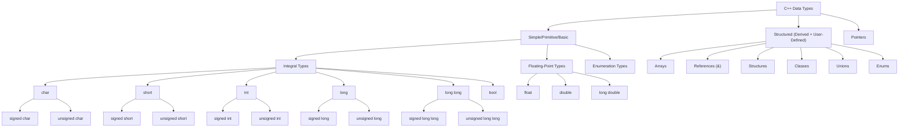

# Definition
Before proceeding, ensure you master the concepts of [[Variables_in_C++]] and general Memory_Management.

**Data types** in C++ are classifications that define the kind of values a variable can hold, the operations that can be performed on those values, and the amount of memory (size) required to store them. When you declare a variable, you **must specify its data type**. This tells the compiler, "Reserve *this much* memory, and interpret the bits stored there *this way*." C++ data types are broadly categorized into: **Simple/Primitive/Basic**, **Structured (Derived + User-Defined)**, and **Pointers**. Understanding data types is fundamental to writing correct and efficient C++ code, as it directly impacts memory usage, computational accuracy, and type-safety.

# The Mental Model
Imagine you're managing a warehouse. For every item (data value) you store, you need a specific **type of container** (the data type).
*   A "small box" (`int`) for whole numbers.
*   A "large box" (`double`) for decimal numbers that need more space and precision.
*   A "single-character sleeve" (`char`) for letters or symbols.
*   A "label for a different box" (`pointer`) to point to another container's location.
The type of container determines its **size** (how much space it takes) and **what you can do with it** (e.g., you can add numbers, but not "add" characters in the same way). If you try to put a large item into a small box, it won't fit (data overflow!).

# Context & Framework
### The Family Tree

*Note: This `graph TD` illustrates the comprehensive classification of C++ data types into Primitive, Structured, and Pointers. It further breaks down Primitive types into their various integral and floating-point sub-categories.*

# The Mastery Deep Dive
### The Impostor: Highlighting scenarios where choosing the wrong data type leads to problems.
Choosing the wrong data type can lead to subtle yet critical "impostor" bugs:
1.  **Integer Overflow:** Using an `int` to store a value larger than its maximum capacity (e.g., a population count for a large country in a 2-byte `int`). The value will "wrap around" to a negative number or an incorrect positive number, becoming an "impostor" of the true value.
2.  **Floating-Point Precision Errors:** Using `float` or `double` for financial calculations or precise scientific measurements (e.g., `0.1 + 0.2` not equaling exactly `0.3`). Due to the binary representation of decimal numbers, small inaccuracies creep in, making the computed value an "impostor" of the mathematically exact result.
3.  **Data Loss during Type Conversion:** Implicitly converting a `double` to an `int` (e.g., `int i = 3.99;`). The decimal part is truncated, not rounded, leading to `i` being `3`. The integer `3` is an "impostor" of `3.99` if rounding was expected.
4.  **Character vs. String:** Confusing a single `char` (`'A'`) with a single-character string (`"A"`). They are stored differently and cannot be directly interchanged without conversion.
These impostors demonstrate that data types are not just arbitrary labels but critical determinants of how data behaves.

# Constraints & Limitations
### The Engineering Trade-off
The fixed-type nature of C++ (static typing) means that every variable's type must be known at compile time. This is a crucial engineering trade-off: gain performance (because the compiler knows exactly how much memory to allocate and what operations are valid) and type-safety (catching type-related errors before runtime), but at the cost of less runtime flexibility compared to dynamically-typed languages. Programmers must decide on the most appropriate data type for each variable, carefully considering its range, precision, and intended use. This precision prevents many subtle bugs but requires a deeper understanding of data representation.

# Significance & Application
Data types are the bedrock of memory management and computational correctness in C++. They are indispensable for:
*   **Memory Efficiency:** Choosing the smallest appropriate data type minimizes memory consumption, critical for embedded systems and large datasets.
*   **Accuracy and Precision:** Selecting `float`, `double`, or `long double` impacts the precision of calculations.
*   **Type Safety:** The compiler uses data types to prevent incompatible operations (e.g., adding a string to an integer), catching errors early.
*   **Meaningful Data Representation:** They allow the programmer to model real-world entities (e.g., age as `int`, temperature as `double`, name as `string`) effectively.
Mastering data types is the prerequisite for all meaningful data manipulation and algorithm implementation in C++.

# The Worked Example
This example demonstrates the declaration and use of various simple C++ data types.

```cpp
```cpp
#include <iostream>
#include <string> // For std::string

int main() {
    // Integral Types
    int age = 30;             // Stores whole numbers
    char initial = 'J';       // Stores a single character
    bool is_student = true;   // Stores true (1) or false (0)
    long population = 8000000000L; // Stores large whole numbers (L suffix for long)

    std::cout << "Age: " << age << std::endl;
    std::cout << "Initial: " << initial << std::endl;
    std::cout << "Is student: " << is_student << std::endl;
    std::cout << "Population: " << population << std::endl;

    // Floating-Point Types
    float temperature = 22.5f; // Stores single-precision decimal numbers (f suffix for float)
    double pi = 3.1415926535;   // Stores double-precision decimal numbers

    std::cout << "Temperature: " << temperature << std::endl;
    std::cout << "Pi: " << pi << std::endl;

    // String Type (from <string> library)
    std::string full_name = "Jane Doe"; // Stores sequences of characters

    std::cout << "Full Name: " << full_name << std::endl;

    return 0;
}
```
```text
// Scenario 1: Displaying values of various data types
// Output:
// Age: 30
// Initial: J
// Is student: 1
// Population: 8000000000
// Temperature: 22.5
// Pi: 3.14159
// Full Name: Jane Doe
// This output demonstrates the basic usage and expected values for different primitive data types.

// Scenario 2: What if 'age' was declared as 'char' with value 30?
// (Conceptual output, not direct code modification output)
// If 'char age = 30;' was used, printing 'age' would output a non-printable ASCII character (ASCII 30).
// This highlights the importance of choosing the correct data type to represent the intended value and avoid misinterpretation.
```
*Note: This C++ code demonstrates the declaration and use of various **integral, floating-point, and string data types**, illustrating their fundamental differences.*

# The Proving Ground
*Test your mastery. Cover the solutions below to test yourself first.*

### Level 1: The Sanity Check (Verification)
**The Question:** What are the three main categories into which C++ data types are classified?
> **Solution:** C++ data types are classified into Simple/Primitive/Basic, Structured (Derived + User-Defined), and Pointers.

### Level 2: The Crucible (Mastery & Edge Cases)
**The Scenario:** A new programmer defines all variables as `double` to "avoid any precision issues" for both whole numbers and decimals.
**The Challenge:** Explain why this approach is not always optimal and can lead to inefficient resource usage, specifically contrasting `double` with more appropriate integer types.
> **Solution:** While using `double` for all numbers might avoid explicit precision issues for whole numbers, it is **not optimal for memory efficiency**. A `double` typically occupies 8 bytes of memory, whereas an `int` might only take 4 bytes, and a `short int` perhaps 2 bytes. For variables that are guaranteed to hold only whole numbers within a smaller range (e.g., a loop counter from 0 to 100, or an age), using a `double` unnecessarily allocates more memory than required. This leads to **inefficient resource usage**, especially in memory-constrained applications or when dealing with very large numbers of variables. Using `double` also doesn't solve all precision issues for *all* decimal numbers, particularly those that cannot be exactly represented in binary.

# Key Takeaways
*   **Data types** define the kind of value, operations, and memory size for a variable.
*   They are categorized into **Simple/Primitive**, **Structured**, and **Pointers**.
*   Choosing the correct data type is crucial for **memory efficiency, computational accuracy, and type-safety**.

# Knowledge Graph Connections
| Concept                     | Connection / Relationship                                                                                                 |
| :
-------------------------- | :
-------------------------------------------------------------------------------------------------------------------------- |
| [[Variables_in_C++]]        | Variables must be declared with a specific data type to determine their storage and behavior.                               |
| Memory_Management       | Data types dictate the amount of memory allocated for a variable.                                                         |
| [[Integral_Data_Types]]     | Integral data types are a sub-category of simple data types for whole numbers.                                            |
| [[Floating_Point_Data_Types]] | Floating-point data types are a sub-category of simple data types for decimal numbers.                                    |
| [[Character_Data_Type]]     | The character data type is a primitive type for single characters.                                                        |
| [[String_Data_Type]]        | The string data type, though typically a class, represents sequences of characters and interacts closely with character types. |
---