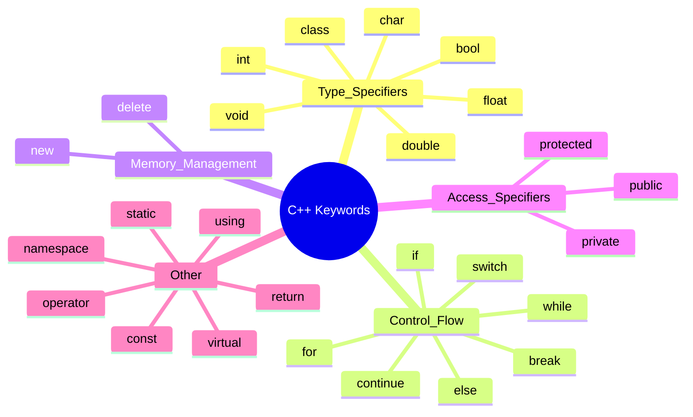

# Definition
Before proceeding, ensure you master the concept of [[Tokens_in_C++]].

**Keywords** (also known as **reserved words**) in C++ are a predefined set of words that have special, immutable meanings to the compiler. These words are an integral part of the C++ language syntax and cannot be used for any other purpose, such as naming variables, functions, or classes. All C++ keywords are **strictly lowercase** to maintain consistency and prevent ambiguity. They serve as fundamental instructions or type specifiers, guiding the compiler on how to interpret and process the code.

# The Mental Model
Imagine C++ as a language where certain words are **sacred commands or labels** that cannot be altered or repurposed. If "stop" means "stop," you cannot use "stop" to name your cat. Keywords are these sacred words: `int` always means "integer type," `if` always means "conditional statement," and `class` always means "define a class." The compiler has an internal dictionary, and if it encounters one of these sacred words, it knows exactly what to do. Any attempt to use them differently is like trying to change the meaning of a sacred word – it will lead to confusion and rejection.

# Context & Framework
### Where Does it Live? (The Map)

*Note: This `mindmap` illustrates the categories and examples of various keywords in C++, showcasing their distribution across different programming functionalities.*

# The Mastery Deep Dive
### The Impostor: Highlighting scenarios where keywords are accidentally misused.
The most common "impostor" scenario with keywords is attempting to use them as identifiers. Because keywords are reserved, any attempt to define a variable, function, or class with a keyword's name will result in a **compilation error**, typically "error: expected identifier before 'keyword'".
For example:
*   `int class = 10;` will fail because `class` is a keyword.
*   `void if() { ... }` will fail because `if` is a keyword.
*   `float delete = 3.14;` will fail because `delete` is a keyword.
This strict rule prevents ambiguity for the compiler, ensuring that when it encounters `class`, it always knows it's the `class` keyword and not a user-defined entity. The consistency of keywords (always lowercase) also means that `Int` is not an impostor `int` keyword; it's an undeclared identifier.

# Constraints & Limitations
### The Engineering Trade-off
The absolute prohibition against repurposing keywords is a fundamental constraint that simplifies the compiler's job but restricts the programmer's naming choices. This is an engineering trade-off: ensure unambiguous parsing for the machine by limiting lexical freedom for the human. While it might sometimes feel restrictive to avoid common words, this strictness prevents a vast category of potential syntax errors and ensures that the core logic of the C++ language remains consistent and predictable. The fixed nature of keywords is a strength that guarantees the underlying language constructs are always interpreted correctly.

# Significance & Application
Keywords are the **backbone of C++ syntax**, providing the fundamental vocabulary for constructing any program. They are critical for:
*   **Defining Data Types:** Specifying the kind of information a variable can hold (`int`, `float`, `bool`).
*   **Controlling Program Flow:** Implementing decisions and loops (`if`, `for`, `while`).
*   **Structuring Code:** Defining classes, functions, and namespaces (`class`, `void`, `namespace`).
*   **Memory Management:** Explicitly allocating and deallocating memory (`new`, `delete`).
Mastering keywords means understanding the core operations and structures available in C++, which is essential for writing functional and syntactically correct code.

# The Worked Example
This example illustrates the use of several C++ keywords in a simple program.

```cpp
```cpp
#include <iostream>

// 'class' is a keyword used to define a class
class MyClass {
public: // 'public' is an access specifier keyword
    int value; // 'int' is a keyword for integer data type
    
    // 'void' is a keyword for a function that returns nothing
    void setValue(int val) {
        // 'this' is a keyword that points to the current object
        this->value = val;
    }
};

int main() {
    // 'for' is a loop keyword, 'int' again for loop counter
    for (int i = 0; i < 3; ++i) {
        // 'if' is a conditional keyword
        if (i == 1) {
            // 'continue' is a flow control keyword, skips current iteration
            continue;
        }
        std::cout << "Current i: " << i << std::endl;
    }

    // 'auto' is a type deduction keyword (C++11 and later)
    auto myVar = 10; // 'myVar' is deduced as 'int'
    std::cout << "myVar: " << myVar << std::endl;

    // 'return' is a keyword to exit a function and return a value
    return 0; // '0' is a literal
}
```
```text
// Scenario 1: Standard execution demonstrating keyword functionality
// Output:
// Current i: 0
// Current i: 2
// myVar: 10
// This output shows 'continue' skipping the iteration when i is 1, and 'auto' correctly deducing the type of myVar.

// Scenario 2: Attempting to use a keyword as a variable name (conceptual)
// If we tried: 'int public = 5;'
// Compiler Error: "error: expected identifier before 'public'"
// This confirms that keywords cannot be used as identifiers due to their reserved status.
```
*Note: This C++ code snippet demonstrates the practical application of various **keywords** like `class`, `public`, `int`, `void`, `this`, `for`, `if`, `continue`, `auto`, and `return` to structure and control program flow.*

# The Proving Ground
*Test your mastery. Cover the solutions below to test yourself first.*

### Level 1: The Sanity Check (Verification)
**The Question:** Provide three examples of keywords in C++.
> **Solution:** Examples include `int`, `if`, `class`, `return`, `for` (any three from the list provided in the Context & Framework section).

### Level 2: The Crucible (Mastery & Edge Cases)
**The Scenario:** You are reviewing a C++ code snippet that includes the line: `int While = 10;`.
**The Challenge:** Explain whether this line would cause a compilation error and why, specifically distinguishing between a keyword and an identifier in C++.
> **Solution:** This line would **not** cause a compilation error. `while` (all lowercase) is a C++ keyword used for loop constructs. However, `While` (with an uppercase 'W') is treated as a distinct **identifier** due to C++'s case sensitivity. As long as `While` hasn't been declared elsewhere, the compiler will accept it as a valid variable name. This highlights the crucial distinction: keywords are strictly defined, typically in lowercase, and cannot be repurposed. An identifier, however, is a user-defined name, and its validity is based on naming rules and whether it clashes with *exact* keyword spellings.

# Key Takeaways
*   **Keywords (reserved words)** are predefined words with special, **immutable meanings** to the C++ compiler.
*   They are **strictly lowercase** and cannot be used as identifiers (variable names, function names, etc.).
*   Keywords are essential for defining **data types, control flow, code structure, and memory management**.

# Knowledge Graph Connections
| Concept                     | Connection / Relationship                                                                                                 |
| :
-------------------------- | :
-------------------------------------------------------------------------------------------------------------------------- |
| [[Tokens_in_C++]]           | Keywords are one of the five fundamental types of tokens in C++.                                                          |
| [[Identifiers_in_C++]]      | Keywords are explicitly distinct from identifiers, which are user-defined names.                                          |
| [[Case_Sensitivity_and_Whitespace]] | Keywords are strictly case-sensitive and must adhere to their predefined lowercase spelling.                            |
| [[Data_Types_in_C++]]       | Many keywords are used to specify fundamental C++ data types.                                                             |
| Control_Flow            | Keywords like `if`, `for`, `while` are integral to implementing program control flow.                                     |
---