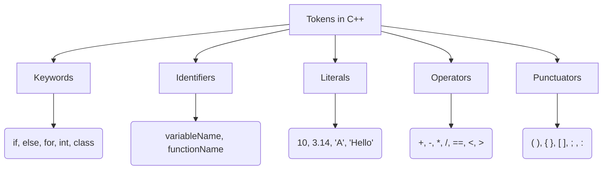

# Definition
Before proceeding, ensure you have a basic understanding of Lexical_Analysis.

In C++, a **token** is the smallest individual unit of a program that is meaningful to the compiler. It is to a C++ program what a word is to a sentence in natural language. The C++ compiler breaks down source code into a sequence of these tokens during the **lexical analysis** phase. Tokens are categorized into five fundamental types: **keywords**, **identifiers**, **literals**, **operators**, and **punctuators** (which include special symbols like parentheses, braces, and semicolons). Understanding tokens is essential because they form the atomic building blocks upon which the entire program's syntax and semantics are constructed.

# The Mental Model
Imagine you're trying to understand a very precise language, like a chef following a recipe. A **token** is like an individual word or symbol in that recipe: "flour," "sugar," "mix," "+," "kg," "(` `)," or ";". Each token has a distinct meaning. The compiler, like a chef, first breaks the entire recipe (your code) into these individual, meaningful "words" or "symbols" before trying to understand the sequence of instructions (the overall program logic). Without correctly identified tokens, the recipe is just a jumble of letters and characters.

# Context & Framework
### The Family Tree

*Note: This `graph TD` illustrates the five main categories of tokens in C++. Each branch represents a distinct type of token, with examples provided for clarity.*

# The Mastery Deep Dive
### The Impostor: Highlighting scenarios where tokens might be misinterpreted or misused.
A common "impostor" scenario involves misinterpreting what constitutes a single token or attempting to use a token incorrectly:
1.  **Keyword as Identifier:** Trying to name a variable `int` (e.g., `int int = 5;`). The compiler sees `int` (keyword) and then `int` again, expecting an identifier for the variable but finding another keyword. This is a fundamental violation, as keywords have predefined meanings and cannot be reused.
2.  **Operator as Identifier:** While generally not syntactically possible to assign an operator like `+` as an identifier, confusion can arise with compound operators. For instance, `my_var++` involves `my_var` (identifier) and `++` (operator) as distinct tokens, not `my_var++` as a single token.
3.  **Whitespace Ambiguity:** Sometimes, programmers might mistakenly believe that whitespace *within* a token is allowed (e.g., `my variable`). The lexical analyzer, however, will see `my` as one token and `variable` as another, leading to a syntax error if `my variable` was intended to be a single identifier. Whitespace acts as a delimiter between tokens, not part of them.
Understanding these distinctions is crucial for accurate parsing and compilation.

# Constraints & Limitations
### The Engineering Trade-off
The rigid categorization of tokens is a necessary constraint for the compiler's efficiency and determinism. While it simplifies the compiler's job, it places a burden on the programmer to strictly adhere to C++'s lexical rules. Any deviation (e.g., a misspelled keyword, a character not part of a valid literal, or an operator used incorrectly) will immediately halt compilation. This is an engineering trade-off: gain compilation speed and clarity for the machine, but demand meticulous syntax from the human. The compiler cannot infer intent; it only recognizes valid token sequences.

# Significance & Application
Tokens are the fundamental vocabulary of C++. Every line of code you write is ultimately parsed into a sequence of these tokens. They are crucial for:
*   **Compiler Parsing:** The first step in compilation is tokenization, making them indispensable.
*   **Syntax Checking:** The compiler validates the arrangement of tokens against C++ grammar rules.
*   **Semantic Understanding:** The type of token dictates its meaning (e.g., `if` means conditional, `+` means addition).
*   **Error Detection:** Incorrectly formed or used tokens are immediate sources of compilation errors.
Mastery of token types allows programmers to speak the language of C++ precisely, avoiding common syntax errors and understanding compiler messages.

# The Worked Example
This C++ snippet illustrates various token types recognized by the compiler.

```cpp
```cpp
#include <iostream> // '#include', '<', 'iostream', '>' are tokens.
                    // Comments are ignored.

int main() {        // 'int', 'main', '(', ')' are tokens.
                    // '{' is a punctuator token.

    int count = 10; // 'int' (keyword), 'count' (identifier), '=' (operator), '10' (literal), ';' (punctuator)

    double pi = 3.14; // 'double' (keyword), 'pi' (identifier), '=', '3.14' (literal), ';'

    if (count > 5) { // 'if' (keyword), '(' (punctuator), 'count' (identifier), '>' (operator), '5' (literal), ')' (punctuator), '{' (punctuator)
        std::cout << "Count is greater than 5." << std::endl; // 'std', '::', 'cout', '<<', "Count is greater than 5.", '<<', 'std', '::', 'endl', ';'
    }

    return 0;       // 'return' (keyword), '0' (literal), ';' (punctuator)
}                   // '}' (punctuator)
```
```text
// Scenario 1: Compiler's view of tokenization
// Output: (Conceptual output, illustrating token identification)
// #include -> preprocessor_directive
// < -> punctuator
// iostream -> identifier
// > -> punctuator
// int -> keyword
// main -> identifier
// ( -> punctuator
// ) -> punctuator
// { -> punctuator
// int -> keyword
// count -> identifier
// = -> operator
// 10 -> literal
// ; -> punctuator
// double -> keyword
// pi -> identifier
// = -> operator
// 3.14 -> literal
// ; -> punctuator
// if -> keyword
// ( -> punctuator
// count -> identifier
// > -> operator
// 5 -> literal
// ) -> punctuator
// { -> punctuator
// std -> identifier
// :: -> operator
// cout -> identifier
// << -> operator
// "Count is greater than 5." -> literal
// << -> operator
// std -> identifier
// :: -> operator
// endl -> identifier
// ; -> punctuator
// } -> punctuator
// return -> keyword
// 0 -> literal
// ; -> punctuator
// } -> punctuator
// This detailed breakdown shows how the compiler logically segments the source code into its smallest meaningful units.

// Scenario 2: Error due to an invalid token (conceptual)
// If 'int @variable = 5;' was present, the compiler would report an error around '@'.
// This is because '@' is not a valid character for an identifier or a recognized operator, making it an invalid token.
```
*Note: This C++ code provides a detailed breakdown of how various parts of a simple program are parsed into **keywords, identifiers, literals, operators, and punctuators** by the compiler.*

# The Proving Ground
*Test your mastery. Cover the solutions below to test yourself first.*

### Level 1: The Sanity Check (Verification)
**The Question:** List the five primary kinds of tokens in C++.
> **Solution:** The five primary kinds of tokens in C++ are keywords, identifiers, literals, operators, and punctuators.

### Level 2: The Crucible (Mastery & Edge Cases)
**The Scenario:** Given the following line of C++ code: `int sum = 10 + num;`
**The Challenge:** Categorize each individual element in this line into its respective token type.
> **Solution:**
*   `int`: **Keyword**
*   `sum`: **Identifier**
*   `=`: **Operator**
*   `10`: **Literal**
*   `+`: **Operator**
*   `num`: **Identifier**
*   `;`: **Punctuator**

# Key Takeaways
*   A **token** is the smallest meaningful unit in a C++ program, identified by the compiler's lexical analyzer.
*   There are five main types of tokens: **keywords**, **identifiers**, **literals**, **operators**, and **punctuators**.
*   Understanding tokens is crucial for writing syntactically correct code and interpreting compiler errors.

# Knowledge Graph Connections
| Concept                     | Connection / Relationship                                                                                                 |
| :
-------------------------- | :
-------------------------------------------------------------------------------------------------------------------------- |
| [[General_Structure_of_C++_Program]] | Tokens are the fundamental building blocks parsed from the general structure of a C++ program.                            |
| [[Keywords_in_C++]]         | Keywords are a specific category of tokens with predefined meanings.                                                        |
| [[Identifiers_in_C++]]      | Identifiers are user-defined names that form a distinct category of tokens.                                               |
| [[Literals_in_C++]]         | Literals are explicit constant values, forming another type of token.                                                     |
| [[Operators_in_C++]]        | Operators are symbols that perform operations on operands and are recognized as tokens.                                   |
| Compilation_Process     | Tokenization is the initial phase of the compilation process, breaking source code into tokens.                           |
---