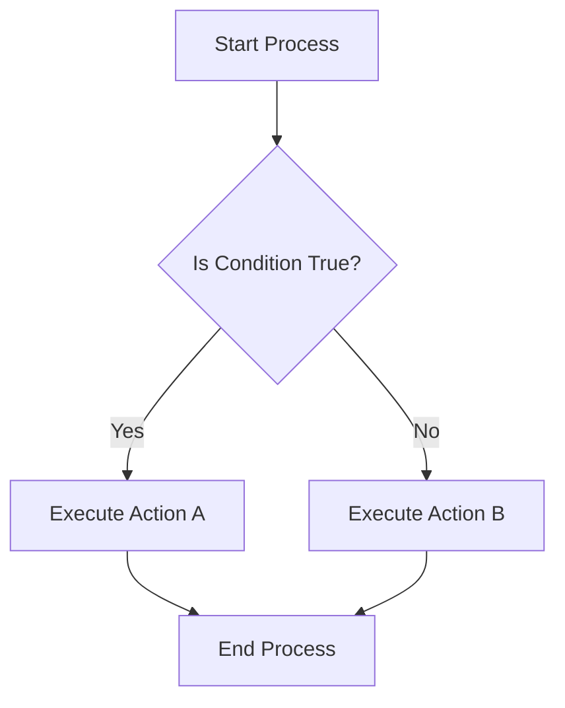

# Definition
Before proceeding, ensure you master [[Control_Statements_Overview]] and Boolean_Logic.
Branching statements, also known as selection or decision-making statements, are programming constructs that allow a program to execute different blocks of code based on whether a specified condition evaluates to true or false. Instead of proceeding linearly, the program "branches off" to an alternative path. A simpler way to understand it is like encountering a fork in the road: you look at a sign (the condition), and based on what it says, you choose to go left or right.

# The Mental Model
Imagine you are at an airport security checkpoint. The "condition" is whether your bag contains prohibited items. If the condition (prohibited items present) is true, your bag goes down one conveyor belt for further inspection (one branch of execution). If the condition is false, your bag goes down another conveyor belt directly to baggage claim (the other branch). This choice, dictated by a condition, is the essence of a branching statement.


```text
// Scenario 1: Condition is True
// Output:
// (A visual representation of the flowchart showing the decision process and paths.)
// Start Process -> Is Condition True? (Yes) -> Execute Action A -> End Process.
// This path shows the program taking the 'Yes' branch based on the condition.

// Scenario 2: Condition is False
// Output:
// Start Process -> Is Condition True? (No) -> Execute Action B -> End Process.
// This path shows the program taking the 'No' branch, illustrating the alternative execution path.
```
*Note: This `flowchart` visually represents how a program's execution flow can diverge based on a binary decision.*

# Context & Framework
### The Transformation: Before and After
Branching statements fundamentally alter a program's behavior by making its execution path conditional. Before a branching statement, the program's flow is linear. After it, the program's state and subsequent actions depend entirely on the outcome of the evaluated condition. This introduces dynamism; the same program can produce different results or take different actions with varying inputs, effectively "transforming" its operational path based on real-time data or logic. This ability to adapt is a cornerstone of intelligent software.

# The Mastery Deep Dive
### Follow the Ball: A Slow-Motion Trace
Consider a simple program that determines if a student passed an exam. The "ball" (program execution) starts. It encounters a branching statement: `if (score >= 50)`.
1.  **Condition Evaluation:** The program evaluates `score >= 50`.
2.  **Path Selection (True):** If the score is 75, `75 >= 50` is true. The program "ball" goes down the `if` branch. It prints "Pass."
3.  **Path Selection (False):** If the score is 40, `40 >= 50` is false. The program "ball" goes down the `else` branch. It prints "Fail."
4.  **Convergence:** Regardless of the path taken, the "ball" eventually converges back to a single point after the branching statement, and the rest of the program continues. This trace shows how a single decision point creates mutually exclusive execution paths.

### The Reality Check: Theory vs. Real Life
In theory, branching statements are simple true/false decisions. In real-life programming, the complexity arises when conditions involve multiple logical operators (`&&`, `||`, `!`), or when conditions are themselves the result of complex function calls. Performance can be impacted by the cost of evaluating complex conditions, or by cache misses if different branches access widely disparate memory locations. Moreover, security vulnerabilities often stem from inadequate branching logic that fails to properly validate inputs, allowing malicious paths to be exploited. Therefore, while theoretically simple, practical application demands rigor.

# Constraints & Limitations
While powerful, the elegance of branching statements can be lost if not managed carefully. Overly complex boolean expressions can be difficult to read and debug. Furthermore, deeply `nested if-else` structures can lead to code that is hard to follow and modify, a phenomenon often referred to as "arrow code" due to the visual indentation. Unhandled conditions are also a significant constraint; if a program doesn't account for all possible outcomes of a condition, it can lead to unexpected behavior or crashes for edge cases.

# Significance & Application
Branching statements are fundamental to almost every software application. They enable input validation (e.g., "if password is correct, grant access"), error handling (e.g., "if file not found, display error"), and feature toggling (e.g., "if user is premium, unlock feature"). From the simplest calculator distinguishing between addition and subtraction, to sophisticated AI systems making strategic decisions, branching statements are the core mechanism that allows programs to react intelligently and dynamically to varied situations and data.

# The Worked Example
Consider a C++ program that prompts a user for a number and determines if it is positive, negative, or zero. This explicitly demonstrates three distinct branching paths.

```cpp
```cpp
#include <iostream> // For input/output operations

int main() {
    int num; // Declare an integer variable to store the user's number

    // Prompt the user to enter a number
    std::cout << "Enter an integer: ";
    // Read the user's input and store it in 'num'
    std::cin >> num;

    // Start of branching logic:
    // First condition: Check if the number is greater than 0 (positive)
    if (num > 0) {
        std::cout << "The number " << num << " is positive.\n";
    }
    // Else if condition: If the first condition is false, check if the number is less than 0 (negative)
    else if (num < 0) {
        std::cout << "The number " << num << " is negative.\n";
    }
    // Else condition: If neither of the above conditions is true, the number must be 0
    else {
        std::cout << "The number " << num << " is zero.\n";
    }

    return 0; // Indicate successful program execution
}
```
```text
// Scenario 1: User enters a positive number.
// Input:
// 15
// Output:
// Enter an integer: 15
// The number 15 is positive.
// This demonstrates the first 'if' branch being executed.

// Scenario 2: User enters a negative number.
// Input:
// -7
// Output:
// Enter an integer: -7
// The number -7 is negative.
// This demonstrates the 'else if' branch being executed.

// Scenario 3: User enters zero.
// Input:
// 0
// Output:
// Enter an integer: 0
// The number 0 is zero.
// This demonstrates the final 'else' branch being executed.
```
*Note: This C++ program uses `if-else if-else` to illustrate how branching statements allow for three distinct execution paths based on the value of `num`.*

# The Proving Ground
*Test your mastery. Cover the solutions below to test yourself first.*

### Level 1: The Sanity Check (Verification)
**The Question:** In the context of program flow, what is the fundamental action performed by a branching statement?
> **Solution:** A branching statement allows a program to choose and execute different blocks of code based on whether a given logical condition is true or false.

### Level 2: The Crucible (Mastery & Edge Cases)
**The Scenario:** You are writing a program to simulate a simple vending machine. The machine offers items A, B, and C. If a user selects 'A', they get a soda. If they select 'B', they get chips. If they select 'C', they get a candy bar. If they select anything else, the machine should display "Invalid selection". Additionally, if the selection is 'A' but the soda dispenser is empty, it should instead offer a water bottle. Describe how you would structure the branching logic to handle all these conditions, including the edge case for soda availability.
> **Solution:** You would typically use a `switch` statement for the primary selection of items A, B, or C, with a `default` case for invalid selections. Inside the `case 'A'` block for soda, you would then use a `nested if-else` statement to check `if (soda_dispenser_empty) { offer_water(); } else { dispense_soda(); }`. This combines a `switch` for main choices with a nested `if-else` for a specific item's sub-condition.

# Key Takeaways
*   Branching statements introduce decision-making into program execution, allowing for alternative code paths based on conditions.
*   They transform linear program flow into dynamic, responsive behavior, enabling adaptation to various inputs and states.
*   Common branching mechanisms include `if-else` structures, `switch` statements, and the `conditional (ternary)` operator.

# Knowledge Graph Connections
| Concept                     | Connection / Relationship                                                                   |
| :
-------------------------- | :
------------------------------------------------------------------------------------------ |
| [[Control_Statements_Overview]] | Branching statements are a fundamental type of control statement.                         |
| [[If_Else_Statement]]       | The `if-else` statement is a primary construct for implementing branching logic.            |
| [[Conditional_Operator]]    | The conditional operator provides a compact syntax for simple branching decisions.          |
| [[Switch_Statement]]        | The `switch` statement offers an alternative way to implement multi-way branching.          |
| Boolean_Logic           | Branching statements rely on boolean logic to evaluate conditions for path selection.       |
---