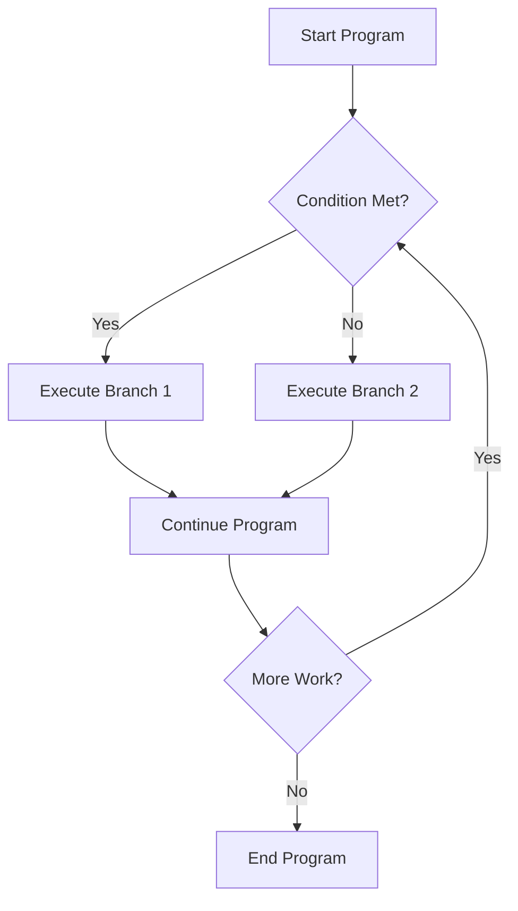

# Definition
Before proceeding, ensure you master C++_Fundamentals and Program_Structure.
Control statements are fundamental programming constructs that dictate the order in which individual instructions or blocks of code are executed. This sequential execution order is commonly referred to as **flow control**. Without control statements, a program would simply execute instructions linearly from top to bottom, making it impossible to implement decision-making, repetitive tasks, or respond dynamically to inputs. A simpler way to understand it is like the traffic lights and signs at an intersection: they direct the flow of vehicles, deciding which path to take or when to stop and go, preventing chaos and ensuring smooth operation.

# The Mental Model
Imagine you are following a recipe to bake a cake. The recipe provides instructions (statements), but sometimes it says, "If using fresh fruit, wash and chop it, otherwise use canned fruit." Or, "Repeat mixing until smooth." These are control statements. They tell you to either choose one set of instructions over another (branching) or to perform a set of instructions multiple times (looping), guiding your path through the recipe based on conditions.


```text
// Scenario 1: Basic Program Flow
// Output:
// (A visual representation of the flowchart showing the decision process and branching paths.)
// Start Program -> Condition Met? (No) -> Execute Branch 2 -> Continue Program -> More Work? (No) -> End Program.
// This path illustrates a simple conditional execution leading to termination.

// Scenario 2: Iterative Program Flow
// Output:
// Start Program -> Condition Met? (Yes) -> Execute Branch 1 -> Continue Program -> More Work? (Yes) -> Condition Met? (Yes) -> Execute Branch 1 -> Continue Program -> More Work? (No) -> End Program.
// This path shows a loop-like behavior, where work is repeated based on a condition until an exit criteria is met.
```
*Note: This `flowchart` illustrates how control statements guide a program through decision points and repetitive tasks.*

# Context & Framework
### The Language's GPS
Control statements serve as the **GPS of a programming language**, allowing the developer to explicitly define the execution path. They enable programs to be dynamic, responding to user input, data values, or external events. This is achieved by creating distinct sections of code that are executed only when certain conditions are met (branching), or by repeatedly executing a block of code until a specific state is achieved (looping). Without this capability, programs would be rigid and unable to perform complex, adaptive tasks.

# The Mastery Deep Dive
### The Family Tree
Control statements in C++ primarily fall into two major categories: **branching statements** (also known as selection or decision-making statements) and **loop statements** (also known as iteration statements).
*   **Branching Statements:** These allow the program to choose between alternate paths of execution based on the outcome of a logical condition. If a condition is true, one set of statements is executed; if false, a different set (or no set) may be executed. Key examples include the `if`, `if-else`, `multiway if-else`, `switch`, and `conditional (ternary)` operators.
*   **Loop Statements:** These specify computations that need to be repeated until a certain logical condition is satisfied. They are essential for tasks requiring repetition, such as processing lists of items, reading input until a specific value is entered, or performing calculations until a convergence criterion is met. Common loop types in C++ are `for`, `while`, and `do-while` loops.

### The Cheat Code: How to Remember This
Think of control statements as traffic management for your code.
*   **Branching = Road Forks:** You come to a fork in the road and choose one path or another based on a sign (condition). `If` you see a sign, turn left; `else` go straight.
*   **Looping = Roundabouts/Repeats:** You go around a roundabout `while` there are still exits you need to take, or you repeat a task `for` a specific number of times.

# Constraints & Limitations
While powerful, the misuse or misunderstanding of control statements can lead to **unstructured program flow**. Overly complex nesting of `if-else` statements, or poorly constructed loops, can make code hard to read, debug, and maintain. This is often referred to as "spaghetti code." The lack of clear control flow can obscure the program's logic, making it prone to errors and difficult to modify without introducing new bugs. Therefore, thoughtful design and adherence to best practices are crucial when employing these constructs.

# Significance & Application
Control statements are the bedrock of all algorithmic thinking. From simple applications that greet users differently based on time of day, to complex operating systems managing countless processes, the ability to control program flow is paramount. They enable error handling, data validation, repetitive computations, and the implementation of sophisticated decision-making algorithms that underpin artificial intelligence and machine learning. Mastery of these concepts is non-negotiable for any aspiring programmer.

# The Worked Example
Consider a simple C++ program that needs to check a user's age and determine if they are old enough to vote (assuming the voting age is 18) and also count how many times it asks for input until a valid age (positive number) is given.

```cpp
```cpp
#include <iostream>

int main() {
    int age;
    int attempts = 0; // Initialize a counter for attempts

    // Loop to continuously ask for age until a positive number is entered
    // This is a do-while loop because we want to ask for input at least once.
    do {
        std::cout << "Please enter your age: ";
        std::cin >> age;
        attempts++; // Increment attempt counter

        // Branching statement: if the age is not positive, inform the user
        if (age <= 0) {
            std::cout << "Age cannot be zero or negative. Please try again.\n";
        }
    } while (age <= 0); // Condition to repeat the loop: age is not positive

    // Branching statement: check if the user is old enough to vote
    if (age >= 18) {
        std::cout << "You are " << age << " years old. You are eligible to vote!\n";
    } else {
        std::cout << "You are " << age << " years old. You are not yet eligible to vote.\n";
    }

    std::cout << "It took you " << attempts << " attempt(s) to enter a valid age.\n";

    return 0;
}
```
```text
// Scenario 1: User enters invalid age then valid age.
// Input:
// -5
// 10
// 20
// Output:
// Please enter your age: -5
// Age cannot be zero or negative. Please try again.
// Please enter your age: 10
// You are 10 years old. You are not yet eligible to vote.
// It took you 2 attempt(s) to enter a valid age.
// This scenario demonstrates the do-while loop handling invalid input, and then the if-else branch for voting eligibility.

// Scenario 2: User immediately enters a valid age.
// Input:
// 25
// Output:
// Please enter your age: 25
// You are 25 years old. You are eligible to vote!
// It took you 1 attempt(s) to enter a valid age.
// This scenario shows a single pass through the do-while loop and the correct if-else branch for voting.
```
*Note: This C++ program demonstrates both looping (`do-while`) for input validation and branching (`if-else`) for eligibility checks, showcasing how these fundamental control statements work together.*

# The Proving Ground
*Test your mastery. Cover the solutions below to test yourself first.*

### Level 1: The Sanity Check (Verification)
**The Question:** In a C++ program, what is the primary role of a control statement?
> **Solution:** Control statements dictate the order in which a program's instructions are executed, enabling decision-making, repetition, and dynamic responses.

### Level 2: The Crucible (Mastery & Edge Cases)
**The Scenario:** You are designing a system where a user's input must be validated before proceeding. If the input is invalid, they must be prompted again, up to a maximum of three attempts. Additionally, if the input is a specific "magic number" (e.g., 99), a special message should be displayed. How would you combine different control statements to achieve this, considering the constraints of limited attempts and special handling?
> **Solution:** You would typically use a `for` loop or `while` loop to manage the maximum of three attempts. Inside the loop, an `if-else if-else` structure or a `switch` statement would be used for input validation and to check for the "magic number". If the input is invalid and attempts remain, a `continue` statement might be used to skip to the next iteration. If the input is valid, a `break` statement could exit the loop. The "magic number" check would be an `else if` condition or a specific `case` within the `switch`.

# Key Takeaways
*   Control statements are essential programming constructs that determine the flow of execution, enabling programs to make decisions and repeat actions.
*   They are broadly categorized into **branching (selection) statements** (`if-else`, `switch`) for choosing execution paths and **looping (iteration) statements** (`for`, `while`, `do-while`) for repetitive tasks.
*   Mastery of control flow is critical for writing dynamic, efficient, and maintainable C++ programs, allowing for complex logic and interaction.

# Knowledge Graph Connections
| Concept                     | Connection / Relationship                                                                                                           |
| :
-------------------------- | :
---------------------------------------------------------------------------------------------------------------------------------- |
| [[Branching_Statements]]    | Control statements encompass branching mechanisms that allow for conditional execution paths.                                         |
| Loops                   | Control statements include loops, which enable code to be executed repeatedly based on a condition.                                 |
| C++_Fundamentals        | Understanding control statements is fundamental to writing effective and logical C++ programs.                                        |
| Program_Structure       | Control statements are integral to defining the logical structure and behavior of a program.                                          |
---