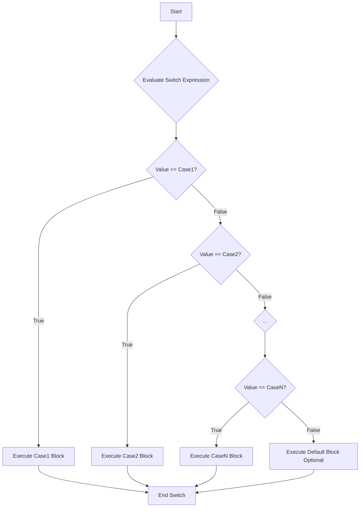

# Definition
Before proceeding, ensure you master [[Branching_Statements]] and Integral_Types.
The `switch` statement in C++ provides a multiway branch that allows a program to execute different blocks of code based on the value of a single controlling expression. It's an efficient and often more readable alternative to a long `if-else if` ladder when you need to compare an integral-type variable (like `int`, `char`, `enum`) against several constant, discrete values. Think of it as a routing station: a package (the controlling expression's value) arrives, and based on its label (a `case` value), it's directed down a specific path.

# The Mental Model
Imagine a receptionist directing visitors. Each visitor has a "purpose" (the controlling expression). The receptionist has a list of "offices" (the `case` labels). If the purpose matches an office, the visitor is directed there. If no match is found, they are directed to a "general inquiries" desk (`default`).


*Note: This `flowchart TD` illustrates the execution flow of a `switch` statement. The switch expression is evaluated, and its value is sequentially compared against each `case` label. The first matching `case` block is executed, and typically `break` statements (not shown in simple flow) are used to exit the switch structure after a match.*

# Context & Framework
### Follow the Ball: A Slow-Motion Trace
When a `switch` statement is encountered, the controlling expression (an integral expression) is evaluated once. Its value is then compared, in sequence, with the constant values provided in each `case` label. If a match is found, program execution "jumps" to the first statement within that `case` block. Execution then proceeds sequentially through that `case` block and any subsequent `case` blocks (this is known as "fall-through") until a `break` statement is encountered or the end of the `switch` statement is reached. If no `case` label matches, and a `default` label is present, execution jumps to the `default` block. If no `default` is present, the entire `switch` statement is skipped.

# The Mastery Deep Dive
### The Exploded View
The `switch` statement consists of the `switch` keyword followed by a parenthesized controlling expression, and then a block of code enclosed in curly braces. Inside this block are `case` labels, each with a constant integral value, followed by a colon and the statements to be executed for that case. An optional `default` label provides a fallback for non-matching cases. The controlling expression's value determines the entry point into the `switch` block. Crucially, without `break` statements, execution "falls through" from one `case` to the next, which is often a desired feature (e.g., handling multiple inputs with the same outcome) but can also be a common source of bugs if unintended.

### Component Interactions
The primary interaction in a `switch` statement is the single evaluation of the controlling expression, whose result acts as the selector. This value is compared against each `case` constant. A direct match directs the flow to that `case`. If `break` is present, it forces an immediate exit from the entire `switch` construct after a `case` block is executed. If `break` is absent, the execution flow continues into subsequent `case` blocks. The `default` case is a special interaction, acting as a final `else` for unmatched conditions. This interplay of expression, cases, and `break` (`default`) provides a powerful and structured multiway decision mechanism.

# Constraints & Limitations
### The Engineering Trade-off
The `switch` statement is limited in that its controlling expression must evaluate to an integral type (e.g., `int`, `char`, `enum`), and `case` labels must be constant integral expressions. It cannot be used with floating-point numbers, strings directly (though string `if-else if` or `map` could be used), or complex boolean conditions. This makes it less flexible than an `if-else if` ladder, which can use any boolean expression. However, for suitable scenarios (e.g., menu selections, state handling based on discrete values), `switch` statements can be more readable and compilers can often optimize them more effectively than long `if-else if` chains.

# Significance & Application
`switch` statements are widely used in C++ for scenarios involving discrete choices:
*   **Menu-Driven Programs:** Implementing user selection for various options.
*   **State Machines:** Handling different program states based on a state variable.
*   **Command Parsers:** Processing different commands or arguments.
*   **Event Handling:** Responding to different event types.
*   **Grade Calculation (Specific):** Assigning grades based on a specific numerical score (e.g., 90=A, 80=B) rather than ranges.
They provide a clean and organized way to manage multiple conditional paths, especially when the conditions are based on comparing a single value to a set of fixed possibilities.

# The Worked Example
This example demonstrates a C++ program that uses a `switch` statement to implement a simple menu for basic arithmetic operations.

```cpp
#include <iostream> // Include the iostream library for input and output operations

int main() {
    int choice; // Variable to store the user's menu choice
    double num1 = 10.0; // First operand
    double num2 = 5.0;  // Second operand

    std::cout << "Simple Calculator Menu:\n";
    std::cout << "1. Add\n";
    std::cout << "2. Subtract\n";
    std::cout << "3. Multiply\n";
    std::cout << "4. Divide\n";
    std::cout << "Enter your choice (1-4): ";
    std::cin >> choice; // Read the user's choice

    // The switch statement controls execution based on the 'choice' variable
    switch (choice) {
        case 1: // If choice is 1
            std::cout << "Result: " << num1 << " + " << num2 << " = " << (num1 + num2) << std::endl;
            break; // Exit the switch statement
        case 2: // If choice is 2
            std::cout << "Result: " << num1 << " - " << num2 << " = " << (num1 - num2) << std::endl;
            break; // Exit the switch statement
        case 3: // If choice is 3
            std::cout << "Result: " << num1 << " * " << num2 << " = " << (num1 * num2) << std::endl;
            break; // Exit the switch statement
        case 4: // If choice is 4
            // Check for division by zero before performing division
            if (num2 != 0) {
                std::cout << "Result: " << num1 << " / " << num2 << " = " << (num1 / num2) << std::endl;
            } else {
                std::cout << "Error: Division by zero is not allowed." << std::endl;
            }
            break; // Exit the switch statement
        default: // If choice does not match any case
            std::cout << "Invalid choice. Please enter a number between 1 and 4." << std::endl;
            break; // Exit the switch statement
    }

    return 0; // Indicate successful program execution
}
```
```text
// Scenario 1: User enters 1 (Add)
// Output:
// Simple Calculator Menu:
// 1. Add
// 2. Subtract
// 3. Multiply
// 4. Divide
// Enter your choice (1-4): 1
// Result: 10 + 5 = 15

// Scenario 2: User enters 4 (Divide), and num2 = 5.0
// Output:
// Simple Calculator Menu:
// 1. Add
// 2. Subtract
// 3. Multiply
// 4. Divide
// Enter your choice (1-4): 4
// Result: 10 / 5 = 2

// Scenario 3: User enters an invalid choice, e.g., 5
// Output:
// Simple Calculator Menu:
// 1. Add
// 2. Subtract
// 3. Multiply
// 4. Divide
// Enter your choice (1-4): 5
// Invalid choice. Please enter a number between 1 and 4.
```
*Note: This C++ code effectively uses a `switch` statement to direct program flow based on user input, executing a different arithmetic operation for each valid choice. The `break` statements ensure that only the selected case's code is executed.*

# The Proving Ground
*Test your mastery. Cover the solutions below to test yourself first.*

### Level 1: The Sanity Check (Verification)
**The Component Check:** What is the primary purpose of a `switch` statement in C++, and what type of expression is typically used as its controlling expression?
> **Solution:** The primary purpose of a `switch` statement is to provide a multiway branch, allowing a program to choose between different execution paths based on the value of a single expression. The controlling expression typically evaluates to an integral type (e.g., `int`, `char`, `enum`).

### Level 2: The Crucible (Mastery & Edge Cases)
**The Broken System:** A menu-driven program uses a `switch` statement to handle user choices (1 for "Save", 2 for "Load", 3 for "Exit"). If the developer forgets to include `break` statements after each `case`, describe the unexpected behavior that would occur if the user selects option 1 ("Save"). Explain why this happens, referring to the "fall-through" mechanism.
> **Solution:** If the user selects option 1 ("Save") and `break` statements are forgotten, the program will exhibit "fall-through" behavior. This means that after executing the code for `case 1`, the program will *continue* to execute the code for `case 2`, then `case 3`, and potentially the `default` case, all sequentially.
>
> For example, if selecting option 1 was intended to just "Save," the program would:
> 1.  Execute the code for "Save".
> 2.  Then, without stopping, it would immediately execute the code for "Load".
> 3.  Then, it would execute the code for "Exit".
> 4.  And finally, if a `default` case was present, it might execute that too, until it reaches the end of the `switch` block.
>
> This happens because the `case` labels in a `switch` statement only indicate *entry points* for execution. Without a `break` statement, the control flow does not automatically exit the `switch` block; it simply "falls through" to the next `case` label and continues executing statements until a `break` is encountered or the `switch` block ends. (Related to `A.1.4.2.a. The "Fairness Doctrine"` and `A.1.4.4. Factual & Semantic Accuracy`)

# Key Takeaways
*   The `switch` statement offers a clear, multiway branching mechanism based on the discrete value of an integral controlling expression.
*   `case` labels serve as entry points, and `break` statements are essential to prevent unintended "fall-through" into subsequent cases.
*   It is particularly effective for menu systems, state handling, and other scenarios where a single variable needs to be compared against a set of constant values.

# Knowledge Graph Connections
| Concept                     | Connection / Relationship                                                                   |
| :
-------------------------- | :
------------------------------------------------------------------------------------------ |
| [[Branching_Statements]]    | `switch` is a specialized form of branching for multiple discrete choices.                  |
| Integral_Types          | The controlling expression of a `switch` statement must evaluate to an integral type.       |
| [[Break_Statement]]         | Crucial for terminating execution within a `switch` statement after a `case` is handled.    |
| [[Multiway_If_Else_Statements]] | Often an alternative to a `switch` statement, especially for non-integral conditions or ranges. |
---