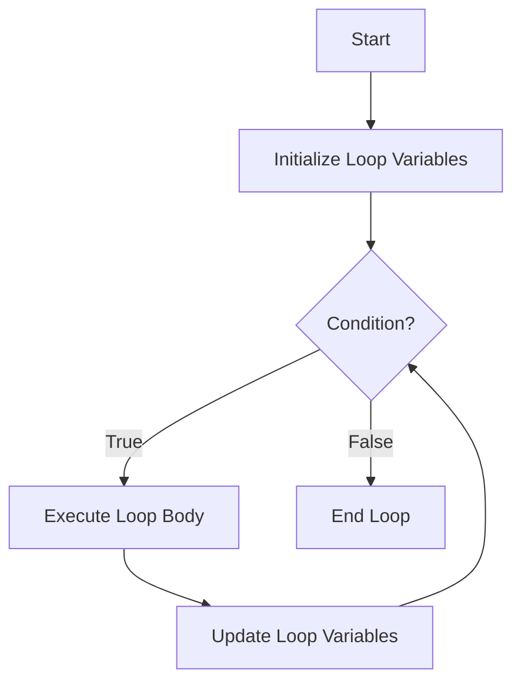

# Definition
Before proceeding, ensure you master [[Loop_Statements]] and Boolean_Expressions.
The `while` loop is a fundamental iteration statement in C++ that repeatedly executes a block of code as long as a specified boolean condition remains `true`. It is an "entry-controlled loop," meaning the condition is evaluated *before* each iteration of the loop body. If the condition is initially `false`, the loop body will not execute even once. It's like checking the weather before you leave: "While it is raining, keep your umbrella open." If it's not raining initially, you never open the umbrella.

# The Mental Model
Imagine you have a stack of papers to grade. The `condition` is "Are there still papers in the stack?" `While` this condition is `true`, you `grade the top paper` (loop body) and then `remove it from the stack` (update). If the stack is empty to begin with, you don't grade any papers.


*Note: This `flowchart TD` illustrates the execution flow of a `while` loop. After initialization, the condition is checked. If true, the loop body executes, variables are updated, and the condition is re-checked. If false, the loop terminates. This highlights the "entry-controlled" nature of the `while` loop.*

# Context & Framework
### Follow the Ball: A Slow-Motion Trace
Execution of a `while` loop begins with an optional initialization step outside the loop. The program then enters the loop and immediately evaluates the boolean `condition` enclosed in parentheses. If the `condition` is `true`, the `loop body` (a single statement or a compound block) is executed. After the `loop body` completes, it is crucial that some `update action` occurs within the body to change the state of variables involved in the `condition`. Following the update, control returns to the `condition` evaluation. This cycle continues until the `condition` evaluates to `false`, at which point the loop terminates, and execution proceeds to the statement immediately following the `while` loop.

# The Mastery Deep Dive
### The Exploded View
The `while` loop is characterized by its simplicity and flexibility. It needs only two core elements: the `while` keyword and a boolean expression (its condition). The loop body, which can be any single statement or compound block, is entirely controlled by this condition. Because the condition is checked *before* any iteration, `while` loops are perfect for scenarios where the loop might not need to execute at all. This "zero-or-more-times" execution pattern makes it ideal for tasks where the number of iterations isn't known beforehand, such as reading user input until a specific value is entered.

### Component Interactions
The critical interaction in a `while` loop is the continuous re-evaluation of its boolean condition. The loop body and any internal update expressions (`counter++`, `sum += value`, etc.) work together to influence the state of the variables within that condition. Each successful iteration of the body must eventually modify these variables such that the condition will eventually become `false`. If the loop body fails to modify the relevant variables, or modifies them in a way that the condition perpetually remains `true`, an infinite loop occurs, where the loop never terminates.

# Constraints & Limitations
### The Engineering Trade-off
While `while` loops are highly flexible, they can sometimes be less concise than `for` loops for simple counting tasks, as initialization and update steps often reside separately from the `while` keyword. A common pitfall is forgetting the update expression within the loop body, which invariably leads to an infinite loop, consuming system resources and freezing the program. The trade-off is between the `while` loop's power for indefinite iteration (when the number of iterations is unknown) and the structured conciseness of `for` loops for definite iteration (when the number of iterations is known or easily calculable).

# Significance & Application
`while` loops are widely used in C++ for scenarios where the number of iterations is not predetermined:
*   **User Input Validation:** Repeatedly prompting for input until valid data is provided.
*   **Reading Files:** Processing lines or records from a file until the end of the file is reached.
*   **Game Loops:** Running the main game logic repeatedly as long as the game is active.
*   **Network Communication:** Continuously listening for incoming data until a disconnect signal.
*   **Algorithm Implementations:** Many algorithms, especially those involving searching or sorting, naturally lend themselves to `while` loop structures where termination depends on reaching a specific state.
Their adaptability makes them a fundamental tool for controlling repetitive actions based on dynamic conditions.

# The Worked Example
This example demonstrates a C++ program that continuously accepts numerical input from the user and calculates their sum until the user enters `0`, using a `while` loop.

```cpp
#include <iostream> // Include the iostream library for input and output operations

int main() {
    int num;     // Variable to store each number entered by the user
    int sum = 0; // Accumulator for the total sum

    std::cout << "Enter numbers to sum (enter 0 to stop):" << std::endl;

    // First input prompt, *before* the loop
    std::cout << "Enter a number: ";
    std::cin >> num; // Read the first number

    // While loop: continues as long as 'num' is not 0
    while (num != 0) { // Loop Condition (entry-controlled)
        sum += num; // Loop Body: add the current number to sum
        // Update expression: prompt for and read the next number inside the loop
        std::cout << "Enter a number: ";
        std::cin >> num;
    }

    std::cout << "Loop ended. Total sum: " << sum << std::endl;

    return 0; // Indicate successful program execution
}
```
```text
// Scenario 1: User enters 10, 5, -2, 0
// Output:
// Enter numbers to sum (enter 0 to stop):
// Enter a number: 10
// Enter a number: 5
// Enter a number: -2
// Enter a number: 0
// Loop ended. Total sum: 13

// Scenario 2: User enters 0 immediately
// Output:
// Enter numbers to sum (enter 0 to stop):
// Enter a number: 0
// Loop ended. Total sum: 0
```
*Note: This code demonstrates an entry-controlled `while` loop for processing user input until a specific sentinel value (0) is entered. The loop ensures that the condition `num != 0` is checked before each iteration.*

# The Proving Ground
*Test your mastery. Cover the solutions below to test yourself first.*

### Level 1: The Sanity Check (Verification)
**The Component Check:** Describe the execution flow of a `while` loop, specifically highlighting when its condition is evaluated.
> **Solution:** In a `while` loop, the boolean condition is evaluated *before* each iteration of the loop body. If the condition is `true`, the loop body executes. After the loop body completes, the condition is re-evaluated. This cycle continues until the condition becomes `false`, at which point the loop terminates, and execution continues after the loop. If the condition is initially `false`, the loop body never executes.

### Level 2: The Crucible (Mastery & Edge Cases)
**The Broken System:** A program is designed to repeatedly ask for user input until a positive number is entered. The developer used a `while` loop, but the prompt for input appears only once, even if the user enters negative numbers multiple times. Explain what typical mistake in a `while` loop's structure would cause this, and how to correct it so the prompt is displayed for every invalid input.
> **Solution:** The typical mistake causing the prompt to appear only once is placing the *initial input prompt outside the loop* but failing to *repeat the input prompt within the loop's body* before the next condition check.
>
> **Example of the mistake:**
> --- START_CODE:cpp ---
> #include <iostream>
> int main() {
>     int num;
>     std::cout << "Enter a positive number: "; // Prompt outside loop
>     std::cin >> num;
>     while (num <= 0) { // Condition: loop while num is not positive
>         // No prompt here for subsequent invalid inputs
>         std::cin >> num; // Only reads input, doesn't prompt again
>     }
>     std::cout << "You entered: " << num << std::endl;
>     return 0;
> }
> --- END_CODE:cpp ---
>
> **Explanation:** The first `std::cout` and `std::cin` occur before the loop. If `num` is negative, the loop enters. Inside the loop, `std::cin >> num;` will wait for input, but the user doesn't see a new prompt. They have to guess to enter another number.
>
> **Correction:** The input prompt must be placed *inside* the loop, ensuring it is displayed for every iteration where invalid input is detected.
>
> --- START_CODE:cpp ---
> #include <iostream>
> int main() {
>     int num;
>     // The first prompt can be here, OR the loop can be a do-while.
>     // For a while loop, it's often cleaner to prompt once, then loop if invalid.
>     std::cout << "Enter a positive number: ";
>     std::cin >> num;
>     while (num <= 0) { // Condition: loop while num is not positive
>         std::cout << "Invalid input. Please enter a POSITIVE number: "; // Prompt for invalid input
>         std::cin >> num;
>     }
>     std::cout << "You entered: " << num << std::endl;
>     return 0;
> }
> --- END_CODE:cpp ---
> Or, perhaps even better for this specific use case, a `do-while` loop could be used, which guarantees the prompt (and input) occurs at least once. (Related to `A.1.4.2.a. The "Fairness Doctrine"` and `A.1.4.4. Factual & Semantic Accuracy`)

# Key Takeaways
*   The `while` loop is an entry-controlled loop, evaluating its condition *before* each iteration, allowing for zero executions if the condition is initially false.
*   It is highly flexible and best suited for scenarios where the number of iterations is unknown and depends on a dynamic condition (e.g., user input, file status).
*   Careful management of the loop's condition and ensuring an update within the loop body are critical to avoid infinite loops and ensure correct termination.

# Knowledge Graph Connections
| Concept                     | Connection / Relationship                                                                   |
| :
-------------------------- | :
------------------------------------------------------------------------------------------ |
| [[Loop_Statements]]         | `while` is one of the three primary types of loop statements.                               |
| Boolean_Expressions     | The continuation of a `while` loop is entirely governed by its boolean expression.          |
| [[Do_While_Loop]]           | Contrasts with `do-while` in that `while` checks the condition at the start of iteration.   |
| [[Loop_Pitfalls]]           | Common mistakes include infinite loops due to improper condition management or missing updates. |
| [[Break_Statement]]         | Can be used to prematurely terminate a `while` loop based on an internal condition.         |
---