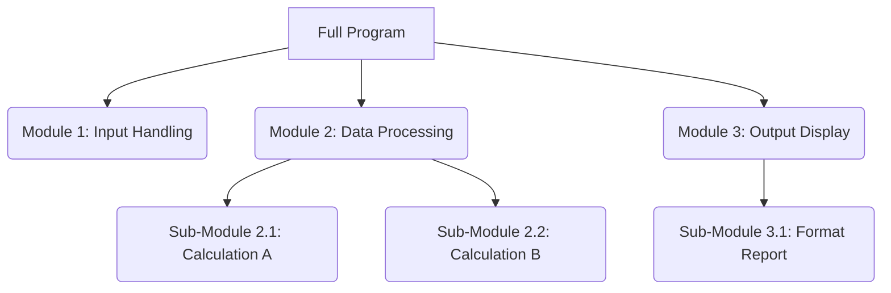

# Definition
Before proceeding, ensure you master Computer_Programming and Basic_Elements_Of_C++ as Modular Programming builds upon these foundational concepts to create organized and efficient code.
Modular Programming is an approach to software design that breaks down a program into individual, independent, and interchangeable components, often called modules or functions. Each module performs a specific task and can be developed, tested, and maintained separately. A simpler way to think about it is like building a complex Lego model: instead of building everything as one giant piece, you construct smaller, functional sections (like the car, the house, or the tree) independently and then connect them to form the complete model.

# The Mental Model
Imagine you're trying to organize a very large library. Instead of having all books piled in one chaotic room, you divide the library into sections: "Fiction," "Non-Fiction," "Reference," etc. Within "Fiction," you have further divisions by genre, and within each genre, by author. Each section (or module) can be managed by a different librarian (developer) without affecting the others, making the whole library easier to navigate and maintain.


```text
// Scenario 1: Conceptual Program Decomposition
// Output:
// (A visual representation of a flowchart demonstrating how a "Full Program" is broken down into "Module 1: Input Handling", "Module 2: Data Processing", and "Module 3: Output Display". "Module 2" further decomposes into "Sub-Module 2.1: Calculation A" and "Sub-Module 2.2: Calculation B". "Module 3" further decomposes into "Sub-Module 3.1: Format Report".)
// This diagram illustrates the hierarchical breakdown of a large program into smaller, manageable, and focused modules.
```
*Note: This `graph TD` diagram visually represents how a complex program can be decomposed into a hierarchy of independent modules, each with a specific responsibility.*

# Context & Framework
### The Family Tree
Modular programming establishes a hierarchical structure, much like a family tree, where a larger program (the ancestor) consists of smaller, more focused modules (descendants). This decomposition allows for a clear lineage of responsibility, where parent modules orchestrate the actions of their child modules. This structure not only clarifies the program's design but also simplifies the process of identifying where specific functionalities reside, enhancing both development speed and debugging efficiency.

# The Mastery Deep Dive
### Breaking Down the Wall
Breaking down a large, monolithic program into smaller, distinct modules is akin to demolishing a single, massive wall into individual bricks. Each brick (module) has a defined purpose and interface, making it easier to construct, inspect, and replace. This process reduces complexity by isolating different concerns, meaning a change in one module is less likely to break functionality in another. The clear boundaries between modules enforce a disciplined approach to design, preventing tangled dependencies that often plague large, undifferentiated codebases.

### The Lego Block Principle
The concept of modules being programmable and testable independently is similar to the Lego Block Principle. Each Lego block (module) can be snapped together with others, but it can also be tested on its own to ensure it functions as expected before integration. This isolation in testing significantly reduces the time and effort required to identify and fix bugs, as the problem can be pinpointed to a specific, smaller component rather than searching through an entire program. Furthermore, well-designed modules can be reused across different parts of the same program or even in entirely different projects, leading to considerable savings in development time and effort.

# Constraints & Limitations
### The "Too Much Glue" Trap
While modularity offers significant advantages, it's possible to over-modularize a program, leading to the "Too Much Glue" trap. This occurs when modules are too small or too numerous, requiring excessive "glue code" (interfaces, function calls, data conversions) to connect them. The overhead of managing these numerous small modules and their interactions can negate the benefits of modularity, making the program harder to understand, debug, and even slower due to increased function call overhead. Finding the right granularity for modules is a critical design decision.

# Significance & Application
Modular programming is a fundamental practice in software engineering, enabling the creation of large-scale, robust, and maintainable applications. It's applied in almost every domain, from operating systems (where processes are distinct modules) and web browsers (where different components handle rendering, networking, and UI) to complex enterprise applications. Its principles directly contribute to code reusability, easier team collaboration on large projects, and improved system reliability.

# The Worked Example
This conceptual example illustrates how a simple calculator program can be broken down into modular components.

**Problem:** Design a calculator program that can perform addition, subtraction, multiplication, and division.

**Modular Design:**
Instead of one large `main` function handling everything, we can create separate modules (functions) for each operation and for input/output.

1.  **Input Module:** Handles reading numbers from the user.
2.  **Arithmetic Modules:** Separate functions for `add`, `subtract`, `multiply`, `divide`.
3.  **Output Module:** Displays the result to the user.

```cpp
// Modular Calculator Program - Conceptual Example

// 1. Input Module
// Function to get a single number from the user
double get_number() {
    // Logic to prompt user and read a double value
    // For demonstration, let's assume it returns a hardcoded value
    return 10.0;
}

// 2. Arithmetic Modules
// Function for addition
double add(double num1, double num2) {
    return num1 + num2;
}

// Function for subtraction
double subtract(double num1, double num2) {
    return num1 - num2;
}

// Function for multiplication
double multiply(double num1, double num2) {
    return num1 * num2;
}

// Function for division - includes basic error handling for division by zero
double divide(double num1, double num2) {
    if (num2 != 0) {
        return num1 / num2;
    } else {
        // Handle division by zero error
        return 0.0; // Or throw an exception, or return a special error code
    }
}

// 3. Output Module
// Function to display the result
void display_result(double result) {
    // Logic to format and print the result
    // For demonstration, it prints directly
    // std::cout << "The result is: " << result << std::endl;
}

// Main program to orchestrate the modules
int main() {
    double operand1 = get_number(); // Get first number
    double operand2 = get_number(); // Get second number

    double sum_result = add(operand1, operand2);
    display_result(sum_result);

    double product_result = multiply(operand1, operand2);
    display_result(product_result);

    return 0;
}
```
```text
// Scenario 1: Basic Addition and Multiplication
// Input: (Assume get_number() returns 10.0 and then 5.0 for consecutive calls)
// Expected Output (conceptual, as I/O is commented out for simplicity):
// The result is: 15.0
// The result is: 50.0

// Scenario 2: Division by Zero
// Input: (Assume get_number() returns 10.0 and then 0.0)
// Expected Output (conceptual, with division by zero handling):
// The result is: 0.0 (or an error message if more robust error handling was implemented)
```
*Note: This C++ pseudo-code demonstrates the separation of concerns, where each function (module) has a distinct responsibility, making the overall `main` function cleaner and easier to understand.*

# The Proving Ground
*Test your mastery. Cover the solutions below to test yourself first.*

### Level 1: The Sanity Check (Verification)
**The Neighbor Check:** List three key advantages of decomposing a large software project into smaller, independent modules.
> **Solution:** The advantages include easier testing, improved maintainability, and enhanced code reusability.

### Level 2: The Crucible (Mastery & Edge Cases)
**The Sort:** You're tasked with developing a complex e-commerce application. Explain how you would apply modular programming principles to design the system, providing examples of at least three distinct modules and how they would interact.
> **Solution:** I would create modules such as `User_Authentication` (handling login/logout, user sessions), `Product_Catalog` (managing product listings, inventory), and `Order_Processing` (handling shopping cart, checkout, payment). These modules would interact through well-defined interfaces; for instance, `Order_Processing` would rely on `User_Authentication` to verify the user and `Product_Catalog` to retrieve product details and update inventory. Each module could be developed and tested independently.

---