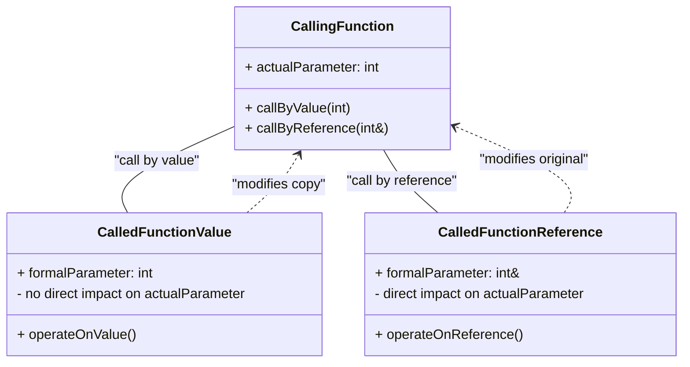

# Definition
Before proceeding, ensure you master [[Functions_C++]] and [[Scope_of_Identifiers]] because parameter passing mechanisms determine how data is exchanged between functions, directly impacting variable scope and modification.
Parameter passing mechanisms in C++ define how arguments (actual parameters) are transferred from a calling function to the parameters (formal parameters) of the called function. The two primary mechanisms are `call by value` and `call by reference`, each having distinct implications for whether the original argument in the caller can be modified. A simpler way to think about it is like giving instructions to someone: `call by value` is like giving them a photocopy of a document – they can write all over it, but your original document is untouched. `Call by reference` is like giving them the original document – any changes they make are directly on your document.

# The Mental Model
Imagine a painter creating a portrait. If you `call by value`, you give the painter a photograph (a copy) of the subject. They can paint on the photo, but the actual person remains unchanged. If you `call by reference`, you give the painter the living person to paint directly. Any changes the painter makes (e.g., adding makeup) directly affect the person themselves.


```text
// Scenario 1: Illustrating Parameter Passing Types
// Output:
// (A visual representation of a class diagram showing:
// - `CallingFunction` with `actualParameter`, `callByValue(int)`, and `callByReference(int&)`.
// - `CalledFunctionValue` with `formalParameter: int` and `operateOnValue()`.
// - `CalledFunctionReference` with `formalParameter: int&` and `operateOnReference()`.
// - Relationship `CallingFunction -- CalledFunctionValue : "call by value"`.
// - Relationship `CallingFunction -- CalledFunctionReference : "call by reference"`.
// - Relationship `CalledFunctionValue ..> CallingFunction : "modifies copy"`.
// - Relationship `CalledFunctionReference ..> CallingFunction : "modifies original"`.
// - Notes: `CalledFunctionValue` has "- no direct impact on actualParameter", and `CalledFunctionReference` has "- direct impact on actualParameter".)
// This diagram visually distinguishes the fundamental differences and impacts of call by value versus call by reference.
```
*Note: This `classDiagram` illustrates the core distinction between `call by value` (where a copy is modified) and `call by reference` (where the original argument is modified), highlighting their respective impacts on the calling function's data.*

# Context & Framework
### Spot the Impostor (Don't be Fooled)
Parameter passing mechanisms are often a source of confusion because they *look* similar in function calls but have fundamentally different behaviors. The key distinction lies in whether the formal parameter in the called function receives a *copy* of the actual argument's value or a *direct reference* (an alias) to the actual argument's memory location. Misunderstanding this difference can lead to bugs where programmers expect changes made within a function to affect the original variable, but they don't, or vice-versa. Accurately identifying which mechanism is in play is crucial for predicting and controlling program state.

# The Mastery Deep Dive
### Value vs. Reference: The Core Distinction
The fundamental difference between `call by value` and `call by reference` centers on how the actual argument's data is made available to the called function. In `call by value`, a separate, independent copy of the argument's value is created and passed to the formal parameter. Any modifications made to this formal parameter within the called function affect only the copy, leaving the original actual argument unchanged. Conversely, in `call by reference`, the formal parameter becomes an `alias` for the actual argument. It directly refers to the same memory location, meaning any changes made to the formal parameter inside the function will *directly* modify the original actual argument in the calling function.

### Choosing the Right Tool
The choice between `call by value` and `call by reference` is a critical design decision with implications for program correctness, efficiency, and clarity.
*   **Call by Value** is generally preferred when:
    *   The function does not need to modify the original argument.
    *   The argument is a small, primitive type (e.g., `int`, `char`, `bool`) where copying overhead is minimal.
    *   Protecting the original data from modification is a priority.
*   **Call by Reference** is typically used when:
    *   The function needs to modify the original argument (e.g., a `swap` function, populating a complex object).
    *   The argument is a large object or complex data structure, where copying would be inefficient in terms of memory and time.
    *   Returning multiple values from a function is desired (by modifying several reference parameters).

Making an informed choice requires understanding both the functional requirements and the performance characteristics of the data being passed.

# Constraints & Limitations
### The "Silent Failure" Trap
A subtle but dangerous trap with parameter passing is the "Silent Failure" when using `call by value` incorrectly. If a programmer *intends* for a function to modify its arguments (e.g., a function to "normalize" a value) but mistakenly uses `call by value` instead of `call by reference`, the function will appear to execute successfully. However, the original arguments in the calling code will remain unchanged, leading to incorrect program behavior that can be difficult to diagnose because no immediate compilation or runtime error is generated. This emphasizes the importance of explicitly defining the function's intent and selecting the parameter passing mechanism that aligns with that intent.

# Significance & Application
Parameter passing mechanisms are fundamental to inter-function communication in C++ and thus to modular programming. They dictate data flow, control side effects, and are crucial for efficiency. Mastery of these mechanisms is essential for correctly designing functions that interact with data in predictable ways, whether for computation, data manipulation, or output. This understanding is critical for writing robust and efficient C++ code in any application domain.

# The Worked Example
This example provides a "kill sheet" comparison table, directly contrasting `call by value` and `call by reference` with clear examples and their impacts.

**The Kill Sheet: Call by Value vs. Call by Reference**

| Feature              | Call by Value                                   | Call by Reference                                | The "Gotcha" Difference                                                  |
| :
------------------- | :
---------------------------------------------- | :
----------------------------------------------- | :
----------------------------------------------------------------------- |
| **Data Transfer**    | A copy of the actual argument's value.          | A direct alias (reference) to the actual argument's memory location. | **Copy vs. Alias**: Copy means isolation, alias means shared memory.   |
| **Modification Impact** | Changes to formal parameter do NOT affect the original actual argument. | Changes to formal parameter DO affect the original actual argument. | **Original vs. Copy**: Whether the original variable changes after the function call. |
| **Syntax**           | `void func(int param)`                          | `void func(int &param)`                          | **Ampersand (`&`)**: Its presence in the formal parameter list signals call by reference. |
| **Overhead**         | Higher for large objects (copying cost).        | Lower for large objects (only address passed).   | **Performance**: Large object copying is expensive; referencing is cheap. |
| **Safety**           | Inherently safer; original data is protected.   | Less safe; original data can be unintentionally modified. | **Data Protection**: Call by value offers implicit protection.           |

This table explicitly highlights the core operational and semantic differences, with a focus on where misunderstandings typically occur.

# The Proving Ground
*Test your mastery. Cover the solutions below to test yourself first.*

### Level 1: The Sanity Check (Verification)
**The Spot the Impostor:** Name the two primary parameter passing mechanisms in C++.
> **Solution:** The two primary parameter passing mechanisms are `call by value` and `call by reference`.

### Level 2: The Crucible (Mastery & Edge Cases)
**The Impostor Test:** You have a C++ function `void update(int x)` that is supposed to increment the value of an integer passed to it. After calling `update` with a variable `my_var`, `my_var` remains unchanged. Explain what parameter passing mechanism was used and why `my_var` wasn't updated. What change would be needed to achieve the intended behavior?
> **Solution:** The parameter passing mechanism used was `call by value`. When `x` was passed by value, a copy of `my_var`'s value was created for `x` within the `update` function. Any increment to `x` only affected this local copy, leaving `my_var` in the calling function unchanged. To achieve the intended behavior (increment `my_var`), `call by reference` should be used by changing the function signature to `void update(int &x)`.

# Key Takeaways
*   Parameter passing mechanisms (`call by value`, `call by reference`) control how arguments are transferred to functions.
*   `Call by value` passes a copy, protecting the original argument from modification.
*   `Call by reference` passes an alias, allowing direct modification of the original argument.
*   The choice of mechanism impacts data integrity, efficiency, and the function's ability to produce side effects on its arguments.

# Knowledge Graph Connections
| Concept                     | Connection / Relationship                                                                   |
| :
-------------------------- | :
------------------------------------------------------------------------------------------ |
| [[Functions_C++]]           | Parameter passing is how functions receive inputs from and potentially modify outputs for their callers. |
| [[Call_by_Value]]           | Call by value is a specific mechanism for parameter passing, emphasizing data copying.      |
| [[Call_by_Reference]]       | Call by reference is another specific mechanism, enabling direct modification of original arguments. |
| [[Scope_of_Identifiers]]    | Parameter passing affects the scope and lifetime of the data within the called function relative to the caller. |
---