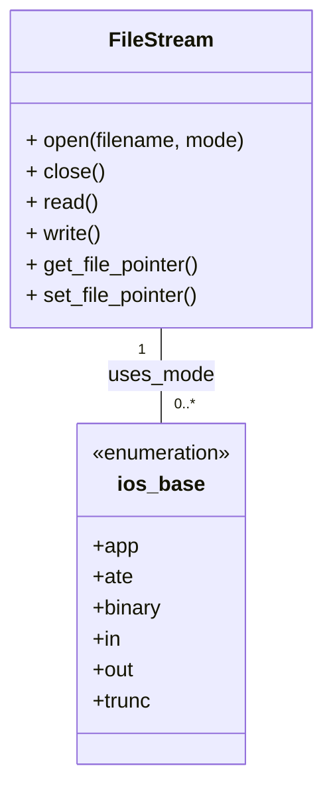

# Definition
Before proceeding, ensure you master File_System and Data_Storage because understanding file access modes fundamentally relies on how operating systems organize and retrieve data from persistent storage.
**File access modes** define how a program interacts with a file, specifying whether it will read data, write data, or both, and where in the file the operations will begin. These modes dictate the permissions and initial positioning of the file pointer. Think of it like opening a book: you can open it to read from the beginning, open it to write new notes at the end, or open it to edit a specific page. Each way you "open" the book (`file access mode`) defines what you can do and where you start. In C++, these modes are typically specified when opening a file stream and control the behavior of subsequent read and write operations.

# The Mental Model
Imagine a cassette tape recorder. You can load a tape to `play` (read) from the beginning, or `record` (write) new audio, which usually starts at the current position or overwrites existing content. You can't randomly jump to the middle and start recording without potentially erasing. This is analogous to how file access modes establish the fundamental interaction rules for file operations.


```text
// Scenario 1: File stream interaction with access modes
// Output:
// (A visual class diagram showing the FileStream class with its basic methods, and the ios_base enumeration representing various file access flags like `in`, `out`, `app`, `binary`, etc., with a relationship indicating FileStream 'uses_mode' from ios_base.)
// This diagram illustrates that a FileStream object interacts with a set of enumerated access flags (modes) to define its behavior.
```
*Note: This `classDiagram` depicts how a `FileStream` object utilizes `ios_base` flags to specify various file access modes, illustrating the conceptual interaction for file operations.*

# Context & Framework
### Opening the Hood: What's Inside?
File access modes are essentially flags or enumerations that you pass to the file stream's `open()` method (or its constructor). These flags combine to define the exact behavior. For instance, `std::ios::in` opens a file for reading, positioning the "get" (read) pointer at the beginning. `std::ios::out` opens for writing, typically truncating (emptying) the file if it exists, and positioning the "put" (write) pointer at the beginning. Other crucial flags include `std::ios::app` (append to end), `std::ios::ate` (at end, but can seek), `std::ios::binary` (open in binary mode), and `std::ios::trunc` (truncate existing file). Understanding these individual flags and how they combine is key to precise file control.

# The Mastery Deep Dive
### How the Parts Talk to Each Other
When you open a file with a specific access mode, the operating system (through the C++ standard library) sets up internal structures to manage that file. Crucially, it establishes one or two **file pointers**:
*   **Get Pointer (read pointer)**: Tracks the current position for reading.
*   **Put Pointer (write pointer)**: Tracks the current position for writing.
Depending on the mode, these pointers are initialized differently. For example, `std::ios::in` sets the get pointer to the beginning. `std::ios::app` sets the put pointer to the end. For read-only (`in`) or write-only (`out`, `app`) streams, only one relevant pointer exists. For read/write streams (`in | out`), both pointers exist and can be manipulated independently (though often synchronized or reset after an operation).

### The Translator: From "Lego" to "Jargon"
Imagine a control panel with various switches (the `std::ios::in`, `std::ios::out`, `std::ios::app` flags). You flip certain switches to configure how your "data-robot" interacts with a "data-vault" (the file). For example, flipping `in` means the robot can only *retrieve* data. Flipping `out` means it can only *deposit* data (and might clear out existing data first). The "Jargon" is that you are specifying **stream open modes** using `std::ios_base::openmode` flags, which determine the **file access permissions** (read, write, append) and the **initial file pointer position** (beginning, end). These modes directly influence whether operations like `read()`, `write()`, `seekg()`, and `seekp()` are valid and how they behave.

# Constraints & Limitations
The primary constraint is that the file access mode must be chosen carefully to match the intended operation. Opening a file for reading (`std::ios::in`) and then attempting to write to it will fail (unless combined with `std::ios::out`). Similarly, opening with `std::ios::out` (which truncates by default) will erase existing file content unless combined with `std::ios::app` or `std::ios::in`. Incorrect mode combinations or attempting operations inconsistent with the chosen mode will lead to stream failures, indicated by error flags (e.g., `fail()`, `bad()`). Operating system permissions also constrain file access; even with the correct C++ mode, a program cannot write to a file if it lacks the necessary OS permissions.

# Significance & Application
File access modes are fundamental to all persistent data operations:
*   **Data Input**: Reading configuration files, loading saved game states, processing input data.
*   **Data Output**: Saving user documents, writing log files, generating reports.
*   **Data Modification**: Appending to existing logs, updating specific records, modifying configuration files.
*   **Security**: Specifying `in` for sensitive read-only data prevents accidental modification.
Choosing the correct file access mode ensures that file operations behave as expected, prevents unintended data loss, and enables efficient interaction with secondary storage.

# The Worked Example
Let's look at different scenarios of opening a file, demonstrating the impact of various file access modes. We'll assume a file named "example.txt" exists with some content.

```cpp
#include <iostream>
#include <fstream>
#include <string>

void createFile(const std::string& filename, const std::string& content) {
    std::ofstream file(filename);
    if (file.is_open()) {
        file << content;
        file.close();
        std::cout << "Created/Reset " << filename << " with content: \"" << content << "\"" << std::endl;
    } else {
        std::cerr << "Error creating " << filename << std::endl;
    }
}

int main() {
    const std::string filename = "test_file.txt";

    // Scenario 1: std::ios::out (default: truncates if exists, creates if not, writes from beginning)
    std::cout << "\n--- Scenario 1: std::ios::out ---" << std::endl;
    createFile(filename, "Initial content.\n");
    std::ofstream file1(filename, std::ios::out); // Opens for writing, truncates existing content
    if (file1.is_open()) {
        file1 << "New content for Scenario 1." << std::endl;
        file1.close();
        std::cout << "Wrote to " << filename << " using std::ios::out." << std::endl;
    } else {
        std::cerr << "Failed to open " << filename << std::endl;
    }
    // Verify content (requires reading back)
    std::ifstream read1(filename);
    std::string line1;
    std::getline(read1, line1);
    std::cout << "Content after Scenario 1: \"" << line1 << "\"" << std::endl;
    read1.close();


    // Scenario 2: std::ios::app (appends to end if exists, creates if not, writes from end)
    std::cout << "\n--- Scenario 2: std::ios::app ---" << std::endl;
    createFile(filename, "Existing data.\n"); // Reset file
    std::ofstream file2(filename, std::ios::app); // Opens for writing, appends to existing content
    if (file2.is_open()) {
        file2 << "Appended content." << std::endl;
        file2.close();
        std::cout << "Wrote to " << filename << " using std::ios::app." << std::endl;
    } else {
        std::cerr << "Failed to open " << filename << std::endl;
    }
    // Verify content
    std::ifstream read2(filename);
    std::string full_content2;
    std::string temp_line2;
    while(std::getline(read2, temp_line2)) {
        full_content2 += temp_line2 + "\n";
    }
    std::cout << "Content after Scenario 2:\n" << full_content2 << std::endl;
    read2.close();


    // Scenario 3: std::ios::in (opens for reading from beginning)
    std::cout << "\n--- Scenario 3: std::ios::in ---" << std::endl;
    createFile(filename, "Data to read.\n"); // Reset file
    std::ifstream file3(filename, std::ios::in); // Opens for reading
    if (file3.is_open()) {
        std::string content;
        std::getline(file3, content);
        std::cout << "Read from " << filename << " using std::ios::in: \"" << content << "\"" << std::endl;
        file3.close();
    } else {
        std::cerr << "Failed to open " << filename << std::endl;
    }

    // Scenario 4: std::ios::in | std::ios::out (opens for both read and write, doesn't truncate by default)
    std::cout << "\n--- Scenario 4: std::ios::in | std::ios::out ---" << std::endl;
    createFile(filename, "Original text here.\n"); // Reset file
    std::fstream file4(filename, std::ios::in | std::ios::out); // Opens for both read/write
    if (file4.is_open()) {
        std::string current_content;
        std::getline(file4, current_content);
        std::cout << "Initial read: \"" << current_content << "\"" << std::endl;
        file4.seekp(0, std::ios::end); // Move put pointer to end
        file4 << "Appended by fstream." << std::endl;
        file4.seekg(0, std::ios::beg); // Move get pointer to beginning to read all
        std::string full_content4;
        std::string temp_line4;
        while(std::getline(file4, temp_line4)) {
            full_content4 += temp_line4 + "\n";
        }
        std::cout << "Content after Scenario 4:\n" << full_content4 << std::endl;
        file4.close();
    } else {
        std::cerr << "Failed to open " << filename << std::endl;
    }

    // Scenario 5: std::ios::in | std::ios::out | std::ios::trunc (opens for both, truncates)
    std::cout << "\n--- Scenario 5: std::ios::in | std::ios::out | std::ios::trunc ---" << std::endl;
    createFile(filename, "Will be truncated.\n"); // Reset file
    std::fstream file5(filename, std::ios::in | std::ios::out | std::ios::trunc); // Opens for read/write, truncates
    if (file5.is_open()) {
        file5 << "Truncated and wrote this." << std::endl;
        file5.close();
        // Verify content
        std::ifstream read5(filename);
        std::string line5;
        std::getline(read5, line5);
        std::cout << "Content after Scenario 5: \"" << line5 << "\"" << std::endl;
        read5.close();
    } else {
        std::cerr << "Failed to open " << filename << std::endl;
    }

    return 0;
}
```
```text
// Scenario 1: Output demonstrating various file access modes
// Output:
//
// --- Scenario 1: std::ios::out ---
// Created/Reset test_file.txt with content: "Initial content."
// Wrote to test_file.txt using std::ios::out.
// Content after Scenario 1: "New content for Scenario 1."
//
// --- Scenario 2: std::ios::app ---
// Created/Reset test_file.txt with content: "Existing data."
// Wrote to test_file.txt using std::ios::app.
// Content after Scenario 2:
// Existing data.
// Appended content.
//
// --- Scenario 3: std::ios::in ---
// Created/Reset test_file.txt with content: "Data to read."
// Read from test_file.txt using std::ios::in: "Data to read."
//
// --- Scenario 4: std::ios::in | std::ios::out ---
// Created/Reset test_file.txt with content: "Original text here."
// Initial read: "Original text here."
// Content after Scenario 4:
// Original text here.
// Appended by fstream.
//
// --- Scenario 5: std::ios::in | std::ios::out | std::ios::trunc ---
// Created/Reset test_file.txt with content: "Will be truncated."
// Content after Scenario 5: "Truncated and wrote this."
```
This example vividly illustrates how different file access modes (`std::ios::out`, `std::ios::app`, `std::ios::in`, and combinations like `std::ios::in | std::ios::out` with/without `std::ios::trunc`) affect whether a file is created, truncated, appended to, or read from, demonstrating their control over file stream behavior.

# The Proving Ground
*Test your mastery. Cover the solutions below to test yourself first.*

### Level 1: Understanding (The Basics)
**The Element ID:** What is the fundamental difference between `std::ios::in` and `std::ios::out` as file access modes when opening a file in C++?
> **Solution:** `std::ios::in` opens a file specifically for **reading** operations, positioning the file pointer at the beginning. `std::ios::out` opens a file specifically for **writing** operations, and by default, it truncates (empties) the file if it already exists, positioning the file pointer at the beginning for writing.

### Level 2: Competence (Application)
**The Trade-off:** You need to develop a program that maintains a daily log of system events. New events should always be added to the end of the log file, preserving previous entries. Which C++ file access mode (or combination of modes) would you choose when opening the log file, and why?
> **Solution:** You would choose `std::ios::app` (append mode) when opening the log file.
>
> **Why:**
> *   `std::ios::app` ensures that any new data written to the file will always be appended to its current end, without overwriting existing content.
> *   If the file does not exist, `std::ios::app` will create it.
> *   This is essential for a log file where historical data must be preserved and new entries are continuously added.

### Level 3: Mastery (The Crucible)
**The Lose-Lose Scenario:** You are creating a simple configuration file editor in C++ that needs to read existing key-value pairs, allow modifications to specific values *in place*, and potentially add new key-value pairs if they don't exist. You open the file with `std::fstream file("config.txt", std::ios::in | std::ios::out);`. However, after reading the entire file to find a key, subsequent attempts to write or append new data *sometimes* fail or write to unexpected locations. Explain the common C++ stream state oversight that causes this behavior, and how you would rectify it to ensure reliable read/write/append operations with a single `fstream` object.
> **Solution:** The common C++ stream state oversight causing this behavior is neglecting to **clear the stream's error flags (specifically `eofbit`) and reset the file pointer(s)** after performing an operation that reaches the end of the file.
>
> **Explanation:**
> When you read the "entire file to find a key" using `std::ios::in`, the file's *get* pointer eventually reaches the **End-Of-File (EOF)**. At this point, the stream's `eofbit` flag (and potentially `failbit`) is set.
>
> Even though the file is opened for both reading and writing (`std::ios::in | std::ios::out`), if the `eofbit` is set, subsequent write operations (like `file << "new_data"`) or even seek operations (`file.seekp()`) will typically fail or behave unpredictably until the error flags are cleared. The stream is in a "failed" state for further operations until explicitly reset.
>
> **Rectification (using `file.clear()` and `file.seekp()`/`file.seekg()`):**
> To ensure reliable read/write/append operations with a single `fstream` object, you **must clear the stream's error flags using `file.clear()`** and then **explicitly reposition the appropriate file pointer (`seekp` for writing, `seekg` for reading)** before attempting a new operation, especially after reading to the end of the file or encountering other errors.
>
> **Corrected approach:**
> 1.  **After reading to the end (e.g., in a loop to find a key):**
>    ```cpp
>    // ... reading loop ...
>    if (file.eof() || file.fail()) { // Check if EOF or other failure occurred
>        file.clear(); // Clear all error flags, including eofbit
>        // Now reposition for writing or reading again
>        file.seekp(0, std::ios::end); // For appending
>        // OR
>        // file.seekg(0, std::ios::beg); // For reading from beginning again
>    }
>    // ... then proceed with write/append operation ...
>    ```> 2.  **Before any read/write operation, especially after a previous operation that might have left the stream in a bad state:** Always call `file.clear()` to ensure the stream is ready for new operations.
>
> By explicitly clearing error flags and repositioning the file pointers, you reset the `fstream` object to a healthy state, allowing subsequent read, write, or append operations to execute as intended. This highlights the importance of managing stream state explicitly.

# Key Takeaways
*   File access modes (`std::ios::in`, `std::ios::out`, `std::ios::app`, `std::ios::binary`, `std::ios::trunc`, etc.) dictate how a C++ program interacts with a file.
*   These modes define permissions (read, write) and the initial position of internal **file pointers** (get for reading, put for writing).
*   Careful selection and combination of modes are crucial to prevent unintended data loss (e.g., truncation by `std::ios::out`) and ensure operations behave as expected.

# Knowledge Graph Connections
| Concept                     | Connection / Relationship                                                                   |
| :
-------------------------- | :
------------------------------------------------------------------------------------------ |
| File_System             | File access modes determine how the operating system's file system interface is utilized.   |
| Input_Output_Operations | These modes are fundamental parameters for all file-based input and output operations.      |
| Stream_State            | Incorrect use of file access modes can lead to stream failures and error flags.             |
---