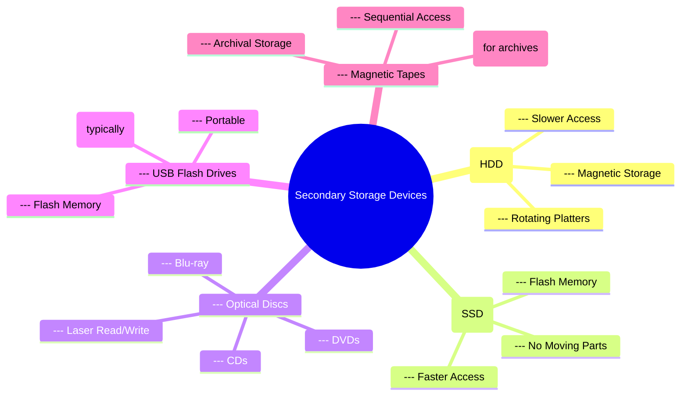
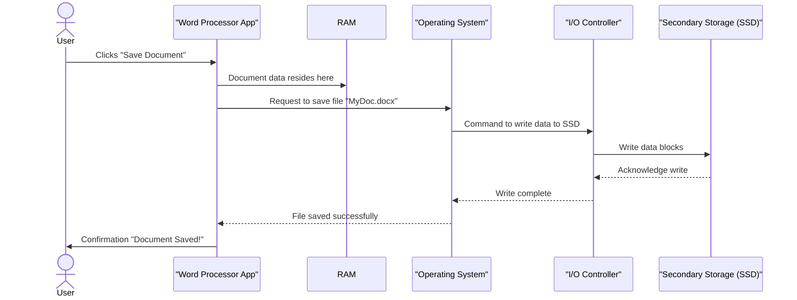

# Definition
Before proceeding, ensure you master Computer_Architecture and Memory_Hierarchy because understanding secondary storage devices requires knowledge of how data is physically stored and accessed outside of a computer's volatile main memory.
**Secondary storage devices** are non-volatile storage mediums that allow a computer to permanently store data and programs. Unlike primary memory (RAM), which is fast but loses its contents when power is turned off, secondary storage retains data indefinitely. Think of it like a personal library: RAM is your desk, where you work on current books (active data), but your library shelves (secondary storage) hold all your books (programs and data) permanently, even when you're not actively reading them. These devices are essential for long-term data persistence, booting operating systems, and storing user files, making them a fundamental component of any modern computing system.

# The Mental Model
Imagine your brain. Your short-term memory (what you're thinking about right now) is like RAM – fast, but temporary. Your long-term memory (everything you've learned and experienced) is like secondary storage – slower to access, but permanent. When you need to recall a specific fact, you retrieve it from your long-term memory and bring it into your short-term memory to actively work with it.


```text
// Scenario 1: Conceptual overview of secondary storage
// Output:
// (A visual mindmap showing "Secondary Storage Devices" as the root, branching out to "Hard Disk Drives (HDD)", "Solid State Drives (SSD)", "Optical Discs", "USB Flash Drives", and "Magnetic Tapes", each with their key characteristics.)
// This mindmap illustrates the diverse landscape of secondary storage, categorizing them by technology and general characteristics.
```
*Note: This `mindmap` visually categorizes and highlights the key characteristics of various secondary storage devices, illustrating their diversity and fundamental principles.*

# Context & Framework
### Where Does it Live? (The Map)
Secondary storage devices are typically found outside the CPU's immediate access path. They are connected to the computer's motherboard via various interfaces (e.g., SATA, NVMe, USB). Data on these devices is organized into files and directories, forming a hierarchical file system (e.g., NTFS on Windows, ext4 on Linux, APFS on macOS). When the CPU needs data from secondary storage, it sends a request to an I/O controller, which then communicates with the storage device. The data is read into primary memory (RAM) before the CPU can process it.

# The Mastery Deep Dive
### Who are the Neighbors?
Secondary storage devices interact closely with several other computer components:
1.  **CPU**: Issues read/write requests, but doesn't directly access the data.
2.  **RAM (Primary Memory)**: Acts as an intermediary buffer. Data is moved from secondary storage to RAM before CPU processing, and from RAM to secondary storage for saving.
3.  **I/O Controllers**: Dedicated hardware that manages data transfer between the CPU/RAM and the storage device.
4.  **Operating System**: Manages the file system, allocates storage space, and provides an abstraction layer (files and directories) for applications to interact with storage, shielding them from low-level hardware details.
This coordinated interaction ensures efficient and reliable data persistence.

# Constraints & Limitations
Secondary storage, while providing non-volatile persistence, comes with inherent limitations. Its primary drawback is **speed**: access times are orders of magnitude slower than RAM (milliseconds vs. nanoseconds). This performance gap necessitates sophisticated caching and buffering strategies. Another limitation is **durability**: while non-volatile, these devices have finite lifespans and are susceptible to physical damage or wear (especially flash memory). Furthermore, the cost per gigabyte of secondary storage, while much lower than RAM, still plays a role in system design.

# Significance & Application
Secondary storage is indispensable for modern computing, serving several critical functions:
*   **Operating System Storage**: Houses the operating system, allowing computers to boot up.
*   **Program Storage**: Stores all installed applications.
*   **User Data Persistence**: Saves user-created files (documents, photos, videos) and application data.
*   **Virtual Memory/Paging**: Used by operating systems to extend the effective size of RAM by temporarily swapping data to disk.
*   **Backup and Archiving**: Essential for long-term data preservation and disaster recovery.
Its role in data persistence makes it a fundamental concept for any programmer dealing with file I/O.

# The Worked Example
Consider the process of saving a document in a word processor. This involves several interactions with secondary storage.

1.  **User Action**: The user clicks "Save" in the word processor.
2.  **Application Request**: The word processor (an application running in RAM) requests the operating system to save the document's content.
3.  **OS File System Interaction**: The operating system's file system component identifies the target directory and filename on the secondary storage device.
4.  **Data Transfer (RAM to Disk)**: The document's content, which is currently in RAM, is then transferred through an I/O controller to the designated location on the secondary storage device (e.g., an SSD).
5.  **Persistence**: The data is written to the physical storage medium, becoming permanently stored.
6.  **Confirmation**: The operating system confirms the write operation's success to the word processor, which then updates its internal state (e.g., marking the document as "saved").


```text
// Scenario 1: Saving a document to secondary storage
// Output:
// (A visual sequence diagram showing the flow of actions and data from the User initiating a save, through the Application, RAM, Operating System, I/O Controller, and finally to the SSD, with acknowledgements returning along the path.)
// This diagram illustrates the sequential interaction between different components when saving data persistently to a secondary storage device.
```
This sequence illustrates the multi-step journey data takes from a user action, through application and operating system layers, to eventually be written and persisted on a secondary storage device.

# The Proving Ground
*Test your mastery. Cover the solutions below to test yourself first.*

### Level 1: Understanding (The Basics)
**The Fact Check:** What is the primary characteristic that distinguishes secondary storage devices from primary memory (RAM) in a computer system?
> **Solution:** The primary characteristic distinguishing secondary storage devices from primary memory (RAM) is that secondary storage is **non-volatile**, meaning it retains data even when power is removed, while RAM is **volatile** and loses its contents without power.

### Level 2: Competence (Application)
**The Sort:** Categorize the following storage devices based on their primary technology (magnetic, solid-state, optical): Blu-ray disc, Hard Disk Drive (HDD), USB Flash Drive. Briefly describe one advantage of each technology.
> **Solution:**
> *   **Blu-ray disc:** Optical technology. Advantage: High storage capacity on a single disc, suitable for high-definition media.
> *   **Hard Disk Drive (HDD):** Magnetic technology. Advantage: Very high storage capacity for a low cost per gigabyte, suitable for bulk data storage.
> *   **USB Flash Drive:** Solid-state technology. Advantage: Portable, durable (no moving parts), and relatively fast, suitable for transferring files.

### Level 3: Mastery (The Crucible)
**The Impostor:** A software engineer proposes that for maximum performance, a critical application should directly load its entire dataset from a network-attached storage (NAS) device into the CPU's cache for real-time processing, bypassing RAM. Identify the flaws in this performance optimization strategy, referencing the actual data path and memory hierarchy discussed.
> **Solution:** This strategy has multiple critical flaws:
> 1.  **CPU Cache Bypass of RAM:** The CPU cache is an extremely fast, very small memory located directly on the CPU. It acts as a cache for **RAM**, not for secondary storage. Data from any secondary storage device (including NAS) **must first be loaded into RAM** before it can be moved to the CPU cache. Bypassing RAM for direct cache loading is architecturally impossible for external storage.
> 2.  **NAS Latency:** Network-attached storage, while convenient, introduces significant network latency in addition to the inherent latency of the underlying storage medium (e.g., HDDs or SSDs within the NAS). Loading an "entire dataset" directly from NAS to CPU cache would be orders of magnitude slower than even loading from a local SSD to RAM, let alone bypassing RAM.
> 3.  **Cache Size Limitation:** CPU caches are tiny (megabytes, sometimes tens of megabytes) compared to typical application datasets (gigabytes or terabytes). It's impossible for an entire "critical application dataset" to fit into the CPU cache, regardless of source. The cache is designed for frequently accessed *subsets* of data already in RAM.
>
> **Actual Data Path (from NAS to CPU):** The data would flow from the NAS over the network, through the computer's network interface card (NIC), into the main system RAM (primary memory), and *then* the CPU would access it from RAM, potentially caching small, frequently used portions in its own cache. The proposed strategy fundamentally misunderstands the memory hierarchy and the roles of RAM, cache, and secondary/network storage.

# Key Takeaways
*   Secondary storage devices provide **non-volatile persistence**, allowing data and programs to be stored permanently, unlike volatile RAM.
*   Common types include HDDs, SSDs, optical discs, and USB flash drives, each with distinct technologies and performance characteristics.
*   Data from secondary storage is first loaded into **RAM** via I/O controllers before being processed by the CPU, illustrating the critical role of the memory hierarchy.

# Knowledge Graph Connections
| Concept                     | Connection / Relationship                                                                   |
| :
-------------------------- | :
------------------------------------------------------------------------------------------ |
| Memory_Hierarchy        | Secondary storage forms the slowest but largest layer of the computer's memory hierarchy.   |
| Operating_System        | Operating systems manage the file systems on secondary storage devices.                     |
| Data_Persistence        | The primary purpose of secondary storage is to ensure data remains available after power off. |
---