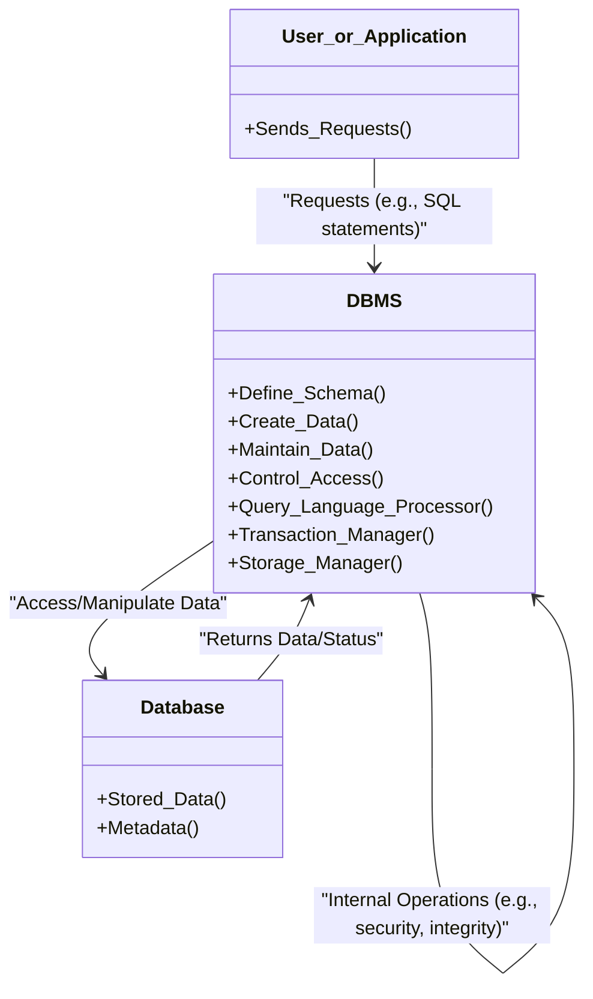

# Definition
Before proceeding, ensure you master [[Database_Systems]] and [[Data_Definition_Language_DDL]].
A Database_Management_System_DBMS is a software system that enables users to define, create, maintain, and control access to a database. It acts as an intermediary between the user/applications and the actual physical database, providing a structured and programmatic way to interact with data. Imagine it as the central control panel for your entire digital library: it doesn't just store books, but it provides all the tools and rules for organizing, adding, finding, and securing them.

# The Mental Model
Consider a large, complex warehouse. The "Database_Management_System_DBMS" is not the warehouse itself (which is the physical database), nor is it the inventory (the data). Instead, the DBMS is the entire operational infrastructure: the forklifts, the inventory management software, the security system, the personnel who operate these, and the rules governing what goes where and who can access what. It handles every operation from receiving new goods (inserting data) to retrieving specific items (querying data) and ensuring the warehouse operates smoothly and securely.


*Note: Arrows indicate the flow of requests and data between users, the DBMS, and the database. The DBMS orchestrates all interactions.*

# Context & Framework
### Opening the Hood: What's Inside?
A [[Database_Management_System_DBMS]] is far more than just a storage mechanism; it's a sophisticated software suite with several interconnected components. Key internal components include a **Query Language Processor** which interprets user requests (like SQL statements), a **Transaction Manager** that ensures data integrity and consistency during concurrent operations, and a **Storage Manager** responsible for the physical storage and retrieval of data on disk. Additionally, it incorporates **security and integrity subsystems** to enforce rules and control access, and a **recovery system** to handle failures. This complex architecture allows the DBMS to abstract away the physical details of data storage from the users and applications.

# The Mastery Deep Dive
### How the Parts Talk to Each Other
The interaction within a [[Database_Management_System_DBMS]] starts when a user or an application program issues a request, often in the form of a [[Data_Manipulation_Language_DML]] statement (like an SQL query) or a [[Data_Definition_Language_DDL]] statement. This request is first processed by the query language processor. If it's a DML request, the transaction manager ensures that any data modifications adhere to ACID properties (Atomicity, Consistency, Isolation, Durability), especially in multi-user environments. The storage manager then translates these logical requests into physical I/O operations to interact with the actual data stored in the database. The DBMS uses its internal metadata (system catalog) throughout this process to understand the database structure and enforce rules.

### The Translator: From "Lego" to "Jargon"
The idea of a "control panel" managing a "digital library" translates to the formal definition of a [[Database_Management_System_DBMS]]. The "control panel" encompasses the DBMS's role in enabling users to **define** (using DDL), **create**, **maintain** (using DML), and **control access** (using [[Database_Access_Control]]) to the database. The "digital library" is the **database** itself, a shared collection of logically related data. This software system acts as the core engine, transforming user commands into actual database operations, thereby providing a high level of abstraction and a powerful interface for data management.

# Constraints & Limitations
### The Engineering Trade-off
While the [[Database_Management_System_DBMS]] provides robust data management, it introduces its own set of constraints. The **complexity** of the software itself can be substantial, requiring specialized expertise for installation, configuration, and optimization. This often translates to a **higher cost** of both software licenses and specialized hardware. Furthermore, the DBMS consumes significant system resources (memory, CPU, storage), which can impact **performance** if not properly tuned. These factors mean that while a DBMS solves many problems, it also necessitates a significant investment in terms of money, time, and skilled personnel.

# Significance & Application
The [[Database_Management_System_DBMS]] is the central enabling technology for all modern data-driven applications. It liberates applications from the complexities of direct file management, allowing developers to focus on business logic. DBMSs ensure data integrity, facilitate concurrent access for multiple users, provide robust security mechanisms, and enable efficient data retrieval and storage. From airline reservation systems to online banking and enterprise resource planning, the DBMS is the fundamental layer that underpins reliable and scalable data operations across virtually every industry.

# The Worked Example
Consider the process of defining a simple database table for `Customers` using SQL, then inserting a new customer record. This demonstrates the "Create" and "Maintain" aspects managed by the DBMS.

```sql
-- 1. Define the structure of the 'Customers' table using DDL
CREATE TABLE Customers (
    CustomerID INT PRIMARY KEY,
    FirstName VARCHAR(50),
    LastName VARCHAR(50),
    Email VARCHAR(100) UNIQUE,
    RegistrationDate DATE DEFAULT CURRENT_DATE
);
-- This DDL statement tells the DBMS to create a new table.
-- The DBMS processes this, updating its internal metadata (system catalog)
-- to store the table's structure, column types, and constraints (PRIMARY KEY, UNIQUE, DEFAULT).

-- 2. Insert a new customer record into the 'Customers' table using DML
INSERT INTO Customers (CustomerID, FirstName, LastName, Email)
VALUES (1, 'Alice', 'Smith', 'alice.smith@example.com');
-- This DML statement instructs the DBMS to add a new row of data.
-- The DBMS verifies that the data conforms to the table's definition (e.g., CustomerID is INT, Email is UNIQUE).
-- If all checks pass, the DBMS's storage manager physically writes this data to the database.
```
*Note: Comments explain the purpose of each SQL statement and how the DBMS interacts.*

This example shows:
1.  **DDL (`CREATE TABLE`):** The DBMS processes this to define the schema, including column types and constraints (like `PRIMARY KEY` and `UNIQUE`). It updates its internal metadata, making the database aware of the new table structure.
2.  **DML (`INSERT INTO`):** The DBMS executes this to add new data. It ensures that the incoming data conforms to the schema defined by the DDL (e.g., `CustomerID` is an integer, `Email` is unique). If a violation occurs (e.g., inserting a duplicate email), the DBMS will reject the operation to maintain data integrity.

# The Proving Ground
*Test your mastery. Cover the solutions below to test yourself first.*

### Level 1: The Sanity Check (Verification)
**The Question:** Define a [[Database_Management_System_DBMS]] and state its four primary functions.
> **Solution:** A Database_Management_System_DBMS is a software system that enables users to **define**, **create**, **maintain**, and **control access** to a database.

### Level 2: The Crucible (Mastery & Edge Cases)
**The Scenario:** An older software application directly writes and reads data from plain text files, each program managing its own files. A new, integrated system is being proposed using a [[Database_Management_System_DBMS]].
**The Question:** Explain how the `control access` function of a [[Database_Management_System_DBMS]] fundamentally improves upon the old file-based approach, specifically addressing two potential security and integrity risks that the file-based system would struggle to mitigate.
> **Solution:** The `control access` function of a [[Database_Management_System_DBMS]] provides robust mechanisms that are severely lacking in a direct file-based approach, mitigating critical security and integrity risks:
> 1.  **Granular Security:** In a file-based system, access control is often at the file level (e.g., read/write permissions for the entire file). This makes it difficult to specify that User A can only see certain columns or rows, while User B can see others. A DBMS, through its [[Database_Access_Control]] features (like roles and privileges), allows for **granular control**, specifying precisely which parts of the data a user or application can access and what operations they can perform (e.g., only select data, not delete it).
> 2.  **Data Integrity Enforcement:** File-based systems rely on individual applications to enforce data rules (e.g., ensuring a customer ID is unique, or an order date is valid). If one application has a bug or bypasses checks, data integrity is compromised across the board. A DBMS, however, centralizes data integrity enforcement. When `control access` is established, the DBMS itself (not individual applications) ensures that all data entering or being modified in the database adheres to predefined constraints (e.g., `PRIMARY KEY`, `FOREIGN KEY`, `UNIQUE`, `CHECK` constraints). This guarantees data consistency and validity regardless of the application interacting with it.

# Key Takeaways
*   A [[Database_Management_System_DBMS]] is software that centralizes the definition, creation, maintenance, and access control of data.
*   It acts as an essential abstraction layer between users/applications and the physical database.
*   DBMSs provide critical functions like query processing, transaction management, and storage management to ensure data integrity and security.

# Knowledge Graph Connections
| Concept                             | Connection / Relationship                                                              |
| :
---------------------------------- | :
------------------------------------------------------------------------------------- |
| [[Database_Systems]]                | The DBMS is a fundamental component of any database system.                           |
| [[Advantages_of_DBMSs]]             | DBMSs offer numerous advantages, such as improved data consistency and security.        |
| [[Disadvantages_of_DBMSs]]          | DBMSs also come with challenges like complexity and cost.                             |
| [[Data_Definition_Language_DDL]]    | DDL is used to define the database schema, a core function of the DBMS.                |
| [[Data_Manipulation_Language_DML]]  | DML is used to interact with data, managed and executed by the DBMS.                  |
| [[Database_Access_Control]]         | The DBMS is responsible for implementing and enforcing database access control.         |
| [[Database_Roles_and_Personnel]]    | Various roles, such as the DBA, interact directly with the DBMS.                      |
---