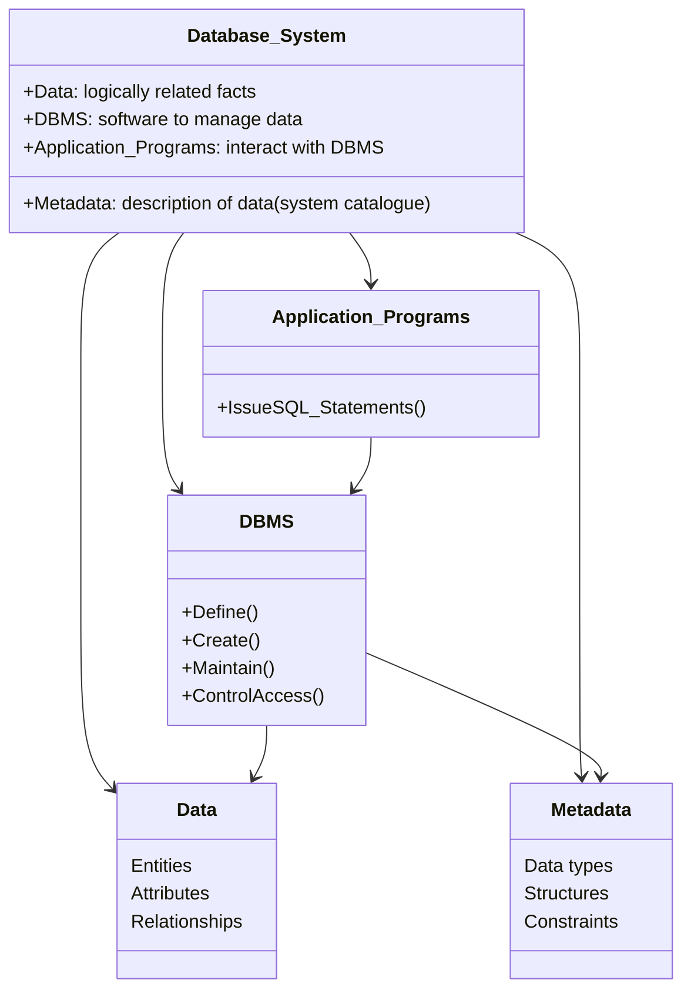
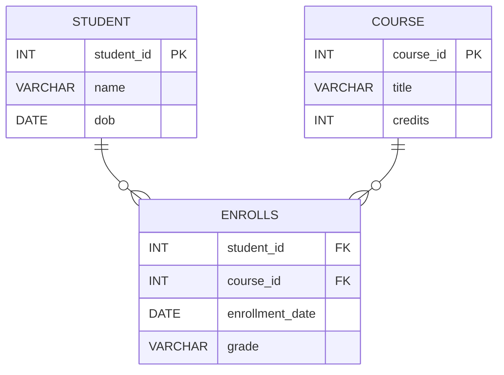

# Definition
Before proceeding, ensure you master [[Manual_Approach_to_Data_Handling]] and [[File_Based_Systems]].
A Database_System refers to an organized collection of logically related data, along with a description of this data, designed to meet the information needs of an organization. This system utilizes a special software, the [[Database_Management_System_DBMS]], to facilitate data management. Think of it like a highly organized digital library where the books (data) are logically categorized, and there's a librarian (DBMS) who knows everything about the books, including how to find, add, or update them efficiently. Database systems are essential to every business today, used to maintain internal records, present data to customers, and support various commercial processes.

# The Mental Model
Imagine a bustling construction site. The "Database_System" isn't just the pile of bricks (raw data); it's the entire organized storage area, the blueprints, the inventory manifests, and the foreman who knows exactly where every material is, what it's for, and how it connects to the overall structure. This structured approach ensures that information (like brick types, quantities, and their placement in the building) is consistent, readily available, and managed effectively.

*Note: A `classDiagram` illustrates the structural relationships between components. Arrows indicate dependencies or associations.*

# Context & Framework
### Opening the Hood: What's Inside?
At its core, a Database_System comprises several key components working in concert. It includes the actual **data** itself, which consists of entities, their attributes, and the relationships between them, all logically structured to represent an organization's information. Crucially, it also contains **metadata** (often referred to as a system catalog), which is a description of the data, detailing its types, structures, and any constraints. The [[Database_Management_System_DBMS]] is the software engine that manages all these components. Finally, **application programs** serve as the interface through which end-users interact with the DBMS to perform various data operations.

# The Mastery Deep Dive
### How the Parts Talk to Each Other
The various parts of a Database_System communicate through well-defined interfaces. Application programs, written by [[Application_Programmers_in_DBMS_Environment]], send requests (often in the form of SQL statements) to the [[Database_Management_System_DBMS]]. The DBMS then interprets these requests, interacts with the stored data and metadata, and performs the necessary operations like retrieval, insertion, or modification. For instance, when a user asks for customer details, the application program sends a query to the DBMS, which then uses the metadata to locate the customer data and returns it to the application for display.

### The Translator: From "Lego" to "Jargon"
The intuitive understanding of a "digital library" with "books" and a "librarian" translates directly to formal database terminology. The "books" are the **logically related data** (entities, attributes, and relationships) that an organization needs to store and manage. The "librarian" is the [[Database_Management_System_DBMS]], the software that defines, creates, maintains, and controls access to this data. The "card catalog" that helps the librarian manage books corresponds to the **system catalogue** or **metadata**, which describes the structure and constraints of the data. This translation from simple analogy to formal terminology is crucial for understanding the robust and complex nature of these systems.

# Constraints & Limitations
### The Engineering Trade-off
While database systems offer immense power and flexibility, they do introduce a degree of complexity compared to simpler data handling methods. The initial setup and configuration of a [[Database_Management_System_DBMS]] can be resource-intensive, requiring specialized skills and potentially significant hardware investments. This complexity is an inherent trade-off for the advanced capabilities they provide, such as data integrity, security, and concurrent access. Organizations must weigh these initial investments and learning curves against the long-term benefits of robust, scalable data management.

# Significance & Application
Database_Systems are the cornerstone of information technology, enabling organizations to efficiently store, retrieve, and manage their critical data. They are foundational for virtually all modern applications, from simple websites to complex enterprise resource planning (ERP) systems. Their ability to ensure data consistency, reduce redundancy, and provide secure, controlled access is vital for informed decision-making, operational efficiency, and maintaining a competitive edge in today's data-driven economy.

# The Worked Example
Consider a university managing student enrollment.

*Note: `||--o{` indicates a one-to-many relationship where enrollment is optional for the student and course, but a specific enrollment links to exactly one student and one course.*

This ER Diagram visually represents the structure of the data for a university's course management.
1.  **Entities:** `STUDENT`, `COURSE`, `ENROLLS` are the main entities (like "tables" in a relational database), representing distinct real-world objects or concepts.
2.  **Attributes:** Inside each entity, `student_id`, `name`, `dob` are attributes of `STUDENT`. Similarly, `course_id`, `title`, `credits` are attributes of `COURSE`.
3.  **Relationships:** The lines connecting the entities represent relationships. `STUDENT ||--o{ ENROLLS` means "a student can enroll in zero or many courses." `COURSE ||--o{ ENROLLS` means "a course can have zero or many students enrolled in it." The `ENROLLS` entity itself acts as a linking table, representing the many-to-many relationship between students and courses.
4.  **Primary and Foreign Keys:** `student_id PK` in `STUDENT` means `student_id` uniquely identifies each student. `student_id FK` in `ENROLLS` means it references the `student_id` in the `STUDENT` table, establishing the link.

This example shows how a database system uses structured models to organize complex information, ensuring that data about students, courses, and their enrollments are clearly defined and interconnected.

# The Proving Ground
*Test your mastery. Cover the solutions below to test yourself first.*

### Level 1: The Sanity Check (Verification)
**The Question:** Identify and briefly describe the three fundamental components that constitute a complete Database_System.
> **Solution:** The three fundamental components are: 1) **Data**, the raw facts and figures structured logically; 2) **Metadata**, the "data about data" that describes the structure and constraints of the data; and 3) the [[Database_Management_System_DBMS]], the software that manages and controls access to the data.

### Level 2: The Crucible (Mastery & Edge Cases)
**The Scenario:** A small non-profit decides to store all its donor information, event schedules, and volunteer lists in a single, large spreadsheet application, arguing it's simpler and cheaper than a dedicated database system.
**The Question:** You are tasked with explaining to them why, despite its apparent simplicity, this spreadsheet approach will eventually evolve into a "broken system" fundamentally different from a true database system. Identify two critical issues related to data integrity and access control that will inevitably arise, and explain why a [[Database_Management_System_DBMS]] would prevent them.
> **Solution:** This spreadsheet approach will become a "broken system" primarily due to **data redundancy and inconsistency** and **lack of robust access control**.
> 1.  **Data Redundancy and Inconsistency:** In a single large spreadsheet, donor names, addresses, and phone numbers might be duplicated across different sheets (e.g., in a "Donors" sheet and an "Event Attendees" sheet). If a donor's address changes, it must be updated manually in multiple places. Forgetting to update one instance leads to **inconsistent data**. A [[Database_Management_System_DBMS]] prevents this by storing each piece of information (e.g., donor details) only once, and then linking to it from other related data (e.g., events), ensuring consistency.
> 2.  **Lack of Robust Access Control:** Spreadsheets typically offer very coarse-grained access control (e.g., entire file access). It's difficult to allow volunteers to see only event schedules, while preventing them from seeing donor financial information. A [[Database_Management_System_DBMS]], however, provides granular [[Database_Access_Control]] through roles and privileges, allowing specific users or groups (like volunteers) to access only the data relevant to their tasks (e.g., just the event schedule), thereby protecting sensitive information like donor financial details.

# Key Takeaways
*   A Database_System integrates data, metadata, and a [[Database_Management_System_DBMS]] to efficiently manage an organization's information needs.
*   It provides a structured, logical approach to data storage, overcoming the limitations of manual and [[File_Based_Systems]].
*   While introducing some complexity, database systems are indispensable for ensuring data integrity, security, and scalability in modern applications.

# Knowledge Graph Connections
| Concept                                 | Connection / Relationship                                                          |
| :
-------------------------------------- | :
----------------------------------------------------------------------------------- |
| [[Manual_Approach_to_Data_Handling]]    | Database systems evolved as a solution to the limitations of manual data handling.   |
| [[File_Based_Systems]]                  | Database systems offer significant advantages over traditional file-based systems.   |
| [[Database_Management_System_DBMS]]     | The DBMS is the core software component of a database system.                       |
| [[Advantages_of_DBMSs]]                 | Database systems provide numerous advantages in data management.                     |
| [[Disadvantages_of_DBMSs]]              | Despite benefits, database systems also come with certain disadvantages.             |
| [[Data_Definition_Language_DDL]]        | DDL is used to define the structure of data within a database system.               |
| [[Data_Manipulation_Language_DML]]      | DML is used to interact with and manage the data stored in a database system.       |
---