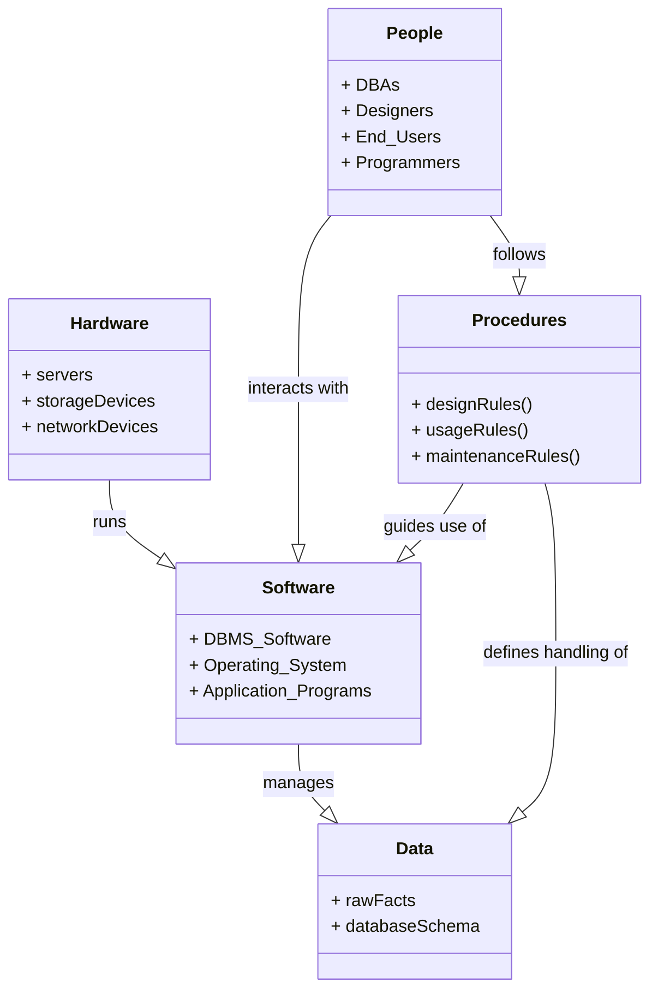

# Definition
Before proceeding, ensure you master [[Database_Management_System]] and [[Components_of_a_DBMS]].
The Components of DBMS Environment refer to the **five basic, interacting elements that constitute a complete Database Management System setup**: Hardware, Software, Data, Procedures, and People. These components work together to ensure the efficient and effective management of an organization's data assets. Understanding each component is crucial for successful database design, implementation, and operation. Imagine a complete orchestra: you need instruments (hardware), musical scores (software), the music itself (data), the conductor's instructions (procedures), and the musicians (people) to make it work harmoniously.

# The Mental Model
Think of running a digital archive.
*   **Hardware:** The physical computers, servers, storage disks, and network cables.
*   **Software:** The operating system, the DBMS itself, and any applications that interact with the archive.
*   **Data:** The actual digital documents, images, and metadata stored in the archive.
*   **Procedures:** The rules for how to submit new documents, how to search for old ones, and how to back up the archive.
*   **People:** The archivists, IT staff, and users who interact with the system.

All five are essential for the archive to function.


*Note: This `classDiagram` illustrates the five fundamental components of a DBMS environment and their high-level interdependencies.*

# Context & Framework
### How the Parts Talk to Each Other
The components of a DBMS environment are interdependent, forming a cohesive ecosystem. Hardware provides the physical foundation for software to run, which in turn manages the data. People interact with the software and data by following defined procedures. This intricate interplay ensures that data is consistently processed, maintained, and accessed according to organizational rules and user needs. A failure or weakness in any one component can impact the entire system.

# The Mastery Deep Dive
### Opening the Hood: What's Inside?
The five basic components of a DBMS environment are:

1.  **Hardware:** This refers to all the physical, electronic components that make up the computer system. It can range from a personal computer to a network of powerful servers and storage devices. Hardware includes:
    *   Processors (CPU)
    *   Main Memory (RAM)
    *   Input/Output Devices (keyboards, monitors)
    *   Storage Devices (hard drives, SSDs, tape drives for backup)
    *   Network Devices (routers, switches)
    This provides the computing and storage capacity for the DBMS.

2.  **Software:** This encompasses all the programs and applications that interact with the hardware and manage the data. Key software components include:
    *   The **DBMS itself**: The core software that manages the database.
    *   **Operating System (OS)**: Manages the computer's hardware and software resources (e.g., Windows, Linux).
    *   **Network Software**: Facilitates communication between different computers in a distributed environment.
    *   **Application Programs**: User-facing software that interacts with the database to perform specific tasks.

3.  **Data:** This is the most crucial component, representing the raw facts, figures, text, images, etc., that the organization collects and stores. It includes:
    *   The **actual data** stored in the database.
    *   The **schema**: A description of this data, defining its structure, data types, and relationships. The schema is itself a form of metadata.

4.  **Procedures:** These are the explicit instructions and rules that should be applied to the design, implementation, and use of the database and the DBMS. Procedures cover:
    *   How to install and configure the DBMS.
    *   How to create and maintain database schemas.
    *   How to perform backups and recovery.
    *   Security protocols for data access.
    *   Guidelines for application development and user interaction.

5.  **People:** This includes all the users, administrators, and developers who interact with the DBMS. Different roles include:
    *   **Database Administrators (DBAs):** Responsible for the overall control of the DBMS, including security, performance, and integrity.
    *   **Database Designers:** Responsible for identifying the data to be stored and choosing appropriate structures.
    *   **Application Programmers:** Develop the programs that interact with the database.
    *   **End-Users:** The people who use the database to perform their daily tasks.

# Constraints & Limitations
### The Engineering Trade-off
The effective functioning of a DBMS environment requires careful integration and management of all five components, which presents engineering trade-offs. Investing heavily in high-performance hardware and sophisticated software without adequate procedures or skilled people can lead to inefficient operation. Conversely, having excellent procedures and personnel but outdated hardware or limited software can create bottlenecks. The optimal design involves balancing resources across all components, recognizing that underperforming in one area can significantly limit the effectiveness of the others.

# Significance & Application
Understanding the [[Components_of_DBMS_Environment]] is fundamental for successful database management. It provides a holistic view, emphasizing that a DBMS is not just software but a complete system involving technology, information, and human interaction. This knowledge is essential for IT professionals to design, implement, troubleshoot, and maintain robust database systems, ensuring they meet organizational needs for data integrity, security, availability, and performance.

# The Worked Example
This example demonstrates a common failure point when one of the DBMS environment components is neglected.

```text
**Scenario:** A tech startup rapidly deploys a new product with a powerful cloud-based DBMS and hires skilled developers. However, they neglect to define clear **Procedures** for database backups, user access management, or how to handle data breaches.

**Impact of Neglecting Procedures:**
*   **Hardware/Software:** The cloud infrastructure and DBMS software are robust.
*   **Data:** Data is being collected.
*   **People:** Skilled developers are building applications.
*   **Missing Procedures:**
    *   No defined backup schedule or restoration process: A data loss event (e.g., accidental deletion, cyberattack) would be catastrophic, as there's no clear way to recover data, despite the powerful hardware and software.
    *   No clear user access rules: New employees might be granted excessive permissions, leading to security vulnerabilities and potential data misuse.
    *   No incident response plan: A data breach would cause panic and chaotic response, exacerbating damage.

**Outcome:** Despite investing in top-tier technology and talent, the lack of well-defined **Procedures** cripples the system's reliability, security, and recoverability. This highlights that all five components must be robust for a DBMS environment to be truly effective.

```
*Note: This text block illustrates the critical importance of `Procedures` in a DBMS environment.*

# The Proving Ground
*Test your mastery. Cover the solutions below to test yourself first.*

### Level 1: The Sanity Check (Verification)
**The Component Check:** List the five basic components of a DBMS environment.
> **Solution:** The five basic components are Hardware, Software, Data, Procedures, and People.

### Level 2: The Crucible (Mastery & Edge Cases)
**The Broken System:** A company invests heavily in cutting-edge DBMS software and powerful hardware but neglects the "Procedures" and "People" components of its [[Components_of_DBMS_Environment]]. Predict the likely problems this company will face in effectively utilizing its database system, even with advanced technology.
> **Solution:** A company neglecting "Procedures" and "People" in its [[Components_of_DBMS_Environment]], despite having cutting-edge software and hardware, will likely face severe problems. Without proper **Procedures** (e.g., for data entry, backup, recovery, security protocols), the system will suffer from **data inconsistency**, **loss of data integrity**, **security vulnerabilities**, and a **chaotic response to failures**. Without skilled **People** (DBAs, designers, trained users), the powerful DBMS will be **misconfigured, underutilized, or misused**, leading to poor performance, ineffective data management, and a failure to meet organizational objectives. The advanced technology alone cannot compensate for a lack of human expertise and well-defined operational guidelines, as explained in `# Opening the Hood: What's Inside?` and `# Constraints & Limitations`.

# Key Takeaways
*   A DBMS environment comprises Hardware, Software, Data, Procedures, and People.
*   Hardware provides physical resources; software runs the DBMS and applications.
*   Data includes raw facts and the schema (its description).
*   Procedures are rules for design, use, and maintenance; people are the users and managers.

# Knowledge Graph Connections
| Concept | Connection / Relationship |
| :
-------------------------- | :
------------------------------------------------------------------------------------------ |
| [[Database_Management_System]] | These components form the complete ecosystem within which a DBMS operates.                 |
| [[Components_of_a_DBMS]]    | The DBMS software itself is a critical part of the overall software component of the environment. |
| [[DBMS_Benefits_and_Drawbacks]] | The success in realizing DBMS benefits depends on the effective integration of all these components. |
| [[Multi_User_DBMS_Architectures]] | Different architectures determine how the software and hardware components are distributed. |
---