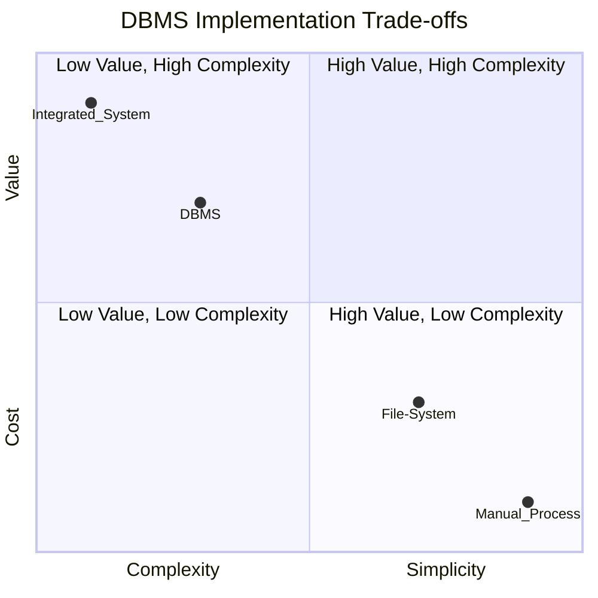

# Definition
Before proceeding, ensure you master [[Database_Management_System]] and [[Data_Independence]].
DBMS Benefits and Drawbacks refers to the comprehensive set of advantages gained and challenges faced when implementing and utilizing a Database Management System. These systems are designed to overcome the limitations of traditional file-based data management, but they introduce their own set of complexities and costs. Thinking of a DBMS is like hiring a highly skilled project manager for your data: they bring immense organization and efficiency, but also command a salary and require specific tools.

# The Mental Model
Imagine you're running a small cafe.
**Before DBMS (File-Based):** You have separate notebooks for "Orders," "Customers," and "Ingredients." If a customer changes their address, you might have to update multiple notebooks. If you want to know which ingredient is most popular with which customer, it's a manual, error-prone task.
**With DBMS:** You have a centralized system. A customer's address is stored once. When you want a report, the system instantly links orders to customers and ingredients. This is faster and more accurate, but setting up the system (the initial investment and learning curve) requires effort.


*Note: The x and y axes range from 0.0 to 1.0. Lower values on the x-axis indicate higher complexity, higher values indicate greater simplicity. Lower values on the y-axis indicate higher cost, higher values indicate greater value. This chart visually represents the trade-offs of different data management approaches.*

# Context & Framework
### The Hard Choice: Option A or Option B?
Organizations often face the critical decision of whether to invest in a DBMS. This decision is rarely black and white, as it involves weighing the significant operational and strategic advantages against the considerable resource commitments. The choice impacts everything from data integrity and security to development costs and system performance. Understanding this inherent trade-off is crucial for informed decision-making in database management.

# The Mastery Deep Dive
### The Hard Choice: Option A or Option B?
The decision to adopt or upgrade a DBMS presents a hard choice between enhanced data management capabilities and increased system overhead. On one hand, a DBMS offers **control of data redundancy**, ensuring data consistency across the organization by storing information in a single, well-defined location. It also provides **improved data integrity** through enforced rules and constraints, leading to more reliable information. Furthermore, features like **improved security** (controlling access to specific data) and **data sharing** among multiple users foster a more collaborative and secure data environment. These benefits directly contribute to **increased productivity** and the ability to extract **more information from the same amount of data**, leading to better business insights.

On the other hand, a DBMS introduces **complexity** in terms of design, implementation, and administration. It often comes with a significant **cost** (software licenses, specialized hardware), and requires **additional hardware costs** to handle the processing demands. The **cost of conversion** from existing systems can also be substantial. These systems can sometimes impact **performance** if not properly optimized, and a **higher impact of a failure** means that any system downtime can be more catastrophic due to centralized data. Balancing these conflicting requirements is the core challenge.

### The Devil's Advocate: Why might this be wrong?
While the benefits of a DBMS are compelling, it's essential to consider the counter-arguments. For very small, simple applications with minimal data and a single user, the overhead of a full-fledged DBMS (complexity, cost, size) might outweigh the advantages. In such niche scenarios, a simpler file-based system, despite its inherent limitations, might appear more 'efficient' due to lower initial investment and reduced administrative burden. The challenge lies in accurately assessing the future growth and complexity of data needs.

# Constraints & Limitations
### The Hard Choice: Option A or Option B?
Implementing a DBMS involves navigating a complex web of conflicting requirements. Balancing the desire for robust data integrity and security with the need for high performance and cost-effectiveness is a continuous challenge. Organizations must consider their unique operational context, the volume and velocity of their data, and their budget to make informed decisions about DBMS features and configurations. Over-engineering a solution can lead to unnecessary complexity and cost, while under-engineering can result in critical data management failures.

# Significance & Application
The decision to adopt a DBMS is a strategic one, impacting an organization's ability to operate efficiently, make informed decisions, and remain competitive. The benefits are particularly pronounced in industries that rely heavily on data, such as finance, healthcare, and logistics, where data integrity, security, and accessibility are paramount. Understanding these trade-offs is vital for IT professionals, business analysts, and decision-makers in evaluating and justifying database investments.

# The Worked Example
This example illustrates the decision-making process for choosing between a simple file system and a DBMS for a small online retail store.

```text
**Scenario:** A small online store (2 employees) tracks 50 products and 100 customer orders per month. They currently use CSV files.

**Option A: Continue with CSV Files**
*   **Pros:** Low cost, simple to implement for current scale.
*   **Cons:**
    *   **Data Redundancy:** Customer address stored in multiple order files.
    *   **Data Inconsistency:** Manual updates lead to different addresses in different files.
    *   **Security:** Anyone with access to the server can view all data.
    *   **Concurrency:** Two employees editing the same customer record at the same time can lead to data loss.
    *   **Integrity:** No checks to ensure product IDs are valid.

**Option B: Implement a Basic DBMS (e.g., SQLite or PostgreSQL)**
*   **Pros:**
    *   **Control of Data Redundancy:** Centralized customer data, single update point.
    *   **Data Consistency:** Enforced integrity rules prevent conflicting data.
    *   **Improved Security:** User roles/permissions can restrict access.
    *   **Concurrency Control:** Multiple users can access/update data safely.
    *   **Data Integrity:** Can define rules (e.g., product ID must exist).
*   **Cons:**
    *   **Complexity:** Requires learning SQL, database administration.
    *   **Cost:** Potential licensing for commercial DBMS, hardware upgrades.
    *   **Size:** DBMS software itself consumes resources.

**Decision:** For growth, even a small store will quickly find CSV files unmanageable. The initial overhead of a basic DBMS is a worthwhile investment to mitigate future data integrity and scalability issues.

```
*Note: This text block illustrates a trade-off analysis.*

# The Proving Ground
*Test your mastery. Cover the solutions below to test yourself first.*

### Level 1: The Sanity Check (Verification)
**The Fact Check:** List three key advantages of employing a Database Management System.
> **Solution:** Three key advantages include control of data redundancy, improved data integrity, and improved security.

### Level 2: The Crucible (Mastery & Edge Cases)
**The Lose-Lose Scenario:** A startup with limited resources needs to manage a growing dataset. They face the choice between investing heavily in a full-featured DBMS (high cost, complexity) or continuing with file-based data storage (poor data integrity, security risks). Justify the 'least bad' choice, explaining the critical factors that make it preferable despite its drawbacks.
> **Solution:** The "least bad" choice for a growing startup would be to **invest in a full-featured DBMS**, even with its high initial cost and complexity. While file-based storage has low initial cost, it presents **insurmountable issues for growth**, specifically: **poor data integrity** (no enforced rules leading to errors), **high data redundancy** (wasting space and causing inconsistencies), **lack of concurrency control** (data corruption with multiple users), and **negligible security**. These issues quickly become critical as data grows, leading to higher long-term costs in terms of data loss, operational inefficiencies, and security breaches. The DBMS, despite initial hurdles, provides the **foundational robustness, scalability, and integrity features** essential for long-term data management, aligning with its role in `defining, creating, maintaining, and controlling access` as discussed in the [[Database_Management_System]] note and the trade-offs explored in `# The Hard Choice` section.

# Key Takeaways
*   DBMS offers control of redundancy, improved integrity, security, and data sharing.
*   Drawbacks include complexity, cost, resource demands, and higher impact of failure.
*   The choice to implement a DBMS requires balancing these benefits and drawbacks against organizational needs.

# Knowledge Graph Connections
| Concept | Connection / Relationship |
| :
-------------------------- | :
------------------------------------------------------------------------------------------ |
| [[Database_Management_System]] | These are the specific advantages and disadvantages inherent to using a DBMS.             |
| [[Data_Independence]]       | Improved maintenance through data independence is a key advantage of DBMS.                 |
| [[Multi_User_DBMS_Architectures]] | Different DBMS architectures aim to optimize these benefits and mitigate drawbacks.        |
| [[Relational_Data_Model]]   | The relational model specifically addresses issues like data redundancy and consistency. |
---