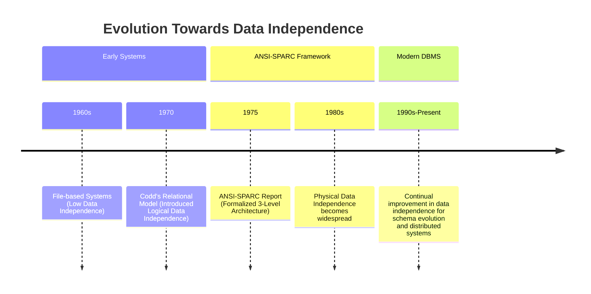

# Definition
Before proceeding, ensure you master [[ANSI_SPARC_Three_Level_Architecture]] and [[Database_Management_System]].
Data Independence is a fundamental concept in database systems that refers to the **ability of upper layers of the database architecture to remain immune to changes in lower layers**. Essentially, it means that modifications to the schema at one level should not require changes to the schema at higher levels. This isolation is critical for maintaining flexibility, reducing development costs, and ensuring the longevity of database applications. Imagine changing the engine of a car (physical implementation) without needing to redesign the dashboard (user view) or change how the driver operates it.

# The Mental Model
Think of a website that displays product prices.
**Without Data Independence:** If the database changes how it stores prices (e.g., from `DECIMAL` to `INT` representing cents), every part of the website code that displays prices might need to be rewritten.
**With Data Independence:** The website only requests "product price." The database system handles the conversion or mapping internally. Changes in storage format don't affect the application code. This is because there's a layer of abstraction (like an adapter) that shields the application from internal database changes.


*Note: This `timeline` illustrates the historical progression of data independence in database systems.*

# Context & Framework
### The Problem: Why Did We Invent This?
Historically, applications were tightly coupled to the physical storage structures of data. Any change to how data was stored (e.g., adding a new field, changing a file format) required extensive modifications to all application programs that accessed that data. This lack of flexibility led to high maintenance costs and hindered system evolution. Data independence was invented to break this rigid coupling, allowing databases to evolve without forcing a cascade of changes across all dependent applications.

# The Mastery Deep Dive
### Version 1.0 vs. Today
The concept of data independence directly addresses the rigid coupling between application programs and data storage that characterized early file-based systems. Before data independence, applications were deeply "aware" of physical storage details. This meant that even minor changes to the physical layout of data would necessitate significant rewrites of application code, making systems inflexible and costly to maintain. The development of data independence, particularly formalized through the [[ANSI_SPARC_Three_Level_Architecture]], provided critical layers of abstraction. This allowed the evolution of databases from tightly integrated, dependent systems to modular architectures where different aspects of data management could change independently.

### The "Same Story, Different Setting"
The concept of abstraction, which underpins data independence, is a pervasive theme in computer science. Similar to how an operating system abstracts away hardware complexities from applications, or how object-oriented programming hides implementation details behind interfaces, data independence shields higher-level database components from lower-level changes. This design philosophy promotes modularity, maintainability, and reusability across various computing domains.

# Constraints & Limitations
### The Engineering Trade-off
Achieving high levels of [[Data_Independence]] involves engineering trade-offs. The introduction of multiple abstraction layers and schema mappings (as seen in the [[ANSI_SPARC_Three_Level_Architecture]]) adds complexity to the DBMS itself and can introduce some performance overhead due to the translation processes. While the benefits of flexibility and reduced maintenance often outweigh these costs for complex systems, simpler applications might find the overhead unnecessary. The challenge lies in designing a DBMS that provides sufficient independence without sacrificing unacceptable levels of performance or introducing excessive architectural complexity.

# Significance & Application
Data independence is a cornerstone of modern database design and a key reason for the widespread adoption of Database Management Systems. It drastically reduces the cost and effort required to maintain and evolve database applications by allowing schema modifications at one level without affecting others. This flexibility enables organizations to adapt their databases to changing business needs and technological advancements with greater agility, making systems more robust and long-lived.

# The Worked Example
This example demonstrates a situation where Data Independence prevents application code changes despite a database schema change.

```text
**Scenario:** A company database initially stores `Employee` records with a single `Address` column (e.g., "123 Main St, Anytown, CA 90210"). An application `PayrollApp` accesses this `Address`.

**Change:** The DBA decides to split the `Address` column into `Street`, `City`, `State`, and `ZipCode` for better data granularity and querying.

**Without Data Independence:**
*   The `PayrollApp`'s code explicitly accesses `Employee.Address`.
*   After the database change, `Employee.Address` no longer exists.
*   The `PayrollApp` breaks and requires extensive modification to access `Employee.Street`, `Employee.City`, etc., and then reconstruct the full address.

**With Data Independence (via ANSI-SPARC architecture and mappings):**
*   The `PayrollApp`'s external view still expects an `Address` field.
*   The **External/Conceptual Mapping** (managed by the DBMS) is updated. It now knows to construct the `Address` for `PayrollApp` by concatenating `Street`, `City`, `State`, and `ZipCode` from the conceptual schema.
*   The `PayrollApp` continues to access `Employee.Address` without any code changes. The underlying schema change is hidden.

**Outcome:** The `PayrollApp` is immune to the change in the conceptual schema, demonstrating [[Logical_Data_Independence]]. If the DBA later decides to store `Street` in a different file format (a physical change), [[Physical_Data_Independence]] would prevent even the conceptual schema from needing modification.

```
*Note: This text block illustrates how data independence shields an application from schema changes.*

# The Proving Ground
*Test your mastery. Cover the solutions below to test yourself first.*

### Level 1: The Sanity Check (Verification)
**The Fact Check:** What is the main concept behind [[Data_Independence]] in a DBMS?
> **Solution:** The main concept behind Data Independence is that upper layers of the database architecture are immune to changes in lower layers.

### Level 2: The Crucible (Mastery & Edge Cases)
**The Broken System:** A software team decides to directly embed physical storage details (e.g., file paths, record offsets) into their application code. Discuss how this decision fundamentally compromises [[Data_Independence]], leading to extreme maintenance difficulties and a high risk of application breakage with even minor database schema changes.
> **Solution:** Directly embedding physical storage details into application code **completely compromises [[Data_Independence]]** because it tightly couples the application to the lowest level of the database architecture. Any change to the physical storage (e.g., moving a file, changing a record format, upgrading hardware) will directly break the application, requiring extensive and costly code rewrites. This eliminates the flexibility and evolvability that data independence provides, making the system brittle and difficult to maintain. This scenario directly opposes the purpose of the [[ANSI_SPARC_Three_Level_Architecture]] which aims to insulate applications from such low-level changes, as explained in `# The Problem: Why Did We Invent This?` and `# Constraints & Limitations`.

# Key Takeaways
*   Data independence means changes at one schema level don't affect higher levels.
*   It is achieved through abstraction layers and schema mappings in a DBMS.
*   This concept reduces maintenance costs and increases application flexibility.

# Knowledge Graph Connections
| Concept | Connection / Relationship |
| :
-------------------------- | :
------------------------------------------------------------------------------------------ |
| [[ANSI_SPARC_Three_Level_Architecture]] | This architecture is the foundational framework for achieving data independence.           |
| [[Database_Management_System]] | Data independence is a key benefit and design goal of modern DBMSs.                       |
| [[Logical_Data_Independence]] | A specific type of data independence, focusing on the conceptual and external levels.      |
| [[Physical_Data_Independence]] | A specific type of data independence, focusing on the internal and conceptual levels.      |
| [[Schema_Mapping]]          | Schema mappings are the mechanisms that enable data independence between levels.           |
---