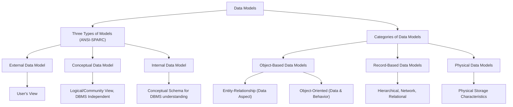

# Definition
Before proceeding, ensure you master [[Database_Management_System]] and [[Relational_Data_Model]].
A Data Model is an **integrated collection of concepts for describing data, relationships between data, and constraints on the data within an organization**. Its primary **purpose is to represent data in an understandable way**, providing an abstract blueprint for the database's structure and behavior. Data models dictate how information is organized and accessed, serving as the foundation upon which a database is built. Imagine a data model as the architectural plan for a building: it defines the rooms, their relationships, and the rules of construction before a single brick is laid.

# The Mental Model
Think of data models as different ways of drawing a map for a city.
*   **Object-based:** Focuses on the "landmarks" (entities) and their individual characteristics and behaviors, like describing a building's unique features and how people interact with it.
*   **Record-based:** Focuses on standard "street layouts" (fixed format records), like mapping out a grid of streets and blocks, where each block has a consistent size.
*   **Physical:** Focuses on the actual "underground infrastructure" (physical storage), like detailing where the water pipes and electrical lines are buried.


*Note: This `graph TD` diagram illustrates the classification of data models based on ANSI-SPARC and general categories.*

# Context & Framework
### The Family Tree
Data models form a crucial "family tree" in database design, starting from highly abstract views down to concrete physical implementations. This hierarchy is essential for achieving data independence, as defined by the ANSI-SPARC architecture. Each level of modeling serves a distinct purpose, from capturing user requirements to optimizing physical storage, while remaining conceptually linked.

# The Mastery Deep Dive
### The Translator: Converting English to Math
Data models comprise a structural part (defining types of data, relationships, and constraints), a manipulative part (defining operations on data), and potentially a set of integrity rules.

**Categories of Data Models:**
*   **Object-Based Data Models:** These are based on the concept of an **Entity** (a distinct object) and its relationships.
    *   **[[Entity_Relationship_Data_Model]] (ERM):** Primarily considers the data aspect and relationships between entities.
    *   **Object-Oriented Data Model:** Considers both data and behavior (methods) associated with objects.
*   **Record-Based Data Models:** These models are based on fixed-format records, where each record has a fixed number of fields, and each field is of a fixed length. Examples include the Hierarchical, Network, and [[Relational_Data_Model]]s.
*   **Physical Data Models:** These models describe the physical storage characteristics of the database on disk, focusing on how data is actually stored.

**Three Types of Models (In-line with ANSI-SPARC):**
The ANSI-SPARC architecture defines three levels of data models, each providing a different perspective:
1.  An **External Data Model**: Represents each user's view of the organization, sometimes called the Universe of Discourse (UoD). It shows only the data relevant to a particular user.
2.  A **Conceptual Data Model**: Represents the logical (or community) view of the entire organization's data. It is DBMS independent and describes *what data is stored* and *relationships among the data*.
3.  An **Internal Data Model**: Represents the conceptual schema in such a way that it can be understood by the DBMS. It describes *how data is stored* in the database.

**Conceptual Modelling** is the process of developing a conceptual data model, an accurate representation of an organization's data requirements, independent of implementation details. **Logical Modeling** assumes knowledge of the underlying data model of the target DBMS, translating the conceptual model into a specific DBMS-ready design.

# Constraints & Limitations
### The Engineering Trade-off
Choosing the right data model involves significant engineering trade-offs. A highly abstract conceptual model is flexible but needs to be translated into a more concrete logical model for implementation. Record-based models like the relational model excel at structured data but may struggle with highly complex or semi-structured data, where object-based models might be more suitable. Physical data models optimize for performance and storage but are hardware-dependent and can be inflexible. Each model type has strengths and weaknesses, requiring designers to select the most appropriate one for their specific data and application needs.

# Significance & Application
Data models are the bedrock of database design and implementation. They provide a common language for designers, developers, and users to understand the data requirements of an organization. A well-designed data model ensures data integrity, consistency, and efficient retrieval, which are critical for the success of any data-driven application. Understanding the different types and levels of data models is essential for effective database system development and management.

# The Worked Example
This example shows how a simple real-world concept of "Student Enrollment" is represented across different levels of data models.

```text
**Scenario:** A university wants to manage student enrollments in courses.

**1. External Data Model (Student's View):**
*   A student only sees their enrolled courses, their grades, and their personal contact information. They don't see other students' grades or faculty salaries.
*   View: `StudentName`, `CourseTitle`, `Grade`.

**2. Conceptual Data Model (University's Logical View):**
*   This is the holistic view of all data. It defines entities like `Student`, `Course`, `Faculty`, `Enrollment`.
*   Relationships: `Student` `ENROLLS_IN` `Course` (many-to-many), `Faculty` `TEACHES` `Course` (one-to-many).
*   Attributes: For `Student` - `StudentID`, `Name`, `DOB`. For `Course` - `CourseID`, `Title`, `Credits`. For `Enrollment` - `StudentID`, `CourseID`, `Grade`.
*   Constraints: `StudentID` must be unique. `Grade` must be A-F.

**3. Internal Data Model (DBMS's View/Physical Description):**
*   This describes how the conceptual model is actually stored in the specific DBMS.
*   Example:
    *   `Student` table stored as a B-tree index on `StudentID`.
    *   `Course` table stored as a heap file.
    *   `Enrollment` table linked via foreign keys, stored as a clustered index on (`StudentID`, `CourseID`).
    *   Data types: `StudentID` as `INT`, `CourseName` as `VARCHAR(50)`.
*   This level reveals details like file organization, indexing strategies, and actual data types supported by the DBMS.

**Outcome:** Each model provides a necessary layer of abstraction, from what a specific user sees (External) to the full organizational logic (Conceptual), down to how the DBMS physically handles the data (Internal).

```
*Note: This text block demonstrates the application of the three ANSI-SPARC data models to a single scenario.*

# The Proving Ground
*Test your mastery. Cover the solutions below to test yourself first.*

### Level 1: The Sanity Check (Verification)
**The Neighbor Check:** State the primary purpose of a [[Data_Models]].
> **Solution:** The primary purpose of a data model is to represent data, relationships, and constraints in an understandable way.

### Level 2: The Crucible (Mastery & Edge Cases)
**The Impostor:** A data analyst presents a diagram showing relationships between tables and columns. While useful, they mistakenly call it a "physical data model." Explain why this is incorrect and describe what a true Physical_Data_Models would represent.
> **Solution:** The analyst's diagram describing table and column relationships is likely a **logical data model** (like a relational schema or an ER diagram at a conceptual level), which focuses on *what* data is stored and *how it relates logically*. It's incorrect to call it a "physical data model" because a true Physical_Data_Models would represent *how the data is physically stored* on disk. This includes details like file organizations (e.g., sequential, indexed sequential), indexing strategies (e.g., B-trees, hash indexes), specific storage devices, and internal record formats, which are low-level details abstracted away by logical models, as discussed in `# The Mastery Deep Dive` about `Categories_of_Data_Models` and `Three_Types_of_Models (ANSI-SPARC)`.

# Key Takeaways
*   Data models define data, relationships, and constraints in an understandable way.
*   Categories include Object-based (ER, OO), Record-based (Hierarchical, Network, Relational), and Physical models.
*   ANSI-SPARC defines three levels: External (user view), Conceptual (logical view), and Internal (DBMS's physical view).

# Knowledge Graph Connections
| Concept | Connection / Relationship |
| :
-------------------------- | :
------------------------------------------------------------------------------------------ |
| [[Database_Management_System]] | DBMSs are built upon and manage data according to specific data models.                    |
| [[Relational_Data_Model]]   | The relational model is a prominent example of a record-based data model.                  |
| [[Entity_Relationship_Data_Model]] | The ER model is a widely used example of an object-based conceptual data model.          |
| [[ANSI_SPARC_Three_Level_Architecture]] | This architecture provides the framework for the three types of data models.             |
| [[Data_Independence]]       | Data models at different levels facilitate logical and physical data independence.         |
---