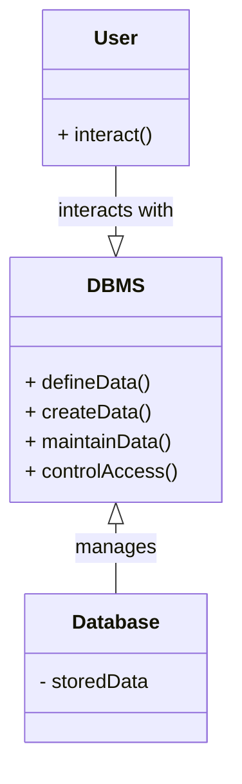

# Definition
Before proceeding, ensure you master [[Data_Models]] and [[Database_Languages]].
A Database Management System (DBMS) is a software system that **enables users to define, create, maintain, and control access to a database**. It acts as an intermediary between users and the database, facilitating structured data storage and retrieval. Think of a DBMS as a highly organized librarian for your digital information, who not only stores books but also keeps track of who can read which book, ensures no two copies conflict, and retrieves specific information upon request. It's the engine behind any modern data-driven application.

# The Mental Model
Imagine a bustling library. The "Client" is a student who needs a specific book. The "Server" is the librarian who manages all the books, retrieves them, and checks them out. The network is the pathway the student uses to communicate their request to the librarian, and for the librarian to deliver the book.


*Note: This `classDiagram` shows the core components: `User` (interacting entity), `DBMS` (management system), and `Database` (data store). Arrows indicate interaction and management roles.*

# Context & Framework
### Opening the Hood: What's Inside?
At its core, a DBMS comprises several interconnected components working in harmony. These include a **Query Processor** to interpret user commands, a **Storage Manager** to handle data access, and a **Transaction Manager** to ensure data consistency and recovery. Each component plays a vital role in translating user requests into actions on the physical data, enforcing rules, and optimizing performance. This layered architecture allows for a separation of concerns, making the system more modular and robust.

# The Mastery Deep Dive
### Component Interactions
The primary way a user or application interacts with a DBMS is by issuing requests, often in the form of SQL statements, to the DBMS. The DBMS then interprets these requests, validates them against defined rules, and executes the necessary operations on the database. This process often involves coordinating with various internal components, such as the query optimizer to find the most efficient way to retrieve data, and the concurrency control mechanisms to handle multiple simultaneous users without conflicts. Understanding this request-response cycle is fundamental to comprehending how a DBMS operates.

### How the Parts Talk to Each Other
Different parts of a DBMS communicate through well-defined interfaces and protocols. For example, when a user executes an SQL query, the **Query Processor** first parses and validates the query. It then passes an optimized execution plan to the **Database Manager**, which coordinates with the **File Manager** and **Access Methods** to retrieve the actual data from storage. The results are then assembled and returned to the user. This structured communication ensures that each component can perform its specialized task efficiently and reliably.

# Constraints & Limitations
### The Engineering Trade-off
Implementing and maintaining a DBMS involves significant engineering trade-offs. While providing numerous benefits like data integrity and security, DBMSs introduce complexity, require substantial hardware resources (size), and can be costly in terms of software licenses and conversion efforts. Furthermore, a failure in the DBMS itself can have a higher impact compared to a simpler file-based system, as it affects all data and applications. These factors necessitate careful planning and resource allocation.

# Significance & Application
A DBMS is indispensable for any organization dealing with large volumes of data that require efficient storage, retrieval, and management. It provides the infrastructure for critical business functions such as inventory management, customer relationship management (CRM), financial transactions, and scientific data analysis. In academic settings, understanding DBMS is foundational for computer science students, enabling them to design and implement robust data-driven applications.

# The Worked Example
This example demonstrates a basic interaction with a conceptual DBMS, showing how a user request is processed.

```text
User Request: "Find all students enrolled in 'Database Systems'."

1.  **Application Program:** Submits an SQL query: `SELECT * FROM Students WHERE Course = 'Database Systems';`
2.  **DBMS Query Processor:**
    *   **Parser:** Checks query syntax.
    *   **Optimizer:** Determines the most efficient way to retrieve the data (e.g., use an index on the 'Course' column).
3.  **DBMS Database Manager:**
    *   **Access Methods:** Locates the physical data blocks on disk containing student records.
    *   **Buffer Manager:** Loads required data blocks from disk into memory.
    *   **Concurrency Control (if multi-user):** Ensures no other user is modifying the same data simultaneously.
4.  **DBMS Execution:** Reads relevant student records from memory.
5.  **Result Set:** Returns the matching student data to the application program.
6.  **Application Program:** Displays the student list to the user.
```
*Note: This text block illustrates the logical flow of a query within a DBMS.*

# The Proving Ground
*Test your mastery. Cover the solutions below to test yourself first.*

### Level 1: The Sanity Check (Verification)
**The Component Check:** Identify the fundamental roles of a database management system in handling data for users and applications.
> **Solution:** A DBMS allows users to define, create, maintain, and control access to a database.

### Level 2: The Crucible (Mastery & Edge Cases)
**The Broken System:** A small business attempts to manage its data using only spreadsheets. Analyze the inherent problems and explain how introducing a [[Database_Management_System]] would address these issues, considering aspects beyond simple storage.
> **Solution:** Managing data with spreadsheets leads to severe issues like **data redundancy** (same data copied multiple times), **data inconsistency** (different versions of the same data), lack of **data integrity** (no enforced rules), and poor **security** (easy unauthorized access). A DBMS addresses these by providing a centralized, structured system with **data definition** (schemas), **data integrity constraints**, **concurrency control** for multiple users, and robust **security mechanisms**, ensuring reliable and consistent data access. This directly ties into the DBMS's core function of *defining, creating, maintaining, and controlling access* to the database, as discussed in the `# Definition` and `# The Mastery Deep Dive` sections.

# Key Takeaways
*   A DBMS is software for defining, creating, maintaining, and controlling database access.
*   It acts as a crucial intermediary, translating user requests into actions on physical data.
*   The system involves inherent trade-offs between its benefits (integrity, security) and drawbacks (complexity, cost).

# Knowledge Graph Connections
| Concept | Connection / Relationship |
| :
-------------------------- | :
------------------------------------------------------------------------------------------ |
| [[Data_Models]]             | DBMSs implement and manage data according to specific data models.                         |
| [[Database_Languages]]      | DBMSs process and respond to commands written in database languages.                        |
| [[DBMS_Benefits_and_Drawbacks]] | DBMS features provide significant advantages but also introduce complexities.             |
| [[Components_of_a_DBMS]]    | The functionality of a DBMS is achieved through its various integrated components.          |
---