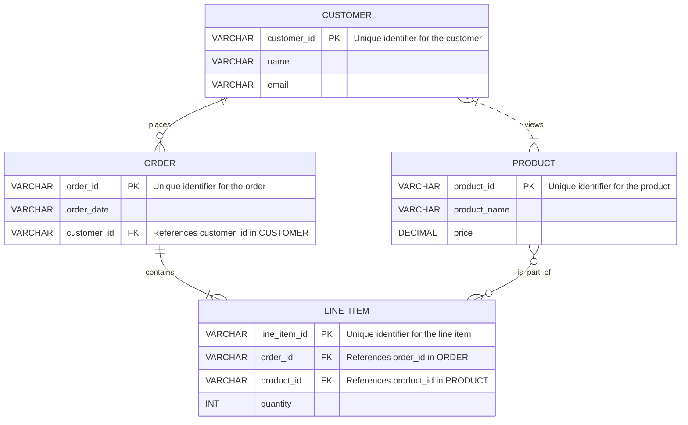
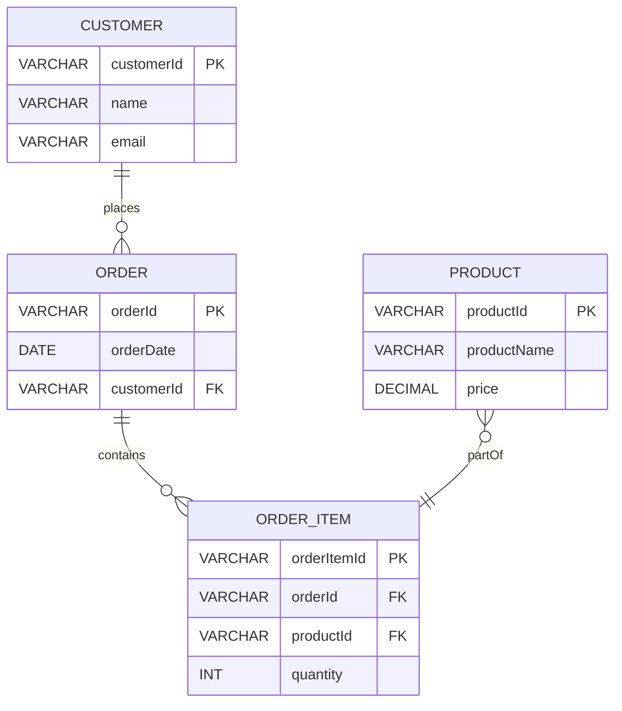

# Definition
Before proceeding, ensure you master [[Data_Models]] and [[Database_Management_System]].
The Entity-Relationship (ER) Data Model is an **object-based data model used to describe data and relationships between data in an organization at a conceptual level**. It represents real-world entities (things or objects) and the associations (relationships) between them. The ER model provides a high-level, semantic view of data, making it a powerful tool for initial database design. Imagine drawing a clear map of all the important "things" in your business (customers, products, orders) and showing how they are connected (customers "place" orders, orders "contain" products).

# The Mental Model
Imagine organizing your contacts.
*   **Entity (Person):** A contact in your phone (John Doe). It has attributes like Name, Phone Number, Email.
*   **Relationship (Works At):** John Doe "Works At" a specific company. This connects the "Person" entity to a "Company" entity.
*   **Cardinality:** One person "Works At" one company (1:1), but one company "Employs" many people (1:M).
An ER diagram visually represents these concepts, providing a blueprint for the logical structure of your data.

*Note: This `erDiagram` illustrates entities (CUSTOMER, ORDER, LINE_ITEM, PRODUCT), their attributes, and relationships. The cardinality symbols (e.g., `||--o{` for "exactly one to zero or many") define the nature of the connections.*

**Notation Legend for ER Diagram:**
| Cardinality | Meaning                               |
| :
---------- | :
------------------------------------ |
| `|o--o|`    | Zero or one to zero or one            |
| `||--||`    | Exactly one to exactly one            |
| `|o--||`    | Zero or one to exactly one            |
| `||--o{`    | Exactly one to zero or many           |
| `}o--o|`    | Zero or many to zero or one           |
| `}o--||`    | Zero or many to exactly one           |
| `}|--o{`    | One or many to zero or many           |
| `}|--||`    | One or many to exactly one            |
| `PK`        | Primary Key                           |
| `FK`        | Foreign Key                           |
| `UK`        | Unique Key                            |

# Context & Framework
### Opening the Hood: What's Inside?
The [[Entity_Relationship_Data_Model]] serves as a critical bridge between real-world organizational data requirements and their logical database design. It helps in precisely identifying the core entities, their defining attributes, and the intricate ways these entities interact. By creating a high-level conceptual schema, ER modeling enables database designers to capture the full breadth of data needs before delving into the specifics of a particular database management system (DBMS) or its implementation details.

# The Mastery Deep Dive
### Opening the Hood: What's Inside?
The ER model primarily focuses on three core constructs:
1.  **Entities**: These are real-world objects or concepts about which data is collected. An entity can be a person (e.g., `Student`), a place (e.g., `Campus`), an event (e.g., `Registration`), or a concept (e.g., `Course`). Each entity type is represented as a distinct component in an ER diagram.
2.  **Attributes**: These are the properties or characteristics that describe an entity. For example, a `Student` entity might have attributes like `StudentID`, `Name`, `Date_of_Birth`, and `Email`. Attributes are fundamental in providing descriptive information for each entity.
3.  **Relationships**: These represent associations between two or more entities. For instance, a `Student` entity might have a `Registers_For` relationship with a `Course` entity. Relationships are crucial for defining how different entities interact and depend on each other.

The strength of the ER model lies in its ability to visually represent these components through ER diagrams, making complex data structures easier to understand and communicate among stakeholders.

### How the Parts Talk to Each Other
In an [[Entity_Relationship_Data_Model]], entities "talk" to each other through relationships. The nature of this communication is defined by **cardinality**, which specifies the number of instances of one entity that can be associated with the number of instances of another entity. Common cardinalities include:
*   **One-to-One (1:1)**: A `Person` has one `Passport`.
*   **One-to-Many (1:M)**: A `Department` has many `Employees`.
*   **Many-to-Many (M:N)**: `Students` `Enroll_In` many `Courses`, and `Courses` have many `Students`.
Correctly identifying cardinalities is vital for accurately modeling real-world constraints and ensuring data integrity.

# Constraints & Limitations
### The Engineering Trade-off
While the [[Entity_Relationship_Data_Model]] is excellent for conceptual design, it has engineering trade-offs. It is a high-level model, meaning it doesn't directly map to physical database structures. Translating an ER diagram into a [[Relational_Data_Model]] (which can then be implemented in a DBMS) requires careful normalization and adherence to relational rules. Furthermore, complex business rules or behavioral aspects are not easily represented in a pure ER model, often requiring extensions or additional modeling techniques. The challenge lies in balancing the clarity of conceptual design with the specificity needed for implementation.

# Significance & Application
The [[Entity_Relationship_Data_Model]] is widely used in the initial phases of database design to capture and represent the data requirements of an application or organization. It helps in creating a clear, unambiguous, and high-level blueprint that can be easily understood by both technical and non-technical stakeholders. ER diagrams are indispensable for developing well-structured databases that accurately reflect real-world scenarios and serve as a foundation for subsequent logical and physical design steps.

# The Worked Example
This example demonstrates a conceptual ER diagram for a simple "Order Processing" system, focusing on entities, attributes, and relationships.

*Note: This `erDiagram` for an order processing system shows how customers place orders, orders contain items, and items are parts of products. It includes primary (PK) and foreign (FK) keys, illustrating basic relationship modeling.*

# The Proving Ground
*Test your mastery. Cover the solutions below to test yourself first.*

### Level 1: The Sanity Check (Verification)
**The Component Check:** Define an "entity" and a "relationship" within the context of an [[Entity_Relationship_Data_Model]].
> **Solution:** An **entity** is a real-world object or concept about which data is collected (e.g., Student, Course). A **relationship** is an association between two or more entities (e.g., Student `enrolls_in` Course).

### Level 2: The Crucible (Mastery & Edge Cases)
**The Broken System:** An ER diagram is designed for a social media platform, but a user's `Posts` are shown as an attribute of the `User` entity, rather than a separate entity. Explain why this design choice is problematic for data integrity and flexibility, and how to correct it within the [[Entity_Relationship_Data_Model]].
> **Solution:** Representing `Posts` as an attribute of the `User` entity is problematic because it leads to **data redundancy** (if a user has multiple posts, the `User` entity would need to duplicate post data or store it as a complex, non-atomic attribute) and **poor flexibility**. This violates the principle of atomic attributes and makes querying specific posts or analyzing post-related data very difficult. The correct approach in an [[Entity_Relationship_Data_Model]] is to model `Post` as a **separate entity** with its own attributes (e.g., `PostID`, `Content`, `Timestamp`) and establish a **one-to-many relationship** where a `User` `CREATES` many `Posts`. This ensures data integrity, avoids redundancy, and allows for flexible queries on both users and posts, as discussed in `# How the Parts Talk to Each Other`.

# Key Takeaways
*   The ER model describes data and relationships using entities, attributes, and relationships.
*   Entities are real-world objects, attributes are their properties, and relationships are associations between entities.
*   Cardinality defines the number of instances involved in a relationship (1:1, 1:M, M:N).

# Knowledge Graph Connections
| Concept | Connection / Relationship |
| :
-------------------------- | :
------------------------------------------------------------------------------------------ |
| [[Data_Models]]             | The ER model is a prominent type of object-based conceptual data model.                    |
| [[Database_Management_System]] | ER diagrams are used in the initial design phase before implementing a DBMS.               |
| [[Relational_Data_Model]]   | ER diagrams are often translated into relational schemas for implementation in RDBMS.      |
| Conceptual_Modelling    | The ER model is a primary tool for conceptual modeling in database design.                 |
---