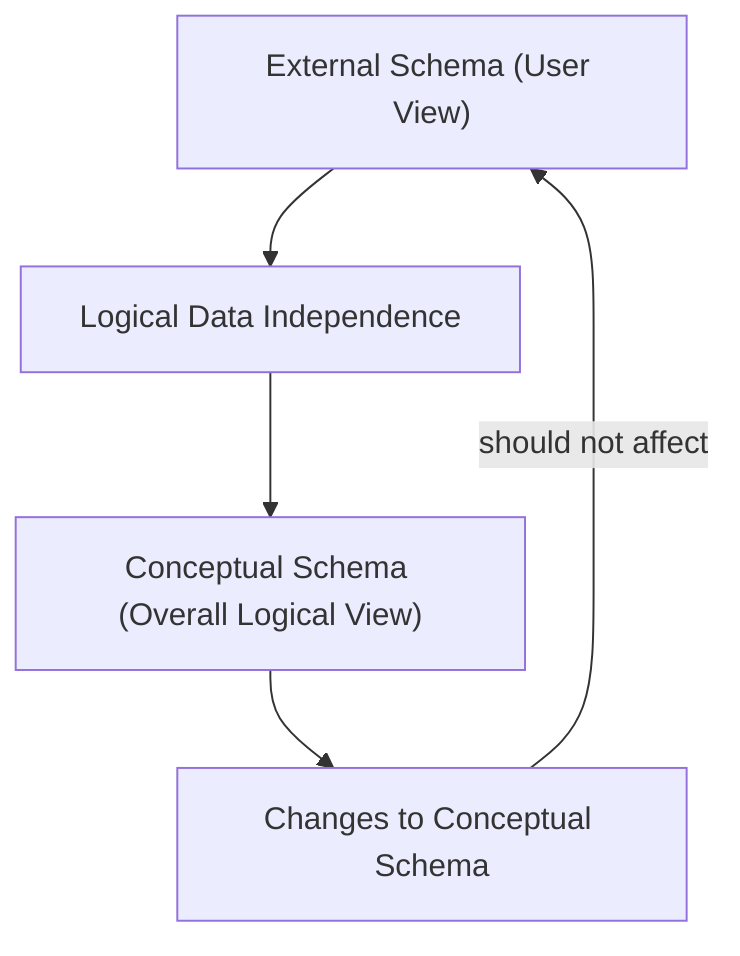

# Definition
Before proceeding, ensure you master [[Data_Independence]] and [[ANSI_SPARC_Three_Level_Architecture]].
Logical Data Independence refers to the **immunity of external schemas to changes in the conceptual schema**. In simpler terms, it means that changes to the overall logical structure of the database (e.g., adding or removing entities, attributes, or relationships) should not require changes to existing user views or application programs that access the database. This is a crucial aspect of [[Data_Independence]], ensuring that applications remain stable even as the underlying logical database model evolves to meet new requirements. Imagine changing the floor plan of an entire apartment building (conceptual schema) without requiring individual tenants (external schemas/applications) to re-learn where their specific apartment (their view) is located.

# The Mental Model
Consider a shopping website where you see "Product Details" (your external view).
*   **Conceptual Schema Change:** The database administrator decides to split the "Description" field of a `Product` into "Short_Description" and "Long_Description" for better categorization.
*   **Without Logical Data Independence:** The website code that previously accessed `Product.Description` would break and need to be rewritten to combine the new fields.
*   **With Logical Data Independence:** The DBMS, through its external/conceptual mapping, can present a virtual "Description" field to the website, combining `Short_Description` and `Long_Description` seamlessly. The website code remains unchanged, preserving its immunity to the conceptual schema modification.


*Note: This `graph TD` diagram illustrates that changes to the Conceptual Schema should not impact the External Schema due to Logical Data Independence.*

# Context & Framework
### The Problem: Why Did We Invent This?
Before [[Logical_Data_Independence]], applications were highly sensitive to changes in the database's logical structure. If a new attribute was added to a table, or an existing table was split, application programs might break or require significant modifications, even if they didn't directly use the changed parts. This tight coupling made database evolution costly and risky. Logical data independence was introduced to decouple applications from the evolving logical structure, making systems more flexible and maintainable.

# The Mastery Deep Dive
### The Translator: Converting English to Math
[[Logical_Data_Independence]] specifically refers to the ability of external schemas (user views) to remain immune to changes made in the conceptual schema (the community view of the entire database). This means that:
*   **Conceptual schema changes** (e.g., addition or removal of entities, attributes, or relationships, or reorganizing existing data into new tables) **should not require changes to external schemas or rewrites of application programs**.
*   This is achieved through the **External/Conceptual Mapping**, which the DBMS is responsible for managing. When an application requests data, the DBMS uses this mapping to translate the request from the external view to the potentially altered conceptual schema.

For example, if an attribute is removed from the conceptual schema, the DBMS can provide a default value to external views that still expect it. If two attributes are combined into one, the DBMS can split the single attribute into two for external views. While specific users might indirectly be affected by some conceptual changes (e.g., a feature they used might be deprecated), the *goal* is to minimize the impact on existing application programs.

### Component Interactions
[[Logical_Data_Independence]] is facilitated by the **Schema_Mapping** components within the DBMS, particularly the External/Conceptual Mapping. This mapping acts as a translator, allowing applications to continue interacting with a stable external view even if the underlying conceptual schema has changed. When a query comes from an external view, the DBMS uses the mapping to resolve the query against the current conceptual schema, providing the necessary data without the application needing to be aware of the internal structural modifications.

# Constraints & Limitations
### The Engineering Trade-off
While highly beneficial, achieving [[Logical_Data_Independence]] comes with engineering trade-offs. The DBMS must maintain and manage the complex mappings between external and conceptual schemas, which can add overhead to query processing. The design of external views themselves needs to be carefully considered to maximize independence while still providing necessary functionality. In scenarios with extremely complex conceptual schema changes, maintaining perfect logical independence for all external views can become challenging, sometimes requiring compromises.

# Significance & Application
[[Logical_Data_Independence]] is a critical feature for developing robust, scalable, and maintainable database applications. It allows database administrators to modify the logical structure of the database (e.g., to improve performance, add new features, or reorganize data) without disrupting existing applications. This significantly reduces maintenance costs, accelerates development cycles, and enables organizations to adapt their data models to evolving business requirements with greater agility.

# The Worked Example
This example illustrates how a change to the conceptual schema is handled without affecting an external application due to Logical Data Independence.

```text
**Scenario:** A company's database has a `Customers` table with a `PhoneNumber` column. An application `SalesApp` uses an external view that displays `CustomerID`, `Name`, and `PhoneNumber`.

**Change to Conceptual Schema:** The DBA decides to split the single `PhoneNumber` column into two new columns: `HomePhoneNumber` and `MobilePhoneNumber` in the conceptual schema, to better support different contact types. The original `PhoneNumber` column is removed.

**Impact with Logical Data Independence:**
1.  The `SalesApp` continues to query its external view expecting a `PhoneNumber` column.
2.  The DBMS's **External/Conceptual Mapping** component detects this.
3.  The mapping is designed to automatically concatenate `HomePhoneNumber` and `MobilePhoneNumber` (or prioritize one if both exist) from the conceptual schema to present a single `PhoneNumber` column to the `SalesApp`'s external view.
4.  The `SalesApp` code **does not need to be changed**. It still receives a `PhoneNumber` column, even though it's now derived from two separate columns in the conceptual schema.

**Outcome:** The `SalesApp` maintains its immunity to the conceptual schema change, demonstrating the power of [[Logical_Data_Independence]] in isolating applications from logical data model evolution.

```
*Note: This text block demonstrates how `Logical_Data_Independence` handles a conceptual schema change by modifying the mapping, not the application.*

# The Proving Ground
*Test your mastery. Cover the solutions below to test yourself first.*

### Level 1: The Sanity Check (Verification)
**The Impostor:** Define [[Logical_Data_Independence]] in the context of database schemas.
> **Solution:** Logical Data Independence refers to the immunity of external schemas (user views) to changes in the conceptual schema (overall logical database structure).

### Level 2: The Crucible (Mastery & Edge Cases)
**The Impostor:** A database design change involves splitting a single `Address` attribute into `Street`, `City`, and `ZipCode` attributes at the conceptual level. An application program that previously accessed the single `Address` field now breaks. Explain why this indicates a *lack* of [[Logical_Data_Independence]] and what mechanisms should have prevented this.
> **Solution:** This scenario indicates a **lack of [[Logical_Data_Independence]]** because the application program, which relies on a stable external view, was directly affected by a change in the conceptual schema (splitting `Address`). Ideally, the DBMS's **External/Conceptual Mapping** should have been updated to synthesize the `Address` field from the new `Street`, `City`, and `ZipCode` attributes for the application's external view. The application should have remained immune to this conceptual reorganization, continuing to "see" a single `Address` field. The fact that it broke means the abstraction layer was insufficient, and the application was too tightly coupled to the conceptual design, as explained in `# The Translator: Converting English to Math` and `# Context & Framework`.

# Key Takeaways
*   Logical data independence protects external schemas from conceptual schema changes.
*   This ensures application stability when entities, attributes, or relationships are modified logically.
*   It is achieved via DBMS-managed External/Conceptual mappings.

# Knowledge Graph Connections
| Concept | Connection / Relationship |
| :
-------------------------- | :
------------------------------------------------------------------------------------------ |
| [[Data_Independence]]       | Logical data independence is a specific type of data independence.                         |
| [[ANSI_SPARC_Three_Level_Architecture]] | It describes the immunity between the external and conceptual levels of this architecture. |
| [[Schema_Mapping]]          | External/Conceptual mapping is the mechanism that enables logical data independence.       |
| [[Database_Management_System]] | A key feature implemented by DBMSs to provide flexibility in database design.              |
---