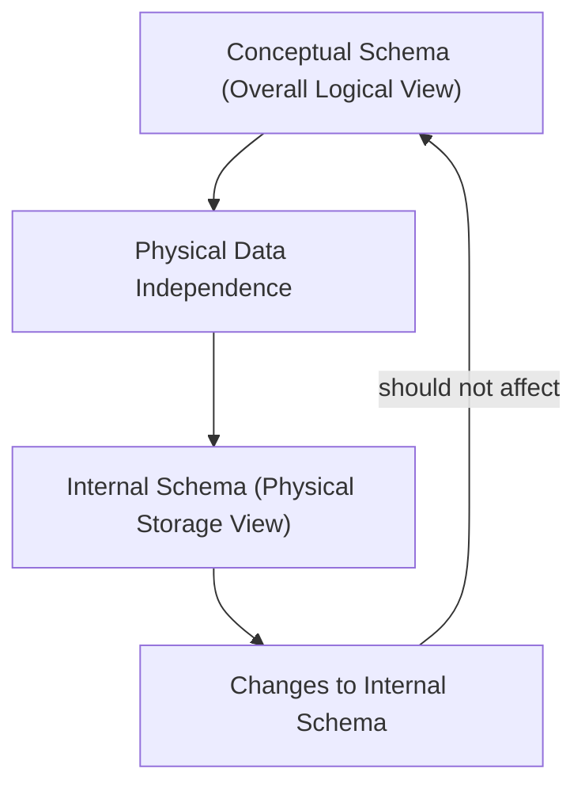

# Definition
Before proceeding, ensure you master [[Data_Independence]] and [[ANSI_SPARC_Three_Level_Architecture]].
Physical Data Independence refers to the **immunity of the conceptual schema to changes in the internal schema**. This means that modifications to the physical storage structure of the database (e.g., changing file organizations, storage devices, indexing strategies) should not require changes to the overall logical view of the database or to any application programs. It's a critical component of [[Data_Independence]], allowing database administrators to optimize physical storage for performance or cost without impacting the applications built upon the conceptual model. Imagine upgrading the internal wiring or plumbing of a building (physical changes) without affecting the architectural blueprints (conceptual schema) or how people use the rooms (external views).

# The Mental Model
Consider a large photo library stored on a server.
*   **Internal Schema Change:** The system administrator decides to change how photos are physically stored: moving them from one type of hard drive to another, or changing the indexing method (e.g., from a linear list to a more efficient tree structure).
*   **Without Physical Data Independence:** Every application that displays photos would need to know the new storage location or indexing method and would break.
*   **With Physical Data Independence:** The file browser or photo application only requests "list all photos." The database system handles the new physical storage details internally. The application remains unaware of the storage change, as the conceptual schema (which defines "Photo" with attributes like "Name", "Date") is preserved.


*Note: This `graph TD` diagram illustrates that changes to the Internal Schema should not impact the Conceptual Schema due to Physical Data Independence.*

# Context & Framework
### The Problem: Why Did We Invent This?
In early database systems, changes to physical storage (e.g., moving data files, changing disk types) often necessitated modifications to the conceptual schema and, consequently, to application programs. This tight coupling made it difficult and expensive to optimize database performance or upgrade hardware without disrupting operations. [[Physical_Data_Independence]] was introduced to address this, allowing the physical implementation to be optimized independently of the logical and external views, thus promoting greater flexibility and maintainability.

# The Mastery Deep Dive
### The Translator: Converting English to Math
[[Physical_Data_Independence]] specifically refers to the ability of the conceptual schema to remain immune to changes made in the internal schema. This implies that:
*   **Internal schema changes** (e.g., using different file organizations, altering storage structures or devices, modifying indexing techniques) **should not require changes to the conceptual schema or external schemas**.
*   This is achieved through the **Conceptual/Internal Mapping**, which is managed by the DBMS. This mapping translates requests from the conceptual schema into the appropriate operations on the physical storage, effectively shielding the conceptual level from physical implementation details.

For instance, if a database switches from storing records sequentially to using a B-tree indexing structure, the conceptual schema remains unchanged because the *logical* representation of data is unaffected. The DBMS's Conceptual/Internal mapping simply updates its translation rules to reflect the new physical access methods. This allows DBAs to tune performance and manage storage efficiently without impacting application logic.

### Component Interactions
[[Physical_Data_Independence]] is primarily enabled by the **Conceptual/Internal Mapping** component within the DBMS. This mapping layer translates the logical data requests from the conceptual schema into the physical operations required by the internal schema. When the internal schema changes, this mapping is updated to reflect the new physical organization, allowing the conceptual schema and all higher levels to continue operating as if no change occurred. This seamless translation is what ensures the immunity of higher-level schemas to low-level storage modifications.

# Constraints & Limitations
### The Engineering Trade-off
Achieving [[Physical_Data_Independence]], while vital, involves engineering trade-offs. The DBMS must maintain a sophisticated Conceptual/Internal mapping, which adds a layer of complexity and can introduce a slight performance overhead during data access, as requests need to be translated. Furthermore, completely isolating all conceptual aspects from *any* physical detail can be challenging, particularly for very specific performance tuning requirements where some conceptual design choices might implicitly favor certain physical implementations. The goal is to strike a balance where the benefits of flexibility and maintainability outweigh these inherent costs.

# Significance & Application
[[Physical_Data_Independence]] is crucial for the long-term maintainability and performance optimization of database systems. It empowers database administrators to make changes to the physical storage structure – such as upgrading hardware, migrating data to new storage devices, or implementing different indexing strategies – without requiring any modifications to the conceptual schema or the application programs that rely on it. This greatly reduces system downtime, lowers maintenance costs, and enables efficient scaling and performance tuning of the database infrastructure.

# The Worked Example
This example demonstrates how a change in physical storage is handled without affecting the conceptual schema due to Physical Data Independence.

```text
**Scenario:** A company's database stores `Product` records. The conceptual schema defines `Product` with attributes like `ProductID`, `Name`, `Price`, and `Quantity_On_Hand`. Internally, these records are stored in a simple heap file (records are stored unsorted).

**Change to Internal Schema:** To improve retrieval speed for `ProductID`, the DBA decides to implement a B-tree index on the `ProductID` column, and potentially reorganize the `Product` records into a clustered file based on `ProductID`.

**Impact with Physical Data Independence:**
1.  The conceptual schema, which defines `Product(ProductID, Name, Price, Quantity_On_Hand)`, **remains unchanged**.
2.  The DBMS's **Conceptual/Internal Mapping** component is updated. It now knows that when a query for `ProductID` comes from the conceptual level, it should utilize the new B-tree index for faster access.
3.  Application programs (which query for products) and external views (which display product information) **do not need to be changed**. They continue to interact with the database as if no physical change occurred. The efficiency gain is transparent.

**Outcome:** The conceptual schema and higher levels are immune to the physical storage modifications, demonstrating the power of [[Physical_Data_Independence]] in allowing low-level optimizations without rippling changes through the entire system.

```
*Note: This text block demonstrates how `Physical_Data_Independence` handles an internal schema change by modifying the mapping, not the conceptual schema.*

# The Proving Ground
*Test your mastery. Cover the solutions below to test yourself first.*

### Level 1: The Sanity Check (Verification)
**The Impostor:** Define [[Physical_Data_Independence]] and explain its relationship to the internal schema.
> **Solution:** Physical Data Independence refers to the immunity of the conceptual schema to changes in the internal schema. The internal schema describes how data is physically stored in the database.

### Level 2: The Crucible (Mastery & Edge Cases)
**The Impostor:** A database system is migrated to solid-state drives (SSDs) from traditional hard disk drives (HDDs) to improve performance. After the migration, application programs that do not interact with the physical storage directly unexpectedly fail. Explain why this demonstrates a failure in [[Physical_Data_Independence]] and what the ideal outcome should have been.
> **Solution:** This scenario demonstrates a **failure in [[Physical_Data_Independence]]**. The migration from HDDs to SSDs is a change at the **internal schema level** (physical storage device). Ideally, such a change should be completely transparent to the conceptual schema and all higher-level application programs. The fact that application programs, which *do not* directly interact with physical storage, failed means that they were inadvertently dependent on some aspect of the previous physical implementation. The ideal outcome would have been for the DBMS's **Conceptual/Internal Mapping** to absorb this change, allowing applications to continue functioning without modification and transparently benefiting from the performance improvement of the SSDs, as discussed in `# The Translator: Converting English to Math` and `# Context & Framework`.

# Key Takeaways
*   Physical data independence protects the conceptual schema from internal schema changes.
*   This allows physical storage optimizations (e.g., indexing, device changes) without affecting logical views.
*   It is enabled by DBMS-managed Conceptual/Internal mappings.

# Knowledge Graph Connections
| Concept | Connection / Relationship |
| :
-------------------------- | :
------------------------------------------------------------------------------------------ |
| [[Data_Independence]]       | Physical data independence is a specific and crucial type of data independence.            |
| [[ANSI_SPARC_Three_Level_Architecture]] | It describes the immunity between the internal and conceptual levels of this architecture. |
| [[Schema_Mapping]]          | Conceptual/Internal mapping is the mechanism that enables physical data independence.      |
| [[Database_Management_System]] | A key feature implemented by DBMSs to allow for flexible physical storage management.      |
---