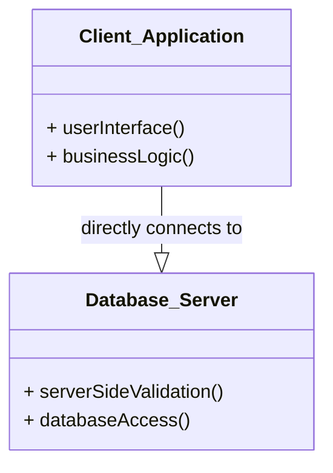

# Definition
Before proceeding, ensure you master [[Client_Server_Architecture]] and [[Database_Management_System]].
Two-Tier Architecture is a type of [[Client_Server_Architecture]] where the application logic is primarily divided between two layers: the client and the database server. In this model, the client typically handles the user interface and some application logic, while the database server manages data storage, retrieval, and server-side validation. It's a direct connection between the client and the database, making it suitable for smaller-scale applications but presenting challenges for enterprise-level scalability. Imagine a small shop where the cashier (client) directly interacts with the stockroom (database server) to get products for customers.

# The Mental Model
Think of a classic desktop application like an old accounting software.
*   **First Tier (Client):** This is the application running on your computer. It provides the user interface (buttons, forms) and often contains much of the "business logic" (how calculations are made, how data is presented).
*   **Second Tier (Database Server):** This is the database system (like SQL Server or Oracle) running on a separate machine. Its job is to store the data, retrieve it when asked, and enforce basic rules (like ensuring unique invoice numbers).

The client directly "talks" to the database server.


*Note: This `classDiagram` illustrates the two tiers: `Client_Application` and `Database_Server`, and their direct relationship.*

# Context & Framework
### How the Parts Talk to Each Other
In a [[Two_Tier_Architecture]], the client application establishes a direct connection with the database server. The client sends SQL queries or other data requests directly to the database server, which processes them and returns the results. This direct communication simplifies development for smaller applications but places a significant portion of the application's processing load (including much of the business logic) on the client, which can become problematic for scalability and maintainability in larger deployments.

# The Mastery Deep Dive
### Opening the Hood: What's Inside?
A [[Two_Tier_Architecture]] divides the system into two main components:
1.  **First Tier: Client:**
    *   This is the user's workstation where the application runs.
    *   Its responsible for the **user interface** (what the user sees and interacts with).
    *   Crucially, it often contains the **main business and data processing logic**. This means a lot of the application's "intelligence" resides on the client machine. These clients are sometimes referred to as "fat clients" because they require considerable resources (disk space, RAM, CPU) to run effectively.
2.  **Second Tier: Database Server:**
    *   This is typically a more powerful machine running the database management system (DBMS).
    *   Its primary responsibilities are **server-side validation** (ensuring data integrity rules are met) and **database access** (storing, retrieving, and updating data).
    *   The database server primarily acts as a central repository and enforcer of data rules.

The direct connection between the client and the database server is a defining characteristic, differentiating it from multi-tiered architectures that introduce intermediary layers.

### Component Interactions
In a [[Two_Tier_Architecture]], interaction is direct and typically client-initiated. The client application, holding much of the business logic, sends queries and update requests directly to the database server. The database server executes these requests, performs any necessary server-side validation, and returns raw data to the client. The client then formats this data and presents it to the user. This direct interaction model means that any changes to the core business logic often require updates and redeployments to every client application.

# Constraints & Limitations
### The Engineering Trade-off
The [[Two_Tier_Architecture]], while straightforward for small systems, faces significant engineering trade-offs when scaled. Its primary drawbacks are:
1.  **"Fat Clients":** Requiring substantial resources on each client machine (disk space, RAM, CPU) for the application and its logic. This makes client-side administration overhead high (e.g., deploying updates).
2.  **Scalability Challenges:** As the number of users (clients) increases, the direct connection to the database server can become a bottleneck. The server must handle not only data storage but also manage a growing number of direct connections and potentially complex client-initiated transactions, impacting overall performance.
3.  **Limited Flexibility:** Changes to business logic or the need to integrate with other systems often require modifying and redeploying all client applications, leading to higher maintenance costs.

These problems with scalability and administration are what prompted the move towards [[Three_Tier_Architecture]].

# Significance & Application
[[Two_Tier_Architecture]] was a significant improvement over file-server systems and remains suitable for small to medium-sized applications with a limited number of concurrent users. It is often seen in traditional desktop applications that connect directly to a backend database. However, its limitations in scalability and manageability have led to its decline for large-scale enterprise or web-based systems, which favor more distributed and flexible architectures like the three-tier model.

# The Worked Example
This example demonstrates a simple scenario in a two-tier system and highlights its "fat client" problem.

```text
**Scenario:** An employee uses a desktop inventory application to update product stock.

**1. Client Application (on employee's desktop):**
    *   The application's executable (`.exe`) is installed on the desktop.
    *   It contains the entire user interface.
    *   It contains the logic for calculating reorder points, applying discounts, and validating product IDs.
    *   It establishes a direct connection to the database server.

**2. Database Server (on a separate server machine):**
    *   Stores the `Products` table.
    *   Performs basic server-side validation (e.g., ensuring `stock` is a positive number).

**Action:** The employee enters new stock for 'Product A'.
*   The client application processes the input, validates it locally using its embedded business logic, and then sends an `UPDATE` query directly to the database server.
*   The database server updates the stock.

**Problem:** If the logic for calculating reorder points changes, every employee's desktop application needs to be updated and redeployed. This is the **"fat client" problem**, leading to significant **client-side administration overhead**.

```
*Note: This text block illustrates the "fat client" problem inherent in two-tier architectures.*

# The Proving Ground
*Test your mastery. Cover the solutions below to test yourself first.*

### Level 1: The Sanity Check (Verification)
**The Component Check:** In a [[Two_Tier_Architecture]], what are the two main tiers?
> **Solution:** The two main tiers are the Client (First Tier) and the Database Server (Second Tier).

### Level 2: The Crucible (Mastery & Edge Cases)
**The Broken System:** A large enterprise attempts to scale a [[Two_Tier_Architecture]] application to thousands of users. They encounter problems with "fat clients" and high client-side administration overhead. Explain why these issues are inherent to the two-tier model and what architectural shift is often recommended to address them.
> **Solution:** The issues of "fat clients" and high client-side administration overhead are **inherent to the [[Two_Tier_Architecture]]** because the client tier is responsible for a significant portion of the application's logic and user interface. This makes the client application resource-intensive ("fat") and means that any changes to business logic or features require every client installation to be updated, leading to substantial administrative effort for large user bases. The architectural shift often recommended to address these problems is the [[Three_Tier_Architecture]]. This model introduces an intermediary "Application Server" to centralize business logic, reducing the client to a "thin client" and simplifying administration, as discussed in `# Constraints & Limitations`.

# Key Takeaways
*   Two-tier architecture consists of a client (user interface, business logic) and a database server (data management).
*   Clients are "fat" due to embedded business logic, leading to high resource demands.
*   This architecture faces scalability challenges and high client-side administration overhead for large deployments.

# Knowledge Graph Connections
| Concept | Connection / Relationship |
| :
-------------------------- | :
------------------------------------------------------------------------------------------ |
| [[Client_Server_Architecture]] | Two-tier architecture is a specific implementation of the general client-server model.     |
| [[Database_Management_System]] | The database server in a two-tier architecture runs the DBMS.                            |
| [[Three_Tier_Architecture]] | Three-tier architecture evolved as a solution to the limitations of two-tier systems.      |
| [[Multi_User_DBMS_Architectures]] | It is one of the architectures used to support multiple users in a DBMS environment.     |
---