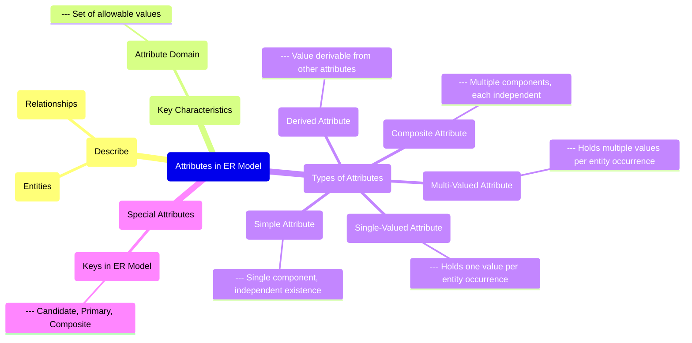

# Definition
Before proceeding, ensure you master [[Simple_Attribute]] and [[Multi_Valued_Attribute]].
In the Entity-Relationship (ER) Model, an **Attribute** is a property or characteristic that describes an [[Entity_Types]] or a [[Relationship_Types]]. Attributes provide specific details about the entities or relationships, differentiating one occurrence from another. For example, a `Student` entity might have attributes like `StudentID`, `StudentName`, `DateOfBirth`, and `Email`. An **Attribute Domain** is the set of allowable values for one or more attributes. Think of attributes as the various fields you would fill out on a form to describe a person or an item.

# The Mental Model
Imagine you're describing a car. The **Attributes** are all the details you'd list: its `Color`, `Make`, `Model`, `Year`, and `License_Plate_Number`. The car itself is the entity, and these details are its properties.

*Note: This `mindmap` centers `Attributes in ER Model`, branching out to show what they describe, their key characteristics, and various classifications, including their relationship to different types of `Keys`.*

# Context & Framework
### Where Does it Live? (The Map)
[[Attributes_in_ER_Model]] are integral to both [[Entity_Types]] and [[Relationship_Types]] within the [[Entity_Relationship_ER_Model]]. They provide the descriptive power that allows us to distinguish individual instances of entities or specific occurrences of relationships. Attributes are classified based on their structure (simple, composite), the number of values they can hold (single-valued, multi-valued), and whether their value is stored directly or computed (derived). They also play a critical role in forming [[Keys_in_ER_Model]] (candidate, primary, composite), which are essential for unique identification.

# The Mastery Deep Dive
### Opening the Hood: What's Inside?
Attributes come in several forms, each with distinct characteristics:
*   **Simple Attributes**: Cannot be broken down into smaller components (e.g., `StudentID`, `Age`).
*   **Composite Attributes**: Can be divided into smaller, meaningful components (e.g., `Address` composed of `Street`, `City`, `ZipCode`).
*   **Single-Valued Attributes**: Hold only one value for each entity occurrence (e.g., `DateOfBirth` for a person).
*   **Multi-Valued Attributes**: Can hold multiple values for each entity occurrence (e.g., `PhoneNumber` for a person who has multiple numbers).
*   **Derived Attributes**: Their values can be calculated from other attributes and are not stored directly (e.g., `Age` derived from `DateOfBirth` and current date).
Understanding these distinctions is crucial for accurately representing data properties and ensuring proper data storage and retrieval.

### The Translator: From "Lego" to "Jargon"
The informal idea of "details about a thing" (Lego) is translated into the formal term `Attributes` (Jargon). When we talk about "details that can be broken down further" versus "details that can't" (Lego), we're referring to `Composite Attributes` and `Simple Attributes` (Jargon), respectively. Similarly, "details where there can be many of them" becomes `Multi_Valued Attributes` (Jargon). This standardized language is essential for precise communication in database design.

# Constraints & Limitations
### The Hard Choice: Option A or Option B?
A common design challenge is deciding whether a specific piece of information should be modeled as a [[Simple_Attribute]], a [[Composite_Attribute]], or even be promoted to its own [[Entity_Types]]. For example, should `Address` be a composite attribute of a `Customer`, or should `Address` be a separate entity with its own ID, related to `Customer`? The trade-off is between **simplicity** (attribute) and **flexibility/granularity** (separate entity). A separate `Address` entity offers more flexibility if an address might need to participate in its own relationships (e.g., `Address Is_Location_Of Building`) or if multiple customers could share the same address. Conversely, keeping it as an attribute is simpler if address details are never needed independently.

# Significance & Application
Understanding Attributes is academically significant as it forms the basis for defining the properties of data elements in an ER model. In the real world, it's a fundamental skill for **Data Analysts**, **Database Designers**, and **Application Developers**. It is applied whenever data needs to be captured and stored, from designing fields in a customer relationship management (CRM) system to defining properties for products in an e-commerce catalog. Correctly identifying and categorizing attributes ensures that all necessary data points are collected, properly structured, and can be accurately queried and reported.

# The Worked Example
*Test your mastery. Cover the solutions below to test yourself first.*

Consider a university database that stores information about `Students`.

### Level 1: The Sanity Check (Verification)
**The Question:** For a `Student` entity, identify a common attribute that would be considered a simple attribute.
> **Solution:** `StudentID` (or `FirstName`, `LastName`).

### Level 2: The Crucible (Mastery & Edge Cases)
**The Scenario:** The university decides to track student `Degrees`. A student can hold multiple degrees (e.g., Bachelor's, Master's). A designer initially models `Degree` as a simple, single-valued attribute of `Student`.
**The Challenge:**
(a) Identify the specific type of attribute that `Degree` should ideally be, given the requirement that a student can hold multiple degrees.
(b) Explain why modeling it as a simple, single-valued attribute would be problematic for capturing this requirement.
(c) Describe how the `Degree` attribute would typically be represented in an ER diagram to reflect its correct type.
> **Solution:**
> (a) Given that a student can hold multiple degrees, `Degree` should ideally be modeled as a [[Multi_Valued_Attribute]].
> (b) Modeling `Degree` as a simple, single-valued attribute would be problematic because it can only store *one* value per `Student` occurrence. To store multiple degrees, one would either have to:
>    1.  Create multiple `Degree` columns (e.g., `Degree1`, `Degree2`), which is inflexible and limits the number of degrees.
>    2.  Store all degrees in a single `Degree` column as a comma-separated list, making it difficult to query individual degrees or maintain data integrity.
>    Neither option adheres to good database design principles.
> (c) In a traditional ER diagram, a multi-valued attribute like `Degree` would typically be represented by a **double-lined ellipse** connected to the `Student` entity.

# Key Takeaways
*   Attributes are properties that describe entities or relationships in the ER Model, providing specific details and differentiating occurrences.
*   They are classified by structure (simple, composite), value count (single-valued, multi-valued), and derivation (derived).
*   Correctly identifying and categorizing attributes is fundamental for capturing data requirements, forming keys, and ensuring accurate data representation in a database.

# Knowledge Graph Connections
| Concept                     | Connection / Relationship                                                                   |
| :
-------------------------- | :
------------------------------------------------------------------------------------------ |
| [[Entity_Relationship_ER_Model]] | This is a fundamental component of the ER model, defining properties of entities and relationships. |
| [[Entity_Types]]            | Attributes describe the characteristics and properties of these real-world objects.           |
| [[Relationship_Types]]      | Attributes can also describe specific properties of an association between entities.          |
| [[Keys_in_ER_Model]]        | Attributes are the building blocks that form candidate, primary, and composite keys.        |
| [[Simple_Attribute]]        | This is a specific classification of attributes that cannot be broken down further.           |
| [[Composite_Attribute]]     | This is a specific classification of attributes that can be broken down into sub-components.  |
| [[Single_Valued_Attribute]] | This is a specific classification of attributes that hold only one value per entity.          |
| [[Multi_Valued_Attribute]]  | This is a specific classification of attributes that can hold multiple values per entity.     |
| [[Derived_Attribute]]       | This is a specific classification of attributes whose values are calculated, not stored.      |
---