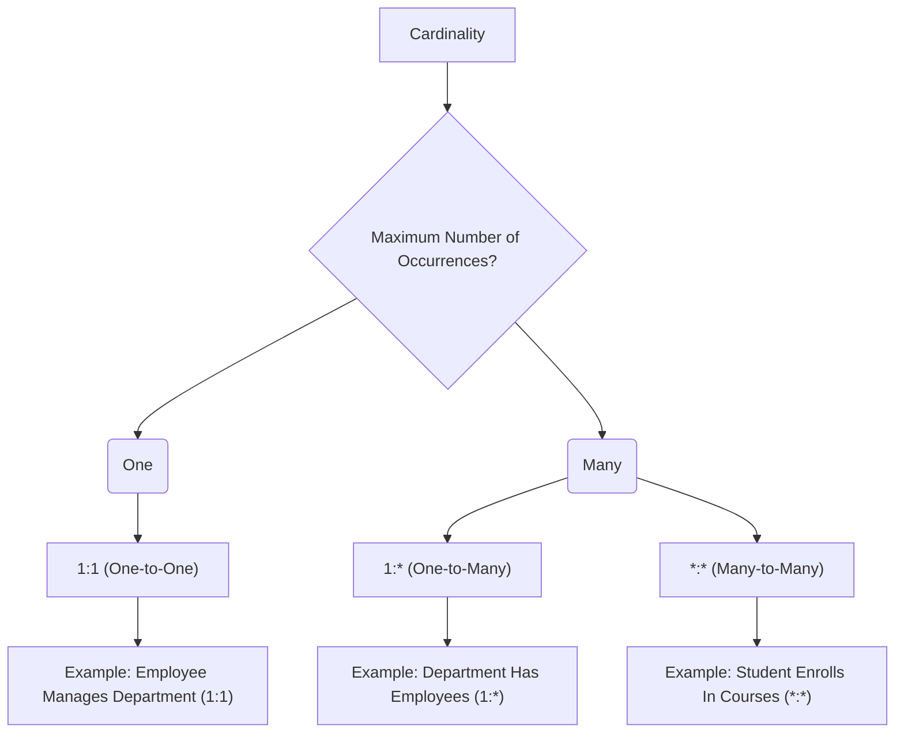

# Definition
Before proceeding, ensure you master [[Multiplicity_in_ER_Model]] and [[Participation_in_ER_Model]].
**Cardinality** in the Entity-Relationship (ER) Model describes the **maximum number** of possible [[Relationship_Types]] occurrences for an [[Entity_Types]] participating in a given relationship type. It represents the "upper limit" of how many times an entity instance can be associated with instances of another entity type through a specific relationship. Cardinality is a key component of [[Multiplicity_in_ER_Model]], which specifies the full range of participation. Common cardinalities include one-to-one (1:1), one-to-many (1:*), and many-to-many (*:*). Think of it like the maximum number of items you're allowed to check out from a library: "You can check out up to 5 books at a time." The "5" is the cardinality.

# The Mental Model
Imagine a single-lane bridge. Only **one** car can cross at a time. That "one" represents **Cardinality**: the maximum limit of participants at any given moment for a specific interaction. If it were a multi-lane highway, the cardinality might be "many."

*Note: This `graph TD` illustrates the concept of Cardinality, classifying relationships into One-to-One, One-to-Many, and Many-to-Many based on the maximum number of occurrences.*

# Context & Framework
### The Family Tree
[[Cardinality_in_ER_Model]] is a fundamental component of [[Multiplicity_in_ER_Model]], which falls under the umbrella of [[Structural_Constraints_in_ER_Model]]. It works in conjunction with [[Participation_in_ER_Model]] to fully define the quantitative aspects of [[Relationship_Types]] between [[Entity_Types]]. Correctly specifying cardinality is crucial for accurately translating business rules that involve quantitative limits into the [[Entity_Relationship_ER_Model]], ensuring that the database can enforce these maximum associations.

# The Mastery Deep Dive
### Opening the Hood: What's Inside?
Cardinality defines the "upper bound" of a relationship. It's usually expressed from the perspective of each entity type within the relationship:
*   **One-to-One (1:1)**: An occurrence of entity A relates to at most one occurrence of entity B, and vice-versa. (e.g., a `Country` `Has` `1:1` `Capital_City`).
*   **One-to-Many (1:*)**: An occurrence of entity A can relate to many occurrences of entity B, but an occurrence of entity B relates to at most one occurrence of entity A. (e.g., a `Department` `Has` `1:*` `Employees`).
*   **Many-to-Many (*:*)**: An occurrence of entity A can relate to many occurrences of entity B, and an occurrence of entity B can relate to many occurrences of entity A. (e.g., `Student` `Enrolls_In` `*:*` `Courses`).
These define the highest possible number of links an entity instance can have in a given relationship.

### Spot the Impostor: Clarifying that cardinality describes the *maximum* number of related occurrences.
A common "impostor" is confusing cardinality with participation. Cardinality is *only* concerned with the **maximum limit** of connections. For example, if a `Professor` can `Teach` "many" `Courses`, the cardinality is "many." Whether a professor *must* teach any course (minimum of one) or *may* teach zero courses is a matter of [[Participation_in_ER_Model]], not cardinality. The impostor assumes "many" implies "at least one," but "many" only defines the upper bound, not the lower bound.

# Constraints & Limitations
### The Devil's Advocate: Why might this be wrong?
Sometimes, a business rule might be misinterpreted as a strict cardinality when flexibility is actually required. For example, initially modeling `Department` `Manages` `Employee` as 1:1 (one department managed by exactly one employee, and one employee manages exactly one department) might seem correct. However, if the business later introduces matrix management or interim roles where an employee might manage zero departments or multiple departments, this strict 1:1 cardinality would break. The trade-off is between **enforcing strict, current rules** (precise cardinality) and **designing for future organizational flexibility** (more flexible cardinality, possibly 0:* or *:* if roles are dynamic).

# Significance & Application
Understanding Cardinality is academically significant as it provides the quantitative definition for relationship limits, essential for translating business rules into a precise data model. In the real world, it's an indispensable skill for **Database Designers** and **System Analysts**. It is applied whenever data relationships need to be precisely defined, from establishing how `Customers` `Place` `Orders` (typically 1:*) to modeling complex hierarchies where an `Employee` `Supervises` `Employees` (1:* recursively). Correctly specifying cardinality ensures that the database accurately enforces the maximum number of associations between entities, preventing data inconsistencies and reflecting organizational policies.

# The Worked Example
*Test your mastery. Cover the solutions below to test yourself first.*

Consider a database for a small publishing house tracking `Authors` and `Books`.

### Level 1: The Sanity Check (Verification)
**The Question:** For the relationship `Author Writes Book`, if an author can write many books, and a book can have only one author, what is the cardinality from `Author` to `Book` and from `Book` to `Author`?
> **Solution:** From `Author` to `Book` is **One-to-Many (1:*)**. From `Book` to `Author` is **One-to-One (1:1)**. (Overall a 1:* relationship).

### Level 2: The Crucible (Mastery & Edge Cases)
**The Scenario:** A designer models the relationship `Course Offered_In Semester` with a cardinality of 1:* from `Course` to `Semester` (meaning one course can be offered in many semesters, but a semester can offer many courses). The business rule is that a specific course can only be offered in a maximum of **one** semester per academic year.
**The Challenge:**
(a) Explain why the 1:* cardinality from `Course` to `Semester` is incorrect for the stated business rule.
(b) Describe the correct cardinality for the relationship `Course Offered_In Semester` to enforce the rule "a specific course can only be offered in a maximum of one semester per academic year."
(c) Discuss a common mistake related to cardinality when dealing with associative entities that link three or more entities.
> **Solution:**
> (a) The 1:* cardinality from `Course` to `Semester` is incorrect because it implies that a single `Course` can be related to *many* `Semester` occurrences. The business rule, however, states that a specific course can only be offered in a *maximum of one* semester *per academic year*. The `1:*` notation doesn't restrict it to "one per year."
> (b) To enforce the rule "a specific course can only be offered in a maximum of one semester per academic year," the cardinality of the relationship `Course Offered_In Semester` should effectively be seen as **1:1** *within the context of an academic year*. More precisely, if `Semester` implicitly includes `Year` (e.g., "Fall 2025"), then it means one `Course` is associated with at most one `Semester` record that year. If `Semester` is just "Fall" or "Spring", then a new associative entity `Course_Offering` (with `Course_ID`, `Semester_ID`, `Year`) would be needed, and its key would enforce the uniqueness.
> (c) A common mistake related to cardinality when dealing with associative entities that link three or more entities (e.g., a ternary relationship like `Student Registers_For Course In Semester`) is incorrectly breaking it down into multiple binary 1:* relationships. This often fails to capture the true *simultaneous* dependency or the specific cardinality of the interaction between all three entities, leading to an inaccurate representation of the business rule (e.g., not ensuring that a student's registration for a course is only valid for *one specific semester*). The correct approach requires carefully analyzing whether the relationship truly depends on the simultaneous existence of all entities involved.

# Key Takeaways
*   Cardinality defines the maximum number of relationship occurrences for an entity type, acting as the upper limit for associations.
*   It is a key component of multiplicity, specifying the "how many" aspect of relationships (1:1, 1:*, *:*).
*   Correctly specifying cardinality is crucial for enforcing business rules that dictate quantitative limits on relationships and for maintaining data consistency in the ER model.

# Knowledge Graph Connections
| Concept                     | Connection / Relationship                                                                   |
| :
-------------------------- | :
------------------------------------------------------------------------------------------ |
| [[Multiplicity_in_ER_Model]] | This is a fundamental component of multiplicity, specifying the maximum number of occurrences. |
| [[Participation_in_ER_Model]] | This works in conjunction with cardinality to define the full range of multiplicity.        |
| [[Structural_Constraints_in_ER_Model]] | Cardinality is a type of structural constraint that imposes quantitative limits on relationships. |
| [[Relationship_Types]]      | Cardinality defines the maximum associations that entity occurrences can have through these. |
| [[Entity_Types]]            | Cardinality describes the limits of how instances of these classifications can relate.        |
| [[Entity_Relationship_ER_Model]] | Cardinality is essential for representing the quantitative aspects of relationships within the ER model. |
---