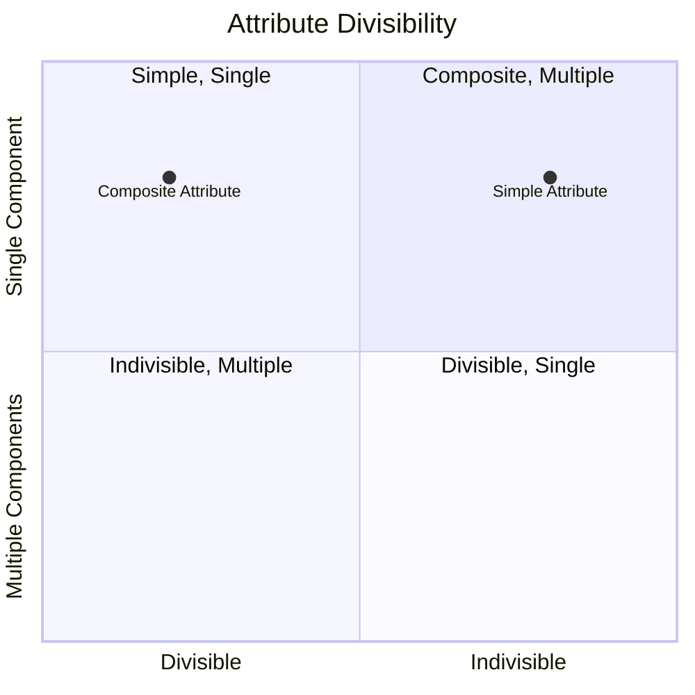

# Definition
Before proceeding, ensure you master [[Simple_Attribute]] and [[Multi_Valued_Attribute]].
A **Composite Attribute** is an [[Attributes_in_ER_Model]] that is composed of **multiple components**, each with its own independent existence and meaning. Unlike a [[Simple_Attribute]], it can be naturally subdivided into smaller, more granular attributes. For example, `Address` (composed of `Street`, `City`, `State`, `ZipCode`) or `Full_Name` (composed of `FirstName` and `LastName`) are composite attributes. In a traditional Entity-Relationship (ER) Model, it is often indicated by an ellipse with smaller ellipses branching off it, representing its components. Think of it like a "full meal deal" at a restaurant: it's one item on the menu, but it's clearly made up of a burger, fries, and a drink, each of which is a distinct component.

# The Mental Model
Imagine a Russian nesting doll. The outermost doll represents a **Composite Attribute** (e.g., `Address`). When you open it, you find smaller dolls inside, each representing a component `Simple_Attribute` (e.g., `Street`, `City`, `ZipCode`). The composite attribute is the whole, but it is clearly made of distinct, smaller parts.

*Note: This `quadrantChart` visually differentiates `Composite Attributes` from `Simple Attributes` based on their divisibility and number of components.*

# Context & Framework
### The Family Tree
Within the hierarchy of [[Attributes_in_ER_Model]], the composite attribute represents a structured, non-atomic property. It stands in direct contrast to a [[Simple_Attribute]], which cannot be further broken down. Recognizing composite attributes is crucial for achieving a more granular and normalized database design, especially during the translation from conceptual to [[Logical_Database_Design]]. By decomposing composite attributes into their simple components, data redundancy can be reduced, and querying capabilities can be significantly enhanced.

# The Mastery Deep Dive
### Opening the Hood: What's Inside?
The key characteristic of a composite attribute is its **decomposability into meaningful sub-components**. Each of these sub-components can, in turn, be either a simple or another composite attribute, though typically we decompose until all components are simple. For example, `Address` might be composite:
*   `Address`
    *   `Street_Address` (Simple)
    *   `City` (Simple)
    *   `State` (Simple)
    *   `Zip_Code` (Simple)
The ability to access and manipulate these sub-components independently is the primary driver for identifying an attribute as composite. If an application frequently needs to sort by `City` or filter by `Zip_Code`, then `Address` must be treated as composite.

### Spot the Impostor: Correcting the misconception that composite attributes are atomic, instead highlighting their structured nature.
A common misconception is treating a `Composite_Attribute` as if it were a `Simple_Attribute`. The "impostor" here is an attribute like `Full_Name` being modeled as simple, when business requirements dictate the need to access `FirstName` and `LastName` independently (e.g., for personalized greetings or sorting). If any part of the attribute has independent semantic meaning or is routinely used for querying, filtering, or validation, it is a composite attribute and should be decomposed. The structure of the attribute is key to its classification, not merely its single visual representation in prose.

# Constraints & Limitations
### The Devil's Advocate: Why might this be wrong?
While decomposing composite attributes into their simple components is generally good practice for normalization and querying, there can be situations where, for performance reasons or if a component is *never* accessed independently, a designer might choose to keep it as a single, concatenated string. For example, storing a `Full_Address` as one string might be faster for simple display purposes if no part of the address needs to be queried separately. The trade-off is between **normalization/flexibility** (decomposition) and **readability/performance for specific use cases** (keeping it as a single string). However, this usually comes with costs for future flexibility and data integrity if requirements change.

# Significance & Application
Understanding Composite Attributes is academically significant as it reinforces the concept of data granularity and the importance of decomposition for proper data modeling. In the real world, it's a fundamental skill for **Database Designers** and **Data Modelers**. It is applied extensively when designing schemas for various systems, such as breaking down `Customer_Name` into `FirstName` and `LastName`, or `Order_Date` into `Date` and `Time`. Correctly identifying and decomposing composite attributes ensures that data is stored in its most appropriate granular form, improving querying flexibility, reducing data redundancy, and facilitating data integrity.

# The Worked Example
*Test your mastery. Cover the solutions below to test yourself first.*

Consider a database for an online forum that tracks `Users`.

### Level 1: The Sanity Check (Verification)
**The Question:** For a `User` entity, would `Date_of_Birth` be considered a simple or composite attribute?
> **Solution:** `Date_of_Birth` would typically be considered a simple attribute.

### Level 2: The Crucible (Mastery & Edge Cases)
**The Scenario:** The forum decides to track `User_Login_Credentials`. A designer initially models `Login_Credentials` as a single `TEXT` attribute that stores both the `Username` and `Password` concatenated (e.g., "john_doe:secure_password").
**The Challenge:**
(a) Explain why `Login_Credentials`, as described, is a prime example of an attribute that should be modeled as a **composite attribute**.
(b) Identify the individual simple attributes that would compose `Login_Credentials`.
(c) Describe how modeling `Login_Credentials` as a composite attribute (or its components as separate attributes) provides practical benefits for the forum system.
> **Solution:**
> (a) `Login_Credentials` is a prime example of an attribute that should be modeled as a composite attribute because it is naturally made up of at least two distinct and independently meaningful components: `Username` and `Password`. These components are used separately for authentication and other operations.
> (b) The individual simple attributes that would compose `Login_Credentials` are `Username` and `Password`.
> (c) Modeling `Login_Credentials` as a composite attribute (or its components as separate attributes) provides practical benefits such as:
>    *   **Enhanced Security:** `Password` can be stored securely (e.g., hashed) separately from `Username`, and access controls can be applied to each independently.
>    *   **Improved Authentication:** `Username` and `Password` can be retrieved and validated individually during the login process.
>    *   **Greater Flexibility:** Allows for separate policies or operations on `Username` (e.g., uniqueness checks) versus `Password` (e.g., complexity requirements).
>    *   **Clearer Data Semantics:** Each piece of information retains its distinct meaning, preventing ambiguity and making the database schema easier to understand and maintain.

# Key Takeaways
*   A composite attribute is a property of an entity or relationship that is composed of multiple, individually meaningful sub-components.
*   Unlike simple attributes, composite attributes can be naturally subdivided, allowing for more granular data representation.
*   Correctly identifying and decomposing composite attributes enhances data granularity, improves querying flexibility, and reduces data redundancy, supporting effective database design.

# Knowledge Graph Connections
| Concept                     | Connection / Relationship                                                                   |
| :
-------------------------- | :
------------------------------------------------------------------------------------------ |
| [[Attributes_in_ER_Model]] | This is a specific classification of attributes, representing their decomposable nature.      |
| [[Simple_Attribute]]        | This is the contrasting classification, representing attributes that cannot be broken down further. |
| [[Single_Valued_Attribute]] | Composite attributes are often also single-valued, even though their components are distinct. |
| [[Entity_Relationship_ER_Model]] | Composite attributes are key for detailing properties of entities and relationships with structured sub-parts. |
| [[Logical_Database_Design]] | Decomposing composite attributes is a crucial step towards normalization in this phase.       |
---