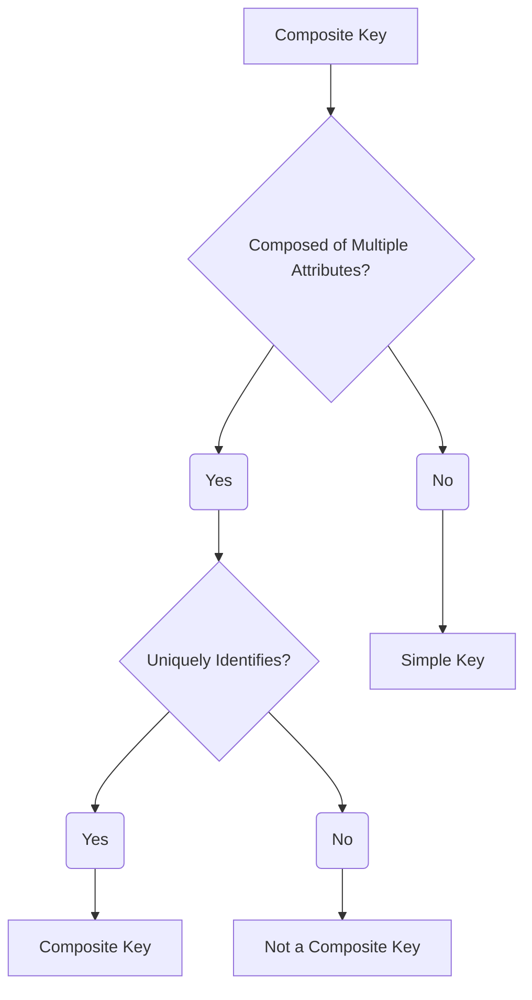

# Definition
Before proceeding, ensure you master [[Candidate_Key]] and [[Primary_Key]].
A **Composite Key** is a [[Candidate_Key]] (which can also be chosen as the [[Primary_Key]]) that consists of **two or more attributes** that, when combined, uniquely identify each occurrence of an [[Entity_Types]]. No single attribute within the composite key is sufficient for unique identification on its own; it is their combination that guarantees uniqueness. For example, for an `Enrollment` entity, a composite key might be `(StudentID, CourseID)`. In an Entity-Relationship (ER) Diagram, all attributes forming the composite key are underlined. Think of it like a street address that needs both a `Street_Name` and a `House_Number` to be unique within a city. Neither alone is enough.

# The Mental Model
Imagine a lock that requires two different keys inserted simultaneously to open. Both keys are necessary, and neither works alone. That's a **Composite Key**: a combination of two or more attributes that together provide unique identification.

*Note: This `graph TD` illustrates the definition of a Composite Key, emphasizing its multi-attribute composition for unique identification.*

# Context & Framework
### The Family Tree
A [[Composite_Key]] is a specific type of [[Candidate_Key]] (and potentially the [[Primary_Key]]) within [[Keys_in_ER_Model]]. It is typically used when an [[Entity_Types]] cannot be uniquely identified by a single attribute and requires the combination of several attributes. This often occurs with [[Weak_Entity_Type]]s, where their primary key is formed by combining the primary key of their owner entity with their own partial discriminator. Understanding composite keys is vital for modeling complex relationships and dependencies accurately within the [[Entity_Relationship_ER_Model]].

# The Mastery Deep Dive
### Opening the Hood: What's Inside?
The core principle of a composite key is that **individual components are not unique on their own**, but their combination is.
*   **`Enrollment` Entity**: `(StudentID, CourseID)`
    *   `StudentID` alone is not unique (a student enrolls in many courses).
    *   `CourseID` alone is not unique (many students enroll in one course).
    *   But `(StudentID, CourseID)` combined is unique (a student enrolls in a specific course only once).
This structure is particularly common in **associative entities** (entities that represent a many-to-many relationship) or for [[Weak_Entity_Type]]s, where the identifying attributes are drawn from both the weak entity and its strong owner. It directly reflects a business rule that requires multiple pieces of information to pinpoint a unique record.

### Spot the Impostor: Clarifying that a composite key combines two or more attributes for unique identification.
A common "impostor" scenario involves confusing a composite key with a simple primary key that happens to have multiple non-key attributes. The key distinction is that *all* attributes within the composite key are essential for its unique identification. If any attribute can be removed from the set while maintaining uniqueness, then it's not a minimal composite key (it's a superkey). For example, if `ProductID` alone is unique, then `(ProductID, ProductName)` is a composite *superkey* but not a minimal composite *candidate key*, as `ProductName` is redundant for uniqueness.

# Constraints & Limitations
### The Devil's Advocate: Why might this be wrong?
While composite keys are necessary for many logical designs, they can introduce some implementation complexities. Longer, multi-attribute keys can increase storage space (in the base table and in foreign keys that reference it), potentially reduce query performance (due to more complex key comparisons in indexes and joins), and make SQL statements more verbose. The trade-off is between **logical accuracy/semantic meaning** (composite key reflects reality) and **implementation simplicity/performance** (a single, simple, often surrogate, primary key is usually faster). Designers often use a surrogate primary key (e.g., `EnrollmentID`) even if a natural composite key exists, then apply a unique constraint to the composite attributes.

# Significance & Application
Understanding Composite Keys is academically significant as it clarifies how complex entities are uniquely identified, especially in many-to-many relationships and with weak entities. In the real world, it's a fundamental skill for **Database Designers** and **Data Modelers**. It is applied extensively when designing schemas for:
*   **Junction tables**: Linking two entities in a many-to-many relationship (e.g., `Order_Item` linking `Order` and `Product` via `(OrderID, ProductID)`).
*   **Weak entities**: Identifying entities that depend on another entity's primary key (e.g., `(BuildingID, RoomNumber)` for a `Room`).
*   **Historical data**: `(EmployeeID, EffectiveDate)` for an `Employee_Salary_History`.
Correctly using composite keys ensures that unique identification is maintained even for entities that are inherently defined by multiple related properties.

# The Worked Example
*Test your mastery. Cover the solutions below to test yourself first.*

Consider a database for a university that tracks `Course_Offerings`. A `Course_Offering` is a specific instance of a `Course` in a particular `Semester`.

### Level 1: The Sanity Check (Verification)
**The Question:** For the `Course_Offering` entity, would `(Course_ID, Semester_ID)` likely form a **Composite_Key**?
> **Solution:** Yes, `(Course_ID, Semester_ID)` would likely form a **Composite_Key**.

### Level 2: The Crucible (Mastery & Edge Cases)
**The Scenario:** A designer is creating a `Flight_Leg` entity, representing a single segment of a flight (e.g., "Flight 101 from London to Paris"). The attributes are `Flight_Number`, `Segment_Number`, `Departure_Airport_Code`, `Arrival_Airport_Code`, and `Departure_Time`. The designer proposes `(Flight_Number, Segment_Number)` as the primary key.
**The Challenge:**
(a) Explain why `(Flight_Number, Segment_Number)` is a suitable **Composite_Key** for `Flight_Leg` in this context.
(b) Discuss whether `(Flight_Number, Departure_Airport_Code, Arrival_Airport_Code)` could also be a composite key, and identify any potential issues compared to the proposed key.
(c) Describe a scenario where `Segment_Number` alone would be a primary key, making `Flight_Leg` identifiable by a simple key.
> **Solution:**
> (a) `(Flight_Number, Segment_Number)` is a suitable [[Composite_Key]] for `Flight_Leg` because:
>    1.  `Flight_Number` alone is not unique (a flight has multiple segments).
>    2.  `Segment_Number` alone is not unique (multiple flights have a segment 1).
>    3.  Together, `(Flight_Number, Segment_Number)` uniquely identifies a specific flight segment (e.g., "Flight 101, Segment 1"). It is minimal as neither part can be removed while maintaining uniqueness for a flight leg.
> (b) `(Flight_Number, Departure_Airport_Code, Arrival_Airport_Code)` *could* potentially be a composite key, assuming a flight doesn't have multiple legs between the same two airports. However, it is **less ideal** than `(Flight_Number, Segment_Number)` because:
>    *   **Less Stable:** `Segment_Number` is a more stable, sequential identifier within a flight. If a flight route changes (e.g., an intermediate stop is added or removed), the `Departure_Airport_Code` and `Arrival_Airport_Code` might change for existing segments, potentially altering the primary key value (which is generally undesirable for primary keys).
>    *   **Not Strictly Minimal:** `Segment_Number` is often designed to intrinsically capture the order and uniqueness within a flight. The airport codes, while unique for a given segment, might be redundant if `Segment_Number` already guarantees uniqueness in conjunction with `Flight_Number`.
> (c) `Segment_Number` alone would be a primary key, making `Flight_Leg` identifiable by a simple key, if `Flight_Leg` represented *all possible flight segments globally*, each assigned a truly unique `Segment_Number` independent of any specific `Flight_Number`. This would imply that `Segment_Number` is a surrogate key globally unique across all flights and segments, rather than a sequential identifier within a flight.

# Key Takeaways
*   A composite key consists of two or more attributes that, when combined, uniquely identify an entity occurrence, where no single attribute is sufficient alone.
*   It is a specific type of candidate key (and often the primary key) essential for entities whose identity is defined by multiple properties or foreign keys.
*   Correctly using composite keys ensures unique identification for complex entities, particularly in many-to-many relationships and with weak entities, though it can introduce implementation trade-offs.

# Knowledge Graph Connections
| Concept                     | Connection / Relationship                                                                   |
| :
-------------------------- | :
------------------------------------------------------------------------------------------ |
| [[Keys_in_ER_Model]]        | This is a specific type of key, defined by its multi-attribute composition.                   |
| [[Candidate_Key]]           | A composite key can be a candidate key if it is a minimal set of attributes.                |
| [[Primary_Key]]             | A composite key can be chosen as the primary key if it uniquely identifies the entity.        |
| [[Attributes_in_ER_Model]] | Composite keys are formed by combining two or more of these properties.                       |
| [[Weak_Entity_Type]]        | The primary key of a weak entity is always a composite key, including the owner's primary key. |
| [[Entity_Relationship_ER_Model]] | Composite keys are fundamental for representing the unique identity of complex entities within the ER model. |
---