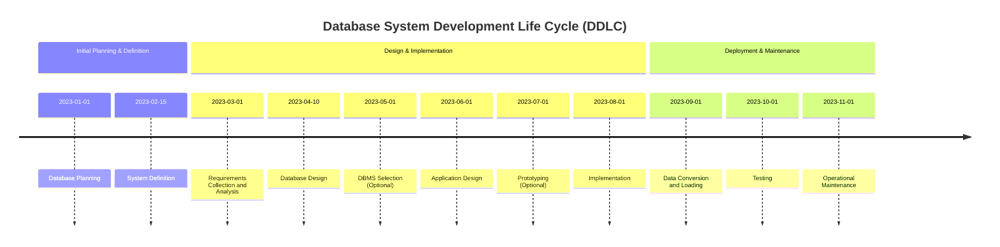

# Definition
Before proceeding, ensure you master [[Conceptual_Database_Design]] and [[Logical_Database_Design]].
A Database Development Methodology, often referred to as the Database System Development Life Cycle (DDLC), is a structured approach encompassing a series of phases or stages for designing, implementing, and maintaining a database system. It treats the database as a fundamental component of a larger information system, guiding its development from initial planning through to operational maintenance. Think of it like building a house: you don't just start laying bricks; you follow a structured plan, from initial blueprints to final touches, ensuring every step is accounted for and interconnected.

# The Mental Model
Imagine you're baking a multi-layered cake. The **Database Development Methodology** is your entire recipe book and the process you follow from deciding what kind of cake to make (planning), gathering ingredients (requirements), designing the cake layers (design), baking it (implementation), tasting it (testing), and keeping it fresh (maintenance). Each step is crucial, and skipping one can lead to a messy, unpalatable result.

*Note: This `timeline` illustrates the sequential progression of phases within the Database System Development Life Cycle, highlighting their typical order and interdependence.*

# Context & Framework
### The Problem: Why Did We Invent This?
The Database Development Methodology emerged to address the complexities and potential chaos inherent in developing robust information systems. Historically, without a structured approach, database projects often suffered from scope creep, unmet user requirements, data inconsistencies, security vulnerabilities, and budget overruns. The methodology provides a standardized framework to mitigate these risks by enforcing systematic planning, clear communication, and phased execution, ensuring that the final database effectively supports organizational objectives.

# The Mastery Deep Dive
### Version 1.0 vs. Today
Early database development often involved ad-hoc approaches, where databases were designed in isolation or as afterthoughts to application development. This led to monolithic systems with poor flexibility and scalability. Today's methodologies, while still rooted in core principles, are significantly more iterative and agile, incorporating user feedback at earlier stages through prototyping and emphasizing continuous integration and maintenance. The fundamental phases remain, but the tools and techniques within each phase have evolved to prioritize efficiency, adaptability, and user-centric design.

### The "Same Story, Different Setting"
The structured approach of the DDLC is not unique to databases; it mirrors the Software Development Life Cycle (SDLC) used for broader software systems. Just as building a complex application requires distinct phases like planning, design, coding, and testing, a database—being a critical component—requires its own tailored lifecycle. This parallel highlights the universal need for systematic processes in engineering complex digital artifacts, where each phase builds upon the last, preventing costly errors and ensuring a cohesive final product.

# Constraints & Limitations
### The Hard Choice: Option A or Option B?
Database development methodologies, while providing structure, can sometimes be perceived as rigid or time-consuming, especially in fast-paced environments. A key trade-off lies between strict adherence to every phase (which ensures thoroughness but can delay delivery) versus adopting more agile, adaptive strategies (which offer speed but might risk overlooking critical details if not managed carefully). Organizations must decide which approach best fits their project's scale, complexity, and risk tolerance, recognizing that a "one-size-fits-all" solution is rarely optimal.

# Significance & Application
The Database Development Methodology is academically significant as it provides a theoretical framework for understanding how complex data systems are conceived and brought to life. In the real world, it is indispensable for **Database Administrators (DBAs)**, **System Analysts**, and **Software Engineers** who are involved in designing and managing databases. Adhering to a methodology ensures that databases are scalable, secure, and performant, directly impacting an organization's ability to store, retrieve, and utilize critical information effectively. This systematic approach reduces errors, minimizes rework, and ultimately leads to more reliable and efficient information systems.

# The Worked Example
*Test your mastery. Cover the solutions below to test yourself first.*

Consider a university proposing a new online course registration system. They must implement a new database.

### Level 1: The Sanity Check (Verification)
**The Question:** Identify the *first two* phases that the university should undertake in their database development methodology before any actual data modeling begins.
> **Solution:** The first two phases are `Database Planning` and `System Definition`.

### Level 2: The Crucible (Mastery & Edge Cases)
**The Scenario:** During the `Requirements Collection and Analysis` phase, the university's IT department focuses heavily on interviewing faculty members about their grading and student tracking needs. However, they neglect to gather input from the Bursar's Office regarding financial holds on student accounts.
**The Challenge:**
(a) Explain how this oversight violates a core principle of the Database Development Methodology.
(b) Predict a potential critical issue that could arise during the `Application Design` or `Implementation` phases due directly to this omission.
(c) Describe how a robust DDLC would typically prevent such an issue.
> **Solution:**
> (a) This oversight violates the **`Requirements Collection and Analysis`** phase's principle of comprehensively gathering information from *all relevant stakeholders*. The Bursar's Office is a critical stakeholder whose data requirements (e.g., student financial status impacting registration eligibility) directly affect the core functionality of a course registration system.
> (b) A critical issue that could arise is the **inability to enforce financial holds on student registrations**. During `Application Design`, the logic for checking financial eligibility would be incomplete or missing. In `Implementation`, students with outstanding fees could register for courses, leading to significant financial losses or administrative complications for the university.
> (c) A robust DDLC, particularly in the `Requirements Collection and Analysis` phase, would typically involve diverse information gathering techniques such as **interviewing end users *individually and in a group***, **questionnaire surveys**, and **examining different documents like forms and reports** from all departments interacting with student registration. This comprehensive approach ensures that all necessary business rules and data requirements are identified and analyzed *before* proceeding to design, thereby preventing critical omissions like neglecting financial holds.

# Key Takeaways
*   The Database Development Methodology (DDLC) is a structured, phased approach for designing, implementing, and maintaining database systems, treating them as integral parts of wider information systems.
*   It encompasses distinct stages from initial planning and requirements gathering through design, implementation, testing, and ongoing maintenance to ensure robust and effective database solutions.
*   Adhering to the DDLC is crucial for mitigating risks like scope creep, data inconsistencies, and security issues, ultimately leading to more reliable and efficient information systems.

# Knowledge Graph Connections
| Concept                     | Connection / Relationship                                                                                                           |
| :
-------------------------- | :
---------------------------------------------------------------------------------------------------------------------------------- |
| [[Conceptual_Database_Design]] | The first and most abstract phase within the overall database development methodology.                                                          |
| [[Logical_Database_Design]]   | Follows conceptual design, mapping the conceptual model to a specific data model within the methodology.                               |
| [[Physical_Database_Design]]  | The final design phase, detailing the implementation on secondary storage within the overall development process.                       |
| Requirements_Collection_And_Analysis | A critical phase within the methodology that feeds into all subsequent design stages.                                                      |
| Information_System      | The broader context within which database development methodology operates, as the database is a fundamental component.                 |
---