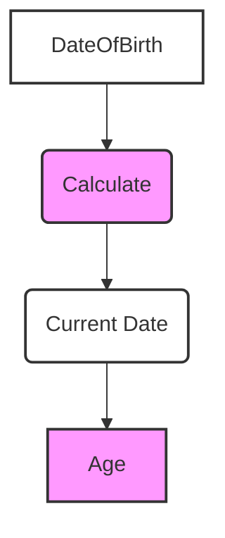

# Definition
Before proceeding, ensure you master [[Attributes_in_ER_Model]] and [[Single_Valued_Attribute]].
A **Derived Attribute** is an [[Attributes_in_ER_Model]] that represents a value that is **derivable** (calculable) from the value of a related attribute or a set of attributes, not necessarily within the same [[Entity_Types]]. Its value is not explicitly stored in the database but is computed whenever it is needed. For example, `Age` can be derived from `DateOfBirth` and the current date; `Total_Price` can be derived from `Quantity` and `Unit_Price`. In a traditional Entity-Relationship (ER) Model, a derived attribute is represented by a dotted-lined oval or ellipse. Think of it like the "total" line on a grocery receipt: it's not an item you buy, but it's calculated from the sum of all the individual item prices.

# The Mental Model
Imagine a calculator. You input two numbers (e.g., `Quantity` and `Price`), and it *calculates* the `Total`. The `Total` is the **Derived Attribute**; it's not something you directly store, but something you compute from other stored values.

*Note: This `graph TD` illustrates how `Age` (a derived attribute) is calculated from `DateOfBirth` and the `Current Date`.*

# Context & Framework
### The "Duh!" Moment (Intuitive Proof)
The concept of derived attributes is intuitively logical because it prevents data redundancy and potential inconsistencies. If `Age` were stored directly alongside `DateOfBirth`, it would need to be constantly updated (e.g., daily or yearly) to remain accurate. If this update process failed, `Age` could become inconsistent with `DateOfBirth`. By deriving `Age` on the fly, you ensure its accuracy is always tied to the source (`DateOfBirth`), eliminating the need for redundant storage and complex update mechanisms. It's simply a dynamic view of existing data.

# The Mastery Deep Dive
### Opening the Hood: What's Inside?
Derived attributes possess several key characteristics:
*   **Non-Stored**: Their values are not physically stored in the database.
*   **Calculated on Demand**: Their values are computed at the moment they are requested (or through a materialized view for performance).
*   **Source Dependency**: They always rely on one or more base attributes for their calculation. These base attributes can be from the same entity, a related entity, or even system functions (like `CURRENT_DATE`).
*   **Consistency Guarantee**: Because they are calculated, their values are always consistent with their source data.
Common examples include `Experience_Years` (from `Hire_Date`), `Number_Of_Orders` (by counting associated `Order` entities), or `Grade_Point_Average` (from individual course grades).

### The Translator: Converting English to Math
When you describe something whose value is "found out by looking at other numbers" (English), you're talking about a `Derived Attribute` (Exam Term). The mathematical formalization of this is:
$$ \boxed{\displaystyle \text{Derived\_Value} = f(\text{Other\_Attributes})} $$
This means the derived attribute is a *function* of other attributes. For example, for `Age`:
$$ \boxed{\displaystyle \text{Age} = \text{CURRENT\_DATE} - \text{DateOfBirth}} $$
This mathematical representation makes the derivation explicit and unambiguous, showing exactly how the value is computed from its sources.

# Constraints & Limitations
### The Devil's Advocate: Why might this be wrong?
While derived attributes offer benefits in data consistency and reduced redundancy, they come with a potential trade-off: **performance overhead**. Computing values on the fly, especially for complex derivations or large datasets, can be slower than retrieving a pre-stored value. If a derived attribute is frequently accessed, and its calculation is computationally intensive, storing it (and updating it via triggers or scheduled jobs) might be a more performant option, despite introducing redundancy. The decision to derive or store often hinges on the frequency of access versus the cost of calculation and maintenance.

# Significance & Application
Understanding Derived Attributes is academically significant as it introduces the concept of computed data and the trade-offs between storage and calculation. In the real world, it's a valuable skill for **Database Designers**, **Business Intelligence Developers**, and **Reporting Analysts**. It is applied whenever data can be logically inferred from existing information, such as calculating `Total_Sales` for a month from individual `Transaction` records, or `Employee_Tenure` from their `Hire_Date`. Correctly identifying and managing derived attributes optimizes storage, ensures data consistency, and simplifies data maintenance, preventing update anomalies.

# The Worked Example
*Test your mastery. Cover the solutions below to test yourself first.*

Consider a simplified database for a company tracking its `Employees`.

### Level 1: The Sanity Check (Verification)
**The Question:** If the `Employee` entity has a `Salary` attribute and a `Bonus_Percentage` attribute, would `Total_Compensation` (calculated as `Salary` + (`Salary` * `Bonus_Percentage`)) be a derived attribute?
> **Solution:** Yes, `Total_Compensation` would be a derived attribute.

### Level 2: The Crucible (Mastery & Edge Cases)
**The Scenario:** An `Order` entity has `Quantity` and `UnitPrice` attributes. A designer initially stores `LineItem_Total` (which is `Quantity` * `UnitPrice`) as a direct attribute of the `Order` entity, updating it every time `Quantity` or `UnitPrice` changes.
**The Challenge:**
(a) Explain the data consistency issue that could arise if `LineItem_Total` is stored directly and an update to `Quantity` fails to propagate to `LineItem_Total`.
(b) Describe how modeling `LineItem_Total` as a derived attribute would resolve this consistency issue.
(c) Discuss a scenario where, despite the consistency benefits, storing `LineItem_Total` might be preferred over deriving it.
> **Solution:**
> (a) If `LineItem_Total` is stored directly and an update to `Quantity` fails to propagate, a **data inconsistency** would arise. The `LineItem_Total` would no longer accurately reflect the product of `Quantity` and `UnitPrice`, leading to incorrect financial calculations, reporting errors, and distrust in the data.
> (b) Modeling `LineItem_Total` as a derived attribute would resolve this consistency issue because its value would **always be computed on the fly** from the current `Quantity` and `UnitPrice`. There would be no `LineItem_Total` value to update or fail to update, ensuring it is perpetually synchronized with its source attributes.
> (c) Storing `LineItem_Total` might be preferred over deriving it in scenarios where:
>    1.  **High Read Volume / Low Write Volume:** The `LineItem_Total` is accessed extremely frequently (e.g., millions of times per second for reporting), but `Quantity` or `UnitPrice` rarely changes. In this case, the overhead of re-calculating the value for every read could be higher than the storage and update cost.
>    2.  **Complex Calculation:** The derivation of `LineItem_Total` involves a very complex, resource-intensive calculation across many related tables. Storing the pre-computed value can avoid repeated expensive computations.
>    3.  **Historical Accuracy (Snapshot):** If `LineItem_Total` needs to represent the total *at the time of the order* (e.g., reflecting prices that might change later), and `Quantity` or `UnitPrice` could be updated for other reasons, storing it provides a historical snapshot that deriving would not.

# Key Takeaways
*   A derived attribute is an attribute whose value is calculable from other attributes, rather than being explicitly stored in the database.
*   It is computed on demand, ensuring data consistency by eliminating redundancy and preventing update anomalies.
*   While offering consistency benefits, derived attributes introduce a trade-off with potential performance overhead, necessitating careful consideration of storage versus calculation costs.

# Knowledge Graph Connections
| Concept                     | Connection / Relationship                                                                   |
| :
-------------------------- | :
------------------------------------------------------------------------------------------ |
| [[Attributes_in_ER_Model]] | This is a specific classification of attributes, representing their computed nature.          |
| [[Single_Valued_Attribute]] | Derived attributes are typically single-valued, producing one calculated result.              |
| [[Entity_Types]]            | Derived attributes often describe properties of entities, calculated from other entity attributes. |
| Data_Consistency        | Derived attributes inherently promote this by eliminating redundant storage and update anomalies. |
| Performance_Optimization | The decision to store vs. derive an attribute often involves a trade-off related to this.     |
---