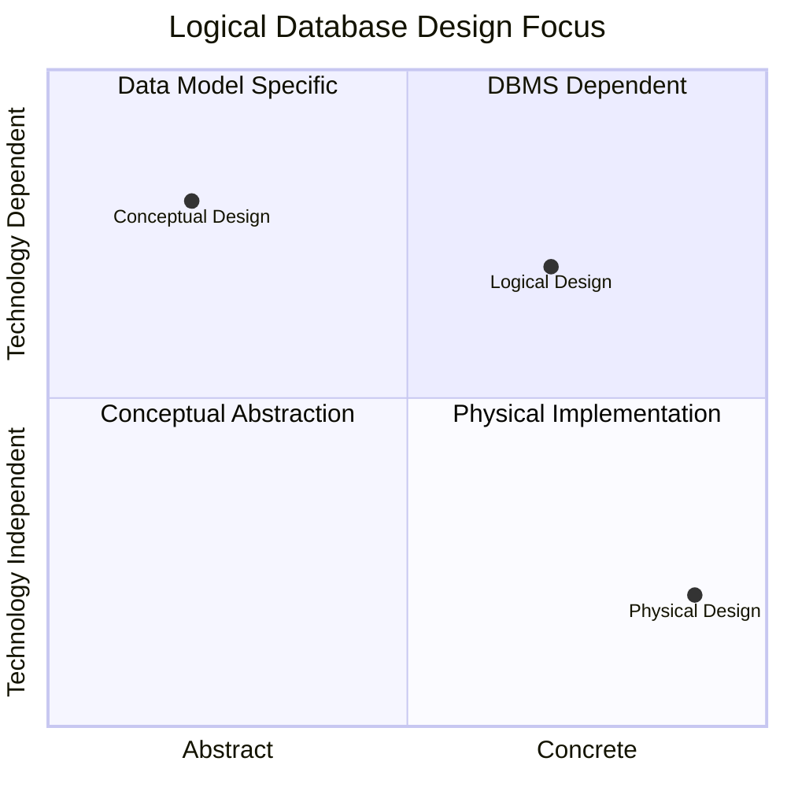

# Definition
Before proceeding, ensure you master [[Conceptual_Database_Design]] and [[Physical_Database_Design]].
Logical Database Design is the phase in the Database Development Life Cycle where the conceptual data model is transformed into a model based on a **specific data model** (e.g., relational, network, hierarchical), while remaining **independent of a particular DBMS's physical considerations**. It defines the structure of data in terms of tables, columns, primary keys, foreign keys, and relationships, adhering to the rules of the chosen data model. Imagine it as taking the abstract blueprint of a building (conceptual design) and translating it into architectural drawings that specify the exact dimensions of rooms, placement of doors, and type of walls, without yet considering the brand of paint or the material of the pipes.

# The Mental Model
Think of **Logical Database Design** as organizing a messy collection of notes into a well-structured spreadsheet. You decide on the columns (attributes), rows (records), and how different sheets relate to each other (relationships). You're choosing the *format* (spreadsheet, i.e., relational model) for your information, but you're not yet thinking about which specific spreadsheet software (DBMS) you'll use or where you'll save the file (physical considerations).

*Note: This `quadrantChart` visually positions Logical Database Design as more concrete and data model-specific than Conceptual Design, but still less technology-dependent than Physical Design.*

# Context & Framework
### The Problem: Why Did We Invent This?
Logical database design bridges the gap between the high-level, abstract representation of data (from [[Conceptual_Database_Design]]) and the practical realities of database implementation. It was invented to provide a structured way to translate generalized data requirements into a format that a computer system can understand and process, adhering to the rules of a chosen data model. Without this intermediary step, directly moving from a conceptual idea to a physical implementation would be prone to errors, inconsistencies, and a lack of adherence to established data principles, making the database difficult to manage and query.

# The Mastery Deep Dive
### Spot the Impostor: Addressing typical confusions regarding the specific focus and independence of logical design.
A common confusion arises when distinguishing logical design from both conceptual and physical design. Unlike conceptual design, logical design *is* dependent on a specific data model (e.g., the relational model, which defines tables and foreign keys). However, it differs from physical design by *avoiding* specific DBMS physical considerations, such as storage structures (e.g., B-trees, hash files), indexing strategies, or hardware specifications. Its independence lies in defining the data structure in a universally understood way *for a given data model*, before committing to a particular vendor's implementation.

### The Cheat Code: How to Remember This
To remember the role of logical design, think of it as "L for Language-Specific (Data Model) but L for Lacking (Physical Details)." It's where you commit to a specific data modeling language (like the relational model with its tables and relationships) but you still *lack* the granular details of how that language will be *physically stored* by a particular database system. This mnemonic helps delineate its unique position between pure abstraction and concrete implementation.

# Constraints & Limitations
### The Devil's Advocate: Why might this be wrong?
While logical database design aims for independence from physical considerations, the choice of a specific data model (e.g., relational) inherently brings its own set of constraints and assumptions. For instance, the relational model's emphasis on normalization might lead to a design that performs poorly for certain analytical queries, necessitating denormalization later in physical design. This highlights that "independence" at the logical stage is relative; the chosen data model can influence downstream performance and flexibility, potentially requiring compromises or adjustments in later stages if not carefully considered against anticipated use cases.

# Significance & Application
Logical Database Design is academically significant as it teaches the principles of transforming abstract data requirements into structured, coherent models, often emphasizing Normalization techniques. In the real world, it is a core skill for **Database Designers**, **Data Modelers**, and **Software Architects**. It is applied across all industries, serving as the blueprint for creating actual database schemas. For example, when designing a database for an e-commerce platform, logical design would define tables like `Customers`, `Orders`, and `Products`, specify their attributes, and establish relationships between them using foreign keys, ensuring data integrity and efficient querying.

# The Worked Example
*Test your mastery. Cover the solutions below to test yourself first.*

Following a conceptual design for a library system that identified `Book`, `Member`, and `Loan` as entities, the team moves to logical design. They decide to use the relational model.

### Level 1: The Sanity Check (Verification)
**The Question:** For the `Book` entity from the library system, list two common relational database constructs that would be defined for it during logical database design.
> **Solution:** Two common constructs would be: `Table name (e.g., Books)` and `Column names (e.g., ISBN, Title, Author)`.

### Level 2: The Crucible (Mastery & Edge Cases)
**The Scenario:** During logical design, the team creates a `Members` table with `MemberID` as the primary key and includes `FirstName`, `LastName`, and `MemberAddress`. For `MemberAddress`, they create a single column of type `TEXT` to store the entire address (e.g., "123 Main St, Anytown, USA 12345").
**The Challenge:**
(a) Identify a potential problem with this design choice for `MemberAddress` from a logical database design perspective.
(b) Suggest an improvement to the `MemberAddress` representation that aligns better with logical design principles.
(c) Explain how this improvement would benefit the database system.
> **Solution:**
> (a) A potential problem with using a single `TEXT` column for `MemberAddress` is that it violates the principle of **atomicity** in logical design (specifically, it's a composite attribute being treated as simple). It makes it difficult to query or manipulate individual components of the address (e.g., city, zip code) without complex string parsing.
> (b) An improvement would be to **decompose `MemberAddress` into multiple, atomic columns**, such as `Street_Address`, `City`, `State`, and `Zip_Code`.
> (c) This improvement would benefit the database system by:
>    *   **Enhancing data integrity:** Ensuring that each component of the address is stored in its appropriate format and can be individually validated.
>    *   **Improving query flexibility:** Allowing users to easily search or filter members based on specific address components (e.g., all members in 'Anytown').
>    *   **Facilitating reporting:** Enabling easier generation of reports that require address breakdowns.
>    *   **Supporting normalization:** Aligning with normalization principles by ensuring that each attribute is atomic and non-reducible.

# Key Takeaways
*   Logical database design transforms the conceptual model into a specific data model (e.g., relational), independent of physical DBMS considerations.
*   It defines structural elements like tables, columns, primary keys, foreign keys, and relationships according to the chosen data model's rules.
*   This phase acts as a crucial bridge, formalizing data structures from abstract requirements before physical implementation, ensuring data integrity and query efficiency.

# Knowledge Graph Connections
| Concept                     | Connection / Relationship                                                                                                           |
| :
-------------------------- | :
---------------------------------------------------------------------------------------------------------------------------------- |
| [[Database_Development_Methodology]] | This design phase follows conceptual design and precedes physical design within the overall development process.                       |
| [[Conceptual_Database_Design]] | This is the preceding phase, providing the abstract data model that logical design translates into a specific data model.           |
| [[Physical_Database_Design]]  | This is the subsequent phase, where the logical design is implemented with specific storage structures and optimizations.              |
| [[Entity_Relationship_ER_Model]] | This model is often used to represent the conceptual design, which is then translated into the logical model.                     |
| Relational_Model        | This is a common specific data model that the conceptual design is mapped to during logical design.                                    |
---