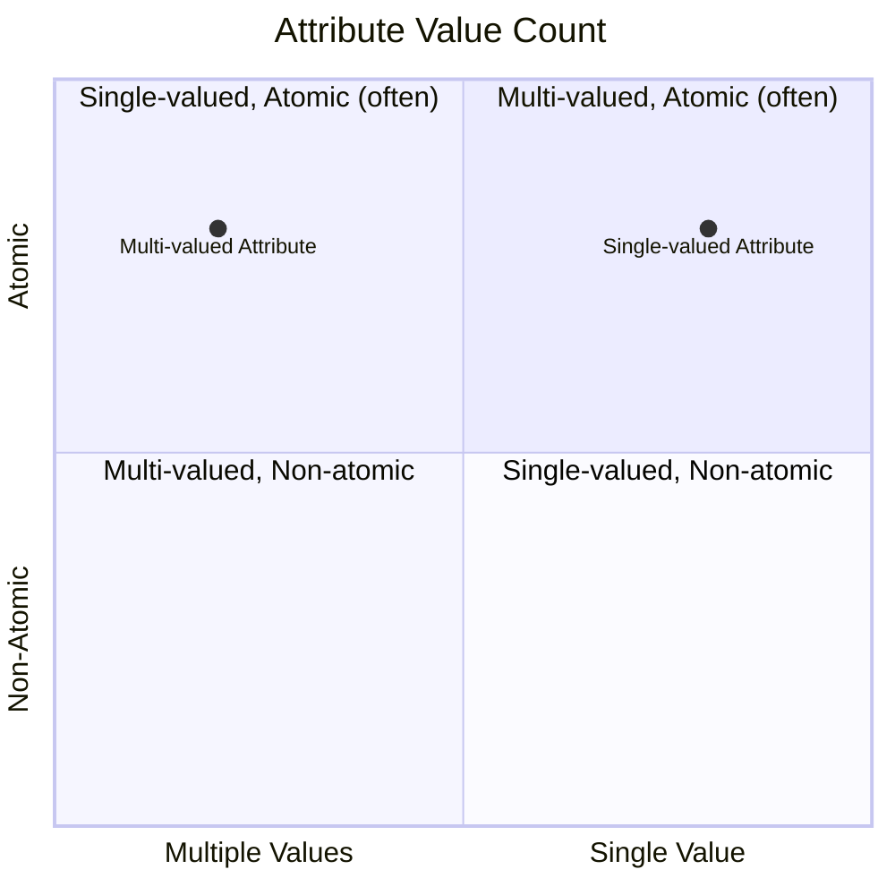

# Definition
Before proceeding, ensure you master [[Single_Valued_Attribute]] and [[Composite_Attribute]].
A **Multi-Valued Attribute** is an [[Attributes_in_ER_Model]] that can hold **multiple values** for each occurrence of an [[Entity_Types]] (or relationship type). This means that for a single instance of an entity, that attribute can have a collection of data associated with it, rather than just one. For example, `Phone_Number` for a `Person` (if a person has multiple phone numbers), `Skills` for an `Employee`, or `Degrees` for a `Student` are typically multi-valued attributes. In a traditional Entity-Relationship (ER) Model, it is usually represented by a double-lined oval or ellipse. Think of it as a field on a resume where you can list multiple "Skills."

# The Mental Model
Imagine a backpack. You can put **multiple** items inside it – books, pens, a water bottle. That's a **Multi-Valued Attribute**: a property that can contain a collection of distinct values for a single entity instance.

*Note: This `quadrantChart` visually differentiates `Multi-Valued Attributes` from `Single-Valued Attributes` based on the number of values they can hold.*

# Context & Framework
### The Family Tree
Within the broad classification of [[Attributes_in_ER_Model]], the multi-valued attribute is distinct because it violates the principle of atomicity if represented directly as a single column in a relational database. It directly contrasts with a [[Single_Valued_Attribute]], which can only hold one value per entity occurrence. Multi-valued attributes often signal the need for further normalization during the translation from conceptual to [[Logical_Database_Design]], typically by creating a separate entity and an identifying relationship to store the multiple values.

# The Mastery Deep Dive
### Opening the Hood: What's Inside?
The defining characteristic of a multi-valued attribute is its **ability to hold a set of values for a single entity instance**. For example, a `Student` may have multiple `Degrees` (e.g., "B.Sc. in CS", "M.Sc. in Data Science"). Each of these degrees is a distinct value of the `Degrees` attribute. Similarly, an `Employee` can have multiple `Skills` (e.g., "Python", "SQL", "Cloud Computing"). The key is that each skill is a separate piece of information, and an employee can possess many such skills. This characteristic often necessitates special handling in database implementation, typically by creating a new entity to hold these multiple values.

### Spot the Impostor: Addressing the ability of multi-valued attributes to store several values for a single entity occurrence.
A common "impostor" scenario involves a multi-valued attribute that is inappropriately stored as a single, concatenated string (e.g., "Python, Java, C++" in a `Skills` field). While this technically "stores" multiple values, it compromises data integrity, makes querying specific skills extremely difficult (e.g., "find all employees with Python skills"), and violates Normalization principles. A true multi-valued attribute should be represented in a way that allows each individual value to be treated independently, often by creating a separate table for that attribute and linking it back to the original entity.

# Constraints & Limitations
### The Devil's Advocate: Why might this be wrong?
Modeling an attribute as multi-valued inherently adds complexity to the database design, as it typically requires creating a new table to store these values (e.g., a `Person_PhoneNumbers` table to store multiple phone numbers for a `Person`). This increases the number of tables and potentially the complexity of queries (requiring joins). The trade-off is between **conceptual accuracy and data integrity** (multi-valued) versus **simplicity of schema** (single-valued, even if inaccurate). If the number of possible values is strictly limited and never changes (e.g., exactly two emergency contacts), a designer might opt for multiple single-valued attributes (e.g., `EmergencyContact1`, `EmergencyContact2`) to avoid the complexity of a separate table.

# Significance & Application
Understanding Multi-Valued Attributes is academically significant as it highlights the challenge of representing non-atomic data and introduces strategies for achieving Normalization. In the real world, it's a critical skill for **Database Designers** and **Data Modelers**. It is applied whenever an entity can possess a collection of values for a specific property. Examples include:
*   `Student` with multiple `Degrees`
*   `Book` with multiple `Authors`
*   `Employee` with multiple `Email_Addresses`
Correctly identifying and modeling multi-valued attributes ensures that all relevant data is captured without truncation, supports efficient querying of individual values, and prevents data redundancy, leading to a more robust and flexible database schema.

# The Worked Example
*Test your mastery. Cover the solutions below to test yourself first.*

Consider a database for a social media platform that tracks `User` profiles.

### Level 1: The Sanity Check (Verification)
**The Question:** For a `User` entity, if a user can list multiple `Interests` (e.g., "hiking", "reading", "coding"), would `Interests` be considered a multi-valued attribute?
> **Solution:** Yes, `Interests` would be considered a multi-valued attribute.

### Level 2: The Crucible (Mastery & Edge Cases)
**The Scenario:** A designer wants to model the `Achievements` a user has earned. Each `Achievement` has a `Title` and a `Date_Achieved`. A user can have multiple achievements. The designer initially proposes creating three columns in the `User` table: `Achievement1_Title`, `Achievement1_Date`, `Achievement2_Title`, `Achievement2_Date`, and so on, up to `Achievement5_Title`, `Achievement5_Date`.
**The Challenge:**
(a) Explain why this approach of using multiple fixed columns for achievements is problematic for a multi-valued concept like `Achievements`.
(b) Describe how `Achievements` should ideally be modeled in an ER diagram to properly handle its multi-valued nature, considering it has both a `Title` and a `Date_Achieved`.
(c) Discuss the advantages of the ideal modeling approach over the fixed-column approach.
> **Solution:**
> (a) This fixed-column approach is problematic because:
>    1.  **Inflexibility:** It imposes an arbitrary limit (e.g., 5 achievements). If a user has more than 5, data is lost. If they have fewer, many columns remain `NULL`, wasting space.
>    2.  **Redundancy/Wasted Space:** Many columns will be null for users with few achievements.
>    3.  **Querying Difficulty:** Querying for all users who achieved a specific `Title` or for achievements within a date range becomes extremely complex, requiring checks across multiple columns.
> (b) `Achievements` should ideally be modeled by promoting it to its own [[Weak_Entity_Type]] (or a separate strong entity if `Achievement` had a global unique ID independent of the user) named `Achievement`, with its own attributes `Title` and `Date_Achieved`. This `Achievement` entity would then be related to the `User` entity through an identifying relationship. In an ER diagram, `User` would be a strong entity (single rectangle), `Achievement` would be a weak entity (double rectangle), and the connecting relationship would be an identifying relationship (double diamond).
> (c) The advantages of the ideal modeling approach are:
>    *   **Flexibility:** No artificial limit on the number of achievements a user can have.
>    *   **No Data Redundancy:** Each achievement is stored as a separate record, eliminating `NULL` waste.
>    *   **Efficient Querying:** Easy to query for specific achievements, achievements by date, or all achievements for a user.
>    *   **Improved Data Integrity:** Easier to apply validation rules to `Title` and `Date_Achieved` for each individual achievement.
>    *   **Scalability:** The design naturally scales as the number of achievements grows.

# Key Takeaways
*   A multi-valued attribute can hold multiple values for each occurrence of an entity or relationship type, representing a collection of distinct pieces of information.
*   It is often represented by a double-lined ellipse in ER diagrams and typically requires normalization into a separate entity or table during logical design.
*   Correctly identifying and modeling multi-valued attributes ensures comprehensive data capture, supports flexible querying of individual values, and prevents data redundancy, leading to a more robust and flexible database schema.

# Knowledge Graph Connections
| Concept                     | Connection / Relationship                                                                   |
| :
-------------------------- | :
------------------------------------------------------------------------------------------ |
| [[Attributes_in_ER_Model]] | This is a specific classification of attributes based on the number of values they can hold. |
| [[Single_Valued_Attribute]] | This is the contrasting classification, representing attributes that can hold only one value.  |
| [[Composite_Attribute]]     | A multi-valued attribute can also be composite, meaning each of its multiple values has sub-components. |
| [[Entity_Types]]            | Multi-valued attributes describe a collection of properties associated with these objects.    |
| [[Logical_Database_Design]] | Multi-valued attributes often necessitate creating new entities or tables during this phase for normalization. |
---