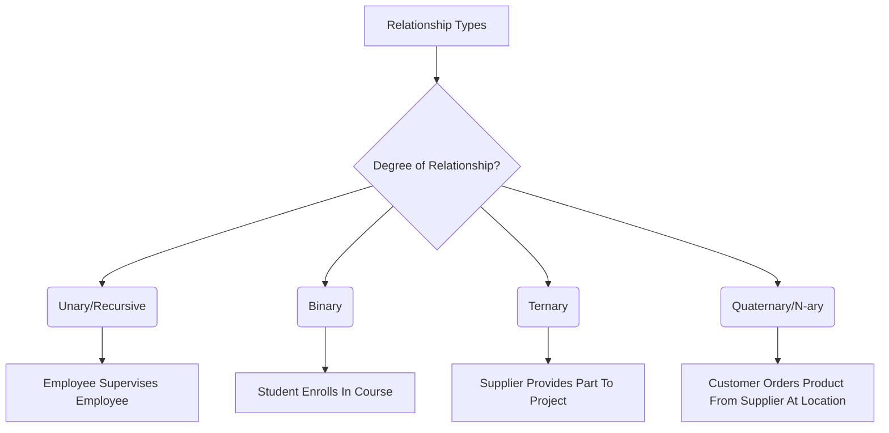

# Definition
Before proceeding, ensure you master [[Entity_Types]] and [[Degree_of_a_Relationship]].
In the Entity-Relationship (ER) Model, a **Relationship Type** is a set of meaningful associations among two or more [[Entity_Types]]. It describes how different entities are connected or interact in the real world. A **Relationship Occurrence** (or instance) is a uniquely identifiable association that includes one occurrence from each participating entity type. For example, `Enrolls_In` is a relationship type between `Student` and `Course` entity types, while "John Doe enrolls in Database Systems" is a relationship occurrence. Think of it as the "verb" that connects the "nouns" (entities) in a sentence, illustrating actions or logical links between them.

# The Mental Model
Imagine you're building a network of roads. The **Relationship Types** are the *kinds* of roads you can build (e.g., "connects," "supervises," "owns"). The towns are your **Entity Types**. When you actually build a specific road between two towns, that's a **Relationship Occurrence**. It's about defining the possible connections between different places.

*Note: This `graph TD` illustrates the classification of Relationship Types by their degree, from Unary to N-ary, with corresponding examples.*

# Context & Framework
### The Family Tree
Within the [[Entity_Relationship_ER_Model]], relationship types are crucial for defining how [[Entity_Types]] interact. They are classified primarily by their [[Degree_of_a_Relationship]], which refers to the number of participating entity types. This classification includes unary (or [[Recursive_Relationship]]s), binary, ternary, and n-ary relationships. Additionally, relationships can possess their own [[Attributes_in_ER_Model]], especially in complex scenarios where the association itself holds descriptive properties. Correctly identifying relationship types and their characteristics is essential for accurately modeling business rules.

# The Mastery Deep Dive
### Opening the Hood: What's Inside?
Relationship types are characterized by:
*   **Participating Entity Types**: The specific entities involved in the association (e.g., `Student` and `Course` in `Enrolls_In`).
*   **Degree**: The number of entity types participating in the relationship. This is a critical property covered in [[Degree_of_a_Relationship]].
*   **Role Names**: Labels given to each participating entity type, indicating the part it plays in the relationship. For example, in a `Supervises` relationship between `Employee` and `Employee`, one `Employee` might play the role of `Supervisor` and the other, `Supervisee`.
*   **Attributes (Optional)**: In some cases, a relationship itself might have attributes that describe the association. For example, `Enrollment_Date` could be an attribute of the `Enrolls_In` relationship.
These components collectively define the nature and characteristics of how entities are linked.

### The Translator: From "Lego" to "Jargon"
The simple idea of "how things connect" (Lego) gets formalized into `Relationship Types` (Jargon). When we talk about "how many different kinds of things are involved in this connection" (Lego), we are translating that into the `Degree of a Relationship` (Jargon). Furthermore, specifying "what role each thing plays in the connection" (Lego) becomes `Role Names` (Jargon). This precise vocabulary eliminates ambiguity in database design.

# Constraints & Limitations
### The Hard Choice: Option A or Option B?
A common design dilemma is whether a complex many-to-many relationship should be modeled directly (as a relationship with attributes) or as an **associative entity** (also known as a composite entity). For example, `Student_Takes_Course` could be a relationship with `Grade` as an attribute. Alternatively, `Enrollment` could be an entity with `Enrollment_ID`, `Grade`, and foreign keys to `Student` and `Course`. The trade-off involves **simplicity for direct relationships** (recursive foreign key) versus **expandability** (separate entity). A direct relationship is simpler but can become cumbersome if the relationship itself needs to participate in further relationships. An associative entity offers greater flexibility for future expansions but adds a layer of complexity to the model.

# Significance & Application
Understanding Relationship Types is academically significant as it clarifies how data integrity is maintained through inter-entity connections and introduces the concept of structural constraints. In the real world, it is a core skill for **Data Architects** and **Business Intelligence Developers**. It is applied in designing any complex information system, from social networks (e.g., `User` `Friends` `User`) to supply chain management (e.g., `Supplier` `Supplies` `Product`) to correctly identifying and modeling relationship types ensures that the database accurately reflects the operational dynamics and business rules of an organization.

# The Worked Example
*Test your mastery. Cover the solutions below to test yourself first.*

Consider a simplified online course management system for a university.

### Level 1: The Sanity Check (Verification)
**The Question:** For the university system, identify a relationship type that would exist between `Professor` and `Course`.
> **Solution:** A relationship type would be `Teaches` (or `Instructs`).

### Level 2: The Crucible (Mastery & Edge Cases)
**The Scenario:** A designer models a relationship between `Student` and `Club` as `Joins`. They include `Join_Date` as an attribute of this `Joins` relationship. Later, they realize that a student can be an `Officer` of a club, which also has a `Role_Start_Date` and `Role_End_Date`.
**The Challenge:**
(a) Explain why trying to add `Officer` details (like `Role_Start_Date`) directly as an attribute of the `Joins` relationship is problematic.
(b) Suggest how this complex scenario might be better modeled in an ER diagram, considering `Officer` as a distinct role or type of association.
(c) Describe how the concept of "role names" could be used to clarify a different type of complex relationship involving the `Student` entity.
> **Solution:**
> (a) Trying to add `Officer` details directly as an attribute of the `Joins` relationship is problematic because `Officer` is a distinct, potentially temporary role with its own specific attributes (`Role_Start_Date`, `Role_End_Date`) that don't apply to every `Joins` occurrence. This would lead to null values for most `Joins` relationships and conflate two distinct semantic concepts (joining a club vs. holding a position in a club) into one relationship.
> (b) This complex scenario might be better modeled by creating a **separate relationship type** (e.g., `Holds_Position`) between `Student` and `Club` (or a specific `Club_Position` entity), which would have attributes like `Role_Start_Date` and `Role_End_Date`. Alternatively, if `Officer` has enough unique characteristics, it could be modeled as a **specialized entity type** related to `Student`.
> (c) The concept of "role names" could be used to clarify a [[Recursive_Relationship]] involving the `Student` entity, such as `Mentors` (where `Person A` plays `Mentor` and `Person B` plays `Mentee`). This clearly distinguishes the function each student performs in the self-referencing relationship.

# Key Takeaways
*   Relationship types define meaningful associations between two or more entity types in an ER model.
*   They are characterized by participating entities, degree (number of participating entities), optional role names, and can sometimes possess attributes.
*   Correctly modeling relationship types is vital for representing business rules and ensuring the structural integrity of the database, facilitating clear communication of data interactions.

# Knowledge Graph Connections
| Concept                     | Connection / Relationship                                                                   |
| :
-------------------------- | :
------------------------------------------------------------------------------------------ |
| [[Entity_Relationship_ER_Model]] | This is a fundamental component of the ER model, describing associations between entities.    |
| [[Entity_Types]]            | Relationships define how these core objects or concepts are connected or interact.            |
| [[Degree_of_a_Relationship]] | This is a key characteristic used to classify and understand relationship types.              |
| [[Recursive_Relationship]]  | This is a specific type of relationship where the same entity type participates multiple times. |
| [[Attributes_in_ER_Model]]  | Relationships can sometimes possess their own attributes that describe the association itself. |
---