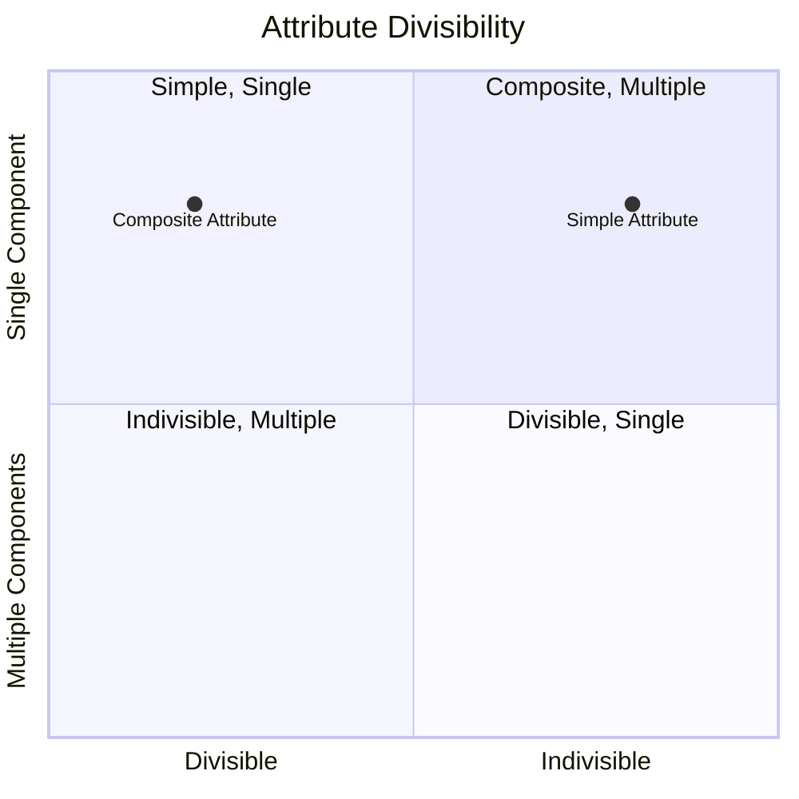

# Definition
Before proceeding, ensure you master [[Composite_Attribute]] and [[Single_Valued_Attribute]].
A **Simple Attribute** is an [[Attributes_in_ER_Model]] that is composed of a **single component** and cannot be further subdivided into smaller, meaningful parts. It possesses an independent existence and represents an atomic piece of information. For example, `StudentID`, `FirstName`, `Age`, or `Salary` are all simple attributes. In a traditional Entity-Relationship (ER) Model, it is typically represented by an oval or ellipse. Think of it as a single word that clearly conveys a distinct piece of information, like "red" for color, or "5" for a quantity, which cannot be broken down further without losing its original meaning.

# The Mental Model
Imagine a single, distinct ingredient in a recipe, like "flour" or "sugar." This is a **Simple Attribute**. You can't break "flour" down into smaller, meaningful cooking ingredients. It's atomic. Contrast this with a "cake mix," which is made of many ingredients (a composite attribute).

*Note: This `quadrantChart` visually differentiates `Simple Attributes` from `Composite Attributes` based on their divisibility and number of components.*

# Context & Framework
### The Family Tree
Within the taxonomy of [[Attributes_in_ER_Model]], the simple attribute stands as the most fundamental, indivisible unit of data. It directly contrasts with a [[Composite_Attribute]], which can be broken down into further simple components. Understanding simple attributes is essential for ensuring that data is stored at its most atomic level, preventing redundancy and facilitating precise querying. This distinction is critical for applying normalization principles later in [[Logical_Database_Design]].

# The Mastery Deep Dive
### Opening the Hood: What's Inside?
The defining characteristic of a simple attribute is its **indivisibility**. It represents the smallest unit of information that is meaningful in the context of the database. When you break down an address into `Street`, `City`, `State`, and `ZipCode`, each of these components would then be considered a simple attribute. Even if an attribute like `PhoneNumber` is stored as a single string, if the business never needs to query its area code or local number separately, it can be modeled as a simple attribute. The determination of whether an attribute is simple or composite is based on the application's requirements for querying and analysis.

### Spot the Impostor: Clarifying that simple attributes cannot be further broken down.
A common "impostor" scenario occurs when an attribute that *could* be broken down is mistakenly treated as simple. For instance, `Full_Name` (e.g., "John Doe") might be modeled as a simple attribute. However, if the application frequently needs to sort by `LastName` or address people by `FirstName`, then `Full_Name` is actually a [[Composite_Attribute]] composed of `FirstName` and `LastName`. The key test is whether any part of the attribute needs to be accessed, updated, or manipulated independently. If so, it's not truly simple.

# Constraints & Limitations
### The Devil's Advocate: Why might this be wrong?
While the ideal is to decompose attributes into their simplest, most atomic forms, sometimes over-decomposition can introduce unnecessary complexity. For instance, breaking down `Street_Address` into `House_Number`, `Street_Name`, `Street_Type` (e.g., "Lane," "Road") might be overly granular if the application never needs to query or validate these sub-components individually. The trade-off is between **absolute atomicity** and **practical usability**. An excessively fine-grained decomposition can increase the number of columns and complicate data entry and querying without providing commensurate benefits.

# Significance & Application
Understanding Simple Attributes is academically significant as it underpins the concept of atomicity, a core principle in database design. In the real world, it's a fundamental skill for **Database Designers** and **Data Modelers**. It is applied in defining the most basic, indivisible data elements in any database table. For example, when designing a customer table, `CustomerID`, `FirstName`, `LastName`, and `Email` would typically be modeled as simple attributes, ensuring that each piece of information is distinct and manageable. Correctly identifying simple attributes ensures data integrity and supports efficient querying.

# The Worked Example
*Test your mastery. Cover the solutions below to test yourself first.*

Consider a database for tracking university courses.

### Level 1: The Sanity Check (Verification)
**The Question:** For a `Course` entity, would `Course_Title` (e.g., "Database Systems") be typically considered a simple attribute?
> **Solution:** Yes, `Course_Title` would typically be considered a simple attribute.

### Level 2: The Crucible (Mastery & Edge Cases)
**The Scenario:** A designer models `Course_Code` (e.g., "CS1241") as a simple attribute of a `Course` entity. However, the university frequently needs to query courses by their `Department_Prefix` (e.g., "CS" for Computer Science) and their `Course_Number` (e.g., "1241").
**The Challenge:**
(a) Based on the given requirement, explain why `Course_Code`, despite appearing simple, should ideally **not** be modeled as a simple attribute.
(b) What type of attribute would `Course_Code` become if it needs to be broken down into `Department_Prefix` and `Course_Number`?
(c) Describe the practical benefits of modeling `Course_Code` in this improved way.
> **Solution:**
> (a) `Course_Code`, despite appearing simple, should ideally **not** be modeled as a simple attribute because the requirement states the university frequently needs to query courses by its `Department_Prefix` and `Course_Number`. This indicates that `Course_Code` is **not atomic** from the application's perspective; its sub-components have independent meaning and are functionally relevant for querying.
> (b) If `Course_Code` needs to be broken down into `Department_Prefix` and `Course_Number`, it would become a [[Composite_Attribute]].
> (c) The practical benefits of modeling `Course_Code` as a composite attribute (or two separate simple attributes, `Department_Prefix` and `Course_Number`) include:
>    *   **Improved Querying:** Users can directly query for all courses offered by a specific department (e.g., `WHERE Department_Prefix = 'CS'`) or all courses with a specific number.
>    *   **Enhanced Data Integrity:** Each component can be validated independently (e.g., `Department_Prefix` against a list of valid departments).
>    *   **Greater Flexibility:** Allows for more granular analysis and reporting without needing complex string manipulation functions.

# Key Takeaways
*   A simple attribute is an indivisible property of an entity or relationship, representing an atomic piece of information.
*   It cannot be further subdivided into smaller, meaningful components, making it the most fundamental unit of data in an ER model.
*   Correctly identifying simple attributes is crucial for achieving data atomicity, ensuring data integrity, and facilitating precise querying and manipulation.

# Knowledge Graph Connections
| Concept                     | Connection / Relationship                                                                   |
| :
-------------------------- | :
------------------------------------------------------------------------------------------ |
| [[Attributes_in_ER_Model]] | This is a specific classification of attributes, representing their indivisible nature.       |
| [[Composite_Attribute]]     | This is the contrasting classification, representing attributes that can be broken down into sub-components. |
| [[Single_Valued_Attribute]] | Simple attributes are often also single-valued, holding one atomic piece of information.      |
| [[Entity_Relationship_ER_Model]] | Simple attributes are elementary components used to describe entities and relationships.      |
| [[Logical_Database_Design]] | The concept of atomicity in simple attributes is fundamental for normalization in this phase. |
---