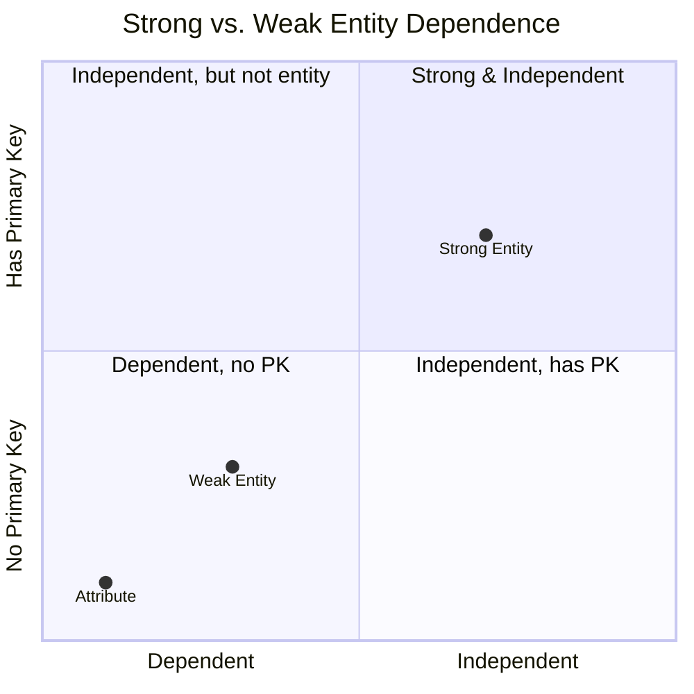

# Definition
Before proceeding, ensure you master [[Weak_Entity_Type]] and [[Primary_Key]].
A **Strong Entity Type** is an entity type that is **not existence-dependent** on some other entity type. This means that an occurrence of a strong entity type can exist independently and does not require another entity for its identification. It always possesses its own unique identifier, known as a [[Primary_Key]]. In an Entity-Relationship (ER) Diagram, a strong entity type is typically represented by a single rectangle. Think of it like a standalone tree in a forest: it can exist and be identified uniquely without needing another tree to support its existence or identify it.

# The Mental Model
Imagine a **Strong Entity Type** as a sovereign nation. It has its own borders, government, and unique identity (its **Primary Key**). It doesn't rely on any other nation for its existence or its fundamental identity. It can interact with other nations, but its core being is independent.

*Note: This `quadrantChart` visually differentiates Strong and Weak Entity Types based on their independence and primary key ownership.*

# Context & Framework
### The Family Tree
Within the broader classification of [[Entity_Types]], the strong entity type serves as the anchor. It is the fundamental building block upon which other, less independent entities might rely. A strong entity is always identifiable by its own unique attributes, specifically its [[Primary_Key]], which may be composed of one or more [[Simple_Attribute]]s or [[Composite_Attribute]]s. Understanding strong entities is crucial before grasping [[Weak_Entity_Type]]s, which are defined by their dependence on strong entities.

# The Mastery Deep Dive
### Opening the Hood: What's Inside?
The key characteristic of a strong entity type is its **self-sufficiency in identification**. It possesses a set of attributes that, in combination, can uniquely identify each occurrence (instance) of that entity type, without needing to borrow or inherit identifiers from another entity. This unique identifier is then chosen as its [[Primary_Key]]. For instance, a `Student` entity typically has a `StudentID` as its primary key. The student can exist and be uniquely identified even if they are not currently enrolled in any course or associated with a specific department.

### Spot the Impostor: Clarifying the independent nature of strong entities and their unique identification.
A common mistake is to confuse a strong entity with one that merely participates in a relationship. While strong entities participate in relationships, their *existence* and *identification* are not dependent on those relationships. The "impostor" scenario involves an entity that appears strong but whose primary key actually includes or depends on the primary key of another entity. For example, if `Department` required `CompanyID` as part of its primary key, `Department` would not be considered a purely strong entity if `CompanyID` is the primary key of a `Company` entity, as it would exhibit [[Weak_Entity_Type]] characteristics. A truly strong entity's primary key is intrinsically unique to itself.

# Constraints & Limitations
### The Devil's Advocate: Why might this be wrong?
While the concept of a strong entity emphasizes independence, in complex real-world scenarios, true "absolute" independence can be debated. For example, an `Employee` entity might be considered strong, but in a multinational corporation, `EmployeeID` might only be unique within a `CompanyID`. This suggests a subtle dependency on the `Company` entity, blurring the lines of absolute strength. The trade-off is often between a theoretically pure model of strong entities and a pragmatic approach that acknowledges some contextual dependencies, which might be better handled by a [[Weak_Entity_Type]] or through composite primary keys.

# Significance & Application
Understanding Strong Entity Types is academically significant as it provides the foundational concept for modeling independent objects in a database. In the real world, it is fundamental for **Database Designers** and **Data Modelers**. It is applied when identifying the core, self-contained components of any system, such as `Customers`, `Products`, `Employees`, or `Orders`. Properly identifying strong entities ensures that the most stable and independently identifiable data elements are correctly structured, forming a reliable backbone for the entire database.

# The Worked Example
*Test your mastery. Cover the solutions below to test yourself first.*

Consider a simplified database for a music streaming service.

### Level 1: The Sanity Check (Verification)
**The Question:** For the music streaming service, would `Artist` be considered a strong entity type?
> **Solution:** Yes, `Artist` would be considered a strong entity type.

### Level 2: The Crucible (Mastery & Edge Cases)
**The Scenario:** A designer models `Album` as an entity. They propose that an `Album` can be uniquely identified by its `AlbumTitle` alone, even if different artists could potentially have albums with the same title.
**The Challenge:**
(a) Based on the definition of a strong entity type, explain why `AlbumTitle` alone is likely **not** a suitable primary key for `Album` in this scenario.
(b) Suggest how `Album` could be designed to act as a strong entity type, ensuring its unique identification even with duplicate titles.
(c) Describe a scenario where `Album` might legitimately be modeled as a [[Weak_Entity_Type]] and how its identification would change.
> **Solution:**
> (a) `AlbumTitle` alone is likely not a suitable primary key because a strong entity type **must have a unique identifier (primary key)** that uniquely identifies each occurrence. If different artists can have albums with the same title (e.g., two different bands both release an album called "Greatest Hits"), then `AlbumTitle` by itself cannot uniquely identify a specific `Album` occurrence.
> (b) `Album` could be designed to act as a strong entity type by assigning it an **Album_ID (a unique identifier generated by the system)** as its primary key. Alternatively, a composite primary key consisting of `AlbumTitle` combined with the Artist_ID (primary key of the `Artist` entity) would ensure uniqueness, though this would imply a strong dependency on `Artist` for identification, making it less "purely" strong in some contexts. The system-generated `Album_ID` is often preferred for true strong entity status.
> (c) `Album` might legitimately be modeled as a [[Weak_Entity_Type]] if it were considered existence-dependent on an `Artist` and its primary key *always* relied on the `Artist_ID` combined with a discriminator like `AlbumTitle` or `ReleaseYear` to uniquely identify it. In this case, `Album` would not have an independent `Album_ID` of its own, and its full identification would be through the `Artist` entity.

# Key Takeaways
*   A strong entity type is not existence-dependent on other entities and possesses its own unique primary key for identification.
*   It serves as a fundamental, independent building block in an ER model, forming the basis for relationships with other entities.
*   Correctly identifying strong entities is crucial for ensuring the stability and unique identifiability of core data elements within a database.

# Knowledge Graph Connections
| Concept                     | Connection / Relationship                                                                   |
| :
-------------------------- | :
------------------------------------------------------------------------------------------ |
| [[Entity_Types]]            | This is a specific classification of entity types based on their independence.                |
| [[Weak_Entity_Type]]        | This is the contrasting classification, representing entities that are existence-dependent.   |
| [[Primary_Key]]             | This is an essential component of a strong entity type, ensuring its unique identification.   |
| [[Attributes_in_ER_Model]]  | Strong entities possess attributes that form their primary key.                               |
| [[Entity_Relationship_ER_Model]] | Strong entities are the core independent components represented in ER diagrams.              |
---